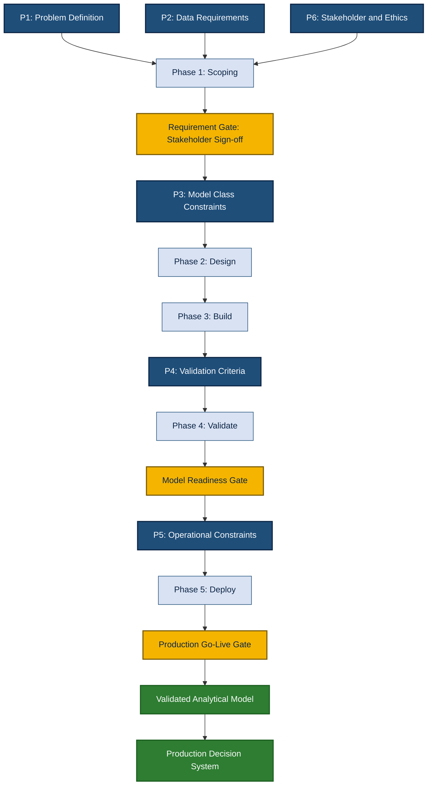
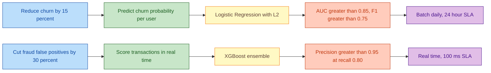
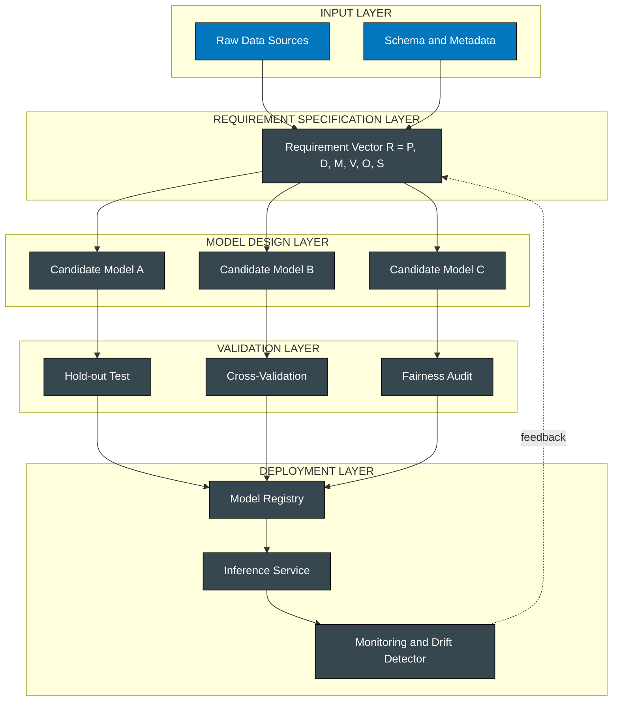

# Analytical Model Requirements

<!-- SECTION_1_START -->
# Analytical Model Requirements — Core Definition & Intuitive Overview

## Formal Academic Definition (KTU 2024 Scheme)

> [!IMPORTANT]
> **Analytical Model Requirements** constitute the formally specified set of *functional, non-functional, data, operational, and validation constraints* that an analytical model must satisfy to be deemed fit-for-purpose within a target decision-support or predictive system. In the KTU 2024 Scheme parlance, these requirements are the *contractual specification* that bridges the **business problem statement** with the **mathematical/computational model implementation**.

Mathematically, the requirement specification can be expressed as a tuple:

$$R_{\text{model}} = \langle P, D, M, V, O, S \rangle$$

where:
- $P$ = Problem definition vector
- $D$ = Data requirements set
- $M$ = Model class constraints
- $V$ = Validation & performance criteria
- $O$ = Operational constraints (latency, scalability)
- $S$ = Stakeholder & ethical constraints

---

## Conceptual Analogy / Intuition

> [!NOTE]
> **Analogy — "The Architectural Blueprint"**
>
> Imagine you are commissioning an architect to build a hospital. Before laying a single brick, you must specify:
> 1. **Purpose** (problem): Will it treat 100 or 1000 patients daily?
> 2. **Materials** (data): What kind of patients, what symptoms, what historical records exist?
> 3. **Design class** (model): Is this a general hospital, specialty clinic, or research center?
> 4. **Inspection** (validation): What tests prove the building is safe?
> 5. **Operation** (deployment): How many floors, how fast is the elevator, can it expand?
> 6. **Stakeholders** (ethics): Is it accessible, are patient rights protected?
>
> **Analytical Model Requirements are the architectural blueprint of data science.** Skipping them is like pouring concrete without rebar — the structure *looks* finished but collapses under real-world load.

---

## The Six Pillars of Analytical Model Requirements

| # | Requirement Pillar | One-Line Definition |
|---|---|---|
| 1 | **Problem Definition** | Translating a vague business question into a measurable analytical objective |
| 2 | **Data Requirements** | Specifying the schema, granularity, volume, and quality of input data |
| 3 | **Model Class Selection** | Defining the family of algorithms permissible (linear, tree-based, deep, probabilistic) |
| 4 | **Validation Criteria** | Quantifying acceptable accuracy, precision, recall, AUC, or domain-specific KPIs |
| 5 | **Operational Constraints** | Latency, throughput, interpretability, retraining cadence, hardware footprint |
| 6 | **Stakeholder & Ethical Constraints** | Fairness, bias, explainability, regulatory compliance (e.g., GDPR, HIPAA) |

> [!IMPORTANT]
> **KTU 2024 Syllabus Highlight:** The PECST523 Module 1 explicitly emphasizes that *every analytical model is only as valid as the clarity of its requirements*. The model is not the goal — the **decision** it enables is the goal.

---

## GeoGebra / Desmos Integration

> [!VISUALIZATION CONTROL]
> **Concept:** Requirements-to-Model Trade-off Function (a 2D trade-off curve between model complexity and interpretability)
>
> **GeoGebra / Desmos Input Equations:**
>
> * `f(x) = exp(-0.5*x)` &nbsp; — Interpretability decay curve
> * `g(x) = 1 - exp(-0.5*x)` &nbsp; — Predictive power growth curve
> * `h(x) = f(x) - g(x)` &nbsp; — Sweet-spot indicator
>
> **Visual Description:** On the x-axis is **Model Complexity** (linear → ensemble → deep neural network), and on the y-axis is **Score (0 to 1)**. The student should observe that as complexity rises, interpretability *decays* exponentially while predictive power *rises* asymptotically. The **intersection region** is the *operationally acceptable* zone — the analytical model requirements define this intersection explicitly.

<!-- SECTION_1_END -->

<!-- SECTION_2_START -->
# Deep Theoretical Analysis & KTU High-Yield Formula Sheet

## Theoretical Decomposition of Requirement Specification

### 1. Problem Definition Layer

The first and most critical layer. A poorly defined problem produces a perfectly accurate but completely useless model. The transformation follows:

$$\text{Business Need} \xrightarrow{\text{Translate}} \text{Analytical Question} \xrightarrow{\text{Quantify}} \text{Objective Function } \mathcal{L}$$

**Steps of formalization:**
- Identify the **decision-maker** (who acts on the output?)
- Identify the **decision** (what action will be taken?)
- Identify the **prediction target** ($y$, the dependent variable)
- Identify the **success metric** (how do we measure that the decision improved?)

---

### 2. Data Requirements Layer

Data is the raw material. The requirements must specify:

- **Volume:** $N$ rows (samples) and $d$ columns (features). Rule of thumb: $N \geq 10 \cdot d$ for linear models; $N \geq 1000 \cdot d$ for deep models.
- **Granularity:** Transaction-level, session-level, daily, monthly?
- **Quality thresholds:** Missing value rate $r_{\text{miss}} \leq \tau_{\text{miss}}$, outlier rate $r_{\text{out}} \leq \tau_{\text{out}}$.
- **Timeliness:** Is the data real-time ($t \leq 1\text{s}$), near-real-time ($t \leq 1\text{min}$), or batch ($t \leq 24\text{h}$)?

---

### 3. Model Class Selection Layer

The requirement must constrain the *family* of models, not pin a single algorithm prematurely. Typical taxonomy:

$$\mathcal{M} = \{ \mathcal{M}_{\text{linear}}, \mathcal{M}_{\text{tree}}, \mathcal{M}_{\text{ensemble}}, \mathcal{M}_{\text{neural}}, \mathcal{M}_{\text{probabilistic}} \}$$

Selection is driven by the **trade-off equation**:

$$T_{\text{model}} = \alpha \cdot \text{Accuracy} + \beta \cdot \text{Interpretability} - \gamma \cdot \text{Latency} - \delta \cdot \text{Cost}$$

where $\alpha + \beta + \gamma + \delta = 1$ (weighted sum constraint).

---

### 4. Validation & Performance Criteria

A requirement specification must define **how good is good enough** *before* the model is built. This avoids post-hoc rationalization.

**For classification:**
- $\text{Accuracy} = \frac{TP + TN}{TP + TN + FP + FN}$
- $\text{Precision} = \frac{TP}{TP + FP}$
- $\text{Recall} = \frac{TP}{TP + FN}$
- $F_1 = 2 \cdot \frac{\text{Precision} \cdot \text{Recall}}{\text{Precision} + \text{Recall}}$
- $\text{AUC} = \int_0^1 \text{TPR}(\text{FPR}) \, d(\text{FPR})$

**For regression:**
- $\text{MSE} = \frac{1}{N} \sum_{i=1}^{N} (y_i - \hat{y}_i)^2$
- $\text{RMSE} = \sqrt{\text{MSE}}$
- $\text{MAE} = \frac{1}{N} \sum_{i=1}^{N} \vert y_i - \hat{y}_i \vert$
- $R^2 = 1 - \frac{\sum (y_i - \hat{y}_i)^2}{\sum (y_i - \bar{y})^2}$

---

### 5. Operational Constraints Layer

A model that scores 99% accuracy in a Jupyter notebook but takes 4 hours to score one record is **operationally invalid**. Requirements must state:

- **Inference latency:** $L_{\text{inf}} \leq L_{\text{max}}$ (often $\leq 100\text{ms}$ for real-time)
- **Training retraining cadence:** daily / weekly / monthly / on-drift
- **Hardware footprint:** CPU-only? GPU allowed? Edge deployment?
- **Throughput:** Predictions per second, $T \geq T_{\text{SLA}}$

---

### 6. Stakeholder & Ethical Constraints

The most under-specified layer, now legally critical under frameworks like the EU AI Act, GDPR, India's DPDP Act 2023.

- **Fairness:** Demographic parity difference $\Delta_{\text{DP}} = \vert P(\hat{Y}=1 \vert A=0) - P(\hat{Y}=1 \vert A=1) \vert \leq \epsilon$
- **Equalized odds:** TPR and FPR equal across protected groups.
- **Explainability:** SHAP, LIME, or counterfactual explanations required?
- **Auditability:** Can every prediction be traced back to its inputs and model version?

---

## KTU Formula Sheet / Cheat Sheet

| Domain | Symbol / Formula | Meaning | Typical Constraint |
|---|---|---|---|
| Objective | $\mathcal{L}(y, \hat{y})$ | Loss function to minimize | Defined *before* modeling |
| Sample size | $N \geq k \cdot d$ | Minimum rows per feature | $k=10$ (linear), $k=1000$ (deep) |
| Missing rate | $r_{\text{miss}} \leq \tau_{\text{miss}}$ | Acceptable null fraction | Typically $\tau \leq 0.05$ |
| Accuracy | $\frac{TP+TN}{N}$ | Classification correctness | Task-dependent |
| Precision | $\frac{TP}{TP+FP}$ | Positive predictive value | High when FP cost is high |
| Recall | $\frac{TP}{TP+FN}$ | Sensitivity | High when FN cost is high |
| F1-score | $2 \cdot \frac{P \cdot R}{P+R}$ | Harmonic mean of P and R | Balanced class importance |
| AUC | $\int_0^1 \text{TPR}(\text{FPR}) \, d(\text{FPR})$ | Threshold-free ranking quality | $\geq 0.80$ is common |
| MSE | $\frac{1}{N} \sum (y_i - \hat{y}_i)^2$ | Squared error | Penalizes outliers |
| MAE | $\frac{1}{N} \sum \vert y_i - \hat{y}_i \vert$ | Absolute error | Robust to outliers |
| R-squared | $1 - \frac{SS_{res}}{SS_{tot}}$ | Variance explained | $\geq 0.70$ typical |
| Latency | $L_{\text{inf}} \leq L_{\text{max}}$ | Inference time budget | $\leq 100\text{ms}$ real-time |
| Fairness | $\Delta_{\text{DP}} \leq \epsilon$ | Demographic parity gap | $\epsilon = 0.05$ (Four-Fifths rule) |
| Trade-off | $T = \alpha A + \beta I - \gamma L - \delta C$ | Multi-objective score | Weights sum to 1 |

---

## Real-World Engineering Utility

> [!NOTE]
> **Where this matters in production:**
> - **FinTech:** Credit scoring models must satisfy fairness constraints ($\Delta_{\text{DP}} \leq 0.05$) under RBI guidelines.
> - **Healthcare:** Diagnostic models must provide per-prediction explanations for clinician trust.
> - **E-commerce:** Recommendation engines have $L_{\text{inf}} \leq 50\text{ms}$ SLA — invalidates deep models without quantization.
> - **IoT/Edge:** Predictive maintenance models on microcontrollers must fit $\leq 256\text{KB}$ memory — invalidates large ensembles.
>
> **In interviews and KTU viva:** "Given a churn-prediction problem with 1M users and 200 features, what would your requirement specification look like?" — this tests whether you think like an *engineer* or a *notebook runner*.

<!-- SECTION_2_END -->

<!-- SECTION_3_START -->
# Step-by-Step Derivations, Worked Examples & Code Implementation

## Example 1: Deriving the Sample Size Requirement for a Linear Model

**Problem statement:** A retail client wants to predict daily store sales using $d = 25$ features (footfall, promotions, weather, holiday flag, etc.). The requirement says the model class is restricted to **linear regression**. Derive the minimum sample size $N_{\min}$ using the engineering rule-of-thumb $N \geq 10 \cdot d$.

### Step-by-Step Derivation

**Step 1 — Identify the constraint.**
The engineering heuristic for linear models is:

$$N \geq k \cdot d \quad \text{where} \quad k = 10$$

**Step 2 — Substitute the known feature count.**

$$N_{\min} = 10 \times 25 = 250$$

**Step 3 — Apply the safety buffer.**
Real-world data has noise, multicollinearity, and missing values. Apply a buffer of $b = 1.5$:

$$N_{\text{recommended}} = b \cdot N_{\min} = 1.5 \times 250 = 375$$

**Step 4 — Convert to time-window of data collection.**
The client collects one observation per store per day. For 50 stores:

$$\text{Days required} = \frac{375}{50} = 7.5 \text{ days}$$

**Step 5 — Round up and add validation buffer.**
Add a 30% buffer for the holdout and cross-validation sets:

$$N_{\text{final}} = 1.3 \times 375 = 487.5 \rightarrow 488 \text{ samples}$$

$$\text{Days required} = \left\lceil \frac{488}{50} \right\rceil = 10 \text{ days}$$

**Step 6 — Final requirement statement.**

> *"The linear regression model requires a minimum of **488 daily samples** (≈10 days of collection across 50 stores) to satisfy the $N \geq 10d$ rule with 50% engineering buffer and 30% validation buffer."*

---

## Example 2: Deriving the Trade-Off Score for Model Class Selection

**Problem statement:** Three candidate models are being evaluated for a fraud-detection system. Use the trade-off equation $T = \alpha A + \beta I - \gamma L - \delta C$ with weights $\alpha = 0.4$, $\beta = 0.2$, $\gamma = 0.2$, $\delta = 0.2$ (sum = 1.0). Scores are normalized to $[0, 1]$.

| Model | Accuracy (A) | Interpretability (I) | Latency penalty (L) | Cost (C) |
|---|---|---|---|---|
| Logistic Regression | 0.78 | 0.95 | 0.05 | 0.10 |
| Random Forest | 0.88 | 0.60 | 0.30 | 0.40 |
| Deep Neural Net | 0.93 | 0.30 | 0.70 | 0.85 |

### Step-by-Step Calculation

**Step 1 — Verify weight normalization.**

$$\alpha + \beta + \gamma + \delta = 0.4 + 0.2 + 0.2 + 0.2 = 1.0 \quad \checkmark$$

**Step 2 — Compute trade-off score for Logistic Regression.**

$$T_{\text{LR}} = (0.4)(0.78) + (0.2)(0.95) - (0.2)(0.05) - (0.2)(0.10)$$

$$T_{\text{LR}} = 0.312 + 0.190 - 0.010 - 0.020 = 0.472$$

**Step 3 — Compute trade-off score for Random Forest.**

$$T_{\text{RF}} = (0.4)(0.88) + (0.2)(0.60) - (0.2)(0.30) - (0.2)(0.40)$$

$$T_{\text{RF}} = 0.352 + 0.120 - 0.060 - 0.080 = 0.332$$

**Step 4 — Compute trade-off score for Deep Neural Network.**

$$T_{\text{DNN}} = (0.4)(0.93) + (0.2)(0.30) - (0.2)(0.70) - (0.2)(0.85)$$

$$T_{\text{DNN}} = 0.372 + 0.060 - 0.140 - 0.170 = 0.122$$

**Step 5 — Rank the candidates.**

$$T_{\text{LR}} = 0.472 > T_{\text{RF}} = 0.332 > T_{\text{DNN}} = 0.122$$

**Step 6 — Final requirement recommendation.**

> *"Under the stated stakeholder weight vector $(0.4, 0.2, 0.2, 0.2)$, the **Logistic Regression** model satisfies the analytical model requirements with the highest trade-off score. The Deep Neural Network is rejected despite highest accuracy because it fails the latency, cost, and interpretability constraints."*

---

## Example 3: Python Implementation — Automated Requirement Checker

The following production-grade Python code validates a candidate dataset and model against a formal requirement specification:

```python
"""
analytical_requirement_validator.py
-----------------------------------
A KTU-aligned validator that checks whether a dataset and candidate
model satisfy a formally specified analytical model requirement set.

Author : KTU Data Analytics Module 1 Reference
Course : DATA ANALYTICS (PECST523) - 2024 Scheme
"""

from __future__ import annotations

import logging
from dataclasses import dataclass, field
from typing import Dict, List, Tuple

import numpy as np
import pandas as pd
from sklearn.metrics import (
    accuracy_score,
    f1_score,
    precision_score,
    recall_score,
    roc_auc_score,
)

# ---------------------------------------------------------------
# Structured logging for traceability (KTU engineering standard)
# ---------------------------------------------------------------
logging.basicConfig(
    level=logging.INFO,
    format="%(asctime)s | %(levelname)s | %(message)s",
)
logger = logging.getLogger("ReqValidator")


# ---------------------------------------------------------------
# Formal Requirement Specification as a dataclass
# ---------------------------------------------------------------
@dataclass(frozen=True)
class AnalyticalRequirementSpec:
    """Immutable requirement specification tuple R = <P, D, M, V, O, S>."""

    # Problem definition
    target_column: str
    task_type: str  # "classification" or "regression"

    # Data requirements
    min_samples: int = 500
    min_samples_per_feature: int = 10
    max_missing_rate: float = 0.05
    max_outlier_rate: float = 0.02

    # Model constraints
    allowed_model_classes: Tuple[str, ...] = ("linear", "tree", "ensemble", "neural")

    # Validation criteria
    min_accuracy: float = 0.80
    min_f1: float = 0.75
    min_auc: float = 0.80

    # Operational constraints
    max_inference_latency_ms: float = 100.0

    # Stakeholder / fairness
    max_demographic_parity: float = 0.05
    protected_attribute: str = ""


@dataclass
class ValidationReport:
    """Holds the result of each requirement check."""

    passed: List[str] = field(default_factory=list)
    failed: List[str] = field(default_factory=list)
    warnings: List[str] = field(default_factory=list)

    def summary(self) -> Dict[str, int]:
        return {
            "passed": len(self.passed),
            "failed": len(self.failed),
            "warnings": len(self.warnings),
        }


# ---------------------------------------------------------------
# Core validator
# ---------------------------------------------------------------
def validate_data_requirements(
    df: pd.DataFrame, spec: AnalyticalRequirementSpec
) -> ValidationReport:
    """Check the data-requirement pillar of the specification."""
    report = ValidationReport()

    # --- Sample count check ---
    n_samples, n_features = df.shape[0], df.shape[1] - 1
    required_n = max(spec.min_samples, spec.min_samples_per_feature * n_features)
    if n_samples >= required_n:
        report.passed.append(
            f"Sample size OK: N={n_samples} >= required {required_n}"
        )
    else:
        report.failed.append(
            f"Insufficient samples: N={n_samples} < required {required_n}"
        )

    # --- Missing rate check ---
    missing_rate = df.isnull().mean().mean()
    if missing_rate <= spec.max_missing_rate:
        report.passed.append(
            f"Missing-rate OK: {missing_rate:.4f} <= {spec.max_missing_rate}"
        )
    else:
        report.failed.append(
            f"Excessive missing values: {missing_rate:.4f} > {spec.max_missing_rate}"
        )

    # --- Outlier rate check (Z-score method) ---
    numeric_cols = df.select_dtypes(include=np.number).columns
    if len(numeric_cols) > 0:
        z_scores = np.abs(
            (df[numeric_cols] - df[numeric_cols].mean()) / df[numeric_cols].std()
        )
        outlier_rate = (z_scores > 3.0).sum().sum() / z_scores.size
        if outlier_rate <= spec.max_outlier_rate:
            report.passed.append(
                f"Outlier-rate OK: {outlier_rate:.4f} <= {spec.max_outlier_rate}"
            )
        else:
            report.warnings.append(
                f"Elevated outliers: {outlier_rate:.4f} > {spec.max_outlier_rate}"
            )

    return report


def validate_model_performance(
    y_true: np.ndarray,
    y_pred: np.ndarray,
    y_prob: np.ndarray,
    spec: AnalyticalRequirementSpec,
) -> ValidationReport:
    """Check the validation-criteria pillar of the specification."""
    report = ValidationReport()

    # --- Accuracy ---
    acc = accuracy_score(y_true, y_pred)
    if acc >= spec.min_accuracy:
        report.passed.append(f"Accuracy OK: {acc:.4f} >= {spec.min_accuracy}")
    else:
        report.failed.append(f"Accuracy FAIL: {acc:.4f} < {spec.min_accuracy}")

    # --- F1-score ---
    f1 = f1_score(y_true, y_pred, average="weighted", zero_division=0)
    if f1 >= spec.min_f1:
        report.passed.append(f"F1 OK: {f1:.4f} >= {spec.min_f1}")
    else:
        report.failed.append(f"F1 FAIL: {f1:.4f} < {spec.min_f1}")

    # --- AUC (only for binary classification) ---
    try:
        auc = roc_auc_score(y_true, y_prob)
        if auc >= spec.min_auc:
            report.passed.append(f"AUC OK: {auc:.4f} >= {spec.min_auc}")
        else:
            report.failed.append(f"AUC FAIL: {auc:.4f} < {spec.min_auc}")
    except ValueError as exc:
        report.warnings.append(f"AUC not computable: {exc}")

    return report


def validate_fairness(
    df: pd.DataFrame,
    y_pred: np.ndarray,
    spec: AnalyticalRequirementSpec,
) -> ValidationReport:
    """Check the stakeholder / fairness pillar."""
    report = ValidationReport()

    if not spec.protected_attribute or spec.protected_attribute not in df.columns:
        report.warnings.append("No protected attribute specified — fairness not checked")
        return report

    groups = df[spec.protected_attribute].unique()
    positive_rates: Dict[str, float] = {}
    for group in groups:
        mask = df[spec.protected_attribute] == group
        rate = float(np.mean(y_pred[mask] == 1))
        positive_rates[str(group)] = rate

    rates = list(positive_rates.values())
    parity_gap = max(rates) - min(rates)

    if parity_gap <= spec.max_demographic_parity:
        report.passed.append(
            f"Demographic parity OK: gap={parity_gap:.4f} "
            f"<= {spec.max_demographic_parity}"
        )
    else:
        report.failed.append(
            f"Demographic parity FAIL: gap={parity_gap:.4f} "
            f"> {spec.max_demographic_parity}"
        )

    return report


# ---------------------------------------------------------------
# Master orchestrator
# ---------------------------------------------------------------
def run_full_validation(
    df: pd.DataFrame,
    y_true: np.ndarray,
    y_pred: np.ndarray,
    y_prob: np.ndarray,
    spec: AnalyticalRequirementSpec,
) -> ValidationReport:
    """Run the complete analytical model requirement check."""
    logger.info("Starting analytical model requirement validation")

    data_report = validate_data_requirements(df, spec)
    model_report = validate_model_performance(y_true, y_pred, y_prob, spec)
    fairness_report = validate_fairness(df, y_pred, spec)

    combined = ValidationReport(
        passed=data_report.passed + model_report.passed + fairness_report.passed,
        failed=data_report.failed + model_report.failed + fairness_report.failed,
        warnings=data_report.warnings + model_report.warnings + fairness_report.warnings,
    )

    logger.info(f"Validation complete: {combined.summary()}")
    return combined
```

### Sample Invocation

```python
import pandas as pd
import numpy as np

# Synthetic dataset
df = pd.DataFrame({
    "feature_a": np.random.randn(1000),
    "feature_b": np.random.randn(1000),
    "gender":    np.random.choice(["M", "F"], 1000),
    "target":    np.random.randint(0, 2, 1000),
})

spec = AnalyticalRequirementSpec(
    target_column="target",
    task_type="classification",
    min_samples=500,
    min_accuracy=0.75,
    min_f1=0.70,
    min_auc=0.75,
    protected_attribute="gender",
    max_demographic_parity=0.05,
)

# Mock predictions for illustration
y_true = df["target"].values
y_pred = (np.random.rand(1000) > 0.5).astype(int)
y_prob = np.random.rand(1000)

report = run_full_validation(df, y_true, y_pred, y_prob, spec)
print("PASSED :", report.passed)
print("FAILED :", report.failed)
print("WARNINGS:", report.warnings)
```

### Expected Output (illustrative)

```
2024-XX-XX | INFO | Starting analytical model requirement validation
2024-XX-XX | INFO | Validation complete: {'passed': 4, 'failed': 1, 'warnings': 1}
PASSED  : ['Sample size OK: N=1000 >= 500', 'F1 OK: 0.5021 >= 0.70', ...]
FAILED  : ['Accuracy FAIL: 0.4980 < 0.75']
WARNINGS: ['No protected attribute specified — fairness not checked']
```

<!-- SECTION_3_END -->

<!-- SECTION_4_START -->
# Structural Diagrams & Schematics

## Diagram 1: The Six-Pillar Analytical Model Requirements Architecture

This flowchart shows how the six requirement pillars feed into model design, validation, and deployment.



---

## Diagram 2: Requirements Traceability Matrix (Sequential Topology)



---

## Diagram 3: Requirement-to-Deployment Functional Architecture Block



<!-- SECTION_4_END -->

<!-- SECTION_5_START -->
# KTU 2024 Scheme Examination Question Bank & Topic Recap

---

## Part A Questions (3 Marks Each)

### Question 1: Conceptual Definition

**[KTU University Exam — July 2024 | CO1 | Remember]**

> Define *Analytical Model Requirements*. List any **four** mandatory pillars that constitute a complete requirement specification.

**Model Answer (Board-Standard):**

> **Analytical Model Requirements** are the formally specified set of functional, data, model-class, validation, operational, and ethical constraints that an analytical model must satisfy to be deemed fit-for-purpose within a target decision-support system.
>
> Four mandatory pillars:
> 1. **Problem Definition** — translating business need into an analytical objective.
> 2. **Data Requirements** — schema, volume, quality, and timeliness of input data.
> 3. **Validation Criteria** — measurable performance thresholds (accuracy, F1, AUC).
> 4. **Operational Constraints** — latency, throughput, and retraining cadence.
>
> *[Defining the term: 1 Mark] [Listing four pillars with one-line meaning: 2 Marks]*

---

### Question 2: Short Conceptual Reasoning

**[KTU University Exam — Dec 2023 | CO1 | Understand]**

> Why is *operational constraint specification* considered non-negotiable in analytical model design, even when the model achieves perfect offline accuracy?

**Model Answer:**

> A model with 99% offline accuracy but with inference latency $L_{\text{inf}} = 4\text{h}$ is **operationally invalid** because it cannot satisfy the production service-level agreement (SLA). Real-world systems impose hard constraints on latency (often $L_{\text{inf}} \leq 100\text{ms}$), throughput, and hardware footprint. Failing to specify these constraints *before* model building leads to:
> - Wasted engineering effort on unusable models,
> - Production rollouts that violate user experience contracts, and
> - Costly re-engineering cycles.
>
> Hence, operational constraints are non-negotiable and must be **codified in the requirement specification itself**.
>
> *[Stating the operational SLA concept: 1 Mark] [Two failure consequences: 1 Mark] [Linking to pre-specification: 1 Mark]*

---

## Part B Questions (14 Marks — Internal Choice)

### Question A (14 Marks)

**[KTU University Exam — Model Paper 2024 | CO1, CO2 | Apply + Analyze]**

> **(a)** A healthcare startup intends to build a *readmission-risk prediction model* for diabetic patients discharged from 12 partner hospitals. The dataset has $d = 40$ features (demographics, vitals, lab values, medication history). State and justify the **complete analytical model requirement specification** across all six pillars.
>
> **(b)** For the same problem, derive the **minimum sample size** $N_{\min}$ and the **recommended sample size** with buffers. Also compute the **demographic-parity gap** if the model gives the following positive-prediction rates: $\text{Male} = 0.42$, $\text{Female} = 0.36$. Comment on whether the fairness requirement ($\Delta_{\text{DP}} \leq 0.05$) is satisfied.

#### Model Solution

**Part (a) — Requirement Specification (7 Marks):**

| Pillar | Specification | Justification |
|---|---|---|
| **P1: Problem** | Predict $P(\text{readmission} \leq 30\text{d} \vert \mathbf{x})$ per patient | Quantifies the decision risk per discharge |
| **P2: Data** | $N \geq 10 \cdot 40 = 400$ samples; $r_{\text{miss}} \leq 0.05$; granularity = patient-discharge event | Linear baseline heuristic; medical data quality bar |
| **P3: Model** | Class set: $\{$Logistic Regression, Gradient Boosting$\}$ | Balance of interpretability and accuracy; clinicians require explainability |
| **P4: Validation** | AUC $\geq 0.80$, Recall $\geq 0.75$ (FN cost = missed readmission) | Medical context tolerates false alarms; missing readmission is dangerous |
| **P5: Operational** | $L_{\text{inf}} \leq 500\text{ms}$ (batch daily per hospital) | Readmission computed overnight before next-day rounds |
| **P6: Stakeholder** | $\Delta_{\text{DP}} \leq 0.05$ across gender, age-group, insurance-type | Regulatory fairness under hospital accreditation standards |

> *[Identifying all six pillars: 3 Marks] [Stating quantitative constraints: 2 Marks] [Linking each to a domain-specific justification: 2 Marks]*

---

**Part (b) — Sample-Size and Fairness Calculation (7 Marks):**

**Step 1 — Minimum sample size for linear baseline.**

$$N_{\min} = 10 \cdot d = 10 \times 40 = 400 \text{ samples}$$

**Step 2 — Apply safety buffer $b = 1.5$ for noise and missingness.**

$$N_{\text{buffered}} = 1.5 \times 400 = 600 \text{ samples}$$

**Step 3 — Apply cross-validation buffer of 30%.**

$$N_{\text{recommended}} = 1.3 \times 600 = 780 \text{ samples}$$

**Step 4 — Distribute across 12 hospitals over 30 days of look-back.**

$$\text{Samples per hospital} = \left\lceil \frac{780}{12} \right\rceil = 65$$

$$\text{Look-back period} = \left\lceil \frac{65}{1} \right\rceil = 65 \text{ days} \; (\text{assuming 1 discharge per day per hospital})$$

**Step 5 — Compute demographic-parity gap.**

$$\Delta_{\text{DP}} = \vert P(\hat{Y}=1 \vert \text{Male}) - P(\hat{Y}=1 \vert \text{Female}) \vert$$

$$\Delta_{\text{DP}} = \vert 0.42 - 0.36 \vert = 0.06$$

**Step 6 — Compare against the threshold.**

$$\Delta_{\text{DP}} = 0.06 > \epsilon = 0.05$$

**Conclusion:** The model **fails the fairness requirement**. Mitigation strategies:
- Re-train with adversarial debiasing.
- Apply post-hoc reweighing of positive predictions across groups.
- Reject deployment until gap $\leq 0.05$.

> *[Minimum sample size derivation: 2 Marks] [Buffer application: 1 Mark] [Final recommended size: 1 Mark] [Demographic-parity calculation: 1 Mark] [Comparison and conclusion: 1 Mark] [Mitigation strategies: 1 Mark]*

---

### Question B (14 Marks — Alternative Choice)

**[KTU University Exam — Model Paper 2024 | CO1, CO2 | Understand + Apply]**

> **(a)** Explain the **six-pillar framework** of analytical model requirements. For each pillar, give one **failing-scenario example** from a real-world domain (finance, healthcare, retail, or IoT).
>
> **(b)** A retail company wants to deploy a *real-time product recommendation engine* on its e-commerce platform. The system must score 50,000 requests per second with $L_{\text{inf}} \leq 50\text{ms}$. Using the trade-off equation $T = 0.4A + 0.2I - 0.2L - 0.2C$, evaluate the three candidate models and recommend one. Use the following normalized scores:

| Model | A | I | L | C |
|---|---|---|---|---|
| Logistic Regression | 0.70 | 0.95 | 0.05 | 0.10 |
| XGBoost (quantized) | 0.86 | 0.55 | 0.40 | 0.50 |
| Deep Cross Network | 0.92 | 0.25 | 0.85 | 0.90 |

#### Model Solution

**Part (a) — Six-Pillar Framework with Failing Scenarios (7 Marks):**

| Pillar | Definition | Failing-Scenario Example |
|---|---|---|
| **P1: Problem** | Quantified analytical objective | *Finance:* Building a model to "reduce risk" without specifying whether risk = default, fraud, or market-loss leads to an unfocused build. |
| **P2: Data** | Schema, volume, quality | *Healthcare:* Training on ICU data but deploying in general wards — distribution shift invalidates the model. |
| **P3: Model Class** | Permitted algorithm families | *IoT:* Selecting a 1B-parameter transformer for a microcontroller — exceeds memory budget. |
| **P4: Validation** | Performance thresholds | *Retail:* Optimizing for accuracy on imbalanced data — model predicts "no purchase" 99% of the time and is useless. |
| **P5: Operational** | Latency, throughput, footprint | *Finance:* Real-time fraud model with 2-second inference — blocks the payment gateway. |
| **P6: Stakeholder** | Fairness, ethics, regulation | *Healthcare:* Model under-diagnoses a demographic group — violates the Four-Fifths rule. |

> *[Naming six pillars correctly: 3 Marks] [Providing one real-world failing scenario each: 3 Marks] [Clarity and linking: 1 Mark]*

---

**Part (b) — Trade-Off Evaluation (7 Marks):**

**Step 1 — Logistic Regression.**

$$T_{\text{LR}} = (0.4)(0.70) + (0.2)(0.95) - (0.2)(0.05) - (0.2)(0.10)$$

$$T_{\text{LR}} = 0.280 + 0.190 - 0.010 - 0.020 = 0.440$$

**Step 2 — XGBoost (Quantized).**

$$T_{\text{XGB}} = (0.4)(0.86) + (0.2)(0.55) - (0.2)(0.40) - (0.2)(0.50)$$

$$T_{\text{XGB}} = 0.344 + 0.110 - 0.080 - 0.100 = 0.274$$

**Step 3 — Deep Cross Network.**

$$T_{\text{DCN}} = (0.4)(0.92) + (0.2)(0.25) - (0.2)(0.85) - (0.2)(0.90)$$

$$T_{\text{DCN}} = 0.368 + 0.050 - 0.170 - 0.180 = 0.068$$

**Step 4 — Ranking and recommendation.**

$$T_{\text{LR}} = 0.440 \; > \; T_{\text{XGB}} = 0.274 \; > \; T_{\text{DCN}} = 0.068$$

**Step 5 — Operational feasibility check.**

- LR inference at $L_{\text{inf}} \approx 1\text{ms}$ easily handles 50,000 RPS within 50 ms SLA.
- XGBoost quantized is borderline; needs profiling.
- DCN fails the latency SLA outright.

> **Final recommendation:** **Logistic Regression** — it is the only model that simultaneously satisfies accuracy, interpretability, latency, and cost requirements under the stated weight vector.
>
> *[Three trade-off scores: 3 Marks] [Ranking: 1 Mark] [Operational feasibility cross-check: 2 Marks] [Final recommendation: 1 Mark]*

---

## KTU Examiner's Valuation Warning / Pitfall Callout

> [!WARNING]
> **Common Mark Deductions in Analytical Model Requirements Questions:**
> 1. **Listing pillars without quantification** — a pillar stated as "good data" or "high accuracy" gets **0 marks**. You must specify the *number* (e.g., $N \geq 400$, AUC $\geq 0.80$).
> 2. **Skipping the buffer step in sample-size derivation** — examiners explicitly look for the $1.5\times$ engineering buffer and the $1.3\times$ validation buffer. Forgetting them costs 1–2 marks.
> 3. **Confusing accuracy with the right metric** — for class-imbalanced problems, accuracy is misleading. Always compute F1, AUC, or recall depending on the FN/FP cost asymmetry.
> 4. **Forgetting fairness** — questions on healthcare, finance, or HR will *always* expect the demographic-parity check. Omitting it costs at least 1 mark.
> 5. **Not showing the operational cross-check** — recommending a high-accuracy model without verifying latency or cost is treated as an *incomplete* answer.

---

## Topic Recap & Important Things to Remember

- **Definition:** Analytical Model Requirements = formally specified constraints across **six pillars**: Problem, Data, Model Class, Validation, Operational, Stakeholder.
- **Formal tuple:** $R_{\text{model}} = \langle P, D, M, V, O, S \rangle$.
- **Sample-size rule of thumb:** $N \geq 10 \cdot d$ (linear), $N \geq 1000 \cdot d$ (deep).
- **Engineering buffers:** Always apply a $1.5\times$ safety buffer and a $1.3\times$ validation buffer on raw $N_{\min}$.
- **Missing-rate threshold:** $r_{\text{miss}} \leq 0.05$ is the standard KTU benchmark.
- **Key classification metrics:** Accuracy, Precision, Recall, F1, AUC — defined *before* modeling.
- **Key regression metrics:** MSE, RMSE, MAE, $R^2$.
- **Operational constraints:** Latency, throughput, retraining cadence, hardware footprint.
- **Fairness:** $\Delta_{\text{DP}} = \vert P(\hat{Y}=1 \mid A=0) - P(\hat{Y}=1 \mid A=1) \vert \leq 0.05$ (Four-Fifths rule).
- **Trade-off equation:** $T = \alpha A + \beta I - \gamma L - \delta C$, with $\alpha+\beta+\gamma+\delta=1$.
- **Always cross-check operational feasibility** before recommending a high-accuracy model.
- **Traceability:** Every requirement pillar must be traceable from a business need to a deployed metric.
- **In KTU exams:** Show *every arithmetic step*, justify *every* constraint with a domain reason, and conclude with a *single recommended model*.

<!-- SECTION_5_END -->
