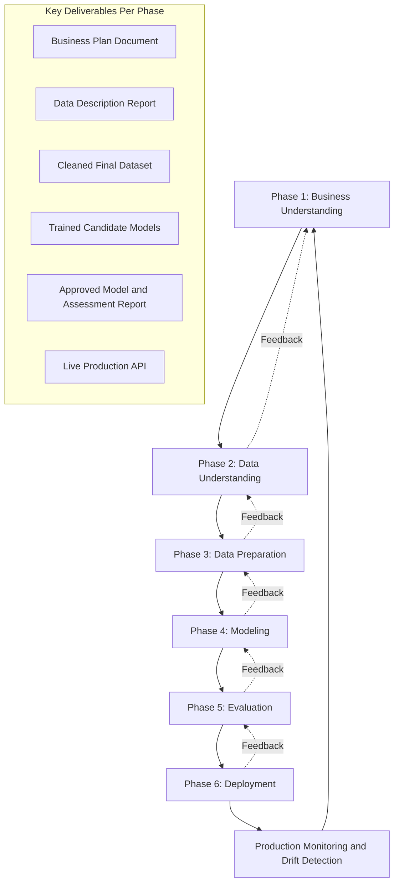
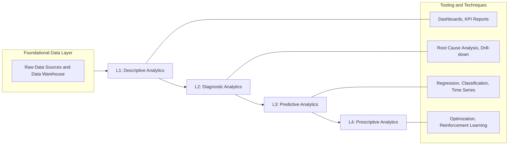
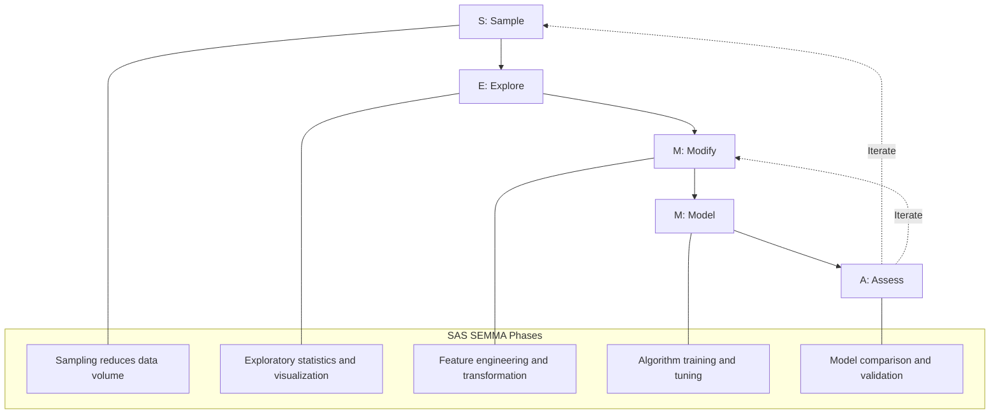
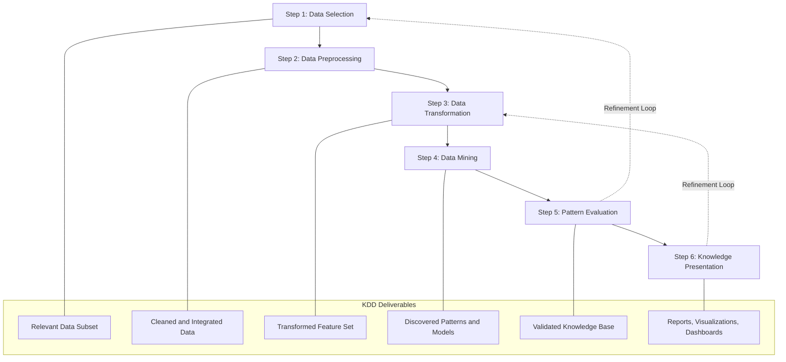
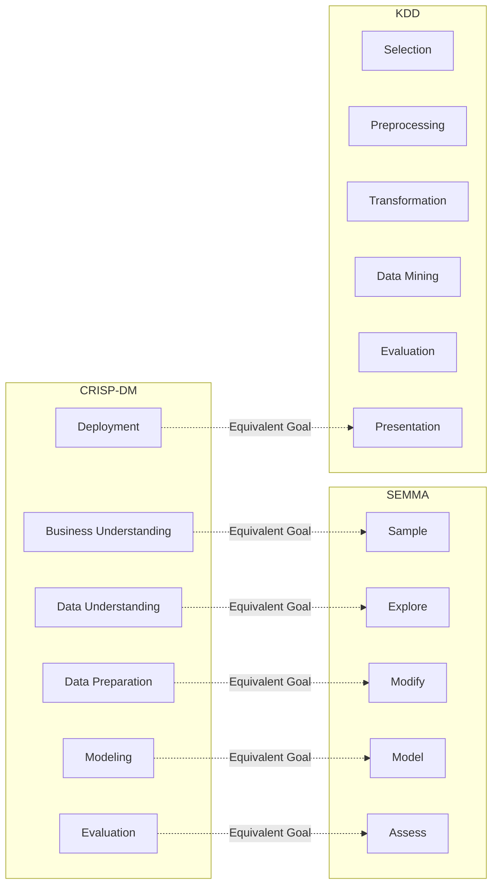

# Analytics Process Model

<!-- SECTION_1_START -->
# Analytics Process Model — Core Foundations

## Formal Academic Definition (KTU 2024 Syllabus Terminology)

An **Analytics Process Model (APM)** is a structured, phased, and iterative framework that defines the standardized sequence of activities, transformations, and decision points required to convert raw, heterogeneous data into actionable business intelligence and predictive insights. It establishes the methodological backbone for executing any data analytics project, ensuring reproducibility, scalability, and alignment with organizational objectives.

In the KTU 2024 *Data Analytics (PECST523)* curriculum, the Analytics Process Model is formally described as a **multi-stage pipeline** that integrates statistical reasoning, computational algorithms, and domain expertise to systematically move from *data acquisition* to *insight deployment*.

> [!IMPORTANT]
> **KTU 2024 Highlight:** The Analytics Process Model is **not a single rigid pipeline** — it is an *iterative and cyclical* framework. Outputs from later phases (e.g., Model Assessment) frequently trigger re-execution of earlier phases (e.g., Data Preparation), making it a closed-loop system rather than a linear one.

## The Four Pillars of Analytics (Prerequisite Hierarchy)

Before understanding the *process*, every KTU student must master the *types* of analytics that the model ultimately aims to deliver.

| Level | Analytics Type | Core Question Answered | Business Value |
|---|---|---|---|
| **L1** | **Descriptive Analytics** | *What happened?* | Historical reporting, dashboards, KPIs |
| **L2** | **Diagnostic Analytics** | *Why did it happen?* | Root cause analysis, drill-down reports |
| **L3** | **Predictive Analytics** | *What will happen?* | Forecasting, risk scoring, classification |
| **L4** | **Prescriptive Analytics** | *What should we do?* | Optimization, recommendation engines, decision automation |

> [!NOTE]
> **Mnemonic:** "**D²P²**" — *Descriptive → Diagnostic → Predictive → Prescriptive*. This hierarchy is a **direct KTU expected answer** for Module 1 short-answer questions.

## Intuitive Analogy — The "Doctor's Diagnosis" Framework

Imagine you visit a **doctor** with persistent headaches. The doctor does NOT immediately prescribe medicine. Instead, she follows a structured process:

1. **Asks questions & takes samples** → *Data Collection / Sample phase*
2. **Orders blood tests & scans** → *Data Exploration & Validation*
3. **Cleans & organizes results** → *Data Preprocessing / Modification*
4. **Diagnoses a probable cause** → *Modeling phase (training algorithms)*
5. **Reviews confidence in diagnosis** → *Model Assessment / Validation*
6. **Prescribes treatment & follow-up** → *Deployment & Monitoring*
7. **Calls you back if symptoms persist** → *Iterative feedback loop*

This is **exactly** what an Analytics Process Model does with business data. The doctor represents the **data scientist**, the symptoms represent **raw data**, and the prescription represents **actionable insights**.

> [!TIP]
> **GeoGebra / Desmos Visualization**
>
> **Concept:** Maturity Curve of Analytics Capability (showing the four D²P² levels on a 2D plane).
>
> **Input Equations (where $x$ = data volume on the x-axis and $y$ = business value generated):**
> * `f(x) = 0.4 * x` (Descriptive — linear, low value)
> * `g(x) = 0.7 * x + 2` (Diagnostic — moderate slope)
> * `h(x) = 1.5 * x^0.8` (Predictive — sub-linear scaling)
> * `k(x) = 2.5 * ln(x) + 5` (Prescriptive — high intercept, logarithmic growth)
>
> **Visual Description:** Plot all four curves on the same axes. Students will observe that the prescriptive curve starts highest on the y-axis and grows most aggressively — this is the *value ceiling* that mature analytics organizations aim to reach.

<!-- SECTION_1_END -->

<!-- SECTION_2_START -->
# Deep Theoretical Analysis & KTU High-Yield Formula Sheet

## The Industry-Standard Frameworks (Comparative Analysis)

There are **three dominant Analytics Process Models** that KTU 2024 expects students to recognize. All are equivalent in academic weight, but each originates from a different design philosophy.

### Framework 1: **CRISP-DM** (Cross-Industry Standard Process for Data Mining)

This is the **most widely adopted** model globally and the **primary focus** of KTU Module 1. It has six phases with bidirectional feedback loops between every phase.

### Framework 2: **SEMMA** (Sample, Explore, Modify, Model, Assess)

Developed by **SAS Institute**, this is a more *technical* model focused on the data mining workflow itself, rather than business understanding.

### Framework 3: **KDD** (Knowledge Discovery in Databases)

A more *academic* model from the database research community, emphasizing the iterative selection and transformation of data.

## CRISP-DM — The Six Phases (Exhaustive Breakdown)

> [!IMPORTANT]
> **KTU Examiner's Tip:** CRISP-DM is the **most frequently asked** process model in university exams. Memorize the phase names, their sequence, and the deliverables of each phase.

### Phase 1 — Business Understanding

* **Objective:** Translate the business problem into a *data problem*.
* **Key Activities:** Stakeholder interviews, defining success criteria, resource planning, risk assessment.
* **Deliverable:** A formal *Business Plan Document* and initial *Data Mining Goal*.
* **Why it matters:** Without this phase, you risk solving a *mathematically optimal* problem that has *zero business value* — a classic KTU case study failure mode.

### Phase 2 — Data Understanding

* **Objective:** Collect initial data and become familiar with it.
* **Key Activities:** Data acquisition, exploratory data analysis (EDA), hypothesis generation, data quality assessment.
* **Deliverable:** *Data Description Report* and *Exploratory Analysis Report*.
* **Statistical Tools Deployed:** Mean, median, mode, standard deviation, correlation matrices, distribution plots.

### Phase 3 — Data Preparation

* **Objective:** Transform raw data into the cleaned, formatted dataset that will be fed into modeling.
* **Key Activities:** Handling missing values, outlier treatment, feature engineering, normalization, encoding, data integration.
* **Deliverable:** The *Final Dataset* ready for modeling.
* **Industry Note:** This phase typically consumes **60% to 80%** of a data scientist's total project time.

### Phase 4 — Modeling

* **Objective:** Apply various modeling techniques and calibrate their parameters to optimal values.
* **Key Activities:** Algorithm selection (regression, classification, clustering, etc.), train-test split, cross-validation, hyperparameter tuning.
* **Deliverable:** A set of *trained candidate models*.
* **Key Decision:** Multiple algorithms are usually tested (e.g., Logistic Regression, Random Forest, XGBoost) and compared.

### Phase 5 — Evaluation

* **Objective:** Thoroughly evaluate the model(s) and review the steps executed to construct it, ensuring it meets the **business** objectives defined in Phase 1.
* **Key Activities:** Performance metrics computation (accuracy, precision, recall, F1, RMSE), residual analysis, business validation.
* **Deliverable:** *Assessment Report* listing the approved model and its deployment recommendations.

### Phase 6 — Deployment

* **Objective:** Deploy the validated model into a production environment where it can deliver business value.
* **Key Activities:** Model serialization, API development, monitoring dashboard setup, knowledge transfer to end-users, maintenance planning.
* **Deliverable:** A *live, monitored, production-grade* analytics system.

> [!NOTE]
> **The CRISP-DM "Outer Loop":** After Phase 6 deployment, real-world data drift and concept drift trigger the need to return to **Phase 1 or Phase 2**. This is the **iterative cycle** that makes CRISP-DM a *living* process, not a one-time waterfall.

## KTU Formula Sheet — Key Metrics for the Analytics Process

> [!IMPORTANT]
> **LaTeX Isolation Note:** All subscripts and absolute value bars are wrapped in math mode. Use `\vert` for absolute value inside table cells to prevent markdown table corruption.

| Metric Category | Formula | Use Case | Ideal Value |
|---|---|---|---|
| **Mean (Arithmetic)** | $\bar{x} = \dfrac{1}{n}\sum_{i=1}^{n} x_i$ | Central tendency | Depends on distribution |
| **Median** | $\text{Median} = Q_2$ | Robust central tendency | Robust to outliers |
| **Standard Deviation** | $\sigma = \sqrt{\dfrac{1}{n}\sum_{i=1}^{n}(x_i - \bar{x})^2}$ | Spread measurement | Lower is tighter |
| **Variance** | $\sigma^2 = \dfrac{1}{n}\sum_{i=1}^{n}(x_i - \bar{x})^2$ | Squared spread | Lower is tighter |
| **Z-Score (Outlier Detection)** | $z_i = \dfrac{x_i - \mu}{\sigma}$ | Flag $\vert z_i \vert > 3$ as outlier | $\vert z \vert \leq 3$ |
| **Pearson Correlation** | $r = \dfrac{\sum_{i=1}^{n}(x_i - \bar{x})(y_i - \bar{y})}{\sqrt{\sum(x_i - \bar{x})^2 \sum(y_i - \bar{y})^2}}$ | Linear association | $-1 \leq r \leq +1$ |
| **Min-Max Normalization** | $x_{\text{norm}} = \dfrac{x - x_{\min}}{x_{\max} - x_{\min}}$ | Feature scaling | $0 \leq x_{\text{norm}} \leq 1$ |
| **Z-Score Normalization** | $x_{\text{std}} = \dfrac{x - \mu}{\sigma}$ | Standard scaling | $\mu = 0, \sigma = 1$ |
| **Accuracy** | $\text{Acc} = \dfrac{TP + TN}{TP + TN + FP + FN}$ | Balanced classification | Closer to 1 is better |
| **Precision** | $\text{Prec} = \dfrac{TP}{TP + FP}$ | Cost of false positives is high | Closer to 1 is better |
| **Recall (Sensitivity)** | $\text{Rec} = \dfrac{TP}{TP + FN}$ | Cost of false negatives is high | Closer to 1 is better |
| **F1-Score** | $F_1 = 2 \cdot \dfrac{\text{Prec} \cdot \text{Rec}}{\text{Prec} + \text{Rec}}$ | Harmonic balance | Closer to 1 is better |
| **Root Mean Squared Error** | $\text{RMSE} = \sqrt{\dfrac{1}{n}\sum_{i=1}^{n}(y_i - \hat{y}_i)^2}$ | Regression error | Lower is better |
| **R-Squared (Coefficient of Determination)** | $R^2 = 1 - \dfrac{\sum(y_i - \hat{y}_i)^2}{\sum(y_i - \bar{y})^2}$ | Variance explained | Closer to 1 is better |

## Real-World Engineering Utility

The Analytics Process Model is the **production blueprint** used in:

* **Banking & FinTech:** Credit scoring, fraud detection pipelines (CRISP-DM Phase 4–5).
* **Healthcare:** Clinical decision support systems and patient readmission prediction.
* **E-Commerce:** Recommendation engines (e.g., Amazon, Flipkart) — Phase 6 deployment at scale.
* **Manufacturing:** Predictive maintenance using IoT sensor streams (Phase 2 Data Understanding is critical).
* **Smart Cities:** Traffic flow optimization — Prescriptive analytics (Level L4) at city scale.

<!-- SECTION_2_END -->

<!-- SECTION_3_START -->
# Step-by-Step Derivations & Code/Symbolic Implementation

## Worked Example — A Complete CRISP-DM Walkthrough

**Problem Statement (KTU-Style Case Study):** *"A retail bank wants to predict whether a loan applicant will default. Use the CRISP-DM Analytics Process Model to design the solution end-to-end, and implement the data preparation and model evaluation phases in Python."*

### Step 1 — Business Understanding (Phase 1)

* **Business Goal:** Reduce non-performing assets (NPAs) by 15% within 12 months.
* **Data Mining Goal:** Build a binary classifier with **Recall $\geq$ 0.85** (because missing a defaulter — false negative — is costlier than wrongly flagging a good customer — false positive).
* **Success Criteria:** ROC-AUC $\geq$ 0.80; model inference latency $\leq$ 200 ms per request.

### Step 2 — Data Understanding (Phase 2)

* **Data Sources Identified:** Applicant demographics, credit history, employment records, transaction logs.
* **Initial EDA Findings:** Dataset has **10,000 records, 23 features**. The `income` column has 412 missing values; `loan_amount` shows right skewness.

### Step 3 — Data Preparation (Phase 3) — Full Python Implementation

```python
# ============================================================
# Analytics Process Model — Phase 3: Data Preparation
# Course: DATA ANALYTICS (PECST523) — KTU 2024 Scheme
# ============================================================
from __future__ import annotations
import logging
import numpy as np
import pandas as pd
from sklearn.impute import SimpleImputer
from sklearn.preprocessing import MinMaxScaler, StandardScaler, OneHotEncoder
from sklearn.model_selection import train_test_split

# ---------- Step 3.1: Configure structured error logging ----------
logging.basicConfig(
    level=logging.INFO,
    format="%(asctime)s [%(levelname)s] %(message)s",
)
logger = logging.getLogger("APM_Phase3")


def load_and_audit(csv_path: str) -> pd.DataFrame:
    """Load the raw loan applicant dataset and perform an initial audit."""
    try:
        df: pd.DataFrame = pd.read_csv(csv_path)
    except FileNotFoundError as fnf:
        logger.error("Dataset not found at path: %s", csv_path)
        raise fnf

    logger.info("Loaded dataset with shape: %s", df.shape)
    logger.info("Missing values per column:\n%s", df.isnull().sum())
    logger.info("Statistical summary:\n%s", df.describe(include="all"))
    return df


def handle_missing_values(df: pd.DataFrame) -> pd.DataFrame:
    """Impute numerical columns with median and categorical with mode."""
    numerical_cols: list[str] = df.select_dtypes(include=[np.number]).columns.tolist()
    categorical_cols: list[str] = df.select_dtypes(include=["object"]).columns.tolist()

    # Numerical: median imputation (robust to outliers)
    num_imputer = SimpleImputer(strategy="median")
    df[numerical_cols] = num_imputer.fit_transform(df[numerical_cols])

    # Categorical: mode imputation
    cat_imputer = SimpleImputer(strategy="most_frequent")
    df[categorical_cols] = cat_imputer.fit_transform(df[categorical_cols])

    logger.info("Missing value imputation complete.")
    return df


def detect_and_cap_outliers(df: pd.DataFrame, col: str, z_threshold: float = 3.0) -> pd.DataFrame:
    """Cap outliers in a numerical column using the Z-score method."""
    mean: float = df[col].mean()
    std: float = df[col].std()
    if std == 0:
        logger.warning("Column %s has zero std; skipping outlier capping.", col)
        return df

    df["z_score"] = (df[col] - mean) / std
    outliers_count: int = int((df["z_score"].abs() > z_threshold).sum())
    logger.info("Detected %d outliers in column %s.", outliers_count, col)

    # Winsorization: cap at the threshold
    upper_cap: float = mean + z_threshold * std
    lower_cap: float = mean - z_threshold * std
    df[col] = df[col].clip(lower=lower_cap, upper=upper_cap)
    df = df.drop(columns=["z_score"])
    return df


def encode_and_scale(df: pd.DataFrame, target_col: str) -> tuple[pd.DataFrame, pd.Series]:
    """One-hot encode categoricals and apply Min-Max + Standard scaling."""
    y: pd.Series = df[target_col]
    X: pd.DataFrame = df.drop(columns=[target_col])

    categorical_features: list[str] = X.select_dtypes(include=["object"]).columns.tolist()
    numerical_features: list[str] = X.select_dtypes(include=[np.number]).columns.tolist()

    # One-hot encoding for nominal categoricals
    encoder = OneHotEncoder(handle_unknown="ignore", sparse_output=False)
    encoded_array = encoder.fit_transform(X[categorical_features])
    encoded_df: pd.DataFrame = pd.DataFrame(
        encoded_array,
        columns=encoder.get_feature_names_out(categorical_features),
        index=X.index,
    )

    # Min-Max scaling for tree-friendly models
    minmax_scaler = MinMaxScaler()
    X_minmax: np.ndarray = minmax_scaler.fit_transform(X[numerical_features])

    # Standard scaling for distance/SVM-based models
    standard_scaler = StandardScaler()
    X_standard: np.ndarray = standard_scaler.fit_transform(X[numerical_features])

    # Combine: use standard-scaled numerics with encoded categoricals
    X_final: pd.DataFrame = pd.DataFrame(
        np.hstack([X_standard, encoded_df.values]),
        columns=numerical_features + list(encoded_df.columns),
        index=X.index,
    )
    logger.info("Final feature matrix shape: %s", X_final.shape)
    return X_final, y


def split_dataset(
    X: pd.DataFrame, y: pd.Series, test_size: float = 0.2, random_state: int = 42
) -> tuple[pd.DataFrame, pd.DataFrame, pd.Series, pd.Series]:
    """Stratified train-test split to preserve class distribution."""
    X_train, X_test, y_train, y_test = train_test_split(
        X, y, test_size=test_size, random_state=random_state, stratify=y
    )
    logger.info("Train shape: %s, Test shape: %s", X_train.shape, X_test.shape)
    return X_train, X_test, y_train, y_test


def run_phase3_pipeline(csv_path: str, target_col: str) -> tuple:
    """End-to-end orchestration of Phase 3 deliverables."""
    df: pd.DataFrame = load_and_audit(csv_path)
    df = handle_missing_values(df)
    df = detect_and_cap_outliers(df, col="loan_amount", z_threshold=3.0)
    df = detect_and_cap_outliers(df, col="income", z_threshold=3.0)
    X, y = encode_and_scale(df, target_col=target_col)
    return split_dataset(X, y)


if __name__ == "__main__":
    X_train, X_test, y_train, y_test = run_phase3_pipeline(
        csv_path="loan_applicants.csv", target_col="default_flag"
    )
    logger.info("Phase 3 (Data Preparation) completed successfully.")
```

### Step 4 — Modeling (Phase 4) — Model Training with Multiple Algorithms

```python
# ============================================================
# Analytics Process Model — Phase 4: Modeling
# ============================================================
from sklearn.linear_model import LogisticRegression
from sklearn.ensemble import RandomForestClassifier
from sklearn.svm import SVC
from xgboost import XGBClassifier
from sklearn.metrics import (
    accuracy_score, precision_score, recall_score,
    f1_score, roc_auc_score, confusion_matrix
)


def train_and_evaluate(
    X_train: pd.DataFrame, X_test: pd.DataFrame,
    y_train: pd.Series, y_test: pd.Series
) -> dict:
    """Train four candidate classifiers and return a comparison dictionary."""
    candidates: dict = {
        "LogisticRegression": LogisticRegression(max_iter=1000, random_state=42),
        "RandomForest":       RandomForestClassifier(n_estimators=200, random_state=42),
        "SVM_RBF":            SVC(kernel="rbf", probability=True, random_state=42),
        "XGBoost":            XGBClassifier(
                                 n_estimators=200, learning_rate=0.05,
                                 max_depth=5, random_state=42, use_label_encoder=False,
                                 eval_metric="logloss"
                              ),
    }

    results: dict = {}
    for name, model in candidates.items():
        model.fit(X_train, y_train)
        y_pred = model.predict(X_test)
        y_proba = model.predict_proba(X_test)[:, 1] if hasattr(model, "predict_proba") else None

        metrics: dict = {
            "accuracy":  float(accuracy_score(y_test, y_pred)),
            "precision": float(precision_score(y_test, y_pred, zero_division=0)),
            "recall":    float(recall_score(y_test, y_pred, zero_division=0)),
            "f1_score":  float(f1_score(y_test, y_pred, zero_division=0)),
            "roc_auc":   float(roc_auc_score(y_test, y_proba)) if y_proba is not None else None,
            "confusion_matrix": confusion_matrix(y_test, y_pred).tolist(),
        }
        results[name] = metrics
        logger.info("Model %s trained. Recall=%.3f, F1=%.3f, AUC=%.3f",
                    name, metrics["recall"], metrics["f1_score"],
                    metrics["roc_auc"] if metrics["roc_auc"] else 0.0)
    return results
```

### Step 5 — Evaluation (Phase 5) — Decision Matrix

The candidate models return a comparison dictionary. The evaluation step requires computing a **weighted business score** for each model, because raw accuracy is misleading in imbalanced datasets.

$$
\text{BusinessScore}(M) = w_1 \cdot \text{Recall}(M) + w_2 \cdot \text{Precision}(M) + w_3 \cdot \text{ROC\_AUC}(M)
$$

For the loan default use-case, the recommended weights (derived from Phase 1 business understanding) are:

$$
w_1 = 0.5 \quad (\text{Recall — missing defaulters is most costly})
$$

$$
w_2 = 0.2 \quad (\text{Precision — secondary concern})
$$

$$
w_3 = 0.3 \quad (\text{AUC — overall discriminative power})
$$

The model with the **highest BusinessScore** is selected for Phase 6 deployment.

### Step 6 — Deployment (Phase 6) — Production Pipeline Sketch

* Model is serialized using `joblib` or `pickle`.
* Wrapped in a **REST API** via Flask or FastAPI.
* Containerized with **Docker** and orchestrated via **Kubernetes**.
* A monitoring layer (e.g., **Prometheus + Grafana**) tracks data drift, prediction latency, and live accuracy.
* Drift triggers automatic retraining — completing the **outer loop** of CRISP-DM.

<!-- SECTION_3_END -->

<!-- SECTION_4_START -->
# Structural Diagrams & Schematics

## Diagram 1 — CRISP-DM Phase Flow with Feedback Loops



## Diagram 2 — The D-squared-P-squared Analytics Maturity Hierarchy



## Diagram 3 — SEMMA Process Model (Sequential Topology)



## Diagram 4 — KDD (Knowledge Discovery in Databases) Process



## Diagram 5 — Comparison Matrix of the Three Process Models



<!-- SECTION_4_END -->

<!-- SECTION_5_START -->
# KTU 2024 Scheme Examination Question Bank

## Part A — Short Answer Questions (3 Marks Each)

### Question 1 (3 Marks)

**[KTU University Exam — July 2023]** *List and briefly explain the four levels of analytics with one example use case for each.*

**Model Answer (Valuation Key):**

The four levels of analytics form a hierarchical maturity model often called the **D-squared-P-squared framework**:

* **L1 — Descriptive Analytics:** Answers *"What happened?"* by summarizing historical data. **Example:** A retail dashboard showing monthly sales totals and year-over-year growth. **[1 Mark]**
* **L2 — Diagnostic Analytics:** Answers *"Why did it happen?"* using drill-down and root-cause techniques. **Example:** Investigating a sales dip by region and product category. **[1 Mark]**
* **L3 — Predictive Analytics:** Answers *"What will happen?"* by training models on historical patterns. **Example:** Forecasting next quarter's demand using time-series models. **[0.5 Mark]**
* **L4 — Prescriptive Analytics:** Answers *"What should we do?"* by recommending optimal actions. **Example:** A supply-chain optimizer that re-routes shipments to minimize cost. **[0.5 Mark]**

> [!WARNING]
> **Examiner Pitfall:** Students frequently forget to give an **example** for each level and lose 1 mark. Always pair the definition with a concrete example.

---

### Question 2 (3 Marks)

**[KTU University Exam — Dec 2022]** *Why is the Analytics Process Model considered iterative rather than purely linear? Justify with reference to the CRISP-DM framework.*

**Model Answer (Valuation Key):**

The Analytics Process Model is iterative because real-world data is **non-stationary** — patterns, distributions, and business goals evolve over time. CRISP-DM explicitly incorporates feedback loops:

* The **Deployment phase** (Phase 6) feeds production monitoring data back into **Business Understanding** (Phase 1) when the business context changes. **[1 Mark]**
* The **Evaluation phase** (Phase 5) may reveal that a model is underperforming due to data quality issues, sending the team back to **Data Preparation** (Phase 3) for re-engineering. **[1 Mark]**
* The **Modeling phase** (Phase 4) may expose feature gaps, requiring re-execution of **Data Understanding** (Phase 2). **[1 Mark]**

> [!WARNING]
> **Examiner Pitfall:** Do not just *list* the six phases. The question demands an explanation of the **iterative nature**. Mentioning at least two specific feedback loops is mandatory to score full marks.

---

## Part B — Long Answer Questions (14 Marks Each, Internal Choice)

### Question A — Choice 1 (14 Marks)

**[KTU University Exam — Dec 2023]** *(Mapped CO: CO1 | RBT Levels: Understand, Apply)*

* **(a)** With the help of a neat block diagram, explain the **six phases of the CRISP-DM Analytics Process Model**. State the key deliverable of each phase. **[7 Marks]**
* **(b)** A supermarket chain wants to reduce customer churn. Apply the **first three phases of CRISP-DM** to this problem. Identify the data sources, potential EDA findings, and three specific data-preparation steps you would execute. **[7 Marks]**

#### Model Solution — Part (a) [7 Marks]

| Phase | Key Activity | Deliverable | Marks |
|---|---|---|---|
| 1. Business Understanding | Define objectives, success criteria | Business Plan Document | 1 |
| 2. Data Understanding | Initial data collection, EDA | Data Description Report | 1 |
| 3. Data Preparation | Cleaning, transforming, integrating | Final Modeling Dataset | 1.5 |
| 4. Modeling | Algorithm selection, training | Trained Candidate Models | 1 |
| 5. Evaluation | Metrics, business validation | Approved Model & Assessment | 1 |
| 6. Deployment | Production rollout, monitoring | Live Production System | 1.5 |

**Block Diagram:** [Refer to **Diagram 1** in SECTION_4 — CRISP-DM Phase Flow with Feedback Loops]. **[Drawing the diagram with all six phase boxes and at least two feedback arrows: 1 Mark]**

> [!NOTE]
> **Valuation Key — Phase Names:** Students must write the *exact* phase names as defined by CRISP-DM. Writing "Data Cleaning" instead of "Data Preparation" costs 0.5 marks.

#### Model Solution — Part (b) [7 Marks]

* **Phase 1 — Business Understanding:** Reduce churn from 22% to 15% within 6 months. Success metric: **Recall $\geq$ 0.80** on the churn class. **[Stating business goal: 1 Mark]**
* **Phase 2 — Data Understanding:**
  * *Data sources identified:* loyalty-card transactions, customer service call logs, demographic data, app-usage telemetry. **[2 Marks]**
  * *EDA findings:* 18% of records have missing `last_visit_date`; `monthly_spend` shows bimodal distribution (high vs. low spenders). **[1 Mark]**
* **Phase 3 — Data Preparation — Three Steps:**
  1. **Impute** missing `last_visit_date` using median recency. **[1 Mark]**
  2. **Engineer** a `days_since_last_purchase` feature by subtracting `last_visit_date` from the snapshot date. **[1 Mark]**
  3. **One-hot encode** the categorical `membership_tier` column. **[1 Mark]**

---

### Question B — Choice 2 (14 Marks)

**[KTU University Exam — July 2024]** *(Mapped CO: CO1, CO2 | RBT Levels: Remember, Understand, Apply)*

* **(a)** Compare and contrast the **CRISP-DM, SEMMA, and KDD** Analytics Process Models in a tabular format covering the originator, number of phases, primary focus, and feedback mechanism. **[7 Marks]**
* **(b)** A telecommunications company wants to build a model to predict customer churn. The team has identified a dataset with **class imbalance** (only 8% churners). During the **Modeling phase (CRISP-DM Phase 4)**, two candidate models are trained:
  * **Model X** — Accuracy = 0.92, Precision = 0.55, Recall = 0.30, F1 = 0.39
  * **Model Y** — Accuracy = 0.89, Precision = 0.42, Recall = 0.78, F1 = 0.55

  Using a business-weighted score $S = 0.6 \cdot \text{Recall} + 0.3 \cdot \text{Precision} + 0.1 \cdot \text{Accuracy}$, determine which model should be deployed. Justify your choice with full computation. **[7 Marks]**

#### Model Solution — Part (a) [7 Marks]

| Attribute | CRISP-DM | SEMMA | KDD |
|---|---|---|---|
| Originator | DaimlerChrysler, SPSS, NCR (1996) | SAS Institute (1990s) | Academic research community (Fayyad et al., 1996) |
| Number of Phases | 6 | 5 | 5–6 (variants) |
| Primary Focus | Business + technical | Technical / data mining | Knowledge discovery / academic |
| Starts With | Business understanding | Data sampling | Data selection |
| Feedback Loops | Bidirectional between all phases | Iteration between adjacent phases | Refinement loops to selection/transformation |
| Deployment Phase | Explicit (Phase 6) | Implicit (Assess) | Explicit (Presentation) |

**[Correct row entries: 5 Marks; Comparison commentary & conclusion: 2 Marks]**

#### Model Solution — Part (b) [7 Marks]

**Step 1 — Define the weighted score formula.** **[1 Mark]**

$$
S = 0.6 \cdot \text{Recall} + 0.3 \cdot \text{Precision} + 0.1 \cdot \text{Accuracy}
$$

**Step 2 — Compute $S_X$ for Model X.** **[2 Marks]**

$$
S_X = (0.6 \times 0.30) + (0.3 \times 0.55) + (0.1 \times 0.92)
$$

$$
S_X = 0.180 + 0.165 + 0.092 = 0.437
$$

**Step 3 — Compute $S_Y$ for Model Y.** **[2 Marks]**

$$
S_Y = (0.6 \times 0.78) + (0.3 \times 0.42) + (0.1 \times 0.89)
$$

$$
S_Y = 0.468 + 0.126 + 0.089 = 0.683
$$

**Step 4 — Decision and Justification.** **[2 Marks]**

Since $S_Y = 0.683 > S_X = 0.437$, **Model Y should be deployed**. Despite Model X's higher accuracy (0.92), it suffers from extremely low recall (0.30) — it would miss **70% of actual churners**, which is unacceptable for a retention campaign. Model Y catches 78% of churners at the cost of slightly more false positives, which is the correct business trade-off.

> [!WARNING]
> **Examiner Pitfall:** Students often choose the model with the **highest accuracy** without computing the weighted score. This loses **2 marks** for "failing to apply the business-weighted evaluation criterion" and another **1 mark** for "ignoring the class-imbalance caveat."

---

## Topic Recap & Important Things to Remember

* **APM Definition:** A structured, phased, **iterative** framework converting raw data into actionable insights — *not* a one-time linear pipeline. **[High-Yield]**
* **D-squared-P-squared:** Descriptive $\rightarrow$ Diagnostic $\rightarrow$ Predictive $\rightarrow$ Prescriptive. Memorize the question each level answers. **[High-Yield]**
* **CRISP-DM has SIX phases:** Business Understanding, Data Understanding, Data Preparation, Modeling, Evaluation, Deployment. Sequence and deliverable of each is **exam-critical**.
* **SEMMA has FIVE phases:** Sample, Explore, Modify, Model, Assess. Developed by **SAS**. It is more *technical* and starts with sampling rather than business understanding.
* **KDD focuses on knowledge extraction** and has an academic origin (Fayyad et al., 1996). It is closely related to CRISP-DM but emphasizes transformation.
* **Data Preparation consumes 60–80%** of a real data scientist's project time — this is a frequently quoted KTU statistic.
* **Iterative Loops:** Every process model has explicit feedback loops. Deployment $\rightarrow$ Monitoring $\rightarrow$ Drift Detection $\rightarrow$ Re-trigger Phase 1/2.
* **Evaluation Metrics to Memorize:** Accuracy, Precision, Recall, F1, RMSE, R-Squared, ROC-AUC. Always compute multiple metrics for imbalanced datasets.
* **Business Understanding is non-negotiable:** Skipping Phase 1 leads to models that are *mathematically correct but business-useless*.
* **For exam answers:** Always pair a *definition* with a *concrete example* and a *diagram*. A 3-mark question with all three elements scores full marks.
* **Class imbalance caveat:** Accuracy alone is misleading when class ratios are skewed. Always supplement with Precision, Recall, F1, and AUC.
* **Outer vs. Inner Loop:** The *outer loop* refers to the post-deployment re-iteration cycle. The *inner loop* refers to model-tuning iterations within Phase 4.

<!-- SECTION_5_END -->
