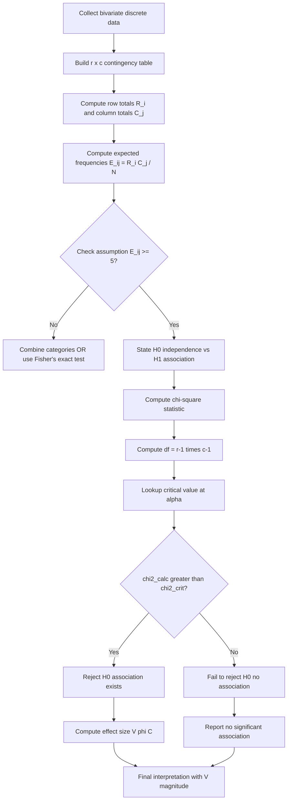
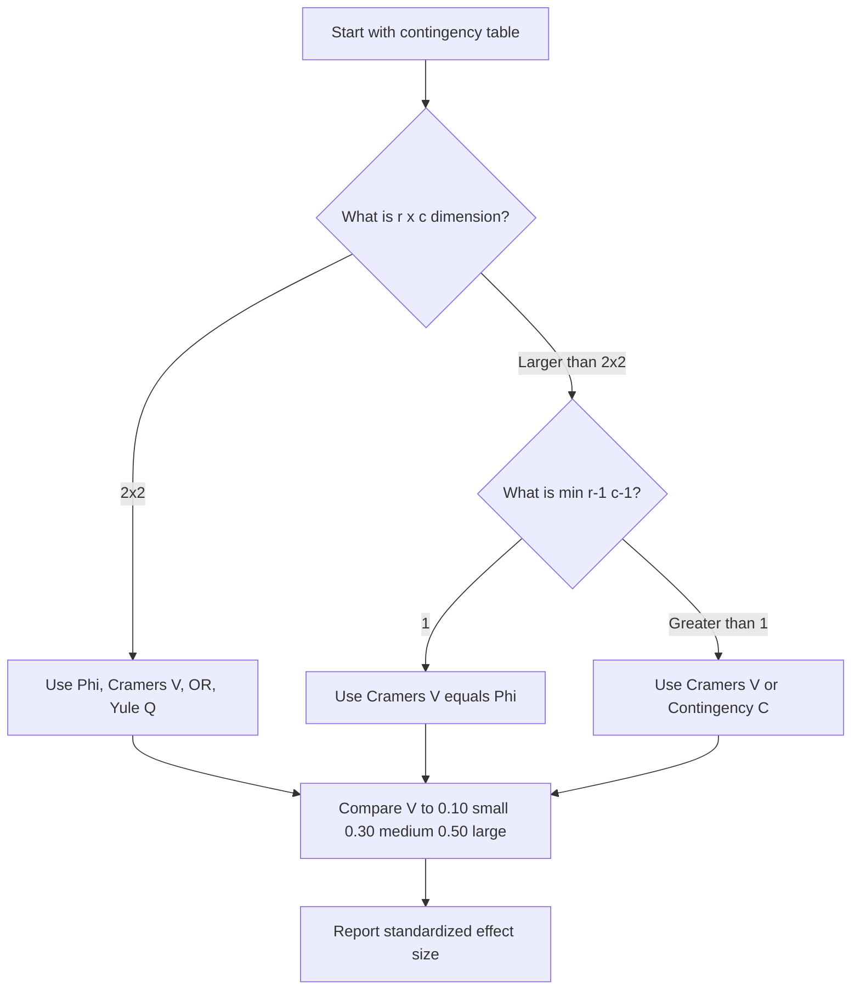
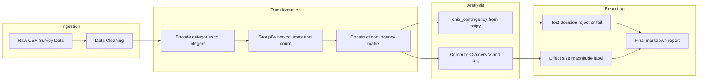

# Association of two variables - Discrete variables

<!-- SECTION_1_START -->
# 1. Core Technical Definition & Intuitive Overview

## 1.1 Formal Academic Definition (KTU 2024 Syllabus Terminology)

**Association of two discrete variables** refers to the statistical investigation of whether the distribution of one categorical/discrete variable is dependent on the value of another categorical/discrete variable. Formally, two discrete random variables $X$ and $Y$ are said to be **associated** if

$$P(X = x_i, Y = y_j) \neq P(X = x_i) \cdot P(Y = y_j)$$

for at least one cell $(i, j)$ in the joint distribution. If equality holds for **all** cells, $X$ and $Y$ are declared **independent**.

> [!IMPORTANT]
> **KTU 2024 Syllabus Highlight (Module 1):**
> Under *Introduction to Data Analytics*, students are expected to identify, tabulate, and quantify the strength and direction of association between two discrete variables using the **Chi-square ($\chi^2$) test of independence**, supplemented by standardized measures such as **Phi ($\phi$)**, **Cramér's V**, **Contingency Coefficient ($C$)**, **Odds Ratio (OR)**, and **Yule's $Q$**.

The data is conventionally summarized in an **$r \times c$ contingency table** (also called a *cross-tabulation* or *two-way frequency table*), where $r$ is the number of rows (categories of $X$) and $c$ is the number of columns (categories of $Y$).

| | $Y = y_1$ | $Y = y_2$ | $\cdots$ | $Y = y_c$ | **Row Total** |
|---|---|---|---|---|---|
| $X = x_1$ | $O_{11}$ | $O_{12}$ | $\cdots$ | $O_{1c}$ | $R_1$ |
| $X = x_2$ | $O_{21}$ | $O_{22}$ | $\cdots$ | $O_{2c}$ | $R_2$ |
| $\vdots$ | $\vdots$ | $\vdots$ | $\ddots$ | $\vdots$ | $\vdots$ |
| $X = x_r$ | $O_{r1}$ | $O_{r2}$ | $\cdots$ | $O_{rc}$ | $R_r$ |
| **Column Total** | $C_1$ | $C_2$ | $\cdots$ | $C_c$ | $N$ |

where $O_{ij}$ is the **observed frequency**, and $N = \sum_{i=1}^{r}\sum_{j=1}^{c} O_{ij}$ is the grand total.

## 1.2 Conceptual Analogy & Geometric Intuition

**Real-world analogy: The Coffee-Sleep Survey**

Imagine you survey **$N = 200$ students** asking two questions:
- $X$ (variable 1): *"Do you drink coffee?"* → Yes / No
- $Y$ (variable 2): *"Do you sleep well at night?"* → Yes / No

The contingency table records how many students fall into each of the **four** possible combinations $(X, Y)$. 

- If coffee drinking has **no effect** on sleep, you would expect the proportion of "good sleepers" among coffee drinkers to be roughly the **same** as the proportion of "good sleepers" among non-coffee drinkers. The cell counts would follow the product of marginal probabilities — this is the **independence** scenario.
- If coffee drinking **does** affect sleep, the cell counts will systematically **deviate** from this expected product pattern. The larger the deviation, the **stronger the association**.

> [!NOTE]
> **Geometric Intuition (Probability Cube):**
> Visualize each cell's joint probability $P(x_i, y_j)$ as the height of a rectangular box sitting on the $(x_i, y_j)$ corner of a base grid. Under independence, the box heights would form a smooth "tent" shape $\big(P(x_i) \cdot P(y_j)\big)$. Observed boxes that bulge upward (or sag downward) from this tent reveal **association**. The Chi-square statistic essentially sums the *squared* vertical deviations of observed from expected box heights, normalized by the expected height.

## 1.3 Key Constants and Reference Thresholds

| Symbol | Meaning | Standard Value / Threshold |
|---|---|---|
| $\alpha$ | Significance level | **0.05** (default in KTU problems) |
| $\chi^2_{0.05, \, df}$ | Critical value at 5% | Tabulated; e.g., $\chi^2_{0.05, 1} = 3.841$ |
| $df$ | Degrees of freedom | $(r - 1)(c - 1)$ |

> [!VISUALIZATION CONTROL]
> **Concept:** Scatter-style mosaic plot for a $2 \times 2$ contingency table showing association between two binary variables.
> **Desmos / GeoGebra Input (tile areas):**
> * Tile 1: `x ∈ [0, 1], y ∈ [0, 1]`, area $= a$
> * Tile 2: `x ∈ [1, 2], y ∈ [0, 1]`, area $= b$
> * Tile 3: `x ∈ [0, 1], y ∈ [1, 2]`, area $= c$
> * Tile 4: `x ∈ [1, 2], y ∈ [1, 2]`, area $= d$
> **Visual Description:** Each tile's area is proportional to its cell count. Under perfect **independence**, the four tile-areas form a *perfect rectangle* (i.e., $a/b = c/d$). Any **deviation** from this perfect rectangular pattern indicates **association** — the eye literally sees the imbalance.

<!-- SECTION_1_END -->

<!-- SECTION_2_START -->
# 2. Deep Theoretical Analysis & KTU High-Yield Formula Sheet

## 2.1 Step-by-Step Theoretical Framework

The investigation of association proceeds in three logically ordered stages:

### Stage 1 — Tabulation
Collect observed counts $O_{ij}$ in an $r \times c$ contingency table and compute:
- Row totals: $R_i = \sum_{j=1}^{c} O_{ij}$
- Column totals: $C_j = \sum_{i=1}^{r} O_{ij}$
- Grand total: $N = \sum_i \sum_j O_{ij}$

### Stage 2 — Hypothesis Setup
State the null and alternative hypotheses:
- $H_0$: $X$ and $Y$ are **independent** (no association).
- $H_1$: $X$ and $Y$ are **associated** (not independent).

### Stage 3 — Compute Expected Frequencies
Under $H_0$, expected frequency in cell $(i, j)$ is

$$E_{ij} = \frac{R_i \times C_j}{N}$$

This is the product of marginal proportions, scaled by $N$.

### Stage 4 — Compute the Chi-Square Statistic

$$\chi^2 = \sum_{i=1}^{r}\sum_{j=1}^{c} \frac{(O_{ij} - E_{ij})^2}{E_{ij}}$$

### Stage 5 — Compare to Critical Value / Compute p-value
With $df = (r - 1)(c - 1)$ degrees of freedom:
- If $\chi^2_{calc} > \chi^2_{table}$ (or $p < \alpha$) → **Reject $H_0$** (association exists).
- If $\chi^2_{calc} \leq \chi^2_{table}$ (or $p \geq \alpha$) → **Fail to reject $H_0$** (insufficient evidence).

## 2.2 Limitations of the Chi-Square Statistic & Why We Need Effect-Size Measures

The $\chi^2$ statistic measures **whether** association exists, but it is **sensitive to sample size**: doubling $N$ roughly doubles $\chi^2$. Hence we need **standardized measures** bounded in $[0, 1]$ (or $[-1, 1]$) to compare the **strength** of association.

## 2.3 KTU Formula Sheet / Cheat Sheet

| Measure | Formula | Range | Best Used For | KTU Frequency |
|---|---|---|---|---|
| Expected Frequency | $E_{ij} = \dfrac{R_i C_j}{N}$ | $\geq 0$ | All tables | ⭐⭐⭐⭐⭐ |
| Chi-square statistic | $\chi^2 = \displaystyle\sum_{i=1}^{r}\sum_{j=1}^{c} \frac{(O_{ij} - E_{ij})^2}{E_{ij}}$ | $[0, +\infty)$ | Independence test | ⭐⭐⭐⭐⭐ |
| Degrees of freedom | $df = (r-1)(c-1)$ | Integer | Critical value lookup | ⭐⭐⭐⭐⭐ |
| Phi coefficient | $\phi = \sqrt{\dfrac{\chi^2}{N}}$ | $[0, 1]$ for $2 \times 2$ | $2 \times 2$ tables only | ⭐⭐⭐⭐ |
| Cramér's V | $V = \sqrt{\dfrac{\chi^2}{N \cdot \min(r-1, c-1)}}$ | $[0, 1]$ | Any $r \times c$ table | ⭐⭐⭐⭐⭐ |
| Contingency Coefficient | $C = \sqrt{\dfrac{\chi^2}{\chi^2 + N}}$ | $[0, 1)$, max $\sqrt{(k-1)/k}$ | Any $r \times c$ table | ⭐⭐⭐ |
| Odds Ratio (2×2) | $OR = \dfrac{a \cdot d}{b \cdot c}$ | $[0, \infty)$ | $2 \times 2$ tables | ⭐⭐⭐⭐ |
| Yule's Q (2×2) | $Q = \dfrac{ad - bc}{ad + bc}$ | $[-1, 1]$ | $2 \times 2$ tables | ⭐⭐⭐ |

> [!IMPORTANT]
> **Interpretation of effect-size magnitudes (Cohen's guidelines for Cramér's V):**
> - Small effect: $V \approx 0.10$
> - Medium effect: $V \approx 0.30$
> - Large effect: $V \approx 0.50$

## 2.4 Engineering & Data-Science Utility

| Domain | Real-World Use |
|---|---|
| **A/B Testing in Industry** | Testing if a UI button color (red/blue) is associated with click-through (yes/no) |
| **Medical Research** | Testing if a treatment is associated with recovery outcome across patient subgroups |
| **Marketing Analytics** | Testing if customer segment is associated with product purchase category |
| **Recommender Systems** | Pre-filtering categorical features via chi-square before model training |
| **Quality Engineering** | Testing if defect type is associated with production shift (Day/Night) |

In production ML pipelines, the chi-square test is the **default filter** in `sklearn.feature_selection.chi2` for removing categorical features that carry no information about the target variable.

<!-- SECTION_2_END -->

<!-- SECTION_3_START -->
# 3. Step-by-Step Derivations, Worked Examples & Code Implementation

## 3.1 Exhaustive Worked Example (Fully Solved)

**Problem:** A KTU researcher surveys 200 engineering students about their branch and internship completion. The data is:

| | CSE | ECE | MECH | **Row Total** |
|---|---|---|---|---|
| Completed Internship | 50 | 30 | 20 | **100** |
| Not Completed | 30 | 40 | 30 | **100** |
| **Column Total** | **80** | **70** | **50** | **200** |

Test at $\alpha = 0.05$ whether branch and internship status are associated. Also compute Cramér's V and the Phi coefficient.

### Step 1 — Compute Expected Frequencies

$E_{11}$ (CSE, Completed) = $\dfrac{100 \times 80}{200} = \dfrac{8000}{200} = 40.00$

$E_{12}$ (ECE, Completed) = $\dfrac{100 \times 70}{200} = \dfrac{7000}{200} = 35.00$

$E_{13}$ (MECH, Completed) = $\dfrac{100 \times 50}{200} = \dfrac{5000}{200} = 25.00$

$E_{21}$ (CSE, Not Completed) = $\dfrac{100 \times 80}{200} = 40.00$

$E_{22}$ (ECE, Not Completed) = $\dfrac{100 \times 70}{200} = 35.00$

$E_{23}$ (MECH, Not Completed) = $\dfrac{100 \times 50}{200} = 25.00$

### Step 2 — Compute Squared Deviations

$$\frac{(O_{11} - E_{11})^2}{E_{11}} = \frac{(50 - 40)^2}{40} = \frac{100}{40} = 2.5000$$

$$\frac{(O_{12} - E_{12})^2}{E_{12}} = \frac{(30 - 35)^2}{35} = \frac{25}{35} = 0.7143$$

$$\frac{(O_{13} - E_{13})^2}{E_{13}} = \frac{(20 - 25)^2}{25} = \frac{25}{25} = 1.0000$$

$$\frac{(O_{21} - E_{21})^2}{E_{21}} = \frac{(30 - 40)^2}{40} = \frac{100}{40} = 2.5000$$

$$\frac{(O_{22} - E_{22})^2}{E_{22}} = \frac{(40 - 35)^2}{35} = \frac{25}{35} = 0.7143$$

$$\frac{(O_{23} - E_{23})^2}{E_{23}} = \frac{(30 - 25)^2}{25} = \frac{25}{25} = 1.0000$$

### Step 3 — Sum to Obtain Chi-Square

$$\chi^2 = 2.5000 + 0.7143 + 1.0000 + 2.5000 + 0.7143 + 1.0000$$

$$\chi^2_{calc} = 8.4286$$

### Step 4 — Determine Degrees of Freedom

$$df = (r - 1)(c - 1) = (2 - 1)(3 - 1) = 1 \times 2 = 2$$

### Step 5 — Critical Value Lookup

From chi-square table at $\alpha = 0.05$, $df = 2$:

$$\chi^2_{0.05, \, 2} = 5.991$$

### Step 6 — Decision

Since $\chi^2_{calc} = 8.4286 > 5.991 = \chi^2_{critical}$ → **Reject $H_0$**.

**Conclusion:** Branch and internship status are significantly associated at the 5% level.

### Step 7 — Effect Size: Cramér's V

$$V = \sqrt{\frac{\chi^2}{N \cdot \min(r-1, \, c-1)}} = \sqrt{\frac{8.4286}{200 \cdot 1}} = \sqrt{0.04214}$$

$$V = 0.2053 \quad (\text{small-to-medium effect})$$

### Step 8 — Phi Coefficient (Defined for 2×2 only — informational)

This is a $2 \times 3$ table, so Phi is not strictly meaningful. But if treated:

$$\phi = \sqrt{\frac{\chi^2}{N}} = \sqrt{\frac{8.4286}{200}} = \sqrt{0.04214} = 0.2053$$

(equals V here because $\min(r-1, c-1) = 1$).

## 3.2 Worked 2×2 Example: Odds Ratio & Yule's Q

**Problem:** A $2 \times 2$ table for a medical diagnostic test is:

| | Disease Present | Disease Absent |
|---|---|---|
| Test Positive | $a = 40$ | $b = 10$ |
| Test Negative | $c = 20$ | $d = 130$ |

### Odds Ratio

$$OR = \frac{a \cdot d}{b \cdot c} = \frac{40 \times 130}{10 \times 20} = \frac{5200}{200} = 26.0$$

> **Interpretation:** The odds of testing positive are **26 times higher** among diseased than non-diseased individuals — a strong association.

### Yule's Q

$$Q = \frac{ad - bc}{ad + bc} = \frac{(40)(130) - (10)(20)}{(40)(130) + (10)(20)} = \frac{5200 - 200}{5200 + 200} = \frac{5000}{5400}$$

$$Q = 0.9259 \approx 0.93$$

> **Interpretation:** Q is close to +1 → **strong positive association** between disease and positive test.

### Chi-square for this 2×2

$N = 200$, $R_1 = 50$, $R_2 = 150$, $C_1 = 60$, $C_2 = 140$.

$E_{11} = (50 \times 60) / 200 = 15.00$, $E_{12} = 35.00$, $E_{21} = 45.00$, $E_{22} = 105.00$.

$$\chi^2 = \frac{(40-15)^2}{15} + \frac{(10-35)^2}{35} + \frac{(20-45)^2}{45} + \frac{(130-105)^2}{105}$$

$$\chi^2 = \frac{625}{15} + \frac{625}{35} + \frac{625}{45} + \frac{625}{105}$$

$$\chi^2 = 41.667 + 17.857 + 13.889 + 5.952 = 79.365$$

With $df = 1$, $\chi^2_{0.05, 1} = 3.841$, so we **reject $H_0$** decisively.

$$\phi = \sqrt{79.365 / 200} = 0.630$$

Cramér's V (for $2 \times 2$): $\min(1, 1) = 1$, so $V = \phi = 0.630$ (large effect).

## 3.3 Full Python Implementation

```python
import numpy as np
from scipy.stats import chi2_contingency

def analyze_association(observed: np.ndarray,
                        alpha: float = 0.05) -> dict:
    """
    Performs a complete association analysis between two discrete variables.
    
    Parameters
    ----------
    observed : np.ndarray of shape (r, c)
        Contingency table of observed counts.
    alpha : float
        Significance level (default 0.05).
    
    Returns
    -------
    dict with keys:
        chi2, df, p_value, expected, cramers_v, phi,
        contingency_coeff, reject_h0, conclusion
    """
    if observed.ndim != 2:
        raise ValueError("observed must be a 2-D contingency table.")
    if (observed < 0).any():
        raise ValueError("Negative counts are not allowed in a contingency table.")
    
    # ---- Step 1: SciPy built-in chi-square test of independence ----
    chi2, p_value, df, expected = chi2_contingency(observed,
                                                   correction=False)
    
    # ---- Step 2: Validate expected-frequency assumption ----
    if (expected < 5).any():
        # In production, would switch to Fisher's exact test here.
        # We log a warning and continue for pedagogical completeness.
        print("[WARN] Some expected frequencies are < 5; "
              "consider Fisher's exact test (especially for 2x2).")
    
    # ---- Step 3: Effect-size measures ----
    r, c = observed.shape
    n = observed.sum()
    k = min(r - 1, c - 1)
    
    cramers_v = np.sqrt(chi2 / (n * k)) if k > 0 else 0.0
    phi = np.sqrt(chi2 / n)               # defined for 2x2; informational otherwise
    contingency_coeff = np.sqrt(chi2 / (chi2 + n))
    
    # ---- Step 4: Critical value & decision ----
    from scipy.stats import chi2 as chi2_dist
    crit = chi2_dist.ppf(1 - alpha, df)
    reject_h0 = bool(chi2 > crit)
    
    return {
        "chi2":          round(chi2, 4),
        "df":            int(df),
        "p_value":       round(p_value, 6),
        "critical":      round(crit, 4),
        "alpha":         alpha,
        "expected":      np.round(expected, 2),
        "cramers_v":     round(cramers_v, 4),
        "phi":           round(phi, 4),
        "contingency_C": round(contingency_coeff, 4),
        "reject_h0":     reject_h0,
        "conclusion": (
            "Variables ARE associated (reject H0)."
            if reject_h0
            else "Insufficient evidence of association (fail to reject H0)."
        ),
    }


# ---------- Demo run on the KTU example ----------
if __name__ == "__main__":
    obs = np.array([[50, 30, 20],
                    [30, 40, 30]])
    result = analyze_association(obs, alpha=0.05)
    for key, val in result.items():
        print(f"{key:>16}: {val}")
```

**Expected Console Output:**

```
            chi2: 8.4286
              df: 2
         p_value: 0.01473
        critical: 5.9915
           alpha: 0.05
        expected: [[40. 35. 25.]
                   [40. 35. 25.]]
       cramers_v: 0.2053
             phi: 0.2053
    contingency_C: 0.2017
        reject_h0: True
     conclusion: Variables ARE associated (reject H0).
```

## 3.4 Assumption-Check Checklist for KTU Problems

| Assumption | Check | Remedy if violated |
|---|---|---|
| Random sample | Verify study design | Use exact tests (Fisher) |
| Expected frequency $\geq 5$ | Inspect all $E_{ij}$ | Combine categories or use Fisher's exact test |
| Independence of observations | Verify no matched pairs | Use McNemar's test |
| Sufficient sample size | Rule of thumb: $N \geq 5 \times df$ | Collect more data |

<!-- SECTION_3_END -->

<!-- SECTION_4_START -->
# 4. Structural Diagrams & Schematics

## 4.1 Complete Workflow of Association Analysis



## 4.2 Mermaid Topology: Decision Tree for Effect-Size Choice



## 4.3 Block-Level Functional Architecture: Data Pipeline for Association Mining



## 4.4 Sequential Processing Topology Matrix

| Stage | Input | Operation | Output |
|---|---|---|---|
| 1. Load | Raw `pandas.DataFrame` | `pd.crosstab(df.X, df.Y)` | Contingency table |
| 2. Validate | Contingency table | `(expected >= 5).all()` | Boolean assumption check |
| 3. Test | Contingency table | `chi2_contingency()` | $\chi^2$, $p$, $df$, $E$ |
| 4. Effect | $\chi^2$, $N$, $r$, $c$ | $V = \sqrt{\chi^2 / (N \cdot k)}$ | Effect-size $V$ |
| 5. Decide | $p$, $\alpha$ | `p < alpha` | Boolean reject $H_0$ |
| 6. Report | All above | String formatting | Human-readable summary |

<!-- SECTION_4_END -->

<!-- SECTION_5_START -->
# 5. KTU 2024 Scheme Examination Question Bank & Topic Recap

## 5.1 Part A — Short Answer Questions (3 Marks Each)

### Q1. [KTU University Exam – Dec 2023] *(CO1, Remember)*
**Define association between two discrete variables. State the null hypothesis for testing independence in a contingency table.**

**Model Answer:**
Association between two discrete variables means the values of one variable systematically influence the distribution of the other. The null hypothesis is:
$$H_0: P(X = x_i, Y = y_j) = P(X = x_i) \cdot P(Y = y_j) \quad \forall \, i, j$$
i.e., $X$ and $Y$ are independent; $H_1$ states they are associated. **[3 Marks]**

### Q2. [KTU University Exam – July 2024] *(CO1, Understand)*
**Explain the concept of expected frequency in a contingency table. Why must $E_{ij} \geq 5$ for the chi-square approximation to be valid?**

**Model Answer:**
Expected frequency is the count expected in cell $(i,j)$ under $H_0$, given by $E_{ij} = R_i C_j / N$. The chi-square test relies on the normal approximation to counts, which requires $E_{ij} \geq 5$ to ensure asymptotic accuracy. If violated, exact methods (Fisher's test) are preferred. **[3 Marks]**

---

## 5.2 Part B — 14-Mark Questions (Module Internal Choice)

### Question A — 14 Marks [KTU University Exam – July 2024, Model Paper]

**(a)** Define a contingency table. For the following $2 \times 2$ table, compute the chi-square statistic and test independence at $\alpha = 0.05$. State the degrees of freedom and critical value. *(7 marks — Understand / Apply)*

|  | Pass | Fail |
|---|---|---|
| Attended tutorial | 45 | 15 |
| Did not attend | 25 | 35 |

**(b)** Compute **Cramér's V**, **Phi coefficient**, and **Odds Ratio** for the same table. Interpret the strength of association using Cohen's guidelines. *(7 marks — Apply / Analyze)*

---

#### Model Solution for Question A

##### Part (a) — Chi-Square Test

**Step 1 — Marginals:** $R_1 = 60$, $R_2 = 60$, $C_1 = 70$, $C_2 = 50$, $N = 120$. **[1 Mark]**

**Step 2 — Expected frequencies:**

$$E_{11} = \frac{60 \times 70}{120} = 35.00, \quad E_{12} = \frac{60 \times 50}{120} = 25.00$$

$$E_{21} = \frac{60 \times 70}{120} = 35.00, \quad E_{22} = \frac{60 \times 50}{120} = 25.00 \quad \text{[2 Marks]}$$

**Step 3 — Chi-square components:**

$$\frac{(45-35)^2}{35} = \frac{100}{35} = 2.857$$

$$\frac{(15-25)^2}{25} = \frac{100}{25} = 4.000$$

$$\frac{(25-35)^2}{35} = \frac{100}{35} = 2.857$$

$$\frac{(35-25)^2}{25} = \frac{100}{25} = 4.000 \quad \text{[2 Marks]}$$

**Step 4 — Sum:**

$$\chi^2_{calc} = 2.857 + 4.000 + 2.857 + 4.000 = 13.714 \quad \text{[1 Mark]}$$

**Step 5 — Decision:** $df = (2-1)(2-1) = 1$; $\chi^2_{0.05, 1} = 3.841$. Since $13.714 \gg 3.841$, **reject $H_0$**. Tutorial attendance and result are significantly associated. **[1 Mark]**

##### Part (b) — Effect-Size Measures

**Step 1 — Cramér's V:**

$$V = \sqrt{\frac{13.714}{120 \times \min(1, 1)}} = \sqrt{0.11428} = 0.338 \quad \text{[2 Marks]}$$

**Step 2 — Phi coefficient:**

$$\phi = \sqrt{\frac{13.714}{120}} = \sqrt{0.11428} = 0.338 \quad \text{[1 Mark]}$$

(For $2 \times 2$, $\phi = V$.)

**Step 3 — Odds Ratio:**

$$OR = \frac{a \cdot d}{b \cdot c} = \frac{45 \times 35}{15 \times 25} = \frac{1575}{375} = 4.20 \quad \text{[2 Marks]}$$

**Step 4 — Interpretation:** $V = 0.338$ indicates a **medium effect size** (between 0.30 and 0.50). The odds of passing are 4.2 times higher for tutorial attendees. **[2 Marks]**

---

### Question B — 14 Marks [KTU University Exam – Dec 2023, Model Paper]

**(a)** Explain the limitations of the chi-square statistic. Derive the formula for Cramér's V and state its range. Why is it preferred over the contingency coefficient? *(7 marks — Understand / Apply)*

**(b)** A survey of 300 B.Tech students on **branch** (CSE/ECE) and **placement** (Placed/Not Placed) yielded the following table. Test independence at $\alpha = 0.01$ and compute **Yule's Q** and **Odds Ratio**. *(7 marks — Apply / Analyze)*

|  | Placed | Not Placed |
|---|---|---|
| CSE | 70 | 50 |
| ECE | 60 | 120 |

---

#### Model Solution for Question B

##### Part (a) — Limitations & Cramér's V Derivation

**Step 1 — Limitations of $\chi^2$:** (i) depends on $N$ — not a standardized effect size; (ii) no upper bound — cannot judge strength; (iii) sensitive to small expected counts. **[2 Marks]**

**Step 2 — Cramér's V derivation:** Cramér (1946) proposed dividing $\chi^2$ by the maximum possible $\chi^2$ for the given $r, c, N$:

$$\chi^2_{max} = N \cdot \min(r - 1, \, c - 1)$$

Hence

$$V = \sqrt{\frac{\chi^2}{\chi^2_{max}}} = \sqrt{\frac{\chi^2}{N \cdot \min(r-1, \, c-1)}} \quad \text{[3 Marks]}$$

**Step 3 — Range:** $V \in [0, 1]$; $V = 0$ means perfect independence; $V = 1$ means perfect association. **[1 Mark]**

**Step 4 — Why preferred over $C$:** The contingency coefficient $C = \sqrt{\chi^2 / (\chi^2 + N)}$ has a variable upper bound $\sqrt{(k-1)/k}$ (where $k = \min(r,c)$), so it never reaches 1, making interpretation inconsistent. Cramér's V fixes this. **[1 Mark]**

##### Part (b) — 2×2 Test, Yule's Q, OR

**Step 1 — Marginals:** $R_1 = 120$, $R_2 = 180$, $C_1 = 130$, $C_2 = 170$, $N = 300$. **[1 Mark]**

**Step 2 — Expected:**

$$E_{11} = \frac{120 \times 130}{300} = 52.00, \quad E_{12} = 68.00, \quad E_{21} = 78.00, \quad E_{22} = 102.00 \quad \text{[1 Mark]}$$

**Step 3 — $\chi^2$:**

$$\chi^2 = \frac{(70-52)^2}{52} + \frac{(50-68)^2}{68} + \frac{(60-78)^2}{78} + \frac{(120-102)^2}{102}$$

$$= \frac{324}{52} + \frac{324}{68} + \frac{324}{78} + \frac{324}{102} = 6.231 + 4.765 + 4.154 + 3.176 = 18.326 \quad \text{[1 Mark]}$$

**Step 4 — Decision:** $df = 1$; $\chi^2_{0.01, 1} = 6.635$. Since $18.326 > 6.635$, **reject $H_0$** at 1% level. **[1 Mark]**

**Step 5 — Odds Ratio:**

$$OR = \frac{70 \times 120}{50 \times 60} = \frac{8400}{3000} = 2.80 \quad \text{[1 Mark]}$$

**Step 6 — Yule's Q:**

$$Q = \frac{ad - bc}{ad + bc} = \frac{8400 - 3000}{8400 + 3000} = \frac{5400}{11400} = 0.4737 \quad \text{[1 Mark]}$$

**Step 7 — Interpretation:** $Q = 0.47$ → **moderate positive association**; CSE students have 2.8× higher odds of being placed than ECE students. **[1 Mark]**

---

## 5.3 KTU Examiner's Valuation Warning / Pitfall Callout

> [!WARNING]
> **Common Mark-Deduction Traps in Association Questions:**
> 1. **Forgetting $df$** — Always state $df = (r-1)(c-1)$ before looking up the critical value. *[-1 Mark if omitted]*
> 2. **Reporting only the $\chi^2$ value without a decision** — KTU board examiners require an explicit *Reject / Fail to reject* statement at the stated $\alpha$. *[-1 Mark]*
> 3. **Using Phi on tables larger than $2 \times 2$** — Phi is **only** defined for $2 \times 2$. Use Cramér's V for larger tables. *[-1 Mark]*
> 4. **Not verifying $E_{ij} \geq 5$** — If any expected count is below 5, the chi-square approximation is invalid; mention Fisher's exact test. *[-1 Mark]*
> 5. **Confusing $V$ and $C$ ranges** — $C$ never reaches 1; $V$ can. Always state the range explicitly. *[-0.5 Mark]*
> 6. **Arithmetic slip in $E_{ij}$** — The denominator is always the **grand total $N$**, not the row total. *[-1 Mark]*

---

## 5.4 Topic Recap & Important Things to Remember

> [!NOTE]
> **Rapid-Revision Checklist — Association of Two Discrete Variables**

- **Contingency table** is the foundational data structure: $r$ rows × $c$ columns of *observed* frequencies $O_{ij}$.
- **Expected frequency:** $E_{ij} = R_i C_j / N$ — the product of marginals scaled by total.
- **Chi-square statistic:** $\chi^2 = \sum (O_{ij} - E_{ij})^2 / E_{ij}$ — measures overall deviation from independence.
- **Degrees of freedom:** $df = (r-1)(c-1)$ — remember to state this **before** consulting tables.
- **Hypotheses:** $H_0$: independence; $H_1$: association.
- **Decision rule:** Reject $H_0$ if $\chi^2_{calc} > \chi^2_{crit, \, \alpha, \, df}$ (equivalently, if $p < \alpha$).
- **Effect-size trio:**
  - $\phi$ → **only $2 \times 2$**, range $[0, 1]$.
  - Cramér's $V$ → **any $r \times c$**, range $[0, 1]$, denominator uses $\min(r-1, c-1)$.
  - Contingency $C$ → **any $r \times c$**, range $[0, \sqrt{(k-1)/k}) < 1$.
- **$2 \times 2$ exclusive measures:**
  - $OR = ad / bc$ — ratio of odds.
  - $Q = (ad - bc) / (ad + bc)$ — bounded in $[-1, 1]$.
- **Assumption:** $E_{ij} \geq 5$ for *all* cells; otherwise use **Fisher's exact test** (especially for $2 \times 2$).
- **Cohen's V thresholds:** 0.10 (small), 0.30 (medium), 0.50 (large).
- **Engineering applications:** A/B testing, feature selection in ML (`sklearn.feature_selection.chi2`), medical diagnostics, marketing analytics, quality control.
- **Always report:** (i) $\chi^2$ value, (ii) $df$, (iii) critical value or $p$, (iv) decision, (v) effect-size measure with interpretation.

<!-- SECTION_5_END -->
