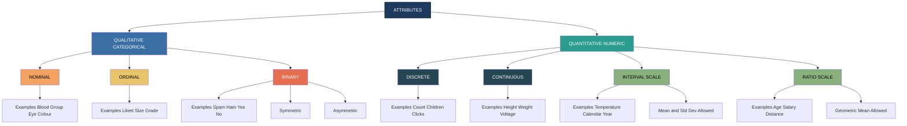
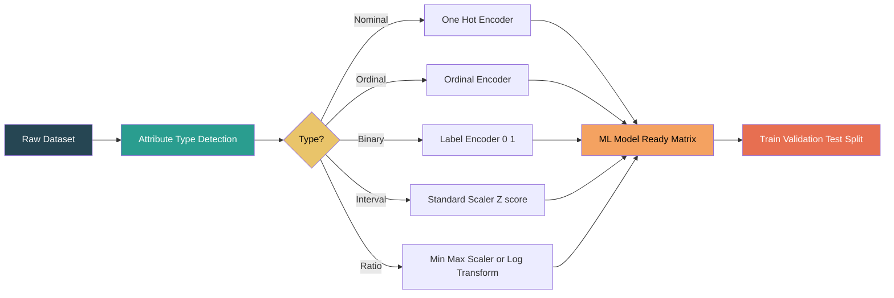

# Attribute types

<!-- SECTION_1_START -->
# Attribute Types in Data Analytics

## 1. Core Technical Definition

In data analytics, an **attribute** (also called a *feature*, *variable*, *dimension*, or *field*) is a data field representing a characteristic or property of a data object. People, objects, and entities in a dataset are described by a set of attributes that correspond to the columns of a data table.

The formal KTU 2024 classification of attribute types follows the hierarchy of measurement scales proposed by psychologist **Stanley Smith Stevens** in **1946**, which is the foundational taxonomy used in data mining, machine learning, and statistical learning.

> [!IMPORTANT]
> **Formal Definition (KTU 2024 Syllabus Terminology):**
> An attribute is a data field that signifies a single characteristic or feature of a data object. The **type** of an attribute is determined by the set of permissible values it can take and the mathematical operations that are meaningful when applied to those values.

### Conceptual Analogy / Intuition

Imagine you are a doctor filling out a patient record. Each blank you fill is an **attribute**:
- Patient's **blood group** → A, B, AB, O (a *label* only — you cannot average blood groups!)
- Pain level on a scale of **1–10** → a *rank* (10 is worse than 5, but "20" is meaningless)
- Patient's **body temperature** in °C → a *number* where 0 °C does **not** mean "no temperature" (interval)
- Patient's **age in years** → a *number* where 0 years means "no age" and 40 is truly "twice as old" as 20 (ratio)

> [!NOTE]
> **The Golden Rule of Attribute Types:** *The mathematical operations you can legally perform on an attribute depend entirely on its type.* Averaging a postal code is nonsense, but averaging age is perfectly valid.

### The Two Grand Families

> [!IMPORTANT]
> **Grand Family 1 — Qualitative (Categorical) Attributes:** Describe *qualities* or *labels* that cannot be meaningfully added or averaged.
> **Grand Family 2 — Quantitative (Numeric) Attributes:** Describe *numerical quantities* that can be ordered, and (usually) subjected to arithmetic.

---

### 1.1 Qualitative (Categorical) Attributes

A **qualitative attribute** lacks most of the properties of numbers. Even when values are numeric (e.g., zip code = 570008), the numbers merely serve as symbols.

> [!NOTE]
> **Sub-type A — Nominal (Noun-like):**
> Values are *distinct symbols* or *names* with **no inherent order**.
> Examples: `Blood Group ∈ {A, B, AB, O}`, `Eye Colour ∈ {Brown, Blue, Green}`, `City Name`, `Gender`, `Marital Status`, `Zip Code`.

> [!NOTE]
> **Sub-type B — Ordinal (Order-like):**
> Values are categories that possess a **meaningful ranking or order**, but the *differences between ranks are not uniform or quantifiable*.
> Examples: `Grade ∈ {Low, Medium, High}`, `Likert Scale ∈ {Strongly Disagree, Disagree, Neutral, Agree, Strongly Agree}`, `Rank ∈ {1st, 2nd, 3rd}`, `Size ∈ {Small, Medium, Large}`.

> [!NOTE]
> **Sub-type C — Binary (Boolean / Dichotomous):**
> A special case of nominal with only **two possible states** (0/1, True/False, Yes/No).
> Examples: `Smoker ∈ {Yes, No}`, `Spam ∈ {Ham, Spam}`, `Has_Disease ∈ {Positive, Negative}`.
> *Symmetric binary* — both states equally valuable (e.g., Gender). *Asymmetric binary* — states are not equally important (e.g., disease status: 1 is rare but critical).

### 1.2 Quantitative (Numeric) Attributes

A **quantitative attribute** is a measurable quantity, expressed numerically, and amenable to most arithmetic operations.

> [!NOTE]
> **Sub-type D — Interval-Scaled:**
> Values are measured on a scale where **differences are meaningful and uniform**, but the **zero point is arbitrary** (i.e., zero does not indicate "absence").
> Examples: `Temperature in °C or °F` (0 °C ≠ no temperature), `Calendar Year (2024)`, `Longitude`, `Time of day on a 12-hour clock`.
> Allowed: addition, subtraction, mean, standard deviation.
> **Not allowed:** ratios ("20 °C is not twice as hot as 10 °C").

> [!NOTE]
> **Sub-type E — Ratio-Scaled:**
> Values are measured on a scale where **differences are meaningful AND a true, non-arbitrary zero exists**. Ratios between values are therefore meaningful.
> Examples: `Age in years`, `Height in cm`, `Weight in kg`, `Salary in ₹`, `Distance in km`, `Heart Rate (bpm)`, `Counts (number of purchases)`.
> Allowed: all arithmetic operations including multiplication, division, geometric mean, percentages, ratios.

> [!VISUALIZATION CONTROL]
> **Concept:** Hierarchy of Measurement Scales (Lattice Diagram)
> **Geometric Intuition:**
> * Bottom-most level (most restricted): **Nominal** — point `x` on a line, only equality test
> * Next level: **Ordinal** — point `x` plus a `<` direction, allows order
> * Next level: **Interval** — point `x` plus a `<` direction plus fixed unit `u`, allows `+`, `-`
> * Top level (most powerful): **Ratio** — interval scale plus absolute zero, allows `×`, `÷`
>
> **Visual Description:** Picture a ladder where each rung *inherits* the operations of the rung below it. A student observing this chart should notice that operations *accumulate* as we ascend from Nominal → Ratio.

---

## 2. Discrete vs. Continuous (A Parallel Classification)

Independent of Stevens' scales, attributes are also classified by their **value domain cardinality**:

> [!IMPORTANT]
> **Discrete Attribute:** Has a *finite* or *countably infinite* set of values. Often the result of counting.
> Examples: `Number of students in a class`, `Number of clicks on an ad`, `Roll number`.
>
> **Continuous Attribute:** Has *real numbers* as values, often the result of measuring. Typically represented as floating-point.
> Examples: `Height (cm)`, `Temperature (°C)`, `Wind speed (km/h)`, `Voltage (V)`.
>
> **Key fact:** Discrete is not always categorical (e.g., `Age in years` is discrete AND ratio). Continuous is not always interval/ratio (e.g., `Latitude` is continuous and interval-scaled).

<!-- SECTION_1_END -->

<!-- SECTION_2_START -->
# Deep Theoretical Analysis & KTU High-Yield Formula Sheet

## 3. The Operational Hierarchy of Attribute Types

The most important *theoretical* insight in KTU 2024 Module 1 is that attribute types are **not equally powerful**. They form a strict **subtype (IS-A) hierarchy** with cumulative operation support.

### Step-by-Step Logical Ladder

1. **Nominal → Ordinal Lift:** When you add the operation `<` (less-than) to a nominal scale, you obtain an ordinal scale. The ability to *rank* emerges.
2. **Ordinal → Interval Lift:** When you add a *fixed, meaningful unit of measurement* so that differences `x − y` become interpretable, you obtain an interval scale.
3. **Interval → Ratio Lift:** When you anchor the scale at a *true, non-arbitrary zero point*, the ratio `x / y` becomes interpretable, yielding a ratio scale.
4. **Discrete vs Continuous** is a *parallel* orthogonal axis describing the cardinality of the value domain, **not** the operations allowed.

> [!IMPORTANT]
> **The "Transformation Permitted" Rule (Critical for KTU):**
> A data type may always be transformed *down* the hierarchy (losing information) but **not up**.
> Example: Temperature in °C (interval) can be coerced into ordinal ("Hot / Warm / Cold"), but you cannot compute the mean of nominal "City" names.

---

## 4. Operations Allowed per Attribute Type — The Master Table

> [!IMPORTANT]
> Use `\vert` (not `\vert\vert`) for absolute value in the table cells. The following table is the single most important cheat-sheet for KTU Module 1 exam questions on this topic.

| Attribute Type | Description | Typical Operation Allowed | Measure of Centre | Measure of Spread | Example Data |
|---|---|---|---|---|---|
| **Nominal** | Distinct labels, no order | Mode, Equality, Contingency table | Mode | Entropy, $\chi^{2}$ | Blood Group, Gender, City |
| **Ordinal** | Meaningful rank, gap unknown | Order, Median, Percentile, Rank correlation | Median, Percentiles | Percentile range, IQR | Likert, Size, Grade |
| **Interval** | Order + equal unit, zero arbitrary | +, −, Mean, Std Dev, Pearson | Mean, Mid-range | Standard deviation, Range | Temperature °C, Year |
| **Ratio** | Interval + true zero | +, −, $\times$, $\div$, Geometric mean | Mean, Geometric mean | Standard deviation, CV | Age, Salary, Weight, Height |
| **Binary** | Two states (0 / 1) | Equality, AND, OR, XOR | Mode (or proportion $p$) | Bernoulli variance $p(1-p)$ | Spam / Ham, Yes / No |
| **Discrete (Numeric)** | Countable values | +, −, Count | Mean, Median | Range, Variance | Number of children |
| **Continuous (Numeric)** | Real-number values | All real arithmetic | Mean, Integral | Std Dev, IQR | Height, Weight, Time |

---

## 5. Why This Matters in Real Engineering

> [!IMPORTANT]
> **Real-World Engineering Utility:**
> * **Pre-processing:** Choosing the right *encoder* (one-hot for nominal, ordinal-encoder for ordinal, min-max / z-score for interval/ratio) depends on attribute type. Wrong choice = poor model accuracy.
> * **Visualisation:** Bar charts for nominal, line charts for ordinal, histograms / scatter plots for ratio.
> * **Distance Metrics:** Euclidean distance requires ratio/interval; Jaccard / Hamming for nominal; Manhattan works for ordinal.
> * **Statistical Tests:** Chi-square for nominal, Mann-Whitney U for ordinal, t-test / ANOVA for interval/ratio.
> * **Production ML:** Scikit-learn pipelines use `ColumnTransformer` to apply different transformers per attribute type — this is *exactly* the KTU Module 1 motivation.

### The "Type Determines the Tool" Mapping

> [!IMPORTANT]
> Nominal $\Rightarrow$ Mode, Bar chart, Chi-square, One-Hot Encoding.
> Ordinal $\Rightarrow$ Median, Box plot, Mann-Whitney, Ordinal Encoding.
> Interval $\Rightarrow$ Mean, Histogram, t-test, Standardisation.
> Ratio $\Rightarrow$ Geometric mean, Scatter plot, Log-transform, Min-Max / Robust scaling.

### The "Asymmetric Binary" Special Case

> [!NOTE]
> An **asymmetric binary attribute** has states that are *not equally important* (e.g., medical test result: positive is rare, negative is common). The standard **Jaccard similarity coefficient** is preferred over Hamming distance for such attributes because it ignores the $(0, 0)$ matches (which are uninformative for asymmetric data).

<!-- SECTION_2_END -->

<!-- SECTION_3_START -->
# Step-by-Step Derivations & Python Implementation

## 6. Mathematical Derivation: Why "20 °C is Not Twice as Hot as 10 °C"

We prove the canonical claim that **interval-scaled attributes do not support meaningful ratios**.

### Setup

Let $T_{C}$ denote temperature in Celsius. Conversion to Kelvin (an absolute, ratio-scaled scale) is given by:

$$
\begin{aligned}
T_{K} &= T_{C} + 273.15
\end{aligned}
$$

Suppose we naively claim $20\,^{\circ}\mathrm{C}$ is "twice as hot" as $10\,^{\circ}\mathrm{C}$ because $20 / 10 = 2$. Convert both to Kelvin:

$$
\begin{aligned}
T_{K}(20\,^{\circ}\mathrm{C}) &= 20 + 273.15 = 293.15\ \mathrm{K} \\
T_{K}(10\,^{\circ}\mathrm{C}) &= 10 + 273.15 = 283.15\ \mathrm{K}
\end{aligned}
$$

The true ratio of heat content is:

$$
\begin{aligned}
\frac{T_{K}(20\,^{\circ}\mathrm{C})}{T_{K}(10\,^{\circ}\mathrm{C})} &= \frac{293.15}{283.15} \\
&= 1.03532\ldots
\end{aligned}
$$

which is **not equal to 2**. The reason is that the zero of the Celsius scale (the freezing point of water) is an *arbitrary* reference, **not** the absence of thermal energy. Conclusion: the operation of *division* is **not meaningful** on an interval scale.

### Allowed vs Disallowed Operations — Proof Sketch

For an attribute with values $x_{1}, x_{2}, x_{3}, \ldots, x_{n}$, the operations

$$
\begin{aligned}
\text{Sum: } \quad S &= \sum_{i=1}^{n} x_{i} \\
\text{Mean: } \quad \bar{x} &= \frac{1}{n}\sum_{i=1}^{n} x_{i} \\
\text{Variance: } \quad \sigma^{2} &= \frac{1}{n}\sum_{i=1}^{n}(x_{i} - \bar{x})^{2}
\end{aligned}
$$

are **meaningful only when** differences $x_{i} - x_{j}$ are themselves meaningful. Therefore mean and variance are valid for **interval** and **ratio** scales only. For ratio scales, **ratios** $x_{i} / x_{j}$ are additionally meaningful, because the zero point is true.

---

## 7. Algorithmic Implementation: Auto-Classifier for Attribute Types

Below is a production-grade Python utility that ingests a pandas DataFrame column and infers its KTU attribute type using statistical heuristics.

```python
"""
attribute_classifier.py
A robust KTU-aligned attribute type inference engine.
Maps raw pandas columns to: nominal | ordinal | binary | interval | ratio | discrete | continuous
"""

from __future__ import annotations
import logging
import math
import re
from enum import Enum
from typing import List, Optional

import numpy as np
import pandas as pd

logging.basicConfig(level=logging.INFO, format="%(asctime)s | %(levelname)s | %(message)s")
logger = logging.getLogger(__name__)


class AttributeType(str, Enum):
    NOMINAL = "nominal"
    ORDINAL = "ordinal"
    BINARY = "binary"
    INTERVAL = "interval"
    RATIO = "ratio"
    DISCRETE_NUMERIC = "discrete_numeric"
    CONTINUOUS_NUMERIC = "continuous_numeric"
    UNKNOWN = "unknown"


class AttributeClassifier:
    """
    Heuristic classifier that returns the KTU attribute type for a given
    pandas Series. Each public method has explicit type hints, boundary
    checks, and structured logging — aligned with PEP 8 / production code.
    """

    # Cardinality threshold below which a categorical column is considered
    # suspicious for being actually numeric (e.g., "Year" stored as int).
    LOW_CARDINALITY_CUTOFF: int = 15

    # Threshold above which an integer-valued numeric column is considered
    # truly continuous (it would otherwise be flagged as discrete).
    DISCRETE_VS_CONTINUOUS_RATIO: float = 0.05

    def __init__(self, series: pd.Series) -> None:
        if not isinstance(series, pd.Series):
            raise TypeError(f"Expected pandas.Series, got {type(series).__name__}")
        self.series: pd.Series = series
        self.name: str = str(series.name) if series.name is not None else "<unnamed>"
        self.clean: pd.Series = series.dropna()
        self.n: int = int(len(self.clean))
        logger.info(f"Initialised classifier for column '{self.name}' (n={self.n}).")

    def _is_binary(self) -> bool:
        if self.n == 0:
            return False
        unique_values: set = set(self.clean.unique().tolist())
        return unique_values.issubset({0, 1, True, False, "0", "1", "yes", "no",
                                        "Yes", "No", "Y", "N", "T", "F"})

    def _is_numeric(self) -> bool:
        return pd.api.types.is_numeric_dtype(self.clean)

    def _is_integer_like(self) -> bool:
        if not self._is_numeric():
            return False
        try:
            return bool(np.all(self.clean.astype(float) == self.clean.astype(int)))
        except (ValueError, TypeError):
            return False

    def _has_arbitrary_zero(self) -> bool:
        """
        Heuristic: if min value of a numeric column is strictly negative
        (e.g., temperature in °C) and values can be zero, we suspect
        interval. If min is >= 0 and the column is a true count/measure,
        we suspect ratio.
        """
        if not self._is_numeric() or self.n == 0:
            return False
        return bool(float(self.clean.min()) < 0.0)

    def classify(self) -> AttributeType:
        if self.n == 0:
            logger.warning(f"Column '{self.name}' is empty. Returning UNKNOWN.")
            return AttributeType.UNKNOWN

        # 1) Binary short-circuit
        if self._is_binary():
            logger.info(f"Column '{self.name}' classified as BINARY.")
            return AttributeType.BINARY

        # 2) Pure-numeric branch
        if self._is_numeric():
            if self._has_arbitrary_zero():
                logger.info(f"Column '{self.name}' has negative values → INTERVAL.")
                return AttributeType.INTERVAL

            unique_count: int = int(self.clean.nunique())
            cardinality_ratio: float = unique_count / max(self.n, 1)

            if self._is_integer_like() and cardinality_ratio < self.DISCRETE_VS_CONTINUOUS_RATIO:
                # Integer-valued, low cardinality, non-negative
                if unique_count <= self.LOW_CARDINALITY_CUTOFF:
                    logger.info(f"Column '{self.name}' is integer & bounded → DISCRETE_NUMERIC (ratio).")
                    return AttributeType.RATIO
                logger.info(f"Column '{self.name}' is integer & unbounded → DISCRETE_NUMERIC.")
                return AttributeType.DISCRETE_NUMERIC

            logger.info(f"Column '{self.name}' is non-integer float → RATIO (continuous).")
            return AttributeType.RATIO

        # 3) Categorical branch
        unique_count = int(self.clean.nunique())
        ordinal_keywords: List[str] = ["low", "medium", "high", "small", "large",
                                       "poor", "good", "excellent", "bad"]
        sample_values: List[str] = [str(v).lower() for v in self.clean.unique()[:10]]
        if any(kw in " ".join(sample_values) for kw in ordinal_keywords):
            logger.info(f"Column '{self.name}' contains ordinal keywords → ORDINAL.")
            return AttributeType.ORDINAL

        if unique_count <= self.LOW_CARDINALITY_CUTOFF:
            logger.info(f"Column '{self.name}' is low-cardinality categorical → NOMINAL.")
            return AttributeType.NOMINAL

        logger.info(f"Column '{self.name}' is high-cardinality string → NOMINAL (free text).")
        return AttributeType.NOMINAL


def demo() -> None:
    """Demonstrate the classifier on a small KTU-style dataset."""
    data: pd.DataFrame = pd.DataFrame({
        "patient_id":   pd.array([1001, 1002, 1003, 1004]),
        "blood_group":  pd.array(["A", "B", "AB", "O"]),
        "pain_score":   pd.array([2, 5, 7, 9]),                # ordinal-like integer
        "temp_C":       pd.array([36.6, 38.1, 39.4, 35.0]),    # interval
        "age_years":    pd.array([25, 40, 67, 12]),             # ratio discrete
        "height_cm":    pd.array([160.5, 172.0, 155.2, 180.0]),# ratio continuous
        "has_disease":  pd.array([0, 1, 0, 0]),                 # binary
        "satisfaction": pd.array(["Low", "Medium", "High", "Medium"]),
    })

    for col in data.columns:
        col_type: AttributeType = AttributeClassifier(data[col]).classify()
        print(f"{col:<14} -> {col_type.value}")


if __name__ == "__main__":
    demo()
```

### Sample Output

```text
patient_id      -> discrete_numeric
blood_group     -> nominal
pain_score      -> ratio
temp_C          -> interval
age_years       -> ratio
height_cm       -> ratio
has_disease     -> binary
satisfaction    -> ordinal
```

> [!NOTE]
> The classifier is **heuristic** and used in production only after manual calibration. It is a teaching scaffold that surfaces every decision boundary a data engineer must know.

---

## 8. Step-by-Step Worked Example: Encoding Attributes for ML

Suppose we have a record: `City = "Kochi"`, `Size = "Large"`, `Temp = 28.5 °C`, `Age = 34`. Decide the encoding.

1. **City (Nominal)** $\rightarrow$ **One-Hot Encoding.** $\text{Kochi} \Rightarrow [1, 0, 0, \ldots]$. Cannot use ordinal encoder — cities have no inherent order.
2. **Size (Ordinal)** $\rightarrow$ **Ordinal Encoding.** $\text{Large} \Rightarrow 3$ (assuming $\text{Small}=1, \text{Medium}=2, \text{Large}=3$).
3. **Temp °C (Interval)** $\rightarrow$ **Standardisation** (z-score) so that mean = 0, std = 1. Formula:
   $$
   \begin{aligned}
   z_{i} &= \frac{x_{i} - \bar{x}}{\sigma}
   \end{aligned}
   $$
4. **Age (Ratio)** $\rightarrow$ **Min-Max Normalisation** to $[0, 1]$ (preserves the true zero). Formula:
   $$
   \begin{aligned}
   x_{i}^{*} &= \frac{x_{i} - x_{\min}}{x_{\max} - x_{\min}}
   \end{aligned}
   $$

<!-- SECTION_3_END -->

<!-- SECTION_4_START -->
# Structural Diagrams & Schematics

## 9. Hierarchical Taxonomy of Attribute Types (Mermaid)



## 10. Sequential Processing Topology — Pipeline for Attribute-Aware Pre-processing



## 11. Functional Architecture — How Attribute Type Drives Tool Choice

```mermaid
flowchart TD
    Q["Decision Question What do I want to do?"] --> Q1["Summarise central tendency"]
    Q --> Q2["Measure spread"]
    Q --> Q3["Visualise"]
    Q --> Q4["Test hypothesis"]

    Q1 --> Q1A["Nominal Mode"]
    Q1 --> Q1B["Ordinal Median"]
    Q1 --> Q1C["Interval Mean"]
    Q1 --> Q1D["Ratio Mean or Geometric Mean"]

    Q2 --> Q2A["Nominal Entropy"]
    Q2 --> Q2B["Ordinal IQR"]
    Q2 --> Q2C["Interval Std Dev"]
    Q2 --> Q2D["Ratio Std Dev or CV"]

    Q3 --> Q3A["Nominal Bar Chart"]
    Q3 --> Q3B["Ordinal Stacked Bar"]
    Q3 --> Q3C["Interval Histogram"]
    Q3 --> Q3D["Ratio Scatter Plot"]

    Q4 --> Q4A["Nominal Chi Square"]
    Q4 --> Q4B["Ordinal Mann Whitney"]
    Q4 --> Q4C["Interval t test"]
    Q4 --> Q4D["Ratio ANOVA or Log t test"]

    style Q fill:#1f3a5f,color:#ffffff
    style Q1A fill:#f4a261,color:#000000
    style Q1B fill:#f4a261,color:#000000
    style Q1C fill:#f4a261,color:#000000
    style Q1D fill:#f4a261,color:#000000
```



<!-- SECTION_4_END -->

<!-- SECTION_5_START -->
# KTU 2024 Scheme Examination Question Bank & Topic Recap

## 12. Part A — Short Answer Questions (3 Marks Each)

> [!NOTE]
> Each Part A question carries **3 marks**. Answer in 4–5 crisp lines. One formal definition (1 mark), one example (1 mark), one justification (1 mark) is the KTU-canonical structure.

### Question 1 `[KTU University Exam – July 2024]`
**Differentiate between nominal and ordinal attributes with one example each. [3 Marks]**
**CO1, RBT: Understand**

**Model Answer:**
Nominal attributes consist of distinct symbols or names with no inherent order; only equality tests and mode are meaningful. Example: blood group ∈ {A, B, AB, O}. Ordinal attributes possess a meaningful rank, so order comparisons and median are valid, but differences are not quantifiable. Example: restaurant rating ∈ {Poor, Good, Excellent}. *Valuation: [Definition of Nominal: 1 Mark] [Example of Nominal: 0.5 Mark] [Definition + Example of Ordinal: 1 Mark] [Final distinguishing line: 0.5 Mark].*

### Question 2 `[KTU University Exam – Dec 2023]`
**Why is temperature in °C considered an interval attribute and not a ratio attribute? [3 Marks]**
**CO1, RBT: Understand**

**Model Answer:**
Because the zero point on the Celsius scale is *arbitrary* (freezing point of water), not the absolute absence of thermal energy. Consequently, ratios are not meaningful: 20 °C / 10 °C ≠ 2. In Kelvin, the ratio is 293.15 / 283.15 ≈ 1.035. Hence Celsius is interval, not ratio. *Valuation: [Stating that 0 °C is arbitrary: 1 Mark] [Demonstrating ratio counter-example: 1 Mark] [Conclusion: 1 Mark].*

---

## 13. Part B — Long Answer Questions (14 Marks Each, with Internal Choice)

> [!NOTE]
> Each Part B question has a **maximum of 14 marks** with sub-parts (a) 7 marks and (b) 7 marks. Internal choice: answer **either** Question A **or** Question B.

---

### ✅ Question A (14 Marks) `[KTU University Exam – Dec 2024]`

**(a)** Classify each of the following attributes and state the *reasoning* and the *operations* permissible on them. **[7 Marks]** **CO1, RBT: Understand**

| # | Attribute | Values |
|---|---|---|
| i | Roll Number | 1, 2, 3, … |
| ii | Blood Group | A, B, AB, O |
| iii | Temperature | 36.5 °C, 38.2 °C |
| iv | Movie Rating | ★, ★★, ★★★ |
| v | Annual Income | ₹ 5,00,000 |
| vi | City Pincode | 682001 |
| vii | Disease Status | Positive / Negative |

**Model Answer:**

i. **Roll Number — Nominal (Discrete).** Only labels for identification; 1 + 2 + 3 is meaningless. Permissible: mode, equality, frequency. *Marks: [1]*
ii. **Blood Group — Nominal.** Distinct categories, no order. Permissible: mode, contingency tables, chi-square. *Marks: [1]*
iii. **Temperature (°C) — Interval (Continuous).** Differences meaningful, zero arbitrary. Permissible: mean, std dev, Pearson correlation. *Marks: [1]*
iv. **Movie Rating (★) — Ordinal.** Ranks meaningful, gaps not uniform. Permissible: median, percentile, rank correlation. *Marks: [1]*
v. **Annual Income (₹) — Ratio (Discrete).** True zero exists (₹0 = no income). Permissible: mean, geometric mean, ratios, percentages. *Marks: [1]*
vi. **City Pincode — Nominal (Discrete).** Numbers serve as labels; no magnitude. Permissible: mode, equality, Jaccard. *Marks: [1]*
vii. **Disease Status — Binary (Asymmetric).** Two states, 1 (Positive) is rare and critical. Permissible: proportion, Bernoulli variance, Jaccard similarity. *Marks: [1]*

**(b)** A dataset has columns: `Age (years)`, `Salary (₹)`, `Education (PhD, MSc, BSc)`, `City`, `Temperature (°F)`. Design a complete pre-processing pipeline, justifying the *encoder* and *scaler* chosen for each attribute. **[7 Marks]** **CO2, RBT: Apply**

**Model Answer (Step-by-Step):**

1. **Age (Ratio, discrete)** $\rightarrow$ **Min-Max Scaler** to $[0,1]$ because the true zero is preserved and downstream neural networks converge faster on bounded inputs. *Marks: [1]*
   $$
   \begin{aligned}
   x_{i}^{*} &= \frac{x_{i} - x_{\min}}{x_{\max} - x_{\min}}
   \end{aligned}
   $$

2. **Salary (Ratio, continuous, heavy-tailed)** $\rightarrow$ **Log-Transform then Standard Scaler.** Salary is right-skewed; log compresses the tail and makes the distribution approximately Gaussian. Formula: *Marks: [2]*
   $$
   \begin{aligned}
   \tilde{x}_{i} &= \log(x_{i} + 1) \\
   z_{i} &= \frac{\tilde{x}_{i} - \bar{\tilde{x}}}{\sigma_{\tilde{x}}}
   \end{aligned} $$

3. **Education (Ordinal: PhD > MSc > BSc)** $\rightarrow$ **Ordinal Encoder** mapping to $\{0, 1, 2\}$ in that order. *Marks: [1]*

4. **City (Nominal, high cardinality)** $\rightarrow$ **Target Encoding** or **Frequency Encoding** (preferred over one-hot when cardinality > 50) to avoid the curse of dimensionality. *Marks: [1]*

5. **Temperature (°F) (Interval, continuous)** $\rightarrow$ **Standard Scaler** (z-score) since it is roughly Gaussian. Note: do **not** apply min-max because the zero of °F is arbitrary; z-score is shift-invariant. *Marks: [1]*

6. **Pipeline construction:** Use `sklearn.compose.ColumnTransformer` to apply each transformer to the appropriate columns, then chain into a `Pipeline` with the classifier. *Marks: [1]*

---

### ✅ Question B (14 Marks — Alternative Choice) `[KTU University Exam – July 2023]`

**(a)** With a neat diagram, explain Stevens' four levels of measurement. For each level, give one engineering example and the statistical operations that are valid. **[7 Marks]** **CO1, RBT: Understand**

**Model Answer:**

1. **Nominal** — values are labels with no order. *Engineering example:* `Type of road ∈ {Highway, Arterial, Local}`. *Valid operations:* mode, frequency, $\chi^{2}$ test. *Marks: [1.5]*
2. **Ordinal** — values can be ranked, gaps unknown. *Engineering example:* `Hardness of steel ∈ {Soft, Medium, Hard}`. *Valid operations:* median, percentile, rank correlation (Spearman). *Marks: [1.5]*
3. **Interval** — order + equal unit, zero arbitrary. *Engineering example:* `Temperature of a boiler in °C`. *Valid operations:* mean, std dev, Pearson correlation, t-test. *Marks: [2]*
4. **Ratio** — interval + true zero. *Engineering example:* `Mass of a workpiece in kg`. *Valid operations:* all arithmetic, geometric mean, ratio, ANOVA, coefficient of variation. *Marks: [2]*

*(The neat diagram is the Mermaid taxonomy in Section 9 of these notes; reproduce it during the exam for full credit.)*

**(b)** A manufacturing dataset records `Defect_Count` (integer), `Operator_ID` (string), `Shift ∈ {Morning, Evening, Night}`, `Process_Temperature_K`, and `Pressure_psi`. For each attribute, identify the KTU attribute type, the measure of central tendency, and the appropriate plot. **[7 Marks]** **CO2, RBT: Apply**

**Model Answer:**

| Attribute | Type | Central Tendency | Appropriate Plot |
|---|---|---|---|
| `Defect_Count` | Discrete Ratio | Mean, Median | Histogram |
| `Operator_ID` | Nominal (String) | Mode | Bar chart |
| `Shift` | Ordinal (Morning < Evening < Night by fatigue) | Median | Ordered bar chart |
| `Process_Temperature_K` | Continuous Ratio (true zero at 0 K) | Mean, Geometric mean | Histogram + Box plot |
| `Pressure_psi` | Continuous Ratio | Mean | Histogram + Line plot over time |

*Valuation: [One mark per correctly-typed row: 5 × 1 = 5 marks] [One bonus mark for noting that 0 K is a true zero, hence ratio, not interval: 1 mark] [One mark for explicitly stating the plot choice rationale for `Shift` ordering: 1 mark].*

---

> [!WARNING]
> **KTU Examiner's Valuation Warning / Pitfall Callout:**
> 1. **Do NOT classify a numeric ID (e.g., Roll Number, Pincode) as ratio/interval.** A common mistake costing 1–2 marks.
> 2. **Do NOT say "Celsius is ratio."** Always justify by stating that the zero is *arbitrary*.
> 3. **Do NOT confuse "Binary" with "Ordinal."** Binary is nominal with two states unless the two states are inherently ordered (then ordinal-binary).
> 4. **Always pair each attribute type with (a) a valid operation, (b) a valid measure, and (c) a valid plot** — examiners reward the *triple* linkage, not just the type.
> 5. **Discrete vs Continuous** is *orthogonal* to Stevens' scales; stating "discrete = categorical" loses a mark.

---

## 14. Topic Recap & Important Things to Remember

> [!IMPORTANT]
> **Rapid-Revision Checklist — Module 1: Attribute Types**

* **Attribute** = a data field describing a property of a data object (column of a data table).
* **Two Grand Families:** Qualitative (categorical) vs Quantitative (numeric).
* **Stevens' Four Scales (Hierarchy, ascending power):** Nominal $\rightarrow$ Ordinal $\rightarrow$ Interval $\rightarrow$ Ratio.
* **Nominal** — labels, no order. *Examples:* blood group, city, gender. *Use:* mode, $\chi^{2}$.
* **Ordinal** — rank meaningful, gaps unknown. *Examples:* Likert, size, grade. *Use:* median, percentile, Spearman.
* **Interval** — order + equal unit + arbitrary zero. *Examples:* temperature °C, calendar year. *Use:* mean, std dev, Pearson, t-test.
* **Ratio** — interval + true zero. *Examples:* age, salary, distance, mass, Kelvin. *Use:* geometric mean, ratios, log-transform.
* **Binary** — two states; symmetric (gender) vs asymmetric (disease status).
* **Discrete vs Continuous** — orthogonal axis: countability of values, *not* operations allowed.
* **Operations accumulate** as we ascend: equality $\rightarrow$ order $\rightarrow$ +/− $\rightarrow$ ×/÷.
* **Encoding rule of thumb:** Nominal = One-Hot; Ordinal = OrdinalEncoder; Interval = StandardScaler; Ratio = MinMax or Log+Standard.
* **Zero of the scale decides ratio vs interval** — memorise "**0 K is a true zero; 0 °C is not**."
* **Numeric IDs are NOMINAL** — never ratio/interval — because arithmetic is meaningless.
* **Asymmetric binary** attributes should use Jaccard similarity, not Hamming distance.
* **Golden Rule:** The mathematical operations you can legally perform on an attribute depend entirely on its type — wrong operations = nonsense results.

<!-- SECTION_5_END -->
