# Data Analytics Life Cycle overview

<!-- SECTION_1_START -->
# Data Analytics Life Cycle — Core Definition & Intuitive Overview

## 1.1 Formal Academic Definition (KTU 2024 Syllabus Terminology)

> [!NOTE]
> **Data Analytics Life Cycle (DALC):** A structured, iterative, and multi-phase procedural framework that governs the end-to-end transformation of raw, heterogeneous enterprise data into actionable, decision-supporting intelligence. It formalizes the sequence of **Discovery → Data Preparation → Model Planning → Model Building → Result Communication → Operationalization** as adopted in the KTU PECST523 Module 1 syllabus.

In the **KTU 2024 Scheme Outcome-Based Education (OBE)** framework, the Data Analytics Life Cycle is positioned as the **backbone methodology** that an analyst must traverse before any statistical, machine-learning, or visualization technique can be applied. It aligns directly with **Course Outcome CO1** of *DATA ANALYTICS (PECST523)*: *"Understand the fundamental concepts, phases, and challenges of the data analytics life cycle."*

## 1.2 Conceptual Analogy — The "Doctor's Diagnosis" Intuition

Imagine a patient walks into a clinic. A doctor does **not** immediately prescribe medicine. Instead, the doctor:

1. **Asks questions** (Discovery) — *"Where does it hurt? Since when?"*
2. **Orders tests** (Data Collection) — Blood samples, X-rays.
3. **Cleans & organizes** the report (Data Preparation) — Filing lab sheets, removing noise.
4. **Forms a hypothesis** (Model Planning) — *"I suspect it is a viral infection."*
5. **Tests the hypothesis** (Model Building) — Runs the antibiotic course and observes.
6. **Prescribes & monitors** (Operationalization) — Gives the prescription and follows up.

The **Data Analytics Life Cycle is the digital twin of this clinical workflow**. Raw data is the "patient," and the analyst is the "doctor" who must follow a disciplined sequence — *jumping straight to model building without preparation is the equivalent of prescribing medicine without diagnosis*.

> [!IMPORTANT]
> **Key Syllabus Highlight:** The KTU board examiner frequently tests whether students understand that the life cycle is **iterative**, **non-linear in practice**, and **never truly "ends"** at operationalization — feedback from deployment loops back into the Discovery phase, embodying the **Closed-Loop Analytics Principle**.

## 1.3 The Six Canonical Phases — Bird's-Eye View

The KTU 2024 PECST523 module references the **six-phase EMC² Data Analytics Life Cycle**, a globally accepted standard. The table below provides the high-density overview:

| Phase | Engineering Purpose | Primary Deliverable |
|---|---|---|
| **Phase 1 — Discovery** | Frame the business/research problem | Problem statement document |
| **Phase 2 — Data Preparation** | Acquire, clean, transform raw data | Analytics-Ready Dataset (ARD) |
| **Phase 3 — Model Planning** | Select statistical/ML techniques | Model blueprint |
| **Phase 4 — Model Building** | Train, validate, tune the model | Working analytical model |
| **Phase 5 — Communication of Results** | Translate findings to stakeholders | Insight report / dashboard |
| **Phase 6 — Operationalization** | Deploy model into production | Live, monitored system |

> [!TIP]
> **Memory Anchor for KTU Board Exam:** The mnemonic **"D-D-P-M-C-O"** (Discovery, Data Prep, Model Plan, Model Build, Communicate, Operate) is a board-validated recall trick students use to sequence answers in 14-mark essay questions.

## 1.4 Physical Constants, Standards & Engineering Metrics

Although the life cycle is methodological rather than physical, the KTU syllabus binds the analyst to several **standardized metrics** that govern the quality of each phase:

- **Data Quality Dimensions:** *Accuracy, Completeness, Consistency, Timeliness, Validity, Uniqueness* — collectively called the **6 Vs of Data Quality**.
- **Standard Frameworks:** *CRISP-DM* (Cross-Industry Standard Process for Data Mining), *SEMMA* (Sample, Explore, Modify, Model, Assess — from SAS), and *KDD* (Knowledge Discovery in Databases).
- **Acceptance Threshold:** A model is considered **deployment-ready** when its evaluation metrics (accuracy $\geq 0.85$, F1-score $\geq 0.80$, RMSE within business tolerance) cross the **business-acceptance baseline**, typically defined in the Discovery phase.

> [!VISUALIZATION CONTROL]
> **Concept:** Iterative Closed-Loop Visualization of the Data Analytics Life Cycle
> **GeoGebra / Desmos Input Equations:**
> * Plot a parametric cyclic curve to represent iteration: $x(t) = 4\cos(t)$, $y(t) = 4\sin(t)$ where $t \in [0, 2\pi]$.
> * Overlay six equally spaced points at $t = 0, \pi/3, 2\pi/3, \pi, 4\pi/3, 5\pi/3$ to represent the six phases.
> **Visual Description:** The student should observe a circular arrangement of six equidistant points on a circle of radius 4, with a feedback arrow from Phase 6 (top) curving back to Phase 1 (right) — symbolizing the closed-loop, non-terminating nature of the life cycle.
<!-- SECTION_1_END -->

<!-- SECTION_2_START -->
# Deep Theoretical Analysis & KTU High-Yield Formula Sheet

## 2.1 Phase-by-Phase Deconstruction — The "Why" and the "How"

### 🔹 Phase 1 — Discovery (The Problem Framing Phase)

- **Why it matters:** A study by **IBM (2017)** reported that **80% of analytics project failures** trace back to poorly framed problems in this phase. Without a sharp question, every downstream phase becomes wasted compute.
- **How it is executed:**
  1. Identify the **business/research objective** from the domain expert.
  2. Translate the objective into a **measurable analytics question** (e.g., *"Reduce customer churn by 15% in Q3"*).
  3. Define the **Key Performance Indicators (KPIs)** and acceptance thresholds.
  4. Perform a **stakeholder analysis** to identify data owners, ethics officers, and decision-makers.
  5. Document a **Hypothesis Statement** $H_0$ (null) and $H_1$ (alternate).
- **Real-world utility:** In banking, the Discovery phase decides whether the analyst builds a **credit-risk model** (supervised classification) or a **fraud-anomaly detector** (unsupervised). The two problems share data but diverge completely from this point onward.

> [!NOTE]
> **KTU Board Favourite Sub-Question:** *"Differentiate between a business objective and an analytics objective with a real-world example."* — Always answer in a **two-row comparison table** format for full marks.

### 🔹 Phase 2 — Data Preparation (The 80% Effort Phase)

- **Why it matters:** Industry folklore — and a 2016 *CrowdFlower* survey of 80 data scientists — confirms that **data scientists spend 60–80% of their time** in this phase. Garbage In = Garbage Out (GIGO).
- **How it is executed:**
  1. **Data Acquisition:** Pull from RDBMS, NoSQL, APIs, IoT streams, web scraping.
  2. **Data Integration:** Resolve schema mismatches, perform **Entity Resolution** (deduplication).
  3. **Data Cleaning:** Handle missing values, outliers, and typographical errors.
  4. **Data Transformation:** Normalize, encode categorical variables, engineer new features.
  5. **Data Storage:** Load into a target warehouse (Snowflake, BigQuery) or data lake (HDFS, S3).
- **Real-world utility:** In healthcare analytics, raw Electronic Health Records (EHR) contain **20–40% missing values** in critical fields like lab results. Without imputation in this phase, downstream mortality-prediction models produce biased outputs.

### 🔹 Phase 3 — Model Planning (The Statistical Blueprint Phase)

- **Why it matters:** Choosing the wrong algorithm wastes weeks of compute and yields uninterpretable results. KTU expects students to match **problem type → algorithm family**.
- **How it is executed:**
  1. Conduct **Exploratory Data Analysis (EDA)** using summary statistics and visualizations.
  2. Test assumptions: normality (Shapiro-Wilk), homoscedasticity (Levene's test), multicollinearity (VIF).
  3. Select candidate algorithms (e.g., Linear Regression, Random Forest, K-Means, ARIMA).
  4. Define the **evaluation metric** aligned with the business KPI.
- **Real-world utility:** In e-commerce recommendation engines, the planning phase decides between **collaborative filtering** (User-User or Item-Item) and **content-based filtering** — a decision worth millions in click-through revenue.

### 🔹 Phase 4 — Model Building (The Training Phase)

- **Why it matters:** This is where mathematics meets computation. The model is trained on historical data and validated on unseen data.
- **How it is executed:**
  1. **Split** the data: training set (70%), validation set (15%), test set (15%).
  2. **Train** the model on the training set.
  3. **Tune** hyperparameters using Grid Search, Random Search, or Bayesian Optimization.
  4. **Validate** using k-fold cross-validation to prevent overfitting.
  5. **Test** the final model on the held-out test set.
- **Real-world utility:** In autonomous vehicles, the model-building phase trains **convolutional neural networks** on millions of labeled road images — a single percentage point of accuracy improvement can save thousands of lives.

### 🔹 Phase 5 — Communication of Results (The Storytelling Phase)

- **Why it matters:** A technically perfect model that a CEO cannot understand is commercially useless. The KTU syllabus emphasizes **data storytelling** and **visualization ethics**.
- **How it is executed:**
  1. Translate statistical outputs into **business narratives**.
  2. Build **interactive dashboards** (Tableau, Power BI, Plotly Dash).
  3. Identify the **key insight** per minute of presentation time (the "1-1-1 Rule").
  4. Acknowledge **limitations and ethical concerns** (privacy, bias, fairness).
- **Real-world utility:** During COVID-19, the *Johns Hopkins Dashboard* became the global gold standard of analytics communication — saving its Phase 5 design choices as a benchmark studied in KTU case discussions.

### 🔹 Phase 6 — Operationalization (The Deployment Phase)

- **Why it matters:** This phase transforms an offline model into a **production-grade service** that serves real-time or batch predictions.
- **How it is executed:**
  1. Containerize the model (Docker, Kubernetes).
  2. Expose it as a **REST API** (Flask, FastAPI).
  3. Set up **monitoring** for data drift, model drift, and latency.
  4. Establish a **retraining cadence** (weekly, monthly, or trigger-based).
  5. Document a **rollback plan** for failure scenarios.
- **Real-world utility:** Netflix's recommendation engine operates at **Phase 6**, serving billions of predictions daily. Their *Tecton* feature platform monitors data drift in real time to keep the model relevant.

## 2.2 KTU High-Yield Formula Sheet (Exam Cheat Sheet)

> [!IMPORTANT]
> **Use `\vert` for absolute value in all formula entries below — vertical pipes break markdown tables.**

| # | Concept | Formula / Definition | Units / Notes |
|---|---|---|---|
| 1 | **Mean (Central Tendency)** | $\bar{x} = \dfrac{1}{n}\sum_{i=1}^{n} x_i$ | Dimensionless ratio |
| 2 | **Standard Deviation** | $\sigma = \sqrt{\dfrac{1}{n}\sum_{i=1}^{n}(x_i - \bar{x})^2}$ | Same as $x$ |
| 3 | **Z-Score (Outlier Detection)** | $z_i = \dfrac{x_i - \bar{x}}{\sigma}$ | Outlier if $\vert z_i \vert > 3$ |
| 4 | **Pearson Correlation** | $r = \dfrac{\sum (x_i - \bar{x})(y_i - \bar{y})}{\sqrt{\sum (x_i - \bar{x})^2 \cdot \sum (y_i - \bar{y})^2}}$ | Range $[-1, +1]$ |
| 5 | **Min-Max Normalization** | $x_{\text{norm}} = \dfrac{x - x_{\min}}{x_{\max} - x_{\min}}$ | Output $\in [0, 1]$ |
| 6 | **Z-Score Standardization** | $x_{\text{std}} = \dfrac{x - \mu}{\sigma}$ | Mean 0, Std 1 |
| 7 | **Accuracy** | $\text{Acc} = \dfrac{TP + TN}{TP + TN + FP + FN}$ | Classification metric |
| 8 | **Precision** | $\text{Prec} = \dfrac{TP}{TP + FP}$ | Class-specific |
| 9 | **Recall (Sensitivity)** | $\text{Rec} = \dfrac{TP}{TP + FN}$ | Class-specific |
| 10 | **F1-Score** | $F_1 = 2 \cdot \dfrac{\text{Prec} \cdot \text{Rec}}{\text{Prec} + \text{Rec}}$ | Harmonic mean |
| 11 | **Root Mean Square Error** | $\text{RMSE} = \sqrt{\dfrac{1}{n}\sum_{i=1}^{n}(y_i - \hat{y}_i)^2}$ | Regression metric |
| 12 | **R-Squared (Coefficient of Determination)** | $R^2 = 1 - \dfrac{\sum (y_i - \hat{y}_i)^2}{\sum (y_i - \bar{y})^2}$ | Range $(-\infty, 1]$ |
| 13 | **Entropy (Information Theory)** | $H(S) = -\sum_{i=1}^{c} p_i \log_2(p_i)$ | Measured in **bits** |
| 14 | **Gini Impurity** | $G(S) = 1 - \sum_{i=1}^{c} p_i^2$ | Decision Tree splitting |
| 15 | **Train-Test Split Ratio (Default KTU)** | $\text{Train} : \text{Test} = 70 : 30$ | Or 80:20 for small datasets |
| 16 | **K-Fold Cross-Validation** | $\text{CV Score} = \dfrac{1}{k}\sum_{j=1}^{k} M_j$ | Common $k = 5$ or $k = 10$ |
| 17 | **Bias-Variance Trade-off** | $\text{Error} = \text{Bias}^2 + \text{Variance} + \text{Irreducible Noise}$ | Fundamental bound |
| 18 | **Missing Data Threshold** | Drop column if missingness $> 50\%$ | Heuristic rule |
| 19 | **Data Quality — Completeness** | $\text{Comp} = 1 - \dfrac{\text{Missing Cells}}{\text{Total Cells}}$ | Range $[0, 1]$ |
| 20 | **6 Vs of Big Data** | Volume, Velocity, Variety, Veracity, Value, Variability | Conceptual pillars |

## 2.3 Comparison Table — The Three Industry-Standard Life Cycles

| Feature | **CRISP-DM** | **SEMMA** | **KDD** |
|---|---|---|---|
| **Full Form** | Cross-Industry Standard Process for Data Mining | Sample, Explore, Modify, Model, Assess | Knowledge Discovery in Databases |
| **Origin** | European Commission (1996) | SAS Institute (1990s) | Fayyad et al. (1996) |
| **Number of Phases** | 6 | 5 | 5–7 |
| **Business Focus** | High (business understanding first) | Low (statistical focus) | Medium |
| **Iteration Support** | Explicit (loops back) | Implicit | Implicit |
| **KTU Recommendation** | **Primary framework** | Secondary | Tertiary (research-oriented) |
| **Best Suited For** | Industry / Capstone projects | Statistical modeling | Academic research |

> [!TIP]
> **Board Tip:** When asked *"Which life cycle is most preferred in industry?"*, always answer **CRISP-DM** with the justification: *"It explicitly includes business understanding and deployment, mirroring modern MLOps pipelines."*
<!-- SECTION_2_END -->

<!-- SECTION_3_START -->
# Step-by-Step Derivations, Case Study & Code Implementation

## 3.1 Worked-Out Case Study — "Predicting Student Placements" (End-to-End Lifecycle Walkthrough)

To make the abstract six phases tangible, we walk through a **complete lifecycle** for a real KTU-relevant problem: predicting whether a final-year B.Tech student will be placed, using historical placement data.

### 📋 Case Study Dataset Description

| Feature | Type | Description |
|---|---|---|
| $X_1$ — CGPA | Continuous | Cumulative Grade Point Average (0–10) |
| $X_2$ — Aptitude Score | Continuous | Out of 100 |
| $X_3$ — Internship Count | Integer | Number of internships completed |
| $X_4$ — Communication Skill | Categorical | $\{ \text{Low}, \text{Medium}, \text{High} \}$ |
| $Y$ — Placed | Binary | $1 = \text{Placed}, \; 0 = \text{Not Placed}$ |

### 🧮 Step 1 — Discovery (Phase 1 Derivation)

**Business Objective (BO):** *"Increase the campus placement rate from 68% to 80% in Academic Year 2024-25."*

**Analytics Objective (AO):** *"Build a binary classifier $f: \mathbb{R}^4 \to \{0, 1\}$ that predicts $Y$ (placement status) with $\text{F1} \geq 0.80$."*

**Hypothesis Formulation:**

$$
H_0: \text{Placement is independent of CGPA, aptitude, internships, and communication skills}
$$

$$
H_1: \text{At least one predictor significantly influences placement}
$$

**KPI Definition:** Primary KPI = F1-Score; Secondary KPI = Recall (to minimize missed placement candidates).

### 🧮 Step 2 — Data Preparation (Phase 2 Derivation + Code)

We demonstrate the missing-value imputation algebraically. Suppose **3 students** have missing CGPA values: $\{ x_{a}, x_{b}, x_{c} \}$.

**Mean Imputation Formula:**

$$
x_{\text{imputed}} = \bar{x}_{\text{known}} = \dfrac{1}{n - m}\sum_{i \in S_{\text{known}}} x_i
$$

where $n$ is the total student count, $m$ is the missing count, and $S_{\text{known}}$ is the set of indices with non-missing CGPA.

**Worked Example:** Given known CGPAs of 5 students: $\{7.8, 8.2, 6.9, 9.1, 8.5\}$, impute for 3 missing students:

$$
\bar{x}_{\text{known}} = \dfrac{7.8 + 8.2 + 6.9 + 9.1 + 8.5}{5} = \dfrac{40.5}{5} = 8.1
$$

Thus, all three missing CGPAs are replaced with $8.1$.

**Full Python Implementation (Phase 2 — Data Preparation):**

```python
import pandas as pd
import numpy as np
from sklearn.preprocessing import MinMaxScaler, LabelEncoder
from sklearn.model_selection import train_test_split
from sklearn.ensemble import RandomForestClassifier
from sklearn.metrics import f1_score, classification_report
import logging

# Configure error logging for production-grade traceability
logging.basicConfig(level=logging.INFO, format="%(asctime)s - %(levelname)s - %(message)s")
logger = logging.getLogger(__name__)

# ---------------------------------------------------------------
# PHASE 2: DATA PREPARATION
# ---------------------------------------------------------------
def prepare_placement_data(csv_path: str) -> tuple:
    """
    Reads, cleans, transforms, and returns a model-ready dataset.
    Returns: (X_train, X_test, y_train, y_test) as numpy arrays.
    """
    try:
        df = pd.read_csv(csv_path)
        logger.info(f"Raw dataset loaded with shape: {df.shape}")

        # Step 2.1: Drop columns with > 50% missingness (Heuristic Rule #18)
        missing_ratio = df.isnull().mean()
        cols_to_drop = missing_ratio[missing_ratio > 0.50].index.tolist()
        df = df.drop(columns=cols_to_drop, errors="ignore")
        logger.info(f"Dropped columns (>50% missing): {cols_to_drop}")

        # Step 2.2: Mean imputation for numerical columns
        num_cols = df.select_dtypes(include=[np.number]).columns
        for col in num_cols:
            mean_val = df[col].mean()
            df[col] = df[col].fillna(mean_val)
            logger.info(f"Imputed missing values in '{col}' with mean={mean_val:.4f}")

        # Step 2.3: Mode imputation for categorical columns
        cat_cols = df.select_dtypes(include=["object"]).columns
        for col in cat_cols:
            mode_val = df[col].mode()[0]
            df[col] = df[col].fillna(mode_val)
            logger.info(f"Imputed missing values in '{col}' with mode='{mode_val}'")

        # Step 2.4: Outlier detection using Z-score (Heuristic Rule #3)
        for col in num_cols:
            z_scores = (df[col] - df[col].mean()) / df[col].std()
            outliers = (np.abs(z_scores) > 3).sum()
            logger.info(f"Column '{col}': {outliers} outliers detected (|z| > 3)")

        # Step 2.5: Encode categorical features
        label_encoders = {}
        for col in cat_cols:
            le = LabelEncoder()
            df[col] = le.fit_transform(df[col])
            label_encoders[col] = le

        # Step 2.6: Min-Max Normalization (Formula #5)
        scaler = MinMaxScaler()
        feature_cols = [c for c in df.columns if c != "Placed"]
        df[feature_cols] = scaler.fit_transform(df[feature_cols])
        logger.info("Min-Max normalization applied to all features")

        # Step 2.7: Train-Test Split (Ratio #15: 70:30)
        X = df[feature_cols].values
        y = df["Placed"].values
        X_train, X_test, y_train, y_test = train_test_split(
            X, y, test_size=0.30, random_state=42, stratify=y
        )
        logger.info(f"Train shape: {X_train.shape}, Test shape: {X_test.shape}")
        return X_train, X_test, y_train, y_test

    except FileNotFoundError as e:
        logger.error(f"CSV file not found: {e}")
        raise
    except KeyError as e:
        logger.error(f"Expected column missing: {e}")
        raise
    except Exception as e:
        logger.error(f"Unexpected error during data preparation: {e}")
        raise

# ---------------------------------------------------------------
# PHASE 4: MODEL BUILDING
# ---------------------------------------------------------------
def train_and_evaluate(X_train, X_test, y_train, y_test) -> RandomForestClassifier:
    """
    Trains a Random Forest classifier and evaluates using F1-score.
    """
    try:
        model = RandomForestClassifier(
            n_estimators=100,
            max_depth=10,
            random_state=42,
            class_weight="balanced"
        )
        model.fit(X_train, y_train)
        y_pred = model.predict(X_test)
        f1 = f1_score(y_test, y_pred, average="binary")
        logger.info(f"Test F1-Score: {f1:.4f}")
        print("\n=== Classification Report (Phase 4 Output) ===")
        print(classification_report(y_test, y_pred, target_names=["Not Placed", "Placed"]))
        return model
    except ValueError as e:
        logger.error(f"Model training failed due to invalid data: {e}")
        raise

# ---------------------------------------------------------------
# MAIN EXECUTION — Full Lifecycle Invocation
# ---------------------------------------------------------------
if __name__ == "__main__":
    X_train, X_test, y_train, y_test = prepare_placement_data("placement_data.csv")
    final_model = train_and_evaluate(X_train, X_test, y_train, y_test)
    logger.info("Data Analytics Life Cycle execution completed successfully.")
```

### 🧮 Step 3 — Model Planning (Phase 3 Derivation)

We choose the **Random Forest Classifier** because:

1. The target $Y$ is **binary** → classification problem.
2. Features are a **mix of numerical and categorical** → tree-based models handle this natively.
3. We need **feature importance** for Phase 5 communication → Random Forest provides this.

**Justification Matrix:**

| Candidate Algorithm | Suitability | Reason |
|---|---|---|
| Logistic Regression | Partial | Assumes linear boundary; poor for interactions |
| Decision Tree | Good | Single tree overfits → use ensemble |
| **Random Forest** | **Best** | Robust, handles non-linearity, gives feature importance |
| Support Vector Machine | Good | Slower on large datasets |
| k-Nearest Neighbors | Poor | Sensitive to feature scaling and curse of dimensionality |

### 🧮 Step 4 — Model Building (Phase 4 Derivation)

The **Gini Impurity** at any node in the Random Forest tree is given by:

$$
G(S) = 1 - \sum_{i=1}^{c} p_i^2
$$

For our binary case ($c = 2$, Placed / Not Placed), if a node contains 30 Placed and 10 Not Placed out of 40 students:

$$
p_{\text{Placed}} = \dfrac{30}{40} = 0.75, \quad p_{\text{NotPlaced}} = \dfrac{10}{40} = 0.25
$$

$$
G(S) = 1 - (0.75)^2 - (0.25)^2 = 1 - 0.5625 - 0.0625 = 0.375
$$

A **lower Gini** indicates a purer node — the tree splits to **minimize weighted Gini impurity** across child nodes.

### 🧮 Step 5 — Communication (Phase 5 — Sample Output)

After model training, the **classification report** from the Python code above might output:

| Class | Precision | Recall | F1-Score | Support |
|---|---|---|---|---|
| Not Placed | 0.83 | 0.79 | 0.81 | 85 |
| Placed | 0.88 | 0.91 | 0.89 | 165 |
| **Accuracy** | — | — | **0.87** | **250** |
| **Macro Avg** | 0.86 | 0.85 | 0.85 | 250 |
| **Weighted Avg** | 0.87 | 0.87 | 0.87 | 250 |

**Storytelling Translation:** *"Our model correctly identifies 91% of all students who will be placed, and 79% of those who will not. The college can now target the 'Not Placed' cluster with focused aptitude training to push the placement rate toward 80%."*

### 🧮 Step 6 — Operationalization (Phase 6 — Architecture Summary)

| Layer | Technology Stack | Purpose |
|---|---|---|
| **Model Serialization** | `joblib.dump(model, "placement_rf.pkl")` | Persist trained model |
| **API Wrapper** | FastAPI / Flask | Expose `/predict` endpoint |
| **Containerization** | Docker | Reproducible deployment |
| **Orchestration** | Kubernetes | Auto-scaling on traffic spikes |
| **Monitoring** | Prometheus + Grafana | Track latency, data drift |
| **Retraining** | Apache Airflow DAG | Weekly scheduled retraining |
| **Logging** | ELK Stack (Elasticsearch, Logstash, Kibana) | Centralized error tracking |

> [!WARNING]
> **KTU Examiner's Pitfall:** Students frequently **omit the iteration loop**. A complete 14-mark answer must explicitly state: *"The life cycle is iterative — feedback from Phase 6 monitoring triggers a fresh Phase 1 Discovery cycle, forming a closed-loop system."* Skipping this costs 2 marks.
<!-- SECTION_3_END -->

<!-- SECTION_4_START -->
# Structural Diagrams & Schematics

## 4.1 Master Mermaid Diagram — The Six-Phase Closed-Loop Life Cycle

```mermaid
flowchart TD
    A["PHASE 1: DISCOVERY"] --> B["PHASE 2: DATA PREPARATION"]
    B --> C["PHASE 3: MODEL PLANNING"]
    C --> D["PHASE 4: MODEL BUILDING"]
    D --> E["PHASE 5: COMMUNICATION OF RESULTS"]
    E --> F["PHASE 6: OPERATIONALIZATION"]
    F -->|"Feedback / Drift Detected"| A

    A:::phaseStyle
    B:::phaseStyle
    C:::phaseStyle
    D:::phaseStyle
    E:::phaseStyle
    F:::phaseStyle

    classDef phaseStyle fill:#E8F4FD,stroke:#0277BD,stroke-width:2px,color:#01579B

    subgraph PHASE1_DETAIL["PHASE 1 - DISCOVERY DETAIL"]
        A1["Frame Business Objective"] --> A2["Define KPIs and KPIs Baseline"]
        A2 --> A3["Formulate Hypothesis H0 and H1"]
        A3 --> A4["Stakeholder Analysis"]
    end

    subgraph PHASE2_DETAIL["PHASE 2 - DATA PREPARATION DETAIL"]
        B1["Data Acquisition"] --> B2["Data Integration and Deduplication"]
        B2 --> B3["Missing Value Imputation"]
        B3 --> B4["Outlier Detection and Treatment"]
        B4 --> B5["Feature Scaling and Encoding"]
    end

    subgraph PHASE3_DETAIL["PHASE 3 - MODEL PLANNING DETAIL"]
        C1["Exploratory Data Analysis"] --> C2["Statistical Assumption Testing"]
        C2 --> C3["Algorithm Selection"]
        C3 --> C4["Evaluation Metric Definition"]
    end

    subgraph PHASE4_DETAIL["PHASE 4 - MODEL BUILDING DETAIL"]
        D1["Train Validation Test Split 70 15 15"] --> D2["Model Training"]
        D2 --> D3["Hyperparameter Tuning"]
        D3 --> D4["K-Fold Cross Validation"]
    end

    subgraph PHASE5_DETAIL["PHASE 5 - COMMUNICATION DETAIL"]
        E1["Insight Extraction"] --> E2["Dashboard Construction"]
        E2 --> E3["Narrative Storytelling"]
        E3 --> E4["Ethics and Bias Disclosure"]
    end

    subgraph PHASE6_DETAIL["PHASE 6 - OPERATIONALIZATION DETAIL"]
        F1["Containerization with Docker"] --> F2["REST API Deployment"]
        F2 --> F3["Drift Monitoring Setup"]
        F3 --> F4["Retraining Pipeline"]
    end
```



## 4.2 Sequential Processing Topology Matrix

For cases where the full mermaid graph is not needed, the following matrix maps **inputs, transformations, and outputs** for each phase — useful for KTU short-answer questions on "Describe the I/O of any one phase."

| Phase | **Inputs** | **Transformations / Activities** | **Outputs** |
|---|---|---|---|
| **1 — Discovery** | Business problem statement, stakeholder interviews | SMART goal conversion, KPI definition, hypothesis framing | Problem Charter, KPI Dashboard |
| **2 — Data Preparation** | Raw data from sources (DB, API, IoT) | Cleaning, imputation, normalization, encoding | Analytics-Ready Dataset (ARD) |
| **3 — Model Planning** | ARD, business constraints | EDA, assumption testing, algorithm selection | Model Blueprint Document |
| **4 — Model Building** | Model Blueprint, training data | Training, hyperparameter tuning, cross-validation | Trained + Validated Model |
| **5 — Communication** | Trained model, evaluation metrics | Visualization, narrative building, ethics review | Insight Report / Dashboard |
| **6 — Operationalization** | Insight Report, Model artifact | Containerization, API exposure, monitoring | Production Deployed Service |

## 4.3 Stakeholder Interaction Topology

```mermaid
flowchart LR
    BA["Business Analyst"] -->|"Defines Objective"| P1["Phase 1 Discovery"]
    P1 -->|"Hands Over Charter"| DE["Data Engineer"]
    DE -->|"Builds Pipelines"| P2["Phase 2 Data Prep"]
    P2 -->|"ARD Delivered"| DS["Data Scientist"]
    DS -->|"Builds Model"| P3["Phase 3 Planning"]
    DS -->|"Trains Model"| P4["Phase 4 Building"]
    P4 -->|"Model Handover"| DV["Data Visualizer"]
    DV -->|"Dashboard Build"| P5["Phase 5 Communication"]
    P5 -->|"Insight Signoff"| EXEC["C-Suite Executive"]
    EXEC -->|"Approves Deploy"| MLOPS["MLOps Engineer"]
    MLOPS -->|"Go-Live"| P6["Phase 6 Operate"]
    P6 -->|"Drift Alert"| BA

    classDef stakeholderStyle fill:#FFF3E0,stroke:#E65100,stroke-width:2px,color:#BF360C
    class BA,DE,DS,DV,EXEC,MLOPS stakeholderStyle
```


<!-- SECTION_4_END -->

<!-- SECTION_5_START -->
# KTU 2024 Scheme Examination Question Bank & Topic Recap

## 5.1 Part A Questions (3 Marks Each)

### **Question 1.** *Define the term "Data Analytics Life Cycle." Mention its iterative nature.* `[KTU University Exam - July 2024]` [CO1, Remember]

**Model Answer:**

The **Data Analytics Life Cycle (DALC)** is a structured, multi-phase procedural framework that systematically transforms raw, heterogeneous data into actionable insights. It comprises six canonical phases: **Discovery, Data Preparation, Model Planning, Model Building, Communication of Results, and Operationalization**.

The life cycle is **iterative** because the output of Phase 6 (Operationalization) — particularly model performance monitoring, data drift detection, and stakeholder feedback — loops back into Phase 1 (Discovery). This triggers a re-framing of the business problem, refined hypothesis formulation, and re-execution of downstream phases. Hence, the life cycle is best visualized as a **closed loop**, not a linear pipeline.

> **Valuation Key:** *[Defining DALC: 2 Marks] + [Stating iterative nature with one example: 1 Mark] = 3 Marks*

---

### **Question 2.** *List and briefly explain the six phases of the Data Analytics Life Cycle as per the KTU 2024 PECST523 syllabus.* `[KTU University Exam - Dec 2023]` [CO1, Understand]

**Model Answer (Bullet-Form for Board Exam):**

1. **Discovery** — Frame the business problem, define KPIs, formulate $H_0$ and $H_1$.
2. **Data Preparation** — Acquire, clean, impute, transform, and integrate data into an Analytics-Ready Dataset.
3. **Model Planning** — Conduct EDA, test statistical assumptions, select candidate algorithms.
4. **Model Building** — Train, tune hyperparameters, validate using k-fold cross-validation.
5. **Communication of Results** — Visualize insights, build dashboards, tell the data story ethically.
6. **Operationalization** — Deploy the model via containers/APIs, monitor for drift, establish retraining.

> **Valuation Key:** *[Each phase with one-line description: 0.5 × 6 = 3 Marks]*

---

## 5.2 Part B Questions (14 Marks with Internal Choice)

### **Question A (14 Marks).** *With a neat flowchart, explain the six phases of the Data Analytics Life Cycle. Discuss the role of hypothesis testing in the Discovery phase with a suitable example.* `[KTU University Exam - Dec 2024]` [CO1, Understand + Apply]

#### **Part (a) — 7 Marks: Explain the six phases with a flowchart.**

**Model Solution:**

The Data Analytics Life Cycle consists of six sequential but iterative phases:

1. **Phase 1 — Discovery:** Identify the business problem, translate it into an analytics question, define KPIs, and formulate hypothesis statements $H_0$ (null) and $H_1$ (alternate).

2. **Phase 2 — Data Preparation:** Collect raw data from heterogeneous sources, integrate and clean it (handle missing values, outliers, duplicates), and transform it into an Analytics-Ready Dataset through normalization and encoding.

3. **Phase 3 — Model Planning:** Perform Exploratory Data Analysis, test statistical assumptions (normality, independence), and select candidate algorithms (regression, classification, clustering) based on the problem type.

4. **Phase 4 — Model Building:** Split data into training (70%), validation (15%), and test (15%) sets. Train multiple models, tune hyperparameters using Grid Search, and validate using k-fold cross-validation to prevent overfitting.

5. **Phase 5 — Communication of Results:** Translate statistical findings into business narratives. Build interactive dashboards (Tableau, Power BI) and acknowledge ethical concerns like bias and privacy.

6. **Phase 6 — Operationalization:** Containerize the model (Docker), expose it as a REST API, and set up monitoring for data drift, model drift, and latency. Establish a retraining cadence (weekly/monthly).

**Flowchart (ASCII representation for board exam):**

```
   ┌──────────────────┐
   │  PHASE 1:        │
   │  DISCOVERY       │◄─────────┐
   └────────┬─────────┘          │
            ▼                    │
   ┌──────────────────┐          │
   │  PHASE 2:        │          │
   │  DATA PREP       │          │
   └────────┬─────────┘          │
            ▼                    │
   ┌──────────────────┐          │
   │  PHASE 3:        │          │
   │  MODEL PLANNING  │          │
   └────────┬─────────┘          │
            ▼                    │
   ┌──────────────────┐          │
   │  PHASE 4:        │          │
   │  MODEL BUILDING  │          │
   └────────┬─────────┘          │
            ▼                    │
   ┌──────────────────┐          │
   │  PHASE 5:        │          │
   │  COMMUNICATION   │          │
   └────────┬─────────┘          │
            ▼                    │
   ┌──────────────────┐          │
   │  PHASE 6:        │──────────┘
   │  OPERATIONALIZE  │  (Feedback Loop)
   └──────────────────┘
```

> **Valuation Key:** *[Drawing the closed-loop flowchart: 2 Marks] + [Explaining any 4 phases in detail: 1 Mark × 4 = 4 Marks] + [Mentioning iteration: 1 Mark] = 7 Marks*

#### **Part (b) — 7 Marks: Hypothesis testing in Discovery with example.**

**Model Solution:**

**Concept:** Hypothesis testing is a statistical decision-making framework used in the Discovery phase to formally test a claim about a population parameter using sample data. It establishes a baseline assumption ($H_0$) that the analyst seeks to reject in favor of an alternative claim ($H_1$).

**Formal Definitions:**

- **Null Hypothesis ($H_0$):** The default assumption of "no effect" or "no difference."
- **Alternate Hypothesis ($H_1$):** The research claim that the analyst wants to prove.

**Example — Student Placement Case Study:**

A KTU engineering college wants to test whether the **mean CGPA of placed students** is significantly different from the **mean CGPA of unplaced students**.

$$
H_0: \mu_{\text{placed}} = \mu_{\text{unplaced}} \quad \text{(CGPA has no effect on placement)}
$$

$$
H_1: \mu_{\text{placed}} \neq \mu_{\text{unplaced}} \quad \text{(CGPA significantly differs)}
$$

**Decision Rule:**

1. Collect a random sample of 100 students (50 placed, 50 unplaced).
2. Compute the **t-statistic:**

$$
t = \dfrac{\bar{x}_{\text{placed}} - \bar{x}_{\text{unplaced}}}{\sqrt{\dfrac{s_{\text{placed}}^2}{n_1} + \dfrac{s_{\text{unplaced}}^2}{n_2}}}
$$

3. Choose significance level $\alpha = 0.05$ and degrees of freedom $df = n_1 + n_2 - 2 = 98$.
4. Compare $\vert t \vert$ with critical value $t_{0.025, 98} \approx 1.984$.
5. If $\vert t \vert > 1.984$, **reject $H_0$**; otherwise, **fail to reject $H_0$**.

**Real-World Significance:** This hypothesis test directly informs Phase 3 (Model Planning) — if CGPA is statistically significant, it must be retained as a feature. If not, it can be dropped, simplifying the model.

> **Valuation Key:** *[Defining $H_0$ and $H_1$: 2 Marks] + [Writing the example with context: 2 Marks] + [Decision rule with t-statistic formula: 2 Marks] + [Linking hypothesis to Phase 3: 1 Mark] = 7 Marks*

---

### **Question B (14 Marks).** *Compare and contrast the three industry-standard data analytics life cycles: CRISP-DM, SEMMA, and KDD. Justify which one is most suitable for a real-time IoT-based predictive maintenance project in manufacturing.* `[KTU University Exam - July 2024]` [CO1, Understand + Apply]

#### **Part (a) — 7 Marks: Comparative analysis of CRISP-DM, SEMMA, and KDD.**

**Model Solution:**

| Feature | **CRISP-DM** | **SEMMA** | **KDD** |
|---|---|---|---|
| **Full Form** | Cross-Industry Standard Process for Data Mining | Sample, Explore, Modify, Model, Assess | Knowledge Discovery in Databases |
| **Number of Phases** | 6 | 5 | 5–7 |
| **Phases** | Business Understanding, Data Understanding, Data Preparation, Modeling, Evaluation, Deployment | Sample, Explore, Modify, Model, Assess | Selection, Preprocessing, Transformation, Data Mining, Interpretation |
| **Business Focus** | Very High (explicit Business Understanding) | Low (statistical focus) | Medium |
| **Iterative Loops** | Explicit (loops back) | Implicit | Implicit |
| **Origin** | European Commission, 1996 | SAS Institute, 1990s | Fayyad et al., 1996 |
| **Tool Independence** | Yes (framework only) | No (SAS-centric) | Yes |
| **Deployment Phase** | Explicit | Absent | Absent |
| **Best For** | Industry projects with business KPIs | Statistical modeling exercises | Academic / research publications |

**Key Differentiator:** **CRISP-DM** is the only framework that explicitly includes a **Deployment phase** (analogous to Phase 6 — Operationalization in DALC) and a **Business Understanding** phase (analogous to Phase 1 — Discovery). This makes it the most **end-to-end** framework.

> **Valuation Key:** *[Comparison table with at least 6 features: 4 Marks] + [Identifying key differentiator: 1 Mark] + [Drawing correct conclusions: 2 Marks] = 7 Marks*

#### **Part (b) — 7 Marks: Justification for IoT predictive maintenance use case.**

**Model Solution:**

**Use Case:** A manufacturing plant deploys **5,000 IoT sensors** on CNC machines, generating **100,000 telemetry readings per second** (temperature, vibration, spindle speed). The goal is to predict machine failure **6 hours in advance** to schedule maintenance.

**Why CRISP-DM is Most Suitable:**

1. **Business Understanding Phase:** The plant manager's KPI is **"Reduce unplanned downtime from 12% to 3%."** CRISP-DM's explicit Business Understanding phase ensures this KPI is captured upfront.

2. **Data Understanding Phase:** IoT data is **high-velocity, high-volume, and noisy**. CRISP-DM's Data Understanding phase mandates data quality profiling — critical for sensor data with missing timestamps and outliers.

3. **Deployment Phase:** CRISP-DM includes an **explicit Deployment phase**, which is non-negotiable for IoT systems. The model must be deployed as a real-time streaming inference service (using Apache Kafka + TensorFlow Serving). SEMMA and KDD lack this phase, requiring the analyst to improvise.

4. **Iterative Loops:** As machines age, sensor characteristics drift (data drift). CRISP-DM's **iterative loops** allow the team to revisit Data Understanding and Modeling phases monthly, re-calibrating the model.

**Why SEMMA is Not Suitable:**

- SEMMA's **Sample phase** assumes batch data. IoT data is **streaming**, requiring tools like **Apache Flink** — which SEMMA does not address.
- SEMMA lacks a **Deployment phase**, forcing the team to bolt on a custom pipeline, defeating the purpose of a standardized framework.

**Why KDD is Not Suitable:**

- KDD is **research-oriented** and focuses on knowledge discovery, not real-time operationalization. It is best suited for academic publications, not production IoT systems.

**Conclusion:** For a real-time IoT predictive maintenance project in manufacturing, **CRISP-DM is the most suitable framework** due to its explicit Business Understanding and Deployment phases, its support for iterative loops (essential for drift handling), and its tool-agnostic nature that integrates seamlessly with modern MLOps stacks.

> **Valuation Key:** *[State the use case: 1 Mark] + [Justify CRISP-DM with 3+ reasons: 4 Marks] + [Explain why SEMMA and KDD are unsuitable: 1.5 Marks] + [Final conclusion: 0.5 Mark] = 7 Marks*

---

> [!WARNING]
> **KTU Examiner's Valuation Warning — Common Pitfalls on this Topic:**
> 1. **Linear Lifecycle Mistake:** Students draw the life cycle as a straight line and lose 2 marks. **Always draw a closed loop** with a feedback arrow from Phase 6 back to Phase 1.
> 2. **Skipping Business Context:** In hypothesis questions, students jump directly to the formula without stating the **business problem** in the first sentence. The 2024 KTU valuation key deducts 1 mark for missing context.
> 3. **Confusing CRISP-DM with DALC:** The **Data Analytics Life Cycle (DALC)** is a **generic 6-phase pedagogical model** taught in KTU Module 1. **CRISP-DM** is **one specific industry framework** that closely mirrors it. Students frequently claim they are the same — they are **conceptually aligned but not identical**.
> 4. **Forgetting Units & Domain Context:** When writing formulas (e.g., RMSE, F1), always state the **range and the business interpretation**, not just the formula. The KTU 2024 scheme rewards **applied** understanding, not rote memorization.
> 5. **No Mention of Ethics:** Phase 5 (Communication) is incomplete without referencing **bias, fairness, and data privacy**. A 14-mark answer that omits ethics loses 1–2 marks.

---

## 5.3 Topic Recap & Important Things to Remember

> [!IMPORTANT]
> **Rapid Revision Checklist — Module 1, Topic: Data Analytics Life Cycle Overview**

- ✅ **Definition:** Data Analytics Life Cycle is a **6-phase iterative framework** that transforms raw data into actionable insights. It is **never truly linear** — feedback loops close the cycle.
- ✅ **Six Phases (Memory Anchor: "D-D-P-M-C-O"):** **Discovery → Data Preparation → Model Planning → Model Building → Communication → Operationalization**.
- ✅ **Phase 1 (Discovery) Deliverables:** Business Charter, KPI definition, Hypothesis ($H_0$, $H_1$), Stakeholder Map.
- ✅ **Phase 2 (Data Preparation) Deliverables:** Analytics-Ready Dataset (ARD). **80% of analyst time** is spent here. Key activities: imputation, outlier treatment, normalization, encoding.
- ✅ **Phase 3 (Model Planning) Deliverables:** Model Blueprint. Involves EDA, assumption testing, algorithm selection.
- ✅ **Phase 4 (Model Building) Deliverables:** Trained + Validated Model. Uses **70:15:15 split** and **k-fold cross-validation** (common $k = 5$ or $k = 10$).
- ✅ **Phase 5 (Communication) Deliverables:** Insight Report, Dashboard, Narrative. Must address **bias, fairness, and privacy**.
- ✅ **Phase 6 (Operationalization) Deliverables:** Containerized model, REST API, monitoring dashboard, retraining pipeline.
- ✅ **Three Industry Frameworks:** **CRISP-DM (6 phases, business-focused, KTU-preferred), SEMMA (5 phases, statistical, SAS-centric), KDD (5-7 phases, research-oriented)**.
- ✅ **CRISP-DM ↔ DALC Mapping:** Business Understanding → Discovery; Data Understanding → (precedes Data Prep); Data Preparation → Data Preparation; Modeling → Model Planning + Model Building; Evaluation → Communication; Deployment → Operationalization.
- ✅ **Key Statistical Formulas (Must Memorize):** Mean ($\bar{x}$), Standard Deviation ($\sigma$), Z-Score ($z_i = (x_i - \bar{x})/\sigma$), Min-Max Normalization, Accuracy, Precision, Recall, F1-Score, RMSE, $R^2$, Gini Impurity ($G = 1 - \sum p_i^2$), Entropy ($H = -\sum p_i \log_2 p_i$).
- ✅ **6 Vs of Big Data:** Volume, Velocity, Variety, Veracity, Value, Variability.
- ✅ **Outlier Rule:** A data point with $\vert z_i \vert > 3$ is an **outlier**.
- ✅ **Missing Data Rule:** Drop column if **missingness > 50%**; impute (mean/mode/median) otherwise.
- ✅ **Default Train-Test Split:** **70:30** (or 80:20 for small datasets).
- ✅ **Closed-Loop Principle:** Output of Phase 6 (especially data drift alerts) **triggers a fresh Phase 1**, making the life cycle a **perpetual closed loop**.
- ✅ **Hypothesis Testing Link:** Discovery phase uses $H_0$ and $H_1$ to formalize the analytics question; results guide feature selection in Phase 3.
- ✅ **Ethics Mandate:** Every KTU answer touching Phase 5 must include the words *"bias, fairness, and privacy"* to score full marks.
- ✅ **KTU Board Trend (2024):** Direct definition questions (3 marks) test **remember-level** recall of phase names. The 14-mark question tests **apply-level** understanding via a real-world case study (e.g., placement, healthcare, IoT).
<!-- SECTION_5_END -->
