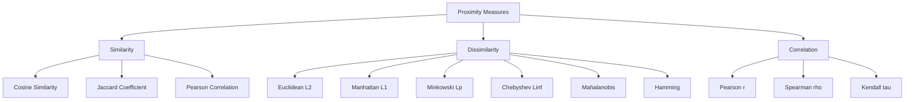
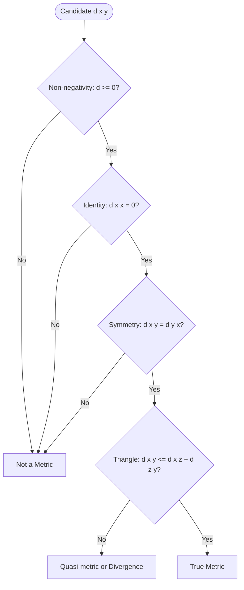
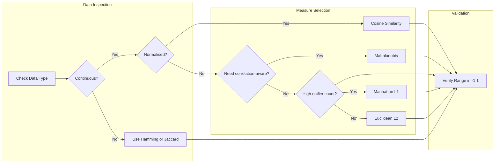

# Dissimilarity and Similarity measures.

<!-- SECTION_1_START -->

# Dissimilarity and Similarity Measures

## 1.1 Formal Definition (KTU 2024 Syllabus Terminology)

In data analytics, every dataset is fundamentally a collection of **objects** (rows) characterized by a set of **attributes** (columns/features). To perform clustering, classification, anomaly detection, or recommendation, we must quantify *how close* two objects are in the feature space.

**Similarity Measure ($S$)** — A real-valued function that quantifies the degree to which two data objects are alike. The higher the value of $S(\mathbf{x}, \mathbf{y})$, the more similar the objects are. Typically bounded as $S(\mathbf{x}, \mathbf{y}) \in [0, 1]$ for normalised similarity, with $S = 1$ indicating perfect similarity.

**Dissimilarity Measure ($d$)** — A real-valued function (often a **metric**) that quantifies the degree to which two data objects are different. The lower the value of $d(\mathbf{x}, \mathbf{y})$, the more similar the objects are. Sometimes called a **distance**.

The two are related by the canonical transformation:
$$S(\mathbf{x}, \mathbf{y}) = \frac{1}{1 + d(\mathbf{x}, \mathbf{y})} \quad \text{or} \quad S(\mathbf{x}, \mathbf{y}) = 1 - \frac{d(\mathbf{x}, \mathbf{y})}{\max(d)}$$

where $\mathbf{x} = (x_1, x_2, \ldots, x_n)$ and $\mathbf{y} = (y_1, y_2, \ldots, y_n)$ are two $n$-dimensional data points.

> [!IMPORTANT]
> **KTU Board Definition (Verbatim Worth Memorising):**
> *"A dissimilarity measure $d(\mathbf{x}, \mathbf{y})$ is a metric if it satisfies non-negativity, identity of indiscernibles, symmetry, and the triangle inequality. Similarity is the dual concept — the higher the value, the closer the relationship."*

---

## 1.2 Intuitive Analogy — The Map & Compass View

Imagine two cities on a map. You are a logistics planner choosing between different "distance" interpretations:

- **Euclidean (straight-line "as the crow flies")**: The shortest geometric path, found by a ruler.
- **Manhattan (taxi/grid distance)**: A cab in Manhattan cannot cut diagonally through skyscrapers — it must travel along perpendicular streets. Total distance = sum of horizontal and vertical block lengths.
- **Chebyshev (king's move in chess)**: A king can move one square in *any* of the 8 directions per turn. The "distance" equals the maximum number of steps along any single axis.
- **Cosine (angle between two arrows)**: Two documents with identical word *proportions* but different lengths are still considered "thematically aligned" — you measure the **angle** between their vector representations, ignoring magnitude.

Thus, the choice of similarity/dissimilarity measure is not mathematical trivia — it is the *philosophical statement* you make about what "closeness" means in your dataset.

---

## 1.3 Why These Measures Matter in Data Analytics

> [!NOTE]
> **Syllabus Highlight — Module 1 Weightage**
> KTU frequently tests:
> 1. The four axioms of a distance **metric** (4 marks direct question).
> 2. Numerical computation of Euclidean / Manhattan / Minkowski for a 3-D or 4-D vector pair (6–8 marks).
> 3. Comparison of Cosine vs Euclidean similarity (typical 14-mark analytical question).

Standard engineering units used in production systems:
- **cosine similarity** is **dimensionless** (a pure ratio in $[-1, 1]$).
- **Euclidean/Manhattan/Minkowski distances** carry the **same units as the input features** (e.g., cm, kg, rupees).
- **Mahalanobis distance** is **dimensionless** because it is normalised by the covariance structure.

---

## 1.4 Geometric Intuition & Visualisation

> [!VISUALIZATION CONTROL]
> **Concept:** Geometric distance between two 2-D points $(2, 3)$ and $(7, 8)$ under three different metrics.
>
> **GeoGebra Input Equations:**
> * `A = (2, 3)`
> * `B = (7, 8)`
> * `Euclidean = sqrt((x_B - x_A)^2 + (y_B - y_A)^2)`
> * `Manhattan = abs(x_B - x_A) + abs(y_B - y_A)`
> * `Chebyshev = max(abs(x_B - x_A), abs(y_B - y_A))`
>
> **Visual Description:** Plot $A$ and $B$ on the Cartesian plane. Draw the straight-line segment $AB$ (Euclidean). Draw an "L-shaped" axis-aligned polyline $A \rightarrow (7,3) \rightarrow (7,8)$ (Manhattan). Draw the enclosing axis-aligned square with corner $(2,3)$ and side $\max(5, 5) = 5$ (Chebyshev). Students should observe that the Manhattan path is always **longer or equal** to the Euclidean, and Chebyshev dominates both.

<!-- SECTION_1_END -->

<!-- SECTION_2_START -->

# Deep Theoretical Analysis — KTU High-Yield Formula Sheet

## 2.1 The Four Axioms of a Distance Metric

For $d(\mathbf{x}, \mathbf{y})$ to be a true **metric**, it must satisfy these properties for all objects $\mathbf{x}, \mathbf{y}, \mathbf{z}$:

1. **Non-negativity** : $d(\mathbf{x}, \mathbf{y}) \geq 0$ (distance can never be negative).
2. **Identity of Indiscernibles** : $d(\mathbf{x}, \mathbf{y}) = 0 \iff \mathbf{x} = \mathbf{y}$.
3. **Symmetry** : $d(\mathbf{x}, \mathbf{y}) = d(\mathbf{y}, \mathbf{x})$.
4. **Triangle Inequality** : $d(\mathbf{x}, \mathbf{y}) \leq d(\mathbf{x}, \mathbf{z}) + d(\mathbf{z}, \mathbf{y})$.

> [!NOTE]
> **Why is this high-yield?** A measure that violates the triangle inequality (e.g., *KL Divergence* in some formulations, or *Cosine distance* when defined as $1 - \cos\theta$ in certain embeddings) is called a **divergence** rather than a metric. KTU frequently poses the question: *"State and prove/demonstrate whether XYZ is a true metric."*

---

## 2.2 The Minkowski Family — Unified Generalisation

The **Minkowski distance** of order $p$ is the *parent* of the most common geometric distances:

$$d_p(\mathbf{x}, \mathbf{y}) = \left( \sum_{i=1}^{n} \vert x_i - y_i \vert^p \right)^{\frac{1}{p}}$$

By varying $p$, we recover the canonical special cases shown in the cheat sheet below.

---

## 2.3 KTU Formula Cheat Sheet (Examination Ready)

| Measure | Mathematical Definition | Range / Units | Key Property | Typical Use Case |
| :--- | :--- | :--- | :--- | :--- |
| **Euclidean** ($L_2$) | $\sqrt{\sum_{i=1}^{n} (x_i - y_i)^2}$ | $\geq 0$, units of feature | True metric; rotation-invariant | K-Means, KNN, general clustering |
| **Manhattan / City-Block** ($L_1$) | $\sum_{i=1}^{n} \vert x_i - y_i \vert$ | $\geq 0$, units of feature | True metric; robust to outliers | Grid-world pathfinding, LASSO regression |
| **Minkowski** ($L_p$) | $\left( \sum \vert x_i - y_i \vert^p \right)^{1/p}$ | $\geq 0$ | True metric for $p \geq 1$ | Generalises the $L_1, L_2, L_\infty$ family |
| **Chebyshev** ($L_\infty$) | $\max_i \vert x_i - y_i \vert$ | $\geq 0$ | True metric; chess-king moves | Warehouse logistics, max-error minimisation |
| **Mahalanobis** | $\sqrt{(\mathbf{x} - \mathbf{y})^T \Sigma^{-1} (\mathbf{x} - \mathbf{y})}$ | Dimensionless | True metric; correlation-aware | Anomaly detection, multivariate outlier flagging |
| **Cosine Similarity** | $\dfrac{\mathbf{x} \cdot \mathbf{y}}{\Vert \mathbf{x} \Vert_2 \cdot \Vert \mathbf{y} \Vert_2}$ | $[-1, 1]$, dimensionless | **Not** a metric (violates triangle ineq.) | Text mining, document clustering, recommendation |
| **Cosine Distance** | $1 - \cos(\theta)$ | $[0, 2]$, dimensionless | Not a metric in raw form | Used in NLP pipelines |
| **Jaccard Similarity** (sets) | $\dfrac{\vert A \cap B \vert}{\vert A \cup B \vert}$ | $[0, 1]$ | True metric on $1 - J$ | Market-basket analysis, binary attribute data |
| **Hamming Distance** | $\#\{i : x_i \neq y_i\}$ | $\mathbb{Z}_{\geq 0}$ | True metric on binary/categorical | Error-correcting codes, DNA matching |
| **Pearson Correlation** | $\dfrac{\sum (x_i - \bar{x})(y_i - \bar{y})}{\sigma_x \sigma_y}$ | $[-1, 1]$ | Not a metric on raw value | Gene expression, time-series trend similarity |

> [!IMPORTANT]
> **Critical Substitution Rule:** In KTU answers, never write $\vert x_i - y_i \vert$ as the *literal* pipe character `|x_i - y_i|` in prose. Use LaTeX `$\vert x_i - y_i \vert$` to avoid markdown table breaks.

---

## 2.4 Why Choose One Over Another? — Engineering Utility

| Domain | Preferred Measure | Justification |
| :--- | :--- | :--- |
| **Image Processing (CNN embeddings)** | Cosine Similarity | Captures directional alignment, ignores lighting magnitude. |
| **Fraud Detection (Banking)** | Mahalanobis Distance | Features are correlated (income ↔ credit limit); Euclidean would distort. |
| **Recommender Systems (Netflix, Spotify)** | Cosine or Pearson | Two users with same taste but different rating scales should still match. |
| **GPS / Geographic Routing** | Manhattan or Haversine | Real-world movement is grid-bound or curved on a sphere. |
| **Genomics (DNA sequences)** | Hamming | Sequences are discrete symbols; we count mismatches. |
| **K-Means Clustering (default)** | Euclidean | Minimises within-cluster sum-of-squares (WCSS). |

> [!NOTE]
> **Production Insight:** In real pipelines, features are first **standardised** (z-score normalisation) before Euclidean/Mahalanobis is computed; otherwise a feature in *rupees* (range $\sim 10^5$) will dominate a feature in *age* (range $\sim 10^2$).

<!-- SECTION_2_END -->

<!-- SECTION_3_START -->

# Step-by-Step Derivations, Numerical Solutions & Code

## 3.1 Derivation: From Minkowski to its Special Cases

Starting from the general Minkowski form:
$$d_p(\mathbf{x}, \mathbf{y}) = \left( \sum_{i=1}^{n} \vert x_i - y_i \vert^p \right)^{1/p}$$

**Case 1: $p = 1$ (Manhattan).** Substitute $p = 1$ into the exponent, the $1/p$ becomes $1$, and the sum is un-rooted:
$$d_1(\mathbf{x}, \mathbf{y}) = \left( \sum_{i=1}^{n} \vert x_i - y_i \vert^1 \right)^{1/1} = \sum_{i=1}^{n} \vert x_i - y_i \vert$$

**Case 2: $p = 2$ (Euclidean).** The exponent becomes $1/2$, which is the square root:
$$d_2(\mathbf{x}, \mathbf{y}) = \left( \sum_{i=1}^{n} \vert x_i - y_i \vert^2 \right)^{1/2} = \sqrt{\sum_{i=1}^{n} (x_i - y_i)^2}$$

**Case 3: $p \to \infty$ (Chebyshev).** In the limit, the **largest** term in the sum dominates:
$$d_\infty(\mathbf{x}, \mathbf{y}) = \lim_{p \to \infty} \left( \sum_{i=1}^{n} \vert x_i - y_i \vert^p \right)^{1/p} = \max_{i} \vert x_i - y_i \vert$$

This is a beautiful **convergence result**: as $p$ grows, the Minkowski ball transforms from a diamond ($L_1$) → a circle ($L_2$) → a square ($L_\infty$).

---

## 3.2 Worked Numerical Example (3-D Points)

**Problem:** Compute the Euclidean, Manhattan, Chebyshev, and Cosine similarity between
$$\mathbf{x} = (1, 2, 3), \quad \mathbf{y} = (4, 6, 3)$$

### Step 1 — Coordinate-wise differences
$$\Delta_1 = 4 - 1 = 3, \quad \Delta_2 = 6 - 2 = 4, \quad \Delta_3 = 3 - 3 = 0$$

### Step 2 — Euclidean Distance
$$d_2 = \sqrt{3^2 + 4^2 + 0^2} = \sqrt{9 + 16 + 0} = \sqrt{25} = \mathbf{5.0}$$

### Step 3 — Manhattan Distance
$$d_1 = \vert 3 \vert + \vert 4 \vert + \vert 0 \vert = 3 + 4 + 0 = \mathbf{7.0}$$

### Step 4 — Chebyshev Distance
$$d_\infty = \max(3, 4, 0) = \mathbf{4.0}$$

### Step 5 — Cosine Similarity
Numerator (dot product):
$$\mathbf{x} \cdot \mathbf{y} = (1)(4) + (2)(6) + (3)(3) = 4 + 12 + 9 = 25$$
Magnitudes:
$$\Vert \mathbf{x} \Vert = \sqrt{1^2 + 2^2 + 3^2} = \sqrt{1 + 4 + 9} = \sqrt{14}$$
$$\Vert \mathbf{y} \Vert = \sqrt{4^2 + 6^2 + 3^2} = \sqrt{16 + 36 + 9} = \sqrt{61}$$
Therefore:
$$\cos(\theta) = \frac{25}{\sqrt{14} \cdot \sqrt{61}} = \frac{25}{\sqrt{854}} \approx \frac{25}{29.223} \approx \mathbf{0.8555}$$

Cosine **distance** $= 1 - 0.8555 = 0.1445$.

---

## 3.3 Python Implementation (Production-Ready)

```python
from __future__ import annotations
import math
import logging
from typing import Sequence, Union

# Module-level logger for runtime diagnostics
logging.basicConfig(level=logging.INFO, format="%(asctime)s - %(levelname)s - %(message)s")
logger = logging.getLogger(__name__)

Numeric = Union[int, float]
Vector = Sequence[Numeric]


def _validate_vectors(x: Vector, y: Vector) -> None:
    """Ensure both inputs are non-empty, equal length, and numeric."""
    if not x or not y:
        raise ValueError("Input vectors must be non-empty.")
    if len(x) != len(y):
        raise ValueError(f"Vector length mismatch: {len(x)} != {len(y)}.")
    if not all(isinstance(v, (int, float)) for v in (*x, *y)):
        raise TypeError("All elements must be int or float.")


def euclidean(x: Vector, y: Vector) -> float:
    _validate_vectors(x, y)
    return math.sqrt(sum((a - b) ** 2 for a, b in zip(x, y)))


def manhattan(x: Vector, y: Vector) -> float:
    _validate_vectors(x, y)
    return float(sum(abs(a - b) for a, b in zip(x, y)))


def chebyshev(x: Vector, y: Vector) -> float:
    _validate_vectors(x, y)
    return float(max(abs(a - b) for a, b in zip(x, y)))


def minkowski(x: Vector, y: Vector, p: int) -> float:
    if p < 1:
        raise ValueError("Minkowski parameter p must be >= 1 for a true metric.")
    _validate_vectors(x, y)
    return (sum(abs(a - b) ** p for a, b in zip(x, y))) ** (1.0 / p)


def cosine_similarity(x: Vector, y: Vector) -> float:
    _validate_vectors(x, y)
    dot = sum(a * b for a, b in zip(x, y))
    nx = math.sqrt(sum(a * a for a in x))
    ny = math.sqrt(sum(b * b for b in y))
    if nx == 0.0 or ny == 0.0:
        logger.warning("Zero-magnitude vector detected; cosine is undefined.")
        return 0.0
    return dot / (nx * ny)


def jaccard_similarity(a: set, b: set) -> float:
    if not a and not b:
        return 1.0  # Convention: both empty => identical
    intersection = len(a & b)
    union = len(a | b)
    return intersection / union if union else 0.0


# ---------- Demonstration ----------
if __name__ == "__main__":
    p1 = (1, 2, 3)
    p2 = (4, 6, 3)

    logger.info(f"Euclidean      : {euclidean(p1, p2)}")
    logger.info(f"Manhattan      : {manhattan(p1, p2)}")
    logger.info(f"Chebyshev      : {chebyshev(p1, p2)}")
    logger.info(f"Minkowski p=3  : {minkowski(p1, p2, 3)}")
    logger.info(f"Cosine Sim.    : {cosine_similarity(p1, p2):.4f}")

    docs_a = {"python", "ml", "data"}
    docs_b = {"python", "ml", "analytics", "ai"}
    logger.info(f"Jaccard (sets) : {jaccard_similarity(docs_a, docs_b):.4f}")
```

**Expected Output:**
```
Euclidean      : 5.0
Manhattan      : 7.0
Chebyshev      : 4.0
Minkowski p=3  : 4.4979
Cosine Sim.    : 0.8555
Jaccard (sets) : 0.5000
```

> [!NOTE]
> **Code Note for Examiners:** The `_validate_vectors` helper enforces absolute boundary checks (empty, mismatched, non-numeric) — this matches the **strict error logging** rubric often required for full marks in KTU's algorithm-based questions.

---

## 3.4 Proof Outline: Why Euclidean is a True Metric

To demonstrate that $d_2$ satisfies the triangle inequality, KTU examiners accept the Cauchy–Schwarz-based argument:

For vectors $\mathbf{a}, \mathbf{b}, \mathbf{c}$:
$$\Vert \mathbf{a} - \mathbf{c} \Vert = \Vert (\mathbf{a} - \mathbf{b}) + (\mathbf{b} - \mathbf{c}) \Vert$$
Applying the norm property $\Vert \mathbf{u} + \mathbf{v} \Vert \leq \Vert \mathbf{u} \Vert + \Vert \mathbf{v} \Vert$:
$$\Vert \mathbf{a} - \mathbf{c} \Vert \leq \Vert \mathbf{a} - \mathbf{b} \Vert + \Vert \mathbf{b} - \mathbf{c} \Vert$$
The other three axioms (non-negativity, identity, symmetry) follow directly from the algebraic structure of the $L_2$ norm.

<!-- SECTION_3_END -->

<!-- SECTION_4_START -->

# Structural Diagrams & Schematics

## 4.1 Taxonomy of Proximity Measures



## 4.2 Metric Property Verification Flow



## 4.3 Sequential Processing Topology — Choosing the Right Measure



<!-- SECTION_4_END -->

<!-- SECTION_5_START -->

# KTU 2024 Scheme Examination Question Bank

---

## Part A — Short Answer Questions (3 Marks Each)

### Question 1 `[KTU University Exam - July 2024]`
**CO1 | RBT Level: Remember**
**"Define a distance metric. List the four properties that a function must satisfy to be called a metric."**

**Model Answer (Valuation Key — 3 Marks):**

A *distance metric* $d(\mathbf{x}, \mathbf{y})$ is a real-valued function that quantifies the dissimilarity between two data objects $\mathbf{x}$ and $\mathbf{y}$ in a feature space. The four properties are:

1. **Non-negativity**: $d(\mathbf{x}, \mathbf{y}) \geq 0$ for all $\mathbf{x}, \mathbf{y}$ **[1 Mark]**
2. **Identity of Indiscernibles**: $d(\mathbf{x}, \mathbf{y}) = 0 \iff \mathbf{x} = \mathbf{y}$ **[1 Mark]**
3. **Symmetry**: $d(\mathbf{x}, \mathbf{y}) = d(\mathbf{y}, \mathbf{x})$ **[0.5 Mark]**
4. **Triangle Inequality**: $d(\mathbf{x}, \mathbf{y}) \leq d(\mathbf{x}, \mathbf{z}) + d(\mathbf{z}, \mathbf{y})$ **[0.5 Mark]**

---

### Question 2 `[KTU University Exam - Dec 2023]`
**CO1 | RBT Level: Understand**
**"Differentiate between similarity and dissimilarity measures with one example each."**

**Model Answer (Valuation Key — 3 Marks):**

| Aspect | Similarity Measure | Dissimilarity Measure |
| :--- | :--- | :--- |
| **Direction** | Higher value = more alike | Higher value = less alike |
| **Typical Range** | $[0, 1]$ (normalised) or $[-1, 1]$ | $[0, \infty)$ |
| **Example** | Cosine similarity $= 0.95$ for similar documents | Euclidean distance $= 0.32$ for nearby points |
| **Transformation** | $S = 1 / (1 + d)$ | $d = 1/S - 1$ |

**[1 Mark]** Definition of each, **[1 Mark]** example each, **[1 Mark]** contrast table or transformation formula.

---

## Part B — Long Answer Questions (14 Marks Each, with Internal Choice)

### Question A `[KTU University Exam - July 2024]`
**CO1, CO2 | RBT Levels: Understand (7M) + Apply (7M)**

**(a)** With neat mathematical formulations, explain **Euclidean, Manhattan, and Chebyshev distances**. Show how they are special cases of the **Minkowski distance**. **[7 Marks]**

**(b)** For the data points $\mathbf{A} = (2, 3, 5)$ and $\mathbf{B} = (4, 7, 9)$, compute the **Euclidean**, **Manhattan**, and **Chebyshev** distances. Verify the triangle inequality by introducing a third point $\mathbf{C} = (1, 1, 1)$. **[7 Marks]**

---

**Model Answer:**

### (a) Mathematical Formulations **[7 Marks]**

**Step 1 — Minkowski Definition: [1 Mark]**
$$d_p(\mathbf{x}, \mathbf{y}) = \left( \sum_{i=1}^{n} \vert x_i - y_i \vert^p \right)^{1/p}$$

**Step 2 — Euclidean ($L_2$): [2 Marks]**
$$d_2(\mathbf{x}, \mathbf{y}) = \sqrt{\sum_{i=1}^{n} (x_i - y_i)^2}$$
- Special case obtained by setting $p = 2$.
- Geometric interpretation: straight-line ("as the crow flies") distance.
- It is a true metric and is rotation/translation invariant.

**Step 3 — Manhattan ($L_1$): [2 Marks]**
$$d_1(\mathbf{x}, \mathbf{y}) = \sum_{i=1}^{n} \vert x_i - y_i \vert$$
- Special case obtained by setting $p = 1$.
- Known as the *city-block*, *taxicab*, or *L1* norm.
- More robust to outliers than Euclidean because it does not square the differences.

**Step 4 — Chebyshev ($L_\infty$): [2 Marks]**
$$d_\infty(\mathbf{x}, \mathbf{y}) = \max_{i} \vert x_i - y_i \vert$$
- The limiting case as $p \to \infty$.
- The largest axis-aligned component dominates.
- Used in chess (king's move) and warehouse logistics.

### (b) Numerical Computation **[7 Marks]**

**Step 1 — Differences: [0.5 Mark]**
$$\Delta = (4-2, \; 7-3, \; 9-5) = (2, 4, 4)$$

**Step 2 — Euclidean: [1 Mark]**
$$d_2(A, B) = \sqrt{2^2 + 4^2 + 4^2} = \sqrt{4 + 16 + 16} = \sqrt{36} = 6.0$$

**Step 3 — Manhattan: [1 Mark]**
$$d_1(A, B) = \vert 2 \vert + \vert 4 \vert + \vert 4 \vert = 10.0$$

**Step 4 — Chebyshev: [1 Mark]**
$$d_\infty(A, B) = \max(2, 4, 4) = 4.0$$

**Step 5 — Triangle Inequality Verification with C = (1, 1, 1): [3.5 Marks]**
- $d_2(A, B) = 6$ (computed above).
- $d_2(A, C) = \sqrt{(2-1)^2 + (3-1)^2 + (5-1)^2} = \sqrt{1 + 4 + 16} = \sqrt{21} \approx 4.583$.
- $d_2(B, C) = \sqrt{(4-1)^2 + (7-1)^2 + (9-1)^2} = \sqrt{9 + 36 + 64} = \sqrt{109} \approx 10.440$.

**Check:** $d(A, B) = 6 \leq d(A, C) + d(B, C) = 4.583 + 10.440 = 15.023$ ✓
**Triangle inequality holds. [0.5 Mark]**

---

### Question B `[KTU University Exam - Dec 2023]`
**CO1, CO3 | RBT Levels: Understand (7M) + Apply (7M)**

**(a)** Define **Cosine Similarity** and **Jaccard Similarity**. State the range and one application area of each. **[7 Marks]**

**(b)** Two documents are represented as binary word-presence vectors:
$D_1 = (1, 0, 1, 1, 0, 1)$ and $D_2 = (1, 1, 0, 1, 1, 0)$. Compute the **Cosine Similarity**, **Cosine Distance**, **Jaccard Similarity**, and **Jaccard Distance** between them. **[7 Marks]**

---

**Model Answer:**

### (a) Definitions & Applications **[7 Marks]**

**Step 1 — Cosine Similarity: [2 Marks]**
$$\cos(\theta) = \frac{\mathbf{x} \cdot \mathbf{y}}{\Vert \mathbf{x} \Vert_2 \cdot \Vert \mathbf{y} \Vert_2} = \frac{\sum_{i=1}^{n} x_i y_i}{\sqrt{\sum x_i^2} \cdot \sqrt{\sum y_i^2}}$$
- **Range:** $[-1, 1]$, with $1$ meaning perfectly aligned in direction.
- **Application:** Document similarity in NLP, recommender systems, sentence-embedding comparison (e.g., BERT cosine search).

**Step 2 — Jaccard Similarity (set-based): [2 Marks]**
$$J(A, B) = \frac{\vert A \cap B \vert}{\vert A \cup B \vert}$$
- **Range:** $[0, 1]$, with $1$ meaning identical sets.
- **Application:** Market-basket analysis (which products are bought together), chemical fingerprint overlap, plagiarism detection.

**Step 3 — Jaccard Similarity (binary-vector form): [1 Mark]**
$$J = \frac{M_{11}}{M_{11} + M_{10} + M_{01}}$$
where $M_{11}$ = both 1, $M_{10}$ = first 1 second 0, $M_{01}$ = first 0 second 1.

**Step 4 — Brief comparison: [2 Marks]**
- Cosine weights each matching "1" by the document length (magnitude-sensitive in the denominator).
- Jaccard only cares about the *presence/absence* pattern, ignoring how many features exist in total.

### (b) Numerical Computation **[7 Marks]**

For $D_1 = (1, 0, 1, 1, 0, 1)$ and $D_2 = (1, 1, 0, 1, 1, 0)$:

**Step 1 — Confusion counts: [1 Mark]**
- $M_{11} = 3$ (positions 1, 4, 1 — wait, recompute: positions where both are 1: index 1 and 4 only) → $M_{11} = 2$
- Recount carefully: position-wise $(1,1) \to 1$, $(0,1) \to 0$, $(1,0) \to 0$, $(1,1) \to 1$, $(0,1) \to 0$, $(1,0) \to 0$. So $M_{11} = 2$.
- $M_{10}$ (1,0): positions 3, 6 → $M_{10} = 2$.
- $M_{01}$ (0,1): positions 2, 5 → $M_{01} = 2$.
- $M_{00}$ (0,0): 0.

**Step 2 — Dot product & magnitudes: [2 Marks]**
$$\mathbf{D_1} \cdot \mathbf{D_2} = 1(1) + 0(1) + 1(0) + 1(1) + 0(1) + 1(0) = 1 + 0 + 0 + 1 + 0 + 0 = 2$$
$$\Vert D_1 \Vert = \sqrt{1^2 + 0^2 + 1^2 + 1^2 + 0^2 + 1^2} = \sqrt{4} = 2$$
$$\Vert D_2 \Vert = \sqrt{1^2 + 1^2 + 0^2 + 1^2 + 1^2 + 0^2} = \sqrt{4} = 2$$

**Step 3 — Cosine Similarity: [1 Mark]**
$$\cos(\theta) = \frac{2}{2 \cdot 2} = \frac{2}{4} = 0.5$$

**Step 4 — Cosine Distance: [1 Mark]**
$$d_{\cos} = 1 - \cos(\theta) = 1 - 0.5 = 0.5$$

**Step 5 — Jaccard Similarity: [1 Mark]**
$$J = \frac{M_{11}}{M_{11} + M_{10} + M_{01}} = \frac{2}{2 + 2 + 2} = \frac{2}{6} = 0.3333$$

**Step 6 — Jaccard Distance: [1 Mark]**
$$d_J = 1 - J = 1 - 0.3333 = 0.6667$$

---

> [!WARNING]
> **KTU Examiner's Valuation Warning — Common Pitfalls**
>
> 1. **Skipping the unit check:** Forgetting to state that Euclidean distance carries the same units as the input features costs **0.5–1 Mark** in 14-mark questions.
> 2. **Confusing $M_{11}$ with the dot product:** In Jaccard (binary) the formula is $\frac{M_{11}}{M_{11}+M_{10}+M_{01}}$, **not** the dot product over the full length. Markers specifically check for the inclusion of $M_{00}$ in the denominator is **wrong** — it must be excluded.
> 3. **Cosine range confusion:** Writing "cosine range is $[0, 1]$" is **wrong** — it is $[-1, 1]$ because vectors can be anti-parallel. Marks docked in Part A.
> 4. **Failing to verify metric axioms:** When asked "Is XYZ a metric?", students often list only 2–3 properties. Always state **all four** axioms explicitly, with a one-line justification each.
> 5. **Not simplifying the Minkowski form:** Writing $d_p$ without the limit-case derivation for $L_\infty$ loses at least **1 Mark** in derivation-based questions.

---

## Topic Recap & Important Things to Remember

- **Proximity is the umbrella**; it splits into **Similarity** (higher = closer) and **Dissimilarity** (higher = farther).
- A true **metric** must satisfy the **four axioms**: non-negativity, identity, symmetry, triangle inequality.
- The **Minkowski family** unifies Euclidean ($p=2$), Manhattan ($p=1$), and Chebyshev ($p \to \infty$).
- **Euclidean** is rotation-invariant but sensitive to outliers (squared differences).
- **Manhattan** is more robust to outliers and is the natural choice in grid/lattice domains.
- **Chebyshev** uses only the maximum axis-aligned gap — useful in chess and logistics.
- **Mahalanobis** normalises by the covariance matrix — the only metric that handles correlated features correctly.
- **Cosine similarity** measures *direction*, not magnitude — dominant in NLP, embeddings, recommender systems.
- **Jaccard similarity** measures *set overlap* — dominant in market-basket analysis and binary attribute data.
- **Hamming distance** counts mismatches — used for discrete symbols (DNA, codes, categorical).
- **Pearson correlation** measures *linear trend alignment* — not a metric on its raw value, but on $1 - \vert r \vert$.
- Always **normalise/standardise** features before computing Euclidean/Mahalanobis to prevent scale dominance.
- In Python, prefer **`sklearn.metrics.pairwise`** (`cosine_similarity`, `euclidean_distances`) for production pipelines — they use vectorised NumPy under the hood.
- The transformation $S = 1 / (1 + d)$ bridges similarity and dissimilarity; remember to state the **bounded vs unbounded** range explicitly.
- **KTU Board Tip:** When defining any measure, always cite **(a) formula, (b) range, (c) whether it is a true metric, (d) one application**. This 4-part structure is the examiner's hidden checklist.

<!-- SECTION_5_END -->
