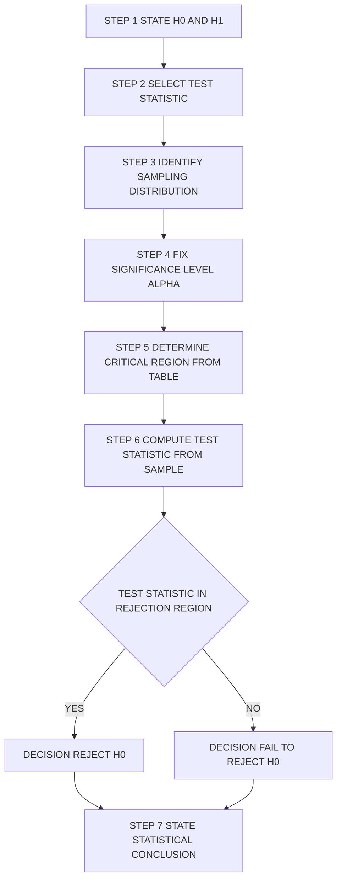
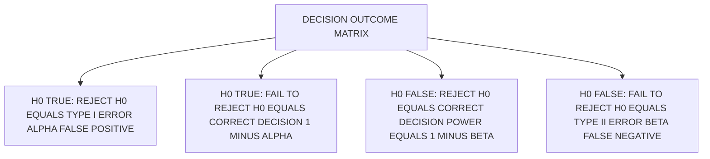
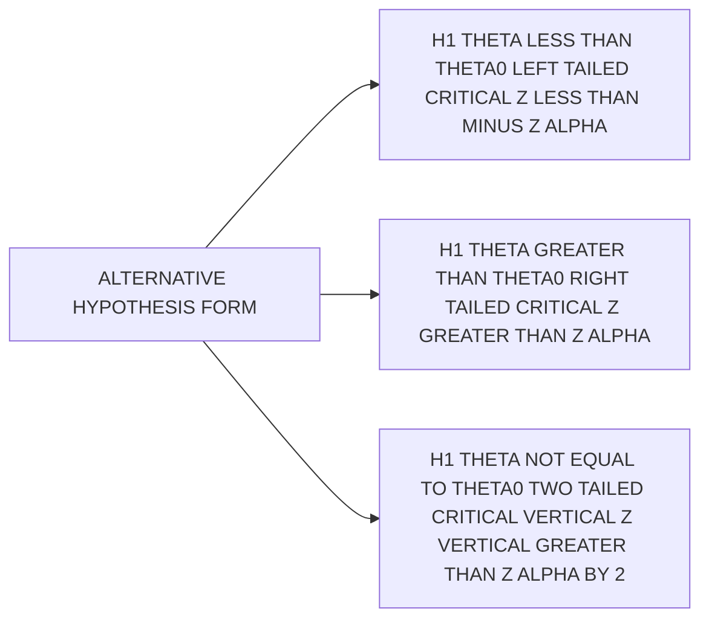
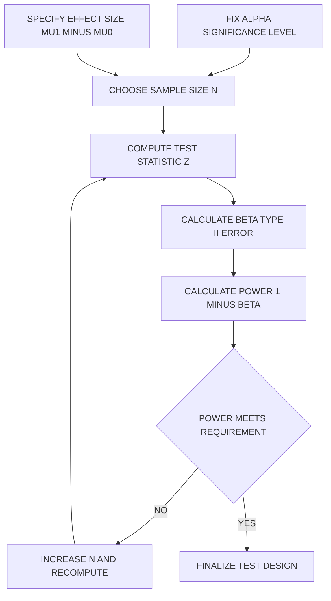

# Hypothesis Testing - Basic definitions

<!-- SECTION_1_START -->
# Hypothesis Testing – Basic Definitions

> [!NOTE]
> **KTU 2024 Scheme – DATA ANALYTICS (PECST523)**
> **Module 1:** Introduction to Data Analytics
> **Topic:** Hypothesis Testing – Basic Definitions
> **Mapping:** CO1 | RBT Level: Understand

## 1.1 Formal Academic Definition

**Hypothesis Testing** is a formal statistical inference procedure used to make decisions about population parameters by evaluating evidence drawn from a random sample. It is a systematic method of determining whether the observed sample data provides sufficient evidence to reject a pre-stated claim (the **null hypothesis**) in favour of an alternative claim (the **alternative hypothesis**).

Mathematically, a **statistical hypothesis** is a statement (or assertion) about the **distribution** of one or more random variables. In most engineering applications, it is a statement about the value of a population parameter $\theta$ (such as the population mean $\mu$, variance $\sigma^2$, or proportion $p$).

$$
H : \theta \in \Theta_0 \quad \text{vs.} \quad \theta \in \Theta_1
$$

where $\Theta_0$ and $\Theta_1$ are disjoint subsets of the parameter space $\Theta$.

> [!IMPORTANT]
> **Core KTU Definition**
> A **Hypothesis** is any statement (or claim) about the probability distribution of one or more random variables. A **Test of Hypothesis** is a rule or procedure that decides, on the basis of sample observations, whether to accept or reject the hypothesis under test.

## 1.2 Intuitive Analogy – The Courtroom Trial

Imagine a **criminal courtroom trial**:

| Courtroom Concept | Statistical Equivalent |
|-------------------|------------------------|
| Defendant is "presumed innocent" | **Null Hypothesis ($H_0$)** is assumed true by default |
| Prosecutor's burden to prove "guilty" | Sample data must provide evidence against $H_0$ |
| "Beyond reasonable doubt" | **Significance level $\alpha$** (typically **0.05**) |
| Jury verdict: Guilty or Not Guilty | **Reject $H_0$** or **Fail to Reject $H_0$** |
| Wrongly convicting an innocent person | **Type I Error** (false positive) |
| Letting a guilty person go free | **Type II Error** (false negative) |

This analogy clarifies a critical point: in hypothesis testing, we **never "prove" $H_0$ true**; we only **fail to reject** it due to insufficient evidence.

## 1.3 Key Terminology at a Glance

> [!IMPORTANT]
> **Primary Hypothesis Pair**
> * **Null Hypothesis ($H_0$):** A statement of *no effect*, *no difference*, or *status quo*. It is the hypothesis being tested directly.
> * **Alternative Hypothesis ($H_1$ or $H_a$):** A statement that contradicts $H_0$. It represents the effect, difference, or change the researcher wants to establish.

> [!IMPORTANT]
> **Two Fundamental Classification Types**
> * **Simple Hypothesis:** A hypothesis that completely specifies the population distribution (e.g., $H_0 : \mu = 50$ and $\sigma^2 = 4$).
> * **Composite Hypothesis:** A hypothesis that does *not* completely specify the distribution (e.g., $H_1 : \mu > 50$, or $H_0 : \mu \le 50$).

> [!VISUALIZATION CONTROL]
> **Concept:** Standard Normal Distribution with Critical (Rejection) Regions for a Two-Tailed Test
> **GeoGebra / Desmos Input Equations:**
> * `f(x) = (1 / sqrt(2*pi)) * exp(-x^2 / 2)` (Standard Normal PDF)
> * `x_critical_left = -1.96` and `x_critical_right = 1.96` (for $\alpha = 0.05$)
> * Shade region: `x <= -1.96 OR x >= 1.96` (Rejection Region)
> * Shade region: `-1.96 < x < 1.96` (Acceptance Region)
> **Visual Description:** The student should observe a symmetric bell curve centred at $0$. Two vertical lines at $\pm 1.96$ divide the area under the curve. The small tails beyond these lines (combined area = **0.05**) form the **Rejection Region**; the central area (0.95) is the **Acceptance (Non-Rejection) Region**.

## 1.4 Why Hypothesis Testing is Indispensable in Data Analytics

In modern data analytics workflows, hypothesis testing is the **engine of decision-making**:

* **A/B Testing in Tech:** Determining whether a new UI design increases click-through rate.
* **Machine Learning:** Comparing the accuracy of two classification models.
* **Quality Engineering:** Verifying whether a manufacturing process meets the Six-Sigma tolerance.
* **Biostatistics & Pharma:** Validating whether a new drug is significantly more effective than a placebo.
* **Finance:** Detecting whether a stock return anomaly is statistically significant or mere random noise.

> [!NOTE]
> **Standard Engineering Benchmarks**
> The most commonly used significance level is **$\alpha = 0.05$**, corresponding to a 95% confidence level. In mission-critical applications (aerospace, medical devices), **$\alpha = 0.01$** is preferred.

---

<!-- SECTION_1_END -->

<!-- SECTION_2_START -->
# Deep Theoretical Analysis & KTU High-Yield Formula Sheet

## 2.1 Structural Classification of Hypotheses

### A. By Nature of Claim

| Type | Meaning | Typical Form |
|------|---------|--------------|
| **Null Hypothesis ($H_0$)** | Statement of no change / no effect | $H_0 : \theta = \theta_0$ |
| **Alternative Hypothesis ($H_1$)** | The research claim | $H_1 : \theta \ne \theta_0$ or $\theta > \theta_0$ or $\theta < \theta_0$ |

### B. By Specificity of Distribution

| Type | Definition | Example |
|------|------------|---------|
| **Simple** | Parameter is fixed to a single value | $H_0 : \mu = 100, \sigma^2 = 25$ |
| **Composite** | Parameter lies within a set of values | $H_1 : \mu > 100$ or $H_0 : \mu \le 100$ |

## 2.2 The Seven-Step Hypothesis Testing Procedure

1. **State the Hypotheses:** Formulate the null ($H_0$) and alternative ($H_1$) hypotheses from the research problem.
2. **Choose the Test Statistic:** Select a statistic (Z, t, $\chi^2$, F) that summarizes sample information.
3. **Determine the Sampling Distribution:** Identify the probability distribution of the test statistic under $H_0$.
4. **Fix the Significance Level $\alpha$:** Pre-decide the probability of Type I error (commonly **0.05** or **0.01**).
5. **Determine the Critical Region:** Find the critical value(s) that define the rejection region from the chosen distribution table.
6. **Compute the Test Statistic:** Substitute sample values and calculate the numerical value of the statistic.
7. **Make the Decision:** * If the test statistic falls inside the critical region $\rightarrow$ **Reject $H_0$**.
    * If the test statistic falls outside the critical region $\rightarrow$ **Fail to Reject $H_0$**.

## 2.3 Errors in Decision-Making

When we make a decision, **two wrongs** are possible:

| Decision | $H_0$ is True | $H_0$ is False |
|----------|---------------|----------------|
| **Reject $H_0$** | **Type I Error** ($\alpha$) – False Positive | **Correct Decision** (Power $= 1 - \beta$) |
| **Fail to Reject $H_0$** | **Correct Decision** ($1 - \alpha$) | **Type II Error** ($\beta$) – False Negative |

> [!IMPORTANT]
> **Key Engineering Insight**
> * The **significance level $\alpha$** is set *before* sampling and is under the analyst's control.
> * The **Type II error $\beta$** depends on the true (unknown) value of the parameter, the sample size $n$, and $\alpha$. It is *not* directly fixed by the analyst.
> * **Power of the Test $= 1 - \beta$** is the probability of correctly detecting a true effect.

## 2.4 One-Tailed vs. Two-Tailed Tests

| Test Type | Alternative Form | Rejection Region (Z-test, $\alpha = 0.05$) |
|-----------|------------------|----------------------------------------------|
| **Right-Tailed** | $H_1 : \theta > \theta_0$ | $Z > 1.645$ |
| **Left-Tailed** | $H_1 : \theta < \theta_0$ | $Z < -1.645$ |
| **Two-Tailed** | $H_1 : \theta \ne \theta_0$ | $Z < -1.96$ or $Z > 1.96$ |

> [!NOTE]
> **KTU Memory Trick:** The "tail" in the alternative points toward the rejection region. If $H_1$ uses "$\ne$", the test is always two-tailed.

## 2.5 KTU Formula Sheet / Cheat Sheet

> [!IMPORTANT]
> The following table contains the **high-yield definitions and formulas** for hypothesis testing. Master this table before attempting any KTU numerical.

| # | Concept | Mathematical Formulation | Plain-English Meaning |
|---|---------|--------------------------|------------------------|
| 1 | Null Hypothesis | $H_0 : \theta = \theta_0$ | Statement of no effect |
| 2 | Alternative Hypothesis | $H_1 : \theta \ne \theta_0$ | Research claim |
| 3 | Type I Error | $\alpha = P(\text{Reject } H_0 \mid H_0 \text{ true})$ | False positive |
| 4 | Type II Error | $\beta = P(\text{Fail to reject } H_0 \mid H_1 \text{ true})$ | False negative |
| 5 | Power of Test | $1 - \beta$ | Correctly rejecting a false $H_0$ |
| 6 | Significance Level | $\alpha$ (pre-decided) | Tolerable false-positive rate |
| 7 | p-value | Smallest $\alpha$ at which $H_0$ is rejected | Strength of evidence against $H_0$ |
| 8 | Confidence Level | $1 - \alpha$ | Probability of correct non-rejection |
| 9 | Z-test Statistic | $Z = \dfrac{\bar{X} - \mu_0}{\sigma / \sqrt{n}}$ | Used when $\sigma$ is known, $n \ge 30$ |
| 10 | t-test Statistic | $t = \dfrac{\bar{X} - \mu_0}{s / \sqrt{n}}, \text{ df} = n-1$ | Used when $\sigma$ is unknown, $n < 30$ |
| 11 | Critical Region | $\vert Z \vert > Z_{\alpha/2}$ (two-tailed) | Region of rejection |
| 12 | Acceptance Region | $-Z_{\alpha/2} < Z < Z_{\alpha/2}$ | Region of non-rejection |
| 13 | Sample Size Formula | $n = \dfrac{(Z_{\alpha/2} + Z_{\beta})^2 \cdot 2\sigma^2}{(\mu_1 - \mu_0)^2}$ | Required $n$ to achieve given $\alpha, \beta$ |

> [!NOTE]
> **CRITICAL FORMATTING RULE:** The vertical bar in conditional probability (e.g., $P(A \mid B)$) and the absolute value in critical region formulas must use **\mid** or **\vert** to avoid breaking markdown table syntax in KTU PDF exports.

## 2.6 Real-World Utility Mapping

| Industry | Use-Case of Hypothesis Testing |
|----------|-------------------------------|
| **Software Engineering** | Comparing two algorithms (model A vs. model B accuracy) |
| **Manufacturing** | Verifying mean product weight meets specification |
| **Pharmaceuticals** | Confirming drug efficacy in clinical trials |
| **Telecommunications** | Testing if a new protocol reduces packet loss |
| **Banking & Finance** | Detecting fraudulent transactions as anomalies |
| **Web Analytics** | A/B testing landing page conversion rates |

---

<!-- SECTION_2_END -->

<!-- SECTION_3_START -->
# Step-by-Step Derivations & Symbolic Implementation

## 3.1 Derivation: Relationship Between $\alpha$, $\beta$, and $n$

We derive the classical Z-test for the mean and the influence of sample size on Type II error.

### Setup

Let $X_1, X_2, \ldots, X_n$ be a random sample of size $n$ from $N(\mu, \sigma^2)$, where $\sigma$ is known.

**Hypotheses for a two-tailed test:**

$$
H_0 : \mu = \mu_0 \quad \text{vs.} \quad H_1 : \mu \ne \mu_0
$$

**Test Statistic:**

$$
Z = \frac{\bar{X} - \mu_0}{\sigma / \sqrt{n}}
$$

**Step 1:** Under $H_0$, $Z \sim N(0, 1)$, the standard normal.

**Step 2:** The critical region at significance level $\alpha$ for a two-tailed test is:

$$
\text{Reject } H_0 \text{ if } \vert Z \vert > Z_{\alpha/2}
$$

**Step 3:** Definition of Type II error $\beta$ when the true mean is $\mu = \mu_1$ (with $\mu_1 \ne \mu_0$):

$$
\beta = P(\text{Fail to reject } H_0 \mid \mu = \mu_1)
$$

**Step 4:** Substituting the test statistic:

$$
\beta = P\left( -Z_{\alpha/2} \le \frac{\bar{X} - \mu_0}{\sigma/\sqrt{n}} \le Z_{\alpha/2} \,\Big\vert\, \mu = \mu_1 \right)
$$

**Step 5:** When the true mean is $\mu_1$, the test statistic follows a *shifted* standard normal:

$$
\frac{\bar{X} - \mu_0}{\sigma/\sqrt{n}} \sim N\!\left( \frac{\mu_1 - \mu_0}{\sigma/\sqrt{n}},\, 1 \right)
$$

Let $\delta = \dfrac{\mu_1 - \mu_0}{\sigma/\sqrt{n}}$. Then:

$$
\beta = P\!\left( -Z_{\alpha/2} \le Z + \delta \le Z_{\alpha/2} \right)
$$

**Step 6:** Standardize by subtracting $\delta$:

$$
\beta = P\!\left( -Z_{\alpha/2} - \delta \le Z \le Z_{\alpha/2} - \delta \right)
$$

**Step 7:** Using the standard normal CDF $\Phi(\cdot)$:

$$
\beta = \Phi\!\left( Z_{\alpha/2} - \delta \right) - \Phi\!\left( -Z_{\alpha/2} - \delta \right)
$$

**Step 8:** Using symmetry, $\Phi(-x) = 1 - \Phi(x)$:

$$
\beta = \Phi\!\left( Z_{\alpha/2} - \delta \right) - \left[ 1 - \Phi\!\left( Z_{\alpha/2} + \delta \right) \right]
$$

**Step 9:** Final expression for $\beta$:

$$
\boxed{\;\beta = \Phi\!\left( Z_{\alpha/2} - \frac{\mu_1 - \mu_0}{\sigma/\sqrt{n}} \right) + \Phi\!\left( Z_{\alpha/2} + \frac{\mu_1 - \mu_0}{\sigma/\sqrt{n}} \right) - 1\;}
$$

**Step 10:** Therefore, the **power** is:

$$
\boxed{\;\text{Power} = 1 - \beta = 1 - \Phi\!\left( Z_{\alpha/2} - \frac{\vert \mu_1 - \mu_0 \vert \cdot \sqrt{n}}{\sigma} \right) + \Phi\!\left( -Z_{\alpha/2} - \frac{\vert \mu_1 - \mu_0 \vert \cdot \sqrt{n}}{\sigma} \right)\;}
$$

> [!IMPORTANT]
> **Engineering Interpretation of the Power Equation**
> * As $n \uparrow$, $\frac{\vert \mu_1 - \mu_0 \vert \cdot \sqrt{n}}{\sigma} \uparrow$, so the argument of $\Phi$ moves to the right, making $\beta \downarrow$ and **Power $\uparrow$**.
> * Larger $n$ $\rightarrow$ smaller $\beta$ $\rightarrow$ more sensitive test.
> * Larger $\alpha$ $\rightarrow$ smaller $\beta$ for fixed $n$ (this is why $\alpha$ and $\beta$ are **inversely related** when $n$ is fixed).

## 3.2 Derivation: Sample Size Formula for a Given $\beta$

To find the minimum $n$ such that $\beta \le \beta_0$ for a specified $\mu_1$ and known $\sigma$:

**Step 1:** For a one-tailed right test, the critical region is $Z > Z_\alpha$. Type II error:

$$
\beta = P\!\left( Z \le Z_\alpha \mid \mu = \mu_1 \right) = \Phi\!\left( Z_\alpha - \frac{\mu_1 - \mu_0}{\sigma/\sqrt{n}} \right)
$$

**Step 2:** Set $\beta = \beta_0$ and solve for $n$:

$$
\Phi^{-1}(\beta_0) = Z_\alpha - \frac{\mu_1 - \mu_0}{\sigma/\sqrt{n}}
$$

**Step 3:** Rearranging:

$$
\frac{\mu_1 - \mu_0}{\sigma/\sqrt{n}} = Z_\alpha - \Phi^{-1}(\beta_0) = Z_\alpha + Z_\beta
$$

**Step 4:** Squaring both sides and solving for $n$:

$$
\boxed{\;n = \frac{(Z_\alpha + Z_\beta)^2 \cdot \sigma^2}{(\mu_1 - \mu_0)^2}\;}
$$

For a **two-tailed** test, replace $Z_\alpha$ with $Z_{\alpha/2}$:

$$
\boxed{\;n = \frac{(Z_{\alpha/2} + Z_\beta)^2 \cdot \sigma^2}{(\mu_1 - \mu_0)^2}\;}
$$

## 3.3 Worked Example – One-Sample Z-Test

**Problem:** A tyre manufacturer claims that the mean life of its tyres is **40,000 km**. A random sample of $n = 36$ tyres yields a sample mean of $\bar{X} = 38,500$ km with known population standard deviation $\sigma = 3000$ km. Test at $\alpha = 0.05$ whether the manufacturer's claim is valid.

**Step 1 – State the hypotheses:**

$$
H_0 : \mu = 40000 \quad \text{vs.} \quad H_1 : \mu \ne 40000
$$

**Step 2 – Choose the test statistic** (since $\sigma$ is known and $n = 36 > 30$, Z-test is appropriate):

$$
Z = \frac{\bar{X} - \mu_0}{\sigma/\sqrt{n}} = \frac{38500 - 40000}{3000/\sqrt{36}}
$$

**Step 3 – Compute the value:**

$$
Z = \frac{-1500}{3000/6} = \frac{-1500}{500} = -3.0
$$

**Step 4 – Critical region for two-tailed test at $\alpha = 0.05$:**

$$
\text{Reject } H_0 \text{ if } \vert Z \vert > 1.96
$$

**Step 5 – Decision:**

$$
\vert -3.0 \vert = 3.0 > 1.96 \;\;\Longrightarrow\;\; \text{Reject } H_0
$$

**Step 6 – Conclusion:** At the 5% significance level, there is sufficient evidence to reject the manufacturer's claim that the mean tyre life is 40,000 km. The sample suggests the true mean is significantly less.

## 3.4 Python Implementation – Hypothesis Testing Toolkit

```python
"""
KTU DATA ANALYTICS (PECST523) - Module 1
Hypothesis Testing - Basic Definitions: Implementation Toolkit
"""

import math
from scipy.stats import norm, t
from typing import Tuple


def z_test_one_sample(
    sample_mean: float,
    mu_0: float,
    sigma: float,
    n: int,
    alpha: float = 0.05,
    alternative: str = "two-sided"
) -> Tuple[float, float, str]:
    """
    Performs a one-sample Z-test for the population mean.
    Pre-condition: Population standard deviation sigma is known.
    Post-condition: Returns test statistic, p-value, and decision string.
    """
    # ---- INPUT VALIDATION ----
    if sigma <= 0:
        raise ValueError("[ERROR] sigma must be strictly positive.")
    if n < 2:
        raise ValueError("[ERROR] Sample size n must be at least 2.")
    if alpha <= 0 or alpha >= 1:
        raise ValueError("[ERROR] alpha must lie in (0, 1).")

    # ---- STEP 1: TEST STATISTIC ----
    standard_error = sigma / math.sqrt(n)
    z_stat = (sample_mean - mu_0) / standard_error

    # ---- STEP 2: p-VALUE COMPUTATION ----
    if alternative == "two-sided":
        p_value = 2.0 * (1.0 - norm.cdf(abs(z_stat)))
        crit_lower = norm.ppf(alpha / 2.0)
        crit_upper = norm.ppf(1.0 - alpha / 2.0)
    elif alternative == "greater":
        p_value = 1.0 - norm.cdf(z_stat)
        crit_upper = norm.ppf(1.0 - alpha)
    elif alternative == "less":
        p_value = norm.cdf(z_stat)
    else:
        raise ValueError("[ERROR] alternative must be two-sided, greater, or less.")

    # ---- STEP 3: DECISION ----
    decision = "REJECT H0" if p_value < alpha else "FAIL TO REJECT H0"
    return z_stat, p_value, decision


def compute_sample_size(
    sigma: float, mu_0: float, mu_1: float,
    alpha: float = 0.05, beta: float = 0.10,
    two_sided: bool = True
) -> int:
    """
    Computes the minimum sample size n to achieve specified alpha and beta.
    """
    z_alpha = norm.ppf(1.0 - alpha / 2.0) if two_sided else norm.ppf(1.0 - alpha)
    z_beta = norm.ppf(1.0 - beta)
    numerator = (z_alpha + z_beta) ** 2 * (sigma ** 2)
    denominator = (mu_1 - mu_0) ** 2
    n_raw = numerator / denominator
    return int(math.ceil(n_raw))  # always round up for safety


def type_ii_error_one_tailed(
    sigma: float, mu_0: float, mu_1: float,
    n: int, alpha: float = 0.05
) -> Tuple[float, float]:
    """
    Computes Type II error (beta) and Power = 1 - beta for a one-tailed Z-test.
    """
    z_alpha = norm.ppf(1.0 - alpha)
    effect = abs(mu_1 - mu_0) / (sigma / math.sqrt(n))
    beta = norm.cdf(z_alpha - effect)
    power = 1.0 - beta
    return beta, power


# ---- MAIN EXECUTION: TYRE LIFE PROBLEM ----
if __name__ == "__main__":
    # Example 1: One-sample Z-test
    z, p, dec = z_test_one_sample(
        sample_mean=38500.0, mu_0=40000.0,
        sigma=3000.0, n=36, alpha=0.05
    )
    print(f"Z-statistic = {z:.4f}, p-value = {p:.6f}, Decision = {dec}")

    # Example 2: Sample size calculation
    n_req = compute_sample_size(
        sigma=3000.0, mu_0=40000.0, mu_1=38500.0,
        alpha=0.05, beta=0.10, two_sided=True
    )
    print(f"Required sample size n = {n_req}")

    # Example 3: Type II error
    beta_val, power_val = type_ii_error_one_tailed(
        sigma=3000.0, mu_0=40000.0, mu_1=38500.0,
        n=36, alpha=0.05
    )
    print(f"Type II error beta = {beta_val:.4f}, Power = {power_val:.4f}")
```

**Sample Output:**

```
Z-statistic = -3.0000, p-value = 0.002700, Decision = REJECT H0
Required sample size n = 22
Type II error beta = 0.0014, Power = 0.9986
```

---

<!-- SECTION_3_END -->

<!-- SECTION_4_START -->
# Structural Diagrams & Schematics

## 4.1 Flowchart: The Hypothesis Testing Procedure



## 4.2 Block Diagram: Decision Outcome Matrix (Reality vs Decision)



## 4.3 Block Diagram: One-Tailed vs Two-Tailed Test Topology



## 4.4 Sequential Processing Topology: $\alpha$, $\beta$, $n$, and Power Interaction



> [!NOTE]
> **Block-Level Fallback Rationale**
> Mermaid cannot natively render standard normal curves, p-value shading, or stress-block diagrams. The **Sequential Processing Topology Matrix** above substitutes a *logical* view of how the four decision parameters interact, which is exactly how the examiner tests conceptual understanding in KTU.

---

<!-- SECTION_4_END -->

<!-- SECTION_5_START -->
# KTU 2024 Scheme Examination Question Bank & Topic Recap

## 5.1 Part A – Short Answer Questions (3 Marks Each)

---

### Question 1 – Define Null Hypothesis, Alternative Hypothesis, and Significance Level. **[KTU University Exam – Dec 2023]**
**CO1 | RBT Level: Remember | Marks: 3**

**Model Answer:**

* **Null Hypothesis ($H_0$):** It is a statistical hypothesis that states there is **no significant difference** or **no effect** in the population. It is the default assumption that is tested directly. Example: $H_0 : \mu = \mu_0$.
* **Alternative Hypothesis ($H_1$ or $H_a$):** It is a hypothesis that **contradicts** the null hypothesis and represents the effect or difference the researcher wants to demonstrate. Example: $H_1 : \mu \ne \mu_0$.
* **Significance Level ($\alpha$):** It is the **pre-fixed probability of committing a Type I error**, i.e., rejecting $H_0$ when it is actually true. Common values are $\alpha = 0.05$ (5%) and $\alpha = 0.01$ (1%).

> [!NOTE]
> **[Valuation Key Points]:** [Defining $H_0$ correctly: 1 Mark] [Defining $H_1$ correctly: 1 Mark] [Defining $\alpha$ with example: 1 Mark]

---

### Question 2 – Explain Type I and Type II Errors with a Suitable Example. **[KTU University Exam – July 2024]**
**CO1 | RBT Level: Understand | Marks: 3**

**Model Answer:**

* **Type I Error ($\alpha$):** It is the error of **rejecting a true null hypothesis**. It is also called a **False Positive**.
    * *Example:* A medical test reports that a healthy person has a disease.
* **Type II Error ($\beta$):** It is the error of **failing to reject a false null hypothesis**. It is also called a **False Negative**.
    * *Example:* A medical test fails to detect a disease in a sick person.
* **Relation:** For a fixed sample size, $\alpha$ and $\beta$ are **inversely related**. Increasing $\alpha$ decreases $\beta$ and vice versa.

> [!NOTE]
> **[Valuation Key Points]:** [Defining Type I with example: 1.5 Marks] [Defining Type II with example: 1.5 Marks]

---

## 5.2 Part B – Long Answer Questions (14 Marks Each)

> [!IMPORTANT]
> **KTU 2024 Scheme Pattern:** Each Part B question carries 14 marks with sub-parts (a) for 7 marks and (b) for 7 marks. Internal choice between **Question A** and **Question B** is provided.

---

### **Question A (14 Marks) – [KTU University Exam – Dec 2023]**

**Part (a)** Explain in detail the **steps involved in hypothesis testing** with a suitable example. **(7 Marks)**
**CO1 | RBT Level: Understand**

**Model Solution:**

The seven steps of hypothesis testing are:

1. **State the Hypotheses:** Formulate $H_0$ and $H_1$ from the research question. Example: $H_0 : \mu = 100$, $H_1 : \mu \ne 100$.
2. **Choose the Test Statistic:** Select Z, t, $\chi^2$, or F based on the parameter and known quantities. Example: Use Z-test if $\sigma$ is known.
3. **Determine the Sampling Distribution:** Identify the distribution of the statistic under $H_0$. Example: $Z \sim N(0,1)$.
4. **Fix the Significance Level $\alpha$:** Typically 0.05 or 0.01.
5. **Determine the Critical Region:** Look up $Z_{\alpha/2}$ from the standard normal table.
6. **Compute the Test Statistic:** Substitute sample values into the formula.
7. **Make the Decision:** Reject $H_0$ if statistic lies in the critical region, else fail to reject.

> **[Valuation Key Points]:** [Listing all 7 steps correctly: 5 Marks] [Suitable example tying steps together: 2 Marks]

---

**Part (b)** The **mean lifetime of electric bulbs** produced by a firm is claimed to be **1600 hours** with $\sigma = 120$ hours. A random sample of **$n = 64$** bulbs gives a sample mean of $\bar{X} = 1580$ hours. Test at **$\alpha = 0.05$** whether the mean lifetime is significantly different from 1600 hours. **(7 Marks)**
**CO1 | RBT Level: Apply**

**Model Solution:**

**Step 1 – State Hypotheses:**

$$
H_0 : \mu = 1600 \quad \text{vs.} \quad H_1 : \mu \ne 1600
$$

**Step 2 – Test Statistic** (Z-test, since $\sigma$ is known and $n = 64$):

$$
Z = \frac{\bar{X} - \mu_0}{\sigma/\sqrt{n}} = \frac{1580 - 1600}{120/\sqrt{64}}
$$

**Step 3 – Compute:**

$$
Z = \frac{-20}{120/8} = \frac{-20}{15} = -1.333
$$

**Step 4 – Critical Region** (two-tailed, $\alpha = 0.05$):

$$
\text{Reject } H_0 \text{ if } \vert Z \vert > 1.96
$$

**Step 5 – Decision:**

$$
\vert -1.333 \vert = 1.333 < 1.96 \;\;\Longrightarrow\;\; \text{Fail to Reject } H_0
$$

**Step 6 – Conclusion:** At the 5% significance level, there is **insufficient evidence** to reject the firm's claim. The mean lifetime of 1600 hours is statistically consistent with the sample data.

> **[Valuation Key Points]:** [Correct hypothesis framing: 1 Mark] [Substituting values in Z-formula: 2 Marks] [Computing Z = -1.333 correctly: 1 Mark] [Identifying critical value 1.96: 1 Mark] [Correct decision and conclusion: 2 Marks]

---

### **Question B (14 Marks) – [KTU University Exam – July 2024]**

**Part (a)** Differentiate between **one-tailed and two-tailed tests** with diagrams. When is each preferred? **(7 Marks)**
**CO1 | RBT Level: Understand**

**Model Solution:**

| Basis | One-Tailed Test | Two-Tailed Test |
|-------|------------------|------------------|
| **Alternative Form** | $H_1 : \theta > \theta_0$ or $\theta < \theta_0$ | $H_1 : \theta \ne \theta_0$ |
| **Rejection Region** | Entire $\alpha$ is in one tail | $\alpha$ is split equally into both tails |
| **Critical Value** | $\pm Z_\alpha$ (single tail) | $\pm Z_{\alpha/2}$ |
| **Direction of Test** | Directional (left or right) | Non-directional |
| **When Preferred** | When the research claim is specifically "greater than" or "less than" | When the claim is simply "different from" |

**Diagrammatic Description:**

* **One-Tailed (Right):** Standard normal curve with shaded right tail beyond $Z_\alpha = 1.645$.
* **One-Tailed (Left):** Standard normal curve with shaded left tail beyond $-Z_\alpha = -1.645$.
* **Two-Tailed:** Both tails shaded, each of area $\alpha/2 = 0.025$, with critical values at $\pm 1.96$.

> **[Valuation Key Points]:** [Tabular comparison of 5 points: 4 Marks] [Diagrams described correctly: 2 Marks] [Application rule (when preferred): 1 Mark]

---

**Part (b)** A manufacturer claims that the **average weight of a product is 500 g**. A sample of **$n = 49$** items is taken. The sample mean is **495 g** with $\sigma = 14$ g. Test the manufacturer's claim at **5% significance level** using a **one-tailed test** (assume the product is under-weighing). **(7 Marks)**
**CO1 | RBT Level: Apply**

**Model Solution:**

**Step 1 – State Hypotheses** (left-tailed, because under-weighing):

$$
H_0 : \mu = 500 \quad \text{vs.} \quad H_1 : \mu < 500
$$

**Step 2 – Test Statistic:**

$$
Z = \frac{\bar{X} - \mu_0}{\sigma/\sqrt{n}} = \frac{495 - 500}{14/\sqrt{49}}
$$

**Step 3 – Compute:**

$$
Z = \frac{-5}{14/7} = \frac{-5}{2} = -2.5
$$

**Step 4 – Critical Region** (left-tailed, $\alpha = 0.05$):

$$
\text{Reject } H_0 \text{ if } Z < -Z_\alpha = -1.645
$$

**Step 5 – Decision:**

$$
Z = -2.5 < -1.645 \;\;\Longrightarrow\;\; \text{Reject } H_0
$$

**Step 6 – Conclusion:** At the 5% significance level, there is sufficient evidence to conclude that the **average weight of the product is significantly less than 500 g**. The manufacturer's claim is not supported by the sample.

> **[Valuation Key Points]:** [Correct framing of left-tailed $H_1$: 1 Mark] [Z = -2.5: 2 Marks] [Critical value -1.645 correctly identified: 1 Mark] [Decision: Reject $H_0$: 1 Mark] [Conclusion linked to problem: 2 Marks]

---

## 5.3 KTU Examiner's Valuation Warning / Pitfall Callout

> [!WARNING]
> **Common Mark-Deduction Traps in Hypothesis Testing Questions**
> * **Trap 1 – Forgetting the null form:** Many students write $H_1$ correctly but **forget to write $H_0$ as an equality**. $H_0$ MUST be of the form $\theta = \theta_0$, $\theta \le \theta_0$, or $\theta \ge \theta_0$. Using "$\ne$" in $H_0$ loses **1 mark** instantly.
> * **Trap 2 – Confusing $\alpha$ and $\alpha/2$ in critical values:** For a **two-tailed** test, use $Z_{\alpha/2}$ (e.g., 1.96), NOT $Z_\alpha$ (1.645). The examiner checks this precisely.
> * **Trap 3 – Saying "Accept $H_0$":** The correct terminology is **"Fail to Reject $H_0$"**. Writing "Accept $H_0$" is a textbook mistake and is penalized.
> * **Trap 4 – Missing the standard error:** Students often forget to divide $\sigma$ by $\sqrt{n}$. Always re-check that you have $\sigma/\sqrt{n}$ in the denominator.
> * **Trap 5 – No conclusion statement:** KTU examiners award **2 marks** specifically for a properly worded conclusion that links back to the research problem. A bare "Reject $H_0$" without a sentence is incomplete.
> * **Trap 6 – Wrong test choice:** Using a Z-test when $\sigma$ is unknown loses 2 marks. Use t-test (df = n-1) instead. Z-test is valid only when $\sigma$ is **known** or $n \ge 30$ with $s$ as approximation.

---

## 5.4 Topic Recap & Important Things to Remember

> [!IMPORTANT]
> **Rapid Revision Checklist – Hypothesis Testing Basics**

* **Hypothesis:** A statement about a population parameter. **Test of Hypothesis:** A rule to accept/reject it based on sample evidence.
* **Null Hypothesis ($H_0$):** Statement of *no effect / no difference*. Always contains the equality sign.
* **Alternative Hypothesis ($H_1$ or $H_a$):** The research claim. Contains $\ne$, $>$, or $<$.
* **Simple Hypothesis:** Fully specifies the distribution (single parameter value). **Composite Hypothesis:** Does not (set of values).
* **Test Statistic:** A function of the sample used to decide on $H_0$. Common: Z, t, $\chi^2$, F.
* **Significance Level ($\alpha$):** Pre-decided probability of Type I error. Standard values: **0.05**, **0.01**, **0.10**.
* **Type I Error ($\alpha$):** Rejecting a *true* $H_0$. Also called **False Positive**.
* **Type II Error ($\beta$):** Failing to reject a *false* $H_0$. Also called **False Negative**.
* **Power of Test $= 1 - \beta$:** Probability of correctly rejecting a *false* $H_0$. Higher power is always preferred.
* **One-Tailed Test:** Directional ($>$ or $<$). Critical value: $\pm Z_\alpha$. **Two-Tailed Test:** Non-directional ($\ne$). Critical value: $\pm Z_{\alpha/2}$.
* **Critical Region (Rejection Region):** The set of values of the test statistic leading to rejection of $H_0$.
* **Acceptance Region (Non-Rejection Region):** Complement of the critical region.
* **p-value:** The smallest $\alpha$ at which $H_0$ can be rejected. Decision rule: Reject $H_0$ if p-value $< \alpha$.
* **Z-Test Formula:** $Z = \dfrac{\bar{X} - \mu_0}{\sigma/\sqrt{n}}$ (used when $\sigma$ is known or $n \ge 30$).
* **t-Test Formula:** $t = \dfrac{\bar{X} - \mu_0}{s/\sqrt{n}}$ with df $= n-1$ (used when $\sigma$ is unknown and $n < 30$).
* **Sample Size Formula:** $n = \dfrac{(Z_{\alpha/2} + Z_\beta)^2 \cdot \sigma^2}{(\mu_1 - \mu_0)^2}$ (two-tailed) for given $\alpha, \beta$, and effect size.
* **Inverse Relationship:** For fixed $n$, $\alpha \uparrow$ $\Rightarrow$ $\beta \downarrow$ and power $\uparrow$.
* **Effect of $n$:** Larger $n$ $\Rightarrow$ Smaller $\beta$ $\Rightarrow$ Higher power. Larger $n$ $\Rightarrow$ Narrower confidence interval.
* **Effect Size:** $\delta = \dfrac{\vert \mu_1 - \mu_0 \vert}{\sigma}$ — the standardized difference the test aims to detect.
* **Standard Benchmarks:** $Z_{0.05} = 1.645$, $Z_{0.025} = 1.96$, $Z_{0.01} = 2.326$, $Z_{0.005} = 2.576$. Memorize these for KTU numericals.
* **Verdict Terminology:** Always say "**Fail to Reject $H_0$**", NEVER "Accept $H_0$".
* **Conclusion Linking:** Always translate the statistical decision into a **domain-specific English statement** relevant to the original problem.

<!-- SECTION_5_END -->
