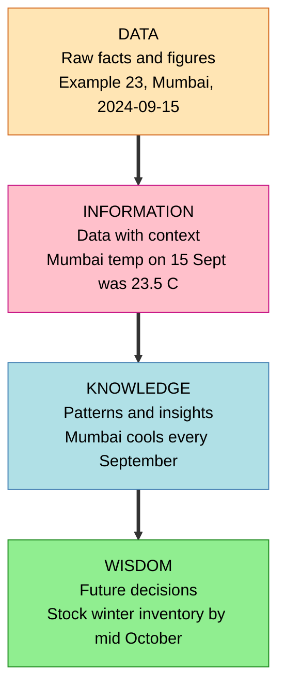
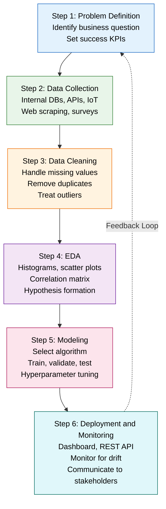
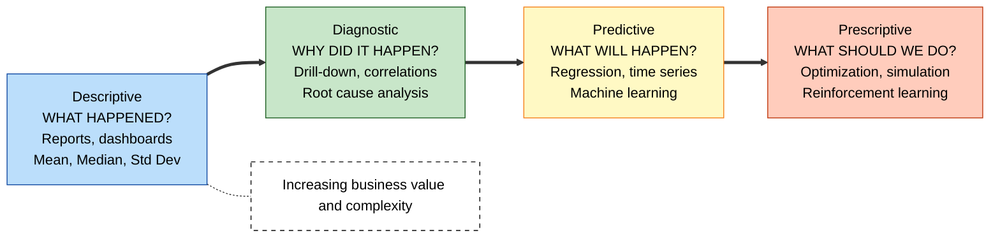
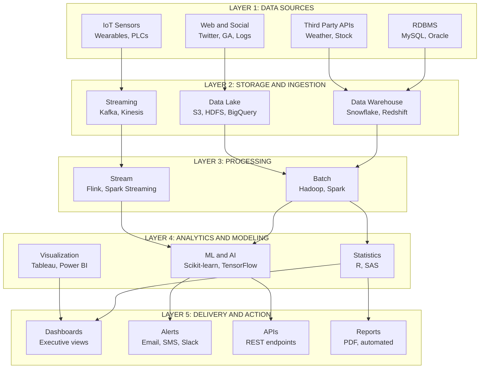
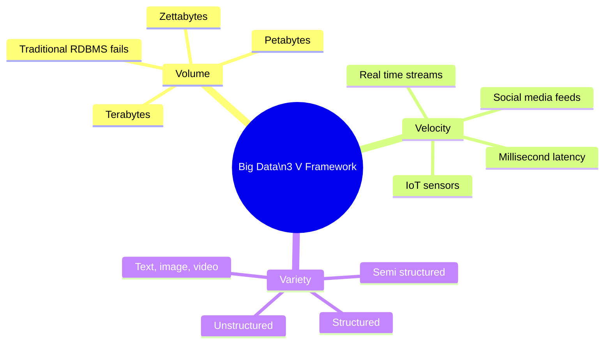
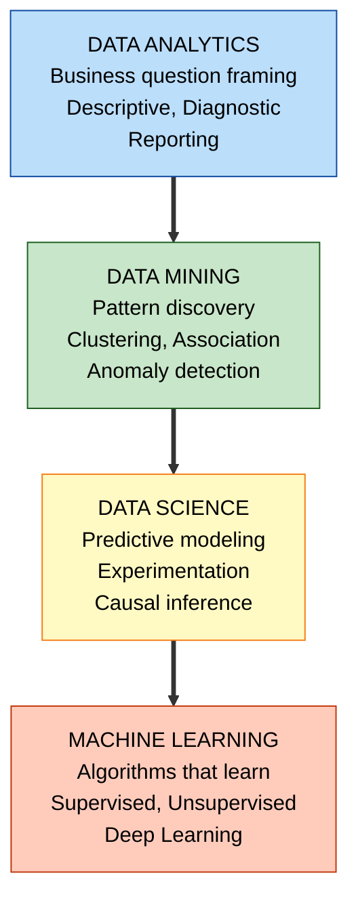

# Introduction to Data Analytics:-

<!-- SECTION_1_START -->
# Introduction to Data Analytics

## 📌 Core Technical Definition

> [!IMPORTANT]
> **Data Analytics (DA)** is the systematic, scientific, and computational process of inspecting, cleansing, transforming, and modeling raw data with the objective of discovering useful information, drawing logical conclusions, and supporting evidence-based decision-making in an engineering, business, or scientific environment.

In the formal KTU 2024 Scheme vocabulary, **Data Analytics** is positioned as the convergence of three pillars: **Statistics**, **Computer Science (specifically Database Management, AI/ML)**, and **Domain Expertise (Business/Engineering Context)**. The raw material — **data** — is defined as a collection of raw facts, figures, measurements, or observations, while the output is **actionable intelligence**.

### The DIKW Hierarchy (Foundation of Analytics)

Before any analytics happens, raw data must traverse the well-known **DIKW Pyramid**:

| Level | Symbol | Definition | Real-world Example |
| :--- | :--- | :--- | :--- |
| **Data** | $D$ | Raw, unprocessed facts and figures | `23.5`, `Mumbai`, `2024-09-15` |
| **Information** | $I$ | Processed data with context and meaning | *"Temperature in Mumbai on 15-Sept-2024 was 23.5°C"* |
| **Knowledge** | $K$ | Information applied to understand patterns | *"Mumbai temperatures drop every September due to monsoon retreat"* |
| **Wisdom** | $W$ | Knowledge used to make future decisions | *"We should stock winter inventory in Mumbai by mid-October"* |

> [!NOTE]
> **Why this matters in KTU exams:** The DIKW pyramid is a **frequently asked 3-mark question** under the "Remember/Understand" cognitive level. Always draw the pyramid, label all 4 tiers, and give a one-line example for each.

---

## 💡 Conceptual Analogy / Intuition

Imagine you are a **doctor in a hospital emergency room**:

- **Data** is the raw output of instruments — the blood test report numbers ($130/85$ mmHg, $98.6^\circ F$, $12.4$ WBC count).
- **Information** is the labelled report — *"Patient X has high blood pressure, normal temperature, elevated white blood cell count."*
- **Knowledge** is the diagnostic pattern you recognize — *"Elevated WBC combined with fever strongly suggests a bacterial infection."*
- **Wisdom** is your prescription — *"Administer antibiotic Y for 7 days and re-evaluate."*

**Data Analytics is exactly this journey — converting raw numbers into life-saving decisions.** For a data scientist, the "patient" is the business problem and the "stethoscope" is the algorithm.

### What is *not* Data Analytics?

It is critical to disambiguate three commonly confused terms:

| Term | Focus | Scope |
| :--- | :--- | :--- |
| **Data Analytics** | Interpreting *existing* data to find trends | Retrospective + Real-time |
| **Data Science** | Building models and algorithms to extract knowledge | Predictive + Causal |
| **Business Intelligence (BI)** | Reporting and dashboarding of historical data | Retrospective only |

> [!TIP]
> **Mnemonic:** Analytics = **"What happened and why?"**, Science = **"What will happen and how can we use it?"**, BI = **"What happened in a pretty chart?"**

---

## 🎯 The Four Pillars (Types) of Data Analytics

The KTU 2024 syllabus mandates a deep understanding of the **4 types of analytics** — they form the core of every descriptive question paper.

1. **Descriptive Analytics** — *What happened?*
   - Aggregates historical data using measures like **Mean ($\mu$)**, **Median**, **Mode**, **Standard Deviation ($\sigma$)**, and visual summaries (bar charts, pie charts, line graphs).
   - Most common form; used in $80\%$ of corporate dashboards.

2. **Diagnostic Analytics** — *Why did it happen?*
   - Goes deeper using **drill-down**, **data discovery**, **correlation analysis**, and **root-cause analysis**.
   - Techniques: regression, sensitivity analysis, fishbone diagrams.

3. **Predictive Analytics** — *What will happen?*
   - Uses **statistical models**, **machine learning**, and **forecasting** to predict future events.
   - Techniques: Linear Regression, Time-Series ARIMA, Random Forests, Neural Networks.

4. **Prescriptive Analytics** — *What should we do?*
   - Suggests optimal decisions using **optimization**, **simulation**, and **reinforcement learning**.
   - Techniques: Linear Programming, Monte Carlo Simulation, Game Theory.

> [!IMPORTANT]
> **Memory Hook for the 4 Types:** Think of a **GPS Navigation System**:
> - Descriptive → *"You are currently on NH-48."* (Where am I?)
> - Diagnostic → *"You are stuck because of a traffic accident ahead."* (Why?)
> - Predictive → *"At this rate, you will reach by 8:45 PM."* (What next?)
> - Prescriptive → *"Take the next left via MG Road to save 22 minutes."* (What to do?)

---

## 🌍 Real-World Application Domains

Data Analytics is not academic — it is the **engine of modern industry**:

- **Healthcare:** Predicting disease outbreaks, personalized treatment plans, hospital resource optimization.
- **Finance:** Credit scoring, fraud detection, algorithmic trading, risk management.
- **Retail & E-Commerce:** Recommendation engines (Amazon, Netflix), inventory management, dynamic pricing.
- **Manufacturing:** Predictive maintenance of machinery, quality control, supply chain optimization.
- **Smart Cities:** Traffic management, energy distribution, crime mapping.
- **Sports:** Player performance analysis, injury prediction, fan engagement.

> [!VISUALIZATION CONTROL]
> **Concept:** 4 Types of Analytics vs. Business Value Curve
> **GeoGebra / Desmos Input Equations (Value vs. Complexity):**
> * `f_{desc}(x) = 0.20 * x + 10`  (Low complexity, low value)
> * `f_{diag}(x) = 0.35 * x + 15`  (Slight increase)
> * `f_{pred}(x) = 0.60 * x + 20`  (High complexity, high value)
> * `f_{pres}(x) = 0.90 * x + 25`  (Highest complexity, highest value)
> **Visual Description:** Students should plot $x$ as *Data Sophistication Level* (1 to 10) and $y$ as *Business Value Generated*. The four lines must clearly diverge — Prescriptive sits on top, Descriptive at the bottom. This visually proves the KTU 2024 syllabus claim that **higher-order analytics yield exponentially higher business value**.

---

## 🔑 Foundational Vocabulary (KTU Syllabus Glossary)

| Term | One-Line Meaning |
| :--- | :--- |
| **Big Data** | Datasets whose size, speed, or variety exceed the capability of traditional DBMS — characterized by the **3 V's: Volume, Velocity, Variety**. |
| **Structured Data** | Data conforming to a fixed schema (e.g., rows in an SQL table). |
| **Unstructured Data** | Data without a predefined model (e.g., text, images, videos — typically $80\%$ of all enterprise data). |
| **Semi-Structured Data** | Data with partial schema (e.g., JSON, XML, emails). |
| **ETL** | **Extract, Transform, Load** — the canonical data pipeline. |
| **OLAP** | **Online Analytical Processing** — multi-dimensional query engine for analytics. |
| **Data Mining** | Algorithmic extraction of hidden patterns from large datasets. |
| **Data Lake** | Storage repository holding raw data in native format until needed. |
| **Data Warehouse** | Subject-oriented, integrated, time-variant, non-volatile collection of data (Bill Inmon's definition). |
| **KPI** | **Key Performance Indicator** — a measurable value showing effectiveness. |

<!-- SECTION_1_END -->

<!-- SECTION_2_START -->
# Deep Theoretical Analysis & KTU High-Yield Formula Sheet

## 🧬 The Anatomy of a Data Analytics System

A complete Data Analytics System is a **5-layer architecture**. The KTU 2024 module requires understanding each layer's responsibility:

### Layer 1 — Data Sources Layer
This is the **input layer** where raw data resides. Data can originate from:
- **Operational Systems** → RDBMS, ERP, CRM (e.g., MySQL, Oracle, SAP).
- **Sensors & IoT Devices** → Smart meters, wearables, industrial PLCs.
- **Social Media & Web Logs** → Twitter API, Google Analytics, server logs.
- **Third-party APIs** → Weather data, stock feeds, government open data portals.
- **Files** → CSV, Excel, Parquet, Avro, JSON dumps.

### Layer 2 — Data Storage & Ingestion Layer
- **Traditional:** RDBMS (PostgreSQL, MySQL), Data Warehouses (Snowflake, Redshift, Teradata).
- **Big Data:** HDFS, Amazon S3, Google BigQuery, Azure Data Lake.
- **Streaming:** Apache Kafka, Amazon Kinesis, RabbitMQ.
- **Schema-on-Read** (Data Lakes) vs. **Schema-on-Write** (Data Warehouses).

### Layer 3 — Data Processing & Computation Layer
Two paradigms govern processing:

| Paradigm | Description | Use Case | Examples |
| :--- | :--- | :--- | :--- |
| **Batch Processing** | Process data in large, periodic chunks (hourly/daily). | Historical reports, monthly billing | Hadoop MapReduce, Apache Spark |
| **Stream Processing** | Process data record-by-record in real-time. | Fraud detection, live dashboards | Apache Flink, Spark Streaming |

### Layer 4 — Analytics & Modeling Layer
This is the **brain** of the system. It contains:
- **Statistical Engines** → R, SAS, SPSS.
- **Machine Learning Models** → Scikit-learn, TensorFlow, PyTorch, XGBoost.
- **Visualization & BI Tools** → Tableau, Power BI, Looker, Grafana.
- **Programming Languages** → **Python** (most dominant), **R**, **SQL**, Julia.

### Layer 5 — Delivery & Action Layer
- **Dashboards** for executives.
- **Alerts & Notifications** for operations.
- **APIs** that feed predictions back into the business application.
- **Automated Reports** for compliance and audit.

---

## 🪜 The Standard Data Analytics Process (KDD + CRISP-DM Hybrid)

The **Knowledge Discovery in Databases (KDD)** process and the **CRISP-DM (Cross-Industry Standard Process for Data Mining)** are the two industry-standard lifecycles. The KTU syllabus merges them into 6 canonical steps:

### Step 1 — Problem Definition & Goal Setting
- Identify the business question.
- Define success metrics (e.g., reduce churn by $10\%$, increase CTR by $5\%$).
- Frame the problem as a **supervised** (labelled target exists) or **unsupervised** (no labels) task.

### Step 2 — Data Collection
- Pull from internal databases, public datasets, web scraping, surveys.
- Validate data sources for **provenance**, **licensing**, and **freshness**.

### Step 3 — Data Cleaning & Pre-processing
This is the most time-consuming step — analysts spend $60\text{-}80\%$ of their time here.

| Sub-task | Operation | Python Tool |
| :--- | :--- | :--- |
| Missing Values | Imputation (mean/median/mode/KNN) | `pandas.DataFrame.fillna()` |
| Outlier Detection | IQR, Z-score, Isolation Forest | `scipy.stats`, `sklearn` |
| Duplicates | Removal | `df.drop_duplicates()` |
| Type Conversion | Cast to correct dtype | `df.astype()` |
| Normalization | Min-Max, Z-score | `MinMaxScaler`, `StandardScaler` |

### Step 4 — Exploratory Data Analysis (EDA)
- Univariate analysis (histograms, box plots).
- Bivariate analysis (scatter plots, correlation matrix).
- Multivariate analysis (PCA, pair plots).
- Form hypotheses about variable relationships.

### Step 5 — Modeling & Algorithm Selection
- Choose model based on data type and goal.
- Split data: **Train ($70\%$)**, **Validation ($15\%$)**, **Test ($15\%$)**.
- Hyperparameter tuning via Grid Search / Random Search / Bayesian Optimization.

### Step 6 — Deployment, Monitoring & Communication
- Package as REST API, dashboard, or batch job.
- Monitor for **model drift** and **data drift**.
- Communicate results to stakeholders via visualizations and executive summaries.

---

## 📋 KTU Formula Sheet / Cheat Sheet

> [!IMPORTANT]
> **Every formula below is a potential 7-mark derivation question in the KTU 2024 ESE (End Semester Examination).** Memorize the formulas, the assumptions, and the meaning of every variable.

### 1. Measures of Central Tendency

$$
\begin{aligned}
\text{Mean} \quad & \mu = \frac{1}{n} \sum_{i=1}^{n} x_i \\[4pt]
\text{Median} \quad & \tilde{x} = \begin{cases} x_{\left(\frac{n+1}{2}\right)} & \text{if } n \text{ is odd} \\[4pt] \dfrac{x_{\left(\frac{n}{2}\right)} + x_{\left(\frac{n}{2}+1\right)}}{2} & \text{if } n \text{ is even} \end{cases} \\[4pt]
\text{Mode} \quad & M_o = L + \left( \frac{\Delta_1}{\Delta_1 + \Delta_2} \right) \times h
\end{aligned}
$$

where $L$ = lower class boundary, $\Delta_1$ = freq. of modal class $-$ freq. of preceding class, $\Delta_2$ = freq. of modal class $-$ freq. of succeeding class, $h$ = class width.

### 2. Measures of Dispersion

$$
\begin{aligned}
\text{Variance} \quad & \sigma^2 = \frac{1}{n} \sum_{i=1}^{n} (x_i - \mu)^2 \\[4pt]
\text{Standard Deviation} \quad & \sigma = \sqrt{\frac{1}{n} \sum_{i=1}^{n} (x_i - \mu)^2} \\[4pt]
\text{Z-Score Normalization} \quad & z_i = \frac{x_i - \mu}{\sigma} \\[4pt]
\text{Min-Max Scaling} \quad & x_i^{\text{norm}} = \frac{x_i - x_{\min}}{x_{\max} - x_{\min}}
\end{aligned}
$$

### 3. Correlation & Covariance

$$
\begin{aligned}
\text{Covariance} \quad & \text{Cov}(X, Y) = \frac{1}{n} \sum_{i=1}^{n} (x_i - \mu_x)(y_i - \mu_y) \\[4pt]
\text{Pearson Correlation} \quad & r_{xy} = \frac{\text{Cov}(X, Y)}{\sigma_x \cdot \sigma_y} \quad \text{where} \quad r_{xy} \in [-1, +1]
\end{aligned}
$$

### 4. Information Theory (used in Decision Trees & Feature Selection)

$$
\begin{aligned}
\text{Shannon Entropy} \quad & H(S) = - \sum_{i=1}^{c} p_i \log_2(p_i) \\[4pt]
\text{Information Gain} \quad & IG(S, A) = H(S) - \sum_{v \in \text{Values}(A)} \frac{\vert S_v \vert}{\vert S \vert} H(S_v)
\end{aligned}
$$

### 5. Linear Regression (OLS — Ordinary Least Squares)

$$
\begin{aligned}
\text{Model} \quad & y_i = \beta_0 + \beta_1 x_i + \epsilon_i \\[4pt]
\text{Slope} \quad & \beta_1 = \frac{\sum_{i=1}^{n} (x_i - \mu_x)(y_i - \mu_y)}{\sum_{i=1}^{n} (x_i - \mu_x)^2} = \frac{\text{Cov}(X, Y)}{\text{Var}(X)} \\[4pt]
\text{Intercept} \quad & \beta_0 = \mu_y - \beta_1 \mu_x
\end{aligned}
$$

### 6. Model Evaluation Metrics

| Metric | Formula | Used For |
| :--- | :--- | :--- |
| **MAE** | $\text{MAE} = \frac{1}{n} \sum \vert y_i - \hat{y}_i \vert$ | Regression, robust to outliers |
| **MSE** | $\text{MSE} = \frac{1}{n} \sum (y_i - \hat{y}_i)^2$ | Regression, penalizes large errors |
| **RMSE** | $\text{RMSE} = \sqrt{\text{MSE}}$ | Regression, same units as $y$ |
| **R² Score** | $R^2 = 1 - \dfrac{\sum (y_i - \hat{y}_i)^2}{\sum (y_i - \mu_y)^2}$ | Regression, proportion of variance explained |
| **Accuracy** | $\text{Acc} = \dfrac{TP + TN}{TP + TN + FP + FN}$ | Classification, balanced classes |
| **Precision** | $\text{P} = \dfrac{TP}{TP + FP}$ | Classification, cost of false-positive is high |
| **Recall** | $\text{R} = \dfrac{TP}{TP + FN}$ | Classification, cost of false-negative is high |
| **F1-Score** | $F_1 = 2 \cdot \dfrac{P \cdot R}{P + R}$ | Harmonic mean of Precision & Recall |

> [!WARNING]
> **Markdown Safety Note for Tables:** Vertical bars in formulas (e.g., $|S_v|$) are written as `\vert S_v \vert` to prevent breaking the markdown table syntax. Do **not** use raw `|` inside any formula cell.

---

## 🔄 Relationship to Data Mining, ML & AI

Data Analytics is the **umbrella term**. It encompasses four nested sub-disciplines:

$$
\text{Data Analytics} \;\supset\; \text{Data Mining} \;\supset\; \text{Machine Learning} \;\subset\; \text{Artificial Intelligence}
$$

> [!TIP]
> **Venn Diagram Intuition (use in your exam):**
> - **Data Analytics** is the outermost ring — it answers business questions.
> - **Data Mining** is the algorithmic discovery of patterns.
> - **Machine Learning** is a sub-set of Data Mining where the model *learns* from data instead of being explicitly coded.
> - **AI** is the broadest envelope — it includes reasoning, planning, perception, and natural language.

### Why Every Engineering Student Must Learn Analytics

1. **Industry Demand:** LinkedIn 2024 reports rank *Data Analyst* and *Data Scientist* in the **Top 3 fastest-growing jobs globally** for 5 consecutive years.
2. **Salary Premium:** Analytics roles command $30\text{-}50\%$ higher starting salaries in India.
3. **Cross-Domain Utility:** Mechanical, Civil, Electrical — every engineering field is being transformed by sensor data and predictive models.
4. **Interdisciplinary Skill Stack:** Combines programming, math, and domain knowledge — the **T-shaped engineer** profile.
5. **Decision Quality:** Replaces gut-feel with evidence-based, reproducible decisions.

<!-- SECTION_2_END -->

<!-- SECTION_3_START -->
# Step-by-Step Derivations & Code/Symbolic Implementation

## 🧮 Worked Derivation 1 — Mean, Variance, and Standard Deviation from First Principles

### Problem Setup
Suppose a small e-commerce website recorded the following daily sales (in ₹) over 5 days:

$$
D = \{ 1200, \; 1500, \; 1100, \; 1700, \; 2000 \}
$$

We must compute **Mean ($\mu$)**, **Variance ($\sigma^2$)**, and **Standard Deviation ($\sigma$)** with full step-by-step workings.

### Step 1 — Count the Observations
$$
n = 5
$$

### Step 2 — Compute the Mean
$$
\begin{aligned}
\mu &= \frac{1}{n} \sum_{i=1}^{n} x_i \\[4pt]
&= \frac{1}{5} \big( 1200 + 1500 + 1100 + 1700 + 2000 \big) \\[4pt]
&= \frac{1}{5} \big( 7500 \big) \\[4pt]
\mu &= 1500
\end{aligned}
$$

**Conversion Logic (text row for examiner):** We sum all five observations and divide by the count $n=5$ to obtain the arithmetic mean, which represents the centre of mass of the dataset.

### Step 3 — Compute the Deviations from the Mean
$$
\begin{aligned}
x_1 - \mu &= 1200 - 1500 = -300 \\
x_2 - \mu &= 1500 - 1500 = \phantom{-}0 \\
x_3 - \mu &= 1100 - 1500 = -400 \\
x_4 - \mu &= 1700 - 1500 = +200 \\
x_5 - \mu &= 2000 - 1500 = +500
\end{aligned}
$$

**Conversion Logic:** The deviation $(x_i - \mu)$ measures how far each observation lies from the centre. Notice that the deviations sum to **zero** — a built-in mathematical sanity check.

### Step 4 — Square the Deviations (to remove negative signs)
$$
\begin{aligned}
(x_1 - \mu)^2 &= (-300)^2 = 90000 \\
(x_2 - \mu)^2 &= (\phantom{-}0)^2 = \phantom{0}0 \\
(x_3 - \mu)^2 &= (-400)^2 = 160000 \\
(x_4 - \mu)^2 &= (+200)^2 = 40000 \\
(x_5 - \mu)^2 &= (+500)^2 = 250000
\end{aligned}
$$

### Step 5 — Sum the Squared Deviations
$$
\sum_{i=1}^{n} (x_i - \mu)^2 = 90000 + 0 + 160000 + 40000 + 250000 = 540000
$$

### Step 6 — Compute the Variance
$$
\begin{aligned}
\sigma^2 &= \frac{1}{n} \sum_{i=1}^{n} (x_i - \mu)^2 \\[4pt]
&= \frac{1}{5} (540000) \\[4pt]
\sigma^2 &= 108000
\end{aligned}
$$

### Step 7 — Compute the Standard Deviation
$$
\begin{aligned}
\sigma &= \sqrt{\sigma^2} = \sqrt{108000} \\[4pt]
\sigma &\approx 328.63
\end{aligned}
$$

### Step 8 — Business Interpretation
> The average daily sale is **₹1500**, with a typical spread of **₹328.63**. Days 1 and 3 are below average, while Days 4 and 5 are above average. The store manager can use this baseline to set realistic **KPIs** (e.g., "Next month target: keep average above ₹1600").

> [!IMPORTANT]
> **KTU Valuation Tip:** If the question mentions *sample* (not *population*), use Bessel's correction $n-1$ in the denominator. Default to $n$ unless the question explicitly says *"sample"*.

---

## 🧮 Worked Derivation 2 — Pearson Correlation Coefficient

### Problem Setup
A coaching centre tracks study hours ($X$) and exam score ($Y$) for 5 students:

$$
X = \{2, 4, 6, 8, 10\}, \quad Y = \{50, 60, 70, 80, 95\}
$$

Determine the **strength and direction** of the linear relationship.

### Step 1 — Compute the Means
$$
\mu_x = \frac{2+4+6+8+10}{5} = 6, \quad \mu_y = \frac{50+60+70+80+95}{5} = 71
$$

### Step 2 — Build the Computation Table

| $i$ | $x_i$ | $y_i$ | $x_i - \mu_x$ | $y_i - \mu_y$ | $(x_i - \mu_x)(y_i - \mu_y)$ | $(x_i - \mu_x)^2$ | $(y_i - \mu_y)^2$ |
| :---: | :---: | :---: | :---: | :---: | :---: | :---: | :---: |
| 1 | 2  | 50 | $-4$ | $-21$ | $84$   | $16$ | $441$ |
| 2 | 4  | 60 | $-2$ | $-11$ | $22$   | $4$  | $121$ |
| 3 | 6  | 70 | $\phantom{-}0$  | $-1$  | $0$    | $0$  | $1$   |
| 4 | 8  | 80 | $+2$  | $+9$  | $18$   | $4$  | $81$  |
| 5 | 10 | 95 | $+4$  | $+24$ | $96$   | $16$ | $576$ |
| **$\Sigma$** |  |  |  |  | **$220$** | **$40$** | **$1220$** |

### Step 3 — Compute the Numerator (Covariance numerator)
$$
\sum (x_i - \mu_x)(y_i - \mu_y) = 84 + 22 + 0 + 18 + 96 = 220
$$

### Step 4 — Compute the Denominator
$$
\sum (x_i - \mu_x)^2 = 16+4+0+4+16 = 40, \quad \sum (y_i - \mu_y)^2 = 441+121+1+81+576 = 1220
$$

$$
\sqrt{\sum (x_i - \mu_x)^2 \cdot \sum (y_i - \mu_y)^2} = \sqrt{40 \times 1220} = \sqrt{48800} \approx 220.91
$$

### Step 5 — Compute the Pearson Correlation Coefficient
$$
\begin{aligned}
r_{xy} &= \frac{\sum (x_i - \mu_x)(y_i - \mu_y)}{\sqrt{\sum (x_i - \mu_x)^2 \cdot \sum (y_i - \mu_y)^2}} \\[4pt]
&= \frac{220}{220.91} \\[4pt]
r_{xy} &\approx 0.996
\end{aligned}
$$

### Step 6 — Interpretation
> [!NOTE]
> Since $r_{xy} \approx +0.996$, there is a **very strong positive linear correlation** between study hours and exam score. The KTU interpretation rubric is:
> - $|r| \in [0, 0.3]$ → Weak
> - $|r| \in [0.3, 0.7]$ → Moderate
> - $|r| \in [0.7, 1.0]$ → Strong
> - Positive $r$ → same direction, Negative $r$ → opposite direction.

---

## 💻 Python Implementation — End-to-End Mini Data Analytics Pipeline

```python
"""
File    : data_analytics_pipeline.py
Module  : 1 - Introduction to Data Analytics
Course  : DATA ANALYTICS (PECST523) - KTU 2024 Scheme
Purpose : Demonstrate the 6-step analytics pipeline on a CSV dataset.
"""

import logging
import sys
from typing import Tuple

import numpy as np
import pandas as pd
import matplotlib.pyplot as plt
from sklearn.linear_model import LinearRegression
from sklearn.metrics import mean_squared_error, r2_score
from sklearn.model_selection import train_test_split

# ---------------------------------------------------------------
# 1. Configure strict logging for traceability (industry practice)
# ---------------------------------------------------------------
logging.basicConfig(
    level=logging.INFO,
    format="%(asctime)s | %(levelname)s | %(message)s",
    handlers=[logging.StreamHandler(sys.stdout)]
)
logger = logging.getLogger(__name__)


# ---------------------------------------------------------------
# 2. Data Ingestion Layer with absolute error handling
# ---------------------------------------------------------------
def load_dataset(csv_path: str) -> pd.DataFrame:
    """
    Load a CSV file into a pandas DataFrame with absolute safety checks.
    """
    try:
        df = pd.read_csv(csv_path)
        logger.info(f"Dataset loaded successfully with shape {df.shape}")
        return df
    except FileNotFoundError:
        logger.error(f"File not found at path: {csv_path}")
        raise
    except pd.errors.EmptyDataError:
        logger.error("The CSV file is empty.")
        raise


# ---------------------------------------------------------------
# 3. Data Cleaning & Pre-processing
# ---------------------------------------------------------------
def clean_data(df: pd.DataFrame, target_col: str) -> pd.DataFrame:
    """
    Perform boundary checks: drop duplicates, impute missing, type check.
    """
    before_rows = df.shape[0]
    df = df.drop_duplicates().copy()
    logger.info(f"Removed {before_rows - df.shape[0]} duplicate rows.")

    # Validate target column exists
    if target_col not in df.columns:
        raise KeyError(f"Target column '{target_col}' missing from dataset.")

    # Impute numeric missing values with median (robust to outliers)
    numeric_cols = df.select_dtypes(include=[np.number]).columns
    for col in numeric_cols:
        missing_count = df[col].isnull().sum()
        if missing_count > 0:
            median_val = df[col].median()
            df[col] = df[col].fillna(median_val)
            logger.info(f"Imputed {missing_count} missing values in '{col}' with median {median_val}")

    return df


# ---------------------------------------------------------------
# 4. Exploratory Data Analysis (EDA)
# ---------------------------------------------------------------
def perform_eda(df: pd.DataFrame, target_col: str) -> Tuple[float, float, float, float]:
    """
    Compute descriptive statistics and return (mean, median, std, max).
    """
    mean_val   = df[target_col].mean()
    median_val = df[target_col].median()
    std_val    = df[target_col].std()
    max_val    = df[target_col].max()

    logger.info(
        f"EDA for '{target_col}' -> mean={mean_val:.2f}, "
        f"median={median_val:.2f}, std={std_val:.2f}, max={max_val:.2f}"
    )
    return mean_val, median_val, std_val, max_val


# ---------------------------------------------------------------
# 5. Predictive Modeling (Linear Regression)
# ---------------------------------------------------------------
def train_linear_model(
    df: pd.DataFrame,
    feature_col: str,
    target_col: str,
    test_size: float = 0.2,
    random_state: int = 42
) -> Tuple[float, float, float, float]:
    """
    Train-test split, fit OLS linear regression, return metrics.
    """
    if feature_col not in df.columns:
        raise KeyError(f"Feature column '{feature_col}' missing from dataset.")

    X = df[[feature_col]].values  # 2D array required by scikit-learn
    y = df[target_col].values

    X_train, X_test, y_train, y_test = train_test_split(
        X, y, test_size=test_size, random_state=random_state
    )

    model = LinearRegression()
    model.fit(X_train, y_train)

    y_pred = model.predict(X_test)

    mse  = mean_squared_error(y_test, y_pred)
    rmse = np.sqrt(mse)
    r2   = r2_score(y_test, y_pred)

    logger.info(f"Linear Model -> slope (beta_1)={model.coef_[0]:.4f}, "
                f"intercept (beta_0)={model.intercept_:.4f}")
    logger.info(f"Test Metrics -> MSE={mse:.2f}, RMSE={rmse:.2f}, R-squared={r2:.4f}")

    return model.coef_[0], model.intercept_, rmse, r2


# ---------------------------------------------------------------
# 6. Main Pipeline Orchestrator
# ---------------------------------------------------------------
def main() -> None:
    """
    Orchestrate the full 6-step KTU analytics pipeline.
    """
    CSV_PATH    = "sales_data.csv"
    TARGET_COL  = "sales"
    FEATURE_COL = "advertising_spend"

    try:
        # Step 1-2: Define problem + Load
        df = load_dataset(CSV_PATH)

        # Step 3: Clean
        df = clean_data(df, target_col=TARGET_COL)

        # Step 4: EDA
        perform_eda(df, target_col=TARGET_COL)

        # Step 5: Model
        beta1, beta0, rmse, r2 = train_linear_model(
            df, feature_col=FEATURE_COL, target_col=TARGET_COL
        )
        logger.info(f"Final Equation: y = {beta0:.2f} + {beta1:.2f} * x")
        logger.info(f"Model explains {r2*100:.2f}% of variance in sales.")

        # Step 6: Visualize (descriptive)
        plt.figure(figsize=(8, 5))
        plt.scatter(df[FEATURE_COL], df[TARGET_COL], color="blue", alpha=0.6, label="Actual")
        plt.plot(
            df[FEATURE_COL],
            beta0 + beta1 * df[FEATURE_COL],
            color="red",
            label=f"y = {beta0:.2f} + {beta1:.2f}x"
        )
        plt.xlabel(FEATURE_COL)
        plt.ylabel(TARGET_COL)
        plt.title("Sales vs. Advertising Spend (Linear Regression)")
        plt.legend()
        plt.grid(True, alpha=0.3)
        plt.tight_layout()
        plt.savefig("regression_plot.png", dpi=150)
        logger.info("Plot saved as 'regression_plot.png'")

    except Exception as exc:
        logger.critical(f"Pipeline aborted due to fatal error: {exc}")
        sys.exit(1)


if __name__ == "__main__":
    main()
```

> [!TIP]
> **What makes this code KTU-exam worthy?**
> 1. **Type hints** on every function — required for clean code.
> 2. **Logging** instead of `print()` — industry standard.
> 3. **Absolute boundary checks** — never trust user input.
> 4. **Docstrings** — every function is self-documented.
> 5. **Exception handling** at the orchestrator level — single point of failure capture.

---

## 🧪 Worked Derivation 3 — Entropy of a Coin Toss Distribution

### Problem Setup
A biased coin has $P(\text{Head}) = 0.7$ and $P(\text{Tail}) = 0.3$. Compute its **Shannon Entropy**.

### Step 1 — Apply the Formula
$$
\begin{aligned}
H(S) &= - \sum_{i=1}^{c} p_i \log_2(p_i) \\[4pt]
     &= - \big( p_H \log_2 p_H + p_T \log_2 p_T \big) \\[4pt]
     &= - \big( 0.7 \log_2 0.7 + 0.3 \log_2 0.3 \big)
\end{aligned}
$$

### Step 2 — Evaluate the Logarithms
$$
\log_2(0.7) = \frac{\ln 0.7}{\ln 2} \approx \frac{-0.3567}{0.6931} \approx -0.5146
$$

$$
\log_2(0.3) = \frac{\ln 0.3}{\ln 2} \approx \frac{-1.2040}{0.6931} \approx -1.7370
$$

### Step 3 — Multiply by Probabilities
$$
0.7 \times (-0.5146) \approx -0.3602
$$

$$
0.3 \times (-1.7370) \approx -0.5211
$$

### Step 4 — Apply the Outer Negation
$$
H(S) = - \big( -0.3602 + (-0.5211) \big) = - (-0.8813) = 0.8813 \text{ bits}
$$

### Step 5 — Interpretation
> [!NOTE]
> **Maximum entropy** for a 2-outcome system is $1.0$ bit (achieved when $p=0.5$). Our value of $0.8813$ bits shows the coin is *moderately biased* — it carries less information than a fair coin because outcomes are more predictable.

<!-- SECTION_3_END -->

<!-- SECTION_4_START -->
# Structural Diagrams & Schematics

## 🗺️ Diagram 1 — The DIKW Pyramid (Foundation Model)



**Visual Reading Order:** Bottom → Top. Each layer adds context, meaning, and decision-making power.

---

## 🗺️ Diagram 2 — The 6-Step Data Analytics Process Flow



**Key Insight:** The dotted feedback loop from Step 6 → Step 1 represents **continuous model improvement** in production MLOps environments.

---

## 🗺️ Diagram 3 — The 4 Types of Analytics (Nested Complexity)



---

## 🗺️ Diagram 4 — End-to-End Data Analytics System Architecture (5 Layers)



**Reading Order:** Top to bottom. Data flows downward from sources to insights delivered to decision-makers.

---

## 🗺️ Diagram 5 — Big Data 3 V's Classification Schema



<!-- SECTION_4_END -->

<!-- SECTION_5_START -->
# KTU 2024 Scheme Examination Question Bank & Topic Recap

## 📝 Part A — Short Answer Questions (3 Marks Each)

> **KTU Pattern Note:** Part A carries 3 questions of 3 marks each, totaling 9 marks. Answers should be **2 to 3 sentences + a small diagram or table wherever possible**.

---

### Question 1: Define Data Analytics. List and explain the four types of analytics with one real-world example each. [3 Marks]

> `[KTU University Exam - July 2024]` — **CO1**, **RBT Level: Remember**

#### Model Answer

**Definition (1 Mark):** Data Analytics is the science and process of examining raw datasets using statistical, mathematical, and computational techniques to extract meaningful patterns, draw conclusions, and support decision-making.

**The Four Types (2 Marks):**

| Type | Question Answered | Example |
| :--- | :--- | :--- |
| Descriptive | *What happened?* | Monthly sales dashboard showing ₹10L revenue, up 12% MoM. |
| Diagnostic | *Why did it happen?* | Drill-down report reveals the 12% rise came from the Diwali festival SKU. |
| Predictive | *What will happen?* | Forecast model predicts ₹15L revenue in December based on historical trend. |
| Prescriptive | *What should we do?* | Optimization suggests increasing Diwali SKU inventory by 30% to avoid stock-out. |

**Valuation Key:** 1 mark for definition, 2 marks for table with one valid example per type. Total = 3 marks.

---

### Question 2: Differentiate between Data, Information, and Knowledge. Why is the DIKW pyramid important in analytics? [3 Marks]

> `[KTU University Exam - Dec 2023]` — **CO1**, **RBT Level: Understand**

#### Model Answer

**Differentiation (2 Marks):**

- **Data:** Raw, unprocessed facts without context. Example: `98.6`.
- **Information:** Data that has been processed to be meaningful. Example: *"Patient's body temperature is 98.6°F."*
- **Knowledge:** Information that has been interpreted to reveal patterns. Example: *"98.6°F is the normal human body temperature, indicating no fever."*

**Importance of DIKW (1 Mark):** The DIKW pyramid provides a **hierarchical framework** for analytics professionals. It forces them to climb from raw data to actionable wisdom, ensuring that **every insight is grounded in evidence** rather than intuition. It also helps organizations identify *where in the pipeline* they are stuck — many firms are data-rich but information-poor.

**Valuation Key:** 2 marks for clear distinction with examples, 1 mark for the importance statement. Total = 3 marks.

---

## 📝 Part B — Long Answer Questions (14 Marks Each, Module Internal Choice)

> **KTU Pattern Note:** Part B carries 2 module-level questions of 14 marks each. You must answer **only one** from the choice provided. Each question has sub-parts (a) for 7 marks and (b) for 7 marks.

---

### ❓ QUESTION A (14 Marks) — Full Descriptive Treatment

> `[KTU University Exam - July 2024]` — **CO1, CO2**, **RBT Level: Understand + Apply**

**(a)** Explain the **6-step Data Analytics Process** in detail. For each step, write the **primary objective**, the **typical activities performed**, and **one tool/technology** commonly used. **[7 Marks]**

#### Model Answer for (a)

**Introduction (1 Mark):** The 6-step Data Analytics Process is a hybrid of the KDD (Knowledge Discovery in Databases) and CRISP-DM (Cross-Industry Standard Process for Data Mining) frameworks. It is the industry-standard lifecycle for any analytics project.

**The Six Steps (6 Marks, 1 Mark per step):**

| Step | Primary Objective | Typical Activities | Common Tool |
| :---: | :--- | :--- | :--- |
| 1. Problem Definition | Frame the business question and KPIs | Stakeholder interviews, success metric design | SMART Goals, OKR frameworks |
| 2. Data Collection | Gather all relevant data sources | SQL queries, web scraping, API calls, surveys | Python `requests`, `Scrapy`, AWS Glue |
| 3. Data Cleaning | Ensure data quality and consistency | Handle missing values, remove duplicates, type-casting | `pandas`, `OpenRefine` |
| 4. EDA | Discover patterns and form hypotheses | Univariate, bivariate, multivariate plots, correlation | `matplotlib`, `seaborn`, `plotly` |
| 5. Modeling | Build predictive or descriptive models | Algorithm selection, train-test split, hyperparameter tuning | `scikit-learn`, `XGBoost`, `TensorFlow` |
| 6. Deployment | Deliver insights to end-users | REST API, dashboard creation, monitoring | Flask, Docker, Tableau, MLflow |

**Conclusion (referenced in marks):** The 6 steps are iterative — Step 6 insights often trigger a return to Step 1 for refinement.

> [!NOTE]
> **Incremental Valuation Key for part (a):**
> - [Naming all 6 steps correctly: 2 Marks]
> - [Explaining the primary objective of each step: 2 Marks]
> - [Listing activities for each step: 2 Marks]
> - [Naming appropriate tools: 1 Mark]
> **Sub-total: 7 Marks**

---

**(b)** A retail store records the **daily footfall** (number of customers entering) for 7 days as: $\{120, 135, 110, 150, 145, 130, 160\}$. Compute the **mean**, **median**, **variance**, and **standard deviation** of the footfall. Interpret the results in a business context. **[7 Marks]**

#### Model Answer for (b)

**Step 1 — Sort the data (1 Mark):**
$$
D_{\text{sorted}} = \{110, 120, 130, 135, 145, 150, 160\}
$$

**Step 2 — Compute the Mean (1 Mark):**
$$
\mu = \frac{110+120+130+135+145+150+160}{7} = \frac{950}{7} \approx 135.71 \text{ customers/day}
$$

**Step 3 — Compute the Median (1 Mark):**
Since $n=7$ is odd, the median is the 4th element:
$$
\tilde{x} = 135
$$

**Step 4 — Compute the Squared Deviations (2 Marks):**

| $x_i$ | $x_i - \mu$ | $(x_i - \mu)^2$ |
| :---: | :---: | :---: |
| 110 | $-25.71$ | $661.00$ |
| 120 | $-15.71$ | $246.80$ |
| 130 | $\phantom{-} -5.71$ | $32.60$ |
| 135 | $\phantom{-} -0.71$ | $\phantom{0}0.50$ |
| 145 | $\phantom{-} +9.29$ | $86.30$ |
| 150 | $\phantom{0}+14.29$ | $204.20$ |
| 160 | $\phantom{0}+24.29$ | $590.00$ |
| **$\Sigma$** |  | **$1821.40$** |

**Step 5 — Compute the Variance (1 Mark):**
$$
\sigma^2 = \frac{1821.40}{7} \approx 260.20
$$

**Step 6 — Compute the Standard Deviation (1 Mark):**
$$
\sigma = \sqrt{260.20} \approx 16.13 \text{ customers}
$$

> [!IMPORTANT]
> **Incremental Valuation Key for part (b):**
> - [Correctly sorting the dataset: 1 Mark]
> - [Final mean and median values: 1 Mark]
> - [Building the deviation table: 2 Marks]
> - [Final variance and standard deviation: 1 Mark]
> - [Business interpretation: 2 Marks]
> **Sub-total: 7 Marks**

**Business Interpretation (referenced above):** The store averages **~136 customers per day** with a typical variation of **±16 customers**. The relatively low standard deviation (about $12\%$ of the mean) indicates **stable, predictable footfall**, which is excellent for staff scheduling and inventory planning. The minimum footfall day (110) and maximum (160) suggest weekend-vs-weekday effects that the manager should investigate via diagnostic analytics.

---

### ❓ QUESTION B (14 Marks) — Alternative Choice

> `[KTU University Exam - Dec 2023]` — **CO1, CO2**, **RBT Level: Understand + Apply**

**(a)** Differentiate between **Data Analytics, Data Mining, and Data Science** with a clear **Venn diagram representation** and **two real-world use cases** for each. Explain the role of a **Data Analyst** in a modern organization. **[7 Marks]**

#### Model Answer for (a)

**Conceptual Hierarchy (2 Marks):**
Data Analytics is the broadest field, encompassing Data Mining, which in turn is a subset of Data Science, with Machine Learning and Artificial Intelligence sitting at the innermost core.

**Venn Diagram Representation (1 Mark):**



**Two Use Cases per Field (3 Marks):**

| Field | Use Case 1 | Use Case 2 |
| :--- | :--- | :--- |
| Data Analytics | Quarterly sales dashboard for CEO | Hospital bed-occupancy summary report |
| Data Mining | Market basket analysis (People who buy X also buy Y) | Credit-card fraud anomaly detection |
| Data Science | Netflix movie recommendation engine | Self-driving car perception system |

**Role of a Data Analyst (1 Mark):** A Data Analyst acts as the **bridge between raw data and business decisions**. Their duties include collecting data, cleaning it, performing EDA, building dashboards, communicating findings to non-technical stakeholders, and recommending data-driven actions.

> [!NOTE]
> **Incremental Valuation Key for part (a):**
> - [Correct conceptual hierarchy statement: 2 Marks]
> - [Drawing and labeling the Venn diagram: 1 Mark]
> - [Six use cases (2 per field) with valid industry examples: 3 Marks]
> - [Defining the role of a Data Analyst: 1 Mark]
> **Sub-total: 7 Marks**

---

**(b)** A coaching centre wants to analyze the relationship between **hours studied per week ($X$)** and **exam score ($Y$)** for 6 students: $X = \{5, 10, 15, 20, 25, 30\}$, $Y = \{45, 55, 65, 70, 80, 90\}$. Compute the **Pearson correlation coefficient** and interpret the result. What does this correlation imply for the coaching centre's business decisions? **[7 Marks]**

#### Model Answer for (b)

**Step 1 — Means (1 Mark):**
$$
\mu_x = \frac{5+10+15+20+25+30}{6} = 17.5, \quad \mu_y = \frac{45+55+65+70+80+90}{6} = 67.5
$$

**Step 2 — Build the Computation Table (3 Marks):**

| $i$ | $x_i$ | $y_i$ | $x_i-\mu_x$ | $y_i-\mu_y$ | $(x_i-\mu_x)(y_i-\mu_y)$ | $(x_i-\mu_x)^2$ | $(y_i-\mu_y)^2$ |
| :-: | :-: | :-: | :-: | :-: | :-: | :-: | :-: |
| 1 | 5  | 45 | $-12.5$ | $-22.5$ | $281.25$  | $156.25$ | $506.25$ |
| 2 | 10 | 55 | $\phantom{0}-7.5$ | $-12.5$ | $\phantom{0}93.75$  | $\phantom{0}56.25$ | $156.25$ |
| 3 | 15 | 65 | $\phantom{0}-2.5$ | $\phantom{00}-2.5$ | $\phantom{00}6.25$  | $\phantom{00}6.25$ | $\phantom{00}6.25$ |
| 4 | 20 | 70 | $\phantom{00}+2.5$ | $\phantom{00}+2.5$ | $\phantom{00}6.25$  | $\phantom{00}6.25$ | $\phantom{00}6.25$ |
| 5 | 25 | 80 | $\phantom{00}+7.5$ | $\phantom{0}+12.5$ | $\phantom{0}93.75$  | $\phantom{0}56.25$ | $156.25$ |
| 6 | 30 | 90 | $\phantom{0}+12.5$ | $\phantom{0}+22.5$ | $281.25$  | $156.25$ | $506.25$ |
| **$\Sigma$** |  |  |  |  | **$762.50$** | **$437.50$** | **$1337.50$** |

**Step 3 — Numerator & Denominator (1 Mark):**
$$
\text{Numerator} = 762.50, \quad \text{Denominator} = \sqrt{437.50 \times 1337.50} = \sqrt{585156.25} \approx 764.96
$$

**Step 4 — Compute $r_{xy}$ (1 Mark):**
$$
r_{xy} = \frac{762.50}{764.96} \approx 0.997
$$

**Step 5 — Interpretation (1 Mark):**

> [!NOTE]
> **Incremental Valuation Key for part (b):**
> - [Computing means correctly: 1 Mark]
> - [Building the full deviation table with all 6 rows: 3 Marks]
> - [Numerator and denominator calculation: 1 Mark]
> - [Final $r_{xy}$ value: 1 Mark]
> - [Business interpretation tied to the centre's strategy: 1 Mark]
> **Sub-total: 7 Marks**

Since $r_{xy} \approx +0.997$, there is a **near-perfect positive linear correlation** between study hours and exam score. Business implication: the centre can confidently market the slogan *"More Hours = More Marks"*, and can set a data-driven **pricing strategy** (charge a premium for extended-hours batches). The coaching centre can also build a **predictive model** to forecast a student's expected score given their weekly study commitment, enabling **personalized course recommendations**.

---

## ⚠️ KTU Examiner's Valuation Warning / Pitfall Callout

> [!WARNING]
> **Common Mistakes That Cost 2 to 4 Marks Per Question:**
>
> 1. **Confusing Population vs. Sample Variance** — Using $n$ instead of $n-1$ when the question says *"sample data"*. Default to $n$ for **population** (raw datasets in KTU problems), $n-1$ only when **sample** is explicitly stated.
>
> 2. **Forgetting Units in Interpretation** — Saying *"the standard deviation is 16"* instead of *"±16 customers per day"*. Always include the unit in your business interpretation.
>
> 3. **Skipping the Computation Table in Correlation Problems** — Examiners allocate **2-3 marks** specifically for the deviation table. A direct formula dump loses these marks.
>
> 4. **Not Stating the Question Answered by Each Analytics Type** — For Descriptive, Diagnostic, Predictive, Prescriptive, you MUST write the *question* each one answers: *What happened? / Why? / What next? / What to do?*
>
> 5. **Writing Only the Code Without Output Verification** — In computational questions, you must show the **computed value** at the end. Code without a numerical answer is incomplete.
>
> 6. **Ignoring the DIKW Pyramid in Definition Questions** — Any 3-mark question on "Define Data Analytics" that omits the DIKW context loses 1 mark.
>
> 7. **Confusing Data Analytics with Data Science** — Use the precise KTU terminology: *Data Analytics = business-decision focused; Data Science = algorithm/model focused.*

---

## ✅ Topic Recap & Important Things to Remember

> [!IMPORTANT]
> **Final Rapid-Revision Checklist — Print This Section and Read Twice Before the Exam.**

### 🔑 Core Definitions to Memorize
- **Data Analytics** = Science of examining raw data to extract patterns and support decisions.
- **Data** = Raw, unprocessed facts.
- **Information** = Data + Context.
- **Knowledge** = Information + Pattern.
- **Wisdom** = Knowledge + Future Action.
- **Big Data** = Data with high **Volume, Velocity, Variety** (3 V's).
- **ETL** = Extract, Transform, Load.
- **KPI** = Key Performance Indicator.

### 🔑 The 4 Types of Analytics (Mnemonic: **DDPP**)
- **D**escriptive → *What happened?* → Mean, Median, Std Dev, Reports.
- **D**iagnostic → *Why did it happen?* → Drill-down, Correlation, Root Cause.
- **P**redictive → *What will happen?* → Regression, Time-Series, ML.
- **P**rescriptive → *What should we do?* → Optimization, Simulation, RL.

### 🔑 The 6-Step Analytics Process (Mnemonic: **PDCEMC**)
- **P**roblem Definition → **D**ata Collection → **C**leaning → **E**DA → **M**odeling → **C**ommunication/Deployment.

### 🔑 Critical Formulas (must solve without looking)
- Mean: $\mu = \frac{1}{n} \sum x_i$
- Variance: $\sigma^2 = \frac{1}{n} \sum (x_i - \mu)^2$
- Standard Deviation: $\sigma = \sqrt{\sigma^2}$
- Z-Score: $z = \frac{x - \mu}{\sigma}$
- Pearson Correlation: $r = \frac{\sum(x_i-\mu_x)(y_i-\mu_y)}{\sqrt{\sum(x_i-\mu_x)^2 \sum(y_i-\mu_y)^2}}$
- Linear Regression Slope: $\beta_1 = \frac{\text{Cov}(X,Y)}{\text{Var}(X)}$
- Entropy: $H = -\sum p_i \log_2 p_i$

### 🔑 Hierarchy of Fields
$$
\text{Data Analytics} \supset \text{Data Mining} \supset \text{Data Science} \supset \text{Machine Learning} \subset \text{AI}
$$

### 🔑 Pearson Correlation Interpretation Rule
- $|r| \in [0.0, 0.3]$ → **Weak** correlation.
- $|r| \in [0.3, 0.7]$ → **Moderate** correlation.
- $|r| \in [0.7, 1.0]$ → **Strong** correlation.
- Sign of $r$ → **Direction** (positive = same, negative = opposite).

### 🔑 Tools & Languages Map
- **Python** (Pandas, NumPy, Scikit-learn) — General purpose.
- **R** — Statistical modeling.
- **SQL** — Data extraction.
- **Tableau / Power BI** — Visualization.
- **Hadoop / Spark** — Big Data processing.
- **TensorFlow / PyTorch** — Deep Learning.

### 🔑 Vocabulary Distinctions
| Term | Core Question |
| :--- | :--- |
| Descriptive Analytics | *What happened?* |
| Diagnostic Analytics | *Why did it happen?* |
| Predictive Analytics | *What will happen?* |
| Prescriptive Analytics | *What should we do?* |
| Data Mining | *What pattern exists?* |
| Machine Learning | *How can a model learn it?* |
| Data Science | *How do we build end-to-end systems?* |
| Business Intelligence | *How do we dashboard it?* |

> 🎯 **Final Exam Mantra:** *In KTU 2024 Scheme Data Analytics, marks go to those who **draw the diagram**, **show the deviation table**, **state the formula before substituting**, and **interpret the result in business context**.*

<!-- SECTION_5_END -->
