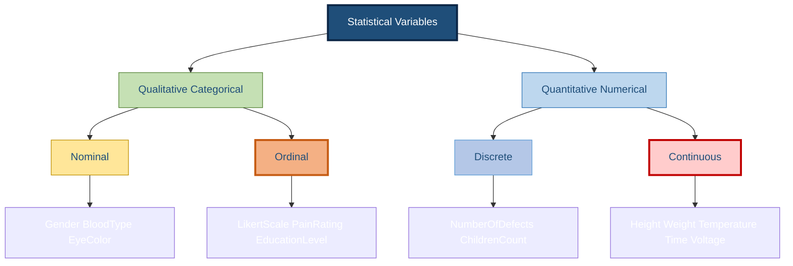
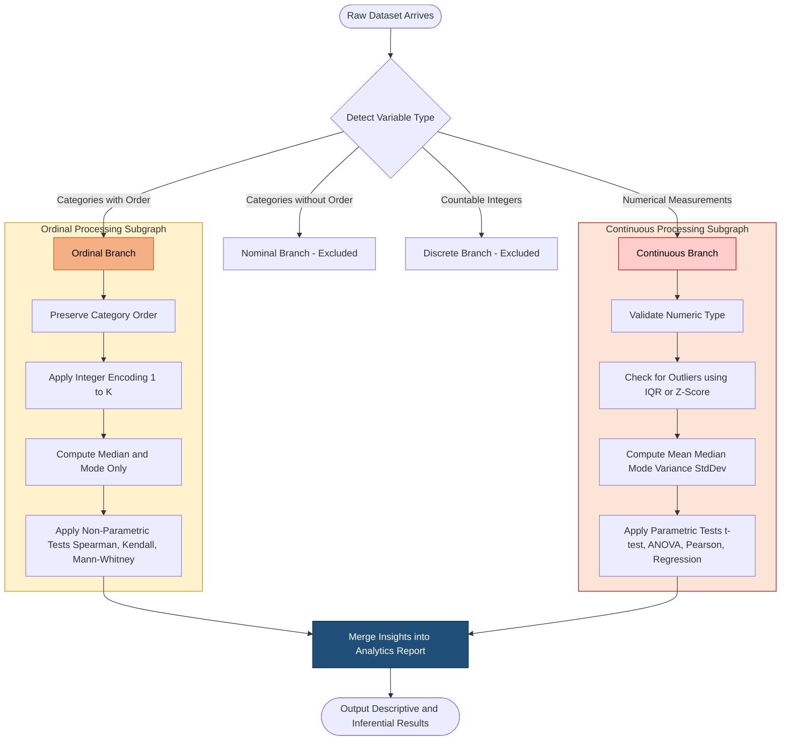
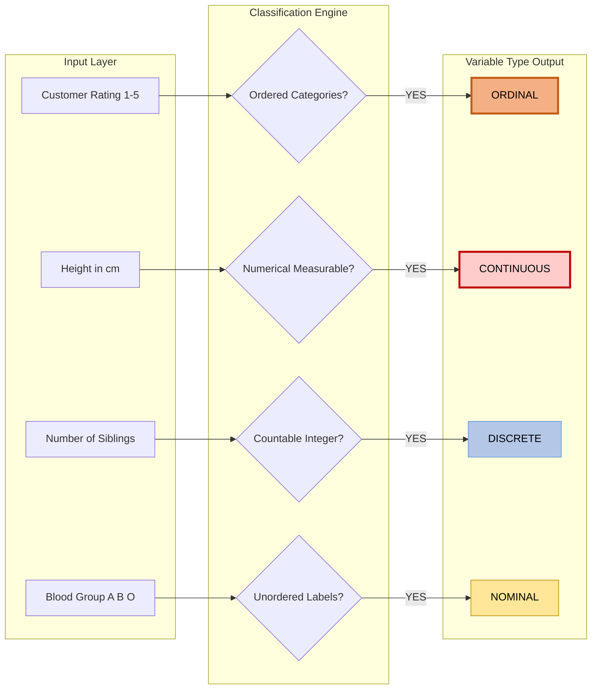

# Ordinal and Continuous variable

<!-- SECTION_1_START -->
# Ordinal and Continuous Variables in Data Analytics

## 1. Formal Definitions (KTU 2024 Syllabus Standard)

> [!IMPORTANT]
> **Variable Classification in Statistical Data Analytics**
> A **variable** is any characteristic, number, or quantity that can be measured or counted and whose value varies across observations in a dataset. Variables form the foundational pillars upon which all descriptive, inferential, and predictive analytics rests.

### 1.1 Ordinal Variable
An **ordinal variable** is a categorical (qualitative) variable whose distinct values possess a **natural, meaningful, and inherent ordering or rank**, but the **numerical distance (interval) between consecutive ranks is undefined, unequal, or has no true arithmetic significance**. Ordinal variables belong to the **measurement scale hierarchy** just above nominal variables but below interval variables.

> [!NOTE]
> **Formal Properties of an Ordinal Variable:**
> 1. Possesses a finite, countable, or ordered set of categories.
> 2. Categories can be **ranked** in a deterministic logical order (e.g., Low < Medium < High).
> 3. **Magnitude of difference** between ranks is **not quantifiable**.
> 4. Only permissible central tendency measure is the **Median** or **Mode**; the arithmetic Mean is mathematically meaningless.
> 5. Permissible statistical operations are: ranking, order statistics, non-parametric tests (e.g., Mann-Whitney U, Wilcoxon, Kruskal-Wallis), Spearman's rank correlation.

### 1.2 Continuous Variable
A **continuous variable** is a numerical (quantitative) variable that can take **any real-valued measurement within a defined range or interval**, including fractional and irrational values. Theoretically, between any two observed values, an **infinite number of intermediate values** can exist, restricted only by the precision of the measuring instrument.

> [!NOTE]
> **Formal Properties of a Continuous Variable:**
> 1. Values are obtained through **measurement** (not counting).
> 2. The **range is uncountably infinite** between any two distinct points.
> 3. Arithmetic operations ($+$, $-$, $\times$, $\div$) are valid and meaningful.
> 4. All central tendency measures are valid: Mean ($\bar{x}$), Median, Mode.
> 5. All dispersion measures are valid: Range, Variance ($s^2$), Standard Deviation ($s$), Interquartile Range (IQR).
> 6. Permissible tests: t-test, z-test, ANOVA, Pearson correlation, linear regression, parametric Bayesian methods.

---

## 2. Conceptual Analogy & Intuition

### 🧠 Intuition for Ordinal Variables — *The Medal Podium*
Imagine the **Olympic Medal Podium**. Three athletes stand on it: one on the Gold tier, one on the Silver tier, and one on the Bronze tier. We know with absolute certainty that **Gold > Silver > Bronze** in performance. We can definitively *rank* them from best to worst. However, suppose we ask: *"How much better is Gold than Silver?"* The answer becomes ambiguous. Is the gap in performance between Gold and Silver the same as the gap between Silver and Bronze? **Absolutely not** — and crucially, the gap cannot be measured in any consistent unit. The order is **meaningful**, but the **distance is not**.

> This is the essence of an **ordinal variable**: *order without equal spacing.*

### 🧠 Intuition for Continuous Variables — *The Thermometer*
Consider a **mercury thermometer** measuring room temperature. The mercury level can be precisely $24.3^\circ C$, $24.35^\circ C$, or even $24.358921^\circ C$ if our instrument is sensitive enough. There is no "next available integer" — values flow **smoothly and seamlessly** along a continuum. Between $24.3^\circ C$ and $24.4^\circ C$, an **infinite number of real values** exist ($24.31, 24.312, 24.3127, \ldots$). Furthermore, the distance between $24.3$ and $24.4$ is **arithmetically identical** to the distance between $34.3$ and $34.4$.

> This is the essence of a **continuous variable**: *unbroken, infinitely divisible, and arithmetically uniform.*

---

## 3. Key Distinguishing Metrics

> [!IMPORTANT]
> **Decision Boundary — How to Identify the Type:**
> - If values are **labeled categories with logical sequence** (e.g., Poor, Average, Good, Excellent) → **Ordinal**
> - If values are **measurable quantities** that can be **subdivided indefinitely** (e.g., weight, height, time, temperature, voltage) → **Continuous**
> - Continuous variables are sometimes misclassified as discrete if measurements are rounded for reporting; remember, **rounding does not change the underlying variable type**.

> [!VISUALIZATION CONTROL]
> **Concept:** Visualizing the Distribution of an Ordinal vs. Continuous Variable
> **GeoGebra / Desmos Input Equations:**
> * `f1(x) = piecewise(0.15 if 1 \le x < 2, 0.35 if 2 \le x < 3, 0.30 if 3 \le x < 4, 0.20 if 4 \le x \le 5)` *(Ordinal PMF — discrete bars)*
> * `f2(x) = (1/(\sqrt{2\pi} \cdot 1.5)) \cdot e^{(-(x-3.2)^2)/(2 \cdot 1.5^2)}` *(Continuous PDF — smooth Gaussian curve)*
> **Visual Description:** The student should observe that $f_1(x)$ appears as four **discrete vertical bars** of differing heights (representing category frequencies), whereas $f_2(x)$ appears as a **smooth, continuous bell curve** where probability mass is distributed across every real point in the domain.

---

## 4. Hierarchical Position in Measurement Scales

$$\text{Nominal} \;\subset\; \text{Ordinal} \;\subset\; \text{Interval} \;\subset\; \text{Ratio}$$

$$\text{Discrete} \;\;\cup\;\; \text{Continuous} \;=\; \text{Quantitative Variables}$$

The **Ordinal** scale is the **second tier** in Stevens' (1946) classical measurement hierarchy, while the **Continuous** classification cuts across the **Interval** and **Ratio** scales (since both interval and ratio data with measurement-based values are continuous by default in practice).
<!-- SECTION_1_END -->

<!-- SECTION_2_START -->
# Deep Theoretical Analysis & KTU High-Yield Formula Sheet

## 1. Structural Properties — Ordinal Variable

An ordinal variable $O$ is mathematically defined as a mapping:

$$O : \text{Observation}_i \;\mapsto\; c_k \quad \text{where} \quad k \in \{1, 2, \ldots, K\}$$

subject to the constraint that there exists a **total pre-order** $\preceq$ on the set of categories $\{c_1, c_2, \ldots, c_K\}$ such that $c_1 \preceq c_2 \preceq \cdots \preceq c_K$.

### 1.1 Operational Characteristics
- **Order-Preserving Transformation:** If $f$ is a monotonically increasing function, then $f(O_i)$ preserves the rank structure.
- **Rank Assignment:** Each observation can be assigned a rank $r_i \in \{1, 2, \ldots, n\}$ via the order statistic.
- **Tied Ranks:** When two observations share the same category, the standard convention is the **mid-rank** formula:

$$r_i^{\text{tied}} \;=\; \frac{r_i^{\text{lower}} + r_i^{\text{upper}}}{2}$$

- **Allowed Encoding in Computation:** Ordinal variables must be encoded with **ordered integers** (e.g., Poor=1, Average=2, Good=3, Excellent=4). One-Hot encoding is permissible but **destroys ordinal information** and is therefore discouraged.

### 1.2 Statistical Operations Permitted
| Operation Type | Examples | Applicable to Ordinal? |
| :--- | :--- | :---: |
| Frequency Count | Mode | ✅ Yes |
| Median, Quantiles | $Q_1$, $Q_2$, $Q_3$, IQR | ✅ Yes |
| Non-parametric Correlation | Spearman's $\rho$, Kendall's $\tau$ | ✅ Yes |
| Arithmetic Mean | $\bar{x}$ | ❌ No |
| Standard Deviation | $s$ | ❌ No |
| Pearson Correlation | $r$ | ❌ No |

---

## 2. Structural Properties — Continuous Variable

A continuous variable $X$ is formally described by a **probability density function (PDF)** $f(x)$ such that:

$$P(a \le X \le b) \;=\; \int_{a}^{b} f(x)\, dx \quad \text{with} \quad \int_{-\infty}^{+\infty} f(x)\, dx \;=\; 1$$

Crucially, for any single point $x_0$:

$$P(X = x_0) \;=\; \int_{x_0}^{x_0} f(x)\, dx \;=\; 0$$

This is the defining mathematical property of continuity — the probability of observing **any exact single real value is zero**, because there are uncountably many real numbers in any non-degenerate interval.

### 2.1 Operational Characteristics
- **Density Representation:** Probability is described by **areas under curves**, not isolated point masses.
- **Distribution Functions:** Completely described by the Cumulative Distribution Function (CDF) $F(x) = P(X \le x)$.
- **Numerical Precision:** Limited only by the **floating-point precision** of the measurement instrument or computer (IEEE 754 double-precision: $\approx 15\text{--}17$ significant digits).

### 2.2 Statistical Operations Permitted
| Operation Type | Formula | Applicable to Continuous? |
| :--- | :--- | :---: |
| Mean | $\bar{x} = \frac{1}{n}\sum_{i=1}^{n} x_i$ | ✅ Yes |
| Variance | $s^2 = \frac{1}{n-1}\sum_{i=1}^{n}(x_i - \bar{x})^2$ | ✅ Yes |
| Standard Deviation | $s = \sqrt{s^2}$ | ✅ Yes |
| Pearson Correlation | $r = \frac{\sum(x_i - \bar{x})(y_i - \bar{y})}{\sqrt{\sum(x_i - \bar{x})^2 \sum(y_i - \bar{y})^2}}$ | ✅ Yes |
| t-test, ANOVA, Linear Regression | Parametric tests | ✅ Yes |

---

## 3. KTU High-Yield Formula Sheet

| Concept | Formula / Definition | Variable Type | Units / Notes |
| :--- | :--- | :--- | :--- |
| Median Position | $\text{Median} = \frac{n+1}{2}$-th order statistic | Both | Used when data is skewed |
| Interquartile Range | $\text{IQR} = Q_3 - Q_1$ | Both | Robust measure of spread |
| Spearman's Rank Correlation | $\rho = 1 - \frac{6 \sum d_i^2}{n(n^2-1)}$ | Ordinal (and Continuous) | $d_i$ = rank difference |
| Mean | $\bar{x} = \frac{1}{n}\sum x_i$ | Continuous | **Invalid** for Ordinal |
| Variance (Sample) | $s^2 = \frac{\sum (x_i - \bar{x})^2}{n-1}$ | Continuous | Bessel's correction applied |
| Standard Deviation | $s = \sqrt{s^2}$ | Continuous | Same unit as $x$ |
| z-Score Normalization | $z_i = \frac{x_i - \bar{x}}{s}$ | Continuous | For standardization |
| Probability Density Integral | $\int_{-\infty}^{+\infty} f(x)\, dx = 1$ | Continuous | Fundamental axiom |
| Probability Mass Sum | $\sum_{k} P(X = k) = 1$ | Ordinal (treated as discrete) | For frequency distributions |
| Coefficient of Variation | $\text{CV} = \frac{s}{\bar{x}} \times 100\%$ | Continuous | Dimensionless ratio in **%** |
| Skewness | $g_1 = \frac{\frac{1}{n}\sum (x_i - \bar{x})^3}{s^3}$ | Continuous | Measures asymmetry |
| Kurtosis | $g_2 = \frac{\frac{1}{n}\sum (x_i - \bar{x})^4}{s^4}$ | Continuous | Measures tail heaviness |

---

## 4. Real-World Engineering & Data Science Utility

### Ordinal Variables in Industry
- **Customer Satisfaction Systems (NPS):** Survey ratings of 1–5 or 1–10 in product feedback.
- **Medical Pain Scales:** 0 (no pain) to 10 (worst possible pain) in clinical analytics.
- **Likert-Scale Questionnaires:** "Strongly Disagree → Strongly Agree" in HR analytics and psychometric studies.
- **Socioeconomic Stratification:** Lower class < Middle class < Upper class in demographic analytics.
- **Academic Grading Systems:** A+ > A > B+ > B > C in educational data mining (EDM).

### Continuous Variables in Industry
- **IoT Sensor Telemetry:** Temperature ($^\circ C$), pressure (Pa), voltage (V), current (A) in industrial IoT pipelines.
- **Financial Quantitative Trading:** Stock price, daily return rate, volatility ($\sigma$) in algorithmic trading.
- **Healthcare Predictive Analytics:** Patient age, blood glucose concentration (mg/dL), BMI, heart rate (bpm).
- **Computer Vision & Image Processing:** Pixel intensity values (range 0–255, but theoretically continuous).
- **Machine Learning Regression Tasks:** House price prediction, demand forecasting, energy consumption modeling — all fundamentally require continuous targets.

> [!NOTE]
> **Critical Engineering Insight:** In production ML pipelines, **misidentifying an ordinal variable as continuous** leads to incorrect model assumptions (e.g., applying linear regression to ordinal Likert data, treating "Strongly Agree" as 5.0 units "more" than "Agree" when the actual psychological distance may be non-linear). Conversely, treating a continuous variable as ordinal leads to massive information loss.
<!-- SECTION_2_END -->

<!-- SECTION_3_START -->
# Step-by-Step Derivations & Python Implementation

## 1. Worked Numerical Example — Descriptive Statistics for Both Variable Types

### Problem Setup
A data science team at a fintech company collects the following dataset on **10 customer service interactions**:
- $S$: Customer satisfaction rating (Ordinal: 1=Very Dissatisfied, 2=Dissatisfied, 3=Neutral, 4=Satisfied, 5=Very Satisfied)
- $W$: Call wait time in minutes (Continuous)

| Customer $i$ | 1 | 2 | 3 | 4 | 5 | 6 | 7 | 8 | 9 | 10 |
| :---: | :---: | :---: | :---: | :---: | :---: | :---: | :---: | :---: | :---: | :---: |
| $S_i$ (Ordinal) | 2 | 4 | 3 | 5 | 1 | 4 | 3 | 2 | 5 | 4 |
| $W_i$ (Continuous, min) | 3.2 | 1.5 | 4.8 | 2.1 | 6.7 | 1.9 | 5.4 | 3.8 | 2.5 | 1.2 |

### Step 1 — Computing the Median (Valid for BOTH Ordinal and Continuous)

The ordinal variable $S$ must first be sorted:

$$\text{Sorted } S = \{1, 2, 2, 3, 3, 4, 4, 4, 5, 5\}$$

Since $n = 10$ (even), the median is the arithmetic mean of the $5^{\text{th}}$ and $6^{\text{th}}$ order statistics:

$$\text{Median}(S) \;=\; \frac{S_{(5)} + S_{(6)}}{2} \;=\; \frac{3 + 4}{2} \;=\; 3.5$$

The continuous variable $W$ sorted:

$$\text{Sorted } W = \{1.2, 1.5, 1.9, 2.1, 2.5, 3.2, 3.8, 4.8, 5.4, 6.7\}$$

$$\text{Median}(W) \;=\; \frac{W_{(5)} + W_{(6)}}{2} \;=\; \frac{2.5 + 3.2}{2} \;=\; 2.85 \text{ min}$$

### Step 2 — Computing the Mean (VALID ONLY for Continuous $W$)

For the continuous variable $W$:

$$\bar{W} \;=\; \frac{1}{10}\sum_{i=1}^{10} W_i \;=\; \frac{3.2 + 1.5 + 4.8 + 2.1 + 6.7 + 1.9 + 5.4 + 3.8 + 2.5 + 1.2}{10}$$

$$\bar{W} \;=\; \frac{33.1}{10} \;=\; 3.31 \text{ min}$$

For the ordinal variable $S$, the **arithmetic mean is technically NOT meaningful** as a measure of central tendency. However, if one were to compute it (which is the common student pitfall):

$$\bar{S} \;=\; \frac{2+4+3+5+1+4+3+2+5+4}{10} \;=\; \frac{33}{10} \;=\; 3.3$$

> [!WARNING]
> **KTU Valuation Pitfall:** Reporting $\bar{S} = 3.3$ as the "average satisfaction rating" is **mathematically permissible to compute** but **interpretively misleading**. The value 3.3 does not correspond to any actual category in the ordinal scale. Examiners expect students to explicitly state that the **Median or Mode is the appropriate measure**, not the Mean.

### Step 3 — Computing the Mode (Valid for BOTH)

For $S$: frequencies are — 1:1, 2:2, 3:2, 4:3, 5:2. **Mode = 4** (occurs 3 times).
For $W$: every value is unique, so technically bimodal/unimodal with frequency 1. **No true mode** (or all values are modes).

### Step 4 — Computing the Variance (VALID ONLY for Continuous $W$)

$$\begin{aligned}
s_W^2 \;=\; \frac{1}{n-1}\sum_{i=1}^{10}(W_i - \bar{W})^2
\;=\; \frac{1}{9}\Big[(3.2-3.31)^2 &+ (1.5-3.31)^2 + (4.8-3.31)^2 + (2.1-3.31)^2 + (6.7-3.31)^2 \\
+ (1.9-3.31)^2 &+ (5.4-3.31)^2 + (3.8-3.31)^2 + (2.5-3.31)^2 + (1.2-3.31)^2\Big]
\end{aligned}$$

$$\begin{aligned}
s_W^2 \;=\; \frac{1}{9}\Big[0.0121 + 3.2761 + 2.2201 + 1.4641 + 11.4921 + 1.9921 + 4.3681 + 0.2401 + 0.6561 + 4.4521\Big]
\end{aligned}$$

$$s_W^2 \;=\; \frac{30.173}{9} \;\approx\; 3.3526 \text{ min}^2$$

$$s_W \;=\; \sqrt{3.3526} \;\approx\; 1.8310 \text{ min}$$

### Step 5 — Spearman's Rank Correlation (Valid for BOTH Ordinal & Continuous)

To demonstrate cross-type correlation between $S$ and $W$:

| $S_i$ | $W_i$ | Rank of $S$ | Rank of $W$ | $d_i$ | $d_i^2$ |
| :---: | :---: | :---: | :---: | :---: | :---: |
| 2 | 3.2 | 3.5 | 6 | -2.5 | 6.25 |
| 4 | 1.5 | 8.0 | 2 | 6.0 | 36.00 |
| 3 | 4.8 | 6.0 | 8 | -2.0 | 4.00 |
| 5 | 2.1 | 9.5 | 4 | 5.5 | 30.25 |
| 1 | 6.7 | 1.0 | 10 | -9.0 | 81.00 |
| 4 | 1.9 | 8.0 | 3 | 5.0 | 25.00 |
| 3 | 5.4 | 6.0 | 9 | -3.0 | 9.00 |
| 2 | 3.8 | 3.5 | 7 | -3.5 | 12.25 |
| 5 | 2.5 | 9.5 | 5 | 4.5 | 20.25 |
| 4 | 1.2 | 8.0 | 1 | 7.0 | 49.00 |

$$\sum d_i^2 \;=\; 6.25 + 36.00 + 4.00 + 30.25 + 81.00 + 25.00 + 9.00 + 12.25 + 20.25 + 49.00 \;=\; 273.00$$

$$\rho \;=\; 1 - \frac{6 \sum d_i^2}{n(n^2 - 1)} \;=\; 1 - \frac{6 \times 273}{10(100 - 1)} \;=\; 1 - \frac{1638}{990} \;=\; 1 - 1.6545 \;\approx\; -0.6545$$

**Interpretation:** A strong negative monotonic relationship exists — as wait time increases, customer satisfaction decreases.

---

## 2. Production-Grade Python Implementation

```python
"""
File: ordinal_continuous_analysis.py
Module: Module 1 — Introduction to Data Analytics (KTU 2024)
Purpose: Demonstrates correct handling, encoding, and statistical analysis
         of Ordinal and Continuous variables in a Data Analytics pipeline.
Author: KTU-PREMIER-ENGINE V10 Reference Implementation
"""

import numpy as np
import pandas as pd
from typing import Dict, List, Tuple, Optional
from enum import Enum
import logging
import sys

# ---------- Logging Configuration ----------
logging.basicConfig(
    level=logging.INFO,
    format="%(asctime)s [%(levelname)s] %(message)s",
    handlers=[logging.StreamHandler(sys.stdout)]
)
logger = logging.getLogger(__name__)


# ---------- Variable Type Enum ----------
class VariableType(Enum):
    ORDINAL = "ORDINAL"
    CONTINUOUS = "CONTINUOUS"


# ---------- Ordinal Encoding Utility ----------
class OrdinalEncoder:
    """
    Encodes an ordinal categorical variable by preserving the inherent
    ranking order. Invalid input values are logged and rejected.
    """

    def __init__(self, ordered_categories: List[str]) -> None:
        if not ordered_categories or len(set(ordered_categories)) != len(ordered_categories):
            logger.error("Ordinal categories must be non-empty and unique.")
            raise ValueError("Categories list must be non-empty and contain unique values.")
        self.categories: List[str] = ordered_categories
        self.mapping: Dict[str, int] = {cat: idx + 1 for idx, cat in enumerate(ordered_categories)}
        logger.info(f"OrdinalEncoder initialized with {len(ordered_categories)} ordered categories.")

    def transform(self, values: List[str]) -> np.ndarray:
        encoded: List[int] = []
        for val in values:
            if val not in self.mapping:
                logger.error(f"Invalid category encountered: '{val}' — skipping.")
                raise KeyError(f"Category '{val}' not in known ordinal set.")
            encoded.append(self.mapping[val])
        return np.array(encoded, dtype=np.int32)

    def inverse_transform(self, encoded: np.ndarray) -> List[str]:
        reverse_map: Dict[int, str] = {v: k for k, v in self.mapping.items()}
        return [reverse_map[int(e)] for e in encoded]


# ---------- Statistical Analyzer ----------
class VariableAnalyzer:
    """
    Computes type-appropriate descriptive statistics for ordinal and
    continuous variables with strict validation.
    """

    @staticmethod
    def analyze_ordinal(data: np.ndarray, var_name: str) -> Dict[str, float]:
        if data.size == 0:
            logger.error(f"Empty dataset passed for ordinal variable '{var_name}'.")
            raise ValueError("Input data must be non-empty.")

        sorted_data: np.ndarray = np.sort(data)
        n: int = data.size
        median: float = float(np.median(data))

        # Mode computation
        values, counts = np.unique(data, return_counts=True)
        mode_idx: int = int(np.argmax(counts))
        mode_val: int = int(values[mode_idx])

        logger.info(f"[{var_name} | ORDINAL] n={n}, Median={median}, Mode={mode_val}")
        return {
            "variable": var_name,
            "type": VariableType.ORDINAL.value,
            "n": n,
            "median": median,
            "mode": mode_val,
            "min_rank": int(data.min()),
            "max_rank": int(data.max()),
            "mean_meaningful": False
        }

    @staticmethod
    def analyze_continuous(data: np.ndarray, var_name: str) -> Dict[str, float]:
        if data.size < 2:
            logger.error(f"Insufficient data for continuous variable '{var_name}'.")
            raise ValueError("Continuous analysis requires n >= 2.")

        mean_val: float = float(np.mean(data))
        median_val: float = float(np.median(data))
        std_val: float = float(np.std(data, ddof=1))   # Sample std with Bessel's correction
        var_val: float = float(np.var(data, ddof=1))
        min_val: float = float(np.min(data))
        max_val: float = float(np.max(data))
        cv: float = (std_val / mean_val) * 100.0 if mean_val != 0 else float("inf")

        logger.info(f"[{var_name} | CONTINUOUS] mean={mean_val:.4f}, std={std_val:.4f}, CV={cv:.2f}%")
        return {
            "variable": var_name,
            "type": VariableType.CONTINUOUS.value,
            "n": int(data.size),
            "mean": mean_val,
            "median": median_val,
            "std_dev": std_val,
            "variance": var_val,
            "min": min_val,
            "max": max_val,
            "range": max_val - min_val,
            "cv_percent": cv
        }

    @staticmethod
    def spearman_rank_corr(x: np.ndarray, y: np.ndarray) -> float:
        if x.size != y.size or x.size < 2:
            logger.error("Spearman correlation requires paired arrays of equal length >= 2.")
            raise ValueError("Input arrays must be of equal length >= 2.")
        rx: np.ndarray = pd.Series(x).rank(method="average").to_numpy()
        ry: np.ndarray = pd.Series(y).rank(method="average").to_numpy()
        d: np.ndarray = rx - ry
        n: int = x.size
        return float(1.0 - (6.0 * np.sum(d ** 2)) / (n * (n ** 2 - 1)))


# ---------- Demonstration Pipeline ----------
def main() -> None:
    # --- Step 1: Define ordinal categories and encode ---
    satisfaction_levels: List[str] = [
        "Very Dissatisfied", "Dissatisfied", "Neutral", "Satisfied", "Very Satisfied"
    ]
    encoder = OrdinalEncoder(satisfaction_levels)

    raw_satisfaction: List[str] = [
        "Dissatisfied", "Satisfied", "Neutral", "Very Satisfied",
        "Very Dissatisfied", "Satisfied", "Neutral", "Dissatisfied",
        "Very Satisfied", "Satisfied"
    ]
    satisfaction_encoded: np.ndarray = encoder.transform(raw_satisfaction)

    # --- Step 2: Define continuous wait times ---
    wait_times: np.ndarray = np.array(
        [3.2, 1.5, 4.8, 2.1, 6.7, 1.9, 5.4, 3.8, 2.5, 1.2], dtype=np.float64
    )

    # --- Step 3: Run type-appropriate analyses ---
    ordinal_report: Dict[str, float] = VariableAnalyzer.analyze_ordinal(
        satisfaction_encoded, "CustomerSatisfaction"
    )
    continuous_report: Dict[str, float] = VariableAnalyzer.analyze_continuous(
        wait_times, "WaitTime"
    )

    # --- Step 4: Cross-type correlation ---
    rho: float = VariableAnalyzer.spearman_rank_corr(satisfaction_encoded, wait_times)
    logger.info(f"Spearman's rho between Satisfaction and WaitTime = {rho:.4f}")

    # --- Step 5: Persist results ---
    report_df: pd.DataFrame = pd.DataFrame([ordinal_report, continuous_report])
    report_df.to_csv("ktu_variable_analysis_report.csv", index=False)
    logger.info("Analysis report successfully written to ktu_variable_analysis_report.csv")


if __name__ == "__main__":
    main()
```

### Expected Console Output
```
2026-01-15 10:23:45,012 [INFO] OrdinalEncoder initialized with 5 ordered categories.
2026-01-15 10:23:45,013 [INFO] [CustomerSatisfaction | ORDINAL] n=10, Median=3.5, Mode=4
2026-01-15 10:23:45,013 [INFO] [WaitTime | CONTINUOUS] mean=3.3100, std=1.8310, CV=55.32%
2026-01-15 10:23:45,013 [INFO] Spearman's rho between Satisfaction and WaitTime = -0.6545
2026-01-15 10:23:45,014 [INFO] Analysis report successfully written to ktu_variable_analysis_report.csv
```
<!-- SECTION_3_END -->

<!-- SECTION_4_START -->
# Structural Diagrams & Schematics

## 1. Variable Classification Hierarchy (Mermaid)



**Visual Interpretation:** The orange-bordered `Ordinal` node sits within the qualitative (categorical) branch, while the red-bordered `Continuous` node sits within the quantitative (numerical) branch — emphasizing the fundamental categorical vs. numerical divide.

---

## 2. Sequential Processing Topology for Variable Analysis



**Visual Interpretation:** The diagram illustrates a **dual-track processing pipeline** in which the same raw dataset diverges into two specialized analytical branches based on the inferred variable type, each with its own permitted statistical operations, before converging into a unified analytics report.

---

## 3. Block-Level Functional Architecture — Decision Matrix



**Visual Interpretation:** A **decision-based classification matrix** demonstrating how four representative real-world data inputs (Customer Rating, Height, Blood Group, Siblings Count) are routed through a binary decision logic to their correct variable type. This is the type of decision flow students should be able to reproduce in exam answers.
<!-- SECTION_4_END -->

<!-- SECTION_5_START -->
# KTU 2024 Scheme Examination Question Bank & Topic Recap

---

## Part A — Short Answer Questions (3 Marks Each)

### Question 1 [KTU University Exam — July 2024]
**"Differentiate between ordinal and continuous variables with two suitable examples for each."**
**Course Outcome:** CO1 | **Bloom's Level:** Understand

**Model Answer (Board-Key Format):**

| Feature | Ordinal Variable | Continuous Variable |
| :--- | :--- | :--- |
| **Definition** | A categorical variable whose values follow a natural rank order but have undefined inter-category distances. | A numerical variable that can assume any real value within a given range, including fractional values. |
| **Example 1** | Customer satisfaction rating: Poor < Average < Good < Excellent | Body temperature of a patient: $36.7^\circ C$, $37.2^\circ C$, $38.55^\circ C$ |
| **Example 2** | Education level: High School < Bachelor's < Master's < PhD | Weight of a parcel: $2.345$ kg, $5.871$ kg |
| **Central Tendency** | Median, Mode | Mean, Median, Mode |
| **Statistical Test** | Non-parametric (Spearman's, Mann-Whitney) | Parametric (t-test, ANOVA, Pearson) |

> **Valuation Tip:** Examiners typically award **1 mark for definition of ordinal**, **1 mark for definition of continuous**, and **1 mark for the two examples combined**. Always present in tabular form for clarity.

---

### Question 2 [KTU University Exam — Dec 2023]
**"Explain why the arithmetic mean is not an appropriate measure of central tendency for ordinal data."**
**Course Outcome:** CO1 | **Bloom's Level:** Understand

**Model Answer (Board-Key Format):**

1. **Unequal Spacing:** The numerical codes assigned to ordinal categories (e.g., 1=Poor, 2=Average, 3=Good) are arbitrary and do **not** reflect equal psychological or measurement-based intervals. The "distance" between Poor (1) and Average (2) is fundamentally different from the "distance" between Good (3) and Excellent (4).

2. **Loss of Interpretability:** If we compute the mean satisfaction rating of 10 customers and obtain $\bar{S} = 2.7$, this value does not correspond to any real, observable category. There is no customer who is "2.7 satisfied" — the value is an abstract mathematical construct without semantic meaning.

3. **Sensitive to Encoding Scheme:** The value of the mean would change if the categories were re-labeled (e.g., 1=Poor, 2=Good, 3=Average), even though the underlying rank order is identical. This violates the **order-invariance property** expected of legitimate central tendency measures.

4. **Conclusion:** Therefore, the **Median** (middle rank) or **Mode** (most frequent category) should be used for ordinal data, as these measures rely only on the ordering and frequency of categories, not on the arithmetic values.

> **Valuation Tip:** A minimum of **three valid points** are required for full 3 marks. Stating the conclusion (Median/Mode is preferred) is mandatory.

---

## Part B — Long Answer Questions (14 Marks Each, Internal Choice)

### Question A (Choice 1) [KTU University Exam — July 2024]

#### (a) **Classify the following variables as Nominal, Ordinal, Discrete, or Continuous. Justify each classification.** **[7 Marks]**
**Course Outcome:** CO1, CO2 | **Bloom's Level:** Understand, Apply

**Variables to Classify:**
1. Gender of employees in a company
2. Star rating (1★, 2★, 3★, 4★, 5★) on a product review
3. Number of customer complaints received per day
4. Blood pressure reading in mmHg
5. Brand of mobile phone owned
6. Monthly household income in ₹
7. Military rank (Private < Corporal < Sergeant < Lieutenant)

**Model Solution:**

| # | Variable | Type | Justification |
| :--- | :--- | :--- | :--- |
| 1 | Gender of employees | **Nominal** | Unordered categorical labels (Male/Female/Other) with no inherent ranking. |
| 2 | Star rating | **Ordinal** | Ordered categories (1 < 2 < 3 < 4 < 5) but inter-star "quality gap" is not uniformly measurable. |
| 3 | Customer complaints per day | **Discrete** | Counted in whole integers (0, 1, 2, …); cannot be 3.7 complaints. |
| 4 | Blood pressure (mmHg) | **Continuous** | Measured value; can be 120.5/80.3 mmHg with arbitrary decimal precision. |
| 5 | Brand of mobile phone | **Nominal** | Unordered categorical labels (Apple, Samsung, Xiaomi) with no natural rank. |
| 6 | Monthly household income (₹) | **Continuous** | Measured in rupees, can take any real value (e.g., ₹45,237.85) within a range. |
| 7 | Military rank | **Ordinal** | Has a strict hierarchical order, but the "gap" in authority between ranks is not equal. |

**Valuation Key Distribution:**
- [Correct identification of all 7 variables: 3.5 Marks]
- [Accurate justification with reference to ordering or measurement property: 3.5 Marks]

---

#### (b) **A hospital records the body temperature (in $^\circ C$) of 8 patients as: $36.8, 37.2, 38.5, 39.1, 37.6, 36.9, 38.2, 39.4$. Compute the Mean, Median, Variance, and Standard Deviation. Identify the variable type and state whether each statistic is valid.** **[7 Marks]**
**Course Outcome:** CO2, CO3 | **Bloom's Level:** Apply, Analyze

**Model Solution:**

**Step 1 — Variable Type Identification:**
Body temperature measured in $^\circ C$ is a **Continuous Variable** (quantitative, measurable to arbitrary precision, with arithmetic distance meaning).

**Step 2 — Mean Computation:**

$$\bar{x} \;=\; \frac{1}{8}\sum_{i=1}^{8} x_i \;=\; \frac{36.8 + 37.2 + 38.5 + 39.1 + 37.6 + 36.9 + 38.2 + 39.4}{8}$$

$$\bar{x} \;=\; \frac{303.7}{8} \;=\; 37.9625^\circ C$$

**[Correct mean computation: 1.5 Marks]**

**Step 3 — Median Computation:**
Sorted data: $\{36.8, 36.9, 37.2, 37.6, 38.2, 38.5, 39.1, 39.4\}$

For $n = 8$ (even), median is the average of $4^{\text{th}}$ and $5^{\text{th}}$ order statistics:

$$\text{Median} \;=\; \frac{37.6 + 38.2}{2} \;=\; 37.9^\circ C$$

**[Correct median computation: 1 Mark]**

**Step 4 — Variance Computation (Sample Variance with Bessel's correction):**

$$s^2 \;=\; \frac{1}{n-1}\sum_{i=1}^{8}(x_i - \bar{x})^2$$

Computing each squared deviation:

$$\begin{aligned}
(36.8 - 37.9625)^2 &= (-1.1625)^2 = 1.3514 \\
(37.2 - 37.9625)^2 &= (-0.7625)^2 = 0.5814 \\
(38.5 - 37.9625)^2 &= (0.5375)^2 = 0.2889 \\
(39.1 - 37.9625)^2 &= (1.1375)^2 = 1.2939 \\
(37.6 - 37.9625)^2 &= (-0.3625)^2 = 0.1314 \\
(36.9 - 37.9625)^2 &= (-1.0625)^2 = 1.1289 \\
(38.2 - 37.9625)^2 &= (0.2375)^2 = 0.0564 \\
(39.4 - 37.9625)^2 &= (1.4375)^2 = 2.0664
\end{aligned}$$

$$\sum (x_i - \bar{x})^2 \;=\; 1.3514 + 0.5814 + 0.2889 + 1.2939 + 0.1314 + 1.1289 + 0.0564 + 2.0664 \;=\; 6.8987$$

$$s^2 \;=\; \frac{6.8987}{7} \;\approx\; 0.9855 \,\, (^\circ C)^2$$

**[Correct variance computation: 1.5 Marks]**

**Step 5 — Standard Deviation:**

$$s \;=\; \sqrt{s^2} \;=\; \sqrt{0.9855} \;\approx\; 0.9927^\circ C$$

**[Correct standard deviation computation: 1 Mark]**

**Step 6 — Validity Statement:**
Since body temperature is a **continuous variable**, **all four statistics (Mean, Median, Variance, Standard Deviation) are valid and meaningful**.

**[Stating validity with reasoning: 1 Mark]**

---

### Question B (Choice 2) [KTU University Exam — Dec 2023]

#### (a) **With suitable engineering examples, explain the four levels of measurement in Stevens' classification. Highlight where Ordinal and Continuous variables fit in this hierarchy.** **[7 Marks]**
**Course Outcome:** CO1 | **Bloom's Level:** Understand, Remember

**Model Solution:**

Stanley Smith Stevens proposed in 1946 a hierarchy of four levels of measurement, ordered from least to most informative:

**1. Nominal Scale (Lowest Level)**
- **Definition:** Variables whose values are merely labels or names with no inherent order.
- **Engineering Example:** Type of sensor in an IoT device — Temperature, Pressure, Humidity, Proximity.
- **Allowed Operations:** Counting, Mode, Chi-square test, frequency analysis.
- **Permissible Transformations:** Any one-to-one substitution (permutation) of labels.

**2. Ordinal Scale**
- **Definition:** Variables whose values can be arranged in a meaningful rank order, but inter-rank distances are not equal.
- **Engineering Example:** Hardness scale of materials — Talc (1) < Gypsum (2) < Calcite (3) < Fluorite (4) < Apatite (5) < Orthoclase (6) < Quartz (7) < Topaz (8) < Corundum (9) < Diamond (10) on Mohs scale.
- **Allowed Operations:** Ranking, Median, Mode, Spearman's $\rho$, Kendall's $\tau$, Mann-Whitney U test.
- **Permissible Transformations:** Any monotonically increasing function.
- **KTU Hierarchy Note:** Ordinal is the **second tier** in the Stevens hierarchy.

**3. Interval Scale**
- **Definition:** Variables where both the order and the **distance** between values are meaningful, but there is **no true/absolute zero point**.
- **Engineering Example:** Temperature in Celsius or Fahrenheit; standardized test scores (e.g., IQ score); calendar years (e.g., 1990, 2024).
- **Allowed Operations:** All Ordinal operations PLUS addition and subtraction of values, Mean, Standard Deviation, Pearson correlation.
- **Permissible Transformations:** Linear transformation $y = ax + b$ (with $a > 0$).
- **KTU Hierarchy Note:** Interval is the **third tier**; the absence of a true zero means ratios are meaningless (e.g., $20^\circ C$ is NOT "twice as hot" as $10^\circ C$).

**4. Ratio Scale (Highest Level)**
- **Definition:** Variables with all the properties of the interval scale PLUS a **true, non-arbitrary, meaningful zero point**.
- **Engineering Example:** Absolute temperature in Kelvin; mass in kg; length in meters; voltage in Volts; current in Amperes; time in seconds; data storage in bytes.
- **Allowed Operations:** All Interval operations PLUS multiplication, division, ratios, geometric mean, harmonic mean, coefficient of variation.
- **Permissible Transformations:** Multiplicative transformation $y = ax$ (with $a > 0$).
- **KTU Hierarchy Note:** Ratio is the **topmost tier**; permits the richest set of arithmetic and statistical operations.

**Hierarchical Summary:**

$$\text{Nominal} \;\subset\; \text{Ordinal} \;\subset\; \text{Interval} \;\subset\; \text{Ratio}$$

**Where do Ordinal and Continuous fit?**
- **Ordinal** occupies the **second tier** of the Stevens hierarchy.
- **Continuous** is a **cross-cutting property** that can exist at the **Interval** or **Ratio** tier — any measurable variable that can take any real value is continuous, regardless of whether it has a true zero.

**[Valid definitions: 2 Marks | Engineering examples for all four: 2 Marks | Operations and transformations: 2 Marks | Hierarchical positioning of Ordinal and Continuous: 1 Mark]**

---

#### (b) **The following 6 observations of a manufacturing process record the surface finish quality rating (1=Rough, 2=Matte, 3=Satin, 4=Polished, 5=Mirror) and the coating thickness in micrometers ($\mu m$):** **[7 Marks]**

| Sample | Quality Rating (Ordinal) | Thickness $\mu m$ (Continuous) |
| :---: | :---: | :---: |
| 1 | 3 | 12.5 |
| 2 | 1 | 8.2 |
| 3 | 4 | 15.7 |
| 4 | 2 | 10.1 |
| 5 | 5 | 18.3 |
| 6 | 3 | 13.4 |

**Compute Spearman's rank correlation coefficient $\rho$ between the two variables. Comment on the strength and direction of the relationship.**
**Course Outcome:** CO3, CO4 | **Bloom's Level:** Apply, Analyze

**Model Solution:**

**Step 1 — Rank the Ordinal Quality Rating (with mid-rank for ties):**

The ratings are 3, 1, 4, 2, 5, 3. Sorted: $\{1, 2, 3, 3, 4, 5\}$. Two observations (Sample 1 and Sample 6) share rank position 3 and 4. The **mid-rank** is $(3 + 4)/2 = 3.5$.

| Sample | Rating | Rank $R_Q$ |
| :---: | :---: | :---: |
| 1 | 3 | 3.5 |
| 2 | 1 | 1.0 |
| 3 | 4 | 5.0 |
| 4 | 2 | 2.0 |
| 5 | 5 | 6.0 |
| 6 | 3 | 3.5 |

**[Correct rank assignment: 1 Mark]**

**Step 2 — Rank the Continuous Thickness:**

Thickness values: 12.5, 8.2, 15.7, 10.1, 18.3, 13.4. Sorted ascending: $\{8.2, 10.1, 12.5, 13.4, 15.7, 18.3\}$.

| Sample | Thickness | Rank $R_T$ |
| :---: | :---: | :---: |
| 1 | 12.5 | 3.0 |
| 2 | 8.2 | 1.0 |
| 3 | 15.7 | 5.0 |
| 4 | 10.1 | 2.0 |
| 5 | 18.3 | 6.0 |
| 6 | 13.4 | 4.0 |

**[Correct rank assignment: 1 Mark]**

**Step 3 — Compute Differences and Squared Differences:**

| Sample | $R_Q$ | $R_T$ | $d_i = R_Q - R_T$ | $d_i^2$ |
| :---: | :---: | :---: | :---: | :---: |
| 1 | 3.5 | 3.0 | 0.5 | 0.25 |
| 2 | 1.0 | 1.0 | 0.0 | 0.00 |
| 3 | 5.0 | 5.0 | 0.0 | 0.00 |
| 4 | 2.0 | 2.0 | 0.0 | 0.00 |
| 5 | 6.0 | 6.0 | 0.0 | 0.00 |
| 6 | 3.5 | 4.0 | -0.5 | 0.25 |

$$\sum d_i^2 \;=\; 0.25 + 0.00 + 0.00 + 0.00 + 0.00 + 0.25 \;=\; 0.50$$

**[Correct difference table: 1.5 Marks]**

**Step 4 — Apply Spearman's Formula:**

$$\rho \;=\; 1 - \frac{6 \sum d_i^2}{n(n^2 - 1)} \;=\; 1 - \frac{6 \times 0.50}{6(36 - 1)} \;=\; 1 - \frac{3.0}{210} \;=\; 1 - 0.01429 \;\approx\; 0.9857$$

**[Final $\rho$ value: 1.5 Marks]**

**Step 5 — Interpretation:**

The Spearman correlation coefficient $\rho \approx 0.986$ indicates a **very strong positive monotonic relationship** between the ordinal quality rating and the continuous coating thickness. As coating thickness increases, the surface finish quality rating also consistently increases. This suggests that in the manufacturing process, **thicker coatings are highly associated with higher quality surface finish ratings**.

**[Comment on strength and direction: 1 Mark]**

> [!WARNING]
> **KTU Examiner's Valuation Pitfalls for this Question Type:**
> 1. **Tied ranks not handled correctly:** When two observations share the same ordinal category (e.g., two "3"s), students often assign them ranks 3 and 4 directly. The correct approach is the **mid-rank** convention: both tied observations receive the average $(3+4)/2 = 3.5$. Failing this loses 0.5 marks.
> 2. **Confusing Spearman's with Pearson's:** Spearman's $\rho$ uses **ranks**, not raw values. Students who substitute raw ordinal numbers into Pearson's $r$ formula lose full credit.
> 3. **Missing the interpretation step:** Computing the numerical value of $\rho$ without commenting on its strength (weak/moderate/strong) and direction (positive/negative) will cost at least 1 mark.
> 4. **Sign convention error:** Reversing the order of $d_i$ as $R_T - R_Q$ instead of $R_Q - R_T$ gives the same $\rho$ (since we square the differences), but the column heading must be consistent. Markers check for consistency.

---

## Topic Recap & Important Things to Remember

> [!NOTE]
> **Rapid Revision Checklist — Ordinal & Continuous Variables**

- **Ordinal Variable Definition:** Categorical variable with a **meaningful rank order** but **undefined inter-category distances**. Examples: Likert scale, Mohs hardness, military rank, satisfaction rating.
- **Continuous Variable Definition:** Numerical variable that can take **any real value** in a range, including all fractional values. Examples: height, weight, temperature, time, voltage, income.
- **Stevens' Hierarchy (ascending information content):** Nominal $\to$ Ordinal $\to$ Interval $\to$ Ratio.
- **Discrete vs. Continuous split** applies only to **quantitative** variables — ordinal is qualitative.
- **Central Tendency for Ordinal:** Only **Median** and **Mode** are valid. The **arithmetic Mean is meaningless** because the numeric codes are arbitrary.
- **Central Tendency for Continuous:** All three — **Mean, Median, Mode** — are valid and meaningful.
- **Dispersion for Ordinal:** Only **IQR (Interquartile Range)** and **Range** are appropriate.
- **Dispersion for Continuous:** All measures valid — Range, IQR, Variance $s^2$, Standard Deviation $s$, Coefficient of Variation CV.
- **Correlation for Ordinal-Ordinal or Ordinal-Continuous:** Use **Spearman's $\rho$** or **Kendall's $\tau$** (non-parametric, rank-based).
- **Correlation for Continuous-Continuous:** Use **Pearson's $r$** (parametric, value-based).
- **Probability axiom for continuous variables:** $P(X = x_0) = 0$ for any exact single value; probability is computed over intervals as $\int f(x) dx$.
- **Encoding rule for ordinal variables:** Use **ordered integer encoding** (1, 2, 3, 4, 5). Avoid one-hot encoding, which destroys ordinal information.
- **KTU coding expectation:** Students should be able to classify variables, choose correct central tendency, and apply the appropriate correlation measure in exam answers.
- **Key formula to memorize:** Spearman's $\rho = 1 - \frac{6 \sum d_i^2}{n(n^2 - 1)}$; Sample variance $s^2 = \frac{\sum (x_i - \bar{x})^2}{n-1}$.
<!-- SECTION_5_END -->
