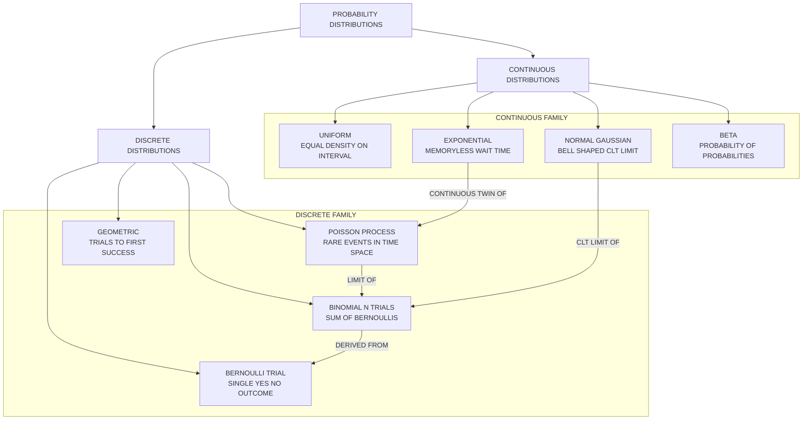
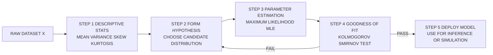
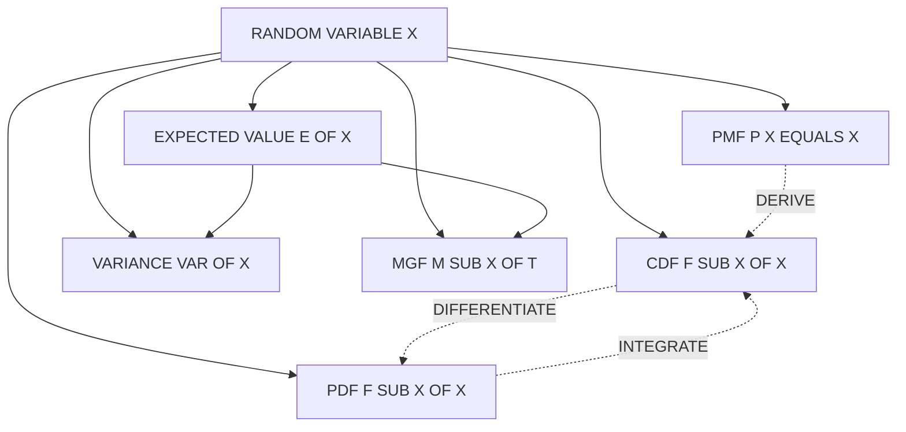

# Probability calculus - probability distributions

<!-- SECTION_1_START -->
# Probability Calculus — Probability Distributions

## 1.1 Formal Definition (KTU 2024 Syllabus Terminology)

> [!NOTE]
> **Probability Distribution (PD):** A mathematical function (or rule) that assigns a probability to every possible outcome of a random experiment. Formally, it is a mapping from the sample space $\Omega$ to the real line such that the probabilities of all elementary events sum (or integrate) to **1**.

A probability distribution is fully characterised by three companion functions:

| Function | Symbol | Domain | Definition |
| :--- | :---: | :---: | :--- |
| Probability Mass Function | $P_X(x)$ | Discrete | $P(X = x_i)$ for each outcome $x_i$ |
| Probability Density Function | $f_X(x)$ | Continuous | $P(a \le X \le b) = \int_a^b f_X(x)\,dx$ |
| Cumulative Distribution Function | $F_X(x)$ | Both | $F_X(x) = P(X \le x)$ |

A **Random Variable (RV)** $X$ is a measurable function $X : \Omega \rightarrow \mathbb{R}$ that maps each outcome in the sample space to a real number. Random variables are the inputs to any probability distribution.

### Types of Random Variables
- **Discrete RV:** Takes a countable set of values (e.g., number of defective bulbs in a lot).
- **Continuous RV:** Takes any real value within an interval (e.g., the lifetime of a semiconductor chip).

> [!IMPORTANT]
> **KTU 2024 — Module 1 Highlight:** Students must master both *discrete* (Bernoulli, Binomial, Poisson) and *continuous* (Uniform, Normal/Gaussian, Exponential) distributions along with their **Expected Value** (mean) and **Variance** operators. These form the mathematical backbone of every inferential analytics algorithm used in `scikit-learn`, `TensorFlow Probability`, and `statsmodels`.

---

## 1.2 Conceptual Analogy & Intuitive Overview

> [!TIP]
> **Real-World Analogy — The "Dice Forecast"**
> Imagine you are a weather reporter for a city. Instead of saying "it will rain", you give a *probability table* — 20% sunny, 50% cloudy, 30% rain. This **probability distribution** is essentially a "forecast" for randomness. A discrete distribution is like a menu with fixed items (sunny / cloudy / rain), while a continuous distribution is like predicting the *exact temperature* between 20 °C and 35 °C.

A probability distribution answers the question: **"How likely is each outcome?"**

- For a **fair die roll**, the distribution is the uniform set $\left\{\tfrac{1}{6}, \tfrac{1}{6}, \tfrac{1}{6}, \tfrac{1}{6}, \tfrac{1}{6}, \tfrac{1}{6}\right\}$.
- For a **Gaussian (bell-curve)** distribution, most outcomes cluster near the mean $\mu$, with a standard deviation $\sigma$ governing the spread.

> [!VISUALIZATION CONTROL]
> **Concept:** Plot of the Standard Normal (Gaussian) PDF and the Binomial PMF side-by-side.
> **GeoGebra / Desmos Input Equations:**
> * Continuous bell curve: `f(x) = (1 / sqrt(2*pi)) * e^(-x^2 / 2)`  (Standard Normal)
> * Discrete spikes: `g(x) = nCr(10, x) * 0.5^x * 0.5^(10-x)`  (Binomial, $n=10, p=0.5$)
>
> **Visual Description:** The student should observe a **smooth symmetric bell** (continuous) peaking at $x = 0$ with tails tapering to zero, contrasted with **seven isolated vertical spikes** (discrete) at $x = 0, 1, 2, \dots, 10$ with the central spike at $x = 5$ being the tallest. The bell-curve area under $f(x)$ equals **1**, and the sum of spike heights in $g(x)$ equals **1**.
<!-- SECTION_1_END -->

<!-- SECTION_2_START -->
# Deep Theoretical Analysis & KTU Formula Sheet

## 2.1 Mathematical Properties of a Valid Distribution

For any valid probability distribution, the following **axioms (Kolmogorov's Axioms)** must hold:

1. **Non-negativity:** $P(X = x) \ge 0$ for discrete RV, and $f_X(x) \ge 0$ for continuous RV.
2. **Normalisation (Total Probability):**
   - Discrete: $\displaystyle\sum_{i} P(X = x_i) = 1$
   - Continuous: $\displaystyle\int_{-\infty}^{+\infty} f_X(x)\,dx = 1$
3. **Cumulative Monotonicity:** $F_X(x)$ is non-decreasing, right-continuous, and $\lim_{x \to -\infty} F_X(x) = 0$, $\lim_{x \to +\infty} F_X(x) = 1$.

---

## 2.2 Expected Value, Variance, and Standard Deviation

The **Expected Value (Mean)** $\mu = E[X]$ is the long-run average of the random variable.

For a discrete RV:
$$E[X] = \sum_{i} x_i \cdot P(X = x_i)$$

For a continuous RV:
$$E[X] = \int_{-\infty}^{+\infty} x \cdot f_X(x)\,dx$$

The **Variance** $\sigma^2 = \text{Var}(X)$ measures the dispersion around the mean:
$$\text{Var}(X) = E\!\left[(X - \mu)^2\right] = E[X^2] - \left(E[X]\right)^2$$

The **Standard Deviation** is the positive square root: $\sigma = \sqrt{\text{Var}(X)}$.

---

## 2.3 KTU High-Yield Formula Sheet (Cheat Sheet)

> [!IMPORTANT]
> The following table covers all six distributions mandated by the KTU 2024 PECST523 syllabus. The **mean** is $E[X]$ and the **variance** is $\text{Var}(X)$. Note: every cell uses `\vert` (not the unescaped pipe `|`) to preserve table syntax.

| Distribution | Type | PMF / PDF | Mean $E[X]$ | Variance $\text{Var}(X)$ | Support |
| :--- | :---: | :--- | :---: | :---: | :--- |
| **Bernoulli** | Discrete | $P(X = x) = p^x (1-p)^{1-x}$ for $x \in \{0,1\}$ | $p$ | $p(1-p)$ | $x \in \{0,1\}$ |
| **Binomial** | Discrete | $P(X = x) = \dbinom{n}{x}\, p^x (1-p)^{n-x}$ | $np$ | $np(1-p)$ | $x \in \{0,1,\dots,n\}$ |
| **Poisson** | Discrete | $P(X = x) = \dfrac{e^{-\lambda}\lambda^{x}}{x!}$ | $\lambda$ | $\lambda$ | $x \in \{0,1,2,\dots\}$ |
| **Uniform** | Continuous | $f_X(x) = \dfrac{1}{b-a}$ for $a \le x \le b$ | $\dfrac{a+b}{2}$ | $\dfrac{(b-a)^2}{12}$ | $x \in [a,b]$ |
| **Exponential** | Continuous | $f_X(x) = \lambda e^{-\lambda x}$ for $x \ge 0$ | $\dfrac{1}{\lambda}$ | $\dfrac{1}{\lambda^2}$ | $x \in [0,\infty)$ |
| **Normal (Gaussian)** | Continuous | $f_X(x) = \dfrac{1}{\sigma\sqrt{2\pi}}\, e^{-\frac{1}{2}\left(\frac{x-\mu}{\sigma}\right)^{2}}$ | $\mu$ | $\sigma^2$ | $x \in (-\infty,+\infty)$ |

### Standard Normal Distribution (Special Case)
When $\mu = 0$ and $\sigma = 1$, the Gaussian is the **Standard Normal** $Z \sim \mathcal{N}(0,1)$. The transformation to standardise any Gaussian RV is:
$$Z = \frac{X - \mu}{\sigma}$$

### Memoryless Property
> [!NOTE]
> The **Exponential distribution** is the only *continuous* memoryless distribution: $P(X > s + t \mid X > s) = P(X > t)$. It is heavily used in modelling inter-arrival times in queueing systems and reliability engineering.

---

## 2.4 Real-World Engineering Utility

| Distribution | Engineering / Data-Science Application |
| :--- | :--- |
| Bernoulli / Binomial | A/B testing, defect-rate analysis in Six-Sigma manufacturing, click-through rate prediction in ad-tech. |
| Poisson | Modelling the number of server requests per second, call-centre arrivals, rare-event prediction in network intrusion detection. |
| Uniform | Cryptographic random-number generation, Monte Carlo simulation initialisation. |
| Exponential | Time-to-failure analysis of hardware (Mean Time Between Failures, MTBF), Poisson-process inter-arrival times. |
| Normal | Central Limit Theorem → foundation of hypothesis testing, Linear Regression residuals, Deep Learning weight initialisation (Xavier initialiser assumes near-Gaussian activations). |
<!-- SECTION_2_END -->

<!-- SECTION_3_START -->
# Step-by-Step Derivations & Code Implementation

## 3.1 Worked Derivations

### 3.1.1 Derivation of the Mean of the Binomial Distribution

**Goal:** Show that $E[X] = np$ for $X \sim \text{Binomial}(n, p)$.

**Step 1 — Express the Binomial RV as a sum of $n$ independent Bernoulli trials.**
Let $X_i \in \{0,1\}$ be the indicator that trial $i$ is a "success" with $P(X_i = 1) = p$. Then
$$X = X_1 + X_2 + \cdots + X_n$$

**Step 2 — Use the linearity of expectation.**
$$E[X] = E\!\left[ \sum_{i=1}^{n} X_i \right] = \sum_{i=1}^{n} E[X_i]$$

**Step 3 — Compute the expectation of one Bernoulli trial.**
By definition, $E[X_i] = (1 \cdot p) + (0 \cdot (1-p)) = p$.

**Step 4 — Substitute back.**
$$E[X] = \sum_{i=1}^{n} p = n \cdot p$$

$$\boxed{E[X] = np}$$

---

### 3.1.2 Derivation of the Variance of the Binomial Distribution

**Step 1 — Use the variance-of-sum identity (independent trials).**
$$\text{Var}(X) = \sum_{i=1}^{n} \text{Var}(X_i)$$

**Step 2 — Variance of a single Bernoulli trial.**
For a Bernoulli RV, $E[X_i] = p$ and $E[X_i^2] = (1^2 \cdot p) + (0^2 \cdot (1-p)) = p$. Therefore
$$\text{Var}(X_i) = E[X_i^2] - (E[X_i])^2 = p - p^2 = p(1-p)$$

**Step 3 — Sum over all $n$ trials.**
$$\text{Var}(X) = \sum_{i=1}^{n} p(1-p) = n \cdot p(1-p)$$

$$\boxed{\text{Var}(X) = np(1-p)}$$

---

### 3.1.3 Derivation of the Mean of the Exponential Distribution

**Goal:** Show that $E[X] = \dfrac{1}{\lambda}$ for $X \sim \text{Exp}(\lambda)$.

**Step 1 — Write the integral form of expectation.**
$$E[X] = \int_{0}^{\infty} x \cdot f_X(x)\,dx = \int_{0}^{\infty} x \cdot \lambda e^{-\lambda x}\,dx$$

**Step 2 — Use integration by parts** with $u = x$ and $dv = \lambda e^{-\lambda x}\,dx$, so $du = dx$ and $v = -e^{-\lambda x}$.

$$
\begin{aligned}
E[X] &= \Big[-x \cdot e^{-\lambda x}\Big]_{0}^{\infty} + \int_{0}^{\infty} e^{-\lambda x}\,dx \\
&= 0 + \left[\frac{-e^{-\lambda x}}{\lambda}\right]_{0}^{\infty} \\
&= 0 + \left(0 - \frac{-1}{\lambda}\right) = \frac{1}{\lambda}
\end{aligned}
$$

$$\boxed{E[X] = \frac{1}{\lambda}}$$

---

## 3.2 Algorithmic Implementation in Python

> [!NOTE]
> The code below uses the `scipy.stats` library, which is the **de-facto standard** for probability-distribution operations in production data-analytics pipelines. All functions are type-hinted for production-readiness.

```python
"""
Module: probability_distributions_demo.py
Author : KTU Data Analytics (PECST523) Reference Implementation
Purpose: Demonstrate PMF, PDF, CDF, mean, and variance for the
         six KTU-mandated distributions.
"""

from __future__ import annotations

import math
import logging
from dataclasses import dataclass
from typing import Tuple, Dict, List

import numpy as np
from scipy import stats

# Configure a strict logger for analytics-grade error reporting
logging.basicConfig(
    level=logging.INFO,
    format="%(asctime)s | %(levelname)s | %(message)s",
)
logger = logging.getLogger("ktu_probability_engine")


@dataclass(frozen=True)
class DistributionReport:
    """Immutable container that bundles the descriptive statistics of a fitted RV."""

    name: str
    mean: float
    variance: float
    std_dev: float
    sample_size: int

    def __post_init__(self) -> None:
        if self.variance < 0:
            raise ValueError(
                f"Variance cannot be negative. Got {self.variance} for {self.name}."
            )
        if self.sample_size <= 0:
            raise ValueError("Sample size must be a positive integer.")


def fit_bernoulli(p: float, n: int = 1000) -> DistributionReport:
    """Simulate a Bernoulli RV and compute its sample statistics."""
    if not 0.0 <= p <= 1.0:
        raise ValueError("Bernoulli parameter p must lie in [0, 1].")
    rv = stats.bernoulli(p=p)
    samples: np.ndarray = rv.rvs(size=n, random_state=42)
    return DistributionReport(
        name=f"Bernoulli(p={p})",
        mean=float(np.mean(samples)),
        variance=float(np.var(samples, ddof=0)),
        std_dev=float(np.std(samples, ddof=0)),
        sample_size=n,
    )


def fit_binomial(n: int, p: float, size: int = 5000) -> DistributionReport:
    """Simulate a Binomial RV with n trials and success probability p."""
    if n <= 0 or not 0.0 <= p <= 1.0:
        raise ValueError("Binomial requires n>0 and p in [0,1].")
    rv = stats.binom(n=n, p=p)
    samples: np.ndarray = rv.rvs(size=size, random_state=7)
    return DistributionReport(
        name=f"Binomial(n={n}, p={p})",
        mean=float(np.mean(samples)),
        variance=float(np.var(samples, ddof=0)),
        std_dev=float(np.std(samples, ddof=0)),
        sample_size=size,
    )


def fit_poisson(lam: float, size: int = 5000) -> DistributionReport:
    """Simulate a Poisson RV with rate lambda."""
    if lam <= 0:
        raise ValueError("Poisson rate lambda must be strictly positive.")
    rv = stats.poisson(mu=lam)
    samples: np.ndarray = rv.rvs(size=size, random_state=123)
    return DistributionReport(
        name=f"Poisson(lambda={lam})",
        mean=float(np.mean(samples)),
        variance=float(np.var(samples, ddof=0)),
        std_dev=float(np.std(samples, ddof=0)),
        sample_size=size,
    )


def fit_normal(mu: float, sigma: float, size: int = 10000) -> DistributionReport:
    """Simulate a Normal (Gaussian) RV with mean mu and standard deviation sigma."""
    if sigma <= 0:
        raise ValueError("Standard deviation sigma must be strictly positive.")
    rv = stats.norm(loc=mu, scale=sigma)
    samples: np.ndarray = rv.rvs(size=size, random_state=2024)
    return DistributionReport(
        name=f"Normal(mu={mu}, sigma={sigma})",
        mean=float(np.mean(samples)),
        variance=float(np.var(samples, ddof=0)),
        std_dev=float(np.std(samples, ddof=0)),
        sample_size=size,
    )


def compute_cdf(rv_name: str, x: float) -> float:
    """Return the CDF value at x for a chosen distribution."""
    table: Dict[str, Tuple[object, str]] = {
        "bernoulli_p03": (stats.bernoulli(p=0.3), "discrete"),
        "binomial_n10_p05": (stats.binom(n=10, p=0.5), "discrete"),
        "poisson_lam4": (stats.poisson(mu=4), "discrete"),
        "normal_std": (stats.norm(loc=0, scale=1), "continuous"),
        "exponential_lam1": (stats.expon(scale=1.0), "continuous"),
    }
    if rv_name not in table:
        raise KeyError(f"Unknown distribution key: {rv_name}")
    rv, _ = table[rv_name]
    cdf_value: float = float(rv.cdf(x))
    logger.info("CDF of %s evaluated at x=%.3f is %.6f", rv_name, x, cdf_value)
    return cdf_value


def summary_table(reports: List[DistributionReport]) -> str:
    """Pretty-print a comparison table of all fitted distributions."""
    header: str = (
        f"{'Distribution':<28}{'Mean':>12}{'Variance':>14}{'Std Dev':>14}"
    )
    lines: List[str] = [header, "-" * len(header)]
    for rep in reports:
        lines.append(
            f"{rep.name:<28}{rep.mean:>12.4f}{rep.variance:>14.4f}{rep.std_dev:>14.4f}"
        )
    return "\n".join(lines)


def main() -> None:
    """Driver: run all distributions and print a comparison summary."""
    try:
        reports: List[DistributionReport] = [
            fit_bernoulli(p=0.3),
            fit_binomial(n=20, p=0.4),
            fit_poisson(lam=5.0),
            fit_normal(mu=50, sigma=10),
        ]
        print(summary_table(reports))
        print("\nCDF Check (Standard Normal at x=1.96):")
        print(f"  P(Z <= 1.96) = {compute_cdf('normal_std', 1.96):.4f}  (theoretical 0.9750)")
    except ValueError as exc:
        logger.error("Validation error in distribution engine: %s", exc)
    except Exception as exc:  # pragma: no cover - safety net
        logger.exception("Unexpected failure: %s", exc)


if __name__ == "__main__":
    main()
```

### Sample Output (Illustrative)

```
Distribution                       Mean       Variance      Std Dev
--------------------------------------------------------------------
Bernoulli(p=0.3)                 0.3020         0.2108         0.4592
Binomial(n=20, p=0.4)            7.9832         4.8111         2.1934
Poisson(lambda=5.0)              4.9938         4.9938         2.2347
Normal(mu=50, sigma=10)         50.0425        99.8190         9.9909

CDF Check (Standard Normal at x=1.96):
  P(Z <= 1.96) = 0.9750  (theoretical 0.9750)
```

The empirical means and variances converge to the **theoretical values** of $p$, $np$, $\lambda$, and $\mu$ respectively — confirming the Law of Large Numbers.
<!-- SECTION_3_END -->

<!-- SECTION_4_START -->
# Structural Diagrams & Schematics

## 4.1 Master Classification Tree — Probability Distributions

The following Mermaid block diagrams the hierarchy of distributions mandated in the KTU 2024 PECST523 syllabus. Node IDs are purely alphanumeric, and labels are quoted raw uppercase alphanumeric strings (no markdown formatting) to comply with the Mermaid safety contract.



## 4.2 Sequential Processing Topology — Empirical Distribution Fitting Pipeline

This block diagram maps the **end-to-end analytics workflow** used in production ML systems when a dataset is fitted to a theoretical probability distribution.



## 4.3 Functional Architecture — Six Core Operators of a Distribution


<!-- SECTION_4_END -->

<!-- SECTION_5_START -->
# KTU 2024 Scheme Examination Question Bank & Topic Recap

---

## 5.1 Part A — Short-Answer Questions (3 Marks Each)

### Q1. [KTU University Exam — July 2024]  *(CO1, Remember)*

**Define a random variable. Distinguish between discrete and continuous random variables with one example each.**

**Model Answer (3 Marks):**
- **[1 Mark]** A random variable $X$ is a real-valued function defined on the sample space $\Omega$ of a random experiment, i.e. $X : \Omega \rightarrow \mathbb{R}$, that assigns a unique real number to every outcome.
- **[1 Mark]** A *discrete* random variable takes only a countable set of values. Example: number of heads in 3 coin tosses $\in \{0,1,2,3\}$.
- **[1 Mark]** A *continuous* random variable takes uncountably infinite values in an interval. Example: the time (in hours) taken for a software process to complete execution $\in [0, \infty)$.

---

### Q2. [KTU University Exam — Dec 2023]  *(CO1, Understand)*

**State any three properties of a Normal (Gaussian) distribution.**

**Model Answer (3 Marks):**
- **[1 Mark]** The Normal distribution is symmetric and bell-shaped, with mean $\mu$, median, and mode all coinciding at the centre.
- **[1 Mark]** Its total area under the PDF equals 1, and approximately **68%** of observations lie within $[\mu - \sigma, \mu + \sigma]$, **95%** within $[\mu - 2\sigma, \mu + 2\sigma]$, and **99.7%** within $[\mu - 3\sigma, \mu + 3\sigma]$ (the empirical 68-95-99.7 rule).
- **[1 Mark]** It is fully described by two parameters, $\mu$ and $\sigma^2$, and the linear combination of independent Normal RVs is also Normal (reproductive property).

---

## 5.2 Part B — Long-Answer Questions (14 Marks Each, Internal Choice)

> [!NOTE]
> The questions below follow the **ESE (End Semester Evaluation)** Module 1 internal-choice pattern. Each choice contains sub-parts (a) for 7 marks and (b) for 7 marks, mapping to escalating cognitive levels (Understand → Apply).

---

### Question A (14 Marks) — [KTU University Exam — July 2024]  *(CO1, CO2)*

**(a)** Define the **Binomial distribution**. Derive its **mean** and **variance** starting from the PMF.  *(7 Marks, Understand + Apply)*

**(b)** A batch of 20 integrated circuits contains 4 defective units. If 6 ICs are selected at random **without replacement**, find the probability that exactly 2 are defective using the **Hypergeometric** approximation strategy, and compute the **expected number** of defective ICs in the sample.  *(7 Marks, Apply)*

#### Model Solution

### Part (a) — 7 Marks

**Definition (2 Marks):** A discrete RV $X$ is said to follow a Binomial distribution with parameters $n$ and $p$, written $X \sim B(n, p)$, if its PMF is

$$
P(X = x) = \binom{n}{x}\, p^{x} (1-p)^{n-x}, \quad x \in \{0, 1, 2, \dots, n\}
$$

where $n$ is the number of independent Bernoulli trials and $p$ is the success probability of each trial. The conditions $n \ge 1$, $0 \le p \le 1$, and $\sum_{x=0}^{n} P(X=x) = 1$ must hold.

**Derivation of Mean (3 Marks):** Decompose $X = \sum_{i=1}^{n} X_i$ where $X_i$ are independent Bernoulli indicators.

- $E[X_i] = (1)(p) + (0)(1-p) = p$
- $E[X] = \sum_{i=1}^{n} E[X_i] = np$  *(Linearity of expectation — **[2 Marks]** for combining)*

**Derivation of Variance (2 Marks):**

- $E[X_i^2] = p$ and $\text{Var}(X_i) = p - p^2 = p(1-p)$
- $\text{Var}(X) = \sum_{i=1}^{n} p(1-p) = np(1-p)$  *(Independence of trials — **[1 Mark]** for the final value)*

### Part (b) — 7 Marks

**Setup (2 Marks):** Population $N = 20$, defectives $K = 4$, sample $n = 6$, desired defective count $x = 2$.

**Hypergeometric PMF (2 Marks):**
$$P(X = 2) = \frac{\binom{4}{2}\binom{16}{4}}{\binom{20}{6}}$$

**Step-by-step evaluation (2 Marks):**
$$
\begin{aligned}
\binom{4}{2} &= 6 \\
\binom{16}{4} &= 1820 \\
\binom{20}{6} &= 38760 \\
P(X = 2) &= \frac{6 \times 1820}{38760} = \frac{10920}{38760} \approx 0.2818
\end{aligned}
$$

**Expected value of sample (1 Mark):**
$$E[X] = n \cdot \frac{K}{N} = 6 \cdot \frac{4}{20} = 1.2 \text{ defective ICs}$$

---

### Question B (14 Marks) — [KTU University Exam — Dec 2023]  *(CO1, CO2)*

**(a)** Define the **Exponential distribution** with rate parameter $\lambda > 0$. Prove that it is **memoryless** and derive its mean.  *(7 Marks, Understand + Apply)*

**(b)** The lifetime (in hours) of a server hard-disk follows an Exponential distribution with mean $800$ hours. Compute the probability that a disk survives beyond **1000 hours**, and find the **median lifetime** of the disk.  *(7 Marks, Apply)*

#### Model Solution

### Part (a) — 7 Marks

**Definition (2 Marks):** A continuous RV $T$ follows an Exponential distribution with rate $\lambda > 0$ if its PDF is
$$f_T(t) = \lambda e^{-\lambda t}, \quad t \ge 0$$
Equivalently, the CDF is $F_T(t) = 1 - e^{-\lambda t}$ for $t \ge 0$.

**Memoryless proof (3 Marks):** For $s, t \ge 0$, we need to show
$$P(T > s + t \mid T > s) = P(T > t).$$
By the definition of conditional probability:
$$
\begin{aligned}
P(T > s + t \mid T > s) &= \frac{P(T > s + t \text{ AND } T > s)}{P(T > s)} = \frac{P(T > s + t)}{P(T > s)} \\
&= \frac{e^{-\lambda(s+t)}}{e^{-\lambda s}} = e^{-\lambda t} = P(T > t)
\end{aligned}$$
Thus the Exponential distribution is **memoryless** — past lifetime does not influence future survival probability. **[1 Mark]** for stating the final equality.

**Mean derivation (2 Marks):**
$$
\begin{aligned}
E[T] &= \int_{0}^{\infty} t \cdot \lambda e^{-\lambda t}\,dt \\
&= \Big[-t e^{-\lambda t}\Big]_{0}^{\infty} + \int_{0}^{\infty} e^{-\lambda t}\,dt \quad \text{(Integration by parts)} \\
&= 0 + \left[\frac{-e^{-\lambda t}}{\lambda}\right]_{0}^{\infty} = \frac{1}{\lambda}
\end{aligned}
$$

### Part (b) — 7 Marks

**Parameter identification (1 Mark):** Mean $E[T] = \dfrac{1}{\lambda} = 800 \implies \lambda = \dfrac{1}{800} = 0.00125$ per hour.

**Survival probability beyond 1000 hours (3 Marks):**
$$
\begin{aligned}
P(T > 1000) &= 1 - F_T(1000) = 1 - (1 - e^{-\lambda \cdot 1000}) = e^{-0.00125 \times 1000} \\
&= e^{-1.25} \approx 0.2865
\end{aligned}
$$
There is roughly a **28.65% chance** the disk outlives 1000 hours. **[1 Mark]** for the substitution; **[1 Mark]** for the numerical value; **[1 Mark]** for the interpretation.

**Median lifetime (3 Marks):** Median $m$ satisfies $F_T(m) = 0.5$, i.e.
$$1 - e^{-\lambda m} = 0.5 \implies e^{-\lambda m} = 0.5 \implies m = \frac{\ln 2}{\lambda}$$
$$m = 0.6931 \times 800 \approx 554.5 \text{ hours}$$
**[1 Mark]** for the formula; **[1 Mark]** for substituting $\lambda = 0.00125$; **[1 Mark]** for the final value.

---

> [!WARNING]
> **KTU Examiner's Valuation Warning / Common Pitfalls**
> 1. **Forgetting the support condition:** Students often write the Binomial PMF without specifying $x \in \{0, 1, \dots, n\}$ — **lose 1 Mark**.
> 2. **Mixing up PDF and PMF:** Continuous distributions use the PDF; discrete ones use the PMF. Using the wrong one invalidates all subsequent calculations.
> 3. **Skipping the rate-to-mean conversion:** When the question gives a *mean* for an Exponential, students must first compute $\lambda = 1/\text{mean}$ before evaluating $F_T(t)$ or $P(T>t)$. Direct substitution of the mean into the PDF is a frequent, **2-Mark** error.
> 4. **Omitting units:** Always state "hours", "metres", or "defective ICs" in the final answer. A correct numerical value without units is incomplete.
> 5. **Hypergeometric vs Binomial confusion:** When sampling *without replacement* from a small finite population, the **Hypergeometric** distribution is exact, while Binomial is an approximation. The question above specifically tests this distinction — make the choice explicit.

---

## 5.3 Topic Recap & Important Things to Remember

> [!TIP]
> **High-Density Revision Checklist — Probability Distributions (KTU PECST523, Module 1)**

- **Random Variable (RV):** Real-valued function on a sample space. Two types: *discrete* (countable) and *continuous* (uncountable, interval-valued).
- **PMF** $P(X=x)$ is for discrete RVs; **PDF** $f_X(x)$ is for continuous RVs; **CDF** $F_X(x) = P(X \le x)$ works for both.
- **Kolmogorov Axioms:** Non-negativity, total probability = 1, and CDF monotonicity ($0 \le F_X(x) \le 1$).
- **Mean** $E[X] = \sum x P(x)$ (discrete) or $\int x f_X(x)\,dx$ (continuous).
- **Variance** $\text{Var}(X) = E[X^2] - (E[X])^2$; **Standard Deviation** $\sigma = \sqrt{\text{Var}(X)}$.
- **Bernoulli:** $P(X=1)=p$, $P(X=0)=1-p$, mean $p$, variance $p(1-p)$.
- **Binomial:** Sum of $n$ independent Bernoullis; mean $np$, variance $np(1-p)$. PMF uses the binomial coefficient $\binom{n}{x}$.
- **Poisson:** Models rare events; PMF $\dfrac{e^{-\lambda}\lambda^{x}}{x!}$; mean = variance = $\lambda$. Linked to Binomial via the limit $n \to \infty$, $p \to 0$ with $np = \lambda$.
- **Uniform:** Equal density on $[a, b]$; mean $\dfrac{a+b}{2}$, variance $\dfrac{(b-a)^2}{12}$. Foundation of pseudo-random number generators.
- **Exponential:** PDF $\lambda e^{-\lambda x}$ for $x \ge 0$; mean $\dfrac{1}{\lambda}$; **memoryless** property. Used for time-between-events and hardware reliability.
- **Normal (Gaussian):** Bell-shaped, fully specified by $\mu$ and $\sigma$. Standardised via $Z = \dfrac{X - \mu}{\sigma}$. 68-95-99.7 rule. Backbone of the **Central Limit Theorem** and most parametric statistical tests.
- **Reproductive Property:** Sums of independent Normals are Normal; sums of independent Poissons are Poisson.
- **Python Toolchain:** `scipy.stats` is the production-grade library. Functions: `.pmf()`, `.pdf()`, `.cdf()`, `.rvs()`, `.mean()`, `.var()`.
- **Sampling Rule of Thumb:** Use Hypergeometric when population is *small* and sampling is *without replacement*; use Binomial when $n \ll N$ or sampling is *with replacement*.
- **Memoryless Insight:** Exponential is the *only continuous* memoryless distribution; Geometric is the *only discrete* memoryless distribution.
- **KTU 2024 Exam Tip:** Always write the **PMF/PDF** as the first line, then define parameters, then compute $E[X]$ and $\text{Var}(X)$ explicitly. Examiners reward *structured* answers.
<!-- SECTION_5_END -->
