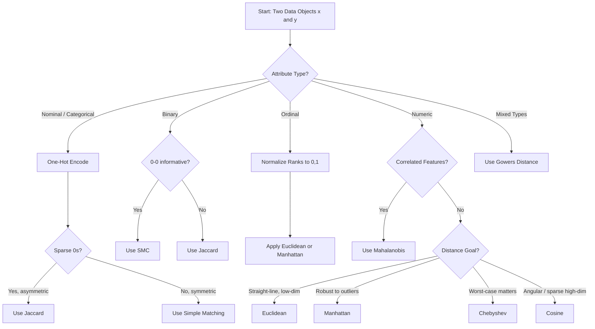
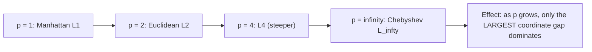
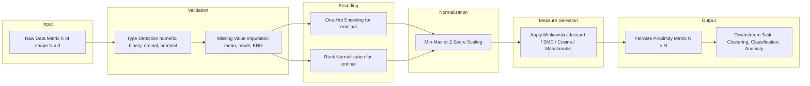
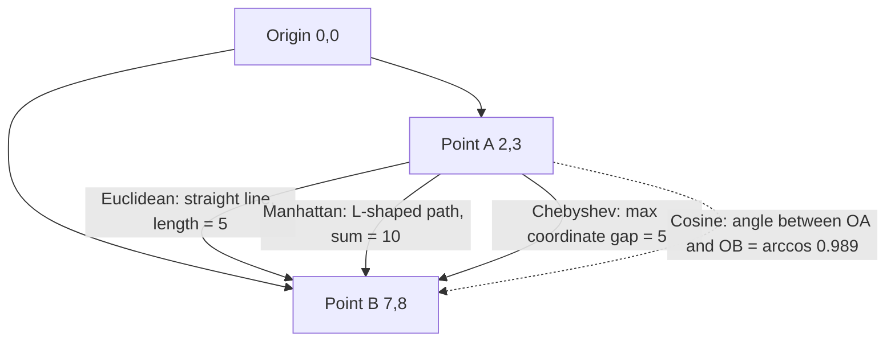

# Proximity Measures - Data Objects

<!-- SECTION_1_START -->
# Proximity Measures on Data Objects

## 1.1 Formal Academic Definition (KTU 2024 Syllabus Terminology)

> [!IMPORTANT]
> **Proximity** is a generic term that encompasses both **similarity** and **dissimilarity (distance)** between two data objects. It is the foundational building block of nearly every unsupervised and semi-supervised learning algorithm in Data Analytics, including **K-Nearest Neighbors (KNN)**, **K-Means Clustering**, **DBSCAN**, **Anomaly Detection**, and **Recommender Systems**.

Formally, for two data objects $x = (x_1, x_2, \ldots, x_n)$ and $y = (y_1, y_2, \ldots, y_n)$ belonging to an $n$-dimensional attribute space:

* A **dissimilarity (distance) measure** $d(x, y)$ is a non-negative scalar satisfying:
  1. $d(x, y) \ge 0$ for all $x, y$ (Non-negativity)
  2. $d(x, y) = 0$ if and only if $x = y$ (Identity of indiscernibles)
  3. $d(x, y) = d(y, x)$ (Symmetry)

  A *metric* additionally requires the **triangle inequality** $d(x, z) \le d(x, y) + d(y, z)$.

* A **similarity measure** $s(x, y)$ is typically normalized in $[0, 1]$ with larger values meaning "more alike". When both $d$ and $s$ are normalized, the conversion $d = 1 - s$ is standard.

> [!NOTE]
> **KTU 2024 Module 1 Highlight:** The choice of proximity measure is **NOT** universal. A measure that yields intuitive clusters for one data type (e.g., Euclidean for numeric) can completely fail for another (e.g., binary sparse attributes). Selecting the correct measure is itself an analytical decision.

## 1.2 Intuitive Overview — The "Coffee Shop" Analogy

Imagine every customer in a database as a point floating in a multi-dimensional "taste space." Two customers who order exactly the same drink, size, sugar, and milk are at the **same point** (distance $= 0$). A customer who orders only the drink is "near" a customer who orders drink + sugar, but "far" from a customer who orders a completely different beverage.

* **Distance** = "How much effort do I need to walk from customer A to customer B in this space?"
* **Similarity** = "How much do these two customers agree in their preferences?"

> [!NOTE]
> The closer two points sit in the feature space, the **more similar** they are. Clustering algorithms literally use this geometric intuition to group objects.

## 1.3 Taxonomy of Data Objects and Their Suitable Proximity Measures

A data object is described by a vector of **attributes (features)**. The mathematical type of each attribute dictates the family of proximity measures we can use.

| Attribute Type | Example | Recommended Proximity Family |
| :--- | :--- | :--- |
| **Nominal (Categorical)** | Color, City, Marital Status | One-Hot Encoding + Jaccard, or Simple Matching |
| **Binary (Symmetric)** | Gender $\{M, F\}$ | Simple Matching Coefficient (SMC) |
| **Binary (Asymmetric)** | Disease present $\{0, 1\}$ | Jaccard Coefficient |
| **Ordinal** | Rating $\{Low, Med, High\}$ | Normalize ranks to $[0,1]$ + Euclidean / Manhattan |
| **Numeric (Interval/Ratio)** | Age, Salary, Temperature | Minkowski family (Euclidean, Manhattan, Chebyshev) |
| **Mixed-Type** | Survey with text + numbers | Gower's Distance, Heterogeneous Euclidean-Overlap Metric (HEOM) |

> [!VISUALIZATION CONTROL]
> **Concept:** Proximity as Geometric Distance in Feature Space
> **GeoGebra / Desmos Input Equations:**
> * Point A: $(2, 3)$
> * Point B: $(7, 8)$
> * Line Segment AB: $\text{dist}(A, B) = \sqrt{(x_B - x_A)^2 + (y_B - y_A)^2}$
> **Visual Description:** The student should observe that the straight line drawn from A to B is the **Euclidean** distance, the staircase path is the **Manhattan** distance, and the maximum coordinate gap is the **Chebyshev** distance.

---

<!-- SECTION_1_END -->

<!-- SECTION_2_START -->
# Deep Theoretical Analysis & KTU High-Yield Formula Sheet

## 2.1 Dissimilarity Measures for Numeric Attributes (Minkowski Family)

For two $n$-dimensional numeric vectors $x$ and $y$, the **Minkowski distance of order $p$** is the generalized $L_p$ norm:

$$d_p(x, y) = \left( \sum_{i=1}^{n} \vert x_i - y_i \vert^{\,p} \right)^{1/p}$$

Three special cases dominate KTU questions:

### 2.1.1 Euclidean Distance ($p = 2$)
The familiar straight-line "as the crow flies" distance. Highly sensitive to outliers because differences are **squared**, amplifying large gaps.

$$d_2(x, y) = \sqrt{\sum_{i=1}^{n} (x_i - y_i)^2}$$

### 2.1.2 Manhattan (City-Block) Distance ($p = 1$)
The sum of absolute differences, like walking along a rectangular grid. **More robust to outliers** than Euclidean.

$$d_1(x, y) = \sum_{i=1}^{n} \vert x_i - y_i \vert$$

### 2.1.3 Chebyshev (Chessboard / $L_\infty$) Distance ($p \to \infty$)
The maximum coordinate-wise gap. Useful when only the **worst disagreement** matters (e.g., manufacturing tolerances).

$$d_\infty(x, y) = \lim_{p \to \infty} \left( \sum_{i=1}^{n} \vert x_i - y_i \vert^{\,p} \right)^{1/p} = \max_{i \in \{1, \dots, n\}} \vert x_i - y_i \vert$$

## 2.2 Mahalanobis Distance — Variance-Aware Proximity

Euclidean assumes all features are equally scaled and uncorrelated. When features are **correlated** or have very different variances, Euclidean is misleading. Mahalanobis uses the covariance matrix $\Sigma$ to whiten the space:

$$d_M(x, y) = \sqrt{(x - y)^T \Sigma^{-1} (x - y)}$$

* $\Sigma^{-1}$ **rotates** the axes to remove correlation and **scales** them to unit variance.
* Produces a dimensionless, unit-free distance. Used heavily in **anomaly detection** and **classification** (Linear Discriminant Analysis).

## 2.3 Cosine Similarity — For Sparse, High-Dimensional Data

Common in **text analytics** (TF-IDF vectors) and **recommender systems**. Measures the **angle** between two vectors, not their magnitude. Two documents with the same word ratios (one short, one long) will have cosine $= 1$.

$$\cos(x, y) = \frac{x \cdot y}{\Vert x \Vert_2 \, \Vert y \Vert_2} = \frac{\sum_{i=1}^{n} x_i y_i}{\sqrt{\sum_{i=1}^{n} x_i^2} \cdot \sqrt{\sum_{i=1}^{n} y_i^2}}$$

The corresponding **dissimilarity** is $d = 1 - \cos(x, y)$, which lies in $[0, 2]$.

## 2.4 Proximity Measures for Binary Attributes

Define for two binary objects $x$ and $y$:
* $M_{11}$ = number of attributes where $x = 1$ and $y = 1$
* $M_{10}$ = number of attributes where $x = 1$ and $y = 0$
* $M_{01}$ = number of attributes where $x = 0$ and $y = 1$
* $M_{00}$ = number of attributes where $x = 0$ and $y = 0$
* Total $n = M_{00} + M_{01} + M_{10} + M_{11}$.

### 2.4.1 Simple Matching Coefficient (SMC) — Symmetric Binary
Treats both 1→0 and 0→1 mismatches as equally important. Used when both outcomes carry equal weight (e.g., gender).

$$\text{SMC}(x, y) = \frac{M_{11} + M_{00}}{M_{11} + M_{00} + M_{10} + M_{01}}$$

### 2.4.2 Jaccard Coefficient — Asymmetric Binary
Used when the **absence (0)** is uninformative or far more common (e.g., rare diseases, sparse purchase baskets). Only **positive matches** $M_{11}$ and **mismatches involving 1** count.

$$J(x, y) = \frac{M_{11}}{M_{11} + M_{10} + M_{01}}$$

## 2.5 Ordinal Attributes — Rank Normalization

Ordinal attributes have order but unknown spacing (e.g., $\text{Low} < \text{Med} < \text{High}$). They must be **mapped to $[0, 1]$** before any numeric distance is applied:

$$x_i^{\,\text{norm}} = \frac{x_i - 1}{M - 1}$$

where $M$ is the number of ordinal levels. After normalization, treat them as numeric and apply Euclidean/Manhattan.

## 2.6 KTU High-Yield Formula Cheat Sheet

> [!IMPORTANT]
> **The single most tested KTU formula sheet for Module 1:**

| # | Measure | Formula | Range | Best Use Case |
| :--- | :--- | :--- | :--- | :--- |
| 1 | Euclidean | $\sqrt{\sum (x_i - y_i)^2}$ | $[0, \infty)$ | Continuous, normally distributed numeric data |
| 2 | Manhattan | $\sum \vert x_i - y_i \vert$ | $[0, \infty)$ | High-dimensional sparse data, robust to outliers |
| 3 | Chebyshev | $\max \vert x_i - y_i \vert$ | $[0, \infty)$ | Manufacturing, worst-case deviation |
| 4 | Minkowski ($L_p$) | $\left( \sum \vert x_i - y_i \vert^{\,p} \right)^{1/p}$ | $[0, \infty)$ | Generalization of 1, 2, 3 |
| 5 | Mahalanobis | $\sqrt{(x-y)^T \Sigma^{-1}(x-y)}$ | $[0, \infty)$ | Correlated features, anomaly detection |
| 6 | Cosine Similarity | $\dfrac{x \cdot y}{\Vert x \Vert_2 \Vert y \Vert_2}$ | $[-1, 1]$ | Text mining, recommender systems |
| 7 | Jaccard | $\dfrac{M_{11}}{M_{11} + M_{10} + M_{01}}$ | $[0, 1]$ | Asymmetric binary (sparse 1s) |
| 8 | SMC | $\dfrac{M_{11} + M_{00}}{n}$ | $[0, 1]$ | Symmetric binary |
| 9 | Ordinal Norm. | $x_i^{\text{norm}} = (x_i - 1)/(M-1)$ | $[0, 1]$ | Preprocessing step for ordinal |
| 10 | Gower's | Weighted sum of per-attribute partial distances | $[0, 1]$ | Mixed-type (numeric + categorical) |

## 2.7 Real-World Engineering & Industry Utility

* **Healthcare:** Jaccard over ICD-10 code sets identifies patients with similar disease profiles. Mahalanobis flags multivariate outliers in ICU vitals.
* **E-Commerce / Streaming:** Cosine similarity over user-item ratings powers the **"Customers who bought X also bought Y"** widget.
* **Manufacturing:** Chebyshev distance evaluates whether a manufactured part deviates from spec in **any** dimension beyond tolerance.
* **NLP & Search:** Cosine on TF-IDF vectors is the **de-facto** similarity used in classical document retrieval and BERT-era dense retrieval (as dot-product on L2-normalized embeddings).
* **Biology:** Mahalanobis over gene expression profiles identifies genetically similar cell lines.

---

<!-- SECTION_2_END -->

<!-- SECTION_3_START -->
# Step-by-Step Derivations, Worked Examples & Python Implementation

## 3.1 Worked Example 1 — Numeric Data (Euclidean, Manhattan, Chebyshev)

**Problem:** Given two data objects $x = (1, 2, 3)$ and $y = (4, 6, 3)$, compute the Euclidean, Manhattan, and Chebyshev distances.

### 3.1.1 Euclidean Distance

$$\begin{aligned}
d_2(x, y) &= \sqrt{\sum_{i=1}^{3} (x_i - y_i)^2} \\
&= \sqrt{(1-4)^2 + (2-6)^2 + (3-3)^2} \\
&= \sqrt{(-3)^2 + (-4)^2 + (0)^2} \\
&= \sqrt{9 + 16 + 0} \\
&= \sqrt{25} = 5
\end{aligned}$$

### 3.1.2 Manhattan Distance

$$\begin{aligned}
d_1(x, y) &= \sum_{i=1}^{3} \vert x_i - y_i \vert \\
&= \vert 1 - 4 \vert + \vert 2 - 6 \vert + \vert 3 - 3 \vert \\
&= 3 + 4 + 0 = 7
\end{aligned}$$

### 3.1.3 Chebyshev Distance

$$\begin{aligned}
d_\infty(x, y) &= \max_{i} \vert x_i - y_i \vert \\
&= \max(3, 4, 0) = 4
\end{aligned}$$

> [!NOTE]
> **Verification of Minkowski inequality:** $d_2 = 5 \le d_1 = 7$, and $d_\infty = 4 \le d_2 = 5$. This monotonic relationship $\left( d_\infty \le d_2 \le d_1 \right)$ is a well-known property of Minkowski metrics in finite dimensions.

## 3.2 Worked Example 2 — Binary Data (SMC vs Jaccard)

**Problem:** Two patients $A$ and $B$ are tested for 5 diseases. The presence vector is:
* $A = (1, 0, 1, 1, 0)$
* $B = (1, 1, 0, 1, 0)$

**Step 1: Build the contingency table**

$$\begin{aligned}
\text{Both 1: } M_{11} &= |\{i : A_i = 1 \text{ and } B_i = 1\}| = 2 \quad (i=1, 4) \\
\text{Both 0: } M_{00} &= |\{i : A_i = 0 \text{ and } B_i = 0\}| = 1 \quad (i=5) \\
A=1, B=0: \quad M_{10} &= 1 \quad (i=3) \\
A=0, B=1: \quad M_{01} &= 1 \quad (i=2) \\
\text{Sanity: } M_{11} + M_{00} + M_{10} + M_{01} &= 5 = n \;\checkmark
\end{aligned}$$

**Step 2: Compute SMC**

$$\text{SMC}(A, B) = \frac{M_{11} + M_{00}}{n} = \frac{2 + 1}{5} = \frac{3}{5} = 0.6$$

**Step 3: Compute Jaccard (asymmetric binary — disease absence is not informative)**

$$J(A, B) = \frac{M_{11}}{M_{11} + M_{10} + M_{01}} = \frac{2}{2 + 1 + 1} = \frac{2}{4} = 0.5$$

> [!NOTE]
> Jaccard gives a **lower** similarity than SMC because it ignores the "both healthy" matches. In medical screening where the absence of a rare disease is the *default* state, Jaccard is the correct choice.

## 3.3 Worked Example 3 — Mahalanobis Distance

**Problem:** Compute the Mahalanobis distance between $x = (1, 2)^T$ and $y = (0, 0)^T$ given the covariance matrix:

$$\Sigma = \begin{pmatrix} 2 & 0 \\ 0 & 1 \end{pmatrix}$$

**Step 1: Compute the inverse covariance**

$$\Sigma^{-1} = \begin{pmatrix} 1/2 & 0 \\ 0 & 1 \end{pmatrix}$$

**Step 2: Compute the difference vector**

$$x - y = \begin{pmatrix} 1 \\ 2 \end{pmatrix}$$

**Step 3: Compute the quadratic form**

$$\begin{aligned}
d_M^2(x, y) &= (x - y)^T \Sigma^{-1} (x - y) \\
&= \begin{pmatrix} 1 & 2 \end{pmatrix} \begin{pmatrix} 1/2 & 0 \\ 0 & 1 \end{pmatrix} \begin{pmatrix} 1 \\ 2 \end{pmatrix} \\
&= \begin{pmatrix} 1/2 & 2 \end{pmatrix} \begin{pmatrix} 1 \\ 2 \end{pmatrix} \\
&= (1/2)(1) + (2)(2) = 0.5 + 4 = 4.5
\end{aligned}$$

**Step 4: Final Mahalanobis distance**

$$d_M(x, y) = \sqrt{4.5} \approx 2.121$$

## 3.4 Worked Example 4 — Cosine Similarity on Text

**Problem:** Two documents are represented as TF-IDF vectors $d_1 = (3, 0, 2, 0)$ and $d_2 = (1, 0, 0, 4)$.

**Step 1: Dot product**

$$d_1 \cdot d_2 = (3)(1) + (0)(0) + (2)(0) + (0)(4) = 3$$

**Step 2: Magnitudes**

$$\Vert d_1 \Vert_2 = \sqrt{3^2 + 0^2 + 2^2 + 0^2} = \sqrt{13}$$

$$\Vert d_2 \Vert_2 = \sqrt{1^2 + 0^2 + 0^2 + 4^2} = \sqrt{17}$$

**Step 3: Cosine similarity**

$$\cos(d_1, d_2) = \frac{3}{\sqrt{13} \cdot \sqrt{17}} = \frac{3}{\sqrt{221}} \approx 0.2017$$

The low value indicates the two documents share little topical overlap despite both being non-zero vectors.

## 3.5 Python Implementation — Production-Ready Code

```python
from __future__ import annotations
import numpy as np
from typing import Union, Sequence

ArrayLike = Union[Sequence[float], np.ndarray]

def _to_array(v: ArrayLike, name: str) -> np.ndarray:
    """Strict input validator: raises informative errors on bad input."""
    try:
        arr = np.asarray(v, dtype=float)
    except (TypeError, ValueError) as exc:
        raise ValueError(f"[{name}] must be numeric, got {v!r}") from exc
    if arr.ndim != 1:
        raise ValueError(f"[{name}] must be 1-D, got shape {arr.shape}")
    return arr

def minkowski_distance(x: ArrayLike, y: ArrayLike, p: int) -> float:
    """Generalized L_p distance. p=1 -> Manhattan, p=2 -> Euclidean, p=inf -> Chebyshev."""
    if p < 1:
        raise ValueError(f"Minkowski order p must be >= 1, got {p}")
    xv, yv = _to_array(x, "x"), _to_array(y, "y")
    if xv.shape != yv.shape:
        raise ValueError(f"Shape mismatch: x {xv.shape} vs y {yv.shape}")
    if not np.all(np.isfinite(xv)) or not np.isfinite(yv).all():
        raise ValueError("Inputs contain NaN or Inf values")
    if p == 1:
        return float(np.sum(np.abs(xv - yv)))
    if p == 2:
        return float(np.sqrt(np.sum((xv - yv) ** 2)))
    if np.isinf(p):
        return float(np.max(np.abs(xv - yv)))
    return float(np.power(np.sum(np.abs(xv - yv) ** p), 1.0 / p))

def mahalanobis_distance(x: ArrayLike, y: ArrayLike, cov_inv: np.ndarray) -> float:
    """Variance-aware distance using precomputed inverse covariance."""
    xv, yv = _to_array(x, "x"), _to_array(y, "y")
    if cov_inv.shape != (xv.size, xv.size):
        raise ValueError("cov_inv shape must be (n, n)")
    diff = xv - yv
    return float(np.sqrt(diff @ cov_inv @ diff))

def cosine_similarity(x: ArrayLike, y: ArrayLike) -> float:
    """Angle-based similarity in [-1, 1]."""
    xv, yv = _to_array(x, "x"), _to_array(y, "y")
    nx, ny = np.linalg.norm(xv), np.linalg.norm(yv)
    if nx == 0 or ny == 0:
        raise ValueError("Zero-magnitude vector has undefined cosine")
    return float(np.dot(xv, yv) / (nx * ny))

def jaccard_similarity_binary(x: Sequence[int], y: Sequence[int]) -> float:
    """Jaccard for asymmetric binary attributes. Returns 0.0 when no 1-1 matches."""
    xb, yb = np.asarray(x, dtype=int), np.asarray(y, dtype=int)
    if xb.shape != yb.shape:
        raise ValueError("Binary vectors must have equal length")
    if not (np.isin(xb, [0, 1]).all() and np.isin(yb, [0, 1]).all()):
        raise ValueError("Inputs must be binary {0,1}")
    m11 = int(np.sum((xb == 1) & (yb == 1)))
    m10 = int(np.sum((xb == 1) & (yb == 0)))
    m01 = int(np.sum((xb == 0) & (yb == 1)))
    denom = m11 + m10 + m01
    if denom == 0:
        return 0.0
    return m11 / denom

def smc_similarity_binary(x: Sequence[int], y: Sequence[int]) -> float:
    """Simple Matching Coefficient for symmetric binary attributes."""
    xb, yb = np.asarray(x, dtype=int), np.asarray(y, dtype=int)
    if xb.shape != yb.shape:
        raise ValueError("Binary vectors must have equal length")
    matches = int(np.sum(xb == yb))
    return matches / xb.size

# ---------------------- DEMO / SANITY TESTS ----------------------
if __name__ == "__main__":
    x, y = np.array([1, 2, 3]), np.array([4, 6, 3])
    print(f"Euclidean : {minkowski_distance(x, y, p=2):.4f}")   # 5.0
    print(f"Manhattan : {minkowski_distance(x, y, p=1):.4f}")   # 7.0
    print(f"Chebyshev : {minkowski_distance(x, y, p=np.inf):.4f}")  # 4.0

    a, b = [1, 0, 1, 1, 0], [1, 1, 0, 1, 0]
    print(f"Jaccard   : {jaccard_similarity_binary(a, b):.4f}")  # 0.5
    print(f"SMC       : {smc_similarity_binary(a, b):.4f}")      # 0.6

    cov_inv = np.linalg.inv(np.array([[2, 0], [0, 1]]))
    print(f"Mahal.    : {mahalanobis_distance([1, 2], [0, 0], cov_inv):.4f}")  # 2.1213

    print(f"Cosine    : {cosine_similarity([3, 0, 2, 0], [1, 0, 0, 4]):.4f}")   # 0.2017
```

---

<!-- SECTION_3_END -->

<!-- SECTION_4_START -->
# Structural Diagrams & Schematics

## 4.1 Decision Flow — Which Proximity Measure Should I Use?



## 4.2 Minkowski Family as a Function of Order $p$



## 4.3 Sequential Processing Topology for Proximity Computation



## 4.4 Feature-Space Geometric Intuition



---

<!-- SECTION_4_END -->

<!-- SECTION_5_START -->
# KTU 2024 Scheme Examination Question Bank

## Part A — Short Answer Questions (3 Marks Each)

### Question 1
**[KTU University Exam - July 2024]** Define **proximity** in the context of data analytics. Differentiate between similarity and dissimilarity with one example each. *(CO1, Remember/Understand)*

**Model Answer (Valuation Key):**
* [Defining proximity as a measure of likeness/dislikeness: 1 Mark]
* Proximity is a collective term for **similarity** and **dissimilarity** between two data objects.
* **Similarity** $s(x,y)$ is a numerical value where **higher values indicate greater alikeness**; e.g., cosine similarity of two TF-IDF document vectors $= 0.95$ means the documents are highly topically aligned.
* **Dissimilarity (distance)** $d(x,y)$ is a numerical value where **lower values indicate greater alikeness**; e.g., Euclidean distance between two points on a map $= 0.1\,\text{km}$ means they are physically close.
* [Stating the formal range property of either: 1 Mark]
* [Correct example mapped to its type: 1 Mark]

### Question 2
**[KTU University Exam - Dec 2023]** List any **three properties** that a metric distance measure must satisfy. State whether the Jaccard coefficient is a metric. *(CO1, Understand)*

**Model Answer (Valuation Key):**
A metric distance $d(x, y)$ must satisfy:
1. **Non-negativity:** $d(x, y) \ge 0$ for all $x, y$
2. **Identity of indiscernibles:** $d(x, y) = 0 \iff x = y$
3. **Symmetry:** $d(x, y) = d(y, x)$
4. **Triangle inequality:** $d(x, z) \le d(x, y) + d(y, z)$

The **Jaccard coefficient is a similarity, not a metric distance**. It violates the triangle inequality in general (counterexamples exist on asymmetric binary sets). Its associated *Jaccard distance* $d_J = 1 - J$ **is** a metric. *(Full 3 marks for the properties + the correct "similarity vs metric distance" distinction.)*

---

## Part B — Long Answer Questions (14 Marks Each — Internal Choice)

### Question A (14 Marks)
**[KTU University Exam - Model Question Paper, Module 1]** 
* (a) Explain the **Minkowski distance family** with the role of the parameter $p$. Derive Euclidean and Manhattan distances as special cases. *(7 Marks — CO1, Understand)*
* (b) For the data objects $x = (2, 5, 9)$ and $y = (4, 1, 7)$, compute the Euclidean, Manhattan, and Chebyshev distances. Verify the inequality $d_\infty \le d_2 \le d_1$. *(7 Marks — CO2, Apply)*

**Model Solution (a) — 7 Marks Valuation Key:**
* [Stating Minkowski formula: 2 Marks] $\;d_p(x, y) = \left( \sum_{i=1}^{n} \vert x_i - y_i \vert^{\,p} \right)^{1/p}$
* [Explaining role of $p$ as dimension/strength: 1 Mark] — Higher $p$ penalizes large individual coordinate gaps more heavily.
* [Deriving Manhattan $p=1$: 1 Mark] $\;d_1 = \sum \vert x_i - y_i \vert$
* [Deriving Euclidean $p=2$: 1 Mark] $\;d_2 = \sqrt{\sum (x_i - y_i)^2}$
* [Mentioning Chebyshev as $p \to \infty$: 1 Mark]
* [Real-world application example: 1 Mark] — Euclidean in KNN for image data, Manhattan for high-dimensional sparse text.

**Model Solution (b) — 7 Marks Valuation Key:**

Step 1 — **Compute coordinate differences:**

$$x - y = (2 - 4,\; 5 - 1,\; 9 - 7) = (-2,\; 4,\; 2)$$

Step 2 — **Euclidean distance** `[Substitution: 1 Mark | Squaring & summation: 1 Mark | Final value: 1 Mark]`

$$d_2 = \sqrt{(-2)^2 + 4^2 + 2^2} = \sqrt{4 + 16 + 4} = \sqrt{24} = 2\sqrt{6} \approx 4.899$$

Step 3 — **Manhattan distance** `[Absolute sum: 1 Mark | Final value: 1 Mark]`

$$d_1 = \vert -2 \vert + \vert 4 \vert + \vert 2 \vert = 2 + 4 + 2 = 8$$

Step 4 — **Chebyshev distance** `[Maximum identification: 1 Mark]`

$$d_\infty = \max(2, 4, 2) = 4$$

Step 5 — **Verification of inequality** `[Writing inequality: 1 Mark]`

$$d_\infty = 4 \le d_2 \approx 4.899 \le d_1 = 8 \quad \checkmark$$

---

### Question B (14 Marks — Alternative Choice)
**[KTU University Exam - July 2023 (Re-attempt pattern)]** 
* (a) Discuss **Jaccard coefficient** and **Simple Matching Coefficient (SMC)** for binary attributes. Construct the $2 \times 2$ contingency table. *(7 Marks — CO2, Understand)*
* (b) Three customers are described by their binary purchase history over 4 product categories: $\text{Alice} = (1, 0, 1, 0)$, $\text{Bob} = (1, 1, 0, 0)$, $\text{Carol} = (0, 0, 1, 1)$. Assuming purchases are rare and asymmetric, compute the **Jaccard similarity** between every pair. State which two customers are most similar. *(7 Marks — CO3, Apply)*

**Model Solution (a) — 7 Marks Valuation Key:**
* [Defining binary attributes and the four-cell counts $M_{00}, M_{01}, M_{10}, M_{11}$: 2 Marks]
* [Writing Jaccard formula and its use-case (asymmetric, sparse 1s): 2 Marks]
* [Writing SMC formula and its use-case (symmetric, balanced 0/1): 2 Marks]
* [Drawing the contingency table or stating the relationship $n = M_{00} + M_{01} + M_{10} + M_{11}$: 1 Mark]

**Model Solution (b) — 7 Marks Valuation Key:**

Step 1 — **Pair Alice vs Bob** `[Counting $M_{11}, M_{10}, M_{01}, M_{00}$: 1 Mark]`

$$M_{11} = 1 \;(i=1),\; M_{10} = 1 \;(i=3),\; M_{01} = 1 \;(i=2),\; M_{00} = 1 \;(i=4)$$

$$J(\text{Alice, Bob}) = \frac{1}{1 + 1 + 1} = \frac{1}{3} \approx 0.333$$

Step 2 — **Pair Alice vs Carol** `[Counting: 1 Mark]`

$$M_{11} = 1 \;(i=3),\; M_{10} = 1 \;(i=1),\; M_{01} = 1 \;(i=4),\; M_{00} = 1 \;(i=2)$$

$$J(\text{Alice, Carol}) = \frac{1}{3} \approx 0.333$$

Step 3 — **Pair Bob vs Carol** `[Counting: 1 Mark]`

$$M_{11} = 0,\; M_{10} = 1 \;(i=1),\; M_{01} = 2 \;(i=3,4)$$

$$J(\text{Bob, Carol}) = \frac{0}{0 + 1 + 2} = 0$$

Step 4 — **Conclusion** `[Final answer with reasoning: 2 Marks]`

**Alice and Bob** are tied with Carol (both $J = 0.333$) as the most similar pair, while Bob and Carol are completely dissimilar ($J = 0$) because they share no common purchases. In a recommender system, the system would recommend Bob's other products to Alice.

---

> [!WARNING]
> **KTU Examiner's Pitfall Callout:**
> 1. **Do NOT** use Euclidean distance on raw binary or categorical data — the geometry is meaningless. Always one-hot encode categoricals first.
> 2. **Do NOT** forget to **normalize ordinal attributes** to $[0, 1]$ before applying any numeric distance, or the result will be dominated by the level numbering rather than the order semantics.
> 3. **Do NOT** confuse the **Jaccard** similarity with **cosine** similarity on binary data — they are equal **only** when there are no zero entries. For sparse binary vectors (typical in market-basket analysis), Jaccard is the correct measure.
> 4. **Do NOT** state the triangle inequality property when asked for "properties of similarity" — similarity measures are *not* required to satisfy it.
> 5. **Cosine similarity** values in $[-1, 1]$ are often reported as $[0, 1]$ in practice by clamping negatives; mention this nuance in descriptive answers for full marks.

---

## Topic Recap & Important Things to Remember

- **Proximity** is the umbrella term; **similarity** ($\uparrow$ = alike) and **dissimilarity/distance** ($\downarrow$ = alike) are the two concrete instantiations.
- A **metric** distance obeys non-negativity, identity, symmetry, and the triangle inequality. Jaccard similarity is **not** a metric; Jaccard **distance** $1 - J$ is.
- **Minkowski $L_p$** unifies Manhattan ($p=1$), Euclidean ($p=2$), and Chebyshev ($p=\infty$). The monotonic relationship $d_\infty \le d_2 \le d_1$ always holds in finite dimensions.
- **Euclidean** is the default for continuous, low-dimensional, isotropic numeric data. **Manhattan** is more robust to outliers and is the de-facto choice for high-dimensional sparse vectors (e.g., text via bag-of-words).
- **Mahalanobis** is the only correct distance when features are correlated or have unequal variances. It uses the **inverse covariance** matrix to decorrelate and standardize the space.
- **Cosine similarity** measures the *angle* between vectors, ignoring magnitude. It is the gold standard for **text mining** and **recommender systems**. Convert to dissimilarity via $d = 1 - \cos(x, y)$.
- For **binary data**, the choice between **Jaccard** and **SMC** depends on whether the 0-0 match is informative. Asymmetric attributes (rare diseases, sparse purchases) $\Rightarrow$ Jaccard. Symmetric attributes (gender) $\Rightarrow$ SMC.
- **Ordinal attributes** must be rank-normalized to $[0, 1]$ via $x_i^{\text{norm}} = (x_i - 1)/(M-1)$ before any numeric distance is applied.
- **Nominal attributes** require one-hot encoding first; then the encoded vectors are compared with Jaccard/SMC if binary, or Minkowski if treated as numeric.
- **Gower's distance** is the standard heterogeneous measure that handles numeric, binary, and nominal attributes in a single unified formula.
- A measure being "better" depends on the **data distribution, dimensionality, presence of correlation, and sparsity** — there is no universally optimal proximity measure.
- Standard normalizations **before** distance computation include **Min-Max** (sensitive to outliers) and **Z-score** (handles outliers better), and one of them is **mandatory** when feature scales differ.

---

<!-- SECTION_5_END -->
