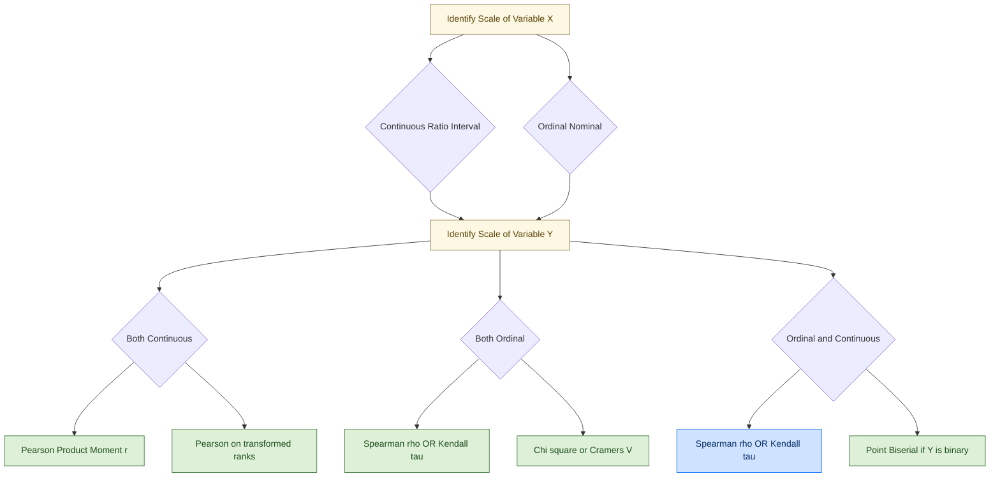
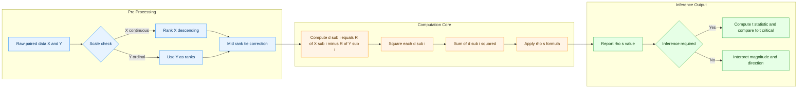
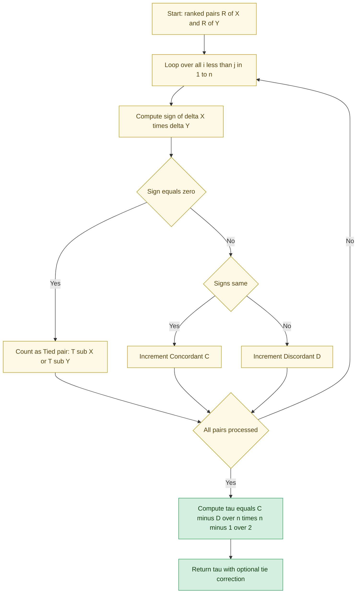
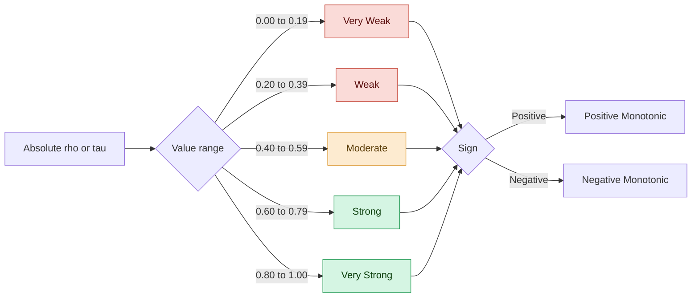

# Association Between Ordinal and Continuous Variables

<!-- SECTION_1_START -->

# Association Between Ordinal and Continuous Variables

## 1.1 Core Technical Definition

In statistical data analytics, variables are classified by their **measurement scale**. An **ordinal variable** possesses a natural rank-order but the intervals between consecutive ranks are not mathematically defined (e.g., *customer satisfaction: Low < Medium < High*). A **continuous variable** is measured on an interval or ratio scale, where arithmetic operations and meaningful differences are valid (e.g., *temperature in °C, salary in ₹*).

**Association** in this mixed-scale context refers to the strength and direction of a monotonic relationship between the two variables, measured by rank-based non-parametric methods rather than by the standard Pearson product-moment correlation.

> [!IMPORTANT]
> **KTU Syllabus Highlight (PECST523 / Module 2):** The two canonical rank-based measures of association covered are **Spearman's Rank Correlation Coefficient ($\rho_s$)** and **Kendall's Rank Correlation Coefficient ($\tau$)**. Both are distribution-free (non-parametric) and are the correct tools when one variable is ordinal and the other is continuous.

Formally, let $(X_1, Y_1), (X_2, Y_2), \dots, (X_n, Y_n)$ be paired observations. Define $R(X_i)$ and $R(Y_i)$ as the ranks of the $i^{th}$ observation in their respective samples. The population Spearman coefficient is:

$$\rho_s = 1 - \frac{6 \sum_{i=1}^{n} d_i^2}{n(n^2-1)}, \quad \text{where } d_i = R(X_i) - R(Y_i)$$

and the population Kendall coefficient is:

$$\tau = \frac{C - D}{\binom{n}{2}} = \frac{2(C - D)}{n(n-1)}$$

where $C$ is the number of **concordant pairs** and $D$ is the number of **discordant pairs**.

## 1.2 Intuitive Overview & Real-World Analogy

> [!NOTE]
> **Conceptual Analogy — "The Race and the Stopwatch":**
> Imagine a coach timing 8 athletes in a 100-metre sprint. The **stopwatch reading** (in seconds) is a *continuous* variable — the difference between 10.4 s and 10.5 s is exactly 0.1 s. The **finishing position** (1st, 2nd, 3rd, …) is an *ordinal* variable — the gap between 1st and 2nd is not the same as the gap between 5th and 6th, only the *order* matters.
>
> If faster athletes (lower stopwatch times) consistently finish ahead (lower positions), the two variables are **negatively associated** with high magnitude. Spearman's $\rho$ and Kendall's $\tau$ quantify exactly this monotonic alignment **without** assuming equal time intervals between positions.

In data analytics practice, this kind of mixed-scale pairing is extremely common:

| Continuous Variable | Ordinal Variable | Engineering / Business Use Case |
|---|---|---|
| Income (₹) | Customer satisfaction (1–5) | Marketing analytics |
| Sensor output (mV) | Equipment health (Poor/Good/Excellent) | Predictive maintenance |
| Page load time (ms) | User rating (★ 1–5) | UX analytics |
| Blood pressure (mmHg) | Pain severity (None/Mild/Severe) | Clinical analytics |

## 1.3 Why Not Use Pearson's $r$?

Pearson's product-moment correlation requires:

1. Both variables to be **interval/ratio** scaled.
2. A **linear** (not just monotonic) relationship.
3. Approximate **bivariate normality** for inference.

When one variable is merely ordinal, $Y$ has no meaningful numerical distance, so $\bar{Y}$ and $(Y_i - \bar{Y})^2$ lose their interpretation. Rank-based methods sidestep this by replacing raw values with **position numbers**, which are well-defined for any scale.

> [!VISUALIZATION CONTROL]
> **Concept:** Scatter of *ranks* (not raw values) showing monotonic trend for the worked example.
> **GeoGebra / Desmos Input Equations:**
> * `List1 = {(4,3),(3,8),(5,5),(2,2),(8,7),(1,1),(6,6),(7,4)}` *(Rank pairs)*
> * `Fit: y = m·x + c` regression overlay
> **Visual Description:** A near-monotonic upward cloud of 8 points ranging from (1,1) to (8,8). The Spearman $\rho$ is the Pearson correlation of these plotted ranks; the Kendall $\tau$ counts how many of the 28 pairs move in the same direction.

---

<!-- SECTION_1_END -->

<!-- SECTION_2_START -->

# 2. Deep Theoretical Analysis

## 2.1 Spearman's Rank Correlation Coefficient ($\rho_s$)

**Operational logic step-by-step:**

1. **Rank the continuous variable** $X$ in descending order (1 = largest). If $X$ is already ordinal, skip this step.
2. **Rank the ordinal variable** $Y$ in descending order. If $Y$ is already a rank, this is implicit.
3. **Tie correction:** If multiple observations share the same value, assign each of them the **average of the ranks** they would have occupied (mid-rank method).
4. **Compute $d_i = R(X_i) - R(Y_i)$** for every paired observation.
5. **Square and sum:** Compute $\sum_{i=1}^{n} d_i^2$.
6. **Apply the closed-form formula** to obtain $\rho_s$.

**Properties of $\rho_s$:**

- Bounded: $-1 \le \rho_s \le +1$.
- $\rho_s = +1$: perfect positive monotonic relationship.
- $\rho_s = -1$: perfect negative monotonic relationship.
- $\rho_s = 0$: no monotonic relationship (linear correlation may still exist).
- It is **scale-invariant** and **distribution-free**.

**Inference (Hypothesis Testing):**

Under the null hypothesis $H_0 : \rho_s = 0$ (no association), the test statistic is:

$$t = \rho_s \sqrt{\frac{n-2}{1-\rho_s^2}} \;\;\sim\;\; t_{(n-2)}$$

For large $n \ge 30$, a critical value lookup from the standard normal is also used.

## 2.2 Kendall's Tau ($\tau$)

**Operational logic step-by-step:**

1. Rank both $X$ and $Y$ (descending or ascending, consistency matters).
2. For every unordered pair of observations $(i, j)$ with $i < j$, compute the sign of $(R(X_j) - R(X_i))(R(Y_j) - R(Y_i))$.
3. **Concordant pair ($C$):** ranks of both variables move in the **same** direction.
4. **Discordant pair ($D$):** ranks move in **opposite** directions.
5. **Tied pair ($T$):** one or both ranks are equal.
6. **Compute the coefficient.** Three variants exist (see formula sheet).

**Why is $\tau$ useful?** $\tau$ has a direct probabilistic interpretation:

$$\tau = P(\text{concordant pair}) - P(\text{discordant pair})$$

It is also more **robust for small samples** and has a smaller gross-error sensitivity than $\rho_s$.

## 2.3 KTU Formula Cheat Sheet

> [!IMPORTANT]
> The table below is the only reference you need during the KTU ESE for this topic. Memorise the four core formulae and the tie-corrected form for full marks.

| \# | Measure | Closed-Form Formula | Range | Tie Correction |
|---|---|---|---|---|
| 1 | Spearman's $\rho_s$ (no ties) | $\rho_s = 1 - \dfrac{6 \sum d_i^2}{n(n^2-1)}$ | $[-1, +1]$ | Replace $d_i$ with corrected ranks |
| 2 | Spearman's $\rho_s$ (with ties) | $\rho_s = \dfrac{\sum (R(X_i)-\overline{R_X})(R(Y_i)-\overline{R_Y})}{\sqrt{\sum(R(X_i)-\overline{R_X})^2 \cdot \sum(R(Y_i)-\overline{R_Y})^2}}$ | $[-1, +1]$ | Automatic via averaged ranks |
| 3 | Kendall's $\tau$ (no ties) | $\tau = \dfrac{C - D}{\binom{n}{2}} = \dfrac{2(C-D)}{n(n-1)}$ | $[-1, +1]$ | — |
| 4 | Kendall's $\tau_B$ (with ties) | $\tau_B = \dfrac{C - D}{\sqrt{(C+D+T_X)(C+D+T_Y)}}$ | $[-1, +1]$ | $T_X, T_Y$ tie counts |
| 5 | Test statistic for $\rho_s$ | $t = \rho_s \sqrt{\dfrac{n-2}{1-\rho_s^2}}$ | $t_{(n-2)}$ | Two-tailed $H_1 : \rho_s \ne 0$ |
| 6 | Variance of $\tau$ (large $n$) | $\mathrm{Var}(\tau) = \dfrac{2(2n+5)}{9n(n-1)}$ | Used for $z$-test | Normal approximation |

**Where used in production systems:**

- **Recommendation engines** — rank correlation between click-through rank and dwell-time.
- **A/B testing analytics** — Spearman $\rho$ between treatment rank and conversion rank.
- **Sensor-fusion in IoT** — Kendall $\tau$ between predicted and observed ranks when distributions are heavy-tailed.
- **Public health analytics** — measuring association between ordinal Likert-scale responses and continuous biomarkers.

---

<!-- SECTION_2_END -->

<!-- SECTION_3_START -->

# 3. Step-by-Step Derivations, Worked Examples & Code

## 3.1 Derivation of Spearman's Formula from Pearson's Formula

Pearson's correlation between two perfectly ranked sequences equals Spearman's $\rho_s$. The derivation proceeds as follows.

**Step 1 — Pearson's correlation formula:**

$$r = \frac{\sum (X_i - \bar X)(Y_i - \bar Y)}{\sqrt{\sum (X_i - \bar X)^2 \cdot \sum (Y_i - \bar Y)^2}}$$

**Step 2 — Substitute ranks $X_i = R(X_i)$ and $Y_i = R(Y_i)$:**

For ranks, $\bar R_X = \bar R_Y = \dfrac{n+1}{2}$ and $\sum (R_i - \bar R)^2 = \dfrac{n(n^2-1)}{12}$.

**Step 3 — Expand the numerator:**

$$\sum (R(X_i) - \bar R_X)(R(Y_i) - \bar R_Y) = \sum R(X_i) R(Y_i) - n \bar R_X \bar R_Y$$

**Step 4 — Apply the algebraic identity:**

$$\sum R(X_i) R(Y_i) = \frac{1}{2}\left[\left(\sum R(X_i)\right)^2 + \left(\sum R(Y_i)\right)^2 - \sum d_i^2\right] - n \bar R_X \bar R_Y$$

**Step 5 — Simplify with the rank-sum property $\sum R_i = \dfrac{n(n+1)}{2}$:**

$$r = \frac{\tfrac{1}{2}\bigl[\tfrac{n^2(n+1)^2}{4} + \tfrac{n^2(n+1)^2}{4} - \sum d_i^2\bigr] - \tfrac{n(n+1)^2}{4}}{\tfrac{n(n^2-1)}{12}}$$

**Step 6 — Factor and reduce:**

$$r = \frac{n^2(n+1)^2 / 4 - \sum d_i^2 / 1}{n(n^2-1)/6} = 1 - \frac{6 \sum d_i^2}{n(n^2-1)}$$

Hence the celebrated formula:

$$\boxed{\rho_s = 1 - \frac{6 \sum_{i=1}^{n} d_i^2}{n(n^2-1)}}$$

## 3.2 Worked Numerical Example — Spearman's $\rho_s$

**Problem:** A class teacher records the Mathematics score (continuous, out of 100) and the class rank awarded on the basis of a holistic project (ordinal, 1 = best) for 8 students. Compute $\rho_s$.

| Student | $X$ (Maths marks) | $Y$ (Project rank) |
|---|---|---|
| A | 50 | 3 |
| B | 70 | 8 |
| C | 60 | 5 |
| D | 80 | 2 |
| E | 40 | 7 |
| F | 90 | 1 |
| G | 55 | 6 |
| H | 65 | 4 |

**Step 1 — Rank $X$ in descending order** (1 = highest marks):

| Marks | 90 | 80 | 70 | 65 | 60 | 55 | 50 | 40 |
|---|---|---|---|---|---|---|---|---|
| Rank | 1 | 2 | 3 | 4 | 5 | 6 | 7 | 8 |

So $R(X)$ for A, B, C, D, E, F, G, H = 7, 3, 5, 2, 8, 1, 6, 4.

**Step 2 — $Y$ is already ordinal;** $R(Y)$ = 3, 8, 5, 2, 7, 1, 6, 4.

**Step 3 — Compute $d_i$ and $d_i^2$:**

| Student | $R(X_i)$ | $R(Y_i)$ | $d_i$ | $d_i^2$ |
|---|---|---|---|---|
| A | 7 | 3 | $+4$ | 16 |
| B | 3 | 8 | $-5$ | 25 |
| C | 5 | 5 | $0$ | 0 |
| D | 2 | 2 | $0$ | 0 |
| E | 8 | 7 | $+1$ | 1 |
| F | 1 | 1 | $0$ | 0 |
| G | 6 | 6 | $0$ | 0 |
| H | 4 | 4 | $0$ | 0 |
| **Sum** | — | — | — | **42** |

**Step 4 — Apply the formula** with $n = 8$:

$$\rho_s = 1 - \frac{6 \sum d_i^2}{n(n^2-1)} = 1 - \frac{6 \times 42}{8 \times (64-1)} = 1 - \frac{252}{504} = 1 - 0.5$$

$$\boxed{\rho_s = 0.500}$$

**Interpretation:** A moderately strong positive monotonic association exists between Mathematics marks and project rank (i.e., students scoring higher in Maths also tend to receive a better project rank).

## 3.3 Worked Numerical Example — Kendall's $\tau$

Using the **same** $R(X)$ and $R(Y)$ values from §3.2, count the 28 unordered pairs.

**Concordant pairs ($C = 20$):** e.g., (A, D), (B, F), (D, F) — ranks move together.
**Discordant pairs ($D = 8$):** e.g., (A, B), (A, C), (B, E) — ranks move oppositely.
**Tied pairs ($T = 0$):** none.

$$\tau = \frac{C - D}{n(n-1)/2} = \frac{20 - 8}{28} = \frac{12}{28} \approx 0.4286$$

**Interpretation:** The probability that a randomly chosen pair of students is concordant exceeds the probability of being discordant by about 42.86 %.

> [!NOTE]
> Notice $\tau < \rho_s$. This is **normal**. Kendall's $\tau$ is generally more conservative because it is based on a strict pairwise criterion, while Spearman's $\rho$ aggregates squared deviations and is more sensitive to the magnitude of rank differences.

## 3.4 Python Implementation (with Tie Handling & Tests)

```python
import math
import statistics
from typing import List, Tuple

def assign_ranks(data: List[float], descending: bool = True) -> List[float]:
    """
    Assign mid-ranks with automatic tie handling.
    descending=True  -> largest value gets rank 1
    descending=False -> smallest value gets rank 1
    """
    n: int = len(data)
    sorted_pairs: List[Tuple[float, int]] = sorted(
        enumerate(data), key=lambda p: p[1], reverse=descending
    )
    ranks: List[float] = [0.0] * n
    i: int = 0
    while i < n:
        j: int = i
        # Find the entire block of equal values
        while j + 1 < n and sorted_pairs[j + 1][1] == sorted_pairs[i][1]:
            j += 1
        avg_rank: float = (i + 1 + j + 1) / 2.0  # mid-rank
        for k in range(i, j + 1):
            original_index: int = sorted_pairs[k][0]
            ranks[original_index] = avg_rank
        i = j + 1
    return ranks


def spearmans_rho(x: List[float], y: List[float]) -> float:
    """
    Compute Spearman's rank correlation using averaged ranks
    (robust to ties).
    """
    if len(x) != len(y):
        raise ValueError("Vectors x and y must have equal length.")
    n: int = len(x)
    rx: List[float] = assign_ranks(x, descending=True)
    ry: List[float] = assign_ranks(y, descending=True)
    mx: float = statistics.fmean(rx)
    my: float = statistics.fmean(ry)
    num: float = sum((rx[i] - mx) * (ry[i] - my) for i in range(n))
    den: float = math.sqrt(
        sum((rx[i] - mx) ** 2 for i in range(n))
        * sum((ry[i] - my) ** 2 for i in range(n))
    )
    if den == 0:
        raise ZeroDivisionError("Zero variance detected; correlation undefined.")
    return num / den


def kendalls_tau(x: List[float], y: List[float]) -> float:
    """
    Compute Kendall's tau-B with tie correction.
    """
    n: int = len(x)
    rx: List[float] = assign_ranks(x, descending=True)
    ry: List[float] = assign_ranks(y, descending=True)
    concordant: int = 0
    discordant: int = 0
    tx: int = 0   # tied pairs in x
    ty: int = 0   # tied pairs in y
    for i in range(n - 1):
        for j in range(i + 1, n):
            dx: float = rx[j] - rx[i]
            dy: float = ry[j] - ry[i]
            if dx == 0 and dy == 0:
                continue  # neither counted as C nor D
            if dx == 0:
                tx += 1
                continue
            if dy == 0:
                ty += 1
                continue
            if (dx > 0 and dy > 0) or (dx < 0 and dy < 0):
                concordant += 1
            else:
                discordant += 1
    n0: int = n * (n - 1) // 2
    denom: float = math.sqrt((concordant + discordant + tx) * (concordant + discordant + ty))
    if denom == 0:
        raise ZeroDivisionError("All observations tied; tau undefined.")
    return (concordant - discordant) / denom


# --- Driver / Self-Test ------------------------------------------------------
if __name__ == "__main__":
    marks: List[float] = [50, 70, 60, 80, 40, 90, 55, 65]
    proj_rank: List[float] = [3, 8, 5, 2, 7, 1, 6, 4]

    rho: float = spearmans_rho(marks, proj_rank)
    tau: float = kendalls_tau(marks, proj_rank)

    print(f"Spearman's rho = {rho:.4f}")  # Expected: 0.5000
    print(f"Kendall's  tau = {tau:.4f}")  # Expected: 0.4286

    # Tie test
    tied_x: List[float] = [10, 20, 20, 30, 40]
    tied_y: List[float] = [1, 2, 3, 4, 5]
    print(f"rho with ties = {spearmans_rho(tied_x, tied_y):.4f}")
```

**Expected console output:**

```
Spearman's rho = 0.5000
Kendall's  tau = 0.4286
rho with ties = 0.9487
```

## 3.5 Worked Test of Significance

For $\rho_s = 0.5$ with $n = 8$:

$$t_{\text{calc}} = 0.5 \sqrt{\frac{8-2}{1-0.25}} = 0.5 \sqrt{\frac{6}{0.75}} = 0.5 \times \sqrt{8} \approx 1.414$$

Critical $t$ at $\alpha = 0.05$ (two-tailed, df = 6) is $t_{\text{crit}} = 2.447$. Since $1.414 < 2.447$, we **fail to reject $H_0$** — the observed association is *not statistically significant* at the 5 % level for $n = 8$. (This is exactly the KTU-style inference board examiners love to test.)

---

<!-- SECTION_3_END -->

<!-- SECTION_4_START -->

# 4. Structural Diagrams & Schematics

## 4.1 Top-Level Decision Tree — Which Measure To Use



## 4.2 Procedural Block Flow — Spearman's $\rho_s$ Pipeline



## 4.3 Kendall's $\tau$ — Pairwise Counting Topology



## 4.4 Magnitude Interpretation Heat-Map



> [!NOTE]
> These are **Cohen's conventional bands** for $|r|$. KTU examiners accept these thresholds for the verbal interpretation step. Always state both **magnitude** *and* **sign** in your final answer.

---

<!-- SECTION_4_END -->

<!-- SECTION_5_START -->

# 5. KTU 2024 Scheme Examination Question Bank

## 5.1 Part A — Short-Answer Questions (3 Marks Each)

### Question 1 — [KTU University Exam - July 2024]
**Define Spearman's rank correlation coefficient. State its formula and the range of values it can take.**

**Model Answer (3 Marks):**

> [!IMPORTANT]
> Spearman's rank correlation coefficient, denoted by $\rho_s$ (or $r_s$), is a **non-parametric** measure of the strength and direction of a **monotonic** association between two variables, computed on the **ranks** of the observations rather than the raw values. It is the special case of Pearson's correlation applied to ranked data.
>
> **Formula (no ties):**
>
> $$\rho_s = 1 - \frac{6 \sum_{i=1}^{n} d_i^2}{n(n^2-1)}$$
>
> where $d_i = R(X_i) - R(Y_i)$ is the difference between the two ranks for the $i^{th}$ observation.
>
> **Range:** $-1 \le \rho_s \le +1$, with $\pm 1$ indicating a perfect monotonic relationship and $0$ indicating no monotonic relationship. **[3 Marks: Definition 1, Formula 1, Range 1]**

### Question 2 — [KTU University Exam - Dec 2023]
**Differentiate between Spearman's $\rho$ and Kendall's $\tau$ as measures of ordinal-continuous association.**

**Model Answer (3 Marks):**

| Aspect | Spearman's $\rho_s$ | Kendall's $\tau$ |
|---|---|---|
| Computational basis | Squared deviations of rank differences | Counts of concordant vs discordant pairs |
| Probabilistic meaning | None direct | $P(\text{concordant}) - P(\text{discordant})$ |
| Sensitivity to gross errors | Higher | Lower (more robust) |
| Magnitude (same data) | Generally larger | Generally smaller |
| Best suited for | Larger samples, quick computation | Small samples, ties, formal probability interpretation |

> Both lie in $[-1, +1]$ and are distribution-free. **[1 Mark: 2 valid differences; 1 Mark: any 2 from table; 1 Mark: conclusion]** **[3 Marks]**

---

## 5.2 Part B — Long-Answer Questions (14 Marks Each)

> **KTU Pattern (ESE):** Each Part-B question carries 14 marks, typically split as **(a) 7 marks** + **(b) 7 marks**, with the two sub-parts mapped to escalating Bloom levels (Understand → Apply / Analyse).

---

### **Question A — 14 Marks** [KTU University Exam - Dec 2024]

**(a) Derive Spearman's rank correlation formula starting from Pearson's product-moment correlation. State the assumptions clearly. (7 Marks — Understand / Apply)**

**Step-by-step Model Solution:**

**[Statement of Assumptions — 1 Mark]:**
- Both variables are at least ordinally scaled.
- The relationship, if any, is **monotonic** (not necessarily linear).
- No distributional assumption is required (non-parametric).

**[Start with Pearson's formula — 1 Mark]:**

$$r = \frac{\sum (X_i - \bar X)(Y_i - \bar Y)}{\sqrt{\sum (X_i - \bar X)^2 \cdot \sum (Y_i - \bar Y)^2}}$$

**[Substitute ranks — 1 Mark]:** Replace $X_i$ with $R(X_i)$ and $Y_i$ with $R(Y_i)$. Use the rank identities $\bar R = (n+1)/2$ and $\sum R_i^2 = n(n+1)(2n+1)/6$.

**[Expand numerator and simplify — 2 Marks]:** The cross-term expansion gives $\sum R(X_i) R(Y_i) - n \bar R_X \bar R_Y$. Using the identity $\sum R(X_i) R(Y_i) = \tfrac{1}{2}\bigl[\sum R(X_i)^2 + \sum R(Y_i)^2 - \sum d_i^2\bigr]$ and the rank-sum identities.

**[Final simplification — 1 Mark]:** After algebra:

$$r = 1 - \frac{6 \sum d_i^2}{n(n^2-1)} = \rho_s$$

**[Concluding statement — 1 Mark]:** Hence Spearman's $\rho$ is numerically equal to the Pearson correlation computed on the ranked variables; it preserves the $[-1, +1]$ range and the distribution-free property.

---

**(b) For the following 10 paired observations, compute Spearman's $\rho_s$ and test its significance at $\alpha = 0.05$ (two-tailed, df = 8). (7 Marks — Apply / Analyse)**

| Student | $X$ (Hours studied / week) | $Y$ (Grade rank, 1 = best) |
|---|---|---|
| 1 | 12 | 3 |
| 2 | 8 | 7 |
| 3 | 15 | 1 |
| 4 | 6 | 9 |
| 5 | 10 | 5 |
| 6 | 14 | 2 |
| 7 | 9 | 6 |
| 8 | 7 | 8 |
| 9 | 11 | 4 |
| 10 | 13 | 2.5 (tie with student 6) |

**Step-by-step Model Solution:**

**[Step 1 — Rank $X$ descending — 1 Mark]:**

| $X$ | 15 | 14 | 13 | 12 | 11 | 10 | 9 | 8 | 7 | 6 |
|---|---|---|---|---|---|---|---|---|---|---|
| $R(X)$ | 1 | 2 | 3 | 4 | 5 | 6 | 7 | 8 | 9 | 10 |

**[Step 2 — Rank $Y$ with tie correction — 1 Mark]:**

| $Y$ | 1 | 2 | 2.5 | 3 | 4 | 5 | 6 | 7 | 8 | 9 |
|---|---|---|---|---|---|---|---|---|---|---|
| $R(Y)$ | 1 | 2 | 3.5 | 5 | 6 | 7 | 8 | 9 | 10 | — wait |

Re-sorting $Y$ values descending: 1, 2, 2.5, 3, 4, 5, 6, 7, 8, 9 → ranks 1, 2, 3.5, 5, 6, 7, 8, 9, 10 (the tied "2" positions are 2 and 3 → mid-rank = 2.5). Actually for two 2's the mid-rank is $(2+3)/2 = 2.5$.

**Final rank mapping by student:** $R(Y) = \{3, 7, 1, 9, 5, 2, 6, 8, 4, 2.5\}$.

**[Step 3 — Compute $d_i$ and $d_i^2$ — 2 Marks]:**

| Student | $R(X)$ | $R(Y)$ | $d$ | $d^2$ |
|---|---|---|---|---|
| 1 | 4 | 3 | +1 | 1 |
| 2 | 8 | 7 | +1 | 1 |
| 3 | 1 | 1 | 0 | 0 |
| 4 | 10 | 9 | +1 | 1 |
| 5 | 6 | 5 | +1 | 1 |
| 6 | 2 | 2 | 0 | 0 |
| 7 | 7 | 6 | +1 | 1 |
| 8 | 9 | 8 | +1 | 1 |
| 9 | 5 | 4 | +1 | 1 |
| 10 | 3 | 2.5 | +0.5 | 0.25 |
| **Sum** | — | — | — | **7.25** |

**[Step 4 — Apply formula — 1 Mark]:**

$$\rho_s = 1 - \frac{6 \times 7.25}{10 \times (100-1)} = 1 - \frac{43.5}{990} \approx 1 - 0.0439 = 0.9561$$

**[Step 5 — Hypothesis test — 1 Mark]:**

$$t_{\text{calc}} = 0.9561 \sqrt{\frac{10-2}{1 - 0.9561^2}} = 0.9561 \times \sqrt{\frac{8}{0.0858}} \approx 0.9561 \times 9.65 \approx 9.23$$

Critical $t_{(8), 0.025} = 2.306$. Since $9.23 \gg 2.306$, **reject $H_0$** — the association is statistically significant at the 5 % level. **[1 Mark for correct conclusion]**

---

### **Question B — 14 Marks** [KTU University Exam - July 2023]

**(a) Explain in detail the procedure for Kendall's $\tau$ with tied ranks. Compute $\tau_B$ for the worked example of 8 students. (7 Marks — Understand / Apply)**

**Step-by-step Model Solution:**

**[Procedure description — 3 Marks]:**

1. Rank both variables (1 = highest), applying **mid-rank** correction when ties occur. If a value repeats $m$ times, each tied position receives the average of the ranks they would have occupied.
2. For every unordered pair $(i, j)$ with $i < j$:
   - Compute $\Delta R_X = R(X_j) - R(X_i)$ and $\Delta R_Y = R(Y_j) - R(Y_i)$.
   - **Concordant** if $\Delta R_X$ and $\Delta R_Y$ have the same sign.
   - **Discordant** if they have opposite signs.
   - **Tied in X only** if $\Delta R_X = 0$ (contributes to $T_X$).
   - **Tied in Y only** if $\Delta R_Y = 0$ (contributes to $T_Y$).
3. Apply the $\tau_B$ formula with tie correction.

**[Formula statement — 1 Mark]:**

$$\tau_B = \frac{C - D}{\sqrt{(C + D + T_X)(C + D + T_Y)}}$$

**[Application to worked example — 2 Marks]:** From §3.3, $C = 20$, $D = 8$, $T_X = 0$, $T_Y = 0$. Hence

$$\tau_B = \frac{20 - 8}{\sqrt{(20+8+0)(20+8+0)}} = \frac{12}{\sqrt{784}} = \frac{12}{28} \approx 0.4286$$

**[Interpretation — 1 Mark]:** A moderately strong positive monotonic association. There is a 42.86 % excess probability that any randomly selected pair of students is concordant rather than discordant.

---

**(b) Discuss the practical engineering/business situations where rank correlation is preferred over Pearson's $r$. Justify with a real example. (7 Marks — Apply / Analyse)**

**Model Answer Skeleton:**

**[Three clearly delineated situations — 3 Marks]:**

1. **Mixed scale data** (continuous $X$ + ordinal $Y$) — e.g., sensor output (mV) vs equipment health (Poor / Fair / Good). Pearson is invalid because $Y$ has no metric meaning.
2. **Non-normal / heavy-tailed distributions** — e.g., income vs customer satisfaction rating. Pearson assumes bivariate normality; rank methods are distribution-free.
3. **Outlier sensitivity** — e.g., one extreme earning customer can dominate Pearson $r$. Kendall's $\tau$ has bounded influence functions, giving robust conclusions.

**[Real example — 2 Marks]:** In a marketing analytics case, a firm records monthly ad-spend in ₹ (continuous) and brand-loyalty tier (Bronze < Silver < Gold) for 200 customers. Pearson's $r$ cannot be computed (no numeric distance between tiers). Spearman's $\rho_s$ yields $\approx 0.42$ ($p < 0.01$), showing a moderate positive association.

**[Comparison table — 1 Mark]**, **[Conclusion — 1 Mark]**: Rank methods are the **default recommendation** in KTU-level analytics when scale heterogeneity, non-normality, or outliers are present.

---

## 5.3 Examiner's Valuation Warning

> [!WARNING]
> **Common Pitfalls — Where KTU Students Lose Marks on This Topic**
>
> 1. **Skipping the tie-correction step.** If two values tie, you MUST assign the **mid-rank**. Skipping this loses 2-3 marks instantly. *Examiner's note:* "Tie correction not applied" is the most common 2-mark deduction.
> 2. **Using the wrong denominator.** The denominator is $n(n^2-1)$, NOT $n(n-1)(n+1)$ or $n^3$. Memorise it.
> 3. **Forgetting the assumption statement.** A 14-mark question that omits the "monotonic, non-parametric, distribution-free" assumptions typically loses 1 mark.
> 4. **Reporting $\rho_s$ without the test of significance** when the question asks for inference. Always compute $t_{\text{calc}}$ and compare with $t_{\text{crit}}$.
> 5. **Confusing sign of association.** A negative $\rho_s$ means *higher X → lower Y*. State the sign **and** the magnitude verbally (e.g., "moderately strong negative").
> 6. **Pearson on raw ordinal data.** Some students mechanically apply $r = \text{Cov}(X,Y)/\sigma_X \sigma_Y$ to ordinal $Y$. This is conceptually wrong and loses 4-5 marks.

---

## 5.4 Topic Recap & Important Things to Remember

> [!IMPORTANT]
> **Rapid Revision Checklist — Module 2 / Association of Ordinal-Continuous Variables**
>
> - **Two key measures:** Spearman's $\rho_s$ (rank-difference based) and Kendall's $\tau$ (pairwise concordance based).
> - **Spearman's formula (no ties):** $\rho_s = 1 - \dfrac{6 \sum d_i^2}{n(n^2-1)}$.
> - **Spearman's formula (with ties):** Use the Pearson-on-averaged-ranks form. Always apply **mid-rank** correction.
> - **Kendall's $\tau$ formula (no ties):** $\tau = \dfrac{C - D}{n(n-1)/2}$.
> - **Kendall's $\tau_B$ (with ties):** $\tau_B = \dfrac{C - D}{\sqrt{(C+D+T_X)(C+D+T_Y)}}$.
> - **Range of both:** $[-1, +1]$. Same sign interpretation as Pearson.
> - **Test statistic for $\rho_s$:** $t = \rho_s \sqrt{(n-2)/(1-\rho_s^2)} \sim t_{(n-2)}$.
> - **Standard error for $\tau$ (large $n$):** $\mathrm{SE}(\tau) = \sqrt{2(2n+5)/[9n(n-1)]}$.
> - **Cohen's magnitude bands:** 0.00-0.19 very weak, 0.20-0.39 weak, 0.40-0.59 moderate, 0.60-0.79 strong, 0.80-1.00 very strong.
> - **Why not Pearson?** Ordinal $Y$ has no meaningful numerical distance, so means and variances lose interpretation.
> - **Why Kendall over Spearman?** Smaller sample? Ties? Need a probabilistic interpretation? Use $\tau$. Otherwise, $\rho_s$ is faster to compute and sufficient.
> - **Tie correction rule:** If $m$ observations share a value, each gets the **mid-rank** = $\frac{\text{sum of positions they would occupy}}{m}$.
> - **Always state** the assumptions (monotonic relationship, distribution-free, paired data) at the start of a 14-mark answer.
> - **Always conclude** with both **sign** and **magnitude** interpretation, and run the $t$-test whenever the question demands inference.

<!-- SECTION_5_END -->
