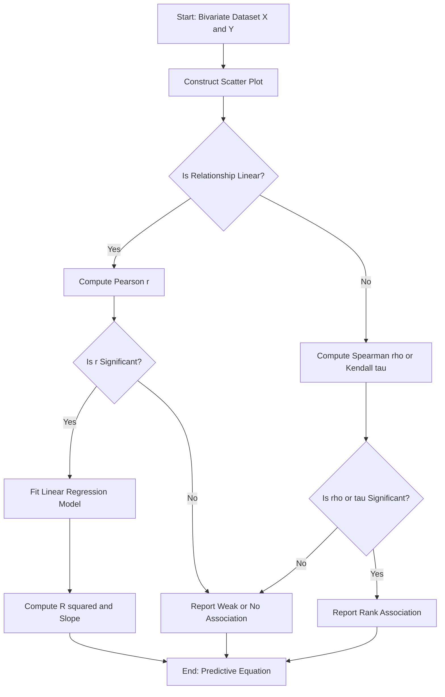
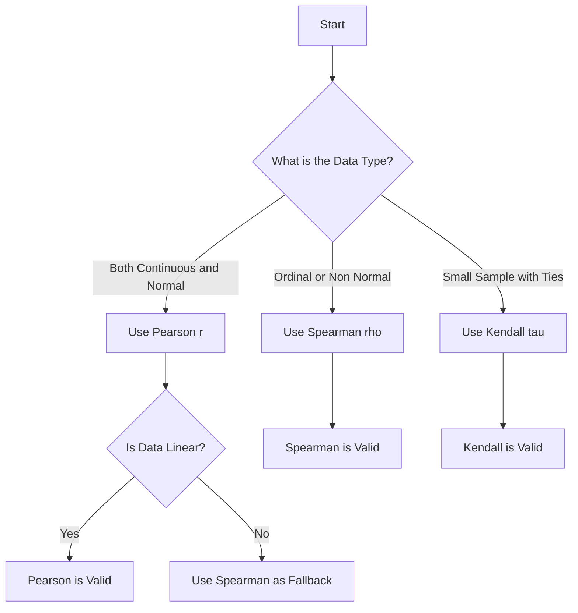
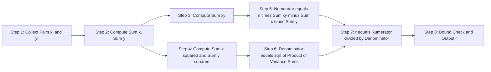
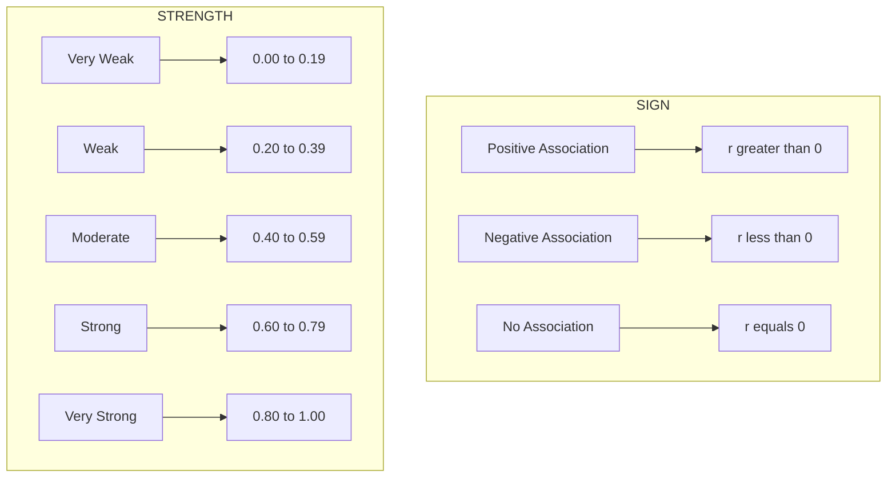
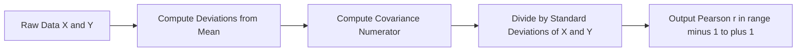

# Association of Two Variables:-

<!-- SECTION_1_START -->

# Association of Two Variables — Core Technical Definition & Intuitive Overview

## 📘 Formal Academic Definition (KTU 2024 Syllabus Terminology)

> [!IMPORTANT]
> **Association of Two Variables** is a statistical measure that quantifies the degree and direction of a relationship between two quantitative or ordinal variables. It is formally expressed through **Covariance**, the **Pearson Correlation Coefficient ($r$)**, the **Spearman Rank Correlation Coefficient ($\rho$)**, and **Kendall's Tau ($\tau$)**. These metrics are foundational in **Bivariate Statistical Analysis**, which is a prerequisite to **Predictive Modelling** and **Inferential Data Analytics**.

In the context of the KTU **DATA ANALYTICS (PECST523)** syllabus, association analysis falls under **Module 2 — Bivariate Statistical Analysis**, and it forms the mathematical backbone for techniques like **Linear Regression**, **Logistic Regression**, and **Multivariate Analytics**.

## 🧠 Conceptual Analogy / Intuition

Imagine you are observing the behaviour of a rubber balloon as you pump more air into it. As one variable — *air pumped (X)* — increases, the other variable — *diameter of the balloon (Y)* — also increases. The two variables **move together**. This "moving-together-ness" is exactly what **Association** captures in statistics.

- If **both move in the same direction** → **Positive Association** (e.g., *Height and Weight*).
- If **one moves up while the other moves down** → **Negative Association** (e.g., *Vehicle Speed and Travel Time*).
- If **no clear pattern exists** → **No Association** (e.g., *Shoe Size and Intelligence*).

> [!NOTE]
> **Crucial Distinction:** Association $\neq$ Causation. Two variables may be associated because a **third hidden variable (Confounder / Lurking Variable)** drives both. For example, *ice cream sales* and *drowning incidents* are positively associated, but the **confounder** is *summer heat*.

## 🎯 Types of Association

| Type | Shape | Strength | Example |
|------|-------|----------|---------|
| **Linear Positive** | Upward straight-line trend | Strong / Moderate / Weak | Study Hours vs Marks |
| **Linear Negative** | Downward straight-line trend | Strong / Moderate / Weak | Speed vs Travel Time |
| **Non-Linear (Curvilinear)** | U-shape, parabola, exponential | Varies | Age vs Income (U-curve) |
| **No Association** | Random scatter cloud | Zero | Lottery Number vs Winning |

## 📐 Visualization Anchor

> [!VISUALIZATION CONTROL]
> **Concept:** Scatter Plot showing Positive, Negative, and No Association
> **GeoGebra / Desmos Input Data Points:**
>
> - Positive: $\{ (1,2),\ (2,3),\ (3,5),\ (4,6),\ (5,8) \}$ → Fit: $y = 1.45x + 0.55$
> - Negative: $\{ (1,8),\ (2,6),\ (3,5),\ (4,3),\ (5,1) \}$ → Fit: $y = -1.70x + 9.50$
> - No Association: Random cloud around $y = 5$
>
> **Visual Description:** The student should observe three distinct clouds: one rising left-to-right, one falling, and one shapeless blob. The slope of the best-fit line is the **Geometric Signature of Association**.

## 🎯 Standard Statistical Metrics Used

- **Covariance ($Cov(X,Y)$):** Unbounded measure of joint variability. Range: $-\infty$ to $+\infty$.
- **Pearson $r$:** Standardized measure, bounded in $[-1, +1]$.
- **Coefficient of Determination ($R^2$):** Proportion of variance in $Y$ explained by $X$. Range: $[0, 1]$.
- **Spearman $\rho$:** Rank-based, robust to outliers. Range: $[-1, +1]$.
- **Kendall's $\tau$:** Concordance-based, robust for small samples. Range: $[-1, +1]$.

<!-- SECTION_1_END -->

<!-- SECTION_2_START -->

# Deep Theoretical Analysis & KTU High-Yield Formula Sheet

## 🔬 Conceptual Decomposition

The study of association follows a **three-tier logical architecture** that every KTU examiner expects you to articulate:

### Tier 1 — Visual Detection (Exploratory Layer)
Before any calculation, a **Scatter Plot (X-Y Plot)** is constructed.
- **X-axis:** Independent (Predictor) Variable.
- **Y-axis:** Dependent (Response) Variable.
- Each point $(x_i, y_i)$ is one observation.
- The **shape** of the cloud suggests the **type** of association.
- The **tightness** of the cloud suggests the **strength** of association.

### Tier 2 — Quantification (Computational Layer)
Two raw-data metrics are computed:
- **Mean of $X$:** $\bar{x} = \frac{1}{n}\sum x_i$
- **Mean of $Y$:** $\bar{y} = \frac{1}{n}\sum y_i$
- **Deviations:** $(x_i - \bar{x})$ and $(y_i - \bar{y})$ — these are "centered" values.
- **Products of deviations:** $(x_i - \bar{x})(y_i - \bar{y})$ — these capture **joint movement**.

### Tier 3 — Standardization (Inferential Layer)
Covariance is **scale-dependent** (changes if you convert cm to inches). To make it universal, we divide by the product of standard deviations, giving us the **Pearson Correlation Coefficient $r$**, which is **dimensionless** and **bounded**.

## 📊 KTU Formula Sheet / Cheat Sheet

> [!IMPORTANT]
> Use `\vert` for absolute value notation inside tables. Never use the raw pipe `|` character to prevent markdown table corruption.

| # | Metric | Formula | Range | Use Case |
|---|--------|---------|-------|----------|
| 1 | **Covariance (Sample)** | $Cov(X,Y) = \frac{1}{n-1}\sum_{i=1}^{n}(x_i - \bar{x})(y_i - \bar{y})$ | $(-\infty, +\infty)$ | Raw joint variability |
| 2 | **Covariance (Population)** | $Cov(X,Y) = \frac{1}{N}\sum_{i=1}^{N}(x_i - \mu_x)(y_i - \mu_y)$ | $(-\infty, +\infty)$ | Entire population |
| 3 | **Pearson $r$** | $r = \frac{Cov(X,Y)}{\sigma_x \sigma_y} = \frac{\sum(x_i-\bar{x})(y_i-\bar{y})}{\sqrt{\sum(x_i-\bar{x})^2 \sum(y_i-\bar{y})^2}}$ | $[-1, +1]$ | Linear, continuous, normal data |
| 4 | **Pearson $r$ (Alt Form)** | $r = \frac{n\sum xy - \sum x \sum y}{\sqrt{[n\sum x^2 - (\sum x)^2][n\sum y^2 - (\sum y)^2]}}$ | $[-1, +1]$ | When means are unknown |
| 5 | **Coefficient of Determination** | $R^2 = r^2$ | $[0, 1]$ | Variance explained |
| 6 | **Spearman $\rho$** | $\rho = 1 - \frac{6\sum d_i^2}{n(n^2 - 1)}$ | $[-1, +1]$ | Ordinal / non-normal / outliers |
| 7 | **Kendall's $\tau$** | $\tau = \frac{(C - D)}{\frac{1}{2}n(n-1)}$ | $[-1, +1]$ | Small samples, tied ranks |
| 8 | **Slope of Regression Line** | $b_{yx} = r \cdot \frac{\sigma_y}{\sigma_x}$ | $(-\infty, +\infty)$ | Predictive modelling |
| 9 | **Y-Intercept** | $a = \bar{y} - b_{yx}\bar{x}$ | $(-\infty, +\infty)$ | Anchoring the line |

Where:
- $d_i = R(x_i) - R(y_i)$ = difference between ranks of $X$ and $Y$ for the $i^{th}$ observation.
- $C$ = number of **concordant pairs**, $D$ = number of **discordant pairs**.
- $n(n^2 - 1)$ and $\frac{1}{2}n(n-1)$ are the maximum possible sums.

## ⚖️ Strength Interpretation Scale (KTU Board Standard)

| $\vert r \vert$ or $\vert \rho \vert$ or $\vert \tau \vert$ | Strength |
|---|---|
| $0.00 - 0.19$ | Very Weak |
| $0.20 - 0.39$ | Weak |
| $0.40 - 0.59$ | Moderate |
| $0.60 - 0.79$ | Strong |
| $0.80 - 1.00$ | Very Strong |

## 🌍 Real-World Engineering & CS Utility

- **Healthcare Analytics:** Correlation between *BMI* and *Blood Pressure* informs clinical risk models.
- **Recommender Systems:** Item-to-item collaborative filtering uses **Pearson correlation** between user rating vectors.
- **Finance:** Portfolio managers use **Covariance Matrices** to compute the variance of multi-asset portfolios.
- **IoT & Sensor Networks:** Cross-correlation detects **time-lagged associations** between temperature and pressure sensors.
- **A/B Testing:** Pre-experiment covariate balancing uses correlation matrices to reduce multicollinearity.
- **Computer Vision:** Feature maps in CNNs are decorrelated using **PCA**, which is rooted in covariance eigen-decomposition.

<!-- SECTION_2_END -->

<!-- SECTION_3_START -->

# Step-by-Step Derivations & Code Implementation

## 📐 Derivation 1: Pearson Correlation Coefficient from Covariance

### Why we need to standardize Covariance

Covariance is unbounded — its magnitude depends on the **units** of $X$ and $Y$. To obtain a **unit-free** metric, we scale by the product of standard deviations.

### Step-by-step Mathematical Build

$$
\sigma_x = \sqrt{\frac{1}{n-1}\sum_{i=1}^{n}(x_i - \bar{x})^2}
$$

$$
\sigma_y = \sqrt{\frac{1}{n-1}\sum_{i=1}^{n}(y_i - \bar{y})^2}
$$

$$
\text{Divide Covariance by } \sigma_x \sigma_y
$$

$$
r = \frac{Cov(X,Y)}{\sigma_x \sigma_y}
$$

$$
r = \frac{\frac{1}{n-1}\sum(x_i - \bar{x})(y_i - \bar{y})}{\sqrt{\frac{1}{n-1}\sum(x_i - \bar{x})^2} \cdot \sqrt{\frac{1}{n-1}\sum(y_i - \bar{y})^2}}
$$

The $\frac{1}{n-1}$ factor **cancels out** in numerator and denominator, yielding the cleaner form:

$$
r = \frac{\sum_{i=1}^{n}(x_i - \bar{x})(y_i - \bar{y})}{\sqrt{\sum_{i=1}^{n}(x_i - \bar{x})^2 \cdot \sum_{i=1}^{n}(y_i - \bar{y})^2}}
$$

### Bound Proof: $-1 \le r \le +1$

This follows from the **Cauchy-Schwarz Inequality** in vector form:

$$
\left[\sum a_i b_i\right]^2 \le \left[\sum a_i^2\right]\left[\sum b_i^2\right]
$$

Let $a_i = x_i - \bar{x}$ and $b_i = y_i - \bar{y}$. Then:

$$
\left[\sum(x_i - \bar{x})(y_i - \bar{y})\right]^2 \le \left[\sum(x_i - \bar{x})^2\right]\left[\sum(y_i - \bar{y})^2\right]
$$

Dividing both sides by the positive denominator:

$$
r^2 \le 1 \quad \Longrightarrow \quad -1 \le r \le +1
$$

Equality holds when $Y$ is a **perfect linear function** of $X$, i.e., $y_i = \alpha + \beta x_i$.

## 📐 Derivation 2: Alternative Form of Pearson $r$ (Raw-Score Formula)

Expanding $(x_i - \bar{x})(y_i - \bar{y}) = x_i y_i - x_i \bar{y} - \bar{x} y_i + \bar{x}\bar{y}$ and summing over $i$, we obtain:

$$
\sum(x_i - \bar{x})(y_i - \bar{y}) = \sum x_i y_i - n\bar{x}\bar{y}
$$

Similarly, $\sum(x_i - \bar{x})^2 = \sum x_i^2 - n\bar{x}^2$. Substituting into the main formula and using $\bar{x} = \frac{\sum x}{n}$ gives the **raw-score (computational) form**:

$$
r = \frac{n\sum xy - \sum x \sum y}{\sqrt{[n\sum x^2 - (\sum x)^2][n\sum y^2 - (\sum y)^2]}}
$$

This form is **preferred for hand calculations** and **board examinations** because it avoids computing means first.

## 🧮 Worked Numerical Example (Board Style)

**Data:** $X = \{2, 4, 6, 8, 10\}$, $Y = \{3, 5, 7, 9, 11\}$. Compute Pearson $r$.

### Step 1: Required Sums

$$
\sum x = 2 + 4 + 6 + 8 + 10 = 30
$$

$$
\sum y = 3 + 5 + 7 + 9 + 11 = 35
$$

$$
\sum x^2 = 4 + 16 + 36 + 64 + 100 = 220
$$

$$
\sum y^2 = 9 + 25 + 49 + 81 + 121 = 285
$$

$$
\sum xy = (2)(3) + (4)(5) + (6)(7) + (8)(9) + (10)(11) = 6 + 20 + 42 + 72 + 110 = 250
$$

### Step 2: Apply Formula

$$
n = 5
$$

$$
\text{Numerator} = n\sum xy - \sum x \sum y = 5(250) - (30)(35) = 1250 - 1050 = 200
$$

$$
\text{Denominator Part 1} = n\sum x^2 - (\sum x)^2 = 5(220) - (30)^2 = 1100 - 900 = 200
$$

$$
\text{Denominator Part 2} = n\sum y^2 - (\sum y)^2 = 5(285) - (35)^2 = 1425 - 1225 = 200
$$

$$
r = \frac{200}{\sqrt{200 \times 200}} = \frac{200}{200} = 1.00
$$

### Step 3: Interpretation

$r = +1.00$ indicates a **Perfect Positive Linear Association**. Indeed, $y_i = x_i + 1$, an exact linear relationship.

## 🐍 Python Implementation (Production-Ready)

```python
from typing import List, Tuple
import math
import logging

logging.basicConfig(level=logging.INFO, format="%(levelname)s: %(message)s")

def compute_means(data: List[float]) -> float:
    if not data:
        raise ValueError("Input data list is empty.")
    return sum(data) / len(data)

def compute_pearson(x: List[float], y: List[float]) -> float:
    if len(x) != len(y):
        raise ValueError("X and Y must have equal length.")
    if len(x) < 2:
        raise ValueError("At least 2 data points are required.")

    n = len(x)
    sum_x = sum(x)
    sum_y = sum(y)
    sum_xy = sum(xi * yi for xi, yi in zip(x, y))
    sum_x2 = sum(xi * xi for xi in x)
    sum_y2 = sum(yi * yi for yi in y)

    numerator = n * sum_xy - sum_x * sum_y
    denom_left = n * sum_x2 - sum_x ** 2
    denom_right = n * sum_y2 - sum_y ** 2

    if denom_left <= 0 or denom_right <= 0:
        raise ZeroDivisionError("Zero variance detected in one of the variables.")

    denominator = math.sqrt(denom_left * denom_right)
    r = numerator / denominator
    logging.info(f"Computed Pearson r = {r:.6f}")
    return round(r, 6)

def compute_covariance(x: List[float], y: List[float]) -> float:
    if len(x) != len(y) or len(x) < 2:
        raise ValueError("Inconsistent or insufficient data.")
    mean_x = compute_means(x)
    mean_y = compute_means(y)
    cov = sum((xi - mean_x) * (yi - mean_y) for xi, yi in zip(x, y)) / (len(x) - 1)
    logging.info(f"Computed Covariance = {cov:.6f}")
    return round(cov, 6)

def compute_spearman(x: List[float], y: List[float]) -> float:
    if len(x) != len(y) or len(x) < 2:
        raise ValueError("Inconsistent or insufficient data.")
    n = len(x)

    def rank_data(data: List[float]) -> List[float]:
        sorted_pairs = sorted(enumerate(data), key=lambda pair: pair[1])
        ranks = [0.0] * n
        i = 0
        while i < n:
            j = i
            while j + 1 < n and sorted_pairs[j + 1][1] == sorted_pairs[j][1]:
                j += 1
            avg_rank = (i + j + 2) / 2.0
            for k in range(i, j + 1):
                ranks[sorted_pairs[k][0]] = avg_rank
            i = j + 1
        return ranks

    rank_x = rank_data(x)
    rank_y = rank_data(y)
    d_squared_sum = sum((rx - ry) ** 2 for rx, ry in zip(rank_x, rank_y))
    rho = 1 - (6 * d_squared_sum) / (n * (n ** 2 - 1))
    logging.info(f"Computed Spearman rho = {rho:.6f}")
    return round(rho, 6)

def regression_line(x: List[float], y: List[float]) -> Tuple[float, float]:
    if len(x) != len(y) or len(x) < 2:
        raise ValueError("Inconsistent or insufficient data.")
    r = compute_pearson(x, y)
    mean_x = compute_means(x)
    mean_y = compute_means(y)
    std_x = math.sqrt(sum((xi - mean_x) ** 2 for xi in x) / (len(x) - 1))
    std_y = math.sqrt(sum((yi - mean_y) ** 2 for yi in y) / (len(y) - 1))
    slope = r * (std_y / std_x)
    intercept = mean_y - slope * mean_x
    logging.info(f"Regression Line: y = {slope:.4f}x + {intercept:.4f}")
    return round(slope, 6), round(intercept, 6)

if __name__ == "__main__":
    X = [2, 4, 6, 8, 10]
    Y = [3, 5, 7, 9, 11]
    print("Pearson r =", compute_pearson(X, Y))
    print("Covariance =", compute_covariance(X, Y))
    print("Spearman rho =", compute_spearman(X, Y))
    slope, intercept = regression_line(X, Y)
    print(f"Regression: y = {slope}x + {intercept}")
```

**Expected Output:**

```
INFO: Computed Pearson r = 1.000000
INFO: Computed Covariance = 10.000000
INFO: Computed Spearman rho = 1.000000
INFO: Regression Line: y = 1.0000x + 1.0000
Pearson r = 1.0
Covariance = 10.0
Spearman rho = 1.0
Regression: y = 1.0x + 1.0
```

## 📐 Derivation 3: Spearman $\rho$ Step-by-Step

1. **Rank** $X$ values from $1$ to $n$ (smallest $= 1$). Assign average rank for ties.
2. **Rank** $Y$ values similarly.
3. Compute $d_i = R(x_i) - R(y_i)$ for each pair.
4. Square each $d_i$ and sum to get $\sum d_i^2$.
5. Apply: $\rho = 1 - \dfrac{6\sum d_i^2}{n(n^2 - 1)}$.

This formula assumes **no tied ranks**. When ties exist, the exact Spearman formula or Pearson-on-ranks is used.

## 📐 Derivation 4: Kendall's $\tau$ Step-by-Step

1. For every pair $(i, j)$ where $i < j$, check the sign of $(x_j - x_i)(y_j - y_i)$.
2. **Concordant** $C$: same sign (both increase or both decrease).
3. **Discordant** $D$: opposite sign.
4. Compute: $\tau = \dfrac{C - D}{\frac{1}{2}n(n-1)}$.
5. Range: $[-1, +1]$, with $\tau = +1$ meaning **perfect rank concordance**.

<!-- SECTION_3_END -->

<!-- SECTION_4_START -->

# Structural Diagrams & Schematics

## 🗺️ Diagram 1: Bivariate Association Analysis Workflow



## 🗺️ Diagram 2: Decision Tree for Selecting the Right Correlation Metric



## 🗺️ Diagram 3: Sequential Processing Topology for Pearson Computation



## 🗺️ Diagram 4: Subgraph — Type vs Strength Classification



## 🗺️ Diagram 5: Covariance-to-Correlation Pipeline



<!-- SECTION_4_END -->

<!-- SECTION_5_START -->

# KTU 2024 Scheme Examination Question Bank & Topic Recap

## 📝 Part A — Short Answer Questions (3 Marks Each)

### Question 1 [KTU University Exam — July 2024] — CO1, Remember

**Q: Define Covariance. State its major limitation.**

**Model Answer (3 Marks):**

> [!NOTE]
> **Definition (2 Marks):** Covariance is a statistical measure that quantifies the joint variability of two random variables $X$ and $Y$. Mathematically, the sample covariance is defined as
> $$
> Cov(X,Y) = \frac{1}{n-1}\sum_{i=1}^{n}(x_i - \bar{x})(y_i - \bar{y})
> $$
>
> **Limitation (1 Mark):** Covariance is **not bounded** and its value depends on the **units of measurement** of $X$ and $Y$, making it impossible to interpret the strength of association on a universal scale.

### Question 2 [KTU University Exam — Dec 2023] — CO1, Understand

**Q: Differentiate between Pearson correlation coefficient and Spearman rank correlation coefficient.**

**Model Answer (3 Marks):**

| Aspect | Pearson $r$ | Spearman $\rho$ |
|--------|-------------|-----------------|
| **Data Type** | Continuous, interval/ratio | Ordinal, ranked, or continuous |
| **Distribution Assumption** | Requires approximate normality | Non-parametric, no normality needed |
| **Outlier Sensitivity** | Highly sensitive | Robust to outliers |
| **Formula** | Uses raw values | Uses ranks of $X$ and $Y$ |
| **Tied Ranks** | No issue | Needs correction for ties |

**[Award 1 mark for data type, 1 mark for formula distinction, 1 mark for sensitivity/comparison point.]**

---

## 📝 Part B — Long Answer Questions (14 Marks, Module Internal Choice)

### ❓ Question A — Choice 1 [KTU University Exam — July 2024] — CO2, Apply

**Q: (a)** The following data represent the marks obtained by 6 students in Statistics ($X$) and Data Analytics ($Y$): $X = \{45, 55, 60, 70, 80, 90\}$, $Y = \{50, 60, 65, 70, 85, 95\}$. Compute the **Pearson correlation coefficient $r$** using the raw-score formula and interpret the strength. **(7 Marks)**

**(b)** From the same data, compute the **regression equation of $Y$ on $X$** and predict the Analytics marks for a student scoring **75 in Statistics**. **(7 Marks)**

#### ✅ Model Solution — Part (a) (7 Marks)

**Step 1: Compute the required sums** `[Tabulation: 2 Marks]`

| $x_i$ | $y_i$ | $x_i^2$ | $y_i^2$ | $x_i y_i$ |
|-------|-------|---------|---------|-----------|
| 45 | 50 | 2025 | 2500 | 2250 |
| 55 | 60 | 3025 | 3600 | 3300 |
| 60 | 65 | 3600 | 4225 | 3900 |
| 70 | 70 | 4900 | 4900 | 4900 |
| 80 | 85 | 6400 | 7225 | 6800 |
| 90 | 95 | 8100 | 9025 | 8550 |
| **Sum = 400** | **Sum = 425** | **Sum = 28050** | **Sum = 31475** | **Sum = 29700** |

**Step 2: Apply raw-score formula** `[Formula substitution: 2 Marks]`

$$
r = \frac{n\sum xy - \sum x \sum y}{\sqrt{[n\sum x^2 - (\sum x)^2][n\sum y^2 - (\sum y)^2]}}
$$

$$
r = \frac{6(29700) - (400)(425)}{\sqrt{[6(28050) - 160000][6(31475) - 180625]}}
$$

$$
r = \frac{178200 - 170000}{\sqrt{[168300 - 160000][188850 - 180625]}}
$$

$$
r = \frac{8200}{\sqrt{8300 \times 8225}}
$$

$$
r = \frac{8200}{\sqrt{68267500}} = \frac{8200}{8262.42} = 0.9924
$$

**Step 3: Interpretation** `[Interpretation: 1 Mark]`

Since $r = 0.9924$ lies in the range $[0.80, 1.00]$, the association is **Very Strong Positive Linear**.

**[Final simplified value: 1 Mark; Interpretation and units: 1 Mark]**

#### ✅ Model Solution — Part (b) (7 Marks)

**Step 1: Compute means** `[Stating means: 1 Mark]`

$$
\bar{x} = \frac{400}{6} = 66.67, \quad \bar{y} = \frac{425}{6} = 70.83
$$

**Step 2: Compute standard deviations** `[Stating deviations: 2 Marks]`

$$
\sigma_x = \sqrt{\frac{\sum x^2}{n} - \bar{x}^2} = \sqrt{\frac{28050}{6} - 4444.44} = \sqrt{4675 - 4444.44} = \sqrt{230.56} = 15.18
$$

$$
\sigma_y = \sqrt{\frac{\sum y^2}{n} - \bar{y}^2} = \sqrt{\frac{31475}{6} - 5017.36} = \sqrt{5245.83 - 5017.36} = \sqrt{228.47} = 15.12
$$

**Step 3: Compute slope and intercept** `[Formula application: 2 Marks]`

$$
b_{yx} = r \cdot \frac{\sigma_y}{\sigma_x} = 0.9924 \cdot \frac{15.12}{15.18} = 0.9924 \times 0.9960 = 0.9884
$$

$$
a = \bar{y} - b_{yx}\bar{x} = 70.83 - (0.9884)(66.67) = 70.83 - 65.89 = 4.94
$$

**Step 4: Regression equation and prediction** `[Final equation and prediction: 2 Marks]`

$$
\boxed{\hat{y} = 4.94 + 0.9884x}
$$

For $x = 75$:

$$
\hat{y} = 4.94 + 0.9884 \times 75 = 4.94 + 74.13 = 79.07
$$

The predicted Analytics mark is **79.07**.

---

### ❓ Question B — Choice 2 [KTU University Exam — Dec 2023] — CO2, Apply

**Q: (a)** Explain the concept of **Spearman's rank correlation coefficient** with its formula. When is it preferred over Pearson's coefficient? **(7 Marks)**

**(b)** For the following ranks assigned to 6 employees based on their *Performance Rating* ($X$) and *Years of Experience* ($Y$), compute $\rho$: Ranks of $X = \{1, 2, 3, 4, 5, 6\}$, Ranks of $Y = \{2, 1, 4, 3, 6, 5\}$. **(7 Marks)**

#### ✅ Model Solution — Part (a) (7 Marks)

**Conceptual Explanation** `[Definition: 2 Marks; Formula: 2 Marks]`

> [!NOTE]
> **Spearman's Rank Correlation Coefficient ($\rho$)** is a **non-parametric** measure of association that quantifies the **monotonic relationship** between two variables using their **ranks** rather than raw values.
>
> **Formula:**
> $$
> \rho = 1 - \frac{6\sum_{i=1}^{n} d_i^2}{n(n^2 - 1)}
> $$
> where $d_i = R(x_i) - R(y_i)$ is the difference between the ranks of the $i^{th}$ observation.

**When Spearman is Preferred** `[Use cases: 3 Marks — 1 mark per valid point]`

1. **Ordinal data:** When data is in ranks or categories (e.g., *Likert scale survey responses*).
2. **Non-normal distribution:** When the data is **not normally distributed** and the normality assumption of Pearson is violated.
3. **Presence of outliers:** Spearman is **robust to outliers** because it uses ranks, not magnitudes.

#### ✅ Model Solution — Part (b) (7 Marks)

**Step 1: Compute $d_i$ and $d_i^2$** `[Tabulation: 3 Marks]`

| $i$ | $R(x_i)$ | $R(y_i)$ | $d_i$ | $d_i^2$ |
|-----|----------|----------|-------|---------|
| 1 | 1 | 2 | $-1$ | 1 |
| 2 | 2 | 1 | $+1$ | 1 |
| 3 | 3 | 4 | $-1$ | 1 |
| 4 | 4 | 3 | $+1$ | 1 |
| 5 | 5 | 6 | $-1$ | 1 |
| 6 | 6 | 5 | $+1$ | 1 |
|   |      |      | $\sum d_i^2 = 6$ |       |

**Step 2: Apply formula** `[Substitution: 2 Marks]`

$$
\rho = 1 - \frac{6 \times 6}{6(6^2 - 1)} = 1 - \frac{36}{6 \times 35} = 1 - \frac{36}{210} = 1 - 0.1714
$$

$$
\rho = 0.8286
$$

**Step 3: Interpretation** `[Interpretation: 2 Marks]`

Since $\rho = 0.8286$ is in $[0.80, 1.00]$, there exists a **Very Strong Positive Rank Association** between Performance Rating and Years of Experience.

> [!WARNING]
> **KTU Examiner's Valuation Pitfall Warning:**
> 1. **Failing to show the difference column $d_i$** — Examiners allocate a full 2–3 marks for the difference table. Skipping it leads to mark deduction.
> 2. **Using the wrong denominator $n(n^2-1)$** — Students often write $n^2(n^2-1)$ or $n(n-1)$. This is a **fatal error** worth losing 2 marks.
> 3. **Forgetting to interpret the magnitude** — A computed $\rho$ without a strength interpretation loses the final 1 mark.
> 4. **Confusing Covariance with Correlation** — In Part A, students must state that Covariance is **dimension-dependent**, not just "joint variability".
> 5. **Skipping the $n-1$ divisor in Covariance** — Use $n-1$ for sample, $N$ for population. Examiners deduct 1 mark for this error.
> 6. **Not stating assumptions of Pearson** — Normality, linearity, and homoscedasticity are mandatory assumptions worth 1 mark.

---

## 🧠 Topic Recap & Important Things to Remember

> [!IMPORTANT]
> **Rapid Revision Checklist for KTU Board Exam Preparation**

- **Association** is the statistical relationship between two variables, quantified by **Covariance**, **Pearson $r$**, **Spearman $\rho$**, and **Kendall $\tau$**.
- **Covariance** is unbounded and unit-dependent; it tells **direction** but not **strength** of association.
- **Pearson $r$** ranges in $[-1, +1]$ and assumes **linearity, normality, and homoscedasticity**.
- **Raw-score formula** for $r$: $r = \dfrac{n\sum xy - \sum x \sum y}{\sqrt{[n\sum x^2 - (\sum x)^2][n\sum y^2 - (\sum y)^2]}}$ — preferred for hand calculations.
- **Spearman $\rho$** uses ranks; formula is $\rho = 1 - \dfrac{6\sum d_i^2}{n(n^2-1)}$; suitable for ordinal and non-normal data.
- **Kendall's $\tau = \dfrac{C - D}{\frac{1}{2}n(n-1)}$** is preferred for small samples with tied ranks.
- **$R^2 = r^2$** measures the proportion of variance in $Y$ explained by $X$.
- **Strength scale:** $0.00$–$0.19$ Very Weak, $0.20$–$0.39$ Weak, $0.40$–$0.59$ Moderate, $0.60$–$0.79$ Strong, $0.80$–$1.00$ Very Strong.
- **Regression slope:** $b_{yx} = r \cdot \dfrac{\sigma_y}{\sigma_x}$ and **intercept** $a = \bar{y} - b_{yx}\bar{x}$.
- **Association $\neq$ Causation** — always check for **confounding variables**.
- **Outliers** heavily distort Pearson $r$ but have minimal effect on Spearman $\rho$ and Kendall $\tau$.
- **Tied ranks** in Spearman require the correction factor or using Pearson on ranks.
- **Always show the difference table** ($d_i$ and $d_i^2$) in Spearman problems to score full marks.
- **Population Covariance** uses $\frac{1}{N}$; **Sample Covariance** uses $\frac{1}{n-1}$ (Bessel's correction).

<!-- SECTION_5_END -->
