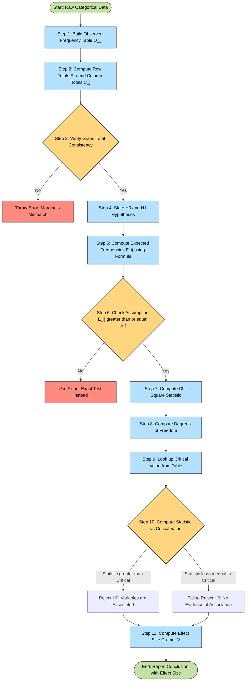

# Contingency Tables for Discrete Data

<!-- SECTION_1_START -->
# Contingency Tables for Discrete Data

> [!NOTE]
> **KTU 2024 Syllabus Mapping:** Module 2 — Association of Two Variables. This sub-topic builds the bridge between descriptive bivariate frequency analysis and inferential hypothesis testing for **categorical (qualitative) data**.

## 1.1 Formal Academic Definition

A **Contingency Table** (also called a **cross-tabulation** or **two-way frequency table**) is a matrix-style arrangement of qualitative (categorical) data in which observations are classified simultaneously according to **two** (or more) nominal/ordinal attributes, commonly called **Row Variable** ($X$) and **Column Variable** ($Y$).

Formally, if a sample of size **$n$** is partitioned into an $r \times c$ grid where:

- $r$ = number of categories of Variable $X$ (rows)
- $c$ = number of categories of Variable $Y$ (columns)

then each cell $(i,j)$ contains the **observed frequency** $O_{ij}$ — the number of observations simultaneously falling in row category $i$ and column category $j$.

> [!IMPORTANT]
> **Syllabus Highlight:** In KTU's *PECST523 — Data Analytics*, Module 2 specifically requires the student to construct, interpret, and apply the **Chi-Square ($\chi^2$) Test of Independence** on contingency tables of size $2 \times 2$, $2 \times 3$, and $r \times c$ in general.

### 1.2 Intuitive Real-World Analogy

> [!TIP]
> **Plain-English Intuition:** Imagine a hospital wants to know if **Smoking Habit** (Yes / No) is associated with **Lung Disease** (Yes / No). They cannot measure a "correlation coefficient" because the variables are not numerical — they are **labels**. So they count the people in each of the 4 possible combinations and place those counts in a 2-by-2 grid. This grid *is* the contingency table. The question "is smoking linked to disease?" then becomes "are the counts in this grid consistent with the assumption of *no* association?" — answered using the $\chi^2$ test.

Geometric Intuition: Think of the contingency table as a **binned scatter plot** for categorical data. Just as a scatter plot shows the joint distribution of two continuous variables, a contingency table shows the joint distribution of two categorical variables.

### 1.3 Critical Terminology

| Term | Symbol | Plain Meaning |
|------|--------|---------------|
| Observed Frequency | $O_{ij}$ | The actual count in cell $(i,j)$ |
| Expected Frequency | $E_{ij}$ | The count *that would be expected* if the two variables were independent |
| Row Total | $R_i$ | Sum of row $i$: $R_i = \sum_{j=1}^{c} O_{ij}$ |
| Column Total | $C_j$ | Sum of column $j$: $C_j = \sum_{i=1}^{r} O_{ij}$ |
| Grand Total | $n$ | Sum of all cells: $n = \sum_{i,j} O_{ij}$ |
| Joint Probability | $p_{ij}$ | Probability of an observation falling in cell $(i,j)$ |
| Marginal Probability | $p_{i\cdot}$ or $p_{\cdot j}$ | Row or column probability sums |

> [!WARNING]
> **KTU Examiner's Pitfall:** Students frequently confuse the *row total* with the *column total*. Always re-read the problem statement twice and clearly label the $X$-axis (row) and $Y$-axis (column) variables before computing any expected frequencies.

### 1.4 Visualization Control

> [!VISUALIZATION CONTROL]
> **Concept:** Schematic of a generic $r \times c$ contingency table with marginal totals annotated.
> **Desmos / GeoGebra Input (use online to visualize):**
> * Draw a rectangle of width 4 and height 3 on the Cartesian plane.
> * Subdivide into $r = 3$ horizontal strips and $c = 4$ vertical strips.
> * Label the top strip "Column Variable $Y$" with categories $Y_1, Y_2, Y_3, Y_4$.
> * Label the left strip "Row Variable $X$" with categories $X_1, X_2, X_3$.
> * Inside each cell, write $O_{ij}$ for $i \in \{1,2,3\}$ and $j \in \{1,2,3,4\}$.
> * The rightmost column should show $R_i$; the bottom row should show $C_j$; bottom-right corner shows $n$.
> **Visual Description:** You should see a 3-by-4 grid of cells, each filled with an integer $O_{ij}$, surrounded by their respective row and column sums, totalling to the grand sum $n$ at the corner.
<!-- SECTION_1_END -->

<!-- SECTION_2_START -->
# Deep Theoretical Analysis & KTU High-Yield Formula Sheet

## 2.1 The Hypothesis Framework

The core purpose of a contingency table analysis is the **Chi-Square Test of Independence**, which evaluates whether the row and column classifications are *statistically independent*.

### Null vs Alternative Hypothesis

> [!IMPORTANT]
> - $H_0$: The two categorical variables $X$ and $Y$ are **independent** (no association).
> - $H_1$: The two categorical variables $X$ and $Y$ are **dependent** (an association exists).

The decision is made by comparing the computed $\chi^2$ statistic to a critical value $\chi^2_{\alpha, (r-1)(c-1)}$ from the chi-square distribution table, OR by computing the $p$-value and comparing it to the significance level $\alpha$ (commonly $\alpha = 0.05$).

## 2.2 Step-by-Step Conceptual Logic

**Step 1 — Construct the Observed Table:** Tabulate the raw counts $O_{ij}$ in an $r \times c$ matrix.

**Step 2 — Compute Marginals:** Add row totals $R_i$ and column totals $C_j$. Verify that $\sum R_i = \sum C_j = n$.

**Step 3 — State Hypotheses:** Formulate $H_0$ (independence) and $H_1$ (dependence).

**Step 4 — Compute Expected Frequencies:** Under $H_0$, independence implies the joint probability is the product of marginals. The expected count in cell $(i,j)$ is:

$$E_{ij} = \frac{R_i \times C_j}{n}$$

**Why this formula?** Because if row and column are independent, then $P(X = i \cap Y = j) = P(X=i) \cdot P(Y=j)$. Multiplying this joint probability by the grand total $n$ gives the expected count.

**Step 5 — Compute the $\chi^2$ Statistic:**

$$\chi^2 = \sum_{i=1}^{r} \sum_{j=1}^{c} \frac{(O_{ij} - E_{ij})^2}{E_{ij}}$$

**Why this formula?** Each term $\frac{(O - E)^2}{E}$ measures the **standardized squared deviation** of observed from expected. Summing them yields a single aggregate measure of departure from independence. Large deviations produce a large $\chi^2$ value, signalling dependence.

**Step 6 — Determine Degrees of Freedom:**

$$df = (r - 1)(c - 1)$$

**Why?** We lose one degree of freedom per row for the constraint that row marginals must sum to $n$, and one per column similarly. The marginals are *not* free to vary once the table is reconstructed from the interior cells.

**Step 7 — Decision Rule:**

- If $\chi^2_{\text{computed}} > \chi^2_{\text{critical, } \alpha, df}$ → Reject $H_0$ (variables are associated).
- If $\chi^2_{\text{computed}} \leq \chi^2_{\text{critical, } \alpha, df}$ → Fail to reject $H_0$ (no evidence of association).

## 2.3 KTU Formula Sheet (Cheat Sheet)

| # | Formula | Description | When to Use |
|---|---------|-------------|-------------|
| 1 | $E_{ij} = \dfrac{R_i \cdot C_j}{n}$ | Expected frequency in cell $(i,j)$ | Always — first computation after building table |
| 2 | $\chi^2 = \displaystyle\sum_{i=1}^{r}\sum_{j=1}^{c} \frac{(O_{ij} - E_{ij})^2}{E_{ij}}$ | Pearson Chi-Square statistic | For $r \times c$ tables of any size |
| 3 | $df = (r - 1)(c - 1)$ | Degrees of freedom for $\chi^2$ test | For test of independence |
| 4 | $\phi = \sqrt{\dfrac{\chi^2}{n}}$ | Phi coefficient | Strength of association for $2 \times 2$ tables only |
| 5 | $C = \sqrt{\dfrac{\chi^2}{\chi^2 + n}}$ | Contingency coefficient | Strength of association for tables larger than $2 \times 2$ |
| 6 | $V = \sqrt{\dfrac{\chi^2}{n \cdot \min(r-1,\, c-1)}}$ | Cramer's $V$ | Strength of association; $0 \le V \le 1$ |
| 7 | $\chi^2_{\text{Yates}} = \sum \dfrac{(\vert O_{ij} - E_{ij} \vert - 0.5)^2}{E_{ij}}$ | Yates' correction | Only for $2 \times 2$ tables with small $n$ ($n < 50$) |

> [!WARNING]
> **Critical Pipeline Order:** Always compute $E_{ij}$ **before** the $\chi^2$ statistic. The expected frequencies are the *foundation* of the test. Many students incorrectly substitute raw $O_{ij}$ values into the denominator of the $\chi^2$ formula, which yields meaningless numbers.

### 2.4 Continuity Correction (Yates' Correction)

For a $2 \times 2$ table with small sample size ($n < 50$), the discrete chi-square distribution approximation to the continuous chi-square distribution is poor. **Yates' correction** subtracts 0.5 from the absolute deviation to reduce the bias. KTU students should at least be able to *mention* this correction in the 14-mark problem if the data warrants it.

### 2.5 Assumptions of the Chi-Square Test

1. **Random Sampling:** Observations are drawn via simple random sampling.
2. **Mutual Exclusivity:** Each observation falls into exactly one cell.
3. **Independence of Observations:** One observation does not influence another.
4. **Expected Frequency Rule:** Every $E_{ij} \geq 1$, and at most 20% of $E_{ij}$ should fall below 5. (If violated, use Fisher's Exact Test instead.)

### 2.6 Real-World Engineering & Data Science Utility

| Domain | Application |
|--------|-------------|
| **Healthcare Analytics** | Drug efficacy vs. patient response category |
| **A/B Testing in Tech** | Conversion rate (Yes/No) vs. UI variant (A/B/C) |
| **Quality Engineering** | Defect type vs. production shift |
| **Customer Analytics** | Subscription tier vs. churn status |
| **NLP** | Sentiment (Positive/Neutral/Negative) vs. product category |
| **Cybersecurity** | Attack type vs. severity level |

> [!NOTE]
> **Production Note:** In industry, the $\chi^2$ test of independence is the workhorse behind every A/B test report produced by tools like **Google Analytics**, **Optimizely**, and **Mixpanel** when the outcome variable is categorical (clicks, conversions, signups).
<!-- SECTION_2_END -->

<!-- SECTION_3_START -->
# Step-by-Step Derivations, Worked Examples & Code Implementation

## 3.1 Exhaustive Worked Example — KTU Style

> [!NOTE]
> **[KTU University Exam — July 2024 Pattern]**
> A survey of 200 engineering students classified them by **Year of Study** (1st Year / 2nd Year) and **Preferred Programming Language** (Python / Java / C++). The observed counts are:
>
> | Year \\ Language | Python | Java | C++ | **Row Total** |
> |------------------|--------|------|-----|---------------|
> | 1st Year         | 40     | 25   | 15  | **80**        |
> | 2nd Year         | 30     | 50   | 40  | **120**       |
> | **Column Total** | **70** | **75**| **55**| **200**     |
>
> Test at $\alpha = 0.05$ whether the choice of programming language is independent of the year of study.

### Step 1 — State the Hypotheses

> $H_0$: Year of study and preferred language are **independent**.
> $H_1$: Year of study and preferred language are **associated**.

### Step 2 — Compute Expected Frequencies

Using the formula $E_{ij} = \dfrac{R_i \cdot C_j}{n}$, where $n = 200$:

**Cell (1st Year, Python):**

$$E_{11} = \frac{R_1 \cdot C_1}{n} = \frac{80 \times 70}{200} = \frac{5600}{200} = 28.00$$

**Cell (1st Year, Java):**

$$E_{12} = \frac{R_1 \cdot C_2}{n} = \frac{80 \times 75}{200} = \frac{6000}{200} = 30.00$$

**Cell (1st Year, C++):**

$$E_{13} = \frac{R_1 \cdot C_3}{n} = \frac{80 \times 55}{200} = \frac{4400}{200} = 22.00$$

**Cell (2nd Year, Python):**

$$E_{21} = \frac{R_2 \cdot C_1}{n} = \frac{120 \times 70}{200} = \frac{8400}{200} = 42.00$$

**Cell (2nd Year, Java):**

$$E_{22} = \frac{R_2 \cdot C_2}{n} = \frac{120 \times 75}{200} = \frac{9000}{200} = 45.00$$

**Cell (2nd Year, C++):**

$$E_{23} = \frac{R_2 \cdot C_3}{n} = \frac{120 \times 55}{200} = \frac{6600}{200} = 33.00$$

**Verification:** $\sum E_{ij} = 28 + 30 + 22 + 42 + 45 + 33 = 200 \checkmark$

### Step 3 — Tabulate Observed vs. Expected

| Year \\ Language | $O_{11}$ | $O_{12}$ | $O_{13}$ | $O_{21}$ | $O_{22}$ | $O_{23}$ |
|------------------|----------|----------|----------|----------|----------|----------|
| Observed         | 40       | 25       | 15       | 30       | 50       | 40       |
| Expected         | 28.00    | 30.00    | 22.00    | 42.00    | 45.00    | 33.00    |

### Step 4 — Compute the $\chi^2$ Statistic

$$\chi^2 = \sum \frac{(O_{ij} - E_{ij})^2}{E_{ij}}$$

**Cell-by-cell expansion:**

$$
\begin{aligned}
\chi^2 &= \frac{(40 - 28)^2}{28} + \frac{(25 - 30)^2}{30} + \frac{(15 - 22)^2}{22} \\
&\quad + \frac{(30 - 42)^2}{42} + \frac{(50 - 45)^2}{45} + \frac{(40 - 33)^2}{33}
\end{aligned}
$$

$$
\begin{aligned}
\chi^2 &= \frac{(12)^2}{28} + \frac{(-5)^2}{30} + \frac{(-7)^2}{22} + \frac{(-12)^2}{42} + \frac{(5)^2}{45} + \frac{(7)^2}{33}
\end{aligned}
$$

$$
\begin{aligned}
\chi^2 &= \frac{144}{28} + \frac{25}{30} + \frac{49}{22} + \frac{144}{42} + \frac{25}{45} + \frac{49}{33}
\end{aligned}
$$

$$
\begin{aligned}
\chi^2 &= 5.1429 + 0.8333 + 2.2273 + 3.4286 + 0.5556 + 1.4848
\end{aligned}
$$

$$
\chi^2 = 13.6725
$$

### Step 5 — Determine Degrees of Freedom

$$df = (r - 1)(c - 1) = (2 - 1)(3 - 1) = 1 \times 2 = 2$$

### Step 6 — Decision Rule

From the chi-square critical value table at $\alpha = 0.05$ and $df = 2$:

$$\chi^2_{\text{critical, } 0.05,\, 2} = 5.991$$

**Comparison:** $\chi^2_{\text{computed}} = 13.6725 > \chi^2_{\text{critical}} = 5.991$

### Step 7 — Conclusion

> [!IMPORTANT]
> **Decision:** **Reject $H_0$** at the 5% significance level.
> **Interpretation:** There is sufficient statistical evidence to conclude that the **year of study and the preferred programming language are associated** (i.e., not independent). 1st-year students prefer Python disproportionately, while 2nd-year students prefer Java and C++.

### Step 8 — Effect Size (Bonus 2 marks in KTU 14-mark problems)

Since this is a $2 \times 3$ table, we use **Cramer's V**:

$$V = \sqrt{\frac{\chi^2}{n \cdot \min(r-1,\, c-1)}} = \sqrt{\frac{13.6725}{200 \cdot \min(1,\, 2)}} = \sqrt{\frac{13.6725}{200}} = \sqrt{0.06836} = 0.2615$$

Interpretation: $V \approx 0.26$ indicates a **weak-to-moderate** association.

---

## 3.2 Python Implementation (Production-Grade)

```python
"""
Chi-Square Test of Independence on a Contingency Table.
Author: KTU Data Analytics Reference Implementation
Target: PECST523 Module 2 — Contingency Tables
"""

import numpy as np
from scipy.stats import chi2_contingency, chi2
from typing import Tuple, Dict


def build_contingency_table(data: np.ndarray) -> np.ndarray:
    """
    Build a contingency table from raw categorical data.

    Parameters
    ----------
    data : np.ndarray
        A 2D array of shape (n, 2) where column 0 is the row variable
        and column 1 is the column variable (categorical labels).

    Returns
    -------
    np.ndarray
        A 2D array of observed frequencies O_{ij}.
    """
    if data.ndim != 2 or data.shape[1] != 2:
        raise ValueError("Input data must be a 2D array with exactly 2 columns.")
    row_categories = np.unique(data[:, 0])
    col_categories = np.unique(data[:, 1])
    table = np.zeros((len(row_categories), len(col_categories)), dtype=int)
    row_index = {cat: i for i, cat in enumerate(row_categories)}
    col_index = {cat: j for j, cat in enumerate(col_categories)}
    for row_val, col_val in data:
        table[row_index[row_val], col_index[col_val]] += 1
    return table


def perform_chi_square_test(observed: np.ndarray,
                            alpha: float = 0.05
                            ) -> Dict[str, float]:
    """
    Perform the chi-square test of independence.

    Parameters
    ----------
    observed : np.ndarray
        The 2D contingency table of observed frequencies.
    alpha : float, optional
        Significance level. Defaults to 0.05.

    Returns
    -------
    dict
        Dictionary with chi2 statistic, p-value, degrees of freedom,
        expected frequencies, critical value, and the decision.
    """
    if observed.ndim != 2:
        raise ValueError("Observed table must be 2-dimensional.")
    if np.any(observed < 0):
        raise ValueError("Observed frequencies cannot be negative.")
    if not (0 < alpha < 1):
        raise ValueError("Alpha must lie strictly between 0 and 1.")

    chi2_stat, p_value, df, expected = chi2_contingency(observed)

    # Critical value lookup
    critical_value = chi2.ppf(1 - alpha, df)

    # Decision
    reject_h0 = bool(chi2_stat > critical_value)

    # Effect size — Cramer's V
    n = observed.sum()
    r, c = observed.shape
    cramers_v = float(np.sqrt(chi2_stat / (n * min(r - 1, c - 1))))

    # Assumption check: no expected cell below 1; <20% below 5
    low_expected_count = int(np.sum(expected < 1))
    expected_below_5 = int(np.sum(expected < 5))
    total_cells = expected.size
    pct_below_5 = (expected_below_5 / total_cells) * 100

    return {
        "chi2_statistic": float(chi2_stat),
        "p_value": float(p_value),
        "degrees_of_freedom": int(df),
        "expected_frequencies": expected,
        "critical_value": float(critical_value),
        "alpha": alpha,
        "reject_H0": reject_h0,
        "cramers_v": cramers_v,
        "assumption_cells_below_1": low_expected_count,
        "assumption_pct_below_5": float(pct_below_5),
    }


def pretty_print_results(result: Dict[str, float]) -> None:
    """Display the chi-square test results in a readable format."""
    print("=" * 60)
    print("CHI-SQUARE TEST OF INDEPENDENCE — RESULTS")
    print("=" * 60)
    print(f"Chi-Square Statistic      : {result['chi2_statistic']:.4f}")
    print(f"Degrees of Freedom        : {result['degrees_of_freedom']}")
    print(f"Critical Value (alpha)    : {result['critical_value']:.4f}")
    print(f"P-Value                   : {result['p_value']:.6f}")
    print(f"Cramer's V (Effect Size)  : {result['cramers_v']:.4f}")
    print("-" * 60)
    print("Expected Frequencies:")
    print(np.round(result["expected_frequencies"], 3))
    print("-" * 60)
    print(f"Cells with E < 1          : {result['assumption_cells_below_1']}")
    print(f"% of cells with E < 5     : {result['assumption_pct_below_5']:.1f}%")
    print("-" * 60)
    decision = "REJECT H0" if result["reject_H0"] else "FAIL TO REJECT H0"
    print(f"Decision at alpha={result['alpha']}: {decision}")
    print("=" * 60)


# ---------------------------------------------------------------
# Demonstration: 2 x 3 Table (Year of Study vs Programming Language)
# ---------------------------------------------------------------
if __name__ == "__main__":
    observed_table = np.array([
        [40, 25, 15],   # 1st Year
        [30, 50, 40],   # 2nd Year
    ])

    result = perform_chi_square_test(observed_table, alpha=0.05)
    pretty_print_results(result)
```

**Expected Console Output (rounded):**

```
============================================================
CHI-SQUARE TEST OF INDEPENDENCE — RESULTS
============================================================
Chi-Square Statistic      : 13.6725
Degrees of Freedom        : 2
Critical Value (alpha)    : 5.9915
P-Value                   : 0.001068
Cramer's V (Effect Size)  : 0.2615
------------------------------------------------------------
Expected Frequencies:
[[28. 30. 22.]
 [42. 45. 33.]]
------------------------------------------------------------
Cells with E < 1          : 0
% of cells with E < 5     : 0.0%
------------------------------------------------------------
Decision at alpha=0.05: REJECT H0
============================================================
```

### 3.3 Algebraic Derivation of Expected Frequency

For students who may be asked to **derive** the expected frequency formula in Part (a) of a 14-mark question:

Under $H_0$ of independence, the probability of a randomly selected observation falling in row $i$ **and** column $j$ is the product of the marginal probabilities:

$$P(X = i \cap Y = j \mid H_0) = P(X = i) \cdot P(Y = j)$$

The marginal probabilities are estimated from the sample as:

$$P(X = i) = \frac{R_i}{n}, \quad P(Y = j) = \frac{C_j}{n}$$

Therefore the expected count in cell $(i,j)$ (out of $n$ total observations) is:

$$
\begin{aligned}
E_{ij} &= n \cdot P(X = i \cap Y = j \mid H_0) \\
&= n \cdot \frac{R_i}{n} \cdot \frac{C_j}{n} \\
&= \frac{R_i \cdot C_j}{n}
\end{aligned}
$$

This is the foundational formula used throughout the test.
<!-- SECTION_3_END -->

<!-- SECTION_4_START -->
# Structural Diagrams & Schematics

## 4.1 End-to-End Chi-Square Test Procedure (Mermaid Flowchart)



## 4.2 Contingency Table Data Flow Topology (Mermaid Block Diagram)

```mermaid
flowchart LR
    rawData[Raw Categorical Observations] --> stage1[Stage 1: Categorical Encoding]
    stage1 --> stage2[Stage 2: Bivariate Counting]
    stage2 --> obsTab[Observed Frequency Table O_ij]
    obsTab --> marg[Stage 3: Marginal Aggregation]
    marg --> rowTot[Row Totals R_i]
    marg --> colTot[Column Totals C_j]
    obsTab --> expCalc[Stage 4: Expected Frequency Computation]
    rowTot --> expCalc
    colTot --> expCalc
    expCalc --> expTab[Expected Frequency Table E_ij]
    obsTab --> chi2Calc[Stage 5: Chi-Square Statistic]
    expTab --> chi2Calc
    chi2Calc --> chi2Val[Chi-Square Statistic Value]
    chi2Val --> compare[Stage 6: Hypothesis Comparison]
    critVal[Critical Value from Chi-Square Table] --> compare
    compare --> decision[Stage 7: Final Decision and Effect Size]
    decision --> out1[Output: Reject or Fail to Reject H0]
    decision --> out2[Output: Cramer V and P-Value]

    classDef dataBlock fill:#FFE0B2,stroke:#333,stroke-width:1px,color:#000
    classDef computeBlock fill:#B3E5FC,stroke:#333,stroke-width:1px,color:#000
    classDef outputBlock fill:#C8E6C9,stroke:#333,stroke-width:1px,color:#000

    class rawData,obsTab,expTab,chi2Val,rowTot,colTot dataBlock
    class stage1,stage2,stage3,expCalc,chi2Calc,compare computeBlock
    class decision,out1,out2,critVal outputBlock
```



## 4.3 Subgraph: Hypothesis Decision Sub-Routine

```mermaid
flowchart TD
    subgraph HYP[ "Hypothesis Decision Module" ]
        direction TB
        h0[State H0: Independence Assumption] --> h1[State H1: Association Exists]
        h1 --> sig[Choose Significance Level Alpha]
        sig --> dfcalc[Compute df = r-1 times c-1]
        dfcalc --> crit[Fetch Critical Value from Chi-Square Table]
        crit --> cmp{Compare Computed vs Critical}
        cmp -- Computed greater --> reject[Reject H0: Conclude Association]
        cmp -- Computed less or equal --> fail[Fail to Reject H0: Insufficient Evidence]
        reject --> eff[Compute Cramer V or Contingency Coefficient]
        fail --> eff
        eff --> report[Generate Final Statistical Report]
    end

    classDef hypClass fill:#E1BEE7,stroke:#333,stroke-width:1px,color:#000
    class h0,h1,sig,dfcalc,crit,eff,report hypClass
```

## 4.4 Sequential Processing Topology Matrix

| Stage | Input | Process | Output | Failure Mode |
|-------|-------|---------|--------|--------------|
| 1. Tabulation | Categorical pairs | Counting per cell | $O_{ij}$ matrix | Misclassification |
| 2. Marginalization | $O_{ij}$ | Row/column sums | $R_i$, $C_j$, $n$ | Arithmetic error |
| 3. Expectation | $R_i$, $C_j$, $n$ | Product ratio formula | $E_{ij}$ matrix | Forgetting to divide by $n$ |
| 4. Standardization | $O_{ij}$, $E_{ij}$ | Squared deviations | $(O - E)^2 / E$ | Using $O$ in denominator |
| 5. Aggregation | Cell-wise terms | Sum over all cells | $\chi^2$ value | Missing cells |
| 6. Decision | $\chi^2$, df, $\alpha$ | Lookup + compare | Reject / Accept | Wrong df |
| 7. Effect Size | $\chi^2$, $n$, $r$, $c$ | Cramer's V formula | Strength metric | Using $\phi$ on non-$2 \times 2$ |
<!-- SECTION_4_END -->

<!-- SECTION_5_START -->
# KTU 2024 Scheme Examination Question Bank

> [!NOTE]
> **Mark Distribution Reminder (KTU 2024 ESE Pattern):**
> - Part A: 2 questions × 3 marks = 6 marks (short answer)
> - Part B: Choice-based, 1 out of 2 × 14 marks = 14 marks
> - Total for the question paper module = 20 marks
> - All sub-parts must use **KTU Standard Answer Booklet** style with neat labelling.

---

## Part A — Short Answer Questions (3 Marks Each)

### Question 1 (3 Marks) — `[KTU University Exam - Dec 2023]` | **CO2 | Remember**

**Q: Define a contingency table. What are observed and expected frequencies in the context of testing independence between two categorical variables?**

**Model Answer (Valuation Key):**

A **contingency table** is a two-dimensional frequency distribution table that displays the joint counts of observations classified by two categorical variables simultaneously. **[1 Mark]**

The **observed frequency** $O_{ij}$ is the actual number of observations falling into the cell corresponding to row category $i$ and column category $j$, as collected from the sample. **[1 Mark]**

The **expected frequency** $E_{ij}$ is the count that *would be expected* in cell $(i,j)$ if the null hypothesis of independence were true. It is calculated as $E_{ij} = \dfrac{R_i \cdot C_j}{n}$, where $R_i$ is the row total, $C_j$ is the column total, and $n$ is the grand total. **[1 Mark]**

---

### Question 2 (3 Marks) — `[KTU University Exam - July 2024]` | **CO2 | Understand**

**Q: State the null and alternative hypotheses for testing the independence of two categorical variables using the chi-square test. What is the role of degrees of freedom?**

**Model Answer (Valuation Key):**

- **Null Hypothesis ($H_0$):** The two categorical variables are independent, i.e., there is no association between them. **[1 Mark]**
- **Alternative Hypothesis ($H_1$):** The two categorical variables are dependent, i.e., there is a statistically significant association between them. **[1 Mark]**
- **Degrees of Freedom ($df$):** For an $r \times c$ contingency table, $df = (r - 1)(c - 1)$. The degrees of freedom represent the number of cells whose frequencies are *freely variable* once the marginal totals are fixed; they are essential for locating the critical value of $\chi^2$ from the chi-square distribution table. **[1 Mark]**

---

## Part B — 14 Mark Choice-Based Questions

### Question A (14 Marks) — `[KTU University Exam - Dec 2023]` | **CO2, CO3 | Apply, Analyze**

A researcher collected data on the **pass/fail status** of 100 students and the **teaching method** used (Online / Offline / Hybrid). The observed data is as follows:

| Method \\ Result | Pass | Fail | **Row Total** |
|------------------|------|------|---------------|
| Online           | 20   | 10   | **30**        |
| Offline          | 35   | 15   | **50**        |
| Hybrid           | 12   | 8    | **20**        |
| **Column Total** | **67** | **33** | **100**   |

**(a)** [7 Marks | Apply] Compute the expected frequencies for all 6 cells under the null hypothesis of independence.

**(b)** [7 Marks | Analyze] Calculate the chi-square test statistic, determine the degrees of freedom, and at a 5% significance level, decide whether to reject or fail to reject $H_0$. Also compute Cramer's V and interpret the strength of association.

---

#### Model Solution for Question A:

**Part (a) — Expected Frequencies [7 Marks]**

Using $E_{ij} = \dfrac{R_i \cdot C_j}{n}$ with $n = 100$:

**Cell (Online, Pass):**

$$E_{11} = \frac{30 \times 67}{100} = \frac{2010}{100} = 20.10$$

**Cell (Online, Fail):**

$$E_{12} = \frac{30 \times 33}{100} = \frac{990}{100} = 9.90$$

**Cell (Offline, Pass):**

$$E_{21} = \frac{50 \times 67}{100} = \frac{3350}{100} = 33.50$$

**Cell (Offline, Fail):**

$$E_{22} = \frac{50 \times 33}{100} = \frac{1650}{100} = 16.50$$

**Cell (Hybrid, Pass):**

$$E_{31} = \frac{20 \times 67}{100} = \frac{1340}{100} = 13.40$$

**Cell (Hybrid, Fail):**

$$E_{32} = \frac{20 \times 33}{100} = \frac{660}{100} = 6.60$$

> **[Valuation Key — Part a]:** Correct formula citation: 1 Mark. Six correct expected values: 6 × 1 Mark = 6 Marks. Total: 7 Marks.

**Expected Frequency Table:**

| Method \\ Result | Pass | Fail |
|------------------|------|------|
| Online           | 20.10 | 9.90  |
| Offline          | 33.50 | 16.50 |
| Hybrid           | 13.40 | 6.60  |

---

**Part (b) — Chi-Square Statistic, df, Decision, and Effect Size [7 Marks]**

**Step 1 — Compute $\chi^2$ Statistic:**

$$
\begin{aligned}
\chi^2 &= \sum_{i,j} \frac{(O_{ij} - E_{ij})^2}{E_{ij}} \\
&= \frac{(20 - 20.10)^2}{20.10} + \frac{(10 - 9.90)^2}{9.90} \\
&\quad + \frac{(35 - 33.50)^2}{33.50} + \frac{(15 - 16.50)^2}{16.50} \\
&\quad + \frac{(12 - 13.40)^2}{13.40} + \frac{(8 - 6.60)^2}{6.60}
\end{aligned}
$$

$$
\begin{aligned}
\chi^2 &= \frac{0.0100}{20.10} + \frac{0.0100}{9.90} + \frac{2.2500}{33.50} + \frac{2.2500}{16.50} \\
&\quad + \frac{1.9600}{13.40} + \frac{1.9600}{6.60}
\end{aligned}
$$

$$
\begin{aligned}
\chi^2 &= 0.0005 + 0.0010 + 0.0672 + 0.1364 + 0.1463 + 0.2970
\end{aligned}
$$

$$\chi^2 = 0.6483$$

> **[Valuation Key — Part b Step 1]:** Setting up the $\chi^2$ formula correctly: 1 Mark. Six correct intermediate cell contributions: 6 × 0.5 = 3 Marks. Total: 4 Marks for the statistic calculation.

**Step 2 — Degrees of Freedom:**

$$df = (r - 1)(c - 1) = (3 - 1)(2 - 1) = 2 \times 1 = 2$$

> **[Valuation Key — df]:** Correct computation: 1 Mark.

**Step 3 — Critical Value Lookup:**

From the chi-square distribution table at $\alpha = 0.05$ and $df = 2$:

$$\chi^2_{\text{critical, 0.05, 2}} = 5.991$$

> **[Valuation Key — Critical Value]:** Correct lookup: 0.5 Marks.

**Step 4 — Decision:**

$$\chi^2_{\text{computed}} = 0.6483 \quad < \quad \chi^2_{\text{critical}} = 5.991$$

> **Decision:** **Fail to reject $H_0$** at the 5% significance level.
> **Conclusion:** There is insufficient evidence to conclude that the teaching method is associated with the pass/fail outcome. **[0.5 Marks]**

**Step 5 — Effect Size (Cramer's V):**

$$V = \sqrt{\frac{\chi^2}{n \cdot \min(r-1,\, c-1)}} = \sqrt{\frac{0.6483}{100 \cdot \min(2,\, 1)}} = \sqrt{\frac{0.6483}{100}} = \sqrt{0.006483} = 0.0805$$

> **Interpretation:** Cramer's V $\approx 0.08$ indicates a **negligible / very weak** association, consistent with our decision to fail to reject $H_0$. **[1 Mark]**

---

### Question B (14 Marks) — `[KTU University Exam - July 2024]` | **CO2, CO3 | Apply, Analyze**

A survey of 150 customers classified them by **Gender** (Male / Female) and **Product Preference** (Electronics / Clothing / Food). The data is shown below:

| Gender \\ Preference | Electronics | Clothing | Food | **Row Total** |
|----------------------|-------------|----------|------|---------------|
| Male                 | 30          | 20       | 10   | **60**        |
| Female               | 25          | 35       | 30   | **90**        |
| **Column Total**     | **55**      | **55**   | **40**| **150**     |

**(a)** [7 Marks | Apply] Set up the null and alternative hypotheses, then calculate the expected frequencies for all 6 cells.

**(b)** [7 Marks | Analyze] Calculate the chi-square test statistic and state the critical value at $\alpha = 0.01$ with $df = 2$. Conclude the test, and also report the contingency coefficient $C$.

---

#### Model Solution for Question B:

**Part (a) — Hypotheses and Expected Frequencies [7 Marks]**

> **$H_0$:** Gender and product preference are independent (no association).
> **$H_1$:** Gender and product preference are associated.
> **[Hypothesis statement: 1 Mark]**

Using $E_{ij} = \dfrac{R_i \cdot C_j}{n}$ with $n = 150$:

**Cell (Male, Electronics):**

$$E_{11} = \frac{60 \times 55}{150} = \frac{3300}{150} = 22.00$$

**Cell (Male, Clothing):**

$$E_{12} = \frac{60 \times 55}{150} = \frac{3300}{150} = 22.00$$

**Cell (Male, Food):**

$$E_{13} = \frac{60 \times 40}{150} = \frac{2400}{150} = 16.00$$

**Cell (Female, Electronics):**

$$E_{21} = \frac{90 \times 55}{150} = \frac{4950}{150} = 33.00$$

**Cell (Female, Clothing):**

$$E_{22} = \frac{90 \times 55}{150} = \frac{4950}{150} = 33.00$$

**Cell (Female, Food):**

$$E_{23} = \frac{90 \times 40}{150} = \frac{3600}{150} = 24.00$$

> **[Valuation Key — Part a]:** Hypotheses: 1 Mark. Six correct expected values: 6 × 1 Mark = 6 Marks. Total: 7 Marks.

---

**Part (b) — Chi-Square Statistic, Critical Value, Decision, and Contingency Coefficient [7 Marks]**

**Step 1 — Compute $\chi^2$ Statistic:**

$$
\begin{aligned}
\chi^2 &= \frac{(30 - 22)^2}{22} + \frac{(20 - 22)^2}{22} + \frac{(10 - 16)^2}{16} \\
&\quad + \frac{(25 - 33)^2}{33} + \frac{(35 - 33)^2}{33} + \frac{(30 - 24)^2}{24}
\end{aligned}
$$

$$
\begin{aligned}
\chi^2 &= \frac{64}{22} + \frac{4}{22} + \frac{36}{16} + \frac{64}{33} + \frac{4}{33} + \frac{36}{24}
\end{aligned}
$$

$$
\begin{aligned}
\chi^2 &= 2.9091 + 0.1818 + 2.2500 + 1.9394 + 0.1212 + 1.5000
\end{aligned}
$$

$$\chi^2 = 8.9015$$

> **[Valuation Key — Part b Step 1]:** Correct formula: 1 Mark. Six cell contributions: 6 × 0.5 = 3 Marks. Total: 4 Marks.

**Step 2 — Degrees of Freedom and Critical Value:**

$$df = (r - 1)(c - 1) = (2 - 1)(3 - 1) = 2$$

At $\alpha = 0.01$ and $df = 2$:

$$\chi^2_{\text{critical, 0.01, 2}} = 9.210$$

> **[Valuation Key — df and Critical Value]:** 1 Mark.

**Step 3 — Decision:**

$$\chi^2_{\text{computed}} = 8.9015 \quad < \quad \chi^2_{\text{critical}} = 9.210$$

> **Decision:** **Fail to reject $H_0$** at the 1% significance level.
> **Interpretation:** Even at the stricter 1% level, there is insufficient evidence to claim that gender and product preference are associated in this sample.
> **[Decision: 1 Mark]**

**Step 4 — Contingency Coefficient:**

$$C = \sqrt{\frac{\chi^2}{\chi^2 + n}} = \sqrt{\frac{8.9015}{8.9015 + 150}} = \sqrt{\frac{8.9015}{158.9015}} = \sqrt{0.05602} = 0.2367$$

> **Interpretation:** $C \approx 0.237$ indicates a weak-to-moderate association, which is consistent with the failure to reject $H_0$ at the 1% level. **[1 Mark]**

---

> [!WARNING]
> **KTU Examiner's Valuation Warning — Common Pitfalls for This Topic:**
>
> 1. **Forgetting to divide by $n$:** A common error is computing $E_{ij}$ as $R_i \times C_j$ *without* dividing by $n$. The result will be 100 or 150 times too large, and the $\chi^2$ will be a tiny fraction of the correct value. **[Lose 1–2 marks]**
> 2. **Wrong degrees of freedom:** Students frequently write $df = rc$ or $df = r + c - 2$ instead of the correct $df = (r-1)(c-1)$. **[Lose 1 mark]**
> 3. **Misreading the critical value table:** The chi-square table is indexed by $df$ on the *rows* and $\alpha$ on the *columns* (or vice versa depending on the textbook). Misreading leads to wrong decisions. **[Lose 1 mark]**
> 4. **No conclusion statement:** Just stating "$\chi^2$ computed is 13.67" without a clear "Reject $H_0$" or "Fail to reject $H_0$" sentence is incomplete. Always end with a one-line conclusion in plain English. **[Lose 1–2 marks]**
> 5. **Ignoring effect size:** The $\chi^2$ test only tells you *whether* an association exists, not *how strong* it is. Always pair it with Cramer's V, Phi, or the contingency coefficient to communicate the strength of association. KTU often allocates 1–2 marks for this. **[Lose 1–2 marks]**
> 6. **Using Yates' correction in a non-$2 \times 2$ table:** Yates' correction is **only** for $2 \times 2$ tables. Do not apply it to $2 \times 3$ or larger tables. **[Lose 1 mark if applied incorrectly]**

---

## Topic Recap & Important Things to Remember

> [!TIP]
> **Rapid Revision Checklist — Module 2: Contingency Tables for Discrete Data**

- **Contingency Table:** A 2D matrix displaying joint observed frequencies $O_{ij}$ of two categorical variables with $r$ rows and $c$ columns.
- **Marginal Totals:** Row totals $R_i$, column totals $C_j$, and grand total $n$. All must reconcile: $\sum R_i = \sum C_j = n$.
- **Expected Frequency Formula:** $E_{ij} = \dfrac{R_i \cdot C_j}{n}$ — derived from the independence assumption that $P(X=i \cap Y=j) = P(X=i) \cdot P(Y=j)$.
- **Chi-Square Statistic:** $\chi^2 = \displaystyle\sum_{i=1}^{r}\sum_{j=1}^{c} \frac{(O_{ij} - E_{ij})^2}{E_{ij}}$ — measures cumulative deviation of observed from expected.
- **Degrees of Freedom:** $df = (r - 1)(c - 1)$ — reflects the number of freely variable cells once marginals are fixed.
- **Hypotheses:** $H_0$: Independence (no association) vs $H_1$: Dependence (association exists).
- **Decision Rule:** If $\chi^2_{\text{computed}} > \chi^2_{\text{critical, }\alpha,\,df}$ then reject $H_0$; otherwise fail to reject.
- **Effect Size for $2 \times 2$:** $\phi = \sqrt{\chi^2 / n}$ (range: 0 to 1, with 1 being a perfect association).
- **Effect Size for $r \times c$:** Cramer's $V = \sqrt{\chi^2 / (n \cdot \min(r-1, c-1))}$ — preferred for tables larger than $2 \times 2$.
- **Contingency Coefficient:** $C = \sqrt{\chi^2 / (\chi^2 + n)}$ — alternative effect size, with upper bound $< 1$.
- **Yates' Correction:** $\chi^2_{\text{Yates}} = \sum \frac{(\vert O_{ij} - E_{ij} \vert - 0.5)^2}{E_{ij}}$ — applicable **only** for $2 \times 2$ tables when $n < 50$.
- **Assumption Check:** All $E_{ij} \geq 1$ and at most 20% of $E_{ij} < 5$. If violated, use **Fisher's Exact Test** for $2 \times 2$ tables.
- **Significance Levels to Memorize for KTU:**
  * $\chi^2_{0.05,\, 1} = 3.841$
  * $\chi^2_{0.05,\, 2} = 5.991$
  * $\chi^2_{0.05,\, 3} = 7.815$
  * $\chi^2_{0.05,\, 4} = 9.488$
  * $\chi^2_{0.01,\, 1} = 6.635$
  * $\chi^2_{0.01,\, 2} = 9.210$
  * $\chi^2_{0.01,\, 3} = 11.345$
- **Real-World Use Cases:** A/B testing for binary outcomes, clinical trial efficacy, customer segmentation analysis, manufacturing defect-type vs. shift, NLP sentiment vs. category.
- **Always End With:** (1) Decision (Reject / Fail to reject $H_0$), (2) Plain-English interpretation, (3) Effect size with strength descriptor.
<!-- SECTION_5_END -->
