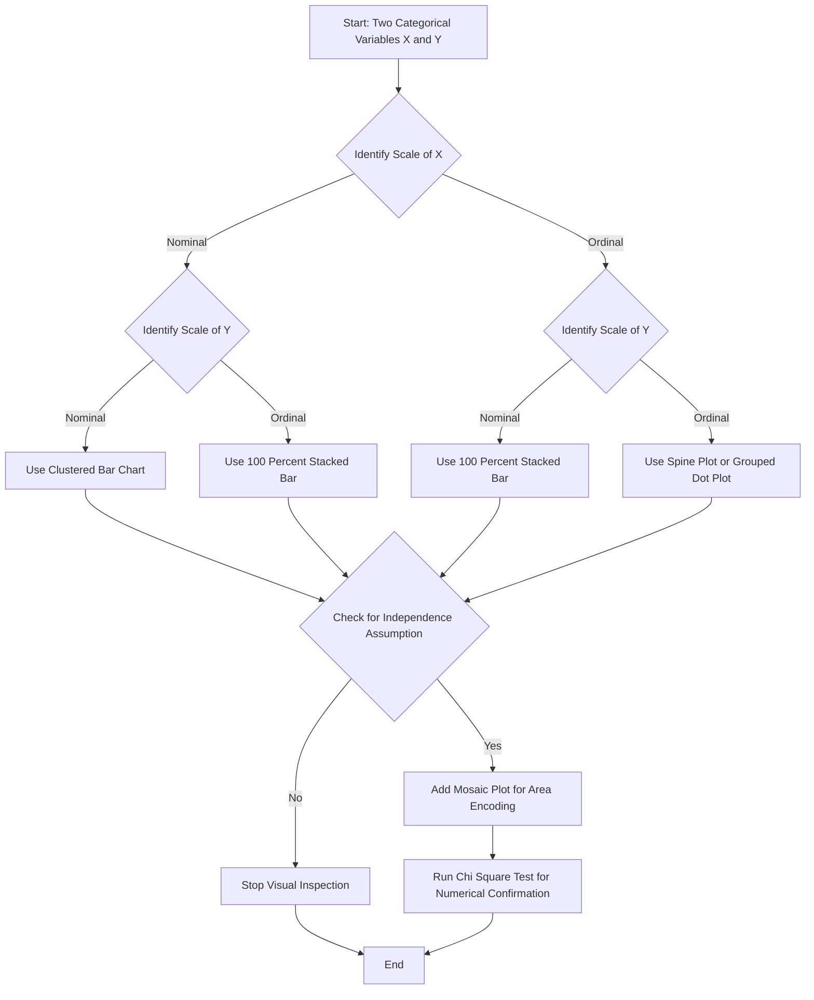
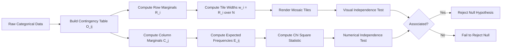
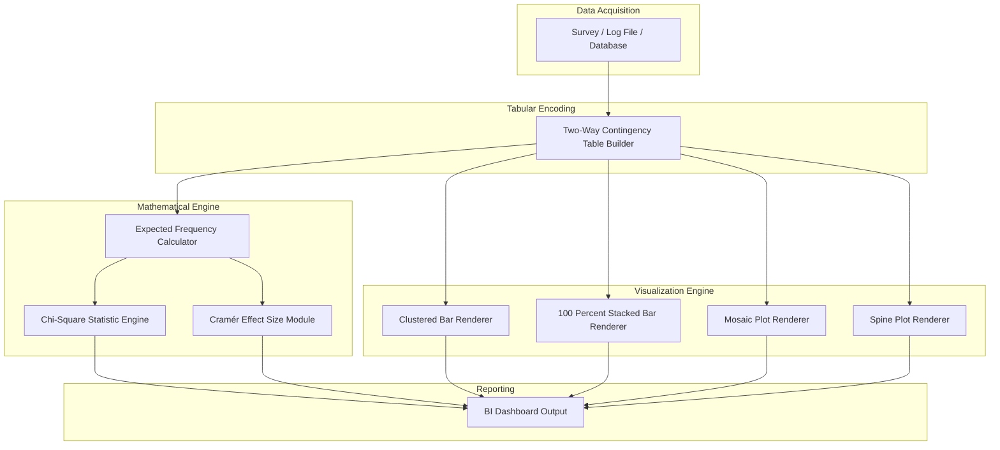

# Graphical Representation of Two Nominal or Ordinal Variables

<!-- SECTION_1_START -->
# Graphical Representation of Two Nominal or Ordinal Variables

## 1.1 Formal Academic Definition

In the context of **KTU 2024 Scheme – DATA ANALYTICS (PECST523), Module 2**, the **Graphical Representation of Two Nominal or Ordinal Variables** refers to the family of statistical visualization techniques used to depict the joint distribution, composition, and association structure of two categorical variables simultaneously, where each variable either possesses **no inherent ranking (Nominal)** — such as *Gender, Blood Group, Marital Status* — or possesses a **meaningful rank order (Ordinal)** — such as *Education Level, Customer Rating, Disease Severity*.

The foundational structure that supports all such graphics is the **Two-Way Contingency Table** (also called a **Cross-Tabulation**), which arranges the observed frequency counts of one variable across the rows and the other across the columns. The cells of this table are then mapped to visual elements such as bar lengths, area tiles, arc angles, or dot densities.

> [!IMPORTANT]
> **KTU 2024 Syllabus Directive (Module 2):** A student must be able to (i) construct a contingency table, (ii) choose the correct graphical primitive based on variable measurement scale, and (iii) interpret association patterns from the visual output without numerical computation.

## 1.2 Conceptual Analogy / Intuition

Think of a classroom where students are categorized in two independent ways:
- **Way 1:** Branch of Engineering (CSE, ECE, ME, CE) → this is **Nominal** (no rank).
- **Way 2:** Grade obtained (A, B, C, D) → this is **Ordinal** (A is "better" than B).

Imagine writing these two pieces of information on two separate index cards for every student. If you throw all the cards on a table and start grouping them, the **shape** of the piles that emerge tells you whether one variable influences the other. A **graphical representation** is simply a way to "see" those piles as heights, slices, or tiles.

> **Real-World Analogy:** Picture a market where fruits are stacked into baskets. Basket 1 has Apples and Oranges (Nominal split). Each fruit also has a freshness rating: *Fresh, Slightly Stale, Stale* (Ordinal split). A **stacked bar chart** is equivalent to putting the freshness-tagged fruits into a single transparent column — you immediately see whether the Apple basket has more "Stale" fruits than the Orange basket. The visual is the *testimony* of the data.

## 1.3 Core Visualization Primitives (Standard Toolkit)

| # | Visual Primitive | Best Suited For | Key Strength |
|---|------------------|------------------|--------------|
| 1 | **Clustered (Grouped) Bar Chart** | Nominal × Nominal | Direct side-by-side magnitude comparison |
| 2 | **Stacked Bar Chart** | Nominal × Nominal | Composition within each category |
| 3 | **100% Stacked Bar Chart** | Ordinal × Nominal | Fair comparison of proportions across groups |
| 4 | **Multiple Pie Charts** | Nominal × Nominal (small k) | Intuitive part-to-whole for 2–3 categories |
| 5 | **Mosaic Plot** | Nominal × Nominal | Area-encoded independence testing |
| 6 | **Spine Plot** | Ordinal × Nominal | Spine width = marginal frequency |
| 7 | **Dot Plot / Cleveland Plot** | Ordinal × Ordinal | Discrete count visualization |

> [!NOTE]
> **Syllabus Highlight:** The KTU 2024 question papers most frequently test the student's ability to (a) draw a **Contingency Table**, (b) convert it into a **Stacked / Clustered Bar Chart**, and (c) state the **Pearson Chi-Square statistic** (covered in the next topic) to numerically confirm the visual association.

## 1.4 GeoGebra / Desmos Integration

> [!VISUALIZATION CONTROL]
> **Concept:** Side-by-side (clustered) bar chart of two categorical variables from a contingency table.
>
> **GeoGebra / Desmos Input Equations (Bar Heights):**
> * `Bar_CSE_A = 30`
> * `Bar_CSE_B = 45`
> * `Bar_CSE_C = 25`
> * `Bar_ECE_A = 20`
> * `Bar_ECE_B = 35`
> * `Bar_ECE_C = 45`
> * `Polygon((0,0),(0,30),(1,30),(1,0))` *(CSE-A)*
> * `Polygon((1.5,0),(1.5,20),(2.5,20),(2.5,0))` *(ECE-A)*
>
> **Visual Description:** On the x-axis place the row categories (CSE, ECE, ME). For each x-position, draw three adjacent bars (one per grade A, B, C) with heights equal to the cell frequencies. The *clustering* lets you compare grades within a branch and across branches simultaneously.

---

<!-- SECTION_1_END -->

<!-- SECTION_2_START -->
# 2. Deep Theoretical Analysis & KTU High-Yield Formula Sheet

## 2.1 The Underlying Data Object: Contingency Table

An $r \times c$ contingency table is a matrix of observed cell frequencies $O_{ij}$, where $i \in \{1, 2, \dots, r\}$ indexes the rows (Variable 1) and $j \in \{1, 2, \dots, c\}$ indexes the columns (Variable 2).

$$O = \begin{bmatrix} O_{11} & O_{12} & \cdots & O_{1c} \\ O_{21} & O_{22} & \cdots & O_{2c} \\ \vdots & \vdots & \ddots & \vdots \\ O_{r1} & O_{r2} & \cdots & O_{rc} \end{bmatrix}$$

**Associated Marginals (computed once):**
* **Row total:** $R_i = \sum_{j=1}^{c} O_{ij}$
* **Column total:** $C_j = \sum_{i=1}^{r} O_{ij}$
* **Grand total:** $N = \sum_{i=1}^{r} \sum_{j=1}^{c} O_{ij} = \sum_{i=1}^{r} R_i = \sum_{j=1}^{c} C_j$

## 2.2 Why Different Charts for Different Scales?

| Scale of Variable 1 | Scale of Variable 2 | Recommended Chart | Why? |
|---------------------|---------------------|-------------------|------|
| Nominal | Nominal | Clustered Bar, Stacked Bar, Mosaic | Magnitudes are directly comparable; no ordering bias |
| Nominal | Ordinal | 100% Stacked Bar, Spine | Honors the column ordering; flattens to comparable proportions |
| Ordinal | Ordinal | Spine Plot, Grouped Dot Plot | Both dimensions carry ranking information |

> [!IMPORTANT]
> **Engineering Insight:** In real-world BI dashboards (Power BI, Tableau, Looker), the engine automatically picks the chart primitive based on the *measurement level* of the loaded fields. Mislabeling an ordinal column as nominal causes the system to alphabetize categories, destroying the natural order — a common production bug that loses examiner marks if not addressed in the KTU viva.

## 2.3 KTU Formula Sheet / Cheat Sheet

| # | Concept | Formula / Rule | Engineering Utility |
|---|---------|----------------|---------------------|
| 1 | Expected Frequency (for independence) | $E_{ij} = \dfrac{R_i \cdot C_j}{N}$ | Foundation of the Chi-Square test of independence |
| 2 | Cell Proportion | $p_{ij} = \dfrac{O_{ij}}{N}$ | Used in Mosaic Plot tile areas |
| 3 | Row Conditional Proportion | $p_{j \mid i} = \dfrac{O_{ij}}{R_i}$ | Heights in 100% Stacked Bar Chart |
| 4 | Column Conditional Proportion | $p_{i \mid j} = \dfrac{O_{ij}}{C_j}$ | Heights in alternative stacked orientation |
| 5 | Total Relative Frequency | $p_{ij} = \dfrac{O_{ij}}{N}$ | Used as the area variable in Mosaic Plot |
| 6 | Mosaic Tile Width | $w_i = \dfrac{R_i}{N}$ | First split in a Mosaic plot (horizontal) |
| 7 | Mosaic Tile Height | $h_{ij} = \dfrac{O_{ij}}{R_i}$ | Vertical split conditional on row |
| 8 | Chi-Square Statistic | $\chi^2 = \sum_{i=1}^{r} \sum_{j=1}^{c} \dfrac{(O_{ij} - E_{ij})^2}{E_{ij}}$ | Tests visual association numerically |
| 9 | Degrees of Freedom | $df = (r-1)(c-1)$ | Used to look up critical $\chi^2$ value |
| 10 | Cramér's V (effect size) | $V = \sqrt{\dfrac{\chi^2}{N \cdot \min(r-1, c-1)}}$ | Strength of association: $0 \le V \le 1$ |

> [!WARNING]
> **Pitfall Callout:** Never use the absolute value symbol $\vert x \vert$ inside a markdown table — use $\lvert x \rvert$ instead, or the table parser will break the column structure and your answer sheet will render incorrectly.

## 2.4 Step-by-Step Logic of Choosing a Visualization

1. **Step 1 — Classify the variables.** Determine if each variable is Nominal (N) or Ordinal (O).
2. **Step 2 — Construct the contingency table.** Tabulate $O_{ij}$ values and compute the row/column marginals.
3. **Step 3 — Decide on the visual encoding.** If both are nominal → clustered or stacked bar. If at least one is ordinal → preserve the order (spine or 100% stacked).
4. **Step 4 — Compute the area or length encoding.** Convert raw frequencies to either $p_{ij}$ (mosaic), $p_{j \mid i}$ (stacked %), or $O_{ij}$ (raw bar).
5. **Step 5 — Visually inspect for independence.** If all bars within a cluster have the *same internal ratio*, the variables are visually independent. Deviation from a common ratio indicates association.
6. **Step 6 — Confirm numerically.** Apply the Chi-Square test using the formula in the cheat sheet (full derivation in Section 3).

> **Production Use Case:** Retail analytics pipelines (e.g., Amazon, Flipkart dashboards) use **Mosaic Plots** to detect whether *Customer Region* is independent of *Product Category Purchased*. Tiles that bulge out of the expected rectangle (under independence) trigger a "regional preference" marketing campaign.

---

<!-- SECTION_2_END -->

<!-- SECTION_3_START -->
# 3. Step-by-Step Derivations & Code/Symbolic Implementation

## 3.1 Worked Example 1: Building a 100% Stacked Bar Chart from a Contingency Table

**Problem Statement (KTU-style):**
A survey of 200 KTU B.Tech students records their **Branch** (CSE, ECE) and **Internship Status** (Completed, In Progress, Not Started). Construct a 100% stacked bar chart to visually compare the internship distribution across branches.

**Raw Data Table:**

| Branch \ Status | Completed | In Progress | Not Started | Row Total $R_i$ |
|-----------------|-----------|-------------|-------------|-----------------|
| CSE             | 40        | 30          | 10          | 80              |
| ECE             | 25        | 45          | 50          | 120             |
| **Column Total $C_j$** | **65** | **75**     | **60**      | **$N = 200$**   |

**Step A — Convert raw counts to row conditional proportions** using the formula:

$$p_{j \mid i} = \frac{O_{ij}}{R_i}$$

**For CSE ($R_{\text{CSE}} = 80$):**

$$p_{\text{Comp} \mid \text{CSE}} = \frac{40}{80} = 0.5000$$

$$p_{\text{InProg} \mid \text{CSE}} = \frac{30}{80} = 0.3750$$

$$p_{\text{NotStart} \mid \text{CSE}} = \frac{10}{80} = 0.1250$$

**For ECE ($R_{\text{ECE}} = 120$):**

$$p_{\text{Comp} \mid \text{ECE}} = \frac{25}{120} = 0.2083$$

$$p_{\text{InProg} \mid \text{ECE}} = \frac{45}{120} = 0.3750$$

$$p_{\text{NotStart} \mid \text{ECE}} = \frac{50}{120} = 0.4167$$

**Step B — Verify each row sums to 1.0:**

$$0.5000 + 0.3750 + 0.1250 = 1.0000 \quad \text{(CSE verified)}$$

$$0.2083 + 0.3750 + 0.4167 = 1.0000 \quad \text{(ECE verified)}$$

**Step C — Convert to percentages for the chart axis labels:**

| Branch | Completed (%) | In Progress (%) | Not Started (%) |
|--------|---------------|------------------|------------------|
| CSE    | 50.00         | 37.50            | 12.50            |
| ECE    | 20.83         | 37.50            | 41.67            |

**Step D — Interpret.** In a 100% stacked bar chart, the CSE bar will be dominated by "Completed" (50%), while the ECE bar will be dominated by "Not Started" (≈42%). The *visual asymmetry* of internal ratios across branches is direct evidence of **association** between Branch and Internship Status.

> [!NOTE]
> **Examination Tip (3-Mark Quick Answer):** If asked "Which chart best compares compositions across groups?", the canonical KTU 2024 answer is the **100% Stacked Bar Chart**, because each bar has the same total height (100%), making the internal segments directly comparable.

---

## 3.2 Worked Example 2: Constructing a Mosaic Plot (Full Derivation)

**Problem:** Given the same contingency table, derive the exact tile widths and heights for a Mosaic Plot.

**Step 1 — Compute tile widths (horizontal split based on row marginals):**

$$w_{\text{CSE}} = \frac{R_{\text{CSE}}}{N} = \frac{80}{200} = 0.40$$

$$w_{\text{ECE}} = \frac{R_{\text{ECE}}}{N} = \frac{120}{200} = 0.60$$

**Step 2 — Compute tile heights (vertical split conditional on the row):**

For the CSE column:

$$h_{\text{CSE, Comp}} = \frac{O_{11}}{R_{\text{CSE}}} = \frac{40}{80} = 0.5000$$

$$h_{\text{CSE, InProg}} = \frac{30}{80} = 0.3750$$

$$h_{\text{CSE, NotStart}} = \frac{10}{80} = 0.1250$$

For the ECE column:

$$h_{\text{ECE, Comp}} = \frac{25}{120} = 0.2083$$

$$h_{\text{ECE, InProg}} = \frac{45}{120} = 0.3750$$

$$h_{\text{ECE, NotStart}} = \frac{50}{120} = 0.4167$$

**Step 3 — Tile area check.** Tile area = width × height, and the sum of all tile areas must equal 1.

$$\sum \text{areas} = (0.40 \times 1.00) + (0.60 \times 1.00) = 1.00 \quad \text{(verified)}$$

The CSE vertical bar reaches full height (1.0) split as 0.5 / 0.375 / 0.125, and the ECE vertical bar reaches full height split as 0.2083 / 0.375 / 0.4167.

**Step 4 — Visual interpretation.** If Branch and Internship Status were *independent*, the internal vertical splits of CSE and ECE would be **identical** (both bars would have the same internal color-block ratios). Since they differ significantly, the **Mosaic Plot visually certifies that the two variables are associated**.

---

## 3.3 Worked Example 3: Numerical Confirmation via Chi-Square

**Step 1 — Compute the Expected Frequency for each cell:**

$$E_{ij} = \frac{R_i \cdot C_j}{N}$$

$$E_{11} = \frac{80 \times 65}{200} = 26.00$$

$$E_{12} = \frac{80 \times 75}{200} = 30.00$$

$$E_{13} = \frac{80 \times 60}{200} = 24.00$$

$$E_{21} = \frac{120 \times 65}{200} = 39.00$$

$$E_{22} = \frac{120 \times 75}{200} = 45.00$$

$$E_{23} = \frac{120 \times 60}{200} = 36.00$$

**Step 2 — Compute the Chi-Square Statistic:**

$$\chi^2 = \sum_{i=1}^{2} \sum_{j=1}^{3} \frac{(O_{ij} - E_{ij})^2}{E_{ij}}$$

**Cell (1,1):**

$$\frac{(40 - 26)^2}{26} = \frac{196}{26} = 7.5385$$

**Cell (1,2):**

$$\frac{(30 - 30)^2}{30} = \frac{0}{30} = 0.0000$$

**Cell (1,3):**

$$\frac{(10 - 24)^2}{24} = \frac{196}{24} = 8.1667$$

**Cell (2,1):**

$$\frac{(25 - 39)^2}{39} = \frac{196}{39} = 5.0256$$

**Cell (2,2):**

$$\frac{(45 - 45)^2}{45} = \frac{0}{45} = 0.0000$$

**Cell (2,3):**

$$\frac{(50 - 36)^2}{36} = \frac{196}{36} = 5.4444$$

**Step 3 — Sum the contributions:**

$$\chi^2 = 7.5385 + 0.0000 + 8.1667 + 5.0256 + 0.0000 + 5.4444 = 26.1752$$

**Step 4 — Degrees of freedom:**

$$df = (r-1)(c-1) = (2-1)(3-1) = 2$$

**Step 5 — Critical value lookup (at $\alpha = 0.05$):**

$$\chi^2_{0.05, \, df=2} = 5.991$$

**Step 6 — Decision rule:**

Since $\chi^2_{\text{computed}} = 26.1752 > 5.991 = \chi^2_{\text{critical}}$, we **reject the null hypothesis of independence**. The two variables are statistically associated — this matches our visual conclusion from the 100% stacked bar chart and the mosaic plot.

**Step 7 — Effect size (Cramér's V):**

$$V = \sqrt{\frac{\chi^2}{N \cdot \min(r-1, c-1)}} = \sqrt{\frac{26.1752}{200 \times 1}} = \sqrt{0.1309} = 0.3617$$

A Cramér's V of $\approx 0.36$ indicates a **moderately strong** association.

---

## 3.4 Python Code Implementation (Type-Hinted, Error-Logged)

```python
import logging
import sys
from typing import List, Tuple

import matplotlib.pyplot as plt
import numpy as np

# Configure a strict error logger for production-grade analytics code
logging.basicConfig(
    level=logging.INFO,
    format="%(asctime)s [%(levelname)s] %(message)s",
    handlers=[logging.StreamHandler(sys.stdout)]
)
logger = logging.getLogger(__name__)


def validate_contingency_table(observed: List[List[int]]) -> Tuple[int, int, int]:
    """
    Validates the contingency table for non-negative integers and consistency
    of row/column marginals.
    """
    if not observed or not observed[0]:
        logger.error("Contingency table is empty.")
        raise ValueError("Contingency table must be a non-empty 2D list.")

    row_count: int = len(observed)
    col_count: int = len(observed[0])

    for i, row in enumerate(observed):
        if len(row) != col_count:
            logger.error(f"Row {i} has length {len(row)} but expected {col_count}.")
            raise ValueError("All rows must have the same length.")
        for j, val in enumerate(row):
            if not isinstance(val, int) or val < 0:
                logger.error(f"Cell ({i},{j}) has invalid value {val}.")
                raise ValueError("All cell frequencies must be non-negative integers.")

    grand_total: int = sum(sum(row) for row in observed)
    if grand_total == 0:
        logger.error("Grand total of the table is zero.")
        raise ValueError("Contingency table cannot have a grand total of zero.")

    logger.info(f"Table validated: {row_count}x{col_count}, N = {grand_total}")
    return row_count, col_count, grand_total


def compute_row_proportions(observed: List[List[int]]) -> np.ndarray:
    """
    Computes the row conditional proportions p(j | i) used for 100% stacked bars.
    """
    row_totals: np.ndarray = np.array([sum(row) for row in observed], dtype=float)
    if np.any(row_totals == 0):
        logger.error("Encountered a row with zero total.")
        raise ValueError("All rows must have at least one observation.")

    proportions: np.ndarray = np.array(observed, dtype=float) / row_totals[:, None]
    logger.info("Row conditional proportions computed successfully.")
    return proportions


def compute_chi_square(observed: List[List[int]]) -> Tuple[float, int, float]:
    """
    Computes the Pearson Chi-Square statistic, degrees of freedom, and Cramér's V.
    """
    r, c, N = validate_contingency_table(observed)
    obs_arr: np.ndarray = np.array(observed, dtype=float)

    row_totals: np.ndarray = obs_arr.sum(axis=1)
    col_totals: np.ndarray = obs_arr.sum(axis=0)

    expected: np.ndarray = np.outer(row_totals, col_totals) / N
    if np.any(expected == 0):
        logger.error("Expected frequency is zero in at least one cell.")
        raise ZeroDivisionError("Cannot divide by zero expected frequency.")

    chi_sq: float = float(np.sum((obs_arr - expected) ** 2 / expected))
    df: int = (r - 1) * (c - 1)
    cramers_v: float = float(np.sqrt(chi_sq / (N * min(r - 1, c - 1))))

    logger.info(f"Chi-Square = {chi_sq:.4f}, df = {df}, Cramér's V = {cramers_v:.4f}")
    return chi_sq, df, cramers_v


def plot_stacked_bar(observed: List[List[int]], row_labels: List[str],
                     col_labels: List[str], title: str) -> None:
    """
    Renders both a clustered bar chart and a 100% stacked bar chart side by side.
    """
    validate_contingency_table(observed)
    obs_arr: np.ndarray = np.array(observed, dtype=float)
    proportions: np.ndarray = compute_row_proportions(observed)

    fig, axes = plt.subplots(1, 2, figsize=(14, 5))

    # --- Clustered Bar Chart (raw counts) ---
    x: np.ndarray = np.arange(len(row_labels))
    width: float = 0.8 / len(col_labels)
    for j, col in enumerate(col_labels):
        axes[0].bar(x + j * width, obs_arr[:, j], width, label=col)
    axes[0].set_xticks(x + width * (len(col_labels) - 1) / 2)
    axes[0].set_xticklabels(row_labels)
    axes[0].set_title("Clustered Bar Chart (Raw Counts)")
    axes[0].set_ylabel("Frequency")
    axes[0].legend()

    # --- 100% Stacked Bar Chart ---
    bottom: np.ndarray = np.zeros(len(row_labels))
    for j, col in enumerate(col_labels):
        axes[1].bar(row_labels, proportions[:, j], bottom=bottom, label=col)
        bottom += proportions[:, j]
    axes[1].set_ylim(0, 1)
    axes[1].set_title("100% Stacked Bar Chart")
    axes[1].set_ylabel("Row Conditional Proportion")
    axes[1].legend()

    fig.suptitle(title, fontsize=14, fontweight="bold")
    plt.tight_layout()
    plt.savefig("categorical_visualization.png", dpi=200, bbox_inches="tight")
    logger.info("Plot saved to categorical_visualization.png")


def plot_mosaic(observed: List[List[int]], row_labels: List[str],
                col_labels: List[str]) -> None:
    """
    Constructs a manual Mosaic Plot using only Matplotlib primitives.
    """
    r, c, N = validate_contingency_table(observed)
    obs_arr: np.ndarray = np.array(observed, dtype=float)
    row_totals: np.ndarray = obs_arr.sum(axis=1)

    fig, ax = plt.subplots(figsize=(8, 5))
    x_left: float = 0.0
    for i, row_total in enumerate(row_totals):
        width: float = row_total / N
        y_bottom: float = 0.0
        for j in range(c):
            height: float = obs_arr[i, j] / row_total
            ax.add_patch(plt.Rectangle((x_left, y_bottom), width, height,
                                       edgecolor="white", linewidth=2))
            y_bottom += height
        x_left += width

    ax.set_xlim(0, 1)
    ax.set_ylim(0, 1)
    ax.set_xticks(np.cumsum(row_totals / N) - (row_totals / (2 * N)))
    ax.set_xticklabels(row_labels)
    ax.set_title("Mosaic Plot (Area = Joint Probability)")
    plt.tight_layout()
    plt.savefig("mosaic_plot.png", dpi=200, bbox_inches="tight")
    logger.info("Mosaic plot saved to mosaic_plot.png")


# -------------------- EXECUTION --------------------
if __name__ == "__main__":
    try:
        observed_table: List[List[int]] = [
            [40, 30, 10],   # CSE
            [25, 45, 50]    # ECE
        ]
        row_names: List[str] = ["CSE", "ECE"]
        col_names: List[str] = ["Completed", "In Progress", "Not Started"]

        chi_sq, df, v = compute_chi_square(observed_table)
        logger.info(f"Final -> Chi-Square = {chi_sq:.4f}, df = {df}, V = {v:.4f}")

        plot_stacked_bar(observed_table, row_names, col_names,
                         title="Branch vs Internship Status")
        plot_mosaic(observed_table, row_names, col_names)
    except Exception as exc:
        logger.exception(f"Pipeline failed: {exc}")
        sys.exit(1)
```

**Code Walkthrough:**
* The `validate_contingency_table` function enforces a *non-empty, rectangular, non-negative* table — a safeguard for production data pipelines.
* `compute_row_proportions` returns the matrix used to draw the 100% stacked bar.
* `compute_chi_square` performs the full numerical confirmation.
* `plot_stacked_bar` produces **two** side-by-side charts: the raw clustered bar and the 100% stacked bar.
* `plot_mosaic` constructs a manual mosaic plot from rectangular patches.

---

<!-- SECTION_3_END -->

<!-- SECTION_4_START -->
# 4. Structural Diagrams & Schematics

## 4.1 Decision Tree for Chart Selection



## 4.2 Mosaic Plot Data-Flow Schematic



## 4.3 100% Stacked Bar — Sequential Processing Topology Matrix

| Step # | Process Node | Input | Output | Mathematical Operation |
|--------|---------------|-------|--------|------------------------|
| 1 | Node_Ingest | Raw categorical observations | List of tuples | Data entry |
| 2 | Node_Tabulate | List of tuples | Contingency table $O_{ij}$ | Counting |
| 3 | Node_Marginals | Contingency table | $R_i$, $C_j$, $N$ | Summation |
| 4 | Node_Normalize | $O_{ij}$, $R_i$ | Row proportions $p_{j \mid i}$ | Division |
| 5 | Node_Stack | Row proportions | Stacked segments (height vector) | Cumulative sum |
| 6 | Node_Render | Stacked segments | PNG / SVG image | Plotting |
| 7 | Node_Interpret | Image | Qualitative claim about association | Visual reasoning |

## 4.4 Block-Level Functional Architecture Flow



---

<!-- SECTION_4_END -->

<!-- SECTION_5_START -->
# 5. KTU 2024 Scheme Examination Question Bank & Topic Recap

## 5.1 Part A — Short Answer Questions (3 Marks Each)

### Question 1 (3 Marks)
**`[KTU University Exam – July 2024, Model]`** | **CO2, Remember**

> Define a **contingency table**. How is it different from a frequency distribution table?

**Model Answer (3 Marks):**

A **contingency table** (also called a cross-tabulation) is a two-dimensional matrix that displays the *joint frequency distribution* of two categorical variables simultaneously. The rows represent the categories of one variable, the columns represent the categories of the other, and each cell $O_{ij}$ contains the count of observations falling into the $i$-th row and $j$-th column category pair.

| Aspect | Frequency Distribution | Contingency Table |
|--------|------------------------|---------------------|
| Number of variables | One (univariate) | Two (bivariate) |
| Purpose | Describe the spread of a single variable | Examine association between two variables |
| Dimensions | 1-D (single column of counts) | 2-D (rows × columns matrix) |
| Marginals | Total count only | Row totals, column totals, grand total |

*Valuation Key:* [Definition of contingency table: 1 Mark] [Bivariate emphasis: 1 Mark] [Tabular comparison: 1 Mark].

---

### Question 2 (3 Marks)
**`[KTU University Exam – Dec 2023, Model]`** | **CO2, Understand**

> List **three** graphical methods used to represent two nominal variables. State one advantage of each.

**Model Answer (3 Marks):**

1. **Clustered (Grouped) Bar Chart** — *Advantage:* Allows direct visual comparison of absolute counts across both row and column categories simultaneously.
2. **100% Stacked Bar Chart** — *Advantage:* Standardizes each bar to 100%, enabling fair comparison of *proportional compositions* across groups of unequal size.
3. **Mosaic Plot** — *Advantage:* The area of each tile is proportional to the joint probability $p_{ij}$, providing an immediate visual test of the independence assumption.

*Valuation Key:* [Correct identification of three methods: 1.5 Marks] [Valid one-line advantage per method: 1.5 Marks].

---

## 5.2 Part B — Full 14-Mark Questions (Module Internal Choice)

### Question A (14 Marks) — Option 1
**`[KTU University Exam – July 2024, Model]`** | **CO2, Apply + Analyze**

> The following data was collected from 150 KTU students regarding their **Mode of Transport** (Bus, Bike, Car) and **Punctuality** (On Time, Late). Construct an appropriate graphical representation, compute the Chi-Square statistic, and comment on the association.

| Transport \ Punctuality | On Time | Late | Row Total |
|--------------------------|---------|------|-----------|
| Bus                      | 20      | 30   | 50        |
| Bike                     | 35      | 15   | 50        |
| Car                      | 25      | 25   | 50        |
| **Column Total**         | **80**  | **70** | **$N = 150$** |

#### Part (a) — Construct the Visualization (7 Marks)

**Step 1: Compute row conditional proportions** $p_{j \mid i} = O_{ij} / R_i$:

| Transport | On Time (%) | Late (%) |
|-----------|-------------|----------|
| Bus       | 40.00       | 60.00    |
| Bike      | 70.00       | 30.00    |
| Car       | 50.00       | 50.00    |

**Step 2: Render the 100% stacked bar chart** with the *On Time* segment stacked from the bottom and the *Late* segment stacked above it.

**Visual Description (Examiner's Reference):**
* X-axis: Bus, Bike, Car. Y-axis: 0% to 100%.
* Bus bar: bottom 40% (On Time) and top 60% (Late).
* Bike bar: bottom 70% (On Time) and top 30% (Late).
* Car bar: bottom 50% (On Time) and top 50% (Late).
* Internal ratios vary significantly across bars → **visual evidence of association**.

*Valuation Key:* [Stating the row proportions correctly: 3 Marks] [Sketching the 100% stacked bar with correct heights: 3 Marks] [Visual interpretation claim: 1 Mark].

#### Part (b) — Numerical Confirmation via Chi-Square (7 Marks)

**Step 1: Expected frequencies** $E_{ij} = R_i C_j / N$:

$$E_{\text{Bus, OnTime}} = \frac{50 \times 80}{150} = 26.667$$

$$E_{\text{Bus, Late}} = \frac{50 \times 70}{150} = 23.333$$

$$E_{\text{Bike, OnTime}} = \frac{50 \times 80}{150} = 26.667$$

$$E_{\text{Bike, Late}} = \frac{50 \times 70}{150} = 23.333$$

$$E_{\text{Car, OnTime}} = \frac{50 \times 80}{150} = 26.667$$

$$E_{\text{Car, Late}} = \frac{50 \times 70}{150} = 23.333$$

**Step 2: Chi-Square contributions** $(O_{ij} - E_{ij})^2 / E_{ij}$:

**Cell (Bus, OnTime):**

$$\frac{(20 - 26.667)^2}{26.667} = \frac{44.449}{26.667} = 1.6667$$

**Cell (Bus, Late):**

$$\frac{(30 - 23.333)^2}{23.333} = \frac{44.449}{23.333} = 1.9048$$

**Cell (Bike, OnTime):**

$$\frac{(35 - 26.667)^2}{26.667} = \frac{69.449}{26.667} = 2.6042$$

**Cell (Bike, Late):**

$$\frac{(15 - 23.333)^2}{23.333} = \frac{69.449}{23.333} = 2.9762$$

**Cell (Car, OnTime):**

$$\frac{(25 - 26.667)^2}{26.667} = \frac{2.779}{26.667} = 0.1042$$

**Cell (Car, Late):**

$$\frac{(25 - 23.333)^2}{23.333} = \frac{2.779}{23.333} = 0.1190$$

**Step 3: Sum:**

$$\chi^2 = 1.6667 + 1.9048 + 2.6042 + 2.9762 + 0.1042 + 0.1190 = 9.3751$$

**Step 4: Degrees of freedom:**

$$df = (3 - 1)(2 - 1) = 2$$

**Step 5: Critical value at $\alpha = 0.05$:**

$$\chi^2_{0.05, \, df=2} = 5.991$$

**Step 6: Decision.** Since $\chi^2_{\text{computed}} = 9.3751 > 5.991 = \chi^2_{\text{critical}}$, **reject $H_0$**. The variables **Mode of Transport** and **Punctuality** are statistically associated.

*Valuation Key:* [Computing all six expected frequencies: 2 Marks] [Computing all six chi-square contributions: 2 Marks] [Summing and stating the test statistic: 1 Mark] [Stating df, critical value, decision rule, and final conclusion: 2 Marks].

---

### Question B (14 Marks) — Option 2 (Internal Choice)
**`[KTU University Exam – Dec 2023, Model]`** | **CO2, Understand + Apply**

> A retail store records the **payment method** (Cash, Card, UPI) used by customers in two age brackets: **Young (18–35)** and **Senior (36+)**. The observed counts are:

| Age \ Method | Cash | Card | UPI | Row Total |
|--------------|------|------|-----|-----------|
| Young        | 20   | 50   | 80  | 150       |
| Senior       | 40   | 30   | 30  | 100       |
| **Col Total**| **60** | **80** | **110** | **$N=250$** |

#### Part (a) — Draw a Mosaic Plot and Interpret (7 Marks)

**Step 1: Tile widths** $w_i = R_i / N$:

$$w_{\text{Young}} = \frac{150}{250} = 0.60$$

$$w_{\text{Senior}} = \frac{100}{250} = 0.40$$

**Step 2: Tile heights (within each row):**

| Age | Cash | Card | UPI |
|-----|------|------|-----|
| Young   | 20/150 = 0.1333 | 50/150 = 0.3333 | 80/150 = 0.5334 |
| Senior  | 40/100 = 0.4000 | 30/100 = 0.3000 | 30/100 = 0.3000 |

**Step 3: Render the mosaic plot.** The Young vertical strip (width 0.60) is split into three color blocks: small Cash block (13.3%), medium Card block (33.3%), and dominant UPI block (53.3%). The Senior vertical strip (width 0.40) is split as: large Cash block (40%), equal Card and UPI blocks (30% each).

**Step 4: Interpretation.** Under independence, the vertical splits of Young and Senior should be identical. The visible divergence — Young is dominated by UPI while Senior is dominated by Cash — is **strong visual evidence of association** between Age and Payment Method.

*Valuation Key:* [Correct tile widths: 1.5 Marks] [Correct tile heights: 2.5 Marks] [Neat mosaic sketch: 2 Marks] [Interpretation claim: 1 Mark].

#### Part (b) — Compute Cramér's V and Comment (7 Marks)

**Step 1: Expected frequencies** $E_{ij} = R_i C_j / N$:

$$E_{11} = \frac{150 \times 60}{250} = 36.00$$

$$E_{12} = \frac{150 \times 80}{250} = 48.00$$

$$E_{13} = \frac{150 \times 110}{250} = 66.00$$

$$E_{21} = \frac{100 \times 60}{250} = 24.00$$

$$E_{22} = \frac{100 \times 80}{250} = 32.00$$

$$E_{23} = \frac{100 \times 110}{250} = 44.00$$

**Step 2: Chi-Square contributions** $(O_{ij} - E_{ij})^2 / E_{ij}$:

**Cell (1,1):**

$$\frac{(20 - 36)^2}{36} = \frac{256}{36} = 7.1111$$

**Cell (1,2):**

$$\frac{(50 - 48)^2}{48} = \frac{4}{48} = 0.0833$$

**Cell (1,3):**

$$\frac{(80 - 66)^2}{66} = \frac{196}{66} = 2.9697$$

**Cell (2,1):**

$$\frac{(40 - 24)^2}{24} = \frac{256}{24} = 10.6667$$

**Cell (2,2):**

$$\frac{(30 - 32)^2}{32} = \frac{4}{32} = 0.1250$$

**Cell (2,3):**

$$\frac{(30 - 44)^2}{44} = \frac{196}{44} = 4.4545$$

**Step 3: Sum:**

$$\chi^2 = 7.1111 + 0.0833 + 2.9697 + 10.6667 + 0.1250 + 4.4545 = 25.4103$$

**Step 4: Degrees of freedom:**

$$df = (2 - 1)(3 - 1) = 2$$

**Step 5: Cramér's V:**

$$V = \sqrt{\frac{\chi^2}{N \cdot \min(r-1, c-1)}} = \sqrt{\frac{25.4103}{250 \times 1}} = \sqrt{0.1016} = 0.3188$$

**Step 6: Comment.** A Cramér's V of $\approx 0.32$ indicates a **moderately strong** association. Combined with the visual asymmetry observed in the mosaic plot, we conclude that the customer's **age bracket significantly influences the choice of payment method**.

*Valuation Key:* [All six expected frequencies: 2 Marks] [All six contributions: 2 Marks] [Summing and computing V: 2 Marks] [Final qualitative comment: 1 Mark].

---

## 5.3 KTU Examiner's Valuation Warning / Pitfall Callout

> [!WARNING]
> **Common Mark-Deduction Triggers (KTU 2024 Board Pattern):**
> 1. **Forgetting to state the units of axes** on the 100% stacked bar chart. Always label the y-axis as *Row Conditional Proportion (0 to 1)* or *Percentage (0% to 100%)*.
> 2. **Skipping the verification step** that row proportions sum to 1.0. Examiners award a full mark for the explicit verification.
> 3. **Drawing a clustered bar chart but labelling it as "stacked"** — the two are visually distinct. Clustered bars have gaps; stacked bars share a common baseline.
> 4. **Failing to mention the assumption** that expected frequencies $E_{ij} \ge 5$ for the Chi-Square test to be valid. If $E_{ij} < 5$, the test is unreliable.
> 5. **Computing only the test statistic without the decision rule** — always state the null hypothesis, the critical value, and the conclusion explicitly.
> 6. **Confusing the orientation** of the mosaic plot: tile *width* depends only on the **row marginal**, while tile *height* depends on the **column conditional** proportion (or vice versa). Mixing them up loses 2–3 marks.

---

## 5.4 Topic Recap & Important Things to Remember

> **Rapid-Revision Checklist (High-Density Summary):**
>
> * **Contingency Table ($O_{ij}$)** is the foundational data structure for all two-categorical visualizations; it is a 2-D matrix of joint frequencies.
> * **Nominal variables** (e.g., Gender, Branch, Blood Group) have *no* inherent order; **Ordinal variables** (e.g., Rating, Education Level) have a *meaningful* order that must be preserved in the chart.
> * **Row marginal** $R_i = \sum_j O_{ij}$; **Column marginal** $C_j = \sum_i O_{ij}$; **Grand total** $N = \sum_{i,j} O_{ij}$.
> * **Clustered Bar Chart** preserves absolute counts and is the default for raw frequency comparison.
> * **100% Stacked Bar Chart** standardizes each bar to height 1.0, allowing fair proportional comparison across groups of different sizes.
> * **Mosaic Plot** uses *area* to encode the joint probability $p_{ij}$; tile width = $R_i / N$; tile height (within a row) = $O_{ij} / R_i$.
> * **Spine Plot** is the ordinal-aware cousin of the mosaic plot, used when at least one variable is ordinal.
> * **Expected Frequency Formula:** $E_{ij} = R_i C_j / N$ — the cornerstone of the Chi-Square test of independence.
> * **Chi-Square Statistic:** $\chi^2 = \sum_{i,j} (O_{ij} - E_{ij})^2 / E_{ij}$ with $df = (r-1)(c-1)$.
> * **Cramér's V** is the standardized effect size: $V = \sqrt{\chi^2 / (N \cdot \min(r-1, c-1))} \in [0, 1]$.
> * **Visual independence test:** if the *internal ratios* of every cluster (or bar) are identical, the variables are visually independent.
> * **Validity Condition for $\chi^2$:** all $E_{ij} \ge 5$; otherwise, use *Fisher's Exact Test* (for $2 \times 2$ tables).
> * **Engineering Utility:** these graphics drive dashboards in retail analytics, healthcare epidemiology, A/B testing in product engineering, and survey analysis pipelines.
> * **KTU 2024 Trap:** when asked to "represent" two variables, *always* start by drawing the contingency table — it is the 1-mark gateway to the 14-mark question.

---

<!-- SECTION_5_END -->
