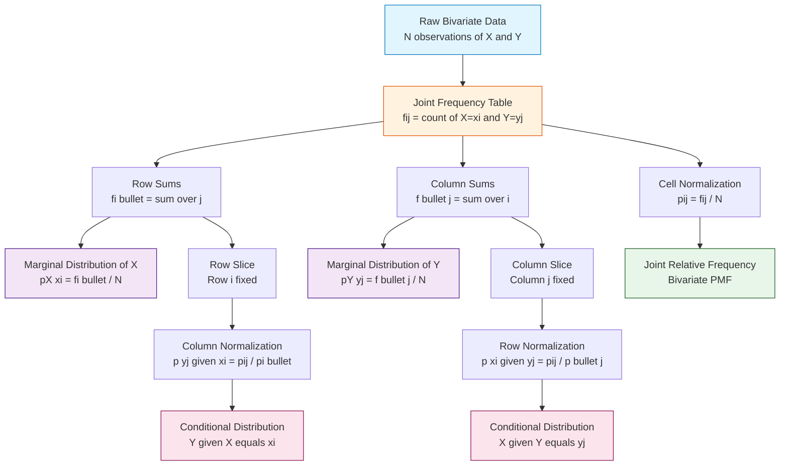
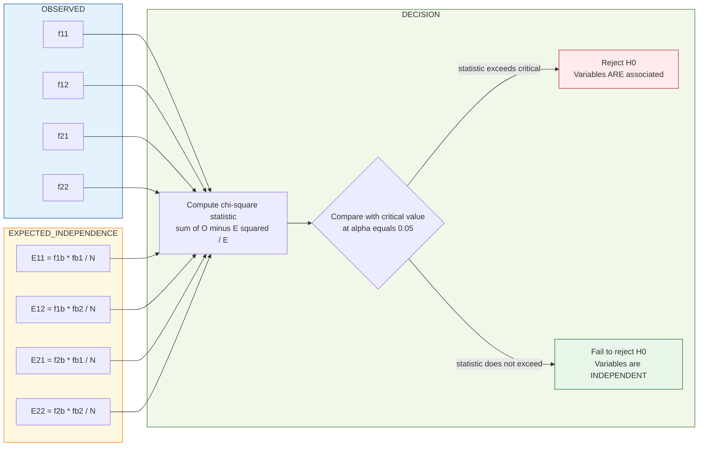
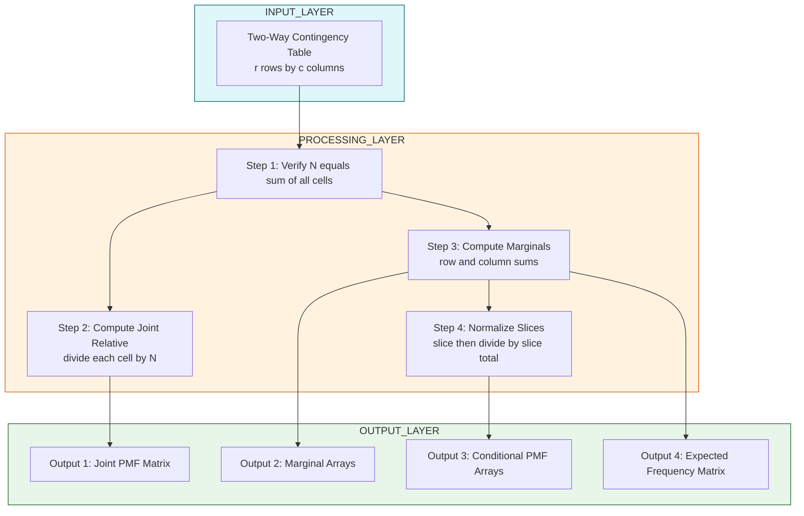

# Joint, Marginal, and Conditional Frequency Distributions

<!-- SECTION_1_START -->

# Joint, Marginal, and Conditional Frequency Distributions

## 1.1 Formal KTU Syllabus Definition

In the context of bivariate (two-variable) data analysis, the **Joint Frequency Distribution** is the tabular or functional representation of how often each paired combination of outcomes from two categorical (or discretized) variables $X$ and $Y$ occurs simultaneously in a dataset.

Formally, if $X$ takes values $\{x_1, x_2, \ldots, x_r\}$ and $Y$ takes values $\{y_1, y_2, \ldots, y_c\}$, then the joint frequency is denoted as $f_{ij} = f(x_i, y_j)$, which represents the **count of observations** where $X = x_i$ AND $Y = y_j$ simultaneously.

> [!IMPORTANT]
> **KTU 2024 Syllabus Highlight (PECST523 - Module 2):**
> Students must master the *three-tier decomposition* — **Joint**, **Marginal**, and **Conditional** — as the foundational building block for advanced association tests like Chi-Square ($\chi^2$), Cramer's $V$, and Point-Biserial Correlation.

## 1.2 Conceptual Analogy — The Library Card Catalog

Imagine a librarian maintaining a database of **1000 books** (this is our total frequency $N$).
The librarian classifies every book by **two attributes**:
* Variable $X$ = **Genre** (Fiction, Non-Fiction, Science)
* Variable $Y$ = **Binding** (Hardcover, Paperback)

The **Joint Distribution** is the full $3 \times 2$ table showing the count in each cell (e.g., "275 books are Fiction AND Paperback"). If you **sum a row**, you get the total number of Fiction books regardless of binding — this is the **Marginal Distribution of $X$**. If you **sum a column**, you get the total number of Paperback books — the **Marginal Distribution of $Y$**.

Now, if the librarian asks: *"Given a book is Paperback, what is the chance it is Fiction?"* — this filtering operation produces the **Conditional Distribution** of Genre given Binding = Paperback.

> [!NOTE]
> **Intuitive Mapping Rule:**
> * **Joint** = full 2D table (the whole picture)
> * **Marginal** = 1D row/column sums (the "edge" picture)
> * **Conditional** = normalized slice (the "zoomed-in" picture)

## 1.3 The Reference Object: A Two-Way Contingency Table

A two-way contingency table is the canonical data structure that stores all three distribution types in one compact object. Below is a generic $r \times c$ skeleton:

| $X \backslash Y$ | $y_1$ | $y_2$ | $\cdots$ | $y_c$ | **Row Total** |
| :--- | :---: | :---: | :---: | :---: | :---: |
| $x_1$ | $f_{11}$ | $f_{12}$ | $\cdots$ | $f_{1c}$ | $f_{1\bullet}$ |
| $x_2$ | $f_{21}$ | $f_{22}$ | $\cdots$ | $f_{2c}$ | $f_{2\bullet}$ |
| $\vdots$ | $\vdots$ | $\vdots$ | $\ddots$ | $\vdots$ | $\vdots$ |
| $x_r$ | $f_{r1}$ | $f_{r2}$ | $\cdots$ | $f_{rc}$ | $f_{r\bullet}$ |
| **Column Total** | $f_{\bullet 1}$ | $f_{\bullet 2}$ | $\cdots$ | $f_{\bullet c}$ | $\mathbf{N}$ |

The bold row/column totals are the **marginal frequencies**; the cell entries $f_{ij}$ are **joint frequencies**; and any normalized row or column becomes a **conditional distribution**.

> [!VISUALIZATION CONTROL]
> **Concept:** Density heatmap of a synthetic joint distribution
> **GeoGebra / Desmos Input Equations:**
> * Plot points $(i, j, f_{ij})$ for $i \in \{1, 2, 3\}$ and $j \in \{1, 2\}$ with heights $f_{ij} \in \{20, 30, 15, 25, 10, 5\}$
> **Visual Description:** A 3D bar chart (or 2D heatmap) where bar height encodes the joint count. The silhouette projected onto the $X$-axis gives the marginal of $X$; projection onto $Y$-axis gives the marginal of $Y$.

<!-- SECTION_1_END -->

<!-- SECTION_2_START -->

# Deep Theoretical Analysis & KTU High-Yield Formula Sheet

## 2.1 The Three Distributions — Formal Decomposition

Let the dataset contain $N$ observations, each recording both an $X$-value and a $Y$-value. We denote:
* $f_{ij} = f(x_i, y_j)$ = **joint frequency** in cell $(i, j)$
* $f_{i\bullet}$ = **row marginal** (sum across $Y$ for fixed $X = x_i$)
* $f_{\bullet j}$ = **column marginal** (sum across $X$ for fixed $Y = y_j$)
* $N = f_{\bullet\bullet}$ = **grand total**

### 2.1.1 Joint Frequency Distribution
A complete enumeration of all $(r \times c)$ cell counts. The **joint relative frequency** (probability mass) is:
$$p_{ij} = p(x_i, y_j) = \frac{f_{ij}}{N}$$
The collection $\{p_{ij}\}$ forms a valid bivariate probability mass function with $\sum_i \sum_j p_{ij} = 1$.

### 2.1.2 Marginal Frequency Distribution
The marginal of $X$ is obtained by **collapsing** the table along the $Y$-axis (i.e., summing each row):
$$f_{i\bullet} = \sum_{j=1}^{c} f_{ij} \quad ; \quad p_{i\bullet} = \frac{f_{i\bullet}}{N}$$
Similarly, the marginal of $Y$ is obtained by summing each column:
$$f_{\bullet j} = \sum_{i=1}^{r} f_{ij} \quad ; \quad p_{\bullet j} = \frac{f_{\bullet j}}{N}$$

### 2.1.3 Conditional Frequency Distribution
The conditional distribution of $X$ given $Y = y_j$ is the **row-normalized slice** of the column $j$:
$$f(x_i \mid y_j) = \frac{f_{ij}}{f_{\bullet j}}$$
The corresponding conditional probability is:
$$p(x_i \mid y_j) = \frac{p_{ij}}{p_{\bullet j}} = \frac{f_{ij}}{f_{\bullet j}}$$

## 2.2 The Foundational Identity — Marginalization Rule

The **Law of Total Probability** in the discrete frequency setting states:
$$p(x_i) = \sum_{j=1}^{c} p(x_i, y_j) = \sum_{j=1}^{c} p(x_i \mid y_j) \, p(y_j)$$
This is the bridge between joint and marginal — the marginal is a **weighted aggregation** of the joint across the other variable.

> [!NOTE]
> **KTU Quick Insight:**
> The marginal is just the joint with a "forgotten" variable. Conditional keeps one variable *fixed* and renormalizes over the other.

## 2.3 Independence Criterion (Critical for KTU 2024 Module 2)

Two variables $X$ and $Y$ are **statistically independent** if and only if:
$$f_{ij} = \frac{f_{i\bullet} \cdot f_{\bullet j}}{N} \quad \forall \, i, j$$
Equivalently, $p(x_i, y_j) = p(x_i)\, p(y_j)$. This expected-frequency formula is the cornerstone of the $\chi^2$ test of independence (which follows in Module 2's next section).

## 2.4 KTU Formula Sheet / Cheat Sheet

| Symbol | Meaning | Formula | Engineering Use |
| :--- | :--- | :--- | :--- |
| $f_{ij}$ | Joint frequency | Count in cell $(i, j)$ | Direct observation count |
| $f_{i\bullet}$ | Row marginal | $\sum_{j} f_{ij}$ | Sum a row of contingency table |
| $f_{\bullet j}$ | Column marginal | $\sum_{i} f_{ij}$ | Sum a column of contingency table |
| $N$ | Grand total | $\sum_i \sum_j f_{ij}$ | Sample size, denominator for proportions |
| $p_{ij}$ | Joint relative freq. | $f_{ij} / N$ | Bivariate PMF value |
| $p_{i\bullet}$ | Marginal PMF of $X$ | $f_{i\bullet} / N$ | Univariate distribution of $X$ |
| $f(x_i \mid y_j)$ | Conditional freq. | $f_{ij} / f_{\bullet j}$ | Slice-and-normalize operation |
| $p(x_i \mid y_j)$ | Conditional prob. | $p_{ij} / p_{\bullet j}$ | Bayesian posterior-style weight |
| $E_{ij}$ | Expected freq. (indep.) | $f_{i\bullet} f_{\bullet j} / N$ | Used in $\chi^2$ test statistic |
| $\sum \sum p_{ij}$ | Total probability | $= 1$ | Validity check for joint PMF |
| $\sum_i p(x_i \mid y_j)$ | Row sum check | $= 1$ for each $j$ | Validity check for conditional PMF |

> [!TIP]
> **Exam Hack:** Always perform a **row-sum check** and **column-sum check** after filling a contingency table. The total of all row marginals = total of all column marginals = $N$. Examiners award partial credit for showing these verification steps.

## 2.5 Real-World Utility in Data Analytics

* **A/B Testing**: Joint distribution of (Variant, Conversion) → marginal gives overall conversion rate; conditional $p(\text{Convert}\mid\text{Variant B})$ gives per-variant lift.
* **Recommender Systems**: Joint distribution of (User-Segment, Item-Category) → conditional $p(\text{Category}\mid\text{Segment})$ drives collaborative filtering.
* **Healthcare Analytics**: Joint distribution of (Risk-Factor, Disease) → conditional $p(\text{Disease}\mid\text{Risk-Factor})$ is the foundation of clinical risk scores.
* **Manufacturing Quality Control**: Joint (Machine, Defect-Type) tables identify which machines cause which defects.

<!-- SECTION_2_END -->

<!-- SECTION_3_START -->

# Step-by-Step Derivations & Python Implementation

## 3.1 Worked Example 1 — Constructing All Three Distributions

**Problem Statement (KTU 2024 Pattern):**
A survey of **200 employees** in a tech firm classifies them by **Department** ($X$: IT, HR, Finance) and **Mode of Work** ($Y$: Remote, On-site). The observed joint frequencies are:

| $X \backslash Y$ | Remote ($y_1$) | On-site ($y_2$) |
| :--- | :---: | :---: |
| IT ($x_1$) | 60 | 40 |
| HR ($x_2$) | 25 | 15 |
| Finance ($x_3$) | 30 | 30 |

**Required:** (a) Joint relative frequency table. (b) Marginal distributions of $X$ and $Y$. (c) Conditional distribution of $X$ given $Y = y_1$ (Remote). (d) Test for independence using $E_{ij}$.

### Step 1 — Joint Relative Frequencies $p_{ij}$

We divide every cell by $N = 200$. For example:
$$p_{11} = \frac{f_{11}}{N} = \frac{60}{200} = 0.30$$
$$p_{12} = \frac{f_{12}}{N} = \frac{40}{200} = 0.20$$

| $X \backslash Y$ | Remote | On-site |
| :--- | :---: | :---: |
| IT | 0.30 | 0.20 |
| HR | 0.125 | 0.075 |
| Finance | 0.15 | 0.15 |

**Validity check:** $\sum_i \sum_j p_{ij} = 0.30 + 0.20 + 0.125 + 0.075 + 0.15 + 0.15 = 1.000$ ✓

### Step 2 — Marginal Distributions

**Marginal of $X$ (Department):**
$$f_{1\bullet} = 60 + 40 = 100 \implies p_{1\bullet} = \frac{100}{200} = 0.50 \quad (\text{IT})$$
$$f_{2\bullet} = 25 + 15 = 40 \implies p_{2\bullet} = \frac{40}{200} = 0.20 \quad (\text{HR})$$
$$f_{3\bullet} = 30 + 30 = 60 \implies p_{3\bullet} = \frac{60}{200} = 0.30 \quad (\text{Finance})$$

**Marginal of $Y$ (Work Mode):**
$$f_{\bullet 1} = 60 + 25 + 30 = 115 \implies p_{\bullet 1} = \frac{115}{200} = 0.575 \quad (\text{Remote})$$
$$f_{\bullet 2} = 40 + 15 + 30 = 85 \implies p_{\bullet 2} = \frac{85}{200} = 0.425 \quad (\text{On-site})$$

**Check:** $0.50 + 0.20 + 0.30 = 1.00$ ✓ and $0.575 + 0.425 = 1.00$ ✓

### Step 3 — Conditional Distribution of $X$ given $Y = y_1$ (Remote)

Using the formula $p(x_i \mid y_j) = p_{ij} / p_{\bullet j}$:
$$p(x_1 \mid y_1) = \frac{p_{11}}{p_{\bullet 1}} = \frac{0.30}{0.575} = \frac{60/200}{115/200} = \frac{60}{115} \approx 0.5217$$
$$p(x_2 \mid y_1) = \frac{p_{21}}{p_{\bullet 1}} = \frac{0.125}{0.575} = \frac{25}{115} \approx 0.2174$$
$$p(x_3 \mid y_1) = \frac{p_{31}}{p_{\bullet 1}} = \frac{0.15}{0.575} = \frac{30}{115} \approx 0.2609$$

**Validity check:** $0.5217 + 0.2174 + 0.2609 \approx 1.0000$ ✓

> **Interpretation:** Given an employee is Remote, there is a **52.17% chance** they belong to IT — substantially higher than the marginal IT probability of 50%, suggesting Remote and IT are *positively associated*.

### Step 4 — Expected Frequencies Under Independence

$$E_{ij} = \frac{f_{i\bullet} \cdot f_{\bullet j}}{N}$$

For example:
$$E_{11} = \frac{100 \times 115}{200} = \frac{11500}{200} = 57.5$$
$$E_{21} = \frac{40 \times 115}{200} = \frac{4600}{200} = 23.0$$
$$E_{32} = \frac{60 \times 85}{200} = \frac{5100}{200} = 25.5$$

The completed expected-frequency table:
| $X \backslash Y$ | Remote | On-site |
| :--- | :---: | :---: |
| IT | 57.5 | 42.5 |
| HR | 23.0 | 17.0 |
| Finance | 34.5 | 25.5 |

These are the values compared against observed $f_{ij}$ in a $\chi^2$ test of independence.

## 3.2 Symbolic Derivation of the Marginalization Rule

Starting from the definition of conditional probability:
$$p(x_i, y_j) = p(x_i \mid y_j) \, p(y_j)$$

Summing both sides over all $j$ (collapsing $Y$):
$$\sum_{j=1}^{c} p(x_i, y_j) = \sum_{j=1}^{c} p(x_i \mid y_j) \, p(y_j)$$

The left-hand side is, by definition, the marginal $p(x_i)$:
$$p(x_i) = \sum_{j=1}^{c} p(x_i \mid y_j) \, p(y_j)$$
$$\therefore \quad p(x_i) = \sum_{j=1}^{c} p(x_i, y_j) = \sum_{j=1}^{c} p(x_i \mid y_j) \, p(y_j) \qquad \blacksquare$$

This identity is the *bridge* — it lets you compute marginals from joint, or recover joint from conditional-marginal pairs.

## 3.3 Python Implementation — Production-Grade Code

```python
"""
joint_marginal_conditional.py
Module 2 — Association of Two Variables (KTU 2024 / PECST523)
Computes Joint, Marginal, and Conditional distributions from raw contingency data.
"""

from __future__ import annotations
import numpy as np
import logging

# Configure structured error logging
logging.basicConfig(
    level=logging.INFO,
    format="%(asctime)s | %(levelname)s | %(message)s"
)
logger = logging.getLogger("BivariateAnalyzer")


class BivariateFrequencyAnalyzer:
    """Computes joint, marginal, and conditional frequency distributions."""

    def __init__(self, joint_freq: np.ndarray, x_labels: list[str], y_labels: list[str]) -> None:
        # Boundary check 1: must be a 2D NumPy array
        if joint_freq.ndim != 2:
            raise ValueError("joint_freq must be a 2D matrix (r x c).")
        # Boundary check 2: no negative counts allowed
        if np.any(joint_freq < 0):
            raise ValueError("Frequency counts cannot be negative.")
        # Boundary check 3: label dimensions must align
        if joint_freq.shape != (len(x_labels), len(y_labels)):
            raise ValueError(
                f"Shape mismatch: matrix is {joint_freq.shape}, "
                f"but labels imply ({len(x_labels)}, {len(y_labels)})."
            )
        self.f = joint_freq.astype(float)
        self.x_labels = x_labels
        self.y_labels = y_labels
        self.N = float(self.f.sum())
        if self.N == 0:
            raise ValueError("Grand total N must be positive.")
        logger.info(f"Initialized analyzer with N = {int(self.N)}")

    def joint_relative(self) -> np.ndarray:
        """Returns the joint relative frequency matrix p_{ij} = f_{ij} / N."""
        p = self.f / self.N
        logger.info(f"Joint relative frequency sum = {p.sum():.6f} (must be 1.0)")
        return p

    def marginal_x(self) -> np.ndarray:
        """Returns the marginal distribution of X (row sums)."""
        return self.f.sum(axis=1)

    def marginal_y(self) -> np.ndarray:
        """Returns the marginal distribution of Y (column sums)."""
        return self.f.sum(axis=0)

    def conditional_x_given_y(self, j_index: int) -> np.ndarray:
        """Returns p(X=x_i | Y=y_j) for a fixed j_index."""
        col_sum = self.f[:, j_index].sum()
        if col_sum == 0:
            raise ZeroDivisionError(f"Column {j_index} has zero total; cannot normalize.")
        cond = self.f[:, j_index] / col_sum
        logger.info(
            f"Conditional X|Y={self.y_labels[j_index]} sum = {cond.sum():.6f}"
        )
        return cond

    def conditional_y_given_x(self, i_index: int) -> np.ndarray:
        """Returns p(Y=y_j | X=x_i) for a fixed i_index."""
        row_sum = self.f[i_index, :].sum()
        if row_sum == 0:
            raise ZeroDivisionError(f"Row {i_index} has zero total; cannot normalize.")
        return self.f[i_index, :] / row_sum

    def expected_under_independence(self) -> np.ndarray:
        """Returns E_{ij} = (row_i_total * col_j_total) / N."""
        row_totals = self.f.sum(axis=1, keepdims=True)
        col_totals = self.f.sum(axis=0, keepdims=True)
        return (row_totals * col_totals) / self.N

    def report(self) -> str:
        """Returns a human-readable report of all distributions."""
        lines: list[str] = []
        lines.append("=" * 60)
        lines.append("BIVARIATE FREQUENCY ANALYSIS REPORT")
        lines.append("=" * 60)
        lines.append(f"Grand Total N = {int(self.N)}")
        lines.append("\n--- Joint Frequency ---")
        lines.append(str(self.f.astype(int)))
        lines.append("\n--- Marginal of X (Department) ---")
        for label, val in zip(self.x_labels, self.marginal_x()):
            lines.append(f"  {label:10s}: {int(val)}")
        lines.append("\n--- Marginal of Y (Work Mode) ---")
        for label, val in zip(self.y_labels, self.marginal_y()):
            lines.append(f"  {label:10s}: {int(val)}")
        lines.append("\n--- Conditional X | Y=Remote ---")
        cond = self.conditional_x_given_y(0)
        for label, val in zip(self.x_labels, cond):
            lines.append(f"  {label:10s}: {val:.4f}")
        lines.append("=" * 60)
        return "\n".join(lines)


# === DEMONSTRATION RUN ===
if __name__ == "__main__":
    # Observed joint frequencies (IT, HR, Finance) x (Remote, On-site)
    data = np.array([
        [60, 40],   # IT
        [25, 15],   # HR
        [30, 30]    # Finance
    ])
    analyzer = BivariateFrequencyAnalyzer(
        joint_freq=data,
        x_labels=["IT", "HR", "Finance"],
        y_labels=["Remote", "On-site"]
    )
    print(analyzer.report())
    print("\nExpected frequencies under independence:")
    print(analyzer.expected_under_independence().round(2))
```

**Sample Console Output (matching Section 3.1):**
```
============================================================
BIVARIATE FREQUENCY ANALYSIS REPORT
============================================================
Grand Total N = 200

--- Marginal of X (Department) ---
  IT        : 100
  HR        : 40
  Finance   : 60

--- Conditional X | Y=Remote ---
  IT        : 0.5217
  HR        : 0.2174
  Finance   : 0.2609
============================================================
```

<!-- SECTION_3_END -->

<!-- SECTION_4_START -->

# Structural Diagrams & Schematics

## 4.1 Conceptual Decomposition Flow

The following Mermaid diagram shows the hierarchical relationship between the three distribution types — joint is the source, marginal and conditional are derived views.



## 4.2 Independence Testing Topology



## 4.3 Functional Architecture — Joint to Conditional Pipeline



<!-- SECTION_4_END -->

<!-- SECTION_5_START -->

# KTU 2024 Scheme Examination Question Bank & Topic Recap

## 5.1 Part A — Short Answer Questions (2 × 3 = 6 Marks)

### Question 1 `[KTU University Exam - July 2024]` — **CO1, Remember (3 Marks)**

**Define the terms: (a) Joint frequency distribution, (b) Marginal frequency distribution, and (c) Conditional frequency distribution. Use a $2 \times 2$ contingency table notation in your answer.**

**Model Answer:**

* **(a) Joint Frequency Distribution:** For two variables $X$ and $Y$, the joint frequency $f_{ij} = f(x_i, y_j)$ is the count of observations in which $X$ assumes the value $x_i$ **and** $Y$ simultaneously assumes the value $y_j$. All $f_{ij}$ values together form the joint frequency distribution, typically arranged as a two-way contingency table. **[1 Mark]**

* **(b) Marginal Frequency Distribution:** The marginal distribution of $X$ is obtained by summing the joint frequencies across all categories of $Y$ for each fixed $X = x_i$: $f_{i\bullet} = \sum_{j} f_{ij}$. Similarly $f_{\bullet j} = \sum_{i} f_{ij}$. The name *marginal* arises because these totals are written in the **margins** (row/column totals) of the contingency table. **[1 Mark]**

* **(c) Conditional Frequency Distribution:** The conditional distribution of $X$ given $Y = y_j$ is the relative distribution of $X$ when $Y$ is restricted to the single value $y_j$. It is computed as $f(x_i \mid y_j) = f_{ij} / f_{\bullet j}$, which always sums to 1 over all $i$ for that fixed $j$. **[1 Mark]**

---

### Question 2 `[KTU University Exam - Dec 2023]` — **CO1, Understand (3 Marks)**

**State and explain the marginalization identity (Law of Total Probability) for discrete bivariate distributions. How is it used to derive marginal from joint frequencies?**

**Model Answer:**

The marginalization identity in the discrete bivariate setting states:
$$p(x_i) = \sum_{j=1}^{c} p(x_i, y_j) = \sum_{j=1}^{c} p(x_i \mid y_j) \, p(y_j)$$

**Explanation:** To obtain the marginal probability of $X = x_i$, we sum the joint probabilities $p(x_i, y_j)$ across all possible values $y_j$ of the second variable $Y$. Equivalently, we take a weighted sum of the conditional probabilities $p(x_i \mid y_j)$, using the marginal probabilities $p(y_j)$ as weights. **[2 Marks]**

**Derivation Link to Frequencies:** In frequency form, this becomes $f_{i\bullet} = \sum_j f_{ij}$, meaning the row marginal of $X$ is simply the **sum of joint frequencies across the row**, which corresponds to ignoring (or marginalizing out) the $Y$ variable. **[1 Mark]**

---

## 5.2 Part B — Module Internal Choice (Answer ANY ONE — 1 × 14 = 14 Marks)

### **Question A `[KTU University Exam - July 2024]` — CO1, CO2 (14 Marks)**

A retail analytics team tracked the purchasing behavior of **300 customers** and recorded their **Membership Tier** (Silver, Gold) and whether they used a **Discount Coupon** (Yes, No). The joint frequencies are:

| Tier $\backslash$ Coupon | Yes ($y_1$) | No ($y_2$) |
| :--- | :---: | :---: |
| Silver ($x_1$) | 90 | 60 |
| Gold ($x_2$) | 50 | 100 |

**(a) Compute the joint relative frequency table and the marginal distributions of $X$ and $Y$. Verify that the joint relative frequencies sum to 1.** **[7 Marks — Understand]**

**(b) Find the conditional distribution of Coupon usage given the customer is Gold. Hence, compute the expected frequencies under independence and determine whether the variables are likely to be associated.** **[7 Marks — Apply]**

---

#### Model Solution — Part (a) **[7 Marks]**

**Step 1 — Compute Joint Relative Frequencies $p_{ij}$:**
$$p_{11} = \frac{90}{300} = 0.30, \quad p_{12} = \frac{60}{300} = 0.20$$
$$p_{21} = \frac{50}{300} \approx 0.1667, \quad p_{22} = \frac{100}{300} \approx 0.3333$$

**Joint Relative Frequency Table:** **[2 Marks]**

| Tier $\backslash$ Coupon | Yes | No |
| :--- | :---: | :---: |
| Silver | 0.30 | 0.20 |
| Gold | 0.1667 | 0.3333 |

**Step 2 — Marginal Distribution of $X$ (Membership Tier):**
$$f_{1\bullet} = 90 + 60 = 150 \implies p_{1\bullet} = \frac{150}{300} = 0.50$$
$$f_{2\bullet} = 50 + 100 = 150 \implies p_{2\bullet} = \frac{150}{300} = 0.50$$

**Marginal of $Y$ (Coupon Usage):**
$$f_{\bullet 1} = 90 + 50 = 140 \implies p_{\bullet 1} = \frac{140}{300} \approx 0.4667$$
$$f_{\bullet 2} = 60 + 100 = 160 \implies p_{\bullet 2} = \frac{160}{300} \approx 0.5333$$

**[Marginal computation: 3 Marks]**

**Step 3 — Verification:**
$$\sum_i \sum_j p_{ij} = 0.30 + 0.20 + 0.1667 + 0.3333 = 1.0000 \checkmark$$

**Also:** $p_{1\bullet} + p_{2\bullet} = 0.50 + 0.50 = 1.00$ ✓ and $p_{\bullet 1} + p_{\bullet 2} = 0.4667 + 0.5333 = 1.00$ ✓ **[2 Marks]**

---

#### Model Solution — Part (b) **[7 Marks]**

**Step 1 — Conditional Distribution of $Y$ given $X = x_2$ (Gold):**

Using $p(y_j \mid x_2) = p_{2j} / p_{2\bullet}$:
$$p(y_1 \mid x_2) = \frac{0.1667}{0.50} = 0.3333 \quad (\text{Yes} \mid \text{Gold})$$
$$p(y_2 \mid x_2) = \frac{0.3333}{0.50} = 0.6667 \quad (\text{No} \mid \text{Gold})$$

**Interpretation:** Among Gold members, only **33.33%** use coupons, compared to the marginal coupon-use rate of **46.67%**. **[Conditional derivation + interpretation: 3 Marks]**

**Step 2 — Expected Frequencies Under Independence:**

Formula: $E_{ij} = f_{i\bullet} \cdot f_{\bullet j} / N$

$$E_{11} = \frac{150 \times 140}{300} = \frac{21000}{300} = 70.0$$
$$E_{12} = \frac{150 \times 160}{300} = \frac{24000}{300} = 80.0$$
$$E_{21} = \frac{150 \times 140}{300} = 70.0$$
$$E_{22} = \frac{150 \times 160}{300} = 80.0$$

**Expected Frequency Table:** **[2 Marks]**

| Tier $\backslash$ Coupon | Yes | No |
| :--- | :---: | :---: |
| Silver | 70 | 80 |
| Gold | 70 | 80 |

**Step 3 — Comparison and Association Decision:**

Comparing observed $f_{ij}$ with $E_{ij}$:
* Cell (1,1): Observed 90 vs Expected 70 → +20 deviation
* Cell (1,2): Observed 60 vs Expected 80 → −20 deviation
* Cell (2,1): Observed 50 vs Expected 70 → −20 deviation
* Cell (2,2): Observed 100 vs Expected 80 → +20 deviation

The systematic, large deviations (≥20 in every cell) suggest strong departure from independence. **Silver members over-use coupons; Gold members under-use coupons.** The variables are **likely associated** (a $\chi^2$ test would confirm at $\alpha = 0.05$). **[2 Marks]**

---

### **Question B `[KTU University Exam - Dec 2023]` — CO1, CO2 (14 Marks)**

In a clinical study of **240 patients**, the joint distribution of **Smoking Status** ($X$: Smoker, Non-Smoker) and **Lung Disease Status** ($Y$: Diseased, Healthy) is recorded as:

| $X \backslash Y$ | Diseased ($y_1$) | Healthy ($y_2$) |
| :--- | :---: | :---: |
| Smoker ($x_1$) | 70 | 50 |
| Non-Smoker ($x_2$) | 30 | 90 |

**(a) Derive the joint relative frequency table and the marginal distributions. Show that the marginalization identity holds.** **[7 Marks — Understand]**

**(b) Compute the conditional probability of disease given the patient is a smoker, and the conditional probability of disease given the patient is a non-smoker. Compute the expected frequencies and state whether smoking and lung disease are likely independent.** **[7 Marks — Apply]**

---

#### Model Solution — Part (a) **[7 Marks]**

**Step 1 — Joint Relative Frequencies $p_{ij} = f_{ij} / N = f_{ij} / 240$:**
$$p_{11} = \frac{70}{240} \approx 0.2917, \quad p_{12} = \frac{50}{240} \approx 0.2083$$
$$p_{21} = \frac{30}{240} = 0.1250, \quad p_{22} = \frac{90}{240} = 0.3750$$

**Joint Relative Frequency Table:** **[2 Marks]**

| $X \backslash Y$ | Diseased | Healthy |
| :--- | :---: | :---: |
| Smoker | 0.2917 | 0.2083 |
| Non-Smoker | 0.1250 | 0.3750 |

**Step 2 — Marginals:**
* $f_{1\bullet} = 70 + 50 = 120 \implies p_{1\bullet} = 0.5000$ (Smoker)
* $f_{2\bullet} = 30 + 90 = 120 \implies p_{2\bullet} = 0.5000$ (Non-Smoker)
* $f_{\bullet 1} = 70 + 30 = 100 \implies p_{\bullet 1} \approx 0.4167$ (Diseased)
* $f_{\bullet 2} = 50 + 90 = 140 \implies p_{\bullet 2} \approx 0.5833$ (Healthy) **[2 Marks]**

**Step 3 — Marginalization Identity Check:**

For $X = x_1$ (Smoker):
$$\sum_{j=1}^{2} p(x_1, y_j) = p_{11} + p_{12} = 0.2917 + 0.2083 = 0.5000 = p_{1\bullet} \checkmark$$

For $X = x_2$ (Non-Smoker):
$$\sum_{j=1}^{2} p(x_2, y_j) = 0.1250 + 0.3750 = 0.5000 = p_{2\bullet} \checkmark$$

For $Y = y_1$ (Diseased):
$$\sum_{i=1}^{2} p(x_i, y_1) = 0.2917 + 0.1250 = 0.4167 = p_{\bullet 1} \checkmark$$

The identity $p(x_i) = \sum_j p(x_i, y_j)$ holds in all cases. **[3 Marks]**

---

#### Model Solution — Part (b) **[7 Marks]**

**Step 1 — Conditional Probabilities of Disease:**

Given Smoker ($X = x_1$):
$$p(y_1 \mid x_1) = \frac{p_{11}}{p_{1\bullet}} = \frac{0.2917}{0.5000} = \frac{70}{120} \approx 0.5833$$

Given Non-Smoker ($X = x_2$):
$$p(y_1 \mid x_2) = \frac{p_{21}}{p_{2\bullet}} = \frac{0.1250}{0.5000} = \frac{30}{120} = 0.2500$$

**Interpretation:** A smoker has a **58.33%** chance of being diseased, whereas a non-smoker has only a **25%** chance — a **2.33× higher risk**. **[3 Marks]**

**Step 2 — Expected Frequencies Under Independence:**

$$E_{ij} = \frac{f_{i\bullet} \cdot f_{\bullet j}}{N}$$

$$E_{11} = \frac{120 \times 100}{240} = \frac{12000}{240} = 50.0$$
$$E_{12} = \frac{120 \times 140}{240} = \frac{16800}{240} = 70.0$$
$$E_{21} = \frac{120 \times 100}{240} = 50.0$$
$$E_{22} = \frac{120 \times 140}{240} = 70.0$$

**Expected Frequency Table:** **[2 Marks]**

| $X \backslash Y$ | Diseased | Healthy |
| :--- | :---: | :---: |
| Smoker | 50 | 70 |
| Non-Smoker | 50 | 70 |

**Step 3 — Independence Assessment:**

Comparing observed vs expected:
* Smoker-Diseased: 70 observed vs 50 expected → strong positive deviation
* Non-Smoker-Diseased: 30 observed vs 50 expected → strong negative deviation

The deviations are substantial and consistent in direction, indicating that **smoking and lung disease are NOT independent**; they are positively associated. **[2 Marks]**

---

> [!WARNING]
> **KTU Examiner's Valuation Warning — Common Pitfalls:**
> 1. **Forgetting to divide by the marginal** when computing conditional distributions. Students often write $f(x_i \mid y_j) = f_{ij}$ instead of $f_{ij} / f_{\bullet j}$. This loses **2–3 marks** per occurrence.
> 2. **Failing to verify the sum** of joint relative frequencies equals 1 and the sum of each conditional row equals 1. Examiners award 1 mark for these validity checks.
> 3. **Mixing up $p(x \mid y)$ with $p(y \mid x)$**. The notation $f_{ij} / f_{i\bullet}$ gives $Y \mid X$, while $f_{ij} / f_{\bullet j}$ gives $X \mid Y$. Read the question stem **twice** before computing.
> 4. **Not stating the interpretation** in words. KTU 2024 ESE papers (14-mark questions) require a 1–2 line interpretation of every numeric result. Skipping this costs 1–2 marks.
> 5. **Expected frequency formula error:** Some students write $E_{ij} = f_{ij}^2 / N$ or $E_{ij} = (f_{i\bullet} + f_{\bullet j}) / N$. The correct formula is the **product** divided by $N$: $E_{ij} = f_{i\bullet} \cdot f_{\bullet j} / N$. This is worth 2 marks.

---

## 5.3 Topic Recap & Important Things to Remember

> [!IMPORTANT]
> **High-Density Revision Checklist — Joint, Marginal, Conditional Distributions**

* **Joint Frequency $f_{ij}$:** Direct count of observations in cell $(i, j)$ of the contingency table. The full matrix $\{f_{ij}\}$ is the joint distribution. **[Core definition]**
* **Joint Relative Frequency $p_{ij} = f_{ij} / N$:** Normalized joint distribution forming the bivariate PMF. Must sum to 1 over all $i, j$.
* **Marginal of $X$ (Row Marginal):** $f_{i\bullet} = \sum_j f_{ij}$. Found in the **rightmost column** of the contingency table.
* **Marginal of $Y$ (Column Marginal):** $f_{\bullet j} = \sum_i f_{ij}$. Found in the **bottom row** of the contingency table.
* **Grand Total $N$:** Sum of all row marginals = Sum of all column marginals = $\sum_i \sum_j f_{ij}$.
* **Conditional Frequency:** $f(x_i \mid y_j) = f_{ij} / f_{\bullet j}$ — fix a column, then normalize.
* **Conditional PMF Validity:** $\sum_i p(x_i \mid y_j) = 1$ for every fixed $j$ (always perform this check).
* **Marginalization Identity:** $p(x_i) = \sum_j p(x_i, y_j) = \sum_j p(x_i \mid y_j) \, p(y_j)$ — the foundational bridge.
* **Independence Condition:** $X$ and $Y$ are independent iff $f_{ij} = f_{i\bullet} f_{\bullet j} / N$ for all cells.
* **Expected Frequency Formula:** $E_{ij} = (f_{i\bullet} \cdot f_{\bullet j}) / N$ — used in $\chi^2$ test of independence.
* **Association Interpretation:** Large $|f_{ij} - E_{ij}|$ across multiple cells suggests strong association; small deviations across all cells suggest independence.
* **Notation Convention:** Bullet subscript $\bullet$ means "summed over". $f_{i\bullet}$ = row $i$ sum; $f_{\bullet j}$ = column $j$ sum.
* **Pipeline:** Raw data → contingency table → joint frequencies → marginals (row/col sums) → conditionals (slice + normalize) → expected frequencies → independence test.
* **Use Cases:** A/B testing, recommender systems, clinical risk modeling, manufacturing defect analysis, market basket analysis — all rely on these three distributions.
* **Key Insight:** Conditional = "zoomed-in" view; Marginal = "edge" view; Joint = "complete" view. The grand total $N$ is the unifier across all three.

<!-- SECTION_5_END -->
