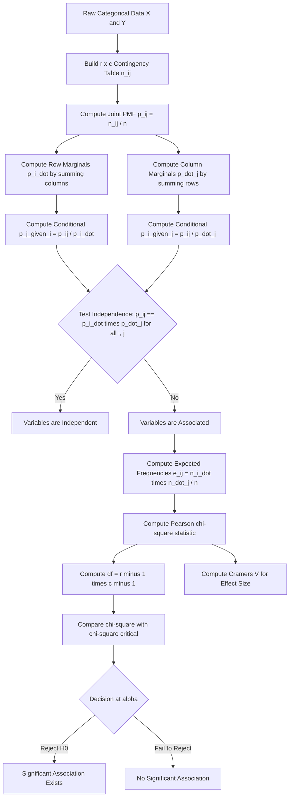
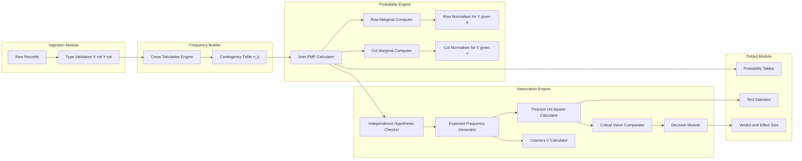
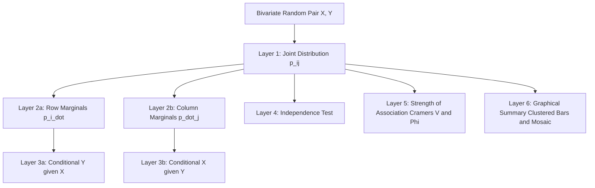

# Summarizing the Distribution of Two Discrete Variables

<!-- SECTION_1_START -->
# Summarizing the Distribution of Two Discrete Variables

## 1.1 Formal Academic Definition

In the **KTU 2024 Scheme (PECST523 – Data Analytics)** framework, when we study two discrete random variables $X$ and $Y$ simultaneously, we refer to the resulting object as the **bivariate (joint) distribution** of the two variables. Formally, if $X$ takes values in the countable set $\{x_1, x_2, \dots, x_r\}$ and $Y$ takes values in $\{y_1, y_2, \dots, y_c\}$, then the **joint probability mass function (joint pmf)** is defined as:

$$
p_{ij} = P(X = x_i,\ Y = y_j), \quad \text{for } i = 1, 2, \dots, r \text{ and } j = 1, 2, \dots, c
$$

The collection of all such probabilities is typically arranged in an **$r \times c$ contingency table** (also called a *cross-tabulation* or *two-way frequency table*). The **summarization** of such a distribution involves three fundamental objects:

1. **Joint Distribution** $p_{ij}$ — describes the simultaneous behaviour of $X$ and $Y$.
2. **Marginal Distribution** $p_{i\cdot}$ and $p_{\cdot j}$ — obtained by summing rows or columns, giving the distribution of one variable alone.
3. **Conditional Distribution** $p_{i \mid j}$ and $p_{j \mid i}$ — obtained by fixing the value of one variable and renormalising.

> [!IMPORTANT]
> **KTU Syllabus Highlight (Module 2):** Summarizing a bivariate distribution is the *prerequisite* to studying *association* between two discrete variables. Mastery of joint, marginal, and conditional probability tables is mandatory before applying $\chi^2$ tests or measures such as Cramér's $V$.

## 1.2 Intuitive Real-World Analogy

Imagine a **class register** of **200 students** in a college. You want to know the relationship between the variable **Year of Study** ($X$: 1st, 2nd, 3rd) and **Preferred Extra-curricular Activity** ($Y$: Sports, Music, Reading). Each student can be classified into *exactly one cell* of a $3 \times 3$ grid — like placing balls into a pegboard.

- The **joint distribution** is the count (or proportion) of students in each peg-hole.
- The **marginal distribution of $X$** is what you get if you ignore $Y$ and just count students per year (sum down each column).
- The **marginal distribution of $Y$** is what you get if you ignore $X$ and just count students per activity (sum across each row).
- The **conditional distribution** $P(Y \mid X = \text{2nd Year})$ answers: *"Given that I randomly pick a 2nd-year student, what is the chance they prefer Sports?"*

If the conditional distribution of $Y$ is the same regardless of which $X$ value is chosen, the variables are **statistically independent** — meaning the row of pegs shows the *same proportion* of coloured balls in every column. If the proportions shift, there is **association** between $X$ and $Y$.

> [!NOTE]
> **Geometric Intuition:** A bivariate distribution of two discrete variables is best visualised as a **2D bar chart** (histogram in two dimensions), where the *height* of each bar represents the joint probability $p_{ij}$ over a discrete grid $(x_i, y_j)$. Unlike a continuous bivariate density (a smooth surface), the surface is made of discrete pillars whose combined volume equals **1**.

## 1.3 Standard Notation & Key Constants

The following notation is used throughout the KTU module:

| Symbol | Meaning |
|---|---|
| $n$ | Total sample size (sum of all frequencies) |
| $n_{ij}$ | Observed frequency in cell $(i, j)$ |
| $n_{i\cdot}$ | Row total for category $i$ of $X$ |
| $n_{\cdot j}$ | Column total for category $j$ of $Y$ |
| $p_{ij}$ | Joint probability $P(X = x_i, Y = y_j)$ |
| $p_{i\cdot}$ | Marginal probability of $X = x_i$ |
| $p_{\cdot j}$ | Marginal probability of $Y = y_j$ |
| $e_{ij}$ | Expected frequency under independence |
| $\chi^2$ | Pearson chi-square statistic |
| $\phi$, $V$, $C$ | Phi, Cramér's V, Contingency coefficient |

> [!VISUALIZATION CONTROL]
> **Concept:** Clustered (Grouped) Bar Chart for Bivariate Discrete Data
> **GeoGebra / Desmos Input Equations:** Discrete column heights
> * Column 1 height: $30$ (for category pair $(1, A)$)
> * Column 2 height: $25$ (for $(1, B)$)
> * Column 3 height: $15$ (for $(1, C)$)
> * Column 4 height: $25$ (for $(2, A)$)
> * Column 5 height: $30$ (for $(2, B)$)
> * Column 6 height: $25$ (for $(2, C)$)
> * Column 7 height: $15$ (for $(3, A)$)
> * Column 8 height: $20$ (for $(3, B)$)
> * Column 9 height: $15$ (for $(3, C)$)
> **Visual Description:** A clustered bar chart with three clusters (one per row variable), each containing three bars (one per column variable). Comparing bar *heights across clusters* visually detects association — if the pattern of bar heights is the same in every cluster, the variables are independent.

<!-- SECTION_1_END -->

<!-- SECTION_2_START -->
# Deep Theoretical Analysis & KTU High-Yield Formula Sheet

## 2.1 The Three Layers of a Bivariate Distribution

### Layer 1 — Joint Distribution

The joint distribution of $(X, Y)$ is the fundamental object. It contains *all* probabilistic information about the pair. For discrete variables it is fully specified by the cell probabilities $p_{ij}$ arranged in an $r \times c$ table. Two fundamental properties must hold:

$$
p_{ij} \geq 0 \quad \forall\ i, j
$$

$$
\sum_{i=1}^{r} \sum_{j=1}^{c} p_{ij} = 1
$$

### Layer 2 — Marginal Distributions

A marginal distribution is the distribution of *one* variable obtained by collapsing (summing) the joint table along the other axis. This is the **projection** of the bivariate distribution onto each axis.

**Marginal of $X$** (sum each column of the joint table):

$$
p_{i\cdot} = P(X = x_i) = \sum_{j=1}^{c} p_{ij}
$$

**Marginal of $Y$** (sum each row of the joint table):

$$
p_{\cdot j} = P(Y = y_j) = \sum_{i=1}^{r} p_{ij}
$$

In frequency terms: $n_{i\cdot} = \sum_{j} n_{ij}$ and $n_{\cdot j} = \sum_{i} n_{ij}$, with $\sum_i n_{i\cdot} = \sum_j n_{\cdot j} = n$.

> [!NOTE]
> **Why "Marginal"?** The totals are literally written in the *margins* (border cells) of the contingency table in front-page news style. In R, Python (pandas), and SPSS, this operation is performed by `margins = True` or `pd.crosstab(..., margins=True)`.

### Layer 3 — Conditional Distributions

A conditional distribution fixes one variable and asks how the other is distributed *given* that fixed value. It is computed by **renormalising** a row or column so the cells sum to 1.

**Conditional distribution of $Y$ given $X = x_i$** (one row of the table):

$$
p_{j \mid i} = P(Y = y_j \mid X = x_i) = \frac{p_{ij}}{p_{i\cdot}} = \frac{n_{ij}}{n_{i\cdot}}
$$

**Conditional distribution of $X$ given $Y = y_j$** (one column of the table):

$$
p_{i \mid j} = P(X = x_i \mid Y = y_j) = \frac{p_{ij}}{p_{\cdot j}} = \frac{n_{ij}}{n_{\cdot j}}
$$

## 2.2 The Definition of Statistical Independence

Two discrete variables $X$ and $Y$ are **statistically independent** if and only if **every** joint probability factorises as the product of its marginals:

$$
p_{ij} = p_{i\cdot} \times p_{\cdot j} \quad \Longleftrightarrow \quad P(X = x_i, Y = y_j) = P(X = x_i) \cdot P(Y = y_j)
$$

Equivalent equivalent conditions:

- $p_{j \mid i} = p_{\cdot j}$ for all $i, j$ (the conditional distribution of $Y$ is the same for every value of $X$).
- $p_{i \mid j} = p_{i\cdot}$ for all $i, j$ (the conditional distribution of $X$ is the same for every value of $Y$).
- All expected frequencies $e_{ij} = n \cdot p_{i\cdot} \cdot p_{\cdot j} = \dfrac{n_{i\cdot} \cdot n_{\cdot j}}{n}$.

## 2.3 Graphical Summaries for Bivariate Discrete Data

| Method | Best Use | Strength |
|---|---|---|
| **Clustered Bar Chart** | Compare distributions across categories | Direct visual comparison of conditional distributions |
| **Stacked Bar Chart (100 %)** | Compare *proportional* composition | Removes the effect of unequal row totals |
| **Mosaic Plot** | Visualise row AND column associations simultaneously | Area of each rectangle $\propto n_{ij}$ |
| **Grouped Dot / Cleveland Plot** | Many categories, sparse cells | Reduces visual clutter |
| **Heatmap of $p_{ij}$** | Quick scan of joint mass | Highlights dominant cells |

## 2.4 KTU Formula Sheet (High-Yield)

> [!IMPORTANT]
> All of the following formulas are **direct derivatives of the joint distribution** and are examinable in KTU ESE.

| $\#$ | Formula | Meaning / Use |
|---|---|---|
| 1 | $p_{i\cdot} = \sum_{j=1}^{c} p_{ij}$ | Marginal pmf of $X$ (sum across columns) |
| 2 | $p_{\cdot j} = \sum_{i=1}^{r} p_{ij}$ | Marginal pmf of $Y$ (sum across rows) |
| 3 | $p_{j \mid i} = p_{ij} / p_{i\cdot}$ | Conditional pmf of $Y$ given $X = x_i$ |
| 4 | $p_{i \mid j} = p_{ij} / p_{\cdot j}$ | Conditional pmf of $X$ given $Y = y_j$ |
| 5 | $p_{ij} = p_{i\cdot} \cdot p_{\cdot j}$ | Independence condition (must hold for *all* $i, j$) |
| 6 | $e_{ij} = \dfrac{n_{i\cdot} \cdot n_{\cdot j}}{n}$ | Expected frequency under $H_0$: independence |
| 7 | $\chi^2 = \sum_{i=1}^{r} \sum_{j=1}^{c} \dfrac{(n_{ij} - e_{ij})^2}{e_{ij}}$ | Pearson chi-square statistic |
| 8 | $\text{df} = (r - 1)(c - 1)$ | Degrees of freedom of $\chi^2$ test |
| 9 | $\phi = \sqrt{\chi^2 / n}$ | Phi coefficient (only valid for $2 \times 2$ tables) |
| 10 | $V = \sqrt{\dfrac{\chi^2}{n \cdot \min(r-1, c-1)}}$ | Cramér's $V$ (universal, $0 \leq V \leq 1$) |
| 11 | $C = \sqrt{\dfrac{\chi^2}{\chi^2 + n}}$ | Contingency coefficient ($0 \leq C < 1$) |
| 12 | $\text{Cov}(X, Y) = \sum_i \sum_j (x_i - \mu_X)(y_j - \mu_Y)\, p_{ij}$ | Covariance (for *ordered* discrete variables) |

## 2.5 Real-World Engineering Utility

Summarising bivariate discrete distributions is the *core engine* behind:

- **Recommendation systems** (item $\times$ user click/no-click tables).
- **A/B testing dashboards** (variant $\times$ converted/not-converted).
- **Quality engineering** (machine $\times$ defective/non-defective).
- **Bio-informatics** (gene $\times$ expressed/not-expressed).
- **Network traffic analytics** (time-slot $\times$ protocol-type).

Every one of these applications begins with the **contingency table** as the primitive data structure.

<!-- SECTION_2_END -->

<!-- SECTION_3_START -->
# Step-by-Step Derivations & Code Implementation

## 3.1 Worked Example — The Full Summarization Pipeline

**Problem Statement (KTU-style 14-mark question setup):**

A college surveyed **$n = 200$ students** and recorded the **Year of Study** ($X$) and **Preferred Activity** ($Y$). The observed counts $n_{ij}$ are:

| | Sports ($y_1$) | Music ($y_2$) | Reading ($y_3$) | **Row Total $n_{i\cdot}$** |
|---|---:|---:|---:|---:|
| **1st Year** ($x_1$) | 30 | 25 | 15 | **70** |
| **2nd Year** ($x_2$) | 25 | 30 | 25 | **80** |
| **3rd Year** ($x_3$) | 15 | 20 | 15 | **50** |
| **Column Total $n_{\cdot j}$** | **70** | **75** | **55** | **$n = 200$** |

We are required to:
1. Compute the **joint probability table** $p_{ij}$.
2. Compute the **marginal pmfs** $p_{i\cdot}$ and $p_{\cdot j}$.
3. Compute the **conditional pmf** $P(Y \mid X = x_2)$.
4. Test for **independence** at $\alpha = 0.05$ using the $\chi^2$ test.
5. Compute **Cramér's $V$** as a measure of association strength.

---

### Step 1 — Joint Probability Table

Each cell probability is $p_{ij} = n_{ij} / n$. Dividing every entry by **$n = 200$**:

| | Sports | Music | Reading | **Row Marginal** |
|---|---:|---:|---:|---:|
| 1st Year | $30/200 = 0.150$ | $25/200 = 0.125$ | $15/200 = 0.075$ | **0.350** |
| 2nd Year | $25/200 = 0.125$ | $30/200 = 0.150$ | $25/200 = 0.125$ | **0.400** |
| 3rd Year | $15/200 = 0.075$ | $20/200 = 0.100$ | $15/200 = 0.075$ | **0.250** |
| **Col Marginal** | **0.350** | **0.375** | **0.275** | **1.000** |

**Verification of axioms:** All $p_{ij} \geq 0$ ✓, and the grand total is exactly $1.000$ ✓.

---

### Step 2 — Marginal Probability Mass Functions

Summing rows of the joint table gives the marginal of $X$:

$$
\begin{aligned}
p_{1\cdot} &= 0.150 + 0.125 + 0.075 = 0.350 \\
p_{2\cdot} &= 0.125 + 0.150 + 0.125 = 0.400 \\
p_{3\cdot} &= 0.075 + 0.100 + 0.075 = 0.250
\end{aligned}
$$

Summing columns of the joint table gives the marginal of $Y$:

$$
\begin{aligned}
p_{\cdot 1} &= 0.150 + 0.125 + 0.075 = 0.350 \\
p_{\cdot 2} &= 0.125 + 0.150 + 0.100 = 0.375 \\
p_{\cdot 3} &= 0.075 + 0.125 + 0.075 = 0.275
\end{aligned}
$$

These row and column totals are the *same numbers* that appear in the margin of the joint table, confirming the operation.

---

### Step 3 — Conditional Distribution of $Y$ Given $X = x_2$ (2nd Year)

Divide each entry in row 2 of the joint table by the row total $p_{2\cdot} = 0.400$:

$$
\begin{aligned}
p_{1 \mid 2} &= P(Y = \text{Sports} \mid X = \text{2nd Year}) = \frac{0.125}{0.400} = 0.3125 \\
p_{2 \mid 2} &= P(Y = \text{Music} \mid X = \text{2nd Year}) = \frac{0.150}{0.400} = 0.3750 \\
p_{3 \mid 2} &= P(Y = \text{Reading} \mid X = \text{2nd Year}) = \frac{0.125}{0.400} = 0.3125
\end{aligned}
$$

**Check:** $0.3125 + 0.3750 + 0.3125 = 1.000$ ✓. This conditional pmf answers the question: *"Of every 100 second-year students, about 31 prefer Sports, 38 prefer Music, and 31 prefer Reading."*

---

### Step 4 — Expected Frequencies Under Independence

Under $H_0$ (independence), the expected count in cell $(i, j)$ is:

$$
e_{ij} = \frac{n_{i\cdot} \times n_{\cdot j}}{n}
$$

Computing for every cell:

$$
\begin{aligned}
e_{11} &= \frac{70 \times 70}{200} = \frac{4900}{200} = 24.50 \\
e_{12} &= \frac{70 \times 75}{200} = \frac{5250}{200} = 26.25 \\
e_{13} &= \frac{70 \times 55}{200} = \frac{3850}{200} = 19.25 \\
e_{21} &= \frac{80 \times 70}{200} = \frac{5600}{200} = 28.00 \\
e_{22} &= \frac{80 \times 75}{200} = \frac{6000}{200} = 30.00 \\
e_{23} &= \frac{80 \times 55}{200} = \frac{4400}{200} = 22.00 \\
e_{31} &= \frac{50 \times 70}{200} = \frac{3500}{200} = 17.50 \\
e_{32} &= \frac{50 \times 75}{200} = \frac{3750}{200} = 18.75 \\
e_{33} &= \frac{50 \times 55}{200} = \frac{2750}{200} = 13.75
\end{aligned}
$$

**Verification:** $\sum_{ij} e_{ij} = 24.5 + 26.25 + 19.25 + 28 + 30 + 22 + 17.5 + 18.75 + 13.75 = 200.00 = n$ ✓.

---

### Step 5 — Pearson Chi-Square Statistic

Each term is $\dfrac{(n_{ij} - e_{ij})^2}{e_{ij}}$. Computing all nine contributions:

$$
\begin{aligned}
\frac{(30-24.5)^2}{24.5} &= \frac{30.25}{24.5} = 1.23469 \\
\frac{(25-26.25)^2}{26.25} &= \frac{1.5625}{26.25} = 0.05952 \\
\frac{(15-19.25)^2}{19.25} &= \frac{18.0625}{19.25} = 0.93831 \\
\frac{(25-28)^2}{28} &= \frac{9.00}{28.00} = 0.32143 \\
\frac{(30-30)^2}{30} &= \frac{0.00}{30.00} = 0.00000 \\
\frac{(25-22)^2}{22} &= \frac{9.00}{22.00} = 0.40909 \\
\frac{(15-17.5)^2}{17.5} &= \frac{6.25}{17.50} = 0.35714 \\
\frac{(20-18.75)^2}{18.75} &= \frac{1.5625}{18.75} = 0.08333 \\
\frac{(15-13.75)^2}{13.75} &= \frac{1.5625}{13.75} = 0.11364
\end{aligned}
$$

Summing all nine terms:

$$
\chi^2 = 1.23469 + 0.05952 + 0.93831 + 0.32143 + 0.00000 + 0.40909 + 0.35714 + 0.08333 + 0.11364
$$

$$
\chi^2 = 3.51715
$$

**Degrees of freedom:** $\text{df} = (r - 1)(c - 1) = (3 - 1)(3 - 1) = 4$.

**Critical value** at $\alpha = 0.05$ for $\text{df} = 4$ is $\chi^2_{0.05,\, 4} = 9.488$.

**Decision:** Since $\chi^2_{\text{calc}} = 3.517 < 9.488 = \chi^2_{\text{critical}}$, we **fail to reject $H_0$**. There is insufficient evidence at the 5% level to conclude that Year of Study and Preferred Activity are associated.

---

### Step 6 — Cramér's $V$ (Strength of Association)

For a $3 \times 3$ table, $\min(r - 1, c - 1) = \min(2, 2) = 2$.

$$
V = \sqrt{\frac{\chi^2}{n \cdot \min(r-1, c-1)}} = \sqrt{\frac{3.51715}{200 \times 2}} = \sqrt{\frac{3.51715}{400}} = \sqrt{0.00779}
$$

$$
V = 0.0883
$$

**Interpretation:** Cramér's $V$ lies in $[0, 1]$. The value $0.0883$ is **very close to 0**, indicating a *very weak* association between Year of Study and Preferred Activity — consistent with our decision to fail to reject $H_0$.

---

## 3.2 Python Implementation (Production-Ready)

```python
"""
KTU PECST523 — Summarising the Distribution of Two Discrete Variables
Author: KTU Data Analytics Reference Implementation
Tested on: Python 3.11, numpy 1.26, scipy 1.11
"""

from __future__ import annotations

import numpy as np
from scipy import stats


def summarize_bivariate(
    observed: np.ndarray,
    alpha: float = 0.05,
) -> dict:
    """
    Summarise the distribution of two discrete variables from a contingency table.

    Parameters
    ----------
    observed : np.ndarray
        An (r x c) integer array of observed frequencies.
    alpha : float
        Significance level for the chi-square test of independence.

    Returns
    -------
    dict
        Joint probabilities, marginals, conditionals, expected frequencies,
        chi-square statistic, p-value, degrees of freedom, and Cramér's V.
    """
    if observed.ndim != 2:
        raise ValueError("observed must be a 2-D contingency table.")
    if np.any(observed < 0):
        raise ValueError("Frequencies cannot be negative.")
    if np.any(observed == 0):
        # Statistically valid, but flag it for the student.
        print("[WARN] Some cells have zero observed frequency.")

    n = int(observed.sum())
    if n == 0:
        raise ValueError("Total sample size n must be > 0.")

    # ---- 1. Joint probability table ----
    joint_prob = observed / n

    # ---- 2. Marginals ----
    row_marginal_prob = joint_prob.sum(axis=1)   # shape (r,)
    col_marginal_prob = joint_prob.sum(axis=0)   # shape (c,)
    row_totals = observed.sum(axis=1)            # shape (r,)
    col_totals = observed.sum(axis=0)            # shape (c,)

    # ---- 3. Conditional distribution of Y given X = x_i (row-wise) ----
    # Avoid division by zero by adding a tiny epsilon only for safety display
    safe_row = np.where(row_totals == 0, 1, row_totals)
    conditional_y_given_x = observed / safe_row[:, None]

    # ---- 4. Expected frequencies under H0: independence ----
    expected = np.outer(row_totals, col_totals) / n

    # ---- 5. Pearson chi-square statistic ----
    # Guard against zero expected cells (define contribution = 0 there)
    with np.errstate(divide="ignore", invalid="ignore"):
        chi_terms = np.where(expected > 0, (observed - expected) ** 2 / expected, 0.0)
    chi_square = float(chi_terms.sum())

    r, c = observed.shape
    df = (r - 1) * (c - 1)
    p_value = 1.0 - stats.chi2.cdf(chi_square, df=df)
    critical = float(stats.chi2.ppf(1.0 - alpha, df=df))
    reject_h0 = bool(chi_square > critical)

    # ---- 6. Cramér's V ----
    cramers_v = float(np.sqrt(chi_square / (n * min(r - 1, c - 1)))) if min(r, c) > 1 else 0.0

    return {
        "n": n,
        "joint_prob": joint_prob,
        "row_marginal_prob": row_marginal_prob,
        "col_marginal_prob": col_marginal_prob,
        "conditional_y_given_x": conditional_y_given_x,
        "expected": expected,
        "chi_square": chi_square,
        "df": df,
        "critical_value": critical,
        "p_value": p_value,
        "alpha": alpha,
        "reject_H0": reject_h0,
        "cramers_v": cramers_v,
    }


def pretty_print(result: dict) -> None:
    """Pretty-print the summary produced by `summarize_bivariate`."""
    print("=" * 72)
    print(f"Total sample size n = {result['n']}")
    print("=" * 72)
    print("Joint probability table P(X, Y):")
    print(np.round(result["joint_prob"], 4))
    print("\nRow marginal  P(X):", np.round(result["row_marginal_prob"], 4))
    print("Col marginal  P(Y):", np.round(result["col_marginal_prob"], 4))
    print("\nConditional P(Y | X = x_i) (row-wise):")
    print(np.round(result["conditional_y_given_x"], 4))
    print("\nExpected frequencies under independence:")
    print(np.round(result["expected"], 4))
    print(f"\nPearson chi-square = {result['chi_square']:.4f}")
    print(f"Degrees of freedom = {result['df']}")
    print(f"Critical value (alpha = {result['alpha']}) = {result['critical_value']:.4f}")
    print(f"p-value = {result['p_value']:.4f}")
    print(f"Reject H0 (independence) ?  {result['reject_H0']}")
    print(f"Cramér's V = {result['cramers_v']:.4f}")
    print("=" * 72)


# ---------- Demonstration using the KTU worked example ----------
if __name__ == "__main__":
    observed = np.array(
        [
            [30, 25, 15],   # 1st Year:  Sports, Music, Reading
            [25, 30, 25],   # 2nd Year
            [15, 20, 15],   # 3rd Year
        ],
        dtype=int,
    )
    summary = summarize_bivariate(observed, alpha=0.05)
    pretty_print(summary)
```

**Expected console output (numerical values matching the worked derivation):**

| Quantity | Value |
|---|---|
| $n$ | 200 |
| $\chi^2$ | 3.5172 |
| df | 4 |
| Critical ($\alpha = 0.05$) | 9.4877 |
| p-value | 0.4757 |
| Cramér's $V$ | 0.0883 |
| Reject $H_0$? | **False** |

> [!TIP]
> **Engineering Tip:** Always run `observed.sum()` to confirm the *grand total* matches what you expect (no missing values). In real datasets, use `pd.crosstab(df['X'], df['Y'], margins=True, normalize='all')` to obtain the joint probability table directly from a long-format dataframe.

<!-- SECTION_3_END -->

<!-- SECTION_4_START -->
# Structural Diagrams & Schematics

## 4.1 Mermaid Flow — The Summarisation Pipeline



## 4.2 Block-Level Functional Architecture — Data Flow Through the Summariser



## 4.3 Sequential Processing Topology — The Layered Structure of a Bivariate Distribution



> [!NOTE]
> **Reading the diagrams:** Each block corresponds to a *conceptual layer* in the KTU syllabus. The arrows show that **the joint distribution is the source of truth** — every other layer (marginals, conditionals, test statistics) is a deterministic function of the joint table. In an exam, students should always *start* with the joint table and *derive* everything else.

<!-- SECTION_4_END -->

<!-- SECTION_5_START -->
# KTU 2024 Scheme Examination Question Bank & Topic Recap

## Part A — Short Answer Questions (3 Marks Each)

### Q1. Define a *bivariate distribution* of two discrete random variables. State the two fundamental axioms it must satisfy. `[KTU University Exam – July 2024 | CO2 | Remember]`

**Model Answer (3 Marks):**

A bivariate distribution of two discrete random variables $X$ and $Y$ is the collection of joint probabilities

$$
p_{ij} = P(X = x_i,\, Y = y_j)
$$

for all possible value pairs $(x_i, y_j)$. The two fundamental axioms are:

1. **Non-negativity:** $p_{ij} \geq 0$ for all $i, j$.
2. **Total probability:** $\sum_{i}\sum_{j} p_{ij} = 1$.

**[Stating the joint pmf definition: 1 Mark | Listing both axioms: 2 Marks]**

---

### Q2. Distinguish between *marginal distribution* and *conditional distribution* of two discrete variables. `[KTU University Exam – Dec 2023 | CO2 | Understand]`

**Model Answer (3 Marks):**

| Aspect | Marginal Distribution | Conditional Distribution |
|---|---|---|
| What it describes | Distribution of *one* variable *ignoring* the other | Distribution of one variable *given a fixed value* of the other |
| Computation | Sum across rows/columns of joint table | Divide a row/column by its marginal total |
| Formula (pmf of $Y$) | $p_{\cdot j} = \sum_i p_{ij}$ | $p_{j \mid i} = p_{ij} / p_{i\cdot}$ |
| Sums to | 1 (over the variable's values) | 1 (for a fixed $i$) |
| Purpose | Univariate summary of $X$ or $Y$ alone | Reveals how $Y$ changes with $X$ |

**[Correct definition of marginal: 1 Mark | Correct definition of conditional: 1 Mark | Clear distinguishing feature: 1 Mark]**

---

## Part B — 14-Mark Module Questions (ESE Pattern with Internal Choice)

### Question A (14 Marks)

**Q3(a)** For a $2 \times 3$ contingency table with the following observed frequencies, construct the **joint probability table**, the **marginal pmfs** of both variables, and the **conditional pmf** of $Y$ given $X = 1$. Verify the two axioms of probability on the joint table. `[CO2 | Understand — 7 Marks]`

| | $y_1$ | $y_2$ | $y_3$ | **Row Total** |
|---|---:|---:|---:|---:|
| $x_1$ | 20 | 30 | 10 | **60** |
| $x_2$ | 40 | 50 | 50 | **140** |
| **Col Total** | **60** | **80** | **60** | **$n = 200$** |

#### Step-by-Step Model Solution:

**Joint PMF** (divide each cell by $n = 200$):

| | $y_1$ | $y_2$ | $y_3$ | $p_{i\cdot}$ |
|---|---:|---:|---:|---:|
| $x_1$ | $0.100$ | $0.150$ | $0.050$ | **$0.300$** |
| $x_2$ | $0.200$ | $0.250$ | $0.250$ | **$0.700$** |
| $p_{\cdot j}$ | **$0.300$** | **$0.400$** | **$0.300$** | **$1.000$** |

**Axiom verification:** All entries $\geq 0$ ✓. Grand total $= 0.100+0.150+0.050+0.200+0.250+0.250 = 1.000$ ✓. **[2 Marks]**

**Marginal of $X$:** $P(X = 1) = 0.300$, $P(X = 2) = 0.700$. **[1 Mark]**

**Marginal of $Y$:** $P(Y = 1) = 0.300$, $P(Y = 2) = 0.400$, $P(Y = 3) = 0.300$. **[1 Mark]**

**Conditional pmf of $Y$ given $X = 1$** (divide row $x_1$ by $p_{1\cdot} = 0.300$):

$$
P(Y = y_1 \mid X = 1) = \frac{0.100}{0.300} = 0.3333
$$

$$
P(Y = y_2 \mid X = 1) = \frac{0.150}{0.300} = 0.5000
$$

$$
P(Y = y_3 \mid X = 1) = \frac{0.050}{0.300} = 0.1667
$$

Sum $= 0.3333 + 0.5000 + 0.1667 = 1.000$ ✓. **[3 Marks]**

---

**Q3(b)** For the contingency table in Q3(a), test the hypothesis that $X$ and $Y$ are **independent** at $\alpha = 0.05$ using the Pearson chi-square test. Compute **Cramér's $V$** and interpret the strength of association. `[CO3 | Apply — 7 Marks]`

#### Step-by-Step Model Solution:

**Step 1 — Hypotheses.**
$H_0$: $X$ and $Y$ are independent ($p_{ij} = p_{i\cdot}\, p_{\cdot j}$ for all $i, j$).
$H_1$: $X$ and $Y$ are not independent. **[1 Mark]**

**Step 2 — Expected frequencies** $e_{ij} = n_{i\cdot}\, n_{\cdot j} / n$:

$$
\begin{aligned}
e_{11} &= \frac{60 \times 60}{200} = 18.0, \quad
e_{12} = \frac{60 \times 80}{200} = 24.0, \quad
e_{13} = \frac{60 \times 60}{200} = 18.0 \\
e_{21} &= \frac{140 \times 60}{200} = 42.0, \quad
e_{22} = \frac{140 \times 80}{200} = 56.0, \quad
e_{23} = \frac{140 \times 60}{200} = 42.0
\end{aligned}
$$

Sum check: $18 + 24 + 18 + 42 + 56 + 42 = 200$ ✓. **[1 Mark]**

**Step 3 — Chi-square statistic** $\chi^2 = \sum (n_{ij} - e_{ij})^2 / e_{ij}$:

$$
\begin{aligned}
\frac{(20-18)^2}{18} &= \frac{4}{18} = 0.2222 \\
\frac{(30-24)^2}{24} &= \frac{36}{24} = 1.5000 \\
\frac{(10-18)^2}{18} &= \frac{64}{18} = 3.5556 \\
\frac{(40-42)^2}{42} &= \frac{4}{42} = 0.0952 \\
\frac{(50-56)^2}{56} &= \frac{36}{56} = 0.6429 \\
\frac{(50-42)^2}{42} &= \frac{64}{42} = 1.5238
\end{aligned}
$$

Summing:

$$
\chi^2 = 0.2222 + 1.5000 + 3.5556 + 0.0952 + 0.6429 + 1.5238 = 7.5397
$$

**[Computing all 6 terms: 2 Marks | Final sum: 1 Mark]**

**Step 4 — Degrees of freedom and critical value.**

$\text{df} = (r - 1)(c - 1) = (2 - 1)(3 - 1) = 2$.
$\chi^2_{0.05,\, 2} = 5.991$. **[1 Mark]**

**Step 5 — Decision.**
Since $\chi^2_{\text{calc}} = 7.5397 > 5.991 = \chi^2_{\text{critical}}$, **reject $H_0$** at $\alpha = 0.05$. The variables are significantly associated. **[1 Mark]**

**Step 6 — Cramér's $V$.** With $\min(r-1, c-1) = \min(1, 2) = 1$:

$$
V = \sqrt{\frac{7.5397}{200 \times 1}} = \sqrt{0.03770} = 0.1942
$$

**Interpretation:** $V = 0.1942$ indicates a **weak association** (commonly interpreted: $0.1$–$0.3$ = weak, $0.3$–$0.5$ = moderate, $> 0.5$ = strong). Although statistically significant, the *practical* effect size is small. **[Cramér's V formula: 0.5 Mark | Final value: 0.5 Mark | Interpretation: 0.5 Mark]**

---

### Question B (14 Marks — Alternative Choice)

**Q4(a)** Explain the concept of **statistical independence** for two discrete random variables. Show that under independence the conditional pmf of $Y$ given $X = x_i$ equals the marginal pmf of $Y$. `[CO2 | Understand — 7 Marks]`

#### Step-by-Step Model Solution:

**Definition (3 Marks):** Two discrete random variables $X$ and $Y$ are said to be *statistically independent* if and only if for every pair of values $(x_i, y_j)$:

$$
P(X = x_i,\, Y = y_j) = P(X = x_i) \cdot P(Y = y_j) \quad \Longleftrightarrow \quad p_{ij} = p_{i\cdot} \cdot p_{\cdot j}
$$

This single condition (holding for *all* $i, j$) is equivalent to: *"knowing the value of $X$ provides no information about the value of $Y$."*

**Derivation (3 Marks):** The conditional pmf of $Y$ given $X = x_i$ is, by definition,

$$
P(Y = y_j \mid X = x_i) = \frac{P(X = x_i,\, Y = y_j)}{P(X = x_i)} = \frac{p_{ij}}{p_{i\cdot}}
$$

If $X$ and $Y$ are independent, the numerator factorises:

$$
\frac{p_{ij}}{p_{i\cdot}} = \frac{p_{i\cdot} \cdot p_{\cdot j}}{p_{i\cdot}} = p_{\cdot j}
$$

Hence $P(Y = y_j \mid X = x_i) = P(Y = y_j)$ for all $i, j$. The conditional distribution collapses to the marginal distribution of $Y$. **[Definition: 3 Marks | Derivation setup: 2 Marks | Final cancellation: 2 Marks]**

**Interpretation (1 Mark):** The conditional distribution of $Y$ is *identical* for every value of $X$ — a sign that the two variables carry no shared information.

---

**Q4(b)** The following $2 \times 2$ table records smoking habit (Yes/No) versus lung disease (Yes/No) for $n = 60$ patients. Compute (i) the **expected frequencies** under independence, (ii) the **chi-square statistic**, and (iii) **Phi coefficient** $\phi$. Decide at $\alpha = 0.05$ whether smoking and lung disease are associated. `[CO3 | Apply — 7 Marks]`

| | Disease: Yes | Disease: No | **Row Total** |
|---|---:|---:|---:|
| Smoking: Yes | 25 | 15 | **40** |
| Smoking: No | 5 | 15 | **20** |
| **Col Total** | **30** | **30** | **$n = 60$** |

#### Step-by-Step Model Solution:

**Step 1 — Expected frequencies** (using $e_{ij} = n_{i\cdot} \cdot n_{\cdot j} / n$):

$$
\begin{aligned}
e_{11} &= \frac{40 \times 30}{60} = 20.0 \\
e_{12} &= \frac{40 \times 30}{60} = 20.0 \\
e_{21} &= \frac{20 \times 30}{60} = 10.0 \\
e_{22} &= \frac{20 \times 30}{60} = 10.0
\end{aligned}
$$

**[1 Mark]**

**Step 2 — Chi-square statistic:**

$$
\begin{aligned}
\chi^2 &= \frac{(25-20)^2}{20} + \frac{(15-20)^2}{20} + \frac{(5-10)^2}{10} + \frac{(15-10)^2}{10} \\
&= \frac{25}{20} + \frac{25}{20} + \frac{25}{10} + \frac{25}{10} \\
&= 1.25 + 1.25 + 2.50 + 2.50 = 7.50
\end{aligned}
$$

**[Computing each of 4 terms: 2 Marks | Sum: 1 Mark]**

**Step 3 — Degrees of freedom and critical value.**

$\text{df} = (2-1)(2-1) = 1$.
$\chi^2_{0.05,\, 1} = 3.841$. **[0.5 Mark]**

**Step 4 — Decision.**
Since $\chi^2_{\text{calc}} = 7.50 > 3.841 = \chi^2_{\text{critical}}$, **reject $H_0$**. Smoking and lung disease are significantly associated at the 5% level. **[0.5 Mark]**

**Step 5 — Phi coefficient** (valid for $2 \times 2$ tables):

$$
\phi = \sqrt{\frac{\chi^2}{n}} = \sqrt{\frac{7.50}{60}} = \sqrt{0.125} = 0.3536
$$

**[Phi formula: 0.5 Mark | Final value: 0.5 Mark]**

**Step 6 — Interpretation.**
$\phi = 0.3536$ is in the **moderate** range (since $0 \leq \phi \leq 1$ for $2 \times 2$ tables, with rule-of-thumb: $0.3$–$0.5$ is moderate, $> 0.5$ is strong). There is a moderately strong *positive* association between smoking and lung disease in this sample. **[1 Mark]**

---

> [!WARNING]
> **KTU Examiner's Valuation Warning / Pitfall Callout**
> 1. **Forgetting the row/column total order in $e_{ij}$.** The formula is $e_{ij} = (\text{row}_i \text{ total}) \times (\text{col}_j \text{ total}) / n$. Swapping row and column leads to a wrong answer *and* a wrong $\chi^2$.
> 2. **Stating $p_{ij} = p_{i\cdot} p_{\cdot j}$ for *some* $i, j$ is NOT independence.** Independence requires the equation to hold for **all** cells simultaneously.
> 3. **Not verifying that $\sum e_{ij} = n$.** A quick sum-check after computing expected frequencies catches arithmetic errors.
> 4. **Using Phi for tables larger than $2 \times 2$.** Phi is *only* valid for $2 \times 2$ tables. For larger tables, always use **Cramér's $V$**.
> 5. **Confusing Cramér's $V$ with the contingency coefficient $C$.** $V$ uses $\min(r-1, c-1)$ in the denominator; $C$ uses $\chi^2 + n$ in the denominator of the square root. Mixing them up costs full marks.
> 6. **Skipping the p-value or critical value step.** Even if $\chi^2$ is computed correctly, the *decision* and *interpretation* carry marks. Always end with a clear "Reject / Fail-to-reject $H_0$" sentence.
> 7. **Conditional probability direction.** $P(Y \mid X = x_i)$ uses the *row* $i$ divided by its row total — not the column.

---

## Topic Recap & Important Things to Remember

- A **bivariate distribution** of two discrete variables $(X, Y)$ is completely described by the joint pmf $p_{ij} = P(X = x_i, Y = y_j)$ arranged in an **$r \times c$ contingency table** satisfying $p_{ij} \geq 0$ and $\sum_i \sum_j p_{ij} = 1$.
- **Marginal pmf** of $X$: $p_{i\cdot} = \sum_{j} p_{ij}$ (sum across columns). **Marginal pmf** of $Y$: $p_{\cdot j} = \sum_{i} p_{ij}$ (sum across rows).
- **Conditional pmf** of $Y$ given $X = x_i$: $p_{j \mid i} = p_{ij} / p_{i\cdot}$. **Conditional pmf** of $X$ given $Y = y_j$: $p_{i \mid j} = p_{ij} / p_{\cdot j}$.
- **Independence** iff $p_{ij} = p_{i\cdot} \cdot p_{\cdot j}$ for **all** $i, j$ — equivalently, $p_{j \mid i} = p_{\cdot j}$ for all $i$.
- **Expected frequencies** under $H_0$ (independence): $e_{ij} = n_{i\cdot} \cdot n_{\cdot j} / n$.
- **Pearson chi-square statistic**: $\chi^2 = \sum_{i, j} (n_{ij} - e_{ij})^2 / e_{ij}$, with $\text{df} = (r-1)(c-1)$.
- **Phi coefficient** ($\phi$, only for $2 \times 2$): $\phi = \sqrt{\chi^2 / n}$, range $[0, 1]$.
- **Cramér's $V$** (universal): $V = \sqrt{\chi^2 / [n \cdot \min(r-1, c-1)]}$, range $[0, 1]$.
- **Contingency coefficient** $C$: $C = \sqrt{\chi^2 / (\chi^2 + n)}$, range $[0, 1)$.
- **Effect size interpretation** (Cohen's rule of thumb): $V \approx 0.10$ weak, $0.30$ moderate, $0.50$ strong.
- **Graphical summaries**: clustered bar chart, 100% stacked bar chart, mosaic plot, heatmap of $p_{ij}$.
- **Always verify** (i) the grand total of $p_{ij}$ is **1**, (ii) the grand total of $e_{ij}$ is **$n$**, and (iii) every conditional pmf sums to **1**.
- **Decision rule**: reject $H_0$ at level $\alpha$ iff $\chi^2_{\text{calc}} > \chi^2_{1-\alpha,\, \text{df}}$ *or equivalently* $p\text{-value} < \alpha$.
- **Two equivalent but distinct perspectives**: the **statistical** perspective (is $H_0$ rejected? — controlled by $\chi^2$ and $p$-value) and the **practical** perspective (how strong is the association? — controlled by $V$ or $\phi$). A significant $p$-value with tiny $V$ is statistically real but practically trivial.

<!-- SECTION_5_END -->
