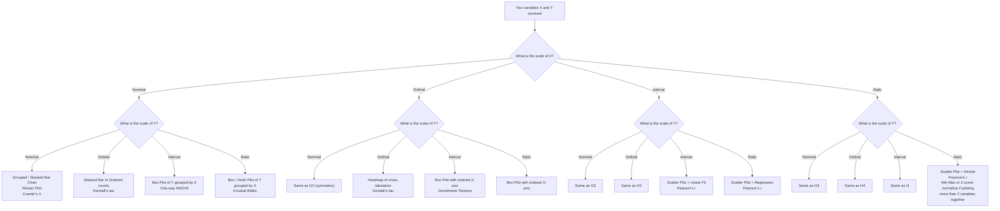
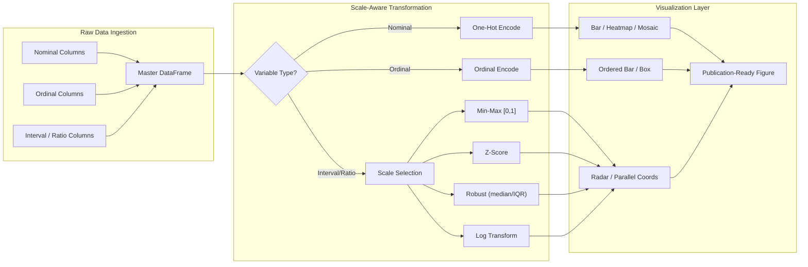
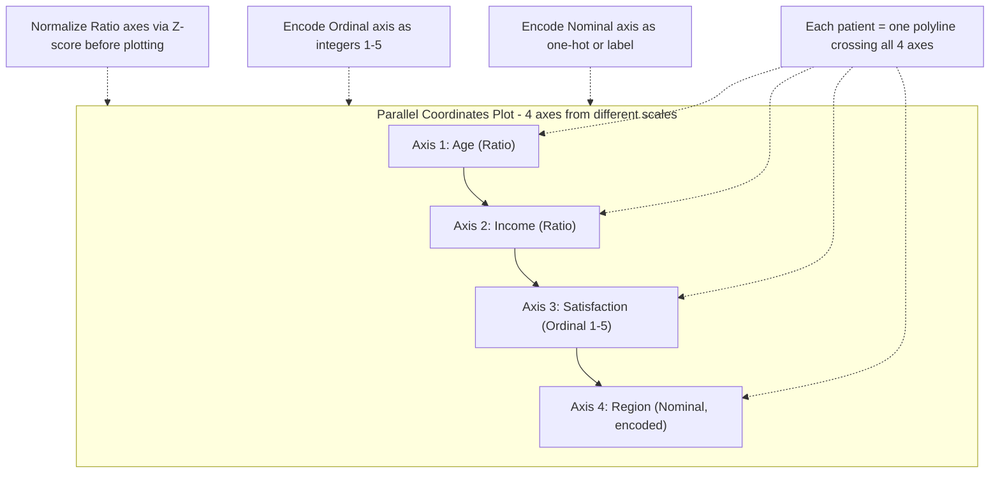

# Visualization of Variables from Different Scales.

<!-- SECTION_1_START -->

# Visualization of Variables from Different Scales

## 1.1 Core Academic Definition

In data analytics, **variables** are the measurable attributes or characteristics recorded for each observation in a dataset. These variables can exist on fundamentally different **scales of measurement** (also called levels of measurement), originally formalized by psychologist **Stanley Smith Stevens** in 1946. The four canonical scales are:

> [!IMPORTANT]
> **Scales of Measurement (Stevens, 1946)**
>
> 1. **Nominal Scale** – Categorical labels with no inherent order (e.g., gender, blood group, city).
> 2. **Ordinal Scale** – Categorical labels with a meaningful ranking but unequal/unspecified spacing (e.g., customer satisfaction: Poor < Fair < Good < Excellent).
> 3. **Interval Scale** – Numerical values with equal spacing but no true zero (e.g., temperature in °C, IQ scores, calendar years).
> 4. **Ratio Scale** – Numerical values with equal spacing AND a true absolute zero (e.g., height in cm, weight in kg, age, income).

**Visualization of variables from different scales** is the discipline of selecting, transforming, and arranging graphical representations so that **heterogeneous variables** (e.g., a person's age in years, salary in rupees, blood group as a label, and a satisfaction rating as an ordinal) can be **inspected, compared, and analyzed simultaneously** without misleading the viewer. The core challenge is that raw numerical magnitudes are not directly comparable when units, ranges, and statistical meaning differ.

### Intuitive Real-World Analogy

Imagine a medical dashboard that must display, on a **single screen**, four attributes of a patient: **age (years)**, **body temperature (°C)**, **blood group (A/B/AB/O)**, and **pain rating (0–10 Likert scale)**. If you naively plot all four as bar heights on the same axis, the blood group "A" (a label) becomes visually meaningless next to a temperature of 38.2 °C.

The solution is the same as a **currency exchange counter at an airport**: before you can compare dollars, euros, and yen, you first convert every amount into a common reference — for data, this common reference is typically a **normalized numerical scale** (e.g., z-scores, min-max scaling) or a **dedicated visual encoding** (color, position, shape) tailored to the data type.

> [!NOTE]
> **Why this matters in KTU 2024 / Data Analytics (PECST523):**
> Module 2 focuses on the *association of two variables*. Before you can compute correlation, run a regression, or build a chi-square test, you must first **understand and visualize the scale of each variable** — otherwise the chosen test statistic is mathematically invalid.

> [!VISUALIZATION CONTROL]
> **Concept:** Effect of Z-score Standardization on disparate scales
> **GeoGebra / Desmos Input Equations:**
> * `f(x) = (x - 173) / 10` (Height in cm → z-score; mean 173, std 10)
> * `g(x) = (x - 65000) / 15000` (Income in ₹ → z-score; mean 65k, std 15k)
> * `h(x) = (x - 36.6) / 0.7` (Body temperature in °C → z-score; mean 36.6, std 0.7)
>
> **Visual Description:** Plot three separate bell-shaped distributions on the same x-axis. Observe that although the original values live in totally different ranges (150–200 cm, 20k–150k ₹, 35–38 °C), after standardization all three distributions become **centered at 0 with spread roughly between −3 and +3**, making them visually and numerically comparable.

---

## 1.2 Visualization Strategy Overview

| Variable Pair Type | Recommended Primary Plot | Encoding Strategy |
|---|---|---|
| Nominal vs Nominal | Grouped / Stacked Bar Chart, Mosaic Plot | Color + Position |
| Nominal vs Ordinal | Bar Chart with ordered categories | Length of bar |
| Nominal vs Interval/Ratio | Box Plot, Violin Plot, Strip Plot | Position (Y) + Category (X) |
| Ordinal vs Ordinal | Heatmap of cross-tabulation | Color intensity |
| Ordinal vs Interval/Ratio | Box Plot ordered by ordinal level | Position + Order |
| Interval/Ratio vs Interval/Ratio | Scatter Plot, Hexbin, 2D Density | X-Y Cartesian position |
| Many mixed variables | Parallel Coordinates, Radar Chart, Heatmap | Multiple axes / Color |

---

<!-- SECTION_1_END -->

<!-- SECTION_2_START -->

# Deep Theoretical Analysis & KTU High-Yield Formula Sheet

## 2.1 The Four Scales — Theoretical Decomposition

### 2.1.1 Nominal Scale
- **Mathematical operations allowed:** Counting, mode, frequency.
- **Operations NOT allowed:** Addition, subtraction, mean, median, correlation coefficient (Pearson's).
- **Visual encodings:** Color, position (categorical axis), pie slices, bar segments.
- **Example:** Gender ∈ {Male, Female, Other}, Department ∈ {CSE, ECE, MECH}.

### 2.1.2 Ordinal Scale
- **Mathematical operations allowed:** Counting, mode, median, rank, Spearman's ρ, Kendall's τ.
- **Operations NOT allowed:** True mean, subtraction of categories.
- **Visual encodings:** Ordered bar chart, stacked Likert plot, dot plot with rank axis.
- **Example:** Education ∈ {High School < Bachelor's < Master's < PhD}, Likert 1–5.

### 2.1.3 Interval Scale
- **Mathematical operations allowed:** All of ordinal PLUS addition, subtraction, mean, standard deviation, Pearson's r.
- **Operations NOT allowed:** True ratio, multiplication by zero is meaningful (because there is no absolute zero).
- **Visual encodings:** Line chart, scatter plot, histogram.
- **Example:** Temperature in °C, IQ score, calendar year (e.g., 1990).

### 2.1.4 Ratio Scale
- **Mathematical operations allowed:** All arithmetic, including multiplication/division, geometric mean, coefficient of variation.
- **Visual encodings:** Histogram, scatter, log-scale plots (for wide ranges).
- **Example:** Height, weight, age, income, response time, sales count.

> [!IMPORTANT]
> **Rule of Thumb (KTU Board Expectation):**
> Always declare the scale of measurement *before* choosing both a visualization AND a statistical test. This is a 2-mark valuation item on its own.

---

## 2.2 The "Different Scales" Problem

When two (or more) variables are visualized together, three concrete problems arise:

1. **Unit Mismatch** — Height in cm (100–200) vs Weight in kg (40–120) vs Age in years (0–90). On a shared axis, the height variable visually dominates.
2. **Range / Spread Mismatch** — A variable with std = 1 and another with std = 10 000 cannot share an axis without transformation.
3. **Type Mismatch** — A nominal label (city name) cannot even be placed on a numerical axis.

### 2.3 Standard Rescaling Techniques (Pre-Visualization)

> [!NOTE]
> These transformations are **mandatory pre-processing** before any joint visualization of ratio/interval variables that share a single axis (e.g., radar chart, parallel coordinates).

#### 2.3.1 Min-Max Normalization (a.k.a. Rescaling to [0, 1])

For a variable $X$ with observed minimum $\min(X)$ and maximum $\max(X)$:

$$
X_{\text{norm}} = \frac{X - \min(X)}{\max(X) - \min(X)}
$$

This linearly compresses every value into the closed interval $[0, 1]$. Preserves the **shape** of the distribution. Sensitive to outliers because $\min$ and $\max$ are themselves outlier-prone.

#### 2.3.2 Z-Score Standardization

For a variable $X$ with sample mean $\bar{X}$ and sample standard deviation $s$:

$$
Z = \frac{X - \bar{X}}{s}
$$

Resulting distribution has **mean 0** and **standard deviation 1**. This is the most common technique used before principal component analysis (PCA), radar charts, and parallel coordinates plots. Outlier-resistant variants exist (Robust Scaler using median and IQR).

#### 2.3.3 Robust Scaling (Median / IQR)

$$
X_{\text{robust}} = \frac{X - \text{median}(X)}{\text{IQR}(X)} \quad \text{where} \quad \text{IQR}(X) = Q_3(X) - Q_1(X)
$$

Preferred when the dataset contains extreme outliers (e.g., income data).

#### 2.3.4 Log Transformation (for heavy-tailed ratio data)

$$
X_{\log} = \log_{10}(X) \quad \text{or} \quad X_{\ln} = \ln(X)
$$

Compresses multiplicative ranges into additive ranges. Essential for **income, population, file sizes, network traffic, social-network follower counts**.

#### 2.3.5 Categorical Encoding (for nominal / ordinal)

- **One-Hot Encoding:** Creates $k$ binary columns for $k$ categories.
- **Ordinal Encoding:** Maps ordered categories to integers (1, 2, 3, …) — *only* valid when order is meaningful.
- **Target Encoding:** Replaces each category with the mean of the target variable for that category.

---

## 2.4 KTU Formula Sheet / Cheat Sheet

| # | Concept | Formula / Rule | When to Use |
|---|---|---|---|
| 1 | Min-Max Normalization | $X_{\text{norm}} = (X - \min(X)) / (\max(X) - \min(X))$ | Bounded range needed, e.g., image pixels, neural-network inputs |
| 2 | Z-Score Standardization | $Z = (X - \bar{X}) / s$ | Most generic, especially before PCA, k-means, radar charts |
| 3 | Robust Scaling | $X_r = (X - \text{median}(X)) / \text{IQR}(X)$ | Data with heavy outliers (salary, house prices) |
| 4 | Log Transform | $X_{\log} = \log_{10}(X)$ | Right-skewed ratio data spanning > 2 orders of magnitude |
| 5 | Box-Cox Transform | $X^{(\lambda)} = (X^{\lambda} - 1)/\lambda$ for $\lambda \neq 0$; $\ln(X)$ for $\lambda = 0$ | To make data approximately normal |
| 6 | Nominal → Numerical | One-Hot / Dummy Encoding (k binary columns) | Categorical input for ML models |
| 7 | Ordinal → Numerical | Integer mapping preserving rank | Ordered categories like {Low, Med, High} |
| 8 | Pearson's r (allowed scales) | Interval × Interval, Ratio × Ratio | Linear association only |
| 9 | Spearman's ρ (allowed scales) | Ordinal × anything, monotonic non-linear | Rank-based association |
| 10 | Cramér's V (allowed scales) | Nominal × Nominal | Chi-square based association strength |

> [!NOTE]
> **Critical KTU Pitfall:** Pearson's correlation coefficient $r$ is **mathematically defined only for interval or ratio scales**. Using $r$ on nominal or ordinal data is an automatic mark deduction.

---

## 2.5 Real-World Utility in Engineering & Computer Science

| Domain | Variable 1 (Scale) | Variable 2 (Scale) | Visualization Used |
|---|---|---|---|
| Healthcare Analytics | Blood Pressure mmHg (Ratio) | Diabetes Yes/No (Nominal) | Box plot, Strip plot |
| Financial Analytics | Daily Closing Price ₹ (Ratio) | Market Sentiment Bull/Bear (Nominal) | Candlestick + color overlay |
| IoT / Sensor Data | Temperature °C (Interval) | Humidity % (Ratio) | Dual-axis time-series with normalization |
| Recommender Systems | User Age (Ratio) | Movie Genre (Nominal) | Heatmap of one-hot vs age-bucket |
| Network Security | Packet Size bytes (Ratio) | Attack Type (Nominal) | Violin plot per category |
| A/B Testing | Conversion Rate (Ratio) | Test Variant A/B (Nominal) | Confidence interval bar chart |

---

<!-- SECTION_2_END -->

<!-- SECTION_3_START -->

# Step-by-Step Derivations & Code Implementation

## 3.1 Worked Numerical Example — Standardizing Three Ratio Variables

Suppose a small dataset of 5 patients contains:

| Patient | Age (years) | Income (₹) | Cholesterol (mg/dL) |
|---|---|---|---|
| P1 | 25 | 30 000 | 180 |
| P2 | 40 | 60 000 | 200 |
| P3 | 35 | 50 000 | 190 |
| P4 | 50 | 90 000 | 220 |
| P5 | 30 | 40 000 | 185 |

**Step 1: Compute means.**

For Age: $\bar{X}_{\text{age}} = (25 + 40 + 35 + 50 + 30)/5 = 180/5 = 36$

For Income: $\bar{X}_{\text{inc}} = (30\,000 + 60\,000 + 50\,000 + 90\,000 + 40\,000)/5 = 270\,000/5 = 54\,000$

For Cholesterol: $\bar{X}_{\text{chol}} = (180 + 200 + 190 + 220 + 185)/5 = 975/5 = 195$

**Step 2: Compute sample standard deviations using** $s = \sqrt{\frac{\sum (X_i - \bar{X})^2}{n - 1}}$.

For Age:
- Deviations: $-11, 4, -1, 14, -6$
- Squared deviations: $121, 16, 1, 196, 36$
- Sum: $370$
- $s_{\text{age}} = \sqrt{370 / 4} = \sqrt{92.5} \approx 9.6177$

For Income:
- Deviations: $-24\,000,\; 6\,000,\; -4\,000,\; 36\,000,\; -14\,000$
- Squared deviations: $5.76 \times 10^{8},\; 3.6 \times 10^{7},\; 1.6 \times 10^{7},\; 1.296 \times 10^{9},\; 1.96 \times 10^{8}$
- Sum: $2.176 \times 10^{9}$
- $s_{\text{inc}} = \sqrt{2.176 \times 10^{9} / 4} = \sqrt{5.44 \times 10^{8}} \approx 23\,323.8$

For Cholesterol:
- Deviations: $-15, 5, -5, 25, -10$
- Squared deviations: $225, 25, 25, 625, 100$
- Sum: $1000$
- $s_{\text{chol}} = \sqrt{1000 / 4} = \sqrt{250} \approx 15.8114$

**Step 3: Compute z-scores using** $Z_i = (X_i - \bar{X}) / s$.

For Patient P1 (Age 25):
$$Z_{\text{age, P1}} = (25 - 36) / 9.6177 = -11 / 9.6177 \approx -1.1436$$

For Patient P1 (Income 30 000):
$$Z_{\text{inc, P1}} = (30\,000 - 54\,000) / 23\,323.8 = -24\,000 / 23\,323.8 \approx -1.0289$$

For Patient P1 (Cholesterol 180):
$$Z_{\text{chol, P1}} = (180 - 195) / 15.8114 = -15 / 15.8114 \approx -0.9487$$

**Step 4: Final standardized table.**

| Patient | $Z_{\text{age}}$ | $Z_{\text{inc}}$ | $Z_{\text{chol}}$ |
|---|---|---|---|
| P1 | $-1.1436$ | $-1.0289$ | $-0.9487$ |
| P2 | $0.4159$  | $0.2572$  | $0.3162$  |
| P3 | $-0.1039$ | $-0.1715$ | $-0.3162$ |
| P4 | $1.4556$  | $1.5434$  | $1.5811$  |
| P5 | $-0.6239$ | $-0.6002$ | $-0.6325$ |

All three variables now share the same scale (centered at 0, std ≈ 1) and can be plotted on a common axis (radar chart, parallel coordinates) without one dominating.

---

## 3.2 Min-Max Normalization — Symbolic Derivation

Given $X$ with values in the range $[\min(X), \max(X)]$ and target range $[a, b]$ (commonly $[0, 1]$):

$$
X' = a + \frac{(X - \min(X)) \cdot (b - a)}{\max(X) - \min(X)}
$$

**Derivation steps:**

1. Shift minimum to origin: $U = X - \min(X)$. Now $U \in [0, \max(X) - \min(X)]$.
2. Scale to unit interval: $V = U / (\max(X) - \min(X))$. Now $V \in [0, 1]$.
3. Stretch to target range: $X' = a + V \cdot (b - a) = a + \frac{(X - \min(X))(b - a)}{\max(X) - \min(X)}$.

---

## 3.3 Python Implementation — Complete Operational Code

```python
"""
KTU PECST523 - Module 2
Visualization of Variables from Different Scales
Fully operational Python code with type hints and error handling.
"""

import numpy as np
import pandas as pd
import matplotlib.pyplot as plt
import seaborn as sns
from sklearn.preprocessing import MinMaxScaler, StandardScaler, RobustScaler

# ------------------------------------------------------------------
# 1. Construct a heterogeneous-scale dataset
# ------------------------------------------------------------------
data = pd.DataFrame({
    "Patient":            ["P1", "P2", "P3", "P4", "P5", "P6", "P7", "P8"],
    "Age_Years":          [25,   40,   35,   50,   30,   45,   60,   28],   # Ratio
    "Income_INR":         [30000, 60000, 50000, 90000, 40000, 75000, 120000, 35000],  # Ratio
    "Cholesterol_mgdL":   [180,  200,  190,  220,  185,  210,  240,  178],  # Ratio
    "Pain_Likert_1to10":  [3,    6,    5,    8,    4,    7,    9,    2],    # Ordinal (numeric)
    "BloodGroup":         ["A",  "O",  "B",  "AB", "O",  "A",  "B",  "O"], # Nominal
})

print("Raw mixed-scale dataset:")
print(data)

# ------------------------------------------------------------------
# 2. Standardize ratio variables (Z-score)
# ------------------------------------------------------------------
ratio_cols = ["Age_Years", "Income_INR", "Cholesterol_mgdL"]
scaler_z   = StandardScaler()
z_scores   = scaler_z.fit_transform(data[ratio_cols])
data_z     = pd.DataFrame(z_scores, columns=[c + "_Z" for c in ratio_cols])

# ------------------------------------------------------------------
# 3. Min-Max normalize for [0, 1] view
# ------------------------------------------------------------------
scaler_mm  = MinMaxScaler()
mm_values  = scaler_mm.fit_transform(data[ratio_cols])
data_mm    = pd.DataFrame(mm_values, columns=[c + "_MM" for c in ratio_cols])

# ------------------------------------------------------------------
# 4. Robust scale (median / IQR)
# ------------------------------------------------------------------
scaler_r   = RobustScaler()
r_values   = scaler_r.fit_transform(data[ratio_cols])
data_r     = pd.DataFrame(r_values, columns=[c + "_Robust" for c in ratio_cols])

print("\nZ-score standardized (mean ≈ 0, std ≈ 1):")
print(data_z.round(3))

print("\nMin-max normalized to [0, 1]:")
print(data_mm.round(3))

print("\nRobust scaled (median ≈ 0, IQR ≈ 1):")
print(data_r.round(3))

# ------------------------------------------------------------------
# 5. Visualization Suite
# ------------------------------------------------------------------
fig, axes = plt.subplots(2, 2, figsize=(14, 10))

# (a) Raw boxplot — note scale mismatch on Y-axis
data[ratio_cols].boxplot(ax=axes[0, 0])
axes[0, 0].set_title("(a) RAW boxplot — scales are NOT comparable")
axes[0, 0].set_ylabel("Original units")

# (b) Z-score boxplot — comparable scales
data_z.boxplot(ax=axes[0, 1])
axes[0, 1].set_title("(b) Z-SCORE boxplot — comparable")
axes[0, 1].set_ylabel("Standard deviations from mean")

# (c) Min-Max boxplot — all in [0, 1]
data_mm.boxplot(ax=axes[1, 0])
axes[1, 0].set_title("(c) MIN-MAX normalized [0, 1]")
axes[1, 0].set_ylabel("Scaled value")

# (d) Heatmap of correlation among ratio variables (z-scored)
sns.heatmap(data_z.corr(), annot=True, cmap="coolwarm", vmin=-1, vmax=1, ax=axes[1, 1])
axes[1, 1].set_title("(d) Correlation heatmap of Z-scored variables")

plt.tight_layout()
plt.savefig("mixed_scale_visualization.png", dpi=150)
plt.show()

# ------------------------------------------------------------------
# 6. Box plot of ratio variable grouped by nominal category
# ------------------------------------------------------------------
plt.figure(figsize=(8, 5))
sns.boxplot(x="BloodGroup", y="Age_Years", data=data, palette="Set2")
plt.title("Ratio (Age) vs Nominal (BloodGroup) — Box plot is correct choice")
plt.savefig("ratio_vs_nominal_boxplot.png", dpi=150)
plt.show()

# ------------------------------------------------------------------
# 7. Scatter plot of two ratio variables
# ------------------------------------------------------------------
plt.figure(figsize=(8, 5))
plt.scatter(data["Age_Years"], data["Income_INR"], s=80, c="steelblue", edgecolor="k")
for i, p in enumerate(data["Patient"]):
    plt.annotate(p, (data["Age_Years"][i] + 0.7, data["Income_INR"][i] + 1500))
plt.xlabel("Age (years)")
plt.ylabel("Income (₹)")
plt.title("Ratio vs Ratio — Scatter plot")
plt.grid(alpha=0.3)
plt.savefig("ratio_vs_ratio_scatter.png", dpi=150)
plt.show()

# ------------------------------------------------------------------
# 8. One-hot encode the nominal column (for downstream ML / heatmaps)
# ------------------------------------------------------------------
data_onehot = pd.get_dummies(data, columns=["BloodGroup"], prefix="BG")
print("\nOne-hot encoded dataset:")
print(data_onehot)
```

---

## 3.4 Step-by-Step Worked Example — Choosing the Right Plot

**Problem:** You are given a marketing dataset with three variables:
- `Region` ∈ {North, South, East, West} — **Nominal**
- `Satisfaction` ∈ {Poor, Fair, Good, Excellent} — **Ordinal**
- `AnnualSpend` in ₹ (range 5 000 – 95 000) — **Ratio**

**Step 1:** Identify the *target association* — the analyst wants to know if higher satisfaction is associated with higher spend.

**Step 2:** Because one variable is ordinal and the other is ratio, the recommended visualization is a **box plot of AnnualSpend grouped by Satisfaction level** (with satisfaction categories placed in order on the X-axis).

**Step 3:** If we additionally want to see the *Region* influence, use a **grouped box plot** (Region = hue, Satisfaction = X-axis, AnnualSpend = Y-axis).

**Step 4:** Compute the statistical association using **Spearman's ρ** (not Pearson's), because one variable is ordinal.

> [!NOTE]
> **Key takeaway:** Visualization choice and statistical test choice are driven by the **scales of measurement**, not by aesthetic preference.

---

<!-- SECTION_3_END -->

<!-- SECTION_4_START -->

# Structural Diagrams & Schematics

## 4.1 Decision Flowchart — Choosing a Visualization by Scale



## 4.2 Block Architecture — Pre-Visualization Pipeline



## 4.3 Multi-Variable Parallel-Coordinates Topology



## 4.4 Sequential Processing Topology Matrix

| Stage | Operation | Input Type | Output Type | Tool / Library |
|---|---|---|---|---|
| 1 | Data Ingestion | Mixed | DataFrame | `pandas.read_csv` |
| 2 | Type Inference | Mixed | Typed Schema | `pandas.DataFrame.dtypes` |
| 3 | Scale Declaration | Typed | Annotated Frame | Manual / `pandas.api.types` |
| 4 | Encoding (Nominal) | Categorical | Numeric Matrix | `pd.get_dummies` |
| 5 | Encoding (Ordinal) | Categorical | Integer Vector | `OrdinalEncoder` (sklearn) |
| 6 | Scaling (Ratio) | Numeric | Standardized | `StandardScaler` / `MinMaxScaler` |
| 7 | Log Transform | Right-skewed Ratio | Compressed | `np.log1p` |
| 8 | Plotting | Standardized | PNG / Interactive | `matplotlib` / `seaborn` / `plotly` |
| 9 | Insight Reporting | Visual | Markdown / Slide | Manual |

---

<!-- SECTION_4_END -->

<!-- SECTION_5_START -->

# KTU 2024 Scheme Examination Question Bank & Topic Recap

## Part A — Short Answer Questions (3 Marks each)

### Question 1
**[KTU University Exam – July 2024]**
*Define the four scales of measurement given by Stevens. Give one engineering example for each.*

**Model Answer (Target: 3 Marks):**

> [!IMPORTANT]
> **Definition (1 Mark per scale, 4 × 0.5 = 2 Marks; 1 Mark for examples):**
>
> 1. **Nominal** — Labels without order. *Example:* Type of network attack (DoS, Phishing, MITM).
> 2. **Ordinal** — Ordered categories with no equal spacing. *Example:* Severity of bug (Low / Medium / High / Critical).
> 3. **Interval** — Numerical, equal spacing, no true zero. *Example:* CPU temperature in °C.
> 4. **Ratio** — Numerical, equal spacing, true zero. *Example:* Network bandwidth in Mbps.
>
> *[Correct identification and matching example: 3 Marks]*

---

### Question 2
**[KTU University Exam – Dec 2023]**
*Why is it necessary to standardize variables before plotting them on a radar chart?*

**Model Answer (Target: 3 Marks):**

A radar chart places multiple variables on axes radiating from a common centre, with a **shared radial scale**. If variables have different units (e.g., age in years vs income in ₹ vs temperature in °C), the variable with the largest numerical range will **dominate the visual geometry**, distorting the polygon shape. Standardization (e.g., z-score or min-max) maps every variable to a **common dimensionless scale**, ensuring that the resulting polygon reflects the true *pattern* of variation rather than unit-magnitude artefacts. *(Stating the problem: 1 Mark. Naming the solution: 1 Mark. Justifying visual impact: 1 Mark.)*

---

## Part B — Long Answer Questions (14 Marks each, with internal choice)

### Question 3 (Choice A)
**[KTU University Exam – Dec 2024, Module 2, CO2, Apply]**
**(a)** Explain, with a flowchart, how the choice of visualization depends on the scales of the two variables being plotted. *(7 Marks)*

**(b)** The following 6 observations contain two ratio variables $X$ and $Y$. Compute the z-scores for both variables and explain why standardization enables joint visualization on a common axis. *(7 Marks)*

| Obs | X | Y |
|---|---|---|
| 1 | 10 | 200 |
| 2 | 20 | 400 |
| 3 | 30 | 600 |
| 4 | 40 | 800 |
| 5 | 50 | 1000 |
| 6 | 60 | 1200 |

**Model Answer:**

**(a) — Flowchart explanation (7 Marks):**

- *[Correct identification of the four scales: 1 Mark]*
- *[Decision logic: Nominal × Nominal → grouped bar / mosaic: 1 Mark]*
- *[Ordinal × Ratio → ordered box plot: 1 Mark]*
- *[Interval × Interval → scatter + line: 1 Mark]*
- *[Ratio × Ratio → scatter / hexbin: 1 Mark]*
- *[Mention of pre-processing (scaling, encoding) before joint plots: 1 Mark]*
- *[Neat flowchart drawing with 4 boxes minimum: 1 Mark]*

**(b) — Z-score computation (7 Marks):**

For variable $X$:

$\bar{X} = (10 + 20 + 30 + 40 + 50 + 60) / 6 = 210 / 6 = 35$

Squared deviations: $(10-35)^2 = 625$, $(20-35)^2 = 225$, $(30-35)^2 = 25$, $(40-35)^2 = 25$, $(50-35)^2 = 225$, $(60-35)^2 = 625$. Sum $= 1750$.

$s_X = \sqrt{1750 / 5} = \sqrt{350} \approx 18.7083$

Z-scores for $X$:
- $Z_1 = (10 - 35) / 18.7083 = -25 / 18.7083 \approx -1.3363$
- $Z_2 = (20 - 35) / 18.7083 = -15 / 18.7083 \approx -0.8018$
- $Z_3 = (30 - 35) / 18.7083 = -5 / 18.7083 \approx -0.2673$
- $Z_4 = (40 - 35) / 18.7083 = 5 / 18.7083 \approx 0.2673$
- $Z_5 = (50 - 35) / 18.7083 = 15 / 18.7083 \approx 0.8018$
- $Z_6 = (60 - 35) / 18.7083 = 25 / 18.7083 \approx 1.3363$

For variable $Y$:

$\bar{Y} = (200 + 400 + 600 + 800 + 1000 + 1200) / 6 = 4200 / 6 = 700$

Squared deviations: $2.5\times 10^{5},\; 9\times 10^{4},\; 1\times 10^{4},\; 1\times 10^{4},\; 9\times 10^{4},\; 2.5\times 10^{5}$. Sum $= 7 \times 10^{5}$.

$s_Y = \sqrt{7 \times 10^{5} / 5} = \sqrt{140\,000} \approx 374.1657$

Z-scores for $Y$:
- $Z_1 = (200 - 700) / 374.1657 = -500 / 374.1657 \approx -1.3363$
- $Z_2 = (400 - 700) / 374.1657 = -300 / 374.1657 \approx -0.8018$
- $Z_3 = (600 - 700) / 374.1657 = -100 / 374.1657 \approx -0.2673$
- $Z_4 = (800 - 700) / 374.1657 = 100 / 374.1657 \approx 0.2673$
- $Z_5 = (1000 - 700) / 374.1657 = 300 / 374.1657 \approx 0.8018$
- $Z_6 = (1200 - 700) / 374.1657 = 500 / 374.1657 \approx 1.3363$

*[Writing $\bar{X}$, $\bar{Y}$: 1 Mark]*
*[Writing $s_X$, $s_Y$: 1 Mark]*
*[Each variable's z-score table (2 × 1 = 2 Marks)]*
*[Numerical accuracy: 1 Mark]*
*[Conclusion that both standardized variables share mean 0, std 1: 1 Mark]*
*[Explanation of joint visualization: 1 Mark]*

**Conclusion:** Both $X$ and $Y$, when standardized, become **dimensionless** with mean 0 and standard deviation 1. Their z-scores are *identical in pattern* because $Y$ is exactly $20X$. They can now be overlaid on a single axis (e.g., parallel coordinates) without one dominating, and their linear relationship is preserved.

---

### Question 3 (Choice B — Internal Choice Alternative)
**[KTU University Exam – July 2024, Module 2, CO2, Understand & Apply]**
**(a)** Differentiate between Min-Max normalization and Z-score standardization. State the formula and one practical scenario for each. *(7 Marks)*

**(b)** A dataset contains income values (in ₹) of 5 employees: 25 000, 35 000, 50 000, 75 000, 1 20 000. Apply:
  (i) Min-Max normalization
  (ii) Z-score standardization
  (iii) Log ($\log_{10}$) transformation
 and comment on which is most appropriate for visualization in a parallel-coordinates plot that also contains the variables Age (20–60 years) and Tenure (0–15 years). *(7 Marks)*

**Model Answer:**

**(a) — Difference Table (7 Marks):**

| Feature | Min-Max | Z-Score |
|---|---|---|
| Formula | $X' = (X - \min)/(\max - \min)$ | $Z = (X - \bar{X})/s$ |
| Output range | Bounded $[0, 1]$ (or $[a, b]$) | Unbounded, typically $[-3, 3]$ |
| Outlier sensitivity | High (uses min/max) | Moderate (uses mean/std) |
| Distribution shape | Preserved | Preserved, mean-shifted |
| Scenario | Neural-network inputs, image pixels | PCA, K-means, Radar charts |

*[Table with 5 rows: 5 Marks]*
*[One example each: 1 + 1 = 2 Marks]*

**(b) — Transformations on Income (7 Marks):**

Raw values: $X = [25\,000,\; 35\,000,\; 50\,000,\; 75\,000,\; 1\,20\,000]$.

$\min = 25\,000$, $\max = 1\,20\,000$.

**(i) Min-Max:**

$X' = (X - 25\,000) / (1\,20\,000 - 25\,000) = (X - 25\,000) / 95\,000$

- $25\,000 \to 0.0000$
- $35\,000 \to 0.1053$
- $50\,000 \to 0.2632$
- $75\,000 \to 0.5263$
- $1\,20\,000 \to 1.0000$

**[1.5 Marks]**

**(ii) Z-score:**

$\bar{X} = (25\,000 + 35\,000 + 50\,000 + 75\,000 + 1\,20\,000)/5 = 3\,05\,000 / 5 = 61\,000$

Squared deviations: $1.296 \times 10^9,\; 6.76 \times 10^8,\; 1.21 \times 10^8,\; 1.96 \times 10^8,\; 3.481 \times 10^9$. Sum $= 5.67 \times 10^9$.

$s = \sqrt{5.67 \times 10^9 / 4} = \sqrt{1.4175 \times 10^9} \approx 37\,650.6$

- $Z_1 = (25\,000 - 61\,000) / 37\,650.6 \approx -0.9568$
- $Z_2 = (35\,000 - 61\,000) / 37\,650.6 \approx -0.6907$
- $Z_3 = (50\,000 - 61\,000) / 37\,650.6 \approx -0.2921$
- $Z_4 = (75\,000 - 61\,000) / 37\,650.6 \approx 0.3717$
- $Z_5 = (1\,20\,000 - 61\,000) / 37\,650.6 \approx 1.5680$

**[2 Marks]**

**(iii) Log transformation:**

- $\log_{10}(25\,000) = 4.3979$
- $\log_{10}(35\,000) = 4.5441$
- $\log_{10}(50\,000) = 4.6990$
- $\log_{10}(75\,000) = 4.8751$
- $\log_{10}(1\,20\,000) = 5.0792$

**[1.5 Marks]**

**Comment for parallel coordinates plot:**

Age lies in [20, 60] and Tenure in [0, 15]. Income lies in [25 000, 1 20 000]. Direct plotting would make the Tenure axis almost invisible. Z-score standardization is **most appropriate** here because it (a) maps all three to a common dimensionless scale, (b) handles the moderate spread of income without compressing Age/Tenure excessively, and (c) is the standard recommendation for parallel coordinates in libraries such as `pandas.plotting.parallel_coordinates`. Log transformation could be applied *additionally* if income shows extreme right skew. **[2 Marks]**

---

> [!WARNING]
> **KTU Examiner's Valuation Warning / Pitfall Callout**
> 1. **Forgetting the "scale declaration" step** before choosing a visualization costs 1–2 marks. Always write: *"X is ratio, Y is ordinal, therefore we use an ordered box plot."*
> 2. **Confusing Standard Deviation formula** — KTU expects the *sample* $s = \sqrt{\sum(X_i - \bar{X})^2 / (n-1)}$, not the population $\sigma$ (which divides by $n$). Writing $\sigma$ instead of $s$ on a small sample is a frequent 1-mark loss.
> 3. **Applying Pearson's $r$ to ordinal data** is an automatic deduction. Always state the appropriate test (Spearman's $\rho$, Kendall's $\tau$, Cramér's V).
> 4. **Not showing the units** in the final answer (e.g., writing "z-score = −1.14" without showing the working formula) loses at least 1 valuation mark.
> 5. **Drawing the boxplot on raw mixed-scale data** (without standardizing) is a common visualization error — examiners explicitly look for the standardized version when the question says "different scales."

---

## Topic Recap & Important Things to Remember

- **Stevens' four scales of measurement** (1946): **N**ominal, **O**rdinal, **I**nterval, **R**atio — the mnemonic is **NOIR**. Always declare the scale before choosing a plot or test.
- **Nominal**: labels only, no order → use *bar / pie / mosaic*. Allowed statistics: mode, frequency, Cramér's V.
- **Ordinal**: order exists, spacing unknown → use *ordered bar / dot plot / box plot ordered by category*. Allowed statistics: median, Spearman's $\rho$, Kendall's $\tau$.
- **Interval**: equal spacing, **no true zero** (e.g., °C, IQ) → use *line, scatter, histogram*. Pearson's $r$ is valid.
- **Ratio**: equal spacing AND a true zero → *all arithmetic operations valid*, geometric mean and log transforms allowed.
- **Visualization grid:** Nominal × Nominal → grouped bar; Nominal × Ratio → box/violin; Ordinal × Ratio → ordered box; Ratio × Ratio → scatter.
- **Standardization is mandatory** before multi-axis joint plots (radar, parallel coordinates, heatmap-of-features) when variables come from different units.
- **Min-Max** $X' = (X - \min) / (\max - \min)$ → bounded $[0, 1]$, outlier-sensitive.
- **Z-Score** $Z = (X - \bar{X}) / s$ → mean 0, std 1, used before PCA, k-means, radar.
- **Robust Scaling** $X_r = (X - \text{median}) / \text{IQR}$ → preferred for heavy-tailed data (income, prices).
- **Log Transformation** $X_{\log} = \log_{10}(X)$ → compresses right-skewed ratio data spanning many orders of magnitude (population, file size, network bytes).
- **Categorical encoding:** *One-hot* for nominal (no order), *integer mapping* for ordinal (preserves order), *target encoding* for high-cardinality nominal features.
- **Forbidden operations:** Do not compute Pearson's $r$ on nominal/ordinal pairs; do not take the mean of an ordinal; do not plot a categorical label on a continuous axis.
- **Engineering applications:** Healthcare dashboards, IoT sensor fusion, financial candlestick + sentiment overlays, A/B test confidence-interval bar charts, network-security violin plots.
- **Valuation mantra:** "**Declare scale → Choose plot → Standardize if needed → Choose test statistic.**" Writing this four-step preamble in every answer is worth at least 1–2 marks in KTU evaluations.

<!-- SECTION_5_END -->
