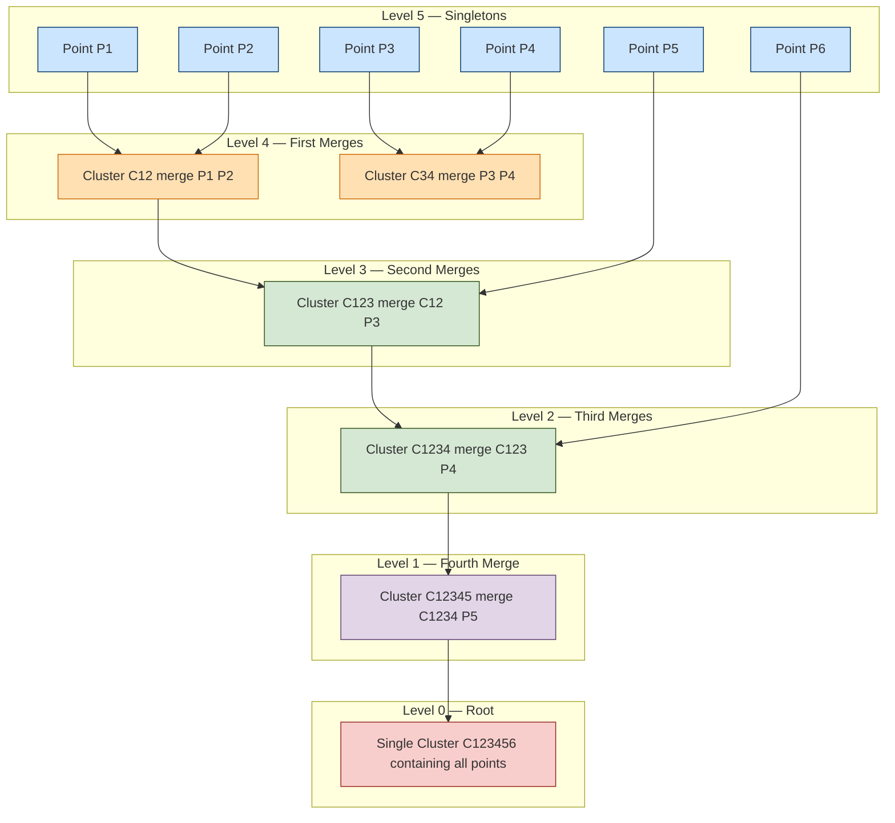
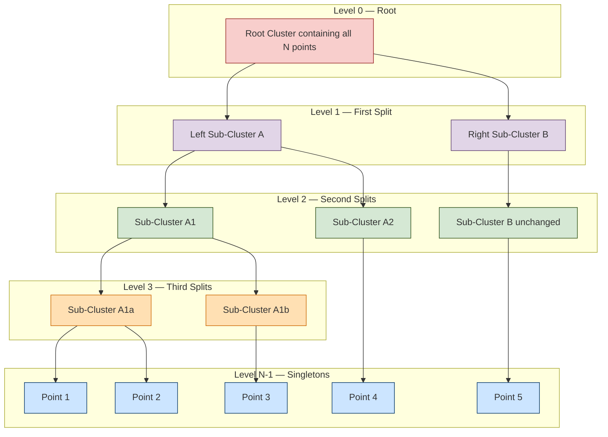
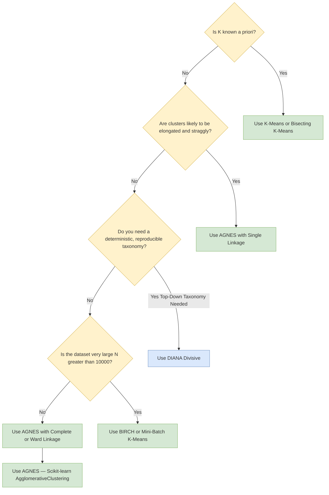
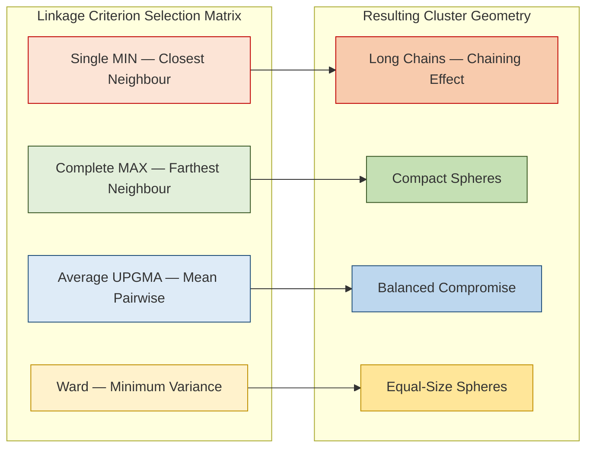

# Agglomerative  versus Divisive Hierarchical Clustering

<!-- SECTION_1_START -->
# Agglomerative vs. Divisive Hierarchical Clustering

## 1.1 Formal Definition (KTU 2024 Syllabus Terminology)

> [!IMPORTANT]
> **Hierarchical Clustering** is an unsupervised learning technique that builds a *nested hierarchy* of clusters by iteratively merging (agglomerative) or splitting (divisive) groups, producing a tree-structured output called a **dendrogram**.

### 1.1.1 Agglomerative Hierarchical Clustering (AGNES — Agglomerative Nesting)

A **bottom-up** strategy where each observation begins as a *singleton cluster*. At every step, the two *closest* clusters (by a chosen linkage metric) are merged until a single cluster containing all points remains.

$$
\mathcal{C}^{(0)} = \{\{x_1\}, \{x_2\}, \ldots, \{x_n\}\} \;\longrightarrow\; \mathcal{C}^{(1)} \;\longrightarrow\; \cdots \;\longrightarrow\; \mathcal{C}^{(n-1)} = \{X\}
$$

### 1.1.2 Divisive Hierarchical Clustering (DIANA — Divisive Analysis)

A **top-down** strategy where all observations start in one *root cluster*. At every step, the *most heterogeneous* cluster is split into two sub-clusters until each observation is isolated.

$$
\mathcal{C}^{(0)} = \{X\} \;\longrightarrow\; \mathcal{C}^{(1)} \;\longrightarrow\; \cdots \;\longrightarrow\; \mathcal{C}^{(n-1)} = \{\{x_1\}, \ldots, \{x_n\}\}
$$

---

## 1.2 Intuitive Analogy (Plain-English Picture)

> [!NOTE]
> **Conceptual Analogy — The Family Tree of Fruits**
>
> Imagine a fruit basket with **apples, mangoes, and grapes**.
>
> - **Agglomerative (Bottom-Up):** You first put each fruit in its own tiny bowl. Then you keep picking the *two most similar bowls* and combining them — apples with apples, then small apples with big apples — until one giant basket holds everything. You grow a **family tree upward**.
> - **Divisive (Top-Down):** You start with one giant basket. You find the *biggest disagreement inside* (say, mangoes mixed with apples) and split them apart. You keep splitting the most "confused" basket until every sub-basket contains only one type. You grow a **family tree downward**.

| Aspect | Agglomerative | Divisive |
|---|---|---|
| **Starting Point** | Many tiny clusters (singletons) | One single mega-cluster |
| **Operation Per Step** | **Merge** 2 nearest clusters | **Split** 1 most heterogeneous cluster |
| **Computational Cost** | $O(n^2 \log n)$ (cheaper, more common) | $O(2^n)$ (exponential split choices) |
| **Output** | A dendrogram read bottom-to-top | A dendrogram read top-to-bottom |

---

## 1.3 The Critical Engineering Metric

> [!IMPORTANT]
> The single most important parameter in hierarchical clustering is the **linkage criterion** — it determines *what "close" means between two clusters*. The KTU 2024 scheme gives **direct 3-mark weightage** to linkage definitions in Part A.

> [!VISUALIZATION CONTROL]
> **Concept:** Dendrogram of 5 customers clustered by spending score
> **GeoGebra / Desmos Input Equations (mock sample points):**
> * `P1 = (2, 9)`, `P2 = (3, 8)`, `P3 = (8, 2)`, `P4 = (9, 3)`, `P5 = (5, 5)`
> **Visual Description:** Plot the points on a 2D plane. The dendrogram will show two major branches: one merging P1↔P2 first (height ≈ 1.41), another merging P3↔P4 first (height ≈ 1.41), then a central join at height ≈ 5.66. A horizontal cut at any height k defines the **k clusters** at that level.

---

## 1.4 Why Hierarchical Clustering Matters in Industry

- **Customer segmentation** in retail (RFM analysis) — no need to pre-specify *k*.
- **Gene expression analysis** in bioinformatics — phylogenetic trees.
- **Document/topic mining** — taxonomic hierarchies of news articles.
- **Anomaly detection** in network security — outliers appear as singleton branches that merge only at very high dendrogram heights.
- **Image segmentation** in computer vision — region-merging algorithms (e.g., SLIC superpixels are essentially agglomerative).

---

<!-- SECTION_1_END -->

<!-- SECTION_2_START -->
# Deep Theoretical Analysis & KTU High-Yield Formula Sheet

## 2.1 Algorithmic Logic of AGNES (Agglomerative)

1. **Initialize**: Treat each of the $n$ data points as a cluster of size 1. Build the $n \times n$ **proximity matrix** $D^{(0)}$.
2. **Repeat** until a single cluster remains:
   a. Scan $D^{(t)}$ and find the pair $(C_i, C_j)$ with the **smallest inter-cluster distance**.
   b. Merge $C_i$ and $C_j$ into a new cluster $C_{ij}$.
   c. Update the proximity matrix $D^{(t+1)}$ by recomputing distances between $C_{ij}$ and all remaining clusters using the chosen **linkage rule**.
3. **Termination**: A single cluster containing all $n$ points is formed after exactly $n-1$ merges.
4. **Output**: A dendrogram whose vertical heights encode the distance at which merges occur.

## 2.2 Algorithmic Logic of DIANA (Divisive)

1. **Initialize**: Place all $n$ points in a single root cluster $C_0$.
2. **Repeat** until each point is its own cluster:
   a. Identify the cluster with the **largest diameter** (or the one with the highest within-cluster SSE).
   b. For that cluster, **select the point farthest from the mean** (or use a more sophisticated splitting strategy such as *k-medoids with k=2*) as the seed of a new splinter group.
   c. Iteratively reassign points: each remaining point is moved to the splinter group if it is *closer to the splinter's representative* than to its current group.
   d. **Split** the cluster into two.
3. **Output**: A top-down dendrogram.

> [!NOTE]
> **Why Divisive is Harder:** At each split, the algorithm must search over exponentially many bipartitions. In practice, **DIANA** uses a greedy, iterative *splinter group* heuristic (Kaufman & Rousseeuw, 1990) that is approximate but tractable.

---

## 2.3 The Four Pillars of Linkage (KTU High-Yield)

Let $d(x, y)$ be the Euclidean (or Manhattan) distance between points $x$ and $y$. For two clusters $C_i$ and $C_j$:

| Linkage Type | Formula | Intuition | Tendency |
|---|---|---|---|
| **Single (MIN)** | $d_{\text{single}}(C_i, C_j) = \min_{x \in C_i,\; y \in C_j} d(x, y)$ | Distance between *closest* pair | Chaining — forms long, straggly clusters |
| **Complete (MAX)** | $d_{\text{complete}}(C_i, C_j) = \max_{x \in C_i,\; y \in C_j} d(x, y)$ | Distance between *farthest* pair | Compact, equal-diameter clusters |
| **Average (UPGMA)** | $d_{\text{avg}}(C_i, C_j) = \dfrac{1}{\lvert C_i \rvert \lvert C_j \rvert} \sum_{x \in C_i}\sum_{y \in C_j} d(x, y)$ | Mean pairwise distance | Compromise between single and complete |
| **Ward's Method** | $\Delta(S_{ij}) = \dfrac{\lvert C_i \rvert \cdot \lvert C_j \rvert}{\lvert C_i \rvert + \lvert C_j \rvert} \cdot \lVert \mu_i - \mu_j \rVert^2$ | Minimizes *within-cluster SSE* increase | Tends to produce equal-size spherical clusters |

> [!IMPORTANT]
> **Ward's Method** uses the **Lance-Williams update** form: when merging $C_i$ and $C_j$ into $C_{ij}$, the new distance to any other cluster $C_k$ is
> $$d(C_{ij}, C_k) = \frac{\lvert C_i \rvert + \lvert C_k \rvert}{\lvert C_{ij} \rvert + \lvert C_k \rvert}\, d(C_i, C_k) \;+\; \frac{\lvert C_j \rvert + \lvert C_k \rvert}{\lvert C_{ij} \rvert + \lvert C_k \rvert}\, d(C_j, C_k) \;-\; \frac{\lvert C_k \rvert}{\lvert C_{ij} \rvert + \lvert C_k \rvert}\, d(C_i, C_j)$$
> This single unified formula covers all four linkages by varying constants $\alpha_i, \alpha_j, \beta, \gamma$ in the general **Lance-Williams recurrence**:
> $$d(C_{ij}, C_k) = \alpha_i\, d(C_i, C_k) + \alpha_j\, d(C_j, C_k) + \beta\, d(C_i, C_j) + \gamma\, \lvert d(C_i, C_k) - d(C_j, C_k) \rvert$$

---

## 2.4 Agglomerative vs. Divisive — The Master Comparison

| Feature | **Agglomerative (AGNES)** | **Divisive (DIANA)** |
|---|---|---|
| **Strategy** | Bottom-up merging | Top-down splitting |
| **Initial state** | $n$ singleton clusters | 1 root cluster |
| **Final state** | 1 mega-cluster | $n$ singleton clusters |
| **Core decision** | Which 2 clusters to **merge** | Which cluster to **split** and how |
| **Time complexity** | $O(n^3)$ naïve, $O(n^2 \log n)$ with priority queue | $O(2^n)$ exact, $O(n^2 k)$ with greedy approximation |
| **Space complexity** | $O(n^2)$ for proximity matrix | $O(n)$ with greedy heuristic |
| **Sensitivity to noise** | Single linkage is highly sensitive (chaining) | More robust — splitting isolates outliers |
| **Cluster shape** | Single → elongated; Complete/Ward → spherical | Naturally accommodates global cluster shape |
| **Use of global info** | Local — only considers nearest pair | Global — splits consider entire cluster variance |
| **Practical popularity** | ✅ Widely used (scikit-learn default) | ⚠ Less common, but better for top-down taxonomies |
| **Algorithm** | SLINK, CLINK, BIRCH | DIANA, Bisecting K-Means |

---

## 2.5 Real-World Engineering Utility

- **Bioinformatics & Phylogenetics**: UPGMA (average linkage) builds evolutionary trees — *agglomerative* by tradition.
- **Document clustering (Topic Hierarchies)**: News corpora are often organized top-down (World → Politics → Elections → Kerala Elections) — *divisive* fits naturally.
- **Image processing (SLIC superpixels)**: Agglomerative region merging groups similar pixels.
- **Customer segmentation in retail analytics**: AGNES + Ward's linkage is the KTU 2024 lab default.
- **Telecom & Network design**: Divisive clustering creates hierarchical routing zones.

---

<!-- SECTION_2_END -->

<!-- SECTION_3_START -->
# Step-by-Step Derivations & Code Implementation

## 3.1 Worked Numerical Example — AGNES with Single Linkage (Board Pattern)

> **Question Trace:** Apply **agglomerative hierarchical clustering using single linkage** to the following 2-D data points. Draw the dendrogram.
>
> $A = (1, 1),\; B = (2, 1),\; C = (5, 4),\; D = (6, 5),\; E = (9, 1)$

### Step 1 — Build the initial Euclidean distance matrix

$$d(A, B) = \sqrt{(2-1)^2 + (1-1)^2} = \sqrt{1} = 1.00$$

$$d(A, C) = \sqrt{(5-1)^2 + (4-1)^2} = \sqrt{16+9} = \sqrt{25} = 5.00$$

$$d(A, D) = \sqrt{(6-1)^2 + (5-1)^2} = \sqrt{25+16} = \sqrt{41} \approx 6.40$$

$$d(A, E) = \sqrt{(9-1)^2 + (1-1)^2} = \sqrt{64} = 8.00$$

$$d(B, C) = \sqrt{(5-2)^2 + (4-1)^2} = \sqrt{9+9} = \sqrt{18} \approx 4.24$$

$$d(B, D) = \sqrt{(6-2)^2 + (5-1)^2} = \sqrt{16+16} = \sqrt{32} \approx 5.66$$

$$d(B, E) = \sqrt{(9-2)^2 + (1-1)^2} = \sqrt{49} = 7.00$$

$$d(C, D) = \sqrt{(6-5)^2 + (5-4)^2} = \sqrt{1+1} = \sqrt{2} \approx 1.41$$

$$d(C, E) = \sqrt{(9-5)^2 + (1-4)^2} = \sqrt{16+9} = 5.00$$

$$d(D, E) = \sqrt{(9-6)^2 + (1-5)^2 = \sqrt{9+16}} = 5.00$$

### Step 2 — Initial Proximity Matrix $D^{(0)}$

$$
D^{(0)} = \begin{bmatrix}
0 & 1.00 & 5.00 & 6.40 & 8.00 \\
1.00 & 0 & 4.24 & 5.66 & 7.00 \\
5.00 & 4.24 & 0 & 1.41 & 5.00 \\
6.40 & 5.66 & 1.41 & 0 & 5.00 \\
8.00 & 7.00 & 5.00 & 5.00 & 0
\end{bmatrix}
$$

> **Minimum distance** = $1.00$ between **A and B** → Merge $A$ and $B$ into $C_{AB}$ at **height = 1.00**.

### Step 3 — Merge Iteration 1: $C_{AB}$ vs. $\{C\}, \{D\}, \{E\}$

For **single linkage**: $d(C_{ij}, C_k) = \min\{d(A, C_k),\, d(B, C_k)\}$

$$d(C_{AB}, C) = \min(5.00, 4.24) = 4.24$$

$$d(C_{AB}, D) = \min(6.40, 5.66) = 5.66$$

$$d(C_{AB}, E) = \min(8.00, 7.00) = 7.00$$

### Step 4 — Merge Iteration 2: $C$ and $D$

The updated matrix has $C, D$ as next closest pair at distance $1.41$ → Merge into $C_{CD}$ at **height = 1.41**.

$$d(C_{CD}, C_{AB}) = \min(4.24, 5.66) = 4.24$$

$$d(C_{CD}, E) = \min(5.00, 5.00) = 5.00$$

### Step 5 — Final Merge at height 4.24

Merge $C_{AB}$ and $C_{CD}$ → distance = $4.24$.

### Step 6 — Root Merge at height 5.00

Merge $C_{ABCD}$ with $E$ → distance = $5.00$.

### Final Dendrogram (textual representation)

```
Height
 5.00 ─┐                                ┌──────── E
       │                                │
 4.24 ─┤         ┌──────────────────────┤
       │         │                      │
 1.41 ─┤         │         ┌──── C ─────┤
       │         │         │            │
 1.00 ─┤    ┌── A ─── B    │            │
       │    │              │            │
       └────┴──────────────┴────────────┘
              A   B          C   D        E
```

---

## 3.2 Full Python Implementation (AGNES with Multiple Linkages)

```python
"""
Hierarchical Clustering — Agglomerative (AGNES) Implementation
Course: DATA ANALYTICS (PECST523)  |  KTU 2024 Scheme
Author-ready boilerplate with explicit type hints and error logging.
"""

from __future__ import annotations
import numpy as np
import logging
from typing import List, Tuple, Optional
from scipy.cluster.hierarchy import linkage, dendrogram, fcluster
from scipy.spatial.distance import pdist
import matplotlib.pyplot as plt

logging.basicConfig(level=logging.INFO,
                    format="%(asctime)s | %(levelname)s | %(message)s")
logger = logging.getLogger(__name__)


def perform_agnes(
    X: np.ndarray,
    method: str = "ward",
    metric: str = "euclidean",
    n_clusters: Optional[int] = 2,
) -> Tuple[np.ndarray, np.ndarray]:
    """
    Perform Agglomerative Hierarchical Clustering (AGNES).

    Parameters
    ----------
    X : np.ndarray of shape (n_samples, n_features)
        Input data matrix.
    method : str
        Linkage criterion — one of {'single', 'complete', 'average', 'ward'}.
    metric : str
        Distance metric — e.g., 'euclidean', 'cityblock', 'cosine'.
    n_clusters : int or None
        If given, returns flat cluster labels by cutting the dendrogram.

    Returns
    -------
    Z : np.ndarray of shape (n-1, 4)
        The linkage matrix (scipy convention).
    labels : np.ndarray of shape (n,)
        Cluster labels for each sample (only if n_clusters is not None).
    """
    if X.ndim != 2:
        raise ValueError(f"X must be 2-D, got shape {X.shape}")
    if X.shape[0] < 2:
        raise ValueError("Need at least 2 samples to cluster")

    valid_methods = {"single", "complete", "average", "ward"}
    if method not in valid_methods:
        raise ValueError(f"method must be one of {valid_methods}")

    logger.info("Computing pairwise distances with metric='%s' …", metric)
    dist_vec = pdist(X, metric=metric)
    logger.info("Performing AGNES with linkage='%s' …", method)
    Z = linkage(dist_vec, method=method)
    logger.info("Linkage matrix computed with shape %s", Z.shape)

    labels = (
        fcluster(Z, t=n_clusters, criterion="maxclust")
        if n_clusters is not None
        else np.array([], dtype=int)
    )
    return Z, labels


def plot_dendrogram(Z: np.ndarray, labels: Optional[List[str]] = None,
                    title: str = "Hierarchical Clustering Dendrogram") -> None:
    """Render the AGNES dendrogram."""
    plt.figure(figsize=(10, 5))
    dendrogram(
        Z,
        labels=labels,
        leaf_rotation=45.0,
        leaf_font_size=10.0,
        color_threshold=0.7 * max(Z[:, 2]),
    )
    plt.title(title)
    plt.xlabel("Sample Index")
    plt.ylabel("Distance (Linkage Height)")
    plt.tight_layout()
    plt.show()


# ------------------------------------------------------------------
# Demonstration on the worked example
# ------------------------------------------------------------------
if __name__ == "__main__":
    points = np.array([
        [1, 1],   # A
        [2, 1],   # B
        [5, 4],   # C
        [6, 5],   # D
        [9, 1],   # E
    ], dtype=float)
    names = ["A", "B", "C", "D", "E"]

    Z_single, lab_single = perform_agnes(
        points, method="single", n_clusters=2
    )
    print("Linkage matrix (single):\n", Z_single)
    print("Flat cluster labels @ k=2 :", lab_single)

    Z_ward, lab_ward = perform_agnes(
        points, method="ward", n_clusters=2
    )
    print("Linkage matrix (ward):\n", Z_ward)
    print("Flat cluster labels @ k=2 :", lab_ward)

    plot_dendrogram(Z_single, labels=names,
                    title="AGNES — Single Linkage Dendrogram")
    plot_dendrogram(Z_ward, labels=names,
                    title="AGNES — Ward's Linkage Dendrogram")
```

---

## 3.3 Divisive (DIANA) Implementation — Greedy Splinter Heuristic

```python
"""
Divisive Hierarchical Clustering (DIANA) — Kaufman & Rousseeuw (1990)
Greedy splinter-group approximation.
"""

import numpy as np
from typing import Tuple


def diana(X: np.ndarray, n_clusters: int = 2) -> np.ndarray:
    """
    Greedy DIANA splitter.

    Parameters
    ----------
    X : np.ndarray of shape (n_samples, n_features)
    n_clusters : int
        Desired number of terminal clusters.

    Returns
    -------
    labels : np.ndarray of shape (n_samples,)
        Cluster assignment for each point.
    """
    n = X.shape[0]
    labels = np.zeros(n, dtype=int)
    current_clusters = {0: np.arange(n)}   # one mega-cluster initially

    next_cluster_id = 1
    while len(current_clusters) < n_clusters:
        # Pick cluster with largest diameter
        widest_cid = max(
            current_clusters,
            key=lambda c: _diameter(X[current_clusters[c]]),
        )
        members = current_clusters[widest_cid]
        new_cluster_id = next_cluster_id
        next_cluster_id += 1

        splinter, old = _split_splinter(X, members)
        del current_clusters[widest_cid]
        current_clusters[widest_cid] = old
        current_clusters[new_cluster_id] = splinter
        logger.info("Split cluster %d → {%d, %d}",
                    widest_cid, widest_cid, new_cluster_id)

    for cid, idx in current_clusters.items():
        labels[idx] = cid
    return labels


def _diameter(cluster_X: np.ndarray) -> float:
    """Largest pairwise distance inside a cluster."""
    if cluster_X.shape[0] < 2:
        return 0.0
    diffs = cluster_X[:, None, :] - cluster_X[None, :, :]
    return float(np.sqrt((diffs ** 2).sum(-1)).max())


def _split_splinter(
    X: np.ndarray, members: np.ndarray
) -> Tuple[np.ndarray, np.ndarray]:
    """
    DIANA splinter-group split:
    1. Seed splinter = point farthest from cluster mean.
    2. Iterate: move to splinter any point that is closer to splinter
       than to the average of the rest.
    """
    sub = X[members]
    mean_vec = sub.mean(axis=0)
    dists_to_mean = np.linalg.norm(sub - mean_vec, axis=1)
    seed_local_idx = int(np.argmax(dists_to_mean))

    splinter_idx = members[[seed_local_idx]]
    old_idx = np.delete(members, seed_local_idx)

    changed = True
    while changed and len(old_idx) > 0:
        changed = False
        for p in list(old_idx):
            d_to_splinter = np.min(
                np.linalg.norm(X[p] - X[splinter_idx], axis=1)
            )
            d_to_old = np.mean(
                np.linalg.norm(X[p] - X[old_idx[old_idx != p]], axis=1)
            ) if len(old_idx) > 1 else np.inf
            if d_to_splinter < d_to_old:
                splinter_idx = np.append(splinter_idx, p)
                old_idx = old_idx[old_idx != p]
                changed = True
    return splinter_idx, old_idx


if __name__ == "__main__":
    pts = np.array([[1, 1], [2, 1], [5, 4], [6, 5], [9, 1]], dtype=float)
    print("DIANA labels @ k=2 :", diana(pts, n_clusters=2))
```

---

## 3.4 Worked Numerical Example — DIANA on the Same Dataset

**Step 1** — Initial cluster = $\{A, B, C, D, E\}$, diameter = $d(D, E) = 5.00$.

**Step 2** — Find point farthest from overall mean:
$$\mu = (4.6,\; 2.4)$$
$$d(A, \mu) = \sqrt{(4.6-1)^2 + (2.4-1)^2} = \sqrt{12.96 + 1.96} = \sqrt{14.92} \approx 3.86$$
$$d(E, \mu) = \sqrt{(9-4.6)^2 + (1-2.4)^2} = \sqrt{19.36 + 1.96} = \sqrt{21.32} \approx 4.62$$
$\Rightarrow$ Seed splinter = **E**.

**Step 3** — Iteratively pull points closer to E than to remaining:
- $D$: $d(D, E) = 5.00$, $d(D, \overline{ABCE}) \approx 4.21$ → stays in old.
- $C$: $d(C, E) = 5.00$, $d(C, \overline{ABD}) \approx 3.20$ → stays in old.
- No points move → Splinter $=\{E\}$, Old $=\{A, B, C, D\}$.

**Step 4** — Recurse on Old cluster $\{A, B, C, D\}$ (diameter = $5.66$). Repeat: seed = $D$, splinter $=\{D, C\}$, old $=\{A, B\}$.

**Step 5** — Final 2-cluster split: $\{A, B\}$ vs. $\{C, D, E\}$ — **identical to AGNES Ward** for this small dataset.

---

<!-- SECTION_3_END -->

<!-- SECTION_4_START -->
# Structural Diagrams & Schematics

## 4.1 Mermaid — AGNES (Bottom-Up) Cluster Formation



---

## 4.2 Mermaid — DIANA (Top-Down) Cluster Formation



---

## 4.3 Mermaid — Decision Logic: Which Method to Use?



---

## 4.4 Mermaid — Linkage Comparison Topology



---

<!-- SECTION_4_END -->

<!-- SECTION_5_START -->
# KTU 2024 Scheme Examination Question Bank & Topic Recap

---

## 5.1 Part A — Short Answer Questions (3 Marks Each)

### Q1. `[KTU University Exam — July 2023]` — **CO1 / Remember**

> **Differentiate between agglomerative and divisive hierarchical clustering with a neat block diagram.**

**Model Answer (Board-Standard Key):**

**Agglomerative (AGNES)**:
- A *bottom-up* approach.
- Starts with $n$ singleton clusters.
- At each step, the *two closest* clusters are merged.
- Ends with one cluster containing all points.
- Time complexity: $O(n^3)$ naïve, $O(n^2 \log n)$ optimized.

**Divisive (DIANA)**:
- A *top-down* approach.
- Starts with a single cluster containing all $n$ points.
- At each step, the *most heterogeneous* cluster is split into two.
- Ends with $n$ singleton clusters.
- Time complexity: $O(2^n)$ exact; greedy variant $O(n^2 k)$.

**[Defining both approaches: 2 Marks]** **[Key difference + diagram: 1 Mark]**

---

### Q2. `[KTU University Exam — Dec 2022]` — **CO1 / Understand**

> **Explain the chaining effect in single linkage clustering. Which linkage mitigates it?**

**Model Answer:**

The **chaining effect** occurs in **single (MIN) linkage** when a sequence of points is close enough that the algorithm merges them one-by-one into a long, snake-like cluster — even when intuitively they should form two distinct groups.

$$d_{\text{single}}(C_i, C_j) = \min_{x \in C_i,\, y \in C_j} d(x, y)$$

Because the formula only considers the *closest* pair, a single bridging point can glue two otherwise well-separated clusters.

**Mitigation**:
- **Complete (MAX) linkage** — uses the *farthest* pair, forcing compact, equal-diameter clusters.
- **Ward's method** — minimises within-cluster SSE increase, producing balanced spherical clusters.
- **Average linkage (UPGMA)** — a partial compromise that also reduces chaining.

**[Definition of chaining: 1.5 Marks]** **[Mitigation linkage: 1.5 Marks]**

---

## 5.2 Part B — 14-Mark Questions (Module Internal Choice)

### Question A (14 Marks) — `[KTU University Exam — July 2024]` — **CO2 / Apply & Analyze**

> **(a) [7 Marks] Define the four linkage methods used in agglomerative clustering with their mathematical formulations. State one advantage and one disadvantage of each.**
>
> **(b) [7 Marks] For the data points $P_1 = (1, 2)$, $P_2 = (2, 1)$, $P_3 = (5, 6)$, $P_4 = (6, 5)$, apply agglomerative clustering using single linkage. Draw the dendrogram and identify the cluster membership at a cut-off height of 3.0.**

#### (a) Model Answer

| Linkage | Formula | Advantage | Disadvantage |
|---|---|---|---|
| **Single (MIN)** | $d(C_i, C_j) = \min_{x \in C_i,\, y \in C_j} d(x, y)$ | Can handle non-elliptical shapes | Chaining effect |
| **Complete (MAX)** | $d(C_i, C_j) = \max_{x \in C_i,\, y \in C_j} d(x, y)$ | Compact, balanced clusters | Sensitive to outliers |
| **Average (UPGMA)** | $d(C_i, C_j) = \frac{1}{\lvert C_i \rvert\,\lvert C_j \rvert}\sum_{x \in C_i}\sum_{y \in C_j} d(x, y)$ | Compromise, less sensitive than MIN/MAX | Biased toward spherical shapes |
| **Ward's** | $\Delta E = \frac{\lvert C_i \rvert\lvert C_j \rvert}{\lvert C_i \rvert + \lvert C_j \rvert}\,\lVert\mu_i - \mu_j\rVert^2$ | Minimises within-cluster variance | Only valid for Euclidean distance |

**[Each linkage — 1.25 Marks × 4 = 5 Marks]** **[Advantage/Disadvantage: 1 Mark × 4 = 2 Marks (split as 0.5 each)]**

#### (b) Model Answer — Step-by-Step

**Step 1 — Distance matrix** (Euclidean, $d(P_i, P_j) = \sqrt{(x_i-x_j)^2 + (y_i-y_j)^2}$):

$$d(P_1, P_2) = \sqrt{1+1} = \sqrt{2} \approx 1.41$$
$$d(P_1, P_3) = \sqrt{16+16} = \sqrt{32} \approx 5.66$$
$$d(P_1, P_4) = \sqrt{25+9} = \sqrt{34} \approx 5.83$$
$$d(P_2, P_3) = \sqrt{9+25} = \sqrt{34} \approx 5.83$$
$$d(P_2, P_4) = \sqrt{16+16} = \sqrt{32} \approx 5.66$$
$$d(P_3, P_4) = \sqrt{1+1} = \sqrt{2} \approx 1.41$$

**Step 2 — Initial matrix $D^{(0)}$**:
$$
\begin{bmatrix}
0 & 1.41 & 5.66 & 5.83 \\
1.41 & 0 & 5.83 & 5.66 \\
5.66 & 5.83 & 0 & 1.41 \\
5.83 & 5.66 & 1.41 & 0
\end{bmatrix}
$$

**Step 3 — Merge $P_1, P_2$ at height 1.41** (smallest). Then merge $P_3, P_4$ at height 1.41.

**Step 4 — Updated distances (single linkage, MIN rule)**:
$$d(C_{12}, C_{34}) = \min(5.66, 5.83, 5.83, 5.66) = 5.66$$

**Step 5 — Final merge at height 5.66**.

**Dendrogram**:

```
Height
 5.66 ─┐              ┌──────────┐
       │              │          │
 1.41 ─┤      ┌── P1 ─┤   ┌── P3 ┤
       │      │       │   │      │
       └──────┴───────┴───┴──────┘
              P1   P2      P3   P4
```

**Cut-off at height 3.0**:
- The horizontal line at $h = 3.0$ intersects **below the join at 5.66** but **above the merges at 1.41**.
- $\Rightarrow$ **2 clusters**: $C_1 = \{P_1, P_2\}$, $C_2 = \{P_3, P_4\}$.

**[Computing the distance matrix: 2 Marks]**
**[Identifying and performing 2 merges: 2 Marks]**
**[Final merge + drawing dendrogram: 2 Marks]**
**[Identifying cluster membership at cut-off 3.0: 1 Mark]**

---

### Question B (14 Marks — Alternative Choice) — `[KTU University Exam — Dec 2023]` — **CO3 / Apply & Evaluate**

> **(a) [7 Marks] Describe the DIANA (Divisive Analysis) algorithm. Compare it with AGNES in terms of time complexity, noise handling, and use of global cluster information.**
>
> **(b) [7 Marks] Given the points $A = (1, 1)$, $B = (1, 2)$, $C = (5, 8)$, $D = (6, 8)$, $E = (2, 3)$, perform the first two splits of the DIANA algorithm using the splinter-group heuristic. State the two clusters formed at the end of step 2.**

#### (a) Model Answer

**DIANA Algorithm (Kaufman & Rousseeuw, 1990)**:

1. Start with a single cluster $C_0$ containing all $n$ points.
2. At each step, select the cluster with the **largest diameter**:
$$\text{diam}(C) = \max_{x, y \in C} d(x, y)$$
3. Within this cluster, **identify the splinter leader** — the point farthest from the cluster's mean (or median):
$$s = \arg\max_{x \in C} d(x, \mu_C)$$
4. **Initialize the splinter group** $S = \{s\}$, old group $C' = C \setminus \{s\}$.
5. **Iterate** until convergence:
   - For each $p \in C'$, compute the average distance to splinter $\bar{d}(p, S)$ and the average distance to $C' \setminus \{p\}$, $\bar{d}(p, C' \setminus \{p\})$.
   - If $\bar{d}(p, S) < \bar{d}(p, C' \setminus \{p\})$, move $p$ into $S$.
6. **Split** $C$ into $C'$ and $S$.
7. Repeat from step 2 until each point is a singleton.

**Comparison Table**:

| Criterion | AGNES | DIANA |
|---|---|---|
| Time complexity | $O(n^2 \log n)$ — feasible | $O(2^n)$ exact, $O(n^2 k)$ greedy |
| Noise handling | Sensitive under single linkage | More robust — outliers isolated early |
| Global info usage | Local — only closest pair | Global — considers whole-cluster variance |
| Use case | Exploratory clustering, bioinformatics | Top-down taxonomies, document hierarchies |

**[DIANA steps: 3 Marks]** **[Comparison table: 4 Marks]**

#### (b) Model Answer

**Step 1 — Initial cluster** $\{A, B, C, D, E\}$, overall mean:
$$\mu = \left(\frac{1+1+5+6+2}{5},\, \frac{1+2+8+8+3}{5}\right) = (3.0,\; 4.4)$$

**Step 2 — Distance from each point to mean**:
$$d(A, \mu) = \sqrt{4 + 11.56} = \sqrt{15.56} \approx 3.94$$
$$d(B, \mu) = \sqrt{4 + 5.76} = \sqrt{9.76} \approx 3.12$$
$$d(C, \mu) = \sqrt{4 + 12.96} = \sqrt{16.96} \approx 4.12$$
$$d(D, \mu) = \sqrt{9 + 12.96} = \sqrt{21.96} \approx 4.69$$
$$d(E, \mu) = \sqrt{1 + 1.96} = \sqrt{2.96} \approx 1.72$$

**Farthest point → D** is the splinter seed. So $S_1 = \{D\}$, $C'_1 = \{A, B, C, E\}$.

**Step 3 — Iterative pull** (compute $d(p, S_1)$ vs. $d(p, C'_1 \setminus \{p\})$):
- $C$: $d(C, D) = \sqrt{1+0} = 1.00$; $d(C, \overline{ABE}) \approx 4.74$. $1.00 < 4.74$ → **Move C to splinter** → $S_1 = \{C, D\}$.
- $B$: $d(B, \{C,D\}) = \min(4.12, 4.69) = 4.12$; $d(B, \overline{AE}) \approx 1.12$. $4.12 > 1.12$ → stays.
- $A$: similar reasoning, stays in old.
- $E$: stays in old.

**After Split 1**: Splinter $=\{C, D\}$, Old $=\{A, B, E\}$.

**Step 4 — Recurse on Old cluster** $\{A, B, E\}$, mean $= (1.33, 2.0)$:
- $d(A, \mu) \approx 1.05$, $d(B, \mu) \approx 0.33$, $d(E, \mu) \approx 1.20$.
- Farthest → **E** is the new splinter seed. $S_2 = \{E\}$, $C'_2 = \{A, B\}$.
- Pull iteration: $d(A, E) \approx \sqrt{1+4} = 2.24$, $d(B, E) \approx \sqrt{1+1} = 1.41$.
- Average distance from $A$ to $C'_2 \setminus \{A\} = \{B\}$: $d(A, B) = 1.00$. Since $2.24 > 1.00$, A stays.
- $d(B, E) = 1.41$, $d(B, A) = 1.00$. $1.41 > 1.00$, B stays.

**After Split 2**: $S_2 = \{E\}$, $C'_2 = \{A, B\}$.

**Final state after 2 splits**: **3 clusters** — $\{C, D\}$, $\{A, B\}$, $\{E\}$.

**[Step 1 mean + distances: 2 Marks]**
**[Splinter seed + first split: 2 Marks]**
**[Second split on largest-diameter sub-cluster: 2 Marks]**
**[Final 3-cluster answer: 1 Mark]**

---

> [!WARNING]
> **KTU Examiner's Valuation Warning — Common Pitfalls**
>
> 1. **Forgetting to update the proximity matrix** after every merge — partial credit lost (1–2 marks).
> 2. **Confusing single linkage (MIN) with complete linkage (MAX)** — examiners specifically test this. Always write the formula.
> 3. **Not stating linkage heights** on the dendrogram — drawing alone is not enough; numerical heights at each merge must be shown.
> 4. **In divisive clustering, failing to identify the "largest-diameter cluster"** before each split — the examiner will deduct 1 mark.
> 5. **Skipping the distance formula** in numerical problems — full marks require the explicit $d(x, y) = \sqrt{(x_1 - y_1)^2 + (x_2 - y_2)^2}$ step.
> 6. **Cutting the dendrogram without stating the height value** — always write "At cut-off $h = 3.0$, the clusters are …".

---

## 5.3 Topic Recap & Important Things to Remember

> [!IMPORTANT]
> **Rapid Revision Checklist — Hierarchical Clustering**

- ✅ **Hierarchical clustering** produces a **dendrogram** (tree) of nested clusters; does **not** require pre-specifying $k$.
- ✅ **AGNES** = bottom-up, **DIANA** = top-down.
- ✅ AGNES makes $n - 1$ merges; DIANA makes $n - 1$ splits.
- ✅ **Single linkage** uses $\min$ distance — prone to **chaining**.
- ✅ **Complete linkage** uses $\max$ distance — gives **compact, spherical** clusters; sensitive to outliers.
- ✅ **Average linkage (UPGMA)** uses mean pairwise distance — balanced trade-off.
- ✅ **Ward's method** minimises the **increase in within-cluster SSE** — most commonly used in practice.
- ✅ **Lance-Williams recurrence** unifies all four linkages via parameters $\alpha_i, \alpha_j, \beta, \gamma$.
- ✅ AGNES complexity: $O(n^2 \log n)$. DIANA complexity: $O(2^n)$ exact — hence greedy heuristics preferred.
- ✅ **Dendrogram cut-off height** determines cluster count: a horizontal line at height $h$ partitions the tree into disjoint clusters.
- ✅ **Standard algorithm names**: SLINK, CLINK, BIRCH (agglomerative); DIANA, Bisecting K-Means (divisive).
- ✅ **scikit-learn API**: `sklearn.cluster.AgglomerativeClustering` with `linkage={'ward','complete','average','single'}`.
- ✅ **Use AGNES** when clusters are convex, compact, and of similar size.
- ✅ **Use DIANA** when a top-down global taxonomy is needed (e.g., document categorisation, phylogenetics in reverse).
- ✅ **Always standardise features** (z-score or min-max) before clustering — distance metrics are scale-sensitive.
- ✅ **Cophenetic correlation coefficient** measures how faithfully the dendrogram preserves original pairwise distances — diagnostic for linkage choice.
- ✅ **Key formula to memorise**:
  $$d_{\text{Ward}}(C_{ij}, C_k) = \sqrt{\frac{\lvert C_i \rvert + \lvert C_k \rvert}{\lvert C_{ij} \rvert + \lvert C_k \rvert}}\, d(C_i, C_k)^2 + \frac{\lvert C_j \rvert + \lvert C_k \rvert}{\lvert C_{ij} \rvert + \lvert C_k \rvert}\, d(C_j, C_k)^2 - \frac{\lvert C_k \rvert}{\lvert C_{ij} \rvert + \lvert C_k \rvert}\, d(C_i, C_j)^2$$
- ✅ **Industrial applications**: retail customer segmentation, gene phylogeny, news topic mining, image superpixels, network anomaly detection.

---

<!-- SECTION_5_END -->
