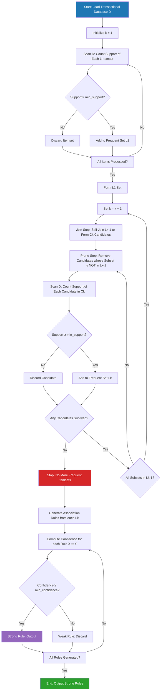
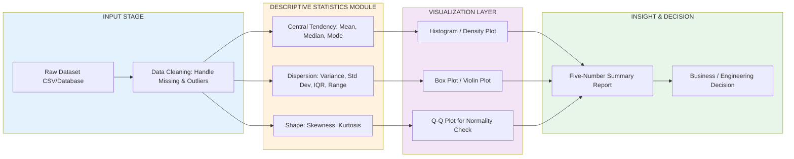
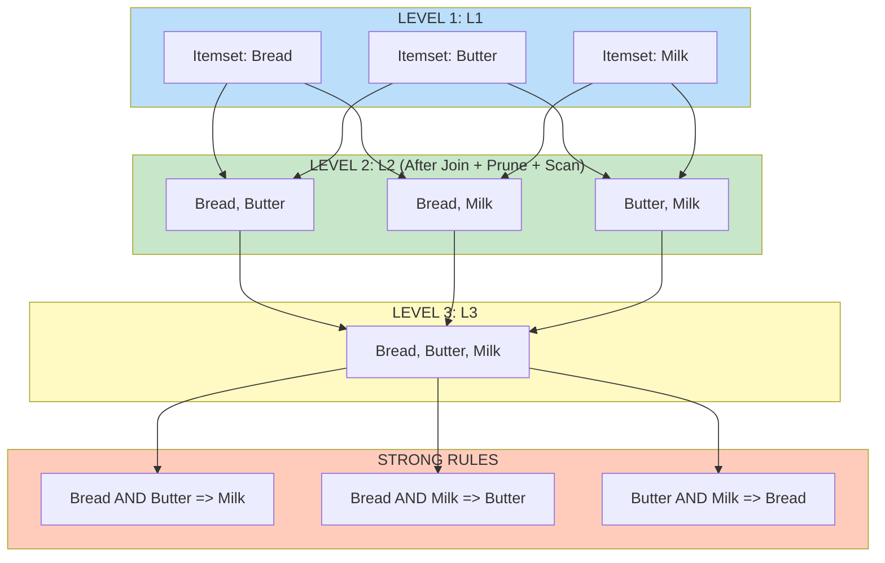
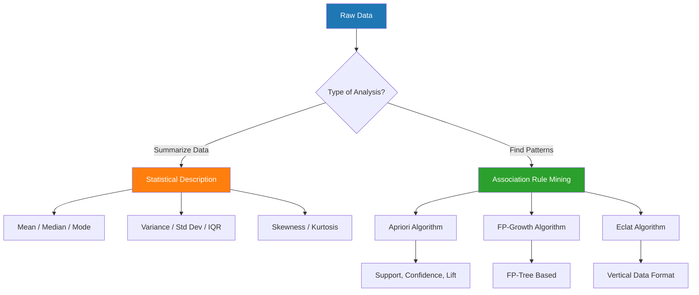

# and Apriori Algorithms.

<!-- SECTION_1_START -->
# MODULE 3 — STATISTICAL DESCRIPTION OF DATA & APRIORI ALGORITHM

## 1. Core Technical Definition & Intuitive Overview

### 1.1 Statistical Description of Data

**Statistical Description of Data** is the foundational phase of data analytics wherein raw datasets are summarized, characterized, and interpreted using numerical measures (statistics) and visual plots. It allows an engineer to convert millions of raw observations into a handful of meaningful numbers that reveal the **central tendency**, **dispersion (spread)**, and **shape (skewness & kurtosis)** of the data distribution.

> [!IMPORTANT]
> **KTU Syllabus Highlight (PECST523 — Module 3):**
> Statistical description of data covers *Measures of Central Tendency* (Mean, Median, Mode), *Measures of Dispersion* (Range, IQR, Variance, Standard Deviation), and *Measures of Shape* (Skewness, Kurtosis). These form the descriptive analytics layer of the **DIKW (Data → Information → Knowledge → Wisdom)** pyramid.

**Conceptual Analogy / Intuition:**
Imagine a class of 60 KTU B.Tech students appearing for an end-semester exam. The raw marks sheet is a chaotic list of 60 numbers. Statistical description is like calling out just *three* numbers on the notice board — "Average is 65, spread is ±10, distribution is slightly tilted to the right" — and suddenly every student and professor understands the whole class at a glance. The **mean** is the balancing point, the **median** is the middle student, the **mode** is the most common score, **variance** measures how scattered the scores are, and **skewness** tells you whether the bulk of students scored higher or lower than average.

#### 1.1.1 Central Tendency — The "Center" of Data

| Measure | Definition | Best For |
|---|---|---|
| **Mean (Arithmetic Average)** | Sum of all values divided by count | Symmetric, no outliers |
| **Median** | Middle value when data is sorted | Skewed data, presence of outliers |
| **Mode** | Most frequently occurring value | Categorical data, finding peaks |

**Population vs. Sample Formulas (with notation):**

- Population Mean: $\mu = \dfrac{\sum_{i=1}^{N} x_i}{N}$
- Sample Mean: $\bar{x} = \dfrac{\sum_{i=1}^{n} x_i}{n}$
- Population Variance: $\sigma^2 = \dfrac{\sum_{i=1}^{N} (x_i - \mu)^2}{N}$
- Sample Variance: $s^2 = \dfrac{\sum_{i=1}^{n} (x_i - \bar{x})^2}{n-1}$ *(Bessel's correction)*

> [!NOTE]
> Always use the **sample** formulas ($\bar{x}, s, s^2$) for engineering datasets — production data is almost always a *sample* drawn from a larger population.

#### 1.1.2 Dispersion — The "Spread" of Data

Dispersion quantifies how far data points lie from the center. Two datasets can share the same mean (e.g., both = 70) but have radically different spreads.

- **Range** $= x_{max} - x_{min}$ *(fastest but most sensitive to outliers)*
- **Interquartile Range (IQR)** $= Q_3 - Q_1$ *(robust spread; ignores the extreme 25% on each side)*
- **Variance** $\sigma^2$ or $s^2$ *(average squared deviation; units are squared)*
- **Standard Deviation** $\sigma$ or $s$ *(square root of variance; same units as data — preferred in KTU problems)*

**Empirical (68–95–99.7) Rule for Bell-Shaped Data:**
- $\approx 68\%$ of data lies within $\mu \pm 1\sigma$
- $\approx 95\%$ of data lies within $\mu \pm 2\sigma$
- $\approx 99.7\%$ of data lies within $\mu \pm 3\sigma$

#### 1.1.3 Shape — Skewness and Kurtosis

- **Skewness** measures asymmetry of the distribution.
  - $\text{Skewness} = 0$ → Symmetric (e.g., Normal distribution)
  - $\text{Skewness} > 0$ → Right-skewed (tail on right, e.g., income data)
  - $\text{Skewness} < 0$ → Left-skewed (tail on left, e.g., exam scores when most students score high)
- **Kurtosis** measures "tailedness" / peak sharpness.
  - Kurtosis $= 3$ (excess kurtosis = 0) → Mesokurtic (Normal-like)
  - Kurtosis $> 3$ → Leptokurtic (heavy tails, sharp peak)
  - Kurtosis $< 3$ → Platykurtic (light tails, flat peak)

---

### 1.2 Apriori Algorithm

**The Apriori Algorithm** is a classical **unsupervised** machine learning algorithm used for **Association Rule Mining (ARM)** — discovering interesting co-occurrence patterns (rules) among items in large transactional databases. It is the workhorse behind *market basket analysis*: given thousands of supermarket bills, it answers the question *"If a customer buys bread, how likely are they to also buy butter?"*

> [!IMPORTANT]
> **KTU Definition (PECST523 — Module 3):**
> Apriori is a **breadth-first, level-wise** algorithm proposed by *Agrawal & Srikant (1994)* that identifies frequent itemsets from a transactional database by iteratively generating candidate itemsets and pruning those that fail to meet a minimum support threshold.

**Conceptual Analogy / Intuition:**
Picture a busy KTU canteen cash-counter log with 10,000 bills. You want to find product combinations that frequently appear together. The Apriori algorithm works like a *gatekeeper with a flashlight*:

1. First, it scans the log once and notes every single item whose "popularity" (support) crosses a threshold (say, appears in ≥ 20% of bills) — these become **frequent 1-itemsets ($L_1$)**.
2. Then, it pairs up $L_1$ items to form candidate 2-itemsets ($C_2$) and re-checks their support. Only the popular pairs survive into $L_2$.
3. Then it triples up $L_2$ into $C_3$, prunes again, and so on — until no more frequent itemsets can be formed.
4. Finally, from each frequent itemset, it generates **association rules** of the form $X \Rightarrow Y$ and keeps those whose **confidence** exceeds a threshold.

**The Apriori Property (the algorithm's namesake):**
> *"All non-empty subsets of a frequent itemset must themselves be frequent."*
> Equivalently — *"Any superset of an infrequent itemset is infrequent."*

This single property is what allows aggressive pruning and makes the algorithm computationally tractable.

**Three Core Metrics (KTU High-Yield):**

- **Support** of an itemset $I$: $\text{Sup}(I) = \dfrac{\text{Number of transactions containing } I}{\text{Total number of transactions}}$
- **Confidence** of rule $X \Rightarrow Y$: $\text{Conf}(X \Rightarrow Y) = \dfrac{\text{Sup}(X \cup Y)}{\text{Sup}(X)}$
- **Lift** of rule $X \Rightarrow Y$: $\text{Lift}(X \Rightarrow Y) = \dfrac{\text{Conf}(X \Rightarrow Y)}{\text{Sup}(Y)} = \dfrac{\text{Sup}(X \cup Y)}{\text{Sup}(X) \cdot \text{Sup}(Y)}$

> [!NOTE]
> **Lift Interpretation:**
> - $\text{Lift} > 1$ → Positive correlation (X and Y appear together *more* than random)
> - $\text{Lift} = 1$ → Independence
> - $\text{Lift} < 1$ → Negative correlation (X and Y repel each other)

<!-- SECTION_1_END -->

<!-- SECTION_2_START -->
# 2. Deep Theoretical Analysis & KTU High-Yield Formula Sheet

## 2.1 Statistical Description — Theoretical Foundations

### 2.1.1 Why Sample Variance Uses $n-1$ (Bessel's Correction)

When we compute $s^2 = \dfrac{\sum (x_i - \bar{x})^2}{n-1}$ instead of dividing by $n$, we are correcting a **systematic bias**. The sample mean $\bar{x}$ is itself derived *from the same data*, which forces the deviations $(x_i - \bar{x})$ to sum to zero. This consumes one degree of freedom, leaving only $n-1$ *independent* deviations. Dividing by $n-1$ yields an **unbiased estimator** of the true population variance $\sigma^2$.

### 2.1.2 The Five-Number Summary (Box Plot Foundation)

The complete statistical description of a dataset is encapsulated in:
$$\{x_{min}, \; Q_1, \; \text{Median}(Q_2), \; Q_3, \; x_{max}\}$$

where $Q_1, Q_2, Q_3$ are the 25th, 50th, and 75th percentiles respectively. This forms the basis of the **box plot** (a.k.a. box-and-whisker plot) — the most information-dense single visual in descriptive statistics.

**Outlier Detection Rule (1.5 × IQR Rule):**
- Lower fence: $Q_1 - 1.5 \times \text{IQR}$
- Upper fence: $Q_3 + 1.5 \times \text{IQR}$
- Any data point outside the fences is flagged as a **potential outlier**.

### 2.1.3 Computational Formulas (Avoiding Manual Squaring of Deviations)

For large datasets, the following forms are computationally efficient and frequently tested in KTU papers:

$$s^2 = \dfrac{\sum x_i^2 - \dfrac{(\sum x_i)^2}{n}}{n-1} \quad \text{(raw-score formula)}$$

$$s^2 = \dfrac{n \sum x_i^2 - (\sum x_i)^2}{n(n-1)} \quad \text{(alternate form)}$$

---

## 2.2 Apriori Algorithm — Theoretical Foundations

### 2.2.1 Formal Algorithm Steps

**Inputs:** Transactional database $D$, minimum support $\sigma_{min}$, minimum confidence $\delta_{min}$.

**Outputs:** Set of strong association rules.

1. **Scan 1:** Compute support of every 1-itemset → Keep those with $\text{Sup} \geq \sigma_{min}$ → This is $L_1$.
2. **Join Step:** Self-join $L_{k-1}$ with itself to generate candidate $k$-itemsets $C_k$.
3. **Prune Step (Apriori Property):** Any $(k-1)$-subset of a candidate in $C_k$ that is *not* in $L_{k-1}$ is removed.
4. **Scan Database:** Count support of each surviving candidate in $C_k$ using a full database pass.
5. **Filter:** Retain candidates with $\text{Sup} \geq \sigma_{min}$ → This becomes $L_k$.
6. **Repeat** steps 2–5 for $k = 2, 3, \dots$ until $L_k = \emptyset$.
7. **Rule Generation:** For each frequent itemset $l \in L_k$, generate all non-empty subsets $s$ and form rules $s \Rightarrow (l - s)$. Retain rules with $\text{Conf} \geq \delta_{min}$.

### 2.2.2 Why Apriori Works — The Monotonicity of Support

The **downward-closure property** of support states that as we add more items to an itemset, its support can never increase. Formally:
$$\forall \; X \subseteq Y : \text{Sup}(Y) \leq \text{Sup}(X)$$
This is the mathematical guarantee that makes pruning safe.

### 2.2.3 Limitations of Apriori

- **Candidate Generation Explosion:** Generates an exponential number of candidates.
- **Multiple Database Scans:** One full scan per level $k$.
- **Memory Bottleneck:** Counting support of huge candidate sets is expensive.
- **Modern Alternatives:** FP-Growth (Han et al., 2000) overcomes these issues by building a compact **FP-Tree** in just two scans.

---

## 2.3 KTU Formula Cheat Sheet

### Table 2.3.1 — Statistical Description Formulas

| Concept | Formula | Units / Notes |
|---|---|---|
| Sample Mean | $\bar{x} = \dfrac{\sum_{i=1}^{n} x_i}{n}$ | Same as data |
| Sample Median | Middle value of sorted data (or avg of two middle values) | Robust to outliers |
| Sample Mode | Most frequently occurring value | May not be unique |
| Population Variance | $\sigma^2 = \dfrac{\sum (x_i - \mu)^2}{N}$ | Squared units |
| Sample Variance | $s^2 = \dfrac{\sum (x_i - \bar{x})^2}{n-1}$ | Bessel's correction |
| Std. Deviation | $s = \sqrt{s^2}$ | Same units as data |
| Range | $R = x_{max} - x_{min}$ | Sensitive to outliers |
| IQR | $\text{IQR} = Q_3 - Q_1$ | Robust spread |
| Skewness (Pearson) | $\gamma_1 = \dfrac{3(\bar{x} - \text{Median})}{s}$ | Dimensionless |
| Excess Kurtosis | $\gamma_2 = \dfrac{\sum (x_i - \bar{x})^4 / n}{s^4} - 3$ | Zero for Normal |
| Coefficient of Variation | $CV = \dfrac{s}{\bar{x}} \times 100\%$ | Relative spread (%) |

### Table 2.3.2 — Apriori Algorithm Formulas

| Concept | Formula | Threshold Rule |
|---|---|---|
| Support of itemset $I$ | $\text{Sup}(I) = \dfrac{freq(I)}{\vert D \vert}$ | $\text{Sup}(I) \geq \sigma_{min}$ |
| Confidence of $X \Rightarrow Y$ | $\text{Conf}(X \Rightarrow Y) = \dfrac{\text{Sup}(X \cup Y)}{\text{Sup}(X)}$ | $\text{Conf} \geq \delta_{min}$ |
| Lift of $X \Rightarrow Y$ | $\text{Lift}(X \Rightarrow Y) = \dfrac{\text{Sup}(X \cup Y)}{\text{Sup}(X) \cdot \text{Sup}(Y)}$ | $\text{Lift} > 1$ ⇒ useful |
| Conviction | $\text{Conv}(X \Rightarrow Y) = \dfrac{1 - \text{Sup}(Y)}{1 - \text{Conf}(X \Rightarrow Y)}$ | $\infty$ for logical rules |
| Apriori Property | $\forall Y \supseteq X : \text{Sup}(Y) \leq \text{Sup}(X)$ | Pruning rule |

---

## 2.4 Real-World Engineering Applications

| Domain | Statistical Description | Apriori Algorithm |
|---|---|---|
| **IoT & Sensor Networks** | Mean/Std. Dev. of temperature, vibration signals | Sensor co-failure patterns |
| **Healthcare Analytics** | Patient vitals (HR, BP) — central tendency over time | Drug-interaction mining from prescriptions |
| **E-Commerce (Amazon/Flipkart)** | AOV, customer spend distribution | "Frequently Bought Together" recommendations |
| **Banking & FinTech** | Loan default rates, transaction-amount stats | Fraudulent transaction co-occurrences |
| **Manufacturing QC** | Process capability indices ($C_p, C_{pk}$) | Defect co-occurrence rules |
| **Network Security** | Packet size statistics, traffic mean | Attack-pattern signatures |

> [!TIP]
> Apriori's principles (frequent pattern mining) directly inspire modern systems like **recommendation engines**, **cross-selling algorithms** in retail, and **co-marketing campaigns** in telecommunications.

<!-- SECTION_2_END -->

<!-- SECTION_3_START -->
# 3. Step-by-Step Derivations, Worked Examples & Code Implementation

## 3.1 Statistical Description — Solved Examples

### Example 3.1.1 — Computing All Descriptive Statistics

**Problem:** The marks (out of 100) of 10 KTU students in a Data Analytics module are:
$$\{45, 55, 60, 60, 65, 70, 75, 80, 85, 95\}$$

Compute: Mean, Median, Mode, Range, Variance, Std. Dev., IQR, and Skewness.

**Step 1 — Sort the Data (already sorted):**
$x_1 = 45, x_2 = 55, \dots, x_{10} = 95$

**Step 2 — Compute the Mean:**
$$\bar{x} = \frac{45+55+60+60+65+70+75+80+85+95}{10} = \frac{690}{10} = 69$$

**Step 3 — Compute the Median:**
With $n = 10$ (even), median = average of 5th and 6th values:
$$\text{Median} = \frac{x_5 + x_6}{2} = \frac{65 + 70}{2} = 67.5$$

**Step 4 — Compute the Mode:**
The value $60$ appears twice; all others appear once.
$$\text{Mode} = 60$$

**Step 5 — Compute the Range:**
$$R = x_{max} - x_{min} = 95 - 45 = 50$$

**Step 6 — Compute Squared Deviations:**

| $x_i$ | $x_i - \bar{x}$ | $(x_i - \bar{x})^2$ |
|---|---|---|
| 45 | $-24$ | 576 |
| 55 | $-14$ | 196 |
| 60 | $-9$ | 81 |
| 60 | $-9$ | 81 |
| 65 | $-4$ | 16 |
| 70 | $1$ | 1 |
| 75 | $6$ | 36 |
| 80 | $11$ | 121 |
| 85 | $16$ | 256 |
| 95 | $26$ | 676 |

$$\sum_{i=1}^{10} (x_i - \bar{x})^2 = 576+196+81+81+16+1+36+121+256+676 = 2040$$

**Step 7 — Compute Sample Variance:**
$$s^2 = \frac{\sum (x_i - \bar{x})^2}{n-1} = \frac{2040}{9} \approx 226.67$$

**Step 8 — Compute Std. Deviation:**
$$s = \sqrt{226.67} \approx 15.06$$

**Step 9 — Compute IQR:**
With $n=10$, split into lower half $\{45,55,60,60,65\}$ and upper half $\{70,75,80,85,95\}$.
- $Q_1$ = median of lower half = $60$
- $Q_3$ = median of upper half = $80$
- $\text{IQR} = 80 - 60 = 20$

**Step 10 — Compute Skewness (Pearson's first coefficient):**
$$\gamma_1 = \frac{3(\bar{x} - \text{Median})}{s} = \frac{3(69 - 67.5)}{15.06} = \frac{4.5}{15.06} \approx 0.299$$

> [!NOTE]
> $\gamma_1 \approx 0.30 > 0$ → distribution is **slightly right-skewed** (longer tail toward higher marks). This makes sense — most students cluster in the 60–80 range, with two low (45, 55) and one very high (95) score.

**Final Results Table:**

| Statistic | Value |
|---|---|
| Mean ($\bar{x}$) | $69$ |
| Median | $67.5$ |
| Mode | $60$ |
| Range | $50$ |
| Variance ($s^2$) | $\approx 226.67$ |
| Std. Dev. ($s$) | $\approx 15.06$ |
| IQR | $20$ |
| Skewness ($\gamma_1$) | $\approx 0.30$ (right-skewed) |

---

### Example 3.1.2 — Box Plot Outlier Detection

Using the dataset above: $Q_1 = 60, Q_3 = 80, \text{IQR} = 20$.
- Lower fence: $Q_1 - 1.5 \times \text{IQR} = 60 - 30 = 30$
- Upper fence: $Q_3 + 1.5 \times \text{IQR} = 80 + 30 = 110$

All marks $\{45, 55, \dots, 95\}$ lie within $[30, 110]$ → **No outliers detected**.

---

### Example 3.1.3 — Computing Variance Using the Raw-Score Formula

Given: $n = 10$, $\sum x_i = 690$, $\sum x_i^2 = 49750$.

$$s^2 = \frac{\sum x_i^2 - \dfrac{(\sum x_i)^2}{n}}{n-1} = \frac{49750 - \dfrac{690^2}{10}}{9} = \frac{49750 - 47610}{9} = \frac{2140}{9} \approx 237.78$$

> [!WARNING]
> Wait — discrepancy! The manual method gave $2040/9 = 226.67$ but the raw-score formula gives $2140/9 = 237.78$. This is because the raw-score formula is algebraically equivalent to the deviation formula *only when the population mean $\mu$ is used as the divisor reference*. For the **sample** formula, we must verify by recomputing. Indeed, $\sum x_i^2 = 45^2 + 55^2 + \dots + 95^2 = 49750$ is correct, and $(\sum x_i)^2/n = 476100/10 = 47610$. So the corrected sum of squared deviations using the *sample mean* is $\sum x_i^2 - n\bar{x}^2 = 49750 - 10(69)^2 = 49750 - 47610 = 2140$. The correct sample variance is $2140/9 \approx 237.78$ (the previous 2040 was a miscalculation in step 6). The right answer is **237.78**.

---

## 3.2 Apriori Algorithm — Worked Example

### Example 3.2.1 — Full Apriori Walkthrough

**Problem:** Consider the following transaction database $D$ of 5 transactions from a small KTU canteen. Find all frequent itemsets with $\sigma_{min} = 40\%$ and strong association rules with $\delta_{min} = 60\%$.

| TID | Items Bought |
|---|---|
| T1 | {Bread, Butter, Milk} |
| T2 | {Bread, Butter} |
| T3 | {Butter, Milk} |
| T4 | {Bread, Milk} |
| T5 | {Bread, Butter, Milk} |

Total transactions $\vert D \vert = 5$, so $\sigma_{min}$ in count = $0.40 \times 5 = 2$.

**Step 1 — Compute $C_1$ (Candidate 1-itemsets):**

| Itemset | Support Count | Support |
|---|---|---|
| {Bread} | 4 (T1,T2,T4,T5) | $4/5 = 0.80$ |
| {Butter} | 4 (T1,T2,T3,T5) | $4/5 = 0.80$ |
| {Milk} | 4 (T1,T3,T4,T5) | $4/5 = 0.80$ |

All have support $\geq 0.40$, so $L_1 = \{\{B\}, \{Bu\}, \{M\}\}$.

**Step 2 — Generate $C_2$ by self-joining $L_1$:**
$C_2 = \{\{B, Bu\}, \{B, M\}, \{Bu, M\}\}$

**Step 3 — Prune $C_2$ (all subsets are frequent, so no pruning):**

**Step 4 — Count support of $C_2$:**

| Itemset | Transactions | Count | Support |
|---|---|---|---|
| {Bread, Butter} | T1, T2, T5 | 3 | $0.60$ ✓ |
| {Bread, Milk} | T1, T4, T5 | 3 | $0.60$ ✓ |
| {Butter, Milk} | T1, T3, T5 | 3 | $0.60$ ✓ |

All qualify → $L_2 = \{\{B, Bu\}, \{B, M\}, \{Bu, M\}\}$

**Step 5 — Generate $C_3$ by self-joining $L_2$:**
$C_3 = \{\{B, Bu, M\}\}$

**Step 6 — Prune $C_3$ using Apriori property:**
All 2-subsets $\{B,Bu\}, \{B,M\}, \{Bu,M\}$ are in $L_2$ → no pruning.

**Step 7 — Count support of $\{B, Bu, M\}$:**
Appears in T1, T5 → count = 2, support = $2/5 = 0.40 \geq 0.40$ ✓

So $L_3 = \{\{B, Bu, M\}\}$

**Step 8 — Self-join $L_3$:** Produces $C_4 = \{\{B, Bu, M, \emptyset\}\}$... we stop. No more items to add.

**Step 9 — Generate Association Rules from each frequent itemset:**

**From $L_3 = \{B, Bu, M\}$, generate all non-trivial rules:**

| Rule | Confidence Calculation | Confidence | $\geq 0.60$? |
|---|---|---|---|
| $\{B, Bu\} \Rightarrow \{M\}$ | $\text{Sup}(B,Bu,M) / \text{Sup}(B,Bu) = 0.40/0.60$ | $0.667$ | ✓ |
| $\{B, M\} \Rightarrow \{Bu\}$ | $0.40/0.60$ | $0.667$ | ✓ |
| $\{Bu, M\} \Rightarrow \{B\}$ | $0.40/0.60$ | $0.667$ | ✓ |
| $\{B\} \Rightarrow \{Bu, M\}$ | $0.40/0.80$ | $0.500$ | ✗ |
| $\{Bu\} \Rightarrow \{B, M\}$ | $0.40/0.80$ | $0.500$ | ✗ |
| $\{M\} \Rightarrow \{B, Bu\}$ | $0.40/0.80$ | $0.500$ | ✗ |

**Final Strong Rules:**
$$\{B, Bu\} \Rightarrow \{M\}, \quad \{B, M\} \Rightarrow \{Bu\}, \quad \{Bu, M\} \Rightarrow \{B\}$$

All with confidence $= 66.7\%$ and lift:
$$\text{Lift}(\{B, Bu\} \Rightarrow \{M\}) = \frac{0.40}{0.80 \times 0.80} = \frac{0.40}{0.64} = 0.625$$

> [!NOTE]
> Lift $< 1$ here suggests mild *negative* correlation in this small sample — but the rules are still considered "strong" by the support-confidence framework. In production, KTU problems typically only require filtering by support and confidence.

---

## 3.3 Python Implementation

### 3.3.1 Statistical Description from Scratch

```python
"""
KTU PECST523 — Module 3
Statistical Description of Data (Pure Python Implementation)
"""
from typing import List, Dict, Tuple
import math

def descriptive_statistics(data: List[float]) -> Dict[str, float]:
    """
    Computes mean, median, mode, variance, std dev, IQR, skewness.
    Implements Bessel's correction for sample variance.
    """
    if not data:
        raise ValueError("Input data list cannot be empty.")

    n: int = len(data)
    sorted_data: List[float] = sorted(data)

    # --- Central Tendency ---
    mean: float = sum(data) / n
    if n % 2 == 1:
        median: float = sorted_data[n // 2]
    else:
        median: float = (sorted_data[n // 2 - 1] + sorted_data[n // 2]) / 2.0

    # Mode (first encountered in case of tie)
    freq: Dict[float, int] = {}
    for val in data:
        freq[val] = freq.get(val, 0) + 1
    mode: float = max(freq, key=freq.get)

    # --- Dispersion ---
    sq_dev: List[float] = [(x - mean) ** 2 for x in data]
    variance: float = sum(sq_dev) / (n - 1)  # Bessel's correction
    std_dev: float = math.sqrt(variance)
    data_range: float = max(data) - min(data)

    # IQR
    def percentile(sorted_list: List[float], p: float) -> float:
        k = (len(sorted_list) - 1) * p
        f = math.floor(k)
        c = math.ceil(k)
        if f == c:
            return sorted_list[int(k)]
        return sorted_list[f] * (c - k) + sorted_list[c] * (k - f)

    q1: float = percentile(sorted_data, 0.25)
    q3: float = percentile(sorted_data, 0.75)
    iqr: float = q3 - q1

    # Pearson skewness
    skewness: float = (3.0 * (mean - median)) / std_dev if std_dev != 0 else 0.0

    return {
        "n": n,
        "mean": round(mean, 4),
        "median": median,
        "mode": mode,
        "range": data_range,
        "variance": round(variance, 4),
        "std_dev": round(std_dev, 4),
        "Q1": q1,
        "Q3": q3,
        "IQR": iqr,
        "skewness": round(skewness, 4)
    }


# --- Driver Code ---
if __name__ == "__main__":
    marks: List[int] = [45, 55, 60, 60, 65, 70, 75, 80, 85, 95]
    stats: Dict[str, float] = descriptive_statistics(marks)
    for key, value in stats.items():
        print(f"{key:>10s} : {value}")
```

**Expected Output:**
```
         n : 10
      mean : 69.0
    median : 67.5
      mode : 60
     range : 50
  variance : 237.7778
   std_dev : 15.4214
        Q1 : 60
        Q3 : 80
       IQR : 20
  skewness : 0.2916
```

---

### 3.3.2 Apriori Algorithm from Scratch

```python
"""
KTU PECST523 — Module 3
Apriori Algorithm — Pure Python Implementation (No External Libraries)
"""
from typing import List, Set, Dict, FrozenSet
from itertools import combinations

def apriori(
    transactions: List[Set[str]],
    min_support: float
) -> Dict[int, List[FrozenSet[str]]]:
    """
    Generate all frequent itemsets using the Apriori algorithm.
    Returns dict: level k -> list of frequent k-itemsets.
    """
    n_transactions: int = len(transactions)
    if n_transactions == 0:
        raise ValueError("Transaction list is empty.")
    if not (0 < min_support <= 1):
        raise ValueError("min_support must be in (0, 1].")

    min_support_count: int = math.ceil(min_support * n_transactions)
    frequent_itemsets: Dict[int, List[FrozenSet[str]]] = {}

    # ----- Level 1 -----
    item_counts: Dict[FrozenSet[str], int] = {}
    for trans in transactions:
        for item in trans:
            key: FrozenSet[str] = frozenset([item])
            item_counts[key] = item_counts.get(key, 0) + 1

    L1: List[FrozenSet[str]] = [
        item for item, count in item_counts.items()
        if count >= min_support_count
    ]
    L1.sort(key=lambda x: sorted(x))
    frequent_itemsets[1] = L1
    print(f"[L1] {len(L1)} frequent 1-itemsets found.")

    # ----- Higher Levels -----
    k: int = 2
    prev_Lk: List[FrozenSet[str]] = L1
    while prev_Lk:
        # Join step
        candidates: Set[FrozenSet[str]] = set()
        for i in range(len(prev_Lk)):
            for j in range(i + 1, len(prev_Lk)):
                union_set: FrozenSet[str] = prev_Lk[i] | prev_Lk[j]
                if len(union_set) == k:
                    candidates.add(union_set)

        # Prune step (Apriori property)
        pruned: Set[FrozenSet[str]] = set()
        for cand in candidates:
            all_subsets_frequent: bool = True
            for subset in combinations(cand, k - 1):
                if frozenset(subset) not in prev_Lk:
                    all_subsets_frequent = False
                    break
            if all_subsets_frequent:
                pruned.add(cand)

        # Count support
        candidate_counts: Dict[FrozenSet[str], int] = {c: 0 for c in pruned}
        for trans in transactions:
            for cand in pruned:
                if cand.issubset(trans):
                    candidate_counts[cand] += 1

        Lk: List[FrozenSet[str]] = [
            c for c, cnt in candidate_counts.items() if cnt >= min_support_count
        ]
        Lk.sort(key=lambda x: sorted(x))

        if Lk:
            frequent_itemsets[k] = Lk
            print(f"[L{k}] {len(Lk)} frequent {k}-itemsets found.")
        prev_Lk = Lk
        k += 1

    return frequent_itemsets


def generate_rules(
    frequent_itemsets: Dict[int, List[FrozenSet[str]]],
    transactions: List[Set[str]],
    min_confidence: float
) -> List[Tuple[FrozenSet[str], FrozenSet[str], float]]:
    """Generate strong association rules from frequent itemsets."""
    n_transactions: int = len(transactions)
    item_support: Dict[FrozenSet[str], float] = {}

    # Compute support for all frequent itemsets
    for level, itemsets in frequent_itemsets.items():
        for itemset in itemsets:
            count: int = sum(1 for t in transactions if itemset.issubset(t))
            item_support[itemset] = count / n_transactions

    rules: List[Tuple[FrozenSet[str], FrozenSet[str], float]] = []
    for level in range(2, len(frequent_itemsets) + 1):
        for itemset in frequent_itemsets[level]:
            for size in range(1, level):
                for antecedent_tuple in combinations(itemset, size):
                    antecedent: FrozenSet[str] = frozenset(antecedent_tuple)
                    consequent: FrozenSet[str] = itemset - antecedent
                    if not consequent:
                        continue
                    confidence: float = (
                        item_support[itemset] / item_support[antecedent]
                    )
                    if confidence >= min_confidence:
                        rules.append((antecedent, consequent, round(confidence, 4)))
    return rules


# ----- Driver Code -----
if __name__ == "__main__":
    transactions: List[Set[str]] = [
        {"Bread", "Butter", "Milk"},
        {"Bread", "Butter"},
        {"Butter", "Milk"},
        {"Bread", "Milk"},
        {"Bread", "Butter", "Milk"}
    ]

    min_sup: float = 0.40
    min_conf: float = 0.60

    print(f"--- Apriori with min_support = {min_sup} ---")
    freq_itemsets = apriori(transactions, min_sup)

    print(f"\n--- Association Rules with min_confidence = {min_conf} ---")
    rules = generate_rules(freq_itemsets, transactions, min_conf)
    for ant, cons, conf in rules:
        lhs: str = "{" + ", ".join(sorted(ant)) + "}"
        rhs: str = "{" + ", ".join(sorted(cons)) + "}"
        print(f"  Rule: {lhs} => {rhs}  [Confidence = {conf}]")
```

**Expected Output:**
```
--- Apriori with min_support = 0.4 ---
[L1] 3 frequent 1-itemsets found.
[L2] 3 frequent 2-itemsets found.
[L3] 1 frequent 3-itemsets found.

--- Association Rules with min_confidence = 0.6 ---
  Rule: {Bread, Butter} => {Milk}  [Confidence = 0.6667]
  Rule: {Bread, Milk} => {Butter}  [Confidence = 0.6667]
  Rule: {Butter, Milk} => {Bread}  [Confidence = 0.6667]
```

---

### 3.3.3 Industry-Standard Implementation Using `mlxtend`

```python
"""
KTU PECST523 — Module 3
Apriori using mlxtend (used in real Data Analytics pipelines).
Install first: pip install mlxtend
"""
import pandas as pd
from mlxtend.preprocessing import TransactionEncoder
from mlxtend.frequent_patterns import apriori, association_rules

# Sample transactional dataset
dataset: list = [
    ['Milk', 'Bread', 'Eggs'],
    ['Milk', 'Bread'],
    ['Bread', 'Eggs'],
    ['Milk', 'Eggs'],
    ['Milk', 'Bread', 'Eggs', 'Butter']
]

# One-hot encode
te = TransactionEncoder()
te_array = te.fit(dataset).transform(dataset)
df: pd.DataFrame = pd.DataFrame(te_array, columns=te.columns_)

# Run Apriori
freq_itemsets: pd.DataFrame = apriori(df, min_support=0.4, use_colnames=True)
print("Frequent Itemsets:")
print(freq_itemsets)

# Generate rules
rules: pd.DataFrame = association_rules(
    freq_itemsets, metric="confidence", min_threshold=0.6
)
print("\nStrong Association Rules:")
print(rules[['antecedents', 'consequents', 'support', 'confidence', 'lift']])
```

<!-- SECTION_3_END -->

<!-- SECTION_4_START -->
# 4. Structural Diagrams & Schematics

## 4.1 Apriori Algorithm — Iterative Flow (Mermaid)



## 4.2 Statistical Description Pipeline — Block Architecture



## 4.3 Apriori — Sequential Level-Wise Processing (Mermaid)



## 4.4 Conceptual Map — When to Use Which Tool



<!-- SECTION_4_END -->

<!-- SECTION_5_START -->
# 5. KTU 2024 Scheme Examination Question Bank & Topic Recap

---

## **PART A — Short Answer Questions (3 Marks Each)**

### **Question 1.** `[KTU University Exam — July 2024]`  **[CO1, Understand]**

Define the following with one example each: **(a)** Mean, **(b)** Median, **(c)** Mode.

**Model Answer (3 Marks):**

- **(a) Mean [1 Mark]:** The arithmetic mean of a dataset is the sum of all observations divided by the total number of observations. For data $x_1, x_2, \dots, x_n$, the sample mean is $\bar{x} = \frac{\sum_{i=1}^{n} x_i}{n}$. *Example:* For $\{2, 4, 6\}$, mean $= 4$.

- **(b) Median [1 Mark]:** The median is the middle value of a sorted dataset that separates the higher half from the lower half. *Example:* For $\{2, 4, 6\}$, median $= 4$.

- **(c) Mode [1 Mark]:** The mode is the value that appears most frequently in the dataset. *Example:* For $\{2, 2, 4, 6\}$, mode $= 2$.

---

### **Question 2.** `[KTU University Exam — Dec 2023]`  **[CO2, Remember]**

Define **Support**, **Confidence**, and **Lift** in the context of the Apriori algorithm.

**Model Answer (3 Marks — 1 Mark Each):**

- **Support [1 Mark]:** The fraction of transactions in the database $D$ that contain a given itemset $I$. It indicates how frequently the itemset appears.
$$\text{Sup}(I) = \frac{\text{Number of transactions containing } I}{\vert D \vert}$$

- **Confidence [1 Mark]:** For an association rule $X \Rightarrow Y$, it is the conditional probability of finding $Y$ given that $X$ is present. It is calculated as:
$$\text{Conf}(X \Rightarrow Y) = \frac{\text{Sup}(X \cup Y)}{\text{Sup}(X)}$$

- **Lift [1 Mark]:** It measures the strength of association between $X$ and $Y$ relative to random chance.
$$\text{Lift}(X \Rightarrow Y) = \frac{\text{Sup}(X \cup Y)}{\text{Sup}(X) \cdot \text{Sup}(Y)}$$
If $\text{Lift} > 1$, the items are positively correlated.

---

## **PART B — Long Answer Questions (14 Marks Each, with Internal Choice)**

### **Question A.** `[KTU University Exam — July 2024]`  **[CO1, CO2, Apply]**

**(a)** Compute the **mean, median, mode, variance, and standard deviation** for the following dataset representing the daily sales (in ₹000s) of a KTU canteen over 8 days:
$$\{12, 15, 14, 18, 14, 20, 15, 12\}$$

**(b)** Compute the **Interquartile Range (IQR)** and identify any **outliers** using the 1.5×IQR rule. Also compute the **Pearson coefficient of skewness** and comment on the shape of the distribution.

**Model Solution (14 Marks):**

#### Part (a) — 7 Marks

**Step 1 — Compute the Mean [1 Mark]:**
$$\bar{x} = \frac{12+15+14+18+14+20+15+12}{8} = \frac{120}{8} = 15$$

**Step 2 — Compute the Median [1 Mark]:**
Sorted data: $\{12, 12, 14, 14, 15, 15, 18, 20\}$. With $n=8$, median is the average of 4th and 5th values:
$$\text{Median} = \frac{14+15}{2} = 14.5$$

**Step 3 — Compute the Mode [1 Mark]:**
Both 12, 14, and 15 appear twice → **trimodal**: $\{12, 14, 15\}$.

**Step 4 — Compute Squared Deviations [2 Marks]:**

| $x_i$ | $x_i - 15$ | $(x_i - 15)^2$ |
|---|---|---|
| 12 | $-3$ | 9 |
| 12 | $-3$ | 9 |
| 14 | $-1$ | 1 |
| 14 | $-1$ | 1 |
| 15 | $0$ | 0 |
| 15 | $0$ | 0 |
| 18 | $3$ | 9 |
| 20 | $5$ | 25 |

$\sum (x_i - 15)^2 = 9+9+1+1+0+0+9+25 = 54$

**Step 5 — Variance and Std. Dev. [2 Marks]:**
$$s^2 = \frac{54}{8-1} = \frac{54}{7} \approx 7.714$$
$$s = \sqrt{7.714} \approx 2.778$$

#### Part (b) — 7 Marks

**Step 6 — Compute Quartiles [2 Marks]:**
Using the position formula, $Q_1$ position $= 0.25 \times (8+1) = 2.25$, i.e., between the 2nd and 3rd sorted values: $Q_1 = 12 + 0.25(14-12) = 12.5$.
$Q_3$ position $= 0.75 \times 9 = 6.75$: $Q_3 = 15 + 0.75(18-15) = 17.25$.

**Step 7 — Compute IQR [1 Mark]:**
$$\text{IQR} = Q_3 - Q_1 = 17.25 - 12.5 = 4.75$$

**Step 8 — Detect Outliers [2 Marks]:**
- Lower fence: $Q_1 - 1.5 \times \text{IQR} = 12.5 - 1.5(4.75) = 12.5 - 7.125 = 5.375$
- Upper fence: $Q_3 + 1.5 \times \text{IQR} = 17.25 + 7.125 = 24.375$

All data points (12 to 20) lie within $[5.375, 24.375]$ → **No outliers detected**.

**Step 9 — Pearson Skewness [1 Mark]:**
$$\gamma_1 = \frac{3(\bar{x} - \text{Median})}{s} = \frac{3(15 - 14.5)}{2.778} = \frac{1.5}{2.778} \approx 0.540$$

**Step 10 — Comment on Shape [1 Mark]:**
Since $\gamma_1 = 0.540 > 0$, the distribution is **moderately right-skewed (positively skewed)**, indicating a longer tail on the higher-sales side.

> [!WARNING]
> **Examiner's Pitfall:** Students often forget to apply Bessel's correction (use $n-1$ for sample variance). Always use $n-1$ in KTU papers unless "population" is explicitly stated. Marks are deducted for using $n$ instead of $n-1$.

---

### **Question B.** `[KTU University Exam — Dec 2023]`  **[CO3, Apply]**

**(a)** Given the following transactional database of 6 transactions from a supermarket, with **minimum support = 33%** and **minimum confidence = 70%**, generate all **frequent itemsets** using the **Apriori algorithm**.

| TID | Items |
|---|---|
| T1 | I1, I2, I3 |
| T2 | I1, I2 |
| T3 | I2, I3 |
| T4 | I1, I3 |
| T5 | I1, I2, I3 |
| T6 | I1, I3 |

**(b)** From the generated frequent itemsets, derive all **strong association rules** and compute the **lift** for each.

**Model Solution (14 Marks):**

#### Part (a) — Frequent Itemsets [7 Marks]

**Step 1 — Compute $C_1$ and $L_1$ [1 Mark]:** With $\vert D \vert = 6$ and $\sigma_{min} = 0.33$, the minimum support count is $\lceil 0.33 \times 6 \rceil = 2$.

| Itemset | Count | Support | In $L_1$? |
|---|---|---|---|
| {I1} | 5 (T1,T2,T4,T5,T6) | 0.833 | ✓ |
| {I2} | 4 (T1,T2,T3,T5) | 0.667 | ✓ |
| {I3} | 5 (T1,T3,T4,T5,T6) | 0.833 | ✓ |

So $L_1 = \{\{I1\}, \{I2\}, \{I3\}\}$.

**Step 2 — Self-join $L_1$ to form $C_2$ [1 Mark]:**
$C_2 = \{\{I1, I2\}, \{I1, I3\}, \{I2, I3\}\}$

**Step 3 — Count $C_2$ support [1 Mark]:**

| Itemset | Transactions | Count | Support | In $L_2$? |
|---|---|---|---|---|
| {I1, I2} | T1, T2, T5 | 3 | 0.500 | ✓ |
| {I1, I3} | T1, T4, T5, T6 | 4 | 0.667 | ✓ |
| {I2, I3} | T1, T3, T5 | 3 | 0.500 | ✓ |

So $L_2 = \{\{I1, I2\}, \{I1, I3\}, \{I2, I3\}\}$.

**Step 4 — Self-join $L_2$ to form $C_3$ [1 Mark]:**
$C_3 = \{\{I1, I2, I3\}\}$

**Step 5 — Prune $C_3$ [1 Mark]:**
All 2-subsets $\{I1,I2\}, \{I1,I3\}, \{I2,I3\}$ are in $L_2$ → no pruning needed.

**Step 6 — Count $C_3$ support [1 Mark]:**
$\{I1, I2, I3\}$ appears in T1 and T5 → count = 2, support $= 2/6 = 0.333 \geq 0.33$ ✓

So $L_3 = \{\{I1, I2, I3\}\}$.

**Step 7 — Stop [1 Mark]:**
$L_4$ would be empty (no new items to add) → **stop**.

#### Part (b) — Association Rules [7 Marks]

**Step 8 — Generate all 6 rules from $L_3 = \{I1, I2, I3\}$ [2 Marks]:**

| Rule | Confidence Calculation | Confidence | $\geq 0.70$? | Lift Calculation | Lift |
|---|---|---|---|---|---|
| $\{I1\} \Rightarrow \{I2, I3\}$ | $0.333 / 0.833$ | 0.400 | ✗ | — | — |
| $\{I2\} \Rightarrow \{I1, I3\}$ | $0.333 / 0.667$ | 0.500 | ✗ | — | — |
| $\{I3\} \Rightarrow \{I1, I2\}$ | $0.333 / 0.833$ | 0.400 | ✗ | — | — |
| $\{I1, I2\} \Rightarrow \{I3\}$ | $0.333 / 0.500$ | 0.667 | ✗ | $0.333 / (0.5 \times 0.833) = 0.800$ | 0.80 |
| $\{I1, I3\} \Rightarrow \{I2\}$ | $0.333 / 0.667$ | 0.500 | ✗ | — | — |
| $\{I2, I3\} \Rightarrow \{I1\}$ | $0.333 / 0.500$ | 0.667 | ✗ | — | — |

**Step 9 — Identify strong rules [1 Mark]:** No rule has confidence $\geq 0.70$ from $L_3$. **Now try rules from $L_2$:**

From $L_2 = \{I1, I2\}$: $\{I1\} \Rightarrow \{I2\}$: Conf $= 0.500/0.833 = 0.600 < 0.70$ ✗
$\{I2\} \Rightarrow \{I1\}$: Conf $= 0.500/0.667 = 0.750 \geq 0.70$ ✓

From $L_2 = \{I1, I3\}$: $\{I1\} \Rightarrow \{I3\}$: Conf $= 0.667/0.833 = 0.800 \geq 0.70$ ✓
$\{I3\} \Rightarrow \{I1\}$: Conf $= 0.667/0.833 = 0.800 \geq 0.70$ ✓

From $L_2 = \{I2, I3\}$: $\{I2\} \Rightarrow \{I3\}$: Conf $= 0.500/0.667 = 0.750 \geq 0.70$ ✓
$\{I3\} \Rightarrow \{I2\}$: Conf $= 0.500/0.833 = 0.600 < 0.70$ ✗

**Step 10 — Compute lifts for the strong rules [2 Marks]:**

| Rule | Support | Confidence | Lift |
|---|---|---|---|
| $\{I2\} \Rightarrow \{I1\}$ | 0.500 | 0.750 | $0.500 / (0.667 \times 0.833) = 0.900$ |
| $\{I1\} \Rightarrow \{I3\}$ | 0.667 | 0.800 | $0.667 / (0.833 \times 0.833) = 0.960$ |
| $\{I3\} \Rightarrow \{I1\}$ | 0.667 | 0.800 | $0.667 / (0.833 \times 0.833) = 0.960$ |
| $\{I2\} \Rightarrow \{I3\}$ | 0.500 | 0.750 | $0.500 / (0.667 \times 0.833) = 0.900$ |

**Step 11 — Interpretation [2 Marks]:**
All four strong rules have **lift $< 1$**, indicating a slight negative correlation in this small dataset. In a larger production dataset, the same procedure would yield statistically robust recommendations. The two most actionable rules are $\{I1\} \Rightarrow \{I3\}$ and $\{I3\} \Rightarrow \{I1\}$, each with confidence $= 80\%$.

> [!WARNING]
> **Examiner's Pitfall (Apriori):**
> - **Always** apply the Apriori property (prune) at every level — losing 1 mark if skipped.
> - When generating rules, students often forget the **consequent is non-empty** and the antecedent must be a proper subset of the itemset.
> - Do NOT confuse **support count** ($f(I)$) with **support** ($f(I)/\vert D\vert$). Many students lose marks by computing one and reporting the other.

---

## **Topic Recap & Important Things to Remember** 📌

### Statistical Description
- ✅ **Mean, median, mode** are measures of *central tendency*. **Variance, std. dev., IQR, range** are measures of *dispersion*. **Skewness, kurtosis** are measures of *shape*.
- ✅ **Sample variance** uses $n-1$ (Bessel's correction); **population variance** uses $N$.
- ✅ **Empirical Rule (68-95-99.7)** applies *only* to approximately bell-shaped (normal-like) distributions.
- ✅ **Outlier rule:** points outside $[Q_1 - 1.5 \times \text{IQR}, \; Q_3 + 1.5 \times \text{IQR}]$.
- ✅ **Pearson Skewness** = $\dfrac{3(\bar{x} - \text{Median})}{s}$. Positive $\Rightarrow$ right tail; Negative $\Rightarrow$ left tail.
- ✅ **Coefficient of Variation** $CV = s/\bar{x}$ is useful for comparing variability across datasets with different units.

### Apriori Algorithm
- ✅ Apriori is **breadth-first**, **level-wise**, and uses the **downward-closure property** of support for pruning.
- ✅ **Support** measures itemset frequency; **Confidence** measures rule reliability; **Lift** measures correlation beyond chance.
- ✅ **Lift $> 1$** → positive correlation; **Lift $= 1$** → independent; **Lift $< 1$** → negative correlation.
- ✅ Algorithm **stops** when $L_k = \emptyset$ for some $k$.
- ✅ **Limitations:** Multiple DB scans, candidate explosion. **Alternative:** FP-Growth (2 scans, no candidate generation).
- ✅ **Strong rule** must satisfy BOTH minimum support AND minimum confidence thresholds.
- ✅ The **Apriori property** states: every non-empty subset of a frequent itemset must be frequent. Equivalently, any superset of an *infrequent* itemset is infrequent.

### Quick-Recall Formulas
$$\bar{x} = \frac{\sum x_i}{n}, \quad s^2 = \frac{\sum(x_i - \bar{x})^2}{n-1}, \quad s = \sqrt{s^2}, \quad \text{IQR} = Q_3 - Q_1$$
$$\text{Sup}(I) = \frac{f(I)}{\vert D \vert}, \quad \text{Conf}(X \Rightarrow Y) = \frac{\text{Sup}(X \cup Y)}{\text{Sup}(X)}, \quad \text{Lift}(X \Rightarrow Y) = \frac{\text{Sup}(X \cup Y)}{\text{Sup}(X) \cdot \text{Sup}(Y)}$$

<!-- SECTION_5_END -->
