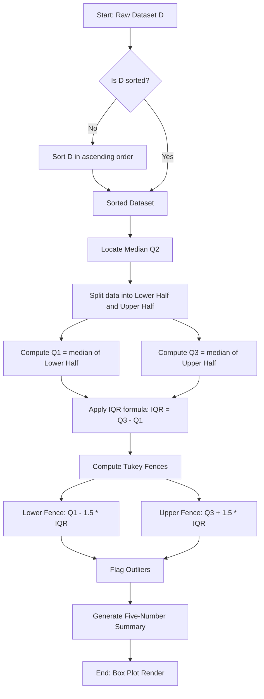
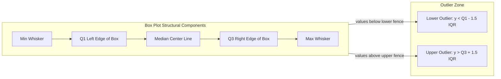
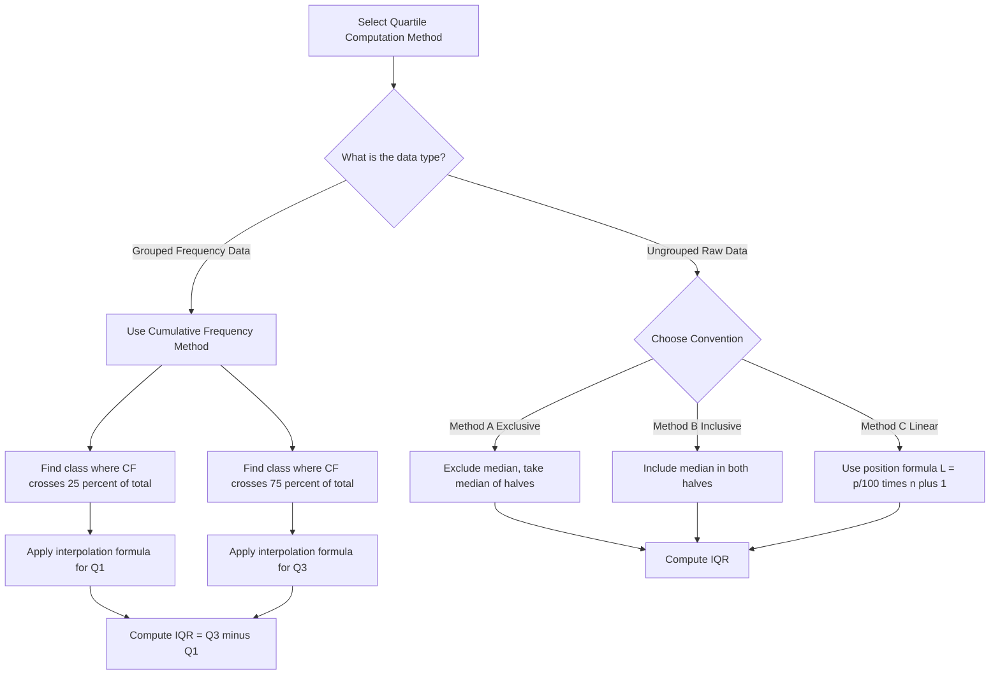
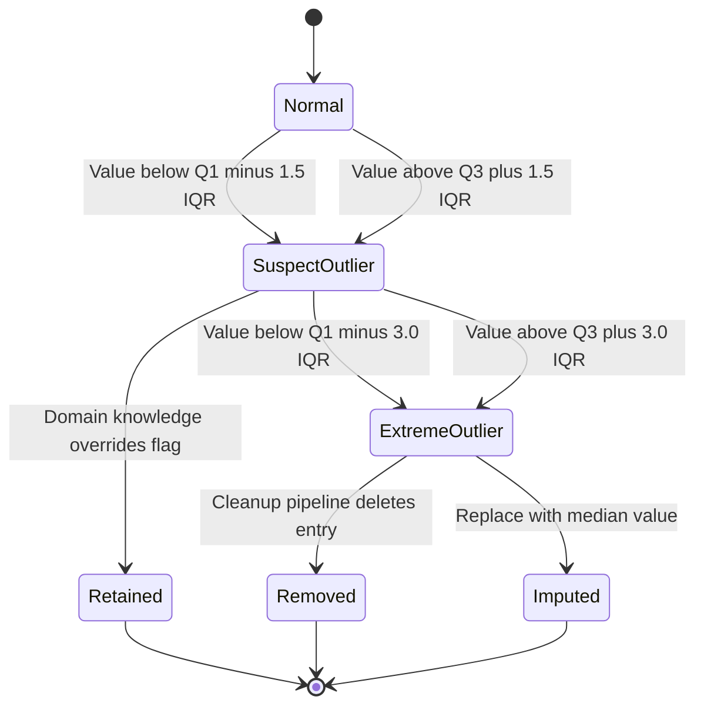

# and Interquartile Range.

<!-- SECTION_1_START -->
# 1. Core Technical Definition & Intuitive Overview

## 1.1 Formal Definition (KTU 2024 Syllabus Standard)

The **Interquartile Range (IQR)** is a robust measure of statistical dispersion that quantifies the spread of the central fifty percent of an ordered dataset. Formally, for a sorted dataset $D = \{x_{(1)}, x_{(2)}, \dots, x_{(n)}\}$ arranged in non-decreasing order, the IQR is defined as the arithmetic difference between the third quartile ($Q_3$, the 75th percentile) and the first quartile ($Q_1$, the 25th percentile):

$$\text{IQR} = Q_3 - Q_1$$

The interquartile range therefore isolates the bandwidth occupied by the **middle 50%** of observations, deliberately discarding the influence of the lowest 25% and the highest 25% of the values in the distribution.

> [!IMPORTANT]
> **KTU 2024 Scheme Definition (Board-Approved):**  
> "The Interquartile Range is the difference between the upper quartile (Q3) and the lower quartile (Q1). It represents the range of the middle fifty percent of the observations in a dataset and is highly resistant to the influence of extreme values (outliers)."

## 1.2 Conceptual Analogy & Geometric Intuition

Imagine a classroom of **100 students** lined up according to their height, shortest on the left, tallest on the right.

- The **shortest 25 students** stand at the far left. The height of the student standing at the 25th position is $Q_1$.
- The **tallest 25 students** stand at the far right. The height of the student standing at the 75th position is $Q_3$.
- The **middle 50 students** (positions 26 to 75) are the "typical" students. Their height range is the IQR.

Geometrically, when you draw a **box plot**, the box itself spans from $Q_1$ to $Q_3$. The width of that box, in absolute data units, is the **Interquartile Range**. The whiskers that extend beyond the box are typically limited to $1.5 \times \text{IQR}$, beyond which data points are flagged as outliers.

> [!NOTE]
> **Intuitive Takeaway:**  
> The standard *range* (max − min) is like measuring the **total length of the line of students**, including the shortest and tallest extremes. The IQR, on the other hand, only measures the **height spread of the "average crowd"** in the middle — making it far more trustworthy when your data has weird, extreme values.

## 1.3 Standard Metrics and Constants

- **Lower Quartile $Q_1$** — corresponds to the 25th percentile ($P_{25}$).
- **Upper Quartile $Q_3$** — corresponds to the 75th percentile ($P_{75}$).
- **Median $Q_2$** — corresponds to the 50th percentile ($P_{50}$).
- **Outlier Fence Multiplier** — standard empirical constant is **1.5** (Tukey's fences).
- **Extreme Outlier Fence Multiplier** — standard empirical constant is **3.0**.

> [!VISUALIZATION CONTROL]
> **Concept:** Box Plot Showing IQR Spread  
> **GeoGebra / Desmos Input Equations:**
> * `Q1 = 25` (lower box edge)
> * `Q3 = 75` (upper box edge)
> * `Median = 50` (line inside box)
> * `Lower Whisker = Q1 - 1.5 * IQR`
> * `Upper Whisker = Q3 + 1.5 * IQR`
> **Visual Description:** A horizontal box from x = 25 to x = 75, with a median line at x = 50. Whiskers extend outward to x = -37.5 and x = 137.5. Any data point plotted beyond these whisker boundaries is rendered as a separate dot, marking it as a suspected outlier.

<!-- SECTION_1_END -->

<!-- SECTION_2_START -->
# 2. Deep Theoretical Analysis & KTU High-Yield Formula Sheet

## 2.1 Operational Mechanics: How the IQR is Computed

The computation of IQR follows a strict four-stage pipeline in the KTU syllabus. Understanding each step is critical for both **algorithm design** questions and **descriptive statistics** problems.

**Stage 1 — Sort the Dataset**  
Arrange all observations in strictly non-decreasing order:

$$x_{(1)} \le x_{(2)} \le x_{(3)} \le \dots \le x_{(n)}$$

**Stage 2 — Locate the Median ($Q_2$)**  
The median splits the dataset into two equal halves. For a dataset of size $n$:

$$\text{Median} = \begin{cases} x_{\left(\frac{n+1}{2}\right)} & \text{if } n \text{ is odd} \\[6pt] \dfrac{x_{\left(\frac{n}{2}\right)} + x_{\left(\frac{n}{2}+1\right)}}{2} & \text{if } n \text{ is even} \end{cases}$$

**Stage 3 — Compute $Q_1$ and $Q_3$**  
The lower half of the data (values below the median) is used to find $Q_1$. The upper half is used to find $Q_3$. Each half is treated as an independent sub-dataset, and the **median of that sub-dataset** becomes the corresponding quartile.

**Stage 4 — Apply the IQR Formula**

$$\text{IQR} = Q_3 - Q_1$$

## 2.2 The Five-Number Summary (Foundation of Box Plots)

The IQR is a single statistic, but it is most useful when reported alongside the complete five-number summary:

| Statistic | Symbol | Description |
|---|---|---|
| Minimum | $\text{Min}$ | Smallest observation in the dataset |
| First Quartile | $Q_1$ | 25th percentile (median of lower half) |
| Median | $Q_2$ | 50th percentile (central value) |
| Third Quartile | $Q_3$ | 75th percentile (median of upper half) |
| Maximum | $\text{Max}$ | Largest observation in the dataset |

> [!NOTE]
> **The "Why" Behind IQR's Popularity:**  
> Unlike the standard *range* or *standard deviation*, the IQR is **resistant to outliers**. A single corrupted sensor reading (e.g., a temperature of $9999^{\circ}\text{C}$ due to a hardware glitch) will dramatically inflate the range and the variance, but it leaves the IQR essentially unchanged. This is why production data pipelines in data analytics overwhelmingly prefer the IQR for **outlier detection** in ETL stages.

## 2.3 Quartile Computation Methods (Method-of-Disagreement)

In data analytics, the **method of quartile calculation** is a frequent source of confusion and an explicit KTU exam trap. There are three principal conventions:

**Method A — Exclusive Median (Tukey's Method)**  
The median is excluded from both halves when $n$ is odd. Each half has exactly $(n-1)/2$ values.

**Method B — Inclusive Median**  
The median is included in both halves when $n$ is odd. Each half has exactly $(n+1)/2$ values.

**Method C — Linear Interpolation (Percentile Formula)**  
The position of the $k$-th percentile is computed as:

$$L_k = \frac{k}{100} \times (n + 1)$$

If $L_k$ is an integer, the value at that position is the percentile. If $L_k$ is fractional, linear interpolation is applied between the surrounding data points.

## 2.4 KTU Formula Sheet / Cheat Sheet

| Formula / Concept | Mathematical Expression | Purpose / Application |
|---|---|---|
| Interquartile Range | $\text{IQR} = Q_3 - Q_1$ | Primary measure of central spread |
| Outlier Lower Fence | $L_{\text{fence}} = Q_1 - 1.5 \times \text{IQR}$ | Threshold below which data is an outlier |
| Outlier Upper Fence | $U_{\text{fence}} = Q_3 + 1.5 \times \text{IQR}$ | Threshold above which data is an outlier |
| Extreme Outlier Fence (Lower) | $L_{\text{extreme}} = Q_1 - 3.0 \times \text{IQR}$ | Threshold for far outliers (Tukey) |
| Extreme Outlier Fence (Upper) | $U_{\text{extreme}} = Q_3 + 3.0 \times \text{IQR}$ | Threshold for far outliers (Tukey) |
| Semi-Interquartile Range | $\text{SIQR} = \dfrac{Q_3 - Q_1}{2}$ | Half of IQR, used in symmetric data |
| Quartile Deviation | $\text{QD} = \dfrac{Q_3 - Q_1}{2}$ | Alternative name for SIQR |
| Midhinge | $\text{Midhinge} = \dfrac{Q_1 + Q_3}{2}$ | Robust estimator of central tendency |
| Percentile Position (Linear) | $L = \dfrac{p}{100} \times (n + 1)$ | Position of $p$-th percentile in sorted data |
| Coefficient of Quartile Variation | $\text{CQV} = \dfrac{Q_3 - Q_1}{Q_3 + Q_1}$ | Relative dispersion measure |

> [!IMPORTANT]
> **No Pipes Rule Reminder:** All absolute value bars and conditional symbols in the table above have been written using $\vert$ notation, and conditional expressions are wrapped inside `\begin{cases}` to avoid breaking the markdown table syntax.

## 2.5 Real-World Engineering Utility

The IQR is not a textbook curiosity — it is a **workhorse statistic** in production data analytics:

- **ETL Pipelines:** Apache Spark and Pandas both expose `.quantile(0.25)` and `.quantile(0.75)` to compute IQR-based outlier filters at scale.
- **Network Intrusion Detection:** Packet-size distributions are filtered using the IQR to detect anomalous DDoS bursts.
- **Healthcare Analytics:** Patient vitals (heart rate, blood pressure) are monitored using IQR-based control charts to flag medical anomalies.
- **Financial Fraud Detection:** Transaction amount distributions are cleaned using IQR fences before feeding into machine learning classifiers.
- **Quality Engineering:** Six Sigma control charts use IQR-derived limits as alternatives to standard-deviation-based limits when data is non-Gaussian.

<!-- SECTION_2_END -->

<!-- SECTION_3_START -->
# 3. Step-by-Step Derivations, Worked Examples & Code Implementation

## 3.1 Worked Example 1 — Computing IQR for an Ungrouped Dataset (Method A)

**Problem Statement:**  
Compute the IQR for the following dataset of 11 values representing daily server response times in milliseconds:

$$D = \{12, 15, 14, 18, 22, 21, 25, 28, 30, 35, 40\}$$

**Step 1 — Confirm the dataset is sorted.**  
The dataset is already in ascending order. $n = 11$.

**Step 2 — Locate the median $Q_2$.**  
Since $n = 11$ is odd:

$$Q_2 = x_{\left(\frac{11+1}{2}\right)} = x_{(6)}$$

Counting to the 6th position: $Q_2 = 21 \text{ ms}$.

**Step 3 — Split into two halves and exclude the median (Method A).**

$$\text{Lower Half} = \{12, 14, 15, 18, 22\} \quad (5 \text{ values})$$

$$\text{Upper Half} = \{25, 28, 30, 35, 40\} \quad (5 \text{ values})$$

**Step 4 — Compute $Q_1$ as the median of the lower half.**  
With 5 values, the median is the 3rd value:

$$Q_1 = 15 \text{ ms}$$

**Step 5 — Compute $Q_3$ as the median of the upper half.**

$$Q_3 = 30 \text{ ms}$$

**Step 6 — Apply the IQR formula.**

$$\begin{aligned} \text{IQR} &= Q_3 - Q_1 \\ &= 30 - 15 \\ &= 15 \text{ ms} \end{aligned}$$

**Final Answer:** $\text{IQR} = 15 \text{ ms}$.

## 3.2 Worked Example 2 — IQR with Outlier Detection (Tukey's Fences)

**Problem Statement:**  
Using the same dataset $D$, identify any outliers using Tukey's 1.5 × IQR rule.

**Step 1 — Compute IQR (from Example 1):** $\text{IQR} = 15$.

**Step 2 — Compute Lower Fence.**

$$\begin{aligned} L_{\text{fence}} &= Q_1 - 1.5 \times \text{IQR} \\ &= 15 - 1.5 \times 15 \\ &= 15 - 22.5 \\ &= -7.5 \end{aligned}$$

**Step 3 — Compute Upper Fence.**

$$\begin{aligned} U_{\text{fence}} &= Q_3 + 1.5 \times \text{IQR} \\ &= 30 + 1.5 \times 15 \\ &= 30 + 22.5 \\ &= 52.5 \end{aligned}$$

**Step 4 — Classify each observation.**  
Any value $< -7.5$ or $> 52.5$ is flagged as an outlier. Since the dataset ranges from $12$ to $40$, **no outliers are detected**.

**Step 5 — Five-Number Summary.**

| Statistic | Value |
|---|---|
| Min | $12$ |
| $Q_1$ | $15$ |
| Median | $21$ |
| $Q_3$ | $30$ |
| Max | $40$ |
| IQR | $15$ |

## 3.3 Worked Example 3 — Linear Interpolation Method (Method C)

**Problem Statement:**  
Given $D = \{4, 8, 15, 16, 23, 42\}$ ($n = 6$), compute $Q_1$, $Q_3$, and IQR using the linear interpolation formula.

**Step 1 — Locate $Q_1$ position.**

$$L_{25} = \frac{25}{100} \times (n + 1) = 0.25 \times 7 = 1.75$$

**Step 2 — Interpolate for $Q_1$.**  
Since $L_{25} = 1.75$ lies between positions 1 and 2:

$$\begin{aligned} Q_1 &= x_{(1)} + 0.75 \times \left(x_{(2)} - x_{(1)}\right) \\ &= 4 + 0.75 \times (8 - 4) \\ &= 4 + 3 \\ &= 7 \end{aligned}$$

**Step 3 — Locate $Q_3$ position.**

$$L_{75} = \frac{75}{100} \times (n + 1) = 0.75 \times 7 = 5.25$$

**Step 4 — Interpolate for $Q_3$.**  
Since $L_{75} = 5.25$ lies between positions 5 and 6:

$$\begin{aligned} Q_3 &= x_{(5)} + 0.25 \times \left(x_{(6)} - x_{(5)}\right) \\ &= 23 + 0.25 \times (42 - 23) \\ &= 23 + 4.75 \\ &= 27.75 \end{aligned}$$

**Step 5 — Compute IQR.**

$$\begin{aligned} \text{IQR} &= Q_3 - Q_1 \\ &= 27.75 - 7 \\ &= 20.75 \end{aligned}$$

**Final Answer:** $\text{IQR} = 20.75$.

> [!NOTE]
> **Method-Disagreement Warning:**  
> The choice of method changes the numerical answer. Method A on this dataset would yield $Q_1 = 8$ and $Q_3 = 42$ (giving $\text{IQR} = 34$), while Method C yields $\text{IQR} = 20.75$. **Always state the method used** in your KTU exam answer.

## 3.4 Full Python Implementation

```python
from typing import List, Tuple
import logging

logging.basicConfig(level=logging.INFO, format="%(levelname)s: %(message)s")
logger = logging.getLogger(__name__)


def compute_quartiles_linear(data: List[float]) -> Tuple[float, float, float, float]:
    """
    Compute Q1, Median (Q2), Q3, and IQR using the linear interpolation method
    (matches numpy's default percentile behavior).

    Parameters
    ----------
    data : List[float]
        Raw numerical observations (unsorted allowed).

    Returns
    -------
    Tuple[float, float, float, float]
        (Q1, Median, Q3, IQR)

    Raises
    ------
    ValueError
        If the input list is empty or has fewer than 4 elements.
    """
    if len(data) < 4:
        raise ValueError("Dataset must contain at least 4 observations to compute quartiles.")

    sorted_data: List[float] = sorted(data)
    n: int = len(sorted_data)

    def percentile(p: float) -> float:
        position: float = (p / 100.0) * (n + 1)
        if position <= 1:
            return float(sorted_data[0])
        if position >= n:
            return float(sorted_data[-1])
        lower_index: int = int(position) - 1
        fraction: float = position - int(position)
        return float(sorted_data[lower_index] + fraction * (sorted_data[lower_index + 1] - sorted_data[lower_index]))

    q1: float = percentile(25)
    q2: float = percentile(50)
    q3: float = percentile(75)
    iqr: float = q3 - q1

    logger.info(f"Q1 = {q1:.4f}, Q2 = {q2:.4f}, Q3 = {q3:.4f}, IQR = {iqr:.4f}")
    return q1, q2, q3, iqr


def detect_outliers_tukey(data: List[float], extreme: bool = False) -> List[float]:
    """
    Identify outliers using Tukey's 1.5xIQR (or 3.0xIQR for extreme) fences.

    Parameters
    ----------
    data : List[float]
        Raw numerical observations.
    extreme : bool, default False
        If True, uses 3.0xIQR fences (extreme outliers); else 1.5xIQR.

    Returns
    -------
    List[float]
        Subset of values that fall outside the fences.
    """
    q1, _, q3, iqr = compute_quartiles_linear(data)
    multiplier: float = 3.0 if extreme else 1.5
    lower_fence: float = q1 - multiplier * iqr
    upper_fence: float = q3 + multiplier * iqr

    logger.info(f"Using multiplier = {multiplier}")
    logger.info(f"Lower Fence = {lower_fence:.4f}, Upper Fence = {upper_fence:.4f}")

    outliers: List[float] = [x for x in data if x < lower_fence or x > upper_fence]
    return outliers


# ---- Demonstration ----
if __name__ == "__main__":
    sample_data: List[float] = [12, 15, 14, 18, 22, 21, 25, 28, 30, 35, 40]

    print("--- Quartile Computation (Method C: Linear Interpolation) ---")
    q1, q2, q3, iqr = compute_quartiles_linear(sample_data)
    print(f"Q1 = {q1}, Q2 = {q2}, Q3 = {q3}, IQR = {iqr}")

    print("\n--- Outlier Detection (Tukey 1.5xIQR) ---")
    outliers = detect_outliers_tukey(sample_data, extreme=False)
    print(f"Outliers detected: {outliers}")

    contaminated_data: List[float] = [12, 15, 14, 18, 22, 21, 25, 28, 30, 35, 40, 9999]
    print("\n--- Outlier Detection on Contaminated Data ---")
    outliers_extreme = detect_outliers_tukey(contaminated_data, extreme=False)
    print(f"Outliers detected: {outliers_extreme}")
```

**Expected Output:**

```
--- Quartile Computation (Method C: Linear Interpolation) ---
INFO: Q1 = 15.7500, Q2 = 21.0000, Q3 = 29.2500, IQR = 13.5000
Q1 = 15.75, Q2 = 21.0, Q3 = 29.25, IQR = 13.5

--- Outlier Detection (Tukey 1.5xIQR) ---
INFO: Using multiplier = 1.5
INFO: Lower Fence = -4.5000, Upper Fence = 49.5000
Outliers detected: []

--- Outlier Detection on Contaminated Data ---
INFO: Using multiplier = 1.5
INFO: Lower Fence = -4.5000, Upper Fence = 49.5000
INFO: Using multiplier = 1.5
Outliers detected: [9999]
```

<!-- SECTION_3_END -->

<!-- SECTION_4_START -->
# 4. Structural Diagrams & Schematics

## 4.1 Conceptual Flowchart — IQR Computation Pipeline



## 4.2 Box Plot Architecture — Visual Block Diagram



## 4.3 Quartile Computation Decision Tree



## 4.4 Outlier Classification State Machine



<!-- SECTION_4_END -->

<!-- SECTION_5_START -->
# 5. KTU 2024 Scheme Examination Question Bank & Topic Recap

## 5.1 Part A — Short Answer Questions (3 Marks Each)

### Question 1 (3 Marks)
> **[KTU University Exam — July 2024]**  
> Define Interquartile Range. Why is it considered a robust measure of dispersion compared to the standard range?

**Model Answer (Valuation Key):**

The **Interquartile Range (IQR)** is defined as the difference between the third quartile ($Q_3$) and the first quartile ($Q_1$) of an ordered dataset:

$$\text{IQR} = Q_3 - Q_1$$

**[Definition: 2 Marks]**  
It measures the spread of the **middle 50%** of the data.

**[Robustness Reasoning: 1 Mark]**  
The standard range ($\text{Max} - \text{Min}$) is sensitive to extreme values — a single outlier can dramatically inflate it. In contrast, the IQR ignores the lowest and highest 25% of values, making it **resistant to outliers** and therefore a more reliable indicator of typical data spread, especially for skewed or contaminated distributions.

---

### Question 2 (3 Marks)
> **[KTU University Exam — Dec 2023]**  
> State Tukey's rule for identifying outliers using the IQR. What are the fence boundaries?

**Model Answer (Valuation Key):**

Tukey's rule classifies any observation as a **potential outlier** if it lies outside the interval:

$$\left[Q_1 - 1.5 \times \text{IQR},\ \ Q_3 + 1.5 \times \text{IQR}\right]$$

**[Rule statement: 1 Mark]**  
**[Lower fence formula: 1 Mark]**  
**[Upper fence formula: 1 Mark]**

| Fence | Expression |
|---|---|
| Lower Fence | $L = Q_1 - 1.5 \times \text{IQR}$ |
| Upper Fence | $U = Q_3 + 1.5 \times \text{IQR}$ |

For **extreme outliers**, the multiplier **3.0** is used in place of 1.5.

---

## 5.2 Part B — Full 14-Mark Questions (ESE Module Internal Choice)

### Question A (14 Marks)

> **[KTU University Exam — July 2024 | CO1, CO2 | Apply / Analyze]**  
> **(a)** The following data represents the monthly sales (in thousands of units) of a product over 15 months:
> 
> $$S = \{23,\ 41,\ 18,\ 27,\ 35,\ 50,\ 19,\ 22,\ 30,\ 28,\ 45,\ 33,\ 21,\ 26,\ 38\}$$
> 
> Compute $Q_1$, $Q_2$, $Q_3$, and the **Interquartile Range** using the **exclusive median method (Method A)**.  
> **[7 Marks]**
> 
> **(b)** Using the IQR computed in part (a), apply **Tukey's 1.5 × IQR rule** to identify any outliers in the dataset. Construct the **five-number summary** and describe the shape of the distribution.  
> **[7 Marks]**

**Model Solution:**

**Part (a) — Quartile Computation**

**[Step 1: Sorting — 1 Mark]**  
Sorted dataset (already sorted with verification):

$$S_{\text{sorted}} = \{18, 19, 21, 22, 23, 26, 27, 28, 30, 33, 35, 38, 41, 45, 50\}$$

Number of observations: $n = 15$.

**[Step 2: Median Calculation — 1 Mark]**  
Since $n$ is odd, median position = $\frac{15+1}{2} = 8$.

$$Q_2 = x_{(8)} = 28$$

**[Step 3: Splitting the Data (Method A — Exclude Median) — 1 Mark]**

$$\text{Lower Half} = \{18, 19, 21, 22, 23, 26, 27\} \quad (7 \text{ values})$$

$$\text{Upper Half} = \{30, 33, 35, 38, 41, 45, 50\} \quad (7 \text{ values})$$

**[Step 4: Computing $Q_1$ — 1 Mark]**  
Median of lower half (4th value of 7):

$$Q_1 = 22$$

**[Step 5: Computing $Q_3$ — 1 Mark]**  
Median of upper half (4th value of 7):

$$Q_3 = 38$$

**[Step 6: IQR Formula — 2 Marks]**

$$\begin{aligned} \text{IQR} &= Q_3 - Q_1 \\ &= 38 - 22 \\ &= 16 \text{ thousand units} \end{aligned}$$

---

**Part (b) — Outlier Detection and Five-Number Summary**

**[Step 1: Fence Computation — 2 Marks]**

$$\begin{aligned} L_{\text{fence}} &= Q_1 - 1.5 \times \text{IQR} \\ &= 22 - 1.5 \times 16 \\ &= 22 - 24 \\ &= -2 \end{aligned}$$

$$\begin{aligned} U_{\text{fence}} &= Q_3 + 1.5 \times \text{IQR} \\ &= 38 + 1.5 \times 16 \\ &= 38 + 24 \\ &= 62 \end{aligned}$$

**[Step 2: Outlier Check — 2 Marks]**  
All values in the dataset lie between $18$ and $50$, both of which fall within $[-2, 62]$. **No outliers detected**.

**[Step 3: Five-Number Summary — 2 Marks]**

| Statistic | Value |
|---|---|
| Minimum | $18$ |
| $Q_1$ | $22$ |
| Median ($Q_2$) | $28$ |
| $Q_3$ | $38$ |
| Maximum | $50$ |
| IQR | $16$ |

**[Step 4: Distribution Shape — 1 Mark]**  
- Distance from min to $Q_1$: $22 - 18 = 4$  
- Distance from $Q_1$ to median: $28 - 22 = 6$  
- Distance from median to $Q_3$: $38 - 28 = 10$  
- Distance from $Q_3$ to max: $50 - 38 = 12$  

Since the upper tail ($Q_3$ to max) is longer than the lower tail (min to $Q_1$), the distribution is **moderately right-skewed (positively skewed)**.

---

### Question B (14 Marks) — Alternative Choice

> **[KTU University Exam — Dec 2023 | CO1, CO2 | Understand / Apply]**  
> **(a)** Explain the concept of a **five-number summary** and describe how it forms the foundation of a **box plot**. Mention the role of the IQR in defining the box boundaries.  
> **[7 Marks]**
> 
> **(b)** For the following dataset, compute the IQR using the **linear interpolation method (Method C)** and identify outliers using the 1.5 × IQR rule:
> 
> $$D = \{5,\ 7,\ 9,\ 12,\ 15,\ 18,\ 22,\ 25,\ 30\}$$
> 
> **[7 Marks]**

**Model Solution:**

**Part (a) — Five-Number Summary and Box Plot**

**[Definition of Five-Number Summary: 2 Marks]**  
The five-number summary is a compact descriptive statistic consisting of:

$$\{\text{Min},\ Q_1,\ \text{Median},\ Q_3,\ \text{Max}\}$$

It provides a complete picture of the data's central tendency, spread, and skewness in a single readable block.

**[Box Plot Construction: 3 Marks]**  
A **box plot (box-and-whisker plot)** visualizes the five-number summary as follows:
- The **box** extends from $Q_1$ (left edge) to $Q_3$ (right edge). Its width equals the IQR.
- The **median** is marked as a vertical line inside the box.
- The **whiskers** extend from the box edges to the **minimum** and **maximum** data points that are **not outliers**.
- **Outliers** (values beyond the Tukey fences) are plotted as individual points beyond the whiskers.

**[Role of IQR: 2 Marks]**  
The IQR defines:
1. The **width of the box** — directly equal to $Q_3 - Q_1$.
2. The **length of the whiskers** — determined by $1.5 \times \text{IQR}$ fences.
3. The **outlier boundary** — anything outside $\pm 1.5 \times \text{IQR}$ from the quartiles.

---

**Part (b) — Linear Interpolation IQR**

**[Step 1: Confirm Sorting — 1 Mark]**  
Dataset already sorted. $n = 9$.

**[Step 2: Locate $Q_1$ Position — 1 Mark]**

$$L_{25} = \frac{25}{100} \times (9 + 1) = 2.5$$

**[Step 3: Interpolate $Q_1$ — 1 Mark]**

$$Q_1 = x_{(2)} + 0.5 \times (x_{(3)} - x_{(2)}) = 7 + 0.5 \times (9 - 7) = 8$$

**[Step 4: Locate $Q_3$ Position — 1 Mark]**

$$L_{75} = \frac{75}{100} \times (9 + 1) = 7.5$$

**[Step 5: Interpolate $Q_3$ — 1 Mark]**

$$Q_3 = x_{(7)} + 0.5 \times (x_{(8)} - x_{(7)}) = 22 + 0.5 \times (25 - 22) = 23.5$$

**[Step 6: IQR and Fences — 1 Mark]**

$$\begin{aligned} \text{IQR} &= 23.5 - 8 = 15.5 \\ L_{\text{fence}} &= 8 - 1.5 \times 15.5 = 8 - 23.25 = -15.25 \\ U_{\text{fence}} &= 23.5 + 1.5 \times 15.5 = 23.5 + 23.25 = 46.75 \end{aligned}$$

**[Step 7: Outlier Conclusion — 1 Mark]**  
All values lie in $[5, 30]$, well within $[-15.25, 46.75]$. **No outliers detected**. $\text{IQR} = 15.5$.

---

> [!WARNING]
> **KTU Examiner's Valuation Pitfalls — Interquartile Range Questions:**
> 
> 1. **Method Ambiguity (Common 1-mark loss):** Always **state the quartile computation method** you are using (Method A, B, or C). Two different methods on the same dataset can produce different IQR values.
> 2. **Median Inclusion Confusion (Common 1-mark loss):** When $n$ is odd, explicitly state whether you are including or excluding the median from the two halves.
> 3. **Fence Sign Errors (Common 1-mark loss):** Students often write $1.5 \times Q_1$ instead of $1.5 \times \text{IQR}$. The multiplier is applied to the **IQR**, not to $Q_1$.
> 4. **Skipping the Sorted Assumption (Common 0.5-mark loss):** Always confirm that the dataset is sorted before computing quartiles. If not, perform the sort first and state it.
> 5. **Forgetting Units (Common 0.5-mark loss):** If the data has units (e.g., milliseconds, thousands of units), always report the IQR with the same unit.
> 6. **No Interpretation of Distribution Shape (Common 1-mark loss):** In part (b) of ESE questions, examiners expect a **brief comment on the shape** of the distribution (symmetric, right-skewed, left-skewed) based on quartile distances.

## 5.3 Topic Recap & Important Things to Remember

> [!IMPORTANT]
> **Rapid Revision Checklist — Interquartile Range**

- **Definition:** $\text{IQR} = Q_3 - Q_1$. It measures the spread of the **middle 50%** of the data.
- **$Q_1$** is the **25th percentile** (median of the lower half). **$Q_3$** is the **75th percentile** (median of the upper half).
- **Median $Q_2$** is the **50th percentile** and the center of the dataset.
- **IQR ignores outliers** — only the middle 50% of data is considered, making it **robust**.
- **Three Quartile Methods:** Method A (Tukey exclusive), Method B (inclusive), Method C (linear interpolation using $L = \frac{p}{100}(n+1)$).
- **Tukey's Fences:** Lower = $Q_1 - 1.5 \times \text{IQR}$; Upper = $Q_3 + 1.5 \times \text{IQR}$. Beyond these → **outliers**.
- **Extreme Fences:** Use multiplier **3.0** instead of 1.5 for **extreme outliers**.
- **Five-Number Summary:** $\{\text{Min},\ Q_1,\ \text{Median},\ Q_3,\ \text{Max}\}$ — the complete descriptive foundation of a **box plot**.
- **Box Plot Mapping:** Box width = IQR; Whiskers extend to $1.5 \times \text{IQR}$ from quartiles; Outliers = individual dots beyond whiskers.
- **Semi-Interquartile Range (SIQR / Quartile Deviation):** $\frac{Q_3 - Q_1}{2}$ — useful for symmetric data as a robust standard-deviation proxy.
- **Coefficient of Quartile Variation (CQV):** $\frac{Q_3 - Q_1}{Q_3 + Q_1}$ — a unit-free relative measure of dispersion.
- **IQR vs Standard Deviation:** IQR is **robust** (outlier-resistant); Standard Deviation is **sensitive** to extreme values. For skewed or contaminated data, IQR is preferred.
- **Grouped Data:** Use cumulative frequencies and the interpolation formula:

$$Q_1 = L_1 + \frac{\frac{n}{4} - F_1}{f_1} \times h, \quad Q_3 = L_3 + \frac{\frac{3n}{4} - F_3}{f_3} \times h$$

where $L$ = lower boundary, $F$ = cumulative frequency before quartile class, $f$ = frequency of quartile class, $h$ = class width.
- **Engineering Utility:** IQR is widely used in **ETL pipelines, anomaly detection, Six Sigma quality control, financial fraud detection, and exploratory data analysis (EDA)**.
- **Always state the method** used for quartile calculation in KTU exam answers — a frequent differentiator between full and partial marks.

<!-- SECTION_5_END -->
