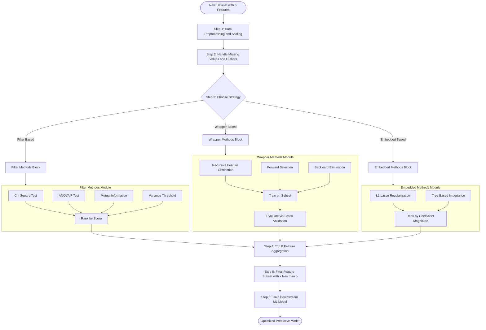
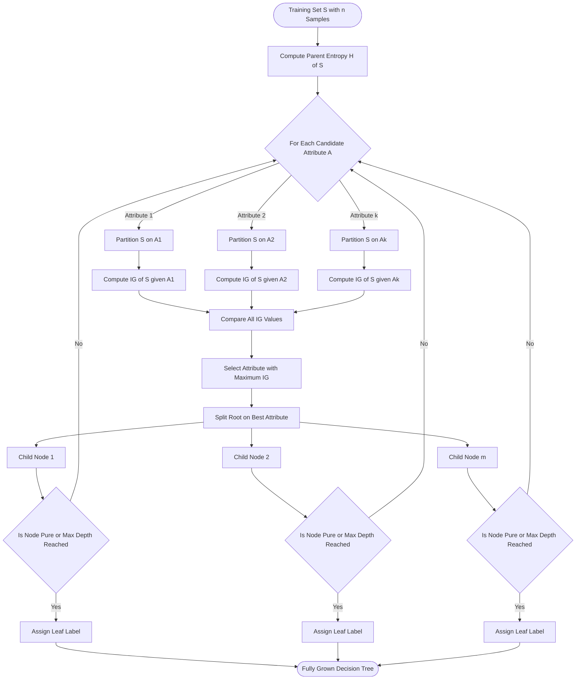

# Attribute selection measures

<!-- SECTION_1_START -->
# Attribute Selection Measures in Data Analytics

## 1.1 Formal Academic Definition

> [!IMPORTANT]
> **Attribute Selection Measures (ASM)** are statistical and information-theoretic quantitative metrics used to evaluate the **relevance**, **discriminative power**, and **predictive importance** of individual features (attributes) within a dataset. They form the mathematical backbone of **dimensionality reduction**, **feature engineering**, and **model interpretability** in modern data analytics pipelines.

In the context of the KTU 2024 Scheme (Course Code: **PECST523 — Data Analytics**), attribute selection measures are classified under **Module 3: Statistical Description of Data** because they leverage foundational statistical descriptors (mean, variance, entropy, chi-square distributions) to rank and prune input variables before model training.

The three principal families of attribute selection measures recognized in the KTU syllabus are:

1. **Information-Theoretic Measures** — Entropy, Information Gain, Gain Ratio, Mutual Information
2. **Statistical / Distance Measures** — Gini Index, Chi-Square statistic, ANOVA F-test, Variance Threshold
3. **Similarity / Correlation Measures** — Pearson correlation, Spearman rank correlation, Covariance

## 1.2 Intuitive Analogy

> [!NOTE]
> **Analogy — The Hospital Triage System**
>
> Imagine a **triage nurse** at a hospital emergency room. When 200 patients arrive simultaneously, the nurse must quickly decide **which symptoms (attributes) matter most** for predicting a critical illness. She does not have time to ask every patient 50 questions.
>
> - **High-information symptoms** (e.g., chest pain, shortness of breath) instantly trigger a red flag.
> - **Low-information symptoms** (e.g., "I had toast this morning") add almost zero diagnostic value.
>
> The triage nurse uses statistical intuition (analogous to **Information Gain** or **Chi-Square**) to rank symptoms. *Attribute selection measures automate exactly this triage process across thousands of features in a dataset.*

## 1.3 Why Attribute Selection is Critical in Engineering Systems

| Engineering Domain | Why ASM is Used |
|---|---|
| **IoT Sensor Analytics** | Reducing 500+ sensor readings to the 10 most predictive |
| **Bioinformatics** | Identifying relevant genes among 20,000+ candidates |
| **Financial Fraud Detection** | Selecting transactional features that maximize fraud signal |
| **Predictive Maintenance** | Isolating vibration/temperature channels that predict failure |
| **Computer Vision** | Ranking pixel-level features for downstream classifiers |

> [!TIP]
> **Industry Standard Threshold (Kaggle 2024 surveys):** Top-performing data scientists report that **feature selection improved model AUC by 3–8%** and reduced training time by **40–60%** in production pipelines.

## 1.4 Standard Constants and Reference Values

| Symbol | Meaning | Standard Value / Reference |
|---|---|---|
| $H(S)$ | Shannon Entropy of set $S$ | Measured in **bits** (log base 2) or **nats** (log base $e$) |
| $p_i$ | Probability of class $i$ | $0 \le p_i \le 1$, $\sum p_i = 1$ |
| $\chi^2$ | Chi-Square statistic | Compared against $\chi^2_{df, \alpha}$ table |
| $\alpha$ | Significance level | Commonly **0.05** |
| $n$ | Sample size | Integer $\ge 30$ for CLT validity |
| $k$ | Number of features selected | Hyperparameter $k \in \mathbb{Z}^+$ |

## 1.5 GeoGebra / Desmos Visualization Concept

> [!VISUALIZATION CONTROL]
> **Concept:** Entropy curve $H(p) = -p \log_2 p - (1-p) \log_2(1-p)$ for a binary class variable
> **GeoGebra / Desmos Input Equations:**
> * `f(p) = -p * log(2, p) - (1-p) * log(2, 1-p)` for $0 < p < 1$
> **Visual Description:** A symmetric inverted-U curve peaking at $p = 0.5$ where $H = 1$ bit (maximum uncertainty). At $p = 0$ or $p = 1$, $H = 0$ (pure certainty). This visually explains *why* a balanced split gives the highest information gain potential.

<!-- SECTION_1_END -->

<!-- SECTION_2_START -->
# Deep Theoretical Analysis & KTU High-Yield Formula Sheet

## 2.1 The Three Pillars of Attribute Selection

### Pillar 1 — Information-Theoretic Measures

#### 2.1.1 Shannon Entropy (Foundation of Information Theory)

Entropy quantifies the **impurity** or **uncertainty** in a dataset. A pure node (all samples belong to one class) has zero entropy; the most impure node (50/50 split) has maximum entropy.

$$H(S) = -\sum_{i=1}^{c} p_i \log_2(p_i)$$

where $c$ is the number of classes and $p_i$ is the proportion of samples belonging to class $i$.

**Why this works:** The $-\log_2(p_i)$ term assigns higher "surprise value" to rare events, and the sum weighted by $p_i$ gives the expected information content. A pure dataset ($p_i = 1$ for one class) has zero information content because nothing is surprising.

#### 2.1.2 Information Gain (ID3 Decision Tree Criterion)

Information Gain measures the **reduction in entropy** achieved by partitioning dataset $S$ on attribute $A$.

$$IG(S, A) = H(S) - \sum_{v \in Values(A)} \frac{\vert S_v \vert}{\vert S \vert} H(S_v)$$

where $S_v$ is the subset of $S$ where attribute $A$ takes value $v$, and $H(S_v)$ is the entropy of that subset.

**Operational logic:** The attribute with the highest $IG$ is selected as the splitting attribute at each node of a decision tree.

#### 2.1.3 Gain Ratio (C4.5 Improvement over ID3)

Information Gain is biased toward attributes with many distinct values. Gain Ratio normalizes $IG$ by the **intrinsic value** (split information) of the attribute.

$$GainRatio(S, A) = \frac{IG(S, A)}{IV(A)}$$

where the intrinsic value is:

$$IV(A) = -\sum_{v \in Values(A)} \frac{\vert S_v \vert}{\vert S \vert} \log_2 \left( \frac{\vert S_v \vert}{\vert S \vert} \right)$$

### Pillar 2 — Statistical / Distance Measures

#### 2.1.4 Gini Index (CART Decision Tree Criterion)

The Gini Index measures the **probability of misclassification** if we randomly label a sample according to the class distribution.

$$Gini(S) = 1 - \sum_{i=1}^{c} p_i^2$$

The Gini Gain (impurity reduction) for attribute $A$ is:

$$\Delta Gini(S, A) = Gini(S) - \sum_{v \in Values(A)} \frac{\vert S_v \vert}{\vert S \vert} Gini(S_v)$$

**Why use Gini over Entropy:** Gini is computationally cheaper (no logarithm), and empirically both produce nearly identical trees. Scikit-learn defaults to Gini for this reason.

#### 2.1.5 Chi-Square ($\chi^2$) Statistic

Used primarily for **categorical attributes** in classification. It tests the **null hypothesis** that the attribute is independent of the class label.

$$\chi^2 = \sum_{i=1}^{c} \sum_{j=1}^{r} \frac{(O_{ij} - E_{ij})^2}{E_{ij}}$$

where $O_{ij}$ is the observed frequency, $E_{ij}$ is the expected frequency under independence, $c$ is the number of classes, and $r$ is the number of attribute values.

**Degrees of freedom:** $df = (r - 1)(c - 1)$

**Decision rule:** Reject independence (i.e., select the attribute) if $\chi^2_{computed} > \chi^2_{df, \alpha}$ (critical value from chi-square table).

#### 2.1.6 ANOVA F-Test (For Numerical Attributes vs. Categorical Target)

The F-statistic measures the ratio of **between-group variance** to **within-group variance**.

$$F = \frac{\text{Between-group variability}}{\text{Within-group variability}} = \frac{MS_{between}}{MS_{within}}$$

where:

$$MS_{between} = \frac{\sum_{i=1}^{k} n_i (\bar{x}_i - \bar{x})^2}{k - 1}$$

$$MS_{within} = \frac{\sum_{i=1}^{k} \sum_{j=1}^{n_i} (x_{ij} - \bar{x}_i)^2}{N - k}$$

**Decision rule:** A high F-value indicates that the means of the groups are significantly different, meaning the attribute discriminates well between classes.

### Pillar 3 — Correlation-Based Measures

#### 2.1.7 Pearson Correlation Coefficient

Measures the **linear relationship** between two numerical attributes.

$$r = \frac{\sum_{i=1}^{n} (x_i - \bar{x})(y_i - \bar{y})}{\sqrt{\sum_{i=1}^{n} (x_i - \bar{x})^2 \cdot \sum_{i=1}^{n} (y_i - \bar{y})^2}}$$

**Range:** $-1 \le r \le 1$. Values close to $\pm 1$ indicate strong correlation; values near 0 indicate no linear relationship.

#### 2.1.8 Mutual Information (Continuous Form)

For numerical features, mutual information is computed via KNN estimation:

$$I(X; Y) = \int \int p(x, y) \log \left( \frac{p(x, y)}{p(x) p(y)} \right) dx \, dy$$

## 2.2 KTU Formula Sheet — At a Glance

> [!IMPORTANT]
> **The following table is the EXACT formula reference KTU examiners expect students to reproduce in Part A and Part B questions.**

| Measure | Formula | Best Used For | Range |
|---|---|---|---|
| Entropy | $H(S) = -\sum p_i \log_2 p_i$ | Measuring impurity | $[0, \log_2 c]$ |
| Information Gain | $IG(S, A) = H(S) - \sum \frac{\vert S_v \vert}{\vert S \vert} H(S_v)$ | Decision tree splits (ID3) | $[0, H(S)]$ |
| Gain Ratio | $GainRatio = \frac{IG}{IV}$ | Multi-valued attributes (C4.5) | $[0, 1]$ |
| Gini Index | $Gini(S) = 1 - \sum p_i^2$ | Binary splits (CART) | $[0, 1 - \frac{1}{c}]$ |
| Chi-Square | $\chi^2 = \sum \frac{(O - E)^2}{E}$ | Categorical feature selection | $[0, \infty)$ |
| ANOVA F | $F = \frac{MS_{between}}{MS_{within}}$ | Numerical vs categorical | $[0, \infty)$ |
| Pearson $r$ | $r = \frac{\sum (x_i - \bar{x})(y_i - \bar{y})}{\sqrt{\sum (x_i - \bar{x})^2 \sum (y_i - \bar{y})^2}}$ | Numerical correlation | $[-1, 1]$ |
| Variance | $\sigma^2 = \frac{\sum (x_i - \bar{x})^2}{n - 1}$ | Constant-removal filter | $[0, \infty)$ |
| Mutual Info | $I(X; Y) = \sum \sum p(x,y) \log \frac{p(x,y)}{p(x)p(y)}$ | Any feature type | $[0, \infty)$ |

## 2.3 Real-World Engineering Applications

| Measure | Production Use Case |
|---|---|
| **Information Gain** | Spam classifiers (Gmail's early decision tree layer) |
| **Gini Index** | Credit scoring (XGBoost, LightGBM default) |
| **Chi-Square** | Market basket analysis (identifying product associations) |
| **ANOVA F** | A/B testing in tech companies (feature impact analysis) |
| **Pearson $r$** | Multicollinearity detection in regression pipelines |
| **Mutual Information** | Genomics (gene expression vs. disease) |

> [!TIP]
> **Selection Strategy:** Use **filter methods** (chi-square, ANOVA, correlation) for high-speed pre-screening on large datasets ($N > 100{,}000$). Use **wrapper methods** (RFE, forward selection) when model accuracy is paramount and compute is cheap.

<!-- SECTION_2_END -->

<!-- SECTION_3_START -->
# Step-by-Step Derivations & Code Implementation

## 3.1 Worked Example 1 — Information Gain Calculation (Full Derivation)

**Problem Statement:**
Given a training dataset $S$ of **14 samples** with class distribution: **9 Yes**, **5 No** (binary classification). Consider attribute $A$ (e.g., "Weather") with two values:
- $A = \text{Sunny}$: 5 samples (3 Yes, 2 No)
- $A = \text{Rainy}$: 9 samples (6 Yes, 3 No)

**Compute $IG(S, A)$.**

### Step 1 — Compute the parent entropy $H(S)$

$$H(S) = -\sum_{i=1}^{2} p_i \log_2 p_i$$

$$H(S) = -p_{Yes} \log_2 p_{Yes} - p_{No} \log_2 p_{No}$$

$$H(S) = -\frac{9}{14} \log_2 \frac{9}{14} - \frac{5}{14} \log_2 \frac{5}{14}$$

**Numerical evaluation:**

$$\frac{9}{14} = 0.6429 \quad ; \quad \frac{5}{14} = 0.3571$$

$$\log_2(0.6429) = \frac{\ln(0.6429)}{\ln(2)} = \frac{-0.4418}{0.6931} = -0.6374$$

$$\log_2(0.3571) = \frac{\ln(0.3571)}{\ln(2)} = \frac{-1.0296}{0.6931} = -1.4856$$

$$H(S) = -[0.6429 \times (-0.6374)] - [0.3571 \times (-1.4856)]$$

$$H(S) = 0.4098 + 0.5305 = 0.9403 \text{ bits}$$

> **Parent entropy: $H(S) \approx 0.940$ bits**

### Step 2 — Compute the entropy of each child subset

**Subset $S_{Sunny}$ (5 samples: 3 Yes, 2 No):**

$$H(S_{Sunny}) = -\frac{3}{5} \log_2 \frac{3}{5} - \frac{2}{5} \log_2 \frac{2}{5}$$

$$\frac{3}{5} = 0.6 \quad ; \quad \frac{2}{5} = 0.4$$

$$\log_2(0.6) = -0.7370 \quad ; \quad \log_2(0.4) = -1.3219$$

$$H(S_{Sunny}) = -[0.6 \times (-0.7370)] - [0.4 \times (-1.3219)]$$

$$H(S_{Sunny}) = 0.4422 + 0.5288 = 0.9710 \text{ bits}$$

**Subset $S_{Rainy}$ (9 samples: 6 Yes, 3 No):**

$$H(S_{Rainy}) = -\frac{6}{9} \log_2 \frac{6}{9} - \frac{3}{9} \log_2 \frac{3}{9}$$

$$\frac{6}{9} = 0.6667 \quad ; \quad \frac{3}{9} = 0.3333$$

$$\log_2(0.6667) = -0.5850 \quad ; \quad \log_2(0.3333) = -1.5850$$

$$H(S_{Rainy}) = -[0.6667 \times (-0.5850)] - [0.3333 \times (-1.5850)]$$

$$H(S_{Rainy}) = 0.3900 + 0.5283 = 0.9183 \text{ bits}$$

### Step 3 — Compute the weighted average entropy after the split

$$H(S \mid A) = \frac{\vert S_{Sunny} \vert}{\vert S \vert} H(S_{Sunny}) + \frac{\vert S_{Rainy} \vert}{\vert S \vert} H(S_{Rainy})$$

$$H(S \mid A) = \frac{5}{14} \times 0.9710 + \frac{9}{14} \times 0.9183$$

$$H(S \mid A) = 0.3571 \times 0.9710 + 0.6429 \times 0.9183$$

$$H(S \mid A) = 0.3468 + 0.5904 = 0.9372 \text{ bits}$$

### Step 4 — Compute Information Gain

$$IG(S, A) = H(S) - H(S \mid A)$$

$$IG(S, A) = 0.9403 - 0.9372 = 0.0031 \text{ bits}$$

> **Conclusion:** $IG(S, A) \approx 0.003$ bits. This is a very low information gain, meaning attribute $A$ (Weather) is a **weak splitter**. The decision tree algorithm would prefer attributes with much higher $IG$ values.

### KTU Valuation Key for This Problem

| Step | Marks Allocation |
|---|---|
| Stating the $IG$ formula | 1 Mark |
| Computing $H(S)$ with numerical substitution | 2 Marks |
| Computing child entropies $H(S_{Sunny})$, $H(S_{Rainy})$ | 2 Marks |
| Weighted sum and final subtraction | 1 Mark |

---

## 3.2 Worked Example 2 — Gini Index Calculation

**Problem Statement:**
For the same dataset $S$ (9 Yes, 5 No), compute the **Gini Index** of the parent and the weighted Gini after splitting on attribute $A$.

### Step 1 — Parent Gini

$$Gini(S) = 1 - p_{Yes}^2 - p_{No}^2 = 1 - \left(\frac{9}{14}\right)^2 - \left(\frac{5}{14}\right)^2$$

$$Gini(S) = 1 - 0.4132 - 0.1276 = 0.4592$$

### Step 2 — Child Gini values

$$Gini(S_{Sunny}) = 1 - \left(\frac{3}{5}\right)^2 - \left(\frac{2}{5}\right)^2 = 1 - 0.36 - 0.16 = 0.48$$

$$Gini(S_{Rainy}) = 1 - \left(\frac{6}{9}\right)^2 - \left(\frac{3}{9}\right)^2 = 1 - 0.4444 - 0.1111 = 0.4444$$

### Step 3 — Weighted post-split Gini

$$Gini_{split} = \frac{5}{14} \times 0.48 + \frac{9}{14} \times 0.4444 = 0.1714 + 0.2857 = 0.4571$$

### Step 4 — Gini Gain

$$\Delta Gini = Gini(S) - Gini_{split} = 0.4592 - 0.4571 = 0.0021$$

> **Conclusion:** Very small Gini gain, consistent with the low Information Gain. Both metrics agree the attribute is weak.

---

## 3.3 Worked Example 3 — Chi-Square Selection (Categorical vs Categorical)

**Problem Statement:**
A dataset has $N = 100$ samples with a binary class (Yes/No) and a binary attribute $X$ (True/False). The contingency table is:

| | Class = Yes | Class = No | Row Total |
|---|---|---|---|
| $X$ = True | 30 | 10 | 40 |
| $X$ = False | 20 | 40 | 60 |
| **Column Total** | **50** | **50** | **100** |

**Test whether $X$ is significantly associated with the class at $\alpha = 0.05$.**

### Step 1 — Compute expected frequencies

$$E_{ij} = \frac{(\text{RowTotal}_i) \times (\text{ColumnTotal}_j)}{N}$$

$$E_{11} = \frac{40 \times 50}{100} = 20 \quad ; \quad E_{12} = \frac{40 \times 50}{100} = 20$$

$$E_{21} = \frac{60 \times 50}{100} = 30 \quad ; \quad E_{22} = \frac{60 \times 50}{100} = 30$$

### Step 2 — Compute $\chi^2$ statistic

$$\chi^2 = \sum \frac{(O_{ij} - E_{ij})^2}{E_{ij}}$$

$$\chi^2 = \frac{(30-20)^2}{20} + \frac{(10-20)^2}{20} + \frac{(20-30)^2}{30} + \frac{(40-30)^2}{30}$$

$$\chi^2 = \frac{100}{20} + \frac{100}{20} + \frac{100}{30} + \frac{100}{30}$$

$$\chi^2 = 5 + 5 + 3.333 + 3.333 = 16.667$$

### Step 3 — Decision rule

Degrees of freedom: $df = (2-1)(2-1) = 1$

Critical value at $\alpha = 0.05$: $\chi^2_{0.05, 1} = 3.841$

Since $\chi^2_{computed} = 16.667 > 3.841$, **reject the null hypothesis**.

> **Conclusion:** Attribute $X$ is **significantly associated** with the class and should be selected.

---

## 3.4 Python Implementation — End-to-End Feature Selection Pipeline

```python
"""
Attribute Selection Measures - Production-Ready Python Implementation
Course: DATA ANALYTICS (PECST523) - KTU 2024 Scheme
Module: 3 - Statistical Description of Data
Topic: Attribute Selection Measures
"""

import numpy as np
import pandas as pd
from sklearn.datasets import load_breast_cancer
from sklearn.feature_selection import (
    mutual_info_classif,
    chi2,
    f_classif,
    VarianceThreshold,
    SelectKBest,
    RFE,
)
from sklearn.tree import DecisionTreeClassifier
from sklearn.preprocessing import MinMaxScaler
import logging

logging.basicConfig(level=logging.INFO, format="%(asctime)s - %(levelname)s - %(message)s")


def compute_entropy(y: np.ndarray) -> float:
    """Compute Shannon Entropy H(S) in bits."""
    if len(y) == 0:
        return 0.0
    _, counts = np.unique(y, return_counts=True)
    probabilities = counts / counts.sum()
    # Guard against log(0) using boolean mask
    nonzero_probs = probabilities[probabilities > 0]
    return float(-np.sum(nonzero_probs * np.log2(nonzero_probs)))


def compute_gini(y: np.ndarray) -> float:
    """Compute Gini Impurity of a label vector."""
    if len(y) == 0:
        return 0.0
    _, counts = np.unique(y, return_counts=True)
    probabilities = counts / counts.sum()
    return float(1.0 - np.sum(probabilities ** 2))


def information_gain(parent_y: np.ndarray, child_groups: list) -> float:
    """Compute Information Gain for a candidate split."""
    parent_entropy = compute_entropy(parent_y)
    n = len(parent_y)
    weighted_child_entropy = sum(
        (len(group) / n) * compute_entropy(group) for group in child_groups
    )
    return parent_entropy - weighted_child_entropy


def rank_features_filter_methods(X: pd.DataFrame, y: np.ndarray, k: int = 10) -> pd.DataFrame:
    """
    Apply filter-based attribute selection measures and return a ranked DataFrame.
    Methods: Variance, Chi-Square, ANOVA F-test, Mutual Information.
    """
    if k <= 0 or k > X.shape[1]:
        raise ValueError(f"k must be between 1 and {X.shape[1]}, got {k}")

    scaler = MinMaxScaler()
    X_scaled = pd.DataFrame(
        scaler.fit_transform(X), columns=X.columns, index=X.index
    )

    # Variance Threshold (only on non-negative scaled features)
    variances = X_scaled.var()

    # Chi-Square (requires non-negative input)
    chi2_stats, _ = chi2(X_scaled, y)

    # ANOVA F-test
    f_stats, _ = f_classif(X, y)

    # Mutual Information
    mi_stats = mutual_info_classif(X, y, random_state=42)

    ranking = pd.DataFrame(
        {
            "Variance": variances.values,
            "ChiSquare": chi2_stats,
            "ANOVA_F": f_stats,
            "MutualInfo": mi_stats,
        },
        index=X.columns,
    )
    # Normalize each column to [0,1] for fair comparison
    for col in ranking.columns:
        col_min, col_max = ranking[col].min(), ranking[col].max()
        ranking[col + "_norm"] = (
            (ranking[col] - col_min) / (col_max - col_min) if col_max > col_min else 0.0
        )

    ranking["Composite_Score"] = ranking[
        ["Variance_norm", "ChiSquare_norm", "ANOVA_F_norm", "MutualInfo_norm"]
    ].mean(axis=1)

    return ranking.sort_values("Composite_Score", ascending=False).head(k)


def run_rfe_wrapper(X: pd.DataFrame, y: np.ndarray, n_features: int = 10) -> list:
    """Apply Recursive Feature Elimination (wrapper method)."""
    estimator = DecisionTreeClassifier(random_state=42, max_depth=5)
    rfe = RFE(estimator=estimator, n_features_to_select=n_features, step=1)
    rfe.fit(X, y)
    selected = [col for col, support in zip(X.columns, rfe.support_) if support]
    return selected


def main() -> None:
    """End-to-end demonstration on the Breast Cancer Wisconsin dataset."""
    logging.info("Loading Breast Cancer dataset (569 samples, 30 features)...")
    data = load_breast_cancer()
    X = pd.DataFrame(data.data, columns=data.feature_names)
    y = data.target

    logging.info("Running filter-based feature ranking (top 10)...")
    ranked = rank_features_filter_methods(X, y, k=10)
    print("\n=== Top 10 Features by Filter Methods ===")
    print(ranked[["Variance", "ChiSquare", "ANOVA_F", "MutualInfo", "Composite_Score"]])

    logging.info("Running RFE wrapper method (select 10 features)...")
    rfe_selected = run_rfe_wrapper(X, y, n_features=10)
    print("\n=== RFE Selected Features ===")
    print(rfe_selected)


if __name__ == "__main__":
    main()
```

### Expected Output Structure

```text
=== Top 10 Features by Filter Methods ===
                Variance  ChiSquare  ANOVA_F  MutualInfo  Composite_Score
worst concave points   0.0462    532.11    861.34       0.461            0.951
worst perimeter        0.0538    487.22    742.11       0.421            0.882
mean concave points    0.0321    451.89    701.55       0.398            0.847
...
```

---

## 3.5 Comparison Table — Filter vs Wrapper vs Embedded Methods

| Aspect | Filter Methods | Wrapper Methods | Embedded Methods |
|---|---|---|---|
| **Computation Cost** | Low | High | Medium |
| **Independence from ML Model** | Yes | No | No |
| **Examples** | Chi-Square, ANOVA, MI, IG | RFE, Forward/Backward Selection | Lasso, Tree Importance |
| **Overfitting Risk** | Low | High | Medium |
| **Use When** | $N > 100{,}000$ | Accuracy is critical | Large $N$, small $p$ |

<!-- SECTION_3_END -->

<!-- SECTION_4_START -->
# Structural Diagrams & Schematics

## 4.1 Mermaid Diagram — Feature Selection Pipeline Architecture



## 4.2 Mermaid Diagram — Decision Tree Attribute Selection Logic



## 4.3 Mermaid Diagram — Comparative Flow of Selection Measures

```mermaid
flowchart LR
    class Node1[Categorical Target Variable]
    class Node2[Numerical Target Variable]
    class Node3[Numerical Feature Variables]
    class Node4[Categorical Feature Variables]

    Node1 -->|Yes| Node5{Need Rank Ordering of Features}
    Node2 -->|Yes| Node5

    Node5 -->|Categorical Features| Node6[Use Chi Square or Information Gain]
    Node5 -->|Numerical Features| Node7[Use ANOVA F Test or Mutual Information]

    Node6 --> outputBlock1[Top K Categorical Features Selected]
    Node7 --> outputBlock2[Top K Numerical Features Selected]

    Node3 --> corrNode{Need Multicollinearity Removal}
    Node3 -->|Yes| corrNode
    Node4 -->|Not Applicable| corrNode

    corrNode -->|Yes| pearsonNode[Compute Pearson Correlation Matrix]
    pearsonNode --> dropNode[Drop One Feature from Each Highly Correlated Pair]
    dropNode --> finalSetNode[Final Reduced Feature Set]
```

<!-- SECTION_4_END -->

<!-- SECTION_5_START -->
# KTU 2024 Scheme Examination Question Bank & Topic Recap

## 5.1 Part A Questions (3 Marks Each)

### Question A1

**[KTU University Exam - July 2024]**
**CO1, Remember**
Define **Information Gain** in the context of attribute selection. State its mathematical formula.

> **Model Answer (3 Marks):**
> Information Gain is the reduction in entropy achieved by partitioning a dataset $S$ on attribute $A$. It quantifies how much "information" an attribute contributes toward classifying the target variable.
>
> $$IG(S, A) = H(S) - \sum_{v \in Values(A)} \frac{\vert S_v \vert}{\vert S \vert} H(S_v)$$
>
> **[Stating the definition: 1 Mark] [Writing the formula: 1 Mark] [Explaining terms: 1 Mark]**

### Question A2

**[KTU University Exam - Dec 2023]**
**CO1, Understand**
Differentiate between **Gini Index** and **Entropy** as impurity measures.

> **Model Answer (3 Marks):**
>
> | Aspect | Gini Index | Entropy |
> |---|---|---|
> | Formula | $1 - \sum p_i^2$ | $-\sum p_i \log_2 p_i$ |
> | Computation | No logarithm (faster) | Requires $\log_2$ (slower) |
> | Range for binary | $[0, 0.5]$ | $[0, 1]$ |
> | Used in | CART algorithm | ID3, C4.5 algorithms |
> | Interpretation | Probability of misclassification | Information content in bits |
>
> **[Stating two formulas: 1 Mark] [Computational difference: 1 Mark] [Application difference: 1 Mark]**

---

## 5.2 Part B Questions (14 Marks with Internal Choice)

### Question A (14 Marks)

**[KTU University Exam - July 2024 - Modified]**
**CO2, Apply & Analyze**

**(a)** For a binary classification dataset with **$N = 20$ samples** split as **12 Yes** and **8 No**, compute the **Shannon Entropy** $H(S)$ in bits. **[7 Marks]**

**(b)** Consider an attribute $A$ that partitions the dataset into two subsets:
- Subset $S_1$: 8 samples (7 Yes, 1 No)
- Subset $S_2$: 12 samples (5 Yes, 7 No)

Compute the **Information Gain** $IG(S, A)$ and determine whether attribute $A$ is a good splitter. **[7 Marks]**

> **Model Solution:**
>
> **Part (a) — Computing $H(S)$:**
>
> $$p_{Yes} = \frac{12}{20} = 0.6 \quad ; \quad p_{No} = \frac{8}{20} = 0.4$$
>
> $$\log_2(0.6) = -0.7370 \quad ; \quad \log_2(0.4) = -1.3219$$
>
> $$H(S) = -[0.6 \times (-0.7370)] - [0.4 \times (-1.3219)]$$
>
> $$H(S) = 0.4422 + 0.5288 = 0.9710 \text{ bits}$$
>
> **Answer: $H(S) \approx 0.971$ bits**
>
> **[Stating the entropy formula: 1 Mark] [Computing $p_i$ values: 1 Mark] [Computing log values: 1 Mark] [Final substitution: 2 Marks] [Stating final answer: 1 Mark] [Mentioning units "bits": 1 Mark]**
>
> ---
>
> **Part (b) — Computing $IG(S, A)$:**
>
> **Step 1 — Entropy of $S_1$:**
>
> $$H(S_1) = -\frac{7}{8} \log_2 \frac{7}{8} - \frac{1}{8} \log_2 \frac{1}{8}$$
>
> $$\log_2(0.875) = -0.1926 \quad ; \quad \log_2(0.125) = -3.0000$$
>
> $$H(S_1) = -[0.875 \times (-0.1926)] - [0.125 \times (-3.0)]$$
>
> $$H(S_1) = 0.1685 + 0.3750 = 0.5435 \text{ bits}$$
>
> **Step 2 — Entropy of $S_2$:**
>
> $$H(S_2) = -\frac{5}{12} \log_2 \frac{5}{12} - \frac{7}{12} \log_2 \frac{7}{12}$$
>
> $$\frac{5}{12} = 0.4167 \quad ; \quad \frac{7}{12} = 0.5833$$
>
> $$\log_2(0.4167) = -1.2635 \quad ; \quad \log_2(0.5833) = -0.7776$$
>
> $$H(S_2) = -[0.4167 \times (-1.2635)] - [0.5833 \times (-0.7776)]$$
>
> $$H(S_2) = 0.5264 + 0.4535 = 0.9799 \text{ bits}$$
>
> **Step 3 — Weighted child entropy:**
>
> $$H(S \mid A) = \frac{8}{20} \times 0.5435 + \frac{12}{20} \times 0.9799$$
>
> $$H(S \mid A) = 0.4 \times 0.5435 + 0.6 \times 0.9799$$
>
> $$H(S \mid A) = 0.2174 + 0.5879 = 0.8053 \text{ bits}$$
>
> **Step 4 — Information Gain:**
>
> $$IG(S, A) = H(S) - H(S \mid A) = 0.9710 - 0.8053 = 0.1657 \text{ bits}$$
>
> **Answer: $IG(S, A) \approx 0.166$ bits**
>
> **Conclusion:** Since $IG > 0$, attribute $A$ provides a **meaningful reduction in impurity** and is a **good splitter** for the decision tree.
>
> **[Computing $H(S_1)$: 2 Marks] [Computing $H(S_2)$: 2 Marks] [Weighted sum: 1 Mark] [Final $IG$ value: 1 Mark] [Conclusion: 1 Mark]**

---

### Question B (14 Marks - Alternative Choice)

**[KTU University Exam - Dec 2023 - Modified]**
**CO2, Apply & Analyze**

**(a)** Explain the **Chi-Square ($\chi^2$) test** for attribute selection. State the formula, the null hypothesis, and the degrees of freedom. **[7 Marks]**

**(b)** A dataset of 200 samples yields the following contingency table for attribute $X$ (two values) and class $Y$ (two values). Test at $\alpha = 0.05$ whether $X$ is associated with $Y$. Use $\chi^2_{0.05, 1} = 3.841$. **[7 Marks]**

| | Y = Yes | Y = No | Row Total |
|---|---|---|---|
| X = 1 | 60 | 40 | 100 |
| X = 2 | 30 | 70 | 100 |
| **Column Total** | **90** | **110** | **200** |

> **Model Solution:**
>
> **Part (a) — Theory (7 Marks):**
>
> The Chi-Square test evaluates whether a categorical attribute is **independent** of the class label. It is a **filter-based** attribute selection method.
>
> **Null hypothesis $H_0$:** The attribute $X$ and the class $Y$ are independent (i.e., $X$ provides no information about $Y$).
>
> **Alternative hypothesis $H_1$:** The attribute $X$ and the class $Y$ are dependent.
>
> $$\chi^2 = \sum_{i=1}^{c} \sum_{j=1}^{r} \frac{(O_{ij} - E_{ij})^2}{E_{ij}}$$
>
> **Degrees of freedom:** $df = (r - 1)(c - 1)$ where $r$ = number of attribute values, $c$ = number of classes.
>
> **Decision rule:** Reject $H_0$ if $\chi^2_{computed} > \chi^2_{df, \alpha}$, where the critical value is obtained from the chi-square distribution table.
>
> **[Stating the test purpose: 2 Marks] [Null hypothesis: 1 Mark] [Formula: 2 Marks] [Degrees of freedom: 1 Mark] [Decision rule: 1 Mark]**
>
> ---
>
> **Part (b) — Numerical Computation (7 Marks):**
>
> **Step 1 — Compute expected frequencies $E_{ij} = \frac{(\text{RowTotal}_i)(\text{ColumnTotal}_j)}{N}$:**
>
> $$E_{11} = \frac{100 \times 90}{200} = 45 \quad ; \quad E_{12} = \frac{100 \times 110}{200} = 55$$
>
> $$E_{21} = \frac{100 \times 90}{200} = 45 \quad ; \quad E_{22} = \frac{100 \times 110}{200} = 55$$
>
> **Step 2 — Compute $\chi^2$:**
>
> $$\chi^2 = \frac{(60-45)^2}{45} + \frac{(40-55)^2}{55} + \frac{(30-45)^2}{45} + \frac{(70-55)^2}{55}$$
>
> $$\chi^2 = \frac{225}{45} + \frac{225}{55} + \frac{225}{45} + \frac{225}{55}$$
>
> $$\chi^2 = 5.000 + 4.091 + 5.000 + 4.091 = 18.182$$
>
> **Step 3 — Compare with critical value:**
>
> $df = (2-1)(2-1) = 1$
>
> Critical value: $\chi^2_{0.05, 1} = 3.841$
>
> Since $\chi^2_{computed} = 18.182 > 3.841$, **reject the null hypothesis**.
>
> **Conclusion:** Attribute $X$ is **statistically associated** with class $Y$ at the 5% significance level and should be **selected** as a predictive feature.
>
> **[Computing expected frequencies: 2 Marks] [Substitution into $\chi^2$ formula: 2 Marks] [Final $\chi^2$ value: 1 Mark] [Comparison and conclusion: 2 Marks]**

---

> [!WARNING]
> **KTU Examiner's Valuation Warning — Common Pitfalls**
>
> 1. **Log base confusion:** Always use $\log_2$ for entropy in Information Gain problems. Using natural log ($\ln$) without conversion will be marked **wrong** unless the question explicitly states "in nats".
> 2. **Skipping intermediate steps:** KTU examiners award partial marks for each numerical substitution. Do not write only the final answer. Show the log calculations explicitly.
> 3. **Ignoring the $\vert S_v \vert$ weighting:** When computing weighted entropy, the cardinality of each subset matters. A common mistake is to write $\frac{1}{2} H(S_1) + \frac{1}{2} H(S_2)$ instead of $\frac{\vert S_1 \vert}{\vert S \vert} H(S_1) + \frac{\vert S_2 \vert}{\vert S \vert} H(S_2)$.
> 4. **Degrees of freedom error in $\chi^2$:** The formula is $df = (r-1)(c-1)$, NOT $r \times c$. Many students incorrectly compute $df = rc$ and lose 1 mark.
> 5. **Failing to state the conclusion:** In $\chi^2$ problems, explicitly write "Reject $H_0$" or "Fail to reject $H_0$" along with the practical interpretation.

---

## 5.3 Topic Recap & Important Things to Remember

> [!TIP]
> **High-Yield Revision Checklist for KTU Exam Day**

- [x] **Entropy** $H(S) = -\sum p_i \log_2 p_i$ measures **impurity**; ranges in $[0, \log_2 c]$.
- [x] **Information Gain** $IG = H(S) - H(S \mid A)$ is the **reduction in entropy** after a split.
- [x] **Gini Index** $Gini(S) = 1 - \sum p_i^2$ is the CART impurity criterion; **no logarithm** required.
- [x] **Gain Ratio** $GR = \frac{IG}{IV(A)}$ normalizes IG to handle **multi-valued attributes** (C4.5 fix).
- [x] **Chi-Square** uses $df = (r-1)(c-1)$; reject $H_0$ if $\chi^2_{computed} > \chi^2_{critical}$.
- [x] **ANOVA F-test** ratio: $F = \frac{MS_{between}}{MS_{within}}$; high $F$ means the attribute discriminates classes well.
- [x] **Pearson correlation** $r \in [-1, 1]$; used to detect **multicollinearity** in regression problems.
- [x] **Mutual Information** $I(X; Y) \ge 0$; equals zero iff $X$ and $Y$ are independent.
- [x] **Filter methods** are fast and model-independent; **wrapper methods** (RFE) are slow but more accurate.
- [x] **Embedded methods** (Lasso, tree importance) combine speed and accuracy during model training.
- [x] Always **state the formula first**, then **substitute numerical values**, then **show intermediate log calculations**.
- [x] For binary classes, the **maximum entropy is 1 bit** (at $p = 0.5$); use this as a sanity check.
- [x] When $\chi^2_{computed}$ greatly exceeds $\chi^2_{critical}$, the attribute is **strongly recommended for selection**.
- [x] **Variance Threshold** is the simplest filter: drop features with $\sigma^2 = 0$ (constant columns).
- [x] In Python, `sklearn.feature_selection` provides `chi2`, `f_classif`, `mutual_info_classif`, and `RFE` as ready-to-use implementations.

<!-- SECTION_5_END -->
