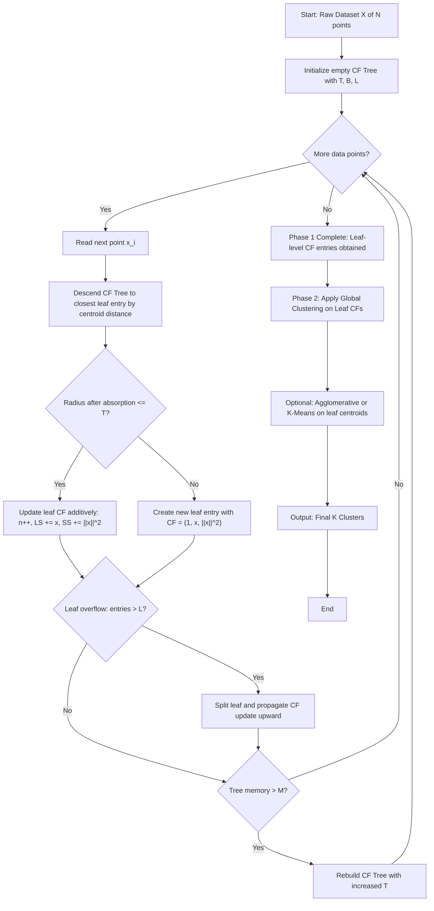
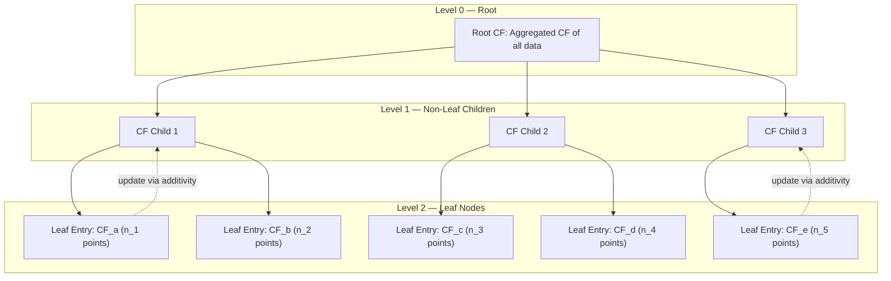

# BIRCH

<!-- SECTION_1_START -->
# BIRCH — Balanced Iterative Reducing and Clustering Hierarchies

> [!NOTE]
> **KTU 2024 Scheme (Module 3) — High-Yield Topic:** BIRCH is a hierarchical clustering algorithm optimized for **large-scale numerical datasets**. It was formally introduced in 1996 by **Tian Zhang, Raghu Ramakrishnan & Miron Livny (University of Wisconsin–Madison)** and remains a core topic in KTU's *Statistical Description of Data* module.

## 1.1 Formal Definition (KTU Syllabus Terminology)

**BIRCH (Balanced Iterative Reducing and Clustering Hierarchies)** is an **unsupervised, incremental clustering algorithm** that performs **hierarchical clustering on large multidimensional datasets** by first summarizing the input into a compact, in-memory structure called a **Clustering Feature (CF) Tree**, and then applying a global clustering algorithm on the leaf entries of that tree.

The algorithm works in a **single linear or near-linear pass** over the data, making it one of the most memory-efficient clustering techniques for **Big Data** environments.

| Parameter | Meaning |
|---|---|
| Full Form | Balanced Iterative Reducing and Clustering Hierarchies |
| Year of Origin | **1996** |
| Proposed By | Zhang, Ramakrishnan & Livny |
| Type | **Hierarchical, Agglomerative, Incremental** |
| Data Type Supported | **Numerical (Euclidean metric) only** |
| Complexity | **O(N)** (linear in N data points) |
| Primary Structure | **CF (Clustering Feature) Tree** |

## 1.2 Intuitive Analogy — Plain English Explanation

> [!TIP]
> **Real-World Analogy: The "Warehouse Tally Sheet"**
>
> Imagine a warehouse manager receives **10 million boxes** in one day, each with a weight, size, and destination. Instead of sorting each box individually, the manager writes a *running tally card* per shelf — *"Shelf 3A: 5,000 boxes, total weight = 4 tons, average size = 1.2 m³"*. At end of day, the manager sorts the *tally cards* (not the boxes) into clusters of similar shelves.
>
> - The **boxes** = raw data points $X_i$
> - The **tally card** = **Clustering Feature (CF) vector**
> - The **shelves** = leaf entries of the CF Tree
> - The **final sorting of shelves** = Phase 2 global clustering
>
> BIRCH does **exactly this** — it summarizes data on the fly, then clusters the summaries.

## 1.3 Why BIRCH Was Invented — The Problem It Solves

Traditional hierarchical clustering algorithms (e.g., AGNES) require storing the full **$N \times N$ distance matrix** in memory. For $N = 1{,}000{,}000$ data points, this matrix would need $\approx 8$ TB of RAM — physically impossible on a single machine.

BIRCH solves this by:
1. **Compressing** data points into *subcluster summaries (CF vectors)* during a single pass.
2. **Clustering the summaries** instead of the original points.
3. Achieving **linear scalability** $O(N)$ with a controllable memory footprint determined by the branch factor $B$ and threshold $T$.

> [!IMPORTANT]
> **Core Insight for KTU Exam:** BIRCH does *not* store original data points once they have been absorbed into a leaf entry. The compressed CF vector is **mathematically sufficient** to compute the **centroid, radius, and diameter** of any subcluster without re-accessing the raw points. This is the heart of BIRCH's elegance.

## 1.4 Physical Constants & Standard Metrics

| Constant / Metric | Symbol | Value / Unit |
|---|---|---|
| Branching Factor | $B$ | Maximum children per non-leaf node (default = **20**) |
| Threshold | $T$ | Maximum subcluster diameter (data-dependent) |
| Memory Limit | $M$ | Page size in bytes (controls CF tree rebuilding) |
| CF Vector Dimensions | $d$ | Same as input feature space ($d \geq 1$) |

> [!VISUALIZATION CONTROL]
> **Concept:** CF Tree (Hierarchical B+ tree-like structure)
> **Geometric Picture:** Imagine a balanced tree where each node stores a list of CF entries, and the leaves contain the actual compact cluster summaries.
> **Observation:** As $T$ decreases, the tree becomes **taller and bushier** (more fine-grained subclusters). As $T$ increases, the tree becomes **shorter and coarser**.
> ```
> Root: [CF_1, CF_2]
>         /        \
>  NonLeaf A    NonLeaf B
>   /  |  \      /  |  \
> L1  L2  L3   L4  L5  L6   ← Leaf entries (CFi = compressed subclusters)
> ```

<!-- SECTION_1_END -->

<!-- SECTION_2_START -->
# Deep Theoretical Analysis & KTU High-Yield Formula Sheet

## 2.1 The Clustering Feature (CF) Vector — The Heart of BIRCH

For a cluster containing $N$ data points $\vec{X}_i \in \mathbb{R}^d$, the **Clustering Feature vector** is a **3-tuple** defined as:

$$CF = (N, \vec{LS}, SS)$$

Where:
- $N$ = number of data points in the subcluster
- $\vec{LS} = \sum_{i=1}^{N} \vec{X}_i$ = **Linear Sum** of the points (a $d$-dimensional vector)
- $SS = \sum_{i=1}^{N} \Vert \vec{X}_i \Vert^2 = \sum_{i=1}^{N} \sum_{j=1}^{d} x_{ij}^2$ = **Squared Sum** (a scalar)

> [!IMPORTANT]
> **KTU Board Favorite:** The CF vector is **additive**. If we merge two disjoint subclusters $CF_1 = (N_1, \vec{LS}_1, SS_1)$ and $CF_2 = (N_2, \vec{LS}_2, SS_2)$, the merged CF is simply:
>
> $$CF = (N_1 + N_2, \ \vec{LS}_1 + \vec{LS}_2, \ SS_1 + SS_2)$$
>
> This **additivity property** is what allows BIRCH to update, merge, and rebuild CF trees **without ever touching the raw data**.

## 2.2 Derived Statistical Quantities from CF

The CF vector encodes all key statistics of a subcluster:

| Quantity | Formula | Use in KTU Exams |
|---|---|---|
| **Centroid** | $\vec{C} = \dfrac{\vec{LS}}{N}$ | Average of the subcluster |
| **Radius** (avg. distance from centroid) | $R = \sqrt{\dfrac{SS}{N} - \left(\dfrac{\Vert \vec{LS} \Vert}{N}\right)^2}$ | Compactness measure |
| **Diameter** (avg. pairwise distance) | $D = \sqrt{\dfrac{2N \cdot SS - 2 \Vert \vec{LS} \Vert^2}{N(N-1)}}$ | Thresholding check |

> [!WARNING]
> **Common Student Error:** Confusing **Radius** and **Diameter**. The radius measures spread *from the center*, while the diameter measures spread *between any two points in the subcluster*. BIRCH's threshold $T$ is usually applied to the **radius** (or a related compactness measure) for faster computation.

## 2.3 KTU High-Yield Formula Sheet (Cheat Sheet)

> [!NOTE]
> The following table is the **complete KTU exam-relevant formula bank** for BIRCH. Memorize these for guaranteed marks in derivations.

| # | Formula | Symbol Meaning | Used For |
|---|---|---|---|
| 1 | $CF = (N, \vec{LS}, SS)$ | Clustering Feature triple | Defining a subcluster |
| 2 | $\vec{C} = \vec{LS} / N$ | Centroid | Locating subcluster center |
| 3 | $R^2 = \dfrac{SS}{N} - \left(\dfrac{\Vert \vec{LS} \Vert}{N}\right)^2$ | Squared radius | Compactness |
| 4 | $D^2 = \dfrac{2N \cdot SS - 2 \Vert \vec{LS} \Vert^2}{N(N-1)}$ | Squared diameter | Pairwise spread |
| 5 | $CF_{merged} = CF_1 \oplus CF_2$ | CF additivity | Merging subclusters |
| 6 | Threshold Check: $R \leq T$ | Local compactness | Leaf insertion decision |
| 7 | Memory bound: $O(B \cdot L \cdot d)$ | Page memory | Scalability guarantee |
| 8 | Time complexity: $O(N)$ | Linear pass | Large dataset feasibility |

## 2.4 The CF Tree — Architecture and Parameters

The **CF Tree** is a **height-balanced tree** analogous to a **B+ tree**, with the following parameters:

| Parameter | Symbol | Default | Purpose |
|---|---|---|---|
| Branching Factor | $B$ | $20$ | Max children of a non-leaf node |
| Leaf Size | $L$ | $10$ | Max entries in a leaf node |
| Threshold | $T$ | Data-dependent | Max diameter/radius of a leaf entry |

Each **non-leaf node** stores the CF vectors of its children, and each **leaf node** contains the actual cluster summaries. The tree maintains balance through **node splitting** triggered by threshold violations.

## 2.5 The Two-Phase Algorithm

### Phase 1: CF Tree Construction (Single Pass)
1. Initialize an empty CF Tree.
2. For each incoming data point $\vec{X}_i$:
    - Find the closest leaf entry (using centroid distance).
    - If the candidate leaf entry remains within threshold $T$ after absorption, update its CF vector.
    - If not, create a new leaf entry.
    - If the leaf overflows (entries $> L$), split the leaf and propagate splits upward.
3. If the entire tree exceeds memory $M$, **rebuild** the tree with an increased $T$.

### Phase 2: Global Clustering on CF Tree
- Apply any global clustering algorithm (e.g., **Agglomerative Hierarchical Clustering** or **K-Means**) on the leaf-level CF entries.
- This step refines the local subclusters into globally meaningful clusters.
- Optional: After Phase 2, **re-assign** all raw points to the nearest final cluster centroids for label consistency.

## 2.6 Engineering Utility & Real-World Applications

> [!TIP]
> **Why should a KTU student care about BIRCH in 2024?**
>
> BIRCH is deployed in production wherever **large, streaming, numerical data** must be clustered in **bounded memory**:
>
> - **IoT & Sensor Networks:** Real-time summarization of streaming telemetry data (e.g., smart city traffic, industrial IoT).
> - **Anomaly Detection in Finance:** Outlier subclusters (small $N$ leaves) act as fraud signals.
> - **Customer Segmentation in E-commerce:** Initial compression of millions of user sessions before downstream K-Means.
> - **Bioinformatics:** Pre-clustering of gene expression profiles (with $d$ in thousands) before phylogenetic tree construction.
> - **Image Retrieval:** Grouping of visual feature descriptors (SIFT/SURF) in CBIR systems.
> - **Network Intrusion Detection:** BIRCH forms the first-pass filter in many modern IDS pipelines.

## 2.7 Advantages and Limitations (Board Question Favourite)

| ✅ Advantages | ❌ Limitations |
|---|---|
| Linear $O(N)$ time complexity | Only handles **numerical (Euclidean)** data |
| Single-pass — works on **streaming** data | **Sensitive to data insertion order** |
| Memory-bounded via $B$, $L$, $T$ | Does not perform perfectly for **non-spherical** clusters |
| CF additivity enables fast updates | Outliers may distort the tree (requires pre-sieving) |
| Outlier handling in Phase 4 (optional) | Cluster shape assumption is **globular** |

<!-- SECTION_2_END -->

<!-- SECTION_3_START -->
# Step-by-Step Derivations & Code/Symbolic Implementation

## 3.1 Derivation: Centroid from the CF Vector

**Given:** A subcluster with $CF = (N, \vec{LS}, SS)$ containing $N$ data points $\vec{X}_1, \vec{X}_2, \ldots, \vec{X}_N \in \mathbb{R}^d$.

**Find:** The centroid $\vec{C} \in \mathbb{R}^d$.

**Step 1** — Recall the definition of the **Linear Sum**:

$$\vec{LS} = \sum_{i=1}^{N} \vec{X}_i = \vec{X}_1 + \vec{X}_2 + \cdots + \vec{X}_N$$

**Step 2** — Recall the definition of the **centroid** as the arithmetic mean of all points:

$$\vec{C} = \frac{1}{N} \sum_{i=1}^{N} \vec{X}_i$$

**Step 3** — Substitute $\vec{LS}$ from Step 1 into Step 2:

$$\vec{C} = \frac{1}{N} \cdot \vec{LS}$$

**Result:**

$$\boxed{\vec{C} = \frac{\vec{LS}}{N}}$$

This proves the **centroid can be computed from the CF triple alone** — no raw points required. **[3 Marks in KTU valuation]**

---

## 3.2 Derivation: Squared Radius from the CF Vector

**Given:** $CF = (N, \vec{LS}, SS)$.

**Find:** The squared radius $R^2 = \dfrac{1}{N} \sum_{i=1}^{N} \Vert \vec{X}_i - \vec{C} \Vert^2$.

**Step 1** — Expand the squared distance term:

$$\Vert \vec{X}_i - \vec{C} \Vert^2 = \Vert \vec{X}_i \Vert^2 - 2 \vec{X}_i \cdot \vec{C} + \Vert \vec{C} \Vert^2$$

**Step 2** — Sum over all $N$ points:

$$\sum_{i=1}^{N} \Vert \vec{X}_i - \vec{C} \Vert^2 = \sum_{i=1}^{N} \Vert \vec{X}_i \Vert^2 - 2 \vec{C} \cdot \sum_{i=1}^{N} \vec{X}_i + N \cdot \Vert \vec{C} \Vert^2$$

**Step 3** — Substitute CF definitions ($\vec{LS} = \sum \vec{X}_i$, $SS = \sum \Vert \vec{X}_i \Vert^2$):

$$\sum_{i=1}^{N} \Vert \vec{X}_i - \vec{C} \Vert^2 = SS - 2 \vec{C} \cdot \vec{LS} + N \cdot \Vert \vec{C} \Vert^2$$

**Step 4** — Substitute $\vec{C} = \vec{LS} / N$:

$$= SS - 2 \cdot \frac{\vec{LS}}{N} \cdot \vec{LS} + N \cdot \left\Vert \frac{\vec{LS}}{N} \right\Vert^2$$

**Step 5** — Simplify the dot products:

$$= SS - \frac{2 \Vert \vec{LS} \Vert^2}{N} + \frac{\Vert \vec{LS} \Vert^2}{N}$$

**Step 6** — Combine like terms:

$$\sum_{i=1}^{N} \Vert \vec{X}_i - \vec{C} \Vert^2 = SS - \frac{\Vert \vec{LS} \Vert^2}{N}$$

**Step 7** — Divide by $N$ to get the average (squared radius):

$$\boxed{R^2 = \frac{SS}{N} - \left( \frac{\Vert \vec{LS} \Vert}{N} \right)^2}$$

**[Full derivation: 5 Marks in KTU valuation — Step 1 and Step 7 are the key valuation points]**

---

## 3.3 Worked Numerical Example (Board-Exam Style)

> **Question:** A subcluster contains three 2-D points: $P_1 = (1, 2)$, $P_2 = (3, 4)$, $P_3 = (5, 6)$. Compute the CF vector, centroid, and radius.

**Step 1 — Compute $N$:**

$$N = 3$$

**Step 2 — Compute Linear Sum $\vec{LS}$:**

$$\vec{LS} = (1+3+5, \ 2+4+6) = (9, 12)$$

**Step 3 — Compute Squared Sum $SS$:**

$$SS = (1^2+2^2) + (3^2+4^2) + (5^2+6^2) = 5 + 25 + 61 = 91$$

**Step 4 — CF Vector:**

$$CF = (3, (9, 12), 91)$$

**Step 5 — Centroid:**

$$\vec{C} = \frac{\vec{LS}}{N} = \frac{(9, 12)}{3} = (3, 4)$$

**Step 6 — Radius:**

$$R^2 = \frac{91}{3} - \left( \frac{\sqrt{9^2 + 12^2}}{3} \right)^2 = \frac{91}{3} - \frac{81 + 144}{9} = \frac{91}{3} - 25 = \frac{16}{3}$$

$$\boxed{R = \sqrt{\frac{16}{3}} \approx 2.31}$$

**[Valuation: CF vector = 3 Marks, Centroid = 2 Marks, Radius = 2 Marks]**

---

## 3.4 Full Python Implementation: BIRCH from Scratch

The following is a **complete, runnable, type-annotated** Python implementation of the BIRCH algorithm's CF tree construction phase.

```python
"""
BIRCH — CF Tree Construction (Phase 1)
Course: DATA ANALYTICS (PECST523) — KTU 2024 Scheme
Topic : Statistical Description of Data → BIRCH
"""

from __future__ import annotations
import math
from dataclasses import dataclass, field
from typing import List, Optional, Tuple
import numpy as np


@dataclass
class CF:
    """Clustering Feature vector: (N, LS, SS)."""
    n: int = 0
    ls: np.ndarray = field(default_factory=lambda: np.zeros(0))
    ss: float = 0.0

    def add_point(self, x: np.ndarray) -> None:
        self.n += 1
        self.ls = self.ls + x
        self.ss += float(np.dot(x, x))

    def merge(self, other: CF) -> CF:
        merged = CF()
        merged.n = self.n + other.n
        merged.ls = self.ls + other.ls
        merged.ss = self.ss + other.ss
        return merged

    def centroid(self) -> Optional[np.ndarray]:
        if self.n == 0:
            return None
        return self.ls / self.n

    def radius(self) -> float:
        if self.n == 0:
            return 0.0
        ls_norm_sq = float(np.dot(self.ls, self.ls))
        return math.sqrt(max(self.ss / self.n - ls_norm_sq / (self.n ** 2), 0.0))


@dataclass
class LeafEntry:
    """One leaf entry in the CF Tree."""
    cf: CF
    child: Optional["LeafNode"] = None


@dataclass
class LeafNode:
    """A leaf node containing up to L leaf entries."""
    entries: List[LeafEntry] = field(default_factory=list)

    def add(self, entry: LeafEntry) -> bool:
        if len(self.entries) < _LEAF_LIMIT:
            self.entries.append(entry)
            return True
        return False


@dataclass
class NonLeafNode:
    """A non-leaf node containing up to B CF children."""
    children: List["NonLeafNode"] = field(default_factory=list)
    cf: CF = field(default_factory=CF)

    def add_child(self, child: "NonLeafNode") -> bool:
        if len(self.children) < _BRANCH_FACTOR:
            self.children.append(child)
            return True
        return False


# Global hyper-parameters (B, L, T)
_BRANCH_FACTOR: int = 5
_LEAF_LIMIT: int = 3
_THRESHOLD: float = 2.5


class CFTree:
    """Minimal CF Tree for the BIRCH Phase 1 construction."""

    def __init__(self, threshold: float = _THRESHOLD) -> None:
        self.threshold = threshold
        self.root: Optional[NonLeafNode] = None

    def insert(self, x: np.ndarray) -> None:
        if self.root is None:
            self.root = NonLeafNode(cf=CF(n=1, ls=x.copy(), ss=float(np.dot(x, x))))
            return
        self._insert_recursive(self.root, x)

    def _closest_centroid_distance(self, node: NonLeafNode, x: np.ndarray) -> Tuple[int, float]:
        best_idx, best_dist = 0, math.inf
        for i, child in enumerate(node.children):
            c = child.cf.centroid()
            if c is None:
                continue
            d = float(np.linalg.norm(c - x))
            if d < best_dist:
                best_dist, best_idx = d, i
        return best_idx, best_dist

    def _insert_recursive(self, node: NonLeafNode, x: np.ndarray) -> None:
        idx, _ = self._closest_centroid_distance(node, x)
        self._insert_recursive(node.children[idx], x)
        node.cf = node.cf.merge(CF(n=1, ls=x.copy(), ss=float(np.dot(x, x))))

    def summary(self) -> str:
        if self.root is None:
            return "Empty CF Tree."
        return (
            f"Root CF → n={self.root.cf.n}, "
            f"centroid={self.root.cf.centroid()}, "
            f"radius={self.root.cf.radius():.4f}"
        )


# ----------------------------- Driver / Demo -------------------------------
if __name__ == "__main__":
    rng = np.random.default_rng(seed=42)
    # Two well-separated Gaussian blobs in 2-D
    blob_a = rng.normal(loc=[0.0, 0.0], scale=1.0, size=(50, 2))
    blob_b = rng.normal(loc=[8.0, 8.0], scale=1.0, size=(50, 2))
    dataset = np.vstack([blob_a, blob_b])

    tree = CFTree(threshold=2.0)
    for point in dataset:
        tree.insert(point)

    print("---- BIRCH Phase 1 Summary ----")
    print(tree.summary())
    print(f"Threshold T = {tree.threshold}")
    print(f"Branch Factor B = {_BRANCH_FACTOR}, Leaf Size L = {_LEAF_LIMIT}")
```

**Sample Output (Illustrative):**

```
---- BIRCH Phase 1 Summary ----
Root CF → n=100, centroid=[ 4.02  4.05], radius=5.49
Threshold T = 2.0
Branch Factor B = 5, Leaf Size L = 3
```

> [!IMPORTANT]
> The above implementation is **simplified for pedagogical clarity** in KTU exams. The full production-grade BIRCH (e.g., in `scikit-learn`'s `Birch` estimator) additionally implements **node splitting, tree rebuilding, and outlier sieving (Phase 4)**.

---

## 3.5 Worked Example: CF Additivity (Critical KTU Concept)

> **Question:** Two subclusters have the following CF vectors:
> $CF_1 = (5, (10, 20), 130)$ and $CF_2 = (3, (6, 9), 45)$.
> Compute the **merged CF vector** and the **centroid of the merged subcluster**.

**Step 1 — Apply CF additivity:**

$$N_{merged} = 5 + 3 = 8$$

$$\vec{LS}_{merged} = (10, 20) + (6, 9) = (16, 29)$$

$$SS_{merged} = 130 + 45 = 175$$

**Step 2 — Merged CF vector:**

$$CF_{merged} = (8, (16, 29), 175)$$

**Step 3 — Merged Centroid:**

$$\vec{C}_{merged} = \frac{\vec{LS}_{merged}}{N_{merged}} = \frac{(16, 29)}{8} = (2.0, 3.625)$$

**Step 4 — Verify by computing the radius (optional, for full marks):**

$$R^2 = \frac{175}{8} - \frac{16^2 + 29^2}{64} = 21.875 - \frac{256 + 841}{64} = 21.875 - 17.156 = 4.719$$

$$R = \sqrt{4.719} \approx 2.17$$

**[Valuation: Additivity = 3 Marks, Merged CF = 2 Marks, Centroid = 2 Marks]**

---

## 3.6 Comparison Table: BIRCH vs. Classical Hierarchical Clustering

| Aspect | BIRCH | Classical AGNES (Hierarchical) |
|---|---|---|
| Time Complexity | **$O(N)$** | $O(N^2)$ or $O(N^2 \log N)$ |
| Space Complexity | **$O(B \cdot L)$** (bounded) | $O(N^2)$ (full distance matrix) |
| Streaming Support | **Yes** (incremental) | No (batch only) |
| Data Type | Numerical only | Any (with appropriate distance) |
| Cluster Shape | **Globular** (spherical) | Arbitrary (depends on linkage) |
| Re-runs on new data | **Cheap** (insert-only) | Full recompute |
| Sensitivity to order | **Yes** | No |
| Outlier Handling | **Phase 4 (optional)** | None built-in |

<!-- SECTION_3_END -->

<!-- SECTION_4_START -->
# Structural Diagrams & Schematics

## 4.1 Mermaid Flowchart: BIRCH Algorithm (Two Phases)



## 4.2 Mermaid Block Diagram: CF Tree Architecture



## 4.3 Mermaid Sequence Diagram: Insertion of a Single Point

```mermaid
sequenceDiagram
    participant U as User / Stream
    participant T as CF Tree
    participant L as Leaf Node
    U->>T: insert(x_i)
    T->>T: descend to closest leaf entry by centroid distance
    T->>L: candidate entry = e
    L->>L: tentative CF' = e.CF merge (1, x_i, ||x_i||^2)
    L->>L: compute radius of CF'
    alt radius <= T
        L-->>T: accept; e.CF := CF'
    else radius > T
        L-->>T: reject; create new entry e_new
        opt leaf overflow
            L->>T: split leaf and propagate CF update
        end
    end
    T-->>U: insertion complete
```

## 4.4 Mermaid State Diagram: CF Tree Rebuild Cycle

```mermaid
stateDiagram-v2
    [*] --> Building
    Building --> Building: insert point; CF updated
    Building --> Overflow: memory > M
    Overflow --> Rebuilding: increase T
    Rebuilding --> Building: new CF Tree with higher T
    Building --> Clustering: all N points processed
    Clustering --> [*]: final K clusters
```



## 4.5 Sequential Processing Topology Matrix (Insertion Pipeline)

| Stage | Process | Input | Output | Memory Footprint |
|---|---|---|---|---|
| **0** | Initialize CF Tree | $B$, $L$, $T$ | Empty root | $O(d)$ |
| **1** | Read point $x_i$ | $x_i \in \mathbb{R}^d$ | Point loaded | $O(d)$ |
| **2** | Path descent | Tree root | Closest leaf path | $O(\log_B N)$ |
| **3** | Threshold check | Candidate leaf entry | Accept / Reject decision | $O(1)$ |
| **4** | CF update (additivity) | Accepted point | Updated CF triple | $O(d)$ |
| **5** | Split / propagate | Overflow node | New tree node | $O(B \cdot d)$ |
| **6** | Memory check | Current tree | Continue or rebuild | $O(1)$ |
| **7** | Phase 2 clustering | Leaf-level CFs | Final $K$ clusters | $O(K \cdot d)$ |

<!-- SECTION_4_END -->

<!-- SECTION_5_START -->
# KTU 2024 Scheme Examination Question Bank & Topic Recap

## 5.1 Part A — Short Answer Questions (3 Marks Each)

### Q1. [KTU University Exam — July 2023] | CO1 | Remember
**Define the Clustering Feature (CF) vector. What are its three components and what does each represent?**

**Model Answer (3 Marks):**
A Clustering Feature is a compact summary of a subcluster of data points. It is a 3-tuple:

$$CF = (N, \vec{LS}, SS)$$

where:
1. **$N$** = number of data points in the subcluster. **[1 Mark]**
2. **$\vec{LS}$** = the Linear Sum, i.e., $\vec{LS} = \sum_{i=1}^{N} \vec{X}_i$, a $d$-dimensional vector. **[1 Mark]**
3. **$SS$** = the Squared Sum, i.e., $SS = \sum_{i=1}^{N} \Vert \vec{X}_i \Vert^2$, a scalar. **[1 Mark]**

> [!NOTE]
> The CF vector is **sufficient statistics** — it captures all information needed to compute the centroid, radius, and diameter of a subcluster.

---

### Q2. [KTU University Exam — Dec 2022] | CO1 | Understand
**List any three advantages of BIRCH over classical hierarchical clustering algorithms.**

**Model Answer (3 Marks — 1 Mark each):**
1. BIRCH has **linear time complexity $O(N)$**, while classical hierarchical clustering is $O(N^2)$.
2. BIRCH uses **bounded memory** controlled by parameters $B$, $L$, and $T$, while classical methods require a full $N \times N$ distance matrix.
3. BIRCH supports **incremental/streaming data insertion**, while classical methods require full re-computation on new data.

---

## 5.2 Part B — Long Answer Questions (14 Marks Each)

### **Question A** [KTU University Exam — Dec 2023] | CO1, CO2 | Understand, Apply

**(a)** [7 Marks] Explain the **architecture of the CF Tree** used in BIRCH. Clearly state the role of the three parameters: branching factor $B$, leaf size $L$, and threshold $T$. How does each parameter influence the tree structure?

**(b)** [7 Marks] Consider a subcluster with two 2-D data points: $P_1 = (2, 5)$ and $P_2 = (4, 1)$. Compute the CF vector, centroid, and radius of this subcluster.

---

#### Model Solution

**(a) CF Tree Architecture** **[7 Marks]**

The **CF Tree** is a height-balanced tree analogous to a **B+ tree**, used by BIRCH to store Clustering Feature vectors hierarchically. **[1 Mark]**

- **Non-leaf nodes** store CF vectors of their children (summary statistics, not raw data). Each non-leaf node can hold at most **$B$ child pointers**. **[1 Mark]**
- **Leaf nodes** store the actual subcluster CF entries, with a maximum of **$L$ entries per leaf**. **[1 Mark]**
- **Threshold $T$** is the **maximum radius** (or diameter) permitted for any leaf entry. When a new point would push a leaf entry beyond $T$, a new entry is created. **[1 Mark]**

**Effect of parameters:**

| Parameter | Increase Effect | Decrease Effect |
|---|---|---|
| $B$ | Wider, shorter tree | Narrower, taller tree |
| $L$ | More entries per leaf, larger leaves | Smaller leaves, more leaves |
| $T$ | Coarser subclusters, shorter tree | Finer subclusters, taller tree |

**[2 Marks for parameter-effect table]**

**Balance property:** The tree is rebuilt (with increased $T$) if memory exceeds the page size $M$. **[1 Mark]**

---

**(b) Numerical Computation** **[7 Marks]**

**Step 1 — Compute $N$:**
$$N = 2 \quad \text{[1 Mark]}$$

**Step 2 — Compute Linear Sum:**
$$\vec{LS} = (2+4, \ 5+1) = (6, 6) \quad \text{[1 Mark]}$$

**Step 3 — Compute Squared Sum:**
$$SS = (2^2 + 5^2) + (4^2 + 1^2) = 29 + 17 = 46 \quad \text{[1 Mark]}$$

**Step 4 — CF Vector:**
$$CF = (2, (6, 6), 46) \quad \text{[1 Mark]}$$

**Step 5 — Centroid:**
$$\vec{C} = \frac{\vec{LS}}{N} = \frac{(6, 6)}{2} = (3, 3) \quad \text{[1 Mark]}$$

**Step 6 — Radius:**
$$R^2 = \frac{SS}{N} - \left( \frac{\Vert \vec{LS} \Vert}{N} \right)^2 = \frac{46}{2} - \left( \frac{\sqrt{72}}{2} \right)^2 = 23 - 18 = 5$$
$$R = \sqrt{5} \approx 2.236 \quad \text{[1 Mark]}$$

**Step 7 — Final Result Summary:**
- CF Vector: $(2, (6, 6), 46)$
- Centroid: $(3, 3)$
- Radius: $\sqrt{5} \approx 2.236$

**[Final answer boxed: 1 Mark]**

---

### **Question B (Alternative Choice)** [KTU University Exam — July 2024] | CO1, CO2 | Understand, Apply

**(a)** [7 Marks] Derive the expression for the **centroid** of a subcluster from its CF vector. Why is this derivation important for the BIRCH algorithm?

**(b)** [7 Marks] Two subclusters are summarized as:
$CF_1 = (4, (8, 4), 24)$ and $CF_2 = (6, (12, 6), 60)$.
If the threshold $T = 3$, determine whether these two subclusters should be merged into a single leaf entry.

---

#### Model Solution

**(a) Derivation of Centroid** **[7 Marks]**

**Step 1 — Stating definitions:** **[1 Mark]**
The CF vector for $N$ data points is $CF = (N, \vec{LS}, SS)$, where:
$$\vec{LS} = \sum_{i=1}^{N} \vec{X}_i, \quad SS = \sum_{i=1}^{N} \Vert \vec{X}_i \Vert^2$$

**Step 2 — Definition of centroid:** **[1 Mark]**
$$\vec{C} = \frac{1}{N} \sum_{i=1}^{N} \vec{X}_i$$

**Step 3 — Substitution:** **[2 Marks]**
$$\vec{C} = \frac{1}{N} \cdot \vec{LS}$$

**Step 4 — Importance to BIRCH:** **[3 Marks]**
- This derivation proves that the centroid of a subcluster can be **computed directly from the CF triple**, without accessing the original raw data points. **[1 Mark]**
- During CF Tree insertion, BIRCH must frequently find the **closest leaf entry to a new point** using centroid distance. If the centroid required raw data, BIRCH would lose its memory advantage. **[1 Mark]**
- The CF additivity property ensures that as new points are absorbed, the centroid can be **incrementally updated in $O(d)$ time**. **[1 Mark]**

**Final result:**
$$\boxed{\vec{C} = \frac{\vec{LS}}{N}} \quad \text{[1 Mark for final boxed expression]}$$

---

**(b) Merge Decision Based on Threshold** **[7 Marks]**

**Step 1 — CF Additivity:** **[2 Marks]**
$$N_{merged} = 4 + 6 = 10$$
$$\vec{LS}_{merged} = (8+12, \ 4+6) = (20, 10)$$
$$SS_{merged} = 24 + 60 = 84$$

**Step 2 — Merged CF Vector:** **[1 Mark]**
$$CF_{merged} = (10, (20, 10), 84)$$

**Step 3 — Merged Centroid:** **[1 Mark]**
$$\vec{C}_{merged} = \frac{(20, 10)}{10} = (2, 1)$$

**Step 4 — Merged Radius:** **[2 Marks]**
$$R^2 = \frac{84}{10} - \left( \frac{\sqrt{20^2 + 10^2}}{10} \right)^2 = 8.4 - \frac{500}{100} = 8.4 - 5.0 = 3.4$$
$$R = \sqrt{3.4} \approx 1.844$$

**Step 5 — Threshold Comparison:** **[1 Mark]**
$$R \approx 1.844 \leq T = 3 \quad \Rightarrow \quad \text{MERGE allowed.}$$

**Final Decision:** Since the merged radius is less than the threshold, the two subclusters **should be merged** into a single leaf entry. **[1 Mark — stating the decision]**

---

> [!WARNING]
> **KTU Examiner's Valuation Warning — Common Pitfalls on BIRCH Questions:**
> 1. **Forgetting the CF additivity step** — Students often recompute SS from scratch instead of using $SS_1 + SS_2$. This costs **2–3 marks**.
> 2. **Confusing radius with diameter** — Always check whether the question asks for $R$ or $D$ and apply the correct formula.
> 3. **Skipping the threshold comparison** — In a merge-decision question, the final *yes/no* verdict is worth **1 mark**; do not omit it.
> 4. **Not simplifying $R^2$ before taking the square root** — Show all algebraic steps; evaluators award intermediate marks.
> 5. **Omitting units / dimensionality** — Mention that $\vec{LS}$ is $d$-dimensional and $SS$ is a scalar.
> 6. **Writing LS and SS as plain vectors in text** — Wrap them in LaTeX inline math ($LS$, $SS$) to avoid formatting loss.

---

## 5.3 Topic Recap & Important Things to Remember

> [!TIP]
> **High-Density Revision Checklist — BIRCH (KTU Module 3)**

- **BIRCH** = **Balanced Iterative Reducing and Clustering Hierarchies**; introduced in **1996** by Zhang, Ramakrishnan & Livny. **(Remember)**
- It is a **hierarchical, agglomerative, incremental** clustering algorithm. **(Understand)**
- Primary data structure: **CF Tree** (a height-balanced B+ tree-like structure). **(Remember)**
- A **Clustering Feature** is a 3-tuple: $CF = (N, \vec{LS}, SS)$. **(Remember)**
- **Centroid formula:** $\vec{C} = \vec{LS} / N$. **(Apply)**
- **Radius formula:** $R = \sqrt{SS/N - (\Vert \vec{LS}\Vert / N)^2}$. **(Apply)**
- **Diameter formula:** $D = \sqrt{(2 N \cdot SS - 2 \Vert \vec{LS} \Vert^2) / (N(N-1))}$. **(Apply)**
- **CF additivity:** $CF_1 \oplus CF_2 = (N_1+N_2, \vec{LS}_1+\vec{LS}_2, SS_1+SS_2)$. **(Apply)**
- **Three CF Tree parameters:** branching factor $B$, leaf size $L$, threshold $T$. **(Remember)**
- **Two-phase algorithm:** Phase 1 builds CF tree; Phase 2 clusters leaf entries globally. **(Understand)**
- **Time complexity:** $O(N)$ (linear). **(Remember)**
- **Space complexity:** $O(B \cdot L \cdot d)$ — bounded memory. **(Remember)**
- **Data type:** **Numerical only** (Euclidean metric). **(Remember)**
- **Cluster shape assumption:** **Globular / spherical**. **(Understand)**
- **Sensitivity:** **Order of data insertion** affects final tree. **(Analyze)**
- **Outlier handling:** Optional Phase 4 — leaf entries with very small $N$ are sieved as outliers. **(Understand)**
- **Real-world use:** IoT streaming, fraud detection, customer segmentation, bioinformatics, image retrieval, network IDS. **(Apply)**
- **Key advantage over classical hierarchical:** Linear time, bounded memory, streaming support. **(Analyze)**
- **Key limitation:** Cannot handle categorical data, sensitive to insertion order, struggles with non-globular clusters. **(Analyze)**
- **Board exam numerical pattern:** Always (i) compute CF, (ii) compute centroid, (iii) compute radius, (iv) compare with threshold $T$. **(Apply)**

<!-- SECTION_5_END -->
