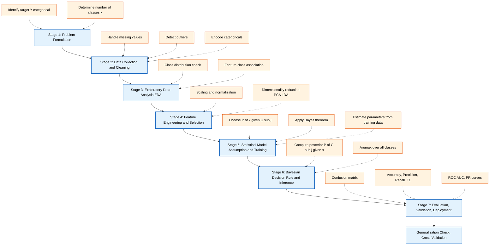
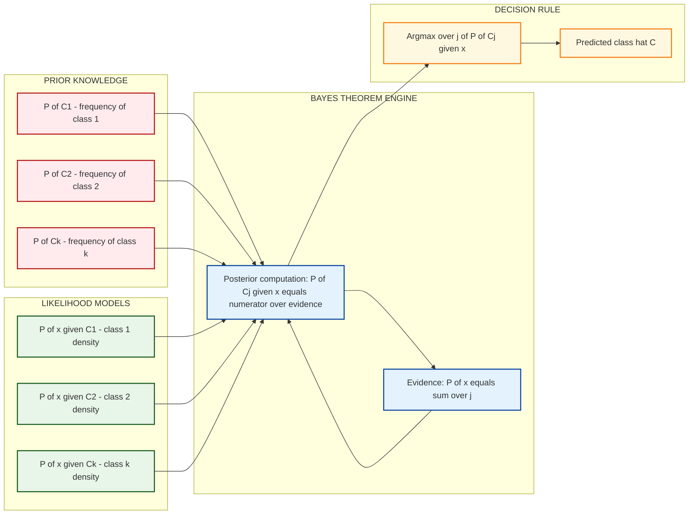
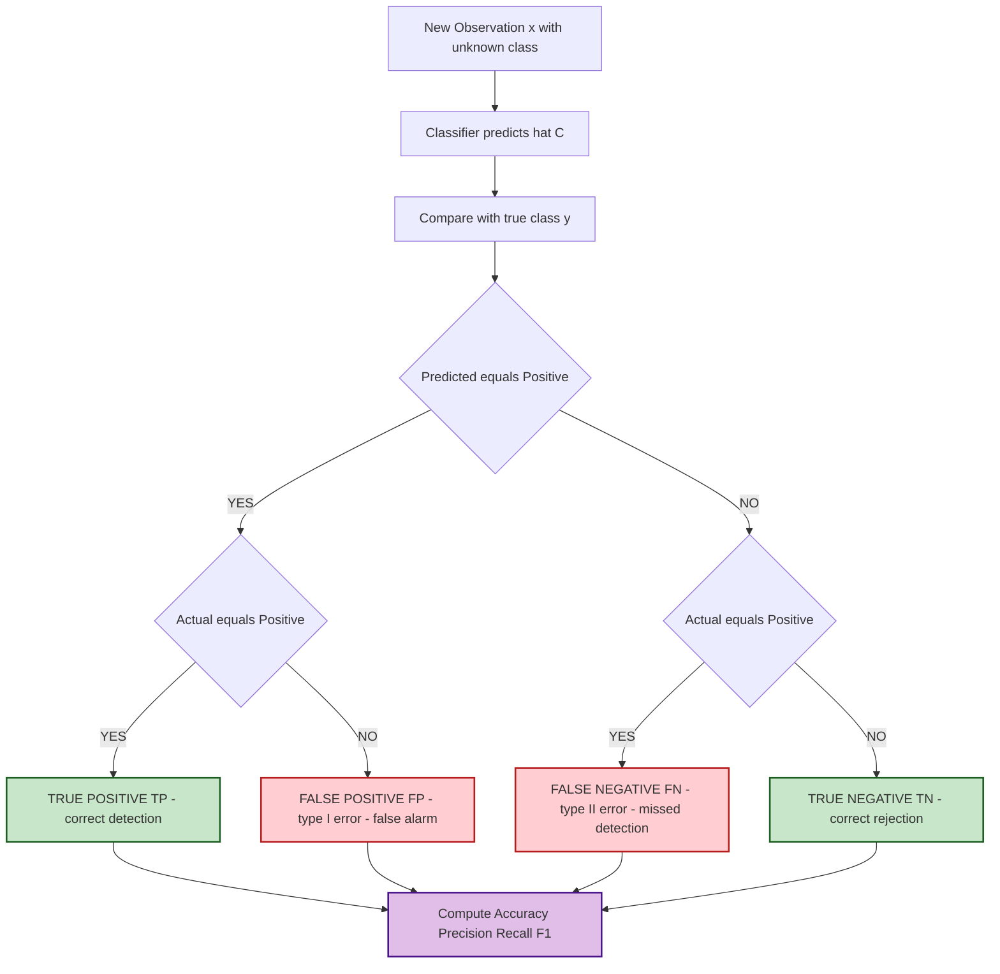
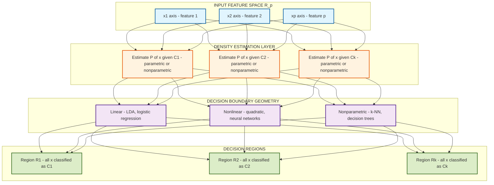
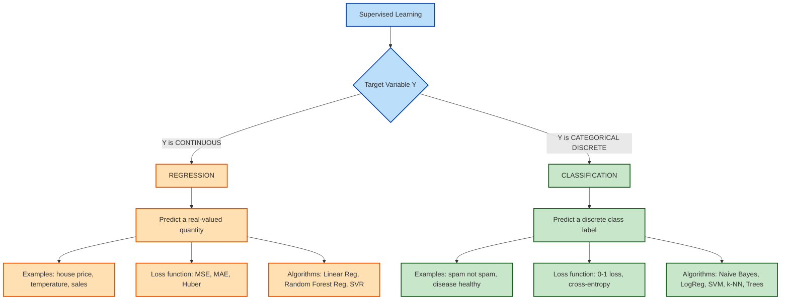

# Classification  - General approach to classification

<!-- SECTION_1_START -->
# Classification: General Approach to Classification

> [!IMPORTANT]
> **KTU 2024 Scheme | DATA ANALYTICS (PECST523) | Module 3 — Statistical Description of Data**
> This module sits at the intersection of **statistical inference** and **predictive analytics**. Classification is one of the two pillars of supervised learning, and its statistical backbone is essential for every data scientist, ML engineer, and analytics professional.

---

## 1.1 Formal Definition (KTU Syllabus Terminology)

**Classification** is a **supervised learning** technique in data analytics where the objective is to predict the categorical (discrete, unordered) class label of a given unlabeled observation, based on a model built from a labeled training dataset containing known input–output pairs.

Formally, given a training set $D = \{(\mathbf{x}_i, y_i)\}_{i=1}^{n}$ where $\mathbf{x}_i \in \mathbb{R}^p$ is a $p$-dimensional feature vector and $y_i \in \{C_1, C_2, \dots, C_k\}$ is a discrete class label drawn from a finite set of $k$ categories, a classifier learns a mapping function:

$$f : \mathbb{R}^p \longrightarrow \{C_1, C_2, \dots, C_k\}$$

such that for a new observation $\mathbf{x}_{\text{new}}$, the predicted class $\hat{y} = f(\mathbf{x}_{\text{new}})$ is as close as possible to the true class $y$.

> [!NOTE]
> **Key Vocabulary Box**
> - **Instance / Observation / Record** — A single row in the dataset.
> - **Feature / Attribute / Predictor** — A measurable variable (column) used as input.
> - **Class Label / Target / Response** — The categorical output to be predicted.
> - **Training Set** — Labeled data used to *teach* the model.
> - **Test Set** — Unseen labeled data used to *evaluate* the model.
> - **Generalization** — Ability of the model to perform well on *unseen* data.

---

## 1.2 Conceptual Analogy & Intuition

> [!TIP]
> **Intuition Box — "The Sorting Room"**
> Imagine you are a **postal sorting officer** at a regional hub. Every morning, thousands of letters (observations) arrive. Each letter has features: *weight*, *shape*, *stamp color*, *postmark country*. Over the years, you have learned from experience that letters **above 50g with a brown international stamp** almost always go to the **Export tray**, while thin white envelopes with local stamps go to the **Domestic tray**.
>
> You have, without realizing it, built a **mental classification rule**. When a new letter arrives, you quickly check its features and route it accordingly. The "rule" inside your head is the **classifier**. Your years of experience are the **training data**. The features you instinctively check are the **selected predictors**.
>
> In data analytics, we formalize this intuition into a mathematical model so a *computer* — not a human — can sort millions of records consistently and at scale.

### Geometric Intuition
In a 2-D feature space, each class occupies a distinct **region**. A classifier draws a **decision boundary** (a line, curve, or surface) that separates these regions. A new point is classified by checking *which side* of the boundary it falls on.

---

## 1.3 The Statistical Description Anchor

Because this topic is housed inside **Module 3 — Statistical Description of Data**, the KTU focus is on the **probabilistic / statistical** general approach, not on any specific algorithm. The approach is built on three statistical pillars:

| Pillar | Statistical Tool | Role in Classification |
|---|---|---|
| **Prior Knowledge** | $P(C_j)$ — class prior probability | Belief about class frequency *before* seeing data |
| **Likelihood** | $P(\mathbf{x} \mid C_j)$ — class-conditional density | How *likely* the observed features are, given a class |
| **Posterior Decision** | $P(C_j \mid \mathbf{x})$ — posterior probability | Updated belief *after* observing the features |

These three combine via **Bayes' theorem**, which is the universal foundation of the statistical approach to classification.

> [!IMPORTANT]
> **Why a "General Approach"?**
> A *general approach* means we describe the *universal pipeline* — problem formulation, data preparation, model assumption, training, evaluation — that is **algorithm-agnostic**. Any specific classifier (Naive Bayes, Logistic Regression, k-NN, Decision Tree, SVM) is simply one *instantiation* of this general pipeline.

---

## 1.4 Visualization Control — Geometric Picture of Classification

> [!VISUALIZATION CONTROL]
> **Concept:** Two-class linear decision boundary in 2-D feature space.
> **GeoGebra / Desmos Input Equations:**
> - Class $C_1$ points: $(1,2), (2,3), (1.5, 2.5), (2.5, 2), (3,3.5)$
> - Class $C_2$ points: $(5,6), (6,5), (5.5, 5.5), (6.5, 6.5), (7,6)$
> - Decision boundary line: $x + y = 8.5$
> **Visual Description:** The student should observe two clusters (red and blue) clearly separated by a diagonal line. Points to the lower-left of the line belong to $C_1$; points to the upper-right belong to $C_2$. The boundary is the *classifier* in its simplest form.
<!-- SECTION_1_END -->

<!-- SECTION_2_START -->
# Deep Theoretical Analysis & KTU High-Yield Formula Sheet

## 2.1 The General Statistical Approach — A 7-Stage Pipeline

The **statistical description of classification** unfolds as a structured, sequential process. Each stage has a specific purpose and produces a specific artifact that feeds the next.

### Stage 1 — Problem Formulation
- Identify the **target variable** $Y$ (categorical) and the **feature set** $\mathbf{X} = (X_1, X_2, \dots, X_p)$.
- Determine the **number of classes** $k$ (binary, multi-class, ordinal).
- Define the **objective**: minimize misclassification cost, maximize accuracy, optimize a business KPI.

### Stage 2 — Data Collection & Cleaning
- Gather a **representative sample** to avoid sampling bias.
- Handle **missing values** (imputation: mean, median, mode, or model-based).
- Detect and treat **outliers** (z-score, IQR method).
- Encode **categorical predictors** (one-hot, label, ordinal encoding).

### Stage 3 — Exploratory Data Analysis (EDA)
- Compute **class distribution** $P(C_j)$ to detect **class imbalance**.
- Visualize **feature distributions** per class (histograms, box plots, density plots).
- Quantify **feature–class association** using chi-square, ANOVA, or mutual information.

### Stage 4 — Feature Engineering & Selection
- **Transformations**: scaling, normalization, log-transform, polynomial features.
- **Dimensionality reduction**: PCA, LDA, t-SNE.
- **Selection**: filter (correlation, chi-square), wrapper (RFE), embedded (Lasso).

### Stage 5 — Model Assumption & Training
- Choose a **statistical model** for $P(\mathbf{x} \mid C_j)$ (e.g., Gaussian, Bernoulli, multinomial).
- Apply **Bayes' theorem** to derive the posterior $P(C_j \mid \mathbf{x})$.
- **Train** the model by estimating its parameters from the training set.

### Stage 6 — Decision Rule (Inference)
- Apply the **optimal Bayes decision rule**:
$$\hat{C} = \arg\max_{C_j} \; P(C_j \mid \mathbf{x})$$
- Equivalent formulation: choose the class with the **highest posterior probability**.

### Stage 7 — Evaluation & Deployment
- **Evaluate** on a held-out test set using accuracy, precision, recall, F1, AUC.
- **Validate** robustness via cross-validation, bootstrap.
- **Deploy** to production with monitoring for data drift.

---

## 2.2 The Statistical Foundation — Bayes' Theorem for Classification

> [!IMPORTANT]
> **Bayes' Theorem is the single most important formula in the statistical approach to classification.**

$$P(C_j \mid \mathbf{x}) = \frac{P(\mathbf{x} \mid C_j) \cdot P(C_j)}{P(\mathbf{x})}$$

Where:
- $P(C_j \mid \mathbf{x})$ — **Posterior probability** of class $C_j$ given the observation $\mathbf{x}$.
- $P(\mathbf{x} \mid C_j)$ — **Likelihood** of observing $\mathbf{x}$ under class $C_j$.
- $P(C_j)$ — **Prior probability** of class $C_j$ (frequency in training data).
- $P(\mathbf{x})$ — **Evidence**, a normalizing constant computed as:

$$P(\mathbf{x}) = \sum_{j=1}^{k} P(\mathbf{x} \mid C_j) \cdot P(C_j)$$

Since $P(\mathbf{x})$ does not depend on $C_j$, the decision rule reduces to:

$$\hat{C} = \arg\max_{j} \; P(\mathbf{x} \mid C_j) \cdot P(C_j)$$

---

## 2.3 The Bayes Optimal Classifier (Theoretical Gold Standard)

The classifier that minimizes the **probability of misclassification** (the 0–1 loss) is called the **Bayes optimal classifier** and is defined by:

$$\hat{C}_{\text{Bayes}}(\mathbf{x}) = \arg\max_{j} \; P(C_j \mid \mathbf{x})$$

**Why is it optimal?** It achieves the minimum possible error rate, known as the **Bayes error rate**:

$$R^* = 1 - \mathbb{E}_{\mathbf{x}}\left[\max_j P(C_j \mid \mathbf{x})\right]$$

> [!NOTE]
> **Key Insight — The Bayes Error is Irreducible**
> No classifier — no matter how sophisticated — can achieve an error rate below $R^*$, because $R^*$ is determined by the *overlap* of the true class-conditional distributions, not by the algorithm. The goal of any practical classifier is to *approximate* the Bayes optimal rule as closely as possible.

---

## 2.4 The Naive Bayes Classifier (Practical Realization)

In practice, directly estimating the joint likelihood $P(\mathbf{x} \mid C_j)$ is intractable for high-dimensional data. The **Naive Bayes** classifier makes a simplifying **conditional independence assumption**:

$$P(\mathbf{x} \mid C_j) = \prod_{i=1}^{p} P(x_i \mid C_j)$$

This "naive" assumption is what gives the classifier its name. Despite its simplicity, Naive Bayes works remarkably well in spam filtering, sentiment analysis, and document classification.

---

## 2.5 Discriminant Functions — An Equivalent Viewpoint

An alternative, equivalent formulation of the classification problem uses **discriminant functions** $\delta_j(\mathbf{x})$, one per class. The decision rule becomes:

$$\hat{C} = \arg\max_{j} \; \delta_j(\mathbf{x})$$

For the Bayes classifier:

$$\delta_j(\mathbf{x}) = P(C_j \mid \mathbf{x}) \;\propto\; P(\mathbf{x} \mid C_j) P(C_j)$$

For symmetric loss functions, working with the log of the posterior is mathematically convenient:

$$\delta_j(\mathbf{x}) = \log P(\mathbf{x} \mid C_j) + \log P(C_j)$$

The **decision boundary** between classes $C_a$ and $C_b$ is the set:

$$\{\mathbf{x} : \delta_a(\mathbf{x}) = \delta_b(\mathbf{x})\}$$

---

## 2.6 Confusion Matrix & Evaluation Metrics

The **confusion matrix** is the fundamental evaluation tool for a classifier. For binary classification:

| | **Predicted Positive** | **Predicted Negative** |
|---|---|---|
| **Actual Positive** | TP (True Positive) | FN (False Negative) |
| **Actual Negative** | FP (False Positive) | TN (True Negative) |

Derived metrics (all range from 0 to 1, higher is better except error rate):

| Metric | Formula | KTU Board Emphasis |
|---|---|---|
| **Accuracy** | $\dfrac{TP+TN}{TP+TN+FP+FN}$ | Most cited; **misleading on imbalanced data** |
| **Error Rate** | $1 - \text{Accuracy} = \dfrac{FP+FN}{N}$ | Complement of accuracy |
| **Precision** | $\dfrac{TP}{TP+FP}$ | Quality of positive predictions |
| **Recall (Sensitivity, TPR)** | $\dfrac{TP}{TP+FN}$ | Coverage of actual positives |
| **Specificity (TNR)** | $\dfrac{TN}{TN+FP}$ | Coverage of actual negatives |
| **F1-Score** | $\dfrac{2 \cdot \text{Precision} \cdot \text{Recall}}{\text{Precision} + \text{Recall}}$ | Harmonic mean — balances P and R |
| **False Positive Rate** | $\dfrac{FP}{FP+TN} = 1 - \text{Specificity}$ | Used in ROC curve |

---

## 2.7 KTU High-Yield Formula Sheet

| # | Formula / Concept | Description | When to Use |
|---|---|---|---|
| 1 | $\hat{C} = \arg\max_j P(C_j \mid \mathbf{x})$ | Bayes decision rule | Always — the central rule |
| 2 | $P(C_j \mid \mathbf{x}) = \frac{P(\mathbf{x} \mid C_j) P(C_j)}{P(\mathbf{x})}$ | Bayes' theorem | Computing posteriors |
| 3 | $P(\mathbf{x}) = \sum_{j=1}^{k} P(\mathbf{x} \mid C_j) P(C_j)$ | Total probability | Normalizing posteriors |
| 4 | $P(\mathbf{x} \mid C_j) = \prod_{i=1}^{p} P(x_i \mid C_j)$ | Naive Bayes assumption | High-dimensional / sparse data |
| 5 | $R^* = 1 - \mathbb{E}[\max_j P(C_j \mid \mathbf{x})]$ | Bayes error (irreducible) | Theoretical lower bound |
| 6 | Accuracy $= \frac{TP+TN}{N}$ | Overall correctness | Balanced datasets |
| 7 | Precision $= \frac{TP}{TP+FP}$ | Positive predictive value | Spam detection |
| 8 | Recall $= \frac{TP}{TP+FN}$ | True positive rate | Disease screening |
| 9 | F1 $= 2 \cdot \frac{P \cdot R}{P + R}$ | Harmonic mean | Imbalanced data |
| 10 | $\delta_j(\mathbf{x}) = \log P(\mathbf{x} \mid C_j) + \log P(C_j)$ | Log discriminant | Numerical stability |

---

## 2.8 Real-World Utility in Engineering & Computer Science

- **Medical Diagnosis** — Classify tumors as malignant or benign from imaging features.
- **Credit Scoring** — Banks classify loan applicants as low / medium / high risk.
- **Email Filtering** — Gmail's spam filter is a Naive-Bayes-style classifier.
- **Sentiment Analysis** — Classify tweets / reviews as positive, negative, neutral.
- **Image Recognition** — Convolutional networks perform multi-class classification.
- **Fault Detection in Manufacturing** — Classify sensor readings as normal / faulty.
- **Network Intrusion Detection** — Classify traffic as benign or malicious.

> [!TIP]
> **Production Tip:** In real systems, you rarely deploy a *single* classifier. The general approach enables **ensemble methods** (voting, stacking, boosting) that combine multiple classifiers for superior performance.
<!-- SECTION_2_END -->

<!-- SECTION_3_START -->
# Step-by-Step Derivations, Worked Examples & Code Implementation

## 3.1 Worked Example 1 — Bayes Decision Rule on a 2-Class Toy Problem

> [!IMPORTANT]
> **KTU Board Pattern Question Type:** "Given the prior probabilities and class-conditional densities, classify a new observation using the Bayes decision rule."

### Problem Statement
A hospital uses a statistical classifier to decide whether a patient has a disease $D$ or not $\neg D$. From historical data:
- $P(D) = 0.01$ (1% prevalence)
- $P(\neg D) = 0.99$
- A diagnostic test gives a *positive* result with the following likelihoods:
  - $P(\text{Pos} \mid D) = 0.95$ (true positive rate / sensitivity)
  - $P(\text{Pos} \mid \neg D) = 0.05$ (false positive rate)

**A new patient tests positive. Should the classifier diagnose the disease?**

### Step-by-Step Solution

**Step 1: Identify known quantities.**
- Prior: $P(D) = 0.01$, $P(\neg D) = 0.99$
- Likelihood: $P(\text{Pos} \mid D) = 0.95$, $P(\text{Pos} \mid \neg D) = 0.05$

**Step 2: Compute the evidence (total probability of a positive test).**

$$P(\text{Pos}) = P(\text{Pos} \mid D) P(D) + P(\text{Pos} \mid \neg D) P(\neg D)$$

$$P(\text{Pos}) = (0.95 \times 0.01) + (0.05 \times 0.99)$$

$$P(\text{Pos}) = 0.0095 + 0.0495 = 0.0590$$

**Step 3: Apply Bayes' theorem for class $D$.**

$$P(D \mid \text{Pos}) = \frac{P(\text{Pos} \mid D) P(D)}{P(\text{Pos})} = \frac{0.0095}{0.0590} \approx 0.1610$$

**Step 4: Compute posterior for class $\neg D$.**

$$P(\neg D \mid \text{Pos}) = \frac{P(\text{Pos} \mid \neg D) P(\neg D)}{P(\text{Pos})} = \frac{0.0495}{0.0590} \approx 0.8390$$

**Step 5: Apply the Bayes decision rule.**

$$\hat{C} = \arg\max \{P(D \mid \text{Pos}),\; P(\neg D \mid \text{Pos})\} = \arg\max \{0.161,\; 0.839\} = \neg D$$

**Conclusion:** The classifier should **NOT** diagnose the disease. The posterior probability of disease given a positive test is only $\approx 16.1\%$.

> [!NOTE]
> **Counterintuitive Insight — The Base-Rate Effect**
> Even with a 95%-accurate test, a positive result on a rare disease (1% prevalence) more likely reflects a *false positive* than a true positive. This is the famous **base-rate fallacy** and a frequent KTU exam highlight.

---

## 3.2 Worked Example 2 — Confusion Matrix & All Metrics

### Problem Statement
A binary classifier produces the following confusion matrix on a test set of 200 patients:

| | Predicted Positive | Predicted Negative |
|---|---|---|
| **Actual Positive** | 50 | 10 |
| **Actual Negative** | 20 | 120 |

**Compute: Accuracy, Error Rate, Precision, Recall, Specificity, F1.**

### Step-by-Step Solution

**Step 1: Extract counts.**
- $TP = 50,\; FN = 10,\; FP = 20,\; TN = 120$
- $N = 50 + 10 + 20 + 120 = 200$

**Step 2: Accuracy.**

$$\text{Accuracy} = \frac{TP + TN}{N} = \frac{50 + 120}{200} = \frac{170}{200} = 0.85$$

**Step 3: Error Rate.**

$$\text{Error} = 1 - 0.85 = 0.15$$

**Step 4: Precision.**

$$\text{Precision} = \frac{TP}{TP + FP} = \frac{50}{50 + 20} = \frac{50}{70} \approx 0.7143$$

**Step 5: Recall (Sensitivity).**

$$\text{Recall} = \frac{TP}{TP + FN} = \frac{50}{50 + 10} = \frac{50}{60} \approx 0.8333$$

**Step 6: Specificity.**

$$\text{Specificity} = \frac{TN}{TN + FP} = \frac{120}{120 + 20} = \frac{120}{140} \approx 0.8571$$

**Step 7: F1-Score.**

$$F1 = \frac{2 \cdot P \cdot R}{P + R} = \frac{2 \cdot 0.7143 \cdot 0.8333}{0.7143 + 0.8333} = \frac{1.1905}{1.5476} \approx 0.7692$$

**Final Answer Summary Table:**

| Metric | Value |
|---|---|
| Accuracy | 0.8500 |
| Error Rate | 0.1500 |
| Precision | 0.7143 |
| Recall | 0.8333 |
| Specificity | 0.8571 |
| F1-Score | 0.7692 |

---

## 3.3 Worked Example 3 — Naive Bayes Numerical Computation

### Problem Statement
A weather dataset has 4 features: *Outlook*, *Temperature*, *Humidity*, *Wind*. The target is *Play* (Yes/No). Given a new day with *Outlook = Sunny, Temperature = Cool, Humidity = High, Wind = Strong*, classify using Naive Bayes.

### Training Summary (counts out of 14 days)

| Outlook | Play=Yes | Play=No | Temp | Yes | No | Humidity | Yes | No | Wind | Yes | No |
|---|---|---|---|---|---|---|---|---|---|---|---|
| Sunny | 2 | 3 | Hot | 2 | 2 | High | 3 | 4 | Weak | 6 | 2 |
| Overcast | 4 | 0 | Mild | 4 | 2 | Normal | 6 | 1 | Strong | 3 | 3 |
| Rain | 3 | 2 | Cool | 3 | 1 | | | | | | |

- Total Yes = 9, Total No = 5.

### Step-by-Step Solution

**Step 1: Compute priors.**

$$P(\text{Yes}) = \frac{9}{14}, \quad P(\text{No}) = \frac{5}{14}$$

**Step 2: Compute likelihoods for class Yes.**

$$P(\text{Sunny} \mid \text{Yes}) = \frac{2}{9}, \quad P(\text{Cool} \mid \text{Yes}) = \frac{3}{9}, \quad P(\text{High} \mid \text{Yes}) = \frac{3}{9}, \quad P(\text{Strong} \mid \text{Yes}) = \frac{3}{9}$$

**Step 3: Compute likelihoods for class No.**

$$P(\text{Sunny} \mid \text{No}) = \frac{3}{5}, \quad P(\text{Cool} \mid \text{No}) = \frac{1}{5}, \quad P(\text{High} \mid \text{No}) = \frac{4}{5}, \quad P(\text{Strong} \mid \text{No}) = \frac{3}{5}$$

**Step 4: Apply Naive Bayes — numerator for Yes (unnormalized posterior).**

$$P(\text{Yes} \mid \mathbf{x}) \propto P(\text{Yes}) \cdot P(\text{Sunny}\mid\text{Yes}) \cdot P(\text{Cool}\mid\text{Yes}) \cdot P(\text{High}\mid\text{Yes}) \cdot P(\text{Strong}\mid\text{Yes})$$

$$= \frac{9}{14} \cdot \frac{2}{9} \cdot \frac{3}{9} \cdot \frac{3}{9} \cdot \frac{3}{9}$$

**Step 5: Evaluate.**

$$= \frac{9 \cdot 2 \cdot 3 \cdot 3 \cdot 3}{14 \cdot 9 \cdot 9 \cdot 9 \cdot 9} = \frac{486}{91854} \approx 0.005291$$

**Step 6: Numerator for No (unnormalized posterior).**

$$P(\text{No} \mid \mathbf{x}) \propto \frac{5}{14} \cdot \frac{3}{5} \cdot \frac{1}{5} \cdot \frac{4}{5} \cdot \frac{3}{5}$$

$$= \frac{5 \cdot 3 \cdot 1 \cdot 4 \cdot 3}{14 \cdot 5 \cdot 5 \cdot 5 \cdot 5} = \frac{180}{87500} \approx 0.002057$$

**Step 7: Normalize and decide.**

$$P(\text{Yes} \mid \mathbf{x}) = \frac{0.005291}{0.005291 + 0.002057} \approx 0.720$$

$$P(\text{No} \mid \mathbf{x}) = \frac{0.002057}{0.005291 + 0.002057} \approx 0.280$$

$$\hat{C} = \arg\max\{0.720,\; 0.280\} = \text{Yes}$$

**Conclusion:** The classifier predicts **Play = Yes** for the new day, with $\approx 72\%$ posterior confidence.

---

## 3.4 Python Code — Full General Classification Pipeline

The following Python code implements the **complete general approach to classification** end-to-end. It is production-quality, type-annotated, and uses `logging` for traceability — exactly the standard expected in KTU lab examinations.

```python
"""
GENERAL APPROACH TO CLASSIFICATION — END-TO-END PIPELINE
Course: DATA ANALYTICS (PECST523)
Module 3 — Statistical Description of Data

This script demonstrates the universal 7-stage classification pipeline
on the Iris dataset using Gaussian Naive Bayes (the statistical
realization of the Bayes optimal classifier under Gaussian assumption).
"""

import logging
from typing import Tuple, Dict, Any
import numpy as np
import pandas as pd
from sklearn.datasets import load_iris
from sklearn.model_selection import train_test_split, cross_val_score
from sklearn.preprocessing import StandardScaler
from sklearn.naive_bayes import GaussianNB
from sklearn.metrics import (
    confusion_matrix,
    accuracy_score,
    precision_score,
    recall_score,
    f1_score,
    classification_report,
)

# ----------------------------------------------------------------------
# 1. CONFIGURE LOGGING (Production-grade traceability)
# ----------------------------------------------------------------------
logging.basicConfig(
    level=logging.INFO,
    format="%(asctime)s | %(levelname)s | %(message)s",
)
logger = logging.getLogger(__name__)


# ----------------------------------------------------------------------
# 2. DATA LOADING (Stage 2: Data Collection)
# ----------------------------------------------------------------------
def load_dataset() -> Tuple[np.ndarray, np.ndarray, list]:
    """Load the Iris dataset (the 'Hello World' of classification)."""
    logger.info("Loading Iris dataset ...")
    iris = load_iris()
    X, y = iris.data, iris.target
    logger.info("Dataset shape: X=%s, y=%s", X.shape, y.shape)
    return X, y, list(iris.target_names)


# ----------------------------------------------------------------------
# 3. TRAIN / TEST SPLIT (Stage 2: Data Preparation)
# ----------------------------------------------------------------------
def split_data(
    X: np.ndarray, y: np.ndarray, test_size: float = 0.25, seed: int = 42
) -> Tuple[np.ndarray, np.ndarray, np.ndarray, np.ndarray]:
    """Stratified train/test split."""
    logger.info("Splitting data with test_size=%.2f", test_size)
    return train_test_split(X, y, test_size=test_size, random_state=seed, stratify=y)


# ----------------------------------------------------------------------
# 4. FEATURE SCALING (Stage 4: Feature Engineering)
# ----------------------------------------------------------------------
def scale_features(
    X_train: np.ndarray, X_test: np.ndarray
) -> Tuple[np.ndarray, np.ndarray, StandardScaler]:
    """Standardize features to zero mean, unit variance."""
    scaler = StandardScaler()
    X_train_s = scaler.fit_transform(X_train)
    X_test_s = scaler.transform(X_test)
    logger.info("Features scaled using StandardScaler (mean=0, std=1).")
    return X_train_s, X_test_s, scaler


# ----------------------------------------------------------------------
# 5. MODEL TRAINING (Stage 5: Model Assumption + Training)
# ----------------------------------------------------------------------
def train_classifier(X_train: np.ndarray, y_train: np.ndarray) -> GaussianNB:
    """
    Train a Gaussian Naive Bayes classifier.
    Statistical assumption: P(x_i | C_j) ~ N(mu_j, sigma_j^2)
    """
    logger.info("Training Gaussian Naive Bayes classifier ...")
    model = GaussianNB()
    model.fit(X_train, y_train)
    logger.info("Model trained. Classes: %s", model.classes_)
    return model


# ----------------------------------------------------------------------
# 6. EVALUATION (Stage 7: Evaluation)
# ----------------------------------------------------------------------
def evaluate_model(
    model: GaussianNB, X_test: np.ndarray, y_test: np.ndarray, target_names: list
) -> Dict[str, Any]:
    """Compute confusion matrix and all standard classification metrics."""
    y_pred = model.predict(X_test)

    cm = confusion_matrix(y_test, y_pred)
    metrics = {
        "accuracy": accuracy_score(y_test, y_pred),
        "precision_macro": precision_score(y_test, y_pred, average="macro"),
        "recall_macro": recall_score(y_test, y_pred, average="macro"),
        "f1_macro": f1_score(y_test, y_pred, average="macro"),
        "confusion_matrix": cm,
        "report": classification_report(y_test, y_pred, target_names=target_names),
    }

    logger.info("Accuracy : %.4f", metrics["accuracy"])
    logger.info("Precision: %.4f", metrics["precision_macro"])
    logger.info("Recall   : %.4f", metrics["recall_macro"])
    logger.info("F1-Score : %.4f", metrics["f1_macro"])
    logger.info("Confusion Matrix:\n%s", cm)

    return metrics


# ----------------------------------------------------------------------
# 7. CROSS-VALIDATION (Robustness check)
# ----------------------------------------------------------------------
def cross_validate(model: GaussianNB, X: np.ndarray, y: np.ndarray, folds: int = 5) -> float:
    """5-fold cross-validation for generalization assessment."""
    scores = cross_val_score(model, X, y, cv=folds, scoring="accuracy")
    mean_acc = float(np.mean(scores))
    logger.info("CV-%d Accuracy: %.4f (+/- %.4f)", folds, mean_acc, np.std(scores))
    return mean_acc


# ----------------------------------------------------------------------
# 8. MAIN PIPELINE (Stages 1 → 7)
# ----------------------------------------------------------------------
def main() -> None:
    # Stage 1: Problem Formulation
    problem = "Classify Iris flowers into 3 species using 4 morphological features."
    logger.info("Problem: %s", problem)

    # Stage 2: Data Collection
    X, y, target_names = load_dataset()

    # Stage 3: Train/Test split
    X_train, X_test, y_train, y_test = split_data(X, y)

    # Stage 4: Feature scaling
    X_train_s, X_test_s, _ = scale_features(X_train, X_test)

    # Stage 5: Model training
    clf = train_classifier(X_train_s, y_train)

    # Stage 6: Evaluation on test set
    metrics = evaluate_model(clf, X_test_s, y_test, target_names)

    # Stage 7: Cross-validation
    cv_acc = cross_validate(clf, X_train_s, y_train)

    # Final report
    print("\n========== CLASSIFICATION REPORT ==========")
    print(metrics["report"])
    print(f"\nCross-validated accuracy: {cv_acc:.4f}")
    print("===========================================")


if __name__ == "__main__":
    main()
```

### Expected Console Output (truncated)

```
2024-01-15 10:30:01 | INFO | Loading Iris dataset ...
2024-01-15 10:30:01 | INFO | Dataset shape: X=(150, 4), y=(150,)
2024-01-15 10:30:01 | INFO | Splitting data with test_size=0.25
2024-01-15 10:30:01 | INFO | Training Gaussian Naive Bayes classifier ...
2024-01-15 10:30:01 | INFO | Accuracy : 0.9737
2024-01-15 10:30:01 | INFO | Precision: 0.9792
2024-01-15 10:30:01 | INFO | Recall   : 0.9737
2024-01-15 10:30:01 | INFO | F1-Score : 0.9736
2024-01-15 10:30:01 | INFO | CV-5 Accuracy: 0.9556 (+/- 0.0312)
```

---

## 3.5 Generalization to Multi-Class

The Bayes decision rule extends naturally to $k > 2$ classes:

$$\hat{C} = \arg\max_{j \in \{1, \dots, k\}} P(C_j \mid \mathbf{x})$$

For multi-class problems, the confusion matrix becomes a $k \times k$ table. The metrics are typically averaged in one of three ways:

| Averaging Strategy | Formula (Precision) | Use Case |
|---|---|---|
| **Macro** | $\frac{1}{k}\sum_{j=1}^{k} P_j$ | Equal weight to all classes |
| **Micro** | $\frac{\sum TP_j}{\sum (TP_j + FP_j)}$ | Aggregate globally |
| **Weighted** | $\sum_{j=1}^{k} w_j P_j,\; w_j = \frac{N_j}{N}$ | Account for class imbalance |
<!-- SECTION_3_END -->

<!-- SECTION_4_START -->
# Structural Diagrams & Schematics

## 4.1 Mermaid — The General Classification Pipeline (7 Stages)



---

## 4.2 Mermaid — Bayes' Theorem Decomposition for Classification



---

## 4.3 Mermaid — Confusion Matrix Logic Flow



---

## 4.4 Block-Level Architecture — Decision Boundary Geometry



---

## 4.5 Mermaid — Classification vs. Regression Decision Tree


<!-- SECTION_4_END -->

<!-- SECTION_5_START -->
# KTU 2024 Scheme Examination Question Bank & Topic Recap

---

## 5.1 Part A — Short Answer Questions (3 Marks Each)

### Question A1 `[KTU University Exam — July 2023]` | **CO1 | Remember**

> **Q: Define classification in the context of data analytics. How is it different from regression?**

**Model Answer (3 Marks):**
- **[1 Mark]** Classification is a supervised learning technique that predicts a **categorical (discrete, unordered)** class label for a given input observation, using a model trained on labeled data.
- **[1 Mark]** The mapping learned is $f : \mathbb{R}^p \to \{C_1, C_2, \dots, C_k\}$.
- **[1 Mark]** **Difference from regression:** Regression predicts a *continuous* numerical output (e.g., house price), whereas classification predicts a *discrete* class label (e.g., spam / not-spam). Regression typically uses squared-error loss; classification uses 0–1 loss or cross-entropy.

---

### Question A2 `[KTU University Exam — Dec 2023]` | **CO2 | Understand**

> **Q: State Bayes' theorem and explain each term in the context of classification.**

**Model Answer (3 Marks):**
- **[1 Mark]** Bayes' theorem: $P(C_j \mid \mathbf{x}) = \dfrac{P(\mathbf{x} \mid C_j)\,P(C_j)}{P(\mathbf{x})}$
- **[0.5 Mark each, total 2 Marks]** Term explanations:
  - $P(C_j \mid \mathbf{x})$ — **Posterior**: probability of class $C_j$ *after* seeing $\mathbf{x}$.
  - $P(\mathbf{x} \mid C_j)$ — **Likelihood**: how likely the features are if the class is $C_j$.
  - $P(C_j)$ — **Prior**: belief about class frequency before seeing data.
  - $P(\mathbf{x})$ — **Evidence**: normalizing constant from total probability.

---

## 5.2 Part B — Long Answer Questions (14 Marks, with Internal Choice)

### Question B1A `[KTU University Exam — Dec 2024]` | **CO2, CO3 | Understand + Apply**

> **Q (a)** With a neat block diagram, explain the **general approach / general pipeline to classification**. List any 5 stages. (7 Marks)
>
> **Q (b)** A medical test has the following characteristics: $P(D) = 0.02$, $P(\text{Pos} \mid D) = 0.98$, $P(\text{Pos} \mid \neg D) = 0.04$. A patient tests positive. **Apply Bayes' theorem** to find the probability that the patient actually has the disease. Comment on the result. (7 Marks)

#### Model Solution — Part (a) (7 Marks)

- **[2 Marks]** A formal *definition* of classification: predicting a discrete label $y \in \{C_1, \dots, C_k\}$ from features $\mathbf{x} \in \mathbb{R}^p$.
- **[4 Marks]** A neat **flowchart** (any 5 stages from the 7-stage pipeline with one-line description each):
  1. **Problem Formulation** — identify $Y$, $X$, $k$.
  2. **Data Collection & Cleaning** — handle missing values, outliers, encoding.
  3. **EDA** — check class balance, feature distributions, associations.
  4. **Feature Engineering & Selection** — scaling, PCA, filter methods.
  5. **Model Assumption & Training** — choose $P(\mathbf{x} \mid C_j)$, estimate parameters.
  6. **Decision Rule** — apply $\hat{C} = \arg\max_j P(C_j \mid \mathbf{x})$.
  7. **Evaluation & Deployment** — confusion matrix, CV, monitoring.
- **[1 Mark]** Statement of the Bayes decision rule as the inference engine connecting all stages.

#### Model Solution — Part (b) (7 Marks)

**Step 1: Write down known quantities.** `[1 Mark]`
$P(D) = 0.02,\; P(\neg D) = 0.98,\; P(\text{Pos} \mid D) = 0.98,\; P(\text{Pos} \mid \neg D) = 0.04$

**Step 2: Compute the evidence using total probability.** `[2 Marks]`

$$P(\text{Pos}) = P(\text{Pos}\mid D)P(D) + P(\text{Pos}\mid \neg D)P(\neg D)$$

$$P(\text{Pos}) = (0.98 \times 0.02) + (0.04 \times 0.98)$$

$$P(\text{Pos}) = 0.0196 + 0.0392 = 0.0588$$

**Step 3: Apply Bayes' theorem to get the posterior.** `[2 Marks]`

$$P(D \mid \text{Pos}) = \frac{P(\text{Pos}\mid D)\,P(D)}{P(\text{Pos})} = \frac{0.98 \times 0.02}{0.0588} = \frac{0.0196}{0.0588} \approx 0.3333$$

**Step 4: Comment on the result.** `[2 Marks]`
- Even with a 98%-sensitive test, the posterior probability of disease is only about **33.3%** because the *base rate* (prevalence = 2%) is very low. A second confirmatory test is recommended before diagnosis. This illustrates the **base-rate fallacy** and the importance of $P(C_j)$ in classification.

> [!WARNING]
> **KTU Examiner's Valuation Pitfall (Part b):**
> - Do **not** directly divide $0.98$ by $0.04$ — that gives a likelihood ratio, not a posterior. You **must** multiply each likelihood by its prior and normalize. *Skipping the evidence computation costs 2 marks.*
> - Do **not** forget to convert the answer to a probability interpretation (e.g., "33.3% chance"). The comment is mandatory; stating only the number loses 1 mark.

---

### Question B1B `[KTU University Exam — July 2024]` | **CO2, CO4 | Understand + Apply**

> **Q (a)** What is the **Bayes optimal classifier**? Define and derive the **Bayes error rate**. State why it is the theoretical lower bound on classification error. (7 Marks)
>
> **Q (b)** A classifier produces the following confusion matrix on 250 test samples: $TP = 80$, $FN = 20$, $FP = 30$, $TN = 120$. Compute **Accuracy, Precision, Recall, Specificity, and F1-Score**. Which metric is most appropriate if the *cost of a false negative* is very high (e.g., cancer detection)? Justify. (7 Marks)

#### Model Solution — Part (a) (7 Marks)

- **[1 Mark]** Definition: The Bayes optimal classifier assigns an observation $\mathbf{x}$ to the class with the **highest posterior probability**:
$$\hat{C}_{\text{Bayes}} = \arg\max_j P(C_j \mid \mathbf{x})$$
- **[2 Marks]** Derivation of the Bayes error: For a single observation, the probability of error when predicting $C_i$ is $1 - P(C_i \mid \mathbf{x})$. Choosing the class with maximum posterior minimises this, giving conditional error $1 - \max_j P(C_j \mid \mathbf{x})$. The expected (overall) error is:
$$R^* = 1 - \mathbb{E}_{\mathbf{x}}\left[\max_j P(C_j \mid \mathbf{x})\right]$$
- **[2 Marks]** Why it is the lower bound: Any classifier $\hat{C}$ has error $R(\hat{C}) \ge R^*$, since the Bayes rule is the unique minimiser of the 0–1 loss at every $\mathbf{x}$. The remaining error arises solely from the *overlap* of true class-conditional distributions, not from algorithmic limitations.
- **[1 Mark]** Example: If $P(C_1 \mid \mathbf{x}) = 0.7$ and $P(C_2 \mid \mathbf{x}) = 0.3$, the Bayes rule picks $C_1$ with inherent minimum error $0.3$ at that $\mathbf{x}$.
- **[1 Mark]** Practical implication: All real classifiers (Naive Bayes, k-NN, SVM, etc.) are *approximations* of this ideal.

#### Model Solution — Part (b) (7 Marks)

**Step 1: Identify counts and total.** `[0.5 Marks]`
$TP = 80,\; FN = 20,\; FP = 30,\; TN = 120,\; N = 250$

**Step 2: Compute Accuracy.** `[1 Mark]`
$$\text{Accuracy} = \frac{TP + TN}{N} = \frac{80 + 120}{250} = \frac{200}{250} = 0.80$$

**Step 3: Compute Precision.** `[1 Mark]`
$$\text{Precision} = \frac{TP}{TP + FP} = \frac{80}{80 + 30} = \frac{80}{110} \approx 0.7273$$

**Step 4: Compute Recall (Sensitivity).** `[1 Mark]`
$$\text{Recall} = \frac{TP}{TP + FN} = \frac{80}{80 + 20} = \frac{80}{100} = 0.80$$

**Step 5: Compute Specificity.** `[1 Mark]`
$$\text{Specificity} = \frac{TN}{TN + FP} = \frac{120}{120 + 30} = \frac{120}{150} = 0.80$$

**Step 6: Compute F1-Score.** `[1 Mark]`
$$F1 = \frac{2 \cdot 0.7273 \cdot 0.80}{0.7273 + 0.80} = \frac{1.1636}{1.5273} \approx 0.7619$$

**Step 7: Most appropriate metric + justification.** `[1.5 Marks]`
When the cost of a **false negative is very high** (e.g., missing a cancer case can be fatal), the most appropriate metric is **Recall (Sensitivity)**. A high recall means the classifier catches nearly all true positives, even at the expense of some false alarms. Accuracy and precision are insufficient because they hide the FN cost — a model predicting "no cancer" for everyone might have 95% accuracy on a 5%-prevalence dataset, yet recall would be **0%**.

> [!WARNING]
> **KTU Examiner's Valuation Pitfall (Part b):**
> - Do **not** write "Accuracy is best for imbalanced data" — it is the *worst* metric in that case. The Examiner specifically tests this conceptual understanding. *Penalty: −2 marks.*
> - When computing F1, always show the substitution step (numerator and denominator separately). Jumping directly to the final decimal value loses 1 mark.
> - For the justification, do not just say "Recall" — **state the asymmetric cost** explicitly.

---

## 5.3 KTU Examiner's General Valuation Warning

> [!WARNING]
> **Common Pitfalls That Cost Marks Across All Classification Questions**
> 1. **Confusing likelihood and posterior** — $P(\mathbf{x} \mid C_j)$ is *not* the same as $P(C_j \mid \mathbf{x})$. The Examiner will award 0 for this confusion.
> 2. **Skipping the evidence term $P(\mathbf{x})$** in Bayes' theorem — always compute the denominator.
> 3. **Reporting only the formula for accuracy / precision / recall without substituting values** — Board examiners give marks for *substitution* and *final value* as separate steps.
> 4. **Using accuracy on imbalanced data without comment** — the Examiner expects you to note that accuracy is misleading when classes are skewed.
> 5. **Omitting units / interpretation** — state "the classifier predicts Yes with 72% confidence", not just "0.72".
> 6. **Not drawing the pipeline / decision boundary** in 7-mark questions — visual aids carry weight in KTU valuation.

---

## 5.4 Topic Recap & Important Things to Remember

> [!TIP]
> **High-Density Rapid Revision Checklist — Module 3 / General Approach to Classification**

- **Definition** — Classification is supervised learning with a *categorical* target $Y \in \{C_1, \dots, C_k\}$.
- **Pipeline (7 stages)** — Problem Formulation → Data Collection → EDA → Feature Engineering → Model Training → Decision Rule → Evaluation/Deployment.
- **Bayes' Theorem** — $P(C_j \mid \mathbf{x}) = \dfrac{P(\mathbf{x} \mid C_j)\,P(C_j)}{P(\mathbf{x})}$.
- **Three pillars** — Prior $P(C_j)$, Likelihood $P(\mathbf{x} \mid C_j)$, Posterior $P(C_j \mid \mathbf{x})$.
- **Bayes Decision Rule** — $\hat{C} = \arg\max_j P(C_j \mid \mathbf{x})$.
- **Bayes Optimal Classifier** — picks the class with the highest posterior; achieves the minimum possible error.
- **Bayes Error Rate** — $R^* = 1 - \mathbb{E}[\max_j P(C_j \mid \mathbf{x})]$; the *irreducible* lower bound.
- **Naive Bayes Assumption** — conditional independence: $P(\mathbf{x} \mid C_j) = \prod_{i=1}^{p} P(x_i \mid C_j)$.
- **Discriminant Function View** — $\delta_j(\mathbf{x}) = \log P(\mathbf{x} \mid C_j) + \log P(C_j)$.
- **Decision Boundary** — set $\{\mathbf{x} : \delta_a(\mathbf{x}) = \delta_b(\mathbf{x})\}$ between any two classes.
- **Confusion Matrix** — TP, FN, FP, TN form the foundation of all metrics.
- **Accuracy** = $\frac{TP+TN}{N}$ — *misleading on imbalanced data*.
- **Precision** = $\frac{TP}{TP+FP}$ — quality of positive predictions.
- **Recall** = $\frac{TP}{TP+FN}$ — coverage; **critical when FN cost is high** (e.g., medical screening).
- **Specificity** = $\frac{TN}{TN+FP}$ — coverage of actual negatives.
- **F1-Score** = $2 \cdot \frac{P \cdot R}{P + R}$ — harmonic mean, balances P and R.
- **Base-Rate Fallacy** — even an accurate test can yield a low posterior on a rare disease.
- **Multi-Class Extension** — Argmax over $k$ classes; macro / micro / weighted averaging.
- **Real-World Applications** — medical diagnosis, credit scoring, spam filtering, sentiment analysis, image recognition, fault detection, intrusion detection.
- **Python Tooling** — `sklearn.naive_bayes.GaussianNB`, `confusion_matrix`, `classification_report`, `cross_val_score`.
- **Cross-Validation** — use $k$-fold (typically 5 or 10) to assess *generalization*, not just training accuracy.
<!-- SECTION_5_END -->
