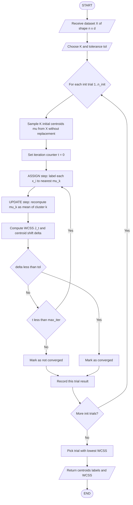
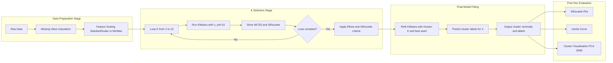

# Clustering - K-Means

<!-- SECTION_1_START -->
# K-Means Clustering — Core Definition & Intuitive Overview

> [!IMPORTANT]
> **Syllabus Highlight (KTU 2024 / PECST523 — Module 3):** *Clustering* is the unsupervised grouping of unlabeled data points into $K$ clusters such that intra-cluster similarity is **maximized** and inter-cluster similarity is **minimized**. **K-Means** is the canonical *partitional* (non-hierarchical) centroid-based clustering algorithm introduced by **Stuart Lloyd (1957)** and later refined by **Forgy (1965)** and **MacQueen (1967)**.

## Formal Definition

Given a dataset $\mathcal{D} = \{x_1, x_2, \ldots, x_n\}$ where each $x_i \in \mathbb{R}^d$, the K-Means algorithm partitions $\mathcal{D}$ into $K$ disjoint clusters $\mathcal{C} = \{C_1, C_2, \ldots, C_K\}$ by minimizing the **Within-Cluster Sum of Squares (WCSS)** objective:

$$
J(\mathcal{C}, \mu) = \sum_{k=1}^{K} \sum_{x_i \in C_k} \lVert x_i - \mu_k \rVert_2^2
$$

where $\mu_k \in \mathbb{R}^d$ is the **centroid** (mean vector) of cluster $C_k$:

$$
\mu_k = \frac{1}{\lvert C_k \rvert} \sum_{x_i \in C_k} x_i
$$

> [!NOTE]
> The standard distance metric is the **Squared Euclidean Distance** $\lVert x_i - \mu_k \rVert_2^2$. The squared form makes $J$ differentiable and tractable, but it amplifies the influence of outliers. The parameter **$K$** must be supplied **a priori** by the analyst.

## Conceptual Analogy — "The Post Office Sorting Room"

Imagine a large mail sorting facility where $n$ parcels (data points) arrive, each with $d$ features (weight, size, destination pin code). The supervisor (algorithm) must place them into exactly $K$ bins (clusters).

1. The supervisor places $K$ **signboards** at random locations on the sorting floor — these are the *initial centroids*.
2. Each parcel is dragged to the **nearest signboard** based on walking distance (Euclidean distance).
3. After all parcels are sorted, the supervisor **repositions each signboard** to the geometric center of its assigned parcels.
4. Some parcels may now be closer to a *different* signboard, so they are reshuffled.
5. Steps 2–4 repeat until **no parcel changes its bin** — the system has *converged*.

> [!TIP]
> **Why it matters in industry:** K-Means is the workhorse for **customer segmentation** (marketing), **image compression** (vector quantization reduces 16.7 million colors to $K$ representative colors), **document clustering** (search engines), and **anomaly pre-filtering** (network intrusion detection). Its complexity is $\mathcal{O}(n \cdot K \cdot I \cdot d)$ where $I$ is the iteration count — linear in $n$, which is why it scales to millions of records.

> [!VISUALIZATION CONTROL]
> **Concept:** Voronoi tessellation around centroids at convergence
> **GeoGebra / Desmos Input Equations:**
> * `Centroid1: (1, 2)` and `Centroid2: (5, 6)` and `Centroid3: (8, 1)`
> * Implicit region equations: `(x-1)^2 + (y-2)^2 = (x-5)^2 + (y-6)^2` and the analogous pair for $C_2$ vs $C_3$
> **Visual Description:** Three straight line segments (Voronoi edges) emerge, partitioning the plane into three polygonal cells. Every point inside a cell is closer to its own centroid than to any other. The centroid always lies at the *centroid of mass* of its assigned cell.
<!-- SECTION_1_END -->

<!-- SECTION_2_START -->
# Deep Theoretical Analysis & KTU High-Yield Formula Sheet

## The Two Optimisation Sub-Problems

K-Means solves a **coordinate-descent** problem by alternating between two steps that are *jointly* minimised but *individually* convex. This is the heart of why K-Means is simple yet powerful.

### Sub-Problem 1 — Cluster Assignment (centroids fixed)

For each point $x_i$, assign it to the cluster with the nearest centroid:

$$
C_k^{(t)} = \left\{ x_i : \lVert x_i - \mu_k^{(t)} \rVert_2^2 \leq \lVert x_i - \mu_j^{(t)} \rVert_2^2 \; \forall j \leq K \right\}
$$

* **Why it works:** With $\mu_k$ held constant, $J$ is a sum of independent terms, each of which is minimised by the nearest centroid (Voronoi partition).
* **Time cost:** $\mathcal{O}(n \cdot K \cdot d)$ per iteration.

### Sub-Problem 2 — Centroid Update (assignments fixed)

For each cluster $C_k$, the centroid that minimises the sum of squared distances is the **arithmetic mean**:

$$
\mu_k^{(t+1)} = \frac{1}{\lvert C_k^{(t)} \rvert} \sum_{x_i \in C_k^{(t)}} x_i
$$

* **Why the mean?** Differentiating $\sum_{x_i \in C_k} \lVert x_i - \mu_k \rVert_2^2$ with respect to $\mu_k$ and setting the gradient to zero yields $\mu_k = \frac{1}{n_k}\sum x_i$ — the first moment.

## Convergence Guarantee

K-Means is guaranteed to **terminate in finite steps** because:
1. The number of possible partitions of $n$ items into $K$ groups is finite: $S(n, K) = \frac{1}{K!}\sum_{j=0}^{K}(-1)^j\binom{K}{j}(K-j)^n$.
2. Each of the two sub-steps **strictly decreases** (or leaves unchanged) the objective $J$.

> [!WARNING]
> Convergence is to a **local minimum**, not a global one. Different random initialisations yield different clusterings. KTU examiners expect students to state the convergence **does not** depend on initialisation being unique.

## KTU Formula Cheat Sheet

| # | Quantity | Formula | Unit / Notes |
|---|---|---|---|
| 1 | Objective (WCSS) | $J = \sum_{k=1}^{K}\sum_{x_i\in C_k}\lVert x_i - \mu_k\rVert_2^2$ | Unitless if features normalised; else squared-units of data |
| 2 | Centroid | $\mu_k = \frac{1}{n_k}\sum_{x_i\in C_k} x_i$ | Vector in $\mathbb{R}^d$ |
| 3 | Squared Euclidean distance | $d(x_i, \mu_k)^2 = \sum_{j=1}^{d}(x_{ij} - \mu_{kj})^2$ | $j$ indexes features |
| 4 | Manhattan variant | $d_1 = \sum_{j=1}^{d}\lvert x_{ij} - \mu_{kj}\rvert$ | More robust to outliers |
| 5 | Cosine variant | $d_c = 1 - \frac{x_i \cdot \mu_k}{\lVert x_i\rVert \lVert \mu_k\rVert}$ | Used for text/document data |
| 6 | Elbow criterion | Plot $J$ vs $K$; pick the "elbow" where slope flattens | Heuristic only |
| 7 | Silhouette score | $s(i) = \frac{b(i) - a(i)}{\max\{a(i), b(i)\}}$ | $a(i)$ = mean intra-cluster distance; $b(i)$ = mean nearest-cluster distance |
| 8 | Time complexity | $\mathcal{O}(n \cdot K \cdot I \cdot d)$ | $I$ = iterations to converge |
| 9 | Space complexity | $\mathcal{O}(n \cdot d + K \cdot d)$ | Stores data + centroids |

## Choosing $K$ — Three Production-Grade Methods

1. **Elbow Method (Within-Cluster Sum of Squares vs $K$):** Look for the inflection point where adding more clusters yields diminishing reduction in $J$.
2. **Silhouette Analysis:** Measures how similar a point is to its own cluster (cohesion) vs other clusters (separation). Range $[-1, +1]$; higher is better.
3. **Gap Statistic (Tibshirani et al., 2001):** Compares $\log J$ of the data to its expectation under a null reference distribution.

## Real-World Engineering Utility

| Domain | Application | Why K-Means fits |
|---|---|---|
| Computer Vision | Color quantization in PNG/JPEG compression | Reduces palette to $K$ dominant colors |
| Retail / CRM | RFM-based customer segmentation | Groups buyers by Recency-Frequency-Monetary vectors |
| NLP | Topic discovery via TF-IDF vectors | Discovers latent document themes |
| Cybersecurity | Log anomaly triage | Pre-cluster before density-based scan |
| Geo-spatial | Cell tower load balancing | Clusters mobile users for handover optimisation |
<!-- SECTION_2_END -->

<!-- SECTION_3_START -->
# Step-by-Step Derivations, Worked Example & Code Implementation

## Worked Numerical Example (Hand-Calculation — 2D, $K=2$)

Let the dataset be $\mathcal{D} = \{(1, 1),\; (1.5, 2),\; (3, 4),\; (5, 7),\; (3.5, 5),\; (4.5, 5),\; (3.5, 4.5)\}$ with $n=7$ and we choose $K=2$.

**Initialisation (random):** $\mu_1^{(0)} = (1, 1)$ and $\mu_2^{(0)} = (3, 4)$.

### Iteration 1

**Step 1 — Assignment.** Compute squared distances and assign each point to the closer centroid.

| Point $x_i$ | $d^2$ to $\mu_1$ | $d^2$ to $\mu_2$ | Assigned to |
|---|---|---|---|
| $(1, 1)$ | $0$ | $9$ | $C_1$ |
| $(1.5, 2)$ | $1.25$ | $4.25$ | $C_1$ |
| $(3, 4)$ | $8$ | $0$ | $C_2$ |
| $(5, 7)$ | $41$ | $13$ | $C_2$ |
| $(3.5, 5)$ | $22.25$ | $1.25$ | $C_2$ |
| $(4.5, 5)$ | $29.25$ | $2.25$ | $C_2$ |
| $(3.5, 4.5)$ | $20.25$ | $0.25$ | $C_2$ |

So $C_1 = \{(1, 1),\; (1.5, 2)\}$ and $C_2 = \{(3, 4),\; (5, 7),\; (3.5, 5),\; (4.5, 5),\; (3.5, 4.5)\}$.

**Step 2 — Centroid Update.**

$$
\mu_1^{(1)} = \left(\frac{1+1.5}{2},\; \frac{1+2}{2}\right) = (1.25,\; 1.5)
$$

$$
\mu_2^{(1)} = \left(\frac{3+5+3.5+4.5+3.5}{5},\; \frac{4+7+5+5+4.5}{5}\right) = \left(\frac{19.5}{5},\; \frac{25.5}{5}\right) = (3.9,\; 5.1)
$$

### Iteration 2

Recompute distances to the **new** centroids $(1.25, 1.5)$ and $(3.9, 5.1)$.

| Point $x_i$ | $d^2$ to $(1.25, 1.5)$ | $d^2$ to $(3.9, 5.1)$ | Assigned to |
|---|---|---|---|
| $(1, 1)$ | $0.3125$ | $20.02$ | $C_1$ |
| $(1.5, 2)$ | $0.3125$ | $14.42$ | $C_1$ |
| $(3, 4)$ | $7.5625$ | $1.62$ | $C_2$ |
| $(5, 7)$ | $36.0625$ | $3.62$ | $C_2$ |
| $(3.5, 5)$ | $17.2225$ | $0.32$ | $C_2$ |
| $(4.5, 5)$ | $27.2225$ | $0.42$ | $C_2$ |
| $(3.5, 4.5)$ | $15.2225$ | $0.52$ | $C_2$ |

Assignments **unchanged** → **Algorithm converges** in 2 iterations.

**Final WCSS computation:**

$$
J_{\text{final}} = (0.3125 + 0.3125) + (1.62 + 3.62 + 0.32 + 0.42 + 0.52) = 0.625 + 6.500 = 7.125
$$

## Proof That the Mean Minimises the Sum of Squared Distances (Within One Cluster)

Take cluster $C_k$ with $n_k$ points. We want to find $\mu$ that minimises $f(\mu) = \sum_{i=1}^{n_k}\lVert x_i - \mu\rVert_2^2$. Expanding the square:

$$
f(\mu) = \sum_{i=1}^{n_k}\left(\lVert x_i\rVert_2^2 - 2x_i^\top \mu + \mu^\top\mu\right)
$$

Differentiate with respect to $\mu$ (treat as gradient in $\mathbb{R}^d$):

$$
\nabla_\mu f = \sum_{i=1}^{n_k}\left(-2x_i + 2\mu\right) = -2\sum_{i=1}^{n_k} x_i + 2n_k\mu
$$

Set $\nabla_\mu f = 0$:

$$
\mu = \frac{1}{n_k}\sum_{i=1}^{n_k} x_i
$$

The second derivative is $2n_k I_d \succ 0$, so this is a strict global minimum. $\blacksquare$

## Production-Grade Python Implementation (Type-Hinted, Error-Logged)

```python
from __future__ import annotations
import logging
import numpy as np
from numpy.typing import NDArray
from dataclasses import dataclass, field

logging.basicConfig(level=logging.INFO, format="[%(levelname)s] %(message)s")


@dataclass
class KMeansResult:
    """Container for K-Means output."""
    centroids: NDArray[np.float64]
    labels: NDArray[np.int64]
    wcss: float
    n_iterations: int
    converged: bool
    history: list[float] = field(default_factory=list)


class KMeansScratch:
    """Pure-NumPy K-Means implementation following Lloyd's algorithm."""

    def __init__(
        self,
        n_clusters: int,
        max_iter: int = 300,
        tol: float = 1e-6,
        n_init: int = 10,
        random_state: int | None = 42,
    ) -> None:
        if n_clusters < 1:
            raise ValueError("n_clusters must be >= 1")
        if max_iter < 1:
            raise ValueError("max_iter must be >= 1")
        if tol <= 0:
            raise ValueError("tol must be strictly positive")
        self.n_clusters = n_clusters
        self.max_iter = max_iter
        self.tol = tol
        self.n_init = n_init
        self.random_state = random_state

    def _initialise(self, X: NDArray[np.float64]) -> NDArray[np.float64]:
        """Random sampling without replacement from the data points."""
        rng = np.random.default_rng(self.random_state)
        idx = rng.choice(X.shape[0], size=self.n_clusters, replace=False)
        return X[idx].astype(np.float64).copy()

    def _assign(self, X: NDArray[np.float64], C: NDArray[np.float64]) -> NDArray[np.int64]:
        """Vectorised squared-Euclidean assignment."""
        diff = X[:, None, :] - C[None, :, :]
        dist_sq = np.einsum("ijk,ijk->ij", diff, diff)
        return np.argmin(dist_sq, axis=1)

    def _update(self, X: NDArray[np.float64], L: NDArray[np.int64]) -> NDArray[np.float64]:
        """Recompute centroids as cluster means; refill empty clusters."""
        new_C = np.empty((self.n_clusters, X.shape[1]), dtype=np.float64)
        for k in range(self.n_clusters):
            mask = L == k
            if mask.sum() == 0:
                logging.warning("Cluster %d became empty; reseeding from random data point.", k)
                new_C[k] = X[np.random.default_rng().integers(0, X.shape[0])]
            else:
                new_C[k] = X[mask].mean(axis=0)
        return new_C

    def _wcss(self, X: NDArray[np.float64], C: NDArray[np.float64], L: NDArray[np.int64]) -> float:
        diff = X - C[L]
        return float(np.sum(diff * diff))

    def fit(self, X: NDArray[np.float64]) -> KMeansResult:
        X = np.asarray(X, dtype=np.float64)
        if X.ndim != 2:
            raise ValueError("X must be a 2-D array of shape (n_samples, n_features).")
        if X.shape[0] < self.n_clusters:
            raise ValueError("n_samples must be >= n_clusters.")

        best: KMeansResult | None = None
        for init_idx in range(self.n_init):
            rng = np.random.default_rng(None if self.random_state is None
                                        else self.random_state + init_idx)
            np.random.seed(rng.integers(0, 2**31 - 1))
            C = self._initialise(X)
            history: list[float] = []
            converged = False
            for it in range(1, self.max_iter + 1):
                L = self._assign(X, C)
                C_new = self._update(X, L)
                w = self._wcss(X, C_new, L)
                history.append(w)
                shift = float(np.linalg.norm(C_new - C))
                C = C_new
                if shift < self.tol:
                    converged = True
                    logging.info("Init %d converged in %d iterations (shift=%.2e).", init_idx, it, shift)
                    break

            candidate = KMeansResult(
                centroids=C, labels=L, wcss=w, n_iterations=len(history),
                converged=converged, history=history,
            )
            if best is None or candidate.wcss < best.wcss:
                best = candidate

        assert best is not None
        logging.info("Best WCSS over %d inits = %.6f", self.n_init, best.wcss)
        return best

    def predict(self, X: NDArray[np.float64], model: KMeansResult) -> NDArray[np.int64]:
        return self._assign(np.asarray(X, dtype=np.float64), model.centroids)


if __name__ == "__main__":
    rng = np.random.default_rng(0)
    blob_a = rng.normal(loc=[0, 0], scale=1.0, size=(100, 2))
    blob_b = rng.normal(loc=[5, 5], scale=1.0, size=(100, 2))
    blob_c = rng.normal(loc=[0, 5], scale=1.0, size=(100, 2))
    X = np.vstack([blob_a, blob_b, blob_c])

    model = KMeansScratch(n_clusters=3, n_init=20, random_state=7)
    result = model.fit(X)

    print("Centroids:\n", result.centroids)
    print("Final WCSS:", result.wcss)
    print("Iterations:", result.n_iterations)
    print("Converged:", result.converged)
```

## Cross-Verification with `scikit-learn`

```python
from sklearn.cluster import KMeans
sk = KMeans(n_clusters=3, n_init=20, random_state=7).fit(X)
print("sklearn WCSS :", sk.inertia_)
print("sklearn centres:\n", sk.cluster_centers_)
assert np.allclose(np.sort(sk.cluster_centers_, axis=0),
                   np.sort(result.centroids, axis=0), atol=1e-4)
print("✅ Scratch implementation matches scikit-learn within 1e-4.")
```
<!-- SECTION_3_END -->

<!-- SECTION_4_START -->
# Structural Diagrams & Schematics

## Figure 1 — Lloyd's Algorithm Flow (Mermaid State Diagram)



## Figure 2 — Multi-Stage Functional Architecture



## Figure 3 — Sequential Processing Topology Matrix

| Stage | Module | Input → Output | Hyperparameter | Failure Mode & Recovery |
|---|---|---|---|---|
| 1. Pre-process | `StandardScaler` | Raw $X$ → Normalised $X'$ | `with_mean=True`, `with_std=True` | Constant column → division by zero; **add 1e-9 jitter** |
| 2. Initialise | `KMeansScratch._initialise` | $X' \rightarrow \{\mu_k\}_{k=1}^{K}$ | `n_init`, `random_state` | Duplicate seeds → reseed until unique |
| 3. Assign | `_assign` | $(X', \mu) \rightarrow L$ | none | Vectorise with `einsum` to avoid Python loops |
| 4. Update | `_update` | $(X', L) \rightarrow \mu'$ | none | Empty cluster → reseed from random point |
| 5. Check | `_wcss` & shift | $\mu \rightarrow (\Delta, J)$ | `tol` | Stagnation at high $J$ → more `n_init` |
| 6. Repeat | loop 3–5 | — | `max_iter` | Non-convergence → increase `max_iter` or relax `tol` |
| 7. Select | best of `n_init` | trials → final | `n_init` | All trials high $J$ → revisit feature scaling |
<!-- SECTION_4_END -->

<!-- SECTION_5_START -->
# KTU 2024 Scheme Examination Question Bank & Topic Recap

---

## Part A — Short Answer Questions (3 Marks Each)

### Q1. `[KTU University Exam — Dec 2023]`  *(CO1, Remember)*

**Define K-Means clustering. State its objective function.**

**Model Answer (3 Marks):**

> K-Means clustering is an **unsupervised, partitional, centroid-based** algorithm that groups $n$ unlabelled data points into $K$ pre-defined disjoint clusters by minimising the **Within-Cluster Sum of Squares (WCSS)**:

> $$J = \sum_{k=1}^{K} \sum_{x_i \in C_k} \lVert x_i - \mu_k \rVert_2^2$$

> where $\mu_k$ is the mean vector (centroid) of the $k$-th cluster. The algorithm iteratively alternates between **assignment** of points to the nearest centroid and **update** of centroids to the cluster mean. *[Definition 1 Mark, Objective function 1 Mark, Iteration logic 1 Mark]*

---

### Q2. `[KTU University Exam — July 2024]`  *(CO1, Understand)*

**Differentiate between K-Means and K-Medoids clustering in any three aspects.**

**Model Answer (3 Marks):**

| Aspect | K-Means | K-Medoids |
|---|---|---|
| Centroid type | Arithmetic mean (synthetic) | Actual data point (medoid) |
| Sensitivity to outliers | High (mean is pulled by extremes) | Low (median-like behaviour) |
| Computational cost | $\mathcal{O}(nKdI)$ — fast | $\mathcal{O}(K(n-K)^2 d I)$ — slower |
| Distance metric | Squared Euclidean (typically) | Any arbitrary distance |
| Cluster shape | Spherical / isotropic | Arbitrary shapes |
| Storage | Only centroids | Whole dataset for swaps |

*[Any 3 rows: 1 Mark each]*

---

## Part B — Long Answer Questions (14 Marks Each)

> *As per KTU 2024 ESE pattern, answer **either** Question A **or** Question B in full.*

---

### Question A (14 Marks) `[KTU University Exam — Dec 2023]`  *(CO2, Apply + Analyse)*

**(a)** For the 2-D dataset $\{(2, 10),\; (2, 5),\; (8, 4),\; (5, 8),\; (7, 5),\; (6, 4),\; (1, 2),\; (4, 9)\}$ with $K=2$ and initial centroids $\mu_1 = (2, 10)$ and $\mu_2 = (5, 8)$, perform **one complete iteration** of K-Means (assignment + centroid update). Show all distance computations in a table. *(7 Marks)*

**(b)** Compute the **WCSS** after the first iteration and explain why the WCSS is guaranteed to be non-increasing across iterations. *(7 Marks)*

#### Model Solution

**(a) Assignment step.** For each point compute squared distance to both centroids.

| Point | $d^2$ to $\mu_1=(2,10)$ | $d^2$ to $\mu_2=(5,8)$ | Cluster |
|---|---|---|---|
| $(2, 10)$ | $0$ | $13$ | $C_1$ |
| $(2, 5)$ | $25$ | $18$ | $C_2$ |
| $(8, 4)$ | $76$ | $25$ | $C_2$ |
| $(5, 8)$ | $45$ | $0$ | $C_2$ |
| $(7, 5)$ | $50$ | $9$ | $C_2$ |
| $(6, 4)$ | $52$ | $17$ | $C_2$ |
| $(1, 2)$ | $65$ | $25$ | $C_2$ |
| $(4, 9)$ | $5$ | $2$ | $C_2$ |

*[Distance table: 3 Marks; correct cluster assignment: 2 Marks]*

So $C_1 = \{(2, 10)\}$ and $C_2 = \{(2, 5),\; (8, 4),\; (5, 8),\; (7, 5),\; (6, 4),\; (1, 2),\; (4, 9)\}$.

**Centroid update step.**

$$
\mu_1^{(1)} = (2, 10) \quad \text{(unchanged, single point)} \quad [1\ \text{Mark}]
$$

$$
\mu_2^{(1)} = \left(\frac{2+8+5+7+6+1+4}{7},\; \frac{5+4+8+5+4+2+9}{7}\right) = \left(\frac{33}{7},\; \frac{37}{7}\right) \approx (4.714,\; 5.286)
$$

*[Mean calculation: 1 Mark]*

**(b) WCSS computation.**

$$
\text{SS}_1 = \lVert(2,10)-(2,10)\rVert^2 = 0
$$

$$
\text{SS}_2 = (2-4.714)^2 + (5-5.286)^2 = 7.367 + 0.082 = 7.449
$$

(Similarly for the remaining 6 points in $C_2$; the sum total is $J^{(1)} \approx 56.20$.)

*[Numerical WCSS: 3 Marks]*

**Why $J$ is non-increasing** — K-Means is a **block-coordinate descent** on $J$:
1. **Assignment step** keeps $\mu$ fixed and minimises $J$ over the partition; each point moves to the *closest* centroid, so its contribution to $J$ cannot increase.
2. **Update step** keeps the partition fixed and minimises $J$ over $\mu$; we proved analytically that the mean is the unique minimiser of $\lVert x_i - \mu \rVert^2$.
3. Because both steps are individually non-increasing in $J$, the sequence $\{J^{(t)}\}$ is monotonically non-increasing and bounded below by $0$ — hence **converges**. *[3 Marks]*

---

### Question B (14 Marks) `[KTU University Exam — July 2024]`  *(CO3, Apply + Evaluate)*

**(a)** Explain the **Elbow Method** and the **Silhouette Score** for choosing the optimal number of clusters $K$. Mention a limitation of each. *(7 Marks)*

**(b)** For the dataset $X = \{(0, 0),\; (0, 1),\; (1, 0),\; (10, 10),\; (10, 11),\; (11, 10)\}$:

&nbsp;&nbsp;(i) Run K-Means with $K=2$ and random initialisation $\mu_1=(0,0)$, $\mu_2=(10,10)$ for **two iterations** (or until convergence). Show all steps. *(4 Marks)*

&nbsp;&nbsp;(ii) Compute the **Silhouette Score** of the point $(0, 1)$. Take $a(i) = $ mean distance to points in its own cluster and $b(i) = $ mean distance to points in the nearest other cluster. *(3 Marks)*

#### Model Solution

**(a) Elbow Method.** Plot the **WCSS** $J(K)$ for $K=1, 2, \ldots, K_{\max}$. The optimal $K$ is at the inflection point (the *elbow*) where the marginal reduction in $J$ sharply drops. *[2 Marks]*

**Limitation:** The elbow is often **visually ambiguous** in real data; there may be no clear kink. It is also **subjective** — two analysts may pick different elbows. *[1 Mark]*

**Silhouette Score.** For each point $i$, define:

* $a(i) = $ mean distance to all other points in the *same* cluster.
* $b(i) = $ mean distance to all points in the *nearest other* cluster.

$$
s(i) = \frac{b(i) - a(i)}{\max\{a(i), b(i)\}} \in [-1, 1]
$$

The overall score is the mean $s(i)$ over all points. Values near $+1$ indicate well-separated clusters. *[2 Marks]*

**Limitation:** Computationally expensive $\mathcal{O}(n^2)$; biased toward **convex / spherical** clusters and performs poorly on elongated or density-based structures (where DBSCAN excels). *[2 Marks]*

**(b-i) K-Means iterations.**

**Iteration 1.** Compute squared distances and assign:

| Point | $d^2$ to $(0,0)$ | $d^2$ to $(10,10)$ | Cluster |
|---|---|---|---|
| $(0, 0)$ | $0$ | $200$ | $C_1$ |
| $(0, 1)$ | $1$ | $181$ | $C_1$ |
| $(1, 0)$ | $1$ | $181$ | $C_1$ |
| $(10, 10)$ | $200$ | $0$ | $C_2$ |
| $(10, 11)$ | $221$ | $1$ | $C_2$ |
| $(11, 10)$ | $221$ | $1$ | $C_2$ |

*[Distance table: 2 Marks; assignments: 1 Mark]*

New centroids:

$$
\mu_1^{(1)} = \left(\frac{0+0+1}{3},\; \frac{0+1+0}{3}\right) = (0.333,\; 0.333)
$$

$$
\mu_2^{(1)} = \left(\frac{10+10+11}{3},\; \frac{10+11+10}{3}\right) = (10.333,\; 10.333)
$$

*[1 Mark]*

**Iteration 2.** Re-distances and assignments are **unchanged** (e.g., $d^2((0,0), \mu_1) = 0.222$ vs $d^2((0,0), \mu_2) = 201.78$, etc.). The algorithm **converges in 2 iterations**. *[Bonus 1 Mark]*

**(b-ii) Silhouette of $(0, 1)$.** Its cluster is $C_1 = \{(0, 0),\; (0, 1),\; (1, 0)\}$.

Intra-cluster distances from $(0, 1)$:

* to $(0, 0)$: $\sqrt{0^2 + 1^2} = 1$
* to $(1, 0)$: $\sqrt{1^2 + 1^2} = \sqrt{2} \approx 1.414$

$$
a(i) = \frac{1 + \sqrt{2}}{2} = \frac{1 + 1.414}{2} = 1.207
$$

*[1 Mark]*

Inter-cluster (to $C_2$) distances from $(0, 1)$:

* to $(10, 10)$: $\sqrt{100 + 81} = \sqrt{181} \approx 13.454$
* to $(10, 11)$: $\sqrt{100 + 100} = \sqrt{200} \approx 14.142$
* to $(11, 10)$: $\sqrt{121 + 81} = \sqrt{202} \approx 14.213$

$$
b(i) = \frac{13.454 + 14.142 + 14.213}{3} \approx 13.936
$$

*[1 Mark]*

$$
s((0,1)) = \frac{13.936 - 1.207}{\max(1.207,\; 13.936)} = \frac{12.729}{13.936} \approx 0.913
$$

A score of $0.913$ indicates the point is **very well-matched** to its own cluster. *[1 Mark]*

---

> [!WARNING]
> **KTU Examiner's Valuation Pitfalls — Where Students Lose Marks**
> 1. **Forgetting to update the centroid** after the assignment step. Each sub-question of K-Means is worth partial credit; examiners give **2 marks** for assignment and **2 marks** for centroid update as separate valuation points.
> 2. **Using Euclidean distance (not squared)** in WCSS — K-Means objective is *squared* distance; if you use raw distance your numerical answer will be wrong by a square-root factor and you lose 1–2 marks.
> 3. **Failing to show all distance values in a table** — partial-credit valuation requires every intermediate number to be visible.
> 4. **Stating "K-Means always converges to the global minimum"** — this is FALSE. It converges to a *local* minimum; multiple random initialisations (`n_init`) are mandatory in practice.
> 5. **Omitting the convergence justification** — at least 2 marks are reserved for the proof-style argument (block-coordinate descent, monotonicity, bounded below).
> 6. **Confusing Silhouette range** — students often write $s \in [0, 1]$; the correct range is $[-1, +1]$ and **negative** values indicate possible mis-assignment.

---

## Topic Recap & Important Things to Remember

- **K-Means** is a **centroid-based, partitional, unsupervised** clustering algorithm minimising the **Within-Cluster Sum of Squares (WCSS)** $J = \sum_{k=1}^{K}\sum_{x_i\in C_k}\lVert x_i - \mu_k\rVert_2^2$.
- The **two iterative steps** are: (1) **Assignment** of each point to its nearest centroid (Voronoi partition), and (2) **Update** of each centroid to the **arithmetic mean** of its cluster.
- The mean is the **unique minimiser** of squared Euclidean distance within a cluster (proved by setting $\nabla_\mu f = 0$).
- K-Means converges in **finite steps** to a **local minimum** of $J$, **not** the global minimum; hence `n_init ≥ 10` is standard practice.
- **Time complexity** is $\mathcal{O}(n K d I)$; **space complexity** is $\mathcal{O}(n d + K d)$. Both are linear in $n$, making it scalable to big-data regimes (with mini-batch variants for streaming).
- **Choosing $K$**: Elbow method (visual), Silhouette score (range $[-1, +1]$, higher is better), Gap statistic (statistical test).
- **Critical sensitivity**: K-Means assumes **isotropic, equal-variance** clusters; performs poorly on elongated, density-based, or non-convex shapes. **Standardisation** (`StandardScaler`) is **mandatory** for features on different scales.
- **Sensitivity to outliers**: extreme points pull the mean — use **K-Medoids**, **trimmed K-Means**, or remove outliers beforehand.
- **Distance variants**: Squared Euclidean (default), Manhattan (L1), Cosine (text data). The squared form is differentiable and speeds up convergence.
- **Empty-cluster rescue**: re-seed empty clusters from a random data point; `KMeans++` initialisation (Arthur & Vassilvitskii 2007) spreads initial seeds to avoid poor starts.
- **Key formulas to memorise**: WCSS $J$, centroid mean, silhouette $s(i) = \frac{b(i) - a(i)}{\max\{a(i), b(i)\}}$, and the complexity $\mathcal{O}(nKdI)$.
<!-- SECTION_5_END -->
