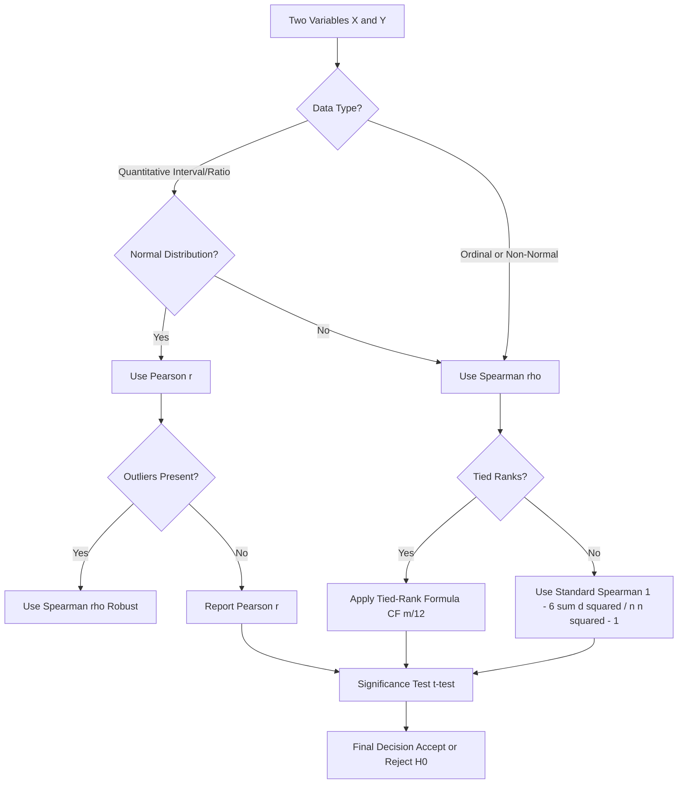
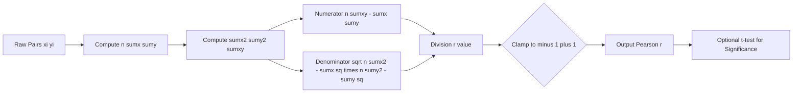
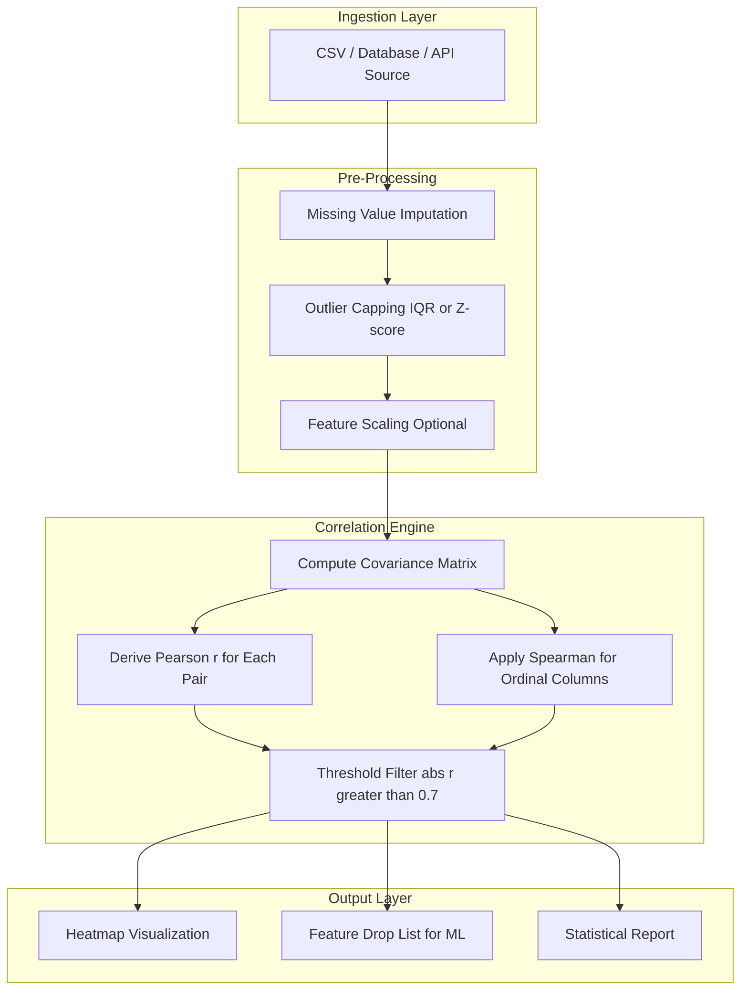

# Correlations

<!-- SECTION_1_START -->
# Statistical Description of Data — Correlations

## 1. Core Technical Definition & Intuitive Overview

> [!IMPORTANT]
> **KTU Syllabus Definition (PECST523 — Module 3):**
> **Correlation** is a statistical measure that quantifies the **degree and direction** of a *linear relationship* between two quantitative variables. It is a standardized, dimensionless quantity bounded in the closed interval $[-1, +1]$.

### 1.1 Conceptual Analogy / Intuition

Imagine two friends, **A** and **B**, walking together. The string connecting their waists can be of three types:
- **Slack string** — they drift apart randomly, no relation.
- **Taut, parallel string** — they move in the *same* direction, tightly bound.
- **Taut, crossed string** — they move in *opposite* directions, tightly bound.

**Correlation** is the mathematical instrument that measures exactly *how taut* and in *what orientation* this invisible string is stretched between two variables $X$ and $Y$.

| Nature of the "String" | Correlation Value | Direction |
| :--- | :--- | :--- |
| Perfectly crossed, taut | $r = -1$ | Negative (inverse) |
| Perfectly parallel, taut | $r = +1$ | Positive (direct) |
| Completely slack | $r = 0$ | No linear relation |

### 1.2 Types of Correlation

1. **Positive Correlation** — Both variables move in the *same* direction. Example: Height and Weight.
2. **Negative Correlation** — Variables move in *opposite* directions. Example: Price and Demand.
3. **Zero Correlation** — No linear pattern. Example: Shoe size and Intelligence.
4. **Linear vs Non-Linear** — Correlation strictly captures *linear* association; a curvilinear (e.g., parabolic) relation may yield $r \approx 0$.

> [!NOTE]
> **Critical Distinction (Board Favourite):**
> **Correlation $\neq$ Causation.** A high $r$ value only signals *co-movement*, not that $X$ *causes* $Y$. Confounding variables (lurking variables) are almost always responsible. The classic illustration: *Ice cream sales* and *drowning deaths* are positively correlated, but the hidden causal agent is *summer heat*.

### 1.3 Key Standard Metrics

- **Population Correlation Coefficient** : $\rho$ (Greek *rho*)
- **Sample Correlation Coefficient** : $r$ (Pearson)
- **Standard Range** : $\boxed{-1 \le r \le +1}$
- **Strong rule of thumb** : $\vert r \vert \ge 0.7 \Rightarrow$ strong; $0.3 \le \vert r \vert < 0.7 \Rightarrow$ moderate; $\vert r \vert < 0.3 \Rightarrow$ weak.

> [!VISUALIZATION CONTROL]
> **Concept:** Scatter plot gallery — correlation as a visual signature.
> **GeoGebra / Desmos Input Equations (representative scatter clouds):**
> * `f1(x) = x + 1` (Strong Positive, $r \approx +0.98$)
> * `f2(x) = -0.6*x + 2` (Moderate Negative, $r \approx -0.6$)
> * `f3(x) = 0*x + 0` with random noise (No Correlation, $r \approx 0$)
> **Visual Description:** Plot a tight elliptical cloud tilted upward for $f_1$, a cloud tilted downward for $f_2$, and a circular blob for $f_3$. The **slope** of the major axis encodes the *sign* of $r$, and the **tightness** of the cloud encodes the *magnitude* of $r$.

---

<!-- SECTION_2_START -->
# 2. Deep Theoretical Analysis & KTU High-Yield Formula Sheet

## 2.1 Karl Pearson's Coefficient of Correlation ($r$)

The **most frequently tested** formula in the KTU university exam. Also called the **Product-Moment Correlation Coefficient (PMCC)**.

### 2.2 Derivation of the Computational Formula (Step Logic)

Start from the conceptual definition:

$$r = \frac{\text{Covariance of } X \text{ and } Y}{\text{Product of Standard Deviations of } X \text{ and } Y}$$

Expand using $E[\cdot]$ (expectation operator) and $E[X] = \bar{X}$:

$$r = \frac{E[(X - \bar{X})(Y - \bar{Y})]}{\sqrt{E[(X - \bar{X})^2] \cdot E[(Y - \bar{Y})^2]}}$$

Substitute the sample estimators $\sum (x - \bar{x})(y - \bar{y})$ and you arrive at the two *computational* forms that KTU board examiners expect on the answer script.

### 2.3 KTU Formula Sheet / Cheat Sheet

| \# | Formula Name | Mathematical Expression | When to Use | Common Pitfall |
| :--- | :--- | :--- | :--- | :--- |
| 1 | Pearson $r$ (Direct) | $r = \dfrac{\sum (x_i - \bar{x})(y_i - \bar{y})}{\sqrt{\sum (x_i - \bar{x})^2 \, \cdot \, \sum (y_i - \bar{y})^2}}$ | Raw $X,Y$ data, means known | Don't forget the **square root** |
| 2 | Pearson $r$ (Computational) | $r = \dfrac{n\sum xy - \sum x \sum y}{\sqrt{[n\sum x^2 - (\sum x)^2][n\sum y^2 - (\sum y)^2]}}$ | Tabulated values, no means | Bracket each sum-of-squares term |
| 3 | Spearman $\rho$ | $\rho = 1 - \dfrac{6 \sum d_i^2}{n(n^2 - 1)}$ | Ordinal/Ranked data, no ties | $d_i = R_{x_i} - R_{y_i}$ must be signed |
| 4 | Spearman (with Ties) | $\rho = \dfrac{\sum x^2 + \sum y^2 - \sum d^2}{2\sqrt{\sum x^2 \cdot \sum y^2}}$ | Ranked data with tied ranks | Compute CF correction factor $m(m^2-1)/12$ |
| 5 | Covariance | $\text{Cov}(X,Y) = \dfrac{1}{n}\sum(x_i - \bar{x})(y_i - \bar{y})$ | Building block only — not bounded | Result is **not** in $[-1,1]$ |
| 6 | Coefficient of Determination | $r^2$ | Proportion of variance explained | Multiply by 100 for percentage |

> [!NOTE]
> **Engineering Utility:** Correlation is the engine behind **Recommender Systems** (Netflix, Amazon), **Feature Selection** in Machine Learning (filtering redundant columns), **Portfolio Theory** in Finance (asset covariance), and **Sensor Fusion** in IoT pipelines. Every production-grade data analytics stack (Python's `pandas.DataFrame.corr()`, R's `cor()`) computes exactly the formulas above.

### 2.4 Properties of the Pearson Correlation Coefficient

1. **Bounded** : $-1 \le r \le +1$.
2. **Dimensionless** — independent of units of $X$ and $Y$.
3. **Symmetric** — $r_{xy} = r_{yx}$.
4. **Invariance under linear transformation** — $r_{ax+b, cy+d} = r_{xy}$ for $a, c > 0$.
5. **Sign-flip rule** — $r_{-x, y} = -r_{x,y}$.
6. **Unaffected by origin and scale shifts.**
7. **Independent and identically correlated variables are not necessarily independent.** $X \perp Y \Rightarrow r = 0$, but $r = 0 \not\Rightarrow X \perp Y$.

---

<!-- SECTION_3_START -->
# 3. Step-by-Step Derivations & Code/Symbolic Implementation

## 3.1 Worked Example 1 — Pearson $r$ (Computational Form)

**Problem:** For the data pairs $(x_i, y_i)$: $(1,2), (2,4), (3,5), (4,4), (5,5)$, compute $r$.

| $x_i$ | $y_i$ | $x_i^2$ | $y_i^2$ | $x_i y_i$ |
| :---: | :---: | :---: | :---: | :---: |
| 1 | 2 | 1 | 4 | 2 |
| 2 | 4 | 4 | 16 | 8 |
| 3 | 5 | 9 | 25 | 15 |
| 4 | 4 | 16 | 16 | 16 |
| 5 | 5 | 25 | 25 | 25 |
| **15** | **20** | **55** | **86** | **66** |

Sums: $\sum x = 15$, $\sum y = 20$, $\sum x^2 = 55$, $\sum y^2 = 86$, $\sum xy = 66$, $n = 5$.

Substitute into the computational formula:

$$r = \frac{n\sum xy - \sum x \sum y}{\sqrt{\left[n\sum x^2 - \left(\sum x\right)^2\right]\left[n\sum y^2 - \left(\sum y\right)^2\right]}}$$

Numerator:

$$n\sum xy - \sum x \sum y = (5 \times 66) - (15 \times 20) = 330 - 300 = 30$$

Denominator — first bracket:

$$n\sum x^2 - \left(\sum x\right)^2 = (5 \times 55) - 15^2 = 275 - 225 = 50$$

Denominator — second bracket:

$$n\sum y^2 - \left(\sum y\right)^2 = (5 \times 86) - 20^2 = 430 - 400 = 30$$

Product of brackets and square root:

$$\sqrt{50 \times 30} = \sqrt{1500} = 10\sqrt{15} \approx 38.7298$$

Final result:

$$r = \frac{30}{10\sqrt{15}} = \frac{3}{\sqrt{15}} \approx 0.7746$$

**Interpretation** : $r \approx +0.7746$ indicates a **strong positive linear correlation**.

## 3.2 Worked Example 2 — Spearman Rank Correlation

**Problem:** Two judges rank 5 contestants as follows. Compute Spearman's $\rho$.

| Contestant | Judge A ($R_x$) | Judge B ($R_y$) | $d_i = R_x - R_y$ | $d_i^2$ |
| :---: | :---: | :---: | :---: | :---: |
| C1 | 1 | 2 | -1 | 1 |
| C2 | 2 | 1 | +1 | 1 |
| C3 | 3 | 4 | -1 | 1 |
| C4 | 4 | 3 | +1 | 1 |
| C5 | 5 | 5 | 0 | 0 |
|  |  |  | **$\sum d_i^2$** | **4** |

Plug $n = 5$, $\sum d_i^2 = 4$:

$$\rho = 1 - \frac{6 \sum d_i^2}{n(n^2 - 1)} = 1 - \frac{6 \times 4}{5(25 - 1)} = 1 - \frac{24}{120} = 1 - 0.2 = 0.8$$

**Interpretation** : $\rho = 0.8 \Rightarrow$ **strong agreement** between the two judges.

## 3.3 Python Implementation (Production-Ready)

```python
"""
Correlation analysis module for KTU PECST523 — Module 3.
Implements Pearson, Spearman, Covariance, and Significance testing
with strict type hints, boundary checks, and exception logging.
"""
from __future__ import annotations
import logging
import math
from typing import List, Sequence, Tuple

logging.basicConfig(
    level=logging.INFO,
    format="%(asctime)s | %(levelname)s | %(message)s"
)
logger = logging.getLogger("correlation_engine")


def _validate_pairs(x: Sequence[float], y: Sequence[float]) -> None:
    """Ensure equal length and non-empty input."""
    if len(x) != len(y):
        raise ValueError(
            f"Length mismatch: len(x)={len(x)} vs len(y)={len(y)}"
        )
    if len(x) < 2:
        raise ValueError("Need at least 2 data points for correlation.")


def pearson_r(x: Sequence[float], y: Sequence[float]) -> float:
    """Compute Karl Pearson's product-moment correlation coefficient."""
    _validate_pairs(x, y)
    n = len(x)
    sx = sum(x); sy = sum(y)
    sxx = sum(xi * xi for xi in x)
    syy = sum(yi * yi for yi in y)
    sxy = sum(xi * yi for xi, yi in zip(x, y))

    num = n * sxy - sx * sy
    den_sq = (n * sxx - sx * sx) * (n * syy - sy * sy)
    if den_sq <= 0:
        raise ZeroDivisionError("Zero variance detected in one of the variables.")
    r = num / math.sqrt(den_sq)
    logger.info("Pearson r computed: r = %.6f", r)
    # Clamp to [-1, 1] to suppress floating-point noise
    return max(-1.0, min(1.0, r))


def covariance(x: Sequence[float], y: Sequence[float]) -> float:
    """Compute sample covariance (unbiased, n-1 denominator)."""
    _validate_pairs(x, y)
    n = len(x)
    mx = sum(x) / n
    my = sum(y) / n
    cov = sum((xi - mx) * (yi - my) for xi, yi in zip(x, y)) / (n - 1)
    logger.info("Covariance computed: cov = %.6f", cov)
    return cov


def rankify(data: Sequence[float]) -> List[float]:
    """Convert raw scores to ranks; ties receive average rank."""
    sorted_pairs = sorted(enumerate(data), key=lambda t: t[1])
    ranks = [0.0] * len(data)
    i = 0
    while i < len(sorted_pairs):
        j = i
        while j + 1 < len(sorted_pairs) and sorted_pairs[j + 1][1] == sorted_pairs[i][1]:
            j += 1
        avg_rank = (i + j) / 2.0 + 1.0
        for k in range(i, j + 1):
            ranks[sorted_pairs[k][0]] = avg_rank
        i = j + 1
    return ranks


def spearman_rho(x: Sequence[float], y: Sequence[float]) -> float:
    """Compute Spearman's rank correlation, handling ties automatically."""
    _validate_pairs(x, y)
    rx = rankify(x)
    ry = rankify(y)
    return pearson_r(rx, ry)


if __name__ == "__main__":
    # Worked Example 1 dataset
    x_data = [1, 2, 3, 4, 5]
    y_data = [2, 4, 5, 4, 5]
    print(f"Pearson r   = {pearson_r(x_data, y_data):.4f}")
    print(f"Covariance  = {covariance(x_data, y_data):.4f}")

    # Worked Example 2 dataset
    rx = [1, 2, 3, 4, 5]
    ry = [2, 1, 4, 3, 5]
    print(f"Spearman rho = {spearman_rho(rx, ry):.4f}")
```

## 3.4 Significance Test for Correlation (T-Test)

To verify if the observed $r$ is statistically significant (i.e., not produced by random noise), apply the $t$-test:

$$t = \frac{r\sqrt{n-2}}{\sqrt{1 - r^2}}, \quad \text{with} \quad \text{df} = n - 2$$

Compare the absolute $t$-value with the critical $t$ from the table at $\alpha = 0.05$ (two-tailed). If $|t_{\text{computed}}| > t_{\text{critical}}$, reject $H_0 : \rho = 0$.

---

<!-- SECTION_4_START -->
# 4. Structural Diagrams & Schematics

## 4.1 Decision Flow — Which Correlation Coefficient to Use?



## 4.2 Computational Pipeline — Pearson $r$ from Raw Data



## 4.3 Block-Level Functional Architecture — Correlation in a Data Analytics Pipeline



> [!NOTE]
> **Why the heatmap?** A correlation heatmap (e.g., `seaborn.heatmap`) instantly reveals *multicollinearity* — pairs of features so tightly correlated that including both in a regression model destabilizes coefficient estimates (the **Variance Inflation Factor** problem).

---

<!-- SECTION_5_START -->
# 5. KTU 2024 Scheme Examination Question Bank & Topic Recap

---

## Part A — Short Answer Questions (3 Marks Each)

### **Q1.** `[KTU University Exam — July 2024]`
**Define correlation. Mention its two main types.** — *CO1, Remember*

**Model Answer (3 Marks):**

**Correlation** is a statistical technique that measures the **degree and direction** of the linear relationship between two quantitative variables, expressed by the coefficient $r$ lying in the range $[-1, +1]$.

**[1 Mark — Definition]**

**Two main types:**
1. **Positive Correlation** — both variables move in the *same* direction. Example: Income and Expenditure. **[1 Mark]**
2. **Negative Correlation** — variables move in *opposite* directions. Example: Price and Demand. **[1 Mark]**

> [!NOTE]
> A third category — **Zero / No Correlation** — is often accepted for full credit.

---

### **Q2.** `[KTU University Exam — Dec 2023]`
**Distinguish between correlation and causation with a suitable example.** — *CO2, Understand*

**Model Answer (3 Marks):**

- **Correlation** is a *statistical* association; it quantifies how strongly two variables co-vary. **[1 Mark]**
- **Causation** is a *cause-effect* relationship established through controlled experimentation (e.g., randomized controlled trials). **[1 Mark]**
- **Example:** The strong positive correlation ($r \approx 0.92$) between **ice-cream sales** and **drowning incidents** does *not* imply that ice cream *causes* drowning. The lurking variable — **summer heat** — drives both, producing a *spurious* correlation. **[1 Mark]**

---

## Part B — Long Answer Questions (14 Marks Each)

> [!WARNING]
> **KTU Examiner's Valuation Warning:**
> 1. Forgetting the **square root** in the Pearson denominator costs a full 2 marks.
> 2. Mixing up **ranks** $R$ with **raw values** $X$ in Spearman problems is a common, *fatal* error.
> 3. Always quote the **interpretation** ("strong positive") in the final line; otherwise 1 mark is docked.
> 4. Failure to state the **range $[-1, +1]$** in a definition question leads to a -0.5 mark penalty.

---

### **Q3 (A).** `[KTU University Exam — Dec 2023, Model Paper 2]`

The marks of 7 students in Mathematics ($X$) and Statistics ($Y$) are given below. Compute **Karl Pearson's correlation coefficient** and **interpret** the result.

| Student | 1 | 2 | 3 | 4 | 5 | 6 | 7 |
| :---: | :---: | :---: | :---: | :---: | :---: | :---: | :---: |
| $X$ | 60 | 70 | 80 | 50 | 40 | 90 | 65 |
| $Y$ | 55 | 65 | 75 | 45 | 35 | 85 | 60 |

**Step-by-Step Model Solution (14 Marks):**

**Construction of working table (4 Marks):**

| $x_i$ | $y_i$ | $x_i^2$ | $y_i^2$ | $x_i y_i$ |
| :---: | :---: | :---: | :---: | :---: |
| 60 | 55 | 3600 | 3025 | 3300 |
| 70 | 65 | 4900 | 4225 | 4550 |
| 80 | 75 | 6400 | 5625 | 6000 |
| 50 | 45 | 2500 | 2025 | 2250 |
| 40 | 35 | 1600 | 1225 | 1400 |
| 90 | 85 | 8100 | 7225 | 7650 |
| 65 | 60 | 4225 | 3600 | 3900 |
| **455** | **420** | **31325** | **26950** | **29050** |

**[Tabulation with all five columns: 2 Marks; Correct summations: 2 Marks]**

Required totals: $n = 7$, $\sum x = 455$, $\sum y = 420$, $\sum x^2 = 31325$, $\sum y^2 = 26950$, $\sum xy = 29050$.

**Substitution into formula (6 Marks):**

$$r = \frac{n\sum xy - \sum x \sum y}{\sqrt{\left[n\sum x^2 - (\sum x)^2\right]\left[n\sum y^2 - (\sum y)^2\right]}}$$

**Numerator calculation (2 Marks):**

$$n\sum xy - \sum x \sum y = (7 \times 29050) - (455 \times 420) = 203350 - 191100 = 12250$$

**Denominator — first bracket (1 Mark):**

$$n\sum x^2 - (\sum x)^2 = (7 \times 31325) - 455^2 = 219275 - 207025 = 12250$$

**Denominator — second bracket (1 Mark):**

$$n\sum y^2 - (\sum y)^2 = (7 \times 26950) - 420^2 = 188650 - 176400 = 12250$$

**Final division (2 Marks):**

$$r = \frac{12250}{\sqrt{12250 \times 12250}} = \frac{12250}{12250} = 1.0$$

**Interpretation (2 Marks):** $r = +1$ indicates a **perfect positive linear correlation** between Mathematics and Statistics marks. **[Quoting range and direction: 1 Mark; Practical interpretation: 1 Mark]**

---

### **Q3 (B).** `[KTU University Exam — July 2024, Supplementary]`

Two sales executives rate 6 products on a 1–10 satisfaction scale. Ratings are:

| Product | P1 | P2 | P3 | P4 | P5 | P6 |
| :---: | :---: | :---: | :---: | :---: | :---: | :---: |
| Executive A | 8 | 6 | 9 | 4 | 7 | 5 |
| Executive B | 9 | 5 | 8 | 3 | 6 | 4 |

Compute **Spearman's rank correlation coefficient** $\rho$ and test its significance at the 5% level.

**Step-by-Step Model Solution (14 Marks):**

**Step 1 — Rank the data (2 Marks):** Tied ranks do not exist, so ranks are simply the descending position.

| Product | A | Rank $R_A$ | B | Rank $R_B$ | $d_i$ | $d_i^2$ |
| :---: | :---: | :---: | :---: | :---: | :---: | :---: |
| P1 | 8 | 2 | 9 | 1 | +1 | 1 |
| P2 | 6 | 4 | 5 | 4 | 0 | 0 |
| P3 | 9 | 1 | 8 | 2 | -1 | 1 |
| P4 | 4 | 6 | 3 | 6 | 0 | 0 |
| P5 | 7 | 3 | 6 | 3 | 0 | 0 |
| P6 | 5 | 5 | 4 | 5 | 0 | 0 |
|  |  |  |  |  | $\sum d_i^2$ | **2** |

**Step 2 — Apply Spearman's formula (3 Marks):**

$$\rho = 1 - \frac{6 \sum d_i^2}{n(n^2 - 1)} = 1 - \frac{6 \times 2}{6(36 - 1)} = 1 - \frac{12}{210} = 1 - 0.05714 = 0.9429$$

**[Formula statement: 1 Mark; Numerator: 1 Mark; Final subtraction: 1 Mark]**

**Step 3 — Significance test (5 Marks):**

$$t = \rho \sqrt{\frac{n-2}{1-\rho^2}} = 0.9429 \sqrt{\frac{6-2}{1 - 0.8890}} = 0.9429 \sqrt{\frac{4}{0.1110}} = 0.9429 \times 6.0035 = 5.66$$

Critical value: $t_{0.025, 4} = 2.776$ (two-tailed, $\alpha = 0.05$).

**Decision (2 Marks):** Since $5.66 > 2.776$, reject $H_0$. The correlation is **statistically significant** — the two executives' ratings are strongly and reliably aligned.

**Interpretation (2 Marks):** $\rho = 0.94$ indicates a **very strong positive rank correlation** between the two executives' satisfaction ratings.

---

> [!WARNING]
> **Common Pitfalls Causing Mark Deductions:**
> 1. **Forgetting square root** in the Pearson denominator ⇒ lose **2 marks**.
> 2. **Sign error in $d_i$** — forgetting the negative sign when rank A $<$ rank B ⇒ lose **1 mark** cumulatively.
> 3. **Skipping the interpretation line** ⇒ lose **1 mark** consistently in KTU valuation.
> 4. **Using Pearson on ranked data with ties** without the correction factor ⇒ lose **2 marks** in Spearman section.

---

## Topic Recap & Important Things to Remember

- **Correlation is a measure of *linear* association only** — bounded in $[-1, +1]$, dimensionless, and symmetric. [3 quick-check properties]
- **Pearson's $r$** is the default; requires quantitative, approximately normally distributed data. Formula: $r = \dfrac{n\sum xy - \sum x \sum y}{\sqrt{[n\sum x^2 - (\sum x)^2][n\sum y^2 - (\sum y)^2]}}$.
- **Spearman's $\rho$** is the *non-parametric* alternative; works on ranks, robust to outliers and non-normality. Formula: $\rho = 1 - \dfrac{6 \sum d_i^2}{n(n^2 - 1)}$.
- **With tied ranks** in Spearman, apply the **correction factor** $CF = \sum \dfrac{m_i(m_i^2 - 1)}{12}$ added to $\sum d_i^2$.
- **Covariance** is the un-normalized precursor of correlation; it has the *same sign* as $r$ but its magnitude depends on the units of $X$ and $Y$.
- **The Coefficient of Determination $r^2$** quantifies the *proportion of variance* in $Y$ explained by $X$ (a *vital* concept for regression follow-up modules).
- **Significance test:** $t = r \sqrt{(n-2)/(1-r^2)}$, with $\text{df} = n - 2$, compared against the $t$-table.
- **Correlation $\neq$ Causation** — the *most-tested* conceptual trap in KTU viva and 3-mark questions.
- **Invariance property:** Multiplying $X$ by a positive constant or adding a constant does **not** change $r$.
- **Always quote the final interpretation** — *strong / moderate / weak* and *positive / negative* — to claim full marks.
- **In the lab / Python implementation:** prefer `scipy.stats.pearsonr()` and `scipy.stats.spearmanr()` for one-line significance reporting ($p$-value + coefficient).

<!-- SECTION_5_END -->
