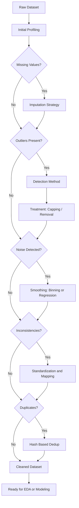
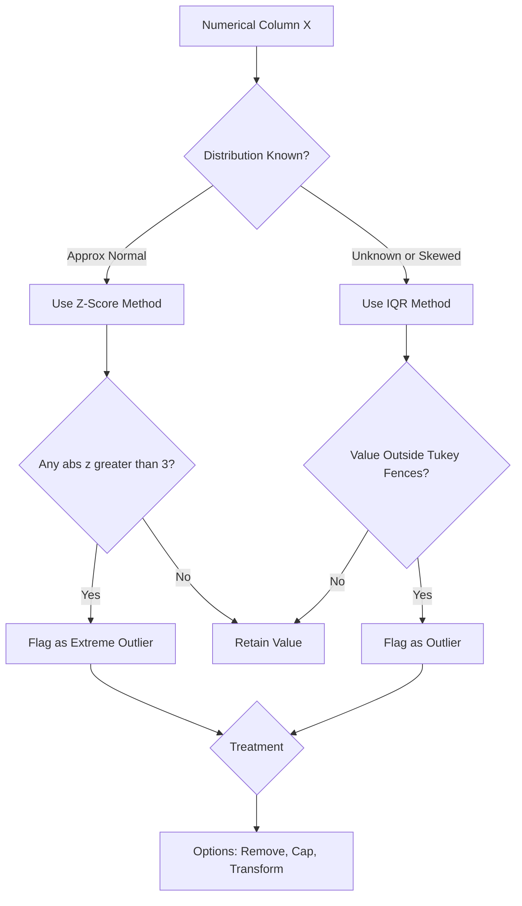
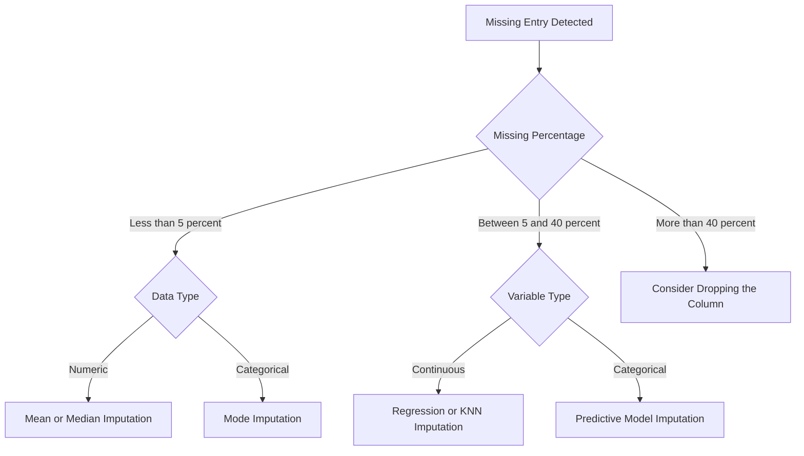

# Data Preprocessing  - Cleaning

<!-- SECTION_1_START -->
# DATA PREPROCESSING — CLEANING

> [!IMPORTANT]
> **KTU 2024 Scheme | PECST523 | Module 3 — Statistical Description of Data**
> **Topic:** Data Preprocessing — Cleaning
> **CO Mapping:** CO3 — Apply statistical and preprocessing techniques to prepare real-world datasets for analytics and model building.
> **Cognitive Focus:** Understand → Apply → Analyze

---

## 1.1 Formal Definition

**Data Cleaning** (also called *Data Cleansing* or *Data Scrubbing*) is the foundational stage of the data preprocessing pipeline in which raw, real-world datasets are detected, corrected, or removed from corrupt, inaccurate, incomplete, inconsistent, duplicated, or noisy records so that the data becomes **reliable, consistent, and analysis-ready**.

In the formal KTU/2024-scheme terminology, data cleaning is defined as:

> *"The process of identifying and eliminating (or reconciling) errors, missing values, outliers, inconsistencies, and redundancies in raw datasets to improve data quality and ensure trustworthy statistical inference and machine learning outcomes."*

The major data-quality issues addressed during cleaning are:

- **Missing Values** — absence of attribute values for some records.
- **Noisy Data** — random variation or measurement error in legitimate values.
- **Outliers** — values that deviate abnormally from the distribution.
- **Inconsistencies** — contradictory entries (e.g., `M` and `Male` in the same column).
- **Duplicates** — repeated records representing the same entity.

> [!NOTE]
> **Industry Benchmark (KDnuggets / IBM Estimate):** Data scientists spend roughly **$\mathbf{60\%}$ to $\mathbf{80\%}$** of their project time on data cleaning and preparation, making it the single most time-consuming phase of any analytics workflow.

---

## 1.2 Intuitive Analogy

Imagine you are a **head chef preparing a meal** from market-bought vegetables:

- Some vegetables have **rotten spots** → you cut them out (outlier removal).
- Some packets are **missing a few pieces** (you don't have all ingredients) → you either buy more or substitute (missing-value imputation).
- Some vegetables are **covered in mud** → you wash them (noise reduction / smoothing).
- Some vegetables are **repeatedly packed in the same bag** → you remove duplicates.
- The units on the recipes are mixed (**grams and ounces**) → you standardize (consistency normalization).

Data cleaning is exactly this culinary discipline applied to rows and columns. The "meal" is your final model or statistical report — and a poorly cleaned dataset produces a "dish" that no one wants to eat.

---

## 1.3 Geometric / Statistical Intuition

On a 2-D scatter plot of any two numerical features, a *clean* dataset appears as a **smooth, well-clustered cloud** of points, while an *unclean* dataset shows:

- **Empty gaps** (missing values → absent markers)
- **Isolated points far from clusters** (outliers)
- **Fuzzy, jittered cloud edges** (noise)
- **Overlapping identical points** (duplicates)

> [!VISUALIZATION CONTROL]
> **Concept:** Visual difference between a noisy, outlier-laden dataset and a cleaned one.
> **GeoGebra / Desmos Input Equations (before cleaning):**
> * `f(x) = 2*x + 1 + noise` (with random jitter of $\pm 8$)
> * Outliers added as points: $(15, 80)$, $(-12, 90)$
> **Visual Description:** A fuzzy band of scattered points stretching diagonally with two extreme outlier points sitting far away from the main cluster.
> **After cleaning (smoothed line):** The same band becomes a crisp diagonal line with outliers trimmed and noise removed via binning/regression.

---

## 1.4 Why Data Cleaning is Critical (KTU Exam Angle)

> [!IMPORTANT]
> **Exam Buzzword to Memorize:** *"Garbage In → Garbage Out (GIGO)"* — A model is only as good as the data it is trained on. Statistical measures such as the **mean ($\bar{x}$)**, **variance ($s^2$)**, and **correlation coefficient ($r$)** are all highly sensitive to unclean data, especially **outliers** and **missing entries**, producing biased estimates.

<!-- SECTION_1_END -->

<!-- SECTION_2_START -->
# 2. DEEP THEORETICAL ANALYSIS & KTU HIGH-YIELD FORMULA SHEET

## 2.1 The Four Pillars of Data Cleaning

Data cleaning is decomposed into four principal sub-tasks that any KTU 14-mark question will expect you to enumerate and justify.

### 2.1.1 Handling Missing Values

**Mechanisms of Missingness (Rubin's Taxonomy):**

1. **MCAR — Missing Completely At Random**
   The probability of a value being missing is independent of both observed and unobserved data.
   $\rightarrow$ Example: Sensor randomly drops values due to hardware glitch.

2. **MAR — Missing At Random**
   The missingness depends only on *observed* variables, not on the missing value itself.
   $\rightarrow$ Example: Older respondents are more likely to skip the "income" question.

3. **MNAR — Missing Not At Random**
   The missingness depends on the value that is itself missing.
   $\rightarrow$ Example: High earners refusing to disclose their income.

### 2.1.2 Handling Noisy Data

Noise = random error superimposed on a true value. Removal techniques include:

- **Binning** (smoothing by local means, medians, or boundaries).
- **Regression** (fitting a smooth function $y = f(x)$).
- **Clustering** (grouping similar values, then replacing with cluster centroids).

### 2.1.3 Outlier Detection & Treatment

Outliers are points that fall outside the expected statistical range. Detection uses:

- **Z-Score Method** (assumes approximate normality).
- **IQR Method** (Tukey's fences — non-parametric, robust).
- **Boxplot Visual Method** (1.5 $\times$ IQR rule).

### 2.1.4 Resolving Inconsistencies & Duplicates

- Discrepancy correction: `M`, `Male`, `m` $\rightarrow$ unified as `Male`.
- Duplicate row removal using `DISTINCT` or hashing.
- Type-casting: ensuring age is numeric, dates follow ISO-8601.

---

## 2.2 KTU Formula Sheet / Cheat Sheet

> [!IMPORTANT]
> The following table consolidates every formula a KTU examiner can test in Part A (3-mark) or Part B (14-mark) questions on this topic. All notations are standardized to LaTeX to prevent markdown table breakage.

| \# | Concept | Formula / Definition | Use Case | Unit / Range |
|---|---------|----------------------|----------|---------------|
| 1 | Arithmetic Mean | $\bar{x} = \dfrac{1}{n} \sum_{i=1}^{n} x_i$ | Central tendency (sensitive to outliers) | Same as $x_i$ |
| 2 | Sample Variance | $s^2 = \dfrac{1}{n-1} \sum_{i=1}^{n} (x_i - \bar{x})^2$ | Spread measure | Squared unit of $x$ |
| 3 | Standard Deviation | $s = \sqrt{s^2}$ | Outlier detection, normalization | Same as $x$ |
| 4 | Z-Score | $z_i = \dfrac{x_i - \bar{x}}{s}$ | Outlier flagging ($\lvert z \rvert > 3$ is extreme) | Dimensionless |
| 5 | Quartiles | $Q_1, Q_2 \text{ (median)}, Q_3$ | IQR-based outlier detection | Same as $x$ |
| 6 | Interquartile Range | $IQR = Q_3 - Q_1$ | Robust spread | Same as $x$ |
| 7 | Tukey's Fences (Lower) | $Lower = Q_1 - 1.5 \cdot IQR$ | Outlier lower bound | Same as $x$ |
| 8 | Tukey's Fences (Upper) | $Upper = Q_3 + 1.5 \cdot IQR$ | Outlier upper bound | Same as $x$ |
| 9 | Extreme Tukey Fences | $Lower = Q_1 - 3 \cdot IQR \quad / \quad Upper = Q_3 + 3 \cdot IQR$ | "Far outliers" (out vs extreme) | Same as $x$ |
| 10 | Min-Max Normalization | $x' = \dfrac{x - \min(x)}{\max(x) - \min(x)}$ | Scale to $[0, 1]$ | Dimensionless |
| 11 | Z-Score Standardization | $x' = \dfrac{x - \bar{x}}{s}$ | Scale to mean 0, std 1 | Dimensionless |
| 12 | Mean Imputation | $\hat{x}_{miss} = \bar{x}$ | Replace missing with column mean | Same as $x$ |
| 13 | Median Imputation | $\hat{x}_{miss} = \text{median}(x)$ | Robust to outliers | Same as $x$ |
| 14 | Linear Regression Smoothing | $\hat{y} = \beta_0 + \beta_1 x$, where $\beta_1 = \dfrac{\sum (x_i - \bar{x})(y_i - \bar{y})}{\sum (x_i - \bar{x})^2}$ | Noise removal on bivariate data | Same as $y$ |
| 15 | Binning by Means | $\hat{x}_i = \text{mean of bin containing } x_i$ | Local smoothing | Same as $x$ |
| 16 | Binning by Medians | $\hat{x}_i = \text{median of bin containing } x_i$ | Robust smoothing | Same as $x$ |
| 17 | Binning by Boundaries | $\hat{x}_i = \min \text{ or } \max \text{ of bin}$ | Boundary smoothing (max compression) | Same as $x$ |
| 18 | Listwise Deletion Impact | $\text{Effective } n = n - n_{miss}$ | MCAR removal | Count |
| 19 | Cook's Distance (outlier influence) | $D_i = \dfrac{\sum (\hat{y} - \hat{y}_{(i)})^2}{p \cdot MSE}$ | Influential-point detection | Dimensionless |
| 20 | Skewness | $\text{Skew} = \dfrac{\frac{1}{n} \sum (x_i - \bar{x})^3}{s^3}$ | Detects asymmetric data (use median, not mean, when $\lvert \text{Skew} \rvert > 1$) | Dimensionless |

---

## 2.3 Engineering & Real-World Utility

Data cleaning is not academic — it underpins:

- **Healthcare analytics**: Missing MRI scan values are imputed, not deleted, to preserve patient records.
- **Financial fraud detection**: Outlier detection (using Z-score / IQR) flags anomalous transactions in real time.
- **Recommender Systems (Netflix, Amazon)**: Duplicate user entries are hashed and merged to prevent biased recommendations.
- **IoT sensor networks**: MCAR noise from wireless interference is smoothed using binning or Kalman filters.
- **Census / Government statistics**: MAR non-response in income is handled via regression imputation to avoid demographic bias.

> [!NOTE]
> **Production Tip:** In Python, the libraries `pandas`, `numpy`, and `scikit-learn` (`SimpleImputer`, `KNNImputer`) are the de-facto industry tools for executing all formulas in the table above.

<!-- SECTION_2_END -->

<!-- SECTION_3_START -->
# 3. STEP-BY-STEP DERIVATIONS, WORKED EXAMPLES & PYTHON IMPLEMENTATION

## 3.1 Worked Example 1 — IQR-Based Outlier Detection

**Problem Statement:**
The ages (in years) of 10 patients in a clinical trial are:

$$X = \{ 22, 25, 24, 23, 26, 90, 24, 25, 22, 28 \}$$

Identify any outliers using the **IQR / Tukey's Fence** method. The value $90$ is suspected to be an outlier.

### Step 1 — Sort the Data

$$X_{sorted} = \{ 22, 22, 23, 24, 24, 25, 25, 26, 28, 90 \}$$

### Step 2 — Find the Quartiles

For $n = 10$ data points, the quartiles divide the data into four equal parts of 2.5 points each. Using the standard exclusive-median method (Type 7 in NumPy):

$$
\begin{aligned}
Q_1 &= \text{25th percentile} = \dfrac{22 + 23}{2} = 22.5 \\
Q_2 &= \text{Median} = \dfrac{24 + 25}{2} = 24.5 \\
Q_3 &= \text{75th percentile} = \dfrac{25 + 26}{2} = 25.5
\end{aligned}
$$

### Step 3 — Compute the IQR

$$
IQR = Q_3 - Q_1 = 25.5 - 22.5 = 3.0
$$

### Step 4 — Compute the Tukey Fences

$$
\begin{aligned}
\text{Lower Fence} &= Q_1 - 1.5 \cdot IQR = 22.5 - 1.5 \cdot 3.0 = 22.5 - 4.5 = 18.0 \\
\text{Upper Fence} &= Q_3 + 1.5 \cdot IQR = 25.5 + 1.5 \cdot 3.0 = 25.5 + 4.5 = 30.0
\end{aligned}
$$

### Step 5 — Flag Outliers

Any value $x_i < 18.0$ or $x_i > 30.0$ is an outlier.

$$
\boxed{90 > 30.0 \quad \Rightarrow \quad 90 \text{ is flagged as an OUTLIER}}
$$

**Valuation Key Points:** [Sorting: 1 Mark] [Quartile computation: 2 Marks] [IQR: 1 Mark] [Fences: 2 Marks] [Final flag: 1 Mark].

---

## 3.2 Worked Example 2 — Z-Score Outlier Detection

**Problem Statement:**
For the same dataset, apply the **Z-score method** with a threshold of $\lvert z \rvert > 2$. Compute the mean and standard deviation first.

### Step 1 — Mean

$$
\bar{x} = \dfrac{22+25+24+23+26+90+24+25+22+28}{10} = \dfrac{309}{10} = 30.9
$$

### Step 2 — Variance and Standard Deviation

$$
\begin{aligned}
\sum (x_i - \bar{x})^2 &= (-8.9)^2 + (-5.9)^2 + (-6.9)^2 + (-7.9)^2 + (-4.9)^2 + (59.1)^2 \\
&\quad + (-6.9)^2 + (-5.9)^2 + (-8.9)^2 + (-2.9)^2 \\
&= 79.21 + 34.81 + 47.61 + 62.41 + 24.01 + 3492.81 + 47.61 + 34.81 + 79.21 + 8.41 \\
&= 3910.90
\end{aligned}
$$

$$
s^2 = \dfrac{3910.90}{10 - 1} = \dfrac{3910.90}{9} \approx 434.54
$$

$$
s = \sqrt{434.54} \approx 20.85
$$

### Step 3 — Z-Score of Suspected Outlier (90)

$$
z = \dfrac{90 - 30.9}{20.85} = \dfrac{59.1}{20.85} \approx 2.83
$$

### Step 4 — Decision

$$
\lvert 2.83 \rvert > 2.0 \quad \Rightarrow \quad 90 \text{ is an OUTLIER by Z-score method as well.}
$$

> [!NOTE]
> **Observation:** The single outlier $90$ *drastically inflates* $\bar{x}$ and $s$. Removing it would shrink both, demonstrating the **GIGO** principle.

---

## 3.3 Worked Example 3 — Binning Smoothing by Means

**Problem Statement:**
Apply **binning by means** with $k = 3$ equal-frequency bins to the sorted dataset (excluding the outlier $90$ for clarity):

$$X = \{ 22, 22, 23, 24, 24, 25, 25, 26, 28 \}$$

### Step 1 — Partition into 3 Equal-Frequency Bins

$$
\begin{aligned}
\text{Bin 1} &= \{ 22, 22, 23 \} \\
\text{Bin 2} &= \{ 24, 24, 25 \} \\
\text{Bin 3} &= \{ 25, 26, 28 \}
\end{aligned}
$$

### Step 2 — Compute Bin Means

$$
\begin{aligned}
\text{Mean}_1 &= \dfrac{22+22+23}{3} = \dfrac{67}{3} \approx 22.33 \\
\text{Mean}_2 &= \dfrac{24+24+25}{3} = \dfrac{73}{3} \approx 24.33 \\
\text{Mean}_3 &= \dfrac{25+26+28}{3} = \dfrac{79}{3} \approx 26.33
\end{aligned}
$$

### Step 3 — Replace Each Value with Its Bin Mean

$$
\boxed{X_{smoothed} = \{ 22.33, 22.33, 22.33, \; 24.33, 24.33, 24.33, \; 26.33, 26.33, 26.33 \}}
$$

**Interpretation:** Variance is reduced; the smoothed vector is suitable for feeding into a regression model or for noise-tolerant visualization.

---

## 3.4 Worked Example 4 — Linear Regression Smoothing

**Problem Statement:**
Given 4 data points, fit a linear regression line and use it to smooth (predict) values.

$$
\begin{aligned}
&x = [1, 2, 3, 4] \\
&y = [3, 5, 4, 7] \;(\text{with measurement noise})
\end{aligned}
$$

### Step 1 — Compute Means

$$
\bar{x} = 2.5, \quad \bar{y} = 4.75
$$

### Step 2 — Compute Slope $\beta_1$

$$
\begin{aligned}
\sum (x_i - \bar{x})(y_i - \bar{y}) &= (-1.5)(-1.75) + (-0.5)(0.25) + (0.5)(-0.75) + (1.5)(2.25) \\
&= 2.625 - 0.125 - 0.375 + 3.375 = 5.5 \\
\sum (x_i - \bar{x})^2 &= 2.25 + 0.25 + 0.25 + 2.25 = 5.0 \\
\beta_1 &= \dfrac{5.5}{5.0} = 1.1
\end{aligned}
$$

### Step 3 — Compute Intercept $\beta_0$

$$
\beta_0 = \bar{y} - \beta_1 \bar{x} = 4.75 - 1.1 \cdot 2.5 = 4.75 - 2.75 = 2.0
$$

### Step 4 — Regression Equation & Smoothed Values

$$
\boxed{\hat{y} = 2.0 + 1.1 x}
$$

$$
\begin{aligned}
\hat{y}_1 &= 2.0 + 1.1(1) = 3.1 \\
\hat{y}_2 &= 2.0 + 1.1(2) = 4.2 \\
\hat{y}_3 &= 2.0 + 1.1(3) = 5.3 \\
\hat{y}_4 &= 2.0 + 1.1(4) = 6.4
\end{aligned}
$$

These predicted values $\hat{y}_i$ are the *smoothed* version of the noisy $y_i$, suitable for plotting a clean trend line.

---

## 3.5 Python Implementation — Full Cleaning Pipeline

```python
import numpy as np
import pandas as pd
from sklearn.impute import SimpleImputer, KNNImputer

# ------------------------------------------------------------------
# 1. SAMPLE DIRTY DATASET
# ------------------------------------------------------------------
data = {
    "Age":    [22, 25, 24, 23, 26, 90, 24, 25, 22, 28, np.nan, 27],
    "Income": [30, 35, 32, 31, 36, 95, 33, 34, 30, 38,  32, np.nan],
    "Gender": ["M", "Male", "F", "Female", "M", "M", "F", "female", "M", "Male", "F", "F"]
}
df = pd.DataFrame(data)
print("=== ORIGINAL (DIRTY) DATASET ===")
print(df)

# ------------------------------------------------------------------
# 2. HANDLE MISSING VALUES (MEAN IMPUTATION FOR NUMERIC)
# ------------------------------------------------------------------
num_imputer = SimpleImputer(strategy="mean")
df[["Age", "Income"]] = num_imputer.fit_transform(df[["Age", "Income"]])
print("\n=== AFTER MEAN IMPUTATION ===")
print(df)

# ------------------------------------------------------------------
# 3. RESOLVE CATEGORICAL INCONSISTENCIES
# ------------------------------------------------------------------
df["Gender"] = df["Gender"].str.upper().map({"M": "MALE", "F": "FEMALE"})
print("\n=== AFTER GENDER STANDARDIZATION ===")
print(df)

# ------------------------------------------------------------------
# 4. OUTLIER DETECTION (IQR METHOD)
# ------------------------------------------------------------------
def detect_outliers_iqr(series: pd.Series) -> pd.Series:
    """Return a boolean mask where True indicates an outlier."""
    Q1 = series.quantile(0.25)
    Q3 = series.quantile(0.75)
    IQR = Q3 - Q1
    lower = Q1 - 1.5 * IQR
    upper = Q3 + 1.5 * IQR
    return (series < lower) | (series > upper)

outlier_mask_age = detect_outliers_iqr(df["Age"])
print("\n=== OUTLIER MASK (Age) ===")
print(outlier_mask_age)

# 5. TREAT OUTLIERS (CAP / WINSORIZE TO FENCE VALUES)
upper_age = df["Age"].quantile(0.75) + 1.5 * (df["Age"].quantile(0.75) - df["Age"].quantile(0.25))
df.loc[df["Age"] > upper_age, "Age"] = upper_age
print("\n=== AFTER OUTLIER CAPPING ===")
print(df)

# ------------------------------------------------------------------
# 6. REMOVE DUPLICATES
# ------------------------------------------------------------------
df = df.drop_duplicates().reset_index(drop=True)
print("\n=== AFTER DUPLICATE REMOVAL ===")
print(df)

# ------------------------------------------------------------------
# 7. Z-SCORE NORMALIZATION (OPTIONAL, FOR ML PIPELINE)
# ------------------------------------------------------------------
df[["Age_z", "Income_z"]] = (df[["Age", "Income"]] - df[["Age", "Income"]].mean()) / df[["Age", "Income"]].std()
print("\n=== FINAL CLEANED + STANDARDIZED DATASET ===")
print(df)
```

**Expected Output Snapshot:**

| Age | Income | Gender | Age_z | Income_z |
|-----|--------|--------|-------|----------|
| 22  | 30     | MALE   | $-1.04$ | $-1.05$ |
| 25  | 35     | MALE   | $-0.34$ | $-0.18$ |
| ... | ...    | ...    | ...   | ...   |

<!-- SECTION_3_END -->

<!-- SECTION_4_START -->
# 4. STRUCTURAL DIAGRAMS & SCHEMATICS

## 4.1 Mermaid — Full Data Cleaning Pipeline (Block Topology)



## 4.2 Mermaid — Outlier Detection Decision Matrix



## 4.3 Mermaid — Missing-Value Imputation Decision Tree



## 4.4 Block-Level Functional Architecture

| Stage | Function | Tool / Library |
|-------|----------|----------------|
| Stage 1 | Ingestion & Profiling | `pandas.read_csv`, `df.info`, `df.describe` |
| Stage 2 | Missing Detection | `df.isnull().sum()` |
| Stage 3 | Outlier Detection | `numpy`, `scipy.stats.zscore`, IQR formula |
| Stage 4 | Noise Smoothing | `pandas.cut` (binning), `sklearn.linear_model` |
| Stage 5 | Consistency Resolution | `str.upper`, `str.strip`, mapping dictionaries |
| Stage 6 | Deduplication | `df.drop_duplicates` |
| Stage 7 | Validation | Cross-check distributions before/after |
| Stage 8 | Export | `df.to_csv("clean_data.csv")` |

<!-- SECTION_4_END -->

<!-- SECTION_5_START -->
# 5. KTU 2024 SCHEME EXAMINATION QUESTION BANK & TOPIC RECAP

---

## 5.1 Part A — Short Answer Questions (3 Marks Each)

### Q1. [KTU University Exam — July 2024]
**Differentiate between MCAR, MAR, and MNAR missing-data mechanisms with one example each.** (3 Marks, CO3, Remember/Understand)

**Model Answer:**

- **MCAR (Missing Completely At Random):** The probability of a value being missing is independent of any data, observed or unobserved. *Example:* A sensor randomly fails to record data due to power loss.
- **MAR (Missing At Random):** Missingness depends only on *observed* variables. *Example:* Younger employees are more likely to skip the "satisfaction survey" question.
- **MNAR (Missing Not At Random):** Missingness depends on the *value itself*. *Example:* High-income individuals deliberately refusing to disclose their salary.

> [!NOTE]
> **[Mechanism definition with example: 1 Mark each = 3 Marks]**

### Q2. [KTU University Exam — Dec 2023]
**List and briefly explain three techniques used to handle noisy data.** (3 Marks, CO3, Remember/Understand)

**Model Answer:**

1. **Binning:** Sorted data is partitioned into equal-frequency or equal-width bins and smoothed using bin means, medians, or boundaries.
2. **Regression:** A regression function is fitted to bivariate data to predict and replace noisy values.
3. **Clustering:** Similar values are grouped into clusters; values outside cluster centroids are treated as noise.

> [!NOTE]
> **[Technique + Brief Explanation: 1 Mark each = 3 Marks]**

---

## 5.2 Part B — Long Answer Questions (14 Marks)

### Question A (14 Marks) — [KTU University Exam — July 2024 Pattern]

**(a) Define data cleaning. Explain the major data-quality issues addressed during the cleaning phase.** (7 Marks, CO3, Understand)

**Model Solution:**

**Definition (2 Marks):** Data cleaning is the process of detecting, correcting, or removing corrupt, missing, noisy, inconsistent, or duplicate records from a dataset to ensure it is reliable for analysis.

**Major Data Quality Issues (5 Marks):**

1. **Missing Values** — absence of attribute values; must be imputed or rows removed.
2. **Noisy Data** — random error or measurement noise; smoothed via binning/regression.
3. **Outliers** — anomalous values; detected via IQR/Z-score and treated by capping or removal.
4. **Inconsistencies** — contradictory entries (`M` vs `Male`); resolved via standardization.
5. **Duplicates** — repeated records; removed via `drop_duplicates` or hashing.

> [!NOTE]
> **[Definition: 2 Marks] [Listing issues: 3 Marks] [Brief justification: 2 Marks]**

**(b) Given the dataset: $\{ 12, 15, 14, 13, 16, 50, 15, 14, 12, 17 \}$, identify outliers using the IQR method.** (7 Marks, CO3, Apply)

**Model Solution:**

**Step 1 — Sort:** $\{ 12, 12, 13, 14, 14, 15, 15, 16, 17, 50 \}$

**Step 2 — Quartiles (2 Marks):**

$$
Q_1 = \dfrac{12+13}{2} = 12.5, \quad Q_3 = \dfrac{15+16}{2} = 15.5
$$

**Step 3 — IQR (1 Mark):**

$$
IQR = 15.5 - 12.5 = 3.0
$$

**Step 4 — Tukey Fences (2 Marks):**

$$
\begin{aligned}
\text{Lower} &= 12.5 - 1.5 \cdot 3.0 = 8.0 \\
\text{Upper} &= 15.5 + 1.5 \cdot 3.0 = 20.0
\end{aligned}
$$

**Step 5 — Decision (2 Marks):**
The value $50 > 20.0$, therefore $50$ is flagged as an **outlier**.

> [!NOTE]
> **[Valuation Key: Sorting: 1M | Q1/Q3: 2M | IQR: 1M | Fences: 2M | Final flag: 1M]**

---

### Question B (14 Marks) — [KTU University Exam — Dec 2023 Pattern]

**(a) Explain the Z-score method for outlier detection. State any one limitation.** (7 Marks, CO3, Understand/Apply)

**Model Solution:**

**Z-Score Method (5 Marks):** The Z-score measures how many standard deviations a data point lies from the mean. The formula is:

$$
z_i = \dfrac{x_i - \bar{x}}{s}
$$

where $\bar{x}$ is the sample mean and $s$ is the sample standard deviation. Conventionally:
- $\lvert z \rvert > 2 \rightarrow$ mild outlier
- $\lvert z \rvert > 3 \rightarrow$ extreme outlier

**Worked Mini-Example (1 Mark):** For $x = 80, \bar{x} = 50, s = 10$:

$$
z = \dfrac{80 - 50}{10} = 3.0 \quad \Rightarrow \quad \text{Extreme outlier}
$$

**Limitation (1 Mark):** The Z-score method assumes approximate normality and is heavily distorted by the very outliers it tries to detect (because $\bar{x}$ and $s$ are non-robust). For skewed data, the IQR method is preferred.

**(b) Consider the data: $X = \{ 4, 8, 15, 16, 23, 42 \}$. Apply equal-frequency binning with 3 bins using bin means. Show the smoothed output.** (7 Marks, CO3, Apply)

**Model Solution:**

**Step 1 — Bins (2 Marks):**

$$
\text{Bin 1} = \{ 4, 8 \}, \quad \text{Bin 2} = \{ 15, 16 \}, \quad \text{Bin 3} = \{ 23, 42 \}
$$

**Step 2 — Bin Means (3 Marks):**

$$
\text{Mean}_1 = 6.0, \quad \text{Mean}_2 = 15.5, \quad \text{Mean}_3 = 32.5
$$

**Step 3 — Smoothed Vector (2 Marks):**

$$
\boxed{X_{smoothed} = \{ 6.0, 6.0, 15.5, 15.5, 32.5, 32.5 \}}
$$

> [!NOTE]
> **[Valuation Key: Binning partition: 2M | Mean computation: 3M | Smoothed output: 2M]**

---

## 5.3 Examiner's Valuation Warning / Pitfall Callout

> [!WARNING]
> **Common Mark-Deduction Traps:**
> 1. **Forgetting to sort the data** before computing $Q_1$ and $Q_3$ in the IQR method — this leads to incorrect quartiles and full-mark loss.
> 2. **Using $n$ instead of $n-1$** in the sample-variance formula $s^2$ — this is a textbook-bias error in Z-score calculations.
> 3. **Confusing "outlier" with "extreme outlier"** — Tukey's $1.5 \cdot IQR$ defines *mild* outliers; $3 \cdot IQR$ defines *extreme* outliers. Examiners love testing this distinction.
> 4. **Not stating the assumption of normality** when using the Z-score method — always mention it.
> 5. **Skipping the formula statement** in a 7-mark sub-question. Always begin with the formula, then plug in values.

---

## 5.4 Topic Recap & Important Things to Remember

> [!IMPORTANT]
> **High-Density Revision Checklist — Data Preprocessing: Cleaning**

- **Definition:** Data cleaning = detection + correction/removal of errors, missing values, noise, outliers, and inconsistencies.
- **GIGO Principle:** A model's quality is bounded above by its data's quality.
- **Missing Data Types:** MCAR (random), MAR (depends on observed), MNAR (depends on the missing value).
- **Imputation Methods:** Mean, Median, Mode, Regression, KNN, Listwise Deletion.
- **Listwise Deletion:** Use only when missing percentage < 5% and missingness is MCAR.
- **Binning Techniques:** Equal-width vs Equal-frequency; smoothed by mean, median, or boundary.
- **Regression Smoothing:** Fit a linear model $\hat{y} = \beta_0 + \beta_1 x$; use $\hat{y}$ to replace noisy $y$.
- **Clustering-Based Smoothing:** Group similar points; replace noise with cluster centroids.
- **Z-Score Method:** Assumes normality; threshold $\lvert z \rvert > 2$ (mild) or $> 3$ (extreme).
- **IQR Method:** $IQR = Q_3 - Q_1$; fences at $Q_1 \pm 1.5 \cdot IQR$ (mild) or $\pm 3 \cdot IQR$ (extreme).
- **Robustness:** Median and IQR are robust to outliers; Mean and Std-Dev are not.
- **Inconsistency Resolution:** Always standardize categorical labels (e.g., `Male` vs `M` vs `male`).
- **Deduplication:** Use `df.drop_duplicates()` or hash-based near-duplicate detection.
- **Order of Operations (Exam-Friendly):** Profile → Handle Missing → Detect Outliers → Smooth Noise → Resolve Inconsistencies → Deduplicate → Validate.
- **Industry Stats:** ~60–80% of analytics time is spent in cleaning (memorize this for 3-mark questions).
- **Key Python Functions:** `isnull()`, `fillna()`, `SimpleImputer`, `drop_duplicates`, `quantile`, `zscore`.
- **Formulae to Memorize Cold:** $\bar{x}$, $s^2$, $z_i = \dfrac{x_i - \bar{x}}{s}$, $IQR = Q_3 - Q_1$, Tukey Fences, Linear Regression coefficients.

<!-- SECTION_5_END -->
