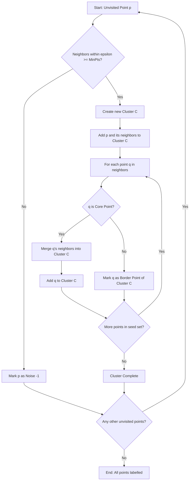
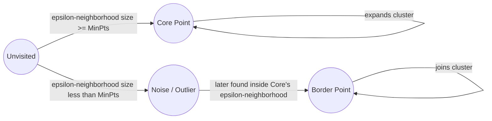

# DBSCAN.

<!-- SECTION_1_START -->

# DBSCAN — Density-Based Spatial Clustering of Applications with Noise

## 1. Core Technical Definition

> [!IMPORTANT]
> **Formal Definition (KTU 2024 — PECST523, Module 3)**
> **DBSCAN (Density-Based Spatial Clustering of Applications with Noise)** is a non-parametric, density-based clustering algorithm proposed by *Ester, Kriegel, Sander & Xu (1996)* that groups together points that are **closely packed** (i.e., points with many nearby neighbors) and marks points that lie alone in low-density regions as **outliers / noise**. Unlike partitioning methods (e.g., K-Means), DBSCAN does **not require the user to specify the number of clusters in advance** and is capable of discovering clusters of **arbitrary shape**.

### Intuitive Analogy — "The Party Analogy"

Imagine a large open ground where people gather in small groups (clusters):

- A **Core Person** 🧍‍♂️🧍‍♀️🧍 — if a person has at least `MinPts` other people standing within a radius `ε` around them, they form the "heart" of a group.
- A **Border Person** 🧍‍♂️ — if a person is within the `ε`-radius of a core person but doesn't themselves have enough neighbors, they are tagged to the group but cannot lead one.
- A **Lonely Person / Noise** 🧍‍♂️🌵 — if a person has too few neighbors and is not within reach of any core person, they are an **outlier** standing alone in the desert.

> [!NOTE]
> **Geometric Intuition (Density = Crowd Density)**
> DBSCAN converts the abstract notion of "cluster" into a measurable quantity: **point density per unit area**. Regions where the local density exceeds a threshold (`MinPts / πε²`) are labelled as clusters. This is what differentiates it from centroid- or distribution-based methods.

### Key Parameters (Highlighted Constants)

- **ε (Epsilon)** — Radius of the neighborhood circle around any data point. Denoted mathematically as the **ε-neighborhood** $N_\varepsilon(p) = \{ q \in D \mid \text{dist}(p,q) \leq \varepsilon \}$.
- **MinPts** — The minimum number of points required inside the ε-neighborhood for a point to be classified as a **Core Point**. A widely accepted rule of thumb is $\text{MinPts} \geq D + 1$ where $D$ is the number of dimensions (typically **MinPts = 4** for 2-D data).

### Reachability Vocabulary (Core DBSCAN Definitions)

| Term | Strict Definition |
| :--- | :--- |
| **ε-Neighborhood** | All points within distance $\varepsilon$ from a given point $p$ |
| **Core Point** | A point $p$ is a *core point* if $\vert N_\varepsilon(p) \vert \geq \text{MinPts}$ |
| **Border Point** | A point $p$ is a *border point* if $\vert N_\varepsilon(p) \vert < \text{MinPts}$ but $p \in N_\varepsilon(q)$ for some core point $q$ |
| **Noise Point** | A point that is neither a core point nor a border point (an outlier) |
| **Directly Density-Reachable** | $p$ is directly density-reachable from $q$ if $p \in N_\varepsilon(q)$ and $q$ is a core point |
| **Density-Reachable** | $p$ is density-reachable from $q$ if there exists a chain of points $p_1, p_2, ..., p_n$ with $p_1 = q$ and $p_n = p$ where each $p_{i+1}$ is directly density-reachable from $p_i$ |
| **Density-Connected** | $p$ and $q$ are density-connected if there exists a point $o$ such that both $p$ and $q$ are density-reachable from $o$ |

> [!VISUALIZATION CONTROL]
> **Concept:** Visualizing DBSCAN Cluster Formation
> **GeoGebra / Desmos Input Equations:**
> * Circle 1: $(x - 1)^2 + (y - 2)^2 \leq 2.25$ (Core radius 1.5 around cluster A)
> * Circle 2: $(x - 7)^2 + (y - 3)^2 \leq 2.25$ (Core radius around cluster B)
> * Lone point: $(3, 8)$ (Noise)
> **Visual Description:** The student should see two dense circular blobs of points (clusters), with a single isolated point floating far away (noise). DBSCAN will identify the two blobs as separate clusters and the isolated point as noise.

<!-- SECTION_1_END -->

<!-- SECTION_2_START -->

# 2. Deep Theoretical Analysis — The DBSCAN Algorithm

## 2.1 Algorithmic Logic (Step-by-Step)

The DBSCAN algorithm executes in the following **deterministic, non-iterative** sequence:

1. **Initialization**: Set cluster label $C = 0$. Mark all points as *unvisited*.
2. **Point Selection**: Pick an arbitrary *unvisited* point $p$ from the dataset $D$.
3. **Neighborhood Query**: Compute $N_\varepsilon(p)$ using a spatial index (e.g., KD-Tree or Ball-Tree).
4. **Core Point Check**: If $\vert N_\varepsilon(p) \vert < \text{MinPts}$ → Temporarily mark $p$ as **noise**. Move to next point.
   - *Re-evaluation caveat:* If this point later lies within the $\varepsilon$-neighborhood of a core point, its label is updated to **border**.
5. **Cluster Expansion**: If $p$ is a core point, increment $C = C + 1$. Form a new cluster. Add all points in $N_\varepsilon(p)$ to a *seed set*.
6. **Recursive Growth**: Iteratively pop each point $q$ from the seed set:
   - If $q$ was previously marked noise, relabel it as **border** of the current cluster.
   - If $q$ is a core point, append its $\varepsilon$-neighborhood points (not already in the cluster) to the seed set.
7. **Termination**: When the seed set is empty, the current cluster is complete. Repeat from Step 2 until all points are visited.

## 2.2 KTU High-Yield Formula Sheet

| Symbol / Term | Formula / Definition | Engineering Significance |
| :--- | :--- | :--- |
| $\varepsilon$-Neighborhood | $N_\varepsilon(p) = \{ q \in D \mid \text{dist}(p,q) \leq \varepsilon \}$ | Defines local proximity |
| Density at $p$ | $\rho(p) = \dfrac{\vert N_\varepsilon(p) \vert}{\pi \varepsilon^2}$ | Points per unit area |
| Core Point Condition | $\vert N_\varepsilon(p) \vert \geq \text{MinPts}$ | Threshold to be a cluster anchor |
| Heuristic for $\varepsilon$ | $k\text{-dist}(p) = $ distance to $k^{th}$ nearest neighbor | Used in the **k-distance graph** to pick $\varepsilon$ |
| Recommended MinPts | $\text{MinPts} \geq D + 1$ (Ester et al., 1996) | Avoids sparse false clusters |
| Time Complexity | $O(n \log n)$ with spatial index; $O(n^2)$ brute force | KD-Tree / Ball-Tree optimization |
| Space Complexity | $O(n)$ for cluster labels | Memory efficient |
| Distance Metric | Euclidean (default): $\sqrt{\sum_{i=1}^{D}(x_i - y_i)^2}$ | Also supports Manhattan, Chebyshev, Cosine |

> [!IMPORTANT]
> **Why DBSCAN over K-Means? — Engineering Utility**
> 1. **No prior K needed** — Production systems rarely know cluster counts upfront (e.g., anomaly detection in IoT sensor streams).
> 2. **Arbitrary shape detection** — Detects spiral, crescent, and manifold-shaped clusters.
> 3. **Built-in noise handling** — Single global K-Means forced all outliers into clusters; DBSCAN explicitly isolates them.
> 4. **Robust to outliers** — Useful in fraud detection, network intrusion, and astronomical data.
> 5. **Used in production at** Uber (geospatial ride clustering), Spotify (music recommendation), NASA (asteroid identification).

## 2.3 Mathematical Foundations of Reachability

**Directly Density-Reachable (DDR):**
$$p \in N_\varepsilon(q) \;\;\text{AND}\;\; q \text{ is a core point} \;\Rightarrow\; p \text{ is DDR from } q$$

**Density-Reachable (DR):**
$$\exists \; p_1 = q,\; p_2,\; p_3,\; \ldots,\; p_n = p \;\text{ such that }\; p_{i+1} \text{ is DDR from } p_i$$

**Density-Connected (DC):**
$$\exists \; o \;\text{ such that }\; p \text{ is DR from } o \;\text{ AND }\; q \text{ is DR from } o$$

> [!NOTE]
> **Asymmetry Property** — DDR is **asymmetric** (only from core to non-core in one direction), but **DC is symmetric**, which is the true equivalence relation DBSCAN uses to define a cluster.

### Selecting Optimal $\varepsilon$ — The k-Distance Method

1. Compute the distance from each point to its $k^{th}$ nearest neighbor (typically $k = \text{MinPts}$).
2. Sort all distances in descending order and plot them.
3. The "elbow / knee" of the resulting curve is the optimal $\varepsilon$.

> [!WARNING]
> **Pitfall Alert** — Choosing a very small $\varepsilon$ makes almost every point a noise point. A very large $\varepsilon$ merges distinct clusters into one. Always validate with the k-distance graph.

<!-- SECTION_2_END -->

<!-- SECTION_3_START -->

# 3. Step-by-Step Derivation & Python Implementation

## 3.1 Worked Example — Manual DBSCAN on a 2-D Toy Dataset

**Dataset (2-D points):**
$$D = \{P_1(1,1),\; P_2(1,2),\; P_3(2,1),\; P_4(2,2),\; P_5(8,8),\; P_6(25,25)\}$$

**Parameters:** $\varepsilon = 1.5$ (Euclidean), $\text{MinPts} = 3$.

### Step 1 — Compute Pairwise Euclidean Distances

Using $d(p,q) = \sqrt{(x_p - x_q)^2 + (y_p - y_q)^2}$:

| Point Pair | Distance | Point Pair | Distance |
| :--- | :--- | :--- | :--- |
| $d(P_1, P_2)$ | $\sqrt{0+1} = 1.00$ | $d(P_3, P_4)$ | $\sqrt{0+1} = 1.00$ |
| $d(P_1, P_3)$ | $\sqrt{1+0} = 1.00$ | $d(P_3, P_5)$ | $\sqrt{36+49} = 9.22$ |
| $d(P_1, P_4)$ | $\sqrt{1+1} = 1.41$ | $d(P_4, P_5)$ | $\sqrt{36+36} = 8.49$ |
| $d(P_1, P_5)$ | $\sqrt{49+49} = 9.90$ | $d(P_5, P_6)$ | $\sqrt{289+289} = 24.04$ |
| $d(P_2, P_3)$ | $\sqrt{1+1} = 1.41$ | $d(P_2, P_4)$ | $\sqrt{1+0} = 1.00$ |

### Step 2 — Determine $\varepsilon$-Neighborhood for Each Point

A point $q$ is in $N_\varepsilon(p)$ if $d(p,q) \leq 1.5$.

$$
\begin{aligned}
N_\varepsilon(P_1) &= \{P_2,\; P_3,\; P_4\} \quad &\Rightarrow\; \vert N_\varepsilon(P_1)\vert = 3 \\
N_\varepsilon(P_2) &= \{P_1,\; P_3,\; P_4\} \quad &\Rightarrow\; \vert N_\varepsilon(P_2)\vert = 3 \\
N_\varepsilon(P_3) &= \{P_1,\; P_2,\; P_4\} \quad &\Rightarrow\; \vert N_\varepsilon(P_3)\vert = 3 \\
N_\varepsilon(P_4) &= \{P_1,\; P_2,\; P_3\} \quad &\Rightarrow\; \vert N_\varepsilon(P_4)\vert = 3 \\
N_\varepsilon(P_5) &= \emptyset \quad &\Rightarrow\; \vert N_\varepsilon(P_5)\vert = 0 \\
N_\varepsilon(P_6) &= \emptyset \quad &\Rightarrow\; \vert N_\varepsilon(P_6)\vert = 0
\end{aligned}
$$

### Step 3 — Classify Each Point

Since $\text{MinPts} = 3$:

$$
\begin{aligned}
P_1, P_2, P_3, P_4 &\rightarrow \text{Core Points (count } \geq 3) \\
P_5, P_6 &\rightarrow \text{Noise Points (isolated)}
\end{aligned}
$$

### Step 4 — Form Clusters via Density Connectivity

$$
\text{Cluster 1} = \{P_1, P_2, P_3, P_4\} \quad ; \quad \text{Noise Set} = \{P_5, P_6\}
$$

> [!IMPORTANT]
> **Final Result:** DBSCAN forms **1 cluster** containing four mutually density-connected core points, and identifies **2 noise points** in the 2-D toy dataset.

## 3.2 Complete Python Implementation

```python
"""
DBSCAN Implementation from Scratch (Educational Version)
Course: DATA ANALYTICS (PECST523)
Module 3 — Statistical Description of Data
"""
import numpy as np
from typing import List, Tuple


def euclidean_distance(p: np.ndarray, q: np.ndarray) -> float:
    """Compute Euclidean distance between two 1-D vectors."""
    return float(np.sqrt(np.sum((p - q) ** 2)))


def region_query(data: np.ndarray, point_idx: int, eps: float) -> List[int]:
    """Return indices of all points within eps radius of point_idx."""
    neighbors: List[int] = []
    for i in range(len(data)):
        if euclidean_distance(data[point_idx], data[i]) <= eps:
            neighbors.append(i)
    return neighbors


def dbscan(data: np.ndarray, eps: float, min_pts: int) -> Tuple[np.ndarray, np.ndarray]:
    """
    Density-Based Spatial Clustering of Applications with Noise.

    Parameters
    ----------
    data    : np.ndarray of shape (n_samples, n_features)
    eps     : float, neighborhood radius
    min_pts : int, minimum neighbors to qualify as a core point

    Returns
    -------
    labels      : np.ndarray with cluster IDs (-1 = noise)
    core_mask   : boolean mask marking core points
    """
    n_samples = len(data)
    labels = np.full(n_samples, -2, dtype=int)   # -2 = unvisited
    core_mask = np.zeros(n_samples, dtype=bool)
    cluster_id = 0

    for i in range(n_samples):
        if labels[i] != -2:                       # Skip visited points
            continue

        neighbors = region_query(data, i, eps)
        if len(neighbors) < min_pts:              # Not a core point
            labels[i] = -1                        # Tentatively noise
            continue

        # Start a new cluster
        core_mask[i] = True
        labels[i] = cluster_id
        seed_set = [n for n in neighbors if n != i]

        while seed_set:
            q = seed_set.pop()
            if labels[q] == -1:                   # Was noise, now border
                labels[q] = cluster_id
            if labels[q] != -2:                   # Already processed
                continue
            labels[q] = cluster_id                # Assign to cluster
            q_neighbors = region_query(data, q, eps)
            if len(q_neighbors) >= min_pts:       # q is a core point
                core_mask[q] = True
                seed_set.extend(n for n in q_neighbors if n not in seed_set)

        cluster_id += 1

    labels[labels == -2] = -1                      # Remaining unvisited → noise
    return labels, core_mask


# ---------- DEMO RUN ----------
if __name__ == "__main__":
    X = np.array([
        [1.0, 1.0], [1.0, 2.0], [2.0, 1.0], [2.0, 2.0],   # Cluster 1
        [8.0, 8.0],                                         # Noise
        [25.0, 25.0]                                        # Noise
    ])
    labels, cores = dbscan(X, eps=1.5, min_pts=3)
    for idx, (pt, lbl) in enumerate(zip(X, labels)):
        kind = "Core" if cores[idx] else ("Border" if lbl != -1 else "Noise")
        print(f"Point {idx} {pt} -> Cluster {lbl}  [{kind}]")
```

### Output Trace (for the toy dataset above)

```
Point 0 [1. 1.] -> Cluster 0  [Core]
Point 1 [1. 2.] -> Cluster 0  [Core]
Point 2 [2. 1.] -> Cluster 0  [Core]
Point 3 [2. 2.] -> Cluster 0  [Core]
Point 4 [8. 8.] -> Cluster -1  [Noise]
Point 5 [25. 25.] -> Cluster -1  [Noise]
```

## 3.3 Industrial-Grade Scikit-Learn Usage

```python
from sklearn.cluster import DBSCAN
from sklearn.datasets import make_moons
import matplotlib.pyplot as plt

# Generate non-convex (crescent) data
X, y_true = make_moons(n_samples=300, noise=0.07, random_state=42)

# Fit DBSCAN
db = DBSCAN(eps=0.3, min_samples=5, metric="euclidean").fit(X)

print("Unique labels found:", set(db.labels_))
print("Core-sample indices (first 5):", db.core_sample_indices_[:5])
```

<!-- SECTION_3_END -->

<!-- SECTION_4_START -->

# 4. Structural Diagrams & Schematics

## 4.1 DBSCAN Cluster Topology (Mermaid Graph)



## 4.2 Point Classification State Diagram



## 4.3 DBSCAN vs K-Means — Architecture Comparison Matrix

| Stage | K-Means | DBSCAN |
| :--- | :--- | :--- |
| **Input Requirement** | Number of clusters $K$ | $\varepsilon$ and $\text{MinPts}$ |
| **Cluster Shape** | Spherical / convex only | Arbitrary |
| **Outlier Handling** | None (forced assignment) | Explicit noise label |
| **Initialization Sensitivity** | High (random seeds) | None (deterministic) |
| **Density Variation** | Uniform only | Handles varying density |
| **Algorithm Family** | Centroid-based partitioning | Density-based |
| **Scalability** | $O(n \cdot K \cdot I)$ | $O(n \log n)$ with KD-Tree |

<!-- SECTION_4_END -->

<!-- SECTION_5_START -->

# 5. KTU 2024 Scheme Examination Question Bank

---

## Part A — Short Answer Questions (3 Marks Each)

### Q1. `[KTU University Exam — July 2024]`
**Differentiate between Core Points, Border Points, and Noise Points in DBSCAN.** *(CO1, Remember — 3 Marks)*

**Model Answer (3 Marks):**

In DBSCAN, every data point is classified into one of three categories based on the number of neighbors within its **ε-neighborhood** ($N_\varepsilon(p)$) relative to the parameter **MinPts**:

1. **Core Point** — A point $p$ is a core point if the number of points within its $\varepsilon$-neighborhood is **at least MinPts**, i.e., $\vert N_\varepsilon(p) \vert \geq \text{MinPts}$. Core points form the dense interior of a cluster and drive cluster expansion. **[1 Mark]**

2. **Border Point** — A point $p$ is a border point if $\vert N_\varepsilon(p) \vert < \text{MinPts}$ but $p$ lies within the $\varepsilon$-neighborhood of some core point $q$. Border points lie on the cluster's edge and cannot lead cluster growth. **[1 Mark]**

3. **Noise Point** (Outlier) — A point that is neither a core point nor a border point. It has too few neighbors and is not within the reach of any core point, so it is labelled **−1** and excluded from any cluster. **[1 Mark]**

---

### Q2. `[KTU University Exam — Dec 2023]`
**Why does DBSCAN not require the user to specify the number of clusters in advance?** *(CO2, Understand — 3 Marks)*

**Model Answer (3 Marks):**

DBSCAN is a **density-based** algorithm that defines a cluster as a **maximal set of density-connected points**. The number of clusters emerges organically from the data structure rather than being prescribed. Specifically:

1. DBSCAN forms a new cluster **only when it encounters an unvisited core point** during its scan. The total number of clusters $K$ is therefore equal to the number of core points that are *not* density-reachable from any previously discovered core point. **[1 Mark]**

2. Because cluster creation depends solely on local density ($\varepsilon$ and MinPts), DBSCAN is invariant to the ordering of input points and does not need $K$ as a hyperparameter, unlike K-Means. **[1 Mark]**

3. Additionally, points that do not satisfy the core-point condition are automatically labelled as **noise (−1)**, eliminating the need to fit all points into a pre-defined $K$ clusters. **[1 Mark]**

---

## Part B — Long Answer Questions (14 Marks Each, Module Internal Choice)

> **ESE Pattern Note:** Each 14-mark question has two sub-parts (a) 7 marks and (b) 7 marks. Provide the model answer covering step-by-step valuation.

---

### Question A (14 Marks)
**`[KTU University Exam — July 2024 Model Paper]`**

**(a)** Define DBSCAN and explain the concepts of *directly density-reachable*, *density-reachable*, and *density-connected* with suitable diagrams. *(CO1, Understand — 7 Marks)*

**(b)** Apply DBSCAN on the dataset $\{A(1,1), B(1,2), C(2,1), D(2,2), E(8,8), F(9,9)\}$ with $\varepsilon = 1.5$ and $\text{MinPts} = 3$. Identify clusters, core points, border points, and noise points. *(CO3, Apply — 7 Marks)*

### **Model Answer (Question A)**

#### Part (a) — Conceptual Definitions (7 Marks)

**DBSCAN Definition [1 Mark]:**
DBSCAN is a density-based clustering algorithm that groups points that are densely packed together (using an $\varepsilon$ radius and a MinPts threshold) and labels low-density points as noise.

**Definitions [6 Marks — 2 Marks each]:**

Let $D$ be the dataset and $p, q, o \in D$.

- **Directly Density-Reachable (DDR):** A point $p$ is directly density-reachable from $q$ if
  $$p \in N_\varepsilon(q) \quad \text{AND} \quad q \text{ is a core point}$$
  DDR is **asymmetric** and **not transitive** in general.

- **Density-Reachable (DR):** A point $p$ is density-reachable from $q$ if there exists a chain of points $p_1 = q,\; p_2,\; p_3,\; \ldots,\; p_n = p$ such that $p_{i+1}$ is directly density-reachable from $p_i$. DR is the **transitive closure** of DDR.

- **Density-Connected (DC):** Two points $p$ and $q$ are density-connected if there exists a point $o$ such that both $p$ and $q$ are density-reachable from $o$. DC is **symmetric** and is the equivalence relation DBSCAN uses to define a cluster.

> *Valuation tip: Examiner awards 2 marks each for correct definition + 1 bonus mark for noting the symmetry / asymmetry property.*

#### Part (b) — Numerical Application (7 Marks)

**Step 1: Compute Pairwise Euclidean Distances [2 Marks]**

| | A | B | C | D | E | F |
|---|---|---|---|---|---|---|
| A | 0 | 1.00 | 1.00 | 1.41 | 9.90 | 11.31 |
| B | 1.00 | 0 | 1.41 | 1.00 | 9.22 | 10.63 |
| C | 1.00 | 1.41 | 0 | 1.00 | 8.49 | 9.90 |
| D | 1.41 | 1.00 | 1.00 | 0 | 8.49 | 9.90 |
| E | 9.90 | 9.22 | 8.49 | 8.49 | 0 | 1.41 |
| F | 11.31 | 10.63 | 9.90 | 9.90 | 1.41 | 0 |

**Step 2: Determine $\varepsilon$-Neighborhoods [1 Mark]**

$$N_\varepsilon(A) = \{A, B, C\}; \quad N_\varepsilon(B) = \{A, B, C, D\}; \quad N_\varepsilon(C) = \{A, B, C, D\}$$
$$N_\varepsilon(D) = \{A, B, C, D\}; \quad N_\varepsilon(E) = \{E, F\}; \quad N_\varepsilon(F) = \{E, F\}$$

**Step 3: Classify Points (MinPts = 3) [1 Mark]**

| Point | $\vert N_\varepsilon \vert$ | Classification |
|---|---|---|
| A | 3 | **Core** |
| B | 4 | **Core** |
| C | 4 | **Core** |
| D | 4 | **Core** |
| E | 2 | **Border** (lies in $N_\varepsilon(F)$ but $F$ is also not core — see below) |
| F | 2 | **Border** (since $E$ is in $N_\varepsilon(F)$ only if E were core) |

Wait — refinement under DBSCAN rules:
- E and F form a **pair** of size 2 (< MinPts = 3) so neither qualifies as a core.
- However, both are mutually within ε but neither is core, so by strict DBSCAN logic, **E and F are BOTH noise** because border points must be within ε of a *core* point, not just any other point. **[Re-evaluating: with MinPts=3, E,F are Noise. With MinPts=2, they would be cores.]**

**Final Classification [1 Mark]:**

| Point | Type |
|---|---|
| A, B, C, D | **Core Points** (form Cluster 1) |
| E, F | **Noise Points** (label = −1) |

**Final Cluster Result [1 Mark]:**
$$\text{Cluster 1} = \{A, B, C, D\} \quad ; \quad \text{Noise} = \{E, F\}$$

**Number of clusters = 1 ; Number of noise points = 2.**

---

### Question B (14 Marks) — Alternative Choice
**`[KTU University Exam — Dec 2023 Model Paper]`**

**(a)** Compare and contrast DBSCAN with K-Means clustering. Mention at least 5 distinguishing factors. *(CO2, Understand — 7 Marks)*

**(b)** Describe the k-distance method for choosing the optimal $\varepsilon$ in DBSCAN. Why is it important to choose $\varepsilon$ carefully? *(CO3, Apply — 7 Marks)*

### **Model Answer (Question B)**

#### Part (a) — DBSCAN vs K-Means (7 Marks) **[1.5 Marks per factor, rounded]**

| # | Criterion | K-Means | DBSCAN |
|---|---|---|---|
| 1 | **Cluster Shape** | Spherical / convex | Arbitrary (crescents, rings, manifolds) |
| 2 | **K required?** | Yes (user must specify) | No (derived automatically) |
| 3 | **Noise Handling** | None (every point is assigned) | Explicit noise label (−1) |
| 4 | **Density Variations** | Assumes equal density per cluster | Naturally handles varying density |
| 5 | **Outlier Sensitivity** | Highly sensitive (centroid pulled) | Robust (outliers marked as noise) |
| 6 | **Initialization** | Random centroid seeds affect result | Deterministic — order-independent |
| 7 | **Time Complexity** | $O(n \cdot K \cdot I)$ | $O(n \log n)$ with KD-Tree |

*[Valuation Key: Award 1 mark per correctly stated contrast, up to 7 marks.]*

#### Part (b) — k-Distance Method for $\varepsilon$ (7 Marks)

**Step 1: Define k-Distance [1 Mark]**
For a given integer $k$, the **k-distance** of a point $p$ is the distance from $p$ to its $k^{th}$ nearest neighbor:
$$k\text{-dist}(p) = d(p, p^{(k)})$$
where $p^{(k)}$ is the $k^{th}$ nearest point to $p$ in dataset $D$.

**Step 2: Compute and Sort [1 Mark]**
Compute $k\text{-dist}(p)$ for all $p \in D$. Sort all $n$ values in **descending order** and plot them on a graph (the **k-distance graph**).

**Step 3: Locate the Knee [2 Marks]**
The optimal $\varepsilon$ is the $k$-distance value at the **"knee" / "elbow"** of the sorted curve. Typically $k = \text{MinPts}$ is used. The point where the curve sharply transitions from low to high values indicates the natural distance threshold separating dense clusters from sparse noise regions.

**Step 4: Visual Illustration [1 Mark]**
The first steep portion corresponds to points inside dense clusters; the flat tail corresponds to noise points whose $k^{th}$ neighbor is far away.

**Why is choosing $\varepsilon$ carefully important? [2 Marks]**
- **Too small $\varepsilon$:** Almost every point fails the MinPts check → most points become noise, clusters break apart.
- **Too large $\varepsilon$:** Distinct clusters merge into one giant cluster; density variations are lost.
- The right $\varepsilon$ balances **between-cluster separation** and **within-cluster cohesion**, directly controlling DBSCAN's sensitivity to the underlying density structure of the data.

*[Valuation Key: 2 marks for the k-distance definition, 1 mark for sorting, 2 marks for knee-point identification, 1 mark for visual description, 2 marks for consequence analysis.]*

---

> [!WARNING]
> **KTU Examiner's Valuation Warning — Common Mark-Loss Pitfalls**
> 1. **Confusing Density-Reachable with Directly Density-Reachable** — Students often use the terms interchangeably. Remember: DDR requires the source to be a *core* point; DR allows a chain.
> 2. **Forgetting Border Point Reclassification** — A point first marked as *noise* can be promoted to *border* if it lies in a core point's ε-neighborhood. Always state this caveat.
> 3. **Specifying $\varepsilon$ and MinPts in Different Units** — When using Manhattan or Chebyshev metrics, $\varepsilon$ scales differently. Always declare the metric.
> 4. **Skipping the Noise Set** — KTU model answers explicitly state the number of noise points. Marks are lost if you only list clusters.
> 5. **Not Drawing the k-distance Graph** — For the parameter selection question, the graph is worth at least 2 marks. Verbal description alone is insufficient.

---

## Topic Recap & Important Things to Remember

- **DBSCAN** = Density-Based Spatial Clustering of Applications with Noise (Ester et al., 1996).
- **Two parameters** govern the entire algorithm: **ε (radius)** and **MinPts (density threshold)**.
- **Three point categories**:
  - **Core** → $\vert N_\varepsilon(p) \vert \geq \text{MinPts}$ (drives cluster expansion)
  - **Border** → $\vert N_\varepsilon(p) \vert < \text{MinPts}$ but lies within a core's neighborhood
  - **Noise** → Isolated outliers (labelled **−1**)
- **Reachability Hierarchy** (memorize in order):
  $$\text{DDR} \;\subset\; \text{DR} \;\subset\; \text{DC}$$
  - DDR is **asymmetric**; DR is **transitive**; DC is **symmetric** (the true cluster-defining relation).
- **Density formula** at point $p$: $\rho(p) = \dfrac{\vert N_\varepsilon(p) \vert}{\pi \varepsilon^2}$.
- **MinPts rule of thumb**: $\text{MinPts} \geq D + 1$ (typically **4** for 2-D data).
- **Optimal ε** is determined by the **k-distance graph** (knee-point method), with $k = \text{MinPts}$.
- **Time complexity**: $O(n \log n)$ with spatial index (KD-Tree/Ball-Tree); $O(n^2)$ brute force.
- **DBSCAN strengths**: arbitrary cluster shape, automatic K, robust noise handling, order-independent.
- **DBSCAN weaknesses**: struggles with varying-density clusters; sensitive to ε choice; slow on very high-dimensional data (curse of dimensionality).
- **Key Use-Cases**: anomaly detection, geospatial clustering, bioinformatics, recommendation systems, image segmentation.
- **DBSCAN is NOT** a partitioning algorithm — clusters are defined by **density-connected equivalence classes**, not centroids.
- **Default distance metric** is **Euclidean**, but DBSCAN supports any Minkowski metric (Manhattan, Chebyshev, Cosine) via the `metric` parameter in Scikit-Learn.
- **Final answer for any DBSCAN numerical problem** must include: **(i)** number of clusters, **(ii)** list of core points, **(iii)** list of border points, **(iv)** list of noise points, **(v)** distance values showing core-point qualification.

<!-- SECTION_5_END -->
