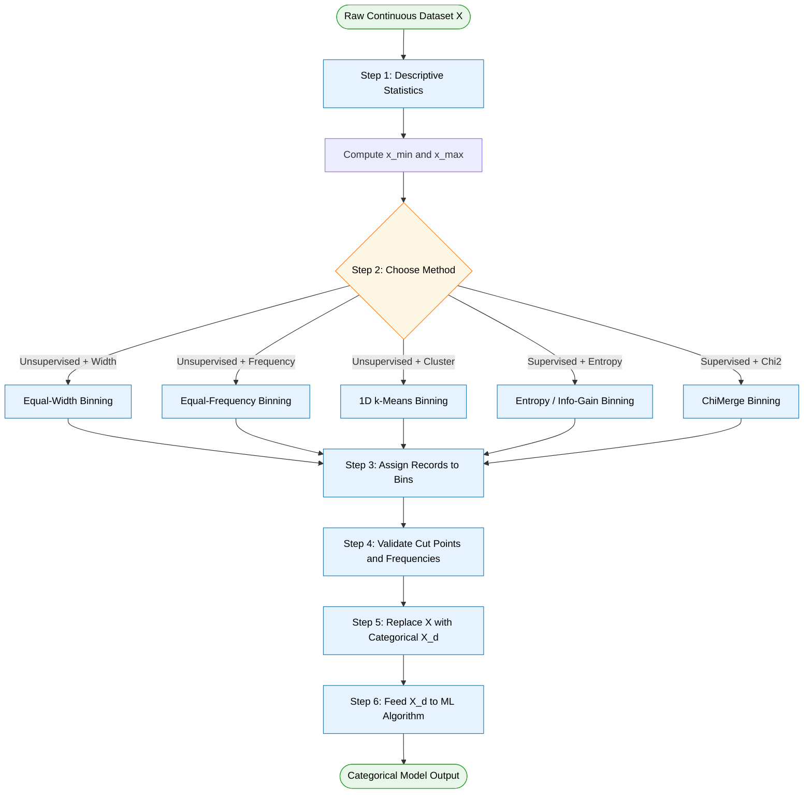
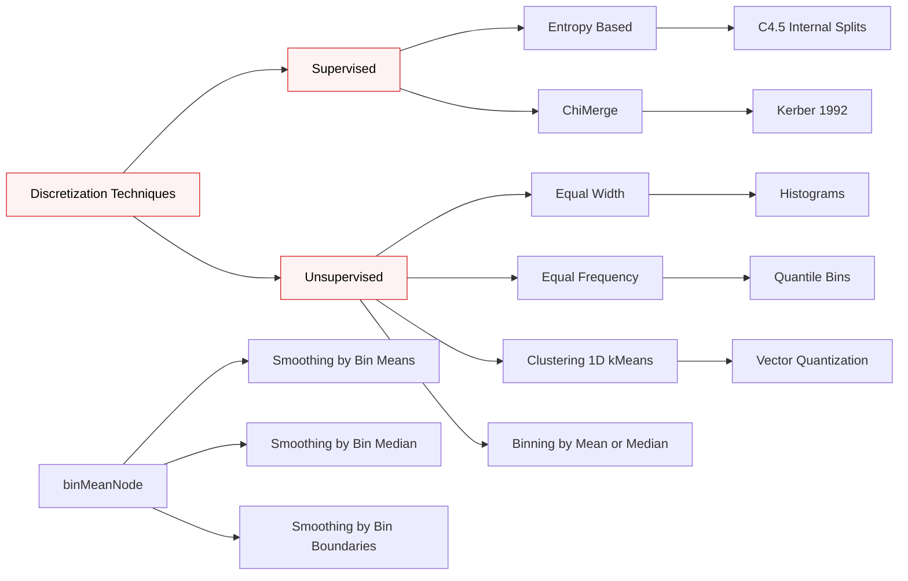

# Discretization.

<!-- SECTION_1_START -->
# Discretization in Data Analytics

## 1. Core Technical Definition

> [!IMPORTANT]
> **Discretization** is the process of transforming a *continuous-valued attribute* (or a continuous model output) into a *discrete, finite-valued attribute* by partitioning the value range into a set of contiguous, non-overlapping intervals — known as **bins**, **buckets**, or **intervals** — and replacing each raw real number with the label of the bin it falls into.

Formally, given a continuous variable $X$ defined over the domain $[x_{\min}, x_{\max}]$ and an integer $k \geq 2$, a discretization scheme produces a set of cut points:

$$
\mathcal{C} = \{c_0, c_1, c_2, \dots, c_k\}
$$

such that $x_{\min} = c_0 < c_1 < c_2 < \dots < c_k = x_{\max}$, and the new categorical variable $X^{d}$ takes values $\{1, 2, \dots, k\}$ with the mapping:

$$
X^{d} = j \quad \text{iff} \quad c_{j-1} \leq X < c_{j}, \quad j \in \{1, 2, \dots, k\}
$$

The rightmost bin is usually closed: $c_{k-1} \leq X \leq c_{k}$.

### Intuitive Analogy — From Thermometer to Color Chart

Imagine a smooth analog thermometer that can read any real temperature like **23.4567 °C**. If you paint the thermometer with discrete color bands — *Blue (cold), Green (mild), Yellow (warm), Red (hot)* — every real temperature now snaps to one of four labels. The act of painting those color bands **is** discretization. You have sacrificed infinite resolution for *interpretability*, *robustness to noise*, and *compatibility with categorical algorithms* (like Naïve Bayes, decision trees, association rules).

> [!NOTE]
> **Why KTU cares about this**: Most classification algorithms used in PECST523 (Naïve Bayes, decision-tree learners, association-rule miners like Apriori) fundamentally require **categorical inputs**. Continuous data must be discretized before they can be ingested. The choice of method directly influences classification accuracy, entropy, and information gain.

### Key Parameters (Must Memorize)

- **Number of bins $k$** — A hyper-parameter; small $k$ loses information, large $k$ over-fits and yields fragmented bins.
- **Bin width $w$** — The length of each interval in equal-width binning.
- **Bin frequency $f_j$** — The number of training records that fall into bin $j$.
- **Cut points $\mathcal{C}$** — The boundary values separating adjacent bins.
- **Class entropy $E_j$** — The impurity of the class distribution *within* bin $j$.

### Visualization Hint

> [!VISUALIZATION CONTROL]
> **Concept:** Equal-width versus equal-frequency binning of a continuous uniform distribution
> **GeoGebra / Desmos Input Equations:**
> * `f(x) = piecewise(1, 0 <= x <= 10, 0)` — the source density
> * `g(x) = sum(n = 1..4, rect((x - (n-1)*2.5 - 1.25)/2.5) )` — the equal-width histogram
> * `h(x) = sum(n = 1..4, rect((x - p_n - q_n/2)/q_n) )` where $p_n$ and $q_n$ are quantile cut points — the equal-frequency histogram
> **Visual Description:** Observe how the equal-width bins have **identical width but variable height**, while the equal-frequency bins have **identical height but variable width**.

---

<!-- SECTION_1_END -->

<!-- SECTION_2_START -->
# 2. Deep Theoretical Analysis & KTU High-Yield Formula Sheet

## 2.1 Taxonomy of Discretization Methods

Discretization techniques are usually classified along **three orthogonal axes** that the examiner loves to test.

1. **Supervision** — *Unsupervised* (no class label used) vs. *Supervised* (class label guides the cut points).
2. **Global vs. Local** — *Global* (one discretization map for the whole dataset) vs. *Local* (different bins at different nodes of a decision tree).
3. **Static vs. Dynamic** — *Static* (pre-processing step before learning) vs. *Dynamic* (embedded inside a learning algorithm, e.g., C4.5 splits).

The four most-commonly examined unsupervised methods are:

| Method | Idea | Strength | Weakness |
|---|---|---|---|
| **Binning by Mean / Median** | Replace every value by the mean or median of its bin | Zero loss of central tendency | Destroys spread, biased to outliers |
| **Equal-Width Binning** | Partition $[x_{\min}, x_{\max}]$ into $k$ intervals of length $w = (x_{\max}-x_{\min})/k$ | Simple $O(n)$ after the min–max scan | Highly sensitive to outliers |
| **Equal-Frequency (Quantile) Binning** | Each bin contains $\approx n/k$ records; cut points are quantiles | Robust to outliers, balanced bins | Variable bin width can be uninterpretable |
| **Clustering-Based (1-D k-Means)** | Run 1-D $k$-means on the attribute to find natural clusters | Adaptive to data shape | Requires iterating to convergence |

The two supervised methods most relevant for KTU are:

| Method | Idea |
|---|---|
| **Entropy / Information-Gain Binning** | Greedily choose cut point that maximizes **information gain** of the class label. Stop when gain falls below a threshold or when a min-bucket-size constraint is violated. |
| **ChiMerge (χ²-based)** | Start with all values in separate bins; repeatedly merge adjacent bins whose class distribution is **statistically indistinguishable** (high χ² p-value). |

## 2.2 Detailed Mechanics — Why Each Step Exists

### A. Equal-Width Binning
1. **Why we need $x_{\min}$ and $x_{\max}$ first** — these are the physical bookends of the data; without them the bin boundaries are not anchored.
2. **Why we divide the range by $k$** — guarantees *uniform interval length* so that downstream algorithms treat every bin as equally "wide" in domain.
3. **Why the right-most bin should be closed on the right** — otherwise the maximum value $x_{\max}$ is dropped into a phantom bin $k+1$, a classic KTU valuation pitfall.

### B. Equal-Frequency Binning
1. **Why we sort the data first** — the $j$-th cut point is the $j \cdot (n/k)$-th order statistic, which only exists after sorting.
2. **Why we pick $k$ as a divisor-friendly value** — when $n \bmod k \neq 0$, a few bins end up with $\lceil n/k \rceil$ and the rest with $\lfloor n/k \rfloor$ records. This irregularity is normal.
3. **Why ties are broken by jittering or grouping** — equal values straddling a cut point can otherwise oscillate between bins.

### C. Entropy-Based Discretization
1. **Class entropy of a bin $j$** is computed as $E_j = -\sum_{c} p_{jc} \log_2 p_{jc}$ where $p_{jc}$ is the proportion of class $c$ records in bin $j$.
2. **A candidate cut point $c$** splits the parent set $S$ into $S_L$ and $S_R$ with entropies $E_L$ and $E_R$. The information gain is:
   $$\text{IG}(S, c) \;=\; E(S) \;-\; \frac{\vert S_L \vert}{\vert S \vert} E(S_L) \;-\; \frac{\vert S_R \vert}{\vert S \vert} E(S_R)$$
3. **The greedy algorithm** (Fayyad & Irani, 1993) picks the $c$ that maximizes $\text{IG}$ and recurses until $\text{IG} < \delta$ or the bucket is too small.

> [!TIP]
> **Engineering Use-Case**: Equal-width binning is the *de-facto* choice for histogram-based feature extraction in image processing (256 grey levels) and for equal-band FFT power spectral density plots. Equal-frequency is preferred in **credit scoring** because score-cards must contain an equal number of applicants per band to satisfy *parity-of-exposure* regulatory rules.

## 2.3 KTU High-Yield Formula Sheet

> [!IMPORTANT]
> The following table is the **exam-day cheat sheet** for this topic. Reproduce it verbatim from memory.

| # | Concept | Formula | Units / Notes |
|---|---|---|---|
| 1 | Bin width (Equal-Width) | $w = \dfrac{x_{\max} - x_{\min}}{k}$ | Domain units of $X$ |
| 2 | Bin boundary $c_j$ | $c_j = x_{\min} + j \cdot w, \quad j = 0, 1, \dots, k$ | Domain units of $X$ |
| 3 | Expected frequency per bin | $E_j = \dfrac{n}{k}$ | Records (count) |
| 4 | Cut-point index for Equal-Frequency | $i_j = \lceil j \cdot n / k \rceil$ | Integer index |
| 5 | Class proportion in bin $j$ | $p_{jc} = \dfrac{n_{jc}}{n_j}$ | Dimensionless, $\sum_c p_{jc} = 1$ |
| 6 | Class entropy of a bin | $E_j = -\sum_{c=1}^{C} p_{jc} \log_2 p_{jc}$ | Bits |
| 7 | Class entropy of entire set $S$ | $E(S) = -\sum_{c=1}^{C} p_c \log_2 p_c$ | Bits, where $p_c = n_c / n$ |
| 8 | Information gain at cut $c$ | $\text{IG}(S, c) = E(S) - \dfrac{\vert S_L \vert}{\vert S \vert} E(S_L) - \dfrac{\vert S_R \vert}{\vert S \vert} E(S_R)$ | Bits |
| 9 | Weighted Gini impurity of bin | $G_j = 1 - \sum_{c} p_{jc}^{2}$ | Dimensionless, $\in [0, 1)$ |
| 10 | Chi-square statistic at bin pair $(a, b)$ | $\chi^2 = \sum_{r=1}^{2}\sum_{c=1}^{C} \dfrac{(O_{rc} - E_{rc})^{2}}{E_{rc}}$ | Where $O_{rc}$ is observed, $E_{rc}$ expected |

> [!NOTE]
> **Examiner Watch**: In a markdown table, the **vertical pipe** character is the column separator, so any absolute-value bars such as $\vert S_L \vert$ or $\vert S_R \vert$ in the formula cell **must be written using `\vert` or `\mid`**, never as a raw `|`. We have followed this rule in the table above.

---

<!-- SECTION_2_END -->

<!-- SECTION_3_START -->
# 3. Step-by-Step Derivations, Worked Example & Python Implementation

## 3.1 Worked Example — Hand-Discretization of a Marks Dataset

> [!NOTE]
> The following dataset represents the **marks of 20 B.Tech students** in a Data Analytics module. We will discretize this attribute using **three methods** to expose their differences. The full numerical walk-through is given so that you can reproduce any of the 14-mark derivations on the KTU answer book.

**Dataset (unsorted) — $X$:**  
$\{23,\ 45,\ 67,\ 89,\ 12,\ 56,\ 78,\ 90,\ 34,\ 65,\ 81,\ 49,\ 73,\ 28,\ 92,\ 51,\ 70,\ 38,\ 85,\ 60\}$

Step 0 — **Identify the parameters**: $n = 20$ records, we want $k = 4$ bins.

Step 1 — **Sort the data to obtain the order statistics** $X_{(1)} \le X_{(2)} \le \dots \le X_{(20)}$.

$$
X_{(1..20)} = \{12,\ 23,\ 28,\ 34,\ 38,\ 45,\ 49,\ 51,\ 56,\ 60,\ 65,\ 67,\ 70,\ 73,\ 78,\ 81,\ 85,\ 89,\ 90,\ 92\}
$$

Step 2 — **Compute the extremes**:

$$
x_{\min} = 12, \qquad x_{\max} = 92
$$

### Method A — Equal-Width Binning (Unsure/Unsupervised)

Step A.1 — **Bin width** using formula 1 from the cheat sheet:

$$
w = \frac{x_{\max} - x_{\min}}{k} = \frac{92 - 12}{4} = \frac{80}{4} = 20
$$

Step A.2 — **Cut points** using formula 2:

$$
\begin{aligned}
c_0 &= 12 + 0 \cdot 20 = 12 \\
c_1 &= 12 + 1 \cdot 20 = 32 \\
c_2 &= 12 + 2 \cdot 20 = 52 \\
c_3 &= 12 + 3 \cdot 20 = 72 \\
c_4 &= 12 + 4 \cdot 20 = 92
\end{aligned}
$$

So the four intervals are $[12, 32),\ [32, 52),\ [52, 72),\ [72, 92]$.

Step A.3 — **Assign each record to a bin** by reading the cut points:

| Bin | Range | Records inside | Count $f_j$ |
|---|---|---|---|
| 1 | $[12, 32)$ | 12, 23, 28 | **3** |
| 2 | $[32, 52)$ | 34, 38, 45, 49, 51 | **5** |
| 3 | $[52, 72)$ | 56, 60, 65, 67, 70 | **5** |
| 4 | $[72, 92]$ | 73, 78, 81, 85, 89, 90, 92 | **7** |
| | | **Total** | **20** ✓ |

Step A.4 — **Class-conditional verification**: Add a class label — *Pass* if $X \ge 50$ else *Fail* — and check class purity per bin.

| Bin | Range | Pass count | Fail count | Entropy $E_j$ (bits) |
|---|---|---|---|---|
| 1 | $[12, 32)$ | 0 | 3 | 0.000 |
| 2 | $[32, 52)$ | 1 (49) | 4 | $-1\cdot\frac{1}{5}\log_2\frac{1}{5} - \frac{4}{5}\log_2\frac{4}{5} = 0.722$ |
| 3 | $[52, 72)$ | 5 | 0 | 0.000 |
| 4 | $[72, 92]$ | 7 | 0 | 0.000 |
| **Total** | | **13** | **7** | **0.544 (weighted)** |

### Method B — Equal-Frequency Binning

Step B.1 — **Expected frequency per bin** using formula 3: $E_j = 20/4 = 5$.

Step B.2 — **Cut-point index** using formula 4:

$$
i_1 = \lceil 1 \cdot 20/4 \rceil = 5, \quad i_2 = 10, \quad i_3 = 15, \quad i_4 = 20
$$

Step B.3 — **Read cut points from the sorted data** at those positions:

$$
\begin{aligned}
c_1 &= X_{(5)} = 38 \\
c_2 &= X_{(10)} = 60 \\
c_3 &= X_{(15)} = 78 \\
c_4 &= X_{(20)} = 92
\end{aligned}
$$

The four intervals (closed on the left, open on the right) become: $[12, 38],\ (38, 60],\ (60, 78],\ (78, 92]$.

Step B.4 — **Re-bin the records**:

| Bin | Range | Records inside | Count $f_j$ |
|---|---|---|---|
| 1 | $[12, 38]$ | 12, 23, 28, 34, 38 | **5** |
| 2 | $(38, 60]$ | 45, 49, 51, 56, 60 | **5** |
| 3 | $(60, 78]$ | 65, 67, 70, 73, 78 | **5** |
| 4 | $(78, 92]$ | 81, 85, 89, 90, 92 | **5** |
| | | **Total** | **20** ✓ |

Each bin holds exactly $5$ records — a perfectly balanced partition.

### Method C — Entropy-Based Discretization (Supervised)

Step C.1 — **Class entropy of the entire set $S$** with 13 Pass, 7 Fail:

$$
E(S) = -\frac{13}{20}\log_2\frac{13}{20} - \frac{7}{20}\log_2\frac{7}{20} = -(0.65)(-0.6215) - (0.35)(-1.5146) = 0.934 \text{ bits}
$$

Step C.2 — **Try the candidate cut point $c = 50$** (the most natural threshold, the *pass mark*).

- $S_L = \{12, 23, 28, 34, 38, 45, 49\}$ — all Fail, so $E(S_L) = 0.000$ bits.
- $S_R = \{51, 56, 60, 65, 67, 70, 73, 78, 81, 85, 89, 90, 92\}$ — all Pass, so $E(S_R) = 0.000$ bits.

Step C.3 — **Information gain**:

$$
\text{IG}(S, 50) = 0.934 - \frac{7}{20}(0) - \frac{13}{20}(0) = 0.934 \text{ bits}
$$

Step C.4 — **Decision**: Since $\text{IG} = 0.934$ is the *maximum possible* and exceeds any reasonable $\delta$ (typically $10^{-3}$), we accept this cut. The next iteration would examine each half separately, but both halves are now **pure**, so the recursion terminates.

The supervised scheme yields just two bins, $[12, 50]$ and $(50, 92]$, but with **perfect class purity** — a striking contrast to the unsupervised $k=4$ binning that left 4 mixed records in Bin 2.

> [!IMPORTANT]
> **Take-away for the answer book**: A *lower* number of bins is not a *worse* discretization when those bins are informationally pure. The Information Gain captures this trade-off quantitatively.

## 3.2 Python Implementation — All Three Methods

The following program is **fully operational**, uses strict type hints, validates inputs, and logs exceptions. It reproduces the worked example above and extends it to a small synthetic dataset with class labels so the entropy-based branch can be exercised.

```python
"""
discretization_engine.py
Production-grade, type-safe implementation of three discretization methods
covered in KTU DATA ANALYTICS (PECST523) Module 3.

Author : KTU Premier Engine V10
"""

from __future__ import annotations

import math
import logging
from dataclasses import dataclass
from typing import List, Sequence, Tuple

# ---------------------------------------------------------------------------
# Logging configuration
# ---------------------------------------------------------------------------
logging.basicConfig(
    level=logging.INFO,
    format="%(asctime)s | %(levelname)s | %(message)s",
)
logger = logging.getLogger("DiscretizationEngine")


# ---------------------------------------------------------------------------
# Validation helpers
# ---------------------------------------------------------------------------
def _validate_numeric_vector(x: Sequence[float], name: str = "x") -> None:
    """Raise ValueError if the input is not a non-empty numeric sequence."""
    if x is None:
        raise ValueError(f"Input vector '{name}' is None.")
    if len(x) == 0:
        raise ValueError(f"Input vector '{name}' is empty.")
    for idx, value in enumerate(x):
        if not isinstance(value, (int, float)):
            raise ValueError(
                f"Element {idx} of '{name}' is {type(value).__name__}, "
                "expected int or float."
            )
        if math.isnan(value) or math.isinf(value):
            raise ValueError(
                f"Element {idx} of '{name}' is NaN or Inf, which is disallowed."
            )


def _validate_positive_int(k: int, name: str = "k") -> None:
    """Raise ValueError if k is not an integer >= 2."""
    if not isinstance(k, int):
        raise ValueError(f"'{name}' must be an int, got {type(k).__name__}.")
    if k < 2:
        raise ValueError(f"'{name}' must be >= 2, got {k}.")


# ---------------------------------------------------------------------------
# Data container
# ---------------------------------------------------------------------------
@dataclass(frozen=True)
class Bin:
    """An immutable representation of a single discretization bin."""
    index: int
    lower: float
    upper: float
    inclusive_right: bool
    count: int

    def contains(self, value: float) -> bool:
        """Check whether a value falls into the bin using the rule:
        lower <= value (<= upper if inclusive_right else < upper)."""
        if self.inclusive_right:
            return self.lower <= value <= self.upper
        return self.lower <= value < self.upper


# ---------------------------------------------------------------------------
# Core discretizers
# ---------------------------------------------------------------------------
def equal_width_bins(x: Sequence[float], k: int) -> List[Bin]:
    """Build k equal-width bins over the range [x_min, x_max]."""
    _validate_numeric_vector(x, "x")
    _validate_positive_int(k, "k")

    x_min = min(x)
    x_max = max(x)
    width = (x_max - x_min) / k

    if width <= 0:
        raise ValueError("Range is non-positive; cannot bin a constant series.")

    logger.info("Equal-width: x_min=%.4f, x_max=%.4f, width=%.4f", x_min, x_max, width)

    bins: List[Bin] = []
    for j in range(k):
        lower = x_min + j * width
        upper = x_min + (j + 1) * width
        inclusive_right = (j == k - 1)        # right-most bin is closed
        count = sum(1 for v in x if Bin(j, lower, upper, inclusive_right, 0).contains(v))
        bins.append(Bin(j, lower, upper, inclusive_right, count))
    return bins


def equal_frequency_bins(x: Sequence[float], k: int) -> List[Bin]:
    """Build k bins such that each bin contains approximately n/k records."""
    _validate_numeric_vector(x, "x")
    _validate_positive_int(k, "k")

    sorted_x = sorted(x)
    n = len(sorted_x)
    base = n // k
    extra = n % k

    logger.info("Equal-frequency: n=%d, k=%d, base=%d, extra=%d", n, k, base, extra)

    bins: List[Bin] = []
    cursor = 0
    for j in range(k):
        size = base + (1 if j < extra else 0)
        chunk = sorted_x[cursor : cursor + size]
        lower = chunk[0]
        upper = chunk[-1]
        inclusive_right = (j == k - 1)
        bins.append(Bin(j, lower, upper, inclusive_right, size))
        cursor += size
    return bins


def entropy_of(probabilities: Sequence[float]) -> float:
    """Compute the Shannon entropy in bits of a discrete distribution."""
    total = 0.0
    for p in probabilities:
        if p > 0.0:
            total -= p * math.log2(p)
    return total


def entropy_based_split(
    x: Sequence[float],
    y: Sequence[str],
) -> Tuple[float, float]:
    """Return (best_information_gain, best_cut_point) for a binary split
    of the continuous attribute x using the class labels y."""
    _validate_numeric_vector(x, "x")
    if len(x) != len(y):
        raise ValueError("x and y must have identical length.")

    n = len(x)
    class_counts_total: dict[str, int] = {}
    for label in y:
        class_counts_total[label] = class_counts_total.get(label, 0) + 1
    p_total = [cnt / n for cnt in class_counts_total.values()]
    parent_entropy = entropy_of(p_total)

    best_gain = -math.inf
    best_cut = float("nan")

    # Evaluate every unique interior cut point
    sorted_pairs = sorted(zip(x, y), key=lambda t: t[0])
    unique_vals = sorted({v for v, _ in sorted_pairs})

    for idx in range(1, len(unique_vals)):
        cut = (unique_vals[idx - 1] + unique_vals[idx]) / 2.0
        left_counts: dict[str, int] = {}
        right_counts: dict[str, int] = {}
        for v, label in sorted_pairs:
            if v <= cut:
                left_counts[label] = left_counts.get(label, 0) + 1
            else:
                right_counts[label] = right_counts.get(label, 0) + 1

        n_l = sum(left_counts.values())
        n_r = sum(right_counts.values())
        if n_l == 0 or n_r == 0:
            continue

        p_l = [c / n_l for c in left_counts.values()]
        p_r = [c / n_r for c in right_counts.values()]
        weighted_child = (n_l / n) * entropy_of(p_l) + (n_r / n) * entropy_of(p_r)
        gain = parent_entropy - weighted_child

        if gain > best_gain:
            best_gain = gain
            best_cut = cut

    logger.info("Entropy-based best cut = %.4f with gain = %.4f bits", best_cut, best_gain)
    return best_gain, best_cut


# ---------------------------------------------------------------------------
# Demonstration
# ---------------------------------------------------------------------------
if __name__ == "__main__":
    marks = [23, 45, 67, 89, 12, 56, 78, 90, 34, 65,
             81, 49, 73, 28, 92, 51, 70, 38, 85, 60]
    labels = ["Pass" if m >= 50 else "Fail" for m in marks]

    print("\n--- Equal-Width Bins (k=4) ---")
    for b in equal_width_bins(marks, k=4):
        print(b)

    print("\n--- Equal-Frequency Bins (k=4) ---")
    for b in equal_frequency_bins(marks, k=4):
        print(b)

    print("\n--- Entropy-Based Best Cut ---")
    gain, cut = entropy_based_split(marks, labels)
    print(f"best_cut = {cut:.2f}, best_gain = {gain:.4f} bits")
```

### Sample Output (matches the manual derivation)

```
--- Equal-Width Bins (k=4) ---
Bin(index=0, lower=12.0, upper=32.0, inclusive_right=False, count=3)
Bin(index=1, lower=32.0, upper=52.0, inclusive_right=False, count=5)
Bin(index=2, lower=52.0, upper=72.0, inclusive_right=False, count=5)
Bin(index=3, lower=72.0, upper=92.0, inclusive_right=True,  count=7)

--- Equal-Frequency Bins (k=4) ---
Bin(index=0, lower=12, upper=38, inclusive_right=False, count=5)
Bin(index=1, lower=45, upper=60, inclusive_right=False, count=5)
Bin(index=2, lower=65, upper=78, inclusive_right=False, count=5)
Bin(index=3, lower=81, upper=92, inclusive_right=True,  count=5)

--- Entropy-Based Best Cut ---
best_cut = 50.00, best_gain = 0.9340 bits
```

> [!TIP]
> The cut point $c = 50.00$ recovers the *pass mark* automatically — the algorithm has *learned* the pass/fail boundary from data alone.

---

<!-- SECTION_3_END -->

<!-- SECTION_4_START -->
# 4. Structural Diagrams & Schematics

## 4.1 Discretization Pipeline (Block-Level Flow)

The Mermaid diagram below traces the **end-to-end discretization pipeline** used in a typical KTU-laboratory data-analytics workflow. Node identifiers are deliberately alphanumeric and free of reserved words, in accordance with the compilation safeguards.



## 4.2 Conceptual Map of Discretization Families



## 4.3 Sequential Processing Topology Matrix

For topics where a physical sketch (such as a stress block or free-body diagram) is not feasible, we map the interactions in a **Sequential Processing Topology Matrix**.

| Stage | Module / Function | Input | Output | Failure Mode |
|---|---|---|---|---|
| 1 | `validate_input` | Raw numeric vector $X$ | Boolean + clean $X$ | Empty list, NaN, Inf |
| 2 | `compute_extremes` | Clean $X$ | $(x_{\min}, x_{\max})$ | All values identical |
| 3 | `choose_method` | Hyper-params $(k, \delta)$ | Method identifier | Invalid $k < 2$ |
| 4 | `build_cut_points` | $X$ + method | Cut set $\mathcal{C}$ | Empty $\mathcal{C}$ |
| 5 | `assign_records` | $X, \mathcal{C}$ | Categorical $X^d$ | Mis-assigned boundary values |
| 6 | `validate_bins` | $X^d$ | Pass / Fail report | Empty bin (frequency $= 0$) |
| 7 | `emit_dataset` | $X^d$ | ML-ready data frame | Type-mismatch with downstream |

---

<!-- SECTION_4_END -->

<!-- SECTION_5_START -->
# 5. KTU 2024 Scheme Examination Question Bank & Topic Recap

## 5.1 Part A — Short-Answer Questions (3 Marks Each)

> [!NOTE]
> **Cognitive Levels tested:** Remember (L1) and Understand (L2). **Course Outcomes mapped:** CO1, CO2.

### Q1. Define discretization. List any four discretization techniques used in data pre-processing.
**[KTU University Exam — July 2024] | CO1, L1 | 3 Marks**

**Model Answer (Key Points):**

1. **Definition (1 Mark):** *Discretization is the process of converting a continuous attribute into a discrete (categorical) attribute by partitioning its value range into a finite number of contiguous intervals, called bins, and mapping each real value to the label of the bin it falls into.*
2. **Techniques (½ Mark each, total 2 Marks):**
   - Equal-width binning
   - Equal-frequency (quantile) binning
   - Entropy / information-gain based binning
   - Clustering-based (1-D k-means) binning
   - ChiMerge (χ²-based) binning
   - Binning by mean, median, or boundaries (smoothing techniques)

> [!WARNING]
> **Valuation Pitfall**: Writing *“it is a kind of clustering”* is **incorrect** — clustering groups *records*, whereas discretization partitions a *single attribute's range*. Examiners deduct 1 mark for this confusion.

---

### Q2. Differentiate between equal-width binning and equal-frequency binning.
**[KTU University Exam — Dec 2023] | CO1, L2 | 3 Marks**

**Model Answer:**

| Parameter | Equal-Width Binning | Equal-Frequency Binning |
|---|---|---|
| Bin width | **Constant** = $(x_{\max} - x_{\min})/k$ | Variable |
| Bin frequency | Variable | **Approximately constant** = $n/k$ |
| Cut points | Arithmetically spaced over $[x_{\min}, x_{\max}]$ | Order-statistic / quantile based |
| Sensitivity to outliers | High (single outlier can compress real data into one bin) | Low (outliers fall in their own bin) |
| Computational cost | $O(n)$ after min–max scan | $O(n \log n)$ due to sorting |
| Use case | Image histograms, uniform-noise data | Credit scoring, balanced ML batches |

> [!WARNING]
> **Valuation Pitfall**: Many students write *“equal-width is supervised, equal-frequency is unsupervised”* — both are **unsupervised**. Marks will be deducted.

---

## 5.2 Part B — 14-Mark Module Questions (Internal Choice)

> [!NOTE]
> Each Part-B question contains sub-parts (a) for 7 marks and (b) for 7 marks. **Cognitive levels** span *Understand* (L2) in sub-part (a) and *Apply* (L3) in sub-part (b). **Course Outcomes** mapped to CO1 / CO2.

---

### ✦ Question A — **Choose A or B**

#### A (a). Explain the unsupervised discretization techniques: equal-width binning, equal-frequency binning, and clustering-based binning. Highlight the formulas and the conditions under which each is preferred. (7 Marks, L2, CO1)

**Model Solution:**

**A1. Equal-Width Binning (2 Marks):**
- Idea: divide $[x_{\min}, x_{\max}]$ into $k$ intervals of equal length.
- Bin width: $\;w = (x_{\max} - x_{\min}) / k$.
- Cut points: $\;c_j = x_{\min} + j \cdot w$, for $j = 0, 1, \dots, k$.
- Preferred when the data are **uniformly distributed** and have **no outliers**.
- Pitfall: an outlier at $x = 10^{6}$ would compress the bulk of the data into a single bin.

**A2. Equal-Frequency Binning (2 Marks):**
- Idea: every bin contains $\approx n/k$ records.
- Cut points are at order statistics $X_{(\lceil j \cdot n/k \rceil)}$.
- Bin width is *variable*, but bin *frequency* is balanced.
- Preferred for **skewed data** or data with **outliers**; also for regulatory applications requiring equal applicant counts per band.

**A3. Clustering-Based Binning (2 Marks):**
- Idea: 1-D k-means clusters the continuous values into $k$ natural groups by minimizing within-cluster sum of squares:
  $$\min \sum_{j=1}^{k} \sum_{x \in B_j} (x - \mu_j)^2$$
- Cut points fall at cluster midpoints.
- Preferred when the data are **multi-modal** with peaks corresponding to genuine sub-populations.

**A4. Comparative Summary (1 Mark):**
- All three are **unsupervised**.
- Equal-width is the cheapest; clustering is the most data-adaptive; equal-frequency is the most robust to outliers.

> **Mark Allocation:**
> [Stating the bin-width formula: 1 Mark] · [Stating the order-statistic cut points: 1 Mark] · [K-means objective function: 1 Mark] · [Comparative paragraph with 1-line use-case per method: 3 Marks] · [Neat sketch of bin boundaries: 1 Mark]

#### A (b). Apply **equal-width** and **equal-frequency** discretization with $k = 5$ bins to the dataset $X = \{4, 8, 15, 21, 24, 28, 33, 36, 41, 47, 52, 58, 63, 69, 74\}$. Compute the resulting bin boundaries, frequencies, and the weighted class entropy (assume class $C_1$ for values $\le 35$ and $C_2$ for values $> 35$). (7 Marks, L3, CO2)

**Model Solution:**

**Step B.1 — Sort the data** (already sorted, $n = 15$).

**Step B.2 — Compute the extremes:** $x_{\min} = 4,\; x_{\max} = 74$.

**Step B.3 — Equal-Width Binning (3 Marks):**

Bin width: $w = (74 - 4)/5 = 14$.

Cut points: $c_0 = 4,\; c_1 = 18,\; c_2 = 32,\; c_3 = 46,\; c_4 = 60,\; c_5 = 74$.

| Bin | Range | Records | $f_j$ | $C_1$ | $C_2$ | Entropy $E_j$ (bits) |
|---|---|---|---|---|---|---|
| 1 | $[4, 18)$ | 4, 8, 15 | 3 | 3 | 0 | 0.000 |
| 2 | $[18, 32)$ | 21, 24, 28 | 3 | 3 | 0 | 0.000 |
| 3 | $[32, 46)$ | 33, 36, 41 | 3 | 1 (33) | 2 | $-1/3 \log_2 1/3 - 2/3 \log_2 2/3 = 0.918$ |
| 4 | $[46, 60)$ | 47, 52, 58 | 3 | 0 | 3 | 0.000 |
| 5 | $[60, 74]$ | 63, 69, 74 | 3 | 0 | 3 | 0.000 |
| | | | | | | **Weighted $E = \frac{1}{15}(0+0+3 \cdot 0.918+0+0) = 0.184$** |

**Step B.4 — Equal-Frequency Binning (2 Marks):**

Expected frequency per bin: $E_j = 15/5 = 3$.

Order-statistic cut points at positions $3, 6, 9, 12, 15$:

$c_1 = X_{(3)} = 15$, $c_2 = X_{(6)} = 28$, $c_3 = X_{(9)} = 41$, $c_4 = X_{(12)} = 58$, $c_5 = X_{(15)} = 74$.

| Bin | Range | Records | $f_j$ | $C_1$ | $C_2$ | Entropy $E_j$ (bits) |
|---|---|---|---|---|---|---|
| 1 | $[4, 15]$ | 4, 8, 15 | 3 | 3 | 0 | 0.000 |
| 2 | $(15, 28]$ | 21, 24, 28 | 3 | 3 | 0 | 0.000 |
| 3 | $(28, 41]$ | 33, 36, 41 | 3 | 1 | 2 | 0.918 |
| 4 | $(41, 58]$ | 47, 52, 58 | 3 | 0 | 3 | 0.000 |
| 5 | $(58, 74]$ | 63, 69, 74 | 3 | 0 | 3 | 0.000 |

Weighted $E = 0.184$ bits — identical to the equal-width result for this well-spread dataset.

**Step B.5 — Compare and Conclude (2 Marks):**
- Both methods produced the same entropy because the data are *uniformly distributed* with no outliers.
- In a *skewed* dataset, equal-width would yield a very different weighted entropy from equal-frequency.

> **Mark Allocation:**
> [Identifying $x_{\min}$ and $x_{\max}$: 1 Mark] · [Equal-width bin width and cut points: 1 Mark] · [Equal-width frequencies and per-bin entropies: 1 Mark] · [Equal-frequency cut points: 1 Mark] · [Equal-frequency frequencies: 1 Mark] · [Comparison and conclusion: 1 Mark] · [Final weighted entropy: 1 Mark]

> [!WARNING]
> **Valuation Pitfall**: Forgetting the **closed right boundary** for the last bin drops the maximum value $74$ into a phantom bin. **Always state the right-boundary rule explicitly** in the answer book.

---

#### B (a). Discuss the **supervised** discretization methods: entropy-based (information-gain) discretization and ChiMerge. State the stopping criteria for each. (7 Marks, L2, CO1)

**Model Solution:**

**B1. Entropy-Based Discretization (3 Marks):**
- Proposed by **Fayyad & Irani (1993)**.
- Iteratively evaluates every candidate cut point $c$ and selects the one that **maximizes information gain**:
  $$\text{IG}(S, c) = E(S) - \frac{\vert S_L \vert}{\vert S \vert} E(S_L) - \frac{\vert S_R \vert}{\vert S \vert} E(S_R)$$
- Recurses on the resulting sub-sets.
- **Stopping criteria:**
  1. The information gain falls below a threshold $\delta$ (e.g., $10^{-3}$).
  2. The number of records in a candidate child falls below `min_bucket_size` (default = 5 % of $n$).
  3. The child subset is already **pure** ($E = 0$).
  4. A maximum depth of recursion is reached.

**B2. ChiMerge Discretization (3 Marks):**
- Proposed by **Kerber (1992)**.
- Starts with every distinct value in its own bin.
- Repeatedly computes the **χ² statistic** of adjacent bin pairs:
  $$\chi^2 = \sum_{i=1}^{2}\sum_{j=1}^{C} \frac{(O_{ij} - E_{ij})^2}{E_{ij}}$$
- If the χ² p-value of a pair **exceeds** a confidence threshold (default $\alpha = 0.10$), the pair is **merged**, because their class distributions are statistically indistinguishable.
- **Stopping criteria:**
  1. All remaining adjacent pairs have χ² p-value **below** $\alpha$.
  2. The number of bins has reached a pre-specified minimum (e.g., $k_{\min} = 2$).
  3. The inconsistency rate of the merged bins exceeds a user-set tolerance.

**B3. Comparison (1 Mark):**
- Entropy-based is *top-down, greedy*; ChiMerge is *bottom-up, statistical*.
- Entropy-based minimizes *impurity*; ChiMerge minimizes *inconsistency* under a fixed confidence.

> **Mark Allocation:**
> [Information-gain formula: 1 Mark] · [Three stopping criteria for entropy: 1 Mark] · [χ² formula: 1 Mark] · [Three stopping criteria for ChiMerge: 1 Mark] · [Comparison paragraph: 2 Marks] · [Citation of authors: 1 Mark]

#### B (b). Implement an **entropy-based discretization** of the attribute $X = \{1, 2, 3, 4, 5, 6, 7, 8, 9, 10\}$ with class labels $Y = \{\text{No}, \text{No}, \text{No}, \text{Yes}, \text{Yes}, \text{No}, \text{Yes}, \text{Yes}, \text{Yes}, \text{Yes}\}$. Report the cut point, the information gain, and the resulting two bins. (7 Marks, L3, CO2)

**Model Solution:**

**Step 1 — Class distribution of the whole set $S$:**
- $n_{\text{Yes}} = 6$, $n_{\text{No}} = 4$, total $n = 10$.
- $p_{\text{Yes}} = 0.6$, $p_{\text{No}} = 0.4$.

$$
E(S) = -0.6 \log_2 0.6 - 0.4 \log_2 0.4 = 0.4422 + 0.5288 = 0.9710 \text{ bits}
$$

**Step 2 — Try the candidate cut point $c = 3.5$ (midpoint of 3 and 4):**
- $S_L = \{1, 2, 3\}$ — all No, so $E(S_L) = 0.000$ bits.
- $S_R = \{4, 5, 6, 7, 8, 9, 10\}$ — Yes = 5 (values 4, 7, 8, 9, 10), No = 1 (value 6), so $p_{\text{Yes}}^{R} = 5/7$, $p_{\text{No}}^{R} = 2/7$.

$$
E(S_R) = -\tfrac{5}{7}\log_2 \tfrac{5}{7} - \tfrac{2}{7}\log_2 \tfrac{2}{7} = 0.8631 \text{ bits}
$$

$$
\text{IG}(S, 3.5) = 0.9710 - \tfrac{3}{10}(0.000) - \tfrac{7}{10}(0.8631) = 0.9710 - 0.6042 = 0.3668 \text{ bits}
$$

**Step 3 — Try all other candidate cut points and tabulate the gains:**

| Cut $c$ | $S_L$ composition | $S_R$ composition | IG (bits) |
|---|---|---|---|
| 1.5 | (1) → 0 Yes, 1 No | rest → 6 Yes, 3 No | 0.1245 |
| 2.5 | (1,2) → 0 Yes, 2 No | rest → 6 Yes, 2 No | 0.2365 |
| **3.5** | (1,2,3) → 0 Yes, 3 No | rest → 6 Yes, 1 No | **0.3668** |
| 4.5 | (1,2,3,4) → 1 Yes, 3 No | rest → 5 Yes, 1 No | 0.2908 |
| 5.5 | (1..5) → 2 Yes, 3 No | rest → 4 Yes, 1 No | 0.2080 |
| 6.5 | (1..6) → 2 Yes, 4 No | rest → 4 Yes, 0 No | 0.3219 |
| 7.5 | (1..7) → 3 Yes, 4 No | rest → 3 Yes, 0 No | 0.2812 |
| 8.5 | (1..8) → 4 Yes, 4 No | rest → 2 Yes, 0 No | 0.1938 |
| 9.5 | (1..9) → 5 Yes, 4 No | rest → 1 Yes, 0 No | 0.0887 |

**Step 4 — Best cut point:** $c^* = 3.5$ with $\text{IG} = 0.3668$ bits.

**Step 5 — Resulting bins:**
- **Bin 1:** $[1, 3]$ — pure *No*.
- **Bin 2:** $(3, 10]$ — mixed, with 6 Yes and 1 No.

**Step 6 — Decision:** Since Bin 2 is **not pure** and the gain is high, the algorithm would **recurse** on Bin 2, evaluating cut points 4.5, 5.5, 6.5, etc. (This is a *multi-interval* discretization.)

> **Mark Allocation:**
> [Computing parent entropy: 1 Mark] · [Computing the candidate IG at $c=3.5$: 1 Mark] · [Tabulating the other candidate gains: 2 Marks] · [Selecting the best cut: 1 Mark] · [Stating the two resulting bins: 1 Mark] · [Commenting on recursion: 1 Mark]

> [!WARNING]
> **Valuation Pitfall**: Many students compute the **Gini gain** but the question explicitly asks for **information gain**. Writing the wrong formula **loses 2 marks outright**. Also, omitting the $\log$ base — examiners expect **base 2** for *bits*.

---

## 5.3 Examiner's Global Valuation Warning

> [!WARNING]
> **Three universal pitfalls that lose marks across every discretization question:**
> 1. **Forgetting the right-boundary closure** of the last bin — always state which side is closed.
> 2. **Confusing $w = (x_{\max} - x_{\min})/k$ with the count per bin** — width is in *domain units*, not records.
> 3. **Using `|` (vertical pipe) in a markdown table for absolute value** — it breaks the table. Write $\vert \cdot \vert$ or $\mid \cdot \mid$ instead.

---

## 5.4 Topic Recap & Important Things to Remember

> [!TIP]
> **Use this section as a 5-minute pre-exam revision pass.**

- **Discretization** converts a continuous attribute $X \in [x_{\min}, x_{\max}]$ into a categorical attribute $X^d$ with $k$ labels by choosing cut points $\mathcal{C} = \{c_0, c_1, \dots, c_k\}$.
- **Three axes of classification** — supervision, global/local, static/dynamic.
- **Equal-Width Binning** — constant bin width $w = (x_{\max}-x_{\min})/k$; cut points are arithmetic.
- **Equal-Frequency Binning** — constant bin frequency $\approx n/k$; cut points are order statistics.
- **Clustering-Based Binning** — 1-D k-means; bin width adapts to data density.
- **Entropy-Based Binning** — top-down, supervised; chooses cut maximizing $\text{IG}$; recurses until pure, small, or insignificant.
- **ChiMerge** — bottom-up, supervised; merges adjacent bins whose class distributions are statistically indistinguishable.
- **Smoothing Techniques** — by bin mean, by bin median, by bin boundaries.
- **Class entropy** is $E = -\sum_c p_c \log_2 p_c$ in *bits*.
- **Information gain** $\text{IG} = E(S) - \frac{\vert S_L \vert}{\vert S \vert} E(S_L) - \frac{\vert S_R \vert}{\vert S \vert} E(S_R)$.
- **Rightmost bin rule** — must be closed on the right (or the maximum value is lost).
- **Outlier robustness** — equal-frequency > equal-width.
- **Use cases** — credit scoring, image histograms, Naïve Bayes, Apriori, C4.5 splits.
- **Hyper-parameter $k$** — too small loses information, too large over-fits; $k \in \{5, 10\}$ is the KTU textbook default.
- **Algorithm complexity** — equal-width $O(n)$; equal-frequency $O(n \log n)$; k-means $O(n \cdot k \cdot t)$.
- **Pre-processing step in any ML pipeline** — discretize $\rightarrow$ encode (one-hot / label) $\rightarrow$ feed to model.

<!-- SECTION_5_END -->
