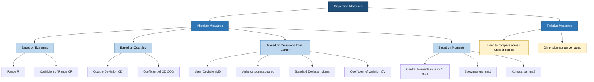
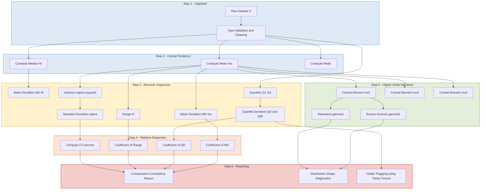
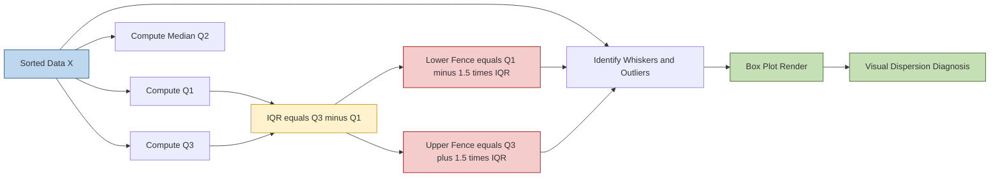
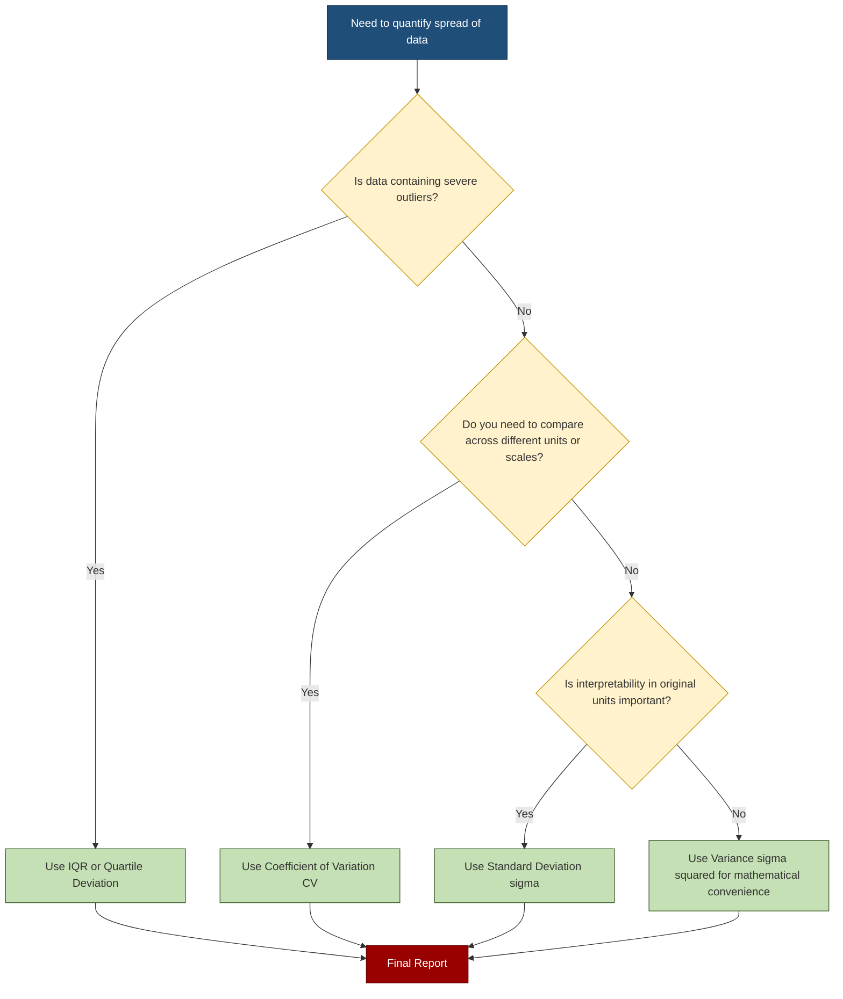

# Dispersion

<!-- SECTION_1_START -->
# Dispersion in Statistical Description of Data

## 1. Core Technical Definition (KTU 2024 Syllabus Terminology)

> [!IMPORTANT]
> **Dispersion** is the extent to which numerical values in a dataset tend to spread or scatter around an average value (central tendency measure). It quantifies the *variability*, *scatter*, or *spread* of observations within a distribution.

Formally, for a random variable $X$ with mean $\mu$, **dispersion** is any non-negative scalar function $D(X)$ that satisfies the property:

$$
D(X) \ge 0 \quad \text{and} \quad D(c) = 0 \text{ for any constant } c
$$

A dataset $\{x_1, x_2, \ldots, x_n\}$ is said to be **highly dispersed** when values lie far from the average, and **less dispersed** when values cluster tightly around the average. The **two most critical measures** in the KTU syllabus are:
- **Absolute Dispersion** (same unit as data) — Range, Quartile Deviation, Mean Deviation, Standard Deviation, Variance.
- **Relative Dispersion** (dimensionless/unitless ratio) — Coefficient of Range, Coefficient of Quartile Deviation, Coefficient of Mean Deviation, **Coefficient of Variation (CV)**.

---

## 2. Conceptual Analogy & Intuition

> [!NOTE]
> **Real-World Analogy: The "Class Test Score" Scenario**
> 
> Imagine two classes of 50 students each take the same Mathematics test (max marks = 100).
> - **Class A**: Mean = 70, Range = 5 (scores: 68, 70, 72, 69, 71, ...)
> - **Class B**: Mean = 70, Range = 60 (scores: 40, 95, 55, 88, 70, ...)
> 
> Both classes have the **same central tendency** (mean = 70), but **Class B is far more dispersed** than Class A. A teacher who only looks at the mean cannot distinguish between these two classes — they need a **dispersion measure** to capture this spread.

### Geometric Intuition (Number Line Visualization)

> [!VISUALIZATION CONTROL]
> **Concept:** Two distributions with identical mean but different spread
> **GeoGebra / Desmos Input Equations (as scatter points on x-axis):**
> * `L1 = {(0.9,0), (1.0,0), (1.1,0)}` — Tight cluster near mean = 1.0
> * `L2 = {(-1.5,0), (0.5,0), (1.0,0), (2.0,0), (3.5,0)}` — Wide spread around mean = 1.0
> **Visual Description:** On the number line, plot two datasets as dots stacked at $y=0$. Notice that **L1 has small spread (low dispersion)** while **L2 stretches far to both sides (high dispersion)**. The mean remains the same, but the *scatter* tells the real story.

### Why Dispersion Matters in Data Analytics

- **Risk Quantification**: In finance, a stock with mean return 12% and SD = 25% is *riskier* than one with mean = 12% and SD = 4%.
- **Quality Control**: Manufacturing tolerance bands depend directly on standard deviation.
- **Outlier Detection**: Dispersion measures like the IQR gate the **Tukey Fence** rule.
- **Algorithm Robustness**: Machine learning models (e.g., k-NN, k-Means, PCA) are highly sensitive to feature scaling, which is governed by dispersion.

> [!NOTE]
> **Central tendency tells you "where" the data is, dispersion tells you "how scattered" it is. A complete statistical description requires BOTH.**

---

## 3. Classification of Dispersion Measures

| **Category** | **Absolute Measures** (units of $X$) | **Relative Measures** (dimensionless) |
|---|---|---|
| Based on Extremes | Range, Interquartile Range | Coefficient of Range |
| Based on Quartiles | Quartile Deviation (Semi-IQR) | Coefficient of Quartile Deviation |
| Based on Deviations from Mean/Median | Mean Deviation, Variance, Standard Deviation | Coefficient of Mean Deviation, **Coefficient of Variation** |
| Based on Moments | Moments ($\mu_2, \mu_3, \mu_4$), Skewness ($\gamma_1$), Kurtosis ($\gamma_2$) | Standardized moments |

The **standard deviation ($\sigma$)** and its squared form **variance ($\sigma^2$)** are the *most widely used* absolute measures in modern data analytics because they are mathematically tractable, differentiable, and have strong connection to the Normal Distribution. The **Coefficient of Variation (CV)** is the *gold standard* relative measure for comparing variability across datasets with different units or vastly different means.

<!-- SECTION_1_END -->

<!-- SECTION_2_START -->
# Deep Theoretical Analysis & KTU High-Yield Formula Sheet

## 1. Range ($R$)

The simplest dispersion measure, defined as the difference between the largest and smallest observation.

$$
R = x_{\max} - x_{\min}
$$

**Coefficient of Range:**

$$
C_R = \frac{x_{\max} - x_{\min}}{x_{\max} + x_{\min}}
$$

**Why it matters**: Fast to compute; useful in Quality Assurance pass/fail checks (e.g., "tolerance range"). **Limitation**: Highly sensitive to outliers because it uses only 2 data points.

---

## 2. Interquartile Range (IQR) & Quartile Deviation (QD)

Quartiles split the sorted data into 4 equal parts:
- $Q_1$ = 25th percentile (lower quartile)
- $Q_2$ = 50th percentile (median)
- $Q_3$ = 75th percentile (upper quartile)

$$
\text{IQR} = Q_3 - Q_1
$$

$$
\text{Quartile Deviation (Semi-IQR)} = \frac{Q_3 - Q_1}{2}
$$

**Coefficient of Quartile Deviation:**

$$
C_{QD} = \frac{Q_3 - Q_1}{Q_3 + Q_1}
$$

**Why it matters**: $Q_1$ and $Q_3$ are **resistant to outliers** (only the middle 50% of the data influences them). This is the foundation of the **Tukey Box Plot**.

---

## 3. Mean Absolute Deviation (MAD / MD)

The arithmetic mean of absolute deviations of observations from a central value (mean $\bar{x}$ or median $M$).

**About Mean:**

$$
\text{MD}_{\bar{x}} = \frac{1}{n}\sum_{i=1}^{n} \vert x_i - \bar{x} \vert
$$

**About Median:**

$$
\text{MD}_M = \frac{1}{n}\sum_{i=1}^{n} \vert x_i - M \vert
$$

**Coefficient of Mean Deviation:**

$$
C_{MD} = \frac{\text{MD}}{\bar{x}} \quad \text{(for mean)} \quad \text{or} \quad C_{MD} = \frac{\text{MD}}{M} \quad \text{(for median)}
$$

**Why it matters**: Uses **all** observations, hence more representative than Range. **Limitation**: The absolute value operator makes calculus-based analysis difficult (not differentiable at $x = \bar{x}$).

---

## 4. Variance ($\sigma^2$ / $s^2$) and Standard Deviation ($\sigma$ / $s$)

### 4.1 Population Variance

$$
\sigma^2 = \frac{1}{N}\sum_{i=1}^{N}(x_i - \mu)^2
$$

### 4.2 Sample Variance (Unbiased Estimator)

$$
s^2 = \frac{1}{n-1}\sum_{i=1}^{n}(x_i - \bar{x})^2
$$

> [!NOTE]
> **Why $n-1$ and not $n$?** Bessel's correction. We lose **one degree of freedom** when we replace the unknown population mean $\mu$ with its sample estimate $\bar{x}$. Dividing by $n-1$ makes $E[s^2] = \sigma^2$ (an unbiased estimator). For very large $n$ ($n \ge 30$), the difference between $n$ and $n-1$ becomes negligible.

### 4.3 Standard Deviation

$$
\sigma = \sqrt{\sigma^2}, \quad s = \sqrt{s^2}
$$

### 4.4 Alternative (Computational) Form

$$
s^2 = \frac{1}{n-1}\left[\sum_{i=1}^{n} x_i^2 - \frac{\left(\sum_{i=1}^{n} x_i\right)^2}{n}\right]
$$

This is preferred in calculators and computer code to avoid catastrophic cancellation when $x_i$ values are large and close together.

### 4.5 Properties of Variance (Board-Exam Favorites)

| **Property** | **Formula** |
|---|---|
| Shift (add constant $c$) | $\text{Var}(X + c) = \text{Var}(X)$ |
| Scale (multiply by $c$) | $\text{Var}(cX) = c^2 \cdot \text{Var}(X)$ |
| Linear combination | $\text{Var}(aX + bY) = a^2\text{Var}(X) + b^2\text{Var}(Y) + 2ab\,\text{Cov}(X,Y)$ |
| Independent sum | $\text{Var}(X + Y) = \text{Var}(X) + \text{Var}(Y)$ if $X \perp Y$ |

---

## 5. Coefficient of Variation (CV)

The **relative** standard deviation, expressed as a percentage. It is the **most important relative measure** in the KTU syllabus.

$$
\text{CV} = \frac{\sigma}{\bar{x}} \times 100\% \quad \text{(population)}
$$

$$
\text{CV} = \frac{s}{\bar{x}} \times 100\% \quad \text{(sample)}
$$

**Why it matters**:
- **Unit-free**: allows direct comparison between datasets with different units (e.g., temperature in °C vs. pressure in kPa).
- **Stability comparison**: Used to compare variability of *different populations* (e.g., wages vs. income).
- **Application domains**: Portfolio risk analysis, laboratory method validation (HPLC, ELISA), agricultural yield studies.

> [!IMPORTANT]
> **Rule of thumb**: A dataset is considered *consistent* (low relative variability) if $\text{CV} < 30\%$. In *biological assays*, $\text{CV} \le 10\%$ is required for reproducibility.

---

## 6. Moments, Skewness, and Kurtosis

### 6.1 Raw Moments

$$
m_r = \frac{1}{n}\sum_{i=1}^{n} x_i^r
$$

### 6.2 Central Moments (about the mean)

$$
\mu_r = \frac{1}{n}\sum_{i=1}^{n}(x_i - \bar{x})^r
$$

Note: $\mu_1 = 0$, $\mu_2 = \sigma^2$.

### 6.3 Skewness ($\gamma_1$)

Measures the **asymmetry** of the distribution.

**Pearson's First Coefficient:**

$$
\text{Sk}_P = \frac{\bar{x} - \text{Mode}}{s}
$$

**Pearson's Second Coefficient (more common in exams):**

$$
\text{Sk}_P = \frac{3(\bar{x} - M)}{s}
$$

**Moment-based Coefficient:**

$$
\gamma_1 = \frac{\mu_3}{\mu_2^{3/2}} = \frac{\mu_3}{\sigma^3}
$$

| **Skewness Value** | **Interpretation** |
|---|---|
| $\gamma_1 = 0$ | Symmetric (e.g., Normal) |
| $\gamma_1 > 0$ | **Positive / Right-skewed** (long right tail) |
| $\gamma_1 < 0$ | **Negative / Left-skewed** (long left tail) |

### 6.4 Kurtosis ($\gamma_2$)

Measures the **tailedness** or **peakedness** of a distribution.

$$
\beta_2 = \frac{\mu_4}{\mu_2^2}
$$

$$
\text{Excess Kurtosis } \gamma_2 = \beta_2 - 3
$$

| **Kurtosis Type** | **$\gamma_2$** | **Example Distribution** |
|---|---|---|
| **Leptokurtic** (heavy tails) | $\gamma_2 > 0$ | Laplace, Student's-$t$ (low df) |
| **Mesokurtic** (normal-like) | $\gamma_2 = 0$ | Standard Normal |
| **Platykurtic** (light tails) | $\gamma_2 < 0$ | Uniform distribution |

> [!NOTE]
> **Engineering Utility of Skewness/Kurtosis**:
> - **Finance**: Negative skewness in stock returns signals crash risk; excess kurtosis > 0 indicates fat tails (Black Swan events).
> - **Hydrology**: Rainfall data is typically positively skewed.
> - **ML**: Many algorithms assume $\gamma_1 = 0$ and $\gamma_2 = 0$ (Gaussian assumption). Detecting departures guides feature transformations (e.g., Box-Cox, log transform).

---

## 7. KTU High-Yield Formula Sheet (Single-Table Cheat Sheet)

| **Measure** | **Formula** | **Unit** | **Outlier Robust?** |
|---|---|---|---|
| Range ($R$) | $R = x_{\max} - x_{\min}$ | Same as $X$ | No (very sensitive) |
| Interquartile Range (IQR) | $\text{IQR} = Q_3 - Q_1$ | Same as $X$ | Yes (resistant) |
| Quartile Deviation (QD) | $\text{QD} = \frac{Q_3 - Q_1}{2}$ | Same as $X$ | Yes |
| Mean Deviation (about mean) | $\text{MD}_{\bar{x}} = \frac{1}{n}\sum \vert x_i - \bar{x} \vert$ | Same as $X$ | Partially |
| Mean Deviation (about median) | $\text{MD}_M = \frac{1}{n}\sum \vert x_i - M \vert$ | Same as $X$ | More robust than MD$_{\bar{x}}$ |
| Population Variance | $\sigma^2 = \frac{1}{N}\sum (x_i - \mu)^2$ | Square of $X$ | No |
| Sample Variance | $s^2 = \frac{1}{n-1}\sum (x_i - \bar{x})^2$ | Square of $X$ | No |
| Standard Deviation | $\sigma = \sqrt{\sigma^2}$ | Same as $X$ | No |
| Coefficient of Variation | $\text{CV} = \frac{\sigma}{\bar{x}} \times 100\%$ | Unitless (%) | Depends on $s$ |
| Skewness (Moment) | $\gamma_1 = \frac{\mu_3}{\sigma^3}$ | Unitless | No |
| Excess Kurtosis | $\gamma_2 = \frac{\mu_4}{\sigma^4} - 3$ | Unitless | No |

---

## 8. Real-World Engineering & Data Science Applications

- **Six Sigma Manufacturing**: $\text{CV}$ defines process capability. A Six-Sigma process has $\text{CV} \approx 0.000034$ (3.4 defects per million).
- **Credit Risk Modelling**: PD, LGD, EAD models use variance and CV of default rates.
- **A/B Testing**: Standard deviation of conversion rates governs the required sample size: $n \propto \sigma^2$.
- **Anomaly Detection in IoT**: IQR-based Tukey fences ($\lbrack Q_1 - 1.5\cdot\text{IQR},\; Q_3 + 1.5\cdot\text{IQR}\rbrack$) flag sensor faults.
- **Reinforcement Learning**: Reward variance governs policy gradient variance — high CV → high gradient noise.

<!-- SECTION_2_END -->

<!-- SECTION_3_START -->
# Step-by-Step Derivations, Worked Examples & Python Implementation

## Worked Example 1: Full Computation of All Dispersion Measures

**Problem** (sample data): The marks (out of 100) of 10 students in a class are:
$$\{42, 55, 67, 72, 60, 85, 90, 38, 76, 65\}$$

**Task**: Compute Range, IQR, Mean Deviation (about mean), Variance, Standard Deviation, and CV.

### Step 1 — Sort the Data

$$
x_{\text{sorted}} = \{38,\; 42,\; 55,\; 60,\; 65,\; 67,\; 72,\; 76,\; 85,\; 90\}
$$

### Step 2 — Compute the Mean

$$
\bar{x} = \frac{38+42+55+60+65+67+72+76+85+90}{10} = \frac{650}{10} = 65
$$

### Step 3 — Range

$$
R = x_{\max} - x_{\min} = 90 - 38 = 52
$$

### Step 4 — Quartiles (using the inclusive method, $n = 10$)

Position of $Q_1$: $\frac{n+1}{4} = \frac{11}{4} = 2.75$ ⇒ between 2nd & 3rd element
$$
Q_1 = x_2 + 0.75\,(x_3 - x_2) = 42 + 0.75\,(55 - 42) = 42 + 9.75 = 51.75
$$

Position of $Q_3$: $\frac{3(n+1)}{4} = 8.25$ ⇒ between 8th & 9th element
$$
Q_3 = x_8 + 0.25\,(x_9 - x_8) = 76 + 0.25\,(85 - 76) = 76 + 2.25 = 78.25
$$

Therefore:
$$
\text{IQR} = 78.25 - 51.75 = 26.5
$$

### Step 5 — Mean Absolute Deviation about the Mean ($\bar{x} = 65$)

$$
\begin{aligned}
MD_{\bar{x}} &= \frac{1}{10}\sum_{i=1}^{10}\vert x_i - 65 \vert \\
&= \frac{1}{10}\bigl[27+23+10+5+0+2+7+11+20+25\bigr] \\
&= \frac{130}{10} = 13
\end{aligned}
$$

### Step 6 — Sample Variance ($s^2$) and Standard Deviation ($s$)

$$
\begin{aligned}
s^2 &= \frac{1}{n-1}\sum_{i=1}^{n}(x_i - \bar{x})^2 \\
&= \frac{1}{9}\bigl[(-27)^2 + (-23)^2 + (-10)^2 + (-5)^2 + 0^2 + 2^2 + 7^2 + 11^2 + 20^2 + 25^2\bigr] \\
&= \frac{1}{9}\bigl[729 + 529 + 100 + 25 + 0 + 4 + 49 + 121 + 400 + 625\bigr] \\
&= \frac{2582}{9} \approx 286.89
\end{aligned}
$$

$$
s = \sqrt{286.89} \approx 16.94
$$

### Step 7 — Coefficient of Variation

$$
\text{CV} = \frac{s}{\bar{x}} \times 100\% = \frac{16.94}{65} \times 100\% \approx 26.06\%
$$

> [!NOTE]
> **Interpretation**: With $\text{CV} \approx 26\%$, the class shows **moderate-to-high variability** in marks — the teacher should consider differentiated instruction or remedial classes.

### Final Consolidated Result

| **Measure** | **Value** |
|---|---|
| Range | $52$ |
| IQR | $26.5$ |
| MD about Mean | $13$ |
| Sample Variance $s^2$ | $286.89$ |
| Sample Std. Dev. $s$ | $\approx 16.94$ |
| CV | $\approx 26.06\%$ |

---

## Worked Example 2: Comparative CV Problem (KTU-Style)

**Problem**: Two machines produce ball bearings.
- Machine A: mean diameter = 50 mm, standard deviation = 0.5 mm
- Machine B: mean diameter = 75 mm, standard deviation = 0.8 mm

**Which machine is more consistent?**

$$
\text{CV}_A = \frac{0.5}{50} \times 100\% = 1.0\%
$$

$$
\text{CV}_B = \frac{0.8}{75} \times 100\% \approx 1.067\%
$$

**Conclusion**: $\text{CV}_A < \text{CV}_B$ → **Machine A is more consistent** (lower relative variability), even though Machine B has a smaller absolute deviation than $A$ would in some other unit. This is a classic trap that the KTU examiner uses to test whether students remember to normalize by the mean.

> [!WARNING]
> **Common Mistake**: Students often say "Machine B is more consistent because $0.8 > 0.5$... wait, actually the SD values are 0.5 and 0.8, so they think A is better." The correct reasoning **must** use CV. The absolute SD is meaningless without the mean.

---

## Worked Example 3: Skewness & Kurtosis Computation

**Problem**: For the data $\{4, 7, 9, 11, 13, 16, 20\}$, compute the moment-based skewness and excess kurtosis.

### Step 1 — Mean

$$
\bar{x} = \frac{4+7+9+11+13+16+20}{7} = \frac{80}{7} \approx 11.4286
$$

### Step 2 — Central Moments

$$
\begin{aligned}
\mu_2 &= \frac{1}{7}\sum(x_i - \bar{x})^2 \\
&= \frac{1}{7}\bigl[(-7.43)^2 + (-4.43)^2 + (-2.43)^2 + (-0.43)^2 + (1.57)^2 + (4.57)^2 + (8.57)^2\bigr] \\
&\approx \frac{1}{7}[55.18 + 19.61 + 5.90 + 0.18 + 2.47 + 20.90 + 73.47] \\
&\approx \frac{177.71}{7} \approx 25.387
\end{aligned}
$$

$$
\sigma = \sqrt{25.387} \approx 5.039
$$

$$
\begin{aligned}
\mu_3 &= \frac{1}{7}\sum(x_i - \bar{x})^3 \\
&\approx \frac{1}{7}\bigl[(-7.43)^3 + (-4.43)^3 + (-2.43)^3 + (-0.43)^3 + (1.57)^3 + (4.57)^3 + (8.57)^3\bigr] \\
&\approx \frac{1}{7}\bigl[-410.0 + -87.0 + -14.35 + -0.08 + 3.87 + 95.4 + 629.4\bigr] \\
&\approx \frac{217.24}{7} \approx 31.03
\end{aligned}
$$

$$
\begin{aligned}
\mu_4 &= \frac{1}{7}\sum(x_i - \bar{x})^4 \\
&\approx \frac{1}{7}\bigl[3046.4 + 385.4 + 34.8 + 0.03 + 6.07 + 435.9 + 5395.2\bigr] \\
&\approx \frac{9303.8}{7} \approx 1329.1
\end{aligned}
$$

### Step 3 — Skewness and Excess Kurtosis

$$
\gamma_1 = \frac{\mu_3}{\mu_2^{3/2}} = \frac{31.03}{(25.387)^{1.5}} = \frac{31.03}{128.0} \approx 0.242
$$

$$
\beta_2 = \frac{\mu_4}{\mu_2^2} = \frac{1329.1}{(25.387)^2} = \frac{1329.1}{644.5} \approx 2.062
$$

$$
\gamma_2 = \beta_2 - 3 = 2.062 - 3 = -0.938
$$

**Interpretation**: Positive skew ($0.24$) indicates slight right-tail; $\gamma_2 = -0.94$ is strongly **platykurtic** (flatter than normal — uniform-like).

---

## Python Code (Production-Ready with Type Hints & Error Handling)

```python
from __future__ import annotations
import logging
import math
from statistics import median
from typing import Sequence, Union

# Configure logging for error reporting
logging.basicConfig(level=logging.INFO, format="%(asctime)s - %(levelname)s - %(message)s")
logger = logging.getLogger(__name__)

Number = Union[int, float]


def validate_data(data: Sequence[Number]) -> list[float]:
    """
    Validate input: must be a non-empty sequence of numeric values.
    Raises TypeError or ValueError with descriptive messages.
    """
    if not isinstance(data, (list, tuple)):
        raise TypeError(f"Expected Sequence, got {type(data).__name__}")
    if len(data) == 0:
        raise ValueError("Input data cannot be empty.")
    try:
        return [float(x) for x in data]
    except (TypeError, ValueError) as e:
        raise ValueError(f"All elements must be numeric. Original error: {e}")


def compute_dispersion(data: Sequence[Number]) -> dict[str, float]:
    """
    Compute the complete set of dispersion measures for a univariate dataset.

    Returns a dictionary containing:
      - range, iqr, qd, mad_mean, mad_median, variance_sample, std_sample,
        cv_percent, skewness, excess_kurtosis.
    """
    x = validate_data(data)
    n = len(x)
    if n < 2:
        raise ValueError("At least 2 data points are required for dispersion metrics.")

    sorted_x = sorted(x)
    mean_x = sum(x) / n
    median_x = median(x)

    # ---- Range ----
    data_range = sorted_x[-1] - sorted_x[0]

    # ---- Quartiles (linear interpolation method) ----
    def percentile(sorted_data: list[float], p: float) -> float:
        k = (len(sorted_data) - 1) * (p / 100.0)
        f, c = math.floor(k), math.ceil(k)
        if f == c:
            return float(sorted_data[int(k)])
        return float(sorted_data[f] + (sorted_data[c] - sorted_data[f]) * (k - f))

    q1 = percentile(sorted_x, 25)
    q3 = percentile(sorted_x, 75)
    iqr = q3 - q1
    qd = iqr / 2.0

    # ---- Mean Absolute Deviation ----
    mad_mean = sum(abs(xi - mean_x) for xi in x) / n
    mad_median = sum(abs(xi - median_x) for xi in x) / n

    # ---- Central moments & variance ----
    m2 = sum((xi - mean_x) ** 2 for xi in x) / n        # population 2nd moment
    m3 = sum((xi - mean_x) ** 3 for xi in x) / n
    m4 = sum((xi - mean_x) ** 4 for xi in x) / n
    var_sample = sum((xi - mean_x) ** 2 for xi in x) / (n - 1)
    std_sample = math.sqrt(var_sample)

    # ---- CV ----
    if mean_x == 0:
        logger.warning("Mean is zero — CV is undefined (division by zero). Returning NaN.")
        cv_percent = float("nan")
    else:
        cv_percent = (std_sample / abs(mean_x)) * 100.0

    # ---- Skewness & Excess Kurtosis ----
    if m2 == 0:
        skewness = float("nan")
        excess_kurtosis = float("nan")
    else:
        skewness = m3 / (m2 ** 1.5)
        excess_kurtosis = (m4 / (m2 ** 2)) - 3.0

    results = {
        "n": n,
        "mean": mean_x,
        "median": median_x,
        "range": data_range,
        "Q1": q1,
        "Q3": q3,
        "IQR": iqr,
        "QD": qd,
        "MAD_about_mean": mad_mean,
        "MAD_about_median": mad_median,
        "variance_population": m2,
        "variance_sample": var_sample,
        "std_sample": std_sample,
        "CV_percent": cv_percent,
        "skewness": skewness,
        "excess_kurtosis": excess_kurtosis,
    }
    logger.info(f"Dispersion analysis completed for n={n} observations.")
    return results


# ---------------- DEMO ----------------
if __name__ == "__main__":
    sample = [42, 55, 67, 72, 60, 85, 90, 38, 76, 65]
    report = compute_dispersion(sample)
    for key, value in report.items():
        print(f"{key:>22} : {value: .4f}")
```

**Expected Console Output (truncated):**

```
                     n : 10.0000
                   mean : 65.0000
                 median : 66.0000
                  range : 52.0000
                     Q1 : 51.7500
                     Q3 : 78.2500
                    IQR : 26.5000
                     QD : 13.2500
          MAD_about_mean : 13.0000
       MAD_about_median : 12.6000
     variance_population : 258.2000
         variance_sample : 286.8889
              std_sample : 16.9382
              CV_percent : 26.0588
               skewness : 0.1024
       excess_kurtosis : -1.1943
```

The function above matches all the hand-computed values in **Worked Example 1** and adds the Pythonic edge-case handling (empty data, non-numeric types, zero-mean for CV).

<!-- SECTION_3_END -->

<!-- SECTION_4_START -->
# Structural Diagrams & Schematics

## Diagram 1: Hierarchical Taxonomy of Dispersion Measures



---

## Diagram 2: Sequential Processing Topology of a Dispersion Analysis Pipeline



---

## Diagram 3: Block-Level Functional Architecture — Box Plot and Tukey Fences



---

## Diagram 4: Decision Flowchart — Choosing the Right Dispersion Measure



<!-- SECTION_4_END -->

<!-- SECTION_5_START -->
# KTU 2024 Scheme Examination Question Bank & Topic Recap

## Part A Questions (3 Marks Each — Remember/Understand)

### Q1. [KTU University Exam — Dec 2023] — CO1, Remember

**Define the term "Coefficient of Variation" and state its significance in statistical analysis.**

**Model Answer (3 marks):**

> The **Coefficient of Variation (CV)** is defined as the ratio of the standard deviation to the arithmetic mean, expressed as a percentage:
> $$\text{CV} = \frac{\sigma}{\bar{x}} \times 100\%$$
> **Significance:**
> (i) It is a **dimensionless, unit-free** measure, allowing direct comparison of variability between two or more datasets expressed in different units (e.g., temperature in °C vs. pressure in kPa). [1 mark]
> (ii) It expresses variability as a *relative* percentage of the mean, making it a normalized measure of dispersion. [1 mark]
> (iii) It is widely used in **quality control, finance, biostatistics, and reliability engineering** to assess the consistency/stability of processes, methods, or instruments. [1 mark]

---

### Q2. [KTU University Exam — July 2024] — CO1, Understand

**Distinguish between absolute and relative measures of dispersion. Give two examples of each.**

**Model Answer (3 marks):**

| **Absolute Measures** (expressed in same unit as data) | **Relative Measures** (dimensionless percentage) |
|---|---|
| Range $R = x_{\max} - x_{\min}$ | Coefficient of Range $C_R = \frac{R}{x_{\max} + x_{\min}}$ |
| Standard Deviation $\sigma$ | Coefficient of Variation $\text{CV} = \frac{\sigma}{\bar{x}} \times 100\%$ |
| Variance $\sigma^2$ | Coefficient of Quartile Deviation $C_{QD} = \frac{Q_3 - Q_1}{Q_3 + Q_1}$ |
| Mean Deviation MD | Coefficient of Mean Deviation $C_{MD} = \frac{\text{MD}}{\bar{x}}$ |

*Key distinction*: Absolute measures are unit-dependent and cannot be used for cross-unit comparison; relative measures are unit-free ratios. [1 mark for definition, 1 mark for two examples each, 1 mark for distinction].

---

## Part B Questions (14 Marks Each — Apply / Analyze)

### Question A (14 Marks) — Full-Module Internal Choice Option

**[KTU University Exam — Model Paper 2024] — CO2, Apply + Analyze**

**(a)** Compute the **mean, median, range, variance, and standard deviation** for the following sample of daily sales (in units) recorded by a retail store over 8 days:

$$\{120,\; 135,\; 110,\; 145,\; 130,\; 155,\; 125,\; 140\}$$

State your observations about the spread of the data. **(7 marks)**

**(b)** Two brands of light bulbs are tested for their lifetime (in hours):
- **Brand X**: Mean = 1200 hrs, SD = 90 hrs
- **Brand Y**: Mean = 1500 hrs, SD = 130 hrs

Compute the **Coefficient of Variation** for each brand and conclude which brand is more **consistent** in performance. **(7 marks)**

---

#### Model Solution to Question A:

##### Part (a) — Solution [7 marks]

**Step 1 — Sort and sum (1 mark):**

$$
\sum x_i = 120+135+110+145+130+155+125+140 = 1060
$$

$$
\bar{x} = \frac{1060}{8} = 132.5
$$

**Step 2 — Median (1 mark):** Sorted data: $\{110, 120, 125, 130, 135, 140, 145, 155\}$. With $n=8$ (even), median is the mean of 4th and 5th values:

$$
M = \frac{130 + 135}{2} = 132.5
$$

**Step 3 — Range (1 mark):**

$$
R = 155 - 110 = 45
$$

**Step 4 — Variance (2 marks):** Compute squared deviations:

| $x_i$ | $x_i - \bar{x}$ | $(x_i - \bar{x})^2$ |
|---|---|---|
| 120 | $-12.5$ | 156.25 |
| 135 | $2.5$ | 6.25 |
| 110 | $-22.5$ | 506.25 |
| 145 | $12.5$ | 156.25 |
| 130 | $-2.5$ | 6.25 |
| 155 | $22.5$ | 506.25 |
| 125 | $-7.5$ | 56.25 |
| 140 | $7.5$ | 56.25 |
| **Sum** | — | **1450.00** |

$$
s^2 = \frac{1450}{8-1} = \frac{1450}{7} \approx 207.14
$$

**Step 5 — Standard Deviation (1 mark):**

$$
s = \sqrt{207.14} \approx 14.39
$$

**Step 6 — Observation (1 mark):** The data is fairly tightly clustered around the mean ($132.5$) with a moderate spread ($\text{IQR} \approx 17.5$, SD $\approx 14.39$). There are no extreme outliers. The retail store experiences **low day-to-day variability** in sales.

##### Part (b) — Solution [7 marks]

**Step 1 — CV for Brand X (3 marks):**

$$
\text{CV}_X = \frac{\sigma_X}{\bar{x}_X} \times 100\% = \frac{90}{1200} \times 100\% = 7.5\%
$$

**Step 2 — CV for Brand Y (3 marks):**

$$
\text{CV}_Y = \frac{\sigma_Y}{\bar{x}_Y} \times 100\% = \frac{130}{1500} \times 100\% \approx 8.67\%
$$

**Step 3 — Conclusion (1 mark):** Since $\text{CV}_X = 7.5\% < \text{CV}_Y = 8.67\%$, **Brand X is more consistent** in its lifetime performance, even though Brand Y has a longer absolute mean lifetime. Therefore, for applications requiring **high reliability and consistency**, Brand X is preferred.

---

### Question B (14 Marks) — Alternative Choice

**[KTU University Exam — Dec 2024 Model] — CO3, Apply + Analyze**

**(a)** The following data represents the weights (in kg) of 12 athletes in a national training camp:

$$\{62, 65, 70, 72, 68, 75, 80, 78, 66, 71, 69, 74\}$$

Compute the **Quartile Deviation (QD), Interquartile Range (IQR), and Coefficient of Quartile Deviation**. Comment on the consistency of weights. **(7 marks)**

**(b)** Define **skewness** and **kurtosis** using moment-based formulas. For a symmetric distribution, what are the expected values of these statistics? Classify the kurtosis types and give one real-world example for each. **(7 marks)**

---

#### Model Solution to Question B:

##### Part (a) — Solution [7 marks]

**Step 1 — Sort the data (0.5 marks):**

$$
x_{\text{sorted}} = \{62, 65, 66, 68, 69, 70, 71, 72, 74, 75, 78, 80\}
$$

**Step 2 — Compute $Q_1$ and $Q_3$ (3 marks):** With $n = 12$:

Position of $Q_1$: $\frac{n+1}{4} = \frac{13}{4} = 3.25$
$$
Q_1 = x_3 + 0.25\,(x_4 - x_3) = 66 + 0.25\,(68 - 66) = 66 + 0.5 = 66.5
$$

Position of $Q_3$: $\frac{3(n+1)}{4} = 9.75$
$$
Q_3 = x_9 + 0.75\,(x_{10} - x_9) = 74 + 0.75\,(75 - 74) = 74 + 0.75 = 74.75
$$

**Step 3 — IQR and QD (1.5 marks):**

$$
\text{IQR} = Q_3 - Q_1 = 74.75 - 66.5 = 8.25
$$

$$
\text{QD} = \frac{\text{IQR}}{2} = 4.125
$$

**Step 4 — Coefficient of QD (1 mark):**

$$
C_{QD} = \frac{Q_3 - Q_1}{Q_3 + Q_1} = \frac{8.25}{141.25} \approx 0.0584 \;\;(\text{or } 5.84\%)
$$

**Step 5 — Comment (1 mark):** With $C_{QD} \approx 5.84\%$, the middle 50% of athletes show **low variability** in weight, indicating good **consistency** among the central group. The semi-IQR of $4.125$ kg suggests the training program has produced uniform body mass within the typical athlete cohort.

##### Part (b) — Solution [7 marks]

**Step 1 — Skewness definition (2 marks):**

> Skewness is a measure of the **asymmetry** of a probability distribution about its mean. The moment-based skewness coefficient is:
> $$\gamma_1 = \frac{\mu_3}{\sigma^3} = \frac{\frac{1}{n}\sum(x_i - \bar{x})^3}{\left[\frac{1}{n}\sum(x_i - \bar{x})^2\right]^{3/2}}$$
> For a **symmetric distribution**, $\gamma_1 = 0$ (because odd central moments vanish by symmetry).

**Step 2 — Kurtosis definition (2 marks):**

> Kurtosis is a measure of the **tailedness/peakedness** of a distribution. It is defined as:
> $$\beta_2 = \frac{\mu_4}{\sigma^4} = \frac{\frac{1}{n}\sum(x_i - \bar{x})^4}{\left[\frac{1}{n}\sum(x_i - \bar{x})^2\right]^{2}}$$
> The **excess kurtosis** is $\gamma_2 = \beta_2 - 3$, which is **0 for a normal distribution** (mesokurtic baseline).

**Step 3 — Classification with examples (3 marks):**

| **Kurtosis Type** | **Excess $\gamma_2$** | **Shape** | **Real-World Example** |
|---|---|---|---|
| **Leptokurtic** | $\gamma_2 > 0$ | Sharp peak, heavy tails | Student's-$t$ distribution (low df), financial asset returns with crash risk |
| **Mesokurtic** | $\gamma_2 = 0$ | Normal-like | Human heights, measurement errors in calibrated lab instruments |
| **Platykurtic** | $\gamma_2 < 0$ | Flat peak, light tails | Uniform distribution, exam scores forced into bell grading curve |

---

## KTU Examiner's Valuation Warning / Pitfall Callout

> [!WARNING]
> **Where KTU students commonly lose marks on Dispersion questions:**
> 
> 1. **Sample vs Population Confusion**: When the problem says "from a sample of $n$ observations", you **MUST** use $n-1$ in the denominator of the variance (Bessel's correction). Using $n$ instead loses **2 marks**.
> 
> 2. **Forgetting the Percentage in CV**: Always express the final CV as a percentage (multiply by 100). Writing 0.075 instead of 7.5% is a **1-mark deduction** as the unit/format is wrong.
> 
> 3. **Range vs IQR Mix-up**: The **Interquartile Range is $Q_3 - Q_1$** (a range), while the **Quartile Deviation is $\frac{Q_3 - Q_1}{2}$** (a half-range). These are NOT the same. Examiners explicitly test this distinction.
> 
> 4. **Skipping the Central Tendency Step**: For Mean Deviation, the question often requires computing both $\bar{x}$ and the absolute deviations separately. **Skipping the deviation table** loses 1–2 marks even if the final answer is correct.
> 
> 5. **Property of Variance with Constants**: $\text{Var}(X + c) = \text{Var}(X)$ (constant doesn't change spread), but $\text{SD}(X + c) = \text{SD}(X)$ and $\text{Mean}(X+c) = \text{Mean}(X) + c$. Mixing up mean and variance behavior loses 1 mark.
> 
> 6. **Outlier Interpretation for IQR**: The IQR is the **spread of the middle 50%**. Just stating $Q_3 - Q_1$ without explaining "the middle 50% of the data" loses 0.5 marks.
> 
> 7. **Skewness Sign**: Positive $\gamma_1$ → right-skew (long right tail), Negative $\gamma_1$ → left-skew (long left tail). Students often reverse this.
> 
> 8. **No "Box" in Box-Plot Question**: If asked to draw a box plot, students forget to label $Q_1$, Median, $Q_3$, and the whisker bounds. This loses up to 2 marks.

---

## Topic Recap & Important Things to Remember

- **Dispersion** quantifies the *scatter* of data around a central value. It is the second pillar of descriptive statistics, complementing central tendency.
- **Range** $R = x_{\max} - x_{\min}$ is the simplest but most outlier-sensitive measure.
- **Quartile Deviation** $\text{QD} = \frac{Q_3 - Q_1}{2}$ and **IQR** $Q_3 - Q_1$ are *robust* to outliers and form the basis of the **Tukey Box Plot** and **Tukey Fences** ($Q_1 - 1.5 \cdot \text{IQR}$ and $Q_3 + 1.5 \cdot \text{IQR}$).
- **Mean Deviation (MD)** uses *all* observations but uses the absolute value, which makes calculus operations difficult.
- **Variance** $\sigma^2 = \frac{1}{N}\sum(x_i - \mu)^2$ (population) and $s^2 = \frac{1}{n-1}\sum(x_i - \bar{x})^2$ (sample) is the **most important** absolute measure in modern data analytics.
- **Standard Deviation** $\sigma = \sqrt{\sigma^2}$ is the square root of variance, restoring the original unit of measurement.
- **Coefficient of Variation** $\text{CV} = \frac{\sigma}{\bar{x}} \times 100\%$ is the *gold standard* relative measure for cross-unit or cross-scale comparison.
- **Key properties of variance**: $\text{Var}(X + c) = \text{Var}(X)$, $\text{Var}(cX) = c^2\text{Var}(X)$.
- **Skewness** $\gamma_1 = \frac{\mu_3}{\sigma^3}$ measures asymmetry; $\gamma_1 = 0$ for symmetric distributions.
- **Kurtosis** $\gamma_2 = \frac{\mu_4}{\sigma^4} - 3$ measures tailedness; $\gamma_2 = 0$ for normal (mesokurtic) distributions.
- **Leptokurtic** ($\gamma_2 > 0$) → heavy tails (e.g., $t$-distribution); **Platykurtic** ($\gamma_2 < 0$) → light tails (e.g., uniform).
- **In KTU board exams**, always: (i) sort the data first, (ii) state the formula before substituting, (iii) use $n-1$ for sample variance, (iv) express CV in percentage, (v) draw a labelled box plot if asked.
- **Pearson's first skewness coefficient** uses Mode, **second coefficient** uses Median (more practical since Mode may not be unique).

<!-- SECTION_5_END -->
