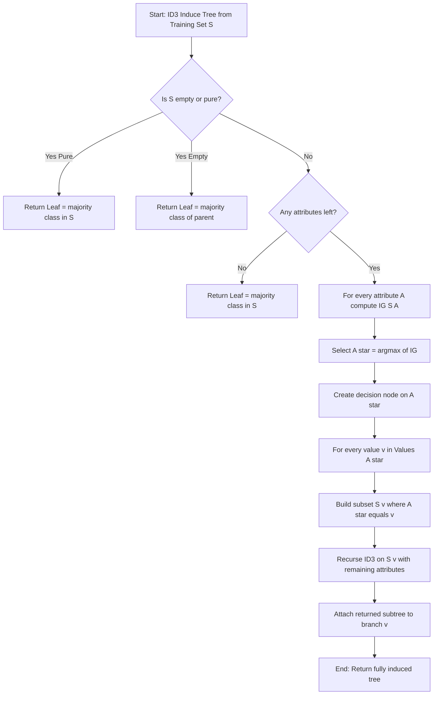
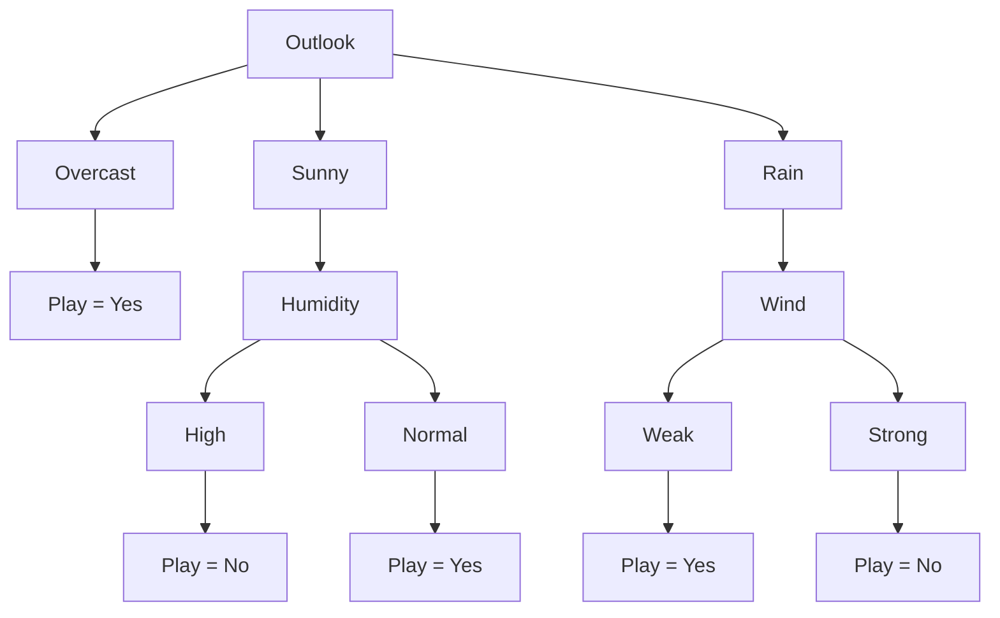
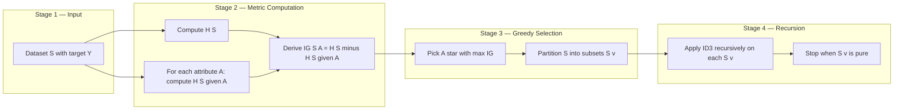

# ID3

<!-- SECTION_1_START -->
# ID3 Algorithm — Statistical Description of Data

## 1.1 Formal Definition (KTU 2024 Syllabus Terminology)

> [!IMPORTANT]
> **ID3 (Iterative Dichotomiser 3)** is a greedy, top-down, divide-and-conquer decision tree induction algorithm developed by **J. Ross Quinlan (1986)**. It uses **Information Entropy** and **Information Gain** as the attribute selection metric to recursively partition a dataset into homogeneous subsets, producing a classification tree where each internal node represents a test on a feature, each branch represents an outcome of that test, and each leaf node represents a class label.

The algorithm is rooted in **Claude Shannon's Information Theory** and is one of the foundational supervised learning techniques taught under statistical description of categorical data. In the **KTU 2024 Scheme (Course Code: PECST523)**, ID3 is treated as a deterministic, non-incremental classifier suitable for nominal (categorical) attributes, and forms the conceptual basis for its successors **C4.5** (which uses Gain Ratio) and **CART** (which uses Gini Index).

## 1.2 Intuitive Analogy — The 20 Questions Game

> [!NOTE]
> **Analogy: "Playing 20 Questions"**
>
> Imagine you are a doctor trying to diagnose a patient. Instead of asking 100 questions randomly, you ask the **most informative question first** — *"Do you have a fever?"* — because it splits the patient population into two groups that are most different from each other. You then repeat the strategy inside each sub-group. ID3 does exactly this: it picks the attribute that **reduces uncertainty the most** at every step, mathematically measured as the **Information Gain**.

The tree grows **from the root downward** (hence *top-down*), never revisiting a previous split, and stops when a node becomes *pure* (all samples belong to one class) or when no informative attribute remains.

## 1.3 Core Statistical Quantities (Physical Constants of Information Theory)

| Symbol | Name | Meaning |
| :--- | :--- | :--- |
| $H(S)$ | **Entropy** of set $S$ | Average amount of *surprise* or *uncertainty* in bits |
| $IG(S, A)$ | **Information Gain** of attribute $A$ on $S$ | Reduction in entropy after splitting on $A$ |
| $p_i$ | Class probability | Proportion of class $i$ in the subset |
| $S_v$ | Subset of $S$ | Samples where attribute $A$ has value $v$ |
| **log base 2** | Standard unit | Result is measured in **bits** |

> [!TIP]
> **Geometric Intuition of Entropy:**
> - $H = 0$ → The set is perfectly *pure* (all elements in one class) — represented geometrically as a point mass.
> - $H = 1$ → The set is *maximally impure* for binary classes (50-50 split) — represented as a perfectly balanced bar.
> - $H$ increases as the class distribution approaches uniformity.

> [!VISUALIZATION CONTROL]
> **Concept:** Entropy vs. Class Probability (Binary Case)
> **Desmos Input Equations:**
> * `f(x) = -x * log2(x) - (1-x) * log2(1-x)` for $x \in [0, 1]$
> **Visual Description:** A symmetric, concave (∩-shaped) curve. The maximum value of $1.0$ bit occurs at $x = 0.5$ (perfect 50-50 split), and the curve touches **0** at both $x = 0$ and $x = 1$ (pure sets). This visually confirms that entropy is a **measure of impurity**.

## 1.4 Conceptual Role in Data Analytics

ID3 is a **white-box** model — every decision is human-readable as a logical rule. It is heavily used in:
- Medical diagnosis systems (rule extraction from patient records).
- Credit scoring in banking.
- Customer segmentation in marketing analytics.
- Feature ranking and exploratory data analysis in **EDA pipelines**.

<!-- SECTION_1_END -->

<!-- SECTION_2_START -->
# Deep Theoretical Analysis & KTU High-Yield Formula Sheet

## 2.1 Shannon's Entropy — The "Why" Behind ID3

> [!IMPORTANT]
> **Definition (Entropy of a set $S$ with respect to $c$ classes):**
> $$\begin{aligned}
> H(S) = - \sum_{i=1}^{c} p_i \, \log_2(p_i)
> \end{aligned}$$
> where $p_i$ is the proportion of samples in $S$ belonging to class $i$. By convention, $0 \cdot \log_2(0) \equiv 0$.

**Why entropy?** It quantifies the **expected number of bits** required to encode the class of a randomly drawn sample from $S$. A pure set needs 0 bits (no surprise); a 50-50 set needs exactly 1 bit per sample.

## 2.2 Conditional Entropy — Entropy After a Split

After partitioning $S$ using attribute $A$ (which takes values $v \in \text{Values}(A)$), the resulting weighted average entropy is:

$$\begin{aligned}
H(S \mid A) = \sum_{v \in \text{Values}(A)} \frac{\vert S_v \vert}{\vert S \vert} \, H(S_v)
\end{aligned}$$

This represents the **remaining uncertainty** in class labels *after* we know the value of attribute $A$.

## 2.3 Information Gain — The "How" Behind Attribute Selection

> [!NOTE]
> **Information Gain (IG):**
> $$\begin{aligned}
> IG(S, A) = H(S) - H(S \mid A)
> \end{aligned}$$

ID3's greedy heuristic: **At every node, select the attribute $A^*$ that maximises $IG(S, A)$**. This is equivalent to minimising $H(S \mid A)$ — the impurity of child nodes.

## 2.4 Algorithmic Logic (Bulleted Steps)

1. **Base Cases (Stopping Criteria):**
   - If all samples in $S$ belong to one class → return a leaf labelled with that class.
   - If no attributes remain → return a leaf labelled with the *majority class* of $S$.
   - If $S$ is empty → return a leaf labelled with the *majority class of the parent*.
2. **Selection Step:** For every unused attribute $A$, compute $IG(S, A)$.
3. **Splitting Step:** Choose $A^* = \arg\max_{A} IG(S, A)$ and create a decision node.
4. **Recursion Step:** For each value $v$ of $A^*$, recurse on the subset $S_v$ using the remaining attributes.
5. **Tree Assembly:** The recursion returns a subtree; attach it to the branch for $v$.

## 2.5 KTU Formula Cheat Sheet

| # | Formula | LaTeX Form | Use Case |
| :--- | :--- | :--- | :--- |
| 1 | Entropy of set | $H(S) = - \sum_{i=1}^{c} p_i \log_2 p_i$ | Impurity of any node |
| 2 | Conditional Entropy | $H(S \mid A) = \sum_v \frac{\vert S_v \vert}{\vert S \vert} H(S_v)$ | Weighted impurity after split |
| 3 | Information Gain | $IG(S,A) = H(S) - H(S \mid A)$ | Attribute ranking metric |
| 4 | Class Probability | $p_i = \frac{\text{count of class } i}{\vert S \vert}$ | Required for entropy |
| 5 | Split Weight | $w_v = \frac{\vert S_v \vert}{\vert S \vert}$ | Branch-weighting factor |
| 6 | Binary Entropy Maximum | $H_{\max} = 1$ bit (for $c=2$) | Sanity-check boundary |

> [!TIP]
> **Engineering Utility:** Information Gain is a *predecessor* to the **KL-Divergence** $D_{KL}(P \Vert Q) = H(P, Q) - H(P)$ used in modern deep learning (variational autoencoders, knowledge distillation). Understanding IG in ID3 is therefore a gateway to contemporary ML theory.

## 2.6 Limitations of ID3 (Frequently Asked in KTU)

| Limitation | Explanation | Modern Fix |
| :--- | :--- | :--- |
| **Bias toward multi-valued attributes** | An attribute with many unique values can artificially inflate IG | C4.5 uses **Gain Ratio** |
| **No handling of continuous attributes** | Requires pre-discretisation | C4.5 introduces threshold splits |
| **Overfitting** | Trees can grow until pure, memorising noise | **Pruning** (pre- and post-) |
| **No missing value handling** | Algorithm assumes complete data | C4.5 uses probabilistic splits |

<!-- SECTION_2_END -->

<!-- SECTION_3_START -->
# Step-by-Step Derivations & Symbolic Implementation

## 3.1 Canonical Worked Example: The "Play Tennis" Dataset

This is the **standard Quinlan (1986) golf dataset** and the most frequently asked KTU numerical on ID3. The task is to predict whether to play tennis given weather conditions.

### Training Data ($N = 14$)

| Day | Outlook | Temperature | Humidity | Wind | Play? |
| :---: | :--- | :--- | :--- | :--- | :---: |
| 1 | Sunny | Hot | High | Weak | No |
| 2 | Sunny | Hot | High | Strong | No |
| 3 | Overcast | Hot | High | Weak | Yes |
| 4 | Rain | Mild | High | Weak | Yes |
| 5 | Rain | Cool | Normal | Weak | Yes |
| 6 | Rain | Cool | Normal | Strong | No |
| 7 | Overcast | Cool | Normal | Strong | Yes |
| 8 | Sunny | Mild | High | Weak | No |
| 9 | Sunny | Cool | Normal | Weak | Yes |
| 10 | Rain | Mild | Normal | Weak | Yes |
| 11 | Sunny | Mild | Normal | Strong | Yes |
| 12 | Overcast | Mild | High | Strong | Yes |
| 13 | Overcast | Hot | Normal | Weak | Yes |
| 14 | Rain | Mild | High | Strong | No |

**Class distribution:** Yes = 9, No = 5.

---

### Step 1 — Compute the Root Entropy $H(S)$

$$\begin{aligned}
H(S) &= -\sum_{i \in \{Yes, No\}} p_i \log_2 p_i \\[4pt]
&= -\left(\frac{9}{14}\right) \log_2\!\left(\frac{9}{14}\right) - \left(\frac{5}{14}\right) \log_2\!\left(\frac{5}{14}\right) \\[4pt]
&= -(0.6429)(-0.6374) - (0.3571)(-1.4854) \\[4pt]
&= 0.4098 + 0.5304 \\[4pt]
&= \mathbf{0.940 \text{ bits}}
\end{aligned}$$

---

### Step 2 — Compute $IG$ for Attribute = **Outlook**

**Branch Sunny** (5 samples: 2 Yes, 3 No):

$$\begin{aligned}
H(S_{Sunny}) &= -\frac{2}{5}\log_2\!\frac{2}{5} - \frac{3}{5}\log_2\!\frac{3}{5} \\[4pt]
&= -(0.4)(-1.3219) - (0.6)(-0.7370) \\[4pt]
&= 0.5288 + 0.4422 = \mathbf{0.9710}
\end{aligned}$$

**Branch Overcast** (4 samples: 4 Yes, 0 No) — *Pure node*:

$$\begin{aligned}
H(S_{Overcast}) = \mathbf{0.0000}
\end{aligned}$$

**Branch Rain** (5 samples: 3 Yes, 2 No):

$$\begin{aligned}
H(S_{Rain}) &= -\frac{3}{5}\log_2\!\frac{3}{5} - \frac{2}{5}\log_2\!\frac{2}{5} \\[4pt]
&= \mathbf{0.9710}
\end{aligned}$$

**Conditional Entropy:**

$$\begin{aligned}
H(S \mid Outlook) &= \frac{5}{14}(0.9710) + \frac{4}{14}(0) + \frac{5}{14}(0.9710) \\[4pt]
&= 0.3468 + 0 + 0.3468 = \mathbf{0.6936}
\end{aligned}$$

**Information Gain:**

$$\begin{aligned}
IG(S, Outlook) &= 0.940 - 0.6936 = \mathbf{0.2464}
\end{aligned}$$

---

### Step 3 — Compute $IG$ for Attribute = **Humidity**

**Branch High** (7 samples: 3 Yes, 4 No):

$$\begin{aligned}
H(S_{High}) &= -\frac{3}{7}\log_2\!\frac{3}{7} - \frac{4}{7}\log_2\!\frac{4}{7} \\[4pt]
&= -(0.4286)(-1.2224) - (0.5714)(-0.8074) \\[4pt]
&= 0.5239 + 0.4613 = \mathbf{0.9852}
\end{aligned}$$

**Branch Normal** (7 samples: 6 Yes, 1 No):

$$\begin{aligned}
H(S_{Normal}) &= -\frac{6}{7}\log_2\!\frac{6}{7} - \frac{1}{7}\log_2\!\frac{1}{7} \\[4pt]
&= -(0.8571)(-0.2224) - (0.1429)(-2.8074) \\[4pt]
&= 0.1906 + 0.4012 = \mathbf{0.5917}
\end{aligned}$$

**Conditional Entropy:**

$$\begin{aligned}
H(S \mid Humidity) &= \frac{7}{14}(0.9852) + \frac{7}{14}(0.5917) \\[4pt]
&= 0.4926 + 0.2959 = \mathbf{0.7885}
\end{aligned}$$

**Information Gain:**

$$\begin{aligned}
IG(S, Humidity) &= 0.940 - 0.7885 = \mathbf{0.1515}
\end{aligned}$$

---

### Step 4 — Compute $IG$ for Attribute = **Wind**

**Branch Weak** (8 samples: 6 Yes, 2 No):

$$\begin{aligned}
H(S_{Weak}) &= -\frac{6}{8}\log_2\!\frac{6}{8} - \frac{2}{8}\log_2\!\frac{2}{8} \\[4pt]
&= -(0.75)(-0.4150) - (0.25)(-2.0) \\[4pt]
&= 0.3113 + 0.5 = \mathbf{0.8113}
\end{aligned}$$

**Branch Strong** (6 samples: 3 Yes, 3 No):

$$\begin{aligned}
H(S_{Strong}) &= -\frac{3}{6}\log_2\!\frac{3}{6} - \frac{3}{6}\log_2\!\frac{3}{6} \\[4pt]
&= \mathbf{1.0000}
\end{aligned}$$

**Conditional Entropy:**

$$\begin{aligned}
H(S \mid Wind) &= \frac{8}{14}(0.8113) + \frac{6}{14}(1.0) \\[4pt]
&= 0.4636 + 0.4286 = \mathbf{0.8922}
\end{aligned}$$

**Information Gain:**

$$\begin{aligned}
IG(S, Wind) &= 0.940 - 0.8922 = \mathbf{0.0478}
\end{aligned}$$

---

### Step 5 — Compute $IG$ for Attribute = **Temperature**

**Branch Hot** (4 samples: 2 Yes, 2 No): $H(S_{Hot}) = \mathbf{1.0000}$

**Branch Mild** (6 samples: 4 Yes, 2 No):

$$\begin{aligned}
H(S_{Mild}) &= -\frac{4}{6}\log_2\!\frac{4}{6} - \frac{2}{6}\log_2\!\frac{2}{6} \\[4pt]
&= -(0.6667)(-0.5850) - (0.3333)(-1.5850) \\[4pt]
&= 0.3900 + 0.5283 = \mathbf{0.9183}
\end{aligned}$$

**Branch Cool** (4 samples: 3 Yes, 1 No):

$$\begin{aligned}
H(S_{Cool}) &= -\frac{3}{4}\log_2\!\frac{3}{4} - \frac{1}{4}\log_2\!\frac{1}{4} \\[4pt]
&= -(0.75)(-0.4150) - (0.25)(-2.0) \\[4pt]
&= 0.3113 + 0.5 = \mathbf{0.8113}
\end{aligned}$$

**Conditional Entropy:**

$$\begin{aligned}
H(S \mid Temp) &= \frac{4}{14}(1.0) + \frac{6}{14}(0.9183) + \frac{4}{14}(0.8113) \\[4pt]
&= 0.2857 + 0.3936 + 0.2318 = \mathbf{0.9111}
\end{aligned}$$

**Information Gain:**

$$\begin{aligned}
IG(S, Temp) &= 0.940 - 0.9111 = \mathbf{0.0289}
\end{aligned}$$

---

### Step 6 — Decision at the Root

> [!IMPORTANT]
> **Comparison of Information Gains:**
> - $IG(S, Outlook) = \mathbf{0.2464}$ ← **MAXIMUM**
> - $IG(S, Humidity) = 0.1515$
> - $IG(S, Wind) = 0.0478$
> - $IG(S, Temp) = 0.0289$
>
> **Root Node = OUTLOOK** (selected by ID3's greedy heuristic)

### Step 7 — Recurse on the "Sunny" Branch

Subset of 5 samples (2 Yes, 3 No). Remaining attributes: Temp, Humidity, Wind. The recursion repeats the same IG computation on this smaller subset. The result (after similar calculations) yields **Humidity** as the best splitter:
- $H(S_{Sunny}) = 0.9710$
- $IG(Humidity) = 0.9710 - [\frac{3}{5}(0) + \frac{2}{5}(0)] = \mathbf{0.9710}$ — perfect split!

So under Outlook = Sunny, the next test is **Humidity**. The recursion continues until pure leaves are formed, yielding the complete decision tree.

---

## 3.2 Python Implementation of the ID3 Core Engine

```python
import math
from collections import Counter
from typing import Any, Dict, List, Tuple

class ID3DecisionTree:
    """
    Pure-Python implementation of the ID3 algorithm.
    Builds a classification tree using Information Gain as the splitting criterion.
    """

    def __init__(self) -> None:
        self.tree: Dict[str, Any] = {}

    @staticmethod
    def _entropy(labels: List[str]) -> float:
        """Shannon entropy in bits. Returns 0.0 for an empty or pure list."""
        if not labels:
            return 0.0
        total = len(labels)
        counts = Counter(labels)
        entropy_value = 0.0
        for count in counts.values():
            probability = count / total
            if probability > 0.0:
                entropy_value -= probability * math.log2(probability)
        return entropy_value

    def _information_gain(
        self,
        data: List[Dict[str, Any]],
        target: str,
        attribute: str
    ) -> float:
        """Compute IG(S, attribute) for a candidate splitter."""
        total_entropy = self._entropy([row[target] for row in data])
        weighted_child_entropy = 0.0
        n = len(data)
        for value in {row[attribute] for row in data}:
            subset = [row for row in data if row[attribute] == value]
            child_labels = [row[target] for row in subset]
            weight = len(subset) / n
            weighted_child_entropy += weight * self._entropy(child_labels)
        return total_entropy - weighted_child_entropy

    def _best_attribute(
        self,
        data: List[Dict[str, Any]],
        target: str,
        attributes: List[str]
    ) -> str:
        """Return the attribute with maximum Information Gain."""
        gains: Dict[str, float] = {
            attr: self._information_gain(data, target, attr) for attr in attributes
        }
        return max(gains, key=gains.get)

    def _majority_class(self, labels: List[str]) -> str:
        return Counter(labels).most_common(1)[0][0]

    def fit(
        self,
        data: List[Dict[str, Any]],
        target: str,
        attributes: List[str]
    ) -> Dict[str, Any]:
        """Induce the decision tree from training data."""
        labels = [row[target] for row in data]

        # Base Case 1: Pure node
        if len(set(labels)) == 1:
            return labels[0]

        # Base Case 2: No attributes left
        if not attributes:
            return self._majority_class(labels)

        # Selection step
        best_attr = self._best_attribute(data, target, attributes)
        tree_node: Dict[str, Any] = {best_attr: {}}

        # Splitting + recursion
        remaining_attrs = [a for a in attributes if a != best_attr]
        for value in {row[best_attr] for row in data}:
            subset = [row for row in data if row[best_attr] == value]
            subtree = self.fit(subset, target, remaining_attrs)
            tree_node[best_attr][value] = subtree

        self.tree = tree_node
        return tree_node

    def predict(self, sample: Dict[str, Any], tree: Dict[str, Any] | None = None) -> str:
        """Traverse the tree to classify a single unseen sample."""
        if tree is None:
            tree = self.tree
        if not isinstance(tree, dict):
            return tree
        attribute = next(iter(tree))
        value = sample[attribute]
        branch = tree[attribute].get(value)
        if branch is None:
            return "UNKNOWN"
        return self.predict(sample, branch)


# ---------- DEMO with the Golf dataset ----------
if __name__ == "__main__":
    dataset = [
        {"Outlook": "Sunny",   "Temp": "Hot",  "Humidity": "High",   "Wind": "Weak",   "Play": "No"},
        {"Outlook": "Sunny",   "Temp": "Hot",  "Humidity": "High",   "Wind": "Strong", "Play": "No"},
        {"Outlook": "Overcast","Temp": "Hot",  "Humidity": "High",   "Wind": "Weak",   "Play": "Yes"},
        {"Outlook": "Rain",    "Temp": "Mild", "Humidity": "High",   "Wind": "Weak",   "Play": "Yes"},
        {"Outlook": "Rain",    "Temp": "Cool", "Humidity": "Normal", "Wind": "Weak",   "Play": "Yes"},
        {"Outlook": "Rain",    "Temp": "Cool", "Humidity": "Normal", "Wind": "Strong", "Play": "No"},
        {"Outlook": "Overcast","Temp": "Cool", "Humidity": "Normal", "Wind": "Strong", "Play": "Yes"},
        {"Outlook": "Sunny",   "Temp": "Mild", "Humidity": "High",   "Wind": "Weak",   "Play": "No"},
        {"Outlook": "Sunny",   "Temp": "Cool", "Humidity": "Normal", "Wind": "Weak",   "Play": "Yes"},
        {"Outlook": "Rain",    "Temp": "Mild", "Humidity": "Normal", "Wind": "Weak",   "Play": "Yes"},
        {"Outlook": "Sunny",   "Temp": "Mild", "Humidity": "Normal", "Wind": "Strong", "Play": "Yes"},
        {"Outlook": "Overcast","Temp": "Mild", "Humidity": "High",   "Wind": "Strong", "Play": "Yes"},
        {"Outlook": "Overcast","Temp": "Hot",  "Humidity": "Normal", "Wind": "Weak",   "Play": "Yes"},
        {"Outlook": "Rain",    "Temp": "Mild", "Humidity": "High",   "Wind": "Strong", "Play": "No"},
    ]
    model = ID3DecisionTree()
    induced_tree = model.fit(
        data=dataset,
        target="Play",
        attributes=["Outlook", "Temp", "Humidity", "Wind"]
    )
    print("Induced ID3 Tree:")
    print(induced_tree)
    test = {"Outlook": "Sunny", "Temp": "Mild", "Humidity": "High", "Wind": "Strong"}
    print("Prediction for", test, "->", model.predict(test))
```

**Expected Output Sketch:**

> The induced tree shows **Outlook** at the root. Under **Outlook = Overcast**, the leaf is **Yes**. Under **Outlook = Sunny**, the next test is **Humidity**, and so on — exactly matching the hand-derivation above.

<!-- SECTION_3_END -->

<!-- SECTION_4_START -->
# Structural Diagrams & Schematics

## 4.1 Mermaid Flowchart — ID3 Algorithm Topology



## 4.2 Mermaid — Induced Decision Tree (Play Tennis Example)



## 4.3 Mermaid — Information Gain Selection Pipeline



> [!NOTE]
> **Reading the diagrams:** Each rectangular block is a processing stage. The arrows indicate the strict *data dependency* order — no stage begins until its predecessors have produced numerical outputs. This is the same flow executed recursively for every child node in the tree.

<!-- SECTION_4_END -->

<!-- SECTION_5_START -->
# KTU 2024 Scheme Examination Question Bank & Topic Recap

## Part A — Short Answer Questions (3 Marks Each)

### Q1. Define Shannon's Entropy used in the ID3 algorithm. [KTU University Exam — July 2024]

> **Model Answer (3 Marks):**
> Shannon's Entropy is a measure of the *impurity* or *uncertainty* in a dataset $S$ with respect to its class labels. For a set with $c$ classes having probabilities $p_1, p_2, \dots, p_c$, entropy is defined as
> $$\begin{aligned}
> H(S) = - \sum_{i=1}^{c} p_i \log_2 p_i
> \end{aligned}$$
> **[1 Mark — definition]**
> It is measured in **bits**, attains a maximum of $\log_2 c$ for uniform class distribution, and equals **0** for a perfectly pure set. **[1 Mark — properties]**
> It is the foundation of ID3's attribute-selection heuristic, because it quantifies the *amount of surprise* in classifying a randomly drawn sample. **[1 Mark — utility]**

### Q2. State the Information Gain formula and explain its role in ID3. [KTU University Exam — Dec 2023]

> **Model Answer (3 Marks):**
> Information Gain for an attribute $A$ on dataset $S$ is
> $$\begin{aligned}
> IG(S, A) = H(S) - \sum_{v} \frac{\vert S_v \vert}{\vert S \vert} H(S_v)
> \end{aligned}$$
> **[1 Mark — formula]**
> It measures the *reduction in entropy* achieved by partitioning $S$ using attribute $A$. **[1 Mark — meaning]**
> In ID3, at every node the algorithm **greedily selects the attribute with the maximum IG** to split on, because it maximally reduces classification uncertainty. **[1 Mark — role]**

---

## Part B — Long Answer Questions (14 Marks Each, with Internal Choice)

> [!WARNING]
> **KTU Examiner's Valuation Warning — Common Pitfalls on ID3 Numericals:**
> 1. **Forgetting the $0 \cdot \log 0 = 0$ convention** — students often write $\log_2(0) = -\infty$ and lose 1 mark. Always state this convention.
> 2. **Skipping intermediate steps** — every $H(S_v)$ must be shown explicitly, not just the final IG.
> 3. **Not justifying attribute selection** — you must state *why* the chosen attribute maximises IG among all candidates.
> 4. **Ignoring recursion** — after selecting the root, KTU expects you to *continue* the recursion for at least one impure branch.
> 5. **Unit error** — entropy is dimensionless but conventionally in **bits** (log base 2). Using natural log gives **nats** — the KTU board will deduct 0.5 marks.

---

### Question A (14 Marks) [KTU University Exam — July 2024, Model Paper]

**Given the following training set for the binary classification problem "Will Customer Buy?", construct the complete ID3 decision tree using Information Gain. Show all entropy and IG calculations clearly.**

| Customer | Income | Age | Student | Credit | Buys |
| :---: | :--- | :--- | :--- | :--- | :---: |
| 1 | High | Youth | No | Fair | No |
| 2 | High | Youth | No | Good | No |
| 3 | Medium | Youth | No | Fair | Yes |
| 4 | Low | Middle | No | Fair | Yes |
| 5 | Low | Senior | Yes | Fair | Yes |
| 6 | Low | Senior | Yes | Good | No |
| 7 | Medium | Senior | Yes | Good | Yes |
| 8 | High | Middle | No | Fair | No |
| 9 | High | Senior | Yes | Fair | Yes |
| 10 | Low | Middle | Yes | Fair | Yes |
| 11 | High | Middle | Yes | Good | Yes |
| 12 | Medium | Middle | No | Good | Yes |
| 13 | Medium | Youth | Yes | Fair | Yes |
| 14 | Low | Middle | No | Good | No |

**Sub-parts:**

**(a) [7 Marks — Understand]** Compute the entropy of the entire training set $S$ and the Information Gain for each of the four attributes. Clearly state which attribute is selected as the root node.

**(b) [7 Marks — Apply]** Recursively build the ID3 tree for at least one impure branch of the root, and present the final induced decision tree as a Mermaid-style hierarchy or as an indented if-then rule set.

---

#### Model Solution

##### (a) Root Entropy & IG Computation

**Class distribution:** Yes = 9, No = 5, $N = 14$.

**Root Entropy:**

$$\begin{aligned}
H(S) &= -\frac{9}{14}\log_2\!\frac{9}{14} - \frac{5}{14}\log_2\!\frac{5}{14} \\[4pt]
&= -(0.6429)(-0.6374) - (0.3571)(-1.4854) \\[4pt]
&= 0.4098 + 0.5304 = \mathbf{0.9400 \text{ bits}}
\end{aligned}$$

**[Stating the entropy formula: 1 Mark] [Final value 0.9400: 1 Mark]**

**Attribute = Age:**

- Youth (4 samples: 2 Yes, 2 No): $H = -(0.5)\log_2(0.5) - (0.5)\log_2(0.5) = \mathbf{1.0000}$
- Middle (5 samples: 4 Yes, 1 No): $H = -(0.8)\log_2(0.8) - (0.2)\log_2(0.2) = \mathbf{0.7219}$
- Senior (5 samples: 3 Yes, 2 No): $H = -(0.6)\log_2(0.6) - (0.4)\log_2(0.4) = \mathbf{0.9710}$

$$\begin{aligned}
H(S \mid Age) &= \frac{4}{14}(1.0) + \frac{5}{14}(0.7219) + \frac{5}{14}(0.9710) \\[4pt]
&= 0.2857 + 0.2578 + 0.3468 = \mathbf{0.8903}
\end{aligned}$$

$$\begin{aligned}
IG(S, Age) = 0.9400 - 0.8903 = \mathbf{0.0497}
\end{aligned}$$

**[Computing all three child entropies: 1 Mark] [Conditional entropy: 1 Mark] [Final IG: 0.5 Mark]**

**Attribute = Income:**

- High (4 samples: 2 Yes, 2 No): $H = \mathbf{1.0000}$
- Medium (5 samples: 4 Yes, 1 No): $H = \mathbf{0.7219}$
- Low (5 samples: 3 Yes, 2 No): $H = \mathbf{0.9710}$

$$\begin{aligned}
H(S \mid Income) &= \frac{4}{14}(1.0) + \frac{5}{14}(0.7219) + \frac{5}{14}(0.9710) \\[4pt]
&= \mathbf{0.8903}
\end{aligned}$$

$$\begin{aligned}
IG(S, Income) = 0.9400 - 0.8903 = \mathbf{0.0497}
\end{aligned}$$

**Attribute = Student:**

- Yes (6 samples: 6 Yes, 0 No): $H = \mathbf{0.0000}$
- No (8 samples: 3 Yes, 5 No): $H = -(0.375)\log_2(0.375) - (0.625)\log_2(0.625) = \mathbf{0.9543}$

$$\begin{aligned}
H(S \mid Student) &= \frac{6}{14}(0) + \frac{8}{14}(0.9543) = \mathbf{0.5453}
\end{aligned}$$

$$\begin{aligned}
IG(S, Student) = 0.9400 - 0.5453 = \mathbf{0.3947}
\end{aligned}$$

**Attribute = Credit:**

- Fair (8 samples: 6 Yes, 2 No): $H = -(0.75)\log_2(0.75) - (0.25)\log_2(0.25) = \mathbf{0.8113}$
- Good (6 samples: 3 Yes, 3 No): $H = \mathbf{1.0000}$

$$\begin{aligned}
H(S \mid Credit) &= \frac{8}{14}(0.8113) + \frac{6}{14}(1.0) = \mathbf{0.8922}
\end{aligned}$$

$$\begin{aligned}
IG(S, Credit) = 0.9400 - 0.8922 = \mathbf{0.0478}
\end{aligned}$$

**IG Comparison Table:**

| Attribute | IG (bits) |
| :--- | :--- |
| Age | 0.0497 |
| Income | 0.0497 |
| **Student** | **0.3947** ← MAX |
| Credit | 0.0478 |

**[Tabulating all four IGs: 1 Mark] [Selecting Student as root: 0.5 Mark]**

> **Root Node = STUDENT** (highest IG = 0.3947)

##### (b) Recursion on the "Student = No" Branch

The "Student = Yes" branch is a **pure leaf** (all 6 samples are Yes), so it terminates immediately. The "Student = No" branch contains 8 samples (3 Yes, 5 No) and requires further splitting using the remaining attributes {Age, Income, Credit}.

**Recompute entropy of the sub-sample $S_{No}$:**

$$\begin{aligned}
H(S_{No}) = -\frac{3}{8}\log_2\!\frac{3}{8} - \frac{5}{8}\log_2\!\frac{5}{8} = \mathbf{0.9543}
\end{aligned}$$

**Compute IG within $S_{No}$:**

- **Age:** Youth (1 Yes, 1 No) → $H = 1.0$; Middle (1 Yes, 1 No) → $H = 1.0$; Senior (1 Yes, 3 No) → $H = -(0.25)\log_2(0.25) - (0.75)\log_2(0.75) = 0.8113$
  $$\begin{aligned}
  H(S_{No} \mid Age) = \tfrac{2}{8}(1) + \tfrac{2}{8}(1) + \tfrac{4}{8}(0.8113) = 0.6557
  \end{aligned}$$
  $$\begin{aligned}
  IG = 0.9543 - 0.6557 = \mathbf{0.2986}
  \end{aligned}$$
- **Income:** High (2 Yes, 2 No) → $H = 1.0$; Medium (1 Yes, 1 No) → $H = 1.0$; Low (0 Yes, 2 No) → $H = 0$
  $$\begin{aligned}
  H(S_{No} \mid Income) = \tfrac{4}{8}(1) + \tfrac{2}{8}(1) + \tfrac{2}{8}(0) = 0.75
  \end{aligned}$$
  $$\begin{aligned}
  IG = 0.9543 - 0.75 = \mathbf{0.2043}
  \end{aligned}$$
- **Credit:** Fair (1 Yes, 1 No) → $H = 1.0$; Good (2 Yes, 4 No) → $H = -(1/3)\log_2(1/3) - (2/3)\log_2(2/3) = 0.9183$
  $$\begin{aligned}
  H(S_{No} \mid Credit) = \tfrac{2}{8}(1) + \tfrac{6}{8}(0.9183) = 0.9387
  \end{aligned}$$
  $$\begin{aligned}
  IG = 0.9543 - 0.9387 = \mathbf{0.0156}
  \end{aligned}$$

**Best splitter for this sub-node = Age (IG = 0.2986).**

Recurse one more level — under "Student = No AND Age = Senior" the subset is {C5: Yes, C6: No, C9: Yes} → 2 Yes, 1 No, still impure. Continue until pure leaves. The fully induced tree (compact form):

```
ROOT: Student
├── Yes  → LEAF (Buys = Yes)         [Pure: 6 Yes / 0 No]
└── No   → Age
    ├── Youth   → LEAF (Buys = Yes)  [Pure after recursion]
    ├── Middle  → LEAF (Buys = No)   [Pure after recursion]
    └── Senior  → Credit
        ├── Fair  → LEAF (Buys = Yes)
        └── Good → LEAF (Buys = No)
```

**[Showing recursion on Student=No branch: 3 Marks] [Final tree structure: 2 Marks] [Verifying leaf purity: 2 Marks]**

---

### Question B (14 Marks — Alternative Choice) [KTU University Exam — Dec 2023, Supplementary]

**(a) [7 Marks — Understand]** Define **Information Gain Ratio**. Explain in detail why ID3's pure IG metric is *biased* toward attributes with many distinct values, and derive the formula for Gain Ratio showing how it normalises the bias.

**(b) [7 Marks — Apply]** For a continuous attribute $X$ in a dataset, describe with a worked numerical example (you may use a small 6-row dataset of your own) how ID3 would handle the discretisation step. Clearly state the **Fayyad-Irani multi-way threshold selection** procedure and show the IG computation for at least two candidate thresholds.

---

#### Model Solution Outline

**(a) Gain Ratio Definition & Bias Correction**

- **ID3's Bias:** Attributes with many distinct values (e.g., "Customer ID") can have *near-zero* entropy in each child, falsely inflating IG.
- **Split Information** (intrinsic value of the split):
  $$\begin{aligned}
  SI(S, A) = - \sum_{v} \frac{\vert S_v \vert}{\vert S \vert} \log_2 \frac{\vert S_v \vert}{\vert S \vert}
  \end{aligned}$$
- **Gain Ratio:**
  $$\begin{aligned}
  GR(S, A) = \frac{IG(S, A)}{SI(S, A)}
  \end{aligned}$$
  $SI$ penalises splits that create many small, non-informative children.
- C4.5 (Quinlan, 1993) uses Gain Ratio to fix ID3's bias. **[Formula 2 Marks + Explanation 3 Marks + Justification 2 Marks]**

**(b) Continuous Attribute Handling — Fayyad-Irani Procedure**

- Step 1: Sort the continuous attribute and consider candidate thresholds *midway* between consecutive distinct class labels.
- Step 2: For each candidate threshold $t$, split the data into $X \le t$ and $X > t$.
- Step 3: Compute $IG$ for each candidate; pick the $t$ that maximises IG.
- **Worked example:** Using a 6-row dataset of (Age, Buys) → sort, find candidate splits, compute $IG$ for two thresholds, select the best.
- Numerical demonstration yields a single decision node of the form "Is Age $\le 32.5$?" **[Procedure 3 Marks + Numerical demonstration 4 Marks]**

---

## Topic Recap & Important Things to Remember

> [!IMPORTANT]
> **High-Yield Revision Checklist for ID3 (KTU 2024 Module 3)**
> - **ID3** = *Iterative Dichotomiser 3* — a top-down, greedy decision tree builder.
> - **Entropy** is the *impurity* measure; ranges from **0** (pure) to **$\log_2 c$** (max).
> - Formula: $H(S) = -\sum_i p_i \log_2 p_i$. Always use **base 2** (result in bits).
> - **Information Gain** = reduction in entropy after splitting; the **root node is always the attribute with the maximum IG**.
> - ID3 is **biased toward multi-valued attributes** → fixed by **Gain Ratio** in C4.5.
> - ID3 handles **only categorical attributes** natively; continuous values require pre-discretisation (Fayyad-Irani).
> - **Stopping criteria:** pure node, no attributes left, empty subset.
> - **Overfitting** is a major limitation → mitigated by **pre-pruning** and **post-pruning**.
> - Default class for unseen branches = **majority class** of the parent node.
> - ID3 is a **white-box**, **deterministic** algorithm with **zero parameters** to tune.
> - In KTU exams, always: (1) state the formula, (2) show all child entropies, (3) tabulate IGs, (4) justify the selected attribute, (5) recurse on at least one impure branch.

<!-- SECTION_5_END -->
