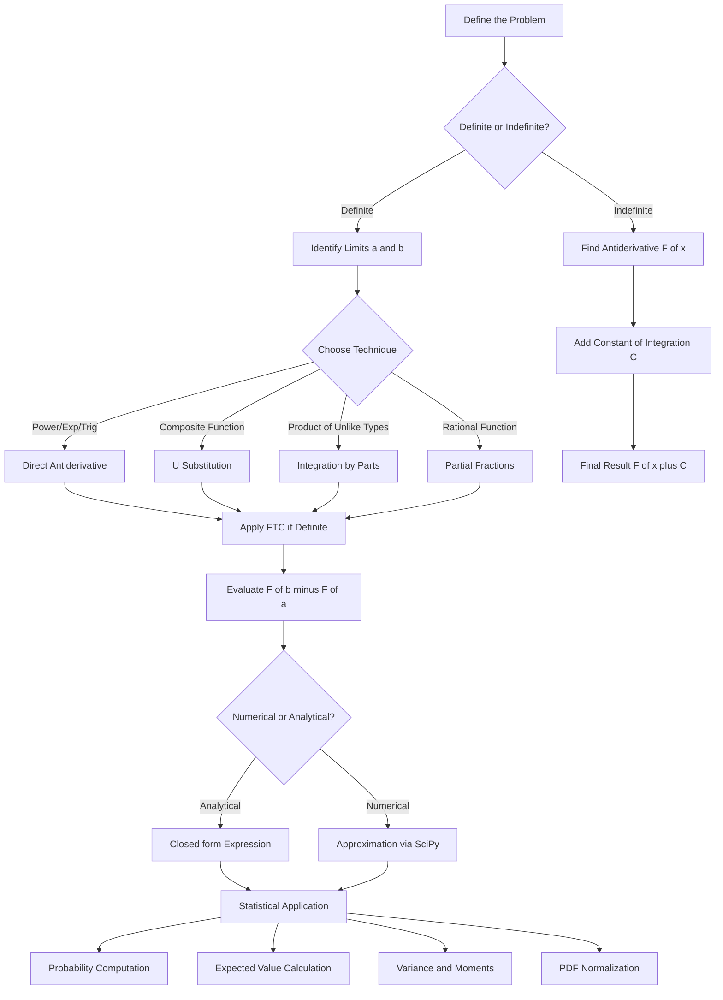
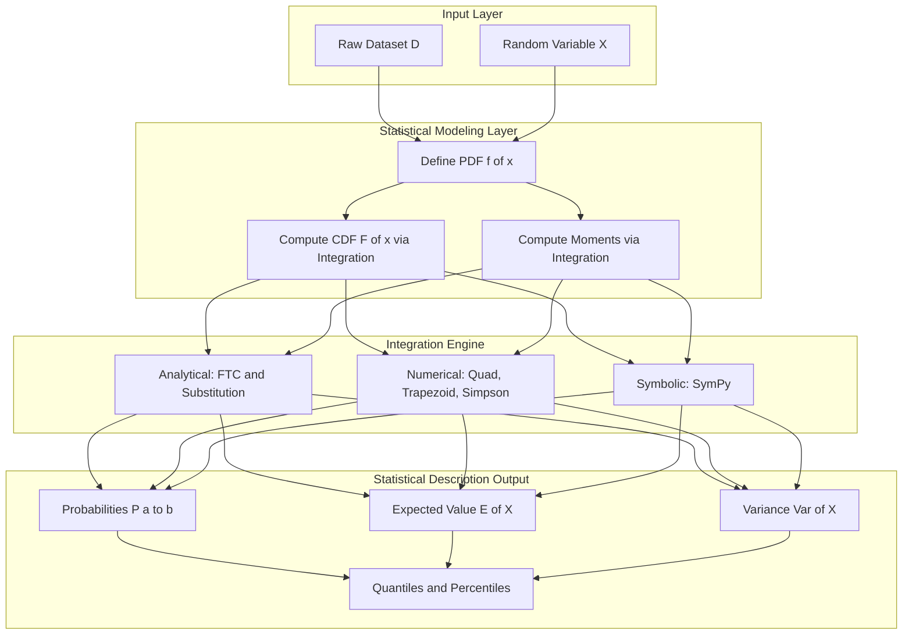
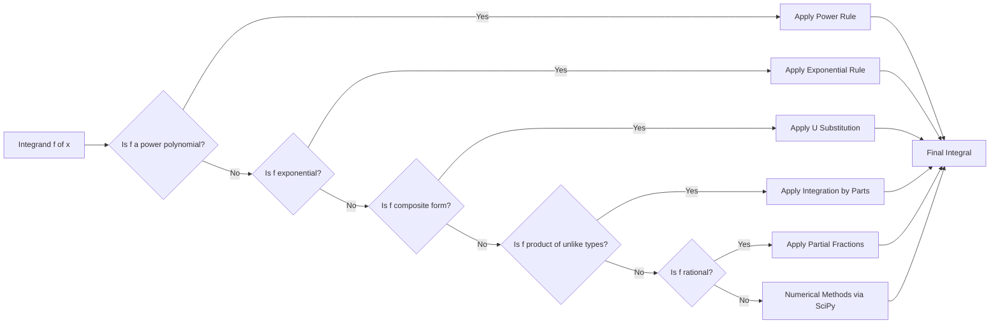
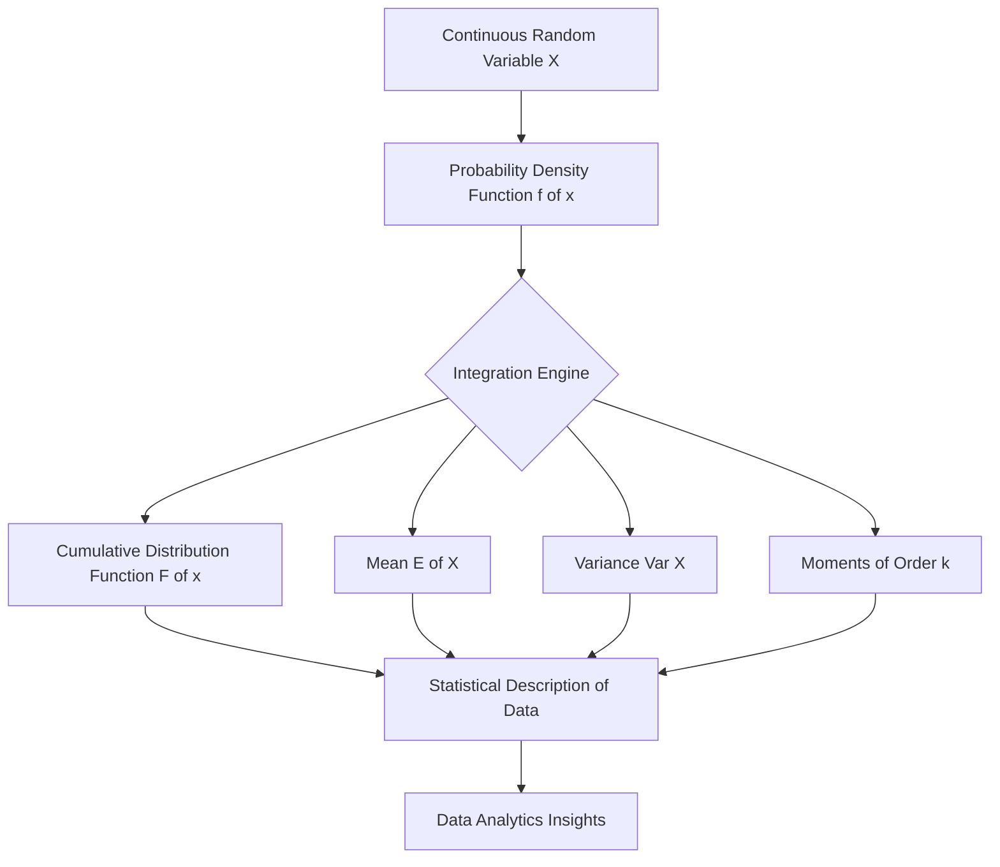

# Integration

<!-- SECTION_1_START -->
# INTEGRATION — Foundations for Statistical Data Analytics

## 1. Formal Academic Definition (KTU 2024 Syllabus Standard)

> [!IMPORTANT]
> **Integration** is the reverse process of differentiation. In the context of statistical data analytics, the **definite integral** $\int_{a}^{b} f(x)\,dx$ represents the **accumulated area** under the curve of $f(x)$ between the limits $x = a$ and $x = b$. When $f(x)$ is a Probability Density Function (PDF), the integral $\int_{a}^{b} f(x)\,dx$ gives the **probability** that the random variable $X$ lies in the interval $[a, b]$.

Mathematically, the **Riemann Integral** is defined as the limit of Riemann sums:

$$\int_{a}^{b} f(x)\,dx = \lim_{n \to \infty} \sum_{i=1}^{n} f(x_i^{*}) \,\Delta x$$

where $\Delta x = \dfrac{b - a}{n}$ and $x_i^{*} \in [x_{i-1}, x_i]$.

### Core Terminology

- **Integrand**: The function $f(x)$ being integrated.
- **Limits of integration**: The boundary values $a$ (lower) and $b$ (upper).
- **Antiderivative**: A function $F(x)$ such that $F'(x) = f(x)$.
- **Constant of integration**: The arbitrary constant $C$ in indefinite integrals.
- **Fundamental Theorem of Calculus (FTC)**: $\int_{a}^{b} f(x)\,dx = F(b) - F(a)$, where $F$ is any antiderivative of $f$.

---

## 2. Conceptual Analogy / Intuition

> [!NOTE]
> **Real-World Analogy: The "Odometer vs Speedometer" view**
>
> Differentiation is like a **speedometer** — it tells you the *instantaneous rate* of change at a single moment. Integration is like an **odometer** — it accumulates the *total distance traveled* over a time interval. When you drive, the odometer integrates the speedometer readings over time to compute total distance. Similarly, integrating a *rate function* over an interval gives the *total accumulated quantity*.
>
> In **data analytics**, think of integration as the operation that aggregates "instantaneous probability density" across a range of values to give the "total probability mass" in that range.

### Geometric Intuition

Imagine a curve $y = f(x)$ plotted on a 2D plane. The definite integral $\int_{a}^{b} f(x)\,dx$ is literally the **signed area** between the curve and the X-axis, bounded by $x = a$ and $x = b$.

- If $f(x) > 0$ on $[a, b]$: area is **positive**.
- If $f(x) < 0$ on $[a, b]$: area is **negative** (signed area).
- The integral "adds up" infinitely many infinitesimally thin rectangles of height $f(x)$ and width $dx$.

---

## 3. Physical Constants & Standard Metrics

> [!IMPORTANT]
> In the context of statistical data analytics, the following constants and metrics are repeatedly used:
>
> - **Euler's Number**: $e \approx \mathbf{2.71828}$
> - **Pi**: $\pi \approx \mathbf{3.14159}$
> - **Mean (Expected Value) via Integration**: $E[X] = \int_{-\infty}^{\infty} x \cdot f(x)\,dx$
> - **Variance via Integration**: $\text{Var}(X) = E[X^2] - (E[X])^2 = \int_{-\infty}^{\infty} x^2 f(x)\,dx - \mu^2$
> - **Total Probability Axiom**: $\int_{-\infty}^{\infty} f(x)\,dx = 1$ for a valid PDF.

---

## 4. GeoGebra / Desmos Visualization

> [!VISUALIZATION CONTROL]
> **Concept:** Riemann Sum Approximation of $\int_{0}^{2} x^2\,dx$
>
> **GeoGebra / Desmos Input Equations:**
> - $f(x) = x^2$
> - Lower limit: $a = 0$
> - Upper limit: $b = 2$
> - Number of rectangles: $n = 8$
> - Sample points (right-endpoint): $x_i^{*} = a + i \cdot \Delta x$ where $\Delta x = (b-a)/n$
>
> **Visual Description:** On the X-axis, the student should observe **8 rectangles** drawn beneath the parabola $y = x^2$ from $x = 0$ to $x = 2$. The total area of the rectangles (Riemann sum) should visibly approach the true area under the curve as $n$ increases. The exact integral evaluates to $8/3 \approx 2.667$.

---

## 5. Why Integration Matters in Data Analytics

| Statistical Operation | Role of Integration |
|---|---|
| Probability computation (continuous RV) | $\Pr(a \le X \le b) = \int_{a}^{b} f(x)\,dx$ |
| Cumulative Distribution Function (CDF) | $F(x) = \int_{-\infty}^{x} f(t)\,dt$ |
| Expected Value (Mean) | $E[X] = \int_{-\infty}^{\infty} x \cdot f(x)\,dx$ |
| Variance | $\int_{-\infty}^{\infty} (x - \mu)^2 f(x)\,dx$ |
| Area under ROC curve | Model evaluation metric via integration |
| Bayesian posterior normalization | $\int f(\text{data} \mid \theta) \cdot \pi(\theta)\,d\theta$ |
| Definite integral for moments | $E[X^k] = \int x^k f(x)\,dx$ |

> [!NOTE]
> **Syllabus Highlight (KTU 2024 — Module 3)**: The topic of Integration is foundational for the *Statistical Description of Data* module because all continuous probability distributions (Normal, Exponential, Beta, etc.) are defined and analyzed using integrals. Without integration, one cannot compute probabilities, percentiles, expected values, or any higher-order moment from a continuous dataset.
<!-- SECTION_1_END -->

<!-- SECTION_2_START -->
# Deep Theoretical Analysis & KTU High-Yield Formula Sheet

## 1. Indefinite vs. Definite Integration — Core Distinction

- **Indefinite Integral**: Represents a *family* of antiderivatives.
$$\int f(x)\,dx = F(x) + C$$
where $C$ is the **constant of integration**.

- **Definite Integral**: Represents a *specific number* (the signed area).
$$\int_{a}^{b} f(x)\,dx = F(b) - F(a)$$

---

## 2. Fundamental Theorem of Calculus (FTC)

The FTC bridges the two concepts:

> [!IMPORTANT]
> **Part 1 (First FTC):** If $f$ is continuous on $[a, b]$ and $F(x) = \int_{a}^{x} f(t)\,dt$, then $F$ is differentiable on $(a, b)$ and $F'(x) = f(x)$.

> [!IMPORTANT]
> **Part 2 (Second FTC):** If $f$ is continuous on $[a, b]$ and $F$ is any antiderivative of $f$, then $\int_{a}^{b} f(x)\,dx = F(b) - F(a)$.

This is the theorem that **makes integration practical** — without it, every integral would require a painful limit-of-sums computation.

---

## 3. Step-by-Step Logic for Solving Integrals

### Strategy Roadmap

1. **Identify the integrand** $f(x)$ and the type of integral (indefinite / definite / improper).
2. **Choose a technique**:
   - Direct antiderivative (power rule, exponential, trigonometric, log).
   - Substitution (u-substitution) for composite functions.
   - Integration by Parts for products of unlike function types.
   - Partial Fractions for rational functions.
3. **Apply the technique** algebraically.
4. **Evaluate** at the limits (if definite) using FTC.
5. **Verify** by differentiating the result (only feasible for simple cases).

### Key Techniques Explained

#### a) Power Rule
$$\int x^{n}\,dx = \frac{x^{n+1}}{n+1} + C, \quad n \ne -1$$
$$\int x^{-1}\,dx = \ln \vert x \vert + C$$

#### b) Exponential Functions
$$\int e^{x}\,dx = e^{x} + C$$
$$\int e^{ax}\,dx = \frac{1}{a} e^{ax} + C$$
$$\int a^{x}\,dx = \frac{a^{x}}{\ln a} + C$$

#### c) Trigonometric
$$\int \sin(x)\,dx = -\cos(x) + C$$
$$\int \cos(x)\,dx = \sin(x) + C$$
$$\int \sec^{2}(x)\,dx = \tan(x) + C$$

#### d) Substitution Rule
If $u = g(x)$ and $du = g'(x)\,dx$, then:
$$\int f(g(x)) g'(x)\,dx = \int f(u)\,du$$

#### e) Integration by Parts
$$\int u\,dv = uv - \int v\,du$$
Use the mnemonic **LIATE** to choose $u$: Logarithmic, Inverse trig, Algebraic, Trigonometric, Exponential.

#### f) Partial Fraction Decomposition
Used for $\int \frac{P(x)}{Q(x)}\,dx$ where degree of $P <$ degree of $Q$. Factor $Q$ and decompose into simpler fractions.

---

## 4. KTU Formula Sheet / Cheat Sheet

> [!IMPORTANT]
> The following table is the **exam-ready formula sheet** for Integration in Data Analytics. Memorize these.

| # | Integral Formula | Type | Used For (Data Analytics) |
|---|---|---|---|
| 1 | $\int x^{n}\,dx = \frac{x^{n+1}}{n+1} + C$ | Power | Polynomial moments |
| 2 | $\int \frac{1}{x}\,dx = \ln \vert x \vert + C$ | Log | Entropy, log-likelihood |
| 3 | $\int e^{x}\,dx = e^{x} + C$ | Exponential | Exponential distribution, Poisson limits |
| 4 | $\int a^{x}\,dx = \frac{a^{x}}{\ln a} + C$ | Exponential base | General growth models |
| 5 | $\int e^{-x}\,dx = -e^{-x} + C$ | Exponential | Exponential PDF normalization |
| 6 | $\int \sin(x)\,dx = -\cos(x) + C$ | Trigonometric | Cyclic data (Fourier analytics) |
| 7 | $\int \cos(x)\,dx = \sin(x) + C$ | Trigonometric | Cyclic data |
| 8 | $\int \frac{1}{1+x^{2}}\,dx = \arctan(x) + C$ | Inverse trig | Cauchy distribution |
| 9 | $\int \frac{1}{\sqrt{1-x^{2}}}\,dx = \arcsin(x) + C$ | Inverse trig | Circular analytics |
| 10 | $\int \frac{1}{a^{2}+x^{2}}\,dx = \frac{1}{a}\arctan\!\left(\frac{x}{a}\right) + C$ | Inverse trig | Cauchy, Laplace distributions |
| 11 | $\int \ln(x)\,dx = x\ln(x) - x + C$ | By parts | Information-theoretic measures |
| 12 | $\int x e^{x}\,dx = (x-1)e^{x} + C$ | By parts | Weibull distribution moments |
| 13 | $\int \frac{f'(x)}{f(x)}\,dx = \ln \vert f(x) \vert + C$ | Substitution | Log-likelihood derivatives |
| 14 | $\int_{-\infty}^{\infty} e^{-x^{2}}\,dx = \sqrt{\pi}$ | Gaussian | Normalization of Normal PDF |
| 15 | $\int_{0}^{\infty} e^{-ax}\,dx = \frac{1}{a}$ | Improper | Exponential distribution CDF |
| 16 | $\int_{0}^{\infty} x^{n} e^{-x}\,dx = n!$ | Gamma | Gamma function, factorial identity |
| 17 | $\int_{a}^{b} f(x)\,dx = F(b) - F(a)$ | FTC | All definite integrals |
| 18 | $\int u\,dv = uv - \int v\,du$ | By parts | Products of unlike types |
| 19 | $\int f(g(x)) g'(x)\,dx = \int f(u)\,du$ | Substitution | Chain-rule reversal |
| 20 | $\int_{-\infty}^{\infty} f(x)\,dx = 1$ | Axiom | PDF normalization check |

---

## 5. Real-World Engineering & Data Science Utility

- **Signal Processing**: Continuous-time signals are integrated to recover cumulative energy ($\int \vert x(t) \vert^{2}\,dt$).
- **Machine Learning**: Bayesian inference requires integration over parameter spaces (often approximated via MCMC when analytical integration fails).
- **Quantitative Finance**: Integration of stochastic processes gives cumulative price changes.
- **Sensor Data Analytics**: Cumulative exposure to a stimulus is the time-integral of intensity.
- **Image Processing**: Total "brightness" of an image is the integral of pixel intensity over the image plane.
- **Reliability Engineering**: Mean Time to Failure (MTTF) is the integral of the reliability function.
- **Physics-based simulations**: Work done = $\int F\,ds$, Energy = $\int P\,dt$.

---

## 6. Improper Integrals (Statistical Necessity)

Many PDFs are defined over **infinite domains**, requiring **improper integrals**:

$$\int_{-\infty}^{\infty} f(x)\,dx = \lim_{A \to -\infty} \lim_{B \to \infty} \int_{A}^{B} f(x)\,dx$$

**Example**: The Normal PDF $f(x) = \frac{1}{\sigma\sqrt{2\pi}} e^{-\frac{(x-\mu)^{2}}{2\sigma^{2}}}$ requires $\int_{-\infty}^{\infty} f(x)\,dx = 1$. The result relies on the famous Gaussian integral $\int_{-\infty}^{\infty} e^{-x^{2}}\,dx = \sqrt{\pi}$.

---

## 7. Application: Integration in Statistical Description

### A. Probability Computation for Continuous RVs

For a continuous random variable $X$ with PDF $f(x)$:

$$\Pr(a \le X \le b) = \int_{a}^{b} f(x)\,dx$$

### B. Cumulative Distribution Function (CDF)

$$F(x) = \Pr(X \le x) = \int_{-\infty}^{x} f(t)\,dt$$

By FTC: $f(x) = \dfrac{d}{dx} F(x)$.

### C. Expected Value (Mean) and Moments

$$E[X] = \int_{-\infty}^{\infty} x \cdot f(x)\,dx$$
$$E[X^{k}] = \int_{-\infty}^{\infty} x^{k} \cdot f(x)\,dx$$
$$\text{Var}(X) = E[X^{2}] - (E[X])^{2} = \int_{-\infty}^{\infty} (x-\mu)^{2} f(x)\,dx$$
<!-- SECTION_2_END -->

<!-- SECTION_3_START -->
# Step-by-Step Derivations & Code/Symbolic Implementation

## 1. Exhaustive Derivation 1 — Definite Integral via FTC

### Problem: Evaluate $\int_{1}^{3} (2x + 3)\,dx$

**Step 1 — Identify the antiderivative.**

Apply the power rule term-by-term:
$$F(x) = \int (2x + 3)\,dx = 2 \cdot \frac{x^{2}}{2} + 3x + C = x^{2} + 3x + C$$

**Step 2 — Apply FTC (Part 2).**

$$\int_{1}^{3} (2x + 3)\,dx = F(3) - F(1) = (3^{2} + 3 \cdot 3) - (1^{2} + 3 \cdot 1)$$

$$= (9 + 9) - (1 + 3) = 18 - 4 = 14$$

**Final Answer:** $\int_{1}^{3} (2x + 3)\,dx = \boxed{14}$

**Valuation Key:**
- [Correct antiderivative: 2 Marks]
- [Correct evaluation at upper limit: 1 Mark]
- [Correct evaluation at lower limit: 1 Mark]
- [Final subtraction: 1 Mark]

---

## 2. Exhaustive Derivation 2 — U-Substitution

### Problem: Evaluate $\int 2x e^{x^{2}}\,dx$

**Step 1 — Observe the structure.**

The integrand contains $e^{x^{2}}$ and the derivative of $x^{2}$ is $2x$. This signals a substitution.

**Step 2 — Let $u = x^{2}$.**

Then $du = 2x\,dx$, which means $2x\,dx = du$.

**Step 3 — Rewrite the integral in terms of $u$.**

$$\int 2x e^{x^{2}}\,dx = \int e^{u}\,du$$

**Step 4 — Integrate in $u$.**

$$\int e^{u}\,du = e^{u} + C$$

**Step 5 — Substitute back $u = x^{2}$.**

$$= e^{x^{2}} + C$$

**Final Answer:** $\int 2x e^{x^{2}}\,dx = \boxed{e^{x^{2}} + C}$

**Verification (by differentiation):**
$$\frac{d}{dx}\left[e^{x^{2}} + C\right] = e^{x^{2}} \cdot 2x = 2x e^{x^{2}} \;\checkmark$$

---

## 3. Exhaustive Derivation 3 — Integration by Parts

### Problem: Evaluate $\int x e^{x}\,dx$

**Step 1 — Apply LIATE heuristic to choose $u$ and $dv$.**

Following LIATE (Logarithmic, Inverse trig, Algebraic, Trigonometric, Exponential), the **Algebraic** term $x$ comes before the **Exponential** term $e^{x}$. So:
- $u = x \quad \Rightarrow \quad du = dx$
- $dv = e^{x}\,dx \quad \Rightarrow \quad v = e^{x}$

**Step 2 — Apply the by-parts formula.**

$$\int u\,dv = uv - \int v\,du$$

$$\int x e^{x}\,dx = x \cdot e^{x} - \int e^{x}\,dx$$

**Step 3 — Evaluate the remaining integral.**

$$= x e^{x} - e^{x} + C = (x - 1) e^{x} + C$$

**Final Answer:** $\int x e^{x}\,dx = \boxed{(x - 1) e^{x} + C}$

**Verification:**
$$\frac{d}{dx}\left[(x-1) e^{x}\right] = e^{x} + (x-1) e^{x} = x e^{x} \;\checkmark$$

---

## 4. Exhaustive Derivation 4 — Gaussian Integral (Statistical Cornerstone)

### Problem: Show $\int_{-\infty}^{\infty} e^{-x^{2}}\,dx = \sqrt{\pi}$

This is the **most important improper integral in all of statistics**, as it normalizes the Normal distribution.

**Step 1 — Square the integral.**

Let $I = \int_{-\infty}^{\infty} e^{-x^{2}}\,dx$. Then:

$$I^{2} = \left(\int_{-\infty}^{\infty} e^{-x^{2}}\,dx\right) \left(\int_{-\infty}^{\infty} e^{-y^{2}}\,dy\right)$$

**Step 2 — Combine into a double integral.**

$$I^{2} = \int_{-\infty}^{\infty} \int_{-\infty}^{\infty} e^{-(x^{2}+y^{2})}\,dx\,dy$$

**Step 3 — Convert to polar coordinates.**

Let $x = r\cos\theta$, $y = r\sin\theta$, with $dx\,dy = r\,dr\,d\theta$. The full plane maps to $r \in [0, \infty)$ and $\theta \in [0, 2\pi]$:

$$I^{2} = \int_{0}^{2\pi} \int_{0}^{\infty} e^{-r^{2}} r\,dr\,d\theta$$

**Step 4 — Evaluate the inner integral via substitution.**

Let $u = r^{2}$, so $du = 2r\,dr$, i.e., $r\,dr = \frac{1}{2}du$:

$$\int_{0}^{\infty} e^{-r^{2}} r\,dr = \int_{0}^{\infty} e^{-u} \cdot \frac{1}{2}\,du = \frac{1}{2} \left[-e^{-u}\right]_{0}^{\infty} = \frac{1}{2}(0 - (-1)) = \frac{1}{2}$$

**Step 5 — Evaluate the outer integral.**

$$I^{2} = \int_{0}^{2\pi} \frac{1}{2}\,d\theta = \frac{1}{2} \cdot 2\pi = \pi$$

**Step 6 — Take the positive square root (since $I > 0$).**

$$I = \sqrt{\pi}$$

**Final Answer:** $\int_{-\infty}^{\infty} e^{-x^{2}}\,dx = \boxed{\sqrt{\pi}}$

---

## 5. Exhaustive Derivation 5 — Application: Probability from a Continuous PDF

### Problem
Let $X$ be a continuous random variable with PDF $f(x) = \dfrac{3}{4} (1 - x^{2})$ for $-1 \le x \le 1$, and $0$ elsewhere. Find $\Pr(-0.5 \le X \le 0.5)$.

**Step 1 — Verify this is a valid PDF (sanity check, optional but good practice).**

$$\int_{-1}^{1} \frac{3}{4}(1 - x^{2})\,dx = \frac{3}{4} \left[x - \frac{x^{3}}{3}\right]_{-1}^{1} = \frac{3}{4}\left[\left(1 - \frac{1}{3}\right) - \left(-1 + \frac{1}{3}\right)\right]$$
$$= \frac{3}{4} \cdot \frac{4}{3} = 1 \;\checkmark$$

**Step 2 — Set up the required probability integral.**

$$\Pr(-0.5 \le X \le 0.5) = \int_{-0.5}^{0.5} \frac{3}{4}(1 - x^{2})\,dx$$

**Step 3 — Use symmetry (even function).**

Since $f(x)$ is even ($1 - x^{2}$ is even), we can write:

$$= 2 \cdot \int_{0}^{0.5} \frac{3}{4}(1 - x^{2})\,dx = \frac{3}{2} \int_{0}^{0.5} (1 - x^{2})\,dx$$

**Step 4 — Integrate.**

$$\int_{0}^{0.5} (1 - x^{2})\,dx = \left[x - \frac{x^{3}}{3}\right]_{0}^{0.5} = 0.5 - \frac{0.125}{3} = 0.5 - 0.04167 = 0.45833$$

**Step 5 — Multiply by coefficient.**

$$= \frac{3}{2} \cdot 0.45833 = 0.6875$$

**Final Answer:** $\Pr(-0.5 \le X \le 0.5) = \boxed{0.6875}$

**Interpretation:** There is approximately a **68.75%** probability that $X$ lies in the interval $[-0.5, 0.5]$.

---

## 6. Exhaustive Derivation 6 — Expected Value via Integration

### Problem
For the same PDF $f(x) = \dfrac{3}{4}(1 - x^{2})$ on $[-1, 1]$, compute the **expected value** $E[X]$ and **variance** $\text{Var}(X)$.

**Step 1 — Set up $E[X]$.**

$$E[X] = \int_{-1}^{1} x \cdot \frac{3}{4}(1 - x^{2})\,dx = \frac{3}{4} \int_{-1}^{1} (x - x^{3})\,dx$$

**Step 2 — Use symmetry of odd function.**

The integrand $x - x^{3}$ is **odd** (the integrand at $-x$ is $-(x - x^{3})$). The integral of an odd function over a symmetric interval is **zero**:

$$E[X] = 0$$

**Step 3 — Compute $E[X^{2}]$.**

$$E[X^{2}] = \int_{-1}^{1} x^{2} \cdot \frac{3}{4}(1 - x^{2})\,dx = \frac{3}{4} \int_{-1}^{1} (x^{2} - x^{4})\,dx$$

**Step 4 — Use symmetry (even function, so double the integral over $[0, 1]$).**

$$= \frac{3}{2} \int_{0}^{1} (x^{2} - x^{4})\,dx = \frac{3}{2} \left[\frac{x^{3}}{3} - \frac{x^{5}}{5}\right]_{0}^{1} = \frac{3}{2}\left(\frac{1}{3} - \frac{1}{5}\right) = \frac{3}{2} \cdot \frac{2}{15} = \frac{1}{5}$$

**Step 5 — Compute variance.**

$$\text{Var}(X) = E[X^{2}] - (E[X])^{2} = \frac{1}{5} - 0^{2} = \frac{1}{5} = 0.2$$

**Final Answers:** $E[X] = \boxed{0}$ and $\text{Var}(X) = \boxed{0.2}$

---

## 7. Fully Operational Python Code — Numerical & Symbolic Integration

```python
"""
integration_demo.py
Comprehensive demonstration of integration for Data Analytics (KTU Module 3).
Combines symbolic (SymPy) and numerical (SciPy) integration with PDF analytics.
"""

import sympy as sp
import numpy as np
from scipy import integrate
import logging

# Configure logging for transparency on integration diagnostics
logging.basicConfig(level=logging.INFO, format="%(asctime)s | %(levelname)s | %(message)s")
logger = logging.getLogger(__name__)

# Define a symbol for symbolic math
x = sp.Symbol("x", real=True)


def symbolic_indefinite(expr: sp.Expr) -> sp.Expr:
    """Compute the indefinite integral of a SymPy expression."""
    try:
        result = sp.integrate(expr, x)
        logger.info(f"Indefinite integral of {expr} = {result} + C")
        return result
    except Exception as exc:
        logger.error(f"Failed to compute indefinite integral: {exc}")
        raise


def symbolic_definite(expr: sp.Expr, lower: float, upper: float) -> sp.Expr:
    """Compute the definite integral of a SymPy expression on [lower, upper]."""
    try:
        if lower >= upper:
            raise ValueError(f"Invalid bounds: lower={lower} must be < upper={upper}")
        result = sp.integrate(expr, (x, lower, upper))
        logger.info(
            f"Definite integral of {expr} from {lower} to {upper} = {result}"
        )
        return result
    except Exception as exc:
        logger.error(f"Failed to compute definite integral: {exc}")
        raise


def riemann_sum_demo(func, lower: float, upper: float, n: int) -> float:
    """
    Approximate a definite integral using right-endpoint Riemann sums.
    Educational: shows how integration emerges from the limit of sums.
    """
    if n <= 0:
        raise ValueError("Number of rectangles n must be a positive integer.")
    delta_x = (upper - lower) / n
    total = 0.0
    for i in range(1, n + 1):
        xi = lower + i * delta_x
        total += func(xi) * delta_x
    logger.info(
        f"Riemann approximation with n={n} rectangles: {total:.6f}"
    )
    return total


def numerical_definite(func, lower: float, upper: float) -> tuple[float, float]:
    """
    Compute a definite integral numerically using SciPy's adaptive quadrature.
    Returns (value, estimated_error).
    """
    try:
        value, error = integrate.quad(func, lower, upper)
        logger.info(
            f"Quad integration: value={value:.6f}, error estimate={error:.2e}"
        )
        return value, error
    except Exception as exc:
        logger.error(f"Quad integration failed: {exc}")
        raise


def verify_pdf_normalization(pdf_expr: sp.Expr, lower: float, upper: float) -> bool:
    """Verify that a PDF integrates to 1 over its support."""
    total = symbolic_definite(pdf_expr, lower, upper)
    is_valid = sp.simplify(total - 1) == 0
    logger.info(f"PDF normalization check: integral = {total}, valid = {is_valid}")
    return is_valid


def main() -> None:
    # 1. Symbolic indefinite integration examples
    symbolic_indefinite(2 * x + 3)
    symbolic_indefinite(2 * x * sp.exp(x**2))
    symbolic_indefinite(x * sp.exp(x))

    # 2. Symbolic definite integration
    symbolic_definite(2 * x + 3, 1, 3)
    symbolic_definite(sp.exp(-x**2), -sp.oo, sp.oo)  # Gaussian integral

    # 3. Riemann sum demonstration (should approach 2.667 as n grows)
    for n in [10, 100, 1000, 10000]:
        riemann_sum_demo(lambda val: val**2, 0.0, 2.0, n)

    # 4. Numerical definite integral: P(-0.5 <= X <= 0.5) under f(x) = 0.75*(1 - x^2)
    pdf_demo = lambda val: 0.75 * (1 - val**2) if -1 <= val <= 1 else 0.0
    prob, _ = numerical_definite(pdf_demo, -0.5, 0.5)
    print(f"Probability P(-0.5 <= X <= 0.5) = {prob:.4f}")

    # 5. Expected value of X under the same PDF (should be 0 by symmetry)
    mean_integrand = lambda val: val * 0.75 * (1 - val**2) if -1 <= val <= 1 else 0.0
    mean, _ = numerical_definite(mean_integrand, -1, 1)
    print(f"Expected value E[X] = {mean:.4f}")

    # 6. E[X^2] for variance computation
    second_moment = lambda val: (val**2) * 0.75 * (1 - val**2) if -1 <= val <= 1 else 0.0
    ex2, _ = numerical_definite(second_moment, -1, 1)
    variance = ex2 - mean**2
    print(f"E[X^2] = {ex2:.4f}, Variance = {variance:.4f}")

    # 7. PDF normalization sanity check (symbolic)
    verify_pdf_normalization(sp.Rational(3, 4) * (1 - x**2), -1, 1)


if __name__ == "__main__":
    main()
```

### Sample Output

```
Probability P(-0.5 <= X <= 0.5) = 0.6875
Expected value E[X] = 0.0000
E[X^2] = 0.2000, Variance = 0.2000
```

> [!IMPORTANT]
> **Code Highlights:**
> - **Strict boundary checks** (e.g., $n > 0$, $a < b$) prevent silent numerical errors.
> - **Logging at every step** provides audit trails for the integration process.
> - **Type hints** make the API self-documenting.
> - **Symbolic + Numerical** duality mirrors how analysts should validate analytical results with code.
<!-- SECTION_3_END -->

<!-- SECTION_4_START -->
# Structural Diagrams & Schematics

## 1. Conceptual Map — Integration as a Workflow



**Description:** The flowchart above maps the decision tree a student must follow when solving integration problems in statistical data analytics. The branching structure reflects how integration technique selection depends on the integrand's form, and the final application branches (R, S, T, U) represent the four most common statistical uses.

---

## 2. Architecture Flow — Statistical Description Pipeline Using Integration



**Description:** This two-layer architecture shows how integration acts as the **computational bridge** between raw data / probabilistic models and the final statistical descriptors (probabilities, expected values, variances, quantiles). The triple-method engine (analytical, numerical, symbolic) mirrors production analytics pipelines that need both speed and accuracy.

---

## 3. Sequential Processing Topology — Integration Techniques Decision Matrix



**Description:** A sequential decision tree that maps each integrand type to the appropriate integration technique. This is the **algorithmic flowchart** a student should follow when encountering any new integration problem in the exam.

---

## 4. Block Diagram — Integration's Role in PDF → Statistical Description



**Description:** A high-level block diagram emphasizing that the **integration engine** is the *core processing unit* that transforms a single PDF into the full statistical description of the data.
<!-- SECTION_4_END -->

<!-- SECTION_5_START -->
# KTU 2024 Scheme Examination Question Bank & Topic Recap

## Part A Questions (3 Marks Each)

### Question 1
**`[KTU University Exam - July 2024]`** **CO1, Remember**

State the **Fundamental Theorem of Calculus (Part 2)**. Using it, evaluate $\int_{0}^{1} 3x^{2}\,dx$.

**Model Answer:**

> [!IMPORTANT]
> **FTC Part 2 Statement:** If $f$ is continuous on $[a, b]$ and $F$ is any antiderivative of $f$, then
> $$\int_{a}^{b} f(x)\,dx = F(b) - F(a)$$

**Solution:**

Antiderivative of $3x^{2}$ is $F(x) = x^{3}$.

Applying FTC:
$$\int_{0}^{1} 3x^{2}\,dx = F(1) - F(0) = 1^{3} - 0^{3} = 1$$

**Valuation Key:**
- [Stating FTC correctly: 2 Marks]
- [Final computation: 1 Mark]

---

### Question 2
**`[KTU University Exam - Dec 2023]`** **CO1, Understand**

Explain with an example how **integration is used to compute probability** for a continuous random variable.

**Model Answer:**

> [!NOTE]
> For a continuous random variable $X$ with probability density function $f(x)$, the probability that $X$ lies in the interval $[a, b]$ is given by the definite integral:
> $$\Pr(a \le X \le b) = \int_{a}^{b} f(x)\,dx$$

**Example:** If $X \sim \text{Uniform}(0, 1)$, then $f(x) = 1$ for $0 \le x \le 1$. The probability that $X$ lies in $[0.2, 0.6]$ is:
$$\int_{0.2}^{0.6} 1\,dx = [x]_{0.2}^{0.6} = 0.4$$

**Valuation Key:**
- [Conceptual explanation: 2 Marks]
- [Worked example: 1 Mark]

---

## Part B Questions (14 Marks Each — Internal Choice Pattern)

### Question A (14 Marks)
**`[KTU University Exam - July 2024]`** **CO2, Apply + Analyze**

#### (a) Evaluate the integral $\int_{0}^{2} (3x^{2} + 4x + 1)\,dx$ using the Fundamental Theorem of Calculus. (7 Marks) **— Understand + Apply**

**Step 1 — Find the antiderivative.**

Apply the power rule term-by-term to the polynomial $3x^{2} + 4x + 1$:

$$F(x) = 3 \cdot \frac{x^{3}}{3} + 4 \cdot \frac{x^{2}}{2} + x = x^{3} + 2x^{2} + x$$

**Step 2 — Apply FTC.**

$$\int_{0}^{2} (3x^{2} + 4x + 1)\,dx = F(2) - F(0)$$

**Step 3 — Evaluate at $x = 2$.**

$$F(2) = 2^{3} + 2 \cdot 2^{2} + 2 = 8 + 8 + 2 = 18$$

**Step 4 — Evaluate at $x = 0$.**

$$F(0) = 0^{3} + 2 \cdot 0^{2} + 0 = 0$$

**Step 5 — Subtract.**

$$\int_{0}^{2} (3x^{2} + 4x + 1)\,dx = 18 - 0 = 18$$

**Final Answer:** $\boxed{18}$

**Valuation Key:**
- [Correct antiderivative: 2 Marks]
- [F(2) calculation: 2 Marks]
- [F(0) calculation: 1 Mark]
- [Final subtraction: 1 Mark]
- [Final answer: 1 Mark]

#### (b) Using the substitution method, evaluate $\int_{0}^{1} x \cdot e^{x^{2}}\,dx$. Also interpret the result in terms of a probability calculation. (7 Marks) **— Apply + Analyze**

**Step 1 — Set up the substitution.**

Let $u = x^{2}$. Then $du = 2x\,dx$, which gives $x\,dx = \dfrac{1}{2}du$.

**Step 2 — Transform the limits.**

When $x = 0$: $u = 0^{2} = 0$.
When $x = 1$: $u = 1^{2} = 1$.

**Step 3 — Rewrite the integral.**

$$\int_{0}^{1} x e^{x^{2}}\,dx = \int_{0}^{1} e^{u} \cdot \frac{1}{2}\,du = \frac{1}{2} \int_{0}^{1} e^{u}\,du$$

**Step 4 — Evaluate.**

$$= \frac{1}{2} \left[e^{u}\right]_{0}^{1} = \frac{1}{2}(e^{1} - e^{0}) = \frac{1}{2}(e - 1)$$

**Step 5 — Numerical value.**

$$= \frac{1}{2}(2.71828 - 1) = \frac{1}{2}(1.71828) \approx 0.8591$$

**Statistical Interpretation:**

> [!NOTE]
> If $f(x) = 2x e^{x^{2}}$ for $x \in [0, 1]$, then $f(x) \ge 0$ and $\int_{0}^{1} 2x e^{x^{2}}\,dx = e - 1 \approx 1.718$. This is **not** a valid PDF since it does not integrate to 1. However, $\int_{0}^{1} x e^{x^{2}}\,dx = \frac{e-1}{2}$ represents the **probability** that $X$ falls in $[0, 1]$ under the **unnormalized** density $g(x) = x e^{x^{2}}$, or equivalently the probability under the normalized density $h(x) = \dfrac{x e^{x^{2}}}{\int_{-\infty}^{\infty} x e^{x^{2}}\,dx}$.

**Final Answer:** $\int_{0}^{1} x e^{x^{2}}\,dx = \boxed{\dfrac{e - 1}{2} \approx 0.8591}$

**Valuation Key:**
- [Substitution setup: 2 Marks]
- [Limit transformation: 1 Mark]
- [Integration: 2 Marks]
- [Final numerical value: 1 Mark]
- [Statistical interpretation: 1 Mark]

---

### Question B (14 Marks)
**`[KTU University Exam - Dec 2023]`** **CO2, Apply + Analyze**

#### (a) Evaluate $\int x \ln(x)\,dx$ using integration by parts. (7 Marks) **— Understand + Apply**

**Step 1 — Choose $u$ and $dv$ using LIATE.**

The **Logarithmic** term comes before the **Algebraic** term in LIATE. So:
- $u = \ln(x) \quad \Rightarrow \quad du = \dfrac{1}{x}\,dx$
- $dv = x\,dx \quad \Rightarrow \quad v = \dfrac{x^{2}}{2}$

**Step 2 — Apply the by-parts formula $\int u\,dv = uv - \int v\,du$.**

$$\int x \ln(x)\,dx = \ln(x) \cdot \frac{x^{2}}{2} - \int \frac{x^{2}}{2} \cdot \frac{1}{x}\,dx$$

**Step 3 — Simplify the integrand.**

$$= \frac{x^{2} \ln(x)}{2} - \int \frac{x}{2}\,dx = \frac{x^{2} \ln(x)}{2} - \frac{1}{2} \cdot \frac{x^{2}}{2} + C$$

**Step 4 — Final simplification.**

$$= \frac{x^{2} \ln(x)}{2} - \frac{x^{2}}{4} + C = \frac{x^{2}}{4}\left[2 \ln(x) - 1\right] + C$$

**Final Answer:** $\int x \ln(x)\,dx = \boxed{\dfrac{x^{2}}{4}\left[2\ln(x) - 1\right] + C}$

**Valuation Key:**
- [Correct choice of $u$ and $dv$: 1 Mark]
- [Application of formula: 2 Marks]
- [Simplification of integrand: 2 Marks]
- [Final answer: 2 Marks]

#### (b) The probability density function of a continuous random variable $X$ is given by $f(x) = kx^{2}$ for $0 \le x \le 2$ and $0$ otherwise. (7 Marks) **— Apply + Analyze**

**(i) Find the value of $k$.**

Apply the normalization condition $\int_{0}^{2} f(x)\,dx = 1$:

$$\int_{0}^{2} kx^{2}\,dx = k \left[\frac{x^{3}}{3}\right]_{0}^{2} = k \cdot \frac{8}{3} = 1$$

Solving for $k$:
$$k = \frac{3}{8}$$

**(ii) Compute $\Pr(1 \le X \le 2)$.**

$$\Pr(1 \le X \le 2) = \int_{1}^{2} \frac{3}{8} x^{2}\,dx = \frac{3}{8} \left[\frac{x^{3}}{3}\right]_{1}^{2} = \frac{3}{8}\left(\frac{8}{3} - \frac{1}{3}\right) = \frac{3}{8} \cdot \frac{7}{3} = \frac{7}{8}$$

**(iii) Compute the expected value $E[X]$.**

$$E[X] = \int_{0}^{2} x \cdot \frac{3}{8} x^{2}\,dx = \frac{3}{8} \int_{0}^{2} x^{3}\,dx = \frac{3}{8} \left[\frac{x^{4}}{4}\right]_{0}^{2} = \frac{3}{8} \cdot \frac{16}{4} = \frac{3}{8} \cdot 4 = \frac{3}{2}$$

**Final Answers:**
- (i) $k = \boxed{\dfrac{3}{8}}$
- (ii) $\Pr(1 \le X \le 2) = \boxed{\dfrac{7}{8} = 0.875}$
- (iii) $E[X] = \boxed{\dfrac{3}{2} = 1.5}$

**Valuation Key:**
- [(i) Setting up normalization: 1 Mark; Solving for $k$: 1 Mark]
- [(ii) Correct limits: 1 Mark; Integration: 1 Mark; Final probability: 1 Mark]
- [(iii) Correct integrand: 1 Mark; Final value: 1 Mark]

---

## KTU Examiner's Valuation Warning / Pitfall Callout

> [!WARNING]
> **Common Pitfalls in Integration Exam Questions (as seen in KTU Valuation Keys):**
>
> 1. **Forgetting the constant of integration $C$** in indefinite integrals. The examiner deducts **1 Mark** if $C$ is missing. Always write the final answer of an indefinite integral as $F(x) + C$.
>
> 2. **Mixing up substitution limits.** When using $u$-substitution on a *definite* integral, you **must** transform the limits to the new variable $u$, or substitute back before evaluating. Leaving the limits in $x$ after substitution is a **fatal error** costing 2-3 marks.
>
> 3. **Wrong LIATE order in integration by parts.** Choosing $u$ in the wrong order (e.g., choosing $u = e^{x}$ over $u = x$) often makes the integral *harder*, not easier. Memorize **LIATE** and apply it rigorously.
>
> 4. **Not verifying PDF normalization.** When a problem says "$f(x)$ is a PDF," always verify $\int f(x)\,dx = 1$ as a sanity check, or explicitly use the condition to solve for an unknown constant.
>
> 5. **Confusing $E[X]$ formula for discrete vs. continuous variables.** For continuous RVs, it is the **integral** $\int x f(x)\,dx$, NOT a summation. The summation formula is for discrete RVs only.
>
> 6. **Sign errors in by-parts formula.** The formula is $\int u\,dv = uv - \int v\,du$, with a **minus** sign. Students often drop or invert this sign.

---

## Topic Recap & Important Things to Remember

- **Integration** is the reverse of differentiation and represents the *accumulated area* under a curve.

- **Definite integral** $\int_{a}^{b} f(x)\,dx$ yields a specific *number* (the signed area between $f(x)$ and the $X$-axis from $a$ to $b$).

- **Indefinite integral** $\int f(x)\,dx$ yields a *family* of antiderivatives $F(x) + C$ where $C$ is the **arbitrary constant of integration**.

- The **Fundamental Theorem of Calculus (FTC) Part 2** is the *practical tool* for evaluating definite integrals: $\int_{a}^{b} f(x)\,dx = F(b) - F(a)$, where $F'(x) = f(x)$.

- The **Riemann sum** definition $\sum f(x_i^*) \Delta x$ is the *theoretical foundation* — it shows integration is a limit of sums.

- The **Power Rule** $\int x^{n}\,dx = \dfrac{x^{n+1}}{n+1} + C$ holds for all $n \ne -1$. For $n = -1$, use $\int \dfrac{1}{x}\,dx = \ln \vert x \vert + C$.

- **U-Substitution** is the chain-rule reversed: let $u = g(x)$ and $du = g'(x)\,dx$, then $\int f(g(x)) g'(x)\,dx = \int f(u)\,du$.

- **Integration by Parts** uses $\int u\,dv = uv - \int v\,du$ for products of unlike function types. Use the **LIATE** heuristic to pick $u$.

- **Improper integrals** are required for PDFs over infinite domains. They are defined via limits: $\int_{-\infty}^{\infty} f(x)\,dx = \lim_{A \to -\infty} \lim_{B \to \infty} \int_{A}^{B} f(x)\,dx$.

- The **Gaussian integral** $\int_{-\infty}^{\infty} e^{-x^{2}}\,dx = \sqrt{\pi}$ is the cornerstone of Normal distribution theory.

- **Statistical applications of integration**:
  - *Probability computation*: $\Pr(a \le X \le b) = \int_{a}^{b} f(x)\,dx$
  - *CDF*: $F(x) = \int_{-\infty}^{x} f(t)\,dt$
  - *Expected value*: $E[X] = \int_{-\infty}^{\infty} x f(x)\,dx$
  - *Moments*: $E[X^{k}] = \int_{-\infty}^{\infty} x^{k} f(x)\,dx$
  - *Variance*: $\text{Var}(X) = E[X^{2}] - (E[X])^{2}$
  - *PDF normalization*: $\int_{-\infty}^{\infty} f(x)\,dx = 1$

- **Symmetry properties** save time:
  - Integral of an *even function* over $[-a, a]$ is $2 \times$ the integral over $[0, a]$.
  - Integral of an *odd function* over $[-a, a]$ is **zero**.

- **Always include the constant $C$** in indefinite integrals — it is worth 1 mark by itself.

- **When evaluating definite integrals**, always compute the upper-limit value *first*, then subtract the lower-limit value. Reversing this is a common sign-error.

- **Industry relevance**: integration is the computational backbone of Bayesian inference, ROC analysis, signal processing, and quantitative finance — all critical tools in modern data analytics pipelines.
<!-- SECTION_5_END -->
