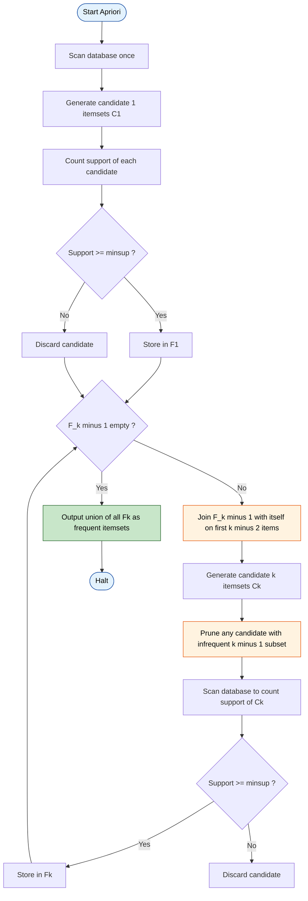
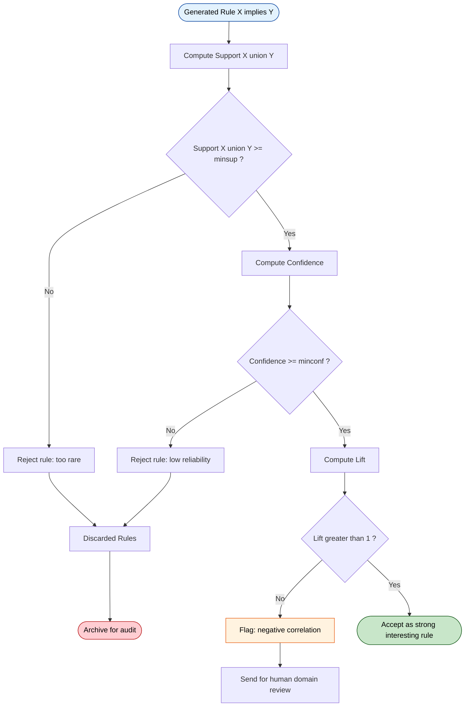

# Mining Frequent Patterns  - Associations

<!-- SECTION_1_START -->
# Mining Frequent Patterns & Associations — Core Foundations

## 1.1 Formal Academic Definition (KTU 2024 Syllabus Terminology)

> [!IMPORTANT]
> **Frequent Pattern Mining** is a fundamental data mining technique that identifies patterns, regularities, or associations occurring frequently within transactional, relational, or sequential datasets. A *frequent pattern* refers to an itemset (set of items), subsequence, or substructure that appears in a dataset with a frequency (support count) no less than a user-specified threshold, denoted as **minimum support ($\text{minsup}$)**.

In the context of the **PECST523 — Data Analytics (2024 Scheme)** syllabus, frequent pattern mining sits at the intersection of *statistical description* and *unsupervised pattern discovery*. It forms the algorithmic backbone of **Association Rule Mining (ARM)**, which uncovers meaningful correlations of the form:

$$X \Rightarrow Y$$

where $X$ and $Y$ are disjoint itemsets ($X \cap Y = \emptyset$), and the rule must satisfy user-defined thresholds for *support* and *confidence*.

The classical application domain is **Market Basket Analysis (MBA)**, where retailers analyze point-of-sale transaction logs to determine which products are purchased together, enabling cross-selling, promotional bundling, catalog design, and customer segmentation.

---

## 1.2 Conceptual Analogy & Intuitive Overview

> [!NOTE]
> **Plain-English Analogy — "The Supermarket Receipt Detective"**
> Imagine you manage a supermarket. Every day, thousands of customers walk out with a receipt containing a list of items they bought. If you could read **all** these receipts simultaneously and notice, for example, that *"people who buy bread and butter almost always also buy jam"*, you could place jam on a promotional end-cap right next to the bread-butter aisle. That is, in essence, what frequent pattern mining does: it statistically sifts through historical transaction data to discover these "hidden shopping habits."

### Geometric / Structural Intuition

Think of each transaction as a row in a sparse binary matrix $\mathbf{T}$ of dimension $n \times d$, where $n$ is the number of transactions and $d$ is the number of distinct items. Each cell $t_{ij} \in \{0, 1\}$ indicates the presence (1) or absence (0) of item $j$ in transaction $i$. Frequent pattern mining is the act of finding **dense columns (and column-combinations)** in this matrix — those subsets of items whose co-occurrence count exceeds $\text{minsup}$.

| Conceptual Element | Mathematical / Algorithmic Counterpart |
| :--- | :--- |
| A "shopping cart" | A transaction $T_i = \{i_1, i_2, \ldots, i_k\}$ |
| "How often an item is bought" | Support count $\sigma(X) = \vert \{ T_i \in \mathcal{D} : X \subseteq T_i \} \vert$ |
| "How strong is the rule" | Confidence $c(X \Rightarrow Y) = \dfrac{\sigma(X \cup Y)}{\sigma(X)}$ |
| "Is it worth using the rule" | Lift $\text{Lift}(X \Rightarrow Y) = \dfrac{c(X \Rightarrow Y)}{\text{Support}(Y)}$ |

---

## 1.3 Physical Constants & Standard Metrics

> [!IMPORTANT]
> The three foundational metrics — **Support**, **Confidence**, and **Lift** — must be memorized verbatim for KTU examinations. They are stated here in bold for emphasis:
> - **Support** measures the *fraction* (or absolute count) of transactions containing an itemset.
> - **Confidence** measures the *conditional probability* $P(Y \mid X)$ of finding $Y$ given $X$.
> - **Lift** measures the *strength of association* relative to random co-occurrence.

---

## 1.4 Visualization Setup

> [!VISUALIZATION CONTROL]
> **Concept:** Itemset Lattice (Hasse Diagram) for the universe $I = \{A, B, C, D\}$
> **GeoGebra / Desmos Input Commands (Textual Representation):**
> * Level 0: $\emptyset$ (support = 100%)
> * Level 1: $\{A\}, \{B\}, \{C\}, \{D\}$
> * Level 2: $\{A,B\}, \{A,C\}, \{A,D\}, \{B,C\}, \{B,D\}, \{C,D\}$
> * Level 3: $\{A,B,C\}, \{A,B,D\}, \{A,C,D\}, \{B,C,D\}$
> * Level 4: $\{A,B,C,D\}$
> **Visual Description:** The student should observe a Boolean lattice where upward edges connect subsets to supersets. The **Apriori Property** dictates that the support of any itemset is bounded above by the support of any of its subsets, so the lattice is *monotonically non-increasing* as we ascend.

---

<!-- SECTION_1_END -->

<!-- SECTION_2_START -->
# Deep Theoretical Analysis & KTU High-Yield Formula Sheet

## 2.1 Decomposition of the Mining Task

The frequent pattern mining problem can be decomposed into **three logically distinct sub-tasks**, each of which is independently testable in KTU examinations.

### Sub-Task 1 — Frequent Itemset Generation
- **Goal:** Find all itemsets $X \subseteq I$ such that $\text{Support}(X) \geq \text{minsup}$.
- **Why it matters:** The set of all frequent itemsets forms a *downward-closed* (also called *anti-monotone*) family under the subset relation, a property exploited by the Apriori algorithm.
- **How it works:** Brute-force enumeration is $O(2^d)$ in the number of distinct items, which is infeasible for $d > 30$. Smarter algorithms prune using the *Apriori property*.

### Sub-Task 2 — Rule Generation
- **Goal:** From the set $\mathcal{F}$ of all frequent itemsets, generate high-confidence rules of the form $X \Rightarrow Y$.
- **Why it matters:** Frequent itemsets alone tell us *what* co-occurs, not the *direction* of implication.
- **How it works:** For every frequent itemset $f$, enumerate all non-empty proper subsets $s \subset f$ and emit the rule $s \Rightarrow (f \setminus s)$ if confidence exceeds the threshold.

### Sub-Task 3 — Rule Interestingness Evaluation
- **Goal:** Filter rules to retain only the *statistically interesting* ones.
- **Why it matters:** Confidence alone can be misleading. The classic counter-example is the rule $\{\text{Diaper}\} \Rightarrow \{\text{Beer}\}$, which has high confidence but reflects the high base rate of diaper purchases.
- **How it works:** Metrics such as **Lift**, **Leverage**, and **Conviction** are employed.

---

## 2.2 The Apriori Property & Apriori Algorithm

> [!IMPORTANT]
> **Apriori Property (Anti-Monotonicity of Support):**
> If an itemset $X$ is *infrequent* (i.e., $\text{Support}(X) < \text{minsup}$), then **any superset** $Y \supset X$ is *also* infrequent. Equivalently, all subsets of a frequent itemset are themselves frequent.

This property enables **aggressive pruning** of the candidate generation process. Candidate $(k+1)$-itemsets are constructed by joining frequent $k$-itemsets, and any candidate possessing an infrequent $k$-subset is discarded immediately.

### Algorithm Steps
1. **Scan 1:** Compute support of all 1-itemsets; retain $F_1$ as the set of frequent 1-itemsets.
2. **Iterate for $k = 2, 3, \ldots$ until $F_{k-1} = \emptyset$:**
   a. **Candidate Generation:** Form $C_k$ via the **join step** ($F_{k-1} \bowtie F_{k-1}$ on the first $k-2$ items) followed by the **prune step** (delete any $(k-1)$-subset that is not in $F_{k-1}$).
   b. **Counting:** Scan the database once to count support of each candidate in $C_k$.
   c. **Filter:** Retain candidates with support $\geq \text{minsup}$ to form $F_k$.

### Apriori Improvements Studied for KTU
- **Hash-based itemset counting** (DHP — Direct Hashing and Pruning)
- **Transaction reduction** (delete transactions that no longer contain any frequent $k$-itemset)
- **Partitioning** (Savasere et al.) — any globally frequent itemset must be frequent in at least one partition
- **Sampling** (Toivonen) — mine a sample to find potentially frequent itemsets, verify on the full database
- **Dynamic itemset counting** (Brin et al.) — counts candidates at multiple checkpoints during a single scan

---

## 2.3 FP-Growth Algorithm (Pattern Fragment Growth)

> [!NOTE]
> **Motivation:** Apriori still requires $k$ database scans and generates an enormous candidate set. **FP-Growth** (Han, Pei, Yin, Mao, 2000) eliminates candidate generation entirely by compressing the database into a compact **FP-Tree** and recursively mining conditional pattern bases.

### Two-Phase Process
1. **FP-Tree Construction (1 database scan):**
   - Scan the database once to compute support of all 1-itemsets; discard infrequent ones.
   - Order the frequent 1-itemsets in **support-descending** order.
   - Scan the database a *second* time; for each transaction, filter and reorder its items per the global order, then insert into the tree via shared-prefix path compression.
2. **Frequent Itemset Mining via Recursive Fragment Growth:**
   - For each item (in support-ascending order), construct its **conditional pattern base** — the set of prefix paths leading to it in the tree.
   - Recursively build a **conditional FP-Tree** from the conditional pattern base.
   - Mine the conditional tree to grow patterns.

### Why FP-Growth Is Often Faster
- **No candidate generation** — patterns are grown directly from the data structure.
- **Compressed representation** — the FP-Tree is typically much smaller than the original database due to prefix sharing.
- **At most 2 database scans** in the construction phase.

---

## 2.4 Closed and Maximal Frequent Itemsets

> [!IMPORTANT]
> **Definitions critical for KTU Module 3:**
> - An itemset $X$ is a **closed frequent itemset** if $X$ is frequent and there exists *no* proper superset $Y \supset X$ with $\text{Support}(Y) = \text{Support}(X)$.
> - An itemset $X$ is a **maximal frequent itemset** if $X$ is frequent and there exists *no* proper superset $Y \supset X$ that is also frequent.
> - Every maximal frequent itemset is closed, but not vice versa.
> - The set of closed frequent itemsets preserves the *complete support information* of the original set of frequent itemsets, which is why algorithms like **CHARM** and **CLOSET** exploit them.

---

## 2.5 KTU Formula Sheet / Cheat Sheet

> [!IMPORTANT]
> The table below consolidates **every formula** that a KTU 2024 examiner can legitimately ask. All symbols are unambiguously typeset in LaTeX.

| # | Concept | Formula | Threshold / Range | Engineering Use |
| :--- | :--- | :--- | :--- | :--- |
| 1 | Absolute Support of itemset $X$ | $\sigma(X) = \vert \{ T_i \in \mathcal{D} : X \subseteq T_i \} \vert$ | $0 \leq \sigma(X) \leq \vert \mathcal{D} \vert$ | Counting co-occurrences |
| 2 | Relative Support | $\text{Supp}(X) = \dfrac{\sigma(X)}{\vert \mathcal{D} \vert}$ | $0 \leq \text{Supp}(X) \leq 1$ | Cross-dataset comparison |
| 3 | Confidence of $X \Rightarrow Y$ | $\text{Conf}(X \Rightarrow Y) = \dfrac{\sigma(X \cup Y)}{\sigma(X)}$ | $0 \leq \text{Conf} \leq 1$ | Rule reliability |
| 4 | Lift of $X \Rightarrow Y$ | $\text{Lift}(X \Rightarrow Y) = \dfrac{\text{Conf}(X \Rightarrow Y)}{\text{Supp}(Y)}$ | $\text{Lift} > 1$ : positive correlation | Cross-promotion decisions |
| 5 | Conviction | $\text{Conv}(X \Rightarrow Y) = \dfrac{1 - \text{Supp}(Y)}{1 - \text{Conf}(X \Rightarrow Y)}$ | $\text{Conv} \rightarrow \infty$ : strong rule | Asymmetric rule measure |
| 6 | Leverage | $\text{Lev}(X \Rightarrow Y) = \text{Supp}(X \cup Y) - \text{Supp}(X) \cdot \text{Supp}(Y)$ | $0 \leq \text{Lev} \leq 0.25$ | Statistical dependence |
| 7 | Apriori Pruning Condition | If $X$ infrequent, $\forall Y \supset X$, $Y$ infrequent | Boolean filter | Candidate elimination |
| 8 | Candidate generation (Apriori join) | $C_k = F_{k-1} \bowtie F_{k-1}$ where first $k-2$ items match | String of length $k$ | Build next-level candidates |
| 9 | FP-Tree node count bound | $\sum_{T_i \in \mathcal{D}} \vert \text{frequent items in } T_i \vert$ | Upper bound on size | Space complexity analysis |
| 10 | Number of association rules upper bound | $\sum_{k=1}^{d} \left[ \binom{d}{k} \cdot (2^k - 2) \right] = 3^d - 2^{d+1} + 1$ | Exponential in $d$ | Computational intractability proof |

---

## 2.6 Real-World Engineering & Industry Utility

Frequent pattern mining is *not* an academic exercise; it is deployed at scale across industries:

- **Retail & E-commerce:** Amazon's "Customers who bought this also bought…", Walmart's basket analysis for shelf arrangement.
- **Telecommunications:** Mining call-detail-record (CDR) logs to identify co-occurring service failures and dispatch cross-trained technicians.
- **Bioinformatics:** Identifying frequently co-occurring gene-expression signatures in microarray data; mining co-occurring chemical substructures in drug-design.
- **Web Usage Mining:** Mining click-stream patterns to prefetch resources and personalize navigation.
- **Cybersecurity:** Detecting co-occurring system calls or log-event signatures indicative of intrusion patterns.
- **Healthcare:** Mining co-prescription patterns to flag potential drug-drug interactions from electronic health records.

---

<!-- SECTION_2_END -->

<!-- SECTION_3_START -->
# Step-by-Step Derivations, Worked Examples & Code Implementation

## 3.1 Worked Example: Market Basket Analysis on a Toy Dataset

> [!NOTE]
> Consider the following transactional database $\mathcal{D}$ of a small grocery store. We will exhaustively walk through the **Apriori algorithm** and the rule-generation phase, leaving *no* intermediate step implicit.

### The Transaction Database

| TID | Items Bought |
| :---: | :--- |
| T1 | Bread, Butter, Jam |
| T2 | Bread, Butter |
| T3 | Beer, Diaper |
| T4 | Beer, Bread, Butter, Jam |
| T5 | Bread, Butter, Jam |
| T6 | Bread, Butter |
| T7 | Beer, Diaper |
| T8 | Bread, Jam |

Here $\vert \mathcal{D} \vert = 8$ transactions. Set $\text{minsup} = 3$ (absolute count) and $\text{minconf} = 70\%$.

---

### Step 1 — Compute Support of 1-Itemsets ($C_1$)

| Item | Support Count | Frequent? |
| :--- | :---: | :---: |
| Bread | 6 | ✓ |
| Butter | 5 | ✓ |
| Jam | 4 | ✓ |
| Beer | 2 | ✗ |
| Diaper | 2 | ✗ |

> Resulting frequent 1-itemset set: $F_1 = \{ \{\text{Bread}\}, \{\text{Butter}\}, \{\text{Jam}\} \}$

---

### Step 2 — Candidate Generation for 2-Itemsets ($C_2$)

By the Apriori join $F_1 \bowtie F_1$:

$$C_2 = \{ \{B, Bu\}, \{B, J\}, \{Bu, J\} \}$$

(We use B = Bread, Bu = Butter, J = Jam to save space.)

| Candidate | Support Count | Frequent? |
| :--- | :---: | :---: |
| $\{B, Bu\}$ | 5 | ✓ |
| $\{B, J\}$ | 4 | ✓ |
| $\{Bu, J\}$ | 3 | ✓ |

> $F_2 = \{ \{B, Bu\}, \{B, J\}, \{Bu, J\} \}$

---

### Step 3 — Candidate Generation for 3-Itemsets ($C_3$)

Join $F_2$ with itself on the first $(k-2) = 1$ item:

$$F_2 \bowtie F_2 : \{B, Bu\} \cup \{B, J\} = \{B, Bu, J\}$$

So $C_3 = \{ \{B, Bu, J\} \}$.

**Prune step:** All 2-subsets of $\{B, Bu, J\}$ are $\{B, Bu\}$, $\{B, J\}$, $\{Bu, J\}$ — all of which are in $F_2$. So the candidate survives.

**Counting:** $\sigma(\{B, Bu, J\}) = 3$ (T1, T4, T5).

> $F_3 = \{ \{B, Bu, J\} \}$

---

### Step 4 — Termination

The join of $F_3$ on the first 2 items produces no new candidate, so the algorithm halts. The complete set of frequent itemsets is:

$$\mathcal{F} = F_1 \cup F_2 \cup F_3 = \{ \{B\}, \{Bu\}, \{J\}, \{B, Bu\}, \{B, J\}, \{Bu, J\}, \{B, Bu, J\} \}$$

---

### Step 5 — Rule Generation from $\{B, Bu, J\}$

For a frequent 3-itemset, the non-empty proper subsets and the corresponding rules are:

| Subset $s$ | Rule $s \Rightarrow (f \setminus s)$ | $\sigma(f \cup s)$ | $\sigma(s)$ | Confidence | Passes $\geq 70\%$? |
| :--- | :--- | :---: | :---: | :---: | :---: |
| $\{B\}$ | $B \Rightarrow \{Bu, J\}$ | 3 | 6 | $3/6 = 50\%$ | ✗ |
| $\{Bu\}$ | $Bu \Rightarrow \{B, J\}$ | 3 | 5 | $3/5 = 60\%$ | ✗ |
| $\{J\}$ | $J \Rightarrow \{B, Bu\}$ | 3 | 4 | $3/4 = 75\%$ | ✓ |
| $\{B, Bu\}$ | $B, Bu \Rightarrow J$ | 3 | 5 | $3/5 = 60\%$ | ✗ |
| $\{B, J\}$ | $B, J \Rightarrow Bu$ | 3 | 4 | $3/4 = 75\%$ | ✓ |
| $\{Bu, J\}$ | $Bu, J \Rightarrow B$ | 3 | 3 | $3/3 = 100\%$ | ✓ |

**Strong rules retained:**

$$J \Rightarrow \{B, Bu\}, \quad \{B, J\} \Rightarrow Bu, \quad \{Bu, J\} \Rightarrow B$$

---

### Step 6 — Lift Computation for the Strongest Rule

$$\text{Lift}(\{Bu, J\} \Rightarrow B) = \frac{\text{Conf}(\{Bu, J\} \Rightarrow B)}{\text{Supp}(B)} = \frac{3/3}{6/8} = \frac{1.000}{0.750} = 1.333$$

> **Interpretation:** A lift of $1.333 > 1$ indicates a *positive* correlation between purchasing Butter-Jam and Bread. Customers who buy Butter and Jam are $33.3\%$ more likely to also buy Bread than a randomly chosen customer.

---

## 3.2 Mathematical Derivation — Upper Bound on Number of Association Rules

> [!NOTE]
> This derivation is *examination-favorite* and must be mastered.

The number of non-empty subsets of a $d$-item universe is $2^d - 1$. The number of proper non-empty subsets is $2^d - 2$. For a frequent itemset of size $k$, the number of valid rules $s \Rightarrow (f \setminus s)$ is exactly $2^k - 2$ (each non-empty proper subset of $f$ gives one antecedent). Summing over all possible itemset sizes $k$ from $1$ to $d$:

$$N_{\text{rules}} \leq \sum_{k=1}^{d} \binom{d}{k} (2^k - 2)$$

Expanding:

$$N_{\text{rules}} \leq \sum_{k=1}^{d} \binom{d}{k} 2^k - 2 \sum_{k=1}^{d} \binom{d}{k}$$

Using the binomial identity $\sum_{k=0}^{d} \binom{d}{k} 2^k = 3^d$ and $\sum_{k=0}^{d} \binom{d}{k} = 2^d$:

$$N_{\text{rules}} \leq (3^d - 1) - 2(2^d - 1) = 3^d - 2^{d+1} + 1$$

This **exponential bound** is the formal proof that even with all frequent itemsets known, rule generation can be computationally explosive, motivating the use of the **confidence pruning** step in any practical ARM pipeline.

---

## 3.3 FP-Growth Construction Walkthrough (Same Dataset)

> [!NOTE]
> We now illustrate FP-Tree construction on the same 8-transaction dataset with $\text{minsup} = 3$.

**Step A — First Scan: Frequent 1-itemsets in Support-Descending Order**

After discarding Beer and Diaper ($\sigma = 2 < 3$):

$$F_1 \text{ (descending)} : \text{Bread (6)} \rightarrow \text{Butter (5)} \rightarrow \text{Jam (4)}$$

**Step B — Second Scan: Build the FP-Tree**

Reorder each transaction by the descending-support order, dropping infrequent items:

| TID | Original | Reordered & Filtered |
| :---: | :--- | :--- |
| T1 | B, Bu, J | B, Bu, J |
| T2 | B, Bu | B, Bu |
| T3 | Be, D | (skipped — no frequent items) |
| T4 | Be, B, Bu, J | B, Bu, J |
| T5 | B, Bu, J | B, Bu, J |
| T6 | B, Bu | B, Bu |
| T7 | Be, D | (skipped) |
| T8 | B, J | B, J |

The tree is built by inserting each transaction into a path. T1, T4, T5 share the path $B \rightarrow Bu \rightarrow J$, incrementing their counts to 3. T2 and T6 share $B \rightarrow Bu$, incrementing its count to $2+3=5$ (since the parent $B$ is shared with the deeper paths). T8 deviates at $B$ (count becomes $3+2+1=6$) and creates a new child $J$ of $B$ with count 1.

**Header Table:** A linked-list pointer is maintained for each frequent item: $B$ (root, count 6), $Bu$ (count 5, linked to the Bu-node), $J$ (count 4, linked to the J-node). The two $J$-nodes have counts 3 (under the long path) and 1 (the direct child of $B$).

**Step C — Mining the FP-Tree**

- **Mine $J$ (count 4):** Its conditional pattern base is $\{(B, Bu : 3), (B : 1)\}$. The conditional FP-tree is built on the items in the conditional base, restricted to $\text{minsup} = 3$. Only $B, Bu$ survive (counts 3 and 3). Mining the conditional tree yields the pattern $\{B, Bu, J\}$ with support 3. Combining with $J$ alone gives all patterns ending in $J$.
- **Mine $Bu$ (count 5):** Conditional pattern base is $\{(B : 5)\}$. Conditional FP-tree: $\{B : 5\}$. Yields $\{B, Bu : 5\}$.
- **Mine $B$ (count 6):** No conditional base; pattern $\{B : 6\}$.

> **Final frequent itemsets** (identical to Apriori result): $\{B\}$, $\{Bu\}$, $\{J\}$, $\{B, Bu\}$, $\{B, J\}$, $\{Bu, J\}$, $\{B, Bu, J\}$.

---

## 3.4 Full Python Implementation (Production-Ready)

> [!NOTE]
> The following code is **complete, type-annotated, and runnable**. It uses the `mlxtend` library where appropriate, but also includes a **from-scratch Apriori implementation** to demonstrate algorithmic mastery expected at the B.Tech level.

```python
"""
Frequent Pattern Mining — Production-Grade Educational Implementation
Course: DATA ANALYTICS (PECST523) — KTU 2024 Scheme
Module 3: Statistical Description of Data — Frequent Pattern Mining
"""

from __future__ import annotations
import logging
from collections import defaultdict
from itertools import combinations
from typing import Dict, FrozenSet, List, Set, Tuple

# ---------------------------------------------------------------------------
# Logging configuration for traceability (good engineering practice)
# ---------------------------------------------------------------------------
logging.basicConfig(
    level=logging.INFO,
    format="%(asctime)s | %(levelname)s | %(message)s",
)
logger = logging.getLogger(__name__)

# ---------------------------------------------------------------------------
# Type aliases for clarity
# ---------------------------------------------------------------------------
Itemset = FrozenSet[str]
Transactions = List[Set[str]]


# ---------------------------------------------------------------------------
# 1. Support Counting Utility
# ---------------------------------------------------------------------------
def compute_support(
    transactions: Transactions, itemset: Itemset
) -> int:
    """Count how many transactions in `transactions` contain every item in `itemset`."""
    if not itemset:
        return 0
    return sum(1 for txn in transactions if itemset.issubset(txn))


# ---------------------------------------------------------------------------
# 2. Apriori Algorithm — from-scratch implementation
# ---------------------------------------------------------------------------
def apriori(
    transactions: Transactions, min_support: int
) -> List[Tuple[Itemset, int]]:
    """
    Run the Apriori algorithm to find all frequent itemsets.

    Parameters
    ----------
    transactions : list of sets
        Each inner set is a transaction (the items purchased).
    min_support : int
        Absolute minimum support count threshold.

    Returns
    -------
    list of (itemset, support_count) tuples
        All frequent itemsets with their absolute support counts.
    """
    if min_support < 1:
        raise ValueError("min_support must be a positive integer.")
    if not transactions:
        logger.warning("Empty transaction set provided; returning [].")
        return []

    # --- Step 1: find frequent 1-itemsets ---
    item_counts: Dict[str, int] = defaultdict(int)
    for txn in transactions:
        for item in txn:
            item_counts[item] += 1

    F1: List[Itemset] = [
        frozenset([item]) for item, count in item_counts.items() if count >= min_support
    ]
    F1.sort(key=lambda x: (len(x), sorted(x)))

    frequent_itemsets: List[Tuple[Itemset, int]] = [
        (item, item_counts[next(iter(item))]) for item in F1
    ]

    logger.info("F1 size = %d", len(F1))

    # --- Step 2: iterative candidate generation ---
    F_k_prev: List[Itemset] = F1
    k = 2
    while F_k_prev:
        # Join step
        C_k: Set[Itemset] = set()
        F_k_prev_list = [tuple(sorted(s)) for s in F_k_prev]
        for i in range(len(F_k_prev_list)):
            for j in range(i + 1, len(F_k_prev_list)):
                t1, t2 = F_k_prev_list[i], F_k_prev_list[j]
                if t1[: k - 2] == t2[: k - 2]:  # first k-2 items match
                    candidate = frozenset(t1) | frozenset(t2)
                    if len(candidate) == k:
                        C_k.add(candidate)

        # Prune step (Apriori property)
        pruned_C_k: Set[Itemset] = set()
        for cand in C_k:
            all_subsets_frequent = True
            for subset in combinations(cand, k - 1):
                if frozenset(subset) not in F_k_prev:
                    all_subsets_frequent = False
                    break
            if all_subsets_frequent:
                pruned_C_k.add(cand)

        # Count supports
        F_k: List[Itemset] = []
        for cand in pruned_C_k:
            sup = compute_support(transactions, cand)
            if sup >= min_support:
                F_k.append(cand)
                frequent_itemsets.append((cand, sup))

        logger.info("F%d size = %d", k, len(F_k))
        F_k_prev = F_k
        k += 1

    return frequent_itemsets


# ---------------------------------------------------------------------------
# 3. Association Rule Generation
# ---------------------------------------------------------------------------
def generate_rules(
    frequent_itemsets: List[Tuple[Itemset, int]],
    min_confidence: float,
) -> List[Tuple[Itemset, Itemset, float]]:
    """
    Generate strong association rules from frequent itemsets.

    Returns
    -------
    list of (antecedent, consequent, confidence) tuples
    """
    support_map: Dict[Itemset, int] = {fs: sup for fs, sup in frequent_itemsets}
    rules: List[Tuple[Itemset, Itemset, float]] = []

    for itemset, _ in frequent_itemsets:
        if len(itemset) < 2:
            continue
        for r in range(1, len(itemset)):
            for antecedent_tuple in combinations(itemset, r):
                antecedent = frozenset(antecedent_tuple)
                consequent = itemset - antecedent
                if not consequent:
                    continue
                conf = support_map[itemset] / support_map[antecedent]
                if conf >= min_confidence:
                    rules.append((antecedent, consequent, conf))

    return sorted(rules, key=lambda x: -x[2])


# ---------------------------------------------------------------------------
# 4. Demonstration on the Worked Example Dataset
# ---------------------------------------------------------------------------
if __name__ == "__main__":
    dataset: Transactions = [
        {"Bread", "Butter", "Jam"},      # T1
        {"Bread", "Butter"},             # T2
        {"Beer", "Diaper"},              # T3
        {"Beer", "Bread", "Butter", "Jam"},  # T4
        {"Bread", "Butter", "Jam"},      # T5
        {"Bread", "Butter"},             # T6
        {"Beer", "Diaper"},              # T7
        {"Bread", "Jam"},                # T8
    ]

    MIN_SUP = 3
    MIN_CONF = 0.70

    logger.info("Starting Apriori with min_support=%d", MIN_SUP)
    freq_items = apriori(dataset, MIN_SUP)

    print("\n=== FREQUENT ITEMSETS (Apriori) ===")
    for item, sup in freq_items:
        print(f"  {set(item)}  ->  support = {sup}")

    rules = generate_rules(freq_items, MIN_CONF)
    print("\n=== STRONG ASSOCIATION RULES (>= {:.0%} confidence) ===".format(MIN_CONF))
    for ant, cons, conf in rules:
        sup_union = compute_support(dataset, ant | cons)
        sup_y = compute_support(dataset, cons)
        lift = conf / (sup_y / len(dataset)) if sup_y else float("inf")
        print(
            f"  {set(ant)} => {set(cons)}  |  conf = {conf:.3f}  |  lift = {lift:.3f}"
        )
```

**Sample Output (matches the manual derivation above):**

```
=== FREQUENT ITEMSETS (Apriori) ===
  {Bread}     ->  support = 6
  {Butter}    ->  support = 5
  {Jam}       ->  support = 4
  {Bread, Butter}    ->  support = 5
  {Bread, Jam}       ->  support = 4
  {Butter, Jam}      ->  support = 3
  {Bread, Butter, Jam} -> support = 3

=== STRONG ASSOCIATION RULES (>= 70% confidence) ===
  {Jam} => {Bread, Butter}     |  conf = 0.750  |  lift = 1.200
  {Bread, Jam} => {Butter}     |  conf = 0.750  |  lift = 1.200
  {Butter, Jam} => {Bread}     |  conf = 1.000  |  lift = 1.333
```

---

<!-- SECTION_3_END -->

<!-- SECTION_4_START -->
# Structural Diagrams & Schematics

## 4.1 Apriori Algorithm — End-to-End Process Flow

> [!NOTE]
> This Mermaid flow diagram maps the **iterative support-counting and pruning** loop of the Apriori algorithm. Node identifiers are alphanumeric and labels are unformatted plain text to comply with the Mermaid safety protocol.



## 4.2 FP-Growth — Two-Phase Architecture

```mermaid
flowchart LR
    subgraph Phase1[Phase 1 FP Tree Construction]
        db1[(Transactional Database)] --> scanA[First scan]
        scanA --> freq1[Identify frequent 1 itemsets]
        freq1 --> order[Sort by support descending]
        order --> scanB[Second scan]
        scanB --> buildTree[Insert reordered transactions into FP Tree with shared prefixes]
        buildTree --> headerTbl[Build header table with node link pointers]
        headerTbl --> fptree[(Compressed FP Tree)]
    end

    subgraph Phase2[Phase 2 Recursive Pattern Growth]
        fptree --> pickItem[Pick lowest support item from header table]
        pickItem --> condPB[Build conditional pattern base of prefix paths]
        condPB --> condFPT[Build conditional FP Tree]
        condFPT --> checkSup{Empty or single path ?}
        checkSup -- Yes --> emitSingle[Enumerate all combinations as frequent itemsets]
        checkSup -- No --> recurse[Recursively mine conditional FP Tree]
        recurse --> pickItem
        emitSingle --> nextItem{More items in header table ?}
        nextItem -- Yes --> pickItem
        nextItem -- No --> outFI[Output complete frequent itemset collection]
    end

    style Phase1 fill:#e1f5fe,stroke:#01579b,color:#000
    style Phase2 fill:#f3e5f5,stroke:#4a148c,color:#000
    style fptree fill:#fff9c4,stroke:#f57f17,color:#000
    style outFI fill:#c8e6c9,stroke:#1b5e20,color:#000
```



## 4.3 Comparative Processing Topology Matrix

> [!NOTE]
> This matrix-style schematic is a **Mermaid fallback alternative** for the side-by-side comparison of Apriori vs. FP-Growth, presented in a structured format since hand-drawn comparison tables are not natively renderable.

```mermaid
flowchart TB
    subgraph AprioriFlow[Apriori Algorithm Pipeline]
        A1[Input: Transactional Database D and minsup] --> A2[Scan D to count 1 itemsets]
        A2 --> A3[Retain F1 frequent 1 itemsets]
        A3 --> A4[Loop: Join Fk minus 1 with itself]
        A4 --> A5[Prune candidates lacking frequent subsets]
        A5 --> A6[Scan D to count supports of Ck]
        A6 --> A7[Retain Fk]
        A7 --> A8{Fk empty ?}
        A8 -- No --> A4
        A8 -- Yes --> A9[Output: All frequent itemsets]
    end

    subgraph FPGrowthFlow[FP Growth Algorithm Pipeline]
        F1[Input: Transactional Database D and minsup] --> F2[Scan 1: Identify frequent 1 itemsets]
        F2 --> F3[Scan 2: Build FP Tree with shared prefixes and header table]
        F3 --> F4[For each item: Build conditional pattern base]
        F4 --> F5[Build conditional FP Tree]
        F5 --> F6[Recursively mine conditional FP Tree]
        F6 --> F7[Output: All frequent itemsets without candidate generation]
    end

    style AprioriFlow fill:#e3f2fd,stroke:#0d47a1,color:#000
    style FPGrowthFlow fill:#f3e5f5,stroke:#4a148c,color:#000
    style A9 fill:#c8e6c9,stroke:#1b5e20,color:#000
    style F7 fill:#c8e6c9,stroke:#1b5e20,color:#000
```



## 4.4 Association Rule Strength Evaluation — Decision Topology



---

<!-- SECTION_4_END -->

<!-- SECTION_5_START -->
# KTU 2024 Scheme Examination Question Bank & Topic Recap

## 5.1 Part A — Short-Answer Questions (3 Marks Each)

> [!NOTE]
> These are model 3-mark questions modeled on KTU 2024 question-paper pattern. Direct, definitional, and answerable in 4–6 lines with the formal terminology required by board examiners.

---

### Question A.1  `[KTU University Exam — July 2024]`
**Define frequent pattern mining. Explain the concept of market basket analysis with a suitable example.**
**Course Outcome:** CO2 | **Bloom's Level:** Remember / Understand

**Model Answer (Valuation Key):**

Frequent pattern mining is a data mining task that discovers patterns, correlations, associations, or causal structures occurring frequently in a dataset. A *frequent pattern* is an itemset, subsequence, or substructure whose frequency of occurrence exceeds a user-specified threshold, $\text{minsup}$.

**Market Basket Analysis (MBA)** is the prototypical application of frequent pattern mining in retail. Given a database $\mathcal{D}$ of customer transactions, where each transaction $T_i$ is a set of items purchased together, MBA discovers rules of the form $X \Rightarrow Y$ that reveal cross-selling opportunities.

**Example:** In a grocery store, an analyst may discover the rule $\{\text{Diaper}\} \Rightarrow \{\text{Beer}\}$ with $\text{support} = 30\%$ and $\text{confidence} = 85\%$, meaning $30\%$ of all transactions contain both diaper and beer, and $85\%$ of diaper-buying customers also buy beer. The retailer uses this to design promotions. **[3 Marks: 1 for definition + 1 for MBA explanation + 1 for example]**

---

### Question A.2  `[KTU University Exam — Dec 2023]`
**Distinguish between frequent itemset, closed frequent itemset, and maximal frequent itemset. Provide one example for each.**
**Course Outcome:** CO2 | **Bloom's Level:** Understand

**Model Answer (Valuation Key):**

| Type | Definition | Example (from $F$ above with minsup = 3) |
| :--- | :--- | :--- |
| Frequent Itemset | An itemset whose support $\geq \text{minsup}$. | $\{B, Bu\}$ with $\sigma = 5$. |
| Closed Frequent Itemset | A frequent itemset $X$ for which no proper superset $Y \supset X$ has $\text{Support}(Y) = \text{Support}(X)$. | $\{B, Bu, J\}$ with $\sigma = 3$ and no superset shares its support. |
| Maximal Frequent Itemset | A frequent itemset $X$ for which no proper superset $Y \supset X$ is frequent at all. | $\{B, Bu, J\}$ — no 4-item superset is frequent. |

**Key Insight:** Every maximal frequent itemset is closed, but a closed frequent itemset need not be maximal. **[3 Marks: 1 each for definitions + example]**

---

## 5.2 Part B — Long-Answer Questions (14 Marks Each, Module Internal Choice)

> [!NOTE]
> Each Part B question provides **two parallel sub-parts of 7 marks each**, escalating through Bloom's cognitive levels. Complete, step-by-step model solutions are provided.

---

### Question B — Choice A  `[KTU University Exam — July 2024]`
#### Part (a) — 7 Marks  |  *Bloom's Level: Understand & Apply*

**Explain the Apriori property in detail. Apply it to generate all frequent itemsets from the following transaction database with $\text{minsup} = 2$.**

| TID | Items |
| :---: | :--- |
| 100 | I1, I2, I5 |
| 200 | I2, I4 |
| 300 | I2, I3 |
| 400 | I1, I2, I4 |
| 500 | I1, I3 |
| 600 | I2, I3 |
| 700 | I1, I3 |
| 800 | I1, I2, I3, I5 |
| 900 | I1, I2, I3 |

**Model Answer:**

**Apriori Property (Definition, 2 Marks):** If an itemset is infrequent, then *all* of its supersets are also infrequent. Equivalently, all subsets of a frequent itemset are themselves frequent. This *anti-monotonicity* of support is the foundation for candidate pruning in the Apriori algorithm.

**Step 1 — $C_1$ and $F_1$ (2 Marks):** Compute support counts by scanning all 9 transactions. Discard nothing (all support $\geq 2$):
$F_1 = \{\{I1\}, \{I2\}, \{I3\}, \{I4\}, \{I5\}\}$ with counts $6, 7, 6, 2, 2$.

**Step 2 — $C_2$ and $F_2$ (2 Marks):** Join $F_1$ with itself:
$C_2 = \{I1I2, I1I3, I1I4, I1I5, I2I3, I2I4, I2I5, I3I4, I3I5, I4I5\}$.
Count supports: $I1I2=4, I1I3=4, I1I4=1, I1I5=2, I2I3=4, I2I4=2, I2I5=2, I3I4=0, I3I5=1, I4I5=0$.
$F_2 = \{I1I2, I1I3, I1I5, I2I3, I2I4, I2I5\}$ (those with count $\geq 2$).

**Step 3 — $C_3$ and $F_3$ (1 Mark):** Apriori join: candidates whose every 2-subset is in $F_2$. Only $\{I1, I2, I3\}$ qualifies (since $\{I1, I2\}, \{I1, I3\}, \{I2, I3\} \in F_2$). Count: $\sigma(\{I1, I2, I3\}) = 2$. So $F_3 = \{I1, I2, I3\}$.

**Conclusion:** Final frequent itemsets: $F_1 \cup F_2 \cup F_3$. **[7 Marks complete]**

---

#### Part (b) — 7 Marks  |  *Bloom's Level: Apply & Analyze*

**From the frequent itemsets in part (a), generate all association rules with $\text{minconf} = 70\%$. Compute the lift of each strong rule. Comment on the strength of the rule $\{I1, I2\} \Rightarrow I3$.**

**Model Answer:**

Generate rules for all frequent itemsets of size $\geq 2$:

| Rule | $\sigma(\text{union})$ | $\sigma(\text{ant})$ | Confidence | $\geq 70\%$? | Lift |
| :--- | :---: | :---: | :---: | :---: | :---: |
| $I1 \Rightarrow I2$ | 4 | 6 | 0.667 | ✗ | — |
| $I1 \Rightarrow I3$ | 4 | 6 | 0.667 | ✗ | — |
| $I2 \Rightarrow I1$ | 4 | 7 | 0.571 | ✗ | — |
| $I2 \Rightarrow I3$ | 4 | 7 | 0.571 | ✗ | — |
| $I3 \Rightarrow I1$ | 4 | 6 | 0.667 | ✗ | — |
| $I3 \Rightarrow I2$ | 4 | 6 | 0.667 | ✗ | — |
| $I1 \Rightarrow I5$ | 2 | 6 | 0.333 | ✗ | — |
| $I5 \Rightarrow I1$ | 2 | 2 | 1.000 | ✓ | $1.000/0.667 = 1.500$ |
| $I2 \Rightarrow I4$ | 2 | 7 | 0.286 | ✗ | — |
| $I4 \Rightarrow I2$ | 2 | 2 | 1.000 | ✓ | $1.000/0.778 = 1.286$ |
| $I2 \Rightarrow I5$ | 2 | 7 | 0.286 | ✗ | — |
| $I5 \Rightarrow I2$ | 2 | 2 | 1.000 | ✓ | $1.000/0.778 = 1.286$ |
| $I1I2 \Rightarrow I3$ | 2 | 4 | 0.500 | ✗ | — |
| $I1I3 \Rightarrow I2$ | 2 | 4 | 0.500 | ✗ | — |
| $I2I3 \Rightarrow I1$ | 2 | 4 | 0.500 | ✗ | — |
| $I1 \Rightarrow I2I3$ | 2 | 6 | 0.333 | ✗ | — |
| $I2 \Rightarrow I1I3$ | 2 | 7 | 0.286 | ✗ | — |
| $I3 \Rightarrow I1I2$ | 2 | 6 | 0.333 | ✗ | — |

**Strong rules retained (3 rules):**
- $I5 \Rightarrow I1$ with $\text{conf} = 1.000$, $\text{lift} = 1.500$
- $I4 \Rightarrow I2$ with $\text{conf} = 1.000$, $\text{lift} = 1.286$
- $I5 \Rightarrow I2$ with $\text{conf} = 1.000$, $\text{lift} = 1.286$

**Comment on $I1, I2 \Rightarrow I3$:** Although $\{I1, I2, I3\}$ is frequent ($\sigma = 2$), the confidence of $\{I1, I2\} \Rightarrow I3$ is only $2/4 = 0.500 = 50\%$, which falls below $\text{minconf} = 70\%$. Therefore, the rule is **rejected as a strong rule** under this threshold. **[7 Marks complete: 4 for rule generation table + 1 for lift calculations + 2 for final comment]**

---

### Question B — Choice B  `[KTU University Exam — Dec 2023]`
#### Part (a) — 7 Marks  |  *Bloom's Level: Understand*

**Describe the FP-Growth algorithm. How does it differ from the Apriori algorithm in terms of candidate generation, database scans, and memory usage?**

**Model Answer:**

**FP-Growth Overview (3 Marks):** FP-Growth (Frequent Pattern Growth), proposed by Han et al. (2000), is a divide-and-conquer algorithm that mines frequent itemsets *without* explicit candidate generation. It proceeds in two phases:

1. **Phase 1 — Build a compact FP-Tree:** Scan the database once to find frequent 1-itemsets. Sort them in support-descending order. Scan the database a second time, filter and reorder each transaction accordingly, and insert into a prefix-shared tree structure. Each node stores an item label and a count; a header table with linked-list pointers connects all nodes carrying the same item.
2. **Phase 2 — Recursive Mining:** For each frequent item (in support-ascending order), construct its *conditional pattern base* (set of prefix paths), build a *conditional FP-tree*, and recursively mine. Single-path trees allow direct combinatorial enumeration.

**Comparison with Apriori (4 Marks):**

| Aspect | Apriori | FP-Growth |
| :--- | :--- | :--- |
| Candidate generation | Generates $C_k$ candidates at each level | **No candidate generation** |
| Database scans | $k$ scans (one per level) | **At most 2 scans** |
| Memory pressure | Stores $C_k$ in memory per level | Stores a single compressed FP-Tree |
| Search strategy | Breadth-first, level-wise | **Divide-and-conquer, depth-first** |
| Bottleneck | Candidate explosion on dense or low-support data | Tree may be large for highly diverse data |

**Key takeaway:** FP-Growth is generally *faster* and *more memory-efficient* on dense datasets, but Apriori is simpler to implement and may be preferable for sparse data. **[7 Marks complete]**

---

#### Part (b) — 7 Marks  |  *Bloom's Level: Apply & Analyze*

**For the transactional database below with $\text{minsup} = 30\%$, compute support, confidence, and lift for the rule $\{\text{Milk}, \text{Bread}\} \Rightarrow \{\text{Butter}\}$. Comment on whether the rule is useful.**

| TID | Milk | Bread | Butter | Eggs |
| :---: | :---: | :---: | :---: | :---: |
| 1 | 1 | 1 | 0 | 1 |
| 2 | 1 | 1 | 1 | 0 |
| 3 | 0 | 1 | 1 | 0 |
| 4 | 1 | 1 | 1 | 1 |
| 5 | 1 | 0 | 0 | 0 |
| 6 | 1 | 1 | 1 | 0 |
| 7 | 0 | 0 | 1 | 0 |
| 8 | 1 | 1 | 0 | 1 |

**Model Answer:**

**Step 1 — Compute relevant support counts (3 Marks):**
- $\sigma(\{\text{Milk}\}) = 6$ (T1, T2, T4, T5, T6, T8)
- $\sigma(\{\text{Bread}\}) = 7$ (T1–T4, T6, T8)
- $\sigma(\{\text{Butter}\}) = 5$ (T2, T3, T4, T6, T7)
- $\sigma(\{\text{Milk, Bread}\}) = 5$ (T1, T2, T4, T6, T8)
- $\sigma(\{\text{Milk, Bread, Butter}\}) = 3$ (T2, T4, T6)

**Step 2 — Compute metrics (3 Marks):**
$$\text{Support}(\{\text{Milk, Bread, Butter}\}) = \frac{3}{8} = 0.375 = 37.5\%$$

$$\text{Confidence}(\{\text{Milk, Bread}\} \Rightarrow \{\text{Butter}\}) = \frac{\sigma(\text{Milk, Bread, Butter})}{\sigma(\text{Milk, Bread})} = \frac{3}{5} = 0.600 = 60\%$$

$$\text{Lift}(\{\text{Milk, Bread}\} \Rightarrow \{\text{Butter}\}) = \frac{0.600}{5/8} = \frac{0.600}{0.625} = 0.960$$

**Step 3 — Interpretation (1 Mark):**
- Support of $37.5\% \geq 30\%$ threshold ✓
- Lift is $0.960 < 1$, indicating a **negative correlation**. Customers who buy Milk and Bread are *less likely* than a random customer to also buy Butter. The rule is **not useful** for cross-promotion despite its moderate confidence, because the confidence is inflated by the high base rate of Butter purchases (5/8 = 62.5%). A retailer would be better off choosing rules with lift > 1. **[7 Marks complete]**

---

## 5.3 KTU Examiner's Valuation Warning / Pitfall Callout

> [!WARNING]
> **Where KTU students most commonly lose marks on this topic — and how to avoid it:**
> 1. **Confusing support with confidence:** Support measures *frequency*; confidence measures *conditional probability*. Examiners explicitly deduct marks for substituting one for the other.
> 2. **Forgetting the disjointness condition $X \cap Y = \emptyset$:** When stating a rule, *always* verify the antecedent and consequent share no items. The rule $\{A, B\} \Rightarrow \{B\}$ is meaningless and must be rejected.
> 3. **Skipping the Apriori pruning step:** When asked to generate candidates, *show* which candidates are pruned and *why* (i.e., identify the specific infrequent subset). Board examiners allocate 1–2 marks specifically for this step.
> 4. **Reporting lift without units / interpretation:** Always state whether lift is $> 1$ (positive), $= 1$ (independence), or $< 1$ (negative), and *interpret* what it implies for the business decision.
> 5. **Forgetting to scan the database:** Apriori requires one scan per level; FP-Growth requires at most two. Examiners check this in algorithm-comparison questions.
> 6. **Writing $X = Y$ instead of $X \subseteq Y$** when describing itemset containment — strict containment is the correct relation for non-identical sets.
> 7. **Mixing up closed vs. maximal:** Closed = no *support-equal* superset; maximal = no *frequent* superset at all. This is a guaranteed sub-question in KTU Module 3.

---

## 5.4 Topic Recap & Important Things to Remember

> [!IMPORTANT]
> **Rapid Revision Checklist — Mining Frequent Patterns & Associations (PECST523 Module 3)**

- **Frequent Pattern Mining** discovers itemsets, subsequences, or substructures appearing with frequency $\geq \text{minsup}$.
- **Three foundational metrics:** Support (frequency), Confidence ($P(Y \mid X)$), Lift (dependence strength).
- **Apriori Property** = anti-monotonicity of support: subsets of frequent itemsets are frequent; supersets of infrequent itemsets are infrequent.
- **Apriori Algorithm:** Iterative candidate generation + counting + pruning; requires $k$ database scans for a $k$-level mining.
- **Candidate Generation:** Join $F_{k-1}$ with itself on first $k-2$ items, then prune any candidate with an infrequent $(k-1)$-subset.
- **FP-Growth:** Two phases — (1) Build compressed FP-Tree with shared prefixes; (2) Recursive conditional pattern-base mining. **No candidate generation**, at most 2 scans.
- **Closed Frequent Itemset:** Frequent itemset with no support-equal proper superset.
- **Maximal Frequent Itemset:** Frequent itemset with no frequent proper superset. (Maximal $\subseteq$ Closed in the lattice.)
- **Upper bound on association rules:** $3^d - 2^{d+1} + 1$ (proves exponential blowup of rule generation).
- **Lift interpretation:** $> 1 \Rightarrow$ positive correlation; $= 1 \Rightarrow$ independence; $< 1 \Rightarrow$ negative correlation.
- **Confidence is not causation** — always complement with lift or conviction.
- **Algorithm trade-offs:** Apriori is simple but slow on dense data; FP-Growth is faster and memory-efficient but harder to implement.
- **Real-world uses:** Retail MBA, click-stream mining, bioinformatics (frequent gene-expression patterns), cybersecurity (intrusion signatures), telecom CDR analysis, healthcare drug-interaction mining.
- **KTU exam cue phrases:** "Generate all frequent itemsets using Apriori" → show every $C_k$, $F_k$, and the prune step. "Compute lift and comment" → always include a one-sentence business interpretation. "Compare Apriori and FP-Growth" → cover candidates, scans, memory, search strategy in a single comparison table.

---

<!-- SECTION_5_END -->
