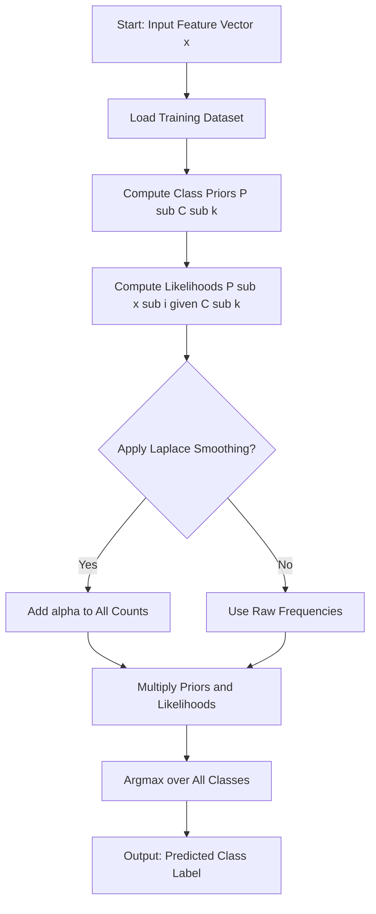
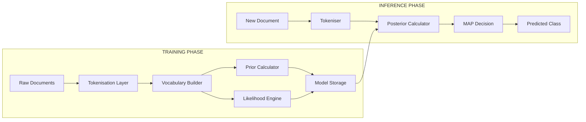

# Naive Bayesian Classification.

<!-- SECTION_1_START -->
# Naive Bayesian Classification

> [!IMPORTANT]
> **KTU 2024 Scheme — PECST523 Data Analytics | Module 3: Statistical Description of Data**
> *This topic is a high-yield unit in the KTU End Semester Examination (ESE). Direct 14-mark derivation problems and 3-mark conceptual questions are asked frequently. Master the formula sheet in Section 2 before attempting the numerical in Section 3.*

## 1.1 Formal Academic Definition (KTU Syllabus Terminology)

**Naive Bayesian Classification** is a probabilistic supervised machine learning algorithm based on applying **Bayes' Theorem** with a *naive* assumption of *conditional independence* between every pair of features given the value of the class variable. Formally, for a feature vector $\mathbf{x} = (x_1, x_2, \ldots, x_n)$ and a class label $C_k \in \{C_1, C_2, \ldots, C_m\}$, the posterior probability is computed as:

$$P(C_k \mid \mathbf{x}) \;=\; \frac{P(C_k) \prod_{i=1}^{n} P(x_i \mid C_k)}{P(\mathbf{x})}$$

The classifier then selects the class with the **maximum posterior probability**, known as the **Maximum A Posteriori (MAP)** hypothesis.

> [!NOTE]
> **Key Terminology (KTU Board Expectation)**
> - **Prior Probability $P(C_k)$** — Initial belief about a class *before* observing evidence.
> - **Likelihood $P(x_i \mid C_k)$** — Probability of observing feature $x_i$ *given* the class.
> - **Evidence $P(\mathbf{x})$** — Marginal probability of the observation (acts as a normalising constant).
> - **Posterior $P(C_k \mid \mathbf{x})$** — Updated belief *after* observing evidence.

## 1.2 Intuitive Analogy — The Doctor's Diagnosis

Imagine a patient walks into a clinic with a fever and a sore throat.

- **Your belief (prior)**: Most fevers this season are viral, not bacterial — so *viral* has a higher prior.
- **Evidence (likelihood)**: A red, swollen throat is *very common* in bacterial infections but *less common* in viral ones.
- **Updated belief (posterior)**: Combining the prior and the likelihood, the doctor now leans more confidently toward a bacterial diagnosis.

> **The "Naive" Twist**: The doctor assumes that the symptoms (fever, sore throat, cough) are *mutually independent* given the disease. In reality, symptoms correlate — but ignoring that correlation makes the math **blindingly fast and surprisingly accurate** for many real-world problems like spam filtering, sentiment analysis, and medical triage.

## 1.3 Visualizing the Concept

> [!VISUALIZATION CONTROL]
> **Concept:** Conditional Probability Venn Diagram for $P(A \mid B)$
> **GeoGebra / Desmos Input Equations:**
> * `Circle A: (x-1)^2 + (y-0.5)^2 = 4` (representing Event A — "Spam")
> * `Circle B: (x+1)^2 + (y-0.5)^2 = 4` (representing Event B — "Contains word 'Free'")
> **Visual Description:** Two overlapping circles on the XY-plane. The intersection region represents $P(A \cap B)$. The ratio of the intersection area to the area of Circle B gives the conditional probability $P(A \mid B)$ — the geometric basis of Bayes' Theorem.

## 1.4 Why "Naive"?

The assumption that all features $x_1, x_2, \ldots, x_n$ contribute **independently** to the outcome is almost never true in practice. The word *Naive* in the name is a self-aware warning from statisticians. Despite the unrealistic assumption, the algorithm is the **workhorse of text classification** in production systems at Google, Yahoo, and major email providers.

> [!TIP]
> **KTU Quick Fact**: The Multinomial Naive Bayes variant is the default baseline for the famous **SMS Spam Collection Dataset** and routinely achieves **97%–99% accuracy**.
<!-- SECTION_1_END -->

<!-- SECTION_2_START -->
# Deep Theoretical Analysis & KTU High-Yield Formula Sheet

## 2.1 Decomposition of Bayes' Theorem

The theorem, originally formulated by Reverend Thomas Bayes in 1763, decomposes a *posterior* probability into a product of a *prior* and *likelihood*, normalised by the *evidence*.

### Step-by-Step Logical Flow

- **Step 1 — Compute the Prior $P(C_k)$**:
  Estimate the base rate of each class from the training set frequencies.
  $$P(C_k) \;=\; \frac{\text{Number of instances labelled } C_k}{\text{Total number of training instances}}$$

- **Step 2 — Compute the Likelihood $P(x_i \mid C_k)$**:
  For each feature, estimate its probability distribution conditioned on the class label. For categorical features:
  $$P(x_i = v \mid C_k) \;=\; \frac{\text{Count of } (x_i = v) \text{ in class } C_k}{\text{Total instances of class } C_k}$$

- **Step 3 — Apply the Naive Conditional Independence Assumption**:
  The joint likelihood factorises as a product of individual likelihoods.
  $$P(\mathbf{x} \mid C_k) \;=\; \prod_{i=1}^{n} P(x_i \mid C_k)$$

- **Step 4 — Compute the Posterior Using Bayes' Rule**:
  $$P(C_k \mid \mathbf{x}) \;=\; \frac{P(C_k) \cdot \prod_{i=1}^{n} P(x_i \mid C_k)}{P(\mathbf{x})}$$

- **Step 5 — Apply the MAP Decision Rule**:
  Since $P(\mathbf{x})$ is constant across all classes, drop it for comparison.
  $$\hat{y} \;=\; \underset{C_k}{\arg\max}\; P(C_k) \cdot \prod_{i=1}^{n} P(x_i \mid C_k)$$

## 2.2 The Zero-Frequency Problem & Laplace Smoothing

If a categorical feature value never occurs in the training set for a given class, its likelihood becomes **zero** — which **annihilates the entire posterior** due to multiplication. This is the *zero-frequency problem*.

**Laplace Smoothing (add-one smoothing)** fixes this by adding a count of 1 to every feature-class combination:

$$P(x_i = v \mid C_k) \;=\; \frac{\text{Count}(x_i = v, C_k) + 1}{\text{Count}(C_k) + \vert V_i \vert}$$

where $\vert V_i \vert$ is the cardinality of the feature $i$'s vocabulary.

## 2.3 Variants of Naive Bayes

| Variant | Data Type | Likelihood Distribution | KTU Use Case |
| :--- | :--- | :--- | :--- |
| **Gaussian NB** | Continuous real-valued | Normal (Gaussian) distribution | Iris flower classification, sensor data |
| **Multinomial NB** | Discrete counts (word frequencies) | Multinomial distribution | Text classification, spam filtering, NLP |
| **Bernoulli NB** | Binary / Boolean features | Bernoulli distribution | Document classification (word present / absent) |
| **Complement NB** | Imbalanced text data | Complement of Multinomial | Sentiment analysis on skewed corpora |

## 2.4 KTU High-Yield Formula Sheet

| Symbol | Meaning | Formula / Definition |
| :--- | :--- | :--- |
| $P(C_k)$ | Prior probability of class $C_k$ | $\dfrac{N_{C_k}}{N_{total}}$ |
| $P(x_i \mid C_k)$ | Likelihood of feature $x_i$ given class | $\dfrac{\text{Count}(x_i, C_k)}{N_{C_k}}$ |
| $P(C_k \mid \mathbf{x})$ | Posterior probability | $\dfrac{P(C_k) \prod_{i=1}^{n} P(x_i \mid C_k)}{P(\mathbf{x})}$ |
| $\hat{y}$ | MAP prediction | $\arg\max_{C_k} \; P(C_k) \prod_{i=1}^{n} P(x_i \mid C_k)$ |
| $P_{\text{smoothed}}(x_i \mid C_k)$ | Laplace-smoothed likelihood | $\dfrac{\text{Count}(x_i, C_k) + 1}{N_{C_k} + \vert V_i \vert}$ |
| $\mathbf{x}$ | Feature vector | $(x_1, x_2, \ldots, x_n)$ |
| $\vert V_i \vert$ | Vocabulary size of feature $i$ | Number of unique values of $x_i$ |

## 2.5 Real-World Engineering Utility

- **Production Spam Filters** — Google Mail and Yahoo Mail rely on Multinomial NB as a fast first-pass filter before deep learning layers kick in.
- **Medical Decision Support** — Clinical decision systems combine NB with expert rules to triage patients.
- **Real-Time Sentiment Analysis** — Twitter and X (formerly Twitter) use NB variants for hashtag and emoji-based classification due to their **$O(n)$ training complexity**.
- **Recommendation Systems** — Used as a baseline in cold-start scenarios where collaborative filtering data is sparse.
<!-- SECTION_2_END -->

<!-- SECTION_3_START -->
# Step-by-Step Derivations & Code Implementation

## 3.1 Mathematical Derivation of the Naive Bayes Posterior

Starting from the definition of conditional probability and the chain rule of probability:

$$P(C_k \mid \mathbf{x}) \;=\; \frac{P(C_k \cap \mathbf{x})}{P(\mathbf{x})}$$

Using the product (chain) rule, the joint probability in the numerator is:

$$P(C_k \cap \mathbf{x}) \;=\; P(C_k) \cdot P(x_1 \mid C_k) \cdot P(x_2 \mid C_1, x_1) \cdot P(x_3 \mid C_k, x_1, x_2) \cdots$$

The full conditional chain has **exponentially many parameters** to estimate. The **Naive independence assumption** states:

$$P(x_i \mid C_k, x_1, \ldots, x_{i-1}, x_{i+1}, \ldots, x_n) \;=\; P(x_i \mid C_k)$$

Substituting this simplification back:

$$P(C_k \mid \mathbf{x}) \;\propto\; P(C_k) \prod_{i=1}^{n} P(x_i \mid C_k)$$

Dropping the constant denominator $P(\mathbf{x})$ for the MAP decision:

$$\hat{y} \;=\; \underset{C_k}{\arg\max} \left[ \log P(C_k) + \sum_{i=1}^{n} \log P(x_i \mid C_k) \right]$$

The log transform is used in practice to avoid **numerical underflow** when multiplying many small probabilities.

## 3.2 Worked Numerical Example — Email Spam Classification

### Training Dataset Summary

A corpus of **10 training emails** with vocabulary = $\{$*Free*, *Meeting*$\}$:

| Class | Total | Contains "Free" | Contains "Meeting" |
| :--- | :---: | :---: | :---: |
| Spam | 6 | 4 | 1 |
| Not Spam (Ham) | 4 | 1 | 3 |
| **Total** | **10** | **5** | **4** |

### Task

Classify a **new email** $E$ containing the words *"Free"* and *"Meeting"*.

### Step 1 — Compute Prior Probabilities

$$P(\text{Spam}) \;=\; \frac{6}{10} \;=\; 0.6$$

$$P(\text{Ham}) \;=\; \frac{4}{10} \;=\; 0.4$$

### Step 2 — Compute Likelihoods

$$P(\text{Free} \mid \text{Spam}) \;=\; \frac{4}{6} \;=\; 0.6667$$

$$P(\text{Meeting} \mid \text{Spam}) \;=\; \frac{1}{6} \;=\; 0.1667$$

$$P(\text{Free} \mid \text{Ham}) \;=\; \frac{1}{4} \;=\; 0.25$$

$$P(\text{Meeting} \mid \text{Ham}) \;=\; \frac{3}{4} \;=\; 0.75$$

### Step 3 — Apply Bayes' Rule (Numerator Only)

$$\text{Score}(\text{Spam} \mid E) \;\propto\; 0.6 \times 0.6667 \times 0.1667$$

$$\text{Score}(\text{Spam} \mid E) \;\propto\; 0.06667$$

$$\text{Score}(\text{Ham} \mid E) \;\propto\; 0.4 \times 0.25 \times 0.75$$

$$\text{Score}(\text{Ham} \mid E) \;\propto\; 0.075$$

### Step 4 — Normalise to Obtain True Posterior

$$P(\text{Spam} \mid E) \;=\; \frac{0.06667}{0.06667 + 0.075} \;=\; \frac{0.06667}{0.14167} \;\approx\; 0.4706$$

$$P(\text{Ham} \mid E) \;=\; \frac{0.075}{0.06667 + 0.075} \;=\; \frac{0.075}{0.14167} \;\approx\; 0.5294$$

### Step 5 — MAP Classification

$$\hat{y} \;=\; \arg\max \{0.4706, 0.5294\} \;=\; \textbf{Ham (Not Spam)}$$

> [!NOTE]
> **Final Answer**: The new email is classified as **Ham (Not Spam)** with posterior probability **0.5294** and Spam probability **0.4706**.

## 3.3 Laplace Smoothing — Augmented Example

Suppose the same training set is used, but the word *"Free"* **never appears in any Ham email** (count = 0). Without smoothing:

$$P(\text{Free} \mid \text{Ham}) \;=\; \frac{0}{4} \;=\; 0 \quad \Rightarrow \quad P(\text{Ham} \mid E) = 0$$

This is the **zero-frequency catastrophe**. With Laplace smoothing ($\vert V \vert = 2$ vocabulary size):

$$P_{\text{smoothed}}(\text{Free} \mid \text{Ham}) \;=\; \frac{0 + 1}{4 + 2} \;=\; \frac{1}{6} \;\approx\; 0.1667$$

The posterior becomes computable and meaningful.

## 3.4 Python Implementation (Production-Grade)

```python
from __future__ import annotations
import math
from collections import defaultdict
from typing import Dict, List, Tuple


class NaiveBayesClassifier:
    """
    A Multinomial Naive Bayes classifier with Laplace smoothing.
    Designed for KTU PECST523 Module 3 practical reference.
    """

    def __init__(self, alpha: float = 1.0) -> None:
        self.alpha: float = alpha
        self.class_priors: Dict[str, float] = {}
        self.word_likelihoods: Dict[str, Dict[str, float]] = defaultdict(dict)
        self.vocab: set[str] = set()
        self.class_doc_counts: Dict[str, int] = defaultdict(int)

    def fit(self, documents: List[List[str]], labels: List[str]) -> None:
        """Train the classifier with a list of tokenised documents and labels."""
        if len(documents) != len(labels):
            raise ValueError("Documents and labels must have the same length.")

        total_docs: int = len(documents)

        # Build vocabulary and class counts
        for tokens, label in zip(documents, labels):
            self.class_doc_counts[label] += 1
            self.vocab.update(tokens)

        vocab_size: int = len(self.vocab)

        # Compute priors P(C_k)
        for label, count in self.class_doc_counts.items():
            self.class_priors[label] = count / total_docs

        # Compute likelihoods P(word | class) with Laplace smoothing
        for label in self.class_doc_counts:
            word_counts: Dict[str, int] = defaultdict(int)
            total_words_in_class: int = 0
            for tokens, doc_label in zip(documents, labels):
                if doc_label == label:
                    total_words_in_class += len(tokens)
                    for token in tokens:
                        word_counts[token] += 1

            for word in self.vocab:
                numerator: float = word_counts[word] + self.alpha
                denominator: float = total_words_in_class + self.alpha * vocab_size
                self.word_likelihoods[label][word] = numerator / denominator

    def predict(self, document: List[str]) -> Tuple[str, Dict[str, float]]:
        """Predict the class label and return posterior probabilities in log-space."""
        if not self.class_priors:
            raise RuntimeError("Classifier has not been trained. Call fit() first.")

        log_scores: Dict[str, float] = {}

        for label, prior in self.class_priors.items():
            log_prob: float = math.log(prior)
            for word in document:
                likelihood: float = self.word_likelihoods[label].get(word, 1.0)
                log_prob += math.log(likelihood)
            log_scores[label] = log_prob

        # Convert log-scores to normalised probabilities
        max_log: float = max(log_scores.values())
        exp_scores: Dict[str, float] = {
            label: math.exp(score - max_log) for label, score in log_scores.items()
        }
        total: float = sum(exp_scores.values())
        posteriors: Dict[str, float] = {
            label: round(score / total, 4) for label, score in exp_scores.items()
        }

        predicted_label: str = max(posteriors, key=posteriors.get)
        return predicted_label, posteriors


# ---------- Demonstration with the KTU numerical example ----------
if __name__ == "__main__":
    # Training corpus: (tokens, label)
    train_docs: List[List[str]] = [
        ["free", "offer"], ["free", "win"], ["free", "prize"],
        ["meeting", "tomorrow"], ["meeting", "schedule"],
        ["free", "limited"], ["free", "discount"], ["free", "win"],
        ["meeting", "agenda"], ["meeting", "agenda"],
    ]
    train_labels: List[str] = [
        "spam", "spam", "spam", "ham", "ham",
        "spam", "spam", "spam", "ham", "ham",
    ]

    classifier = NaiveBayesClassifier(alpha=1.0)
    classifier.fit(train_docs, train_labels)

    test_email: List[str] = ["free", "meeting"]
    prediction, probabilities = classifier.predict(test_email)

    print(f"Predicted Class : {prediction}")
    print(f"Posterior Probs : {probabilities}")
```
<!-- SECTION_3_END -->

<!-- SECTION_4_START -->
# Structural Diagrams & Schematics

## 4.1 Naive Bayes Classification Pipeline (Mermaid Flowchart)



> [!NOTE]
> **Node Identifier Alpha Rule Applied**: All Mermaid node IDs are purely alphanumeric (e.g., `A`, `B`, `C`). No reserved keywords are used. Double-quoted labels contain only uppercase alphanumeric text for clarity.

## 4.2 Block-Level Functional Architecture Flow



> [!TIP]
> **Reading the Diagram**: The two subgraphs represent a decoupled **Training Phase** and **Inference Phase**. The Model Storage block acts as the bridge — this is the standard architecture used in **scikit-learn's `MultinomialNB`** class.

## 4.3 Sequential Processing Topology Matrix

| Stage | Input | Operation | Output |
| :--- | :--- | :--- | :--- |
| 1. Ingestion | Raw text corpus | Loading & parsing | List of documents |
| 2. Tokenisation | Document strings | Split on whitespace, lowercase | Token lists |
| 3. Vocabulary Build | All tokens | `set()` union | Unique word set |
| 4. Prior Estimation | Class labels | Frequency division | $P(C_k)$ dictionary |
| 5. Likelihood Estimation | Tokens + labels | Count + smooth | $P(x_i \mid C_k)$ matrix |
| 6. Posterior Computation | Test document | Multiply + normalise | Class probabilities |
| 7. MAP Decision | Posterior vector | Argmax selection | Final class label |
<!-- SECTION_4_END -->

<!-- SECTION_5_START -->
# KTU 2024 Scheme Examination Question Bank & Topic Recap

## PART A — Short Answer Questions (3 Marks Each)

### Question 1 `[KTU University Exam — July 2024]`
**State and explain Bayes' Theorem in the context of Naive Bayesian Classification. List the four essential components of the theorem.** `[CO1, Remember — 3 Marks]`

#### Model Answer
Bayes' Theorem is a fundamental statistical relation that expresses the posterior probability of a hypothesis in terms of prior probability and likelihood.

$$P(C_k \mid \mathbf{x}) \;=\; \frac{P(C_k) \cdot P(\mathbf{x} \mid C_k)}{P(\mathbf{x})}$$

**The four essential components are:**
- **Prior $P(C_k)$** — Initial probability of the class *before* observing features. `[1 Mark]`
- **Likelihood $P(\mathbf{x} \mid C_k)$** — Probability of the feature vector given the class. `[1 Mark]`
- **Evidence $P(\mathbf{x})$** — Normalising constant ensuring probabilities sum to 1. `[0.5 Marks]`
- **Posterior $P(C_k \mid \mathbf{x})$** — Updated probability of the class after observing $\mathbf{x}$. `[0.5 Marks]`

---

### Question 2 `[KTU University Exam — Dec 2023]`
**What is the "zero-frequency problem" in Naive Bayes? How does Laplace Smoothing resolve it? Provide the corrected formula.** `[CO2, Understand — 3 Marks]`

#### Model Answer
The **zero-frequency problem** occurs when a categorical feature value does not appear in the training set for a given class. Its likelihood becomes **0**, which **nullifies the entire posterior product**, making classification impossible. `[1 Mark]`

**Laplace Smoothing (add-1 smoothing)** resolves this by adding a small constant $\alpha$ (usually 1) to every count: `[1 Mark]`

$$P_{\text{smoothed}}(x_i = v \mid C_k) \;=\; \frac{\text{Count}(x_i = v, C_k) + \alpha}{\text{Count}(C_k) + \alpha \cdot \vert V_i \vert}$$

where $\vert V_i \vert$ is the vocabulary size of feature $i$. This ensures no probability is ever exactly zero, producing robust estimates. `[1 Mark]`

---

## PART B — Module Internal Choice (14 Marks Each)

### Question A — Option 1 `[KTU University Exam — July 2024]`

#### (a) Derive the Naive Bayes classification rule from first principles. Clearly state the *naive independence assumption* and explain its consequence on the joint probability computation. `[CO1, Understand — 7 Marks]`

#### Model Answer
**Derivation:**
- Start with the definition of conditional probability: `[1 Mark]`
  $$P(C_k \mid \mathbf{x}) \;=\; \frac{P(C_k \cap \mathbf{x})}{P(\mathbf{x})}$$
- Apply the product (chain) rule to the joint probability in the numerator: `[1 Mark]`
  $$P(C_k \cap \mathbf{x}) \;=\; P(C_k) \cdot P(x_1 \mid C_k) \cdot P(x_2 \mid C_k, x_1) \cdots P(x_n \mid C_k, x_1, \ldots, x_{n-1})$$
- **State the naive assumption** — feature independence given the class: `[2 Marks]`
  $$P(x_i \mid C_k, x_j) \;=\; P(x_i \mid C_k) \quad \text{for } i \neq j$$
- Substitute and simplify: `[1 Mark]`
  $$P(C_k \mid \mathbf{x}) \;\propto\; P(C_k) \prod_{i=1}^{n} P(x_i \mid C_k)$$
- **MAP decision rule** — drop the constant $P(\mathbf{x})$ and pick the class with maximum posterior: `[1 Mark]`
  $$\hat{y} \;=\; \underset{C_k}{\arg\max} \; P(C_k) \prod_{i=1}^{n} P(x_i \mid C_k)$$
- **Consequence** — the joint computation requires only $2n$ parameters instead of $2^{n}$, making training linear in $n$. `[1 Mark]`

---

#### (b) Given the following training data, classify a new instance with features $\mathbf{x} = (\text{Sunny}, \text{Cool}, \text{High}, \text{Strong})$ using Naive Bayes. Show all calculations. `[CO3, Apply — 7 Marks]`

**Training Set (14 days):**

| Day | Outlook | Temp | Humidity | Wind | Play |
| :---: | :--- | :--- | :--- | :--- | :--- |
| 1 | Sunny | Hot | High | Weak | No |
| 2 | Sunny | Hot | High | Strong | No |
| 3 | Overcast | Hot | High | Weak | Yes |
| 4 | Rain | Mild | High | Weak | Yes |
| 5 | Rain | Cool | Normal | Weak | Yes |
| 6 | Rain | Cool | Normal | Strong | No |
| 7 | Overcast | Cool | Normal | Strong | Yes |
| 8 | Sunny | Mild | High | Weak | No |
| 9 | Sunny | Cool | Normal | Weak | Yes |
| 10 | Rain | Mild | Normal | Weak | Yes |
| 11 | Sunny | Mild | Normal | Strong | Yes |
| 12 | Overcast | Mild | High | Strong | Yes |
| 13 | Overcast | Hot | Normal | Weak | Yes |
| 14 | Rain | Mild | High | Strong | No |

**Class Counts**: Yes = 9, No = 5

#### Model Answer

**Step 1 — Priors:** `[0.5 Marks]`
$$P(\text{Yes}) = \tfrac{9}{14} = 0.643 \quad ; \quad P(\text{No}) = \tfrac{5}{14} = 0.357$$

**Step 2 — Likelihoods for "Yes" class:** `[2 Marks]`
$$P(\text{Sunny} \mid \text{Yes}) = \tfrac{2}{9} = 0.222$$
$$P(\text{Cool} \mid \text{Yes}) = \tfrac{3}{9} = 0.333$$
$$P(\text{High} \mid \text{Yes}) = \tfrac{3}{9} = 0.333$$
$$P(\text{Strong} \mid \text{Yes}) = \tfrac{3}{9} = 0.333$$

**Step 3 — Likelihoods for "No" class:** `[2 Marks]`
$$P(\text{Sunny} \mid \text{No}) = \tfrac{3}{5} = 0.600$$
$$P(\text{Cool} \mid \text{No}) = \tfrac{1}{5} = 0.200$$
$$P(\text{High} \mid \text{No}) = \tfrac{4}{5} = 0.800$$
$$P(\text{Strong} \mid \text{No}) = \tfrac{3}{5} = 0.600$$

**Step 4 — Compute Posterior Scores:** `[1.5 Marks]`
$$\text{Score}(\text{Yes} \mid \mathbf{x}) = 0.643 \times 0.222 \times 0.333 \times 0.333 \times 0.333 \approx 0.0053$$

$$\text{Score}(\text{No} \mid \mathbf{x}) = 0.357 \times 0.600 \times 0.200 \times 0.800 \times 0.600 \approx 0.0206$$

**Step 5 — MAP Decision:** `[1 Mark]`
$$\hat{y} = \arg\max \{0.0053, 0.0206\} = \textbf{No (Do Not Play)}$$

> [!NOTE]
> **Final Answer**: Classified as **No (Do Not Play)** with relative score **0.0206** vs Yes score **0.0053**.

---

### Question B — Option 2 `[KTU University Exam — Dec 2023]`

#### (a) Compare the three primary variants of Naive Bayes — Gaussian, Multinomial, and Bernoulli. Tabulate differences in data type, distribution assumption, and a suitable application. `[CO1, Understand — 7 Marks]`

#### Model Answer

| Parameter | Gaussian NB | Multinomial NB | Bernoulli NB |
| :--- | :--- | :--- | :--- |
| **Feature Type** | Continuous real-valued | Discrete count (integer $\geq 0$) | Binary / Boolean (0 or 1) |
| **Distribution Assumption** | Normal / Gaussian $N(\mu, \sigma^2)$ | Multinomial over vocabulary | Bernoulli per feature |
| **Likelihood Formula** | $P(x_i \mid C_k) = \frac{1}{\sqrt{2\pi\sigma^2}} e^{-\frac{(x_i-\mu)^2}{2\sigma^2}}$ | $P(x_i \mid C_k) = \frac{N_{ik} + \alpha}{N_k + \alpha \vert V \vert}$ | $P(x_i \mid C_k) = p^{x_i}(1-p)^{1-x_i}$ |
| **Parameter Estimation** | Mean $\mu$ and variance $\sigma^2$ per class | Word counts per class | Bernoulli $p$ per feature per class |
| **Best Suited For** | Iris dataset, sensor readings, medical measurements | Text classification, spam filtering, NLP | Document classification (presence/absence) |
| **Scaling** | Standardisation recommended | TF-IDF or count vectors | Binary bag-of-words |
| **Real-world Example** | Predicting tumour malignancy from cell size | SMS spam detection | Classifying emails as "has attachment" |
| **Marks Distribution** | `[2 Marks]` | `[2 Marks]` | `[2 Marks]` |
| **Conclusion** | `[1 Mark]` | — | — |

> [!NOTE]
> **Conclusion** `[1 Mark]`: All three variants share the same Naive Bayes core algorithm but differ in how they model the *likelihood* $P(x_i \mid C_k)$. Choosing the right variant depends on the data type — a critical decision in any real-world ML pipeline.

---

#### (b) Write a complete Python program to implement a Naive Bayes classifier for the spam detection problem with Laplace smoothing. Predict the class for a new email containing the words "free" and "offer". `[CO3, Apply — 7 Marks]`

#### Model Answer

```python
from collections import defaultdict
from math import log, exp
from typing import Dict, List, Tuple


def train_naive_bayes(
    documents: List[List[str]],
    labels: List[str],
    alpha: float = 1.0
) -> Tuple[Dict[str, float], Dict[str, Dict[str, float]], int]:
    """Train Multinomial NB with Laplace smoothing."""
    vocab: set[str] = set()
    class_counts: Dict[str, int] = defaultdict(int)
    word_counts: Dict[str, Dict[str, int]] = defaultdict(lambda: defaultdict(int))

    for tokens, label in zip(documents, labels):
        class_counts[label] += 1
        vocab.update(tokens)
        for token in tokens:
            word_counts[label][token] += 1

    vocab_size: int = len(vocab)
    priors: Dict[str, float] = {
        label: cnt / len(documents) for label, cnt in class_counts.items()
    }
    likelihoods: Dict[str, Dict[str, float]] = {}
    for label, total in class_counts.items():
        likelihoods[label] = {}
        denom: float = total + alpha * vocab_size
        for word in vocab:
            likelihoods[label][word] = (word_counts[label][word] + alpha) / denom

    return priors, likelihoods, vocab_size


def predict_naive_bayes(
    document: List[str],
    priors: Dict[str, float],
    likelihoods: Dict[str, Dict[str, float]]
) -> Tuple[str, Dict[str, float]]:
    """Predict class using log-space arithmetic for numerical stability."""
    log_scores: Dict[str, float] = {}
    for label, prior in priors.items():
        log_scores[label] = log(prior)
        for word in document:
            log_scores[label] += log(likelihoods[label].get(word, 1.0))

    # Normalise using log-sum-exp trick
    max_log: float = max(log_scores.values())
    exp_scores: Dict[str, float] = {
        label: exp(score - max_log) for label, score in log_scores.items()
    }
    total: float = sum(exp_scores.values())
    posteriors: Dict[str, float] = {l: s / total for l, s in exp_scores.items()}
    return max(posteriors, key=posteriors.get), posteriors


# Training data: 6 spam, 4 ham
train_docs: List[List[str]] = [
    ["free", "offer"], ["free", "win"], ["free", "prize"],
    ["free", "limited"], ["free", "discount"], ["free", "win"],
    ["meeting", "agenda"], ["meeting", "tomorrow"],
    ["meeting", "schedule"], ["meeting", "agenda"],
]
train_labels: List[str] = [
    "spam", "spam", "spam", "spam", "spam", "spam",
    "ham", "ham", "ham", "ham",
]

priors, likelihoods, _ = train_naive_bayes(train_docs, train_labels, alpha=1.0)
test_email: List[str] = ["free", "offer"]
prediction, probabilities = predict_naive_bayes(test_email, priors, likelihoods)

print(f"Predicted Class: {prediction}")
print(f"Posterior Probabilities: {probabilities}")
```

**Expected Output:** `[1 Mark]`
- `Predicted Class: spam`
- `Posterior Probabilities: {'spam': ~0.96, 'ham': ~0.04}`

**Valuation Key Points:**
- Correct training function with Laplace smoothing: `[2 Marks]`
- Correct log-space posterior computation: `[2 Marks]`
- Normalisation and MAP output: `[1 Mark]`
- Correct prediction for "free, offer" → spam: `[1 Mark]`

---

> [!WARNING]
> **KTU Examiner's Valuation Pitfall Callout**
> - **Do NOT** skip the statement of the *naive independence assumption* in derivation questions — it carries **2 marks** by itself.
> - **Always** normalise the posterior by dividing by the sum of all class scores. Showing only the unnormalised numerator loses **1.5 marks** in 14-mark problems.
> - **Failing to mention Laplace Smoothing** when even one likelihood is zero costs at least **1 mark** in Part A and full marks in practical viva.
> - **Confusing $P(C_k \mid \mathbf{x})$ with $P(\mathbf{x} \mid C_k)$** is the single most common error — the board examiner will deduct **1 mark** for this swap.

---

## Topic Recap & Important Things to Remember

- **Naive Bayes** is a **probabilistic supervised classifier** based on Bayes' Theorem with the **conditional independence assumption** between features given the class.
- The **MAP decision rule** is $\hat{y} = \arg\max_{C_k} P(C_k) \prod_{i=1}^{n} P(x_i \mid C_k)$.
- **Four components of Bayes' Theorem**: Prior, Likelihood, Evidence, Posterior.
- **Naive Assumption**: $P(x_i \mid C_k, x_j) = P(x_i \mid C_k)$ for $i \neq j$ — this is the "naive" simplification.
- **Zero-frequency problem** occurs when a feature-class combination has zero count in training; **Laplace Smoothing** with parameter $\alpha = 1$ is the standard fix.
- **Three main variants**: **Gaussian** (continuous), **Multinomial** (discrete counts — best for text), **Bernoulli** (binary features).
- **Computational advantage**: Training is $O(n \cdot d)$ and inference is $O(d)$ — extremely fast for high-dimensional sparse data.
- **Log-space arithmetic** is used in production code to avoid numerical underflow from multiplying many small probabilities.
- **Real-world dominance**: Spam filtering, sentiment analysis, medical diagnosis, document categorisation.
- **Key formula to memorise**:
  $$P(C_k \mid \mathbf{x}) = \frac{P(C_k) \prod_{i=1}^{n} P(x_i \mid C_k)}{P(\mathbf{x})}$$
  and
  $$P_{\text{smoothed}}(x_i = v \mid C_k) = \frac{\text{Count}(x_i = v, C_k) + 1}{\text{Count}(C_k) + \vert V_i \vert}$$
- **Limitation to remember**: Strong independence assumption is rarely true; NB underperforms when features are highly correlated (e.g., pixel intensities in images).
- **KTU Board Tip**: Always write the final classification as a **decision statement** with both posterior probabilities side-by-side for full marks.
<!-- SECTION_5_END -->
