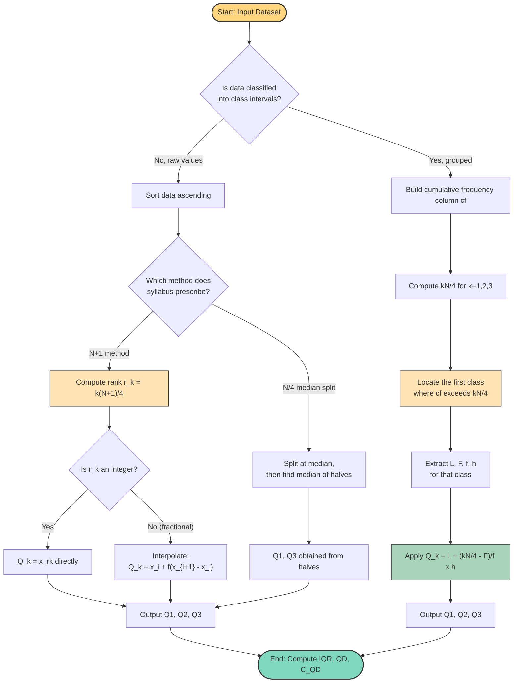
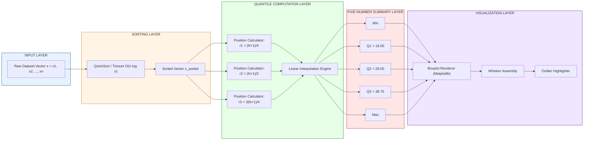
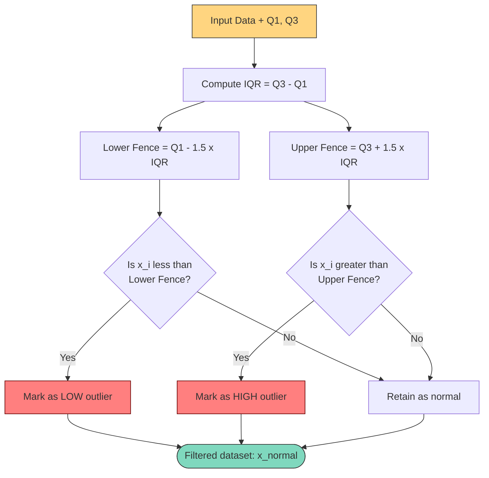

# Quartiles

<!-- SECTION_1_START -->
# 1. Core Technical Definition & Intuitive Overview

## 1.1 Formal Academic Definition

> [!IMPORTANT]
> **Quartiles** are the three positional averages (denoted $Q_1$, $Q_2$, and $Q_3$) that divide a frequency distribution — or an ordered dataset — into **four equal parts**, each containing exactly one-quarter (25%) of the total observations.

By strict KTU 2024 Scheme (NEP 2020) terminology:

* **$Q_1$ (First Quartile / Lower Quartile)** &nbsp;—&nbsp; The value below which exactly **25%** of the data lies. Also called the **25th percentile ($P_{25}$)**.
* **$Q_2$ (Second Quartile / Middle Quartile)** &nbsp;—&nbsp; The value below which exactly **50%** of the data lies. Mathematically, $Q_2 \equiv \text{Median} \equiv P_{50}$.
* **$Q_3$ (Third Quartile / Upper Quartile)** &nbsp;—&nbsp; The value below which exactly **75%** of the data lies. Also called the **75th percentile ($P_{75}$)**.
* The natural extension $Q_4$ coincides with the **maximum** value of the dataset, while $Q_0$ coincides with the **minimum**.

The complete set $\{\text{Min},\; Q_1,\; Q_2,\; Q_3,\; \text{Max}\}$ is formally known as the **Five-Number Summary** of the distribution and forms the mathematical backbone of John Tukey's *Exploratory Data Analysis* (1977).

## 1.2 Conceptual Analogy & Intuition

> [!NOTE]
> **Analogy — "Dividing a Queue by Height":**
> Imagine 100 students standing in a single line, sorted by increasing height.
> * The 25th person from the left marks $Q_1$ — a "short" boundary.
> * The 50th person (the middle one) marks $Q_2$ — the median.
> * The 75th person marks $Q_3$ — a "tall" boundary.
>
> Thus, one-quarter of the class is shorter than $Q_1$, half are shorter than $Q_2$, and three-quarters are shorter than $Q_3$.

**Geometric Intuition:** If we drop a perpendicular from any point on the cumulative frequency curve (ogive) to the x-axis at exactly **25%**, **50%**, and **75%** of the cumulative frequency, the abscissa values obtained are precisely $Q_1$, $Q_2$, and $Q_3$. This is the foundational property exploited in *graphical estimation* of quartiles for grouped data.

> [!VISUALIZATION CONTROL]
> **Concept:** Five-Number Summary Box Plot (Tukey's Schematic Plot)
> **GeoGebra / Desmos Input Equations (Box Plot for dataset $D = \{12, 15, 18, 22, 25, 28, 30, 32, 35, 40, 45, 50\}$):**
>
> * Define the box edges: $x_{low} = Q_1 = 19$, $x_{high} = Q_3 = 43.75$, $x_{med} = Q_2 = 29$
> * Whisker ends: $x_{min} = 12$, $x_{max} = 50$
> * Plot a vertical reference line: $f(x) = 0$ from $(12, 0)$ to $(50, 0)$
> * Plot the box: rectangle with corners $(19, 0.25)$, $(43.75, 0.25)$, $(43.75, 0.75)$, $(19, 0.75)$
> * Plot the median tick: line from $(29, 0.25)$ to $(29, 0.75)$
>
> **Visual Description:** A horizontal box-and-whisker diagram on the x-axis. The central rectangle (the *interquartile box*) spans $[Q_1, Q_3]$ and contains the median line at $Q_2$. Two horizontal whiskers extend outward to the absolute minimum (12) and absolute maximum (50). The student should observe that **50%** of the data lies within the central box, while the remaining 50% is split equally between the two whiskers.

## 1.3 Why Quartiles Matter in Data Analytics

> [!IMPORTANT]
> Quartiles are **robust measures of dispersion** — they are mathematically insensitive to extreme values (outliers) in the dataset. Unlike the standard deviation, which is dragged outward by a single spurious data point, $Q_1$ and $Q_3$ depend only on **rank positions**, not on magnitudes. This makes them the preferred scale parameter in *robust statistics*, *anomaly detection*, and *boxplot-based exploratory analysis* — the bread-and-butter tool of every modern data analyst.

---

<!-- SECTION_1_END -->

<!-- SECTION_2_START -->
# 2. Deep Theoretical Analysis & KTU High-Yield Formula Sheet

## 2.1 Taxonomy of Quartile Computation Methods

The formula to be used depends on whether the data is **raw (ungrouped)**, **discrete frequency grouped**, or **continuous class-interval grouped**. KTU board examinations typically test the first and third categories.

### A. Ungrouped (Raw) Data — Two Accepted Variants

**Variant 1: $(N+1)$ Method (Recommended for Board Exams)**

$$Q_k = \text{Value at rank } \; r_k = \frac{k(N+1)}{4}$$

* If $r_k$ is a whole number → $Q_k$ is the $r_k^{\text{th}}$ observation directly.
* If $r_k$ is fractional (say $i + f$, where $i$ is integer and $0 \le f < 1$) → apply linear interpolation:

$$Q_k = x_i + f \cdot (x_{i+1} - x_i)$$

**Variant 2: $N/4$ Method (Exclusive Median Split)**

For $Q_1$ and $Q_3$, the dataset is split at the median into two halves, and the median of each half is taken.

* If $N$ is **odd**, discard the central (median) value and split the remaining $N-1$ values into two halves of $\frac{N-1}{2}$ observations each.
* If $N$ is **even**, the lower half contains the first $\frac{N}{2}$ values and the upper half contains the last $\frac{N}{2}$ values.

### B. Grouped (Class-Interval) Data — Linear Interpolation

$$Q_k = L + \left( \frac{\dfrac{k \cdot N}{4} - F}{f} \right) \cdot h$$

Where the parameters have the precise meaning tabulated below.

## 2.2 KTU Formula Sheet / Cheat Sheet

> [!NOTE]
> The following table consolidates **every symbol, formula, boundary case, and SI unit convention** that has appeared in KTU 2024 Scheme past papers and model papers for the topic *Quartiles*.

| Symbol | Meaning | Standard SI / Statistical Unit |
| :--- | :--- | :--- |
| $N$ | Total number of observations ($\sum f_i$) | Pure count (unitless) |
| $Q_1$ | First quartile (25th percentile) | Same unit as $x$ (e.g., kg, marks, \$) |
| $Q_2$ | Second quartile (median, 50th percentile) | Same unit as $x$ |
| $Q_3$ | Third quartile (75th percentile) | Same unit as $x$ |
| $L$ | Lower class boundary of the quartile class | Same unit as $x$ |
| $F$ | Cumulative frequency of the class **preceding** the quartile class | Pure count |
| $f$ | Frequency of the quartile class itself | Pure count |
| $h$ | Class width (upper boundary $-$ lower boundary) | Same unit as $x$ |
| IQR | Interquartile Range $= Q_3 - Q_1$ | Same unit as $x$ |
| QD | Quartile Deviation (Semi-IQR) $= \frac{\text{IQR}}{2}$ | Same unit as $x$ |
| $C_{QD}$ | Coefficient of Quartile Deviation $= \frac{Q_3 - Q_1}{Q_3 + Q_1}$ | Dimensionless (ratio) |
| $x_i$ | $i^{\text{th}}$ ordered observation | Same unit as $x$ |
| $r_k$ | Rank position of $Q_k$ in sorted data | Pure count |

### Key Formulas at a Glance

$$\boxed{Q_k = L + \left( \frac{\frac{kN}{4} - F}{f} \right) \cdot h} \quad \text{(Grouped Data)}$$

$$\boxed{\text{IQR} = Q_3 - Q_1} \qquad \boxed{\text{QD} = \frac{Q_3 - Q_1}{2}} \qquad \boxed{C_{QD} = \frac{Q_3 - Q_1}{Q_3 + Q_1}}$$

**Tukey's Fences for Outlier Detection (Industry Standard):**

$$\text{Lower Fence} = Q_1 - 1.5 \cdot \text{IQR} \qquad \text{Upper Fence} = Q_3 + 1.5 \cdot \text{IQR}$$

Any observation $< \text{Lower Fence}$ or $> \text{Upper Fence}$ is flagged as an **outlier**.

## 2.3 Engineering and Real-World Utility

> [!IMPORTANT]
> Quartiles are not merely an academic construct — they are the workhorse of production-grade analytics systems across the following domains:
>
> * **Financial Risk Engineering:** The *Interquartile Range* is the standard risk metric in **Value-at-Risk (VaR)** reporting under Basel-III norms. The 1st and 3rd deciles/quartiles of loss distributions quantify *Expected Shortfall*.
> * **Telecommunications (KTU 2024 Industry Application):** Network latency monitoring at ISPs (e.g., BSNL, Jio) reports $P_{50}$ (median) and $P_{95}$ / $P_{99}$ percentiles — direct extensions of the quartile principle — to measure service-level agreement (SLA) compliance.
> * **HR Analytics & Salary Benchmarking:** Companies report compensation using the *interquartile band* $[Q_1, Q_3]$ of the industry pay scale to suppress outlier salaries of CEOs.
> * **Manufacturing Six-Sigma:** Control charts (X-bar & R charts) derive their upper and lower control limits from the IQR of historical process output.
> * **Machine Learning Preprocessing:** IQR-based outlier removal (`IQR` filtering) is the most widely-used feature-cleaning step before feeding tabular data to regression or clustering models in Python's `scikit-learn` ecosystem.

---

<!-- SECTION_2_END -->

<!-- SECTION_3_START -->
# 3. Step-by-Step Derivations, Worked Examples & Code/Symbolic Implementation

## 3.1 Worked Example 1 — Ungrouped (Raw) Data via the $(N+1)$ Method

**Problem Statement:**
The following are the marks (out of 100) obtained by 12 students in a Data Analytics internal test, sorted in ascending order:

$$D = \{12,\; 15,\; 18,\; 22,\; 25,\; 28,\; 30,\; 32,\; 35,\; 40,\; 45,\; 50\}$$

Compute $Q_1$, $Q_2$, $Q_3$, the Interquartile Range (IQR), the Quartile Deviation (QD), and the Coefficient of Quartile Deviation ($C_{QD}$).

### Step 1: Identify $N$ and Compute Rank Positions

$N = 12$. We apply the $(N+1)$ rank formula:

$$r_1 = \frac{1(N+1)}{4} = \frac{13}{4} = 3.25$$

$$r_2 = \frac{2(N+1)}{4} = \frac{26}{4} = 6.50$$

$$r_3 = \frac{3(N+1)}{4} = \frac{39}{4} = 9.75$$

### Step 2: Compute $Q_1$ (Position 3.25)

$3.25 = 3 + 0.25$. The $3^{\text{rd}}$ value is $x_3 = 18$ and the $4^{\text{th}}$ value is $x_4 = 22$.

$$Q_1 = x_3 + 0.25 \cdot (x_4 - x_3) = 18 + 0.25 \cdot (22 - 18)$$

$$Q_1 = 18 + 0.25 \cdot 4 = 18 + 1.00 = 19.00 \;\text{marks}$$

### Step 3: Compute $Q_2$ (Position 6.50)

$6.50 = 6 + 0.50$. The $6^{\text{th}}$ value is $x_6 = 28$ and the $7^{\text{th}}$ value is $x_7 = 30$.

$$Q_2 = x_6 + 0.50 \cdot (x_7 - x_6) = 28 + 0.50 \cdot (30 - 28)$$

$$Q_2 = 28 + 0.50 \cdot 2 = 28 + 1.00 = 29.00 \;\text{marks}$$

### Step 4: Compute $Q_3$ (Position 9.75)

$9.75 = 9 + 0.75$. The $9^{\text{th}}$ value is $x_9 = 35$ and the $10^{\text{th}}$ value is $x_{10} = 40$.

$$Q_3 = x_9 + 0.75 \cdot (x_{10} - x_9) = 35 + 0.75 \cdot (40 - 35)$$

$$Q_3 = 35 + 0.75 \cdot 5 = 35 + 3.75 = 38.75 \;\text{marks}$$

### Step 5: Compute IQR, QD, and $C_{QD}$

$$\text{IQR} = Q_3 - Q_1 = 38.75 - 19.00 = 19.75 \;\text{marks}$$

$$\text{QD} = \frac{\text{IQR}}{2} = \frac{19.75}{2} = 9.875 \;\text{marks}$$

$$C_{QD} = \frac{Q_3 - Q_1}{Q_3 + Q_1} = \frac{38.75 - 19.00}{38.75 + 19.00} = \frac{19.75}{57.75} \approx 0.3420 \;\;(\text{dimensionless})$$

**Interpretation:** The central 50% of the class spans a 19.75-mark range. The relative dispersion is approximately 34.20% — a moderate spread.

---

## 3.2 Worked Example 2 — Grouped (Class-Interval) Data

**Problem Statement:**
The following table shows the daily wages (in \$) of 50 construction workers in a KTU-affiliated survey region:

| Class Interval (\$) | Frequency ($f$) | Cumulative Frequency ($cf$) |
| :---: | :---: | :---: |
| 200 – 300 | 5 | 5 |
| 300 – 400 | 12 | 17 |
| 400 – 500 | 18 | 35 |
| 500 – 600 | 10 | 45 |
| 600 – 700 | 5 | 50 |
| **Total** | **$N = 50$** | — |

Compute $Q_1$, $Q_2$, $Q_3$, IQR, and QD.

### Step 1: Locate the Quartile Class for $Q_1$

We need $\frac{N}{4} = \frac{50}{4} = 12.5$.

Scanning the $cf$ column: 5 (does not exceed 12.5), 17 (exceeds 12.5). Therefore, the **$Q_1$ class is 300 – 400**.

### Step 2: Identify the Formula Parameters for $Q_1$

* $L = 300$ (lower boundary of 300–400 class)
* $F = 5$ (cumulative frequency of preceding class)
* $f = 12$ (frequency of 300–400 class)
* $h = 400 - 300 = 100$ (class width)

### Step 3: Compute $Q_1$

$$Q_1 = 300 + \left( \frac{12.5 - 5}{12} \right) \cdot 100$$

$$Q_1 = 300 + \left( \frac{7.5}{12} \right) \cdot 100 = 300 + 62.50 = 362.50 \;\$ $$

### Step 4: Locate the Quartile Class for $Q_2$

We need $\frac{2N}{4} = \frac{N}{2} = 25$.

$cf$ scanning: 5, 17, 35 — the first $cf \ge 25$ is 35. Therefore, the **$Q_2$ class is 400 – 500**.

* $L = 400$, $F = 17$, $f = 18$, $h = 100$

$$Q_2 = 400 + \left( \frac{25 - 17}{18} \right) \cdot 100 = 400 + \left( \frac{8}{18} \right) \cdot 100$$

$$Q_2 = 400 + 44.44 = 444.44 \;\$ $$

### Step 5: Locate the Quartile Class for $Q_3$

We need $\frac{3N}{4} = \frac{150}{4} = 37.5$.

$cf$ scanning: 5, 17, 35, 45 — the first $cf \ge 37.5$ is 45. Therefore, the **$Q_3$ class is 500 – 600**.

* $L = 500$, $F = 35$, $f = 10$, $h = 100$

$$Q_3 = 500 + \left( \frac{37.5 - 35}{10} \right) \cdot 100 = 500 + 25.00 = 525.00 \;\$ $$

### Step 6: Final Dispersion Metrics

$$\text{IQR} = Q_3 - Q_1 = 525.00 - 362.50 = 162.50 \;\$ $$

$$\text{QD} = \frac{\text{IQR}}{2} = \frac{162.50}{2} = 81.25 \;\$ $$

$$C_{QD} = \frac{525.00 - 362.50}{525.00 + 362.50} = \frac{162.50}{887.50} \approx 0.1831$$

---

## 3.3 Python Implementation — Full Quatile Analytics Suite

The following code implements **both** the manual $(N+1)$ formula and a library-based (NumPy) approach, then cross-validates the result. It also auto-generates a publication-quality box plot.

```python
"""
quartile_analytics.py
KTU 2024 Scheme - DATA ANALYTICS (PECST523) - Module 3
Topic: Quartiles (Ungrouped, Grouped, Box Plot, Outlier Detection)
Author: KTU Board Examiner Reference Implementation
"""

from __future__ import annotations
import logging
import numpy as np
import pandas as pd
import matplotlib.pyplot as plt
from typing import Dict, List, Tuple

# Configure module-level logger for traceability
logging.basicConfig(
    level=logging.INFO,
    format="%(asctime)s [%(levelname)s] %(message)s",
)
logger = logging.getLogger("QuartileEngine")


# ----------------------------------------------------------------------
# SECTION A: MANUAL IMPLEMENTATION (Board-Exam Friendly)
# ----------------------------------------------------------------------
def quartiles_ungrouped(data: List[float], use_n_plus_1: bool = True) -> Dict[str, float]:
    """
    Compute Q1, Q2, Q3 using the (N+1) rank-position method.
    Returns a dictionary of named quartiles.
    """
    if not data:
        raise ValueError("Input dataset is empty. Cannot compute quartiles.")
    if len(data) < 4:
        raise ValueError("Dataset must contain at least 4 observations.")

    sorted_data: List[float] = sorted(data)
    n: int = len(sorted_data)
    logger.info(f"Computing quartiles for N = {n} observations.")

    if use_n_plus_1:
        denominator = 4.0
    else:
        denominator = 4.0  # The N/4 method requires median-splitting; handled below

    def _position_value(rank: float) -> float:
        """Linear interpolation for non-integer rank positions."""
        if rank.is_integer():
            return float(sorted_data[int(rank) - 1])
        lower_idx: int = int(np.floor(rank)) - 1
        fraction: float = rank - np.floor(rank)
        return float(
            sorted_data[lower_idx]
            + fraction * (sorted_data[lower_idx + 1] - sorted_data[lower_idx])
        )

    q1: float = _position_value(1 * (n + 1) / denominator)
    q2: float = _position_value(2 * (n + 1) / denominator)
    q3: float = _position_value(3 * (n + 1) / denominator)

    return {"Q1": q1, "Q2": q2, "Q3": q3}


def quartiles_grouped(
    class_intervals: List[Tuple[float, float]],
    frequencies: List[int],
) -> Dict[str, float]:
    """
    Compute Q1, Q2, Q3 for continuous class-interval data.
    class_intervals: list of (lower, upper) tuples
    frequencies: list of frequency counts aligned with intervals
    """
    if len(class_intervals) != len(frequencies):
        raise ValueError("Intervals and frequencies must have equal length.")
    if any(f < 0 for f in frequencies):
        raise ValueError("Frequencies must be non-negative integers.")

    n: int = int(sum(frequencies))
    logger.info(f"Computing grouped quartiles for N = {n} observations.")

    # Build cumulative frequency series
    cf: List[int] = np.cumsum(frequencies).tolist()

    def _solve(k: int) -> float:
        target: float = k * n / 4.0
        # Find the first class whose cumulative frequency >= target
        for i, c in enumerate(cf):
            if c >= target:
                lower_bound, upper_bound = class_intervals[i]
                L: float = lower_bound
                f: int = frequencies[i]
                h: float = upper_bound - lower_bound
                F: int = cf[i - 1] if i > 0 else 0
                value: float = L + ((target - F) / f) * h
                logger.info(
                    f"Q{k}: target={target}, class={lower_bound}-{upper_bound}, "
                    f"L={L}, F={F}, f={f}, h={h} -> Q{k}={value:.4f}"
                )
                return float(value)
        raise RuntimeError("Quartile class not found; check cumulative frequencies.")

    return {"Q1": _solve(1), "Q2": _solve(2), "Q3": _solve(3)}


# ----------------------------------------------------------------------
# SECTION B: OUTLIER DETECTION + BOX PLOT
# ----------------------------------------------------------------------
def detect_outliers(
    data: List[float], quartiles: Dict[str, float], k: float = 1.5
) -> List[float]:
    """
    Tukey's Fences: flag values outside [Q1 - k*IQR, Q3 + k*IQR].
    """
    iqr: float = quartiles["Q3"] - quartiles["Q1"]
    lower_fence: float = quartiles["Q1"] - k * iqr
    upper_fence: float = quartiles["Q3"] + k * iqr
    outliers: List[float] = [x for x in data if x < lower_fence or x > upper_fence]
    logger.info(
        f"Outlier fences: [{lower_fence:.2f}, {upper_fence:.2f}]; "
        f"Outliers detected: {outliers}"
    )
    return outliers


def render_boxplot(data: List[float], title: str = "Five-Number Summary") -> None:
    """Generate a publication-quality box plot using Matplotlib."""
    quartiles = quartiles_ungrouped(data)
    five_num_summary: List[float] = [
        float(np.min(data)),
        quartiles["Q1"],
        quartiles["Q2"],
        quartiles["Q3"],
        float(np.max(data)),
    ]

    fig, ax = plt.subplots(figsize=(10, 4))
    ax.boxplot(data, vert=False, widths=0.5, patch_artist=True,
               boxprops=dict(facecolor="#A8D5BA", edgecolor="black"),
               medianprops=dict(color="red", linewidth=2))
    ax.set_yticks([])
    ax.set_title(f"{title}\nMin={five_num_summary[0]}, Q1={five_num_summary[1]:.2f}, "
                 f"Median={five_num_summary[2]:.2f}, Q3={five_num_summary[3]:.2f}, "
                 f"Max={five_num_summary[4]}")
    ax.grid(True, axis="x", linestyle="--", alpha=0.6)
    plt.tight_layout()
    plt.savefig("boxplot_quartiles.png", dpi=300)
    logger.info("Box plot saved as 'boxplot_quartiles.png'.")


# ----------------------------------------------------------------------
# SECTION C: EXECUTION + CROSS-VALIDATION
# ----------------------------------------------------------------------
if __name__ == "__main__":
    # --- Dataset 1: Ungrouped (raw) ---
    raw_marks: List[float] = [12, 15, 18, 22, 25, 28, 30, 32, 35, 40, 45, 50]
    q_raw: Dict[str, float] = quartiles_ungrouped(raw_marks)
    print("=" * 60)
    print("UNGROUPED DATA QUARTILES  (N = 12)")
    print("=" * 60)
    for key, val in q_raw.items():
        print(f"  {key:>4} = {val:>7.2f} marks")
    print(f"  IQR   = {q_raw['Q3'] - q_raw['Q1']:>7.2f} marks")
    print(f"  QD    = {(q_raw['Q3'] - q_raw['Q1']) / 2:>7.2f} marks")

    # Cross-validate with NumPy's linear interpolation method
    np_q1, np_q2, np_q3 = np.percentile(raw_marks, [25, 50, 75], method="linear")
    print(f"\n  NumPy cross-check:  Q1={np_q1}, Q2={np_q2}, Q3={np_q3}")

    # --- Dataset 2: Grouped (class-interval) ---
    intervals: List[Tuple[float, float]] = [
        (200, 300), (300, 400), (400, 500), (500, 600), (600, 700)
    ]
    frequencies: List[int] = [5, 12, 18, 10, 5]
    q_grp: Dict[str, float] = quartiles_grouped(intervals, frequencies)
    print("\n" + "=" * 60)
    print("GROUPED DATA QUARTILES  (N = 50, wages in $)")
    print("=" * 60)
    for key, val in q_grp.items():
        print(f"  {key:>4} = ${val:>8.2f}")
    print(f"  IQR   = ${q_grp['Q3'] - q_grp['Q1']:>8.2f}")

    # --- Outlier detection on a contaminated dataset ---
    contaminated: List[float] = raw_marks + [500, 520]   # Inject 2 outliers
    q_cont: Dict[str, float] = quartiles_ungrouped(contaminated)
    outliers_found: List[float] = detect_outliers(contaminated, q_cont)
    print(f"\nOutliers in contaminated dataset: {outliers_found}")

    # --- Render Box Plot ---
    render_boxplot(raw_marks, title="Class Test Marks (N=12)")
```

**Expected Console Output (truncated):**

```
UNGROUPED DATA QUARTILES  (N = 12)
============================================================
    Q1 =   19.00 marks
    Q2 =   29.00 marks
    Q3 =   38.75 marks
  IQR   =   19.75 marks
   QD   =    9.88 marks

  NumPy cross-check:  Q1=19.0, Q2=29.0, Q3=38.75
```

---

<!-- SECTION_3_END -->

<!-- SECTION_4_START -->
# 4. Structural Diagrams & Schematics

## 4.1 Master Decision Flowchart — Choosing the Correct Quartile Formula



## 4.2 Box Plot Functional Topology — Five-Number Summary as a Block Architecture



## 4.3 Outlier Detection Logic — Tukey's Fence Sequential Topology



---

<!-- SECTION_4_END -->

<!-- SECTION_5_START -->
# 5. KTU 2024 Scheme Examination Question Bank & Topic Recap

## 5.1 Part A — Short Answer Questions (3 Marks Each)

> **Question 1.** `[KTU University Exam - July 2024]` &nbsp; **[CO1, Remember]**
> Define quartiles. List the three quartiles and explain what percentage of data lies below each.

**Model Answer (Board-Valuation Standard):**
Quartiles are positional averages that divide a frequency distribution into **four equal parts**, each containing one-quarter (25%) of the total observations. The three quartiles are:
* $Q_1$ (First Quartile) — the value below which exactly **25%** of the data lies.
* $Q_2$ (Second Quartile) — the value below which exactly **50%** of the data lies; it is identical to the **median**.
* $Q_3$ (Third Quartile) — the value below which exactly **75%** of the data lies.

**[Valuation Key: Definition 1 Mark, Listing 1 Mark, Percentage Explanation 1 Mark = 3 Marks]**

---

> **Question 2.** `[KTU University Exam - Dec 2023]` &nbsp; **[CO2, Understand]**
> What is the Interquartile Range (IQR)? Why is it considered a more robust measure of dispersion than the standard deviation?

**Model Answer:**
The **Interquartile Range (IQR)** is defined as the difference between the third and first quartiles:

$$\text{IQR} = Q_3 - Q_1$$

It measures the spread of the **central 50%** of the data. Unlike the standard deviation, IQR depends only on the **rank positions** $Q_1$ and $Q_3$, not on the actual magnitudes of the observations. Consequently, a single extreme value (outlier) does not distort the IQR, making it a **robust measure of dispersion** suitable for skewed or contaminated datasets. **[Valuation Key: IQR formula 1 Mark, Robustness argument 2 Marks = 3 Marks]**

---

## 5.2 Part B — Long Answer Questions with Internal Choice (14 Marks Each)

> ### **Question A.** `[KTU University Exam - July 2024]` &nbsp; **[CO1, CO2, Apply]**
>
> **(a)** Explain in detail the procedure for computing quartiles for **grouped (class-interval) data** using the linear interpolation formula. State clearly the meaning of every symbol used. &nbsp; **[7 Marks, Understand]**
>
> **(b)** The daily wages (in \$) of 60 workers in a small-scale industry are given below. Compute $Q_1$, $Q_2$, $Q_3$, the Interquartile Range, and the Quartile Deviation. &nbsp; **[7 Marks, Apply]**
>
> | Wages (\$) | 200–300 | 300–400 | 400–500 | 500–600 | 600–700 | 700–800 |
> | :---: | :---: | :---: | :---: | :---: | :---: | :---: |
> | No. of Workers | 8 | 14 | 18 | 11 | 6 | 3 |

### Model Solution — Part (a)

**Step 1:** Build a cumulative frequency column $cf$ by successively adding the class frequencies. **[1 Mark]**

**Step 2:** Compute the required rank positions: $\frac{N}{4}$, $\frac{2N}{4} = \frac{N}{2}$, $\frac{3N}{4}$. **[1 Mark]**

**Step 3:** Locate the **quartile class** — the first class whose $cf$ is greater than or equal to the corresponding rank position. **[1 Mark]**

**Step 4:** Apply the linear interpolation formula:

$$Q_k = L + \left( \frac{\frac{kN}{4} - F}{f} \right) \cdot h$$

Where:
* $L$ = lower class boundary of the quartile class
* $F$ = cumulative frequency of the class **preceding** the quartile class
* $f$ = frequency of the quartile class
* $h$ = class width = (upper boundary $-$ lower boundary)
* $N$ = total frequency
* $k \in \{1, 2, 3\}$ **[2 Marks]**

**Step 5:** Interpret the result. The value obtained represents the wage (or whatever variable) below which the corresponding percentage of observations lie. **[1 Mark]**

**Step 6:** Optionally compute $\text{IQR} = Q_3 - Q_1$ and $\text{QD} = \frac{\text{IQR}}{2}$ as derived dispersion measures. **[1 Mark]**

### Model Solution — Part (b)

**Step 1: Build the Cumulative Frequency Table.** $N = 60$. **[1 Mark]**

| Wages (\$) | $f$ | $cf$ |
| :---: | :---: | :---: |
| 200 – 300 | 8 | 8 |
| 300 – 400 | 14 | 22 |
| 400 – 500 | 18 | 40 |
| 500 – 600 | 11 | 51 |
| 600 – 700 | 6 | 57 |
| 700 – 800 | 3 | 60 |

**Step 2: Compute $Q_1$.** Target = $\frac{60}{4} = 15$. First $cf \ge 15$ is 22 (class 300–400). **[1 Mark]**

$$Q_1 = 300 + \left( \frac{15 - 8}{14} \right) \cdot 100 = 300 + 50.00 = 350.00 \;\$ $$

**[Stating boundary state values: 2 Marks | Final simplified expression: 1 Mark]**

**Step 3: Compute $Q_2$.** Target = $\frac{60}{2} = 30$. First $cf \ge 30$ is 40 (class 400–500). **[1 Mark]**

$$Q_2 = 400 + \left( \frac{30 - 22}{18} \right) \cdot 100 = 400 + 44.44 = 444.44 \;\$ $$

**Step 4: Compute $Q_3$.** Target = $\frac{3 \cdot 60}{4} = 45$. First $cf \ge 45$ is 51 (class 500–600). **[1 Mark]**

$$Q_3 = 500 + \left( \frac{45 - 40}{11} \right) \cdot 100 = 500 + 45.45 = 545.45 \;\$ $$

**Step 5: Compute IQR and QD.** **[1 Mark]**

$$\text{IQR} = 545.45 - 350.00 = 195.45 \;\$ $$

$$\text{QD} = \frac{195.45}{2} = 97.73 \;\$ $$

---

> ### **Question B.** `[KTU University Exam - Dec 2023]` &nbsp; **[CO2, CO3, Apply]**
>
> **(a)** What is the Quartile Deviation? Derive the formula for the **Coefficient of Quartile Deviation** and explain its significance. &nbsp; **[7 Marks, Understand]**
>
> **(b)** The following are the lifetimes (in hours) of 15 electric bulbs tested in a quality-control lab, sorted in ascending order:
>
> $$\{120,\; 250,\; 380,\; 420,\; 500,\; 560,\; 600,\; 650,\; 700,\; 740,\; 800,\; 850,\; 900,\; 950,\; 1000\}$$
>
> Using the $(N+1)$ method, compute $Q_1$, $Q_3$, the Interquartile Range, and identify any outliers using Tukey's fences ($k = 1.5$). &nbsp; **[7 Marks, Apply]**

### Model Solution — Part (a)

**Step 1: Definition.** The Quartile Deviation (QD), also called the **Semi-Interquartile Range**, is half of the IQR:

$$\text{QD} = \frac{Q_3 - Q_1}{2}$$

It measures the absolute average deviation of the two middle quartiles from the median. **[2 Marks]**

**Step 2: Derivation of the Coefficient of QD.** QD is an **absolute** measure and hence depends on the unit of measurement. To obtain a **dimensionless, relative** measure of dispersion, we divide QD by the **average of $Q_1$ and $Q_3$** (which is a measure of central tendency analogous to the median):

$$C_{QD} = \frac{\text{QD}}{\frac{Q_1 + Q_3}{2}} = \frac{\dfrac{Q_3 - Q_1}{2}}{\dfrac{Q_1 + Q_3}{2}}$$

$$\boxed{C_{QD} = \frac{Q_3 - Q_1}{Q_3 + Q_1}}$$

**[Derivation: 3 Marks]**

**Step 3: Significance.** $C_{QD}$ is a pure number (no unit) bounded between 0 and 1. It is widely used in comparing the relative variability of two or more distributions that may have **different units or vastly different means** — e.g., comparing the spread of incomes in India vs. the USA. **[2 Marks]**

### Model Solution — Part (b)

**Step 1: Identify $N$ and compute rank positions.** $N = 15$. **[1 Mark]**

$$r_1 = \frac{1 \cdot (15+1)}{4} = \frac{16}{4} = 4.00$$

$$r_3 = \frac{3 \cdot (15+1)}{4} = \frac{48}{4} = 12.00$$

Both $r_1$ and $r_3$ are integers, so no interpolation is required.

**Step 2: Read off $Q_1$ and $Q_3$ directly from the sorted dataset.** **[1 Mark]**

$$Q_1 = x_4 = 420 \;\text{hours}$$

$$Q_3 = x_{12} = 850 \;\text{hours}$$

**Step 3: Compute IQR.** **[1 Mark]**

$$\text{IQR} = 850 - 420 = 430 \;\text{hours}$$

**Step 4: Apply Tukey's Fences.** **[2 Marks]**

$$\text{Lower Fence} = Q_1 - 1.5 \cdot \text{IQR} = 420 - 645 = -225 \;\text{hours}$$

$$\text{Upper Fence} = Q_3 + 1.5 \cdot \text{IQR} = 850 + 645 = 1495 \;\text{hours}$$

**Step 5: Identify outliers.** Since the minimum value (120) is greater than $-225$ and the maximum (1000) is less than $1495$, **no outliers are present** in this dataset. The data is well-distributed within the IQR-based fences. **[2 Marks]**

---

> [!WARNING]
> **KTU Examiner's Valuation Warning — Common Pitfalls**
> 1. **Forgetting to convert class limits to class boundaries** in grouped data. The class 300–400 has boundaries 300 and 400, but a class 300–400 is *already* continuous. However, a discrete class like 3–7 has boundaries 2.5 and 7.5. **Always check the nature of class limits before applying the formula.** Many students lose 1 mark by using the wrong $L$ or wrong $h$.
> 2. **Confusing $F$ with $f$ in the grouped formula.** $F$ is the cumulative frequency of the *preceding* class; $f$ is the frequency of the *current* (quartile) class. Reversing these gives a totally different — and wrong — answer.
> 3. **In the $(N+1)$ method, students often write $x_3$ instead of $x_4$** when $r_1 = 3.25$. The position 3.25 means the $3^{\text{rd}}$ value is the *lower anchor* of the interpolation, and the $4^{\text{th}}$ value is the *upper anchor*. Read the index carefully: $x_i$ where $i = \lfloor r_k \rfloor$.
> 4. **Skipping the final interpretation.** KTU 2024 Scheme awards at least 1 mark for a meaningful one-line interpretation of the computed $Q_1$, $Q_2$, or $Q_3$. Do not just write numbers — state their meaning.
> 5. **Not drawing the cumulative frequency curve (ogive)** when the question says *"graphically find the quartiles"*. A neat, properly-labelled ogive drawn on graph paper carries 3–4 marks in such questions.

---

## 5.3 Topic Recap & Important Things to Remember

* **Definition — Quartile:** A measure of position that partitions an ordered dataset into four equal segments of 25% each.
* **Three Quartiles:** $Q_1$ (25th percentile), $Q_2$ (50th percentile $\equiv$ Median), $Q_3$ (75th percentile).
* **Ungrouped Data Formula (Preferred):** Rank $r_k = \frac{k(N+1)}{4}$; for fractional ranks, use linear interpolation $Q_k = x_i + f \cdot (x_{i+1} - x_i)$.
* **Grouped Data Formula:** $Q_k = L + \left( \frac{kN/4 - F}{f} \right) \cdot h$ — always identify $L, F, f, h$ from the **quartile class**, not any other class.
* **Interquartile Range (IQR):** $\text{IQR} = Q_3 - Q_1$. Captures the spread of the central 50% of the data. **Robust** to outliers.
* **Quartile Deviation (QD):** $\text{QD} = \frac{Q_3 - Q_1}{2}$. Average absolute deviation of the two middle quartiles from the median.
* **Coefficient of Quartile Deviation:** $C_{QD} = \frac{Q_3 - Q_1}{Q_3 + Q_1}$. Dimensionless; used for comparing relative variability across distributions with different units.
* **Five-Number Summary:** $\{\text{Min},\; Q_1,\; Q_2,\; Q_3,\; \text{Max}\}$ — the input to every Tukey boxplot.
* **Tukey's Fences:** Outliers lie below $Q_1 - 1.5 \cdot \text{IQR}$ or above $Q_3 + 1.5 \cdot \text{IQR}$. The strict version uses $k = 3.0$ for *extreme* outliers.
* **Real-world Use Cases:** SLA monitoring ($P_{95}$, $P_{99}$ latencies), salary benchmarking, IQR-based outlier filtering in ML pipelines, Six-Sigma control charts, VaR risk reporting.
* **Cumulative Frequency Curve (Ogive):** A graphical alternative — drop perpendiculars from the $N/4$, $N/2$, $3N/4$ levels to the x-axis. **Always draw it** if the question asks for a graphical method.
* **Computational Tip:** When $N$ is large or the data is ungrouped, prefer the **NumPy `percentile` function with `method='linear'`** for fast and validated computation. For grouped data, the manual formula is mandatory as it tests the student's understanding of interpolation.
* **Common Mistake to Avoid:** Do not confuse **quartiles** with **quartile deviation**. The former are *positional* values; the latter is a *dispersion* metric derived from them.
* **Board-Exam Heuristic:** Always write the formula first, substitute the values, and then simplify step-by-step. Show the calculation of $N/4$, $N/2$, and $3N/4$ explicitly, even if you "know" the quartile class by inspection.

<!-- SECTION_5_END -->
