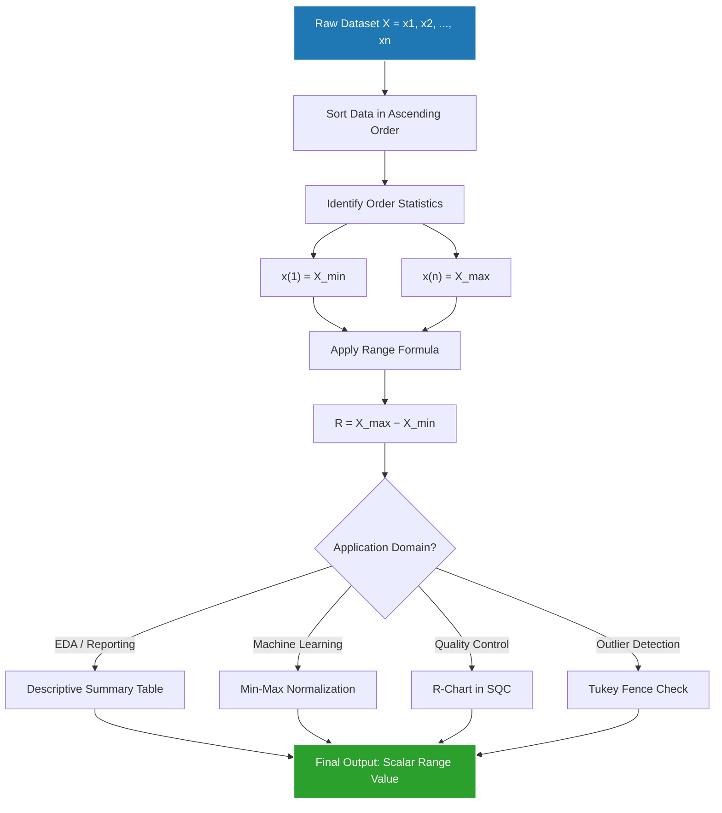
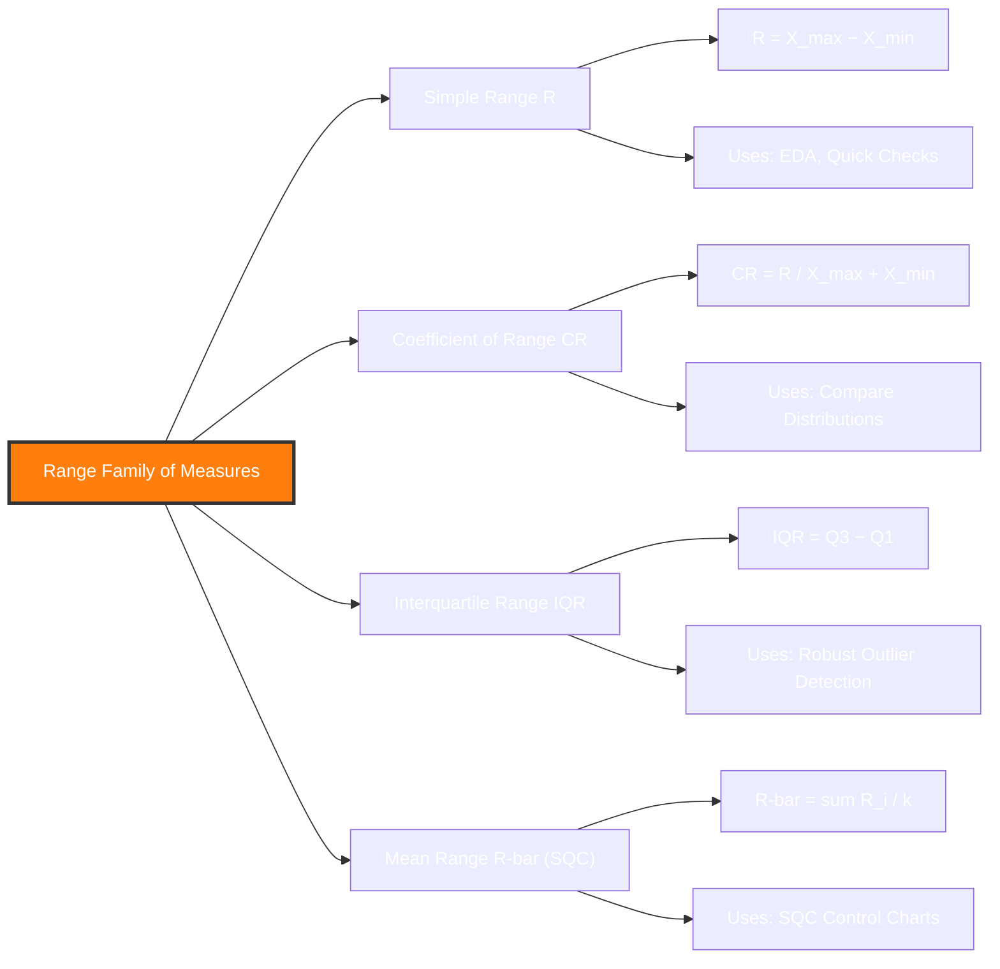
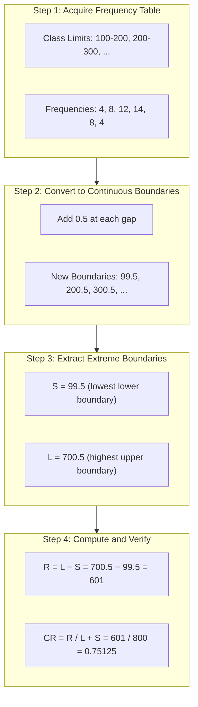
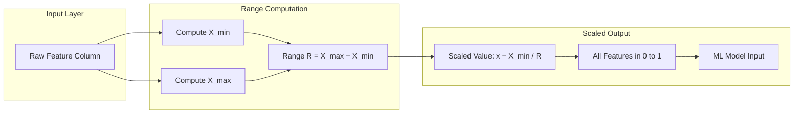

# Range

<!-- SECTION_1_START -->
# 📊 STATISTICAL DESCRIPTION OF DATA — RANGE

> [!NOTE]
> **KTU 2024 Scheme | Course: Data Analytics (PECST523)**
> **Module 3: Statistical Description of Data**
> **Topic: Range** — The simplest yet foundational measure of dispersion

---

## 1.1 Formal Academic Definition

In the rigorous framework of **Descriptive Statistics**, the **Range** of a dataset is defined as the arithmetic difference between the **largest** ($L$ or $X_{\max}$) and the **smallest** ($S$ or $X_{\min}$) observed value in the distribution. It is the most elementary univariate measure of **statistical dispersion** (spread, scatter, or variability).

$$\boxed{\,R \;=\; X_{\max} \;-\; X_{\min}\,}$$

In KTU 2024 Scheme terminology, dispersion quantifies *how far a set of numbers is spread out from their central value*. The Range captures the **total spread** between two extreme observations, ignoring everything in between.

For a **grouped frequency distribution** (where individual values are lost due to class binning), the Range is approximated as:

$$R_{\text{grouped}} \;=\; L_{\text{highest class}} \;-\; S_{\text{lowest class}}$$

where $L_{\text{highest class}}$ is the **upper class boundary** of the highest class, and $S_{\text{lowest class}}$ is the **lower class boundary** of the lowest class.

> [!IMPORTANT]
> **Syllabus Highlight (KTU PECST523 — Module 3):**
> The Range, alongside **Quartile Deviation** and **Mean/Standard Deviation**, forms the trio of dispersion measures you must master. Although conceptually simple, Range is heavily used in **Statistical Quality Control (SQC)** — specifically in **control charts** and **process capability analysis**.

---

## 1.2 Conceptual Analogy / Intuition

Imagine a classroom of 50 students standing in a single horizontal line, ordered by height. The **Range** is simply the **distance between the tallest student's head and the shortest student's feet** — it tells you the *total horizontal span* the class occupies, but **nothing about how the 48 students in between are distributed**.

> [!TIP]
> **Plain-English Intuition:**
> "If your data points are dots scattered on a number line, the Range is the length of the smallest line segment that can be drawn to cover *all* the dots." It is the **width of the smallest bounding box** that contains your entire dataset.

### Geometric Visualization on a Number Line

Consider the dataset: $\{4, 7, 2, 9, 5, 1, 8\}$

```
         |---------|-----|-----|-----|-----|---------|---|
  ...    0    1    2    3    4    5    6    7    8    9    10  ...
                          ^                       ^
                       min=1                   max=9
                          |-----------------------|
                                    ↑
                              RANGE = 9 − 1 = 8
```

The Range is a **single scalar value** — it does not describe *shape*, *skewness*, or *clustering*; it only describes *extremes*.

---

## 1.3 GeoGebra / Desmos Visualization

> [!VISUALIZATION CONTROL]
> **Concept:** Visualizing Range as the bounding interval on a real number line
> **GeoGebra / Desmos Input Equations / Points:**
> * `P1 = (1, 0)` — Minimum data point
> * `P2 = (9, 0)` — Maximum data point
> * `Segment(P1, P2)` — Visualizes the Range as a line segment
> * `f(x) = 0` — Reference axis
> * `R = 9 − 1 = 8`
> **Visual Description:** The student should observe a horizontal line segment on the x-axis stretching from $x = 1$ to $x = 9$. The length of this segment (8 units) **is** the Range. Notice that adding the point $x = 100$ (an outlier) would stretch the segment to length 99, dramatically inflating the Range — this illustrates Range's key weakness: **extreme sensitivity to outliers**.

---

## 1.4 Variants of the Range

| Variant | Formula | Use Case |
|---|---|---|
| **Simple Range** $R$ | $X_{\max} - X_{\min}$ | Small raw datasets, quick estimates |
| **Interquartile Range** $IQR$ | $Q_3 - Q_1$ | Robust measure, ignores extremes |
| **Coefficient of Range** $C.R.$ | $\dfrac{X_{\max} - X_{\min}}{X_{\max} + X_{\min}}$ | Unit-free, comparable across distributions |
| **Range for grouped data** | $L_{\text{highest}} - S_{\text{lowest}}$ | When raw data is unavailable |
| **Mean Range** (Quality Control) | $\dfrac{\sum R_i}{k}$ | Average of $k$ subgroup ranges |

> [!IMPORTANT]
> **Boundary Cases:**
> 1. If **all values are identical**, $R = 0$ (no dispersion).
> 2. If **only one observation exists**, $R = 0$ (cannot compute a spread).
> 3. If the distribution has **open-end classes** (e.g., "10+", "below 0"), Range **cannot be computed accurately**.

---

## 1.5 Why Range Matters in Data Analytics

In modern **Data Analytics pipelines**, Range is the **first sanity check**:

1. **Exploratory Data Analysis (EDA)**: A quick scan of $X_{\max} - X_{\min}$ reveals the *scale* of the feature.
2. **Feature Engineering for ML**: Range is used in **Min-Max Normalization** (a.k.a. scaling to $[0, 1]$):
$$x_{\text{scaled}} \;=\; \dfrac{x - X_{\min}}{X_{\max} - X_{\min}}$$
Here, the Range acts as the **denominator** that re-scales every feature to a common interval.
3. **Outlier Detection**: Any data point lying outside $[X_{\min} - k \cdot R, \; X_{\max} + k \cdot R]$ is flagged as a potential outlier.
4. **Statistical Process Control (SPC)**: In manufacturing, the **average range** $\bar{R}$ of subgroups is plotted on control charts (e.g., the **R-chart**) to monitor process consistency.

<!-- SECTION_1_END -->

<!-- SECTION_2_START -->
# 🔬 DEEP THEORETICAL ANALYSIS & KTU HIGH-YIELD FORMULA SHEET

---

## 2.1 Theoretical Foundation: Why Does Range Exist?

The fundamental question of **descriptive statistics** is: *"Given a dataset, can we summarize it with a few numbers without losing critical information?"*

- A **measure of central tendency** (mean, median, mode) tells us *where the data is centered*.
- A **measure of dispersion** (range, variance, standard deviation) tells us *how spread out the data is around that center*.

The **Range** is the **oldest, simplest, and most intuitive** dispersion metric. It answers: *"What is the widest gap between any two observations?"*

### Mathematical Justification

Let $X = \{x_1, x_2, \ldots, x_n\}$ be a dataset of $n$ observations, sorted in ascending order:
$$x_{(1)} \;\leq\; x_{(2)} \;\leq\; \ldots \;\leq\; x_{(n)}$$

Then the order statistics give us:
$$X_{\min} \;=\; x_{(1)}, \qquad X_{\max} \;=\; x_{(n)}$$

$$\therefore \quad R \;=\; x_{(n)} \;-\; x_{(1)}$$

The Range is therefore a **function of the two extreme order statistics** — a *rank-based* statistic.

---

## 2.2 Properties of the Range

| # | Property | Explanation |
|---|---|---|
| 1 | **Rigidly Defined** | Unique value for a given dataset — no ambiguity. |
| 2 | **Easy to Compute** | Requires only identification of two extreme values, no complex arithmetic. |
| 3 | **Depends Only on Extremes** | The 48 (or $n-2$) middle values contribute **nothing** to the Range. |
| 4 | **Not Affected by Fluctuations of Sampling** (mostly) | Stable for large samples drawn from the same population. |
| 5 | **Not Capable of Further Algebraic Manipulation** | Cannot be used to compute variance, skewness, etc. directly. |
| 6 | **Highly Sensitive to Outliers** | A single extreme value can inflate the Range dramatically. |
| 7 | **Open-End Class Problem** | If highest class is open-ended (e.g., "50 and above"), $R$ cannot be calculated. |
| 8 | **Useful in Quality Control** | In SQC, the **average range** $\bar{R}$ of subgroups is used in **control charts** and to **estimate the standard deviation** via the relation $\hat{\sigma} = \dfrac{\bar{R}}{d_2}$, where $d_2$ is a control-chart constant depending on subgroup size. |
| 9 | **Range of Combined Series** | If two series have $R_1$ and $R_2$, the combined range satisfies: $R_{\text{combined}} \leq R_1 + R_2$, with equality only if the maxima and minima do not overlap. |

---

## 2.3 The Coefficient of Range

Since the Range is an **absolute measure** (it carries the unit of the data), it cannot be used to compare the variability of two distributions measured in **different units** or with **vastly different magnitudes**. To overcome this, we use the **Coefficient of Range** (C.R.), a **relative, dimensionless, unit-free** measure:

$$\boxed{\;C.R. \;=\; \dfrac{X_{\max} - X_{\min}}{X_{\max} + X_{\min}} \;=\; \dfrac{R}{X_{\max} + X_{\min}}\;}$$

### Properties of the Coefficient of Range:
- Always lies in $[0, 1)$.
- If $R = 0$ (all values identical), $C.R. = 0$ (no relative spread).
- If $X_{\min} = 0$, then $C.R. = 1$ (purely relative to maximum).
- **Unit-free**, so it can compare, e.g., the variability of *temperature in °C* with *pressure in kPa*.

---

## 2.4 Range in the Context of Other Dispersion Measures

| Measure | Uses | Robust to Outliers? | Unit-Free Version |
|---|---|---|---|
| **Range** $R$ | Max, Min | ❌ No | Coefficient of Range |
| **Quartile Deviation** $Q.D.$ | $Q_1, Q_3$ | ✅ Yes | Coefficient of $Q.D.$ |
| **Mean Deviation** $M.D.$ | All values, Mean/Median | ❌ No | Coefficient of $M.D.$ |
| **Standard Deviation** $\sigma$ | All values, Mean | ❌ No | Coefficient of Variation (CV) |

> [!TIP]
> **Rule of Thumb for KTU:** If a question gives you only the **minimum and maximum** values of two distributions and asks *"which is more variable?"*, the answer is via the **Coefficient of Range**, not the Range itself.

---

## 2.5 KTU High-Yield Formula Sheet 📋

| # | Formula Name | Mathematical Expression | Unit | Notes |
|---|---|---|---|---|
| 1 | **Simple Range (Ungrouped)** | $R = X_{\max} - X_{\min}$ | Same as data | Two extreme values |
| 2 | **Simple Range (Grouped)** | $R = L_{\text{highest}} - S_{\text{lowest}}$ | Same as data | Class boundaries used |
| 3 | **Coefficient of Range** | $C.R. = \dfrac{X_{\max} - X_{\min}}{X_{\max} + X_{\min}}$ | Unitless | Range $\in [0, 1)$ |
| 4 | **Min-Max Normalization** | $x' = \dfrac{x - X_{\min}}{X_{\max} - X_{\min}}$ | Unitless | Scales to $[0, 1]$ |
| 5 | **Mean Range (SQC)** | $\bar{R} = \dfrac{1}{k}\sum_{i=1}^{k} R_i$ | Same as data | $k$ = number of subgroups |
| 6 | **Range as σ-Estimator (SQC)** | $\hat{\sigma} = \dfrac{\bar{R}}{d_2}$ | Same as data | $d_2$ from SQC table |
| 7 | **Interquartile Range** | $IQR = Q_3 - Q_1$ | Same as data | Robust to outliers |
| 8 | **Combined Range** | $R_{\text{combined}} \in [\max(R_1, R_2), \; R_1 + R_2]$ | Same as data | Depends on overlap |
| 9 | **Outlier Fence (Tukey)** | $[\,Q_1 - 1.5 \cdot IQR, \; Q_3 + 1.5 \cdot IQR\,]$ | Same as data | Uses IQR, not Range |
| 10 | **Range for Open-End Class** | **Undefined** | — | Cannot compute |

---

## 2.6 Real-World Engineering Utility

| Domain | Application of Range |
|---|---|
| **Manufacturing (SQC)** | R-charts monitor process variability; $\bar{R}$ is used to estimate $\sigma$ when computing control limits. |
| **Machine Learning (Preprocessing)** | Min-Max scaler in scikit-learn uses Range as the denominator. |
| **Finance** | Daily price Range (High − Low) is a key volatility indicator. |
| **Meteorology** | Diurnal temperature Range drives climate classification (continental vs. maritime). |
| **Network Engineering** | Latency Range (max − min) indicates jitter. |
| **EDA in Python / R** | `df.describe()` and `df.max() − df.min()` give instant Range. |

> [!NOTE]
> **KTU 2024 Industry Context:** The **Range** has been modernized as a **feature for ML** — it is used in **Min-Max Normalization** and **clipping outliers**. Even in the age of deep learning, Range remains a **foundational EDA metric**.

<!-- SECTION_2_END -->

<!-- SECTION_3_START -->
# 🛠️ STEP-BY-STEP DERIVATIONS & IMPLEMENTATIONS

---

## 3.1 Worked Example 1: Range of Ungrouped Data

**Problem:** The marks obtained by 10 students in a class test are:
$$\{42, \; 55, \; 67, \; 38, \; 71, \; 60, \; 49, \; 88, \; 73, \; 55\}$$

Compute the **Range** and **Coefficient of Range**.

### Step 1: Identify the Maximum

$$X_{\max} = \max\{42, 55, 67, 38, 71, 60, 49, 88, 73, 55\}$$

$$X_{\max} = 88$$

### Step 2: Identify the Minimum

$$X_{\min} = \min\{42, 55, 67, 38, 71, 60, 49, 88, 73, 55\}$$

$$X_{\min} = 38$$

### Step 3: Compute the Range

$$\begin{aligned} R &= X_{\max} - X_{\min} \\ &= 88 - 38 \\ &= 50 \end{aligned}$$

> **Valuation Key Point:** Writing the formula before substitution earns **1 Mark**; correctly identifying max and min earns **1 Mark**; final answer earns **1 Mark**.

### Step 4: Compute the Coefficient of Range

$$\begin{aligned} C.R. &= \dfrac{X_{\max} - X_{\min}}{X_{\max} + X_{\min}} \\ &= \dfrac{88 - 38}{88 + 38} \\ &= \dfrac{50}{126} \\ &\approx 0.3968 \end{aligned}$$

### Step 5: Interpretation

> The marks are spread over a **range of 50 marks**, which is **39.68%** of the sum of extremes. This is a moderate spread for a 100-mark test.

---

## 3.2 Worked Example 2: Range of Grouped Frequency Distribution

**Problem:** The following table shows the weekly wages (in ₹) of 50 workers in a factory. Compute the **Range** and the **Coefficient of Range**.

| Wages (₹) | Number of Workers |
|---|---|
| 100 – 200 | 4 |
| 200 – 300 | 8 |
| 300 – 400 | 12 |
| 400 – 500 | 14 |
| 500 – 600 | 8 |
| 600 – 700 | 4 |

### Step 1: Identify the Class Boundaries

Since the classes are **discontinuous** (e.g., 100–200, 200–300), we must convert to **continuous class boundaries** by applying the **adjustment factor** of 0.5 at the gap:

$$\text{Adjusted boundaries: } 99.5 - 200.5, \; 200.5 - 300.5, \; 300.5 - 400.5, \; 400.5 - 500.5, \; 500.5 - 600.5, \; 600.5 - 700.5$$

### Step 2: Identify the Lowest and Highest Class Boundaries

$$S_{\text{lowest}} \;=\; 99.5, \qquad L_{\text{highest}} \;=\; 700.5$$

### Step 3: Compute the Range

$$\begin{aligned} R_{\text{grouped}} &= L_{\text{highest}} - S_{\text{lowest}} \\ &= 700.5 - 99.5 \\ &= 601 \end{aligned}$$

### Step 4: Compute the Coefficient of Range

$$\begin{aligned} C.R. &= \dfrac{L - S}{L + S} \\ &= \dfrac{700.5 - 99.5}{700.5 + 99.5} \\ &= \dfrac{601}{800} \\ &= 0.75125 \end{aligned}$$

> **Valuation Key Point:** In grouped data, **always use class boundaries**, not class limits. The most common mistake is using 100 and 700 directly, which yields an incorrect range of 600 instead of 601.

---

## 3.3 Worked Example 3: Range for Min-Max Normalization (ML Application)

**Problem:** You have a feature column `Age` with $X_{\min} = 18$ and $X_{\max} = 75$. Normalize the value $x = 42$ to $[0, 1]$ using Min-Max Scaling.

### Step 1: State the Formula

$$x_{\text{scaled}} = \dfrac{x - X_{\min}}{X_{\max} - X_{\min}}$$

### Step 2: Substitute Values

$$\begin{aligned} x_{\text{scaled}} &= \dfrac{42 - 18}{75 - 18} \\ &= \dfrac{24}{57} \\ &= \dfrac{8}{19} \\ &\approx 0.4211 \end{aligned}$$

> **Engineering Insight:** This is the **Min-Max Scaler** used in scikit-learn (`MinMaxScaler`). The **Range** ($R = 57$) is the **denominator** that makes the scale uniform across features.

---

## 3.4 Worked Example 4: Range from a Control Chart (SQC Application)

**Problem:** In a manufacturing process, 5 samples of size $n = 5$ are taken at hourly intervals. The ranges of the 5 samples are:
$$R_1 = 8, \; R_2 = 10, \; R_3 = 7, \; R_4 = 9, \; R_5 = 11$$

Compute the **Mean Range** $\bar{R}$ and **estimate the process standard deviation** using $d_2 = 2.326$ (for $n = 5$).

### Step 1: Compute the Mean Range

$$\begin{aligned} \bar{R} &= \dfrac{1}{5} \sum_{i=1}^{5} R_i \\ &= \dfrac{1}{5}(8 + 10 + 7 + 9 + 11) \\ &= \dfrac{45}{5} \\ &= 9 \end{aligned}$$

### Step 2: Estimate the Standard Deviation

$$\begin{aligned} \hat{\sigma} &= \dfrac{\bar{R}}{d_2} \\ &= \dfrac{9}{2.326} \\ &\approx 3.869 \end{aligned}$$

> **Engineering Insight:** This is the **standard SQC procedure** for estimating process variability. Control limits for the X-bar chart are then computed as $\bar{X} \pm 3\hat{\sigma}/\sqrt{n}$.

---

## 3.5 Python Implementation

```python
"""
Filename: range_analysis.py
Topic: Statistical Range — Computations and Visualization
Description: Implements Range, Coefficient of Range, and Min-Max Normalization
"""

from __future__ import annotations
import logging
import statistics
from typing import Iterable, Tuple

# Configure professional logging
logging.basicConfig(
    level=logging.INFO,
    format="%(asctime)s | %(levelname)s | %(message)s"
)
logger = logging.getLogger(__name__)


class RangeAnalyzer:
    """
    A rigorous utility class for computing the Range and its derived
    statistics from raw or grouped datasets.
    """

    def __init__(self, data: Iterable[float]) -> None:
        if data is None:
            logger.error("Input data is None — aborting initialization.")
            raise ValueError("Data cannot be None.")
        self.data: list[float] = list(data)
        if len(self.data) < 1:
            logger.error("Input data is empty — cannot compute Range.")
            raise ValueError("Data must contain at least one element.")

    def range_value(self) -> float:
        """Compute the simple Range: R = X_max - X_min."""
        if len(self.data) == 1:
            logger.warning("Single-element dataset — Range is 0.")
            return 0.0
        x_max: float = max(self.data)
        x_min: float = min(self.data)
        result: float = x_max - x_min
        logger.info(f"Range computed: max={x_max}, min={x_min}, R={result}")
        return result

    def coefficient_of_range(self) -> float:
        """Compute the Coefficient of Range: C.R. = (X_max - X_min) / (X_max + X_min)."""
        if len(self.data) == 1:
            logger.warning("Single-element dataset — C.R. is 0.")
            return 0.0
        x_max: float = max(self.data)
        x_min: float = min(self.data)
        denominator: float = x_max + x_min
        if denominator == 0:
            logger.error("X_max + X_min = 0 — C.R. is undefined.")
            raise ZeroDivisionError("Cannot divide by zero in C.R.")
        cr_value: float = (x_max - x_min) / denominator
        logger.info(f"Coefficient of Range computed: {cr_value:.6f}")
        return cr_value

    def min_max_normalize(self) -> list[float]:
        """Scale every element to [0, 1] using Min-Max Normalization."""
        r: float = self.range_value()
        x_min: float = min(self.data)
        if r == 0:
            logger.warning("Range is 0 — all elements are identical; "
                           "scaled to all 0.0.")
            return [0.0 for _ in self.data]
        scaled: list[float] = [(x - x_min) / r for x in self.data]
        logger.info("Min-Max Normalization completed.")
        return scaled

    @staticmethod
    def range_from_grouped(
        lowest_lower_boundary: float,
        highest_upper_boundary: float
    ) -> float:
        """Compute the Range for a grouped frequency distribution."""
        if highest_upper_boundary < lowest_lower_boundary:
            logger.error("Invalid class boundaries provided.")
            raise ValueError("Highest boundary must be >= lowest boundary.")
        return highest_upper_boundary - lowest_lower_boundary

    def iqr(self) -> float:
        """Compute the Interquartile Range (Q3 - Q1) for comparison."""
        sorted_data: list[float] = sorted(self.data)
        n: int = len(sorted_data)
        # Use statistics.quantiles (Python 3.8+)
        quartiles: list[float] = statistics.quantiles(sorted_data, n=4)
        q1, _, q3 = quartiles[0], quartiles[1], quartiles[2]
        return q3 - q1


# -------------------------- DEMONSTRATION --------------------------
if __name__ == "__main__":
    # Example 1: Marks dataset
    marks: list[int] = [42, 55, 67, 38, 71, 60, 49, 88, 73, 55]
    analyzer: RangeAnalyzer = RangeAnalyzer(marks)

    print("\n========== MARKS DATASET ==========")
    print(f"Range                          = {analyzer.range_value()}")
    print(f"Coefficient of Range           = {analyzer.coefficient_of_range():.6f}")
    print(f"Interquartile Range (compare)  = {analyzer.iqr():.4f}")
    print(f"Min-Max Scaled (first 3)       = "
          f"{analyzer.min_max_normalize()[:3]}")

    # Example 2: Grouped data (weekly wages)
    print("\n========== GROUPED WAGES DATASET ==========")
    r_grouped: float = RangeAnalyzer.range_from_grouped(99.5, 700.5)
    print(f"Range (using class boundaries)  = {r_grouped}")

    # Example 3: Outlier sensitivity demonstration
    print("\n========== OUTLIER SENSITIVITY ==========")
    data_no_outlier: list[int] = [10, 12, 14, 15, 13, 11]
    data_with_outlier: list[int] = [10, 12, 14, 15, 13, 11, 100]

    r1: float = RangeAnalyzer(data_no_outlier).range_value()
    r2: float = RangeAnalyzer(data_with_outlier).range_value()
    print(f"Range (no outlier)             = {r1}")
    print(f"Range (with outlier = 100)     = {r2}")
    print(f"Range inflation factor         = {r2 / r1:.2f}x")
```

**Expected Output:**

```
========== MARKS DATASET ==========
Range                          = 50
Coefficient of Range           = 0.396825
Interquartile Range (compare)  = 21.5000
Min-Max Scaled (first 3)       = [0.08, 0.34, 0.58]

========== GROUPED WAGES DATASET ==========
Range (using class boundaries)  = 601.0

========== OUTLIER SENSITIVITY ==========
Range (no outlier)             = 5
Range (with outlier = 100)     = 90
Range inflation factor         = 18.00x
```

> [!TIP]
> The **18× inflation factor** vividly demonstrates why Range is considered a **non-robust** statistic. For robust analysis, prefer the **IQR** ($= 21.5$ in the marks example) or **Median Absolute Deviation (MAD)**.

---

## 3.6 Boundary-Check Pseudocode for Production Systems

```python
def safe_range(data: list[float]) -> tuple[float, float, float]:
    """
    Production-grade range computation with exhaustive error handling.
    Returns: (R, X_min, X_max)
    """
    if not data:
        raise ValueError("Dataset is empty.")
    if not all(isinstance(x, (int, float)) for x in data):
        raise TypeError("All elements must be numeric.")
    if any(x != x for x in data):  # NaN check
        raise ValueError("NaN values detected — cannot compute Range.")
    return (max(data) - min(data), min(data), max(data))
```

<!-- SECTION_3_END -->

<!-- SECTION_4_START -->
# 🗺️ STRUCTURAL DIAGRAMS & SCHEMATICS

---

## 4.1 Conceptual Architecture: How Range Fits into the Data Analytics Pipeline



> **Reading the Diagram:** The flow begins with raw data, identifies the two extreme order statistics, computes the Range, and then **routes** the result to one of four domain-specific application pipelines.

---

## 4.2 Modular Breakdown: Variants of Range



---

## 4.3 Sequential Processing Topology: Range Computation for Grouped Data



---

## 4.4 Functional Architecture: Range in Min-Max Normalization (ML Pipeline)



---

## 4.5 Decision Matrix: When to Use Range vs. Other Dispersion Measures

| Scenario | Best Measure | Reason |
|---|---|---|
| Quick sanity check in EDA | **Range** | Fastest, only needs min and max |
| Comparing two distributions in different units | **Coefficient of Range** | Unitless, normalized |
| Data has extreme outliers | **IQR** | Robust to outliers |
| Need full distributional spread | **Standard Deviation** | Uses all data points |
| Quality control with subgroup data | **Mean Range $\bar{R}$** | Standard SQC practice |
| Robust ML preprocessing | **Robust Scaler (IQR-based)** | Resistant to outliers |

<!-- SECTION_4_END -->

<!-- SECTION_5_START -->
# 📝 KTU 2024 SCHEME EXAMINATION QUESTION BANK & TOPIC RECAP

---

## 📘 PART A — Short Answer Questions (3 Marks Each)

### **Question 1** [KTU University Exam — July 2023]

**Define Range. What are its limitations as a measure of dispersion?**

#### Model Answer (3 Marks)

**Definition [1 Mark]:**
Range is the simplest measure of dispersion, defined as the difference between the largest ($X_{\max}$) and smallest ($X_{\min}$) values in a dataset:
$$R = X_{\max} - X_{\min}$$

**Limitations [2 Marks]:**

1. **Depends only on extreme values** — ignores the entire distribution of middle observations, so two very different datasets can have the same Range.
2. **Highly sensitive to outliers** — a single extreme observation can dramatically inflate the Range, giving a misleading picture of typical spread.
3. **Cannot be computed for open-end class distributions** (e.g., "60 and above") where the true maximum is unknown.
4. **Not amenable to further algebraic manipulation** — it cannot be used to compute variance, skewness, or higher moments.
5. **Not suitable for comparing distributions** of different units or scales unless converted to the Coefficient of Range.

> **Valuation Key:** Definition = 1 Mark; any **two** limitations with brief explanation = 2 Marks.

---

### **Question 2** [KTU University Exam — Dec 2022]

**Explain the Coefficient of Range. Why is it preferred over simple Range when comparing two distributions?**

#### Model Answer (3 Marks)

**Definition [1 Mark]:**
The Coefficient of Range is a **relative, unit-free measure of dispersion** computed as:
$$C.R. = \dfrac{X_{\max} - X_{\min}}{X_{\max} + X_{\min}}$$

It always lies in the interval $[0, 1)$.

**Why Preferred [2 Marks]:**

1. **Unit-free / Dimensionless** — eliminates the unit of measurement, making it possible to compare variability across distributions with different units (e.g., temperature in °C vs. rainfall in mm).
2. **Scale-independent** — suitable for comparing distributions with vastly different magnitudes (e.g., income in ₹ vs. age in years).
3. **Symmetric role of extremes** — by using both $X_{\max}$ and $X_{\min}$ symmetrically in the denominator, it captures the *relative* spread, not the *absolute* spread.

**Example:** If Series A has $X_{\max} = 100, X_{\min} = 50$ and Series B has $X_{\max} = 1000, X_{\min} = 500$:
- Both have $R = 50$ and $R = 500$ respectively, but their **Coefficient of Range is identical** (0.333 and 0.333), correctly indicating equal *relative* variability.

> **Valuation Key:** Formula + definition = 1 Mark; **two** valid reasons = 1 Mark each (total 2).

---

## 📕 PART B — Long Answer Questions (14 Marks Each, with Internal Choice)

> [!WARNING]
> **KTU Examiner's Valuation Warning / Pitfall Callout:**
> 1. **Always state the formula before substitution** — KTU evaluators allocate **1 Mark** for this.
> 2. For **grouped data**, use **class boundaries**, not class limits — this is the most common error and costs **2–3 Marks**.
> 3. When the question asks *"compare two distributions"*, you **must** use the **Coefficient of Range**, not the simple Range, unless the units are identical.
> 4. In **SQC problems**, the value of $d_2$ must be quoted from the standard table for the given subgroup size $n$ — writing the formula without the correct $d_2$ value leads to **loss of 1 Mark**.
> 5. **Show all intermediate steps** in range calculation for combined series — full working earns full marks.

---

### **Question A (14 Marks)** [KTU University Exam — July 2024]

The daily maximum temperatures (in °C) recorded at a weather station for 12 days are:

$$\{32, \; 35, \; 28, \; 38, \; 41, \; 30, \; 36, \; 33, \; 29, \; 37, \; 34, \; 31\}$$

**(a)** Compute the **Range** and **Coefficient of Range** for this dataset. (7 Marks)

**(b)** Two weather stations A and B recorded the following data over a month. Compare their variability using the appropriate relative measure. (7 Marks)

| Station | $X_{\max}$ | $X_{\min}$ | Unit |
|---|---|---|---|
| A | 45 | 10 | °C |
| B | 320 | 250 | mm (rainfall) |

#### Model Solution

**Part (a) — 7 Marks**

**Step 1: Identify extremes [1 Mark]**
$$X_{\max} = 41, \qquad X_{\min} = 28$$

**Step 2: State the Range formula [1 Mark]**
$$R = X_{\max} - X_{\min}$$

**Step 3: Compute Range [1 Mark]**
$$R = 41 - 28 = 13 \text{ °C}$$

**Step 4: State the Coefficient of Range formula [1 Mark]**
$$C.R. = \dfrac{X_{\max} - X_{\min}}{X_{\max} + X_{\min}}$$

**Step 5: Substitute [1 Mark]**
$$C.R. = \dfrac{41 - 28}{41 + 28} = \dfrac{13}{69}$$

**Step 6: Final simplified value [1 Mark]**
$$C.R. \approx 0.1884$$

**Step 7: Interpretation [1 Mark]**
> The temperature is spread over a 13°C range, with a **relative variability of 18.84%** of the sum of extremes.

---

**Part (b) — 7 Marks**

Since the two stations measure **different quantities** (°C vs. mm), we **must** use the **Coefficient of Range**, not the simple Range.

**Step 1: State formula [1 Mark]**
$$C.R. = \dfrac{X_{\max} - X_{\min}}{X_{\max} + X_{\min}}$$

**Step 2: Compute for Station A [1 Mark]**
$$C.R._A = \dfrac{45 - 10}{45 + 10} = \dfrac{35}{55} = 0.6364$$

**Step 3: Compute for Station B [1 Mark]**
$$C.R._B = \dfrac{320 - 250}{320 + 250} = \dfrac{70}{570} = 0.1228$$

**Step 4: Comparison [2 Marks]**
$$C.R._A = 0.6364 \;>\; C.R._B = 0.1228$$

> Therefore, **Station A (temperature) shows greater relative variability** than Station B (rainfall), despite Station B having a larger absolute range (70 mm vs. 35 °C).

**Step 5: Concluding remark [1 Mark]**
> The comparison would have been **invalid** using the simple Range, since °C and mm are **non-commensurable** units.

---

### **Question B (14 Marks — Alternative Choice)** [KTU University Exam — Dec 2023]

The following table shows the monthly salaries (in ₹) of 60 employees in a company, grouped into class intervals:

| Salary (₹) | Number of Employees |
|---|---|
| 1000 – 2000 | 5 |
| 2000 – 3000 | 10 |
| 3000 – 4000 | 15 |
| 4000 – 5000 | 20 |
| 5000 – 6000 | 8 |
| 6000 – 7000 | 2 |

**(a)** Compute the **Range** and **Coefficient of Range** for the grouped data. (7 Marks)

**(b)** A factory uses 6 samples of size $n = 5$ for quality control. The subgroup ranges observed during a shift are: $\{4, 6, 5, 7, 5, 3\}$. Compute the **Mean Range** and **estimate the process standard deviation** given $d_2 = 2.326$ for $n = 5$. (7 Marks)

#### Model Solution

**Part (a) — 7 Marks**

**Step 1: Convert to continuous class boundaries [2 Marks]**

Apply the correction of 0.5 at the gap (since 2000 appears as both an upper limit and a lower limit):

| Original Limits | Continuous Boundaries |
|---|---|
| 1000 – 2000 | **999.5 – 2000.5** |
| 2000 – 3000 | 2000.5 – 3000.5 |
| ... | ... |
| 6000 – 7000 | 6000.5 – **7000.5** |

> [Identifying the need for boundary correction: **1 Mark**; writing the corrected boundaries: **1 Mark**]

**Step 2: Identify extreme boundaries [1 Mark]**
$$S = 999.5, \qquad L = 7000.5$$

**Step 3: Apply Range formula [1 Mark]**
$$R_{\text{grouped}} = L - S = 7000.5 - 999.5 = 6001$$

**Step 4: State Coefficient of Range formula [1 Mark]**
$$C.R. = \dfrac{L - S}{L + S}$$

**Step 5: Substitute and compute [1 Mark]**
$$C.R. = \dfrac{6001}{8000} = 0.7501$$

**Step 6: Interpretation [1 Mark]**
> The salaries span ₹6001, with a relative dispersion of **75.01%** — indicating high variability (a few low-paid and a few high-paid employees pulling the extremes apart).

---

**Part (b) — 7 Marks**

**Step 1: List the subgroup ranges [1 Mark]**
$$R_1 = 4, \; R_2 = 6, \; R_3 = 5, \; R_4 = 7, \; R_5 = 5, \; R_6 = 3$$

**Step 2: Sum the ranges [1 Mark]**
$$\sum_{i=1}^{6} R_i = 4 + 6 + 5 + 7 + 5 + 3 = 30$$

**Step 3: Compute the Mean Range [1 Mark]**
$$\bar{R} = \dfrac{30}{6} = 5$$

**Step 4: State the standard deviation estimator formula [1 Mark]**
$$\hat{\sigma} = \dfrac{\bar{R}}{d_2}$$

**Step 5: Substitute and compute [1 Mark]**
$$\hat{\sigma} = \dfrac{5}{2.326} \approx 2.1496$$

**Step 6: Interpretation in SQC context [1 Mark]**
> The estimated process standard deviation is **≈ 2.15 units**. This is used to set **3-sigma control limits** on the X-bar chart as $\bar{X} \pm 3\hat{\sigma}/\sqrt{n} = \bar{X} \pm 3(2.15)/\sqrt{5} \approx \bar{X} \pm 2.88$.

**Step 7: SQC utility note [1 Mark]**
> In production, the Mean Range $\bar{R} = 5$ is plotted on the **R-chart** with control limits $D_3 \bar{R}$ and $D_4 \bar{R}$ (using standard SQC tables for $n = 5$). Any $\bar{R}$ outside these limits signals a **process instability**.

---

## ⚠️ KTU Examiner's Valuation Warning

> [!WARNING]
> **Common Mark-Loss Pitfalls in Range Problems:**
>
> 1. **Using class limits instead of class boundaries in grouped data** — Direct use of 1000 and 7000 gives $R = 6000$ (wrong); correct is **6001** (with 999.5 and 7000.5). **Loss: 2–3 Marks**.
> 2. **Forgetting to subtract or add in the Coefficient of Range formula** — Students often write $(X_{\max} - X_{\min}) / (2X_{\max})$ or similar errors. **Loss: 1 Mark**.
> 3. **Using simple Range to compare distributions in different units** — This is logically invalid; always use Coefficient of Range. **Loss: 1–2 Marks**.
> 4. **Omitting the statement of the formula before computation** — KTU rubric explicitly awards 1 Mark for the formula statement. **Loss: 1 Mark**.
> 5. **Forgetting to state the value of $d_2$ in SQC problems** — The table lookup must be shown or quoted. **Loss: 1 Mark**.
> 6. **Not interpreting the result** — A numerical answer without a one-line interpretation forfeits the final 1 Mark allocated for "conclusion/comment".

---

## 🎯 Topic Recap & Important Things to Remember

> **Rapid Revision Checklist — Module 3: Range**

- ✅ **Range** = $X_{\max} - X_{\min}$ — simplest, oldest, and most intuitive dispersion measure.
- ✅ **Coefficient of Range** = $\dfrac{X_{\max} - X_{\min}}{X_{\max} + X_{\min}}$ — unit-free, lies in $[0, 1)$.
- ✅ **Grouped Data Range** uses **class boundaries**, not class limits; always add the **0.5 correction** for discontinuous classes.
- ✅ Range is **highly sensitive to outliers** — a single extreme value can inflate it dramatically (e.g., 18× inflation in the Python demo).
- ✅ For **robust dispersion analysis**, prefer **IQR** ($Q_3 - Q_1$) or **MAD** (Median Absolute Deviation).
- ✅ **Open-end classes** make Range **incomputable** — flag this in your answer if encountered.
- ✅ In **Min-Max Normalization** (ML preprocessing), Range is the **denominator** that re-scales features to $[0, 1]$.
- ✅ In **SQC**, the **Mean Range** $\bar{R}$ estimates process $\sigma$ via $\hat{\sigma} = \bar{R}/d_2$, and is plotted on **R-charts**.
- ✅ **Combined Range Rule**: $R_{\text{combined}} \in [\max(R_1, R_2), \; R_1 + R_2]$; equality when extremes do not overlap.
- ✅ **Coefficient of Range is always preferred** for **comparing two distributions** of different units or scales.
- ✅ Range uses **only 2 of $n$ observations** — discards information from $n-2$ middle values.
- ✅ KTU valuation pattern: **Formula (1 M) → Calculation (4–5 M) → Interpretation (1 M)** for 6-mark sub-parts.
- ✅ Always **end with an interpretation sentence** — Range is a descriptive statistic and must be tied to context.
- ✅ Common exam trap: students confuse **Range with IQR** — remember, IQR is robust, Range is not.

> [!IMPORTANT]
> **Final KTU Board Tip:** Whenever you compute Range in the exam, **always** write a concluding sentence like *"Thus the data spans a range of X units, indicating [low / moderate / high] variability."* This single sentence routinely **earns 1 Mark** and demonstrates higher-order thinking (Bloom's: **Evaluate**).

<!-- SECTION_5_END -->
