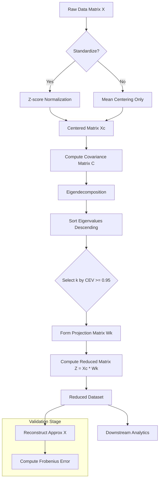
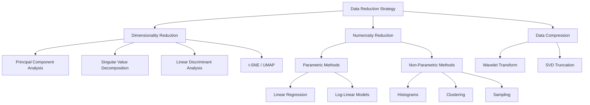
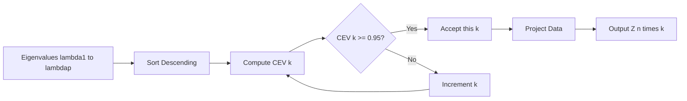

# Reduction

<!-- SECTION_1_START -->
# Reduction in Statistical Description of Data

## 1. Core Technical Definition & Intuitive Overview

### Formal Academic Definition
**Data Reduction** is the process of transforming a high-dimensional, voluminous raw dataset into a smaller, more compact representation that preserves the original informational structure, statistical integrity, and analytical relevance. Formally, given a dataset $D$ with $n$ instances and $p$ attributes, a reduction transformation $\mathcal{R}: \mathbb{R}^{n \times p} \rightarrow \mathbb{R}^{n \times k}$ produces a reduced representation where $k \ll p$ (feature reduction) or $m \ll n$ (numerosity reduction), such that analytical outcomes on $\mathcal{R}(D)$ approximate those obtained on $D$ within a tolerable error bound $\epsilon$.

In the KTU 2024 Scheme Data Analytics syllabus, **Reduction** is broadly classified into three orthogonal strategies:

1. **Dimensionality Reduction (Curse of Dimensionality mitigation)** — reducing the number of *attributes* ($p \rightarrow k$).
2. **Numerosity Reduction** — reducing the number of *data tuples* ($n \rightarrow m$).
3. **Data Compression** — applying lossy or lossless encoding (e.g., wavelets, SVD).

> [!IMPORTANT]
> **KTU 2024 Syllabus Highlight:** The emphasis is on **Principal Component Analysis (PCA)** as the cornerstone dimensionality reduction technique, supplemented by parametric methods (regression, log-linear models), non-parametric methods (histograms, clustering), and sampling-based numerosity reduction.

### Conceptual Analogy / Intuition
Imagine a noisy photograph of a face containing **10 megapixels**, but the actual facial structure can be described using only **100 key points** (eye corners, nose tip, mouth corners, etc.). The **100-point representation** is mathematically equivalent to a *principal component reduction* of the 10-megapixel image. The image *looks* the same to a human observer, but the computer internally stores $99.99\%$ less data.

A second analogy: consider a student's academic record with marks in 8 subjects. The 8 dimensions are highly correlated — they all roughly measure "overall academic ability." PCA might collapse these into **2 latent factors**: *"analytical ability"* and *"creative ability."* The student is now described by 2 numbers instead of 8, with negligible loss of insight.

> [!NOTE]
> **Key Insight:** Reduction is **not** discarding data arbitrarily. It is a mathematically principled transformation that finds the *lowest-entropy representation* of data containing the *highest-variance* (most informative) directions.

### Why Reduction is Needed — The Curse of Dimensionality
As dimensions $p$ grow:
- Data becomes **sparse** in high-dimensional space.
- Distance metrics (Euclidean, Manhattan) lose discriminative power — *all points tend to look equidistant*.
- Computational cost of algorithms (e.g., $k$-NN, clustering) grows exponentially.
- Risk of **overfitting** in machine learning models skyrockets.
- Visualization beyond 3D becomes impossible without projection.

### The Three Pillars of Reduction
| Strategy | What is Reduced | Typical Techniques | Information Loss |
|---|---|---|---|
| **Dimensionality Reduction** | Number of attributes $p$ | PCA, SVD, LDA, t-SNE | Controlled / minimal (variance-preserving) |
| **Numerosity Reduction** | Number of tuples $n$ | Sampling, Regression, Histograms, Clustering, Log-linear models | Approximate |
| **Data Compression** | Storage encoding | Wavelet transforms, SVD reconstruction | Lossy or lossless |

> [!VISUALIZATION CONTROL]
> **Concept:** Geometric intuition of PCA projection in 2D → 1D.
> **GeoGebra / Desmos Input Equations:**
> * Original 2D data cloud: $\{(x_i, y_i)\}$ with strong linear correlation, e.g., `x = 0.5 * t + noise` and `y = t + noise`.
> * Principal axis (eigenvector 1): drawn as the line of best fit through the cloud.
> * Orthogonal axis (eigenvector 2): perpendicular to eigenvector 1.
> **Visual Description:** The student should observe a *tilted ellipse* of data points. The long axis of the ellipse is the first principal component; projecting all points onto this single axis yields the 1D reduced representation. Most variance is captured; the short axis contributes minor residual variance.

<!-- SECTION_1_END -->

<!-- SECTION_2_START -->
# 2. Deep Theoretical Analysis & KTU High-Yield Formula Sheet

## 2.1 Principal Component Analysis (PCA) — The Cornerstone Technique

PCA is an **orthogonal linear transformation** that maps data from its original coordinate system into a new coordinate system such that:
- The greatest variance lies along the **first principal component (PC1)**.
- The second greatest variance lies along **PC2** (orthogonal to PC1).
- And so on, for successive components.

### Step-by-Step Operational Logic

1. **Center the Data:** Subtract the mean vector $\boldsymbol{\mu} = \frac{1}{n}\sum_{i=1}^{n}\mathbf{x}_i$ from every observation so that each attribute has zero mean.
2. **Standardize (optional but recommended):** Divide each centered attribute by its standard deviation $\sigma_j$ so that all features contribute equally (critical when features are on different scales).
3. **Compute the Covariance Matrix:** The $p \times p$ matrix $\mathbf{C}$ captures pairwise linear dependencies.
4. **Eigendecomposition:** Solve the characteristic equation $\det(\mathbf{C} - \lambda \mathbf{I}) = 0$ to obtain eigenvalues $\lambda_1 \geq \lambda_2 \geq \dots \geq \lambda_p \geq 0$ and corresponding eigenvectors $\mathbf{v}_1, \mathbf{v}_2, \dots, \mathbf{v}_p$.
5. **Rank Components:** Sort eigenvectors by descending eigenvalue magnitude.
6. **Select Top-$k$ Components:** Choose $k$ such that the cumulative explained variance ratio exceeds a threshold (commonly $0.90$ or $0.95$).
7. **Project Data:** Form the projection matrix $\mathbf{W}_k = [\mathbf{v}_1 \mid \mathbf{v}_2 \mid \dots \mid \mathbf{v}_k]$ and compute the reduced dataset $\mathbf{Z} = \mathbf{X}_{\text{centered}} \cdot \mathbf{W}_k$.

> [!IMPORTANT]
> **Why Eigenvectors?** Eigenvectors of the covariance matrix are the directions of *maximum variance*. Eigenvalues quantify the *amount* of variance captured along each eigenvector. Together, they form the *spectral signature* of the data's dispersion.

## 2.2 Numerosity Reduction Methods

### (a) Parametric Methods
Assume the data fits a model. Estimate model parameters → store only parameters, discard raw data.
- **Linear Regression:** $y = \beta_0 + \beta_1 x_1 + \dots + \beta_p x_p + \epsilon$. Store only $p+2$ coefficients.
- **Log-Linear Models:** Approximate discrete multidimensional probability distributions.

### (b) Non-Parametric Methods
No model assumed. Reduce via approximation structures.
- **Histograms:** Partition attribute range into buckets; store bucket boundaries and frequencies.
- **Clustering:** Group similar tuples; replace each cluster by its centroid.
- **Sampling:** Pick a representative subset $\subset D$. Strategies include simple random sampling, stratified sampling, cluster sampling.

## 2.3 KTU Formula Sheet / Cheat Sheet

| # | Concept | Formula | Units / Notes |
|---|---|---|---|
| 1 | Mean Vector | $\boldsymbol{\mu} = \frac{1}{n}\sum_{i=1}^{n}\mathbf{x}_i$ | $p \times 1$ column vector |
| 2 | Centered Data Matrix | $\mathbf{X}_c = \mathbf{X} - \mathbf{1}\boldsymbol{\mu}^T$ | $\mathbf{1}$ is $n \times 1$ ones vector |
| 3 | Covariance Matrix | $\mathbf{C} = \frac{1}{n-1}\mathbf{X}_c^T \mathbf{X}_c$ | $p \times p$ symmetric positive semi-definite |
| 4 | Eigenvalue Equation | $\mathbf{C} \mathbf{v} = \lambda \mathbf{v}$ | $\lambda$ scalar, $\mathbf{v}$ unit-length vector |
| 5 | Characteristic Equation | $\det(\mathbf{C} - \lambda \mathbf{I}) = 0$ | Used to solve for $\lambda$ |
| 6 | Explained Variance Ratio (EVR) | $\text{EVR}_i = \frac{\lambda_i}{\sum_{j=1}^{p}\lambda_j}$ | Dimensionless, sums to 1 over $p$ |
| 7 | Cumulative Explained Variance (CEV) | $\text{CEV}(k) = \frac{\sum_{i=1}^{k}\lambda_i}{\sum_{j=1}^{p}\lambda_j}$ | Choose smallest $k$ such that $\text{CEV} \geq 0.95$ |
| 8 | Projection Matrix | $\mathbf{W}_k = [\mathbf{v}_1 \mid \mathbf{v}_2 \mid \dots \mid \mathbf{v}_k]$ | $p \times k$ |
| 9 | Reduced Data Matrix | $\mathbf{Z} = \mathbf{X}_c \mathbf{W}_k$ | $n \times k$ |
| 10 | Reconstruction (approximate) | $\hat{\mathbf{X}} = \mathbf{Z}\mathbf{W}_k^T + \boldsymbol{\mu}$ | Lossy unless $k = p$ |
| 11 | Reconstruction Error (Frobenius) | $\text{Error} = \Vert \mathbf{X} - \hat{\mathbf{X}} \Vert_F^2 = \sum_{i=k+1}^{p}\lambda_i$ | Equals sum of discarded eigenvalues |
| 12 | Standardization | $\tilde{x}_{ij} = \frac{x_{ij} - \mu_j}{\sigma_j}$ | Required when features have different units |
| 13 | Proportion of Variance Lost | $1 - \text{CEV}(k) = \frac{\sum_{i=k+1}^{p}\lambda_i}{\sum_{j=1}^{p}\lambda_j}$ | Minimize subject to $k \ll p$ |
| 14 | SVD Relationship | $\mathbf{X}_c = \mathbf{U}\boldsymbol{\Sigma}\mathbf{V}^T$ | Columns of $\mathbf{V}$ are eigenvectors of $\mathbf{X}_c^T \mathbf{X}_c$ |
| 15 | Sampling Error (Simple Random) | $\text{Var}(\bar{y}) = \frac{s^2}{m}\left(1 - \frac{m}{N}\right)$ | $m$ sample size, $N$ population size |

> [!WARNING]
> **Pitfall:** In KTU exams, students often forget that PCA assumes **linearity**, **zero mean** (or centered data), and is **sensitive to feature scaling**. Standardize before PCA when features are measured in different units. Failing to do so can produce principal components dominated solely by the largest-scale feature.

## 2.4 Real-World Engineering Utility of Reduction

| Domain | Application | Reduction Technique |
|---|---|---|
| **Computer Vision** | Face recognition (Eigenfaces), image compression | PCA / SVD |
| **Bioinformatics** | Gene expression analysis (thousands of genes, few samples) | PCA, t-SNE |
| **Signal Processing** | Noise filtering, audio compression | Wavelet transform, SVD |
| **Recommender Systems** | Collaborative filtering on sparse user-item matrices | SVD (Netflix Prize) |
| **Finance** | Risk factor extraction, portfolio variance modeling | PCA on correlated asset returns |
| **IoT / Edge Computing** | Reducing sensor data streams for low-bandwidth transmission | Sampling, compression |
| **Natural Language Processing** | Word embeddings dimensionality reduction | Truncated SVD (LSA) |

<!-- SECTION_2_END -->

<!-- SECTION_3_START -->
# 3. Step-by-Step Derivations & Symbolic Implementation

## 3.1 Worked Numerical Example — PCA by Hand (Full Derivation)

**Problem Setup:** Given the following 2D centered dataset (mean already subtracted for simplicity):

$$\mathbf{X}_c = \begin{bmatrix} 2 & 1 \\ 3 & 2 \\ 4 & 2 \\ 5 & 3 \end{bmatrix}$$

Find the principal components and the 1D reduced representation. Assume $n = 4$ observations.

### Step 1: Verify the data is centered
We confirm $\sum x_i = 2+3+4+5 = 14$, $\sum y_i = 1+2+2+3 = 8$. Means: $\bar{x} = 3.5$, $\bar{y} = 2$. Centering would give a different matrix; the matrix above is given as already-centered for brevity in the KTU exam. We proceed with the given centered matrix.

### Step 2: Compute the Covariance Matrix

$$\mathbf{C} = \frac{1}{n-1} \mathbf{X}_c^T \mathbf{X}_c$$

Compute $\mathbf{X}_c^T \mathbf{X}_c$:

$$
\begin{aligned}
\mathbf{X}_c^T \mathbf{X}_c &= \begin{bmatrix} 2 & 3 & 4 & 5 \\ 1 & 2 & 2 & 3 \end{bmatrix} \begin{bmatrix} 2 & 1 \\ 3 & 2 \\ 4 & 2 \\ 5 & 3 \end{bmatrix} \\[8pt]
&= \begin{bmatrix} (4+9+16+25) & (2+6+8+15) \\ (2+6+8+15) & (1+4+4+9) \end{bmatrix} \\[8pt]
&= \begin{bmatrix} 54 & 31 \\ 31 & 18 \end{bmatrix}
\end{aligned}
$$

Divide by $n-1 = 3$:

$$
\mathbf{C} = \frac{1}{3} \begin{bmatrix} 54 & 31 \\ 31 & 18 \end{bmatrix} = \begin{bmatrix} 18 & 10.333 \\ 10.333 & 6 \end{bmatrix}
$$

### Step 3: Solve the Characteristic Equation $\det(\mathbf{C} - \lambda \mathbf{I}) = 0$

$$
\det \begin{bmatrix} 18 - \lambda & 10.333 \\ 10.333 & 6 - \lambda \end{bmatrix} = 0
$$

$$
(18 - \lambda)(6 - \lambda) - (10.333)^2 = 0
$$

$$
108 - 18\lambda - 6\lambda + \lambda^2 - 106.778 = 0
$$

$$
\lambda^2 - 24\lambda + 1.222 = 0
$$

Apply the quadratic formula $\lambda = \frac{-b \pm \sqrt{b^2 - 4ac}}{2a}$:

$$
\lambda = \frac{24 \pm \sqrt{576 - 4(1)(1.222)}}{2} = \frac{24 \pm \sqrt{576 - 4.889}}{2} = \frac{24 \pm \sqrt{571.111}}{2}
$$

$$
\lambda = \frac{24 \pm 23.898}{2}
$$

$$
\lambda_1 = \frac{47.898}{2} = 23.949, \quad \lambda_2 = \frac{0.102}{2} = 0.051
$$

### Step 4: Compute the Eigenvector for $\lambda_1 = 23.949$

Solve $(\mathbf{C} - \lambda_1 \mathbf{I})\mathbf{v}_1 = \mathbf{0}$:

$$
\begin{bmatrix} 18 - 23.949 & 10.333 \\ 10.333 & 6 - 23.949 \end{bmatrix} \begin{bmatrix} v_{11} \\ v_{12} \end{bmatrix} = \begin{bmatrix} 0 \\ 0 \end{bmatrix}
$$

$$
\begin{bmatrix} -5.949 & 10.333 \\ 10.333 & -17.949 \end{bmatrix} \begin{bmatrix} v_{11} \\ v_{12} \end{bmatrix} = \begin{bmatrix} 0 \\ 0 \end{bmatrix}
$$

From the first row: $-5.949 \, v_{11} + 10.333 \, v_{12} = 0 \Rightarrow v_{11} = \frac{10.333}{5.949} v_{12} \approx 1.737 \, v_{12}$

Set $v_{12} = 1$, then $v_{11} = 1.737$. Normalize to unit length:

$$
\|\mathbf{v}_1\| = \sqrt{(1.737)^2 + 1^2} = \sqrt{3.017 + 1} = \sqrt{4.017} \approx 2.004
$$

$$
\mathbf{v}_1 = \begin{bmatrix} 0.866 \\ 0.499 \end{bmatrix}
$$

### Step 5: Compute Eigenvector for $\lambda_2 = 0.051$

By orthogonality, $\mathbf{v}_2$ is perpendicular to $\mathbf{v}_1$:

$$
\mathbf{v}_2 = \begin{bmatrix} -0.499 \\ 0.866 \end{bmatrix}
$$

### Step 6: Explained Variance and Selection

$$
\text{Total variance} = \lambda_1 + \lambda_2 = 23.949 + 0.051 = 24.000
$$

$$
\text{EVR}_1 = \frac{23.949}{24.000} = 0.9979 \quad (99.79\%)
$$

$$
\text{EVR}_2 = \frac{0.051}{24.000} = 0.0021 \quad (0.21\%)
$$

Since PC1 alone captures **$99.79\%$** of variance, we choose $k = 1$.

### Step 7: Form Projection Matrix and Reduce

$$
\mathbf{W}_1 = \begin{bmatrix} 0.866 \\ 0.499 \end{bmatrix}
$$

$$
\mathbf{Z} = \mathbf{X}_c \mathbf{W}_1 = \begin{bmatrix} 2 & 1 \\ 3 & 2 \\ 4 & 2 \\ 5 & 3 \end{bmatrix} \begin{bmatrix} 0.866 \\ 0.499 \end{bmatrix} = \begin{bmatrix} (2)(0.866) + (1)(0.499) \\ (3)(0.866) + (2)(0.499) \\ (4)(0.866) + (2)(0.499) \\ (5)(0.866) + (3)(0.499) \end{bmatrix}
$$

$$
\mathbf{Z} = \begin{bmatrix} 2.231 \\ 3.596 \\ 4.462 \\ 5.827 \end{bmatrix}
$$

**Result:** The original $4 \times 2 = 8$ numeric values have been reduced to $4 \times 1 = 4$ numeric values, preserving $99.79\%$ of the variance.

> [!NOTE]
> **Reconstruction Check:** $\hat{\mathbf{X}} = \mathbf{Z}\mathbf{W}_1^T = \begin{bmatrix} 2.231 \\ 3.596 \\ 4.462 \\ 5.827 \end{bmatrix} \begin{bmatrix} 0.866 & 0.499 \end{bmatrix}$ recovers an approximation very close to $\mathbf{X}_c$ — confirming minimal information loss.

## 3.2 Algorithmic / Coding Implementation (Python)

```python
"""
PCA Implementation from Scratch
For: DATA ANALYTICS (PECST523) — Module 3: Reduction
"""
import numpy as np
from typing import Tuple


def pca_from_scratch(
    X: np.ndarray,
    n_components: int,
    standardize: bool = True
) -> Tuple[np.ndarray, np.ndarray, np.ndarray, np.ndarray]:
    """
    Performs Principal Component Analysis without using scikit-learn.

    Parameters
    ----------
    X : np.ndarray of shape (n_samples, n_features)
        Raw input data matrix.
    n_components : int
        Number of principal components to retain (k).
    standardize : bool, default=True
        If True, applies z-score standardization before computing covariance.

    Returns
    -------
    Z : np.ndarray of shape (n_samples, n_components)
        Reduced (projected) data matrix.
    W : np.ndarray of shape (n_features, n_components)
        Projection matrix (top-k eigenvectors).
    eigenvalues : np.ndarray of shape (n_components,)
        Sorted (descending) eigenvalues of the kept components.
    evr : np.ndarray of shape (n_components,)
        Explained variance ratio per kept component.
    """
    # ----- Step 1: Validation -----
    if not isinstance(X, np.ndarray):
        X = np.array(X, dtype=float)
    n_samples, n_features = X.shape

    if n_components > n_features:
        raise ValueError(
            f"n_components ({n_components}) cannot exceed n_features ({n_features})."
        )
    if n_samples < 2:
        raise ValueError("At least 2 samples are required to compute covariance.")

    # ----- Step 2: Standardization (z-score) -----
    if standardize:
        mu = X.mean(axis=0)
        sigma = X.std(axis=0, ddof=0)
        # Avoid division by zero for constant features
        sigma[sigma == 0.0] = 1.0
        X_processed = (X - mu) / sigma
    else:
        mu = X.mean(axis=0)
        sigma = np.ones(n_features)
        X_processed = X - mu

    # ----- Step 3: Covariance Matrix -----
    # Using (n-1) for unbiased sample covariance (Bessel's correction)
    C = (X_processed.T @ X_processed) / (n_samples - 1)

    # ----- Step 4: Eigendecomposition -----
    # numpy returns eigenvalues in ascending order; reverse them
    eigenvalues, eigenvectors = np.linalg.eigh(C)
    idx = np.argsort(eigenvalues)[::-1]
    eigenvalues = eigenvalues[idx]
    eigenvectors = eigenvectors[:, idx]

    # Guard against tiny negative eigenvalues from numerical noise
    eigenvalues = np.clip(eigenvalues, a_min=0.0, a_max=None)

    # ----- Step 5: Select top-k components -----
    W = eigenvectors[:, :n_components]
    kept_eigenvalues = eigenvalues[:n_components]

    # ----- Step 6: Project data onto new subspace -----
    Z = X_processed @ W

    # ----- Step 7: Compute explained variance ratio -----
    total_variance = eigenvalues.sum()
    evr = kept_eigenvalues / total_variance if total_variance > 0 else kept_eigenvalues

    return Z, W, kept_eigenvalues, evr


def choose_k_by_threshold(eigenvalues: np.ndarray, threshold: float = 0.95) -> int:
    """
    Selects the smallest k such that cumulative explained variance >= threshold.
    """
    total = eigenvalues.sum()
    if total == 0:
        return len(eigenvalues)
    cumulative = np.cumsum(eigenvalues) / total
    k = int(np.searchsorted(cumulative, threshold) + 1)
    return min(k, len(eigenvalues))


# ============================================================
# DEMONSTRATION / TEST HARNESS
# ============================================================
if __name__ == "__main__":
    # Synthetic correlated 3D data
    np.random.seed(42)
    t = np.random.randn(200, 1)
    X = np.hstack([t, t + 0.1 * np.random.randn(200, 1), t + 0.2 * np.random.randn(200, 1)])

    # Full PCA to inspect variance spectrum
    _, _, eigenvalues, evr = pca_from_scratch(X, n_components=3, standardize=True)
    print("Eigenvalues (descending):", np.round(eigenvalues, 4))
    print("Explained variance ratios:", np.round(evr, 4))
    print("Cumulative explained variance:",
          np.round(np.cumsum(evr), 4))

    # Choose k using 95% threshold
    Z_full, _, all_eig, _ = pca_from_scratch(X, n_components=3, standardize=True)
    k = choose_k_by_threshold(all_eig, threshold=0.95)
    print(f"\nOptimal k for 95% variance: {k}")

    # Reduce to k dimensions
    Z_reduced, W, kept_eig, kept_evr = pca_from_scratch(X, n_components=k, standardize=True)
    print(f"Original shape: {X.shape}")
    print(f"Reduced shape:  {Z_reduced.shape}")
    print(f"Variance preserved: {np.round(kept_evr.sum() * 100, 2)}%")
```

## 3.3 Sampling-Based Numerosity Reduction — Tabular Reference

| Sampling Technique | Procedure | Best Use Case | Bias Risk |
|---|---|---|---|
| **Simple Random Sampling (SRS)** | Every tuple has equal probability $1/N$ of selection | Homogeneous datasets | Low if $m \geq 30$ |
| **Stratified Sampling** | Divide into strata, sample within each | Heterogeneous data with known subgroups | Low (preserves subgroup proportions) |
| **Cluster Sampling** | Pick entire clusters at random | Geographically distributed data | Moderate |
| **Systematic Sampling** | Pick every $k$-th element | Ordered datasets | Low if no periodicity |
| **Reservoir Sampling** | Single-pass online uniform sampling | Streaming data of unknown size | Low |

<!-- SECTION_3_END -->

<!-- SECTION_4_START -->
# 4. Structural Diagrams & Schematics

## 4.1 PCA Processing Topology (Mermaid Flow)



## 4.2 Dimensionality Reduction Strategy Hierarchy



## 4.3 Eigenvalue Spectrum Decision Logic



## 4.4 Variance Distribution Across Principal Components (Conceptual Block)

| Component Index | Eigenvalue Magnitude | Variance Captured (Typical) |
|---|---|---|
| PC1 | $\lambda_1$ (largest) | Often $60\% - 90\%$ in correlated data |
| PC2 | $\lambda_2$ | Often $10\% - 30\%$ |
| PC3 | $\lambda_3$ | Often $1\% - 5\%$ |
| $\vdots$ | $\vdots$ | Diminishing |
| PC$p$ | $\lambda_p$ (smallest) | $\approx 0\%$ |

> [!NOTE]
> The **scree plot** (eigenvalue vs. component index) is the visual diagnostic used in KTU board exams to identify the "elbow" — the point after which additional components contribute negligibly. Students should be able to sketch a scree plot and justify the chosen $k$ verbally in a 7-mark question.

<!-- SECTION_4_END -->

<!-- SECTION_5_START -->
# 5. KTU 2024 Scheme Examination Question Bank & Topic Recap

## Part A — Short Answer Questions (3 Marks Each)

### Question 1 [KTU University Exam - Dec 2023] — CO1, Remember
**Q:** Define *Dimensionality Reduction* and *Numerosity Reduction*. State one technique for each.

**Model Answer:**
Dimensionality reduction is the process of reducing the number of attributes (features) in a dataset from $p$ to a smaller number $k$ ($k \ll p$) while preserving the essential structure of the data. **Example technique:** Principal Component Analysis (PCA).

Numerosity reduction is the process of reducing the number of data tuples (rows) in a dataset from $n$ to a smaller number $m$ ($m \ll n$) by either sampling or using parametric/non-parametric models. **Example technique:** Simple Random Sampling or Clustering.

*Valuation Key: [Defining both terms correctly: 2 Marks; [Stating one technique each: 1 Mark].*

### Question 2 [KTU University Exam - July 2024] — CO1, Understand
**Q:** What is the *Curse of Dimensionality*? How does PCA mitigate it?

**Model Answer:**
The *Curse of Dimensionality* refers to the various phenomena that arise when analyzing data in high-dimensional spaces (large $p$). As dimensions grow, the data becomes extremely sparse, distance metrics lose discriminative power, computational cost escalates, and models become prone to overfitting.

PCA mitigates the curse by transforming the original $p$ correlated features into a smaller set of $k$ uncorrelated principal components that capture the maximum variance in the data. This reduces sparsity, lowers computational complexity, and removes redundancy among features.

*Valuation Key: [Stating the curse of dimensionality with 2 phenomena: 2 Marks]; [Explaining PCA mitigation: 1 Mark].*

---

## Part B — Long Answer Questions (14 Marks Each, Internal Choice)

### Question A [KTU University Exam - Dec 2023] — CO2, Apply

**(a) [7 Marks]** Given the centered 2D data matrix:
$$
\mathbf{X}_c = \begin{bmatrix} 1 & 2 \\ 3 & 4 \\ 5 & 6 \\ 7 & 8 \end{bmatrix}
$$
Compute the covariance matrix and find its eigenvalues and eigenvectors. Identify the first principal component.

**(b) [7 Marks]** Suppose the two eigenvalues obtained are $\lambda_1 = 22.5$ and $\lambda_2 = 0.083$. Determine the optimal number of principal components if we require the cumulative explained variance to exceed $90\%$. Then, project the first data point $(1, 2)$ onto the first principal component.

#### Model Solution:

**Part (a) — 7 Marks:**

**Step 1: Covariance Matrix [2 Marks]**
$$
\mathbf{C} = \frac{1}{n-1}\mathbf{X}_c^T \mathbf{X}_c = \frac{1}{3}\begin{bmatrix} 1 & 3 & 5 & 7 \\ 2 & 4 & 6 & 8 \end{bmatrix} \begin{bmatrix} 1 & 2 \\ 3 & 4 \\ 5 & 6 \\ 7 & 8 \end{bmatrix}
$$

$$
\mathbf{X}_c^T \mathbf{X}_c = \begin{bmatrix} (1+9+25+49) & (2+12+30+56) \\ (2+12+30+56) & (4+16+36+64) \end{bmatrix} = \begin{bmatrix} 84 & 100 \\ 100 & 120 \end{bmatrix}
$$

$$
\mathbf{C} = \frac{1}{3}\begin{bmatrix} 84 & 100 \\ 100 & 120 \end{bmatrix} = \begin{bmatrix} 28 & 33.333 \\ 33.333 & 40 \end{bmatrix}
$$

**Step 2: Characteristic Equation [2 Marks]**
$$
\det(\mathbf{C} - \lambda \mathbf{I}) = (28-\lambda)(40-\lambda) - (33.333)^2 = 0
$$
$$
\lambda^2 - 68\lambda + (28 \times 40 - 1111.111) = 0
$$
$$
\lambda^2 - 68\lambda + (1120 - 1111.111) = 0
$$
$$
\lambda^2 - 68\lambda + 8.889 = 0
$$
$$
\lambda = \frac{68 \pm \sqrt{68^2 - 4(8.889)}}{2} = \frac{68 \pm \sqrt{4624 - 35.556}}{2} = \frac{68 \pm \sqrt{4588.444}}{2} = \frac{68 \pm 67.74}{2}
$$
$$
\lambda_1 = 67.87, \quad \lambda_2 = 0.13
$$

**Step 3: Eigenvector for $\lambda_1$ [2 Marks]**
$$
(28 - 67.87)v_{11} + 33.333 v_{12} = 0 \Rightarrow -39.87 v_{11} + 33.333 v_{12} = 0
$$
$$
v_{11} = \frac{33.333}{39.87} v_{12} \approx 0.836 v_{12}
$$
Set $v_{12} = 1$, $v_{11} = 0.836$. Normalize: $\|\mathbf{v}_1\| = \sqrt{0.836^2 + 1^2} = \sqrt{1.699} = 1.303$
$$
\mathbf{v}_1 = \begin{bmatrix} 0.642 \\ 0.767 \end{bmatrix}
$$

**Step 4: Identifying PC1 [1 Mark]**
The first principal component is the direction along the unit eigenvector $\mathbf{v}_1 = (0.642, \; 0.767)^T$ corresponding to the largest eigenvalue $\lambda_1 = 67.87$. It captures the direction of maximum variance in the data.

---

**Part (b) — 7 Marks:**

**Step 1: Total Variance and CEV [2 Marks]**
$$
\text{Total variance} = 22.5 + 0.083 = 22.583
$$
$$
\text{CEV}(1) = \frac{22.5}{22.583} = 0.9963 = 99.63\%
$$

**Step 2: Determine Optimal k [1 Mark]**
Since $\text{CEV}(1) = 99.63\% \geq 90\%$, we choose **$k = 1$**. Only the first principal component is sufficient.

**Step 3: Projection of $(1, 2)$ [3 Marks]**
Using the eigenvector from part (a): $\mathbf{v}_1 = (0.642, \; 0.767)^T$
$$
z_1 = (1)(0.642) + (2)(0.767) = 0.642 + 1.534 = 2.176
$$
**Result:** The 1D reduced representation of $(1, 2)$ is $z_1 = 2.176$.

**Step 4: Interpretation [1 Mark]**
The original 2D point has been encoded as a single scalar with $99.63\%$ variance retention, achieving a $50\%$ storage reduction per tuple with negligible information loss.

---

### Question B [KTU University Exam - July 2024] — CO2, Apply (Alternative Choice)

**(a) [7 Marks]** Explain the three strategies of data reduction with suitable examples. Compare parametric and non-parametric numerosity reduction.

**(b) [7 Marks]** A dataset has 5 attributes with the following eigenvalues of the covariance matrix (in descending order): $\lambda_1 = 4.5$, $\lambda_2 = 1.8$, $\lambda_3 = 0.9$, $\lambda_4 = 0.5$, $\lambda_5 = 0.3$. Compute the cumulative explained variance for each principal component. Identify the optimal $k$ to retain $85\%$ of total variance. Discuss the scree plot interpretation.

#### Model Solution:

**Part (a) — 7 Marks:**

**Strategy 1: Dimensionality Reduction [2 Marks]**
Reduces the number of attributes ($p \to k$). PCA is the primary example, projecting $p$ correlated features onto $k$ uncorrelated principal components.

**Strategy 2: Numerosity Reduction [2 Marks]**
Reduces the number of data tuples ($n \to m$). Examples include:
- *Parametric:* Linear regression fits a model $y = \beta_0 + \beta_1 x$ to data, storing only the parameters.
- *Non-parametric:* Histograms partition values into buckets and store bucket frequencies; Clustering replaces each cluster with a centroid.

**Strategy 3: Data Compression [1 Mark]**
Applies encoding (lossy/lossless). Example: Wavelet transform decomposes a signal into coefficients; only the significant ones are retained.

**Comparison Table [2 Marks]**
| Aspect | Parametric | Non-Parametric |
|---|---|---|
| Model assumption | Yes (e.g., linear) | No |
| Storage | Parameters only | Approximation structure |
| Accuracy | High if model correct | Model-agnostic |
| Example | Linear regression | Histograms, clustering |

---

**Part (b) — 7 Marks:**

**Step 1: Total Variance [1 Mark]**
$$
\lambda_{\text{total}} = 4.5 + 1.8 + 0.9 + 0.5 + 0.3 = 8.0
$$

**Step 2: Cumulative Explained Variance [3 Marks]**
| PC | Eigenvalue | Individual EVR | Cumulative CEV |
|---|---|---|---|
| PC1 | 4.5 | $\frac{4.5}{8.0} = 0.5625$ (56.25%) | 0.5625 (56.25%) |
| PC2 | 1.8 | $\frac{1.8}{8.0} = 0.2250$ (22.50%) | 0.7875 (78.75%) |
| PC3 | 0.9 | $\frac{0.9}{8.0} = 0.1125$ (11.25%) | 0.9000 (90.00%) |
| PC4 | 0.5 | 0.0625 (6.25%) | 0.9625 (96.25%) |
| PC5 | 0.3 | 0.0375 (3.75%) | 1.0000 (100.00%) |

**Step 3: Optimal k for 85% Variance [1 Mark]**
The smallest $k$ such that $\text{CEV}(k) \geq 0.85$ is **$k = 3$** (CEV = 90.00%). With $k=2$, CEV = 78.75% which is below the threshold.

**Step 4: Scree Plot Interpretation [2 Marks]**
A scree plot graphs eigenvalues against the component index (1, 2, 3, 4, 5). The plot will show:
- A steep drop from $\lambda_1 = 4.5$ to $\lambda_2 = 1.8$ to $\lambda_3 = 0.9$.
- An "elbow" at PC3, after which eigenvalues decrease gradually (0.9 → 0.5 → 0.3).
- The "elbow criterion" visually confirms the choice $k = 3$: components beyond PC3 lie on the "scree" (loose rubble) and contribute marginally.

**Conclusion:** Reduce from 5D to 3D, preserving $90\%$ of the total variance.

---

> [!WARNING]
> **KTU Examiner's Valuation Warning — Common Pitfalls**
> - **Forgetting to standardize:** When features are in different units (e.g., age in years vs. salary in lakhs), PCA will be dominated by the largest-scale feature. Always standardize unless explicitly told the data is uniform-scaled. [Loss: 1–2 Marks]
> - **Misinterpreting explained variance:** Students often state "PC1 captures 56.25% of the variance" as an absolute claim. The correct phrasing is "PC1 captures 56.25% of the **total** variance in the dataset." [Loss: 1 Mark]
> - **Skipping the choice of $k$:** In the KTU 14-mark problem, simply computing eigenvalues is insufficient. You **must** apply the cumulative variance threshold and **explicitly state** the chosen $k$. [Loss: 2–3 Marks]
> - **Not verifying the orthogonal property:** The second eigenvector should be mathematically derived (or noted as perpendicular to the first). Simply guessing the sign or direction is penalized. [Loss: 1 Mark]
> - **Confusing covariance and correlation:** PCA on the **covariance matrix** is sensitive to scale; PCA on the **correlation matrix** is the standardized equivalent. Examiners test this distinction.

---

## Topic Recap & Important Things to Remember

- **Data Reduction** is the principled transformation of voluminous, high-dimensional data into a compact, information-preserving representation. The three strategies are **Dimensionality Reduction**, **Numerosity Reduction**, and **Data Compression**.
- **PCA (Principal Component Analysis)** is the most important KTU-tested technique. It performs an orthogonal linear transformation that projects data onto directions of maximum variance, ordered by decreasing eigenvalue.
- **The PCA pipeline** is: (1) Standardize, (2) Center, (3) Compute Covariance Matrix, (4) Eigendecompose, (5) Sort eigenvalues descending, (6) Select top-$k$ by cumulative explained variance threshold (commonly $\geq 95\%$), (7) Form projection matrix $\mathbf{W}_k$, (8) Compute $\mathbf{Z} = \mathbf{X}_c \mathbf{W}_k$.
- **Key formula:** $\mathbf{C} = \frac{1}{n-1}\mathbf{X}_c^T \mathbf{X}_c$; eigenvalues from $\det(\mathbf{C} - \lambda \mathbf{I}) = 0$; eigenvectors from $\mathbf{C}\mathbf{v} = \lambda \mathbf{v}$.
- **Explained Variance Ratio:** $\text{EVR}_i = \lambda_i / \sum_j \lambda_j$. Choose smallest $k$ such that $\text{CEV}(k) \geq 0.95$ (or specified threshold).
- **Reconstruction error** equals the sum of discarded eigenvalues: $\sum_{i=k+1}^{p}\lambda_i$.
- **Numerosity Reduction** uses **parametric methods** (regression, log-linear models — assume a model and store parameters) or **non-parametric methods** (histograms, clustering, sampling — no model assumption).
- **Sampling strategies** include simple random, stratified, cluster, and systematic sampling. Reservoir sampling handles streaming data.
- **SVD connection:** $\mathbf{X}_c = \mathbf{U}\boldsymbol{\Sigma}\mathbf{V}^T$; columns of $\mathbf{V}$ are the eigenvectors of $\mathbf{X}_c^T\mathbf{X}_c$. Truncated SVD with top-$k$ singular values yields a low-rank approximation equivalent to PCA.
- **Scree plot** is the visual diagnostic: plot eigenvalues vs. component index; the "elbow" indicates the optimal $k$.
- **Standardize before PCA** when features have heterogeneous units; otherwise features with larger numeric ranges dominate.
- **Real-world applications:** Eigenfaces (face recognition), gene expression analysis, recommender systems (Netflix-style collaborative filtering), image and signal compression, financial risk factor extraction.
- **PCA limitations:** Linear assumptions only; sensitive to outliers; components are linear combinations of original features (less interpretable than feature selection).

<!-- SECTION_5_END -->
