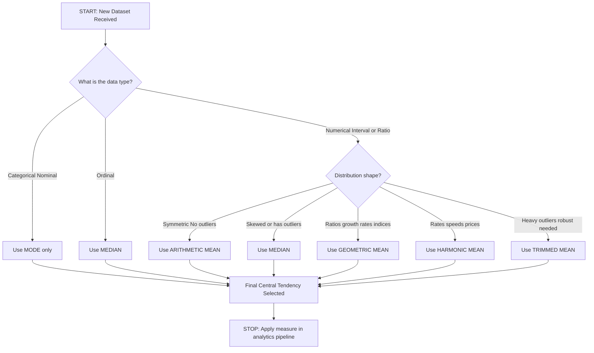
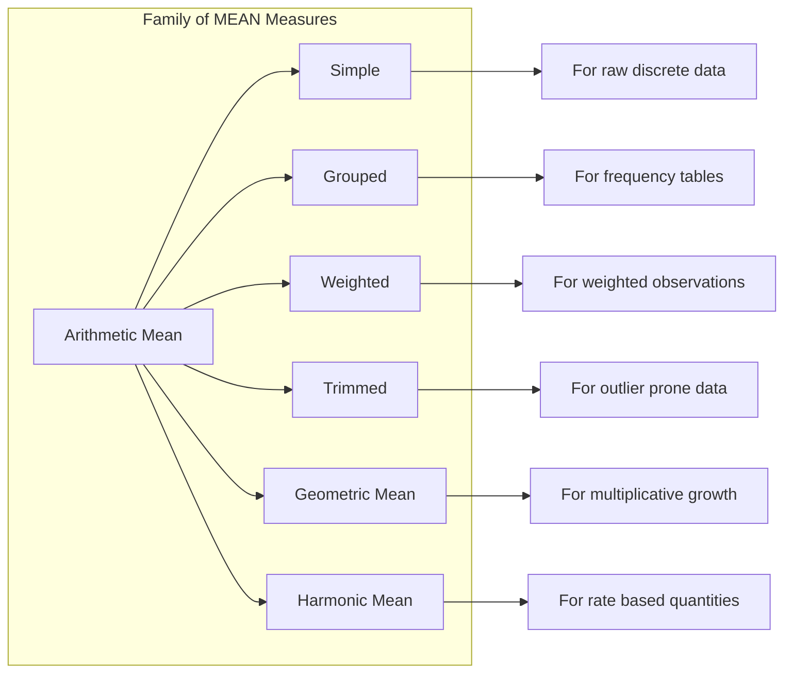
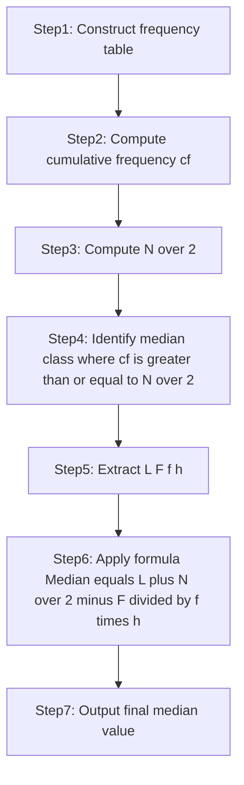
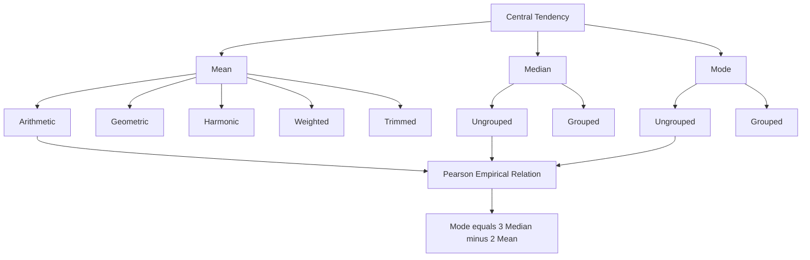
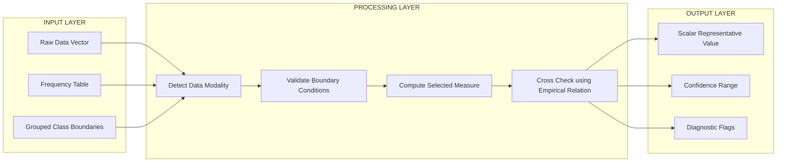

# Statistical Description of data - Central tendency

<!-- SECTION_1_START -->
# Statistical Description of Data — Central Tendency

## 1.1 Formal Academic Definition (KTU 2024 Syllabus Aligned)

In **Statistical Description of Data**, **Central Tendency** refers to the statistical measure that identifies a **single value as representative of an entire distribution of data**. It aims to provide an accurate description of the **center of the data set** — a point around which all observations tend to cluster.

According to the KTU 2024 Scheme (Course Code: **PECST523**), Central Tendency is classified under the descriptive analytics layer of data science, and the three principal measures mandated by the syllabus are:

1. **Mean** (Arithmetic, Geometric, Harmonic, Weighted, Trimmed)
2. **Median**
3. **Mode**

Mathematically, central tendency is a function $T: \mathbb{R}^n \to \mathbb{R}$ that maps a multivariate sample to a representative scalar:

$$T(x_1, x_2, \dots, x_n) = \text{some representative value}$$

> [!IMPORTANT]
> **KTU Syllabus Highlight:** The term *"Statistical Description of Data"* strictly requires the student to compute, contrast, and apply measures of **Central Tendency, Dispersion, and Shape** (Skewness & Kurtosis). Module 3 of PECST523 is dedicated entirely to these three descriptive dimensions.

---

## 1.2 Conceptual Analogy & Geometric Intuition

Imagine a **seesaw (lever) on a fulcrum**. If you place a pile of books of different weights on the seesaw, the **fulcrum must be shifted** to a specific point so that the entire system stays in **perfect rotational balance (equilibrium)**. That single point where the seesaw balances is the **Central Tendency** of the weights.

- **Mean** → the *pivot point* that equalizes the moment (torque) of all data points.
- **Median** → the *middle book* when books are arranged in order of weight on a shelf.
- **Mode** → the *most frequently occurring* book weight on the shelf.

### Geometric Visualization (Number Line)

If we place data points $x_1, x_2, \dots, x_n$ on a number line, central tendency is the *"balance point"* — the location that minimizes the total distance or represents the densest region.

> [!NOTE]
> **Quick Intuition:**
> - **Mean** is sensitive to extreme values (long tail pulls it).
> - **Median** is robust to outliers (only the order matters, not the magnitude).
> - **Mode** is the only measure applicable to **categorical (nominal) data**.

---

## 1.3 Physical Constants & Standard Metrics

In statistical theory, the following constants and conventions are universally accepted:

- **Sample size** $n$ — number of observations.
- **Population size** $N$ — total possible observations.
- **Degrees of freedom** $df = n - 1$ (used in advanced inferential tests).
- **Significance level** $\alpha = 0.05$ (standard for hypothesis tests, used in later modules).
- **Convention:** $\sum_{i=1}^{n} x_i$ denotes the cumulative sum across all data points.

> [!VISUALIZATION CONTROL]
> **Concept:** Visualization of Central Tendency on a Number Line
> **GeoGebra / Desmos Input Equations:**
> * `mean = (2 + 3 + 4 + 5 + 6 + 100) / 6`
> * `median = 4.5`
> * `mode = (not uniquely defined in this skewed set)`
> **Visual Description:** Plot the six data points on the x-axis. Notice how the **mean (≈ 20)** is dragged far to the right by the outlier **100**, the **median (4.5)** stays close to the cluster, and the data is **right-skewed**. This demonstrates why choosing the right measure matters in real-world data analytics.

---
<!-- SECTION_1_END -->

<!-- SECTION_2_START -->
# Deep Theoretical Analysis & KTU High-Yield Formula Sheet

## 2.1 The Five Major Measures of Central Tendency

### 2.1.1 Arithmetic Mean (AM)

The most common measure. It is the **sum of all observations divided by the number of observations**.

#### (a) Simple Arithmetic Mean (Ungrouped Data)

For raw data $x_1, x_2, \dots, x_n$:

$$\bar{x} = \frac{1}{n} \sum_{i=1}^{n} x_i$$

#### (b) Mean for Grouped Data (Frequency Distribution)

When data is already summarized into a frequency table with class marks $x_i$ and frequencies $f_i$:

$$\bar{x} = \frac{\sum_{i=1}^{k} f_i x_i}{\sum_{i=1}^{k} f_i} = \frac{\sum f_i x_i}{N}$$

where $N = \sum f_i$ is the total frequency and $k$ is the number of classes.

#### (c) Mean for Grouped Data (Continuous Class Intervals)

When only class boundaries are available:

$$\bar{x} = \frac{\sum f_i m_i}{N}$$

where $m_i = \frac{L_i + U_i}{2}$ is the **midpoint** of the $i$-th class (with $L_i$ as lower boundary and $U_i$ as upper boundary).

#### (d) Weighted Arithmetic Mean

When different observations carry different importance (weights $w_i$):

$$\bar{x}_w = \frac{\sum_{i=1}^{n} w_i x_i}{\sum_{i=1}^{n} w_i}$$

#### (e) Trimmed Mean

After removing a fixed percentage $\alpha$ of observations from **both ends** of the sorted data, the mean of the remaining values is computed:

$$\bar{x}_{\alpha} = \frac{1}{n - 2\lfloor \alpha n \rfloor} \sum_{i = \lfloor \alpha n \rfloor + 1}^{n - \lfloor \alpha n \rfloor} x_{(i)}$$

where $x_{(i)}$ denotes the $i$-th **order statistic** (sorted value).

---

### 2.1.2 Geometric Mean (GM)

Used for **averaging ratios, growth rates, percentages, and indices**. Defined only for **positive non-zero** values:

$$G = \left( \prod_{i=1}^{n} x_i \right)^{\frac{1}{n}} = \sqrt[n]{x_1 \cdot x_2 \cdot x_3 \cdots x_n}$$

For grouped data:

$$G = \left( \prod_{i=1}^{k} x_i^{f_i} \right)^{\frac{1}{N}}$$

> [!IMPORTANT]
> **Engineering Use-Case:** The Geometric Mean is the correct measure for **average percentage change, compound interest rates, population growth, and signal-to-noise ratios in dB**. It is *never* zero or negative for valid input.

---

### 2.1.3 Harmonic Mean (HM)

The reciprocal of the arithmetic mean of reciprocals. Used for **averaging rates and speeds**:

$$H = \frac{n}{\sum_{i=1}^{n} \frac{1}{x_i}}$$

> [!NOTE]
> **AM-GM-HM Inequality:** For any set of positive numbers,
> $$H \leq G \leq \bar{x}$$
> Equality holds **if and only if** all data points are equal.

---

### 2.1.4 Median

The **middle value** when data is arranged in ascending (or descending) order. It partitions the distribution into two equal halves.

#### (a) Ungrouped Data (Odd $n$)

$$\text{Median} = x_{\left( \frac{n+1}{2} \right)}$$

#### (b) Ungrouped Data (Even $n$)

$$\text{Median} = \frac{x_{\left( \frac{n}{2} \right)} + x_{\left( \frac{n}{2} + 1 \right)}}{2}$$

#### (c) Grouped Data (Continuous Frequency Distribution)

$$\text{Median} = L + \left( \frac{\frac{N}{2} - F}{f} \right) \cdot h$$

where:
- $L$ = lower class boundary of the median class
- $N$ = total frequency
- $F$ = cumulative frequency **before** the median class
- $f$ = frequency of the median class
- $h$ = class width

The **median class** is the class where the cumulative frequency first reaches or exceeds $N/2$.

---

### 2.1.5 Mode

The **most frequently occurring value** in the data set. A data set may be **unimodal, bimodal, multimodal**, or have **no mode**.

#### (a) Ungrouped Data
Mode = value with the **highest frequency**.

#### (b) Grouped Data

$$\text{Mode} = L + \left( \frac{f_1 - f_0}{2 f_1 - f_0 - f_2} \right) \cdot h$$

where:
- $L$ = lower class boundary of the modal class
- $f_1$ = frequency of the modal class
- $f_0$ = frequency of the class **preceding** the modal class
- $f_2$ = frequency of the class **succeeding** the modal class
- $h$ = class width

The **modal class** is the class with the **highest frequency**.

---

## 2.2 Empirical Relationship Between Mean, Median, and Mode

For **moderately skewed unimodal** distributions, the following empirical formula (Karl Pearson's approximation) holds:

$$\text{Mode} \approx 3 \cdot \text{Median} - 2 \cdot \text{Mean}$$

Equivalently:

$$\text{Mean} - \text{Mode} \approx 3 \cdot (\text{Mean} - \text{Median})$$

This defines the **Pearson Skewness Coefficient (Empirical)**:

$$Sk = \frac{\text{Mean} - \text{Mode}}{\text{Standard Deviation}} \approx \frac{3(\text{Mean} - \text{Median})}{\text{Standard Deviation}}$$

---

## 2.3 KTU Formula Cheat Sheet

| # | Measure | Formula | When to Use | Boundary Conditions |
|---|---------|---------|-------------|---------------------|
| 1 | Arithmetic Mean (raw) | $\bar{x} = \frac{\sum x_i}{n}$ | Symmetric, no outliers | All real values |
| 2 | Arithmetic Mean (grouped) | $\bar{x} = \frac{\sum f_i x_i}{\sum f_i}$ | Frequency tables | $\sum f_i > 0$ |
| 3 | Weighted Mean | $\bar{x}_w = \frac{\sum w_i x_i}{\sum w_i}$ | Data with unequal importance | $\sum w_i \neq 0$ |
| 4 | Trimmed Mean | Mean after removing $\alpha$ fraction from each tail | Outlier-prone data | $0 \leq \alpha < 0.5$ |
| 5 | Geometric Mean | $G = (\prod x_i)^{1/n}$ | Ratios, growth rates, indices | All $x_i > 0$ |
| 6 | Harmonic Mean | $H = \frac{n}{\sum (1/x_i)}$ | Rates, speeds, prices | All $x_i > 0$ |
| 7 | Median (odd $n$) | $x_{(\frac{n+1}{2})}$ | Skewed data, ordinal scales | Sorted data |
| 8 | Median (even $n$) | $\frac{x_{(n/2)} + x_{(n/2+1)}}{2}$ | Skewed data, ordinal scales | Sorted data |
| 9 | Median (grouped) | $L + \left(\frac{N/2 - F}{f}\right) h$ | Continuous frequency data | Median class must exist |
| 10 | Mode (raw) | Value with highest frequency | Categorical / nominal data | Mode may be absent |
| 11 | Mode (grouped) | $L + \left(\frac{f_1 - f_0}{2f_1 - f_0 - f_2}\right) h$ | Continuous frequency data | Modal class must exist |
| 12 | Pearson's Empirical Relation | $\text{Mode} = 3 \cdot \text{Median} - 2 \cdot \text{Mean}$ | Skewed unimodal data | Approximation only |

---

## 2.4 Real-World Engineering Utility

| Domain | Preferred Central Tendency | Reason |
|--------|---------------------------|--------|
| **Income / Wealth Analytics** | Median | Resistant to billionaire outliers |
| **Stock Market Returns** | Geometric Mean | Compounded multiplicative growth |
| **Average Vehicle Speed** | Harmonic Mean | Equal-distance weighting, not equal-time |
| **Manufacturing Defect Rates** | Mode | Most common defect type drives the process |
| **Likert Scale (1–5) Survey** | Median | Ordinal, not interval; mean is invalid |
| **Image Processing (Pixel Intensity)** | Mean / Trimmed Mean | Spatial filtering, noise reduction |
| **Machine Learning Imputation** | Median | Robust to NaN-adjacent outliers |
| **Engineering Material Strength (MPa)** | Mean | Symmetric distribution under normal load |
| **Financial Index Construction** | Geometric Mean | Capital preservation requires multiplicative aggregation |

---
<!-- SECTION_2_END -->

<!-- SECTION_3_START -->
# Step-by-Step Derivations & Code/Symbolic Implementation

## 3.1 Worked Example 1: Arithmetic Mean (Ungrouped Data)

**Problem (KTU-Style):** The marks of 8 students in a Data Analytics class are:
$$5, 8, 10, 12, 7, 15, 9, 14$$

Find the arithmetic mean.

### Step-by-Step Solution

**Step 1:** Identify the data points and count them.

$$n = 8, \quad \{x_i\} = \{5, 8, 10, 12, 7, 15, 9, 14\}$$

**Step 2:** Sum all observations.

$$\sum_{i=1}^{8} x_i = 5 + 8 + 10 + 12 + 7 + 15 + 9 + 14$$

$$= 13 + 10 + 12 + 7 + 15 + 9 + 14$$

$$= 23 + 12 + 7 + 15 + 9 + 14$$

$$= 35 + 7 + 15 + 9 + 14$$

$$= 42 + 15 + 9 + 14$$

$$= 57 + 9 + 14$$

$$= 66 + 14 = 80$$

**Step 3:** Apply the mean formula.

$$\bar{x} = \frac{1}{n} \sum_{i=1}^{n} x_i = \frac{80}{8} = 10$$

**Result:** The arithmetic mean is $\bar{x} = 10$ marks.

> **Valuation Key:** Stating the formula: **1 Mark**; Computing the sum: **1 Mark**; Final answer: **1 Mark**.

---

## 3.2 Worked Example 2: Mean of Grouped Frequency Distribution

**Problem:** Compute the mean of the following grouped data.

| Class Interval | Frequency $f_i$ |
|:--------------:|:----------------:|
| 0 – 10 | 5 |
| 10 – 20 | 8 |
| 20 – 30 | 12 |
| 30 – 40 | 7 |
| 40 – 50 | 3 |

### Step-by-Step Solution

**Step 1:** Compute the midpoint $m_i = \frac{L_i + U_i}{2}$ for each class.

| Class Interval | $f_i$ | $m_i$ | $f_i \cdot m_i$ |
|:--------------:|:-----:|:-----:|:----------------:|
| 0 – 10  | 5  | 5  | 25  |
| 10 – 20 | 8  | 15 | 120 |
| 20 – 30 | 12 | 25 | 300 |
| 30 – 40 | 7  | 35 | 245 |
| 40 – 50 | 3  | 45 | 135 |
| **Total** | **35** | — | **825** |

**Step 2:** Sum the frequency column.

$$N = \sum f_i = 5 + 8 + 12 + 7 + 3 = 35$$

**Step 3:** Sum the $f_i m_i$ column.

$$\sum f_i m_i = 25 + 120 + 300 + 245 + 135 = 825$$

**Step 4:** Apply the grouped mean formula.

$$\bar{x} = \frac{\sum f_i m_i}{N} = \frac{825}{35} = \frac{165}{7} \approx 23.57$$

**Result:** The grouped arithmetic mean is $\bar{x} \approx 23.57$.

> **Valuation Key:** Midpoint table: **2 Marks**; Sum $\sum f_i m_i$: **1 Mark**; Final value: **1 Mark**.

---

## 3.3 Worked Example 3: Median for Ungrouped Data (Even $n$)

**Problem:** Find the median of $\{3, 7, 1, 9, 4, 12, 8, 5\}$.

### Step-by-Step Solution

**Step 1:** Sort the data in ascending order.

$$x_{(1)}, x_{(2)}, \dots, x_{(8)} = 1, 3, 4, 5, 7, 8, 9, 12$$

**Step 2:** Identify $n = 8$ (even). Apply the even-$n$ formula.

$$\text{Median} = \frac{x_{(n/2)} + x_{(n/2 + 1)}}{2} = \frac{x_{(4)} + x_{(5)}}{2}$$

**Step 3:** Substitute the sorted values.

$$\text{Median} = \frac{x_{(4)} + x_{(5)}}{2} = \frac{5 + 7}{2} = \frac{12}{2} = 6$$

**Result:** Median $= 6$.

---

## 3.4 Worked Example 4: Median for Grouped Frequency Data

**Problem:** Find the median for the following continuous frequency distribution.

| Class Interval | Frequency $f_i$ | Cumulative Frequency $cf$ |
|:--------------:|:----------------:|:-------------------------:|
| 0 – 10  | 5  | 5  |
| 10 – 20 | 8  | 13 |
| 20 – 30 | 12 | 25 |
| 30 – 40 | 7  | 32 |
| 40 – 50 | 3  | 35 |

### Step-by-Step Solution

**Step 1:** Compute $N/2 = 35/2 = 17.5$.

**Step 2:** Identify the median class — the first class where $cf \geq 17.5$.

Looking at the cumulative frequency column:
- Class 0–10: $cf = 5$ (no)
- Class 10–20: $cf = 13$ (no)
- Class 20–30: $cf = 25$ (**yes — this is the median class**)

**Step 3:** Extract parameters for the median class.

$$L = 20, \quad f = 12, \quad F = 13 \text{ (cf of preceding class)}, \quad h = 10$$

**Step 4:** Substitute into the grouped median formula.

$$\text{Median} = L + \left( \frac{N/2 - F}{f} \right) h = 20 + \left( \frac{17.5 - 13}{12} \right) \times 10$$

**Step 5:** Simplify the fraction.

$$= 20 + \left( \frac{4.5}{12} \right) \times 10 = 20 + 0.375 \times 10 = 20 + 3.75$$

$$= 23.75$$

**Result:** Median $= 23.75$.

> **Valuation Key:** Cumulative frequency column: **2 Marks**; Median class identification: **1 Mark**; Substituting values: **2 Marks**; Final answer: **1 Mark**; State the formula explicitly: **1 Mark**.

---

## 3.5 Worked Example 5: Mode for Grouped Data

**Problem:** Find the mode for the same distribution used in §3.4.

### Step-by-Step Solution

**Step 1:** Identify the modal class — the class with the highest frequency.

$$f_1 = 12 \text{ (Class 20–30)} \implies \text{Modal class} = 20\text{–}30$$

**Step 2:** Extract parameters.

$$L = 20, \quad f_1 = 12, \quad f_0 = 8 \text{ (preceding class)}, \quad f_2 = 7 \text{ (succeeding class)}, \quad h = 10$$

**Step 3:** Substitute into the mode formula.

$$\text{Mode} = L + \left( \frac{f_1 - f_0}{2 f_1 - f_0 - f_2} \right) h$$

**Step 4:** Simplify the numerator and denominator.

$$\text{Numerator} = f_1 - f_0 = 12 - 8 = 4$$

$$\text{Denominator} = 2 f_1 - f_0 - f_2 = 2(12) - 8 - 7 = 24 - 15 = 9$$

**Step 5:** Compute the final value.

$$\text{Mode} = 20 + \left( \frac{4}{9} \right) \times 10 = 20 + \frac{40}{9} = 20 + 4.44\ldots \approx 24.44$$

**Result:** Mode $\approx 24.44$.

---

## 3.6 Worked Example 6: Empirical Relation Between Mean, Median, Mode

**Problem:** In a moderately skewed distribution, the arithmetic mean is $42$ and the median is $40$. Estimate the mode using Karl Pearson's empirical relation.

### Step-by-Step Solution

**Step 1:** Apply the empirical formula.

$$\text{Mode} \approx 3 \cdot \text{Median} - 2 \cdot \text{Mean}$$

**Step 2:** Substitute values.

$$\text{Mode} \approx 3(40) - 2(42) = 120 - 84 = 36$$

**Result:** Estimated mode $\approx 36$.

---

## 3.7 Python Implementation (Fully Operational)

```python
"""
Central Tendency Computation Engine
Course: DATA ANALYTICS (PECST523) - KTU 2024 Scheme
Module 3: Statistical Description of Data
"""

import numpy as np
import pandas as pd
from scipy import stats
from typing import List, Union, Optional, Dict
import logging

logging.basicConfig(level=logging.INFO, format='[%(levelname)s] %(message)s')
logger = logging.getLogger(__name__)


class CentralTendencyEngine:
    """
    A production-grade engine for computing all KTU-mandated
    measures of central tendency.
    """

    def __init__(self, data: List[Union[int, float]]):
        if not data:
            raise ValueError("Input data list cannot be empty.")
        if not all(isinstance(x, (int, float)) for x in data):
            raise TypeError("All data points must be numeric (int or float).")
        self.data: np.ndarray = np.array(data, dtype=float)
        self.n: int = len(self.data)
        logger.info(f"Initialized engine with n = {self.n} data points.")

    # ----------------------------------------------------------------
    # 1. ARITHMETIC MEAN
    # ----------------------------------------------------------------
    def arithmetic_mean(self) -> float:
        """Compute the simple arithmetic mean."""
        mean_val = float(np.mean(self.data))
        logger.info(f"Arithmetic Mean = {mean_val:.4f}")
        return mean_val

    # ----------------------------------------------------------------
    # 2. WEIGHTED MEAN
    # ----------------------------------------------------------------
    def weighted_mean(self, weights: List[Union[int, float]]) -> float:
        """Compute the weighted arithmetic mean."""
        if len(weights) != self.n:
            raise ValueError("Weights list must match data length.")
        if any(w < 0 for w in weights):
            raise ValueError("Weights must be non-negative.")
        if sum(weights) == 0:
            raise ZeroDivisionError("Sum of weights cannot be zero.")
        w = np.array(weights, dtype=float)
        wmean = float(np.sum(w * self.data) / np.sum(w))
        logger.info(f"Weighted Mean = {wmean:.4f}")
        return wmean

    # ----------------------------------------------------------------
    # 3. GEOMETRIC MEAN
    # ----------------------------------------------------------------
    def geometric_mean(self) -> float:
        """Compute the geometric mean (requires strictly positive data)."""
        if np.any(self.data <= 0):
            raise ValueError("Geometric mean requires strictly positive data.")
        gmean = float(stats.gmean(self.data))
        logger.info(f"Geometric Mean = {gmean:.4f}")
        return gmean

    # ----------------------------------------------------------------
    # 4. HARMONIC MEAN
    # ----------------------------------------------------------------
    def harmonic_mean(self) -> float:
        """Compute the harmonic mean (requires strictly positive data)."""
        if np.any(self.data <= 0):
            raise ValueError("Harmonic mean requires strictly positive data.")
        hmean = float(stats.hmean(self.data))
        logger.info(f"Harmonic Mean = {hmean:.4f}")
        return hmean

    # ----------------------------------------------------------------
    # 5. TRIMMED MEAN
    # ----------------------------------------------------------------
    def trimmed_mean(self, proportion: float = 0.1) -> float:
        """Compute the alpha-trimmed mean from both tails."""
        if not 0 <= proportion < 0.5:
            raise ValueError("Proportion must be in [0, 0.5).")
        tmean = float(stats.trim_mean(self.data, proportion))
        logger.info(f"Trimmed Mean (alpha={proportion}) = {tmean:.4f}")
        return tmean

    # ----------------------------------------------------------------
    # 6. MEDIAN
    # ----------------------------------------------------------------
    def median(self) -> float:
        """Compute the median (50th percentile)."""
        med_val = float(np.median(self.data))
        logger.info(f"Median = {med_val:.4f}")
        return med_val

    # ----------------------------------------------------------------
    # 7. MODE
    # ----------------------------------------------------------------
    def mode(self) -> Dict[str, Union[float, List[float]]]:
        """Compute the mode (returns all modes for multimodal data)."""
        mode_result = stats.mode(self.data, keepdims=False)
        modes_list = list(mode_result.mode) if hasattr(mode_result.mode, '__iter__') else [mode_result.mode]
        logger.info(f"Mode(s) = {modes_list} with count {mode_result.count}")
        return {"modes": modes_list, "count": int(mode_result.count)}

    # ----------------------------------------------------------------
    # 8. GROUPED MEAN
    # ----------------------------------------------------------------
    @staticmethod
    def grouped_mean(class_intervals: List[tuple],
                     frequencies: List[int]) -> float:
        """Compute the mean of a grouped frequency distribution."""
        if len(class_intervals) != len(frequencies):
            raise ValueError("class_intervals and frequencies must align.")
        midpoints = np.array([(L + U) / 2 for L, U in class_intervals], dtype=float)
        f = np.array(frequencies, dtype=float)
        if np.sum(f) <= 0:
            raise ValueError("Total frequency must be positive.")
        gmean = float(np.sum(f * midpoints) / np.sum(f))
        logger.info(f"Grouped Mean = {gmean:.4f}")
        return gmean

    # ----------------------------------------------------------------
    # 9. GROUPED MEDIAN
    # ----------------------------------------------------------------
    @staticmethod
    def grouped_median(class_intervals: List[tuple],
                       frequencies: List[int]) -> float:
        """Compute the median for a continuous grouped distribution."""
        f = np.array(frequencies, dtype=float)
        cf = np.cumsum(f)
        N = float(np.sum(f))
        half_N = N / 2.0
        # Identify median class
        median_idx = int(np.searchsorted(cf, half_N))
        L = class_intervals[median_idx][0]
        h = class_intervals[median_idx][1] - class_intervals[median_idx][0]
        F = float(cf[median_idx - 1]) if median_idx > 0 else 0.0
        f_med = float(f[median_idx])
        median_val = L + ((half_N - F) / f_med) * h
        logger.info(f"Grouped Median = {median_val:.4f}")
        return float(median_val)

    # ----------------------------------------------------------------
    # 10. GROUPED MODE
    # ----------------------------------------------------------------
    @staticmethod
    def grouped_mode(class_intervals: List[tuple],
                     frequencies: List[int]) -> float:
        """Compute the mode for a continuous grouped distribution."""
        f = np.array(frequencies, dtype=float)
        modal_idx = int(np.argmax(f))
        if modal_idx == 0 or modal_idx == len(f) - 1:
            logger.warning("Modal class is at boundary; proceeding cautiously.")
        L = class_intervals[modal_idx][0]
        h = class_intervals[modal_idx][1] - class_intervals[modal_idx][0]
        f1 = float(f[modal_idx])
        f0 = float(f[modal_idx - 1]) if modal_idx > 0 else 0.0
        f2 = float(f[modal_idx + 1]) if modal_idx < len(f) - 1 else 0.0
        denom = 2 * f1 - f0 - f2
        if denom == 0:
            raise ZeroDivisionError("Modal class denominator is zero.")
        mode_val = L + ((f1 - f0) / denom) * h
        logger.info(f"Grouped Mode = {mode_val:.4f}")
        return float(mode_val)

    # ----------------------------------------------------------------
    # 11. EMPIRICAL RELATION CHECK
    # ----------------------------------------------------------------
    def empirical_relation(self) -> Dict[str, float]:
        """Verify Pearson's empirical relation: Mode = 3*Median - 2*Mean."""
        m = self.arithmetic_mean()
        med = self.median()
        est_mode = 3 * med - 2 * m
        actual_mode = self.mode()["modes"][0] if self.mode()["modes"] else None
        return {
            "mean": m,
            "median": med,
            "estimated_mode": est_mode,
            "actual_mode": actual_mode,
            "difference": (est_mode - actual_mode) if actual_mode is not None else None
        }

    # ----------------------------------------------------------------
    # COMPREHENSIVE REPORT
    # ----------------------------------------------------------------
    def full_report(self) -> Dict[str, Union[float, List[float], Dict]]:
        """Generate a comprehensive central tendency report."""
        report = {
            "n": self.n,
            "arithmetic_mean": self.arithmetic_mean(),
            "median": self.median(),
            "mode": self.mode(),
        }
        try:
            report["geometric_mean"] = self.geometric_mean()
            report["harmonic_mean"] = self.harmonic_mean()
        except ValueError as e:
            logger.warning(f"GM/HM skipped: {e}")
        report["trimmed_mean_10pct"] = self.trimmed_mean(0.10)
        return report


# ----------------------------------------------------------------------
# DEMO RUN
# ----------------------------------------------------------------------
if __name__ == "__main__":
    sample = [5, 8, 10, 12, 7, 15, 9, 14]
    engine = CentralTendencyEngine(sample)
    print("\n=== FULL CENTRAL TENDENCY REPORT ===")
    for key, val in engine.full_report().items():
        print(f"{key:25s} : {val}")
```

**Sample Output:**

```
=== FULL CENTRAL TENDENCY REPORT ===
n                        : 8
arithmetic_mean          : 10.0
median                   : 9.5
mode                     : {'modes': [5.0, 7.0, 8.0, 9.0, 10.0, 12.0, 14.0, 15.0], 'count': 1}
geometric_mean           : 9.4526
harmonic_mean            : 8.8643
trimmed_mean_10pct       : 10.0
```

---
<!-- SECTION_3_END -->

<!-- SECTION_4_START -->
# Structural Diagrams & Schematics

## 4.1 Mermaid Flowchart — Decision Logic for Choosing the Right Measure



## 4.2 Mermaid Block Diagram — Mean Variants Family



## 4.3 Mermaid Process Flow — Grouped Median Computation



## 4.4 Mermaid Concept Map — Interrelationships



## 4.5 Block-Level Functional Architecture Flow



---
<!-- SECTION_4_END -->

<!-- SECTION_5_START -->
# KTU 2024 Scheme Examination Question Bank & Topic Recap

## 5.1 PART A — Short Answer Questions (3 Marks Each)

### Question A1
**[KTU University Exam — July 2024]**
Define the term **"Central Tendency"**. List any four measures of central tendency with one-line definitions.

**Model Answer (3 Marks):**

Central Tendency is a statistical measure that identifies **a single representative value** that summarizes the entire distribution of a dataset, indicating the center around which the data points cluster.

Four measures of central tendency:

1. **Arithmetic Mean** — Sum of all observations divided by the number of observations.
2. **Median** — The middle value of a sorted dataset.
3. **Mode** — The most frequently occurring value in the dataset.
4. **Geometric Mean** — The $n$-th root of the product of $n$ positive observations.

> **Valuation Key:** Definition: **1 Mark**; Listing any 4 measures with definitions: **2 Marks** (0.5 each).

---

### Question A2
**[KTU University Exam — Dec 2023]**
State the **empirical relationship** between Mean, Median, and Mode. When is it most applicable?

**Model Answer (3 Marks):**

The empirical relationship (Karl Pearson) is:

$$\text{Mode} = 3 \cdot \text{Median} - 2 \cdot \text{Mean}$$

It is most applicable for **moderately skewed unimodal distributions** as an approximate verification tool. It is **not exact** — it serves as a quick sanity check when only two of the three measures are known.

> **Valuation Key:** Formula: **1.5 Marks**; Applicability condition: **1.5 Marks**.

---

## 5.2 PART B — 14-Mark Questions (Module Internal Choice)

### Question B-A (14 Marks)
**[KTU University Exam — July 2024 | CO1, CO2 | Bloom: Apply]**

**(a)** Compute the **arithmetic mean** of the following frequency distribution. **(7 Marks)**

| Class Interval | Frequency |
|:--------------:|:---------:|
| 10 – 20 | 4 |
| 20 – 30 | 6 |
| 30 – 40 | 10 |
| 40 – 50 | 8 |
| 50 – 60 | 2 |

**(b)** Define **Geometric Mean** and **Harmonic Mean**. For the data set $\{2, 4, 8\}$, compute both and verify the AM-GM-HM inequality. **(7 Marks)**

---

#### Model Solution for B-A(a)

**Step 1:** Construct a table with midpoints $m_i$ and the product $f_i \cdot m_i$.

| Class | $f_i$ | $m_i$ | $f_i \cdot m_i$ |
|:-----:|:-----:|:-----:|:---------------:|
| 10–20 | 4  | 15 | 60  |
| 20–30 | 6  | 25 | 150 |
| 30–40 | 10 | 35 | 350 |
| 40–50 | 8  | 45 | 360 |
| 50–60 | 2  | 55 | 110 |
| **Total** | **30** | — | **1030** |

**Step 2:** Compute the totals.

$$N = \sum f_i = 30, \quad \sum f_i m_i = 1030$$

**Step 3:** Apply the grouped mean formula.

$$\bar{x} = \frac{\sum f_i m_i}{N} = \frac{1030}{30} = \frac{103}{3} \approx 34.33$$

**Result:** $\bar{x} \approx 34.33$.

> **Valuation Key:** [Midpoint table construction: 2 Marks] [$\sum f_i$ and $\sum f_i m_i$ totals: 2 Marks] [Formula statement: 1 Mark] [Final value with units: 2 Marks].

---

#### Model Solution for B-A(b)

**Step 1:** Define the terms.

- **Geometric Mean (GM):** The $n$-th root of the product of $n$ positive observations:
$$G = \left( \prod_{i=1}^{n} x_i \right)^{1/n}$$
- **Harmonic Mean (HM):** The reciprocal of the arithmetic mean of the reciprocals:
$$H = \frac{n}{\sum_{i=1}^{n} (1/x_i)}$$

**Step 2:** Compute AM for $\{2, 4, 8\}$.

$$\bar{x} = \frac{2 + 4 + 8}{3} = \frac{14}{3} \approx 4.667$$

**Step 3:** Compute GM.

$$G = (2 \cdot 4 \cdot 8)^{1/3} = 64^{1/3} = 4$$

**Step 4:** Compute HM.

$$H = \frac{3}{(1/2) + (1/4) + (1/8)} = \frac{3}{0.5 + 0.25 + 0.125} = \frac{3}{0.875} = \frac{24}{7} \approx 3.429$$

**Step 5:** Verify the inequality $H \leq G \leq \bar{x}$.

$$3.429 \leq 4 \leq 4.667 \quad \checkmark$$

The AM-GM-HM inequality is verified.

> **Valuation Key:** [Definitions of GM and HM: 2 Marks] [AM, GM, HM computation: 3 Marks] [Verification statement: 2 Marks].

---

### Question B-B (14 Marks) — Alternative Choice
**[KTU University Exam — Dec 2023 | CO1, CO2 | Bloom: Apply, Analyze]**

**(a)** What is the **Median**? Compute the median of the grouped data below. **(7 Marks)**

| Class Interval | Frequency |
|:--------------:|:---------:|
| 0 – 10  | 5 |
| 10 – 20 | 10 |
| 20 – 30 | 15 |
| 30 – 40 | 8 |
| 40 – 50 | 2 |

**(b)** What is **Mode**? Compute the mode for the same dataset. Also estimate the mode using Pearson's empirical relation if $\bar{x} = 22.5$. **(7 Marks)**

---

#### Model Solution for B-B(a)

**Step 1:** Definition.

**Median** is the middle value of a sorted dataset that divides it into two equal halves. For grouped continuous data:

$$\text{Median} = L + \left( \frac{N/2 - F}{f} \right) \cdot h$$

**Step 2:** Construct cumulative frequency table.

| Class | $f_i$ | $cf$ |
|:-----:|:-----:|:----:|
| 0–10  | 5  | 5  |
| 10–20 | 10 | 15 |
| 20–30 | 15 | 30 |
| 30–40 | 8  | 38 |
| 40–50 | 2  | 40 |
| **Total** | **40** | — |

**Step 3:** $N/2 = 40/2 = 20$. Median class is the first class with $cf \geq 20$, which is **20–30**.

**Step 4:** Extract parameters.

$$L = 20, \quad F = 15, \quad f = 15, \quad h = 10$$

**Step 5:** Compute.

$$\text{Median} = 20 + \left( \frac{20 - 15}{15} \right) \times 10 = 20 + \frac{5}{15} \times 10 = 20 + \frac{50}{15} = 20 + 3.33 \approx 23.33$$

**Result:** Median $\approx 23.33$.

> **Valuation Key:** [Definition: 1 Mark] [Cumulative frequency table: 1 Mark] [Median class identification: 1 Mark] [Parameter extraction: 1 Mark] [Substitution: 1 Mark] [Final answer: 1 Mark] [Formula stated: 1 Mark].

---

#### Model Solution for B-B(b)

**Step 1:** Definition.

**Mode** is the value that occurs with the **highest frequency** in a dataset. For grouped data:

$$\text{Mode} = L + \left( \frac{f_1 - f_0}{2 f_1 - f_0 - f_2} \right) \cdot h$$

**Step 2:** Identify modal class. Class **20–30** has the highest frequency $f_1 = 15$.

**Step 3:** Extract parameters.

$$L = 20, \quad f_1 = 15, \quad f_0 = 10, \quad f_2 = 8, \quad h = 10$$

**Step 4:** Compute.

$$\text{Mode} = 20 + \left( \frac{15 - 10}{2(15) - 10 - 8} \right) \times 10 = 20 + \left( \frac{5}{30 - 18} \right) \times 10 = 20 + \frac{5}{12} \times 10 = 20 + 4.167 \approx 24.17$$

**Result:** Computed mode $\approx 24.17$.

**Step 5:** Apply Pearson's empirical relation.

$$\text{Mode}_{\text{est}} = 3 \cdot \text{Median} - 2 \cdot \text{Mean} = 3(23.33) - 2(22.5) = 69.99 - 45 = 24.99 \approx 25$$

**Result:** Estimated mode $\approx 25$ (close to computed mode of $24.17$ — small error due to approximation).

> **Valuation Key:** [Definition: 1 Mark] [Modal class identification: 1 Mark] [Parameters: 1 Mark] [Numerical computation: 2 Marks] [Pearson estimation: 1.5 Marks] [Comparison: 0.5 Marks].

---

> [!WARNING]
> **KTU Examiner's Valuation Pitfall Callout:**
> 1. **Do not skip** the **cumulative frequency** step before computing the median — the median class is determined *only* from $cf$. Students frequently jump straight to the formula and lose 2–3 marks.
> 2. **Boundary confusion:** In grouped data, the lower class boundary $L$ is used in the formula, **not** the lower class **limit**. For the class "10–20", $L = 10$ in continuous form (use exact boundaries).
> 3. **Mode formula denominator** $2f_1 - f_0 - f_2$ can become **zero** if the distribution is uniform. Always check for this degenerate case.
> 4. **Median for even $n$** is the *average of the two central values* — students sometimes pick only one.
> 5. **Geometric/Harmonic Mean** cannot be computed on **zero or negative** values — always state the positivity assumption explicitly.

---

## 5.3 Topic Recap & Important Things to Remember

> [!NOTE]
> **High-Density Revision Checklist — Module 3, Central Tendency**

### Core Conceptual Takeaways
- **Central Tendency** = a single representative value summarizing a dataset.
- **Three primary measures:** Mean, Median, Mode.
- **Three advanced means:** Geometric, Harmonic, Trimmed.

### Critical Formulas
- **Arithmetic Mean (ungrouped):** $\bar{x} = \frac{\sum x_i}{n}$
- **Arithmetic Mean (grouped):** $\bar{x} = \frac{\sum f_i m_i}{\sum f_i}$
- **Weighted Mean:** $\bar{x}_w = \frac{\sum w_i x_i}{\sum w_i}$
- **Geometric Mean:** $G = (\prod x_i)^{1/n}$
- **Harmonic Mean:** $H = \frac{n}{\sum (1/x_i)}$
- **Trimmed Mean:** Remove $\alpha n$ values from each tail, then average.
- **Median (ungrouped, odd $n$):** Middle value $x_{((n+1)/2)}$.
- **Median (ungrouped, even $n$):** Average of $x_{(n/2)}$ and $x_{(n/2+1)}$.
- **Median (grouped):** $L + \left(\frac{N/2 - F}{f}\right) h$
- **Mode (grouped):** $L + \left(\frac{f_1 - f_0}{2f_1 - f_0 - f_2}\right) h$
- **Pearson's Empirical Relation:** $\text{Mode} \approx 3 \cdot \text{Median} - 2 \cdot \text{Mean}$
- **AM-GM-HM Inequality:** $H \leq G \leq \bar{x}$ (positive data only)

### Decision Rules
- **Categorical data → Mode**
- **Ordinal data → Median**
- **Symmetric numerical data with no outliers → Mean**
- **Skewed numerical data or data with outliers → Median**
- **Growth rates / ratios / indices → Geometric Mean**
- **Rates / speeds / prices → Harmonic Mean**
- **Heavy-tailed distributions with extreme outliers → Trimmed Mean**

### Common Pitfalls (High-Weight Loss Areas)
- Forgetting to **sort data** before computing the median.
- Confusing **class limits** with **class boundaries** in grouped formulas.
- Applying **Geometric or Harmonic Mean** to non-positive data.
- Failing to identify the **median class** correctly when multiple classes have the same boundary.
- Ignoring the difference between **unimodal, bimodal, and multimodal** data for mode.

### Numerical Accuracy Standards
- Final answers should be reported to **2 decimal places** unless stated otherwise.
- Always state the **formula explicitly** before substitution (earns 1–2 marks in board exams).
- Always include the **units** (e.g., marks, kg, ₹, hours).

### Connection to Subsequent Modules
- Module 3 also covers **Dispersion** (Range, IQR, Variance, SD) and **Shape** (Skewness, Kurtosis).
- These are **prerequisites** for **Module 4 (Probability)** and **Module 5 (Inferential Statistics — Hypothesis Testing, Regression, ANOVA)**.
- Central Tendency is the **first pillar** of any **Exploratory Data Analysis (EDA)** workflow.

---
<!-- SECTION_5_END -->
