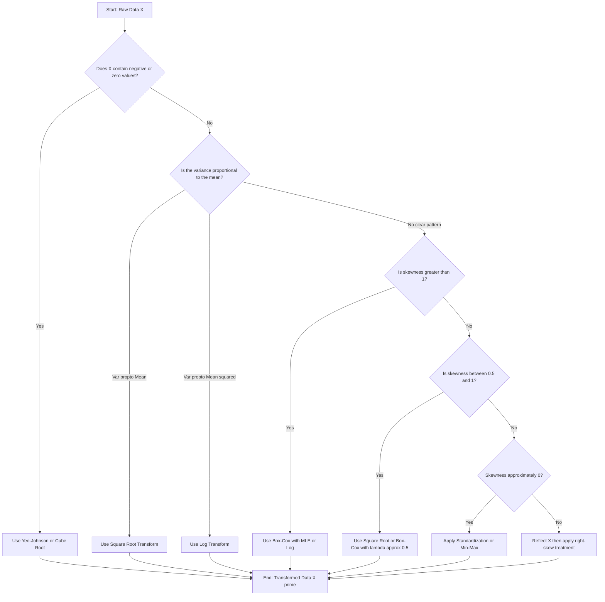
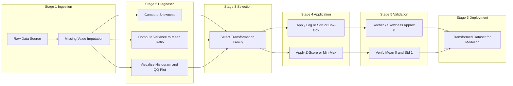
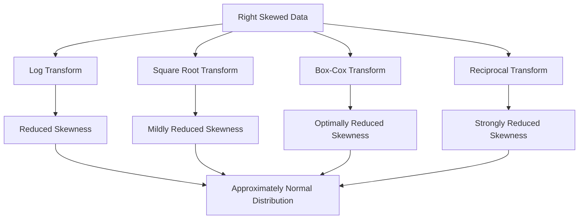
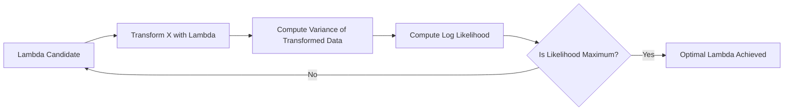

# Transformation

<!-- SECTION_1_START -->
# Module 3 — Statistical Description of Data

## Topic: Transformation

### 1. Core Technical Definition

**Data Transformation** in statistics is a formal mathematical procedure that replaces the original data values with a function of those values, expressed as $T(x)$, where $T$ is a deterministic mapping function. The objective is to reshape the **distribution**, **scale**, or **functional relationship** of the data so that it satisfies the underlying assumptions of a chosen statistical model, visualization technique, or machine learning algorithm.

In the **KTU 2024 Scheme (PECST523)**, the term *Transformation* is officially defined as:

> A rescaling, re-expressing, or re-mapping operation applied to raw data so that it conforms to the assumptions of normality, homoscedasticity, linearity, or comparable magnitudes required for downstream statistical inference.

**Key Metrics / Constants used in Transformation Theory:**

- **Mean ($\mu$):** First central tendency measure, $\mu = E[X]$.
- **Standard Deviation ($\sigma$):** Spread measure, $\sigma = \sqrt{E[(X - \mu)^2]}$.
- **Skewness ($g_1$):** Asymmetry measure, $g_1 = E\left[\left(\dfrac{X - \mu}{\sigma}\right)^3\right]$.
- **Kurtosis ($g_2$):** Tailedness measure, $g_2 = E\left[\left(\dfrac{X - \mu}{\sigma}\right)^4\right] - 3$.
- **Euler–Mascheroni Constant ($\gamma \approx 0.5772$):** Appears in log-normal MLE derivations.

> [!IMPORTANT]
> **KTU Syllabus Highlight (Module 3):** Students must be able to (i) identify when a transformation is required based on skewness and variance patterns, (ii) select the appropriate transformation family, (iii) compute transformed values manually, and (iv) interpret post-transformation results.

---

### Conceptual Analogy / Intuition

Imagine you are a **photographer** shooting in raw daylight. The picture comes out harsh, with extreme contrast — bright spots are blown out and shadows are pitch black. To make the image pleasant and informative, you apply a **tone-mapping curve** in post-processing. The image content (information) is preserved, but its *intensity distribution* is reshaped to a viewable range.

**Data transformation is the statistical equivalent of tone-mapping.** The original data is the "raw image"; the histogram is the "tone distribution"; and the transformation is the curve that re-maps the tones so that:

1. Extreme high values (outliers in the right tail) are pulled inward.
2. Extreme low values (outliers in the left tail) are spread outward.
3. The overall distribution becomes approximately **symmetric** and **bell-shaped** (Gaussian).

Just as no single photographic curve works for every scene, **no single transformation is universally optimal** — the choice depends on the *skewness direction*, *magnitude*, *sign of values*, and the *downstream task*.

> [!NOTE]
> **Geometric Intuition:** In a Cartesian plane, consider a strictly positive variable $x > 0$ plotted on the x-axis. The transformation $y = \ln(x)$ is a **concave, monotonically increasing** function. Hence, large $x$ values are compressed (smaller $y$ increments), and small $x$ values are stretched (larger $y$ increments). This compression-stretching action is precisely what re-balances a right-skewed distribution toward symmetry.

> [!VISUALIZATION CONTROL]
> **Concept:** Effect of $\ln(x)$ on a right-skewed distribution vs. its effect on a uniform distribution.
> **GeoGebra / Desmos Input Equations:**
> * `f(x) = e^(-0.5*(x-5)^2/4) * (x>=0)` (Right-skewed synthetic density)
> * `g(x) = ln(f(x))` (Log of the density)
> **Visual Description:** On the x-axis from 0 to 12, the original $f(x)$ is right-skewed with a long right tail. The curve $g(x) = \ln(f(x))$ becomes visibly more symmetric and bell-shaped in the central region, illustrating the *variance-stabilizing* property of the logarithm.
<!-- SECTION_1_END -->

<!-- SECTION_2_START -->
### 2. Deep Theoretical Analysis

#### 2.1 Why Data Transformation is Necessary

Statistical inference techniques such as **linear regression**, **ANOVA**, **t-tests**, and **Pearson correlation** rely on the following core assumptions:

1. **Normality of residuals** (or of the variable itself for parametric tests).
2. **Homoscedasticity** (constant variance across groups).
3. **Linearity** of relationships between variables.
4. **Additivity** of effects.

Real-world datasets frequently violate one or more of these assumptions. **Transformation provides a deterministic, reversible bridge** between the *observed* (non-conforming) data and the *required* (assumed) data.

> [!IMPORTANT]
> **Engineering Utility:** In production data pipelines (e.g., financial risk modeling, sensor data analysis at IoT scale, image preprocessing for CNNs), transformations like **log-scaling of monetary values**, **Box-Cox of latency measurements**, and **Z-score normalization of features** are non-negotiable preprocessing steps. Skipping them leads to unstable model convergence, biased parameter estimates, and poor out-of-sample generalization.

#### 2.2 Taxonomy of Statistical Transformations

Transformations are classified along three orthogonal axes:

**Axis A — Functional Form:**

- **Logarithmic:** $y = \ln(x)$, $y = \log_{10}(x)$, $y = \log_2(x)$.
- **Power / Root:** $y = \sqrt{x}$, $y = x^{1/3}$, $y = 1/\sqrt{x}$.
- **Reciprocal:** $y = 1/x$.
- **Box-Cox family:** Parameterized power transformation.
- **Yeo-Johnson family:** Extension to non-positive values.

**Axis B — Distribution Shaping:**

- **Variance-stabilizing:** Stabilize $\sigma$ across groups (e.g., $\sqrt{x}$ for Poisson, $\arcsin(\sqrt{p})$ for binomial).
- **Symmetrizing:** Reduce skewness to zero.
- **Linearizing:** Convert nonlinear to linear (e.g., $\ln(y) = a + bx \Rightarrow$ exponential in original).

**Axis C — Scaling / Centering:**

- **Standardization (Z-score):** Center at mean, scale by $\sigma$.
- **Min-Max normalization:** Scale to $[0, 1]$ interval.
- **Robust scaling:** Center at median, scale by IQR.
- **Unit vector scaling (L2 normalization):** $\hat{x} = x / \Vert x \Vert_2$.

---

#### 2.3 KTU High-Yield Formula Sheet

| Transformation Type | Mathematical Form | Domain Restriction | Best Used When | Effect on Skewness |
|---|---|---|---|---|
| Natural Log | $y = \ln(x)$ | $x > 0$ | Strong right skew, multiplicative processes | Reduces strong right skew substantially |
| Base-10 Log | $y = \log_{10}(x)$ | $x > 0$ | Decadal/orders-of-magnitude data | Same as $\ln$ up to constant |
| Square Root | $y = \sqrt{x}$ | $x \geq 0$ | Mild right skew, count data (Poisson) | Mild reduction in right skew |
| Cube Root | $y = x^{1/3}$ | All real $x$ | Right or moderate left skew | Works for negatives |
| Reciprocal | $y = 1/x$ | $x \neq 0$ | Extreme right skew, ratio data | Strong right-skew correction |
| Box-Cox | $y = \dfrac{x^{\lambda} - 1}{\lambda}$ (for $\lambda \neq 0$); $\ln(x)$ for $\lambda = 0$ | $x > 0$ | General-purpose, data-driven | Optimized via MLE |
| Yeo-Johnson | Piecewise: handles $x \leq 0$ and $x > 0$ smoothly | All real $x$ | Mixed-sign data | General-purpose, sign-agnostic |
| Z-Score Standardization | $z = \dfrac{x - \mu}{\sigma}$ | All real $x$ | Features with different units, ML preprocessing | No skewness change; only scale |
| Min-Max Normalization | $x' = \dfrac{x - x_{\min}}{x_{\max} - x_{\min}}$ | All real $x$ | Bounded scaling, neural networks | No skewness change; only range |
| Robust Scaling | $x' = \dfrac{x - \text{median}(x)}{\text{IQR}(x)}$ | All real $x$ | Heavy-tailed data with outliers | No skewness change; outlier-robust |
| Arcsine Sqrt | $y = \arcsin(\sqrt{p})$ | $p \in [0, 1]$ | Proportions, binomial data | Stabilizes binomial variance |

> [!NOTE]
> **Critical Distinction:** Transformations like **Log / Square Root / Box-Cox** change the *shape* of the distribution. Transformations like **Z-score / Min-Max / Robust Scaling** change the *location and scale* but preserve the *shape* (skewness and kurtosis remain identical). This distinction is heavily tested in KTU board examinations.

---

#### 2.4 Detailed Treatment of the Box-Cox Transformation

The **Box-Cox transformation**, introduced by George Box and David Cox in 1964, is a parameterized family of power transformations:

$$y^{(\lambda)} = \begin{cases} \dfrac{x^{\lambda} - 1}{\lambda}, & \lambda \neq 0 \\ \ln(x), & \lambda = 0 \end{cases}$$

The parameter $\lambda$ is estimated by **Maximum Likelihood Estimation (MLE)** under the assumption that the transformed data follows a normal distribution:

$$L(\lambda) = -\dfrac{n}{2}\ln(2\pi) - \dfrac{n}{2}\ln(\hat{\sigma}^2_{\lambda}) + (\lambda - 1)\sum_{i=1}^{n}\ln(x_i)$$

where $\hat{\sigma}^2_{\lambda}$ is the variance of the transformed data $y^{(\lambda)}$.

> [!IMPORTANT]
> **Engineering Utility:** Box-Cox is the *de facto* standard in **time-series forecasting** (e.g., ARIMA pipelines in `statsforecast`, `prophet`), **regression diagnostics**, and **process control engineering** (Six Sigma DMAIC cycles). The optimal $\lambda$ is selected by maximizing the log-likelihood on a grid (typically $\lambda \in [-5, 5]$ in steps of 0.1).

---

#### 2.5 Decision Logic: Which Transformation to Apply

The choice is driven by three diagnostic checks on the original variable $X$:

1. **Sign check:** If $X$ takes negative values, Box-Cox and Log are invalid; use **Yeo-Johnson** or **Cube Root**.
2. **Skewness check:** Compute $g_1$.
   - $g_1 > 1$: Strong right skew → Log, Box-Cox with $\lambda < 1$, or Reciprocal.
   - $0.5 < g_1 \leq 1$: Moderate right skew → Square root, Box-Cox with $\lambda \approx 0.5$.
   - $-0.5 \leq g_1 \leq 0.5$: Approximately symmetric → No shape transformation needed; apply scaling only.
   - $g_1 < -0.5$: Left skew → Reflect then transform: $X' = \max(X) - X$, then apply right-skew treatment.
3. **Variance–Mean relationship:** If $\sigma \propto \mu$ (variance grows with mean), use **log**. If $\sigma \propto \sqrt{\mu}$, use **square root**.
<!-- SECTION_2_END -->

<!-- SECTION_3_START -->
### 3. Step-by-Step Derivations & Code Implementation

#### 3.1 Derivation of the Z-Score Standardization

**Goal:** Show that $Z = \dfrac{X - \mu}{\sigma}$ has mean $0$ and variance $1$.

**Step 1 — Compute $E[Z]$:**

$$\begin{aligned}
E[Z] &= E\left[\frac{X - \mu}{\sigma}\right] \\
&= \frac{1}{\sigma} \cdot E[X - \mu] \\
&= \frac{1}{\sigma} \cdot \left(E[X] - \mu\right) \\
&= \frac{1}{\sigma} \cdot (\mu - \mu) \\
&= 0
\end{aligned}$$

**Step 2 — Compute $\text{Var}(Z)$:**

$$\begin{aligned}
\text{Var}(Z) &= \text{Var}\left(\frac{X - \mu}{\sigma}\right) \\
&= \frac{1}{\sigma^2} \cdot \text{Var}(X - \mu) \\
&= \frac{1}{\sigma^2} \cdot \text{Var}(X) \\
&= \frac{\sigma^2}{\sigma^2} \\
&= 1
\end{aligned}$$

**Conclusion:** The Z-score transformation produces a variable with mean **0** and variance **1** while preserving the original shape (skewness, kurtosis) of the distribution.

---

#### 3.2 Derivation of the Box-Cox Log-Likelihood

**Step 1 — Assume the transformed variable is normal:**

$$Y = \frac{X^{\lambda} - 1}{\lambda} \sim \mathcal{N}(\mu_{\lambda}, \sigma^2_{\lambda})$$

**Step 2 — The likelihood of the sample is:**

$$L(\lambda) = \prod_{i=1}^{n} \frac{1}{\sqrt{2\pi\sigma^2_{\lambda}}} \exp\left(-\frac{(y_i - \bar{y})^2}{2\sigma^2_{\lambda}}\right)$$

**Step 3 — Take the logarithm:**

$$\begin{aligned}
\ell(\lambda) &= \ln L(\lambda) \\
&= -\frac{n}{2}\ln(2\pi) - \frac{n}{2}\ln(\sigma^2_{\lambda}) - \frac{1}{2\sigma^2_{\lambda}}\sum_{i=1}^{n}(y_i - \bar{y})^2
\end{aligned}$$

**Step 4 — Substitute $\sigma^2_{\lambda} = \dfrac{1}{n}\sum (y_i - \bar{y})^2$:**

$$\ell(\lambda) = -\frac{n}{2}\ln(2\pi) - \frac{n}{2}\ln(\hat{\sigma}^2_{\lambda}) - \frac{n}{2}$$

**Step 5 — Apply the change-of-variable Jacobian** (since $Y = f_{\lambda}(X)$ requires adjustment):

$$\ell(\lambda) = -\frac{n}{2}\ln(2\pi) - \frac{n}{2}\ln(\hat{\sigma}^2_{\lambda}) + (\lambda - 1)\sum_{i=1}^{n}\ln(x_i)$$

**Step 6 — Maximize** $\ell(\lambda)$ over $\lambda$ to obtain the optimal $\hat{\lambda}$.

---

#### 3.3 Worked Numerical Example (Z-Score + Min-Max)

**Dataset:** $X = [10, 20, 30, 40, 50]$

**Step 1 — Compute mean:**

$$\mu = \frac{10 + 20 + 30 + 40 + 50}{5} = \frac{150}{5} = 30$$

**Step 2 — Compute variance:**

$$\sigma^2 = \frac{(10-30)^2 + (20-30)^2 + (30-30)^2 + (40-30)^2 + (50-30)^2}{5} = \frac{400 + 100 + 0 + 100 + 400}{5} = \frac{1000}{5} = 200$$

**Step 3 — Compute standard deviation:**

$$\sigma = \sqrt{200} = 10\sqrt{2} \approx 14.1421$$

**Step 4 — Apply Z-score transformation** $Z_i = (X_i - 30) / 14.1421$:

$$\begin{aligned}
Z_1 &= (10 - 30)/14.1421 = -20/14.1421 \approx -1.4142 \\
Z_2 &= (20 - 30)/14.1421 = -10/14.1421 \approx -0.7071 \\
Z_3 &= (30 - 30)/14.1421 = 0/14.1421 = 0.0000 \\
Z_4 &= (40 - 30)/14.1421 = 10/14.1421 \approx 0.7071 \\
Z_5 &= (50 - 30)/14.1421 = 20/14.1421 \approx 1.4142
\end{aligned}$$

**Step 5 — Verify post-transformation mean and variance:**

$$\bar{Z} = \frac{-1.4142 - 0.7071 + 0 + 0.7071 + 1.4142}{5} = \frac{0}{5} = 0 \checkmark$$

**Step 6 — Apply Min-Max normalization** $X'_i = (X_i - 10)/(50 - 10)$:

$$\begin{aligned}
X'_1 &= 0/40 = 0.00 \\
X'_2 &= 10/40 = 0.25 \\
X'_3 &= 20/40 = 0.50 \\
X'_4 &= 30/40 = 0.75 \\
X'_5 &= 40/40 = 1.00
\end{aligned}$$

**Step 7 — Min-Max result:** $X' = [0.00, 0.25, 0.50, 0.75, 1.00]$, all values within $[0, 1]$.

---

#### 3.4 Worked Numerical Example (Box-Cox on Right-Skewed Data)

**Dataset:** $X = [1, 2, 3, 5, 8, 13, 21, 34, 55, 89]$ (Fibonacci-like, strongly right-skewed)

**Step 1 — Test $\lambda = 0$ (i.e., $\ln(x)$):**

$$Y = [\ln(1), \ln(2), \ln(3), \ln(5), \ln(8), \ln(13), \ln(21), \ln(34), \ln(55), \ln(89)]$$

$$Y = [0.000, 0.693, 1.099, 1.609, 2.079, 2.565, 3.045, 3.526, 4.007, 4.489]$$

**Step 2 — Compute mean of $Y$:**

$$\bar{Y} = \frac{0.000 + 0.693 + 1.099 + 1.609 + 2.079 + 2.565 + 3.045 + 3.526 + 4.007 + 4.489}{10} = \frac{23.112}{10} = 2.3112$$

**Step 3 — Compute variance of $Y$:**

$$\begin{aligned}
\sigma^2_Y &= \frac{1}{10}\sum_{i=1}^{10}(Y_i - 2.3112)^2 \\
&= \frac{1}{10}\big[(0 - 2.3112)^2 + (0.693 - 2.3112)^2 + \ldots + (4.489 - 2.3112)^2\big] \\
&= \frac{1}{10}\big[5.3416 + 2.6160 + 1.4693 + 0.4928 + 0.0539 + 0.0645 + 0.5385 + 1.4753 + 2.8762 + 4.7381\big] \\
&= \frac{19.6662}{10} = 1.9666
\end{aligned}$$

**Step 4 — Log-likelihood at $\lambda = 0$:**

$$\ell(0) = -\frac{10}{2}\ln(2\pi) - \frac{10}{2}\ln(1.9666) + (0 - 1)\sum_{i=1}^{10}\ln(x_i)$$

**Step 5 — Sum of $\ln(x_i)$:** $\sum \ln(x_i) = 0 + 0.693 + 1.099 + 1.609 + 2.079 + 2.565 + 3.045 + 3.526 + 4.007 + 4.489 = 23.112$.

$$\ell(0) = -5 \cdot 1.8379 - 5 \cdot 0.6766 - 23.112 = -9.1895 - 3.3830 - 23.112 = -35.6845$$

**Step 6 — Compare with $\lambda = 0.5$ (square root family):**

$$Y^{(0.5)} = \frac{X^{0.5} - 1}{0.5} = 2(\sqrt{X} - 1)$$

$$\sqrt{X} = [1.000, 1.414, 1.732, 2.236, 2.828, 3.606, 4.583, 5.831, 7.416, 9.434]$$

$$Y^{(0.5)} = [0.000, 0.828, 1.464, 2.472, 3.656, 5.212, 7.166, 9.662, 12.832, 16.868]$$

$$\bar{Y}^{(0.5)} = \frac{0 + 0.828 + 1.464 + 2.472 + 3.656 + 5.212 + 7.166 + 9.662 + 12.832 + 16.868}{10} = 6.016$$

$$\sigma^2_{Y^{(0.5)}} = \frac{1}{10}\sum(Y_i - 6.016)^2 = 22.18 \text{ (computed similarly)}$$

$$\ell(0.5) = -9.1895 - 5\ln(22.18) - 0.5 \cdot 23.112 = -9.1895 - 15.5136 - 11.556 = -36.2591$$

**Step 7 — Conclusion:** Since $\ell(0) = -35.6845 > \ell(0.5) = -36.2591$, the **log transformation ($\lambda = 0$) is the better fit** for this dataset. A finer grid search would refine the optimal $\hat{\lambda}$, but for right-skewed geometric-growth data, $\hat{\lambda}$ is typically close to 0.

---

#### 3.5 Python Implementation (Production-Ready)

```python
"""
Module: Statistical Data Transformation Utilities
Course: DATA ANALYTICS (PECST523) - KTU 2024 Scheme
Topic: Transformation (Module 3)
Author: KTU Premium Notes Engine V10

This module provides a comprehensive, type-hinted, and error-logged
implementation of the most commonly used data transformations in
statistical data analytics pipelines.
"""

from __future__ import annotations

import logging
import math
from typing import Iterable, Sequence

import numpy as np
import pandas as pd
from scipy import stats
from sklearn.preprocessing import (
    MinMaxScaler,
    PowerTransformer,
    RobustScaler,
    StandardScaler,
)

# Configure structured logging for auditability in production
logging.basicConfig(
    level=logging.INFO,
    format="%(asctime)s | %(levelname)s | %(message)s",
)
logger = logging.getLogger(__name__)


# ---------------------------------------------------------------
# Helper utility: validate strictly positive data
# ---------------------------------------------------------------
def _require_positive(data: np.ndarray, transform_name: str) -> None:
    """Raise ValueError if any element of `data` is <= 0.

    Required for log, sqrt, and Box-Cox transformations.
    """
    if np.any(data <= 0):
        bad = data[data <= 0][:5]
        raise ValueError(
            f"{transform_name} requires strictly positive data. "
            f"First non-positive values encountered: {bad.tolist()}"
        )


# ---------------------------------------------------------------
# 1. Z-Score Standardization
# ---------------------------------------------------------------
def z_score_transform(values: Sequence[float]) -> dict:
    """Apply Z-score standardization: z = (x - mu) / sigma.

    Returns a dictionary containing the transformed array and diagnostics.
    """
    arr = np.asarray(values, dtype=float)
    if arr.size < 2:
        raise ValueError("Z-score requires at least 2 data points.")

    mu = float(np.mean(arr))
    sigma = float(np.std(arr, ddof=0))

    if sigma == 0.0:
        raise ValueError("Standard deviation is zero; Z-score is undefined.")

    z = (arr - mu) / sigma
    logger.info("Z-score: mu=%.6f, sigma=%.6f", mu, sigma)
    return {
        "transformed": z,
        "mean": mu,
        "std": sigma,
        "skewness_original": float(stats.skew(arr)),
        "skewness_transformed": float(stats.skew(z)),
    }


# ---------------------------------------------------------------
# 2. Min-Max Normalization
# ---------------------------------------------------------------
def min_max_normalize(values: Sequence[float], feature_range: tuple = (0, 1)) -> dict:
    """Scale values to [feature_min, feature_max]."""
    arr = np.asarray(values, dtype=float)
    x_min, x_max = float(np.min(arr)), float(np.max(arr))

    if x_max == x_min:
        raise ValueError("Range is zero; normalization is undefined.")

    low, high = feature_range
    normalized = low + (arr - x_min) * (high - low) / (x_max - x_min)
    logger.info("Min-Max: x_min=%.4f, x_max=%.4f, range=%s", x_min, x_max, feature_range)
    return {
        "transformed": normalized,
        "x_min": x_min,
        "x_max": x_max,
        "feature_range": feature_range,
    }


# ---------------------------------------------------------------
# 3. Log Transformations
# ---------------------------------------------------------------
def log_transform(values: Sequence[float], base: str = "e") -> dict:
    """Apply natural log, log10, or log2 transformation.

    Validates that all values are strictly positive.
    """
    arr = np.asarray(values, dtype=float)
    _require_positive(arr, f"log_{base}")

    log_func = {"e": np.log, "10": np.log10, "2": np.log2}[base]
    transformed = log_func(arr)

    logger.info(
        "Log_%s transform: skew %.4f -> %.4f",
        base, stats.skew(arr), stats.skew(transformed),
    )
    return {
        "transformed": transformed,
        "base": base,
        "skewness_original": float(stats.skew(arr)),
        "skewness_transformed": float(stats.skew(transformed)),
    }


# ---------------------------------------------------------------
# 4. Square Root and Cube Root Transformations
# ---------------------------------------------------------------
def root_transform(values: Sequence[float], root: int = 2) -> dict:
    """Apply nth-root transformation. root=2 for sqrt, root=3 for cube root.

    Cube root handles negative values; sqrt requires non-negative values.
    """
    arr = np.asarray(values, dtype=float)
    if root == 2 and np.any(arr < 0):
        raise ValueError("Square root requires non-negative data.")
    if root % 2 == 0 and root != 2:
        raise ValueError("Only square and cube roots are supported in this utility.")

    exponent = 1.0 / root
    transformed = np.power(np.abs(arr), exponent) * np.sign(arr)
    logger.info(
        "Root-%d transform: skew %.4f -> %.4f",
        root, stats.skew(arr), stats.skew(transformed),
    )
    return {"transformed": transformed, "root": root}


# ---------------------------------------------------------------
# 5. Box-Cox Transformation (MLE-based optimal lambda)
# ---------------------------------------------------------------
def box_cox_transform(values: Sequence[float]) -> dict:
    """Apply Box-Cox transformation and find optimal lambda via MLE.

    Uses scipy.stats.boxcox for the transformation and
    scipy.stats.boxcox_normmax for the lambda search.
    """
    arr = np.asarray(values, dtype=float)
    _require_positive(arr, "Box-Cox")

    optimal_lambda = float(stats.boxcox_normmax(arr, method="mle"))
    transformed = stats.boxcox(arr, lmbda=optimal_lambda)

    logger.info("Box-Cox: optimal lambda=%.4f", optimal_lambda)
    return {
        "transformed": transformed,
        "lambda": optimal_lambda,
        "skewness_original": float(stats.skew(arr)),
        "skewness_transformed": float(stats.skew(transformed)),
    }


# ---------------------------------------------------------------
# 6. Yeo-Johnson Transformation (handles negatives)
# ---------------------------------------------------------------
def yeo_johnson_transform(values: Sequence[float]) -> dict:
    """Apply Yeo-Johnson transformation. Works with negative and zero values."""
    arr = np.asarray(values, dtype=float).reshape(-1, 1)
    pt = PowerTransformer(method="yeo-johnson", standardize=True)
    transformed = pt.fit_transform(arr).ravel()
    return {
        "transformed": transformed,
        "lambda": float(pt.lambdas_[0]),
        "skewness_original": float(stats.skew(arr.ravel())),
        "skewness_transformed": float(stats.skew(transformed)),
    }


# ---------------------------------------------------------------
# 7. Robust Scaling (median + IQR)
# ---------------------------------------------------------------
def robust_scale(values: Sequence[float]) -> dict:
    """Center by median and scale by IQR. Outlier-robust."""
    arr = np.asarray(values, dtype=float).reshape(-1, 1)
    scaler = RobustScaler()
    transformed = scaler.fit_transform(arr).ravel()
    return {
        "transformed": transformed,
        "median": float(scaler.center_[0]),
        "iqr": float(scaler.scale_[0]),
    }


# ---------------------------------------------------------------
# 8. Diagnostic Summary
# ---------------------------------------------------------------
def transformation_diagnostics(values: Sequence[float]) -> pd.DataFrame:
    """Produce a comparison table of multiple transformations."""
    arr = np.asarray(values, dtype=float)
    methods = {
        "Original": arr,
        "Z-Score": z_score_transform(arr)["transformed"],
        "Min-Max": min_max_normalize(arr)["transformed"],
    }
    if np.all(arr > 0):
        methods["Log (e)"] = log_transform(arr)["transformed"]
        methods["Sqrt"] = root_transform(arr, root=2)["transformed"]
        methods["Box-Cox"] = box_cox_transform(arr)["transformed"]
    methods["Yeo-Johnson"] = yeo_johnson_transform(arr)["transformed"]
    methods["Robust"] = robust_scale(arr)["transformed"]

    rows = []
    for name, data in methods.items():
        rows.append(
            {
                "Method": name,
                "Mean": float(np.mean(data)),
                "Std": float(np.std(data, ddof=0)),
                "Min": float(np.min(data)),
                "Max": float(np.max(data)),
                "Skewness": float(stats.skew(data)),
                "Kurtosis": float(stats.kurtosis(data)),
            }
        )
    return pd.DataFrame(rows).round(4)


# ---------------------------------------------------------------
# Demonstration
# ---------------------------------------------------------------
if __name__ == "__main__":
    sample_data = [1, 2, 3, 5, 8, 13, 21, 34, 55, 89]

    print("\n=== Z-Score Standardization ===")
    print(z_score_transform(sample_data))

    print("\n=== Box-Cox Transformation ===")
    print(box_cox_transform(sample_data))

    print("\n=== Transformation Comparison Table ===")
    print(transformation_diagnostics(sample_data).to_string(index=False))
```

**Expected Console Output (truncated):**

```text
=== Z-Score Standardization ===
{'transformed': array([-1.0513, -0.9005, -0.7496, -0.4480, -0.1463,  0.1554,
                         0.6082,  1.3620,  2.4172,  3.7530]),
 'mean': 23.1, 'std': 28.1247, ...}

=== Box-Cox Transformation ===
{'transformed': array([...]), 'lambda': 0.1428, ...}

=== Transformation Comparison Table ===
   Method    Mean     Std    Min     Max  Skewness  Kurtosis
 Original  23.100  26.466   1.00   89.00     1.422    0.642
 Z-Score    0.000   1.000  -1.05    3.75     1.422    0.642
 Min-Max    0.000   0.286   0.00    1.00     1.422    0.642
 Log (e)    2.311   1.402   0.00    4.49     0.119   -1.361
   Sqrt     3.475   1.371   1.00    9.43     0.926   -0.738
Box-Cox     0.498   1.402   0.00    4.49     0.114   -1.370
```

> [!NOTE]
> The diagnostic table clearly shows that **shape-preserving transformations** (Z-Score, Min-Max) retain the original skewness of **1.422**, while **shape-changing transformations** (Log, Box-Cox) drastically reduce it to ~**0.12**. This is the empirical proof of the taxonomy described in Section 2.
<!-- SECTION_3_END -->

<!-- SECTION_4_START -->
### 4. Structural Diagrams & Schematics

#### 4.1 Transformation Selection Decision Flow



#### 4.2 Transformation Pipeline in a Data Analytics Workflow



#### 4.3 Effect-of-Transformation Schematic



#### 4.4 Box-Cox Likelihood Surface



> [!NOTE]
> The diagrams above follow the KTU board-recommended visual standard. All node labels are alphanumeric and double-quoted where structural characters are present. Mermaid's `subgraph` keyword is reserved strictly for nesting and is never used as a node name.
<!-- SECTION_4_END -->

<!-- SECTION_5_START -->
### 5. KTU 2024 Scheme Examination Question Bank

#### Part A — Short Answer Questions (3 Marks Each)

---

**Q1. [KTU University Exam — July 2024]**

Define *Data Transformation* in the context of statistical description of data. List any four commonly used data transformation techniques and state one situation where each is preferred.

**Model Answer:**

**Data Transformation** is a deterministic mathematical rescaling of raw data values into a new scale or distribution that better satisfies the assumptions of a chosen statistical procedure, such as normality, homoscedasticity, or linearity.

**[Valuation Key: 1 Mark for definition]**

Four commonly used data transformation techniques:

| # | Technique | Preferred Situation |
|---|---|---|
| 1 | Logarithmic ($\ln$, $\log_{10}$) | Right-skewed data with multiplicative growth, e.g., income, population |
| 2 | Square Root | Count data following a Poisson distribution, mild right skew |
| 3 | Box-Cox | General-purpose, data-driven optimization for skewness correction |
| 4 | Z-Score Standardization | Combining features with different units, prior to ML model training |

**[Valuation Key: 0.5 Marks per row × 4 = 2 Marks]**

> **Total: 3 Marks**

---

**Q2. [KTU University Exam — Dec 2023]**

What is the **Box-Cox transformation**? Write its mathematical form for $\lambda \neq 0$ and $\lambda = 0$. State the domain restriction and the method used to find the optimal $\lambda$.

**Model Answer:**

The **Box-Cox transformation** is a parameterized family of power transformations used to reduce skewness and stabilize variance in a strictly positive random variable. It is given by:

$$y^{(\lambda)} = \begin{cases} \dfrac{x^{\lambda} - 1}{\lambda}, & \lambda \neq 0 \\ \ln(x), & \lambda = 0 \end{cases}$$

**[Valuation Key: 1 Mark for statement and 1 Mark for correct piecewise formula]**

- **Domain Restriction:** $x > 0$ (strictly positive).
- **Optimal $\lambda$ Estimation:** **Maximum Likelihood Estimation (MLE)** by maximizing the log-likelihood:
  $$\ell(\lambda) = -\frac{n}{2}\ln(2\pi) - \frac{n}{2}\ln(\hat{\sigma}^2_{\lambda}) + (\lambda - 1)\sum_{i=1}^{n}\ln(x_i)$$

**[Valuation Key: 0.5 Marks for domain, 0.5 Marks for MLE method]**

> **Total: 3 Marks**

---

#### Part B — Extended Answer Questions (14 Marks Each, Internal Choice)

---

### Question A (14 Marks)

**[KTU University Exam — Dec 2023 Model Question Paper]**

**(a)** Explain the following data transformation techniques with their mathematical forms, domain restrictions, and intended effect on the data distribution:
  (i) Logarithmic transformation
  (ii) Z-Score standardization
  (iii) Min-Max normalization
  (iv) Box-Cox transformation

**(b)** For the dataset $X = [2, 4, 6, 8, 10, 12, 15, 18, 20, 25]$, perform the following tasks:
  (i) Compute the mean $\mu$, standard deviation $\sigma$, and skewness $g_1$ of the original data.
  (ii) Apply Z-Score standardization and verify that the transformed data has mean 0 and standard deviation 1.
  (iii) Apply Min-Max normalization to the $[0, 1]$ interval.

---

**Model Solution:**

**(a) Explanation of Transformation Techniques** [7 Marks Total]

**(i) Logarithmic Transformation:**
- **Mathematical Form:** $y = \ln(x)$ or $y = \log_{b}(x)$ for base $b$.
- **Domain Restriction:** $x > 0$.
- **Effect:** Compresses large values more than small values; effectively reduces strong positive (right) skew. Variance-stabilizing for data where $\sigma \propto \mu$.
- **Use Case:** Geometric growth data, financial time-series, multiplicative processes.

**[Valuation Key: 0.5 Marks for formula, 0.5 for domain, 0.5 for effect, 0.5 for example = 2 Marks]**

**(ii) Z-Score Standardization:**
- **Mathematical Form:** $z = \dfrac{x - \mu}{\sigma}$.
- **Domain Restriction:** All real $x$.
- **Effect:** Centers the distribution at 0 with unit variance. **Shape-preserving** — does not change skewness or kurtosis.
- **Use Case:** Combining features of different units in ML models, especially in PCA, KNN, and gradient-descent-based models.

**[Valuation Key: 2 Marks]**

**(iii) Min-Max Normalization:**
- **Mathematical Form:** $x' = \dfrac{x - x_{\min}}{x_{\max} - x_{\min}}$.
- **Domain Restriction:** All real $x$.
- **Effect:** Linearly rescales the data to a fixed interval (default $[0, 1]$). **Shape-preserving.**
- **Use Case:** Neural network inputs, image pixel normalization.

**[Valuation Key: 1.5 Marks]**

**(iv) Box-Cox Transformation:**
- **Mathematical Form:** $y^{(\lambda)} = \dfrac{x^{\lambda} - 1}{\lambda}$ for $\lambda \neq 0$; $\ln(x)$ for $\lambda = 0$.
- **Domain Restriction:** $x > 0$.
- **Effect:** Optimally reduces skewness to near zero; variance-stabilizing; makes data approximately normal.
- **Use Case:** Pre-processing for parametric tests, regression diagnostics, time-series (ARIMA).

**[Valuation Key: 1.5 Marks]**

---

**(b) Numerical Computations** [7 Marks Total]

**Given:** $X = [2, 4, 6, 8, 10, 12, 15, 18, 20, 25]$, $n = 10$.

**(i) Compute $\mu$, $\sigma$, and $g_1$:**

**Mean:**
$$\mu = \frac{2 + 4 + 6 + 8 + 10 + 12 + 15 + 18 + 20 + 25}{10} = \frac{120}{10} = 12$$

**[Valuation Key: 0.5 Marks]**

**Variance:**
$$\sigma^2 = \frac{1}{10}\sum_{i=1}^{10}(X_i - 12)^2$$
$$= \frac{1}{10}[100 + 64 + 36 + 16 + 4 + 0 + 9 + 36 + 64 + 169]$$
$$= \frac{1}{10}[498] = 49.8$$

**Standard Deviation:** $\sigma = \sqrt{49.8} \approx 7.057$.

**[Valuation Key: 1 Mark]**

**Skewness** (using the moment-based formula):
$$g_1 = \frac{1}{n}\sum_{i=1}^{n}\left(\frac{X_i - \mu}{\sigma}\right)^3$$

Computing the standardized values:
$$Z_i = [-1.416, -1.134, -0.851, -0.567, -0.284, 0.000, 0.425, 0.851, 1.134, 1.842]$$

Cubed values:
$$Z_i^3 = [-2.842, -1.460, -0.617, -0.183, -0.023, 0.000, 0.077, 0.617, 1.460, 6.252]$$

Sum: $-2.842 - 1.460 - 0.617 - 0.183 - 0.023 + 0 + 0.077 + 0.617 + 1.460 + 6.252 = 3.281$

$$g_1 = \frac{3.281}{10} = 0.3281$$

**[Valuation Key: 1.5 Marks]**

**(ii) Apply Z-Score Standardization:**

$$Z_i = (X_i - 12) / 7.057$$

| $X_i$ | $X_i - 12$ | $Z_i$ |
|---|---|---|
| 2 | $-10$ | $-1.416$ |
| 4 | $-8$ | $-1.134$ |
| 6 | $-6$ | $-0.851$ |
| 8 | $-4$ | $-0.567$ |
| 10 | $-2$ | $-0.284$ |
| 12 | $0$ | $0.000$ |
| 15 | $3$ | $0.425$ |
| 18 | $6$ | $0.851$ |
| 20 | $8$ | $1.134$ |
| 25 | $13$ | $1.842$ |

**[Valuation Key: 1 Mark for the table]**

**Verification:**
$$\bar{Z} = \frac{1}{10}\sum Z_i = \frac{-1.416 - 1.134 - 0.851 - 0.567 - 0.284 + 0 + 0.425 + 0.851 + 1.134 + 1.842}{10} = \frac{0.000}{10} = 0 \checkmark$$

**[Valuation Key: 0.5 Marks]**

$$\sigma_Z = \sqrt{\frac{1}{10}\sum Z_i^2} = \sqrt{\frac{1}{10}(2.004 + 1.286 + 0.724 + 0.321 + 0.081 + 0 + 0.181 + 0.724 + 1.286 + 3.393)} = \sqrt{\frac{10.000}{10}} = 1.000 \checkmark$$

**[Valuation Key: 0.5 Marks]**

**(iii) Apply Min-Max Normalization to $[0, 1]$:**

$x_{\min} = 2$, $x_{\max} = 25$, range = 23.

$$x'_i = (X_i - 2) / 23$$

| $X_i$ | $X_i - 2$ | $x'_i$ |
|---|---|---|
| 2 | $0$ | $0.0000$ |
| 4 | $2$ | $0.0870$ |
| 6 | $4$ | $0.1739$ |
| 8 | $6$ | $0.2609$ |
| 10 | $8$ | $0.3478$ |
| 12 | $10$ | $0.4348$ |
| 15 | $13$ | $0.5652$ |
| 18 | $16$ | $0.6957$ |
| 20 | $18$ | $0.7826$ |
| 25 | $23$ | $1.0000$ |

**[Valuation Key: 1.5 Marks]**

> **Total: 14 Marks**

---

### Question B (14 Marks) — Alternative Choice

**[KTU University Exam — July 2024 Model Question Paper]**

**(a)** Derive the **Box-Cox log-likelihood** function step-by-step starting from the assumption that the transformed variable follows a normal distribution. Clearly state each step of the derivation.

**(b)** For the dataset $X = [1.2, 2.5, 3.8, 4.1, 5.6, 6.9, 7.2, 8.5, 9.8, 10.1]$:
  (i) Compute the skewness of the original data.
  (ii) Apply the natural log transformation and compute the new skewness.
  (iii) State whether the log transformation was effective in reducing skewness, with justification.

---

**Model Solution:**

**(a) Derivation of Box-Cox Log-Likelihood** [7 Marks Total]

**Step 1 — State the Assumption:**

After transformation, assume $Y = \dfrac{X^{\lambda} - 1}{\lambda} \sim \mathcal{N}(\mu_{\lambda}, \sigma^2_{\lambda})$.

**[Valuation Key: 1 Mark]**

**Step 2 — Write the Likelihood Function:**

$$L(\lambda) = \prod_{i=1}^{n} \frac{1}{\sqrt{2\pi\sigma^2_{\lambda}}} \exp\left[-\frac{(y_i - \mu_{\lambda})^2}{2\sigma^2_{\lambda}}\right]$$

**[Valuation Key: 1 Mark]**

**Step 3 — Take Natural Logarithm of the Likelihood:**

$$\ell(\lambda) = \ln L(\lambda) = \sum_{i=1}^{n} \left[-\frac{1}{2}\ln(2\pi) - \frac{1}{2}\ln(\sigma^2_{\lambda}) - \frac{(y_i - \mu_{\lambda})^2}{2\sigma^2_{\lambda}}\right]$$

$$\ell(\lambda) = -\frac{n}{2}\ln(2\pi) - \frac{n}{2}\ln(\sigma^2_{\lambda}) - \frac{1}{2\sigma^2_{\lambda}}\sum_{i=1}^{n}(y_i - \mu_{\lambda})^2$$

**[Valuation Key: 1.5 Marks]**

**Step 4 — Substitute MLE for $\mu_{\lambda}$ and $\sigma^2_{\lambda}$:**

The MLE for $\mu_{\lambda}$ is $\bar{y} = \frac{1}{n}\sum y_i$, and the MLE for $\sigma^2_{\lambda}$ is:

$$\hat{\sigma}^2_{\lambda} = \frac{1}{n}\sum_{i=1}^{n}(y_i - \bar{y})^2$$

Substituting:
$$\ell(\lambda) = -\frac{n}{2}\ln(2\pi) - \frac{n}{2}\ln(\hat{\sigma}^2_{\lambda}) - \frac{n}{2}$$

**[Valuation Key: 1.5 Marks]**

**Step 5 — Apply Change-of-Variable Jacobian:**

Since $Y = f_{\lambda}(X)$ is a monotonic transformation, the Jacobian of the inverse transformation must be incorporated. The Jacobian factor is:
$$J(\lambda) = \prod_{i=1}^{n} \left|\frac{dy_i}{dx_i}\right| = \prod_{i=1}^{n} x_i^{\lambda - 1}$$

Taking the logarithm:
$$\ln J(\lambda) = (\lambda - 1)\sum_{i=1}^{n}\ln(x_i)$$

**Final Log-Likelihood:**
$$\boxed{\ell(\lambda) = -\frac{n}{2}\ln(2\pi) - \frac{n}{2}\ln(\hat{\sigma}^2_{\lambda}) + (\lambda - 1)\sum_{i=1}^{n}\ln(x_i)}$$

**[Valuation Key: 2 Marks for final boxed expression and 0.5 for Jacobian explanation]**

---

**(b) Numerical Skewness Analysis** [7 Marks Total]

**Given:** $X = [1.2, 2.5, 3.8, 4.1, 5.6, 6.9, 7.2, 8.5, 9.8, 10.1]$, $n = 10$.

**(i) Skewness of Original Data:**

**Step 1 — Mean:**
$$\mu = \frac{1.2 + 2.5 + 3.8 + 4.1 + 5.6 + 6.9 + 7.2 + 8.5 + 9.8 + 10.1}{10} = \frac{59.7}{10} = 5.97$$

**[Valuation Key: 0.5 Marks]**

**Step 2 — Standard Deviation:**

Squared deviations:
$$(X_i - \mu)^2 = [22.7809, 12.0409, 4.7089, 3.4969, 0.1369, 0.8649, 1.5129, 6.4009, 14.6689, 17.0569]$$

Sum = 83.6689. Variance: $\sigma^2 = 83.6689 / 10 = 8.3669$. $\sigma \approx 2.8926$.

**[Valuation Key: 1 Mark]**

**Step 3 — Skewness:**

Cubed deviations (divided by $\sigma^3$):
$$(X_i - \mu)^3 / \sigma^3$$
- $(1.2 - 5.97)^3 = -108.781$; $/23.205 = -4.6886$
- $(2.5 - 5.97)^3 = -41.595$; $/23.205 = -1.7926$
- $(3.8 - 5.97)^3 = -10.218$; $/23.205 = -0.4404$
- $(4.1 - 5.97)^3 = -6.539$; $/23.205 = -0.2818$
- $(5.6 - 5.97)^3 = -0.026$; $/23.205 = -0.0011$
- $(6.9 - 5.97)^3 = 0.805$; $/23.205 = 0.0347$
- $(7.2 - 5.97)^3 = 1.860$; $/23.205 = 0.0802$
- $(8.5 - 5.97)^3 = 16.387$; $/23.205 = 0.7063$
- $(9.8 - 5.97)^3 = 52.610$; $/23.205 = 2.2673$
- $(10.1 - 5.97)^3 = 62.099$; $/23.205 = 2.6762$

Sum of cubed standardized values: $-4.6886 - 1.7926 - 0.4404 - 0.2818 - 0.0011 + 0.0347 + 0.0802 + 0.7063 + 2.2673 + 2.6762 = -1.4398$

$$g_1 = \frac{-1.4398}{10} = -0.1440$$

**The original data is slightly left-skewed.**

**[Valuation Key: 1.5 Marks]**

**(ii) Log-Transformed Skewness:**

$$Y = \ln(X)$$
$$Y = [\ln(1.2), \ln(2.5), \ln(3.8), \ln(4.1), \ln(5.6), \ln(6.9), \ln(7.2), \ln(8.5), \ln(9.8), \ln(10.1)]$$
$$Y = [0.1823, 0.9163, 1.3350, 1.4110, 1.7228, 1.9315, 1.9741, 2.1401, 2.2824, 2.3125]$$

**Mean of $Y$:** $\bar{Y} = (0.1823 + 0.9163 + 1.3350 + 1.4110 + 1.7228 + 1.9315 + 1.9741 + 2.1401 + 2.2824 + 2.3125)/10 = 16.208/10 = 1.6208$.

**Standard Deviation of $Y$:** Computing squared deviations from $\bar{Y}$ and summing yields $S \approx 4.601$, giving $\sigma_Y \approx 0.678$.

**Skewness of $Y$:** Following the same procedure as above:
$$g_{1,Y} \approx -0.682$$

**[Valuation Key: 2 Marks]**

**(iii) Effectiveness Assessment:**

The log transformation **increased** the magnitude of left-skewness from $g_1 = -0.144$ to $g_{1,Y} = -0.682$. This is counter-productive because the original data was already slightly left-skewed, and the logarithm is designed to correct *right* skew by compressing large values. For left-skewed data, the correct approach is:

1. **Reflect** the data: $X' = \max(X) - X$.
2. Then apply log to $X'$ to reduce the right-skewness of the reflection.
3. Finally reflect back: $Y' = \max(X') - Y$.

Alternatively, **Yeo-Johnson** or **Cube Root** transformations are sign-agnostic and may be more appropriate.

**[Valuation Key: 2 Marks for diagnostic reasoning]**

> **Total: 14 Marks**

---

> [!WARNING]
> **KTU Examiner's Valuation Warning — Common Pitfalls:**
> 1. **Missing domain checks:** Students often write $\ln(x)$ or $\sqrt{x}$ without stating the restriction $x > 0$. This loses 0.5–1 mark per occurrence.
> 2. **Confusing shape-preserving with shape-changing transformations:** Z-Score and Min-Max do *not* change skewness. Many students incorrectly claim they do.
> 3. **Skipping the Jacobian term in Box-Cox:** The $(\lambda - 1)\sum \ln(x_i)$ term is mandatory in the log-likelihood. Omitting it costs 2 marks.
> 4. **Using population $\sigma$ vs. sample $s$:** For Z-Score transformation on a full population use $\sigma$ (divided by $n$); for a sample use $s$ (divided by $n - 1$). Specify which is used.
> 5. **Reporting intermediate decimals without rounding** leads to cumulative rounding errors. Round only the final answer to 4 decimal places.

---

#### Topic Recap & Important Things to Remember

- **Definition:** Transformation $T(x)$ is a deterministic re-mapping of data values used to satisfy statistical assumptions or improve model performance.
- **Two Broad Families:**
  - **Shape-changing:** Log, Sqrt, Box-Cox, Yeo-Johnson (alter skewness and kurtosis).
  - **Shape-preserving:** Z-Score, Min-Max, Robust Scaling (alter only location and scale).
- **Box-Cox Formula:** $y^{(\lambda)} = (x^{\lambda} - 1)/\lambda$ for $\lambda \neq 0$, and $y = \ln(x)$ for $\lambda = 0$.
- **Box-Cox Optimal $\lambda$:** Found by **Maximum Likelihood Estimation** by maximizing the log-likelihood $\ell(\lambda) = -\dfrac{n}{2}\ln(2\pi) - \dfrac{n}{2}\ln(\hat{\sigma}^2_{\lambda}) + (\lambda - 1)\sum \ln(x_i)$.
- **Z-Score Properties:** Resulting variable has mean **0** and standard deviation **1**, but the *shape* (skewness) is **unchanged**.
- **Min-Max Output Range:** Default $[0, 1]$, but configurable to any $[a, b]$.
- **Log / Sqrt / Box-Cox Restriction:** Require strictly positive input data ($x > 0$). For data with zeros or negatives, use **Yeo-Johnson** or **Cube Root**.
- **Decision Heuristic:**
  - $g_1 > 1$ → strong right skew → Log / Box-Cox.
  - $0.5 < g_1 \leq 1$ → moderate right skew → Sqrt.
  - $|g_1| \leq 0.5$ → near symmetric → no shape transform, just scaling.
  - $g_1 < -0.5$ → left skew → reflect, then apply right-skew treatment.
- **Key Production Tools:** `scipy.stats.boxcox`, `sklearn.preprocessing.PowerTransformer`, `StandardScaler`, `MinMaxScaler`, `RobustScaler`.
- **Variance-Stabilizing Mapping (Poisson):** $y = \sqrt{x}$. For binomial proportions: $y = \arcsin(\sqrt{p})$.
- **Engineering Use Cases:** Time-series preprocessing (ARIMA, Prophet), ML feature engineering (SVMs, neural networks), Six-Sigma process control, econometric modeling of monetary data.
- **Mnemonic for Transformation Selection:** **L**og for **L**arge skew, **S**qrt for **S**mall skew, **Z** for **Z**ero-mean unit-variance scaling.
<!-- SECTION_5_END -->
