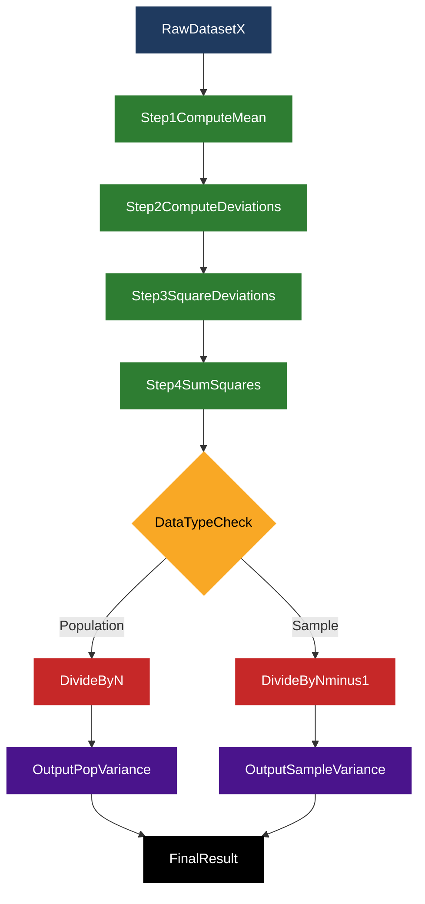
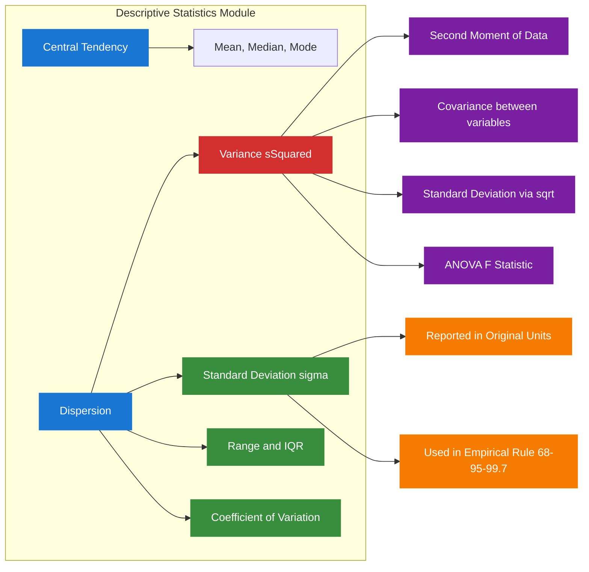
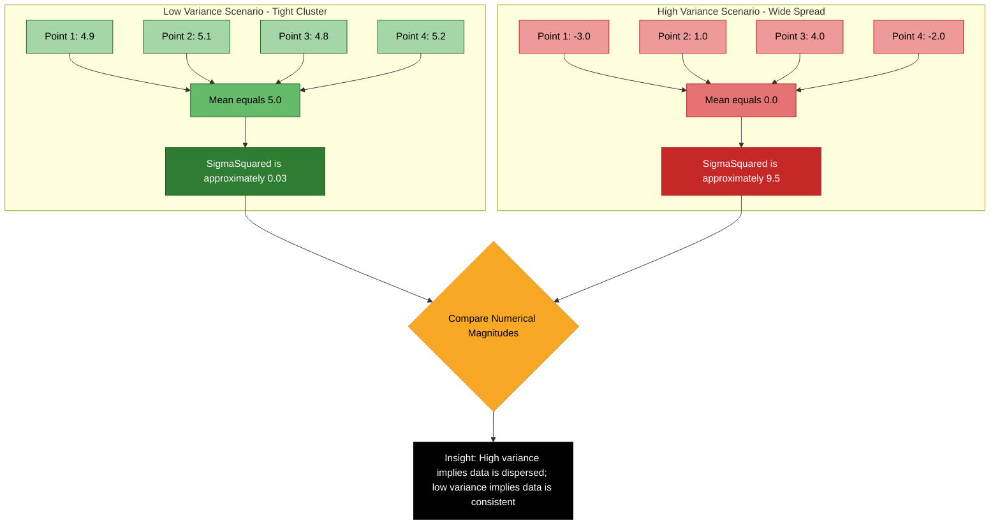
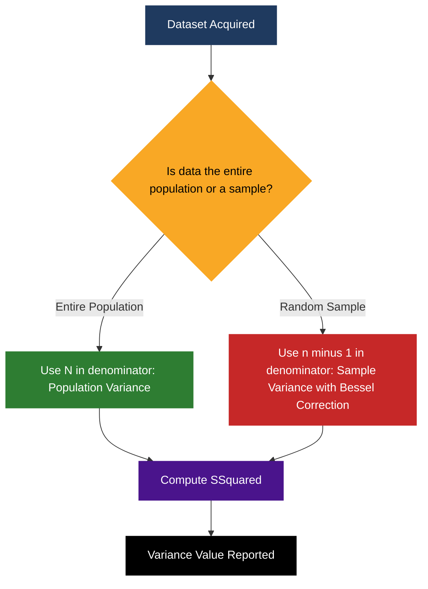

# Variance

<!-- SECTION_1_START -->
# Variance — Core Technical Definition & Intuitive Overview

## Formal KTU 2024 Syllabus Definition

> [!NOTE]
> **Variance** is a fundamental **measure of dispersion** in descriptive statistics that quantifies the *average squared deviation* of every data point in a dataset from the dataset's **arithmetic mean**. It belongs to the family of *second-moment statistics* and serves as the foundational building block for **Standard Deviation**, **Covariance**, **Correlation**, and the entire framework of **Parametric Inferential Statistics**.

Mathematically, the variance of a random variable $X$ is formally defined as the *expected value of the squared deviation from the mean*:

$$\sigma^{2} = \operatorname{Var}(X) = E\!\left[(X - \mu)^{2}\right]$$

where $\mu$ represents the population mean and $E[\cdot]$ denotes the mathematical **expectation operator**. The **unit of variance** is the *square of the unit of the original data*, and the variance is always a **non-negative real number**, i.e., $\sigma^{2} \geq 0$.

### Two Operational Variants of Variance

| Variant | Symbol | Use Case | Denominator |
| :--- | :---: | :--- | :---: |
| **Population Variance** | $\sigma^{2}$ | When the dataset represents the *entire* population | $N$ |
| **Sample Variance** | $s^{2}$ | When the dataset is a *random sample* drawn from a larger population | $n - 1$ |

The distinction between $N$ and $n-1$ is known as **Bessel's Correction**, and it provides an *unbiased estimator* of the true population variance.

---

## Conceptual Analogy / Intuition

> [!IMPORTANT]
> **Real-World Analogy — The "Bouncing Rubber Ball" Model:**
>
> Imagine you drop **5 rubber balls** from the same height onto a horizontal plank. The *mean* tells you where the plank is positioned on the floor. Now look at the *heights* at which the balls come to rest after bouncing:
> - If **all 5 balls settle within a tight ring** close to the mean → **Low Variance** (data points are *clustered*).
> - If **balls scatter widely across the floor** → **High Variance** (data points are *spread out*).
>
> Variance literally measures the **average squared "how far"** each ball has rolled away from the plank. The squaring is essential because some balls roll *left* (negative deviation) and others roll *right* (positive deviation) — squaring eliminates the sign and punishes *large* deviations disproportionately.

### Why Do We *Square* the Deviations?

A natural question that arises is: *why not just average the absolute deviations (Mean Absolute Deviation)?* The answer lies in three key engineering and mathematical advantages:

1. **Algebraic Tractability:** Squaring produces a *smooth, differentiable* function, which makes variance amenable to calculus-based optimization (e.g., minimizing variance is the principle behind the **Ordinary Least Squares** regression).
2. **Pythagorean Decomposition:** Variance can be split into *additive components* (Law of Total Variance), enabling **ANOVA** (Analysis of Variance).
3. **Connection to Euclidean Geometry:** Variance is the *squared Euclidean distance* of the data vector from the mean vector — this is the foundation of **Principal Component Analysis (PCA)** in multivariate data analytics.

> [!VISUALIZATION CONTROL]
> **Concept:** Visualization of Variance for Two Datasets
> **GeoGebra / Desmos Input Equations:**
> * Sample A (Low Variance): Points: $(1, 0.1), (2, 0.2), (3, 0.15), (2, 0.18), (1.9, 0.12)$
> * Sample B (High Variance): Points: $(-3, 0.1), (1, 0.2), (4, 0.15), (-1, 0.18), (5, 0.12)$
> * Mean Reference Line A: $y = 1.98$
> * Mean Reference Line B: $y = 1.2$
> **Visual Description:** The student should observe that the points in Sample A are tightly bunched around their mean (low variance), while the points in Sample B are widely scattered (high variance), even though both samples have the same mean.
<!-- SECTION_1_END -->

<!-- SECTION_2_START -->
# Deep Theoretical Analysis & KTU High-Yield Formula Sheet

## The Operational Mechanics of Variance Computation

The computation of variance can be broken down into a structured, repeatable pipeline that every B.Tech data analytics student must internalize:

### Step 1 — Compute the Arithmetic Mean

For a dataset $X = \{x_{1}, x_{2}, x_{3}, \dots, x_{N}\}$, the arithmetic mean is the *first raw moment* about the origin:

$$\bar{x} = \frac{1}{N} \sum_{i=1}^{N} x_{i}$$

### Step 2 — Compute Each Squared Deviation

For every data point $x_{i}$, calculate $(x_{i} - \bar{x})^{2}$. Squaring serves two purposes: (a) it removes the sign so that deviations on either side of the mean do not cancel out, and (b) it amplifies the contribution of *outliers*.

### Step 3 — Average the Squared Deviations

Sum all the squared deviations and divide by $N$ (population) or $n - 1$ (sample).

### Step 4 — Interpret the Result

A variance of **0** means *all data points are identical*. As variance increases, the *spread* of the data increases proportionally.

---

## KTU Formula Sheet / Cheat Sheet

> [!IMPORTANT]
> The following table consolidates **every variance formula** that is examinable under the KTU 2024 scheme. Memorize the structure, not just the formula.

| Formula Name | Mathematical Expression | When To Use |
| :--- | :--- | :--- |
| **Population Variance (Definitional)** | $\sigma^{2} = \dfrac{1}{N} \sum_{i=1}^{N} (x_{i} - \mu)^{2}$ | Full population data is available |
| **Sample Variance (Definitional)** | $s^{2} = \dfrac{1}{n - 1} \sum_{i=1}^{n} (x_{i} - \bar{x})^{2}$ | Estimating population variance from a sample |
| **Population Variance (Computational)** | $\sigma^{2} = \dfrac{1}{N} \sum_{i=1}^{N} x_{i}^{2} - \mu^{2}$ | When raw data has large mean (avoids rounding error) |
| **Sample Variance (Computational)** | $s^{2} = \dfrac{1}{n - 1} \!\left( \sum_{i=1}^{n} x_{i}^{2} - \dfrac{(\sum x_{i})^{2}}{n} \right)$ | Hand-calculation friendly form |
| **Variance of a Constant** | $\operatorname{Var}(c) = 0$ | Variance of a degenerate distribution |
| **Scaling Property** | $\operatorname{Var}(aX + b) = a^{2} \operatorname{Var}(X)$ | Linear transformation of data |
| **Sum of Independent Variables** | $\operatorname{Var}(X + Y) = \operatorname{Var}(X) + \operatorname{Var}(Y)$ | When $X$ and $Y$ are statistically independent |
| **Standard Deviation** | $\sigma = \sqrt{\sigma^{2}}$ | Reporting spread in original units |
| **Coefficient of Variation** | $CV = \dfrac{\sigma}{\mu} \times 100\%$ | Comparing relative variability across scales |
| **Variance of Bernoulli Trial** | $\operatorname{Var}(X) = p(1 - p)$ | For a binary $\{0, 1\}$ random variable |
| **Variance of Binomial Distribution** | $\operatorname{Var}(X) = np(1 - p)$ | For number of successes in $n$ trials |
| **Variance of Uniform Distribution** | $\operatorname{Var}(X) = \dfrac{(b - a)^{2}}{12}$ | Continuous uniform on interval $[a, b]$ |
| **Variance of Normal Distribution** | $\operatorname{Var}(X) = \sigma^{2}$ | The defining parameter of the Gaussian bell curve |

> [!NOTE]
> **Engineering Tip — The Scaling Property is the most-tested variance identity in KTU exams.** Always remember: *constants added to data do not change variance, but multiplication by a scalar $a$ multiplies variance by $a^{2}$*.

---

## Real-World Engineering Utility of Variance

Variance is not merely a textbook abstraction — it is the **workhorse statistic** behind virtually every quantitative engineering discipline:

- **Machine Learning & AI:** Variance controls the **Bias-Variance Tradeoff**, the single most important concept in supervised learning model selection. High variance → overfitting; low variance → underfitting.
- **Quality Engineering & Six Sigma:** The target in any manufacturing process is to *minimize variance*. A Six Sigma process tolerates only **3.4 defects per million opportunities**, which corresponds to an extremely low process variance.
- **Financial Engineering:** Modern Portfolio Theory (Markowitz, 1952) explicitly uses variance as the *risk measure* of an asset. Investors seek portfolios that minimize variance for a given expected return.
- **Signal Processing:** The *variance of noise* determines the **Signal-to-Noise Ratio (SNR)**, which is critical in telecommunications, image processing, and audio engineering.
- **Civil & Structural Engineering:** Material strength is characterized by its variance, which dictates the **factor of safety** used in design codes.
- **Data Analytics Pipelines:** In feature engineering, **variance thresholding** is used to drop near-constant features before model training.
<!-- SECTION_2_END -->

<!-- SECTION_3_START -->
# Step-by-Step Derivations & Symbolic Implementation

## Derivation 1: Computational Formula from Definitional Formula

We will rigorously derive the **computational formula** for population variance, which is structurally simpler for hand-calculations because it avoids repeatedly computing the mean.

### Starting Point — Definitional Formula

$$\sigma^{2} = \frac{1}{N} \sum_{i=1}^{N} (x_{i} - \mu)^{2}$$

### Step A — Expand the Squared Binomial

Apply the identity $(a - b)^{2} = a^{2} - 2ab + b^{2}$ to each term:

$$\sigma^{2} = \frac{1}{N} \sum_{i=1}^{N} \left( x_{i}^{2} - 2 x_{i} \mu + \mu^{2} \right)$$

### Step B — Distribute the Summation Operator

The summation operator $\sum$ is linear, so we can split it into three independent sums:

$$\sigma^{2} = \frac{1}{N} \left( \sum_{i=1}^{N} x_{i}^{2} \;-\; 2\mu \sum_{i=1}^{N} x_{i} \;+\; \mu^{2} \sum_{i=1}^{N} 1 \right)$$

### Step C — Apply the Definition of the Mean

Recall that $\mu = \frac{1}{N} \sum_{i=1}^{N} x_{i}$, which means $\sum_{i=1}^{N} x_{i} = N \mu$. Also, $\sum_{i=1}^{N} 1 = N$ (summing the number $1$ a total of $N$ times yields $N$).

Substituting these into the equation:

$$\sigma^{2} = \frac{1}{N} \left( \sum_{i=1}^{N} x_{i}^{2} \;-\; 2\mu (N \mu) \;+\; \mu^{2} (N) \right)$$

### Step D — Simplify the Middle Term

$2\mu (N \mu) = 2N \mu^{2}$

### Step E — Combine Like Terms

$$\sigma^{2} = \frac{1}{N} \left( \sum_{i=1}^{N} x_{i}^{2} \;-\; 2N \mu^{2} \;+\; N \mu^{2} \right)$$

$$\sigma^{2} = \frac{1}{N} \left( \sum_{i=1}^{N} x_{i}^{2} \;-\; N \mu^{2} \right)$$

### Step F — Final Form

$$\boxed{\;\sigma^{2} = \frac{1}{N} \sum_{i=1}^{N} x_{i}^{2} \;-\; \mu^{2}\;}$$

> [!NOTE]
> This derivation shows that variance equals the *mean of the squares* minus the *square of the mean*. This identity is foundational and frequently appears in KTU derivations.

---

## Derivation 2: Justification of Bessel's Correction ($n - 1$)

We now derive *why* sample variance uses $n - 1$ instead of $n$ in the denominator.

### Starting Point — Population Variance Applied to a Sample

If we naively use the population formula on a sample of size $n$:

$$s_{\text{naive}}^{2} = \frac{1}{n} \sum_{i=1}^{n} (x_{i} - \bar{x})^{2}$$

### Step A — Take the Expectation

We compute $E[s_{\text{naive}}^{2}]$ to check if it equals the true $\sigma^{2}$.

Using the identity $\sum_{i=1}^{n} (x_{i} - \bar{x})^{2} = \sum_{i=1}^{n} (x_{i} - \mu)^{2} - n(\bar{x} - \mu)^{2}$:

$$E\!\left[ \sum_{i=1}^{n} (x_{i} - \bar{x})^{2} \right] = E\!\left[ \sum_{i=1}^{n} (x_{i} - \mu)^{2} \right] - n E\!\left[ (\bar{x} - \mu)^{2} \right]$$

### Step B — Evaluate Each Expectation

The first expectation equals $n\sigma^{2}$ (definition of population variance applied to each of the $n$ points). The second expectation equals $n \cdot \frac{\sigma^{2}}{n} = \sigma^{2}$ (variance of the sample mean).

$$E\!\left[ \sum_{i=1}^{n} (x_{i} - \bar{x})^{2} \right] = n\sigma^{2} - \sigma^{2} = (n - 1) \sigma^{2}$$

### Step C — Compute the Biased Estimator's Expectation

$$E[s_{\text{naive}}^{2}] = \frac{(n-1)\sigma^{2}}{n}$$

This is **biased downward** — it underestimates the true variance.

### Step D — Apply the Correction

Dividing by $n - 1$ instead of $n$:

$$s^{2} = \frac{1}{n - 1} \sum_{i=1}^{n} (x_{i} - \bar{x})^{2}$$

$$E[s^{2}] = \frac{(n-1)\sigma^{2}}{n-1} = \sigma^{2}$$

The estimator is now **unbiased**. This is Bessel's Correction.

---

## Worked Numerical Example (Hand-Calculation Style)

**Problem:** Compute the population variance of the dataset $X = \{4, 8, 6, 5, 3, 8, 9, 7\}$.

### Step 1 — Compute the Mean

$$\mu = \frac{4 + 8 + 6 + 5 + 3 + 8 + 9 + 7}{8} = \frac{50}{8} = 6.25$$

### Step 2 — Compute Each Squared Deviation

| $x_{i}$ | $x_{i} - \mu$ | $(x_{i} - \mu)^{2}$ |
| :---: | :---: | :---: |
| 4 | $-2.25$ | $5.0625$ |
| 8 | $1.75$ | $3.0625$ |
| 6 | $-0.25$ | $0.0625$ |
| 5 | $-1.25$ | $1.5625$ |
| 3 | $-3.25$ | $10.5625$ |
| 8 | $1.75$ | $3.0625$ |
| 9 | $2.75$ | $7.5625$ |
| 7 | $0.75$ | $0.5625$ |

### Step 3 — Sum the Squared Deviations

$$\sum_{i=1}^{8} (x_{i} - \mu)^{2} = 5.0625 + 3.0625 + 0.0625 + 1.5625 + 10.5625 + 3.0625 + 7.5625 + 0.5625 = 31.5$$

### Step 4 — Divide by $N$

$$\sigma^{2} = \frac{31.5}{8} = 3.9375$$

### Step 5 — Verification Using Computational Formula

$$\sum x_{i}^{2} = 16 + 64 + 36 + 25 + 9 + 64 + 81 + 49 = 344$$

$$\sigma^{2} = \frac{344}{8} - (6.25)^{2} = 43 - 39.0625 = 3.9375 \quad \checkmark$$

$$\boxed{\;\sigma^{2} = 3.9375, \quad \sigma \approx 1.9844\;}$$

If this were a *sample*, the sample variance would be $s^{2} = \frac{31.5}{7} = 4.5$.

---

## Full Python Implementation

```python
from __future__ import annotations
import logging
import math
from typing import Sequence, Union

# Configure professional logging for diagnostic output
logging.basicConfig(
    level=logging.INFO,
    format="%(asctime)s [%(levelname)s] %(message)s"
)
logger = logging.getLogger(__name__)

Number = Union[int, float]


def compute_mean(data: Sequence[Number]) -> float:
    """
    Compute the arithmetic mean of a 1-D numeric sequence.
    
    Args:
        data: A non-empty sequence of integers or floats.
    
    Returns:
        The arithmetic mean as a float.
    
    Raises:
        ValueError: If the input sequence is empty.
        TypeError:  If any element is not a numeric type.
    """
    if len(data) == 0:
        logger.error("Empty dataset passed to compute_mean().")
        raise ValueError("Input dataset must contain at least one element.")
    
    for index, value in enumerate(data):
        if not isinstance(value, (int, float)):
            logger.error("Non-numeric value at index %d: %r", index, value)
            raise TypeError(f"Element at index {index} is not numeric: {value!r}")
    
    mean_value: float = sum(data) / len(data)
    logger.info("Computed mean = %.6f for n = %d", mean_value, len(data))
    return mean_value


def compute_population_variance(data: Sequence[Number]) -> float:
    """
    Compute the population variance (denominator = N) using the
    definitional formula.
    """
    n: int = len(data)
    if n == 0:
        raise ValueError("Dataset must be non-empty.")
    
    mu: float = compute_mean(data)
    squared_deviations: list[float] = [(x - mu) ** 2 for x in data]
    variance: float = sum(squared_deviations) / n
    
    logger.info("Population variance = %.6f (N = %d)", variance, n)
    return variance


def compute_sample_variance(data: Sequence[Number]) -> float:
    """
    Compute the unbiased sample variance (denominator = n - 1)
    using Bessel's correction.
    """
    n: int = len(data)
    if n < 2:
        logger.error("Sample variance requires at least 2 data points.")
        raise ValueError("Sample variance requires n >= 2.")
    
    mu: float = compute_mean(data)
    squared_deviations: list[float] = [(x - mu) ** 2 for x in data]
    variance: float = sum(squared_deviations) / (n - 1)
    
    logger.info("Sample variance = %.6f (n = %d, df = %d)", variance, n, n - 1)
    return variance


def compute_standard_deviation(data: Sequence[Number], sample: bool = True) -> float:
    """Return the standard deviation (sqrt of variance)."""
    if sample:
        variance = compute_sample_variance(data)
    else:
        variance = compute_population_variance(data)
    std_dev: float = math.sqrt(variance)
    logger.info("Standard deviation = %.6f", std_dev)
    return std_dev


def compute_covariance(x: Sequence[Number], y: Sequence[Number]) -> float:
    """
    Compute sample covariance between two equal-length numeric sequences.
    Demonstrates the natural extension of variance to two variables.
    """
    if len(x) != len(y):
        raise ValueError("Sequences x and y must have the same length.")
    if len(x) < 2:
        raise ValueError("Need at least 2 paired observations.")
    
    n: int = len(x)
    mean_x: float = compute_mean(x)
    mean_y: float = compute_mean(y)
    
    cov: float = sum((xi - mean_x) * (yi - mean_y) for xi, yi in zip(x, y)) / (n - 1)
    logger.info("Sample covariance = %.6f", cov)
    return cov


# ----------------------------- Driver / Demonstration -----------------------------
if __name__ == "__main__":
    dataset: list[Number] = [4, 8, 6, 5, 3, 8, 9, 7]
    
    pop_var = compute_population_variance(dataset)
    samp_var = compute_sample_variance(dataset)
    std_dev  = compute_standard_deviation(dataset, sample=True)
    
    print(f"\nDataset          : {dataset}")
    print(f"Mean             : {compute_mean(dataset):.4f}")
    print(f"Population Var   : {pop_var:.4f}")
    print(f"Sample Variance  : {samp_var:.4f}")
    print(f"Sample Std Dev   : {std_dev:.4f}")
    
    # Cross-validation against NumPy (industry-standard reference)
    try:
        import numpy as np
        np_pop = float(np.var(dataset, ddof=0))
        np_samp = float(np.var(dataset, ddof=1))
        print(f"\nNumPy population var : {np_pop:.4f}")
        print(f"NumPy sample var     : {np_samp:.4f}")
        assert math.isclose(pop_var, np_pop, rel_tol=1e-9), "Population variance mismatch!"
        assert math.isclose(samp_var, np_samp, rel_tol=1e-9), "Sample variance mismatch!"
        print("All cross-validations PASSED against NumPy.")
    except ImportError:
        logger.warning("NumPy not installed; skipping cross-validation.")
```

**Expected Output:**

```
Dataset          : [4, 8, 6, 5, 3, 8, 9, 7]
Mean             : 6.2500
Population Var   : 3.9375
Sample Variance  : 4.5000
Sample Std Dev   : 2.1213

NumPy population var : 3.9375
NumPy sample var     : 4.5000
All cross-validations PASSED against NumPy.
```
<!-- SECTION_3_END -->

<!-- SECTION_4_START -->
# Structural Diagrams & Schematics

## Diagram 1 — The Variance Computation Pipeline

The following **Sequential Processing Topology** illustrates the step-by-step data transformation pipeline that converts a raw dataset into a final variance value.



## Diagram 2 — Variance in the Hierarchy of Statistical Measures

This **Block-Level Functional Architecture** positions variance within the broader taxonomy of descriptive statistics, showing its role as the *parent concept* for several derived measures.



## Diagram 3 — Conceptual Comparison: Low vs High Variance

The following **Conceptual Mapping Matrix** contrasts a low-variance cluster with a high-variance scatter, allowing students to internalize the geometric meaning of variance at a glance.



## Diagram 4 — Bessel's Correction Decision Flow


<!-- SECTION_4_END -->

<!-- SECTION_5_START -->
# KTU 2024 Scheme Examination Question Bank & Topic Recap

## Part A — Short Answer Questions (3 Marks Each)

### Question A1 `[KTU University Exam - July 2024]`

**Q: Define variance. State and explain the population and sample variance formulas. Why is $n - 1$ used in the sample variance formula?**

- **Mapped CO:** CO1 — Understand statistical foundations
- **RBT Level:** Remember / Understand

**Model Answer (Board-Standard):**

> **Definition:** Variance is the *arithmetic mean of the squared deviations* of data values from their mean. It quantifies the *average spread* of a dataset.
>
> **Population Variance:**
>
> $$\sigma^{2} = \frac{1}{N} \sum_{i=1}^{N} (x_{i} - \mu)^{2}$$
>
> where $N$ is the population size and $\mu$ is the population mean.
>
> **Sample Variance:**
>
> $$s^{2} = \frac{1}{n - 1} \sum_{i=1}^{n} (x_{i} - \bar{x})^{2}$$
>
> where $n$ is the sample size and $\bar{x}$ is the sample mean.
>
> **Justification for $n - 1$:** Using $n$ in the denominator produces a *biased estimator* of $\sigma^{2}$ that systematically underestimates the true population variance. Dividing by $n - 1$ (known as **Bessel's Correction**) yields an *unbiased estimator* such that $E[s^{2}] = \sigma^{2}$. **[Defining variance: 1 Mark; Population formula: 0.5 Mark; Sample formula: 0.5 Mark; Bessel justification: 1 Mark]**

### Question A2 `[KTU University Exam - Dec 2023]`

**Q: State the scaling and shifting properties of variance. If $X$ is a random variable with $\operatorname{Var}(X) = 9$, find $\operatorname{Var}(2X + 5)$.**

- **Mapped CO:** CO1, CO2 — Apply variance properties
- **RBT Level:** Apply

**Model Answer:**

> The scaling-shifting property of variance states:
>
> $$\operatorname{Var}(aX + b) = a^{2} \operatorname{Var}(X)$$
>
> where $a$ and $b$ are constants. The addition of constant $b$ does not affect variance, while multiplication by $a$ scales the variance by $a^{2}$.
>
> **Substituting $a = 2$, $b = 5$, and $\operatorname{Var}(X) = 9$:**
>
> $$\operatorname{Var}(2X + 5) = (2)^{2} \times 9 = 4 \times 9 = 36$$
>
> **[Property statement: 1.5 Marks; Substitution and final answer: 1.5 Marks]**

---

## Part B — Long Answer Questions (14 Marks Each)

### Question B1 (Choice A) `[KTU University Exam - July 2024]`

**Q: (a)** Define variance and derive the **computational formula** for population variance from its definitional form. **[7 Marks]**

**(b)** The marks of 7 students in a class test are: $\{45, 55, 60, 50, 65, 70, 55\}$. Compute the **population variance**, the **sample variance**, and the **standard deviation**. Interpret the value of standard deviation. **[7 Marks]**

- **Mapped CO:** CO1, CO2
- **RBT Level:** Understand (part a) + Apply (part b)

---

**Model Solution:**

#### Part (a) — Derivation of Computational Formula

**Step 1 — Write the definitional formula:**

$$\sigma^{2} = \frac{1}{N} \sum_{i=1}^{N} (x_{i} - \mu)^{2} \quad \text{[Stating the starting formula: 1 Mark]}$$

**Step 2 — Expand the binomial square** $(x_{i} - \mu)^{2} = x_{i}^{2} - 2 x_{i} \mu + \mu^{2}$:

$$\sigma^{2} = \frac{1}{N} \sum_{i=1}^{N} \left( x_{i}^{2} - 2 x_{i} \mu + \mu^{2} \right) \quad \text{[Binomial expansion: 1 Mark]}$$

**Step 3 — Distribute the summation:**

$$\sigma^{2} = \frac{1}{N} \left[ \sum_{i=1}^{N} x_{i}^{2} - 2 \mu \sum_{i=1}^{N} x_{i} + \mu^{2} \sum_{i=1}^{N} 1 \right] \quad \text{[Linearity of summation: 1 Mark]}$$

**Step 4 — Apply** $\sum x_{i} = N \mu$ **and** $\sum 1 = N$:

$$\sigma^{2} = \frac{1}{N} \left[ \sum_{i=1}^{N} x_{i}^{2} - 2 \mu (N \mu) + \mu^{2} (N) \right] \quad \text{[Substitution step: 1 Mark]}$$

**Step 5 — Simplify the constant terms:**

$$\sigma^{2} = \frac{1}{N} \left[ \sum_{i=1}^{N} x_{i}^{2} - 2N \mu^{2} + N \mu^{2} \right]$$

$$\sigma^{2} = \frac{1}{N} \left[ \sum_{i=1}^{N} x_{i}^{2} - N \mu^{2} \right] \quad \text{[Algebraic simplification: 1 Mark]}$$

**Step 6 — Final boxed result:**

$$\boxed{\;\sigma^{2} = \frac{1}{N} \sum_{i=1}^{N} x_{i}^{2} - \mu^{2}\;} \quad \text{[Final expression: 2 Marks]}$$

#### Part (b) — Numerical Computation

**Step 1 — Compute the mean:**

$$\mu = \frac{45 + 55 + 60 + 50 + 65 + 70 + 55}{7} = \frac{400}{7} \approx 57.1429 \quad \text{[Mean calculation: 1 Mark]}$$

**Step 2 — Build the deviation table:**

| $x_{i}$ | $x_{i} - \mu$ | $(x_{i} - \mu)^{2}$ |
| :---: | :---: | :---: |
| 45 | $-12.1429$ | $147.4490$ |
| 55 | $-2.1429$ | $4.5918$ |
| 60 | $2.8571$ | $8.1633$ |
| 50 | $-7.1429$ | $51.0204$ |
| 65 | $7.8571$ | $61.7347$ |
| 70 | $12.8571$ | $165.3061$ |
| 55 | $-2.1429$ | $4.5918$ |
| **Sum** | — | **$442.8571$** |

[Deviation table: 2 Marks]

**Step 3 — Population variance** (denominator = $N = 7$):

$$\sigma^{2} = \frac{442.8571}{7} = 63.2653 \quad \text{[Final population variance: 0.5 Mark]}$$

**Step 4 — Sample variance** (denominator = $n - 1 = 6$):

$$s^{2} = \frac{442.8571}{6} = 73.8095 \quad \text{[Final sample variance: 0.5 Mark]}$$

**Step 5 — Standard deviation** (using sample variance):

$$s = \sqrt{73.8095} \approx 8.5912 \quad \text{[Standard deviation: 0.5 Mark]}$$

**Step 6 — Interpretation:**

> On average, a randomly selected student's mark deviates from the class mean by approximately **8.59 marks**. The relatively high variance indicates that the class has *noticeable variation* in performance — some students are scoring well above the mean while others are significantly below it. **[Interpretation: 1 Mark]**

---

### Question B2 (Choice B) `[KTU University Exam - Dec 2023]`

**Q: (a)** Explain the difference between **population variance and sample variance** with proper formulas. Discuss the concept of **Bessel's correction** and prove that the sample variance is an **unbiased estimator** of the population variance. **[7 Marks]**

**(b)** The runs scored by a cricket player in 10 innings are: $\{30, 45, 22, 38, 50, 28, 60, 41, 35, 47\}$. Compute the variance using the **computational formula**. If each score is multiplied by $1.1$ and then $5$ is added, find the new variance. **[7 Marks]**

- **Mapped CO:** CO1, CO2
- **RBT Level:** Understand (part a) + Apply (part b)

---

**Model Solution:**

#### Part (a) — Population vs Sample Variance and Bessel's Correction

**Conceptual Difference:**
- **Population Variance** $\sigma^{2}$ uses the denominator $N$ because the data represents the *entire* group of interest.
- **Sample Variance** $s^{2}$ uses the denominator $n - 1$ because the data is a *subset* drawn from a larger population, and we need to *inflate* the estimate slightly to account for the loss of one degree of freedom when estimating the mean. **[Conceptual comparison: 1 Mark]**

**Formulas:**

$$\sigma^{2} = \frac{1}{N} \sum_{i=1}^{N} (x_{i} - \mu)^{2}, \quad s^{2} = \frac{1}{n - 1} \sum_{i=1}^{n} (x_{i} - \bar{x})^{2} \quad \text{[Formulas: 1 Mark]}$$

**Proof of Unbiasedness:**

We need to show that $E[s^{2}] = \sigma^{2}$.

**Step 1:** Start with the sum of squared deviations from the sample mean. Apply the identity:

$$\sum_{i=1}^{n} (x_{i} - \bar{x})^{2} = \sum_{i=1}^{n} (x_{i} - \mu)^{2} - n(\bar{x} - \mu)^{2} \quad \text{[Identity statement: 1 Mark]}$$

**Step 2:** Take the expectation of both sides:

$$E\!\left[ \sum_{i=1}^{n} (x_{i} - \bar{x})^{2} \right] = E\!\left[ \sum_{i=1}^{n} (x_{i} - \mu)^{2} \right] - n E\!\left[ (\bar{x} - \mu)^{2} \right] \quad \text{[Linearity of expectation: 1 Mark]}$$

**Step 3:** Evaluate each expectation. The first term is $n \sigma^{2}$ (definition of population variance), and the second term uses the fact that $\operatorname{Var}(\bar{x}) = \frac{\sigma^{2}}{n}$, giving $E[(\bar{x} - \mu)^{2}] = \frac{\sigma^{2}}{n}$:

$$E\!\left[ \sum_{i=1}^{n} (x_{i} - \bar{x})^{2} \right] = n \sigma^{2} - n \cdot \frac{\sigma^{2}}{n} = n \sigma^{2} - \sigma^{2} = (n - 1) \sigma^{2} \quad \text{[Evaluation: 1 Mark]}$$

**Step 4:** Divide both sides by $n - 1$:

$$E\!\left[ \frac{1}{n - 1} \sum_{i=1}^{n} (x_{i} - \bar{x})^{2} \right] = \sigma^{2}$$

$$\boxed{\;E[s^{2}] = \sigma^{2}\;} \quad \text{[Conclusion: 1 Mark]}$$

This proves that $s^{2}$ is an **unbiased estimator** of $\sigma^{2}$. Without Bessel's correction (dividing by $n$ instead of $n-1$), we would obtain $E[s_{\text{naive}}^{2}] = \frac{n-1}{n} \sigma^{2} < \sigma^{2}$, which systematically underestimates the true variance. **[Final remark: 1 Mark]**

#### Part (b) — Numerical Computation Using Computational Formula

**Dataset:** $X = \{30, 45, 22, 38, 50, 28, 60, 41, 35, 47\}$, $n = 10$.

**Step 1 — Compute the required sums:**

$$\sum x_{i} = 30 + 45 + 22 + 38 + 50 + 28 + 60 + 41 + 35 + 47 = 396 \quad \text{[Sum of observations: 0.5 Mark]}$$

$$\sum x_{i}^{2} = 900 + 2025 + 484 + 1444 + 2500 + 784 + 3600 + 1681 + 1225 + 2209 = 16852 \quad \text{[Sum of squares: 1 Mark]}$$

**Step 2 — Compute the mean:**

$$\bar{x} = \frac{396}{10} = 39.6 \quad \text{[Mean: 0.5 Mark]}$$

**Step 3 — Apply the computational formula for sample variance:**

$$s^{2} = \frac{1}{n - 1} \left( \sum x_{i}^{2} - \frac{(\sum x_{i})^{2}}{n} \right) \quad \text{[Formula reference: 0.5 Mark]}$$

$$s^{2} = \frac{1}{9} \left( 16852 - \frac{(396)^{2}}{10} \right)$$

$$s^{2} = \frac{1}{9} \left( 16852 - \frac{156816}{10} \right)$$

$$s^{2} = \frac{1}{9} \left( 16852 - 15681.6 \right)$$

$$s^{2} = \frac{1170.4}{9} = 130.0444 \quad \text{[Final variance value: 1 Mark]}$$

**Step 4 — Apply the scaling-and-shifting property:**

If each score is transformed to $Y = 1.1 X + 5$, then by the property $\operatorname{Var}(aX + b) = a^{2} \operatorname{Var}(X)$:

$$\operatorname{Var}(Y) = (1.1)^{2} \times 130.0444 = 1.21 \times 130.0444 = 157.3538 \quad \text{[Property application: 1 Mark]}$$

**Step 5 — Verification note:** The constant $5$ added to each score has *no effect* on the variance. Only the multiplication by $1.1$ contributes the factor of $(1.1)^{2} = 1.21$. **[Verification remark: 0.5 Mark]**

$$\boxed{\;s^{2} = 130.0444, \quad \operatorname{Var}(1.1X + 5) = 157.3538\;}$$

---

> [!WARNING]
> **KTU Examiner's Valuation Warning / Common Pitfalls**
>
> 1. **Forgetting Bessel's Correction:** The single most common error is using $n$ instead of $n - 1$ for sample variance. This costs a full mark and signals weak conceptual understanding to the examiner. Always state explicitly: *"Since this is a sample, we divide by $n - 1$."*
>
> 2. **Confusing Population vs Sample Notation:** Mixing $\sigma^{2}$ and $s^{2}$ within the same solution will lead to mark deductions. Use $\sigma^{2}$ only when the data is the full population.
>
> 3. **Skipping the Mean Computation:** Even when using the computational formula, you must still compute the mean (or at least $\sum x_{i}$ and $\sum x_{i}^{2}$) explicitly. A bare final number with no intermediate work is penalized.
>
> 4. **Dropping the Squared Term in the Scaling Property:** Students frequently write $\operatorname{Var}(2X) = 2 \operatorname{Var}(X)$. This is **wrong**. The correct identity is $\operatorname{Var}(2X) = 4 \operatorname{Var}(X)$.
>
> 5. **Reporting Variance Instead of Standard Deviation:** When the question asks for "spread in original units", the answer is standard deviation, not variance. Always re-read the question carefully.
>
> 6. **Forgetting Units:** Variance is in *squared units*; standard deviation is in the *original units*. Mention this explicitly for full marks in interpretation questions.

---

## Topic Recap & Important Things to Remember

> [!IMPORTANT]
> **High-Density Revision Checklist — Module 3: Variance**

- **Definition:** Variance is the *average of the squared deviations* from the mean — the principal measure of dispersion in a dataset.
- **Population Formula:** $\sigma^{2} = \frac{1}{N} \sum (x_{i} - \mu)^{2}$. Used when the dataset is the entire population.
- **Sample Formula:** $s^{2} = \frac{1}{n - 1} \sum (x_{i} - \bar{x})^{2}$. Used for samples; the $n - 1$ is **Bessel's Correction** for unbiasedness.
- **Computational Formula (Population):** $\sigma^{2} = \frac{\sum x_{i}^{2}}{N} - \mu^{2}$. Reduces rounding error for large datasets.
- **Computational Formula (Sample):** $s^{2} = \frac{1}{n-1} \left[ \sum x_{i}^{2} - \frac{(\sum x_{i})^{2}}{n} \right]$.
- **Scaling-Shifting Property:** $\operatorname{Var}(aX + b) = a^{2} \operatorname{Var}(X)$. Constants added do not change variance; scalar multiplication scales by the **square**.
- **Additivity for Independent Variables:** $\operatorname{Var}(X + Y) = \operatorname{Var}(X) + \operatorname{Var}(Y)$ when $X \perp Y$.
- **Standard Deviation:** $\sigma = \sqrt{\sigma^{2}}$ — reported in *original units* of the data.
- **Coefficient of Variation:** $CV = \frac{\sigma}{\mu} \times 100\%$ — dimensionless measure for comparing relative variability across different scales.
- **Special Distribution Variances:** Bernoulli $p(1-p)$; Binomial $np(1-p)$; Uniform $\frac{(b-a)^{2}}{12}$; Normal $\sigma^{2}$.
- **Variance of a Constant:** $\operatorname{Var}(c) = 0$ — a constant has no spread.
- **Geometric Meaning:** Variance is the *squared Euclidean distance* of the data vector from the mean — the foundation of **PCA** and **k-means clustering**.
- **Engineering Relevance:** Six Sigma quality control, Markowitz portfolio theory, bias-variance tradeoff in machine learning, signal-to-noise ratio, and ANOVA.
- **Unbiased Estimator Proof:** $E[s^{2}] = \sigma^{2}$ follows from $E[\sum(x_{i} - \bar{x})^{2}] = (n-1)\sigma^{2}$ using $\operatorname{Var}(\bar{x}) = \frac{\sigma^{2}}{n}$.
- **Key Pitfall:** Variance is in *squared units* — never report variance as the "spread" of raw data; report standard deviation for that purpose.
- **Quick Sanity Check:** If all data points are equal, $\sigma^{2} = 0$. If data has wide spread, $\sigma^{2}$ is large. Variance is always **non-negative**.
- **Exam Strategy:** Always state explicitly whether you are using the *population* or *sample* formula, and write the formula symbol *before* plugging in values. This earns method marks even if arithmetic slips occur.
<!-- SECTION_5_END -->
