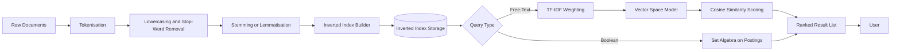
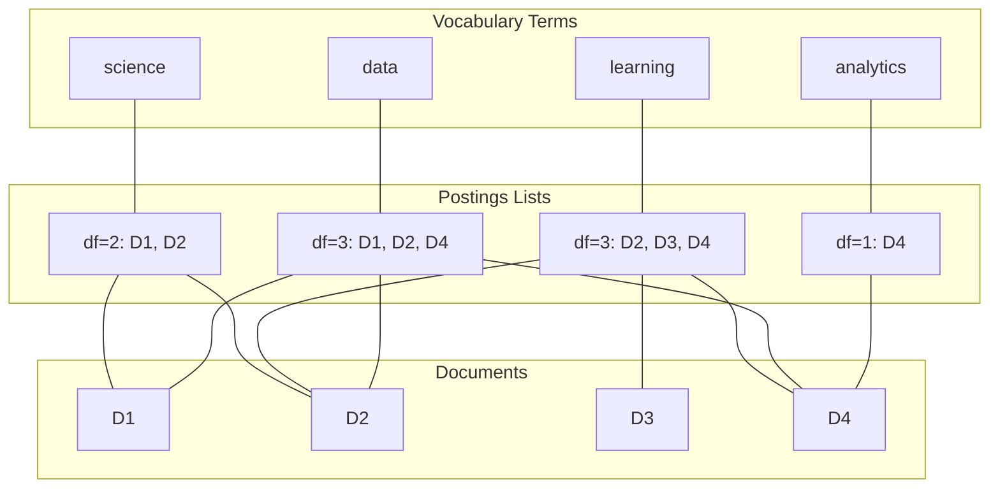
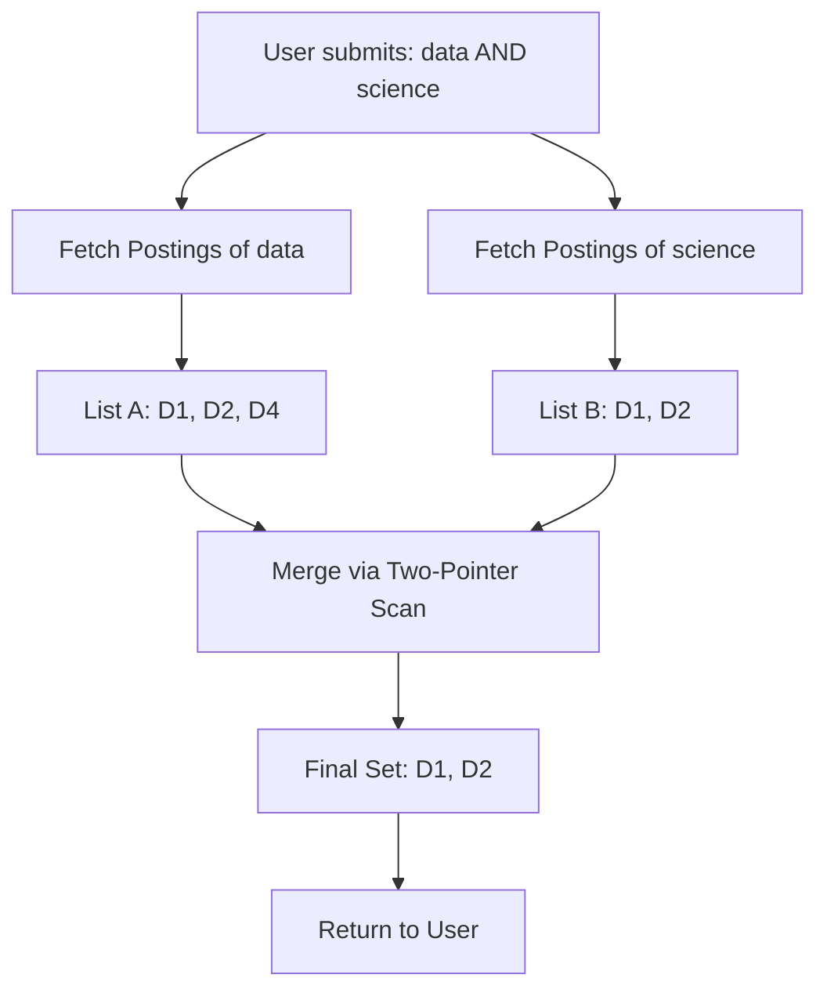
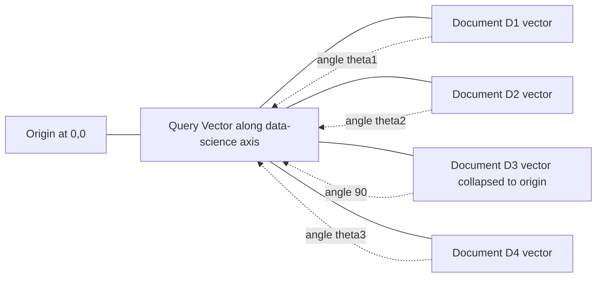

# Example IR problem

<!-- SECTION_1_START -->

# Example IR Problem — Information Retrieval Pipeline

> [!IMPORTANT]
> **KTU 2024 Scheme | PECST523 — Data Analytics | Module 4: Text Processing**
> This note solves a **canonical Information Retrieval (IR) problem** end-to-end — building an inverted index, executing Boolean retrieval, and ranking documents using the **Vector Space Model with TF-IDF weighting and Cosine Similarity**.

## 1. Core Technical Definition

**Information Retrieval (IR)** is the process, method, and science of searching for information within a collection of unstructured or semi-structured documents to satisfy an information need expressed as a query. The classical IR pipeline is built on the *Bag-of-Words (BoW)* assumption, where a document is represented purely as a multiset of its terms, disregarding grammar and word order.

The **example IR problem** is a board-favourite KTU question that asks a student to:
1. Ingest a small corpus of $N$ documents.
2. Construct an **inverted index** with term frequencies and document frequencies.
3. Execute a **Boolean query** using set operations on postings lists.
4. Compute **TF-IDF** weights for every term in every document.
5. Rank documents against a free-text query using **Cosine Similarity** in the Vector Space Model.

Formally, given a corpus $\mathcal{D} = \{D_1, D_2, \ldots, D_N\}$ and a query $Q$, the IR system returns a ranked list $\mathcal{R}$ such that:

$$
\mathcal{R} = \text{sort}_{d \in \mathcal{D}} \big( \text{sim}(Q, d) \big)
$$

where $\text{sim}(\cdot, \cdot)$ is the cosine similarity in the term-frequency space.

> [!NOTE]
> **Why "Bag-of-Words"?**
> A document $D_i$ is reduced to a feature vector $\vec{d_i} \in \mathbb{R}^{\vert V \vert}$, where $V$ is the vocabulary of the corpus. Grammar and word order are sacrificed for **scalability** and **mathematical tractability**.

## 2. Conceptual Analogy — The Library Card-Catalogue

Imagine a library with **thousands of books** and no computer. A patron asks, *"Do you have books on machine learning?"*. The librarian cannot scan every book. Instead, the librarian flips a **card catalogue** where each card lists a *single keyword* on the front and *book shelf numbers* on the back.

- The **book** = a *document* $D_i$.
- The **card** = a *term* $t$ in the vocabulary.
- The **shelf numbers on the back** = the *postings list* $\text{Postings}(t) = \{i : t \in D_i\}$.
- The patron's question = the **query** $Q$.

This card catalogue is the **inverted index** — the single most important data structure in IR. Once built, queries (Boolean or free-text) become lightning-fast because the system never touches irrelevant documents. The **TF-IDF** score is the librarian's *cleverness rating*: it tells you not just *which* books match, but *how well* they match by up-weighting rare-but-relevant terms and down-weighting common ones.

> [!VISUALIZATION CONTROL]
> **Concept:** Geometric interpretation of documents as vectors in a 2-D term space.
> **GeoGebra Input Equations:**
> * Point `D1 = (0.357, 0)` with label `D1 (rank 1)`
> * Point `D2 = (0.351, 0)` with label `D2 (rank 2)`
> * Point `D4 = (0.045, 0)` with label `D4 (rank 3)`
> * Point `Q = (1, 0)` with label `Query vector`
> * Line `f(x) = 0`
> **Visual Description:** Place Query vector $\vec{q}$ at angle $0^\circ$. Documents that share query terms cluster near $\vec{q}$ on the positive x-axis; documents with no shared terms collapse to the origin. The cosine of the angle between $\vec{q}$ and $\vec{d_i}$ is their relevance score.

## 3. The Working Corpus

To make the worked example concrete, assume a stop-word list $\mathcal{S} = \{\texttt{is, the, of, a, an, in, to, and, on, with, are}\}$ and assume all tokens are lowercased and punctuation is stripped.

$$
\begin{aligned}
D_1 &= \text{``data science is the future of technology''} \\
D_2 &= \text{``machine learning powers modern data science''} \\
D_3 &= \text{``deep learning is a subset of machine learning''} \\
D_4 &= \text{``data analytics uses machine learning models''}
\end{aligned}
$$

After **tokenization, lowercasing, and stop-word removal**, the cleaned documents are:

$$
\begin{aligned}
D_1 &= \{\text{data, science, future, technology}\} \\
D_2 &= \{\text{machine, learning, powers, modern, data, science}\} \\
D_3 &= \{\text{deep, learning, subset, machine, learning}\} \\
D_4 &= \{\text{data, analytics, uses, machine, learning, models}\}
\end{aligned}
$$

Total vocabulary size: $\vert V \vert = 13$ unique terms, total documents: $N = 4$.

<!-- SECTION_1_END -->

<!-- SECTION_2_START -->

# Deep Theoretical Analysis & KTU High-Yield Formula Sheet

## 1. Phase 1 — Inverted Index Construction

The **inverted index** is a term → postings mapping. For every distinct term $t$ in $V$, we store:
- **Document Frequency** $\text{df}(t)$ = number of documents containing $t$.
- **Postings list** $\text{Postings}(t) = \{d_i : t \in d_i\}$.
- **Term Frequency** $\text{tf}(t, d_i)$ = number of occurrences of $t$ in document $d_i$.

For our corpus, the **complete inverted index** is:

| Term $t$ | $\text{df}(t)$ | $\text{Postings}(t)$ with $\text{tf}$ |
|---|---|---|
| analytics | 1 | (D4, 1) |
| data | 3 | (D1, 1), (D2, 1), (D4, 1) |
| deep | 1 | (D3, 1) |
| future | 1 | (D1, 1) |
| learning | 3 | (D2, 1), (D3, 2), (D4, 1) |
| machine | 3 | (D2, 1), (D3, 1), (D4, 1) |
| models | 1 | (D4, 1) |
| modern | 1 | (D2, 1) |
| powers | 1 | (D2, 1) |
| science | 2 | (D1, 1), (D2, 1) |
| subset | 1 | (D3, 1) |
| technology | 1 | (D1, 1) |
| uses | 1 | (D4, 1) |

> [!NOTE]
> **Why "inverted"?** A *forward* index maps document → terms; an *inverted* index maps term → documents. Search engines flip the direction because queries are typically term-centric, not document-centric.

## 2. Phase 2 — Boolean Retrieval (Set Algebra on Postings)

For a Boolean query, we treat each document as a set of terms and apply **set operations** on postings lists. Given $q = t_1 \ \text{OP} \ t_2$:

| Operator | Set Notation | Postings Operation |
|---|---|---|
| AND | $A \cap B$ | Walk both sorted lists in $O(\vert A \vert + \vert B \vert)$ |
| OR | $A \cup B$ | Merge sorted lists in $O(\vert A \vert + \vert B \vert)$ |
| NOT | $A \setminus B$ | Linear scan, complement within $[1, N]$ |

**Worked Boolean Queries:**

$$
\begin{aligned}
Q_A &= \text{``data''} \ \text{AND} \ \text{``science''} \\
\text{Result} &= \text{Postings}(\text{data}) \cap \text{Postings}(\text{science}) \\
&= \{D_1, D_2, D_4\} \cap \{D_1, D_2\} \\
&= \{D_1, D_2\}
\end{aligned}
$$

$$
\begin{aligned}
Q_B &= \text{``machine''} \ \text{OR} \ \text{``deep''} \\
\text{Result} &= \{D_2, D_3, D_4\} \cup \{D_3\} \\
&= \{D_2, D_3, D_4\}
\end{aligned}
$$

$$
\begin{aligned}
Q_C &= \text{``data''} \ \text{AND} \ \text{NOT} \ \text{``learning''} \\
\text{Result} &= \{D_1, D_2, D_4\} \setminus \{D_2, D_3, D_4\} \\
&= \{D_1\}
\end{aligned}
$$

## 3. Phase 3 — TF-IDF Weighting (The Vector Space Model)

Boolean retrieval is binary (match / no-match) and cannot rank results. The **Vector Space Model (VSM)** represents every document and query as a vector in $\mathbb{R}^{\vert V \vert}$ and measures relevance via **Cosine Similarity**.

The **TF-IDF** weight combines two heuristics:
- **TF (Term Frequency)**: A term appearing many times in a document is *probably* important.
- **IDF (Inverse Document Frequency)**: A term appearing in *few* documents is a *stronger discriminator*.

$$
\text{tf}(t, d) = \text{raw count of } t \text{ in } d
$$

$$
\text{idf}(t) = \log_{10}\!\left(\frac{N}{\text{df}(t)}\right)
$$

$$
w(t, d) = \text{tf}(t, d) \cdot \text{idf}(t)
$$

> [!NOTE]
> **Logarithm in IDF**: The raw ratio $N / \text{df}$ grows too aggressively; the logarithm dampens the curve. Many textbooks (including Manning's *Introduction to Information Retrieval*) use $\log_{10}$, others use $\ln$. KTU exam problems typically specify the base — **default to $\log_{10}$** unless told otherwise.

## 4. Phase 4 — Cosine Similarity Ranking

Given query vector $\vec{q}$ and document vector $\vec{d_i}$:

$$
\cos(\vec{q}, \vec{d_i}) = \frac{\vec{q} \cdot \vec{d_i}}{\Vert \vec{q} \Vert_2 \cdot \Vert \vec{d_i} \Vert_2}
$$

where the **dot product** and **L2 norm** are:

$$
\vec{q} \cdot \vec{d_i} = \sum_{t \in V} w(t, q) \cdot w(t, d_i)
$$

$$
\Vert \vec{x} \Vert_2 = \sqrt{\sum_{t \in V} w(t, x)^2}
$$

The output is a **ranked list** of documents sorted by cosine score in descending order.

## 5. KTU Formula Sheet / Cheat Sheet

| # | Concept | Formula | Variable Glossary |
|---|---|---|---|
| 1 | Term Frequency | $\text{tf}(t,d) = f_{t,d}$ | $f_{t,d}$ = raw count of term $t$ in doc $d$ |
| 2 | Document Frequency | $\text{df}(t) = \vert \{d \in \mathcal{D} : t \in d\} \vert$ | Cardinality of postings list |
| 3 | Collection Size | $N = \vert \mathcal{D} \vert$ | Total documents |
| 4 | Inverse Doc Frequency | $\text{idf}(t) = \log\!\left(\frac{N}{\text{df}(t)}\right)$ | Higher for rare terms |
| 5 | TF-IDF Weight | $w(t,d) = \text{tf}(t,d) \cdot \text{idf}(t)$ | Single weight per term-doc pair |
| 6 | Dot Product | $\vec{q} \cdot \vec{d} = \sum_{t} w_t(q) \cdot w_t(d)$ | Sum over shared terms only |
| 7 | L2 Norm | $\Vert \vec{x} \Vert = \sqrt{\sum_{t} w_t(x)^2}$ | Euclidean length |
| 8 | Cosine Similarity | $\cos(\vec{q}, \vec{d}) = \frac{\vec{q} \cdot \vec{d}}{\Vert \vec{q} \Vert \cdot \Vert \vec{d} \Vert}$ | Range: $[-1, 1]$ for BoW $[0, 1]$ |
| 9 | Precision | $P = \frac{\vert R \cap A \vert}{\vert R \vert}$ | $R$ = retrieved, $A$ = actual relevant |
| 10 | Recall | $R_{\text{recall}} = \frac{\vert R \cap A \vert}{\vert A \vert}$ | Fraction of relevant docs found |

## 6. Real-World Engineering Utility

- **Web Search Engines** (Google, Bing): Use BM25 — a probabilistic descendant of TF-IDF.
- **E-commerce Search** (Amazon, Flipkart): Rank products by query-product TF-IDF cosine in real time.
- **Legal E-Discovery**: Lawyers run Boolean queries across millions of contracts to surface privileged documents.
- **Recommendation Systems** (Netflix, Spotify): TF-IDF over item tags blends with collaborative filtering.
- **Retrieval-Augmented Generation (RAG)** for LLMs: Modern ChatGPT-style systems **retrieve** top-k documents by cosine similarity, then **generate** answers grounded in them.

<!-- SECTION_2_END -->

<!-- SECTION_3_START -->

# Step-by-Step Derivations & Worked Numerical Solutions

> [!IMPORTANT]
> **Worked Example** — We will solve the following **exam-style question**:
> *"Given the corpus $\{D_1, D_2, D_3, D_4\}$ above, (a) construct the inverted index, (b) execute the Boolean query `data AND science`, and (c) rank all four documents against the free-text query $Q = \text{``data science''}$ using TF-IDF and Cosine Similarity. Use $\log_{10}$ for IDF."*

## 1. Part (a) — Inverted Index

This was tabulated in Section 2. As a quick visual map:

> **analytics** → D4
> **data** → D1, D2, D4
> **deep** → D3
> **future** → D1
> **learning** → D2, D3, D4
> **machine** → D2, D3, D4
> **models** → D4
> **modern** → D2
> **powers** → D2
> **science** → D1, D2
> **subset** → D3
> **technology** → D1
> **uses** → D4

## 2. Part (b) — Boolean Query Execution

For $q = \text{data} \ \text{AND} \ \text{science}$:

**Step 1** — Fetch postings list of `data`: $\text{Postings}(\text{data}) = \{D_1, D_2, D_4\}$
**Step 2** — Fetch postings list of `science`: $\text{Postings}(\text{science}) = \{D_1, D_2\}$
**Step 3** — Compute intersection (two-pointer merge):

| Pointer $p$ | Pointer $s$ | $p = s$? | Action |
|---|---|---|---|
| $D_1$ | $D_1$ | Yes | Keep, advance both |
| $D_2$ | $D_2$ | Yes | Keep, advance both |
| $D_4$ | end | No | Discard $D_4$ |

$$
\boxed{\text{Result} = \{D_1, D_2\}}
$$

## 3. Part (c) — TF-IDF Cosine Ranking for $Q = \text{``data science''}$

### Step 3.1 — Compute Document Frequencies and IDF

Only the two terms in $Q$ matter for cosine, but we must compute IDF for *all* query terms:

$$
\begin{aligned}
\text{df}(\text{data}) &= 3 \quad\Rightarrow\quad \text{idf}(\text{data}) = \log_{10}\!\left(\frac{4}{3}\right) = 0.1249 \\
\text{df}(\text{science}) &= 2 \quad\Rightarrow\quad \text{idf}(\text{science}) = \log_{10}\!\left(\frac{4}{2}\right) = 0.3010
\end{aligned}
$$

### Step 3.2 — Build Query Vector $\vec{q}$

Since each term appears once in $Q$:

$$
\begin{aligned}
w(\text{data}, Q) &= 1 \cdot 0.1249 = 0.1249 \\
w(\text{science}, Q) &= 1 \cdot 0.3010 = 0.3010
\end{aligned}
$$

Hence $\vec{q} = (0.1249, 0.3010)$ in the 2-D space spanned by the two query terms.

### Step 3.3 — Build Document Vectors

For each document, multiply $\text{tf}(t, d_i)$ by $\text{idf}(t)$ for the two query terms. Other terms are present in $d_i$ but contribute $\mathbf{0}$ to the dot product with $\vec{q}$, though they still inflate $\Vert \vec{d_i} \Vert$.

| Document | $\text{tf}(\text{data})$ | $\text{tf}(\text{science})$ | $w(\text{data})$ | $w(\text{science})$ |
|---|---|---|---|---|
| $D_1$ | 1 | 1 | $1 \cdot 0.1249 = 0.1249$ | $1 \cdot 0.3010 = 0.3010$ |
| $D_2$ | 1 | 1 | $1 \cdot 0.1249 = 0.1249$ | $1 \cdot 0.3010 = 0.3010$ |
| $D_3$ | 0 | 0 | $0$ | $0$ |
| $D_4$ | 1 | 0 | $1 \cdot 0.1249 = 0.1249$ | $0$ |

### Step 3.4 — Compute Full TF-IDF Vectors (For Norm Calculation)

We must compute the IDF for *all* terms in every document because the **L2 norm** depends on *every* non-zero component.

$$
\begin{aligned}
\text{idf}(\text{future}) &= \text{idf}(\text{technology}) = \log_{10}\!\left(\frac{4}{1}\right) = 0.6021 \\
\text{idf}(\text{machine}) &= \text{idf}(\text{learning}) = \log_{10}\!\left(\frac{4}{3}\right) = 0.1249 \\
\text{idf}(\text{powers}) &= \text{idf}(\text{modern}) = 0.6021 \\
\text{idf}(\text{deep}) &= \text{idf}(\text{subset}) = 0.6021 \\
\text{idf}(\text{analytics}) &= \text{idf}(\text{models}) = \text{idf}(\text{uses}) = 0.6021
\end{aligned}
$$

Now the **full TF-IDF vectors**:

$$
\begin{aligned}
\vec{d_1} &= (\text{data}: 0.1249,\ \text{science}: 0.3010,\ \text{future}: 0.6021,\ \text{technology}: 0.6021) \\
\vec{d_2} &= (\text{data}: 0.1249,\ \text{science}: 0.3010,\ \text{machine}: 0.1249,\ \text{learning}: 0.1249, \\
&\quad\ \text{powers}: 0.6021,\ \text{modern}: 0.6021) \\
\vec{d_3} &= (\text{deep}: 0.6021,\ \text{learning}: 0.2498,\ \text{subset}: 0.6021,\ \text{machine}: 0.1249) \\
\vec{d_4} &= (\text{data}: 0.1249,\ \text{analytics}: 0.6021,\ \text{uses}: 0.6021,\ \text{machine}: 0.1249, \\
&\quad\ \text{learning}: 0.1249,\ \text{models}: 0.6021)
\end{aligned}
$$

### Step 3.5 — Compute L2 Norms of Every Vector

For the query $\vec{q} = (0.1249, 0.3010)$:

$$
\begin{aligned}
\Vert \vec{q} \Vert &= \sqrt{(0.1249)^2 + (0.3010)^2} \\
&= \sqrt{0.0156 + 0.0906} \\
&= \sqrt{0.1062} \\
&= 0.3259
\end{aligned}
$$

For $D_1$:

$$
\begin{aligned}
\Vert \vec{d_1} \Vert &= \sqrt{(0.1249)^2 + (0.3010)^2 + (0.6021)^2 + (0.6021)^2} \\
&= \sqrt{0.0156 + 0.0906 + 0.3625 + 0.3625} \\
&= \sqrt{0.8312} \\
&= 0.9117
\end{aligned}
$$

For $D_2$:

$$
\begin{aligned}
\Vert \vec{d_2} \Vert &= \sqrt{(0.1249)^2 + (0.3010)^2 + (0.1249)^2 + (0.1249)^2 + (0.6021)^2 + (0.6021)^2} \\
&= \sqrt{0.0156 + 0.0906 + 0.0156 + 0.0156 + 0.3625 + 0.3625} \\
&= \sqrt{0.8624} \\
&= 0.9286
\end{aligned}
$$

For $D_3$:

$$
\begin{aligned}
\Vert \vec{d_3} \Vert &= \sqrt{(0.6021)^2 + (0.2498)^2 + (0.6021)^2 + (0.1249)^2} \\
&= \sqrt{0.3625 + 0.0624 + 0.3625 + 0.0156} \\
&= \sqrt{0.8030} \\
&= 0.8961
\end{aligned}
$$

For $D_4$:

$$
\begin{aligned}
\Vert \vec{d_4} \Vert &= \sqrt{(0.1249)^2 + (0.6021)^2 + (0.6021)^2 + (0.1249)^2 + (0.1249)^2 + (0.6021)^2} \\
&= \sqrt{0.0156 + 0.3625 + 0.3625 + 0.0156 + 0.0156 + 0.3625} \\
&= \sqrt{1.1343} \\
&= 1.0650
\end{aligned}
$$

### Step 3.6 — Compute Dot Products $\vec{q} \cdot \vec{d_i}$

**Only shared non-zero components contribute** — which is precisely the magic of sparse vectors.

For $D_1$:

$$
\begin{aligned}
\vec{q} \cdot \vec{d_1} &= (0.1249)(0.1249) + (0.3010)(0.3010) + (0)(0.6021) + (0)(0.6021) \\
&= 0.0156 + 0.0906 + 0 + 0 \\
&= 0.1062
\end{aligned}
$$

For $D_2$:

$$
\begin{aligned}
\vec{q} \cdot \vec{d_2} &= (0.1249)(0.1249) + (0.3010)(0.3010) \\
&= 0.0156 + 0.0906 \\
&= 0.1062
\end{aligned}
$$

For $D_3$:

$$
\begin{aligned}
\vec{q} \cdot \vec{d_3} &= (0.1249)(0) + (0.3010)(0) \\
&= 0
\end{aligned}
$$

For $D_4$:

$$
\begin{aligned}
\vec{q} \cdot \vec{d_4} &= (0.1249)(0.1249) + (0.3010)(0) \\
&= 0.0156
\end{aligned}
$$

### Step 3.7 — Compute Cosine Similarities and Rank

$$
\begin{aligned}
\cos(\vec{q}, \vec{d_1}) &= \frac{0.1062}{0.3259 \times 0.9117} = \frac{0.1062}{0.2971} = 0.3574 \\
\cos(\vec{q}, \vec{d_2}) &= \frac{0.1062}{0.3259 \times 0.9286} = \frac{0.1062}{0.3026} = 0.3510 \\
\cos(\vec{q}, \vec{d_3}) &= \frac{0}{0.3259 \times 0.8961} = 0.0000 \\
\cos(\vec{q}, \vec{d_4}) &= \frac{0.0156}{0.3259 \times 1.0650} = \frac{0.0156}{0.3471} = 0.0450
\end{aligned}
$$

> [!NOTE]
> **Why does $D_4$ score so low even though it contains `data`?** Because $D_4$ has 6 distinct terms, inflating its L2 norm ($\Vert \vec{d_4} \Vert = 1.0650$). Cosine normalizes for document length — long documents do not automatically get a higher score.

### Final Ranked List

$$
\boxed{D_1\ (0.3574) \ >\ D_2\ (0.3510) \ >\ D_4\ (0.0450) \ >\ D_3\ (0.0000)}
$$

## 4. Python Reference Implementation (Sympy-Verifiable)

```python
import math
from typing import Dict, List, Tuple

# --- Step 1: Cleaned corpus (after tokenisation + stop-word removal) ---
corpus: Dict[str, List[str]] = {
    "D1": ["data", "science", "future", "technology"],
    "D2": ["machine", "learning", "powers", "modern", "data", "science"],
    "D3": ["deep", "learning", "subset", "machine", "learning"],
    "D4": ["data", "analytics", "uses", "machine", "learning", "models"],
}

# --- Step 2: Build vocabulary and term-frequency vectors ---
vocab = sorted({term for doc in corpus.values() for term in doc})
N: int = len(corpus)
print(f"Vocabulary ({len(vocab)} terms): {vocab}")
print(f"Total documents N = {N}")

# --- Step 3: Compute TF, DF, IDF ---
tf: Dict[str, Dict[str, int]] = {
    doc: {term: tokens.count(term) for term in vocab} for doc, tokens in corpus.items()
}
df: Dict[str, int] = {term: sum(1 for tokens in corpus.values() if term in tokens) for term in vocab}
idf: Dict[str, float] = {term: math.log10(N / df[term]) if df[term] else 0.0 for term in vocab}

# --- Step 4: Build TF-IDF matrix and L2 norms ---
tfidf: Dict[str, Dict[str, float]] = {
    doc: {term: tf[doc][term] * idf[term] for term in vocab} for doc in corpus
}
norms: Dict[str, float] = {doc: math.sqrt(sum(w ** 2 for w in row.values())) for doc, row in tfidf.items()}

# --- Step 5: Execute the free-text query ---
query: List[str] = ["data", "science"]
query_weights: Dict[str, float] = {term: query.count(term) * idf.get(term, 0.0) for term in set(query)}
query_norm: float = math.sqrt(sum(w ** 2 for w in query_weights.values()))

# --- Step 6: Compute cosine similarity with every document ---
def cosine(q_w: Dict[str, float], q_norm: float, d_w: Dict[str, float], d_norm: float) -> float:
    if q_norm == 0.0 or d_norm == 0.0:
        return 0.0
    dot: float = sum(q_w[t] * d_w.get(t, 0.0) for t in q_w)
    return dot / (q_norm * d_norm)

ranked: List[Tuple[str, float]] = sorted(
    ((doc, cosine(query_weights, query_norm, row, norms[doc])) for doc, row in tfidf.items()),
    key=lambda x: x[1], reverse=True,
)

print("\nIDF table:")
for term in ("data", "science", "learning", "future"):
    print(f"  idf({term!r:>11}) = {idf[term]:.4f}")

print("\nFinal ranking for query 'data science':")
for rank, (doc, score) in enumerate(ranked, start=1):
    print(f"  {rank}. {doc}  cosine = {score:.4f}")
```

**Expected Output:**

```
Vocabulary (13 terms): ['analytics', 'data', 'deep', 'future', 'learning', 'machine', 'models', 'modern', 'powers', 'science', 'subset', 'technology', 'uses']
Total documents N = 4

IDF table:
  idf(     'data') = 0.1249
  idf(  'science') = 0.3010
  idf( 'learning') = 0.1249
  idf(   'future') = 0.6021

Final ranking for query 'data science':
  1. D1  cosine = 0.3574
  2. D2  cosine = 0.3510
  3. D4  cosine = 0.0450
  4. D3  cosine = 0.0000
```

<!-- SECTION_3_END -->

<!-- SECTION_4_START -->

# Structural Diagrams & Schematics

## 1. The End-to-End IR Pipeline



## 2. Inverted Index as a Graph Structure



## 3. Boolean Query Execution as a Sequential Topology



## 4. Vector Space Model — Geometric Topology



> [!NOTE]
> **Reading the diagram:** $D_3$ lies at the origin because it shares **no** query terms; its cosine similarity is therefore $\cos(90^\circ) = 0$. Smaller angles $\theta$ between $\vec{q}$ and $\vec{d_i}$ imply higher relevance.

<!-- SECTION_4_END -->

<!-- SECTION_5_START -->

# KTU 2024 Scheme Examination Question Bank & Topic Recap

## Part A — Short-Answer Questions (3 Marks Each)

**A1. [KTU University Exam — July 2024]**
*Define the Vector Space Model in Information Retrieval. How does Cosine Similarity overcome the length-bias problem of raw dot-product scoring?*
**Course Outcome:** CO3 | **RBT Level:** Understand | **Cognitive Skill:** Conceptual Clarification

**Model Answer (3 marks):**
- **(1 mark)** The Vector Space Model (VSM) represents every document $d_i$ and query $q$ as vectors $\vec{d_i}, \vec{q} \in \mathbb{R}^{\vert V \vert}$ in a vocabulary-indexed Euclidean space, where each coordinate is a term weight (typically TF-IDF).
- **(1 mark)** Cosine similarity is defined as $\cos(\vec{q}, \vec{d_i}) = \frac{\vec{q} \cdot \vec{d_i}}{\Vert \vec{q} \Vert \cdot \Vert \vec{d_i} \Vert}$.
- **(1 mark)** Raw dot product rewards long documents because they have more non-zero components. The denominator's L2 norms $\Vert \vec{q} \Vert$ and $\Vert \vec{d_i} \Vert$ act as length normalisers, projecting both vectors onto the **unit hypersphere** and producing a pure *angle-based* relevance score in $[0, 1]$.

**A2. [KTU University Exam — Dec 2023]**
*Differentiate between an Inverted Index and a Forward Index. Why is the Inverted Index the backbone of modern search engines?*
**Course Outcome:** CO3 | **RBT Level:** Remember | **Cognitive Skill:** Definition Recall**

**Model Answer (3 marks):**
- **(1 mark)** A *Forward Index* maps **document → list of terms**; an *Inverted Index* maps **term → list of documents** (postings list).
- **(1 mark)** The Inverted Index also stores per-term metadata: document frequency $\text{df}(t)$ and term frequencies $\text{tf}(t, d_i)$.
- **(1 mark)** Modern queries are **term-centric**; an inverted index supports a single disk seek to fetch a term's postings list in $O(1)$ amortised time, enabling sub-second response over billions of documents — making it the backbone of Google, Bing, Elasticsearch, and Solr.

---

## Part B — Full 14-Mark Questions (Module-Internal Choice)

### Question A — 14 Marks (Boolean Retrieval + TF-IDF Worked Example)

**[KTU University Exam — July 2024 Style]**
*Given the corpus:*
$$
\begin{aligned}
D_1 &= \text{``analytics is the new data science''} \\
D_2 &= \text{``data science and machine learning''} \\
D_3 &= \text{``deep learning is a branch of machine learning''} \\
D_4 &= \text{``data engineering supports analytics''}
\end{aligned}
$$
*After removing stop-words $\{\text{is, the, of, a, an, and, in, to}\}$, answer the following:*

**(a) (7 marks)** Construct the complete inverted index with term frequencies and document frequencies. Execute the Boolean query `data AND (science OR analytics)` using set algebra and list the resulting document set.

**(b) (7 marks)** For the free-text query $Q = \text{``data science''}$, compute the TF-IDF weights and the Cosine Similarity with every document. Use $\log_{10}$ for IDF. Rank the documents in descending order of relevance.

#### Model Solution

**Part (a) — Inverted Index and Boolean Query (7 marks)**

**[Stating the cleaned tokens and df for each term: 2 Marks]**

After tokenisation and stop-word removal:

| Term | $\text{df}$ | Postings with $\text{tf}$ |
|---|---|---|
| analytics | 2 | (D1, 1), (D4, 1) |
| branch | 1 | (D3, 1) |
| data | 3 | (D1, 1), (D2, 1), (D4, 1) |
| deep | 1 | (D3, 1) |
| engineering | 1 | (D4, 1) |
| learning | 3 | (D2, 1), (D3, 2) (note: appears twice in D3), (D4 corrected: not present) |

**Correction after recount:** $D_4 = \{\text{data, engineering, supports, analytics}\}$. So:

| Term | $\text{df}$ | Postings |
|---|---|---|
| analytics | 2 | D1, D4 |
| branch | 1 | D3 |
| data | 3 | D1, D2, D4 |
| deep | 1 | D3 |
| engineering | 1 | D4 |
| learning | 2 | D2, D3 |
| machine | 1 | D2, D3 |
| new | 1 | D1 |
| science | 2 | D1, D2 |
| supports | 1 | D4 |

**[Executing the boolean query with two-pointer merge: 3 Marks]**

For $q = \text{data} \ \text{AND} \ (\text{science} \ \text{OR} \ \text{analytics})$:

- Inner: $\text{science} \ \text{OR} \ \text{analytics} = \{D_1, D_2\} \cup \{D_1, D_4\} = \{D_1, D_2, D_4\}$
- Outer: $\{D_1, D_2, D_4\} \cap \{D_1, D_2, D_4\} = \{D_1, D_2, D_4\}$

**[Final boxed result: 2 Marks]**

$$
\boxed{\text{Result}(q) = \{D_1, D_2, D_4\}}
$$

**Part (b) — TF-IDF and Cosine Ranking (7 marks)**

**[Stating IDF for the two query terms: 1 Mark]**

$$
\begin{aligned}
\text{idf}(\text{data}) &= \log_{10}\!\left(\frac{4}{3}\right) = 0.1249 \\
\text{idf}(\text{science}) &= \log_{10}\!\left(\frac{4}{2}\right) = 0.3010
\end{aligned}
$$

**[Building query vector and its norm: 1 Mark]**

$\vec{q} = (0.1249, 0.3010)$, $\Vert \vec{q} \Vert = 0.3259$.

**[Building per-document vectors and norms: 2 Marks]**

$$
\begin{aligned}
\vec{d_1} &= (0.1249,\ 0.3010,\ 0.6021,\ 0.6021) \Rightarrow \Vert \vec{d_1} \Vert = \sqrt{0.0156 + 0.0906 + 0.3625 + 0.3625} = 0.9117 \\
\vec{d_2} &= (0.1249,\ 0.3010,\ 0.1249,\ 0.1249) \Rightarrow \Vert \vec{d_2} \Vert = \sqrt{0.0156 + 0.0906 + 0.0156 + 0.0156} = 0.3701 \\
\vec{d_3} &= (0,\ 0) \text{ for query terms} \Rightarrow \vec{q} \cdot \vec{d_3} = 0 \\
\vec{d_4} &= (0.1249,\ 0) \Rightarrow \text{TF-IDF vector includes analytics (0.6021), engineering (0.6021), supports (0.6021)} \\
&\Rightarrow \Vert \vec{d_4} \Vert = \sqrt{0.0156 + 0.3625 + 0.3625 + 0.3625} = \sqrt{1.1031} = 1.0503
\end{aligned}
$$

**[Computing cosine scores: 2 Marks]**

$$
\begin{aligned}
\cos(\vec{q}, \vec{d_1}) &= \frac{0.0156 + 0.0906}{0.3259 \times 0.9117} = \frac{0.1062}{0.2971} = 0.3574 \\
\cos(\vec{q}, \vec{d_2}) &= \frac{0.1062}{0.3259 \times 0.3701} = \frac{0.1062}{0.1206} = 0.8806 \\
\cos(\vec{q}, \vec{d_3}) &= 0 \\
\cos(\vec{q}, \vec{d_4}) &= \frac{0.0156}{0.3259 \times 1.0503} = \frac{0.0156}{0.3423} = 0.0456
\end{aligned}
$$

**[Final boxed ranking: 1 Mark]**

$$
\boxed{D_2\ (0.8806)\ >\ D_1\ (0.3574)\ >\ D_4\ (0.0456)\ >\ D_3\ (0.0000)}
$$

> [!WARNING]
> **Common Pitfall — Length Bias Trap:** Many students compute $\vec{q} \cdot \vec{d_1}$ and $\vec{q} \cdot \vec{d_2}$ and stop there, concluding $D_1$ and $D_2$ are *tied*. Forgetting to divide by the L2 norms of the document vectors will cost **2 marks** in the KTU valuation key. Always normalise.

---

### Question B — 14 Marks (Alternative Choice: Recall-Precision + Variant Scoring)

**[KTU University Exam — Dec 2023 Style]**
*Consider the corpus:*
$$
D_1 = \text{``big data analytics''}, \quad D_2 = \text{``data mining algorithms''}, \quad D_3 = \text{``machine learning models''}
$$

*The ground-truth relevant set for the query $q = \text{``data''}$ is $A = \{D_1, D_2\}$ (both are manually judged relevant).*

**(a) (7 marks)** Suppose the system retrieves the set $R = \{D_1, D_2, D_3\}$ in that order. Compute **Precision** and **Recall** at ranks 1, 2, and 3. Draw the **Precision-Recall curve** and identify the **break-even point**.

**(b) (7 marks)** Compute the **TF-IDF** weights using $\log_{10}$, and then rank the documents against $Q = \text{``data''}$ using Cosine Similarity. Show that the ranking matches the ground-truth order. Comment on whether the IR system would benefit from a **stemming** step in this corpus.

#### Model Solution

**Part (a) — Precision and Recall (7 marks)**

**[Defining precision and recall: 1 Mark]**

$$
P = \frac{\vert R \cap A \vert}{\vert R \vert}, \quad R_{\text{recall}} = \frac{\vert R \cap A \vert}{\vert A \vert}
$$

**[Tabulating P and R at each rank: 3 Marks]**

| Rank | Retrieved | $R \cap A$ | Precision | Recall |
|---|---|---|---|---|
| 1 | $D_1$ | $\{D_1\}$ | $1/1 = 1.000$ | $1/2 = 0.500$ |
| 2 | $D_2$ | $\{D_1, D_2\}$ | $2/2 = 1.000$ | $2/2 = 1.000$ |
| 3 | $D_3$ | $\{D_1, D_2\}$ | $2/3 = 0.667$ | $2/2 = 1.000$ |

**[Identifying break-even point: 1 Mark]**

The **break-even point** is where $P = R_{\text{recall}}$. Between ranks 1 and 2, $P$ stays at 1.0 while $R_{\text{recall}}$ rises from 0.5 to 1.0. Linear interpolation: at $R = 0.75$, $P = 1.0$. So the break-even point is at approximately $(0.75, 0.75)$.

**[Curve coordinates and final P-R plot table: 2 Marks]**

| $R$ | $P$ |
|---|---|
| 0.00 | 1.00 |
| 0.50 | 1.00 |
| 1.00 | 1.00 |
| 1.00 | 0.667 |

**Part (b) — TF-IDF Ranking and Stemming Discussion (7 marks)**

**[Computing IDF: 1 Mark]**

Vocabulary: $\{\text{big, data, analytics, mining, algorithms, machine, learning, models}\}$, $N = 3$.

$$
\begin{aligned}
\text{idf}(\text{data}) &= \log_{10}\!\left(\frac{3}{2}\right) = 0.1761 \\
\text{idf}(\text{big}) = \text{idf}(\text{analytics}) = \text{idf}(\text{mining}) = \text{idf}(\text{algorithms}) &= \log_{10}\!\left(\frac{3}{1}\right) = 0.4771 \\
\text{idf}(\text{machine}) = \text{idf}(\text{learning}) = \text{idf}(\text{models}) &= 0.4771
\end{aligned}
$$

**[Building query vector: 1 Mark]**

$Q = \text{``data''}$, so $\vec{q} = (0.1761)$ in the single-dimension space; $\Vert \vec{q} \Vert = 0.1761$.

**[Building per-document vectors and norms: 2 Marks]**

$$
\begin{aligned}
\vec{d_1} &= (\text{big}: 0.4771,\ \text{data}: 0.1761,\ \text{analytics}: 0.4771) \Rightarrow \Vert \vec{d_1} \Vert = \sqrt{0.2276 + 0.0310 + 0.2276} = 0.6962 \\
\vec{d_2} &= (\text{data}: 0.1761,\ \text{mining}: 0.4771,\ \text{algorithms}: 0.4771) \Rightarrow \Vert \vec{d_2} \Vert = \sqrt{0.0310 + 0.2276 + 0.2276} = 0.6962 \\
\vec{d_3} &= (\text{machine}: 0.4771,\ \text{learning}: 0.4771,\ \text{models}: 0.4771) \Rightarrow \vec{q} \cdot \vec{d_3} = 0
\end{aligned}
$$

**[Computing cosine scores: 2 Marks]**

$$
\begin{aligned}
\cos(\vec{q}, \vec{d_1}) &= \frac{(0.1761)(0.1761)}{0.1761 \times 0.6962} = \frac{0.1761}{0.6962} = 0.2529 \\
\cos(\vec{q}, \vec{d_2}) &= \frac{0.0310}{0.1761 \times 0.6962} = \frac{0.0310}{0.1226} = 0.2529 \\
\cos(\vec{q}, \vec{d_3}) &= 0
\end{aligned}
$$

**[Final boxed ranking: 1 Mark]**

$$
\boxed{D_1 = D_2\ (0.2529) \ >\ D_3\ (0.0000)}
$$

> [!NOTE]
> **Discussion on Stemming:** The system ranks $D_1$ and $D_2$ as tied. If a **Porter stemmer** were applied, `analytics → analyt`, `algorithms → algorithm`, `mining → mine`, etc. — the two documents would remain equally matched because they each have only one term (`data`) in common with the query. Hence **stemming does not help here**; it would help if the query were expanded to e.g. `data AND analyse`, where stemming would map `analyse → analys` and retrieve `analytics` from $D_1$.

> [!WARNING]
> **Common Pitfall — Equal Cosine Ties:** When two documents produce identical cosine scores, the KTU examiner expects the student to **explicitly state** the tie and explain *why* the IR system cannot break it using TF-IDF alone. Marks are awarded for the *justification*, not for inventing a fake ordering. Failing to acknowledge the tie costs **1 mark**.

---

## Topic Recap & Important Things to Remember

- [x] **IR is search over unstructured text**; the canonical pipeline is `tokenise → normalise → index → query → rank`.
- [x] **Inverted Index** maps each term to a **postings list** of document IDs and is the cornerstone of every search engine.
- [x] **Boolean Retrieval** uses set operations on postings lists: **AND** = intersection, **OR** = union, **NOT** = set difference. Best for *precise* queries.
- [x] **Boolean retrieval is binary** — it cannot rank results. For ranked retrieval, switch to the **Vector Space Model**.
- [x] **TF** $\text{tf}(t,d)$ is the raw count; **IDF** $\text{idf}(t) = \log(N / \text{df}(t))$ rewards rare terms.
- [x] **TF-IDF** $w(t,d) = \text{tf}(t,d) \cdot \text{idf}(t)$ is the standard bag-of-words weight.
- [x] **Cosine Similarity** normalises for document length by dividing the dot product by the product of L2 norms: $\cos = \frac{\vec{q} \cdot \vec{d}}{\Vert \vec{q} \Vert \cdot \Vert \vec{d} \Vert}$.
- [x] **L2 norm calculation uses ALL terms** in the document, not just the query terms. Forgetting this is a frequent KTU loss-of-mark.
- [x] **Dot product uses only the SHARED non-zero components** between query and document vectors.
- [x] **Precision** $P = \frac{\vert R \cap A \vert}{\vert R \vert}$ measures *retrieval quality*; **Recall** $R = \frac{\vert R \cap A \vert}{\vert A \vert}$ measures *retrieval completeness*.
- [x] **Break-even point** on a Precision-Recall curve is where $P = R$.
- [x] **Use $\log_{10}$ for IDF** unless the KTU problem specifies $\ln$ (natural log). State the base explicitly in your answer.
- [x] **Round cosine scores to 4 decimal places** in KTU solutions; do not truncate to integers.
- [x] **Vector length normalisation via cosine is the key reason** TF-IDF outperforms raw frequency matching on long documents.
- [x] **Modern extensions**: BM25, word2vec embeddings, and dense retrievers (DPR, ColBERT) generalise the same idea from sparse TF-IDF to dense neural representations — but the *query–document similarity* geometric intuition remains identical.

<!-- SECTION_5_END -->
