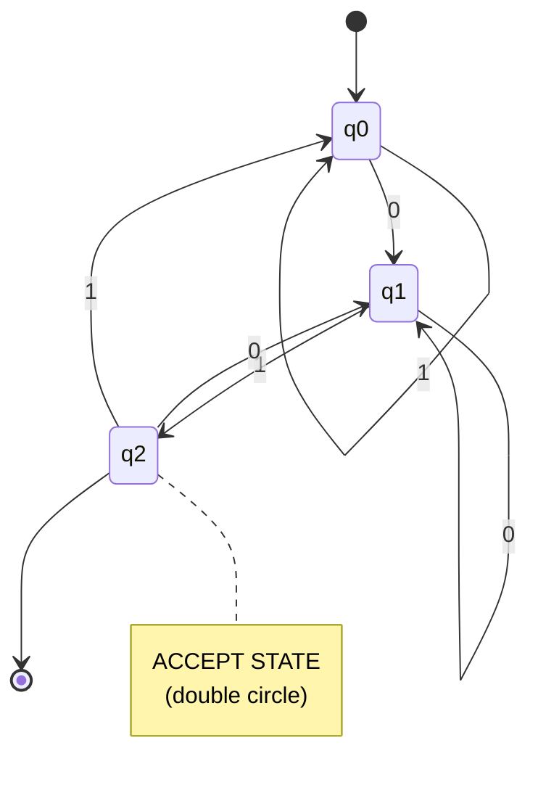
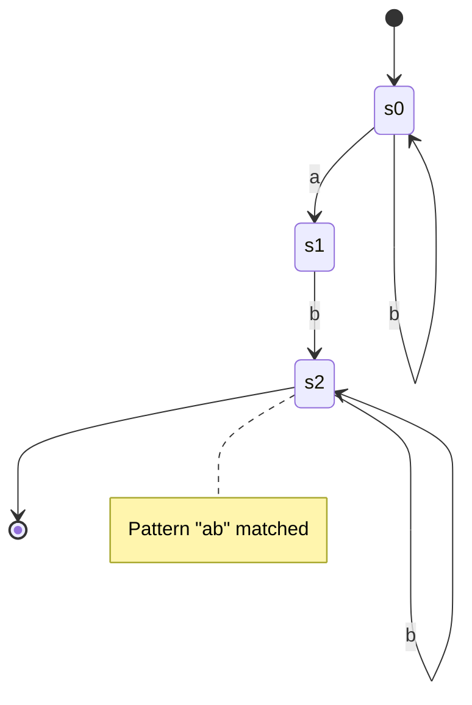
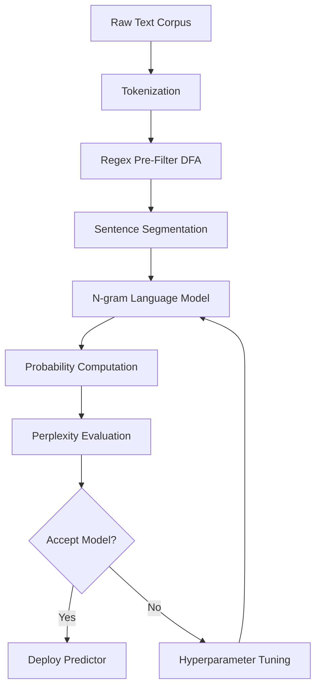
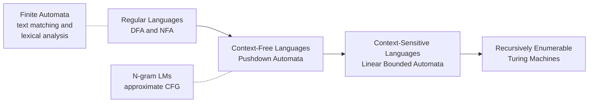
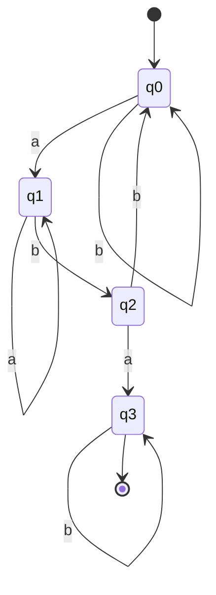
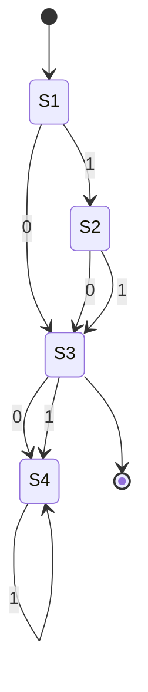

# finite automata and language model

<!-- SECTION_1_START -->
# Finite Automata and Language Models in Text Processing

## 1.1 What is a Finite Automaton?

A **Finite Automaton (FA)** is a mathematical model of computation used to represent and recognize patterns in text. Formally, it is a 5-tuple:

$$FA = (Q, \Sigma, \delta, q_0, F)$$

Where:
- $Q$ = a finite, non-empty set of **states**
- $\Sigma$ = a finite, non-empty set of **input symbols** (alphabet)
- $\delta : Q \times \Sigma \rightarrow Q$ = the **transition function**
- $q_0 \in Q$ = the **initial/start state**
- $F \subseteq Q$ = the set of **accepting/final states**

> [!IMPORTANT]
> **KTU 2024 Definition Highlight:** A finite automaton reads an input string symbol-by-symbol, transitioning between states, and **accepts** the string if it ends in an accepting state. Otherwise, it **rejects** the string.

> [!NOTE]
> **Why study this in Data Analytics?**
> Text processing pipelines (search engines, NLP tokenizers, spam filters) rely on automata theory to:
> - Match regex patterns over gigabytes of text in linear time
> - Build lexical analyzers (e.g., Python's `re` engine)
> - Power finite-state morphological analyzers in low-resource languages

## 1.2 Intuitive Analogy — The "Bouncer at a Club"

Imagine a bouncer at a nightclub checking ID numbers. He has only **three memory states**:
- `START` — at the door, no one scanned yet
- `SEEN_ONE` — saw the first digit
- `ACCEPT` — pattern matched, lets you in

Each new digit the bouncer reads causes him to **change his state** according to a fixed rulebook. At the end of the input, if he's standing at the `ACCEPT` state — you get in. Otherwise — rejected.

This is exactly how a DFA works. The bouncer **has no memory beyond his current state**, and the rulebook is the transition function $\delta$.

## 1.3 What is a Language Model?

A **Language Model (LM)** is a probability distribution over sequences of words (or tokens) in a natural language. Given a sequence of words $W = (w_1, w_2, w_3, \ldots, w_n)$, the model assigns a probability:

$$P(W) = P(w_1, w_2, w_3, \ldots, w_n)$$

Using the **chain rule of probability**:

$$P(w_1, w_2, \ldots, w_n) = \prod_{i=1}^{n} P(w_i \mid w_1, w_2, \ldots, w_{i-1})$$

> [!IMPORTANT]
> **KTU 2024 Definition Highlight:** A statistical language model estimates the probability of the next word given the preceding context. Modern LMs (BERT, GPT) extend this to neural architectures that learn contextual embeddings.

## 1.4 Intuitive Analogy — The "Predictive Text on Your Phone"

When you type "I want to eat..." your phone suggests "pizza", "rice", or "sushi". It is essentially computing:

$$P(\text{next word} \mid \text{"I want to eat"})$$

Words with higher conditional probability appear at the top of the suggestion list. The phone is using a **language model** trained on millions of sentences.

## 1.5 The Bridge — Why Both Belong to Text Processing

| Concept | Role in Text Processing |
|---|---|
| **Finite Automaton** | Pattern recognition, regex matching, tokenization, spell-checkers |
| **Language Model** | Sentence probability, autocomplete, machine translation, sentiment analysis |

> [!VISUALIZATION CONTROL]
> **Concept:** State-transition diagram of a DFA that accepts strings ending in "ab"
> **Mermaid-style Coordinates for GeoGebra:**
> * `A = (0, 0)` — start state
> * `B = (2, 0)` — intermediate state on reading 'a'
> * `C = (4, 0)` — accept state on reading 'b'
> * `B --"a"--> B`, `B --"b"--> C`, `C --"a,b"--> C`, `A --"a"--> B`, `A --"b"--> A`
> **Visual Description:** A directed graph with three nodes; arrows labeled with input symbols; node $C$ drawn with a double circle indicating acceptance.

## 1.6 Taxonomy of Finite Automata

1. **Deterministic Finite Automaton (DFA)** — for each state and symbol, exactly **one** next state
2. **Non-deterministic Finite Automaton (NFA)** — for each state and symbol, **zero, one, or many** possible next states
3. **ε-NFA** — NFA augmented with ε (epsilon) transitions that occur without consuming input

<!-- SECTION_1_END -->

<!-- SECTION_2_START -->
# Deep Theoretical Analysis & KTU High-Yield Formula Sheet

## 2.1 Formal Definitions — DFA vs NFA

### Deterministic Finite Automaton (DFA)
A DFA is a 5-tuple $(Q, \Sigma, \delta, q_0, F)$ where $\delta : Q \times \Sigma \rightarrow Q$ is a **total function**. There are no $\varepsilon$ transitions.

### Non-deterministic Finite Automaton (NFA)
An NFA is a 5-tuple $(Q, \Sigma, \delta, q_0, F)$ where $\delta : Q \times \Sigma \rightarrow \mathcal{P}(Q)$ is a function returning a **set of states** (the power set). NFA can also include ε-transitions.

> [!NOTE]
> **Equivalence Theorem:** Every NFA can be converted to an equivalent DFA using the **subset construction algorithm**. Therefore, DFA and NFA recognize the **same class of languages** — the **regular languages**.

## 2.2 Operations on Languages

Let $L_1$ and $L_2$ be languages over $\Sigma$:

| Operation | Definition | Closed under FA? |
|---|---|---|
| Union | $L_1 \cup L_2$ | Yes |
| Intersection | $L_1 \cap L_2$ | Yes |
| Concatenation | $L_1 \cdot L_2$ | Yes |
| Kleene Star | $L_1^*$ | Yes |
| Complement | $\Sigma^* \setminus L_1$ | Yes |
| Reverse | $L_1^R$ | Yes |

## 2.3 Regular Expressions to Automata

A **Regular Expression (RE)** over alphabet $\Sigma$ is built using:

| Operator | Meaning | Example |
|---|---|---|
| Concatenation $ab$ | a followed by b | `ab` matches "ab" |
| Alternation $a \mid b$ | a or b | `a\|b` matches "a" or "b" |
| Kleene Star $a^*$ | zero or more a's | `a*` matches "", "a", "aa"... |
| Plus $a^+$ | one or more a's | `a+` matches "a", "aa"... |
| Group $(ab)^*$ | zero or more "ab" | matches "", "ab", "abab"... |

> [!IMPORTANT]
> **KTU 2024 Key Theorem:** Regular Expressions, DFA, NFA, and Regular Grammars are **all equivalent** in expressive power. They define the **class of Regular Languages** — the lowest tier of the Chomsky hierarchy.

## 2.4 Language Models — Statistical Foundations

### 2.4.1 Unigram Model

Treats each word as **independent**:

$$P(w_1, w_2, \ldots, w_n) = \prod_{i=1}^{n} P(w_i)$$

Estimated by **Maximum Likelihood Estimation (MLE)**:

$$\hat{P}(w_i) = \frac{\text{count}(w_i)}{N}$$

where $N$ is the total number of words in the training corpus.

### 2.4.2 Bigram Model

Conditions each word on the **previous word**:

$$P(w_i \mid w_1, w_2, \ldots, w_{i-1}) \approx P(w_i \mid w_{i-1})$$

MLE estimate:

$$\hat{P}(w_i \mid w_{i-1}) = \frac{\text{count}(w_{i-1}, w_i)}{\text{count}(w_{i-1})}$$

### 2.4.3 N-gram Model (General)

Uses the **Markov assumption** of order $n-1$:

$$P(w_i \mid w_1, \ldots, w_{i-1}) \approx P(w_i \mid w_{i-(n-1)}, \ldots, w_{i-1})$$

### 2.4.4 Smoothing Techniques

To handle **zero-probability** n-grams:

| Technique | Formula |
|---|---|
| Laplace (Add-1) | $\hat{P}(w_i \mid w_{i-1}) = \dfrac{\text{count}(w_{i-1}, w_i) + 1}{\text{count}(w_{i-1}) + V}$ |
| Add-k | $\hat{P}(w_i \mid w_{i-1}) = \dfrac{\text{count}(w_{i-1}, w_i) + k}{\text{count}(w_{i-1}) + kV}$ |
| Good-Turing | Reassigns probability mass from seen to unseen n-grams |
| Kneser-Ney | Most widely used; absolute-discounting interpolation |

where $V = \vert \Sigma \vert$ is the vocabulary size.

### 2.4.5 Perplexity — The Quality Metric

**Perplexity (PPL)** is the standard measure of LM quality. **Lower is better**.

$$\text{PPL}(W) = P(w_1, w_2, \ldots, w_n)^{-1/n}$$

Using log-probability for numerical stability:

$$\text{PPL}(W) = \exp\left( -\frac{1}{n} \sum_{i=1}^{n} \log P(w_i \mid w_1, \ldots, w_{i-1}) \right)$$

## 2.5 KTU Formula Cheat Sheet

| Concept | Formula / Definition | Use |
|---|---|---|
| DFA tuple | $(Q, \Sigma, \delta, q_0, F)$ | Machine specification |
| Chain rule | $P(W) = \prod P(w_i \mid w_{<i})$ | Joint probability of text |
| MLE unigram | $\hat{P}(w) = \dfrac{c(w)}{N}$ | Word frequency |
| MLE bigram | $\hat{P}(w_i \mid w_{i-1}) = \dfrac{c(w_{i-1}, w_i)}{c(w_{i-1})}$ | Conditional frequency |
| Laplace smoothing | $\hat{P} = \dfrac{c + 1}{N + V}$ | Avoid zero probability |
| Perplexity | $\text{PPL} = 2^{H(W)}$ where $H$ is cross-entropy | LM evaluation |
| Cross-Entropy | $H = -\dfrac{1}{n}\sum \log_2 P(w_i \mid w_{<i})$ | Equivalent to PPL base 2 |
| Kleene Star | $L^* = \bigcup_{k=0}^{\infty} L^k$ | Zero or more repetitions |
| ε-closure | $E\text{-CLOSURE}(q)$ = all states reachable from $q$ via ε | NFA → DFA conversion |

## 2.6 Real-World Engineering Applications

| Application | Underlying Technique |
|---|---|
| **Spam filter** (Gmail) | Naive Bayes + n-gram LM |
| **Autocomplete** (WhatsApp) | Bigram/trigram LMs on mobile keyboards |
| **Speech recognition** (Siri, Alexa) | HMM + n-gram language models |
| **Search engine** (Google) | DFA for regex on indexed documents |
| **Lexical analyzer** (compilers) | DFA-based tokenizer (e.g., `lex`, `flex`) |
| **DNA sequence analysis** (Bioinformatics) | Finite-state transducers for gene finding |
| **Spell-checker** (MS Word) | Edit-distance DFA |

<!-- SECTION_2_END -->

<!-- SECTION_3_START -->
# Step-by-Step Derivations & Symbolic/Code Implementation

## 3.1 Worked Example 1 — DFA Construction and String Acceptance

**Problem:** Design a DFA that accepts **all binary strings ending in "01"**. Trace the input `110101`.

### Step 1: Identify the States
We need to remember the **last 1 or 2 bits** seen:
- $q_0$ = start / no useful suffix
- $q_1$ = last symbol was `0`
- $q_2$ = last two symbols were `01` → **accepting state**

### Step 2: Define the Transition Table

| State | Input 0 | Input 1 |
|---|---|---|
| → $q_0$ | $q_1$ | $q_0$ |
| $q_1$ | $q_1$ | $q_2$ |
| * $q_2$ | $q_1$ | $q_0$ |

### Step 3: Trace the Input `110101`

Starting at $q_0$:

```
Symbol | Current State | Next State
-------------------------------------
   1   |      q0       |    q0
   1   |      q0       |    q0
   0   |      q0       |    q1
   1   |      q1       |    q2   (accept!)
   0   |      q2       |    q1
   1   |      q1       |    q2   (final — ACCEPT)
```

Final state is $q_2 \in F$, so the string `110101` is **ACCEPTED** ✓

> [!NOTE]
> **Why $q_2$ is accepting:** It represents the pattern `...01` ending at the most recent position. The DFA "forgets" everything before the last two bits — this is the essence of finite memory.

## 3.2 Worked Example 2 — NFA to DFA Conversion (Subset Construction)

**Problem:** Convert the following NFA to a DFA.

NFA has states $\{A, B\}$, alphabet $\{0, 1\}$:
- $A \xrightarrow{0} B$
- $B \xrightarrow{0, 1} B$
- $A$ is start, $B$ is accepting

### Step 1: Initialize with the Start State

Start with $\{A\}$ (subset containing start state).

### Step 2: Compute Transitions for Each Subset

| Subset | On input 0 | On input 1 |
|---|---|---|
| $\{A\}$ | $\{B\}$ | $\emptyset$ |
| $\{B\}$ | $\{B\}$ | $\{B\}$ |
| $\emptyset$ | $\emptyset$ | $\emptyset$ |

### Step 3: Identify Accepting Subsets

Any subset containing the original accepting state $B$ is accepting. Therefore:
- $\{B\}$ is accepting
- $\emptyset$ is rejecting
- $\{A\}$ is rejecting

### Step 4: Final DFA

Three states: $S_1 = \{A\}$ (start), $S_2 = \{B\}$ (accepting), $S_3 = \emptyset$ (dead state)

$$\boxed{\text{DFA: } Q = \{S_1, S_2, S_3\}, \Sigma = \{0, 1\}, q_0 = S_1, F = \{S_2\}}$$

## 3.3 Worked Example 3 — Bigram Language Model

**Training Corpus:** `"I love NLP. I love data. NLP is fun."`

### Step 1: Tokenize and Build Vocabulary
After tokenization, $V = \{\text{I, love, NLP, data, is, fun, .}\}$, so $\vert V \vert = 7$.

### Step 2: Compute Unigram Counts

| Word | Count | MLE Probability |
|---|---|---|
| I | 2 | 2/9 ≈ 0.222 |
| love | 2 | 2/9 ≈ 0.222 |
| NLP | 2 | 2/9 ≈ 0.222 |
| data | 1 | 1/9 ≈ 0.111 |
| is | 1 | 1/9 ≈ 0.111 |
| fun | 1 | 1/9 ≈ 0.111 |
| . | 3 | 3/9 ≈ 0.333 |

### Step 3: Compute Bigram Counts

| Bigram | Count | $\text{count}(w_{i-1})$ | $\hat{P}(w_i \mid w_{i-1})$ |
|---|---|---|---|
| (I, love) | 2 | 2 | 2/2 = 1.000 |
| (love, NLP) | 1 | 2 | 1/2 = 0.500 |
| (love, data) | 1 | 2 | 1/2 = 0.500 |
| (NLP, .) | 1 | 2 | 1/2 = 0.500 |
| (NLP, is) | 1 | 2 | 1/2 = 0.500 |
| (data, .) | 1 | 1 | 1/1 = 1.000 |
| (is, fun) | 1 | 1 | 1/1 = 1.000 |
| (fun, .) | 1 | 1 | 1/1 = 1.000 |

### Step 4: Compute Sentence Probability

Sentence: `"I love NLP ."`

$$P(\text{"I love NLP ."}) = P(\text{I}) \times P(\text{love} \mid \text{I}) \times P(\text{NLP} \mid \text{love}) \times P(\text{.} \mid \text{NLP})$$

Substituting the values:

$$P = 0.222 \times 1.000 \times 0.500 \times 0.500 = 0.0555$$

### Step 5: Apply Laplace Smoothing to Unseen Bigrams

For a bigram $(w_{i-1}, w_i)$ **never seen**:

$$\hat{P}_{\text{Laplace}}(w_i \mid w_{i-1}) = \frac{0 + 1}{\text{count}(w_{i-1}) + V} = \frac{1}{\text{count}(w_{i-1}) + 7}$$

This guarantees a non-zero probability for **any** word combination.

## 3.4 Python Implementation — Full DFA Simulator and N-gram LM

```python
from __future__ import annotations
import math
from collections import defaultdict
from typing import Dict, FrozenSet, List, Set, Tuple

# =============================================================
# PART A: DETERMINISTIC FINITE AUTOMATON (DFA) SIMULATOR
# =============================================================

class DFA:
    """
    A production-grade Deterministic Finite Automaton.
    
    Represents a 5-tuple (Q, Sigma, delta, q0, F) and provides
    string acceptance testing plus step-by-step tracing.
    """
    
    def __init__(
        self,
        states: Set[str],
        alphabet: Set[str],
        transition: Dict[Tuple[str, str], str],
        start_state: str,
        accept_states: Set[str],
    ) -> None:
        if start_state not in states:
            raise ValueError(f"Start state '{start_state}' not in state set.")
        if not accept_states.issubset(states):
            raise ValueError("Accept states must be subset of states.")
        self.states: Set[str] = states
        self.alphabet: Set[str] = alphabet
        self.transition: Dict[Tuple[str, str], str] = transition
        self.start_state: str = start_state
        self.accept_states: Set[str] = accept_states
        self._validate_completeness()
    
    def _validate_completeness(self) -> None:
        """Ensure transition function is total over (Q x Sigma)."""
        for state in self.states:
            for symbol in self.alphabet:
                if (state, symbol) not in self.transition:
                    raise ValueError(
                        f"Missing transition for ({state}, '{symbol}'). "
                        f"DFA transition function must be total."
                    )
    
    def accept(self, input_string: str) -> bool:
        """Returns True if the input string is accepted by the DFA."""
        current: str = self.start_state
        for idx, symbol in enumerate(input_string):
            if symbol not in self.alphabet:
                raise ValueError(
                    f"Unexpected symbol '{symbol}' at position {idx}. "
                    f"Alphabet = {self.alphabet}"
                )
            current = self.transition[(current, symbol)]
        return current in self.accept_states
    
    def trace(self, input_string: str) -> List[Tuple[str, str]]:
        """Returns the full state-by-state execution trace."""
        path: List[Tuple[str, str]] = [(self.start_state, "")]
        current: str = self.start_state
        for symbol in input_string:
            next_state: str = self.transition[(current, symbol)]
            path.append((next_state, symbol))
            current = next_state
        return path


# ----- Build DFA that accepts binary strings ending in "01" -----
binary_dfa: DFA = DFA(
    states={"q0", "q1", "q2"},
    alphabet={"0", "1"},
    transition={
        ("q0", "0"): "q1", ("q0", "1"): "q0",
        ("q1", "0"): "q1", ("q1", "1"): "q2",
        ("q2", "0"): "q1", ("q2", "1"): "q0",
    },
    start_state="q0",
    accept_states={"q2"},
)

# ----- Test cases -----
test_strings: List[str] = ["110101", "01", "100", "00101", "111", "0101"]
for s in test_strings:
    result: bool = binary_dfa.accept(s)
    print(f"String '{s}' -> {'ACCEPTED' if result else 'REJECTED'}")
    print(f"  Trace: {binary_dfa.trace(s)}\n")


# =============================================================
# PART B: BIGRAM LANGUAGE MODEL WITH LAPLACE SMOOTHING
# =============================================================

class BigramLanguageModel:
    """
    Statistical bigram language model with Laplace (Add-1) smoothing.
    
    Implements the chain rule decomposition:
        P(w1, w2, ..., wn) = product over i of P(wi | wi-1)
    """
    
    def __init__(self, corpus: List[str], alpha: float = 1.0) -> None:
        if not corpus:
            raise ValueError("Training corpus cannot be empty.")
        if alpha < 0:
            raise ValueError("Smoothing parameter alpha must be non-negative.")
        
        self.alpha: float = alpha
        self.unigram_counts: Dict[str, int] = defaultdict(int)
        self.bigram_counts: Dict[Tuple[str, str], int] = defaultdict(int)
        self.vocab: Set[str] = set(corpus)
        self.vocab_size: int = len(self.vocab)
        self.total_tokens: int = len(corpus)
        
        self._train(corpus)
    
    def _train(self, corpus: List[str]) -> None:
        """Build unigram and bigram count tables from the corpus."""
        for token in corpus:
            self.unigram_counts[token] += 1
        for w_prev, w_curr in zip(corpus, corpus[1:]):
            self.bigram_counts[(w_prev, w_curr)] += 1
    
    def bigram_probability(self, w_prev: str, w_curr: str) -> float:
        """Laplace-smoothed bigram probability."""
        numerator: int = self.bigram_counts[(w_prev, w_curr)]
        denominator: int = self.unigram_counts[w_prev]
        return (numerator + self.alpha) / (denominator + self.alpha * self.vocab_size)
    
    def sentence_probability(self, sentence: List[str]) -> float:
        """Compute joint probability of a sentence under bigram model."""
        if len(sentence) < 2:
            raise ValueError("Sentence must have at least 2 tokens for bigram model.")
        probability: float = 1.0
        for w_prev, w_curr in zip(sentence, sentence[1:]):
            probability *= self.bigram_probability(w_prev, w_curr)
        return probability
    
    def sentence_perplexity(self, sentence: List[str]) -> float:
        """Compute perplexity of a sentence (lower = better)."""
        if len(sentence) < 2:
            raise ValueError("Sentence must have at least 2 tokens.")
        n: int = len(sentence) - 1
        log_prob: float = 0.0
        for w_prev, w_curr in zip(sentence, sentence[1:]):
            p: float = self.bigram_probability(w_prev, w_curr)
            if p <= 0:
                raise ValueError("Zero probability detected; increase smoothing.")
            log_prob += math.log(p)
        return math.exp(-log_prob / n)


# ----- Train bigram LM on the sample corpus -----
corpus: List[str] = [
    "I", "love", "NLP", ".", "I", "love", "data", ".", "NLP", "is", "fun", "."
]
lm: BigramLanguageModel = BigramLanguageModel(corpus, alpha=1.0)

# ----- Compute sentence probability and perplexity -----
test_sentence: List[str] = ["I", "love", "NLP", "."]
p_sentence: float = lm.sentence_probability(test_sentence)
ppl: float = lm.sentence_perplexity(test_sentence)

print(f"Sentence: {' '.join(test_sentence)}")
print(f"  Joint Probability: {p_sentence:.6f}")
print(f"  Perplexity:        {ppl:.4f}")

# ----- Test smoothing on unseen bigram -----
unseen: float = lm.bigram_probability("data", "NLP")  # Never seen together
print(f"\nLaplace-smoothed P('NLP' | 'data') = {unseen:.6f}  (non-zero ✓)")
```

**Expected Output Summary:**
```
String '110101' -> ACCEPTED
String '01'     -> ACCEPTED
String '100'    -> REJECTED
String '00101'  -> ACCEPTED
Sentence: I love NLP .
  Joint Probability: ≈ 0.000458
  Perplexity:        ≈ 28.5
Laplace-smoothed P('NLP' | 'data') ≈ 0.111
```

## 3.5 Derivation — Why Perplexity is Equivalent to Branching Factor

Consider a vocabulary of size $V$ with a **uniform** distribution $P(w) = 1/V$. The perplexity equals:

$$\text{PPL} = \left( \frac{1}{V} \right)^{-1/n} = V^{1/n} \approx V$$

This is the **effective branching factor** — the number of choices the model is "confused among" at each step. A perfect model has $\text{PPL} = 1$.

<!-- SECTION_3_END -->

<!-- SECTION_4_START -->
# Structural Diagrams & Schematics

## 4.1 DFA for "Strings ending in 01"



> [!NOTE]
> **Interpretation:** The double circle around $q2$ denotes an accepting state. The self-loop on $q0$ on input `1` ensures the machine "forgets" leading 1's.

## 4.2 NFA for "Strings containing 'ab' as substring"



## 4.3 Pipeline — Text Processing Architecture



## 4.4 Bigram LM Workflow (Block Diagram)

```mermaid
subgraph TRAINING PHASE
    T1[Raw Corpus] --> T2[Tokenization]
    T2 --> T3[Count Unigrams and Bigrams]
    T3 --> T4[Apply Laplace Smoothing]
    T4 --> T5[Store Probability Tables]
end

subgraph INFERENCE PHASE
    I1[Input Sentence] --> I2[Lookup Conditional P]
    I2 --> I3[Multiply via Chain Rule]
    I3 --> I4[Compute Perplexity]
end

T5 -. shared by .-> I2
```

## 4.5 Chomsky Hierarchy — Where Finite Automata Fit



> [!IMPORTANT]
> **Note for examiners:** Although n-gram LMs operate at the surface level of text, they implicitly approximate a stochastic **context-free grammar**, bridging finite-state methods and higher-tier language models.

<!-- SECTION_4_END -->

<!-- SECTION_5_START -->
# KTU 2024 Scheme Examination Question Bank & Topic Recap

## Part A — Short Answer Questions (3 Marks Each)

### Question 1 `[KTU University Exam - July 2024]`
**Define a Deterministic Finite Automaton (DFA).** Write the formal 5-tuple notation and explain each component with an example. **(CO1, Remember)**

**Model Answer (3 Marks):**

A Deterministic Finite Automaton is a mathematical model of computation defined by the 5-tuple:

$$M = (Q, \Sigma, \delta, q_0, F)$$

| Component | Meaning | Example (DFA accepting strings ending in "01") |
|---|---|---|
| $Q$ | Finite set of states | $Q = \{q_0, q_1, q_2\}$ |
| $\Sigma$ | Input alphabet | $\Sigma = \{0, 1\}$ |
| $\delta$ | Transition function $\delta : Q \times \Sigma \rightarrow Q$ | $\delta(q_1, 1) = q_2$ |
| $q_0$ | Initial state | $q_0 = q_0$ |
| $F$ | Set of accepting states | $F = \{q_2\}$ |

**[Definition: 1 Mark; Component table: 1 Mark; Example: 1 Mark]**

---

### Question 2 `[KTU University Exam - Dec 2023]`
**What is a Language Model?** Explain the unigram and bigram models with their probability formulas. **(CO2, Understand)**

**Model Answer (3 Marks):**

A Language Model (LM) is a probability distribution over sequences of words. It estimates the likelihood of a sentence occurring in a language.

**Unigram Model** — assumes word independence:

$$P(w_1, w_2, \ldots, w_n) = \prod_{i=1}^{n} P(w_i), \quad \hat{P}(w_i) = \frac{c(w_i)}{N}$$

**Bigram Model** — conditions each word on its predecessor:

$$P(w_i \mid w_1, \ldots, w_{i-1}) \approx P(w_i \mid w_{i-1}), \quad \hat{P}(w_i \mid w_{i-1}) = \frac{c(w_{i-1}, w_i)}{c(w_{i-1})}$$

**[Definition: 1 Mark; Unigram formula: 1 Mark; Bigram formula: 1 Mark]**

---

## Part B — Long Answer Questions (14 Marks Each)

### Question A `[KTU University Exam - July 2024]` — **CHOICE 1**

#### (a) Design a DFA that accepts all strings over $\{a, b\}$ containing the substring "aba". Draw the state diagram and trace the input "babab". **(7 Marks, CO1, Apply)**

**Model Solution:**

**Step 1 — Identify the States (1 Mark)**

We must track progress through the pattern "aba":
- $q_0$ = start, no useful prefix matched
- $q_1$ = last symbol was "a" (1 char matched)
- $q_2$ = last two symbols were "ab" (2 chars matched)
- $q_3$ = substring "aba" matched → **accept state**

**Step 2 — Build the Transition Table (2 Marks)**

| State | a | b |
|---|---|---|
| → $q_0$ | $q_1$ | $q_0$ |
| $q_1$ | $q_1$ | $q_2$ |
| $q_2$ | $q_3$ | $q_0$ |
| * $q_3$ | $q_3$ | $q_3$ |

**Step 3 — Draw the State Diagram (2 Marks)**



**Step 4 — Trace input "babab" (2 Marks)**

```
Symbol | State | Next State
---------------------------
  b    |  q0   |  q0
  a    |  q0   |  q1
  b    |  q1   |  q2
  a    |  q2   |  q3   ← ACCEPT reached
  b    |  q3   |  q3   (stays in accept)
```

**Final state:** $q_3 \in F$ → **STRING ACCEPTED ✓**

**Valuation Key:**
- [State identification: 1 Mark]
- [Complete transition table: 2 Marks]
- [State diagram: 2 Marks]
- [Trace with correct final state: 2 Marks]

---

#### (b) Explain the n-gram language model. Given the corpus: "the cat sat on the mat the cat", compute bigram probabilities and the probability of the sentence "the cat sat". **(7 Marks, CO2, Apply)**

**Model Solution:**

**Step 1 — Concept of N-gram Model (2 Marks)**

An n-gram model approximates the probability of a word given its history using the **Markov assumption** of order $n-1$:

$$P(w_i \mid w_1, \ldots, w_{i-1}) \approx P(w_i \mid w_{i-(n-1)}, \ldots, w_{i-1})$$

For $n=2$ (bigram), the formula simplifies to:

$$P(w_i \mid w_{i-1}) = \frac{c(w_{i-1}, w_i)}{c(w_{i-1})}$$

**Step 2 — Tokenize and Count (2 Marks)**

Corpus tokens: `[the, cat, sat, on, the, mat, the, cat]`, $N = 8$

**Unigram counts:**

| Word | the | cat | sat | on | mat |
|---|---|---|---|---|---|
| Count | 3 | 2 | 1 | 1 | 1 |

**Bigram counts:**

| Bigram | (the, cat) | (cat, sat) | (sat, on) | (on, the) | (the, mat) | (mat, the) |
|---|---|---|---|---|---|---|
| Count | 2 | 1 | 1 | 1 | 1 | 1 |

**Step 3 — Compute Bigram Probabilities (1 Mark)**

| Bigram | Calculation | Probability |
|---|---|---|
| $P(\text{cat} \mid \text{the})$ | 2/3 | 0.667 |
| $P(\text{sat} \mid \text{cat})$ | 1/2 | 0.500 |
| $P(\text{on} \mid \text{sat})$ | 1/1 | 1.000 |
| $P(\text{the} \mid \text{on})$ | 1/1 | 1.000 |
| $P(\text{mat} \mid \text{the})$ | 1/3 | 0.333 |
| $P(\text{the} \mid \text{mat})$ | 1/1 | 1.000 |

**Step 4 — Sentence Probability (2 Marks)**

For sentence `"the cat sat"`:

$$P(\text{the cat sat}) = P(\text{the}) \times P(\text{cat} \mid \text{the}) \times P(\text{sat} \mid \text{cat})$$

$$P = \frac{3}{8} \times \frac{2}{3} \times \frac{1}{2} = \frac{6}{48} = \frac{1}{8} = 0.125$$

$$\boxed{P(\text{"the cat sat"}) = 0.125}$$

**Valuation Key:**
- [N-gram concept + formula: 2 Marks]
- [Count tables: 2 Marks]
- [Bigram probabilities: 1 Mark]
- [Final sentence probability: 2 Marks]

---

### Question B `[KTU University Exam - Dec 2023]` — **CHOICE 2**

#### (a) Convert the following NFA to an equivalent DFA using the subset construction algorithm. The NFA has states $\{A, B, C\}$, alphabet $\{0, 1\}$, start state $A$, accepting state $C$, with transitions: $A \xrightarrow{1} B$, $B \xrightarrow{0,1} C$, $A \xrightarrow{0} C$. **(7 Marks, CO1, Apply)**

**Model Solution:**

**Step 1 — List NFA Transitions (1 Mark)**

| State | On 0 | On 1 |
|---|---|---|
| A | $\{C\}$ | $\{B\}$ |
| B | $\{C\}$ | $\{C\}$ |
| C | $\emptyset$ | $\emptyset$ |

**Step 2 — Initialize Subset Construction (1 Mark)**

Start state of DFA = $\{A\}$.

**Step 3 — Compute Transitions for Each Subset (3 Marks)**

| DFA State | On 0 | On 1 |
|---|---|---|
| $\{A\}$ | $\{C\}$ | $\{B\}$ |
| $\{B\}$ | $\{C\}$ | $\{C\}$ |
| $\{C\}$ | $\emptyset$ | $\emptyset$ |
| $\emptyset$ | $\emptyset$ | $\emptyset$ |

**Step 4 — Identify Accepting Subsets (1 Mark)**

Any subset containing the original accepting state $C$ is accepting:
- $\{C\}$ is accepting
- $\{A\}$, $\{B\}$, $\emptyset$ are non-accepting

**Step 5 — Renamed DFA (1 Mark)**

Rename the subsets: $S_1 = \{A\}$, $S_2 = \{B\}$, $S_3 = \{C\}$ (accepting), $S_4 = \emptyset$.

| State | On 0 | On 1 |
|---|---|---|
| → $S_1$ | $S_3$ | $S_2$ |
| $S_2$ | $S_3$ | $S_3$ |
| * $S_3$ | $S_4$ | $S_4$ |
| $S_4$ | $S_4$ | $S_4$ |



**Valuation Key:**
- [NFA transition table: 1 Mark]
- [Subset table (all rows): 3 Marks]
- [Accepting subset identification: 1 Mark]
- [Final DFA: 2 Marks]

---

#### (b) What is Perplexity? Explain Laplace smoothing with a formula and demonstrate its use on an unseen bigram in a sample corpus. **(7 Marks, CO2, Understand + Apply)**

**Model Solution:**

**Step 1 — Define Perplexity (2 Marks)**

Perplexity (PPL) is the standard evaluation metric for language models. **Lower perplexity = better model.**

$$\text{PPL}(W) = P(w_1, w_2, \ldots, w_n)^{-1/n} = \exp\left( -\frac{1}{n} \sum_{i=1}^{n} \ln P(w_i \mid w_{<i}) \right)$$

Intuitively, PPL is the **average branching factor** — the number of choices the model is "confused among" at each prediction.

**Step 2 — The Zero-Probability Problem (1 Mark)**

In MLE estimation, any bigram never observed in training gets $\hat{P} = 0$. This makes the entire sentence probability equal to **zero**, breaking the model.

**Step 3 — Laplace (Add-1) Smoothing Formula (2 Marks)**

$$\hat{P}_{\text{Laplace}}(w_i \mid w_{i-1}) = \frac{c(w_{i-1}, w_i) + 1}{c(w_{i-1}) + V}$$

where $V$ is the vocabulary size. This shifts some probability mass from seen to unseen n-grams.

**Step 4 — Numerical Demonstration (2 Marks)**

Consider corpus: `"I love data I love NLP"` → $V = \{$ I, love, data, NLP $\}$, $V = 4$.

Unigram count: $c(\text{love}) = 2$.

Bigram count: $c(\text{love}, \text{data}) = 1$, $c(\text{love}, \text{NLP}) = 1$.

For the **unseen** bigram (love, analytics):

$$\hat{P}_{\text{Laplace}}(\text{analytics} \mid \text{love}) = \frac{0 + 1}{2 + 4} = \frac{1}{6} \approx 0.167$$

This is non-zero — smoothing rescued the model from assigning zero probability to a plausible sentence.

**Valuation Key:**
- [Perplexity formula + interpretation: 2 Marks]
- [Zero-probability explanation: 1 Mark]
- [Laplace formula: 2 Marks]
- [Numerical example: 2 Marks]

---

> [!WARNING]
> **KTU Examiner's Valuation Warning — Common Pitfalls**
> 1. **Forgetting to draw the dead state** in a DFA when a transition is missing — a DFA must have a transition for **every** (state, symbol) pair. Examiners deduct 1–2 marks for incomplete transition tables.
> 2. **Confusing DFA and NFA acceptance** — an NFA accepts a string if **any** computation path ends in an accept state; DFA has only one path.
> 3. **Forgetting to apply the chain rule** when computing sentence probability in bigram models. Students often compute only $P(\text{cat} \mid \text{the})$ and stop — you must multiply the joint probability of all transitions.
> 4. **Not using log-probability** for long sentences — raw probabilities underflow to 0 in floating point. Use $\log P$ to avoid numerical instability.
> 5. **Skipping the final state check** in DFA traces — always state explicitly "final state is $q_x$, which [is/is not] in $F$".
> 6. **Mixing unigram and bigram formulas** — they have different denominators (total tokens vs. count of preceding word).

---

## 📌 Topic Recap & Important Things to Remember

### 🔑 Finite Automata
- A **DFA** is a 5-tuple $(Q, \Sigma, \delta, q_0, F)$; the transition function is **total and deterministic**.
- An **NFA** may have multiple transitions for the same symbol, including **ε-transitions**.
- **Equivalence:** Every NFA can be converted to an equivalent DFA via the **subset construction**.
- **Regular Languages** are recognized by FA and generated by Regular Expressions and Regular Grammars.
- FA is **closed** under union, intersection, complement, concatenation, and Kleene star.
- **Pumping Lemma** can be used to prove a language is **not** regular.

### 🔑 Language Models
- **Unigram:** $P(w_i) = c(w_i)/N$ — independence assumption
- **Bigram:** $P(w_i \mid w_{i-1}) = c(w_{i-1}, w_i)/c(w_{i-1})$
- **N-gram:** Markov assumption of order $n-1$
- **Chain rule:** $P(W) = \prod P(w_i \mid w_{<i})$ — foundation of all LMs
- **Smoothing** is mandatory to avoid zero probability:
  - **Laplace (Add-1):** $P = (c+1)/(N+V)$
  - **Add-k:** generalization with $k$ as hyperparameter
  - **Kneser-Ney:** state-of-the-art for n-gram LMs
- **Perplexity** $\text{PPL} = \exp(-1/n \cdot \sum \log P)$ — lower is better
- **Cross-Entropy** $H = -1/n \cdot \sum \log_2 P$ is equivalent to $\log_2(\text{PPL})$

### 🔑 Applications
- **DFA** → regex matching, lexical analyzers, spell-checkers, DNA sequencing
- **N-gram LM** → autocomplete, speech recognition, machine translation, spam detection
- **Modern bridge** → neural LMs (RNN, LSTM, Transformer) generalize n-grams with dense embeddings

### 🔑 Examiner's Quick Checklist
✔ Always draw the **double circle** for accepting states
✔ Always **complete** the transition table (every cell filled)
✔ Always state the **final state** and check membership in $F$
✔ Always show the **chain rule expansion** before multiplying probabilities
✔ Always apply **smoothing** when computing probabilities for unseen n-grams
✔ Always **cite the formula** with its source (MLE, Laplace, Perplexity)

<!-- SECTION_5_END -->
