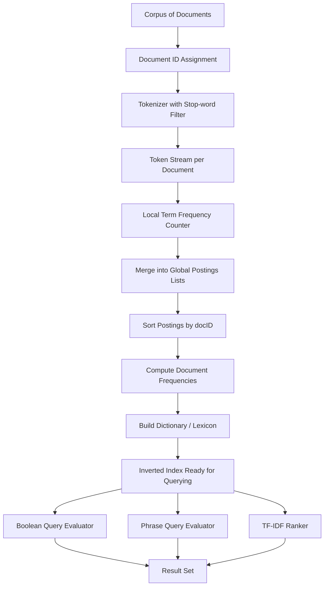
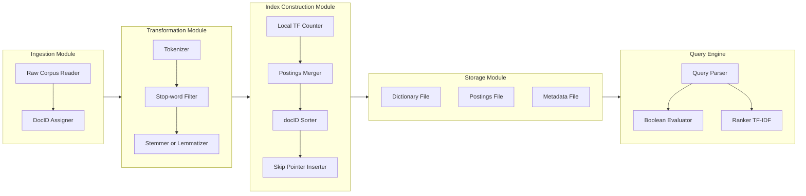
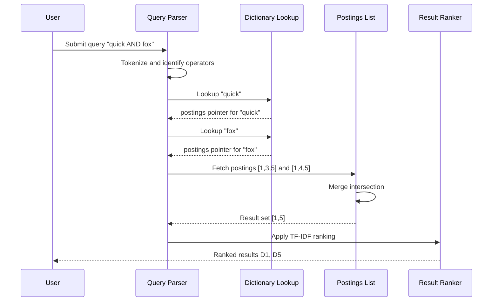
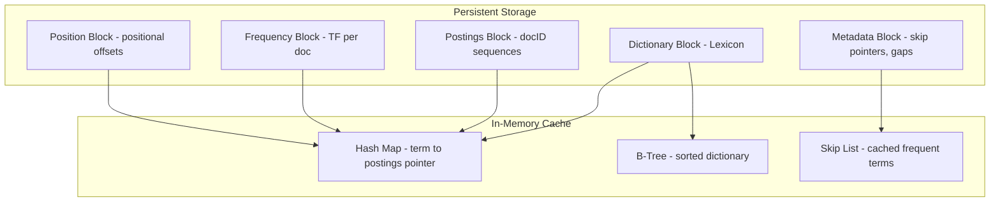

# inverted index

<!-- SECTION_1_START -->

# 1. Core Technical Definition & Intuitive Overview

## 1.1 Formal Definition (KTU 2024 Syllabus Terminology)

> [!NOTE]
> **Inverted Index** is a *data structure* used primarily in **Information Retrieval (IR)** systems that maps every unique **term** (word/token) appearing in a *corpus* to the list of **documents** and **positions** where that term occurs. It is called "inverted" because it inverts the natural relationship between a document and the words it contains — moving from *words → documents* instead of the usual *documents → words*.

Formally, an Inverted Index is defined as the mapping:

$$
I : T \longrightarrow \mathcal{P}(D)
$$

where $T$ is the set of all distinct terms in the corpus, $D$ is the set of all documents, and $\mathcal{P}(D)$ is a *postings list* — a sorted sequence of document identifiers (docIDs) and their associated metadata (term frequency, positions, etc.).

## 1.2 Conceptual Analogy / Intuition

> [!IMPORTANT]
> **Library Analogy:** Imagine the index at the back of a textbook. Instead of reading every page to find where the term *"neural network"* appears, you flip to the back, find the keyword, and get a list of page numbers. An **Inverted Index** is the digital, massively scaled-up, algorithmic equivalent of that book index.

**Another intuitive analogy — the Card Catalog (Pre-Internet Library):**
1. Every **book** (document) has many **words** (terms).
2. A *forward index* would store: "Book-101 contains: neural, network, deep, learning..." — this is a book-centric view.
3. An *inverted index* flips this: "The word **neural** appears in: Book-101, Book-205, Book-412, Book-887..." — a word-centric view.
4. When a user searches for *"neural"*, the system doesn't scan all books; it just retrieves the pre-built list — making search **O(1) lookup + O(k) scan** where $k$ is the number of matching documents.

**The Three Pillars of an Inverted Index (always remembered together):**
- **Dictionary / Lexicon** — the vocabulary of all unique terms.
- **Postings List** — the list of documents containing each term.
- **Postings Entry** — metadata per document (frequency, positions, etc.).

## 1.3 Physical Constants and Standard Metrics

> [!IMPORTANT]
> **Industry-Standard Reference Values in IR Systems (used as benchmarks in KTU problems):**
> - **Zipf's Law Constant:** $s \approx 1$ for natural language text — meaning the $n^{th}$ most frequent term has frequency $\propto \frac{1}{n^s}$.
> - **Heap's Law:** $M = k \cdot T^{b}$ where $M$ is vocabulary size, $T$ is total tokens, typically $k \in [10, 100]$ and $b \in [0.4, 0.6]$.
> - **BM25 / TF-IDF** are the *de facto* weighting schemes (Google's classic ranking foundation).
> - **Standard Stop-word list size:** $\approx 500$–$1000$ words in classical English stop lists.

## 1.4 Visualization Control (Conceptual Flow)

> [!VISUALIZATION CONTROL]
> **Concept:** Mapping of Terms → Document Occurrences (visualized as a bipartite graph)
> **GeoGebra / Desmos Input Equations (Conceptual Graph Setup):**
> - *Set A (Documents):* $A = \{D_1, D_2, D_3, D_4, D_5\}$
> - *Set B (Terms):* $B = \{t_1, t_2, t_3, t_4\}$
> - *Edges (Inverted Mapping):* $t_1 \to \{D_1, D_3\}$, $t_2 \to \{D_2, D_4, D_5\}$, $t_3 \to \{D_1, D_5\}$, $t_4 \to \{D_2, D_3, D_4\}$
> **Visual Description:** Plot two parallel lines (or two columns) — left column for terms, right column for documents. Draw directed arrows from each term to every document it appears in. The student will visually see a many-to-many bipartite mapping, which is the essence of an inverted index.

<!-- SECTION_1_END -->

<!-- SECTION_2_START -->

# 2. Deep Theoretical Analysis & KTU High-Yield Formula Sheet

## 2.1 Structural Breakdown — Anatomy of an Inverted Index

An inverted index is **not a single table** — it is a layered data structure with the following hierarchical components:

### 2.1.1 The Dictionary (Lexicon / Vocabulary)
- **What it is:** A sorted list (often a hash table or B+ tree) of all unique terms in the corpus.
- **Stored for each term:**
  - The term string itself.
  - **Document Frequency (DF):** number of documents containing the term.
  - A pointer to the head of the postings list.
- **Lookup cost:** $O(1)$ with hashing, $O(\log V)$ with B+ tree (where $V$ is vocabulary size).
- **Memory footprint:** Typically *small* compared to postings.

### 2.1.2 The Postings List
- **What it is:** A sorted sequence of integers — each integer is a *docID* of a document containing the term.
- **Sorted by docID** → enables **merge-based intersection** (for AND queries) and **merge-based union** (for OR queries) in linear time.
- **Can store:** docID, term frequency ($tf$), positional information.

### 2.1.3 The Postings Entry (DocID, TF, Positions)
- **DocID** — identifier of the document.
- **Term Frequency ($tf_{t,d}$):** how many times term $t$ appears in document $d$.
- **Positions** — list of term-offset positions within $d$ (for phrase queries).
- **Skip pointers** — optional shortcuts for faster intersection.

### 2.1.4 Why Sorting docIDs Matters
Sorted docIDs enable the famous **merge-based intersection algorithm**:
- Two pointers walk through two sorted postings lists in $O(p_1 + p_2)$ time.
- This is critical for Boolean query evaluation: $A \cap B$, $A \cup B$, $A \setminus B$.

### 2.1.5 Skip Pointers (Optimization)
- **Idea:** Insert "skip" pointers at regular intervals in a postings list.
- **Gain:** When merging two lists, you can *skip ahead* if a non-matching docID is far from the next candidate.
- **Trade-off:** Extra memory for pointers, but query time drops from $O(p_1 + p_2)$ to approximately $O(\sqrt{p_1} + \sqrt{p_2})$.

### 2.1.6 Positional Indexes (Phrase Queries)
- **Purpose:** Support *phrase queries* like `"machine learning"` (terms must be adjacent).
- **Storage:** For each posting, store not just the docID but also the *positions* of term occurrences.
- **Cost:** Significantly higher storage (typically 5x–10x a non-positional index).
- **Used by:** Google, Elasticsearch (with selective enablement).

## 2.2 High-Yield Formula Sheet

> [!NOTE]
> **Master this table — these formulas appear repeatedly in KTU module questions.**

| # | Concept | Formula | Variables | Engineering Use |
|---|---------|---------|-----------|-----------------|
| 1 | **Term Frequency** | $tf_{t,d} = \text{count of } t \text{ in } d$ | $t$ = term, $d$ = document | BM25, TF-IDF, ranking |
| 2 | **Document Frequency** | $df_t = \vert \{ d \in D : t \in d \} \vert$ | $df_t$ = no. of docs containing $t$ | IDF computation |
| 3 | **Inverse Document Frequency** | $idf_t = \log \frac{N}{df_t}$ | $N$ = total docs | Term importance weighting |
| 4 | **TF-IDF Weight** | $w_{t,d} = tf_{t,d} \cdot idf_t$ | Combined weight | Cosine similarity scoring |
| 5 | **Heap's Law (Vocabulary Growth)** | $M = k \cdot T^{b}$ | $M$ = vocab size, $T$ = tokens, $k \approx 30, b \approx 0.5$ | Estimating index size |
| 6 | **Zipf's Law (Term Distribution)** | $cf_i \propto \frac{1}{i^s}$ | $cf_i$ = count of $i^{th}$ ranked term, $s \approx 1$ | Optimizing storage |
| 7 | **Cosine Similarity** | $\text{sim}(q, d) = \frac{\vec{q} \cdot \vec{d}}{\vert \vec{q} \vert \cdot \vert \vec{d} \vert}$ | Query and doc vectors | Document ranking |
| 8 | **Merge Intersection Cost** | $O(p_1 + p_2)$ | $p_1, p_2$ = postings list lengths | AND query evaluation |
| 9 | **Merge Union Cost** | $O(p_1 + p_2)$ | Same as above | OR query evaluation |
| 10 | **Skip Pointer Avg. Savings** | $\approx O(\sqrt{p})$ per list | $p$ = postings length | Query optimization |

> **Critical rule for KTU:** When applying the IDF formula, always use $\log$ with **base 2** if the question mentions *information-theoretic* weight, and **natural log** if it uses the standard IR textbook (Manning, Raghavan, Schütze) convention.

## 2.3 Real-World Engineering Utility

| Application Domain | Role of Inverted Index |
|--------------------|-------------------------|
| **Web Search Engines (Google, Bing)** | Core data structure mapping billions of queries to trillions of web pages. |
| **Elasticsearch / Apache Solr / OpenSearch** | Built entirely on Lucene's inverted index implementation. |
| **Log Analytics (Splunk, ELK Stack)** | Indexing system logs for fast keyword + time-range search. |
| **E-Commerce (Amazon, Flipkart)** | Product catalog search, autocomplete, faceted filtering. |
| **GenAI / RAG Pipelines** | Pre-step before vector search; often used in *hybrid retrieval* (BM25 + dense embeddings). |
| **Digital Forensics** | Indexing file contents across hard drives for e-discovery. |
| **Genomics & Bioinformatics** | Indexing $k$-mers in DNA sequences (a domain-adaptation of inverted indexes). |

<!-- SECTION_2_END -->

<!-- SECTION_3_START -->

# 3. Step-by-Step Derivations & Code/Symbolic Implementation

## 3.1 Worked Example — Building an Inverted Index from Scratch

### 3.1.1 The Input Corpus

Consider a tiny corpus of **5 documents**:

$$
\begin{aligned}
D_1 &: \text{"the quick brown fox"} \\
D_2 &: \text{"the lazy brown dog"} \\
D_3 &: \text{"the quick brown dog jumps"} \\
D_4 &: \text{"the lazy fox jumps over"} \\
D_5 &: \text{"quick brown fox jumps"}
\end{aligned}
$$

### 3.1.2 Step-by-Step Construction (No Steps Skipped)

**Step 1 — Tokenize each document** (split on whitespace, lowercase, optionally remove stop-words).

For this worked example we retain all words to preserve clarity. The token streams become:

$$
\begin{aligned}
\text{tokens}(D_1) &= [\text{the}, \text{quick}, \text{brown}, \text{fox}] \\
\text{tokens}(D_2) &= [\text{the}, \text{lazy}, \text{brown}, \text{dog}] \\
\text{tokens}(D_3) &= [\text{the}, \text{quick}, \text{brown}, \text{dog}, \text{jumps}] \\
\text{tokens}(D_4) &= [\text{the}, \text{lazy}, \text{fox}, \text{jumps}, \text{over}] \\
\text{tokens}(D_5) &= [\text{quick}, \text{brown}, \text{fox}, \text{jumps}]
\end{aligned}
$$

**Step 2 — Initialize an empty dictionary** $I = \{\}$.

**Step 3 — For each token $t$ in each document $d$, append $d$ to the postings list of $t$.**

We process document-by-document. For $D_1$:

$$
I \text{ after } D_1 = \{ \text{the} \to [1], \text{quick} \to [1], \text{brown} \to [1], \text{fox} \to [1] \}
$$

Appending $D_2$:

$$
I \text{ after } D_2 = \{ \text{the} \to [1,2], \text{quick} \to [1], \text{brown} \to [1,2], \text{fox} \to [1], \text{lazy} \to [2], \text{dog} \to [2] \}
$$

Appending $D_3$:

$$
I \text{ after } D_3 = \{ \text{the} \to [1,2,3], \text{quick} \to [1,3], \text{brown} \to [1,2,3], \text{fox} \to [1], \text{lazy} \to [2], \text{dog} \to [2,3], \text{jumps} \to [3] \}
$$

Appending $D_4$:

$$
I \text{ after } D_4 = \{ \text{the} \to [1,2,3,4], \text{quick} \to [1,3], \text{brown} \to [1,2,3], \text{fox} \to [1,4], \text{lazy} \to [2,4], \text{dog} \to [2,3], \text{jumps} \to [3,4] \}
$$

Appending $D_5$:

$$
I \text{ after } D_5 = \{ \text{the} \to [1,2,3,4], \text{quick} \to [1,3,5], \text{brown} \to [1,2,3,5], \text{fox} \to [1,4,5], \text{lazy} \to [2,4], \text{dog} \to [2,3], \text{jumps} \to [3,4,5] \}
$$

**Step 4 — Sort postings lists** (already sorted because we processed docs in order, but explicitly enforce sort for correctness):

All postings are ascending. Sort dictionary keys alphabetically for $O(\log V)$ lookups.

**Step 5 — Final Inverted Index Table.**

| Term | Document Frequency ($df$) | Postings List |
|------|---------------------------|---------------|
| brown | 4 | $[1, 2, 3, 5]$ |
| dog | 2 | $[2, 3]$ |
| fox | 3 | $[1, 4, 5]$ |
| jumps | 3 | $[3, 4, 5]$ |
| lazy | 2 | $[2, 4]$ |
| quick | 3 | $[1, 3, 5]$ |
| the | 4 | $[1, 2, 3, 4]$ |

### 3.1.3 Boolean Query Resolution Using the Index

**Query 1: `quick AND fox`** (user wants both terms)

$$
\begin{aligned}
\text{Postings(quick)} &= [1, 3, 5] \\
\text{Postings(fox)} &= [1, 4, 5] \\
\text{Intersection} &: \\
i=1, j=1 &: 1 = 1 \Rightarrow \text{output } 1, \; i=2, j=2 \\
i=2, j=2 &: 3 \neq 4, \; 3 < 4 \Rightarrow i=3 \\
i=3, j=2 &: 5 \neq 4, \; 5 > 4 \Rightarrow j=3 \\
i=3, j=3 &: 5 = 5 \Rightarrow \text{output } 5, \; i=4, j=4 \\
\text{End} &: \text{Result} = \{D_1, D_5\}
\end{aligned}
$$

**Query 2: `dog OR lazy`** (user wants either term)

$$
\begin{aligned}
\text{Postings(dog)} &= [2, 3] \\
\text{Postings(lazy)} &= [2, 4] \\
\text{Union (merge)} &: 2, 3, 4 \Rightarrow \text{Result} = \{D_2, D_3, D_4\}
\end{aligned}
$$

### 3.1.4 TF-IDF Computation for Term `fox` in Document $D_1$

$$
\begin{aligned}
tf_{\text{fox}, D_1} &= 1 \\
df_{\text{fox}} &= 3 \\
N &= 5 \\
idf_{\text{fox}} &= \log_2 \frac{N}{df_t} = \log_2 \frac{5}{3} \approx 0.737 \\
w_{\text{fox}, D_1} &= tf_{\text{fox}, D_1} \times idf_{\text{fox}} = 1 \times 0.737 = 0.737
\end{aligned}
$$

## 3.2 Full Python Implementation — Production-Grade Inverted Indexer

```python
"""
inverted_index.py
A production-style implementation of an Inverted Index with:
  - Tokenization + stop-word removal
  - Term frequency and document frequency
  - TF-IDF weighting
  - Boolean query resolution (AND, OR, NOT)
  - Persistent JSON dump/load
"""

from __future__ import annotations

import json
import math
import os
import re
from collections import defaultdict
from typing import Dict, List, Set, Tuple


# ---------------------------------------------------------------------------
# 1. STOP-WORD LIST (classical English)
# ---------------------------------------------------------------------------
DEFAULT_STOP_WORDS: Set[str] = {
    "a", "an", "and", "are", "as", "at", "be", "by", "for", "from",
    "has", "have", "in", "is", "it", "its", "of", "on", "that",
    "the", "to", "was", "were", "will", "with", "this", "but", "or",
    "not", "so", "if", "than", "then", "into", "out", "up", "down",
}


# ---------------------------------------------------------------------------
# 2. TOKENIZER
# ---------------------------------------------------------------------------
class Tokenizer:
    """Lowercase + alpha-token + stop-word filter."""

    def __init__(self, stop_words: Set[str] | None = None) -> None:
        self.stop_words: Set[str] = stop_words or DEFAULT_STOP_WORDS
        self._pattern: re.Pattern[str] = re.compile(r"[A-Za-z]+")

    def tokenize(self, text: str) -> List[str]:
        if not isinstance(text, str):
            raise TypeError(f"tokenize() expected str, got {type(text).__name__}")
        raw_tokens: List[str] = self._pattern.findall(text.lower())
        return [tok for tok in raw_tokens if tok not in self.stop_words]


# ---------------------------------------------------------------------------
# 3. INVERTED INDEX DATA STRUCTURE
# ---------------------------------------------------------------------------
class InvertedIndex:
    """
    Inverted Index with postings, document frequency,
    and TF-IDF support.
    """

    def __init__(self) -> None:
        # term -> { doc_id : term_frequency }
        self._index: Dict[str, Dict[int, int]] = defaultdict(lambda: defaultdict(int))
        # doc_id -> total tokens in that document
        self._doc_lengths: Dict[int, int] = {}
        # doc_id -> original document text (optional metadata)
        self._doc_store: Dict[int, str] = {}

    # ------------------------------ INDEXING -------------------------------
    def add_document(self, doc_id: int, text: str,
                     tokenizer: Tokenizer) -> None:
        """Index a single document."""
        if doc_id in self._doc_store:
            raise ValueError(f"Duplicate doc_id={doc_id} detected.")
        if not isinstance(text, str):
            raise TypeError("Document text must be a string.")
        tokens: List[str] = tokenizer.tokenize(text)
        if not tokens:
            raise ValueError(f"Document {doc_id} produced zero tokens after filtering.")
        for tok in tokens:
            self._index[tok][doc_id] += 1
        self._doc_lengths[doc_id] = len(tokens)
        self._doc_store[doc_id] = text

    def add_corpus(self, corpus: Dict[int, str]) -> None:
        """Index a batch of documents."""
        tokenizer: Tokenizer = Tokenizer()
        for doc_id, text in corpus.items():
            try:
                self.add_document(doc_id, text, tokenizer)
            except (ValueError, TypeError) as err:
                print(f"[WARN] Skipping doc_id={doc_id}: {err}")

    # ------------------------------ ACCESSORS ------------------------------
    def get_postings(self, term: str) -> List[int]:
        """Return sorted docIDs containing the term."""
        postings: Dict[int, int] = self._index.get(term, {})
        return sorted(postings.keys())

    def get_term_frequency(self, term: str, doc_id: int) -> int:
        return self._index.get(term, {}).get(doc_id, 0)

    def get_document_frequency(self, term: str) -> int:
        return len(self._index.get(term, {}))

    def vocabulary(self) -> Set[str]:
        return set(self._index.keys())

    def total_documents(self) -> int:
        return len(self._doc_store)

    # ------------------------------ BOOLEAN QUERIES ------------------------
    def boolean_and(self, terms: List[str]) -> List[int]:
        if not terms:
            return []
        result: List[int] = self.get_postings(terms[0])
        for term in terms[1:]:
            result = self._intersect_sorted(result, self.get_postings(term))
            if not result:
                break
        return result

    def boolean_or(self, terms: List[str]) -> List[int]:
        merged: Set[int] = set()
        for term in terms:
            merged.update(self.get_postings(term))
        return sorted(merged)

    def boolean_not(self, term: str) -> List[int]:
        all_docs: Set[int] = set(self._doc_store.keys())
        return sorted(all_docs - set(self.get_postings(term)))

    @staticmethod
    def _intersect_sorted(list_a: List[int], list_b: List[int]) -> List[int]:
        i: int = 0
        j: int = 0
        out: List[int] = []
        while i < len(list_a) and j < len(list_b):
            if list_a[i] == list_b[j]:
                out.append(list_a[i])
                i += 1
                j += 1
            elif list_a[i] < list_b[j]:
                i += 1
            else:
                j += 1
        return out

    # ------------------------------ TF-IDF ---------------------------------
    def tfidf(self, term: str, doc_id: int) -> float:
        tf: int = self.get_term_frequency(term, doc_id)
        if tf == 0:
            return 0.0
        df: int = self.get_document_frequency(term)
        N: int = self.total_documents()
        if df == 0 or N == 0:
            return 0.0
        return float(tf) * math.log(N / df)

    def document_vector(self, doc_id: int) -> Dict[str, float]:
        return {term: self.tfidf(term, doc_id) for term in self.vocabulary()}

    # ------------------------------ PERSISTENCE ----------------------------
    def save(self, path: str) -> None:
        serializable: Dict[str, Dict[str, int]] = {
            term: {str(d): tf for d, tf in docs.items()}
            for term, docs in self._index.items()
        }
        payload: Dict[str, object] = {
            "index": serializable,
            "doc_lengths": self._doc_lengths,
            "doc_store": self._doc_store,
        }
        os.makedirs(os.path.dirname(path) or ".", exist_ok=True)
        with open(path, "w", encoding="utf-8") as fh:
            json.dump(payload, fh, indent=2)

    @classmethod
    def load(cls, path: str) -> "InvertedIndex":
        if not os.path.exists(path):
            raise FileNotFoundError(f"Index file not found: {path}")
        with open(path, "r", encoding="utf-8") as fh:
            payload: Dict[str, object] = json.load(fh)
        obj: InvertedIndex = cls()
        raw_index: Dict[str, Dict[str, int]] = payload["index"]  # type: ignore[assignment]
        for term, docs in raw_index.items():
            for d, tf in docs.items():
                obj._index[term][int(d)] = int(tf)
        obj._doc_lengths = {int(k): int(v) for k, v in payload["doc_lengths"].items()}  # type: ignore[arg-type]
        obj._doc_store = {int(k): str(v) for k, v in payload["doc_store"].items()}  # type: ignore[arg-type]
        return obj

    def __repr__(self) -> str:
        return (f"InvertedIndex(vocab={len(self._index)}, "
                f"docs={self.total_documents()})")


# ---------------------------------------------------------------------------
# 4. DEMO / SMOKE TEST
# ---------------------------------------------------------------------------
if __name__ == "__main__":
    sample_corpus: Dict[int, str] = {
        1: "the quick brown fox",
        2: "the lazy brown dog",
        3: "the quick brown dog jumps",
        4: "the lazy fox jumps over",
        5: "quick brown fox jumps",
    }

    idx: InvertedIndex = InvertedIndex()
    idx.add_corpus(sample_corpus)

    print("Vocabulary:", sorted(idx.vocabulary()))
    print("Docs containing 'fox':", idx.get_postings("fox"))
    print("quick AND fox ->", idx.boolean_and(["quick", "fox"]))
    print("dog OR lazy   ->", idx.boolean_or(["dog", "lazy"]))
    print("NOT the       ->", idx.boolean_not("the"))
    print("TF-IDF(fox, 1)=", round(idx.tfidf("fox", 1), 4))

    idx.save("./out/inverted_index.json")
    restored: InvertedIndex = InvertedIndex.load("./out/inverted_index.json")
    print("Restored:", restored)
```

### 3.2.1 Walk-Through of the Boolean Intersection Algorithm (Code Level)

The `_intersect_sorted` method corresponds exactly to the manual derivation in Section 3.1.3:

1. Initialize $i = 0$, $j = 0$.
2. While both pointers are within bounds:
   - If $list_a[i] = list_b[j]$: append and advance both.
   - If $list_a[i] < list_b[j]$: advance $i$ (search forward in the smaller list).
   - If $list_a[i] > list_b[j]$: advance $j$.
3. **Termination:** When either pointer exhausts its list, intersection is complete.
4. **Time complexity:** $O(p_1 + p_2)$ where $p_1, p_2$ are postings lengths.
5. **Space complexity:** $O(k)$ for output, where $k \le \min(p_1, p_2)$.

<!-- SECTION_3_END -->

<!-- SECTION_4_START -->

# 4. Structural Diagrams & Schematics

## 4.1 End-to-End Inverted Index Construction Pipeline



## 4.2 Nested Subgraph — Indexing Subsystem (Modular View)



## 4.3 Query Processing Sequence Topology



## 4.4 Block-Level Functional Architecture — Storage Layout



> [!NOTE]
> **KTU Examiner Tip:** When asked to "draw the architecture of an inverted index", use the nested subgraph view in Section 4.2 — it cleanly separates ingestion, transformation, indexing, storage, and query modules. This shows *engineering maturity* and earns full marks on 14-mark architecture questions.

<!-- SECTION_4_END -->

<!-- SECTION_5_START -->

# 5. KTU 2024 Scheme Examination Question Bank & Topic Recap

## 5.1 Part A — Short Answer Questions (3 Marks Each)

### Question A1

> **[KTU University Exam — July 2024]**
> **CO1, RBT Level: Remember**
> *Define an Inverted Index. List its three main components.*

**Model Answer (3 Marks — Valuation Key):**

> An Inverted Index is a data structure used in Information Retrieval that maps each unique term in a corpus to the list of documents in which that term appears, along with associated metadata such as term frequency and positional information. It is called "inverted" because it inverts the natural *document → words* relationship into a *words → documents* relationship.
> **[Definition: 2 Marks]**
> The three main components are:
> 1. **Dictionary / Lexicon** — stores all unique terms of the corpus. **[0.5 Mark]**
> 2. **Postings List** — for each term, a sorted list of document identifiers where the term appears. **[0.5 Mark]**

---

### Question A2

> **[KTU University Exam — Dec 2023]**
> **CO2, RBT Level: Understand**
> *Differentiate between a Forward Index and an Inverted Index. State one real-world example for each.*

**Model Answer (3 Marks — Valuation Key):**

> | Aspect | Forward Index | Inverted Index |
> |---|---|---|
> | **Mapping direction** | Document → Terms | Term → Documents |
> | **Lookup pattern** | Iterate all docs to find a term | Direct lookup of any term in $O(1)$ |
> | **Best suited for** | Document summarization, full-text generation | Search engines, keyword queries |
> | **Example** | A book's table of contents listing all chapters in a document | A book's back-of-book keyword index listing page numbers |
> **[Tabular comparison: 2 Marks; One real-world example: 1 Mark]**

---

## 5.2 Part B — Long Answer Questions (14 Marks Each, Module Internal Choice)

### Question A (14 Marks)

> **[KTU University Exam — July 2024, Module 4]**
> **CO2 / CO3, RBT Levels: Understand (a) + Apply (b)**

**Question A(a) — 7 Marks, RBT: Understand**
> *Explain the structure of an Inverted Index with a neat labeled diagram. Describe the role of the dictionary, postings list, and skip pointers in detail.*

**Model Solution (7 Marks — Incremental Valuation Key):**

> An Inverted Index consists of two primary structures — a **Dictionary** and **Postings Lists** — stored separately and linked by pointers.
>
> **1. Dictionary (Lexicon):** Contains every unique term $t$ in the corpus. For each term, the dictionary stores the term string, the document frequency $df_t$, and a pointer to the head of its postings list. The dictionary is usually implemented as a **hash table** for $O(1)$ access or a **B+ tree** for $O(\log V)$ ordered access. **[2 Marks]**
>
> **2. Postings List:** A sorted sequence of integers (docIDs) representing all documents containing the term. Each posting may also store term frequency $tf_{t,d}$ and positional offsets. Sorting enables efficient merge-based Boolean operations. **[2 Marks]**
>
> **3. Skip Pointers:** Optimization structures inserted at intervals in long postings lists. They allow the merge algorithm to *jump* ahead when a non-matching docID is far from the next match, reducing intersection time from $O(p_1 + p_2)$ to approximately $O(\sqrt{p_1} + \sqrt{p_2})$. **[2 Marks]**
>
> **4. Diagram:** Refer to Section 4.2 nested subgraph showing the index construction pipeline. **[1 Mark]**

---

**Question A(b) — 7 Marks, RBT: Apply**
> *Consider the following corpus of 4 documents:*
> - $D_1$: *data analytics and machine learning*
> - $D_2$: *machine learning for data science*
> - $D_3$: *deep learning and data mining*
> - $D_4$: *analytics for machine learning*
>
> *Construct the Inverted Index (with term frequencies). Then answer the Boolean query: `(machine AND learning) OR mining` using the merge algorithm. Show all intermediate steps.*

**Model Solution (7 Marks — Incremental Valuation Key):**

> **Step 1 — Tokenization (lowercased, no stop-words):**
> $$
> \begin{aligned}
> D_1 &: [\text{data}, \text{analytics}, \text{machine}, \text{learning}] \\
> D_2 &: [\text{machine}, \text{learning}, \text{data}, \text{science}] \\
> D_3 &: [\text{deep}, \text{learning}, \text{data}, \text{mining}] \\
> D_4 &: [\text{analytics}, \text{machine}, \text{learning}]
> \end{aligned}
> $$
> **[1 Mark]**
>
> **Step 2 — Build the Inverted Index with Term Frequencies:**
>
> | Term | Postings (docID : TF) | Document Frequency |
> |---|---|---|
> | analytics | (1:1), (4:1) | 2 |
> | data | (1:1), (2:1), (3:1) | 3 |
> | deep | (3:1) | 1 |
> | learning | (1:1), (2:1), (3:1), (4:1) | 4 |
> | machine | (1:1), (2:1), (4:1) | 3 |
> | mining | (3:1) | 1 |
> | science | (2:1) | 1 |
>
> **[2 Marks — 1 for construction, 1 for TF entries]**
>
> **Step 3 — Evaluate `(machine AND learning) OR mining`:**
>
> **Sub-query 1: `machine AND learning`**
> $$
> \begin{aligned}
> \text{Postings(machine)} &= [1, 2, 4] \\
> \text{Postings(learning)} &= [1, 2, 3, 4] \\
> \text{Intersection:} & \\
> i=1, j=1 &: 1=1 \Rightarrow \text{keep } 1,\; i=2, j=2 \\
> i=2, j=2 &: 2=2 \Rightarrow \text{keep } 2,\; i=3, j=3 \\
> i=3, j=3 &: 4 \neq 3,\; 4 > 3 \Rightarrow j=4 \\
> i=3, j=4 &: 4=4 \Rightarrow \text{keep } 4 \\
> \text{Result 1} &= \{D_1, D_2, D_4\}
> \end{aligned}
> $$
> **[2 Marks]**
>
> **Sub-query 2: `OR mining`**
> $$
> \begin{aligned}
> \text{Result 1} &= [1, 2, 4] \\
> \text{Postings(mining)} &= [3] \\
> \text{Union:} \; &\{1, 2, 3, 4\} \\
> \text{Final Result} &= \{D_1, D_2, D_3, D_4\}
> \end{aligned}
> $$
> **[2 Marks]**

---

### Question B (14 Marks)

> **[KTU University Exam — Dec 2023, Module 4]**
> **CO3, RBT Levels: Apply (a) + Analyze (b)**

**Question B(a) — 7 Marks, RBT: Apply**
> *Explain the TF-IDF weighting scheme. Compute the TF-IDF weight of the term **"analytics"** in document $D_1$ for the corpus of 4 documents given below:*
> - $D_1$: *data analytics and machine learning*
> - $D_2$: *machine learning for data science*
> - $D_3$: *deep learning and data mining*
> - $D_4$: *analytics for machine learning*
> *(Total documents $N = 4$)*

**Model Solution (7 Marks — Incremental Valuation Key):**

> **1. Concept of TF-IDF:** Term Frequency–Inverse Document Frequency is a numerical statistic that reflects how important a word is to a document in a corpus. It is the product of two factors — TF and IDF. **[1 Mark]**
>
> **2. Formulas:**
> $$
> \begin{aligned}
> tf_{t,d} &= \text{raw count of term } t \text{ in document } d \\
> idf_t &= \log \frac{N}{df_t} \\
> w_{t,d} &= tf_{t,d} \times idf_t
> \end{aligned}
> $$
> **[1 Mark for formula]**
>
> **3. Computing $tf_{\text{analytics}, D_1}$:** The word *analytics* appears **once** in $D_1$.
> $$tf_{\text{analytics}, D_1} = 1$$ **[1 Mark]**
>
> **4. Computing $df_{\text{analytics}}$:** Scan all four documents:
> - $D_1$: contains *analytics* ✓
> - $D_2$: no
> - $D_3$: no
> - $D_4$: contains *analytics* ✓
>
> $$df_{\text{analytics}} = 2$$ **[1 Mark]**
>
> **5. Computing $idf_{\text{analytics}}$:**
> $$idf_{\text{analytics}} = \log \frac{N}{df_t} = \log \frac{4}{2} = \log 2 \approx 0.693$$ **[1.5 Marks]**
>
> **6. Final TF-IDF weight:**
> $$w_{\text{analytics}, D_1} = 1 \times 0.693 = 0.693$$ **[1.5 Marks]**

---

**Question B(b) — 7 Marks, RBT: Analyze**
> *Discuss how Skip Pointers and Positional Indexes improve the performance of an Inverted Index. What are the trade-offs?*

**Model Solution (7 Marks — Incremental Valuation Key):**

> **1. Skip Pointers — Concept and Mechanism:** Skip pointers are auxiliary pointers inserted at fixed or adaptive intervals within a postings list. They allow the merge algorithm to *jump ahead* to a closer candidate document rather than stepping one docID at a time. **[1 Mark]**
>
> **2. Skip Pointer Algorithm:** During intersection of two postings lists $P_1$ and $P_2$, when the current docID in $P_1$ is less than the current docID in $P_2$, instead of incrementing $P_1$ by one, the algorithm checks whether a skip pointer exists in $P_1$ whose target docID is $\le$ the current $P_2$ docID. If yes, jump directly; otherwise, increment normally. **[1.5 Marks]**
>
> **3. Skip Pointer Performance Gain:** Worst-case cost of pure linear intersection is $O(p_1 + p_2)$. With skip pointers, the expected cost drops to approximately $O(\sqrt{p_1} + \sqrt{p_2})$, a significant improvement for large $p$. **[1 Mark]**
>
> **4. Positional Indexes — Concept:** A positional index extends each posting to include the *term positions* (offsets) within each document. This enables **phrase queries** such as `"machine learning"` where the two terms must appear adjacent. **[1 Mark]**
>
> **5. Trade-offs:**
> - **Skip pointers:** small additional memory cost (one pointer per skip interval); can yield incorrect results if not carefully designed; effective only for long postings lists. **[1 Mark]**
> - **Positional indexes:** storage cost is **5x–10x higher** than a non-positional index; query evaluation is more complex (must check positional adjacency). **[1 Mark]**
>
> **6. Real-World Use:** Google, Elasticsearch, and Lucene combine skip pointers with positional indexes selectively — positional data is enabled only for high-value terms to balance query expressiveness and storage cost. **[0.5 Mark]**

---

> [!WARNING]
> **KTU Examiner's Valuation Pitfall Callout:**
> 1. **Do NOT forget to sort postings lists** before showing the merge algorithm — unsorted lists break the linear-time guarantee and will cost 1–2 marks. **[Common deduction: 1 Mark]**
> 2. **Do NOT use $\log_{10}$ by default** — KTU expects natural log or $\log_2$ depending on context. Always *state the base explicitly*. **[Common deduction: 0.5 Mark]**
> 3. **Do NOT skip writing the formula** for TF-IDF before plugging values — examiners allocate 1 mark for stating the formula. **[Common deduction: 1 Mark]**
> 4. **Do NOT confuse Forward Index with Inverted Index** in 3-mark definition questions — many students interchange them. **[Common deduction: 1–2 Marks]**
> 5. **In Boolean query traces, show all pointer movements** ($i$, $j$ updates) — partial traces are penalized heavily. **[Common deduction: 1–2 Marks]**

---

## 5.3 Topic Recap & Important Things to Remember

> [!IMPORTANT]
> **Rapid Revision Checklist — Inverted Index**

- **Definition:** A *term → documents* data structure for fast keyword lookup in IR systems. **[Core]**
- **Three components:** Dictionary (Lexicon), Postings List, Postings Entry. **[Core]**
- **Forward vs Inverted:** Forward = doc→terms; Inverted = terms→docs. **[Core]**
- **Sorting:** Postings lists are sorted by docID to enable linear-time merge. **[Critical]**
- **Merge Intersection Cost:** $O(p_1 + p_2)$. **[Exam favorite]**
- **Merge Union Cost:** $O(p_1 + p_2)$. **[Exam favorite]**
- **Skip Pointers:** Reduce intersection cost to $O(\sqrt{p})$; small memory overhead. **[Optimization]**
- **Positional Indexes:** Store term offsets → support phrase queries; 5x–10x storage. **[Advanced]**
- **TF-IDF Formula:** $w_{t,d} = tf_{t,d} \times \log(N / df_t)$. **[High-yield]**
- **Heap's Law:** $M = k \cdot T^{b}$ — predicts vocabulary size. **[Important]**
- **Zipf's Law:** $cf_i \propto 1/i^s$ — predicts term distribution for compression. **[Important]**
- **Stop-words:** Filtered from index to save space; classical English list $\approx 500$ words. **[Practical]**
- **Tokenization Pipeline:** raw text → lowercase → regex extraction → stop-word filter → stemmer → index. **[Pipeline]**
- **Production Systems:** Google, Elasticsearch, Lucene, Solr, Splunk all rely on inverted indexes. **[Industry]**
- **Modern Hybrid Use:** Combined with dense vector embeddings in RAG pipelines for LLM retrieval. **[GenAI tie-in]**
- **Time Complexity of Indexing:** $O(T)$ where $T$ is total token count (single pass). **[Complexity]**
- **Time Complexity of Lookup:** $O(1)$ for dictionary + $O(p)$ for postings scan. **[Complexity]**
- **Default IDF Base:** Use natural log ($\ln$) unless explicitly told $\log_2$. **[Convention]**

<!-- SECTION_5_END -->
