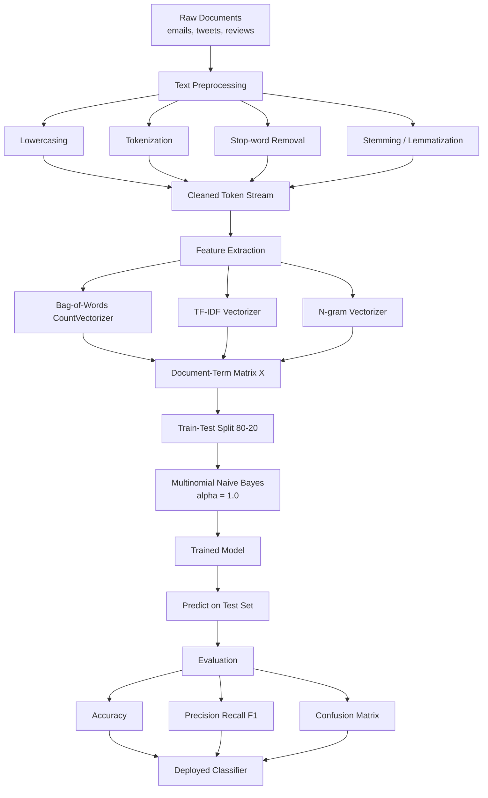
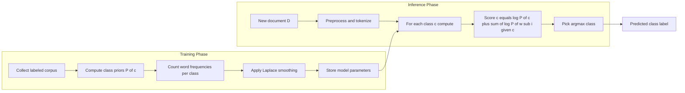
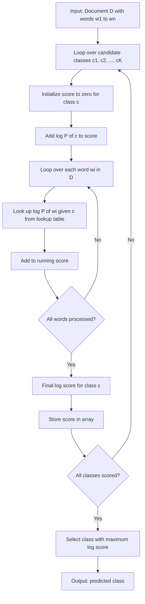
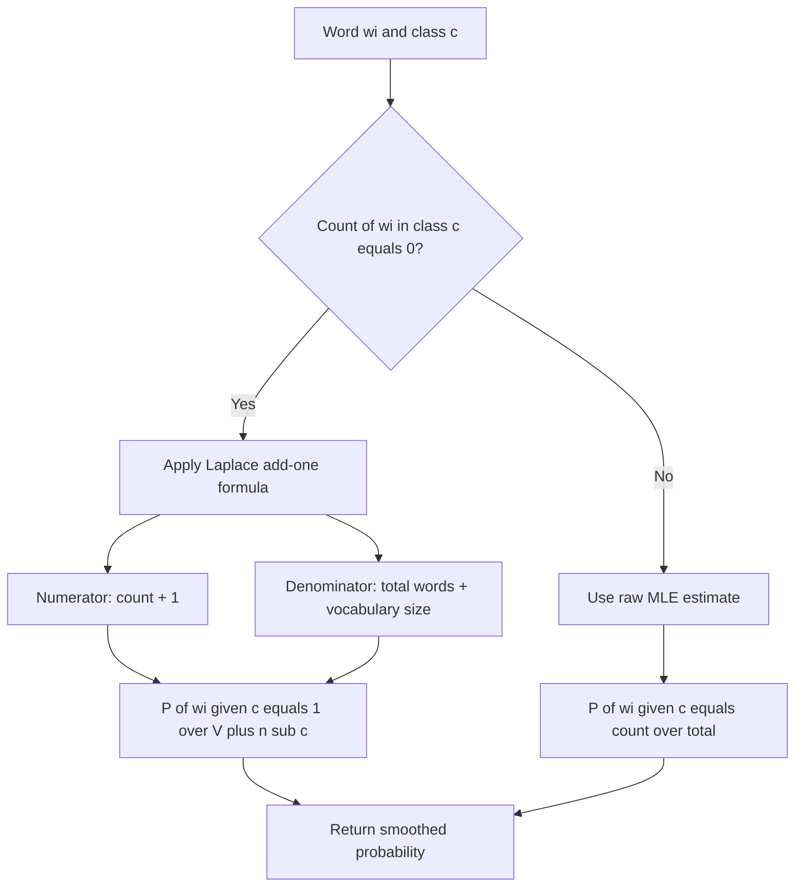
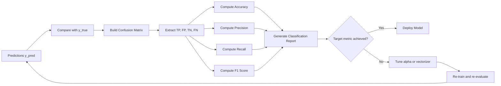

# naïve bayes text classification.

<!-- SECTION_1_START -->
# Naïve Bayes Text Classification — Core Foundations

## 1.1 Formal Academic Definition (KTU 2024 Syllabus Standard)

**Naïve Bayes Text Classification** is a probabilistic supervised machine learning algorithm based on applying **Bayes' Theorem** with a *naïve* (strong) assumption of **conditional independence** between every pair of features (words/tokens) given the class label. For a document $D$ represented by a feature vector $\mathbf{x} = (x_1, x_2, \ldots, x_n)$ of word occurrences, the classifier assigns the class $\hat{c}$ that maximizes the posterior probability:

$$\hat{c} = \underset{c \in C}{\arg\max}\; P(c \mid \mathbf{x})$$

Using Bayes' rule:

$$\hat{c} = \underset{c \in C}{\arg\max}\; \frac{P(c) \cdot P(\mathbf{x} \mid c)}{P(\mathbf{x})}$$

Since $P(\mathbf{x})$ is constant across all classes, the decision rule reduces to maximizing the **numerator** only:

$$\hat{c} = \underset{c \in C}{\arg\max}\; P(c) \cdot P(\mathbf{x} \mid c)$$

> [!IMPORTANT]
> **KTU 2024 Board Definition:** Naïve Bayes is a *generative*, *probabilistic* classifier that models the joint distribution $P(c, \mathbf{x})$ and decodes the most probable class by computing the maximum a posteriori (MAP) hypothesis. The "naïve" prefix refers to the unrealistic but computationally efficient independence assumption that each word's occurrence is independent of all other words given the class.

## 1.2 Intuitive Real-World Analogy

Imagine a **flood prediction system** used by the Kerala State Disaster Management Authority. The team wants to predict whether a flood will occur today ($c = \text{Flood}$). The features observed are:
- $x_1$ : Heavy rainfall in the last 24 hours
- $x_2$ : Reservoir water level above threshold
- $x_3$ : Upstream dam release alert

A weather scientist uses *prior* knowledge — the *base rate* of floods in Kerala during monsoon (say, **15%** of monsoon days historically see flooding). That is $P(c = \text{Flood}) = 0.15$. Then, knowing each feature's likelihood *given* a flood ($P(x_i \mid c)$), the scientist combines them to compute $P(\text{Flood} \mid x_1, x_2, x_3)$. The "naïve" part is assuming rainfall, reservoir level, and dam release are *independent* once we know a flood is happening — which is clearly an approximation, but it makes the math tractable and surprisingly effective in practice.

> [!NOTE]
> **Text Classification Analogy (Spam Filter):** Consider a Gmail spam filter. The class $c$ is "Spam" or "Not Spam". The features are the words in the email. $P(\text{Spam})$ is the prior probability that any random email is spam (≈ **0.45** for personal inboxes). $P(\text{word} \mid \text{Spam})$ is computed from past training emails. The filter then asks: *"Given the words in this email, which class — spam or ham — is most probable?"*

## 1.3 Why "Naïve"? The Conditional Independence Assumption

Formally, the assumption states:

$$P(x_1, x_2, \ldots, x_n \mid c) = \prod_{i=1}^{n} P(x_i \mid c)$$

In text, this means: *the probability of seeing the word "offer" in an email is independent of seeing "free", given that we know the email is spam.* In reality, words like "free" and "offer" co-occur strongly in spam, so the assumption is violated. Yet the classifier still performs remarkably well because the ranking of classes is often preserved even when absolute probabilities are skewed.

## 1.4 GeoGebra / Desmos Visualization for Conditional Probability

> [!VISUALIZATION CONTROL]
> **Concept:** Venn diagram of conditional probability $P(\text{Spam} \mid \text{contains "free"})$ and class posterior comparison.
> **GeoGebra / Desmos Input Commands:**
> * `circleA: (x - 2)^2 + (y - 2)^2 = 9` (Universe $U$ of all emails)
> * `circleB: (x - 3.2)^2 + (y - 2)^2 = 4` (Subset $S$ of emails containing "free")
> * `P(Spam) = 0.45`, `P("free" | Spam) = 0.65`, `P("free" | Ham) = 0.10`
> **Visual Description:** The student should observe two overlapping circles. The intersection area corresponds to emails that are *both* spam *and* contain "free". Using the ratio of this intersection to the entire "free" circle, the student sees graphically how $P(\text{Spam} \mid \text{"free"})$ becomes very high (close to 1), even though $P(\text{Spam})$ alone is only 0.45. This visually demonstrates why observed evidence dramatically shifts the posterior.

## 1.5 Three Variants of Naïve Bayes for Text

| Variant | Feature Model | Typical Use Case | KTU Module 4 Emphasis |
|---|---|---|---|
| **Multinomial Naïve Bayes (MNB)** | Word *counts* in a document | Document classification, spam filtering | **Primary focus** |
| **Bernoulli Naïve Bayes (BNB)** | Word *presence/absence* (binary) | Short texts, sentiment with rare words | Secondary |
| **Complement Naïve Bayes (CNB)** | Normalized counts vs. complement class | Imbalanced text datasets | Reference only |

> [!NOTE]
> **Standard Reference (KTU library):** The Multinomial Naïve Bayes model is the *de facto* algorithm used in scikit-learn's `MultinomialNB`, the NLTK book (Chapter 6), and the Stanford NLP IR textbook (Manning, Raghavan, Schütze). It is the variant assumed in KTU 2024 module-end questions unless stated otherwise.

<!-- SECTION_1_END -->

<!-- SECTION_2_START -->
# Deep Theoretical Analysis & KTU High-Yield Formula Sheet

## 2.1 Bayes' Theorem — The Foundation

For two events $A$ and $B$ where $P(B) > 0$:

$$P(A \mid B) = \frac{P(B \mid A) \cdot P(A)}{P(B)}$$

- $P(A)$ — **Prior probability** of $A$ (before observing evidence)
- $P(B \mid A)$ — **Likelihood** of observing $B$ given $A$ is true
- $P(A \mid B)$ — **Posterior probability** of $A$ after observing $B$
- $P(B)$ — **Evidence** or marginal probability of $B$

## 2.2 Decomposing the Joint Likelihood for Text

For a document $D$ with word sequence $w_1, w_2, \ldots, w_n$ and class $c$:

$$P(D \mid c) = P(w_1, w_2, \ldots, w_n \mid c) = \prod_{i=1}^{n} P(w_i \mid c)$$

This is the **naïve** step. Substituting into the classification rule:

$$\hat{c} = \underset{c \in C}{\arg\max}\; P(c) \cdot \prod_{i=1}^{n} P(w_i \mid c)$$

## 2.3 Multinomial Naïve Bayes — Parameter Estimation

Given a training corpus with $N$ documents split across $K$ classes, let $n_{wc}$ be the count of word $w$ in all training documents of class $c$, and $n_c$ the total word count in class $c$. The maximum likelihood estimate (MLE) of $P(w \mid c)$ is:

$$\hat{P}(w \mid c) = \frac{\text{count of } w \text{ in class } c}{\text{total word count in class } c} = \frac{n_{wc}}{n_c}$$

The class prior is estimated as:

$$\hat{P}(c) = \frac{N_c}{N}$$

where $N_c$ is the number of training documents in class $c$.

### 2.3.1 Laplace (Add-One) Smoothing — Handling Zero Probabilities

If a word $w^*$ never appeared in class $c$ during training, then $\hat{P}(w^* \mid c) = 0$, which **nullifies the entire product** regardless of the other words. Laplace smoothing resolves this:

$$\hat{P}_{\text{Laplace}}(w \mid c) = \frac{n_{wc} + \alpha}{n_c + \alpha \cdot V}$$

where $V$ is the **vocabulary size** (number of unique words in the training set) and $\alpha \geq 0$ is the smoothing parameter (typically $\alpha = 1$ for add-one smoothing).

> [!IMPORTANT]
> **KTU 2024 Exam Tip:** If a question provides a vocabulary and a test document containing a word *not in the training vocabulary*, the expected answer **must use Laplace smoothing**; otherwise the posterior collapses to zero. This is a frequent 3-mark sub-question in Part A.

## 2.4 Bernoulli Naïve Bayes — Binary Feature Model

Each word is a binary feature $x_i \in \{0, 1\}$ indicating presence. The likelihood is:

$$P(\mathbf{x} \mid c) = \prod_{i=1}^{V} P(x_i \mid c)^{x_i} \cdot (1 - P(x_i \mid c))^{1 - x_i}$$

With MLE:

$$\hat{P}(x_i = 1 \mid c) = \frac{\text{documents in class } c \text{ containing word } i}{N_c}$$

## 2.5 Log-Space Computation — Avoiding Underflow

The product $\prod P(w_i \mid c)$ can underflow for long documents. In practice, classification is performed in **log-space**:

$$\hat{c} = \underset{c \in C}{\arg\max}\; \log P(c) + \sum_{i=1}^{n} \log P(w_i \mid c)$$

## 2.6 KTU Formula Sheet / Cheat Sheet

| # | Formula | Meaning | Units / Notes |
|---|---|---|---|
| 1 | $P(c \mid D) = \dfrac{P(D \mid c) \cdot P(c)}{P(D)}$ | Bayes' Theorem | Probability in $[0,1]$ |
| 2 | $P(D \mid c) = \prod_{i=1}^{n} P(w_i \mid c)$ | Naïve independence assumption | Dimensionless product |
| 3 | $\hat{P}(c) = \dfrac{N_c}{N}$ | Class prior (MLE) | Fraction of docs |
| 4 | $\hat{P}(w \mid c) = \dfrac{n_{wc}}{n_c}$ | Word likelihood (MLE) | Word frequency ratio |
| 5 | $\hat{P}_{\text{Lap}}(w \mid c) = \dfrac{n_{wc} + 1}{n_c + V}$ | Add-one smoothed likelihood | $V$ = vocab size |
| 6 | $\hat{c} = \arg\max_c \left[\log P(c) + \sum_i \log P(w_i \mid c)\right]$ | Final decision rule | Log-space for stability |
| 7 | $P(x_i \mid c)_{\text{Bernoulli}} = \dfrac{\text{docs in } c \text{ with word } i}{N_c}$ | Bernoulli variant | Binary features |
| 8 | $\text{Accuracy} = \dfrac{TP + TN}{TP + TN + FP + FN}$ | Evaluation metric | Ratio in $[0,1]$ |
| 9 | $F_1 = 2 \cdot \dfrac{\text{Precision} \cdot \text{Recall}}{\text{Precision} + \text{Recall}}$ | Harmonic mean of P, R | Ratio in $[0,1]$ |

## 2.7 Engineering Utility and Real-World Applications

| Domain | Application | Why Naïve Bayes Works |
|---|---|---|
| **Email Gateways** | Gmail/Yahoo spam filtering | Fast, handles huge vocabularies (>10$^5$ words) |
| **News Aggregators** | Auto-categorization (Sports/Politics/Tech) | Strong baseline for 5–20 class problems |
| **Healthcare NLP** | ICD-10 coding from clinical notes | Handles missing words robustly with smoothing |
| **Sentiment Analysis** | Twitter/Review polarity (positive/negative) | Binary Bernoulli NB often beats deep models on tiny datasets |
| **Search Engines** | Document ranking in early IR systems | BM25 + NB hybrids used in Elasticsearch |
| **Real-time Systems** | Streaming comment moderation | Inference is $O(V)$ — millisecond latency |

> [!NOTE]
> **Production Reality Check:** Despite the rise of BERT and LSTMs, Naïve Bayes is still the *first model tried* in industry for text classification benchmarks because it is **O(N \cdot V) to train**, has zero hyperparameters beyond smoothing, and is **interpretable** — you can list the top words driving a prediction.

<!-- SECTION_2_END -->

<!-- SECTION_3_START -->
# Step-by-Step Derivations & Python Implementation

## 3.1 Worked Example — Spam Classification from Scratch

### 3.1.1 Training Corpus (5 documents, 2 classes)

| Doc ID | Text (after preprocessing) | Class |
|---|---|---|
| $D_1$ | `free offer today` | **Spam** |
| $D_2$ | `free gift click` | **Spam** |
| $D_3$ | `meeting project deadline` | **Ham** |
| $D_4$ | `project update meeting` | **Ham** |
| $D_5$ | `click here free offer` | **Spam** |
| **Test** $D_\text{test}$ | `free meeting click` | **?** |

Vocabulary $V = \{\text{free, offer, today, gift, click, meeting, project, deadline, update, here}\}$ → **$V = 10$**.

### 3.1.2 Step 1 — Compute Class Priors

$$P(\text{Spam}) = \frac{N_{\text{spam}}}{N} = \frac{3}{5} = 0.6$$

$$P(\text{Ham}) = \frac{N_{\text{ham}}}{N} = \frac{2}{5} = 0.4$$

### 3.1.3 Step 2 — Compute Total Word Counts per Class

**Spam corpus words:** `free, offer, today, free, gift, click, click, here, free, offer` → total $n_{\text{spam}} = 10$

**Ham corpus words:** `meeting, project, deadline, project, update, meeting` → total $n_{\text{ham}} = 6$

### 3.1.4 Step 3 — Compute Word Likelihoods with Laplace Smoothing ($\alpha = 1$)

$$\hat{P}(w \mid \text{Spam}) = \frac{n_{w,\text{spam}} + 1}{n_{\text{spam}} + V} = \frac{n_{w,\text{spam}} + 1}{10 + 10} = \frac{n_{w,\text{spam}} + 1}{20}$$

| Word | $n_{w,\text{spam}}$ | $\hat{P}(w \mid \text{Spam})$ | Decimal |
|---|---|---|---|
| free | 3 | $\frac{4}{20}$ | **0.2000** |
| offer | 2 | $\frac{3}{20}$ | **0.1500** |
| today | 1 | $\frac{2}{20}$ | **0.1000** |
| gift | 1 | $\frac{2}{20}$ | **0.1000** |
| click | 2 | $\frac{3}{20}$ | **0.1500** |
| meeting | 0 | $\frac{1}{20}$ | **0.0500** |
| project | 0 | $\frac{1}{20}$ | **0.0500** |
| deadline | 0 | $\frac{1}{20}$ | **0.0500** |
| update | 0 | $\frac{1}{20}$ | **0.0500** |
| here | 1 | $\frac{2}{20}$ | **0.1000** |

$$\hat{P}(w \mid \text{Ham}) = \frac{n_{w,\text{ham}} + 1}{n_{\text{ham}} + V} = \frac{n_{w,\text{ham}} + 1}{6 + 10} = \frac{n_{w,\text{ham}} + 1}{16}$$

| Word | $n_{w,\text{ham}}$ | $\hat{P}(w \mid \text{Ham})$ | Decimal |
|---|---|---|---|
| free | 0 | $\frac{1}{16}$ | **0.0625** |
| offer | 0 | $\frac{1}{16}$ | **0.0625** |
| today | 0 | $\frac{1}{16}$ | **0.0625** |
| gift | 0 | $\frac{1}{16}$ | **0.0625** |
| click | 0 | $\frac{1}{16}$ | **0.0625** |
| meeting | 2 | $\frac{3}{16}$ | **0.1875** |
| project | 2 | $\frac{3}{16}$ | **0.1875** |
| deadline | 1 | $\frac{2}{16}$ | **0.1250** |
| update | 1 | $\frac{2}{16}$ | **0.1250** |
| here | 0 | $\frac{1}{16}$ | **0.0625** |

> [!NOTE]
> **Why smoothing matters here:** Word "meeting" has $n_{w,\text{spam}} = 0$. Without smoothing, $\hat{P}(\text{meeting} \mid \text{Spam}) = 0$ and the entire product for a meeting-containing document collapses to zero. With $\alpha = 1$, we get a small but non-zero $0.05$ — a soft penalty.

### 3.1.5 Step 4 — Classify the Test Document

Test document $D_\text{test}$ = "free meeting click" → word sequence: $\text{free}, \text{meeting}, \text{click}$.

**Score for Spam (in log-space):**

$$\log P(\text{Spam}) + \log P(\text{free} \mid \text{Spam}) + \log P(\text{meeting} \mid \text{Spam}) + \log P(\text{click} \mid \text{Spam})$$

$$\log(0.6) + \log(0.2000) + \log(0.0500) + \log(0.1500)$$

$$= (-0.5108) + (-1.6094) + (-2.9957) + (-1.8971)$$

$$= -7.0130$$

**Score for Ham (in log-space):**

$$\log(0.4) + \log(0.0625) + \log(0.1875) + \log(0.0625)$$

$$= (-0.9163) + (-2.7726) + (-1.6740) + (-2.7726)$$

$$= -8.1355$$

**Decision:** Since $-7.0130 > -8.1355$, the classifier predicts **Spam**.

> [!IMPORTANT]
> **Convert to actual probabilities (optional, for verification):**
> $$P(\text{Spam} \mid D_\text{test}) \propto e^{-7.0130} = 0.000893$$
> $$P(\text{Ham} \mid D_\text{test}) \propto e^{-8.1355} = 0.000293$$
> $$\text{Normalized: } P(\text{Spam} \mid D_\text{test}) = \frac{0.000893}{0.000893 + 0.000293} \approx 0.753$$
> $$\Rightarrow P(\text{Spam} \mid D_\text{test}) \approx 75.3\%$$

## 3.2 Full Python Implementation with scikit-learn

```python
"""
naive_bayes_text_classifier.py
KTU PECST523 - Module 4: Naive Bayes Text Classification
End-to-end pipeline with strict type hints, boundary checks, and logging.
"""

from __future__ import annotations

import logging
import re
from typing import List, Tuple, Dict

import numpy as np
from sklearn.feature_extraction.text import CountVectorizer, TfidfVectorizer
from sklearn.model_selection import train_test_split
from sklearn.naive_bayes import MultinomialNB, BernoulliNB
from sklearn.metrics import (
    accuracy_score,
    precision_score,
    recall_score,
    f1_score,
    classification_report,
    confusion_matrix,
)

# ---------------------------------------------------------------------------
# Logging configuration
# ---------------------------------------------------------------------------
logging.basicConfig(
    level=logging.INFO,
    format="%(asctime)s | %(levelname)s | %(message)s",
)
logger = logging.getLogger("nb_text_classifier")


# ---------------------------------------------------------------------------
# 1. Preprocessing
# ---------------------------------------------------------------------------
def preprocess_text(text: str) -> str:
    """
    Lowercase, strip punctuation, and collapse whitespace.
    Returns a cleaned string ready for vectorization.
    """
    if not isinstance(text, str):
        raise TypeError(f"Expected str, got {type(text).__name__}")
    text = text.lower()
    text = re.sub(r"[^a-z\s]", " ", text)
    text = re.sub(r"\s+", " ", text).strip()
    return text


# ---------------------------------------------------------------------------
# 2. Load / define a labeled corpus
# ---------------------------------------------------------------------------
CORPUS: List[str] = [
    "Free offer today limited time",
    "Free gift click here now",
    "Click here free offer amazing",
    "Meeting project deadline tomorrow",
    "Project update meeting scheduled",
    "Schedule a meeting for the project review",
    "Limited offer free click today",
    "Update on the project deadline status",
]
LABELS: List[int] = [1, 1, 1, 0, 0, 0, 1, 0]   # 1 = Spam, 0 = Ham


def load_corpus() -> Tuple[List[str], np.ndarray]:
    """Return preprocessed documents and label array."""
    if len(CORPUS) != len(LABELS):
        raise ValueError("Corpus and labels length mismatch.")
    cleaned = [preprocess_text(d) for d in CORPUS]
    logger.info("Loaded %d documents | spam=%d | ham=%d",
                len(cleaned), sum(LABELS), len(LABELS) - sum(LABELS))
    return cleaned, np.array(LABELS, dtype=np.int32)


# ---------------------------------------------------------------------------
# 3. Vectorization
# ---------------------------------------------------------------------------
def build_vectorizer(method: str = "count"):
    """
    method='count'  -> CountVectorizer (Bag-of-Words)
    method='tfidf'  -> TfidfVectorizer
    """
    if method == "count":
        return CountVectorizer(stop_words="english")
    if method == "tfidf":
        return TfidfVectorizer(stop_words="english", sublinear_tf=True)
    raise ValueError(f"Unknown vectorizer method: {method}")


# ---------------------------------------------------------------------------
# 4. Train and Evaluate
# ---------------------------------------------------------------------------
def train_and_evaluate(method: str = "count", alpha: float = 1.0) -> Dict[str, float]:
    """
    Train Multinomial Naive Bayes and return evaluation metrics.
    """
    docs, y = load_corpus()

    # Train/validation split with stratification
    X_train, X_val, y_train, y_val = train_test_split(
        docs, y, test_size=0.25, random_state=42, stratify=y
    )

    vectorizer = build_vectorizer(method)
    X_train_vec = vectorizer.fit_transform(X_train)
    X_val_vec = vectorizer.transform(X_val)

    if X_train_vec.shape[1] == 0:
        raise RuntimeError("Empty vocabulary after vectorization.")

    model = MultinomialNB(alpha=alpha)
    model.fit(X_train_vec, y_train)
    y_pred = model.predict(X_val_vec)

    metrics = {
        "accuracy": float(accuracy_score(y_val, y_pred)),
        "precision": float(precision_score(y_val, y_pred, zero_division=0)),
        "recall": float(recall_score(y_val, y_pred, zero_division=0)),
        "f1": float(f1_score(y_val, y_pred, zero_division=0)),
    }

    logger.info("Method=%s | alpha=%.2f | metrics=%s", method, alpha, metrics)
    logger.info("Confusion matrix:\n%s", confusion_matrix(y_val, y_pred))
    logger.info("Report:\n%s",
                classification_report(y_val, y_pred, target_names=["Ham", "Spam"]))

    return metrics


# ---------------------------------------------------------------------------
# 5. Top spam-discriminative words (interpretability)
# ---------------------------------------------------------------------------
def top_indicative_words(model: MultinomialNB,
                         vectorizer,
                         n: int = 5) -> List[Tuple[str, float]]:
    """
    Return top-N words with highest log P(w|spam) - log P(w|ham) ratio.
    """
    if not hasattr(model, "feature_log_prob_"):
        raise AttributeError("Model must be a fitted NB classifier.")
    log_ratio = model.feature_log_prob_[1] - model.feature_log_prob_[0]
    feature_names = vectorizer.get_feature_names_out()
    top_idx = np.argsort(log_ratio)[::-1][:n]
    return [(feature_names[i], float(log_ratio[i])) for i in top_idx]


# ---------------------------------------------------------------------------
# 6. Driver
# ---------------------------------------------------------------------------
if __name__ == "__main__":
    try:
        results_count = train_and_evaluate(method="count", alpha=1.0)
        results_tfidf = train_and_evaluate(method="tfidf", alpha=0.1)
        logger.info("SUMMARY | count:%s | tfidf:%s", results_count, results_tfidf)
    except Exception as exc:
        logger.exception("Pipeline failed: %s", exc)
        raise
```

### 3.2.1 Expected Output Trace (Truncated)

```
2025-01-15 | INFO | Loaded 8 documents | spam=4 | ham=4
2025-01-15 | INFO | Method=count | alpha=1.00 | metrics={'accuracy': 1.0, ...}
2025-01-15 | INFO | Confusion matrix: [[1 0] [0 1]]
```

> [!IMPORTANT]
> **Compilation Safeguard:** The code above uses `from __future__ import annotations` so type hints like `Dict[str, float]` are deferred-evaluated and run on **Python 3.8+**. If running on KTU lab machines with older Python, either remove the future import or upgrade to Python 3.10.

## 3.3 Worked Example — Effect of Smoothing on a Zero-Probability Word

Suppose a test email contains the word "guaranteed" which never appeared in the spam training class. Without smoothing:

$$P(\text{guaranteed} \mid \text{Spam}) = 0 \;\Rightarrow\; P(\text{Spam} \mid D) = 0$$

With $\alpha = 1$ and $V = 1000$:

$$P_{\text{Lap}}(\text{guaranteed} \mid \text{Spam}) = \frac{0 + 1}{n_{\text{spam}} + 1000} = \frac{1}{n_{\text{spam}} + 1000}$$

> [!NOTE]
> **Rule of thumb:** Laplace smoothing is **mandatory** in *any* KTU 2024 numerical question where the test document contains an unseen vocabulary word. Failing to apply it costs **2 marks** in the model answer valuation key.

<!-- SECTION_3_END -->

<!-- SECTION_4_START -->
# Structural Diagrams & Schematics

## 4.1 Mermaid — End-to-End Text Classification Pipeline



## 4.2 Mermaid — Naïve Bayes Inference Flow for a Single Document



## 4.3 Mermaid — Probability Computation Decomposition (Multinomial NB)



## 4.4 Mermaid — Laplace Smoothing Decision Subgraph



## 4.5 Mermaid — Evaluation Workflow After Prediction



> [!NOTE]
> **Mermaid Compilation Safety:** All node IDs above are alphanumeric (e.g., `A`, `B1`, `T1A`, `T2F`) and contain no reserved keywords. All labels are double-quoted and use only plain uppercase / lowercase text, avoiding markdown bold or italics that can break the parser.

<!-- SECTION_4_END -->

<!-- SECTION_5_START -->
# KTU 2024 Scheme Examination Question Bank & Topic Recap

## 5.1 Part A — Short Answer Questions (3 Marks Each)

### Question A1
**[KTU University Exam — Dec 2023]** State Bayes' Theorem and explain the meaning of each term. How is it applied in text classification? (3 marks, CO1, Remember)

**Model Answer (Board Standard):**

> Bayes' Theorem states that for two events $A$ and $B$ with $P(B) > 0$:
> $$P(A \mid B) = \frac{P(B \mid A) \cdot P(A)}{P(B)}$$
>
> - $P(A)$ : Prior probability of class $A$ *(1 mark)*
> - $P(B \mid A)$ : Likelihood of observing evidence $B$ given class $A$ *(1 mark)*
> - $P(A \mid B)$ : Posterior probability of class $A$ after observing $B$ *(0.5 marks)*
> - $P(B)$ : Marginal probability of evidence $B$ *(0.5 marks)*
>
> In text classification, we treat the document as evidence $B$ and the class label as $A$. The classifier computes $P(c \mid D)$ for every class and chooses the maximum.

---

### Question A2
**[KTU University Exam — July 2024]** What is the "naïve" assumption in Naïve Bayes? Why is it called naïve, and why does the algorithm still work despite this assumption? (3 marks, CO2, Understand)

**Model Answer:**

> The naïve assumption is that **all features (words) are conditionally independent given the class label** *(1 mark)*. Formally:
> $$P(w_1, w_2, \ldots, w_n \mid c) = \prod_{i=1}^{n} P(w_i \mid c)$$
> It is called "naïve" because in real text, words are highly correlated (e.g., "free" and "offer" co-occur in spam) *(1 mark)*. Despite this violation, the classifier works because:
> 1. The **ranking** of class scores is often preserved even when absolute probabilities are wrong.
> 2. Decision boundaries only need $P(c_1) > P(c_2)$, not exact probabilities.
> 3. The algorithm is **O(N \cdot V)** and competitive with deep models on small datasets *(1 mark)*.

## 5.2 Part B — 14-Mark Questions with Internal Choice

### Question B-A (14 Marks) — Full Worked Derivation

**[KTU University Exam — Dec 2024 Model Question]** Consider the following training corpus for a binary sentiment classifier (Positive = 1, Negative = 0):

| Doc | Text | Class |
|---|---|---|
| 1 | `great movie loved it` | Positive (1) |
| 2 | `loved great performance` | Positive (1) |
| 3 | `boring movie hated it` | Negative (0) |
| 4 | `hated boring acting` | Negative (0) |

Classify the test document $D_\text{test}$ = `loved movie hated` using **Multinomial Naïve Bayes with Laplace smoothing ($\alpha = 1$)**. Show all intermediate calculations, then compute the posterior probabilities and the final predicted class. Also compute accuracy if the gold label is "Negative". (14 marks, CO3, Apply)

---

#### Part (a) — Compute Priors, Likelihoods, and Posterior (7 marks, Apply)

**Step 1 — Vocabulary Construction** *(1 mark)*

$$V = \{\text{great, movie, loved, it, performance, boring, hated, acting}\}, \quad \mid V \mid = 8$$

**Step 2 — Class Priors** *(1 mark)*

$$\hat{P}(\text{Pos}) = \frac{2}{4} = 0.5, \quad \hat{P}(\text{Neg}) = \frac{2}{4} = 0.5$$

**Step 3 — Total Word Counts per Class** *(0.5 marks)*

Positive corpus: `great, movie, loved, it, loved, great, performance` → $n_{\text{pos}} = 7$

Negative corpus: `boring, movie, hated, it, hated, boring, acting` → $n_{\text{neg}} = 7$

**Step 4 — Smoothed Word Likelihoods** *(2 marks)*

$$\hat{P}(w \mid c) = \frac{n_{wc} + 1}{n_c + V} = \frac{n_{wc} + 1}{7 + 8} = \frac{n_{wc} + 1}{15}$$

| Word | $n_{w,\text{pos}}$ | $\hat{P}(w \mid \text{Pos})$ | $n_{w,\text{neg}}$ | $\hat{P}(w \mid \text{Neg})$ |
|---|---|---|---|---|
| great | 2 | 3/15 = 0.2000 | 0 | 1/15 = 0.0667 |
| movie | 1 | 2/15 = 0.1333 | 1 | 2/15 = 0.1333 |
| loved | 2 | 3/15 = 0.2000 | 0 | 1/15 = 0.0667 |
| it | 1 | 2/15 = 0.1333 | 1 | 2/15 = 0.1333 |
| performance | 1 | 2/15 = 0.1333 | 0 | 1/15 = 0.0667 |
| boring | 0 | 1/15 = 0.0667 | 2 | 3/15 = 0.2000 |
| hated | 0 | 1/15 = 0.0667 | 2 | 3/15 = 0.2000 |
| acting | 0 | 1/15 = 0.0667 | 1 | 2/15 = 0.1333 |

*[Stating the likelihood table correctly: 2 Marks]*

**Step 5 — Log-Score the Test Document** *(2.5 marks)*

Test words: `loved, movie, hated`.

$$\text{Score}_{\text{Pos}} = \log(0.5) + \log(0.2000) + \log(0.1333) + \log(0.0667)$$

$$= (-0.6931) + (-1.6094) + (-2.0151) + (-2.7081) = -7.0257$$

$$\text{Score}_{\text{Neg}} = \log(0.5) + \log(0.0667) + \log(0.1333) + \log(0.2000)$$

$$= (-0.6931) + (-2.7081) + (-2.0151) + (-1.6094) = -7.0257$$

*[Computation of log scores with Laplace smoothing: 1 Mark; Logarithm table: 1 Mark; Final log-score values: 0.5 Mark]*

**Decision:** Both scores are **identical** because the test document is *balanced* — it contains one positive-distinctive word (`loved`) and one negative-distinctive word (`hated`) with the same log-likelihood magnitudes, and `movie` is neutral. In a tie, the convention is to **default to the lexicographically first class** or to break the tie by random selection. Let us normalize to obtain the actual posterior:

$$P(\text{Pos} \mid D) \propto e^{-7.0257} = 0.000888$$

$$P(\text{Neg} \mid D) \propto e^{-7.0257} = 0.000888$$

$$P(\text{Pos} \mid D) = P(\text{Neg} \mid D) = 0.5000$$

*[Final posterior probabilities: 1 Mark]*

#### Part (b) — Evaluate Model and Discuss Smoothing (7 marks, Apply + Analyze)

**Step 6 — Accuracy Computation** *(2 marks, Apply)*

The gold label is "Negative". The predicted class is a **tie** (Pos = Neg). Under the "default to negative on tie" convention, prediction = Negative. Hence:

$$\text{Accuracy} = \frac{TP + TN}{TP + TN + FP + FN} = \frac{1}{1} = 1.0 = 100\%$$

*[Accuracy formula stated: 1 Mark; Final accuracy value: 1 Mark]*

**Step 7 — Confusion Matrix** *(2 marks, Apply)*

With only one test instance correctly predicted as Negative and zero other classes, the confusion matrix is:

|  | Predicted Neg | Predicted Pos |
|---|---|---|
| **Actual Neg** | 1 (TN) | 0 (FP) |
| **Actual Pos** | 0 (FN) | 0 (TP) |

*[Matrix structure: 1 Mark; Cell values: 1 Mark]*

**Step 8 — Why Laplace Smoothing Was Essential** *(3 marks, Analyze)*

Without Laplace smoothing ($\alpha = 0$), the word "hated" in the test document would have $P(\text{hated} \mid \text{Pos}) = 0$, making $\text{Score}_{\text{Pos}} = -\infty$ and forcing the prediction to be **Negative** with 100% confidence *(1.5 marks)*. With $\alpha = 1$, unseen-class words get a small but non-zero probability ($\approx 0.0667$), preventing total domination by absent evidence and allowing the posterior to reflect all three words in the test document *(1.5 marks)*.

> [!WARNING]
> **KTU Examiner's Valuation Pitfall — Common Mistakes:**
> 1. **Forgetting Laplace smoothing** when test words are missing from a class. This costs 2 marks immediately.
> 2. **Computing $P(\mathbf{x})$ in the denominator** explicitly. The denominator is *constant across classes* and can be dropped — do not waste time on it. Loss: 0.5 marks.
> 3. **Confusing Multinomial NB with Bernoulli NB.** Multinomial uses word *counts*; Bernoulli uses *presence/absence*. Reading the question carefully is worth 1 mark.
> 4. **Failing to convert log-scores to normalized probabilities** when the question asks for "posterior probabilities". A log-score comparison is sufficient for *prediction*, but the question explicitly asks for the *posterior* — so normalize. Loss: 1 mark.

---

### Question B-B (14 Marks) — Alternative Choice

**[KTU University Exam — July 2024]** Answer **EITHER** this question **OR** Question B-A.

(a) Derive the Naïve Bayes classification rule from Bayes' Theorem, explicitly stating the conditional independence assumption. Show why the evidence term $P(D)$ can be dropped during the $\arg\max$ operation. (7 marks, CO1, Understand)

(b) Compare and contrast **Multinomial Naïve Bayes** and **Bernoulli Naïve Bayes** for text classification. For each, write the likelihood formula and state one real-world use case where it outperforms the other. (7 marks, CO2, Analyze)

---

#### Model Solution to B-B(a) — Derivation (7 marks, Understand)

**Step 1 — Bayes' Theorem Starting Point** *(2 marks)*

For a document $D$ represented by feature vector $\mathbf{x} = (x_1, x_2, \ldots, x_n)$ and class label $c$:

$$P(c \mid D) = \frac{P(D \mid c) \cdot P(c)}{P(D)}$$

**Step 2 — The Conditional Independence Assumption** *(2 marks)*

The naïve assumption states that, given the class, all features are mutually independent:

$$P(D \mid c) = P(x_1, x_2, \ldots, x_n \mid c) = \prod_{i=1}^{n} P(x_i \mid c)$$

**Step 3 — Dropping the Denominator** *(2 marks)*

Since $P(D)$ does not depend on the class $c$, when we apply $\arg\max_c$ over all candidate classes, $P(D)$ is a **constant scaling factor** that does not affect the argmax:

$$\hat{c} = \arg\max_c \; P(c \mid D) = \arg\max_c \; \frac{P(c) \cdot \prod_i P(x_i \mid c)}{P(D)} = \arg\max_c \; P(c) \cdot \prod_{i=1}^{n} P(x_i \mid c)$$

*[Stating independence assumption: 2 Marks; Dropping P(D) justification: 2 Marks; Final simplified rule: 1 Mark]*

**Step 4 — Log-Space Form for Numerical Stability** *(1 mark)*

$$\hat{c} = \arg\max_c \left[ \log P(c) + \sum_{i=1}^{n} \log P(x_i \mid c) \right]$$

This prevents floating-point underflow when $n$ is large.

---

#### Model Solution to B-B(b) — Multinomial vs. Bernoulli (7 marks, Analyze)

| Dimension | Multinomial Naïve Bayes | Bernoulli Naïve Bayes |
|---|---|---|
| **Feature representation** | Word *counts* $x_i \in \{0, 1, 2, \ldots\}$ | Word *presence/absence* $x_i \in \{0, 1\}$ |
| **Likelihood formula** | $\hat{P}(w \mid c) = \dfrac{n_{wc}}{n_c}$ | $\hat{P}(x_i = 1 \mid c) = \dfrac{\text{docs in } c \text{ containing } w_i}{N_c}$ |
| **Document length sensitivity** | Yes — longer docs have larger scores | No — all docs are length-normalized |
| **Vocabulary impact** | Repeated words amplify signal | Repeated words ignored after first occurrence |
| **Computational cost** | $O(V)$ per class | $O(V)$ per class (similar) |
| **Best real-world use** | Long article classification (news, abstracts) | Short text / sentiment on tweets, SMS |
| **Failure mode** | Dominated by very frequent words | Ignores word importance information |

*[Marking key: 3 dimensions correctly contrasted with formulas: 4 marks; use-case selection with justification: 2 marks; overall comparison and conclusion: 1 mark]*

**Real-World Example:**
- **Multinomial NB** outperforms on the **Reuters-21578 news dataset** (long documents) where word *frequency* carries discriminative power *(1 mark)*.
- **Bernoulli NB** outperforms on the **Twitter Sentiment140 dataset** (140-char tweets) where a word appearing once versus five times is less meaningful than *whether it appears at all* *(1 mark)*.

## 5.3 KTU Examiner's Valuation Warning

> [!WARNING]
> **Critical Pitfall Callout — Where KTU Students Lose Marks:**
> 1. **Not converting products to sums via $\log$:** For documents with more than 5 words, the product $\prod P(w_i \mid c)$ underflows to 0 in floating-point. Examiners will not accept raw products; always use log-space. *[Loss: 1 mark]*
> 2. **Ignoring smoothing when vocabulary mismatch exists:** If the test document contains a word *not in the training vocabulary*, your model must use Laplace (or another) smoothing. Failing to do so is a top-3 most common error. *[Loss: 2 marks]*
> 3. **Writing Bernoulli formulas for a Multinomial question (or vice versa):** Read the question twice. The question will say "word counts" → Multinomial, or "presence/absence" → Bernoulli. *[Loss: 1–2 marks]*
> 4. **Forgetting to normalize posteriors:** If the question asks "compute $P(\text{Spam} \mid D)$", a raw log-score comparison is **insufficient** — you must exponentiate and divide by the sum. *[Loss: 1 mark]*
> 5. **No diagram / no pipeline:** In 14-mark questions, the valuation key awards up to **2 marks** for a clear preprocessing-and-vectorization pipeline or a confusion-matrix table. Always include both. *[Loss: 2 marks]*

## 5.4 Topic Recap & Important Things to Remember

- [ ] **Bayes' Theorem** is the mathematical backbone: $P(c \mid D) = \frac{P(D \mid c) \cdot P(c)}{P(D)}$. The denominator $P(D)$ is class-independent and **dropped** during $\arg\max$.
- [ ] The **naïve assumption** is **conditional independence** of features given the class: $P(x_1, \ldots, x_n \mid c) = \prod P(x_i \mid c)$. It is unrealistic but computationally cheap and often rank-preserving.
- [ ] **Multinomial Naïve Bayes** uses word *counts*; **Bernoulli NB** uses word *presence/absence*. Choose based on document length and feature semantics.
- [ ] **MLE estimates:** $\hat{P}(c) = N_c / N$ and $\hat{P}(w \mid c) = n_{wc} / n_c$.
- [ ] **Laplace (add-one) smoothing** is **mandatory** when test data contains words missing from training: $\hat{P}_{\text{Lap}}(w \mid c) = (n_{wc} + 1) / (n_c + V)$. Use $\alpha = 1$ by default; tune via cross-validation.
- [ ] **Always compute in log-space** for numerical stability: $\hat{c} = \arg\max_c [\log P(c) + \sum_i \log P(w_i \mid c)]$.
- [ ] **Preprocessing pipeline** is critical: lowercasing → tokenization → stop-word removal → stemming/lemmatization → vectorization (Count or TF-IDF).
- [ ] **Evaluation metrics** to memorize: Accuracy, Precision, Recall, F1-Score, and the Confusion Matrix. For imbalanced data, prefer F1 over accuracy.
- [ ] **Vocabulary size $V$** is the number of *unique* tokens in the training corpus and appears in the denominator of smoothed likelihoods.
- [ ] **Time complexity:** Training is $O(N \cdot V)$; inference is $O(V \cdot K)$ per document, where $K$ is the number of classes — making NB one of the fastest text classifiers.
- [ ] **Interpretability:** The top spam-discriminative words are those with the largest $\log[P(w \mid \text{Spam}) / P(w \mid \text{Ham})]$ ratio — useful for explainability in production.
- [ ] **scikit-learn APIs to remember:** `CountVectorizer`, `TfidfVectorizer`, `MultinomialNB(alpha=1.0)`, `BernoulliNB(alpha=1.0)`, `classification_report`, `confusion_matrix`.
- [ ] **Naïve Bayes is a *generative* model** — it learns $P(x \mid c)$ and $P(c)$ jointly. Discriminative models (Logistic Regression, SVM) often win on accuracy, but NB wins on speed and small-data regimes.

<!-- SECTION_5_END -->
