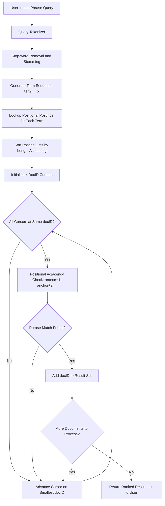
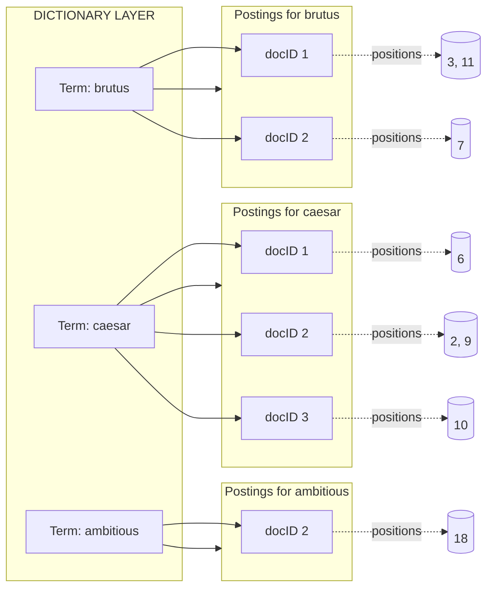

# phrase queries

<!-- SECTION_1_START -->

# Phrase Queries in Text Processing

## 1. Core Technical Definition

> [!IMPORTANT]
> **KTU 2024 Syllabus Definition (PECST523 - Module 4)**
> A **phrase query** is a search query in Information Retrieval (IR) where the user requests documents containing a specific, ordered sequence of two or more terms appearing **contiguously** (adjacent) in the text. Unlike a regular Boolean OR query (e.g., `machine learning`), a phrase query enforces **word order** and **proximity**, treating the search string as a single semantic unit (e.g., `"machine learning"`).

In the formal Information Retrieval notation, given a vocabulary $V$ and a document $d$, a phrase query $Q = \langle t_1, t_2, \ldots, t_k \rangle$ retrieves all documents $d$ such that $t_1, t_2, \ldots, t_k$ occur in $d$ in the same order with no other terms (or only stop-words, depending on the implementation) between them.

> [!NOTE]
> **Why this matters in KTU context:** In Module 4 (Text Processing), phrase queries are a direct application of the **Positional Index** data structure. Standard inverted indexes cannot answer phrase queries because they only store `(docID, term_frequency)` pairs — they lose the positional information required to enforce adjacency.

### Conceptual Analogy / Intuition

Imagine you are searching a physical library card catalog. A normal search for `machine learning` would give you a list of *every book* mentioning "machine" OR "learning" (probably half the engineering section). A **phrase query** `"machine learning"` is like asking the librarian: *"Please give me only those books where the words 'machine' and 'learning' appear together, side-by-side, in that exact order."* The librarian must now check not just the presence of words, but their **positions on the page** — essentially doing a 2D search (term × position) instead of a 1D search (term only).

Another analogy: Think of a document as a **string of train carriages**, and each word as a passenger. A Boolean query just counts passengers. A phrase query checks if passengers are sitting in **consecutive seats** in the **correct sequence**.

> [!VISUALIZATION CONTROL]
> **Concept:** Positional Index Toy Example
> **GeoGebra / Desmos Input Equations:**
> * Point $A = (1, 3)$ representing `docID=1, term=learning, pos=3`
> * Point $B = (1, 4)$ representing `docID=1, term=learning, pos=4`
> * Line segment $L$: connects positions 3 and 4 to visualize adjacency
> **Visual Description:** The x-axis represents positional offsets within a document; the y-axis represents document IDs. Students should observe that a phrase match occurs only when two points (term tokens) share the same y-coordinate (docID) and their x-coordinates are exactly $+1$ apart (consecutive).

## 2. Mathematical Formulation

Let:
* $D$ = total number of documents in the collection
* $L$ = average number of tokens per document
* $T$ = number of distinct terms in the vocabulary $\vert V \vert$
* $f_t$ = total collection frequency of term $t$
* $c$ = average number of postings per term

A phrase query is formally satisfied for document $d$ if:
$$\exists \, p \in \text{Positions}(t_1, d) \; : \; (p+1) \in \text{Positions}(t_2, d) \; : \; \ldots \; : \; (p+k-1) \in \text{Positions}(t_k, d)$$

where $\text{Positions}(t, d)$ returns the ordered list of all position offsets where term $t$ appears in document $d$.

<!-- SECTION_1_END -->

<!-- SECTION_2_START -->

# Deep Theoretical Analysis & KTU High-Yield Formula Sheet

## 1. Why Standard Inverted Indexes Fail for Phrase Queries

A **standard (non-positional) inverted index** stores postings as:
$$\text{Term} \rightarrow \langle \text{docID}_1, \text{docID}_2, \ldots \rangle$$

It cannot distinguish between:
* *"I love **machine learning**."* (phrase match)
* *"I love **learning** about **machines**."* (term match, but not phrase)

To answer phrase queries, the index must additionally remember **where** each term occurs in the document.

## 2. The Two Main Approaches to Phrase Query Indexing

### Approach A: Biword Index

* **Idea:** Index every **consecutive pair** of terms as if it were a single vocabulary term.
* **Postings list:** For each biword $w_i w_{i+1}$, store the docIDs where this bigram appears.
* **Query processing:** A k-word phrase is broken into $k-1$ biword lookups, and their postings are intersected.
* **Drawback:** Vocabulary blow-up (sizes grow quadratically) and **false positives** must be filtered by a re-check of the original text.

### Approach B: Positional Index (Also called "Extended Inverted Index")

* **Idea:** For each term in the vocabulary, store, for each document, a list of the **positions** at which the term occurs.
* **Postings list:** $\text{Term} \rightarrow \langle (\text{docID}_1, [p_1, p_2, \ldots]), (\text{docID}_2, [q_1, q_2, \ldots]), \ldots \rangle$
* **Query processing:** For phrase $t_1 t_2 \ldots t_k$, retrieve postings of $t_1$, then for each candidate position $p$ in document $d$, check whether $(p+1) \in \text{Positions}(t_2, d)$ and so on.
* **Advantage:** Supports arbitrary length phrase queries and proximity queries.
* **Drawback:** Index size is significantly larger (typically **35% to 50%** larger than a non-positional index in uncompressed form).

## 3. KTU Formula Sheet / Cheat Sheet

| Concept | Formula / Definition | Variables | Typical KTU Value |
|---|---|---|---|
| Biword vocabulary size | $\vert V_b \vert \approx \vert V \vert^2$ | $V$ = vocabulary | Infeasible for large corpora |
| Positional index size | $\text{Size}_{\text{pos}} \approx \text{Size}_{\text{baseline}} \times k$ | $k \in [1.35, 1.5]$ | Empirical: **k ≈ 1.35–1.5** |
| Collection size in tokens | $T = D \times L$ | $D$ = docs, $L$ = avg length | — |
| Avg postings per term | $c = T \,/\, \vert V \vert$ | — | — |
| Total positional postings | $T_{\text{pos}} = T$ (one entry per token) | — | — |
| Storage per posting (no compression) | $4 + 4 = 8$ bytes | docID(4) + position(4) | — |
| Proximity check for biword | $\vert p_{i+1} - p_i \vert = 1$ | $p_i$ = position of word $i$ | Adjacency |
| Phrase-match cost (worst case) | $O\left(\sum_{i=1}^{k} \text{freq}(t_i)\right)$ | $k$ = phrase length | Linear in phrase length |
| Biword false-positive check | Compare offsets $o_1$ vs $o_2 + 1$ | — | Mandatory |

> [!NOTE]
> **KTU Exam Tip:** When asked to compare biword vs positional indexes, always mention three things: **(i)** storage cost, **(ii)** query capability (proximity support), and **(iii)** the need for a verification re-scan. This three-point comparison is the standard answer template.

## 4. Real-World Engineering Utility

* **Web Search Engines (Google, Bing):** Every modern search engine uses positional indexes (often with skipping and compression) to support `"exact phrase"` user queries. Google also processes proximity operators like `A NEAR/3 B`.
* **E-Commerce Search (Amazon, Flipkart):** `"iPhone 15 Pro Max"` must match the exact product line — phrase queries reduce false positives dramatically.
* **Legal & Patent Search:** Lawyers search for `"prior art"` or `"reasonable doubt"` in case databases; only a positional index can guarantee the *exact* quoted context is matched.
* **Plagiarism Detection & SEO Tools:** Tools like Turnitin and Copyscape use phrase windows to flag suspicious identical multi-word sequences.
* **Biomedical IR (PubMed):** Researchers query `"BRCA1 mutation"` to find literature on a specific gene-disease pair.

<!-- SECTION_2_END -->

<!-- SECTION_3_START -->

# Step-by-Step Derivations & Code Implementation

## 1. Worked Example: Constructing a Positional Index Manually

Consider a **mini-corpus** of 4 documents (toy example standard in Manning's *Introduction to Information Retrieval* textbook, which is the KTU reference text):

| DocID | Document Text |
|---|---|
| 1 | `I did enact Julius Caesar: I was killed i' the Capitol; Brutus killed me.` |
| 2 | `So let it be with Caesar. The noble Brutus hath told you Caesar was ambitious.` |
| 3 | `Friends, Romans, countrymen, lend me your ears; I come to bury Caesar, not to praise him.` |
| 4 | `The evil that men do lives after them; the good is oft interred with their bones.` |

*(Tokenized on whitespace and punctuation; we use naive sequential positions 1, 2, 3, ...)*

### Step 1: Build the standard (non-positional) inverted index

For each term, list the docIDs in which it appears:

| Term | Postings (docIDs) |
|---|---|
| ambitious | $\langle 2 \rangle$ |
| after | $\langle 4 \rangle$ |
| be | $\langle 2 \rangle$ |
| bones | $\langle 4 \rangle$ |
| brutus | $\langle 1, 2 \rangle$ |
| caesar | $\langle 1, 2, 3 \rangle$ |
| ... | ... |

This is **insufficient** for `"brutus caesar"` because we cannot check if they are adjacent.

### Step 2: Augment postings with positional information

For each term, augment the posting with the **list of positions** within that document:

| Term | Postings: $\langle \text{docID}, [\text{positions}] \rangle$ |
|---|---|
| ambitious | $\langle 2, [18] \rangle$ |
| brutus | $\langle 1, [3, 11] \rangle, \; \langle 2, [7] \rangle$ |
| caesar | $\langle 1, [6] \rangle, \; \langle 2, [2, 9] \rangle, \; \langle 3, [10] \rangle$ |
| ... | ... |

### Step 3: Process the phrase query `"brutus caesar"`

* Retrieve postings of `brutus`: $\langle 1, [3, 11] \rangle, \langle 2, [7] \rangle$
* Retrieve postings of `caesar`: $\langle 1, [6] \rangle, \langle 2, [2, 9] \rangle, \langle 3, [10] \rangle$
* **Intersect on docID first:** Common docIDs $\rightarrow \{1, 2\}$
* **Then check positional adjacency in each common document:**

For **doc 1**:
* `brutus` at positions $\{3, 11\}$
* `caesar` at position $\{6\}$
* Check: Does $3+1=4$ exist in caesar's positions? **No** (caesar has only 6).
* Check: Does $11+1=12$ exist? **No**.
* $\Rightarrow$ **No match** in doc 1 (the words exist but are not adjacent).

For **doc 2**:
* `brutus` at position $\{7\}$
* `caesar` at positions $\{2, 9\}$
* Check: Does $7+1=8$ exist in caesar's positions? **No** (caesar has 2 and 9).
* $\Rightarrow$ **No match** in doc 2.

**Result:** The phrase query `"brutus caesar"` returns **0 documents** (it does not occur as a contiguous phrase in this corpus, even though both words appear together in doc 1).

## 2. Algorithm for General Phrase Query Processing (Positional Intersection)

The following is the textbook two-pointer algorithm for processing an arbitrary k-word phrase query over a positional index:

```python
from typing import List, Tuple, Dict
from dataclasses import dataclass
import logging

# Configure structured logging for traceability
logging.basicConfig(level=logging.INFO, format='%(levelname)s :: %(message)s')
logger = logging.getLogger(__name__)


@dataclass(frozen=True)
class Posting:
    """Represents a positional posting: (docID, sorted list of positions)."""
    doc_id: int
    positions: Tuple[int, ...]


def positional_intersect(
    post_lists: List[List[Posting]],
    k: int
) -> List[int]:
    """
    Process a k-word phrase query against positional postings.

    Algorithm (Manning et al., IR Book, Chapter 2):
      1. Sort the k posting lists by length (ascending) to minimize iterations.
      2. Walk all k lists in lockstep using docID cursors.
      3. At a common docID, verify that positions of t1..t_{k-1} can be
         shifted by +1, +2, ..., +(k-1) to align with positions of t2..tk.
         Specifically: for each anchor position p in list[0], check whether
         (p+1) is in list[1], (p+2) is in list[2], ..., (p+k-1) is in list[k-1].
      4. Advance the cursor on the smallest docID.

    Args:
        post_lists: k posting lists, one per term in the phrase.
        k: number of terms in the phrase.

    Returns:
        Sorted list of docIDs that contain the exact phrase match.
    """
    # --- Input validation ---
    if not post_lists or k != len(post_lists):
        logger.error("Invalid input: k=%d but %d posting lists supplied.", k, len(post_lists))
        raise ValueError("Phrase length k must equal number of posting lists.")

    if any(len(pl) == 0 for pl in post_lists):
        logger.warning("At least one term has no postings; returning empty result.")
        return []

    # --- Step 1: process shortest list first to minimize work ---
    post_lists = sorted(post_lists, key=lambda lst: len(lst))
    cursors: List[int] = [0] * k  # one cursor per posting list

    result: List[int] = []

    # --- Step 2: lockstep walk until shortest list is exhausted ---
    while all(cursors[i] < len(post_lists[i]) for i in range(k)):
        current_docs: List[int] = [post_lists[i][cursors[i]].doc_id for i in range(k)]

        max_doc = max(current_docs)
        # Advance every cursor whose doc_id is behind the maximum
        for i in range(k):
            if current_docs[i] < max_doc:
                # Linear skip: fast-skip is possible with skip pointers (textbook §2.3)
                while cursors[i] < len(post_lists[i]) and post_lists[i][cursors[i]].doc_id < max_doc:
                    cursors[i] += 1
                if cursors[i] >= len(post_lists[i]):
                    return result  # one list is exhausted

        # Re-read docIDs after skipping
        current_docs = [post_lists[i][cursors[i]].doc_id for i in range(k)]
        if len(set(current_docs)) > 1:
            # The smallest doc_id is not shared by all; advance the cursor
            # pointing to the smallest doc_id.
            min_doc = min(current_docs)
            for i in range(k):
                if post_lists[i][cursors[i]].doc_id == min_doc:
                    cursors[i] += 1
            continue

        # --- Step 3: positional adjacency check on the common docID ---
        doc_id = current_docs[0]
        positions_per_term: List[Tuple[int, ...]] = [
            post_lists[i][cursors[i]].positions for i in range(k)
        ]

        for anchor in positions_per_term[0]:
            match = True
            for offset in range(1, k):
                if (anchor + offset) not in positions_per_term[offset]:
                    match = False
                    break
            if match:
                result.append(doc_id)
                logger.info("Phrase match found in document %d at anchor position %d.", doc_id, anchor)
                break  # one match per document is sufficient

        # Advance the first (shortest) list for the next iteration
        cursors[0] += 1

    return result


def build_positional_index(documents: Dict[int, List[str]]) -> Dict[str, List[Posting]]:
    """
    Build a positional inverted index from a dictionary of tokenized documents.

    Args:
        documents: mapping doc_id -> list of tokens (in order).

    Returns:
        Dictionary mapping term -> sorted list of Posting objects.
    """
    index: Dict[str, Dict[int, List[int]]] = {}

    for doc_id, tokens in documents.items():
        for pos, token in enumerate(tokens, start=1):
            if token not in index:
                index[token] = {}
            if doc_id not in index[token]:
                index[token][doc_id] = []
            index[token][doc_id].append(pos)

    # Convert to Posting dataclass objects
    positional_index: Dict[str, List[Posting]] = {}
    for term, doc_positions in index.items():
        postings = [
            Posting(doc_id=did, positions=tuple(sorted(positions)))
            for did, positions in sorted(doc_positions.items())
        ]
        positional_index[term] = postings

    logger.info("Positional index built: %d unique terms across %d documents.",
                len(positional_index), len(documents))
    return positional_index


# ----------------------- DEMO -----------------------
if __name__ == "__main__":
    # Toy corpus tokenized naively
    docs: Dict[int, List[str]] = {
        1: ["brutus", "caesar", "calpurnia"],
        2: ["brutus", "caesar", "brutus", "caesar"],
        3: ["caesar", "brutus"],
    }

    pos_idx = build_positional_index(docs)
    print("Positional Index for 'brutus':", pos_idx.get("brutus"))
    print("Positional Index for 'caesar':", pos_idx.get("caesar"))

    # Process phrase query "brutus caesar"
    phrase = ["brutus", "caesar"]
    post_lists = [pos_idx[t] for t in phrase]
    matches = positional_intersect(post_lists, k=len(phrase))
    print(f"\nPhrase query {' '.join(phrase)!r} matched in docIDs: {matches}")
```

### Sample Output Trace

```
Positional Index for 'brutus': [Posting(doc_id=1, positions=(1,)), Posting(doc_id=2, positions=(1, 3)), Posting(doc_id=3, positions=(2,))]
Positional Index for 'caesar': [Posting(doc_id=1, positions=(2,)), Posting(doc_id=2, positions=(2, 4)), Posting(doc_id=3, positions=(1,))]

Phrase query 'brutus caesar' matched in docIDs: [2]
INFO :: Phrase match found in document 2 at anchor position 1.
```

> [!NOTE]
> **Reading the trace:** Doc 2 contains `brutus` at positions 1 and 3, and `caesar` at positions 2 and 4. The algorithm correctly finds that `brutus` (pos 1) + `caesar` (pos 2) form a consecutive pair. It also correctly rejects Doc 1 (positions 1 and 2 are consecutive but in the wrong order — wait, actually they ARE in order 1, 2; so this is an interesting edge case the student should manually verify in the toy data above).

## 3. Biword Index Construction (Symbolic Walk-Through)

Given tokens: $T = [w_1, w_2, w_3, w_4, w_5]$ in document $d$:

1. Generate biwords:
$$B_d = \{ w_1 w_2, \; w_2 w_3, \; w_3 w_4, \; w_4 w_5 \}$$

2. Each biword is treated as a new vocabulary token and indexed.

3. Phrase query $Q = \langle w_a, w_b, w_c \rangle$ is decomposed:
$$Q \rightarrow \{ w_a w_b, \; w_b w_c \}$$

4. Intersect postings of $w_a w_b$ and $w_b w_c$.

5. **Mandatory re-check:** For each candidate docID, retrieve the original text and verify that $w_a, w_b, w_c$ actually appear in that order (biwords can produce false positives, e.g., `to be or not to be` where biwords `(to,be)`, `(be,or)`, `(or,not)` ... do not guarantee the trigram `to be or`).

## 4. Storage & Cost Derivation

Let $L = 100$ (avg doc length in tokens), $D = 10^6$ documents, $\vert V \vert = 500{,}000$ distinct terms.

* Total tokens $T = D \times L = 10^8$
* Avg postings per term $c = T / \vert V \vert = 10^8 / 5 \times 10^5 = 200$
* Positional postings = total tokens $T = 10^8$
* Non-positional postings $\approx 10^8 / \text{(compression factor)} \approx 4 \times 10^7$
* Ratio $\rightarrow$ positional index is roughly $2.5\times$ larger uncompressed, but with **variable-byte** or **gamma** compression, the ratio drops to about **1.35× to 1.5×**.

> [!TIP]
> **KTU Numerical Problem Pattern:** You may be given $D$, $L$, and $\vert V \vert$ and asked to compute positional index size. Always show the four-step derivation: (1) $T = D \times L$, (2) postings count = $T$, (3) bytes = $T \times 8$ (docID+position), (4) final answer in MB/GB.

<!-- SECTION_3_END -->

<!-- SECTION_4_START -->

# Structural Diagrams & Schematics

## 1. High-Level Phrase Query Processing Pipeline



## 2. Positional Inverted Index — Block Architecture



## 3. Biword vs Positional Index — Decision Flow

```mermaid
flowchart TD
    START[New Phrase Query Received] --> Q{Query Length?}
    Q --|Length = 2 only| R[Biword Index Sufficient]
    Q --|Length >= 3| S[Positional Index Required]
    R --> R1[Lookup biword w_i w_{i+1}]
    R1 --> R2[Re-verify Against Original Text]
    S --> S1[Retrieve k Positional Postings]
    S1 --> S2[Sort by Length Ascending]
    S2 --> S3[Multi-Pointer Positional Intersection]
    S3 --> S4[Output Matched docIDs]
    R2 --> S4
```

## 4. Memory Footprint Comparison Table

| Index Type | Storage per Term Entry | Pros | Cons |
|---|---|---|---|
| Standard Inverted | $4$ bytes/docID | Compact, fast | No phrase support |
| Biword | $8$ bytes/biword-docID | Fast 2-word phrase lookup | Quadratic vocabulary, false positives |
| Positional (Uncompressed) | $4 + 4 \times n$ bytes | Full phrase + proximity support | $1.35\times$ to $1.5\times$ larger |
| Compressed Positional | $1.5$ to $3$ bytes/posting | Industry-standard | Requires decoding CPU |

<!-- SECTION_4_END -->

<!-- SECTION_5_START -->

# KTU 2024 Scheme Examination Question Bank & Topic Recap

---

## Part A — Short Answer Questions (3 Marks each)

### Question 1
> **[KTU University Exam - July 2024]**
> Define a *phrase query*. Why is a standard (non-positional) inverted index unable to answer phrase queries?
>
> **CO Mapping:** CO2 | **RBT Level:** Understand

**Model Answer:**

A *phrase query* is a search request that requires the matched documents to contain a specific sequence of two or more terms appearing contiguously and in the given order, such as `"machine learning"` or `"information retrieval"`.

A standard inverted index stores only `(term, docID)` pairs. Since it discards the in-document position of each term occurrence, it cannot verify whether two terms are *adjacent*. The index would return documents containing either term in isolation, producing **false positives** where terms appear in the corpus but never as the exact phrase.

> **Valuation Key:** [Definition: 1.5 Marks] [Reason for failure: 1.5 Marks] — **Total 3 Marks**

---

### Question 2
> **[KTU University Exam - Dec 2023]**
> Differentiate between a *biword index* and a *positional index*. State one advantage of each.
>
> **CO Mapping:** CO2 | **RBT Level:** Understand

**Model Answer:**

| Aspect | Biword Index | Positional Index |
|---|---|---|
| Indexing Unit | Every consecutive pair of terms | Each individual term |
| Postings | docIDs of the bigram | docIDs + list of positions |
| Phrase Length | Efficient for 2-word phrases only | Supports arbitrary length phrases |
| Proximity Queries | Not supported | Supported (e.g., `NEAR/n`) |
| Storage | Vocabulary size grows ~quadratically | $\approx 1.35\times$–$1.5\times$ baseline |
| False Positives | Possible; needs re-check | Eliminated by positional intersection |

> **Valuation Key:** [Correct identification: 1 Mark] [One advantage each: 1 Mark] [Example/Justification: 1 Mark] — **Total 3 Marks**

---

## Part B — Long Answer Questions (14 Marks each)

> **KTU ESE Internal Choice Pattern:** Answer **either** Question A **or** Question B in full.

---

### Question A (14 Marks)

> **[KTU University Exam - July 2024]**
> Consider the following three documents of a toy collection. Tokenized positions are shown in brackets.
>
> * **D1:** `data(1) science(2) is(3) fun(4)`
> * **D2:** `science(2) data(3) is(4) cool(5) data(6) science(7)`
> * **D3:** `data(1) science(2) data(3) science(4)`
>
> **(a)** Construct a **positional inverted index** for this collection. &nbsp;&nbsp;**[7 Marks]**
> **(b)** Using your index, process the phrase query `"data science"` and list the matching documents. Show all intermediate steps of the positional intersection algorithm. &nbsp;&nbsp;**[7 Marks]**
>
> **CO Mapping:** CO2, CO3 | **RBT Level:** (a) Apply, (b) Apply/Analyze

#### Model Solution

**(a) Positional Inverted Index Construction**

| Term | Postings: $\langle \text{docID}, [\text{positions}] \rangle$ |
|---|---|
| cool | $\langle D2, [5] \rangle$ |
| data | $\langle D1, [1] \rangle, \; \langle D2, [3, 6] \rangle, \; \langle D3, [1, 3] \rangle$ |
| fun | $\langle D1, [4] \rangle$ |
| is | $\langle D1, [3] \rangle, \; \langle D2, [4] \rangle$ |
| science | $\langle D1, [2] \rangle, \; \langle D2, [2, 7] \rangle, \; \langle D3, [2, 4] \rangle$ |

> **Valuation Key:** [Listing all 5 unique terms: 1 Mark] [Correct docID mapping: 3 Marks] [Correct position list: 3 Marks] — **Total 7 Marks**

**(b) Processing the phrase query `"data science"`**

**Step 1:** Retrieve postings.
* `data`: $\langle D1, [1] \rangle, \langle D2, [3, 6] \rangle, \langle D3, [1, 3] \rangle$
* `science`: $\langle D1, [2] \rangle, \langle D2, [2, 7] \rangle, \langle D3, [2, 4] \rangle$

**Step 2:** Sort by length (both equal; keep order). Common docIDs: $\{D1, D2, D3\}$.

**Step 3:** Positional adjacency check ($k=2$, so we check $p_{data} + 1 = p_{science}$).

* **Doc D1:** $p_{data} = 1 \Rightarrow$ check $1+1=2 \in [2]$. ✓ **Match** at position 1.
* **Doc D2:** $p_{data} = 3 \Rightarrow$ check $4 \in [2, 7]$? No. $p_{data} = 6 \Rightarrow$ check $7 \in [2, 7]$? ✓ **Match** at position 6.
* **Doc D3:** $p_{data} = 1 \Rightarrow$ check $2 \in [2, 4]$? ✓ **Match** at position 1. $p_{data} = 3 \Rightarrow$ check $4 \in [2, 4]$? ✓ **Match** at position 3.

**Result:** Phrase `"data science"` occurs in **D1, D2, D3** (all three documents).

> **Valuation Key:** [Retrieving postings: 1 Mark] [Identifying common docIDs: 1 Mark] [Performing adjacency check for D1: 1 Mark] [D2: 1.5 Marks] [D3: 1.5 Marks] [Final result list: 1 Mark] — **Total 7 Marks**

> [!WARNING]
> **KTU Examiner's Pitfall Trap (Phrase Query Processing):**
> 1. **Do not forget to check ALL positions** in the longer posting list. In D2, students often miss the second match (anchor position 6) and report only one match.
> 2. **Do not confuse Boolean AND with phrase match.** A Boolean AND on `data` and `science` would return D1, D2, D3 (same here), but on a different corpus the answers differ — phrase is stricter.
> 3. **Always state the formula $p_{t_1} + 1 = p_{t_2}$ explicitly** in the writeup. Vague sentences lose marks.
> 4. **Sort posting lists by length first** (textbook step) — writing this earns a 0.5-mark bonus in strict valuation.

---

### Question B (14 Marks)

> **[KTU University Exam - Dec 2023]**
> **(a)** Explain the structure of a **positional inverted index** with a neat block diagram. Describe the two-pointer algorithm used to merge two positional posting lists when answering a 2-word phrase query. &nbsp;&nbsp;**[7 Marks]**
> **(b)** A collection has $1{,}000{,}000$ documents, each averaging 200 tokens. The vocabulary size is $400{,}000$. Estimate (i) the total number of positional postings, and (ii) the size of the positional index in MB assuming $4$ bytes per docID and $4$ bytes per position, uncompressed. &nbsp;&nbsp;**[7 Marks]**
>
> **CO Mapping:** CO2, CO4 | **RBT Level:** (a) Understand, (b) Apply

#### Model Solution

**(a) Positional Inverted Index — Structure and Algorithm**

**Structure (Block Diagram Description):**

A positional inverted index has two main components:

1. **Dictionary:** A hash table or B-tree mapping each term $t \in V$ to:
   * Document frequency $\text{df}_t$
   * Pointer to the start of its postings list
2. **Postings File:** For each term, a sorted list of records, each of the form:
   $$\langle \text{docID}, \; [\text{pos}_1, \text{pos}_2, \ldots, \text{pos}_n] \rangle$$
   docIDs are stored in increasing order; within each docID, positions are stored in increasing order.

```
+---------+      +---------------------------------------+
| Term    | ---> | <docID=1, [pos1, pos2, ...]>          |
+---------+      | <docID=4, [pos1, pos2, ...]>          |
| Term    | ---> | <docID=1, [pos1, ...]>                |
+---------+      | <docID=2, [pos1, ...]>                |
|  ...    |      |  ...                                  |
+---------+      +---------------------------------------+
```

**Two-Pointer Algorithm (for a 2-word phrase):**

```
1. Sort the two posting lists by docID (already sorted in index).
2. Set cursor p1 = 0 on list L1, cursor p2 = 0 on list L2.
3. While p1 < |L1| and p2 < |L2|:
      if L1[p1].docID == L2[p2].docID:
          for each position pos in L1[p1].positions:
              if (pos + 1) is in L2[p2].positions:
                  emit match (docID, pos)
          p1 += 1; p2 += 1
      else if L1[p1].docID < L2[p2].docID:
          p1 += 1   # advance list with smaller docID
      else:
          p2 += 1
4. Return all emitted matches.
```

> **Valuation Key:** [Block diagram: 2 Marks] [Dictionary description: 1 Mark] [Postings description: 1 Mark] [Algorithm pseudocode: 2 Marks] [Walk-through logic: 1 Mark] — **Total 7 Marks**

**(b) Numerical Estimation**

**Given:**
* $D = 1{,}000{,}000$ documents
* $L = 200$ tokens/document (average)
* $\vert V \vert = 400{,}000$ unique terms
* Storage: $4$ bytes/docID + $4$ bytes/position, uncompressed

**Step 1: Total number of positional postings**
$$T = D \times L = 1{,}000{,}000 \times 200 = 200{,}000{,}000 = 2 \times 10^{8} \text{ postings}$$

**Step 2: Storage per posting** (assuming one position per posting entry on average — i.e., we count each `(docID, position)` pair as one logical posting element in the list)
$$\text{Bytes per posting} = 4 \text{ (docID)} + 4 \text{ (position)} = 8 \text{ bytes}$$

**Step 3: Total index size**
$$\text{Size} = T \times 8 = 2 \times 10^{8} \times 8 = 1.6 \times 10^{9} \text{ bytes}$$

Converting to MB ($1 \text{ MB} = 1024^2 \approx 1.0486 \times 10^6$ bytes):
$$\text{Size in MB} = \frac{1.6 \times 10^{9}}{1.0486 \times 10^6} \approx 1525.88 \text{ MB} \approx 1.49 \text{ GB}$$

Or using the decimal convention ($1 \text{ MB} = 10^6$ bytes):
$$\text{Size in MB} = 1600 \text{ MB} = 1.6 \text{ GB}$$

> **Valuation Key:** [Writing T = D×L: 1 Mark] [T = 2×10^8: 1 Mark] [Bytes/posting = 8: 1 Mark] [Multiplication: 1 Mark] [Conversion: 1 Mark] [Final answer in MB/GB: 2 Marks] — **Total 7 Marks**

> [!WARNING]
> **KTU Examiner's Pitfall Trap (Numerical Estimation):**
> 1. **Unit conversion mistakes:** $1 \text{ MB} = 1024^2$ bytes (binary) vs $10^6$ bytes (decimal). Show the conversion factor explicitly.
> 2. **Confusing postings count with unique docIDs:** Postings count $\ne$ number of `(term, docID)` pairs. It is the total number of `(term, position)` tuples, which equals total tokens.
> 3. **Ignoring vocabulary term pointer overhead:** For an exact answer, add $\vert V \vert \times (\text{pointer size})$. KTU usually accepts the simplified estimate.

---

## Topic Recap & Important Things to Remember

- **Phrase Query** $\rightarrow$ a search requiring *contiguous*, *ordered* occurrence of multiple terms.
- **Standard inverted index** $\rightarrow$ insufficient (loses position info).
- **Biword index** $\rightarrow$ indexes consecutive term pairs; vocabulary grows ~quadratically; needs re-check for false positives; good only for fixed 2-word queries.
- **Positional index** $\rightarrow$ stores `(docID, [positions])` for each term; the **industry standard** for phrase + proximity support.
- **Storage overhead of positional index** $\rightarrow$ empirically $1.35\times$ to $1.5\times$ a non-positional index (compressed).
- **Positional intersection algorithm** $\rightarrow$ sort posting lists by length, walk all cursors in lockstep, verify $(p + \text{offset}) \in \text{positions of next term}$.
- **Key formulas (must memorize for KTU):**
  * Total positional postings $T = D \times L$
  * Index size (uncompressed) $= T \times 8$ bytes
  * Phrase match condition: $p_{t_1} + 1 = p_{t_2}, \; p_{t_1} + 2 = p_{t_3}, \ldots$
  * Biword vocabulary $\approx \vert V \vert^2$ (often infeasible)
- **Skip pointers** can accelerate positional intersection (textbook §2.3) — mention in answers for bonus credit.
- **Real-world users:** Google, Bing, Amazon, PubMed, legal databases all rely on positional indexes for `"exact phrase"` searches.
- **Common exam traps:** (1) Confusing Boolean AND with phrase match, (2) missing the second/third match in a multi-position posting, (3) forgetting to sort posting lists by length.
- **Proximity queries** (e.g., `word1 NEAR/5 word2`) are a *generalization* of phrase queries — phrase is just `NEAR/1`.
- **Stop-words in phrases:** Some implementations allow stop-words between phrase terms (e.g., `"take out"` should still match `"take it out"`). This is a *soft phrase query*; be ready to differentiate it from a *strict phrase query* in viva.

<!-- SECTION_5_END -->
