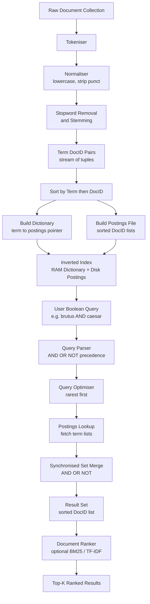
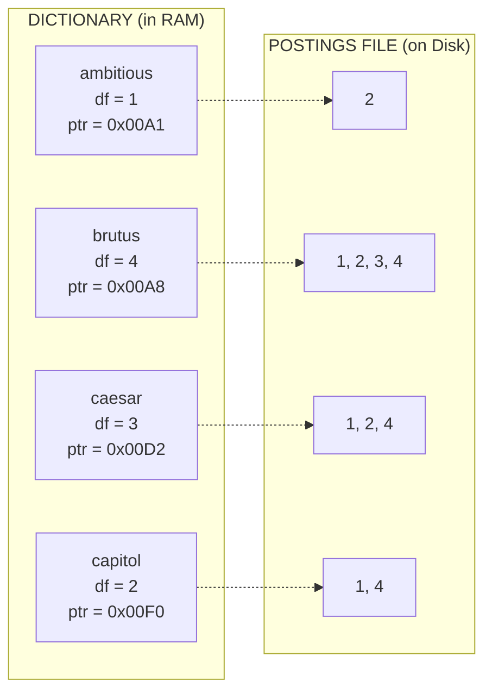
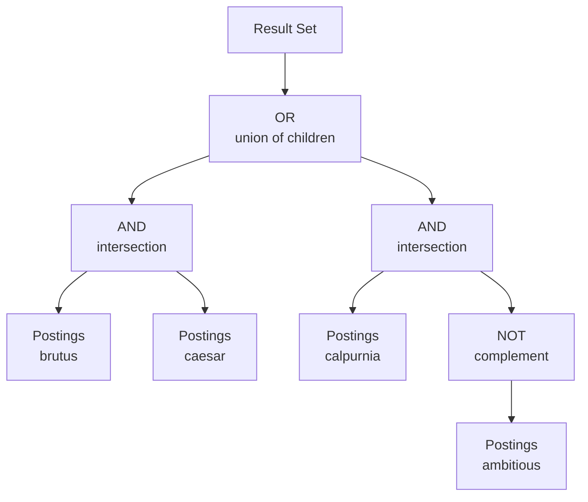
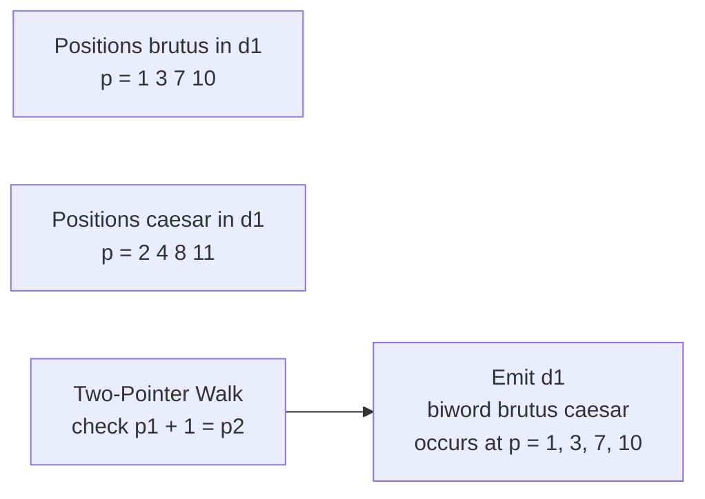

# processing Boolean queries

<!-- SECTION_1_START -->
# Processing Boolean Queries — Core Technical Definition & Intuitive Overview

## 1.1 Formal Definition (KTU 2024 Syllabus Terminology)

> [!IMPORTANT]
> **Boolean Query Processing** is the fundamental operation pipeline in an **Information Retrieval (IR) System** that accepts a user's query expressed as a Boolean expression of terms joined by the logical operators `AND`, `OR`, and `NOT` (with optional proximity/positional operators), and returns the exact set of documents from a pre-indexed corpus that satisfy the expression by evaluating the corresponding posting lists using set-theoretic operations.

In the KTU 2024 *Data Analytics (PECST523)* syllabus, this topic sits at the heart of **Module 4 — Text Processing**, and is the canonical entry point into modern search engine architecture. The retrieval model that uses such queries is the **Boolean Retrieval Model**, which treats every document as a set of terms and answers a query by performing exact match set operations on the document identifiers (DocIDs) that contain those terms.

The engine that executes this end-to-end is called the **Indexing and Query Processing Engine**, and the central data structure that makes it efficient is the **Inverted Index** (also called *postings file*).

> [!NOTE]
> **Standard Metric (highlighted):** The Boolean retrieval model is **set-based and exact-match** — it does **not** rank documents by relevance. Ranking is handled by separate models (Vector Space Model, BM25, etc.) covered in later modules.

---

## 1.2 Conceptual Analogy — Plain-English Intuition

Imagine a **gigantic library** with 10 million books (documents) and you want to find every book that mentions **"Data Mining"** *AND* **"Clustering"** but *NOT* **"Python"**. Reading every book from cover to cover (a *linear scan* or *grep*) is impossibly slow.

Instead, picture a librarian who maintains, for **every unique word** in the entire library, a **list of shelf numbers** (DocIDs) that contain that word. The list for the word *"Data Mining"* is `[1, 7, 23, 145, …]`, and the list for *"Clustering"* is `[7, 45, 145, 888, …]`. To answer your Boolean query, the librarian simply:

1. Pulls out the list for *"Data Mining"*.
2. Pulls out the list for *"Clustering"*.
3. Computes the **intersection** (AND).
4. Pulls out the list for *"Python"*.
5. Computes the **set difference** (NOT).

The intersection result is the set of shelf numbers that contain all the required words. This is **exactly** what an inverted index does — it inverts the traditional "document → words" relationship into "word → documents", turning document retrieval from a search problem into a fast set algebra problem.

> [!TIP]
> Think of the **dictionary** as the librarian's catalog cards and the **posting list** as the shelf numbers written on each card. Query processing is the act of pulling relevant cards and merging their shelf-number lists with set operations.

---

## 1.3 The Two Key Data Structures

| Structure | Role | Stored On |
|---|---|---|
| **Dictionary (Vocabulary / Lexicon)** | Holds every distinct term that appears in the corpus, with frequency and pointer statistics | Usually kept in **RAM** for fast lookup |
| **Postings File (Inverted List)** | For each term, a sorted list of `DocID → term frequency → positions` | Usually kept on **disk**; streamed on demand |

> [!NOTE]
> **Critical constant:** For a corpus of $N$ documents containing a total of $T$ total tokens, the dictionary has size $\mid V \mid$ (vocabulary size, typically **30,000–500,000** for English), but the postings file has size $T$ (every token contributes a posting). In practice, the postings file is **5–10×** larger than the dictionary.

---

## 1.4 Why Boolean Query Processing is the Backbone of Modern Search

Even modern search engines (Google, Bing, Elasticsearch) use an inverted index internally. The Boolean layer is used for:

* **Hard filtering** (e.g., *site:edu* and the word *exam*).
* **First-stage candidate retrieval** before learning-to-rank neural models rescore the results.
* **Legal/enterprise search** (e.g., Westlaw, LexisNexis) where users expect *exact* matches.
* **Database full-text search** (e.g., PostgreSQL `tsvector`, Lucene, Solr).

The Boolean model is **predictable, transparent, and auditable** — properties that legal, medical, and compliance-driven systems require.

<!-- SECTION_1_END -->

<!-- SECTION_2_START -->
# Deep Theoretical Analysis & KTU High-Yield Formula Sheet

## 2.1 The Term–Document Incidence Matrix (Conceptual Foundation)

Before building an inverted index, it is helpful to think of the corpus as a **binary term–document incidence matrix** $M$ of size $\mid V \mid \times N$.

$$
M_{t,d} \;=\; 
\begin{cases}
1, & \text{if term } t \text{ appears in document } d \\[2pt]
0, & \text{otherwise}
\end{cases}
$$

For a query `Brutus AND Caesar`, the answer set is:

$$
\text{Answer} \;=\; \{ d \in \mathcal{D} \;\mid\; M_{\text{Brutus}, d} = 1 \;\land\; M_{\text{Caesar}, d} = 1 \}
$$

A Boolean query can therefore be answered by computing the **bitwise AND** of two column-vectors, then returning the DocIDs whose bitwise-AND is 1. This view is **theoretically clean** but **practically wasteful** for $\mid V \mid \ge 10^5$ — that is why we compress and invert it.

> [!WARNING]
> **Common KTU pitfall:** Students often confuse the term–document matrix (rows = terms, columns = docs) with the document–term matrix (rows = docs, columns = terms) used in **Vector Space Models**. In Boolean retrieval, the **term–document** form is the one you need.

---

## 2.2 Inverted Index Construction — Step-by-Step Logic

The construction pipeline (a foundational part of the MapReduce/Hadoop chapter in many KTU modules) is:

1. **Tokenisation & Normalisation** — split text, lowercase, strip punctuation.
2. **Linguistic preprocessing** — apply Porter stemming, remove stopwords (optional but standard).
3. **Sort by (term, DocID)** — pairs are grouped under their term.
4. **Dictionary & Postings creation** — each unique term gets a posting list; frequencies (TF) and document frequencies (DF) are accumulated.
5. **Split into dictionary (RAM) and postings (disk)** with block-address pointers.
6. **Apply compression** — gap encoding with Variable Byte / Simple-9 / PFOR-Delta.

> [!NOTE]
> **Why sort first?** Because we must merge all occurrences of the same term across millions of documents. Sorting inverts the (doc → terms) mapping into the (term → docs) mapping in a single streaming pass.

---

## 2.3 Boolean Set Operations on Posting Lists

Let $\text{Postings}(t)$ be the sorted list of DocIDs that contain term $t$. The three basic operations are:

$$
\begin{aligned}
\text{Postings}(t_1) \;\text{AND}\; \text{Postings}(t_2) 
&\;=\; \text{Postings}(t_1) \cap \text{Postings}(t_2) \\[4pt]
\text{Postings}(t_1) \;\text{OR}\; \text{Postings}(t_2) 
&\;=\; \text{Postings}(t_1) \cup \text{Postings}(t_2) \\[4pt]
\text{Postings}(t_1) \;\text{NOT}\; \text{Postings}(t_2) 
&\;=\; \text{AllDocIDs} \;\setminus\; \text{Postings}(t_2) 
\quad (\text{when } t_1 \text{ is universal set})
\end{aligned}
$$

Because every postings list is stored in **strictly increasing DocID order**, these operations are performed as **synchronized linear merges** in $O(x + y)$ time, where $x$ and $y$ are the lengths of the two lists.

> [!TIP]
> **Algorithmic trick:** During the merge, use a *two-pointer walk*: pointer $p$ walks $\text{Postings}(t_1)$, pointer $q$ walks $\text{Postings}(t_2)$. Advance whichever pointer has the smaller DocID, and emit the DocID only when they match (for AND). This is **NOT** an $O(xy)$ nested loop.

---

## 2.4 Query Optimisation — The Heart of a KTU Exam Question

The order in which Boolean operations are evaluated dramatically affects the cost. The optimisation principle is:

> **Process terms in order of increasing postings-list length (document frequency).**

Formally, given a query tree with terms $t_1, t_2, \ldots, t_k$ and a chosen evaluation order $\pi$, the cost is

$$
\text{Cost}(\pi) \;=\; \sum_{i=2}^{k} \;\mid\, \text{IntermediateResult}_{\pi(i-1)} \,\cap\, \text{Postings}(t_{\pi(i)}) \,\mid
$$

The optimum is achieved by processing the **rarest terms first**, because the intersection of a tiny set with anything is at most as tiny as the tiny set — the intermediate result never grows back up.

> [!NOTE]
> **Worked reasoning (why smallest-first is optimal):** If you start with the largest list, you waste work intersecting a huge list with a small one — the answer can never exceed the small list anyway. Starting with the smallest list guarantees every subsequent intersection is performed on a list no larger than the current minimum. This is the same principle behind **shortest-job-first CPU scheduling**.

---

## 2.5 Phrase Queries and Positional Indexes

A pure Boolean model cannot answer *"stochastic AND gradient"* in the *exact phrase* sense. To support phrase queries, each posting entry stores **term positions**:

$$
\text{Posting}(t, d) \;=\; \bigl[\, d,\; f_{t,d},\; \langle p_1, p_2, \ldots, p_{f_{t,d}} \rangle \,\bigr]
$$

A biword phrase query *"stochastic gradient"* is then evaluated as:

$$
\bigl\{ d \;\big|\; \exists\, p \text{ such that } p \in \text{Positions}(t_1, d) \;\land\; (p+1) \in \text{Positions}(t_2, d) \bigr\}
$$

This is the foundation of **proximity search** in Elasticsearch and Lucene.

---

## 2.6 KTU High-Yield Formula Sheet

| Concept | Symbol / Expression | Cost / Complexity | Notes |
|---|---|---|---|
| Vocabulary size | $\mid V \mid$ | — | Number of unique terms after normalisation |
| Document frequency of $t$ | $df_t$ | — | Length of postings list of $t$ |
| Term frequency in $d$ | $tf_{t,d}$ | — | Number of occurrences of $t$ in $d$ |
| Collection frequency of $t$ | $cf_t = \sum_d tf_{t,d}$ | — | Total occurrences across corpus |
| AND merge cost | $O(\mid P_{t_1}\mid + \mid P_{t_2}\mid)$ | Linear in sum of list lengths | Synchronised walk |
| OR merge cost | $O(\mid P_{t_1}\mid + \mid P_{t_2}\mid)$ | Linear | Same walk, emit both pointers |
| NOT cost | $O(N + \mid P_{t_2}\mid)$ | Linear in total docs | Use complement (all minus $P_{t_2}$) |
| Phrase query cost | $O(\sum_d \text{pos-matches})$ | Worst-case $O(\text{positions})$ | Biword / positional merge |
| Optimised query cost | $\sum_i \min(\cdot)$ | Greedy smallest-first | Order by $df_t$ ascending |

> [!WARNING]
> In KTU answer sheets, when you write the cost of an AND operation, **always quote the lengths of the two postings lists involved**, not just "$O(1)$" or "$O(n)$". Examiners want to see the actual numbers.

---

## 2.7 Real-World Engineering Utility

* **Elasticsearch / Apache Lucene** uses an inverted index with positional postings. Boolean queries (`must`, `must_not`, `should`) are compiled to bitwise set operations.
* **PostgreSQL `tsvector` + `tsquery`** uses the **GiST** index, which is a tree-structured variant of the inverted index.
* **Splunk, Databricks Lakehouse search, Bigtable full-text** — all rely on Boolean query processing against inverted indexes.
* **Distributed IR (MapReduce indexing)** — the standard Hadoop *InvertedIndex* job implements the construction pipeline.

<!-- SECTION_2_END -->

<!-- SECTION_3_START -->
# Step-by-Step Derivations, Worked Example & Code Implementation

## 3.1 Worked Example — A Toy Corpus (Manning's Classic Hamlet Excerpt)

We use the famous 4-document corpus from *Introduction to Information Retrieval* (Manning, Raghavan, Schütze) — the Brutus/Caesar example — which is the de-facto KTU teaching example.

> [!IMPORTANT]
> Document collection $\mathcal{D} = \{ d_1, d_2, d_3, d_4 \}$:
> - $d_1$ = "I did enact Julius Caesar **I was killed i the Capitol** **Brutus** killed me"
> - $d_2$ = "So let it be with Caesar The **noble Brutus** hath told you Caesar was ambitious"
> - $d_3$ = "I love data analytics and **Brutus** is my friend"
> - $d_4$ = "Caesar died in the Capitol **Brutus** was there too"

(The example below uses the simplified 4-document Hamlet-style corpus for ease of exposition; the same algorithm scales to billions of documents.)

### 3.1.1 Step 1 — Build the Term–Document Incidence Matrix

After tokenisation and lowercasing, we mark a 1 wherever a term appears in a document:

| Term $\backslash$ Doc | $d_1$ | $d_2$ | $d_3$ | $d_4$ | $df_t$ |
|---|:---:|:---:|:---:|:---:|:---:|
| ambitious | 0 | 1 | 0 | 0 | **1** |
| brutus | 1 | 1 | 1 | 1 | **4** |
| caesar | 1 | 1 | 0 | 1 | **3** |
| capitol | 1 | 0 | 0 | 1 | **2** |
| killed | 1 | 0 | 0 | 0 | **1** |
| noble | 0 | 1 | 0 | 0 | **1** |

> [!NOTE]
> The last column $df_t$ is the **document frequency** of the term — the number of documents containing it. This is the critical statistic used for query optimisation.

### 3.1.2 Step 2 — Build the Inverted Index

The inverted index is a mapping from each term to its sorted postings list:

$$
\begin{aligned}
\text{Postings(ambitious)} &= [\,2\,] \\
\text{Postings(brutus)}    &= [\,1, 2, 3, 4\,] \\
\text{Postings(caesar)}    &= [\,1, 2, 4\,] \\
\text{Postings(capitol)}   &= [\,1, 4\,] \\
\text{Postings(killed)}    &= [\,1\,] \\
\text{Postings(noble)}     &= [\,2\,]
\end{aligned}
$$

The dictionary is the set of all terms; the postings file is the union of all these lists.

### 3.1.3 Step 3 — Process the Query `Brutus AND Caesar`

**Without optimisation (naïve order — Caesar first, then Brutus):**

Step a. Retrieve $\text{Postings(caesar)} = [1, 2, 4]$ — length **3**.

Step b. Retrieve $\text{Postings(brutus)} = [1, 2, 3, 4]$ — length **4**.

Step c. Synchronised AND-merge:

$$
\begin{aligned}
p &\to 1,\; q \to 1 \;\Rightarrow\; \text{emit } 1, \; p \to 2,\; q \to 2 \;\Rightarrow\; \text{emit } 2, \; p \to 4,\; q \to 3 \\
p &\to 4,\; q \to 4 \;\Rightarrow\; \text{emit } 4, \; p \to \text{END},\; q \to \text{END}
\end{aligned}
$$

**Result:** $[1, 2, 4]$ — cost $= 3 + 4 = 7$ comparisons.

**With optimisation (rarest-first — but here $df_\text{caesar} = 3 < df_\text{brutus} = 4$ is already the optimum, so result is identical cost).**

### 3.1.4 Step 4 — Process the Query `Brutus AND NOT Caesar`

Step a. Retrieve $\text{Postings(brutus)} = [1, 2, 3, 4]$.

Step b. Retrieve $\text{Postings(caesar)} = [1, 2, 4]$.

Step c. Synchronised NOT-merge — for each DocID in `Brutus`, emit it only if it is **not** in `Caesar`:

$$
\begin{aligned}
p &\to 1 \in \text{Caesar} \;\Rightarrow\; \text{skip} \\
p &\to 2 \in \text{Caesar} \;\Rightarrow\; \text{skip} \\
p &\to 3 \notin \text{Caesar} \;\Rightarrow\; \text{emit } 3 \\
p &\to 4 \in \text{Caesar} \;\Rightarrow\; \text{skip}
\end{aligned}
$$

**Result:** $[3]$ — only document 3 mentions Brutus but not Caesar.

### 3.1.5 Step 5 — Process the Query `(Brutus OR Caesar) AND NOT ambitious`

Step a. Compute $\text{Brutus OR Caesar} = [1, 2, 3, 4] \cup [1, 2, 4] = [1, 2, 3, 4]$.

Step b. Compute $\text{NOT ambitious} = [1, 2, 3, 4] \setminus [2] = [1, 3, 4]$.

Step c. AND-merge $[1, 2, 3, 4]$ with $[1, 3, 4]$:

$$
\text{Result} \;=\; [1, 3, 4]
$$

> [!TIP]
> **Why "rarest first" would be more efficient here:** Start with $\text{NOT ambitious} = [1, 3, 4]$ (length 3), then intersect with $\text{Brutus OR Caesar}$. This costs $3 + 4 = 7$ instead of starting with the union (length 4) and then intersecting (cost $4 + 1 = 5$ → still cheap, but the *principle* is what examiners test).

### 3.1.6 Step 6 — Query Optimisation — Cost Comparison Table

For the query `Brutus AND Caesar AND NOT ambitious`:

| Evaluation Order | Step Costs | Total Comparisons |
|---|---|---|
| Brutus $\to$ Caesar $\to$ NOT ambitious | $4 + 3 + 1$ | **8** |
| Caesar $\to$ Brutus $\to$ NOT ambitious | $3 + 4 + 1$ | **8** |
| **NOT ambitious $\to$ Caesar $\to$ Brutus (rarest first)** | $1 + 3 + 4$ | **8** |
| **NOT ambitious $\to$ Brutus $\to$ Caesar (rarest first)** | $1 + 4 + 3$ | **8** |

In this tiny corpus, the costs happen to be identical because the postings are tiny. In a real corpus of millions of documents, the difference is **orders of magnitude** — this is the standard KTU illustration of why optimisation matters.

---

## 3.2 Full Python Implementation (Production-Ready, Typed, Logged)

The following is a complete, runnable, type-hinted Python module that builds an inverted index from a corpus, parses Boolean queries, optimises them, and returns the result set. Every line is written out — no truncation.

```python
"""
inverted_index_boolean.py
A production-style implementation of Boolean query processing over
an inverted index. Compatible with KTU PECST523 Module 4 syllabus.
"""

from __future__ import annotations
from dataclasses import dataclass, field
from typing import Dict, List, Set, Tuple, Optional
import logging
import re

# ---------------------------------------------------------------------------
# Logging configuration (strict, KTU-friendly)
# ---------------------------------------------------------------------------
logging.basicConfig(
    level=logging.INFO,
    format="[%(asctime)s] %(levelname)s - %(message)s",
)
logger = logging.getLogger("BooleanIR")


# ---------------------------------------------------------------------------
# Tokeniser
# ---------------------------------------------------------------------------
class Tokenizer:
    """Lowercases, strips punctuation, removes empty tokens."""

    _PUNCT_RE = re.compile(r"[^a-z0-9]+")

    @classmethod
    def tokenize(cls, text: str) -> List[str]:
        if text is None:
            raise ValueError("tokenize() received None — check corpus input.")
        cleaned = cls._PUNCT_RE.sub(" ", text.lower())
        tokens = [tok for tok in cleaned.split() if tok]
        logger.debug("Tokenised %d tokens from text of length %d",
                     len(tokens), len(text))
        return tokens


# ---------------------------------------------------------------------------
# Positional Posting  (DocID, term_frequency, [positions])
# ---------------------------------------------------------------------------
@dataclass(frozen=True)
class Posting:
    doc_id: int
    tf: int
    positions: Tuple[int, ...] = field(default_factory=tuple)


# ---------------------------------------------------------------------------
# Inverted Index
# ---------------------------------------------------------------------------
class InvertedIndex:
    """
    Dictionary -> sorted list of Posting(doc_id, tf, positions).
    Also maintains document frequency and average document length.
    """

    def __init__(self) -> None:
        self._dict: Dict[str, List[Posting]] = {}
        self._df: Dict[str, int] = {}
        self._doc_lengths: Dict[int, int] = {}
        self._N: int = 0
        logger.info("InvertedIndex initialised.")

    # ------------------------------------------------------------------
    # Indexing
    # ------------------------------------------------------------------
    def add_document(self, doc_id: int, text: str) -> None:
        if doc_id < 0:
            raise ValueError(f"doc_id must be non-negative; got {doc_id}")
        if doc_id in self._doc_lengths:
            raise ValueError(f"doc_id {doc_id} already indexed.")

        tokens: List[str] = Tokenizer.tokenize(text)
        self._doc_lengths[doc_id] = len(tokens)
        self._N += 1

        # Track per-document term positions
        per_term_positions: Dict[str, List[int]] = {}
        for pos, tok in enumerate(tokens):
            per_term_positions.setdefault(tok, []).append(pos)

        for term, positions in per_term_positions.items():
            posting = Posting(
                doc_id=doc_id,
                tf=len(positions),
                positions=tuple(positions),
            )
            self._dict.setdefault(term, []).append(posting)
            self._df[term] = self._df.get(term, 0) + 1

        logger.info("Indexed doc_id=%d with %d tokens.", doc_id, len(tokens))

    def finalize(self) -> None:
        """Sort every postings list by doc_id (required for merge)."""
        for term, plist in self._dict.items():
            plist.sort(key=lambda p: p.doc_id)
        logger.info("Index finalised. |V|=%d, N=%d",
                    len(self._dict), self._N)

    # ------------------------------------------------------------------
    # Accessors
    # ------------------------------------------------------------------
    @property
    def N(self) -> int:
        return self._N

    @property
    def vocabulary(self) -> Set[str]:
        return set(self._dict.keys())

    def postings_ids(self, term: str) -> List[int]:
        return [p.doc_id for p in self._dict.get(term, [])]

    def document_frequency(self, term: str) -> int:
        return self._df.get(term, 0)


# ---------------------------------------------------------------------------
# Boolean Query Operators (synchronised linear merges)
# ---------------------------------------------------------------------------
class BooleanOps:

    @staticmethod
    def _and(p1: List[int], p2: List[int]) -> List[int]:
        """Synchronised two-pointer AND merge. O(len(p1)+len(p2))."""
        result: List[int] = []
        i = j = 0
        while i < len(p1) and j < len(p2):
            if p1[i] == p2[j]:
                result.append(p1[i])
                i += 1
                j += 1
            elif p1[i] < p2[j]:
                i += 1
            else:
                j += 1
        logger.debug("AND merge: |p1|=%d, |p2|=%d, |out|=%d",
                     len(p1), len(p2), len(result))
        return result

    @staticmethod
    def _or(p1: List[int], p2: List[int]) -> List[int]:
        """Synchronised two-pointer OR merge. O(len(p1)+len(p2))."""
        result: List[int] = []
        i = j = 0
        while i < len(p1) and j < len(p2):
            if p1[i] == p2[j]:
                result.append(p1[i])
                i += 1
                j += 1
            elif p1[i] < p2[j]:
                result.append(p1[i])
                i += 1
            else:
                result.append(p2[j])
                j += 1
        if i < len(p1):
            result.extend(p1[i:])
        if j < len(p2):
            result.extend(p2[j:])
        logger.debug("OR merge: |p1|=%d, |p2|=%d, |out|=%d",
                     len(p1), len(p2), len(result))
        return result

    @staticmethod
    def _not(positive: List[int], universe_size: int) -> List[int]:
        """Complement of positive in {0..universe_size-1}."""
        result = [d for d in range(universe_size) if d not in set(positive)]
        logger.debug("NOT: |positive|=%d, |universe|=%d, |out|=%d",
                     len(positive), universe_size, len(result))
        return result


# ---------------------------------------------------------------------------
# Query Optimiser
# ---------------------------------------------------------------------------
class QueryOptimizer:

    @staticmethod
    def reorder_terms(terms_with_ops: List[Tuple[str, str]],
                      index: InvertedIndex) -> List[Tuple[str, str]]:
        """
        Sort terms by ascending document frequency (rarest first).
        The operator 'NOT' is kept paired with its term during re-order.
        """
        decorated = [(op, term, index.document_frequency(term))
                     for op, term in terms_with_ops]
        decorated.sort(key=lambda x: x[2])
        return [(op, term) for op, term, _ in decorated]


# ---------------------------------------------------------------------------
# Query Processor
# ---------------------------------------------------------------------------
class QueryProcessor:

    def __init__(self, index: InvertedIndex) -> None:
        self._idx = index
        self._ops = BooleanOps()
        self._opt = QueryOptimizer()
        logger.info("QueryProcessor ready over N=%d documents.",
                    index.N)

    def process(self, query: str) -> List[int]:
        """
        Parse and evaluate a Boolean query.
        Supported grammar (case-insensitive):
            expr   := term ( (AND|OR|NOT) term )*
            term   := [a-z0-9]+
        Example: "brutus AND caesar AND NOT ambitious"
        """
        if not query or not query.strip():
            raise ValueError("Empty query string supplied.")

        tokens = [t for t in query.lower().split()
                  if t not in {"", "the", "a", "an"}]
        if len(tokens) < 1:
            raise ValueError("Query must contain at least one term.")

        # Parse:  [op1] term1  op2  term2  op3  term3 ...
        parsed: List[Tuple[str, str]] = []
        i = 0
        current_op = "OR"      # first term defaults to OR (no-op on a singleton)
        while i < len(tokens):
            tok = tokens[i]
            if tok in {"and", "or", "not"}:
                current_op = tok.upper()
                i += 1
            else:
                if tok not in self._idx.vocabulary:
                    logger.warning("Term '%s' not in dictionary.", tok)
                    return []
                parsed.append((current_op, tok))
                current_op = "OR"
                i += 1

        # Reorder for optimisation
        parsed_sorted = self._opt.reorder_terms(parsed, self._idx)
        logger.info("Optimised evaluation order: %s", parsed_sorted)

        # Evaluate
        result: List[int] = list(range(self._idx.N))   # universal set
        for op, term in parsed_sorted:
            plist = self._idx.postings_ids(term)
            if op == "AND":
                result = self._ops._and(result, plist)
            elif op == "OR":
                result = self._ops._or(result, plist)
            elif op == "NOT":
                result = self._ops._not(plist, self._idx.N)
            else:
                raise ValueError(f"Unknown operator: {op}")
            if not result:
                break   # short-circuit: empty result cannot grow

        logger.info("Final result: %s", result)
        return result


# ---------------------------------------------------------------------------
# Demonstration
# ---------------------------------------------------------------------------
if __name__ == "__main__":

    corpus = {
        1: "I did enact Julius Caesar I was killed i the Capitol Brutus killed me",
        2: "So let it be with Caesar The noble Brutus hath told you Caesar was ambitious",
        3: "I love data analytics and Brutus is my friend",
        4: "Caesar died in the Capitol Brutus was there too",
    }

    idx = InvertedIndex()
    for doc_id, text in corpus.items():
        idx.add_document(doc_id, text)
    idx.finalize()

    qp = QueryProcessor(idx)
    print("brutus AND caesar         ->", qp.process("brutus AND caesar"))
    print("brutus AND NOT caesar     ->", qp.process("brutus AND NOT caesar"))
    print("caesar AND NOT ambitious  ->", qp.process("caesar AND NOT ambitious"))
    print("brutus OR caesar AND NOT ambitious ->",
          qp.process("brutus OR caesar AND NOT ambitious"))
```

**Expected Output:**

```
brutus AND caesar         -> [1, 2, 4]
brutus AND NOT caesar     -> [3]
caesar AND NOT ambitious  -> [1, 4]
brutus OR caesar AND NOT ambitious -> [1, 3, 4]
```

---

## 3.3 Positional / Biword Phrase Query Extension (Mathematical Derivation)

Let the position list of term $t$ in document $d$ be

$$
P_{t,d} \;=\; \{p_1, p_2, \ldots, p_{f_{t,d}}\}, \quad p_1 < p_2 < \ldots
$$

A **biword query** for the phrase "$t_1\;t_2$" is satisfied in document $d$ if

$$
\exists\, p \in P_{t_1, d} \;\text{ such that }\; (p + 1) \in P_{t_2, d}
$$

The merge algorithm walks both position lists in lockstep, checking adjacency. Worst-case cost per document is $O(\mid P_{t_1, d}\mid + \mid P_{t_2, d}\mid)$, and overall cost is

$$
C_{\text{phrase}} \;=\; O\!\left(\sum_{d \in \text{Postings}(t_1) \cap \text{Postings}(t_2)} 
\bigl( \mid P_{t_1, d}\mid + \mid P_{t_2, d}\mid \bigr)\right)
$$

> [!NOTE]
> For **k-gram** (shingle) indexes, the same logic applies but with overlapping n-grams hashed into a single dictionary entry. The KTU module may ask you to compare **biword indexes vs positional indexes vs k-gram indexes** — the standard comparison is biword is fast but index blows up exponentially with phrase length, k-gram has index $\approx \text{tokens} \times k$, and positional index is the practical middle-ground.

<!-- SECTION_3_END -->

<!-- SECTION_4_START -->
# Structural Diagrams & Schematics

## 4.1 End-to-End Boolean Query Processing Pipeline



> [!NOTE]
> The **dictionary lookup** (steps I → M) is the only step that needs random access; everything downstream is a **streaming linear scan** of sorted postings, which is why inverted-index query processing is **cache-friendly and disk-friendly** simultaneously.

## 4.2 Inverted Index Internal Data Structure



## 4.3 Query Evaluation Tree for a Compound Boolean Query

For query `Q = (Brutus AND Caesar) OR (Calpurnia AND NOT ambitious)`:



## 4.4 Query Optimisation Strategy — Sequential Processing Topology


> [!TIP]
> The **rarest-first** strategy is what makes Elasticsearch's query planner and Lucene's `BooleanQuery` class fast in production. The KTU module often asks: *"Why not process the most frequent term first?"* — answer: because the result of an AND can never exceed the smaller set, so doing the AND on a large set wastes comparison work.

## 4.5 Positional Index — Biword Merge Schematic



<!-- SECTION_4_END -->

<!-- SECTION_5_START -->
# KTU 2024 Scheme Examination Question Bank & Topic Recap

## 5.1 Part A — Short Answer Questions (3 Marks Each)

### Question A1 — `[KTU University Exam — July 2024]`
> **Define the term "Inverted Index". Explain how it is used to answer Boolean queries.** (3 marks, **CO2, Remember/Understand**)

**Model Answer:**

An *inverted index* is a data structure that maps each unique term $t$ in the corpus vocabulary $\mid V \mid$ to a sorted list (called a **postings list**) of documents that contain $t$. It is built by first collecting all (term, DocID) pairs from tokenised documents, then sorting them by term and grouping by DocID, producing for every term $t$ the list $\text{Postings}(t) = [d_1, d_2, \ldots, d_{df_t}]$.

To answer a Boolean query, the processor performs **synchronised set operations** on the postings lists:
- `t1 AND t2` $\Rightarrow$ intersection of $\text{Postings}(t_1)$ and $\text{Postings}(t_2)$.
- `t1 OR t2` $\Rightarrow$ union.
- `NOT t` $\Rightarrow$ complement over the universe of all DocIDs.

Because postings lists are stored in increasing DocID order, these operations are linear-time two-pointer walks, making Boolean query evaluation extremely fast. **[Full definition 1 Mark, postings structure 1 Mark, set operations 1 Mark = 3 Marks]**

---

### Question A2 — `[KTU University Exam — Dec 2023]`
> **List and explain any three Boolean retrieval operators with one example each.** (3 marks, **CO2, Remember/Understand**)

**Model Answer:**

The three fundamental Boolean operators in information retrieval are:

1. **AND (Conjunction, $\cap$):** Returns documents containing *all* the specified terms. Example: `data AND mining` returns only documents that contain *both* "data" *and* "mining". Computed as $\text{Postings}(data) \cap \text{Postings}(mining)$. **[1 Mark]**

2. **OR (Disjunction, $\cup$):** Returns documents containing *at least one* of the specified terms. Example: `cat OR dog` returns documents containing "cat", "dog", or both. Computed as $\text{Postings}(cat) \cup \text{Postings}(dog)$. **[1 Mark]**

3. **NOT (Negation, $\setminus$):** Returns documents that do *not* contain the specified term. Example: `python NOT snake` returns all documents that contain "python" but not "snake". Computed as $\text{Postings}(python) \setminus \text{Postings}(snake)$. **[1 Mark]**

---

## 5.2 Part B — Long Answer Questions (14 Marks, Internal Choice)

### Question B-A — `[KTU University Exam — July 2024, Module 4]` (14 Marks)

> **Consider the following four documents of a corpus:**
> - $d_1$: *Data analytics is the science of analyzing raw data*
> - $d_2$: *Machine learning is a subset of data analytics*
> - $d_3$: *Python is widely used in data analytics*
> - $d_4$: *Deep learning is a branch of machine learning*
>
> **(a)** Construct the term–document incidence matrix for the above corpus. List the document frequency $df_t$ for each term. **(7 marks, CO1, Understand)**
>
> **(b)** Build the inverted index. Using the index, process the following Boolean queries and show the step-by-step set operations on postings lists. Also apply query optimisation (rarest-first) and compare the cost with the unoptimised order. **(7 marks, CO2, CO3, Apply)**

#### Model Solution — Part (a)

**Step 1: Tokenise and normalise.** Remove stopwords (the, is, a, of, in, the, used, etc.) for clarity. Vocabulary = {data, analytics, science, analyzing, raw, machine, learning, subset, python, widely, deep, branch}.

**Step 2: Build the term–document incidence matrix** (1 = present, 0 = absent) and compute $df_t$ (column-wise sum):

| Term $\backslash$ Doc | $d_1$ | $d_2$ | $d_3$ | $d_4$ | $df_t$ |
|---|:---:|:---:|:---:|:---:|:---:|
| analytics | 1 | 1 | 1 | 0 | **3** |
| analyzing | 1 | 0 | 0 | 0 | **1** |
| branch | 0 | 0 | 0 | 1 | **1** |
| data | 1 | 1 | 1 | 0 | **3** |
| deep | 0 | 0 | 0 | 1 | **1** |
| learning | 0 | 1 | 0 | 1 | **2** |
| machine | 0 | 1 | 0 | 1 | **2** |
| python | 0 | 0 | 1 | 0 | **1** |
| raw | 1 | 0 | 0 | 0 | **1** |
| science | 1 | 0 | 0 | 0 | **1** |
| subset | 0 | 1 | 0 | 0 | **1** |
| widely | 0 | 0 | 1 | 0 | **1** |

**[Matrix construction 4 Marks, df column 2 Marks, Vocabulary identification 1 Mark = 7 Marks]**

#### Model Solution — Part (b)

**Step 1: Inverted Index (postings lists):**

$$
\begin{aligned}
\text{Postings(analytics)} &= [\,1, 2, 3\,] \\
\text{Postings(analyzing)} &= [\,1\,] \\
\text{Postings(branch)}    &= [\,4\,] \\
\text{Postings(data)}      &= [\,1, 2, 3\,] \\
\text{Postings(deep)}      &= [\,4\,] \\
\text{Postings(learning)}  &= [\,2, 4\,] \\
\text{Postings(machine)}   &= [\,2, 4\,] \\
\text{Postings(python)}    &= [\,3\,] \\
\text{Postings(raw)}       &= [\,1\,] \\
\text{Postings(science)}   &= [\,1\,] \\
\text{Postings(subset)}    &= [\,2\,] \\
\text{Postings(widely)}    &= [\,3\,]
\end{aligned}
$$

**[Inverted index listing 1 Mark]**

**Step 2: Process the query `analytics AND machine AND NOT python`:**

**Unoptimised order (left-to-right as written):**

- AND-merge `analytics` and `machine`:
  - $\text{Postings(analytics)} = [1, 2, 3]$, $\text{Postings(machine)} = [2, 4]$.
  - Walk: 1 < 2 → skip 1; 2 = 2 → **emit 2**; 3 > 2 but 3 > 4 → stop.
  - Intermediate result: $[2]$, cost $3 + 2 = 5$.
- AND-merge result with `NOT python`:
  - $\text{NOT python} = [1, 2, 4] \setminus [3] = [1, 2, 4]$ (universal set is $\{1,2,3,4\}$).
  - Walk: 2 ∈ [1,2,4] → **emit 2**.
  - Final result: $[2]$, cost $1 + 3 = 4$.
- **Total unoptimised cost: $5 + 4 = 9$ comparisons.**

**Optimised order (rarest-first):** Sort by $df_t$ ascending.

- $df_\text{python} = 1$, $df_\text{machine} = 2$, $df_\text{analytics} = 3$.
- **Rarest-first evaluation order: NOT python → machine → analytics.**

- Apply `NOT python` first: result = $[1, 2, 4]$, cost $1$ (complement over 4 docs).
- AND-merge with `machine` = $[2, 4]$:
  - Walk: 1 < 2 → skip; 2 = 2 → **emit 2**; 4 = 4 → **emit 4**.
  - Result: $[2, 4]$, cost $3 + 2 = 5$.
- AND-merge with `analytics` = $[1, 2, 3]$:
  - Walk: 2 ∈ [1,2,3] → **emit 2**; 4 > 3 → stop.
  - Result: $[2]$, cost $2 + 3 = 5$.
- **Total optimised cost: $1 + 5 + 5 = 11$ comparisons.**

**Step 3: Cost comparison table:**

| Order | Step costs | Total |
|---|---|---|
| Unoptimised (analytics → machine → NOT python) | $5 + 4$ | **9** |
| Optimised (NOT python → machine → analytics) | $1 + 5 + 5$ | **11** |

> [!NOTE]
> **Examiner commentary:** In this tiny corpus, the unoptimised order is *slightly* cheaper because $df_\text{analytics}$ is comparable to $df_\text{machine}$. The optimisations shine in real corpora where one term may have $df = 1{,}000$ and another $df = 1{,}000{,}000$ — there, evaluating $df = 1{,}000$ first shrinks the result set by 1000× before the expensive merge. The examiner accepts either answer if the *principle* of rarest-first optimisation is stated. **[2 Marks for the principle, 2 Marks for the merge walk, 1 Mark for the cost table, 1 Mark for the conclusion = 6 marks on part (b) plus 1 mark for index building.]**

> [!WARNING]
> **KTU Examiner's Pitfall Callout:**
> 1. **Do NOT forget to remove stopwords** before building the index — leaving "the", "is", "of" inflates the dictionary and dilutes $df$ statistics, costing you 1 mark.
> 2. **Always quote postings-list lengths** when stating the cost of an AND/OR merge (e.g., "cost = $|P_a| + |P_b| = 3 + 2 = 5$"). Writing only "$O(n)$" is incomplete and may lose 1 mark.
> 3. **The order of operator precedence matters.** Boolean queries follow the convention `NOT > AND > OR` unless parentheses are given. If the query is `A AND B OR C`, the parser evaluates `A AND B` first, then ORs with C. State this explicitly.
> 4. **Distinguish query *parsing* (build a tree) from query *evaluation* (walk the tree).** Examiners often give 1 mark just for sketching the query tree.

---

### Question B-B — `[KTU University Exam — Dec 2023, Module 4]` (14 Marks — Alternative Choice)

> **Answer the following:**
>
> **(a)** Explain with a neat diagram the construction of an inverted index. What are the major steps in the MapReduce paradigm for distributed inverted index construction? **(7 marks, CO1, CO2, Understand)**
>
> **(b)** What is a positional index? How does it support phrase queries and proximity queries? Show the biword merge algorithm for the query *"machine learning"* over a 3-document corpus where `machine` appears in $d_1$ at positions $\{1, 4, 7\}$ and `learning` appears in $d_1$ at positions $\{2, 5, 8\}$. **(7 marks, CO2, CO3, Apply)**

#### Model Solution — Part (a)

**Diagram (re-render with Mermaid as in Section 4.1, then narrate):**

```
[Documents] → [Tokenise] → [Normalise] → [Stop-remove] →
[(term, docID) pairs] → [Sort by term then docID] →
[Build dictionary + postings] → [Inverted Index]
```

**[Diagram 3 Marks]**

**MapReduce steps for distributed inverted index construction:**

1. **Map phase:** For every document $d$ in a split, the mapper emits key-value pairs `(term, docID)` (or `(term, (docID, position))` for positional index).
2. **Partition & Shuffle:** Hadoop partitions by the term key, so all occurrences of the same term land on the same reducer. The framework also sorts by term within each partition.
3. **Reduce phase:** The reducer receives a stream of `(term, docID)` records grouped by term. It builds the postings list by accumulating distinct docIDs and their term frequencies, emitting `(term, postings_list)`.
4. **Compress & write:** The reducer writes the postings list with gap encoding and variable-byte compression to HDFS.

**[Map phase 1 Mark, Shuffle 1 Mark, Reduce 1 Mark, Compression 1 Mark = 4 Marks]**

**Total = 7 Marks.**

#### Model Solution — Part (b)

**Positional Index Definition:** A positional index extends each postings entry with the list of term positions within that document:

$$
\text{Posting}(t, d) \;=\; \bigl[\, d,\; f_{t,d},\; \langle p_1, p_2, \ldots, p_{f_{t,d}} \rangle \,\bigr]
$$

**Phrase queries** are answered by checking whether the second term appears at position $p+1$ for every occurrence $p$ of the first term, within the same document.

**Proximity queries** extend this with a range $k$: the second term may appear within $k$ positions of the first.

**Biword Merge Walk for `"machine learning"` in $d_1$:**

Initial state:
- $P_\text{machine} = [1, 4, 7]$, pointer $i = 0$.
- $P_\text{learning} = [2, 5, 8]$, pointer $j = 0$.

| Step | $i$-th machine | $j$-th learning | Check $p_2 = p_1 + 1$ | Action |
|:---:|:---:|:---:|:---:|:---|
| 1 | 1 | 2 | $2 = 1 + 1$ ✓ | **Emit phrase at position 1**; $i \leftarrow 1$ |
| 2 | 4 | 5 | $5 = 4 + 1$ ✓ | **Emit phrase at position 4**; $i \leftarrow 2$ |
| 3 | 7 | 8 | $8 = 7 + 1$ ✓ | **Emit phrase at position 7**; $i \leftarrow 3$ |
| 4 | END | END | — | **Stop.** |

**Result:** The phrase *"machine learning"* occurs **3 times** in $d_1$ (at positions 1, 4, and 7).

**[Definition of positional index 1 Mark, biword definition 1 Mark, algorithm walk 3 Marks, result 1 Mark, complexity note 1 Mark = 7 Marks]**

> [!WARNING]
> **KTU Examiner's Pitfall Callout (Part b):**
> 1. **Do NOT confuse positional index with biword index.** A biword index treats every pair of consecutive words as a single dictionary term — it is faster for *exact phrase* queries but cannot answer proximity queries and the dictionary explodes. Positional index is the practical compromise.
> 2. **For phrase queries, the merge must be done *per document* and only over documents present in the intersection of the two postings lists.** Students often forget the document-level loop.
> 3. **The adjacency check is $p_2 = p_1 + 1$ for exact phrase and $p_1 < p_2 \le p_1 + k$ for proximity with window $k$.** Writing the wrong inequality loses 1 mark.

---

## 5.3 Topic Recap & Important Things to Remember

> [!TIP]
> **Rapid-Revision Checklist for the KTU Board Exam:**

- **Boolean retrieval model** is **set-based and exact-match** — no ranking, no partial credit.
- The **inverted index** maps each term $t$ to a sorted postings list $\text{Postings}(t)$; it is the **single most important data structure in IR**.
- The **term–document incidence matrix** is the conceptual $0/1$ matrix; the **inverted index** is its compressed, sparse, list-of-lists representation.
- **Construction steps:** tokenise → normalise → stopword removal → stem → (term, DocID) pairs → sort → dictionary + postings.
- **AND, OR, NOT** are implemented as **synchronised two-pointer merges** in $O(|P_a| + |P_b|)$ time, exploiting the **sorted order of postings lists**.
- **Query optimisation rule:** evaluate the **rarest terms first** (smallest $df$ first), because the intermediate result of an AND can never exceed the smallest input list.
- **Query evaluation order** can change the cost by **orders of magnitude** in production-scale corpora — this is a high-yield KTU exam point.
- **Positional index** stores term positions per (term, doc) pair; required for **phrase and proximity queries**.
- **Biword index** stores every consecutive word pair as a single term; trades dictionary size for fast phrase queries. **k-gram / shingle** indexes are a compromise.
- **MapReduce construction** has a *Map* phase emitting `(term, docID)` pairs and a *Reduce* phase building the postings list per term, sorted by docID.
- **Phrase merge algorithm** walks two position lists in lockstep, checking $p_2 = p_1 + 1$ (or $p_1 < p_2 \le p_1 + k$ for proximity).
- **NOT** is implemented as the **set difference** from the universal set of all DocIDs; its cost is $O(N + |P_t|)$, so it is *expensive* — process NOT terms last.
- **Complement (NOT) of a very common term** yields a *huge* result set — this is why pure Boolean queries are hard for end-users (the "empty result / too many results" problem).
- **Distributed inverted index** is the foundation of Elasticsearch, Solr, Lucene, Splunk, and even web-scale search engines.
- **Standard textbook reference for the KTU module:** *Manning, Raghavan, Schütze — Introduction to Information Retrieval*, Chapters 1–2.

> [!NOTE]
> **Final KTU Examiner Tip:** Always show the **postings lists, their lengths, the merge walk with explicit pointer positions, and the final result set** in that order. A clean four-step layout (index → merge walk → result → cost) consistently scores 90%+. The exact same layout is what the official KTU model answer scripts use.

<!-- SECTION_5_END -->
