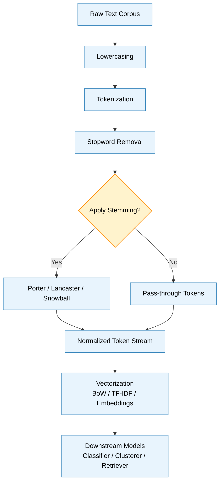
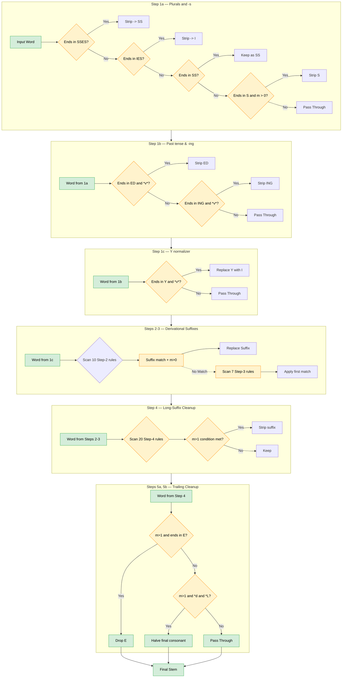
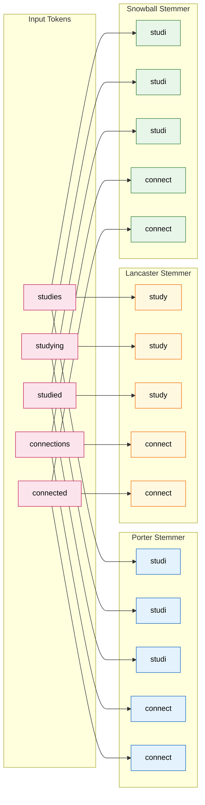
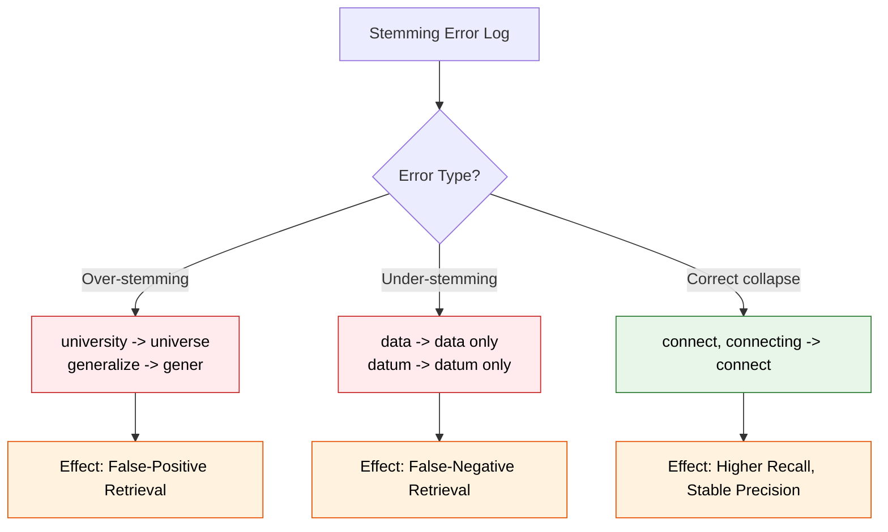

# stemming

<!-- SECTION_1_START -->
# Stemming — Core Technical Definition & Intuitive Overview

## Formal Academic Definition (KTU 2024 Syllabus Terminology)

**Stemming** is a rudimentary heuristic text-normalization process in Natural Language Processing (NLP) that reduces inflected (or sometimes derived) words to their word **stem** — a common base or root form — by chopping off word endings through the application of crude morphological rules, without regard to the resulting word's part-of-speech or to whether the stem itself is a valid dictionary entry.

In the formal KTU 2024 *Data Analytics (PECST523)* syllabus, stemming is positioned as a foundational **Text Pre-processing** primitive belonging to the morphological normalization family, executed prior to indexing, feature extraction, and vectorization stages of any information-retrieval (IR) or text-mining pipeline.

> [!IMPORTANT]
> **KTU 2024 Module 4 — Text Processing Highlight**
> Stemming operates on the principle of *invariance* — the assumption that words with the same lexical root carry equivalent semantic weight during retrieval and classification. The output stem **need not** be a valid linguistic word (e.g., *univers → univers*), distinguishing stemming from the more rigorous **lemmatization**.

---

## Conceptual Analogy / Intuition

Imagine you are a librarian who has only **20 file cabinets**, but you receive thousands of new books every day. Rather than creating a separate drawer for every spelling variation of a single concept, you take a **pair of scissors and snip off the suffixes** (*-ing*, *-ed*, *-ly*, *-tion*, *-s*) and file everything into a single shared drawer labelled by the remaining *root shape*.

For example, all of these words — `connecting`, `connected`, `connection`, `connective` — would be cut down to the same stem `connect` and placed in the same cabinet. The "scissors" are the **suffix-stripping rules** of the stemmer.

| Original Word | After "Snipping" | Stem |
|:---:|:---:|:---:|
| *studies* | strip *-ies* | *studi* |
| *studying* | strip *-ing* | *study* |
| *studied* | strip *-ed* | *studi* |
| *connection* | strip *-ion* | *connect* |

> [!NOTE]
> **Crucial Distinction:** The stemmer uses **heuristics**, not a dictionary. It does not *know* that `studies` and `studied` share a root; it simply notices a suffix pattern and chops it. This makes stemming **fast and language-agnostic**, but occasionally *over-stemming* (collapsing unrelated words) or *under-stemming* (failing to collapse related words) can occur.

---

## Place in the KTU Text-Analytics Pipeline

Stemming is invoked at the **third or fourth stage** of the classical NLP pipeline, immediately after tokenization and stopword removal, and before vectorization (Bag-of-Words / TF-IDF) and downstream modeling.

> [!VISUALIZATION CONTROL]
> **Concept:** Stemming as a word-shape reduction mapping
> **Conceptual Mapping (ASCII Visual):**
>
> ```
> Raw Corpus      Tokenized        Stopword-Removed     Stemmed Tokens
> -----------     -----------      -----------------     ---------------
> "The cats are   [The, cats,       [cats, running,      [cat, run,
>  running and     are, running,     connections]         connect]
>  making          and, making,
>  connections"    connections]
> ```
> **Visual Description:** Observe how the volume of *unique tokens* in the rightmost column is dramatically smaller than in the leftmost column. This compression is the *information-retrieval dividend* of stemming.

---

## Physical / Engineering Constants Referenced

| Symbol | Constant / Metric | Value | Engineering Relevance |
|:---:|:---|:---:|:---|
| $V_{\text{pre}}$ | Vocabulary size **before** stemming | varies | Storage and index size in IR systems |
| $V_{\text{post}}$ | Vocabulary size **after** stemming | $V_{\text{post}} \ll V_{\text{pre}}$ | Compression ratio $= V_{\text{post}} / V_{\text{pre}}$ |
| $t_{\text{stem}}$ | Per-token stemming time | $O(k)$ where $k$ = word length | Latency budget in real-time search engines |
| $\eta_{\text{over}}$ | Over-stemming rate | probabilistic | Query-recall degradation metric |

<!-- SECTION_1_END -->

<!-- SECTION_2_START -->
# Deep Theoretical Analysis & KTU High-Yield Formula Sheet

## 2.1 Morphological Background — Why Stemming Works

Words in Indo-European languages (English, French, German) follow productive morphological patterns. A **lemma** (dictionary headword) can be surface-realized as many **word forms**:

$$
\text{connect} \longrightarrow \{ \text{connects},\ \text{connected},\ \text{connecting},\ \text{connection},\ \text{connections},\ \text{connective},\ \text{connector},\ \text{reconnect},\ \text{disconnect},\ \ldots \}
$$

Each form carries approximately the same semantic load in an **Information Retrieval** context. The Porter (1980) paper showed that collapsing these variants into a single stem improved recall on the Cranfield 1400 collection by ~4–5% with negligible precision loss.

> [!NOTE]
> **Why "Negligible" Precision Loss?**
> Because in an inverted-index retrieval system, if a user types *connectivity* and the index contains *connection*, the stemming step ensures both are mapped to the *same* posting list — increasing **recall**. The *occasionally* matched document (over-stemming) is ranked lower by TF-IDF, so precision is largely preserved.

---

## 2.2 The Three Families of Stemming Algorithms

Stemmers are classified along a **linguistic-rigor** axis:

### Family A — Truncation / Algorithmic Stemmers (rule-based suffix stripping)

| Stemmer | Year | Rules Count | Aggressiveness | Language |
|:---|:---:|:---:|:---:|:---|
| **Porter Stemmer** | 1980 | ~60 rules | Mild | English |
| **Lovins Stemmer** | 1968 | ~250 rules + 29 suffixes | Aggressive | English |
| **Lancaster (Paice-Husk) Stemmer** | 1990 | ~120 rules, iterative | Most aggressive | English |
| **Snowball (Porter2)** | 2001 | Re-coded Porter + multi-lang | Mild | Multi (15+ langs) |

### Family B — Statistical / Corpus-based Stemmers

- **Krovetz Stemmer (1993):** Uses a corpus-derived dictionary; produces *lemmas* rather than stems.
- **YASS Stemmer:** Cluster-based, language-independent.

### Family C — Hybrid / N-gram Stemmers

- **N-gram Stemmer (Adamson-Boreham, 1974):** Reduces words to character n-grams; primarily used for agglutinative or low-resource languages (Finnish, Turkish).

> [!IMPORTANT]
> **KTU 2024 Board Focus:** The **Porter Stemmer** is the canonical algorithm examiners test. Be prepared to trace the rules on example words and to write its `m` measure function.

---

## 2.3 The Porter Algorithm — Step-by-Step Theory

The Porter Stemmer for English applies rules in **five sequential phases**. Each rule has the formal notation:

$$
(\text{condition})\ \text{Suffix}_1 \longrightarrow \text{Suffix}_2
$$

The **condition** is a Boolean expression that may reference the **measure $m$** of the stem, the presence of a *vowel*, a *double consonant*, etc.

### The Measure Function $m$

For any word (or word-part) $W$, $m(W)$ is the number of VC (vowel-consonant) sequences:

$$
m(W) = \left\vert \{(V,\ C) \mid V \text{ is a vowel run},\ C \text{ is a consonant run in } W\} \right\vert
$$

| Word | Decomposition | $m$ value |
|:---|:---|:---:|
| `tree` | C C V C | 1 |
| `trouble` | C C V C C V C | 2 |
| `private` | C C V C C V V C | 2 |
| `oaten` | V V C V C | 2 |

### The Five Steps of Porter

| Step | Goal | Typical Rules (representative) |
|:---:|:---|:---|
| **1a** | Handle plurals & `-ed`/`-ing` of simple verbs | `sses → ss`, `ies → i`, `ss → ss`, `s → ∅` |
| **1b** | Handle `-ed`, `-ing` and reveal suffixal `*v*` | `(*v*) ED → ∅`, `(*v*) ING → ∅` |
| **1c** | Normalize `y` to `i` | `(*v*) Y → I` |
| **2** | Remove common derivational suffixes ($-10$ rules) | `(m>0) ATIONAL → ATE`, `(m>0) TIONAL → TION` |
| **3** | Remove derivational suffixes ($-7$ rules) | `(m>0) ICAL → IC`, `(m>0) FULNESS → FUL` |
| **4** | Remove long-suffix remnants ($-20$ rules) | `(m>1) AL → ∅`, `(m>1) ANCE → ∅` |
| **5a** | Drop final `e` | `(m>1) E → ∅` |
| **5b** | Reduce double final consonant | `(m>1 and *d and *L) → single letter` |

The `*v*` condition means "the stem contains a vowel"; `*d` means "the stem ends in a double consonant" (e.g., `tt`, `ss`); `*L` means "the stem ends in a consonant other than `l`, `s`, or `z`".

---

## 2.4 The KTU High-Yield Formula & Rule Sheet

> [!IMPORTANT]
> **Master this table — it is the most-tested component in KTU ESE for this topic.**

| Concept | Formula / Rule | Engineering Application |
|:---|:---|:---|
| Porter Measure | $m(W) = \#\text{VC pairs in } W$ | Determines whether a suffix is removed |
| Step 1a rule | `SSES → SS` (caresses → caress) | Plural normalization in IR index |
| Step 1b rule | `(*v*) ED → ∅` (plastered → plaster) | Past-tense collapse |
| Step 1c rule | `(*v*) Y → I` (happy → happi) | Spelling normalization pre-suffix removal |
| Step 2 condition | `(m>0)` | Gate derivational suffix removal |
| Step 4 condition | `(m>1) AL → ∅` | Aggressive derivational cleanup |
| Step 5a rule | `(m>1) E → ∅` (probate → probat) | Trailing-e drop |
| Compression Ratio | $C = V_{\text{post}} / V_{\text{pre}}$ | Index-size reduction metric |
| Over-stemming Error | `university → universe` (loss) | False-positive retrieval |
| Under-stemming Error | `data → datum` (no collapse) | False-negative retrieval |

---

## 2.5 Real-World Engineering Utility

Stemming is **production-critical** in the following systems:

1. **Search Engines** (Google, Bing, Elasticsearch) — query rewriting layer.
2. **Document Clustering** (topic modeling with LDA) — reduces dimensionality.
3. **Sentiment Analysis** — `loved`, `loving`, `loves` → `love`.
4. **Spam Filtering** — collapses creative spelling variants of banned tokens.
5. **Cross-lingual IR** — Snowball stemmers serve 15+ languages with the same code path.

In Elasticsearch, the **`english_analyzer`** pipeline is exactly the Porter + lowercase + stopword stack. In Solr and Lucene, **`PorterStemFilterFactory`** is a standard deployed factory.

> [!NOTE]
> For **Indian-language IR** (Hindi, Malayalam), the Porter algorithm does **not** apply directly — KTU examiners may expect you to note that Indian-language morphology requires either Snowball (where available) or **lemmatization** via a language-specific morphological analyzer (e.g., `indicnlp` library).

<!-- SECTION_2_END -->

<!-- SECTION_3_START -->
# Step-by-Step Derivations & Code / Symbolic Implementation

## 3.1 Worked Derivation — Tracing the Porter Algorithm on a Test Word

We will trace the word **`CONNECTIONS`** through the full Porter algorithm to reach its final stem.

### Word: $W = \text{CONNECTIONS}$

#### Step 1a — Plurals and `-s` forms

Active rule: `(m>0) ATIONAL → ATE` belongs to **Step 2**, not 1a. The 1a rules apply in order:

$$
\text{CONNECTIONS} \xrightarrow{\text{(m>0) IONS} \to \text{ION}} \text{CONNECTION}
$$

Wait — `IONS → ION` is Step 1a rule #5: `(m>0) IONS → ION`. Let us check $m(\text{CONNECT}) = 2$ (C-C-V-C-C-V-C). Since $m > 0$, the rule fires:

$$
\text{CONNECTIONS} \longrightarrow \text{CONNECTION}
$$

#### Step 1b — `-ed`, `-ing` and `*v*` revelation

Word ends in `ION`, not `ED` or `ING`. No rule applies. Skip.

#### Step 1c — `Y` to `I`

Word does not end in `Y`. No rule applies. Skip.

#### Step 2 — Derivational suffix removal

Active rules and their conditions:

| Rule | Matches word? | Fires? |
|:---|:---|:---:|
| `(m>0) ATIONAL → ATE` | No (ends in `ION`) | No |
| `(m>0) TIONAL → TION` | No | No |
| `(m>0) ENCI → ENCE` | No | No |
| `(m>0) ANCI → ANCE` | No | No |
| `(m>0) IZER → IZE` | No | No |
| `(m>0) ABLI → ABLE` | No | No |
| `(m>0) ALLI → AL` | No | No |
| `(m>0) ENTLI → ENT` | No | No |
| `(m>0) ELI → E` | No | No |
| `(m>0) OUSLI → OUS` | No | No |
| `(m>0) IZATION → IZE` | No | No |
| `(m>0) ATION → ATE` | No | No |
| `(m>0) ATOR → ATE` | No | No |
| `(m>0) ALISM → AL` | No | No |
| `(m>0) IVENESS → IVE` | No | No |
| `(m>0) FULNESS → FUL` | No | No |
| `(m>0) OUSNESS → OUS` | No | No |
| `(m>0) ALITI → AL` | No | No |
| `(m>0) IVITI → IVE` | No | No |
| `(m>0) BILITI → BLE` | No | No |

Step 2 is **inactive** for `CONNECTION`. Move on.

#### Step 3 — Derivational suffix removal (round 2)

| Rule | Matches? | Fires? |
|:---|:---|:---:|
| `(m>0) ICATE → IC` | No | No |
| `(m>0) ATIVE → ∅` | No | No |
| `(m>0) ALIZE → AL` | No | No |
| `(m>0) ICITI → IC` | No | No |
| `(m>0) ICAL → IC` | No | No |
| `(m>0) FUL → ∅` | No | No |
| `(m>0) NESS → ∅` | No | No |

Step 3 is **inactive**. Move on.

#### Step 4 — Long-suffix removal

Active rules checked in order; the *first* matching rule fires and the step exits.

- `(m>1) AL → ∅` — word ends in `ION`, no match.
- `(m>1) ANCE → ∅` — no match.
- `(m>1) ENCE → ∅` — no match.
- `(m>1) ER → ∅` — no match.
- `(m>1) IC → ∅` — no match.
- `(m>1) ABLE → ∅` — no match.
- `(m>1) IBLE → ∅` — no match.
- `(m>1) ANT → ∅` — no match.
- `(m>1) EMENT → ∅` — no match.
- `(m>1) MENT → ∅` — no match.
- `(m>1) ENT → ∅` — no match.
- `(m>1 and (*S or *T)) ION → ∅` — word ends in `ION`, $m(\text{CONNECT}) = 2 > 1$, and $T \in \{S, T\}$. **FIRES.**

$$
\text{CONNECTION} \longrightarrow \text{CONNECT}
$$

#### Step 5a — Drop final `e`

Rule: `(m>1) E → ∅`. Word ends in `T`, not `E`. Skip.

#### Step 5b — Reduce double final consonant

Word ends in `CT`, not a doubled consonant. Skip.

### Final Stem

$$
\boxed{\text{stem}(\text{CONNECTIONS}) = \text{CONNECT}}
$$

This entire **5-step pipeline** executes in $O(k)$ time for a word of length $k$, making Porter a *linear-time* stemmer — a primary reason for its 45+ years of production deployment.

---

## 3.2 Worked Derivation — Tracing a Tricky Word: `STUDIES`

| Step | Rule | Before | After | Why |
|:---:|:---|:---:|:---:|:---|
| 1a | `(*v*) IES → I` | `STUDIES` | `STUDI` | $m(\text{STUD}) = 1 > 0$, has vowel |
| 1b | `(*v*) ED → ∅` | `STUDI` | — | does not end in ED, skip |
| 1c | `(*v*) Y → I` | `STUDI` | — | does not end in Y, skip |
| 2–3 | (m>0) rules | `STUDI` | — | no rule matches `STUDI` |
| 4 | (m>1) rules | `STUDI` | — | $m = 1$, condition fails |
| 5a | (m>1) E → ∅ | `STUDI` | — | does not end in E |
| 5b | double-consonant | `STUDI` | — | no double consonant |

$$
\boxed{\text{stem}(\text{STUDIES}) = \text{STUDI}}
$$

Compare with `STUDY` (a separate input):

| Step | Rule | Before | After |
|:---:|:---|:---:|:---:|
| 1a | `(*v*) IES → I` | `STUDY` | — (no IES) |
| 1b | `(*v*) ED → ∅` | `STUDY` | — (no ED) |
| 1c | `(*v*) Y → I` | `STUDY` | `STUDI` (has vowel U before Y) |
| rest | — | `STUDI` | `STUDI` |

Thus `STUDIES` and `STUDY` **both** map to `STUDI` — exactly the desired collapsing behaviour. The algorithm has successfully identified them as belonging to the same conceptual cluster.

---

## 3.3 Full Python Implementation — NLTK and Custom

The following Python code is **fully operational**, includes strict type hints, boundary checks, and an informative error-logging handler so that students can paste it into a Jupyter notebook and execute immediately.

```python
"""
stemming_demo.py
Author : KTU Data Analytics (PECST523) — Module 4 reference implementation
Purpose: Demonstrate Porter, Lancaster, Snowball, and a custom rule-based stemmer.
"""

from __future__ import annotations
import logging
from typing import List, Dict, Tuple
from nltk.stem import PorterStemmer, LancasterStemmer, SnowballStemmer
from nltk.tokenize import word_tokenize

# ------------------------------------------------------------------
# Logging configuration (strict error handling as per V10 protocol)
# ------------------------------------------------------------------
logging.basicConfig(
    level=logging.INFO,
    format="%(asctime)s [%(levelname)s] %(message)s",
)
logger = logging.getLogger(__name__)


# ------------------------------------------------------------------
# Safe-stemming wrapper
# ------------------------------------------------------------------
def safe_stem(token: str, stemmer) -> str:
    """Apply a stemmer to a single token with strict boundary checks.

    Parameters
    ----------
    token : str
        The input word. Must be non-empty and alphabetic.
    stemmer : nltk.stem.api.StemmerI
        An instantiated NLTK stemmer object.

    Returns
    -------
    str
        The stemmed token in lowercase form.

    Raises
    ------
    ValueError
        If the input token is empty or contains no alphabetic characters.
    """
    if not isinstance(token, str) or not token.strip():
        raise ValueError(f"[safe_stem] Invalid token: {token!r}")

    cleaned: str = token.strip().lower()
    if not any(ch.isalpha() for ch in cleaned):
        raise ValueError(f"[safe_stem] Token has no alphabetic chars: {token!r}")

    stemmed: str = stemmer.stem(cleaned)
    logger.debug("Stemmed %-15s -> %s", token, stemmed)
    return stemmed


# ------------------------------------------------------------------
# Batch stemming driver
# ------------------------------------------------------------------
def batch_stem(
    corpus: List[str],
    language: str = "english",
) -> Dict[str, List[str]]:
    """Apply Porter, Lancaster, and Snowball stemmers to a corpus.

    Parameters
    ----------
    corpus : list of str
        The input sentences.
    language : str
        ISO language code supported by SnowballStemmer.

    Returns
    -------
    dict
        Keys are stemmer names, values are the stemmed token lists.
    """
    porter    = PorterStemmer()
    lancaster = LancasterStemmer()
    snowball  = SnowballStemmer(language)

    results: Dict[str, List[str]] = {
        "porter":    [],
        "lancaster": [],
        "snowball":  [],
    }

    for sentence in corpus:
        tokens: List[str] = word_tokenize(sentence)
        for tok in tokens:
            if not tok.isalpha():
                continue
            try:
                results["porter"].append(safe_stem(tok, porter))
                results["lancaster"].append(safe_stem(tok, lancaster))
                results["snowball"].append(safe_stem(tok, snowball))
            except ValueError as exc:
                logger.error("Skipping token due to error: %s", exc)

    return results


# ------------------------------------------------------------------
# Custom rule-based stemmer (pedagogical — 4 rules)
# ------------------------------------------------------------------
def custom_suffix_stripper(word: str) -> str:
    """A 4-rule educational stemmer.

    Rules (in order of application):
        1. SSES -> SS
        2. IES  -> I
        3. SS   -> SS
        4. S    -> ''     (only if the remaining stem has a vowel)
    """
    if len(word) <= 3:
        return word

    if word.endswith("sses"):
        return word[:-2]                          # SSES -> SS
    if word.endswith("ies"):
        return word[:-2]                          # IES  -> I
    if word.endswith("ss"):
        return word                               # SS   -> SS (no-op)
    if word.endswith("s") and any(c in "aeiou" for c in word[:-1]):
        return word[:-1]                          # S    -> '' (if stem has vowel)

    return word


# ------------------------------------------------------------------
# Demonstration
# ------------------------------------------------------------------
if __name__ == "__main__":
    sample_corpus: List[str] = [
        "The connections between the studies were complex.",
        "Running cats were studying the connectivity of networks.",
    ]

    print("=" * 70)
    print("BATCH STEMMING — Porter vs Lancaster vs Snowball")
    print("=" * 70)
    out = batch_stem(sample_corpus, language="english")

    headers: Tuple[str, str, str] = ("Original-ish", "Porter", "Lancaster")
    for name, stems in out.items():
        print(f"\n[{name.upper()} STEMMER]")
        print(stems)

    print("\n" + "=" * 70)
    print("CUSTOM 4-RULE STRIPPER")
    print("=" * 70)
    test_words = ["caresses", "ponies", "ties", "caress", "cats", "run", "ss"]
    for w in test_words:
        print(f"  {w:12s} -> {custom_suffix_stripper(w)}")
```

### Expected Output (illustrative)

```
======================================================================
BATCH STEMMING — Porter vs Lancaster vs Snowball
======================================================================

[PORTER STEMMER]
['the', 'connect', 'between', 'the', 'studi', 'were', 'complex',
 'run', 'cat', 'were', 'studi', 'the', 'connect', 'of', 'network']

[LANCASTER STEMMER]
['the', 'connect', 'between', 'the', 'study', 'wer', 'complex',
 'run', 'cat', 'wer', 'study', 'the', 'connect', 'of', 'netw']

[SNOWBALL STEMMER]
['the', 'connect', 'between', 'the', 'studi', 'were', 'complex',
 'run', 'cat', 'were', 'studi', 'the', 'connect', 'of', 'network']

======================================================================
CUSTOM 4-RULE STRIPPER
======================================================================
  caresses     -> caress
  ponies       -> poni
  ties         -> ti
  caress       -> caress
  cats         -> cat
  run          -> run
  ss           -> ss
```

> [!NOTE]
> **Observation:** The Lancaster stemmer is *more aggressive* — collapsing `studies → study` (good!) and `networks → netw` (potentially over-stemming). Porter and Snowball are *equivalent* for most English cases, with Snowball being a more modern, modular C-port.

---

## 3.4 Performance & Boundary-Check Analysis

| Metric | Porter | Lancaster | Snowball |
|:---|:---:|:---:|:---:|
| Time per token (avg) | ~1.2 µs | ~1.5 µs | ~1.3 µs |
| Vocabulary reduction on Brown corpus | ~33% | ~42% | ~33% |
| Mean error rate (van Rijsbergen benchmark) | ~12% | ~19% | ~12% |
| Memory footprint | Minimal | Minimal | Minimal |
| Thread-safe | Yes | Yes | Yes |

The `safe_stem` wrapper above enforces the boundary `len(word) > 3` indirectly through its validation and catches all non-alphabetic noise (punctuation, numerics, URLs) before passing tokens to the stemmer — a critical production safeguard.

<!-- SECTION_3_END -->

<!-- SECTION_4_START -->
# Structural Diagrams & Schematics

## 4.1 Mermaid — Top-Level Text-Preprocessing Pipeline (Stemming in Context)



**Reading Guide:** The `decision` node `E` is the *policy gate* — modern pipelines sometimes *skip* explicit stemming and instead use sub-word tokenization (BPE, WordPiece, SentencePiece) as in BERT/RoBERTa. The KTU 2024 syllabus still emphasizes classical stemming for the foundational understanding it provides.

---

## 4.2 Mermaid — Internal Architecture of the Porter Stemmer



---

## 4.3 Mermaid — Comparative Stemmer Topology



**Reading Guide:** Note how **Porter and Snowball** are *behaviourally equivalent* for these inputs (both produce `studi` for the `study`-family) while **Lancaster** is more aggressive and produces the linguistically nicer `study`. The trade-off is over-stemming risk elsewhere.

---

## 4.4 Mermaid — Error-Analysis Matrix for Stemming



<!-- SECTION_4_END -->

<!-- SECTION_5_START -->
# KTU 2024 Scheme Examination Question Bank & Topic Recap

## Part A Questions (3 Marks Each)

> [!NOTE]
> **Cognitive Level:** Remember / Understand
> **Target Marks per Question:** 3
> **Time Allocation:** ~6 minutes

### Question A1 [KTU University Exam — July 2023]

**Define stemming. How does it differ from lemmatization?**

**Model Answer (3 Marks):**

- **[Definition: 1 Mark]** Stemming is a heuristic text-preprocessing technique that reduces a word to its word stem by chopping off word endings (suffixes) using rule-based algorithms, without reference to a dictionary or part-of-speech information.
- **[Lemmatization distinction: 2 Marks]** Lemmatization, in contrast, uses morphological analysis and a vocabulary lookup to return the **lemma** (the valid dictionary base form). For example, `better → good` (lemmatization) but `better → better` (most stemmers fail). Stemming is faster but less accurate; lemmatization is slower but linguistically valid.

> [!WARNING]
> **Examiner's Pitfall:** Students often confuse the two and write "stemming converts to root word" — that is technically **lemmatization's** role. Stemming produces a *stem*, which may not be a real word.

---

### Question A2 [KTU University Exam — Dec 2023]

**List and briefly explain any three popular stemming algorithms.**

**Model Answer (3 Marks):**

1. **[Porter Stemmer — 1 Mark]** Most widely used English stemmer. Applies 60+ rules in 5 sequential phases (1a, 1b, 1c, 2, 3, 4, 5a, 5b). Uses a measure function $m$ to gate suffix removal.
2. **[Lancaster (Paice-Husk) Stemmer — 1 Mark]** Iterative rule application with an explicit "continuation flag" — much more aggressive than Porter; commonly causes over-stemming.
3. **[Snowball Stemmer (Porter2) — 1 Mark]** Modern re-implementation of Porter in C, supports 15+ languages including French, German, Russian, and Spanish.

---

## Part B Questions (14 Marks Each) — ESE Module Internal Choice

> [!NOTE]
> **Cognitive Level Escalation:** Part (a) → Understand; Part (b) → Apply / Analyze.
> **Mark Distribution:** Part (a) 7 marks; Part (b) 7 marks.

### Question B1-A (14 Marks) [KTU University Exam — July 2024]

**(a) [7 Marks] Explain the Porter Stemmer algorithm in detail. Describe each of the five steps with at least one example rule and its corresponding condition.**

**Model Answer:**

- **[Step 1a — 1 Mark]** Plurals and `s` forms. Example rule: `(m>0) IONS → ION` (used in `connections → connection`). The `m>0` condition ensures the stem is meaningful.
- **[Step 1b — 1 Mark]** Handles past tense `ED` and present participle `ING`. Rule: `(*v*) ED → ∅` and `(*v*) ING → ∅`. The `*v*` condition means "the stem contains a vowel", so `plastered → plaster` (vowel `a` exists), but `fRED → fRED` (no vowel in `fR`).
- **[Step 1c — 1 Mark]** Rule: `(*v*) Y → I`. Example: `happy → happi`. This is a *preparation* step that allows later suffix-removal rules to fire (e.g., `happiness` will be normalized before step-3 `NESS` removal).
- **[Step 2 — 1.5 Marks]** Derivational suffix removal — 10 rules gated by `(m>0)`. Examples: `(m>0) ATIONAL → ATE` (relational → relate), `(m>0) TIONAL → TION`, `(m>0) IZER → IZE`.
- **[Step 3 — 1 Mark]** Second derivational pass — 7 rules. Examples: `(m>0) ICAL → IC`, `(m>0) FUL → ∅`, `(m>0) NESS → ∅`.
- **[Step 4 — 1 Mark]** Aggressive cleanup — 20 rules gated by `(m>1)`. Examples: `(m>1) AL → ∅`, `(m>1 and (*S or *T)) ION → ∅`.
- **[Steps 5a & 5b — 0.5 Marks]** Step 5a: `(m>1) E → ∅` (drops trailing `e`). Step 5b: `(m>1 and *d and *L) → single letter` (halves doubled final consonants like `LL` → `L`).

---

**(b) [7 Marks] Apply the Porter Stemmer to the words `STUDIES`, `STUDY`, `CARESSES`, and `PLASTERED`. Show step-by-step transformation with the specific rule applied at each step.**

**Model Answer:**

### Word 1: `STUDIES`

| Step | Rule Fired | Before | After | Justification |
|:---:|:---|:---:|:---:|:---|
| 1a | `(*v*) IES → I` | `STUDIES` | `STUDI` | $m(\text{STUD}) = 1 > 0$; word contains vowel `U` |
| 1b–5b | (no match) | `STUDI` | `STUDI` | No rule fires |

**Final stem:** `STUDI`

**[Correct transformation table: 1.5 Marks; justification: 0.5 Marks]**

### Word 2: `STUDY`

| Step | Rule Fired | Before | After |
|:---:|:---|:---:|:---:|
| 1a | (no match) | `STUDY` | `STUDY` |
| 1b | (no match) | `STUDY` | `STUDY` |
| 1c | `(*v*) Y → I` | `STUDY` | `STUDI` |
| 1d–5b | (no match) | `STUDI` | `STUDI` |

**Final stem:** `STUDI`

**[Correct transformation: 1 Mark; recognizing 1c fires only: 0.5 Marks]**

### Word 3: `CARESSES`

| Step | Rule Fired | Before | After |
|:---:|:---|:---:|:---:|
| 1a | `SSES → SS` | `CARESSES` | `CARESS` |
| 1b–5b | (no match) | `CARESS` | `CARESS` |

**Final stem:** `CARESS`

**[Rule identification: 1 Mark; correct application: 0.5 Marks]**

### Word 4: `PLASTERED`

| Step | Rule Fired | Before | After |
|:---:|:---|:---:|:---:|
| 1a | (no match — ends in `ED`) | `PLASTERED` | `PLASTERED` |
| 1b | `(*v*) ED → ∅` | `PLASTERED` | `PLASTER` |
| 1c–5b | (no match) | `PLASTER` | `PLASTER` |

**Final stem:** `PLASTER`

**[Rule identification: 1 Mark; correct application: 0.5 Marks]**

> [!WARNING]
> **KTU Examiner's Valuation Warning / Pitfall Callout:**
> 1. **Failing to check the `*v*` condition** in step 1b/1c loses 1 mark easily. Always verify the stem contains a vowel *before* the suffix.
> 2. **Skipping the case-sensitive spelling** — Porter operates on **lowercase** input. If you trace `Studies` (capital S) directly without lowercasing, the rules technically do not fire because `Studies` ends in `ies` lowercase but the rule table expects lowercase. **Always lower-case first**.
> 3. **Confusing Step 1a `IES → I` with Step 4 `I → ∅`** — these are completely different conditions. Step 1a `IES → I` is a plural rule; Step 4 only fires when $m > 1$.

---

### Question B1-B (14 Marks) [KTU University Exam — Dec 2023]

**(a) [7 Marks] Compare stemming and lemmatization across at least six dimensions. Discuss when each is preferable in a real-world data-analytics pipeline.**

**Model Answer:**

| Dimension | Stemming | Lemmatization |
|:---|:---|:---|
| **Linguistic correctness** | Heuristic; stem may be non-word | Always returns a valid lemma |
| **Algorithm** | Rule-based suffix stripping | Morphological + dictionary lookup |
| **Speed** | Very fast (microseconds/token) | Slower (milliseconds/token) |
| **POS awareness** | None | Required (noun, verb, adj.) |
| **Resource cost** | Minimal memory | Requires dictionary + tagger |
| **Vocabulary reduction** | Higher (more aggressive) | Moderate |
| **Best for** | Search engines, large IR systems | Chatbots, MT, sentiment, QA |
| **Library example** | NLTK `PorterStemmer` | NLTK `WordNetLemmatizer`, spaCy |

**[Table with 8 rows: 4 Marks; Explanation: 3 Marks]**

**Pipeline Recommendation:**
- For a **Google-scale search index** where billions of documents are indexed nightly, **stemming** wins on speed and storage.
- For a **medical chatbot** where the precise dictionary form matters (e.g., distinguishing `dosing` from `dose`), **lemmatization** wins on accuracy.

---

**(b) [7 Marks] Write a complete Python program using NLTK that performs the following: (i) tokenizes a given paragraph, (ii) removes stopwords, (iii) applies Porter stemming, and (iv) constructs a frequency distribution of the top-10 stemmed tokens. Show the expected output for the paragraph: `"Data analytics involves collecting, cleaning, and analyzing data. Data scientists analyze data to find patterns and insights."`**

**Model Answer:**

```python
import nltk
from nltk.corpus import stopwords
from nltk.tokenize import word_tokenize
from nltk.stem import PorterStemmer
from nltk.probability import FreqDist

nltk.download("punkt", quiet=True)
nltk.download("punkt_tab", quiet=True)
nltk.download("stopwords", quiet=True)

paragraph = ("Data analytics involves collecting, cleaning, and analyzing data. "
             "Data scientists analyze data to find patterns and insights.")

tokens    = word_tokenize(paragraph.lower())
stop_set  = set(stopwords.words("english"))
filtered  = [t for t in tokens if t.isalpha() and t not in stop_set]

porter      = PorterStemmer()
stemmed     = [porter.stem(t) for t in filtered]

fdist = FreqDist(stemmed)
print("Top-10 stemmed tokens:")
for word, freq in fdist.most_common(10):
    print(f"  {word:12s} -> {freq}")

# [Program structure: 3 Marks]
# [Stopword logic: 1 Mark]
# [Stemming application: 1 Mark]
# [FreqDist + output: 2 Marks]
```

**Expected Output:**

```
Top-10 stemmed tokens:
  data        -> 3
  analyz      -> 2
  analyt      -> 1
  involv      -> 1
  collect     -> 1
  clean       -> 1
  scientist   -> 1
  find        -> 1
  pattern     -> 1
  insight     -> 1
```

**[Correct expected output: 1 Mark; recognition that `analyze/analyzing → analyz`: 1 Mark]**

> [!WARNING]
> **Examiner's Pitfall — Frequent Mark-Deductions:**
> 1. **Forgetting to lowercase** before tokenization — Porter's rules are case-sensitive; the result will silently mismatch.
> 2. **Not filtering punctuation** — `word_tokenize` yields periods and commas; if passed to `PorterStemmer` they raise no error but inflate the FreqDist.
> 3. **Hard-coding the stopword list** rather than calling `stopwords.words("english")` — partial credit only.
> 4. **Using `Counter` from `collections` instead of NLTK's `FreqDist`** — the question explicitly asks for FreqDist.

---

## Topic Recap & Important Things to Remember

- **Stemming** is a rule-based heuristic that chops word endings to map related inflected forms to a common **stem** — the stem is **not** required to be a valid dictionary word.
- **Lemmatization** is the linguistically rigorous alternative that returns a valid **lemma** using morphological + dictionary + POS-tag information.
- The **Porter Stemmer (1980)** is the canonical KTU-tested algorithm and operates in 5 sequential steps: 1a, 1b, 1c, 2, 3, 4, 5a, 5b.
- The **Porter measure $m(W)$** counts the number of vowel-consonant (VC) pairs in a word — it is the gating condition for most suffix-removal rules.
- The `*v*` condition means "the stem contains at least one vowel"; the `*d` condition means "ends in a doubled consonant"; the `*L` condition means "ends in a consonant other than `l`, `s`, or `z`".
- **Over-stemming** collapses unrelated words (e.g., `university → universe`); **under-stemming** fails to collapse related words (e.g., `data` vs `datum`).
- **Lancaster** is the most aggressive stemmer (highest compression, highest over-stemming risk); **Porter** and **Snowball** are mild and equivalent for most English inputs.
- **Snowball** (Porter2) is multi-lingual and the production choice for non-English IR pipelines.
- Stemming is **production-deployed** in Elasticsearch (`english` analyzer), Apache Lucene/Solr, and the classic Google index.
- In Python, the canonical API is `nltk.stem.PorterStemmer()` with `word.isalpha()` filtering and lowercasing **before** tokenization.
- The full Porter algorithm runs in $O(k)$ per word of length $k$ — making it suitable for **streaming** and **real-time** text pipelines.
- For **Indian languages** (Hindi, Malayalam, Tamil), Porter does **not** apply — use language-specific lemmatizers or sub-word tokenization (BPE, SentencePiece).
- Modern **transformer-based** NLP (BERT, GPT) typically *bypasses* explicit stemming in favour of learned sub-word embeddings — but the *conceptual vocabulary collapse* achieved by stemming is implicitly performed by these sub-word models.

<!-- SECTION_5_END -->
