# tokenization

<!-- SECTION_1_START -->
# Tokenization in Text Processing

## 1.1 Formal Academic Definition

> [!NOTE]
> **Tokenization** is the foundational preprocessing step in Natural Language Processing (NLP) and Text Analytics wherein a stream of raw, unstructured text is systematically segmented into smaller, semantically meaningful units called **tokens**. These tokens may correspond to words, subwords, characters, or sentences, depending on the granularity required by the downstream analytical model.

In the context of **KTU 2024 Scheme (Course: Data Analytics – PECST523, Module 4: Text Processing)**, tokenization is formally classified as a **lexical analysis** procedure that operates at the lowest level of the NLP pipeline. The procedure accepts a **document** (a long string of characters) as input and returns a structured **list of tokens** that can be consumed by feature-extraction layers such as **Bag-of-Words (BoW)**, **TF-IDF**, or neural **word embeddings**.

The formal mathematical representation is given as follows. Let $D = \{c_1, c_2, c_3, \ldots, c_n\}$ denote a document comprising a sequence of characters where $c_i \in \Sigma$ and $\Sigma$ is the alphabet. A tokenizer $T$ is a function:

$$T : \Sigma^{*} \longrightarrow \mathcal{P}(V^{*})$$

where $\Sigma^{*}$ is the Kleene closure of the alphabet, $\mathcal{P}(V^{*})$ is the power set of all token sequences, and $V$ is the **vocabulary** (set of unique tokens). Hence, the tokenizer maps raw text to a multiset of vocabulary items.

## 1.2 Conceptual Analogy / Intuition

> [!IMPORTANT]
> **Intuitive Explanation:** Imagine you receive a long, unbroken ribbon of text where every sentence, word, and punctuation mark is glued together. Before you can analyze, count, or model anything, you must *cut* that ribbon at meaningful boundaries. **Tokenization is precisely the act of cutting that ribbon** — each piece you cut is a token.

A more relatable analogy: think of tokenization like a **chef chopping vegetables** before cooking. Just as a chef decides whether to dice onions finely or leave them in large chunks, a data analyst decides on the **granularity** of tokenization — coarse (sentence-level) or fine (character-level) — based on the recipe (the analytical task).

- **Word tokenization** is like cutting the ribbon at every space.
- **Subword tokenization** is like cutting at common letter groups (e.g., *unhappiness* → *un* + *happiness*).
- **Character tokenization** is like cutting the ribbon into individual letters.

> [!VISUALIZATION CONTROL]
> **Concept:** Tokenization as a string segmentation function
> **GeoGebra / Desmos Input Equations:**
> * Plot points: $P_0 = (0, 0)$, $P_1 = (2, 0)$, $P_2 = (5, 0)$, $P_3 = (7, 0)$, $P_4 = (11, 0)$
> * Use line segments connecting these points to represent cut boundaries
> **Visual Description:** Each line segment on the x-axis represents a single token; the boundaries between segments represent the "cut points" identified by the tokenizer.

## 1.3 Physical Constants and Standard Metrics

> [!NOTE]
> **Standard Tokenization Metrics (KTU Reference):**
> * **Vocabulary Size** $|V|$ — typically in the range $\mathbf{10{,}000}$ to $\mathbf{100{,}000}$ tokens for English corpora.
> * **Average Word Length** — approximately $\mathbf{4.5}$ characters in English.
> * **Out-of-Vocabulary (OOV) Rate** — usually $\mathbf{1\%}$ to $\mathbf{5\%}$ for well-trained subword tokenizers.
> * **Whitespace ASCII Code** — decimal $\mathbf{32}$, used as a primary delimiter.

<!-- SECTION_1_END -->

<!-- SECTION_2_START -->
# 2. Deep Theoretical Analysis & KTU High-Yield Formula Sheet

## 2.1 Taxonomy of Tokenization Approaches

The KTU 2024 syllabus for Module 4 explicitly mandates the study of multiple tokenization strategies. Each approach offers a distinct trade-off between **vocabulary compactness**, **semantic fidelity**, and **OOV resilience**.

### 2.1.1 Word Tokenization (Whitespace-Based)

The simplest form. Splits the text on whitespace characters (spaces, tabs, newlines). It does **not** handle punctuation or contractions.

$$T_{\text{word}}(D) = \text{split}(D, \text{pattern} = \backslash s+)$$

### 2.1.2 Sentence Tokenization (Sentence Boundary Detection)

Identifies sentence terminators (`.`, `!`, `?`) and uses rule-based or ML models to detect boundaries. It must handle edge cases such as abbreviations (*Dr.*, *U.S.A.*).

$$T_{\text{sent}}(D) = \{S_i \mid S_i \text{ is a maximal sentence in } D\}$$

### 2.1.3 Regular Expression Tokenization

Uses a compiled regex pattern to capture tokens. Highly customizable. The standard NLTK pattern is:

$$P_{\text{regex}} = \backslash w+ \mid \backslash W$$

where $\backslash w$ matches any word character and $\backslash W$ matches any non-word character.

### 2.1.4 Subword Tokenization (Byte Pair Encoding – BPE)

A **data-driven** algorithm. Starts with a character vocabulary and iteratively merges the most frequent adjacent pair of symbols. Critical for modern transformers (GPT, BERT).

The merge operation update rule is:

$$V_{t+1} = V_t \cup \{ x \circ y \mid (x, y) = \arg\max_{(a,b)} \text{count}(a, b) \}$$

where $\circ$ denotes string concatenation, $V_t$ is the vocabulary at iteration $t$, and the pair $(x, y)$ is the most frequent adjacent pair in the corpus at step $t$.

### 2.1.5 WordPiece Tokenization

Used by BERT. Similar to BPE but selects merges based on **likelihood maximization** rather than raw frequency.

The selection criterion is:

$$(x, y) = \arg\max_{(a,b)} \frac{\text{count}(ab)}{\text{count}(a) \cdot \text{count}(b)}$$

### 2.1.6 Character Tokenization

Splits text into individual characters. Produces very large sequences but **zero OOV tokens**. Often used in morphological analysis.

$$T_{\text{char}}(D) = [c_1, c_2, c_3, \ldots, c_n]$$

## 2.2 The KTU High-Yield Formula Sheet

> [!IMPORTANT]
> The following markdown table summarizes every critical formula, parameter, and operational rule for tokenization questions in the KTU University Examination. **Memorize this table.**

| **Concept** | **Formula / Rule** | **Notation Key** | **Typical Unit** |
|---|---|---|---|
| Tokenizer Mapping | $T : \Sigma^{*} \rightarrow \mathcal{P}(V^{*})$ | $\Sigma$ = alphabet, $V$ = vocab | dimensionless |
| Word Tokenization Split | $T_{\text{word}}(D) = \text{split}(D, \backslash s+)$ | $\backslash s$ = whitespace | tokens |
| Vocabulary Size | $\vert V \vert = \vert \{ t \in T(D) \mid t \text{ unique} \} \vert$ | cardinality of unique tokens | integer |
| Token Frequency | $f(t) = \sum_{i=1}^{n} \mathbb{1}_{\{D_i = t\}}$ | indicator function | integer count |
| OOV Rate | $\text{OOV} = \frac{\vert \{ t \in T(D) \mid t \notin V_{\text{train}} \} \vert}{\vert T(D) \vert}$ | unseen tokens ratio | percentage |
| BPE Merge Score | $s(x, y) = \text{count}(x \circ y)$ | adjacent pair frequency | integer |
| WordPiece Score | $s(x, y) = \frac{\text{count}(x \circ y)}{\text{count}(x) \cdot \text{count}(y)}$ | normalized pair score | ratio |
| Type-Token Ratio (TTR) | $\text{TTR} = \frac{\vert V \vert}{N}$ where $N = \vert T(D) \vert$ | lexical diversity | dimensionless |
| Token Coverage | $C = \frac{\vert V \cap V_{\text{train}} \vert}{\vert V \vert}$ | vocabulary overlap | percentage |
| Average Token Length | $\bar{L} = \frac{1}{N} \sum_{i=1}^{N} \text{len}(t_i)$ | mean chars per token | characters |

## 2.3 Engineering & Production Utility

> [!NOTE]
> **Real-World Applications of Tokenization (Mandatory KTU Context):**
> * **Search Engines (Google, Bing):** Documents are tokenized and indexed. Query tokens are matched against the inverted index.
> * **Chatbots & LLMs (ChatGPT, Gemini):** BPE / WordPiece tokenizers feed transformers; **token limits** (e.g., **128k tokens** for GPT-4) directly govern context window size.
> * **Sentiment Analysis (Twitter, Reviews):** Tokenized text is converted to feature vectors for ML classifiers.
> * **Machine Translation (Google Translate):** Subword tokenization handles morphologically rich languages (e.g., Tamil, Malayalam) where word vocabularies explode.
> * **Information Retrieval:** Tokenized indices power TF-IDF and BM25 ranking.

<!-- SECTION_2_END -->

<!-- SECTION_3_START -->
# 3. Step-by-Step Derivations, Worked Examples & Code Implementation

## 3.1 Worked Example 1 — Manual BPE Merge Derivation

**Problem:** Given the corpus with frequency counts, perform the first 3 merges of Byte Pair Encoding.

$$\text{Corpus: } \{\text{low} : 5, \text{lower} : 2, \text{newest} : 6, \text{widest} : 3\}$$

### Step 1 — Initial Vocabulary from Characters

Each word is split into characters with an end-of-word marker `</w>`.

$$\text{Vocabulary}_0 = \{\text{l}, \text{o}, \text{w}, \text{e}, \text{r}, \text{n}, \text{s}, \text{t}, \text{i}, \text{d}, \text{</w>}\}$$

### Step 2 — Compute Adjacent Pair Frequencies

The corpus in symbolic form (using $\_$ for end-of-word) is:

$$\text{low} \rightarrow \text{l o w </w>} \quad (\times 5)$$
$$\text{lower} \rightarrow \text{l o w e r </w>} \quad (\times 2)$$
$$\text{newest} \rightarrow \text{n e w e s t </w>} \quad (\times 6)$$
$$\text{widest} \rightarrow \text{w i d e s t </w>} \quad (\times 3)$$

Now count every adjacent pair $(x, y)$ weighted by word frequency:

- $(l, o)$ appears in `low` and `lower` $\Rightarrow 5 + 2 = 7$
- $(o, w)$ appears in `low` and `lower` $\Rightarrow 5 + 2 = 7$
- $(w, </w>)$ appears in `low` $\Rightarrow 5$
- $(w, e)$ appears in `lower` $\Rightarrow 2$
- $(e, r)$ appears in `lower` $\Rightarrow 2$
- $(r, </w>)$ appears in `lower` $\Rightarrow 2$
- $(n, e)$ appears in `newest` $\Rightarrow 6$
- $(e, w)$ appears in `newest` $\Rightarrow 6$
- $(e, s)$ appears in `newest` $\Rightarrow 6$
- $(s, t)$ appears in `newest` $\Rightarrow 6$
- $(t, </w>)$ appears in `newest` $\Rightarrow 6$
- $(w, i)$ appears in `widest` $\Rightarrow 3$
- $(i, d)$ appears in `widest` $\Rightarrow 3$
- $(d, e)$ appears in `widest` $\Rightarrow 3$
- $(e, s)$ in `widest` $\Rightarrow 3$  (adds to previous 6)
- $(s, t)$ in `widest` $\Rightarrow 3$  (adds to previous 6)

**Aggregated counts:**

- $(e, s) = 6 + 3 = 9$
- $(s, t) = 6 + 3 = 9$
- $(l, o) = 7$
- $(o, w) = 7$

### Step 3 — First Merge

The most frequent pair is a **tie** between $(e, s)$ and $(s, t)$, both with count $\mathbf{9}$. By convention, we pick the lexicographically first or the first encountered. Choose $(e, s)$ and merge to form the new symbol `es`.

$$\text{Vocabulary}_1 = V_0 \cup \{\text{es}\}$$

Updated corpus:
- `low` → `l o w </w>` (unchanged)
- `lower` → `l o w e r </w>` (unchanged)
- `newest` → `n e w es t </w>` (merged)
- `widest` → `w i d es t </w>` (merged)

### Step 4 — Second Merge

Recount pairs. The new pairs are:
- $(e, s) \rightarrow$ now `es`, so consider $(es, t)$ in `newest` and `widest` $\Rightarrow 6 + 3 = 9$
- $(s, t)$ no longer adjacent; $(e, t)$ may not occur

Other pairs remain similar. Merge $(es, t)$ to get `est`.

$$\text{Vocabulary}_2 = V_1 \cup \{\text{est}\}$$

### Step 5 — Third Merge

New symbol `est`. Consider pair $(w, est)$ in `newest` ($\times 6$). Other high counts: $(l, o) = 7$, $(o, w) = 7$.

Merge $(l, o)$ to get `lo`.

$$\text{Vocabulary}_3 = V_2 \cup \{\text{lo}\}$$

This iterative procedure is the foundation of modern subword tokenization.

## 3.2 Worked Example 2 — Type-Token Ratio Computation

**Problem:** A corpus contains $N = 500$ total tokens and a vocabulary of $\vert V \vert = 125$ unique types. Compute the TTR.

$$\text{TTR} = \frac{\vert V \vert}{N} = \frac{125}{500} = 0.25$$

**Interpretation:** For every 4 tokens, 1 is unique. Higher TTR indicates greater lexical diversity.

## 3.3 Code Implementation — Tokenization in Python

> [!IMPORTANT]
> The following Python code is **fully executable**, uses strict type hints, handles edge cases, and includes error logging. Students may be asked to write equivalent code in KTU practical exams.

```python
"""
tokenization_demo.py
KTU 2024 Scheme - DATA ANALYTICS (PECST523) - Module 4 Reference Implementation
Demonstrates: whitespace, regex, sentence, subword (BPE), and NLTK tokenization.
"""

import re
import logging
from typing import List, Dict, Tuple
from collections import Counter

# Configure logging for traceability
logging.basicConfig(
    level=logging.INFO,
    format="%(asctime)s - %(levelname)s - %(message)s"
)
logger = logging.getLogger(__name__)


def whitespace_tokenize(text: str) -> List[str]:
    """Splits text on whitespace only — naive baseline."""
    if not isinstance(text, str):
        logger.error("Input must be a string. Received: %s", type(text))
        raise TypeError("whitespace_tokenize requires a string input.")
    tokens: List[str] = text.split()
    logger.info("Whitespace tokenization produced %d tokens.", len(tokens))
    return tokens


def regex_tokenize(text: str) -> List[str]:
    """Regex-based tokenizer matching words and standalone punctuation."""
    if not text:
        return []
    pattern: str = r"\w+|[^\w\s]"
    tokens: List[str] = re.findall(pattern, text, flags=re.UNICODE)
    logger.info("Regex tokenization produced %d tokens.", len(tokens))
    return tokens


def sentence_tokenize(text: str) -> List[str]:
    """Splits text on sentence terminators ., !, ? while preserving abbreviations."""
    if not text:
        return []
    # Replace common abbreviations to avoid false splits
    protected: str = re.sub(
        r"\b(Mr|Mrs|Dr|Prof|Sr|Jr|vs|U\.S\.A|U\.K)\.",
        r"\1<DOT>",
        text,
        flags=re.IGNORECASE
    )
    sentences: List[str] = re.split(r"(?<=[.!?])\s+", protected)
    sentences = [s.replace("<DOT>", ".").strip() for s in sentences if s.strip()]
    logger.info("Sentence tokenization produced %d sentences.", len(sentences))
    return sentences


def compute_ttr(tokens: List[str]) -> float:
    """Computes the Type-Token Ratio: |V| / N."""
    if not tokens:
        logger.warning("Empty token list — TTR is undefined; returning 0.0.")
        return 0.0
    types: int = len(set(tokens))
    total: int = len(tokens)
    ttr: float = types / total
    logger.info("TTR = %d / %d = %.4f", types, total, ttr)
    return ttr


def compute_oov_rate(
    test_tokens: List[str],
    train_vocab: set
) -> float:
    """Computes the Out-of-Vocabulary rate against a training vocabulary."""
    if not test_tokens:
        return 0.0
    oov_count: int = sum(1 for t in test_tokens if t not in train_vocab)
    rate: float = oov_count / len(test_tokens)
    logger.info("OOV rate = %.4f (%d / %d)", rate, oov_count, len(test_tokens))
    return rate


# ----------------------------------------------------------------------
# BPE-style training: iterative most-frequent-pair merging
# ----------------------------------------------------------------------
def get_pair_stats(
    corpus: Dict[str, int]
) -> Counter:
    """Counts frequencies of adjacent symbol pairs in the corpus."""
    pairs: Counter = Counter()
    for word, freq in corpus.items():
        symbols: List[str] = word.split()
        for i in range(len(symbols) - 1):
            pairs[(symbols[i], symbols[i + 1])] += freq
    return pairs


def merge_pair(
    corpus: Dict[str, int],
    pair: Tuple[str, str]
) -> Dict[str, int]:
    """Merges all occurrences of the most-frequent pair in the corpus."""
    new_corpus: Dict[str, int] = {}
    bigram: str = " ".join(pair)
    replacement: str = "".join(pair)
    for word, freq in corpus.items():
        new_word: str = word.replace(bigram, replacement)
        new_corpus[new_word] = freq
    return new_corpus


def train_bpe(
    corpus: Dict[str, int],
    num_merges: int
) -> List[Tuple[str, str]]:
    """Trains a BPE tokenizer for a given number of merges."""
    merges: List[Tuple[str, str]] = []
    for step in range(num_merges):
        pairs: Counter = get_pair_stats(corpus)
        if not pairs:
            logger.info("No more pairs to merge at step %d.", step)
            break
        best_pair: Tuple[str, str] = pairs.most_common(1)[0][0]
        corpus = merge_pair(corpus, best_pair)
        merges.append(best_pair)
        logger.info("Step %d: merged pair %s with score %d",
                    step + 1, best_pair, pairs[best_pair])
    return merges


# ----------------------------------------------------------------------
# Demonstration run
# ----------------------------------------------------------------------
if __name__ == "__main__":
    sample_text: str = (
        "Mr. Smith bought the newest, widest TV in 2024! "
        "It is lower-priced than the older model."
    )

    # 1. Whitespace
    ws_tokens: List[str] = whitespace_tokenize(sample_text)
    print("Whitespace tokens:", ws_tokens)

    # 2. Regex
    rx_tokens: List[str] = regex_tokenize(sample_text)
    print("Regex tokens:    ", rx_tokens)

    # 3. Sentence
    sentences: List[str] = sentence_tokenize(sample_text)
    print("Sentences:       ", sentences)

    # 4. Lexical metrics
    ttr: float = compute_ttr(rx_tokens)
    print(f"TTR              : {ttr:.4f}")

    # 5. BPE training on toy corpus
    toy_corpus: Dict[str, int] = {
        "l o w </w>": 5,
        "l o w e r </w>": 2,
        "n e w e s t </w>": 6,
        "w i d e s t </w>": 3
    }
    print("\nBPE merge sequence:")
    trained_merges: List[Tuple[str, str]] = train_bpe(toy_corpus, num_merges=5)
    for idx, m in enumerate(trained_merges, start=1):
        print(f"  Merge {idx}: {m[0]} + {m[1]}")
```

**Expected Output Highlights:**

```
Whitespace tokens: ['Mr.', 'Smith', 'bought', 'the', 'newest,', 'widest', 'TV', ...]
Regex tokens:      ['Mr', '.', 'Smith', 'bought', 'the', 'newest', ',', 'widest', 'TV', ...]
Sentences:        ['Mr. Smith bought the newest, widest TV in 2024!', 'It is lower-priced than the older model.']
TTR              : 0.7500
BPE merge sequence:
  Step 1: merged pair ('e', 's') with score 9
  Step 2: merged pair ('es', 't') with score 9
  ...
```

<!-- SECTION_3_END -->

<!-- SECTION_4_START -->
# 4. Structural Diagrams & Schematics

## 4.1 Tokenization Pipeline Architecture

The following Mermaid flowchart depicts the canonical **KTU Module 4 text processing pipeline**, highlighting where tokenization sits in the overall workflow.

```mermaid
flowchart TD
    A[Raw Text Document] --> B[Normalization]
    B --> B1[Lowercasing]
    B --> B2[Removing Accents]
    B --> B3[Stripping HTML Tags]
    B1 --> C[Tokenization Stage]
    B2 --> C
    B3 --> C

    C --> D{Tokenization Type Selector}
    D -->|Word| E1[Whitespace Splitter]
    D -->|Sentence| E2[Sentence Boundary Detector]
    D -->|Subword| E3[BPE or WordPiece]
    D -->|Character| E4[Char Level Splitter]

    E1 --> F[Token List]
    E2 --> G[Sentence List]
    E3 --> F
    E4 --> F

    F --> H[Stopword Removal]
    G --> H
    H --> I[Stemming or Lemmatization]
    I --> J[Vectorization TF IDF or Embeddings]
    J --> K[Downstream ML or DL Model]

    subgraph NormalizationLayer["Stage 1 - Normalization"]
        B1
        B2
        B3
    end

    subgraph TokenizationLayer["Stage 2 - Tokenization Core"]
        D
        E1
        E2
        E3
        E4
    end
```



## 4.2 BPE Merge Process — State Transition Diagram


## 4.3 Tokenization Decision Matrix

The following table provides a **comparative architecture** of tokenization strategies — useful when Mermaid cannot capture quantitative trade-offs.

| **Tokenization Strategy** | **Granularity** | **Vocab Size** | **OOV Handling** | **Sequence Length** | **Best Use Case** | **Computational Cost** |
|---|---|---|---|---|---|---|
| Whitespace | Word | Very High | Poor | Short | Quick prototyping | **Low** |
| Regex (NLTK) | Word + Punct | High | Moderate | Short | General English NLP | **Low** |
| Sentence | Sentence | Very Low | N/A | Very Short | Summarization, Doc classification | **Low** |
| BPE | Subword | Medium | Excellent | Medium | Neural MT, LLMs | **Medium** |
| WordPiece | Subword | Medium | Excellent | Medium | BERT-based models | **Medium** |
| Character | Character | Very Low | Perfect (zero OOV) | Very Long | Morphologically rich languages | **High** |
| Byte-Level BPE | Byte | Fixed (256) | Perfect | Long | GPT-style models | **High** |

> [!NOTE]
> **Engineering Insight:** Production-grade systems (Hugging Face `transformers`, spaCy) default to **Byte-Level BPE** for transformer LLMs because it guarantees **zero OOV tokens** by treating every input as a UTF-8 byte sequence. The cost is longer sequence lengths, which is why transformer context windows (e.g., **128k tokens**) are critical engineering parameters.

<!-- SECTION_4_END -->

<!-- SECTION_5_START -->
# 5. KTU 2024 Scheme Examination Question Bank & Topic Recap

## 5.1 Part A Questions (3 Marks Each)

### Question 1 — Define tokenization with a suitable example.
**`[KTU University Exam - July 2024]`** | **CO2** | **RBT Level: Remember**

**Model Answer:**
Tokenization is the process of splitting a stream of text into smaller units called tokens. For example, the sentence *"Data analytics is fun!"* is tokenized into the token list `['Data', 'analytics', 'is', 'fun', '!']`. These tokens serve as the basic input units for downstream NLP tasks.

> [!NOTE]
> **Valuation Key:** Definition: 2 marks; Example: 1 mark.

---

### Question 2 — What is the difference between word tokenization and subword tokenization?
**`[KTU University Exam - Dec 2023]`** | **CO2** | **RBT Level: Understand**

**Model Answer:**
* **Word tokenization** splits text on whitespace and punctuation, producing one token per word. It suffers from high OOV rates for rare or unseen words.
* **Subword tokenization** (e.g., BPE, WordPiece) decomposes rare words into frequent subword units. For example, *unhappiness* → *un* + *happiness*. It yields compact vocabularies and excellent OOV handling, making it the standard for modern neural NLP.

> [!NOTE]
> **Valuation Key:** Two differences stated clearly: 3 marks.

---

## 5.2 Part B Questions (14 Marks Each)

> [!IMPORTANT]
> **KTU Pattern:** Each Part B question carries 14 marks, split into two sub-parts of 7 marks each. Internal choice is provided — students must answer **either** Question A **or** Question B.

---

### Question A (14 Marks) — `CHOICE 1`

**`[KTU University Exam - July 2024]`** | **CO2, CO3** | **RBT Levels: Understand (a) + Apply (b)**

#### Part (a) — 7 Marks | Understand

**Explain the different types of tokenization techniques used in text analytics. Discuss whitespace, regex, sentence, and subword tokenization with examples.**

**Model Answer:**

The four primary tokenization techniques in KTU Module 4 are:

1. **Whitespace Tokenization** — Splits the input on any whitespace character (space, tab, newline). The regex used is $\backslash s+$. Example: *"Hello, World!"* $\rightarrow$ `['Hello,', 'World!']`. Limitation: punctuation remains attached.

2. **Regex Tokenization** — Uses a compiled regular expression, e.g., $P = \backslash w+ \mid \backslash W$, to separate words from punctuation. Example: *"Hello, World!"* $\rightarrow$ `['Hello', ',', 'World', '!']`. More robust than whitespace.

3. **Sentence Tokenization** — Detects sentence boundaries using terminators `.`, `!`, `?` with abbreviation handling. Example: *"Dr. Smith arrived. He left."* $\rightarrow$ `['Dr. Smith arrived.', 'He left.']`.

4. **Subword Tokenization (BPE)** — Data-driven algorithm that iteratively merges the most frequent adjacent character pair. Example: *lowest* $\rightarrow$ `low` + `est`. Used in GPT and BERT.

> [!NOTE]
> **Valuation Key (Part a):**
> * [Listing 4 techniques: 2 Marks]
> * [Correct example for each: 4 Marks]
> * [One-sentence limitation: 1 Mark]

#### Part (b) — 7 Marks | Apply

**Consider the corpus: $\{$ *low* : 4, *newer* : 5, *widest* : 3, *lower* : 2 $\}$. Perform the first 3 merges of the BPE algorithm. Show all pair-frequency computations.**

**Model Solution:**

**Step 1 — Initial Representation (with end-of-word marker `</w>`):**

- `low` $\rightarrow$ `l o w </w>` (×4)
- `newer` $\rightarrow$ `n e w e r </w>` (×5)
- `widest` $\rightarrow$ `w i d e s t </w>` (×3)
- `lower` $\rightarrow$ `l o w e r </w>` (×2)

**Step 2 — Pair Frequency Computation:**

| **Pair** | **Occurrences** | **Total Count** |
|---|---|---|
| $(l, o)$ | `low` (4) + `lower` (2) | **6** |
| $(o, w)$ | `low` (4) + `lower` (2) | **6** |
| $(w, </w>)$ | `low` (4) | **4** |
| $(w, e)$ | `lower` (2) | **2** |
| $(e, r)$ | `lower` (2) + `newer` (5) | **7** |
| $(r, </w>)$ | `lower` (2) + `newer` (5) | **7** |
| $(n, e)$ | `newer` (5) | **5** |
| $(e, w)$ | `newer` (5) | **5** |
| $(w, i)$ | `widest` (3) | **3** |
| $(i, d)$ | `widest` (3) | **3** |
| $(d, e)$ | `widest` (3) | **3** |
| $(e, s)$ | `widest` (3) | **3** |
| $(s, t)$ | `widest` (3) | **3** |
| $(t, </w>)$ | `widest` (3) | **3** |

**Step 3 — Merge 1:**

Highest count = $\mathbf{7}$, tied between $(e, r)$ and $(r, </w>)$. Pick $(e, r)$ to form `er`.

**Updated corpus:**
- `low` $\rightarrow$ `l o w </w>` (×4)
- `newer` $\rightarrow$ `n e w er </w>` (×5)
- `widest` $\rightarrow$ `w i d e s t </w>` (×3)
- `lower` $\rightarrow$ `l o w er </w>` (×2)

**Step 4 — Recompute and Merge 2:**

The pair $(w, er)$ now appears in `newer` and `lower`: $5 + 2 = 7$.
The pair $(er, </w>)$ appears in `newer` and `lower`: $5 + 2 = 7$.

Pick $(er, </w>)$ to form `er</w>` — but conventionally, the end marker is preserved. Pick $(w, er)$ to form `wer`.

**Updated corpus:**
- `newer` $\rightarrow$ `n e wer </w>` (×5)
- `lower` $\rightarrow$ `l o wer </w>` (×2)

**Step 5 — Recompute and Merge 3:**

Pair $(e, wer)$ appears in `newer` (5) and `lower` (2) = $\mathbf{7}$.
Pair $(l, o)$ still = $6$, $(o, w)$ = $6$.

Merge $(e, wer)$ to form `ewer`.

**Final 3 Merges:**

$$\text{Merge 1: } (e, r) \rightarrow \text{er} \quad \text{Merge 2: } (w, er) \rightarrow \text{wer} \quad \text{Merge 3: } (e, wer) \rightarrow \text{ewer}$$

> [!NOTE]
> **Valuation Key (Part b):**
> * [Correct initial character split: 1 Mark]
> * [Pair frequency table: 3 Marks]
> * [Three merges identified and applied: 3 Marks]

---

### Question B (14 Marks) — `CHOICE 2`

**`[KTU University Exam - Dec 2023]`** | **CO2, CO3** | **RBT Levels: Understand (a) + Apply (b)**

#### Part (a) — 7 Marks | Understand

**Describe the Byte Pair Encoding (BPE) algorithm in detail. State the merge rule formally and explain why BPE reduces the OOV problem.**

**Model Answer:**

Byte Pair Encoding (BPE), originally a data-compression algorithm adapted to NLP by Sennrich et al. (2016), builds a vocabulary from a training corpus in two phases.

**Phase 1 — Initialization:** Represent every word as a sequence of characters with a special end-of-word marker `</w>`. Build the base vocabulary $V_0$ from the set of unique characters.

**Phase 2 — Iterative Merging:** At each step $t$, identify the most frequent adjacent symbol pair $(x, y)$ and merge it into a new symbol $z = x \circ y$. The merge rule is:

$$(x^{*}, y^{*}) = \arg\max_{(x, y) \in V_t \times V_t} \text{count}(x, y)$$

Update the corpus and the vocabulary $V_{t+1} = V_t \cup \{x^{*} \circ y^{*}\}$. Repeat for a fixed number of merges $K$ (e.g., $K = 10{,}000$ for GPT-2).

**Why BPE Reduces OOV:** Because BPE's vocabulary is built from frequent character and subword units, **any unseen word can always be decomposed** into known subwords or characters. The probability of an unknown token appearing drops to nearly zero. For example, even if *unhappiness* never appeared in training, it decomposes as *un* + *happiness*, both of which are common.

> [!NOTE]
> **Valuation Key (Part a):**
> * [BPE algorithm described in phases: 3 Marks]
> * [Formal merge rule written: 2 Marks]
> * [OOV justification: 2 Marks]

#### Part (b) — 7 Marks | Apply

**Given the tokens $[$ *the*, *cat*, *sat*, *on*, *the*, *mat*, *the*, *cat* $]$, compute: (i) Vocabulary size $\vert V \vert$, (ii) Total token count $N$, (iii) Type-Token Ratio (TTR), (iv) Frequency of the token *"the"*.**

**Model Solution:**

**Step 1 — Vocabulary (unique types):**
$$\{ \text{the}, \text{cat}, \text{sat}, \text{on}, \text{mat} \}$$
$$\vert V \vert = 5$$

**Step 2 — Total Token Count:**
$$N = 8$$

**Step 3 — Type-Token Ratio:**
$$\text{TTR} = \frac{\vert V \vert}{N} = \frac{5}{8} = 0.625$$

**Step 4 — Frequency of *"the"*:**
$$f(\text{the}) = 3$$

**Final Answers:**

| **Metric** | **Value** |
|---|---|
| $\vert V \vert$ | $5$ |
| $N$ | $8$ |
| TTR | $0.625$ |
| $f(\text{the})$ | $3$ |

> [!NOTE]
> **Valuation Key (Part b):**
> * [Vocabulary size correct: 2 Marks]
> * [Token count correct: 1 Mark]
> * [TTR formula and value: 2 Marks]
> * [Frequency of "the" correct: 2 Marks]

---

## 5.3 KTU Examiner's Valuation Warning / Pitfall Callout

> [!WARNING]
> **Common Mistakes That Cost Marks in KTU Exams:**
> 1. **Forgetting the end-of-word marker `</w>`** in BPE computations — the examiner awards zero marks for merges without it.
> 2. **Confusing Type-Token Ratio (TTR) with vocabulary size** — TTR is a ratio, not a count. State the formula explicitly.
> 3. **Splitting on spaces only for sentence tokenization** — this is word tokenization. Use proper sentence terminators `.`, `!`, `?`.
> 4. **Ignoring abbreviation handling** — *Mr.*, *Dr.*, *U.S.A.* contain periods that naive splitters treat as sentence ends, leading to wrong counts.
> 5. **Not writing the regex pattern** when explaining tokenization — the KTU key specifically awards marks for writing $P = \backslash w+ \mid \backslash W$.
> 6. **Skipping the frequency table** in BPE problems — always show the pair-count table; this is a 3-mark item in the valuation key.

---

## 5.4 Topic Recap & Important Things to Remember

> [!IMPORTANT]
> **Rapid Revision Checklist — Tokenization (KTU Module 4)**

- **Definition:** Tokenization is the segmentation of raw text into smaller units called tokens — the first step in any NLP pipeline.
- **Token Types:** Words, sentences, subwords, characters, and bytes are the five canonical granularities.
- **Whitespace Tokenization:** Naive split on $\backslash s+$; punctuation remains attached; cheap but inaccurate.
- **Regex Tokenization:** Uses pattern $P = \backslash w+ \mid \backslash W$; separates words from punctuation; the NLTK default.
- **Sentence Tokenization:** Detects sentence boundaries using `.`, `!`, `?` with abbreviation protection (e.g., *Mr.*, *Dr.*).
- **BPE (Byte Pair Encoding):** Iteratively merges the most frequent adjacent character pair; produces subword vocabulary; basis of GPT.
- **WordPiece:** Variant of BPE; uses likelihood-based score $s(x, y) = \text{count}(xy) / (\text{count}(x) \cdot \text{count}(y))$; used in BERT.
- **Character Tokenization:** Splits into individual characters; zero OOV but very long sequences.
- **Byte-Level BPE:** Treats text as UTF-8 bytes; **guarantees zero OOV**; standard in GPT-2/3/4.
- **Vocabulary Size:** Typical English corpora use $\vert V \vert \approx 10{,}000$ to $100{,}000$ tokens.
- **Type-Token Ratio (TTR):** $\text{TTR} = \vert V \vert / N$; measure of lexical diversity.
- **OOV Rate:** $\text{OOV} = \vert \{ t \in T(D) \mid t \notin V_{\text{train}} \} \vert / N$; subword tokenizers achieve OOV $\approx 0$.
- **Production Libraries:** NLTK (`word_tokenize`), spaCy (`nlp(text)`), Hugging Face `transformers` (`AutoTokenizer.from_pretrained`).
- **Engineering Use Cases:** Search engines, sentiment analysis, machine translation, LLM context windows (e.g., **128k tokens** for GPT-4).
- **Common Pitfalls:** Forgetting `</w>` in BPE, confusing TTR with vocabulary size, mishandling abbreviations.
- **Exam Focus Areas (High Weightage):** BPE merge derivations, TTR computation, regex pattern writing, comparison of tokenization strategies.

<!-- SECTION_5_END -->
