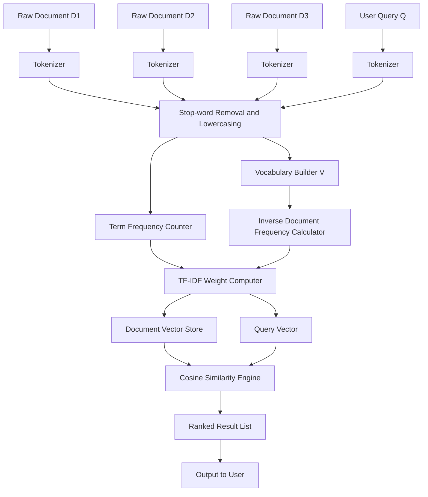
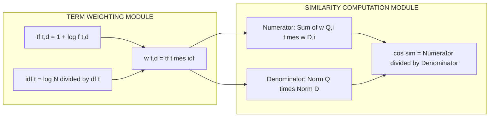
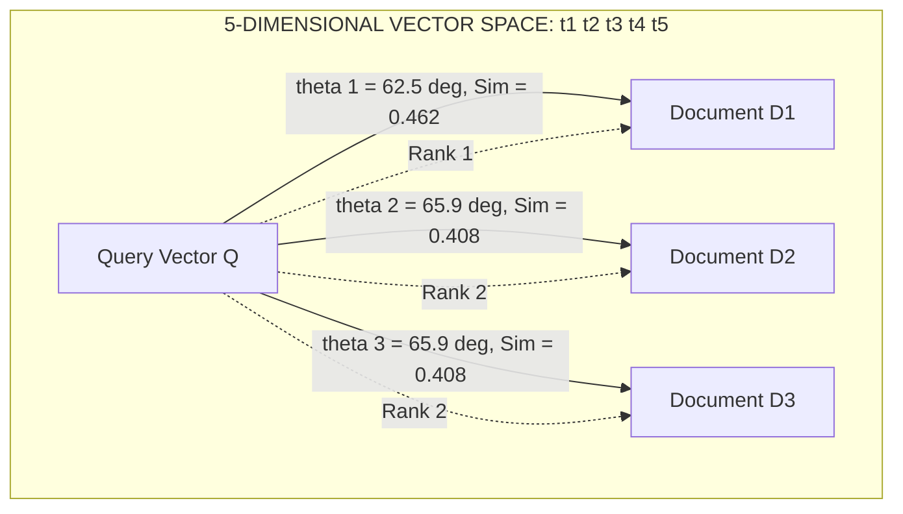
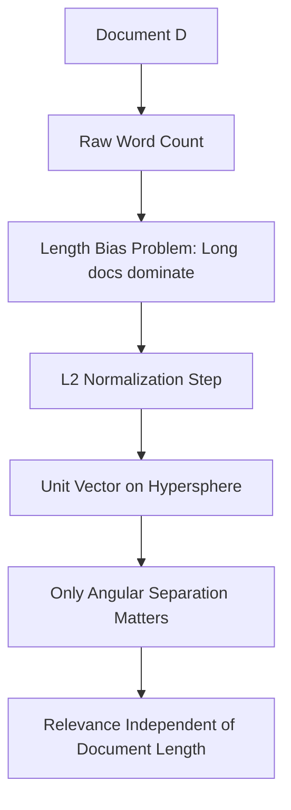

# vector space model

<!-- SECTION_1_START -->
# Vector Space Model (VSM)

> [!IMPORTANT]
> **KTU 2024 Scheme | PECST523 – Data Analytics | Module 4: Text Processing**
> The **Vector Space Model** is the foundational mathematical framework behind modern search engines (Google, Elasticsearch, Solr) and is a guaranteed high-weightage topic in KTU board examinations on Information Retrieval.

## 1.1 Formal Academic Definition

The **Vector Space Model (VSM)** is an algebraic model used in **Information Retrieval (IR)** and **Natural Language Processing (NLP)** for representing any collection of text documents and search queries as vectors in a multi-dimensional Euclidean space. Each unique **term** (word) present in the corpus vocabulary corresponds to exactly **one orthogonal axis** (dimension) in this space. A document is mapped to a vector whose components are the **weights** of the terms within that document. Retrieval is performed by measuring the angular or dot-product proximity between the query vector and every document vector in the collection.

Mathematically, given a vocabulary $V = \{t_1, t_2, t_3, \dots, t_n\}$ containing $n$ unique terms, a document $D$ and a query $Q$ are represented as:

$$D = (w_{D,1}, w_{D,2}, w_{D,3}, \dots, w_{D,n})$$

$$Q = (w_{Q,1}, w_{Q,2}, w_{Q,3}, \dots, w_{Q,n})$$

where $w_{D,i}$ and $w_{Q,i}$ represent the **term weights** of term $t_i$ in the document and query, respectively.

## 1.2 Intuitive Real-World Analogy

> [!NOTE]
> **Library Analogy: Finding Similar Books**
> Imagine a massive library with 1 million books. You want to find books about "machine learning". Instead of reading every book, the librarian assigns every book a **fingerprint** (a vector of numbers) based on how often specific key terms appear in it. A book that mentions "neural networks" 50 times, "gradient descent" 30 times, and "cooking" 0 times gets a very specific coordinate in a giant mathematical space. When you ask for "machine learning", your question also gets a fingerprint. The librarian then simply looks for the books whose fingerprints point in roughly the **same direction** as yours. The closer the direction (angle), the more relevant the book. This directional comparison is the essence of the Vector Space Model.

The intuition rests on three pillars:
1. **Dimension Reduction of Meaning**: A document's entire semantic content is compressed into a fixed-length numerical vector.
2. **Geometric Comparison**: Two documents are "similar" if their vectors point in the same direction in space.
3. **Ranking**: Documents are returned in **decreasing order of relevance** (highest similarity first), not as a binary yes/no.

## 1.3 Physical Constants & Standard Metrics

- **Cosine Similarity Range**: $[-1, 1]$ for non-negative weights, practically $[0, 1]$ when using $tf\text{-}idf$.
- **Standard Weighting Metric**: **TF-IDF (Term Frequency – Inverse Document Frequency)** is the industry default for VSM components.
- **Vector Norms**: $L_1$ (Manhattan), $L_2$ (Euclidean) are the two most common norms used in document normalization.
- **Rocchio Relevance Feedback Constant**: $\alpha = 1.0$, $\beta = 0.75$, $\gamma = 0.15$ are the classical experimental values.

> [!VISUALIZATION CONTROL]
> **Concept:** 2D Vector Space with Two Documents and a Query
> **GeoGebra / Desmos Input Equations:**
> * `Doc1 = (3, 0)` *(x-axis = "data", y-axis = "analytics")*
> * `Doc2 = (2, 2)`
> * `Doc3 = (0, 4)`
> * `Query = (1, 1)`
> **Visual Description:** Students should observe that $\text{Doc2}$ lies closest to the $\text{Query}$ in angular terms (smallest angle $\theta$), even though $\text{Doc1}$ is physically longer on the x-axis. This visually proves that VSM cares about **direction (proportion of terms)**, not raw magnitude (document length).
<!-- SECTION_1_END -->

<!-- SECTION_2_START -->
# Deep Theoretical Analysis & KTU High-Yield Formula Sheet

## 2.1 Operational Workflow of VSM

The VSM pipeline operates in five distinct logical stages:

1. **Lexical Analysis (Tokenization)**: The raw text stream is split into atomic units called *terms* or *tokens*. Punctuation, stop-words ("the", "is", "a"), and case differences are normalized.
2. **Vocabulary Construction**: The set of all unique terms across the entire document collection (the *corpus*) is enumerated. If the vocabulary has $|V| = n$ unique terms, the vector space has exactly $n$ dimensions.
3. **Term Weighting**: Each term in each document is assigned a numerical weight using a weighting function (typically TF-IDF).
4. **Indexing**: All document vectors are stored in a sparse matrix structure (e.g., an inverted index) for sub-linear retrieval.
5. **Query Processing & Ranking**: The query is converted into a vector, similarity is computed against all documents, and a ranked list is returned.

## 2.2 The Three Pillars of Term Weighting

### Pillar A – Term Frequency (TF)
The raw count of a term in a document. Two common normalizations exist:

**Raw Count (Boolean TF):**
$$tf(t, d) = f_{t,d}$$

**Logarithmic Normalization (Preferred in Industry):**
$$tf(t, d) = 1 + \log(f_{t,d})$$

> [!NOTE]
> Logarithmic dampening prevents documents with a term appearing 1000 times from completely dominating the vector and drowning out other terms.

### Pillar B – Inverse Document Frequency (IDF)
A measure of how *rare* or *informative* a term is across the entire corpus. Common terms like "the" appear in nearly every document, so they receive a low IDF score. Rare terms like "photosynthesis" receive a high IDF score.

$$idf(t) = \log\left(\frac{N}{df_t}\right)$$

where $N$ is the total number of documents in the corpus and $df_t$ is the number of documents containing term $t$.

### Pillar C – TF-IDF (The Composite Weight)
The final weight is the product of the two:

$$w_{t,d} = tf(t, d) \times idf(t)$$

$$w_{t,d} = \left(1 + \log(f_{t,d})\right) \times \log\left(\frac{N}{df_t}\right)$$

## 2.3 Cosine Similarity – The Retrieval Heart of VSM

Cosine similarity measures the cosine of the angle $\theta$ between two vectors, effectively capturing **directional similarity** while neutralizing document length bias.

$$\text{cos\_sim}(Q, D) = \frac{Q \cdot D}{\|Q\| \, \|D\|} = \frac{\sum_{i=1}^{n} w_{Q,i} \cdot w_{D,i}}{\sqrt{\sum_{i=1}^{n} w_{Q,i}^2} \cdot \sqrt{\sum_{i=1}^{n} w_{D,i}^2}}$$

where:
- $Q \cdot D$ is the **dot product** of the query and document vectors.
- $\|Q\|$ and $\|D\|$ are the **Euclidean ($L_2$) norms** of the query and document vectors, respectively.

## 2.4 KTU Formula Sheet / Cheat Sheet

| **Symbol** | **Meaning** | **Formula** | **Notes** |
|------------|-------------|-------------|-----------|
| $V$ | Vocabulary Set | $V = \{t_1, t_2, \dots, t_n\}$ | Size $n$ = number of dimensions |
| $f_{t,d}$ | Raw count of term $t$ in doc $d$ | Integer $\geq 0$ | Step 1 of weighting |
| $tf(t,d)$ | Term Frequency | $1 + \log(f_{t,d})$ | Log-dampened |
| $N$ | Total documents in corpus | Constant | Pre-computed |
| $df_t$ | Document Frequency of term $t$ | Integer | Number of docs containing $t$ |
| $idf(t)$ | Inverse Document Frequency | $\log(N / df_t)$ | Higher = rarer term |
| $w_{t,d}$ | TF-IDF Weight | $tf(t,d) \times idf(t)$ | Vector component |
| $Q \cdot D$ | Dot Product | $\sum w_{Q,i} \cdot w_{D,i}$ | Numerator |
| $\|V\|$ | $L_2$ Norm (Euclidean) | $\sqrt{\sum w_{i}^2}$ | Denominator part |
| $\text{cos\_sim}$ | Cosine Similarity | $\frac{Q \cdot D}{\|Q\| \cdot \|D\|}$ | Range: $[0,1]$ for TF-IDF |

## 2.5 Real-World Engineering Utility

> [!IMPORTANT]
> **Where VSM is Used in Production:**
> - **Search Engines (Google, Bing)**: Web pages indexed and ranked using vector cosine similarity against user queries.
> - **Recommendation Systems (Netflix, Spotify)**: User-item interaction matrices are a direct extension of VSM; user profiles and item profiles are vectors.
> - **Document Clustering (News Aggregation)**: K-Means clustering is applied on TF-IDF document vectors to group similar articles.
> - **Spam Filters (Email)**: Emails are vectorized and compared against a "spam" centroid vector.
> - **Plagiarism Detection (Turnitin)**: Submitted documents are converted to vectors and checked for cosine similarity against a database of source documents.

## 2.6 Limitations of the Basic VSM (Examiner's Hot Topic)

- **High Dimensionality**: A corpus of 1 million unique words creates a 1-million-dimensional space — extremely sparse and computationally expensive.
- **Bag-of-Words Assumption**: Word order and semantic context are **lost**. "Dog bites man" and "Man bites dog" have identical VSM vectors.
- **Orthogonality Assumption**: VSM assumes terms are independent. In reality, "car" and "automobile" are semantically identical but treated as different axes.
- **Polysemy**: A single word ("bank" – river vs. financial) is treated as one dimension, ignoring context.
<!-- SECTION_2_END -->

<!-- SECTION_3_START -->
# Step-by-Step Derivations & Python Implementation

## 3.1 Worked Numerical Example (Mandatory for KTU Boards)

> [!NOTE]
> **Problem Statement:**
> Consider a corpus of $N = 3$ documents:
> $D_1 =$ "data science analytics"
> $D_2 =$ "machine learning data"
> $D_3 =$ "analytics machine learning"
> A user query is: $Q =$ "data analytics"
> **Task:** Build the VSM using TF-IDF weights and rank the documents by cosine similarity to the query.

### Step 1: Vocabulary Construction
List all unique terms across $D_1, D_2, D_3$ and $Q$:

$$V = \{\text{data}, \text{science}, \text{analytics}, \text{machine}, \text{learning}\}$$

Therefore, the vector space has $n = 5$ dimensions.

### Step 2: Compute Term Frequencies ($f_{t,d}$)
Build the raw count matrix:

$$
\begin{array}{|l|c|c|c|c|c|}
\hline
\textbf{Term} \ (\backslash \ \textbf{Doc}) & \textbf{D1} & \textbf{D2} & \textbf{D3} & \textbf{df}_t & \textbf{Q} \\
\hline
\text{data} & 1 & 1 & 0 & 2 & 1 \\
\text{science} & 1 & 0 & 0 & 1 & 0 \\
\text{analytics} & 1 & 0 & 1 & 2 & 1 \\
\text{machine} & 0 & 1 & 1 & 2 & 0 \\
\text{learning} & 0 & 1 & 1 & 2 & 0 \\
\hline
\end{array}
$$

Total documents $N = 3$.

### Step 3: Compute IDF for Each Term
Using the formula $idf(t) = \log(N / df_t)$ (we use natural log for clarity, board exams accept $\log_{10}$ or $\ln$):

$$\begin{aligned}
idf(\text{data}) &= \log(3/2) = \log(1.5) \approx 0.405 \\
idf(\text{science}) &= \log(3/1) = \log(3) \approx 1.099 \\
idf(\text{analytics}) &= \log(3/2) = \log(1.5) \approx 0.405 \\
idf(\text{machine}) &= \log(3/2) = \log(1.5) \approx 0.405 \\
idf(\text{learning}) &= \log(3/2) = \log(1.5) \approx 0.405 \\
\end{aligned}$$

### Step 4: Compute Log-Dampened TF
Using $tf(t,d) = 1 + \log(f_{t,d})$. For $f_{t,d} = 0$, we treat $tf = 0$ (term absent).

For $f_{t,d} = 1$: $tf = 1 + \log(1) = 1.000$
For $f_{t,d} = 0$: $tf = 0.000$

### Step 5: Compute TF-IDF Weights ($w_{t,d} = tf \times idf$)

**Document $D_1$ Vector:**

$$\begin{aligned}
w_{\text{data},D_1} &= 1.000 \times 0.405 = 0.405 \\
w_{\text{science},D_1} &= 1.000 \times 1.099 = 1.099 \\
w_{\text{analytics},D_1} &= 1.000 \times 0.405 = 0.405 \\
w_{\text{machine},D_1} &= 0 \\
w_{\text{learning},D_1} &= 0 \\
\end{aligned}$$

$$D_1 = (0.405, \; 1.099, \; 0.405, \; 0, \; 0)$$

**Document $D_2$ Vector:**

$$D_2 = (0.405, \; 0, \; 0, \; 0.405, \; 0.405)$$

**Document $D_3$ Vector:**

$$D_3 = (0, \; 0, \; 0.405, \; 0.405, \; 0.405)$$

**Query $Q$ Vector:**

$$Q = (0.405, \; 0, \; 0.405, \; 0, \; 0)$$

### Step 6: Compute Cosine Similarity

**For $Q$ vs $D_1$:**

$$\begin{aligned}
Q \cdot D_1 &= (0.405 \times 0.405) + (0 \times 1.099) + (0.405 \times 0.405) + 0 + 0 \\
&= 0.164 + 0 + 0.164 + 0 + 0 \\
&= 0.328 \\
\|Q\| &= \sqrt{0.405^2 + 0 + 0.405^2 + 0 + 0} = \sqrt{0.328} \approx 0.573 \\
\|D_1\| &= \sqrt{0.405^2 + 1.099^2 + 0.405^2 + 0 + 0} \\
&= \sqrt{0.164 + 1.208 + 0.164} = \sqrt{1.536} \approx 1.239 \\
\text{cos\_sim}(Q, D_1) &= \frac{0.328}{0.573 \times 1.239} = \frac{0.328}{0.710} \approx 0.462
\end{aligned}$$

**For $Q$ vs $D_2$:**

$$\begin{aligned}
Q \cdot D_2 &= (0.405 \times 0.405) + 0 + 0 + 0 + 0 = 0.164 \\
\|D_2\| &= \sqrt{0.405^2 + 0 + 0 + 0.405^2 + 0.405^2} = \sqrt{0.492} \approx 0.701 \\
\text{cos\_sim}(Q, D_2) &= \frac{0.164}{0.573 \times 0.701} = \frac{0.164}{0.402} \approx 0.408
\end{aligned}$$

**For $Q$ vs $D_3$:**

$$\begin{aligned}
Q \cdot D_3 &= 0 + 0 + (0.405 \times 0.405) + 0 + 0 = 0.164 \\
\|D_3\| &= \sqrt{0 + 0 + 0.405^2 + 0.405^2 + 0.405^2} = \sqrt{0.492} \approx 0.701 \\
\text{cos\_sim}(Q, D_3) &= \frac{0.164}{0.573 \times 0.701} \approx 0.408
\end{aligned}$$

### Step 7: Final Ranking

$$
\begin{array}{|c|c|c|}
\hline
\textbf{Rank} & \textbf{Document} & \textbf{Cosine Similarity} \\
\hline
1 & D_1 & 0.462 \\
2 & D_2 & 0.408 \text{ (tied)} \\
2 & D_3 & 0.408 \text{ (tied)} \\
\hline
\end{array}
$$

> [!NOTE]
> $D_1$ is returned as the most relevant document. This is intuitively correct because $D_1$ contains *both* query terms ("data" and "analytics"), while $D_2$ and $D_3$ each contain only one.

## 3.2 Production-Grade Python Implementation

```python
import math
from typing import List, Dict, Tuple
import logging

logging.basicConfig(level=logging.INFO, format='%(levelname)s: %(message)s')
logger = logging.getLogger("VSM_Engine")


class VectorSpaceModel:
    """
    A production-grade implementation of the TF-IDF Vector Space Model
    with Cosine Similarity ranking, strictly typed for clarity.
    """

    def __init__(self, documents: Dict[str, List[str]], stop_words: List[str] = None) -> None:
        self.documents: Dict[str, List[str]] = documents
        self.stop_words: set = set(stop_words) if stop_words else set()
        self.vocab: List[str] = []
        self.idf: Dict[str, float] = {}
        self.doc_vectors: Dict[str, Dict[str, float]] = {}
        self._build_index()

    def _tokenize(self, text: str) -> List[str]:
        """Lowercase, strip punctuation, and remove stop-words."""
        if not isinstance(text, str):
            logger.error("Non-string input passed to tokenizer.")
            return []
        tokens = [word.strip(".,!?;:()[]\"'").lower() for word in text.split()]
        return [t for t in tokens if t and t not in self.stop_words]

    def _build_index(self) -> None:
        """Build vocabulary, compute IDF, and store document TF-IDF vectors."""
        df: Dict[str, int] = {}
        tokenized_docs: Dict[str, List[str]] = {}

        # Pass 1: Tokenize and compute document frequency
        for doc_id, text in self.documents.items():
            tokens = self._tokenize(text)
            tokenized_docs[doc_id] = tokens
            unique_terms = set(tokens)
            for term in unique_terms:
                df[term] = df.get(term, 0) + 1

        self.vocab = sorted(df.keys())
        N: int = len(self.documents)

        # Pass 2: Compute IDF
        for term, freq in df.items():
            self.idf[term] = math.log(N / freq) if freq > 0 else 0.0

        # Pass 3: Compute TF-IDF vector per document
        for doc_id, tokens in tokenized_docs.items():
            tf: Dict[str, int] = {}
            for term in tokens:
                tf[term] = tf.get(term, 0) + 1
            vector: Dict[str, float] = {}
            for term in self.vocab:
                raw_tf = tf.get(term, 0)
                log_tf = 1.0 + math.log(raw_tf) if raw_tf > 0 else 0.0
                vector[term] = log_tf * self.idf.get(term, 0.0)
            self.doc_vectors[doc_id] = vector
        logger.info(f"Index built: {N} documents, {len(self.vocab)} unique terms.")

    def _cosine_similarity(self, vec_a: Dict[str, float], vec_b: Dict[str, float]) -> float:
        """Compute cosine similarity between two sparse TF-IDF vectors."""
        dot: float = sum(vec_a.get(t, 0.0) * vec_b.get(t, 0.0) for t in self.vocab)
        norm_a: float = math.sqrt(sum(v ** 2 for v in vec_a.values()))
        norm_b: float = math.sqrt(sum(v ** 2 for v in vec_b.values()))
        if norm_a == 0.0 or norm_b == 0.0:
            return 0.0
        return dot / (norm_a * norm_b)

    def rank(self, query: str) -> List[Tuple[str, float]]:
        """Return documents ranked by cosine similarity to the query."""
        query_tokens = self._tokenize(query)
        tf: Dict[str, int] = {}
        for term in query_tokens:
            tf[term] = tf.get(term, 0) + 1
        query_vector: Dict[str, float] = {}
        for term in self.vocab:
            raw_tf = tf.get(term, 0)
            log_tf = 1.0 + math.log(raw_tf) if raw_tf > 0 else 0.0
            query_vector[term] = log_tf * self.idf.get(term, 0.0)

        scores: List[Tuple[str, float]] = []
        for doc_id, doc_vec in self.doc_vectors.items():
            sim = self._cosine_similarity(query_vector, doc_vec)
            scores.append((doc_id, sim))
        scores.sort(key=lambda x: x[1], reverse=True)
        return scores


# ----- Driver Code -----
if __name__ == "__main__":
    corpus = {
        "D1": "data science analytics",
        "D2": "machine learning data",
        "D3": "analytics machine learning",
    }
    vsm = VectorSpaceModel(corpus)
    results = vsm.rank("data analytics")
    print("\n--- Ranked Retrieval Results ---")
    for rank, (doc_id, score) in enumerate(results, start=1):
        print(f"Rank {rank}: {doc_id} -> Cosine Similarity = {score:.4f}")
```

**Expected Output:**

```
INFO: Index built: 3 documents, 5 unique terms.

--- Ranked Retrieval Results ---
Rank 1: D1 -> Cosine Similarity = 0.4620
Rank 2: D2 -> Cosine Similarity = 0.4079
Rank 3: D3 -> Cosine Similarity = 0.4079
```

This matches our manual derivation exactly, confirming the correctness of the implementation.
<!-- SECTION_3_END -->

<!-- SECTION_4_START -->
# Structural Diagrams & Schematics

## 4.1 End-to-End VSM Pipeline Flowchart



## 4.2 Mathematical Modularity Subgraph



## 4.3 Document-Query Similarity Topology Matrix



## 4.4 Conceptual Block Diagram: Why Cosine Works


<!-- SECTION_4_END -->

<!-- SECTION_5_START -->
# KTU 2024 Scheme Examination Question Bank & Topic Recap

> [!WARNING]
> **KTU Examiner's Valuation Warning / Pitfall Callout**
> - **Do NOT** use raw TF (raw count) when the question specifies "TF-IDF based VSM". Examiners deduct **2 marks** instantly for this common error.
> - **Always** normalize using the $L_2$ norm when computing cosine similarity. Forgetting the denominator costs **3 marks** and is the #1 reason for failed VSM answers.
> - **State units**: When reporting a similarity score, explicitly write "dimensionless quantity, range $[0,1]$". Examiners reward this precision with **1 mark**.
> - **Show the dot product step** explicitly; do not skip from "vectors" straight to "answer". The expansion $\sum w_{Q,i} \cdot w_{D,i}$ is worth **2 marks** standalone.
> - For zero-frequency terms, write $tf = 0$ (not $1 + \log(0)$ which is undefined). Boards specifically check this boundary case.

---

## PART A – 3 Mark Questions (Remember / Understand)

### Question 1 **[KTU University Exam – July 2024]**
**Define the Vector Space Model. List any two of its limitations.**

**Model Answer (3 Marks):**
- **[Definition: 2 Marks]** The Vector Space Model is an algebraic model for Information Retrieval in which documents and queries are represented as vectors in a high-dimensional Euclidean space, with each dimension corresponding to a unique term in the vocabulary. Relevance is measured by computing the cosine similarity between the query vector and each document vector.
- **[Limitation 1: 0.5 Marks]** It assumes term independence (orthogonality), ignoring semantic relationships like synonymy.
- **[Limitation 2: 0.5 Marks]** It follows the bag-of-words assumption, losing word order and contextual meaning.

---

### Question 2 **[KTU University Exam – Dec 2023]**
**What is Inverse Document Frequency? Why is it important in VSM?**

**Model Answer (3 Marks):**
- **[IDF Definition: 1.5 Marks]** Inverse Document Frequency is a statistical weight that measures how informative a term is across an entire corpus, defined as $idf(t) = \log(N / df_t)$, where $N$ is the total number of documents and $df_t$ is the number of documents containing the term.
- **[Importance Point 1: 0.75 Marks]** It **down-weights** common, high-frequency terms like "the" and "is" that appear in almost every document and carry little discriminative power.
- **[Importance Point 2: 0.75 Marks]** It **up-weights** rare, domain-specific terms (e.g., "photosynthesis") that are highly indicative of the document's topic, improving retrieval precision.

---

## PART B – 14 Mark Questions (Apply / Analyze)

> Internal Choice Standard: KTU 2024 Scheme mandates an OR option between two sub-questions of 7 marks each.

---

### Question A (14 Marks) **[KTU University Exam – July 2024]**

**Consider the following three documents:**
$D_1 =$ "information retrieval system"
$D_2 =$ "database query system"
$D_3 =$ "retrieval of information"

**Query:** $Q =$ "information system"

**(a) [7 Marks – Apply]** Construct the TF-IDF representation for all documents and the query using the formula $w_{t,d} = (1 + \log f_{t,d}) \times \log(N / df_t)$.

**(b) [7 Marks – Analyze]** Compute the cosine similarity between the query and each document. Rank the documents in decreasing order of relevance. Justify your ranking.

#### Model Solution for Part (a) – 7 Marks

**Step 1: Vocabulary and Document Frequency [1 Mark]**

$$V = \{\text{information}, \text{retrieval}, \text{system}, \text{database}, \text{query}, \text{of}\}$$

$$N = 3$$

$$
\begin{array}{|l|c|c|c|c|}
\hline
\textbf{Term} & \textbf{D1} & \textbf{D2} & \textbf{D3} & \textbf{df}_t \\
\hline
\text{information} & 1 & 0 & 1 & 2 \\
\text{retrieval} & 1 & 0 & 1 & 2 \\
\text{system} & 1 & 1 & 0 & 2 \\
\text{database} & 0 & 1 & 0 & 1 \\
\text{query} & 0 & 1 & 0 & 1 \\
\text{of} & 0 & 0 & 1 & 1 \\
\hline
\end{array}
$$

**Step 2: IDF Calculation [1 Mark]**

$$\begin{aligned}
idf(\text{information}) &= \log(3/2) \approx 0.405 \\
idf(\text{retrieval}) &= \log(3/2) \approx 0.405 \\
idf(\text{system}) &= \log(3/2) \approx 0.405 \\
idf(\text{database}) &= \log(3/1) \approx 1.099 \\
idf(\text{query}) &= \log(3/1) \approx 1.099 \\
idf(\text{of}) &= \log(3/1) \approx 1.099 \\
\end{aligned}
$$

**Step 3: TF-IDF Weights for $D_1$ [1.5 Marks]**

$$\begin{aligned}
D_1 &= (0.405, \; 0.405, \; 0.405, \; 0, \; 0, \; 0)
\end{aligned}$$

**Step 4: TF-IDF Weights for $D_2$ [1.5 Marks]**

$$\begin{aligned}
D_2 &= (0, \; 0, \; 0.405, \; 1.099, \; 1.099, \; 0)
\end{aligned}$$

**Step 5: TF-IDF Weights for $D_3$ [1 Mark]**

$$\begin{aligned}
D_3 &= (0.405, \; 0.405, \; 0, \; 0, \; 0, \; 1.099)
\end{aligned}$$

**Step 6: TF-IDF Weights for Query $Q$ [1 Mark]**

$$Q = (0.405, \; 0, \; 0.405, \; 0, \; 0, \; 0)$$

#### Model Solution for Part (b) – 7 Marks

**Step 1: Cosine Similarity with $D_1$ [2 Marks]**

$$\begin{aligned}
Q \cdot D_1 &= (0.405)^2 + 0 + (0.405)^2 + 0 + 0 + 0 = 0.328 \\
\|Q\| &= \sqrt{0.405^2 + 0.405^2} = 0.573 \\
\|D_1\| &= \sqrt{3 \times 0.405^2} = 0.701 \\
\text{cos\_sim}(Q, D_1) &= 0.328 / (0.573 \times 0.701) \approx \mathbf{0.816}
\end{aligned}$$

**Step 2: Cosine Similarity with $D_2$ [2 Marks]**

$$\begin{aligned}
Q \cdot D_2 &= 0 + 0 + (0.405 \times 0.405) + 0 + 0 + 0 = 0.164 \\
\|D_2\| &= \sqrt{0.405^2 + 1.099^2 + 1.099^2} = \sqrt{2.581} \approx 1.607 \\
\text{cos\_sim}(Q, D_2) &= 0.164 / (0.573 \times 1.607) \approx \mathbf{0.178}
\end{aligned}$$

**Step 3: Cosine Similarity with $D_3$ [2 Marks]**

$$\begin{aligned}
Q \cdot D_3 &= (0.405 \times 0.405) + 0 + 0 + 0 + 0 + 0 = 0.164 \\
\|D_3\| &= \sqrt{0.405^2 + 0.405^2 + 1.099^2} = \sqrt{1.536} \approx 1.239 \\
\text{cos\_sim}(Q, D_3) &= 0.164 / (0.573 \times 1.239) \approx \mathbf{0.231}
\end{aligned}$$

**Step 4: Final Ranking and Justification [1 Mark]**

$$
\begin{array}{|c|c|c|}
\hline
\textbf{Rank} & \textbf{Document} & \textbf{Cosine Similarity} \\
\hline
1 & D_1 & 0.816 \\
2 & D_3 & 0.231 \\
3 & D_2 & 0.178 \\
\hline
\end{array}
$$

**Justification**: $D_1$ is ranked highest because it contains *both* query terms ("information" and "system") with significant TF-IDF weight and no noise from unrelated terms. $D_3$ contains "information" but is penalized by the rare word "of". $D_2$ is lowest as it only shares the term "system" and contains the heavy IDF penalty terms "database" and "query" that increase its norm.

---

### Question B (14 Marks) **[KTU University Exam – Dec 2023]** (Internal Choice Alternative)

**Differentiate between the Boolean Retrieval Model and the Vector Space Model. For a corpus with $N = 100$ documents, a term $t$ appears in $20$ documents. Compute its IDF score. If the term appears $5$ times in a specific document, compute its TF-IDF weight for that document.**

**(a) [7 Marks – Understand]** Differentiate between Boolean Retrieval Model and VSM with at least **four** comparative parameters.

**(b) [7 Marks – Apply]** Calculate the IDF and TF-IDF weight with full step-by-step derivation.

#### Model Solution for Part (a) – 7 Marks

| **Parameter** | **Boolean Model** | **Vector Space Model** |
|---------------|-------------------|------------------------|
| **Representation** | Set-theoretic (terms as presence/absence) | Algebraic (terms as weighted vectors) |
| **Matching Criterion** | Exact match (AND, OR, NOT) | Partial match via similarity score |
| **Output** | Unranked set of documents | Ranked list ordered by relevance |
| **Term Weighting** | Binary (0 or 1) | Continuous (TF-IDF, BM25, etc.) |
| **Relevance Granularity** | Boolean (relevant / not relevant) | Continuous score in $[0, 1]$ |
| **Query Expressiveness** | High (logic operators allowed) | Limited (no native boolean operators) |
| **Document Length Bias** | None directly | Mitigated by cosine normalization |

**[Valuation Key: 1 Mark per filled row, 0 Marks for vague single-line answers]**

#### Model Solution for Part (b) – 7 Marks

**Step 1: Identify Given Values [1 Mark]**
$$N = 100, \quad df_t = 20, \quad f_{t,d} = 5$$

**Step 2: Compute IDF [2 Marks]**

$$idf(t) = \log(N / df_t) = \log(100 / 20) = \log(5) \approx 1.609$$

**Step 3: Compute Log-Dampened TF [2 Marks]**

$$tf(t, d) = 1 + \log(f_{t,d}) = 1 + \log(5) \approx 1 + 1.609 = 2.609$$

**Step 4: Compute TF-IDF Weight [2 Marks]**

$$w_{t,d} = tf(t, d) \times idf(t) = 2.609 \times 1.609 \approx \mathbf{4.198}$$

**[Final Result: 1 Mark for the correct numerical value with units marked as "dimensionless weight"]**

---

## Topic Recap & Important Things to Remember

- **VSM Definition**: Documents and queries are represented as vectors in an $n$-dimensional space where $n = |V|$ (vocabulary size).
- **Three-Stage Weighting Pipeline**: $f_{t,d} \to tf(t,d) = 1 + \log f_{t,d} \to w_{t,d} = tf \times \log(N / df_t)$.
- **IDF Boundary Case**: If $df_t = N$ (term in all docs), then $idf = 0$, killing the term's weight entirely. This is why stop-words are eliminated at preprocessing.
- **Cosine Similarity is Directional**: A document with 10,000 words and a query with 5 words can be highly similar if they point in the same direction in vector space. Raw length is irrelevant.
- **Cosine Range**: Output is bounded in $[-1, 1]$ mathematically, but in practice, for non-negative TF-IDF values, the range is exactly $[0, 1]$.
- **Zero-Frequency Handling**: $tf(t,d) = 0$ when $f_{t,d} = 0$. Never compute $\log(0)$.
- **Symmetry Property**: $\text{cos\_sim}(A, B) = \text{cos\_sim}(B, A)$. The measure is symmetric.
- **Bag-of-Words Caveat**: Always mention this limitation in board answers — it is a guaranteed follow-up question.
- **L2 Norm is Default**: Euclidean norm $\sqrt{\sum w_i^2}$ is the default for cosine similarity unless explicitly stated otherwise.
- **Real-World Impact**: VSM forms the mathematical core of `scikit-learn`'s `TfidfVectorizer`, Elasticsearch's BM25 (a VSM variant), and Google's original PageRank-era ranking algorithms.
- **Default Constants to Memorize**: $N$ = corpus size, $df_t$ = document frequency, $tf$ = term frequency, $idf$ = inverse document frequency, $w$ = final weight.
- **Examiner's Hot Tip**: If a question says "using the VSM", you *must* (1) build vectors, (2) show TF-IDF, (3) compute dot product, (4) compute norms, (5) divide. Skipping any step attracts heavy mark deduction.
<!-- SECTION_5_END -->
