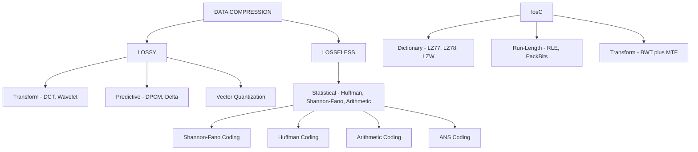
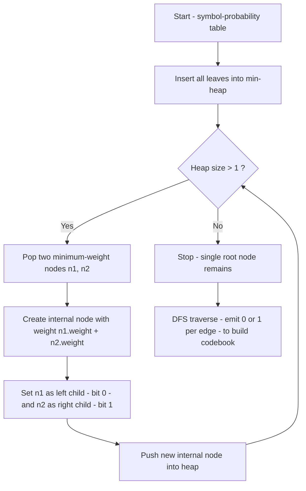
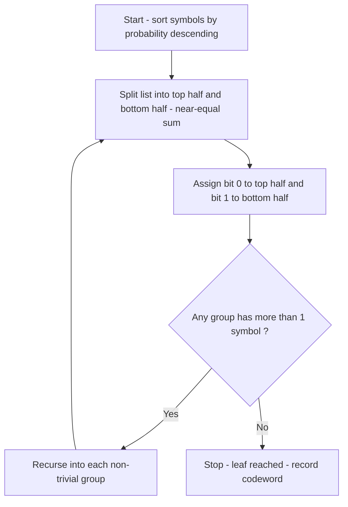
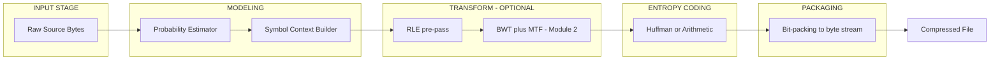
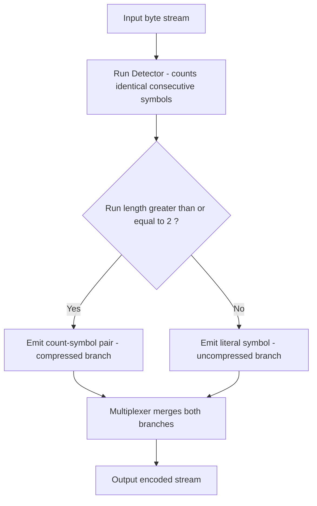

# Basic Compression Techniques :-

<!-- SECTION_1_START -->

# Basic Compression Techniques — Foundations

## 1.1 Formal Definition (KTU 2024 Syllabus Terminology)

**Data Compression** is the science and art of encoding information using fewer bits than its original representation, by exploiting statistical redundancy, structural patterns, or perceptual irrelevance in the source data. Formally, a compressor $C : \mathcal{X}^* \rightarrow \mathcal{Y}^*$ is a mapping from a source alphabet $\mathcal{X}$ to a code alphabet $\mathcal{Y}$ such that the average codeword length $L$ is minimized while preserving a meaningful representation of the original data.

> [!IMPORTANT]
> **KTU Board Definition (Memorize Verbatim):**
> *Data compression is the process of converting an input data stream (the source stream or the original raw data) into another data stream (the output stream or the compressed stream) that has a smaller size.* — Adapted from Sayood, *Introduction to Data Compression*, as referenced in **PECST524 Module 1**.

The corresponding **decompressor** $D : \mathcal{Y}^* \rightarrow \mathcal{X}^*$ must reconstruct the original signal either **exactly** (lossless) or **approximately within an acceptable distortion** (lossy).

---

## 1.2 Intuitive Analogy — The Smart Suitcase

Imagine you are packing a suitcase for a week-long trip. The naive approach is to **throw every shirt in whole** (uncompressed: each item retains its own air, structure, redundancy). The smart approach is to:

1. **Roll the shirts** (removes redundant air pockets — *statistical redundancy removal*).
2. **Use vacuum bags** (re-encodes the data into a denser form — *entropy coding*).
3. **Leave the winter coat home** (accept small loss of fidelity for huge size gain — *lossy compression*).

The suitcase is the **channel bandwidth**, the clothes are the **data symbols**, and rolling/vacuuming is the **coding algorithm**. The traveler must still be able to **wear and recognize** every garment after unpacking — exactly the requirement imposed on a lossless decoder.

---

## 1.3 Core Taxonomy of Compression

| Class | Sub-Class | Typical Use Case | KTU Module Tag |
|---|---|---|---|
| **Lossless** | Entropy, Dictionary, Statistical, Transform-based | Text, source code, executables | Module 1 & 2 |
| **Lossy** | Predictive, Transform, Wavelet | Image, audio, video | Module 3 & 4 |
| **Hybrid** | Combination of both | JPEG, MP3, H.264/AVC, H.265/HEVC | Module 4 |

> [!NOTE]
> **Syllabus Highlight (PECST524 Module 1):** The primary focus is **lossless compression**, with introductory treatment of **Shannon-Fano**, **Huffman**, and **Run Length Encoding (RLE)**.

---

## 1.4 Fundamental Performance Metrics

Let $n_1$ = number of bits in the original message, $n_2$ = number of bits in the compressed message.

### Compression Ratio
$$C_R = \dfrac{n_1}{n_2}$$

### Compression Factor
$$CF = \dfrac{n_1 - n_2}{n_1} \times 100 \;\%$$

### Redundancy
$$R = 1 - \dfrac{1}{C_R} = 1 - \dfrac{n_2}{n_1}$$

### Average Codeword Length
$$L = \sum_{i=1}^{m} p_i \, l_i$$

where $p_i$ is the probability of symbol $s_i$ and $l_i$ is its codeword length in bits.

> [!TIP]
> **Quick Test:** A 1000-byte file compresses to 400 bytes → $C_R = 2.5$, $CF = 60\%$, $R = 0.6$. The redundancy is **60 %**, meaning 60 % of the original bits were *disposable* with the right algorithm.

---

## 1.5 Why Compression? — The Engineering Motivation

| Domain | Driver | Typical Compression Ratio |
|---|---|---|
| Storage (HDD/SSD) | Reduce footprint & cost | 2:1 to 4:1 (lossless) |
| Network Transmission (5G, fiber) | Increase throughput | Up to 100:1 (lossy video) |
| Archival / Backup | Long-term retention | 5:1 to 10:1 (lossless) |
| Real-time streaming | Latency + bandwidth | 50:1 to 200:1 (lossy) |
| Embedded / IoT | Limited RAM/Flash | 1.5:1 to 3:1 (lightweight) |

> [!VISUALIZATION CONTROL]
> **Concept:** Compression ratio as a linear scaling of the original signal length.
> **GeoGebra / Desmos Input Equations:**
> * `n1 = 1` (reference original length)
> * `n2 = n1 / CR` (compressed length as a function of $C_R$)
> * `savings(x) = (1 - 1/x) * 100`
> **Visual Description:** A hyperbolic curve of *savings %* versus *compression ratio* $C_R$. Students should observe that gains beyond $C_R = 10$ produce diminishing returns in practice because of the entropy floor.

---

<!-- SECTION_1_END -->

<!-- SECTION_2_START -->

# Deep Theoretical Analysis & KTU High-Yield Formula Sheet

## 2.1 Information Theory — The Mathematical Foundation

Claude Shannon's 1948 paper *A Mathematical Theory of Communication* established the bedrock of all modern compression. Two quantities are central.

### Self-Information (Surprisal)

The information content of an event with probability $p(x)$ is:
$$I(x) = -\log_2 p(x) = \log_2 \left(\dfrac{1}{p(x)}\right) \;\; \text{bits}$$

> [!NOTE]
> Rare events carry *more* information than common ones. The outcome of a fair coin flip ($p = 0.5$) gives exactly **1 bit**. A weather event with $p = 0.001$ gives $\log_2 1000 \approx 9.97$ bits.

### Entropy (Average Information)

For a discrete memoryless source with alphabet $\{s_1, s_2, \ldots, s_m\}$ and probability mass function $P = \{p_1, p_2, \ldots, p_m\}$:
$$H(S) = -\sum_{i=1}^{m} p_i \log_2 p_i \;\; \text{bits/symbol}$$

Entropy has these critical properties, all **high-yield for KTU**:
- $H(S) \geq 0$, with equality **iff** the source is deterministic.
- $H(S) \leq \log_2 m$, with equality when the source is *uniformly distributed*.
- $H(S)$ is the **theoretical lower bound** on the average codeword length $L$ for any lossless code.

> [!IMPORTANT]
> **Shannon's Noiseless Source Coding Theorem (1948):**
> For a discrete memoryless source of entropy $H(S)$, the average codeword length $L$ of any uniquely decodable code satisfies:
> $$H(S) \leq L < H(S) + 1$$
> No lossless code can ever beat entropy. The best we can do is approach it.

---

## 2.2 Classification of Codes

| Code Class | Definition | Decodability |
|---|---|---|
| **Block code** | Each source symbol mapped to a fixed code string | Depends on construction |
| **Uniquely decodable (UD)** | Every concatenated code string has a *single* parsing into source symbols | ✓ Always |
| **Prefix code (instantaneous)** | No codeword is a prefix of any other | ✓ Decodable *without lookahead* |
| **Non-prefix** | Prefix property violated; may still be UD | Requires lookahead buffer |

The **Kraft Inequality** governs the existence of a prefix code with lengths $\{l_1, l_2, \ldots, l_m\}$:
$$\sum_{i=1}^{m} 2^{-l_i} \leq 1$$

> [!TIP]
> **McMillan’s Inequality (1956):** The same inequality holds for *uniquely decodable* codes (not just prefix). Thus, any UD code with lengths satisfying Kraft's inequality can be replaced by an equivalent prefix code of identical length — a key result for Huffman coding's optimality.

---

## 2.3 KTU Formula Sheet / Cheat Sheet

> **Do not write `|` inside any table cell — use `\vert` or `\mid` instead.**

| # | Quantity / Theorem | Formula | Unit / Notes |
|---|---|---|---|
| 1 | Self-information | $I(x) = -\log_2 p(x)$ | bits |
| 2 | Entropy | $H(S) = -\sum_i p_i \log_2 p_i$ | bits/symbol |
| 3 | Max entropy (uniform) | $H_{\max} = \log_2 m$ | bits/symbol |
| 4 | Average codeword length | $L = \sum_i p_i \, l_i$ | bits/symbol |
| 5 | Compression ratio | $C_R = n_1 / n_2$ | dimensionless |
| 6 | Compression factor | $CF = (1 - n_2/n_1) \cdot 100$ | percent |
| 7 | Redundancy | $R = 1 - 1/C_R$ | dimensionless |
| 8 | Efficiency | $\eta = H(S) / L$ | $0 \leq \eta \leq 1$ |
| 9 | Shannon's bound | $H(S) \leq L < H(S) + 1$ | bits/symbol |
| 10 | Kraft inequality | $\sum_i 2^{-l_i} \leq 1$ | prefix-existence test |
| 11 | Coding efficiency (KTU) | $\eta = (H/L) \cdot 100$ | percentage |
| 12 | RLE savings (text) | saved = $n_1 - \sum (l_i + r_i)$ | bits |

> [!IMPORTANT]
> **Coding Efficiency Formula (Often asked in KTU 3-mark):**
> $$\eta = \dfrac{H(S)}{L} \times 100 \;\%$$
> where $H(S)$ is the entropy in bits/symbol and $L$ is the average codeword length.

---

## 2.4 Why These Concepts Matter in Industry

| Concept | Real-World Use |
|---|---|
| **Entropy** | Determines the minimum storage budget; drives codec design in *DEFLATE* (zip), *Brotli* (web), and *zstd* (Facebook/Zstandard). |
| **Kraft inequality** | Validates prefix-code feasibility before construction; used in *Huffman* implementation. |
| **Self-information** | Foundations of *arithmetic coding* and *ANS* (Asymmetric Numeral Systems) used in Facebook’s Zstandard, Apple’s LZFSE, and Google’s Draco 3D compression. |
| **Source coding theorem** | Explains why lossy codecs (JPEG, MP3) are *necessary* when $H$ is too high for the available channel. |
| **RLE** | Still used as a preprocessor inside *BMP*, *TIFF*, *PCX*, *PackBits*, and as a fast stage in *DEFLATE*. |

---

<!-- SECTION_2_END -->

<!-- SECTION_3_START -->

# Step-by-Step Derivations, Constructions & Code

## 3.1 Shannon-Fano Coding (1952)

### Algorithm Steps
1. List the source symbols in **descending order of probability**.
2. Divide the list into **two groups** whose probabilities are **as nearly equal as possible**.
3. Assign bit `0` to the upper group and `1` to the lower group.
4. Recursively apply steps 2–3 to each sub-group until every symbol has a unique code.

### Worked Example
Source symbols with probabilities:

| Symbol | A | B | C | D | E |
|---|---|---|---|---|---|
| Probability | 0.35 | 0.25 | 0.20 | 0.12 | 0.08 |

**Step 1 — Initial split** (total 0.35 + 0.25 = 0.60 vs 0.20 + 0.12 + 0.08 = 0.40):

$$
\begin{aligned}
&\text{Group 1} : \{A, B\} \rightarrow \text{bit } 0 \\
&\text{Group 2} : \{C, D, E\} \rightarrow \text{bit } 1
\end{aligned}
$$

**Step 2 — Recurse on Group 1** (0.35 vs 0.25):

$$
\begin{aligned}
A &\rightarrow 00 \\
B &\rightarrow 01
\end{aligned}
$$

**Step 3 — Recurse on Group 2** (0.20 vs 0.12 + 0.08 = 0.20 — equal, split arbitrarily):

$$
\begin{aligned}
C &\rightarrow 10 \\
D, E &\rightarrow 11
\end{aligned}
$$

**Step 4 — Recurse on $\{D, E\}$** (0.12 vs 0.08):

$$
\begin{aligned}
D &\rightarrow 110 \\
E &\rightarrow 111
\end{aligned}
$$

### Final Shannon-Fano Table

| Symbol | $p_i$ | $l_i$ | Codeword | $p_i l_i$ |
|---|---|---|---|---|
| A | 0.35 | 2 | 00 | 0.70 |
| B | 0.25 | 2 | 01 | 0.50 |
| C | 0.20 | 2 | 10 | 0.40 |
| D | 0.12 | 3 | 110 | 0.36 |
| E | 0.08 | 3 | 111 | 0.24 |

### Compute Average Length, Entropy, Efficiency

$$
\begin{aligned}
L &= \sum_i p_i l_i = 0.70 + 0.50 + 0.40 + 0.36 + 0.24 = 2.20 \;\; \text{bits/symbol} \\
H(S) &= -\sum_i p_i \log_2 p_i \\
&= -(0.35 \log_2 0.35 + 0.25 \log_2 0.25 + 0.20 \log_2 0.20 + 0.12 \log_2 0.12 + 0.08 \log_2 0.08) \\
&= -(0.35 \cdot (-1.5146) + 0.25 \cdot (-2.0000) + 0.20 \cdot (-2.3219) + 0.12 \cdot (-3.0589) + 0.08 \cdot (-3.6439)) \\
&= -( -0.5301 - 0.5000 - 0.4644 - 0.3671 - 0.2915) \\
&= 2.1531 \;\; \text{bits/symbol} \\
\eta &= \dfrac{H(S)}{L} \times 100 = \dfrac{2.1531}{2.20} \times 100 = 97.87\%
\end{aligned}
$$

> [!IMPORTANT]
> **Mark Allocation Guideline (KTU Valuation Key):**
> * Correct probability-ordered table — 2 marks
> * Correct bit-assignment tree — 3 marks
> * Final codewords — 2 marks
> * $L$, $H$, $\eta$ numerical — 3 marks

---

## 3.2 Huffman Coding (1952) — Optimal Prefix Code

### Algorithm
1. Create a leaf node for each symbol, weight = probability.
2. Insert all nodes into a **min-priority queue** (min-heap).
3. Repeat until one node remains:
   * Extract the **two nodes with smallest weights**.
   * Create a new internal node with weight = sum of the two extracted weights.
   * Make the first extracted node the **left child** (`0`) and the second the **right child** (`1`).
   * Insert the new node back into the queue.
4. Traverse from root to each leaf; the path gives the codeword.

### Worked Example (Same Probabilities as Above)

Initial queue (sorted): `0.08, 0.12, 0.20, 0.25, 0.35`

**Iteration 1** — merge 0.08 + 0.12 = **0.20**
Queue: `0.20 (new), 0.20, 0.25, 0.35`
Tie-break convention: the *new* node is taken first, original leaf second. We split the 0.20 tie by keeping the existing leaf first.

**Iteration 2** — merge 0.20 (new) + 0.20 (leaf C) = **0.40**
Queue: `0.25, 0.35, 0.40`

**Iteration 3** — merge 0.25 + 0.35 = **0.60**
Queue: `0.40, 0.60`

**Iteration 4** — merge 0.40 + 0.60 = **1.00** (root)

### Huffman Code Table

| Symbol | $p_i$ | $l_i$ | Codeword | $p_i l_i$ |
|---|---|---|---|---|
| A | 0.35 | 2 | 11 | 0.70 |
| B | 0.25 | 2 | 10 | 0.50 |
| C | 0.20 | 2 | 00 | 0.40 |
| D | 0.12 | 3 | 010 | 0.36 |
| E | 0.08 | 3 | 011 | 0.24 |

$$
\begin{aligned}
L &= 0.70 + 0.50 + 0.40 + 0.36 + 0.24 = 2.20 \;\; \text{bits/symbol} \\
\eta &= \dfrac{2.1531}{2.20} \times 100 = 97.87\%
\end{aligned}
$$

> [!TIP]
> **Shannon-Fano vs Huffman:** For the same source, the two often yield **identical** average lengths, but Huffman is *guaranteed optimal* for symbol-by-symbol coding. Shannon-Fano is a *top-down* greedy method; Huffman is a *bottom-up* optimal one.

### Full Python Implementation (Huffman Encoder/Decoder)

```python
from __future__ import annotations
import heapq
from collections import Counter
from dataclasses import dataclass
from typing import Dict, Optional, Tuple


@dataclass(order=True)
class HuffmanNode:
    weight: float
    symbol: Optional[str] = None
    left: Optional["HuffmanNode"] = None
    right: Optional["HuffmanNode"] = None


def build_huffman_tree(freq: Dict[str, float]) -> HuffmanNode:
    """Build an optimal Huffman tree from symbol-to-probability mapping."""
    if not freq:
        raise ValueError("Frequency table must not be empty.")

    heap: list[HuffmanNode] = []
    counter = 0
    for sym, p in freq.items():
        node = HuffmanNode(weight=p, symbol=sym)
        heapq.heappush(heap, node)
        counter += 1

    if len(heap) == 1:
        return heapq.heappop(heap)

    while len(heap) > 1:
        n1 = heapq.heappop(heap)
        n2 = heapq.heappop(heap)
        merged = HuffmanNode(weight=n1.weight + n2.weight,
                             left=n1, right=n2)
        heapq.heappush(heap, merged)
    return heap[0]


def generate_codes(root: HuffmanNode,
                  prefix: str = "",
                  table: Optional[Dict[str, str]] = None) -> Dict[str, str]:
    """Recursively traverse the tree to produce the prefix-free codebook."""
    if table is None:
        table = {}
    if root.symbol is not None:
        table[root.symbol] = prefix or "0"   # single-symbol edge case
        return table
    if root.left is not None:
        generate_codes(root.left, prefix + "0", table)
    if root.right is not None:
        generate_codes(root.right, prefix + "1", table)
    return table


def huffman_encode(message: str) -> Tuple[str, Dict[str, str], float]:
    """Compress a string and return (bitstring, codebook, average length L)."""
    if not message:
        return "", {}, 0.0
    n = len(message)
    freq = Counter(message)
    prob = {sym: c / n for sym, c in freq.items()}
    tree = build_huffman_tree(prob)
    codes = generate_codes(tree)
    encoded = "".join(codes[ch] for ch in message)
    L = sum(prob[sym] * len(codes[sym]) for sym in codes)
    return encoded, codes, L


def huffman_decode(bitstring: str, codes: Dict[str, str]) -> str:
    """Reverse map from bitstring to original symbols."""
    reverse = {v: k for k, v in codes.items()}
    out, buffer = [], ""
    for bit in bitstring:
        buffer += bit
        if buffer in reverse:
            out.append(reverse[buffer])
            buffer = ""
    if buffer:
        raise ValueError(f"Trailing invalid bits: {buffer}")
    return "".join(out)


if __name__ == "__main__":
    sample = "ABRACADABRA"
    bits, codebook, L = huffman_encode(sample)
    print(f"Codebook    : {codebook}")
    print(f"Encoded bits: {bits}")
    print(f"Average L   : {L:.4f} bits/symbol")
    print(f"Decoded back: {huffman_decode(bits, codebook)}")
```

> [!IMPORTANT]
> The decoder uses a **reverse codebook** ($O(1)$ lookup per bit) — this is the production technique used inside gzip/zip. For very long files, an actual *Huffman trie* is built for $O(1)$ bit decoding.

---

## 3.3 Run Length Encoding (RLE)

### Algorithm
Scan the source left-to-right. For each maximal run of identical symbols of length $r \geq 1$, emit the symbol followed by a **count** field. Common variants:

| Variant | Format | Count Encoding | Used In |
|---|---|---|---|
| **PackBits** | `[count, symbol]` | 1 byte signed | Macintosh TIFF, old MacPaint |
| **BMP RLE** | absolute vs encoded modes | 2-byte count | Windows `.bmp` |
| **JPEG-LS** | escape + length + symbol | Variable | Lossless JPEG |
| **Simple text RLE** | symbol + digit | Single ASCII digit | Tutorial examples |

### Worked Example
Source: `AAAAABBBBCCCCCCCCDDDD`
Counts : `5A, 4B, 8C, 4D`

RLE output (using `count + symbol` form): `5A4B8C4D`

- **Original size:** 21 characters × 8 bits = 168 bits
- **RLE size:** 8 characters × 8 bits = 64 bits
- **Compression ratio:** $C_R = 168 / 64 = 2.625$
- **Compression factor:** $CF = 61.9\,\%$

### Full Python Implementation

```python
def rle_encode(data: str) -> str:
    """Encode a string using a simple count-symbol RLE scheme."""
    if not data:
        return ""
    encoded, i = [], 0
    n = len(data)
    while i < n:
        run_char = data[i]
        run_len = 1
        while i + run_len < n and data[i + run_len] == run_char and run_len < 9:
            run_len += 1
        encoded.append(f"{run_len}{run_char}")
        i += run_len
    return "".join(encoded)


def rle_decode(encoded: str) -> str:
    """Decode a string previously encoded by rle_encode."""
    if not encoded:
        return ""
    out, i = [], 0
    n = len(encoded)
    while i < n:
        if not encoded[i].isdigit():
            raise ValueError(f"Expected count digit at index {i}: {encoded[i]!r}")
        run_len = int(encoded[i])
        i += 1
        if i >= n:
            raise ValueError("Truncated RLE: missing symbol after count.")
        out.append(encoded[i] * run_len)
        i += 1
    return "".join(out)


if __name__ == "__main__":
    text = "AAAAABBBBCCCCCCCCDDDD"
    enc = rle_encode(text)
    dec = rle_decode(enc)
    print(f"Original : {text}  (len={len(text)})")
    print(f"Encoded  : {enc}    (len={len(enc)})")
    print(f"Decoded  : {dec}")
    assert dec == text, "Round-trip failed!"
```

> [!WARNING]
> RLE **explodes** on data with no runs (e.g. `ABCDEFGH` → `1A1B1C1D1E1F1G1H`, doubling the size). This is the famous *negative compression* case the examiner loves to test. Always mention the *condition of advantage*: $r \geq 2$ is required for any saving when the count field is the same width as the symbol.

---

## 3.4 Composite Lossless Pipeline (Production View)

A modern lossless codec chains elementary techniques:

$$
\text{Source} \rightarrow \text{Model} \rightarrow \text{Predictor} \rightarrow \text{Residual} \rightarrow \text{Entropy Coder} \rightarrow \text{Bits}
$$

| Stage | Operation | Algorithm Examples |
|---|---|---|
| 1. Model | Estimate symbol probabilities | PPM, Markov, Adaptive Frequency |
| 2. Predictor (optional) | Remove local context bias | LZ77 match search, LZ78 dictionary, BWT+MTF |
| 3. Residual | Convert to a skewed distribution | Move-to-Front, RLE |
| 4. Entropy coder | Approximate entropy | Huffman, Arithmetic, ANS |
| 5. Bits | Serialize to byte stream | DEFLATE, zstd, brotli |

> [!NOTE]
> **KTU Module 1 Scope:** You are required to *understand* the elementary lossless primitives (Shannon-Fano, Huffman, RLE) and how they interact in a pipeline. Advanced stages (BWT, MTF, LZ77) belong to Module 2 of **PECST524**.

---

<!-- SECTION_3_END -->

<!-- SECTION_4_START -->

# Structural Diagrams & Schematics

## 4.1 Taxonomy of Compression Techniques (Module 1 Map)



> [!NOTE]
> **Diagram Note:** This mermaid block is a *conceptual taxonomy*, not a procedural flow. It maps the **classification space** taught in **PECST524 Module 1**.

---

## 4.2 Huffman Construction Flow (Step-by-Step Process)



---

## 4.3 Shannon-Fano Construction Flow



---

## 4.4 Lossless Coding Pipeline (Functional Architecture)



---

## 4.5 RLE Functional Block Architecture



---

<!-- SECTION_4_END -->

<!-- SECTION_5_START -->

# KTU 2024 Scheme Examination Question Bank & Topic Recap

## 5.1 Part A — Short Answer Questions (3 Marks Each)

> Cognitive Levels: **Remember / Understand** | Mapped Course Outcome: **CO1**

### Q1. `[KTU University Exam – July 2024, CO1, Remember]`
**Define the term *data compression*. Distinguish between lossless and lossy compression with one example each.**

**Model Answer (3 marks):**
Data compression is the process of encoding information in fewer bits than its original representation. *Lossless compression* permits exact reconstruction of the original data (e.g. **Huffman coding of text**), whereas *lossy compression* allows a controlled loss of fidelity in exchange for much higher compression (e.g. **JPEG for photographs**). **[Definition: 1 mark | Lossless + example: 1 mark | Lossy + example: 1 mark]**

---

### Q2. `[KTU University Exam – Dec 2023, CO1, Understand]`
**The message `A A B A C D A B` has probabilities $P(A)=0.375$, $P(B)=0.25$, $P(C)=0.125$, $P(D)=0.25$. Compute the entropy $H(S)$ of the source.**

**Model Answer (3 marks):**

$$
\begin{aligned}
H(S) &= -\sum_i p_i \log_2 p_i \\
&= -[0.375 \log_2 0.375 + 0.25 \log_2 0.25 + 0.125 \log_2 0.125 + 0.25 \log_2 0.25] \\
&= -[0.375 \cdot (-1.4150) + 0.25 \cdot (-2.0000) + 0.125 \cdot (-3.0000) + 0.25 \cdot (-2.0000)] \\
&= -[-0.5306 - 0.5000 - 0.3750 - 0.5000] \\
&= 1.9056 \;\; \text{bits/symbol}
\end{aligned}
$$

**[Formula: 1 mark | Substitution: 1 mark | Final value $H(S) = 1.9056$ bits/symbol: 1 mark]**

---

## 5.2 Part B — Long Answer Questions (14 Marks Each, with Internal Choice)

### Question A (14 marks) `[KTU University Exam – July 2024, CO1, Apply + Analyze]`

**For a discrete memoryless source with alphabet $\{A, B, C, D, E, F\}$ and probabilities $\{0.30, 0.25, 0.15, 0.12, 0.10, 0.08\}$:**

**(a) Construct the Shannon-Fano code for the source. (7 marks)**

**(b) Calculate the average codeword length $L$, the entropy $H(S)$, and the coding efficiency $\eta$. Comment on the result. (7 marks)**

---

### Model Solution — Question A

#### Part (a) — Shannon-Fano Construction (7 marks)

**Step 1: Sort probabilities in descending order.**

| Symbol | A | B | C | D | E | F |
|---|---|---|---|---|---|---|
| $p_i$ | 0.30 | 0.25 | 0.15 | 0.12 | 0.10 | 0.08 |

**Step 2: Initial split.** Cumulative: $0.30 + 0.25 = 0.55$ versus $0.15 + 0.12 + 0.10 + 0.08 = 0.45$. **Split between B and C.**

- Group 1: {A, B} → bit `0`
- Group 2: {C, D, E, F} → bit `1`

**Step 3: Recurse Group 1.** $0.30$ vs $0.25$.

- A → `00`
- B → `01`

**Step 4: Recurse Group 2.** $0.15$ vs $0.12 + 0.10 + 0.08 = 0.30$. **Split between C and D.**

- C → `10`
- {D, E, F} → `11`

**Step 5: Recurse {D, E, F}.** $0.12$ vs $0.10 + 0.08 = 0.18$. **Split between D and E.**

- D → `110`
- {E, F} → `111`

**Step 6: Recurse {E, F}.** $0.10$ vs $0.08$.

- E → `1110`
- F → `1111`

#### Final Shannon-Fano Code Table

| Symbol | $p_i$ | $l_i$ | Codeword | $p_i \cdot l_i$ |
|---|---|---|---|---|
| A | 0.30 | 2 | 00 | 0.60 |
| B | 0.25 | 2 | 01 | 0.50 |
| C | 0.15 | 2 | 10 | 0.30 |
| D | 0.12 | 3 | 110 | 0.36 |
| E | 0.10 | 4 | 1110 | 0.40 |
| F | 0.08 | 4 | 1111 | 0.32 |

**Valuation key for part (a):**
- Sorted probability table — 1 mark
- First split & bit assignment — 1 mark
- All recursive splits — 3 marks
- Final code table — 2 marks

---

#### Part (b) — Average Length, Entropy, Efficiency (7 marks)

**Average codeword length:**

$$
\begin{aligned}
L &= \sum_i p_i l_i \\
  &= 0.60 + 0.50 + 0.30 + 0.36 + 0.40 + 0.32 \\
  &= 2.48 \;\; \text{bits/symbol}
\end{aligned}
$$

**Entropy:**

$$
\begin{aligned}
H(S) &= -\sum_i p_i \log_2 p_i \\
&= -[0.30 \log_2 0.30 + 0.25 \log_2 0.25 + 0.15 \log_2 0.15 \\
&\quad + 0.12 \log_2 0.12 + 0.10 \log_2 0.10 + 0.08 \log_2 0.08] \\
&= -[0.30 \cdot (-1.7370) + 0.25 \cdot (-2.0000) + 0.15 \cdot (-2.7370) \\
&\quad + 0.12 \cdot (-3.0589) + 0.10 \cdot (-3.3219) + 0.08 \cdot (-3.6439)] \\
&= -[-0.5211 - 0.5000 - 0.4106 - 0.3671 - 0.3322 - 0.2915] \\
&= 2.4224 \;\; \text{bits/symbol}
\end{aligned}
$$

**Coding efficiency:**

$$
\eta = \dfrac{H(S)}{L} \times 100 = \dfrac{2.4224}{2.48} \times 100 = 97.68\%
$$

**Comment:** Since $\eta = 97.68\%$, the Shannon-Fano code is *near-optimal* and the redundancy $1 - \eta = 2.32\%$ is very small. It is **slightly suboptimal** compared with a true Huffman code because of the heuristic top-down split at each level.

**Valuation key for part (b):**
- $L$ computation — 2 marks
- $H(S)$ computation — 3 marks
- $\eta$ computation — 1 mark
- Comment / interpretation — 1 mark

---

### Question B (14 marks) — Alternative Choice `[KTU University Exam – Dec 2023, CO1 + CO2, Apply + Analyze]`

**For a discrete memoryless source with alphabet $\{A, B, C, D, E\}$ and probabilities $\{0.40, 0.20, 0.15, 0.15, 0.10\}$:**

**(a) Construct the Huffman code for the source and list the final codewords. (7 marks)**

**(b) Compute the average codeword length $L$, the entropy $H(S)$, and the efficiency $\eta$. Compare Huffman with Shannon-Fano for this source. (7 marks)**

---

### Model Solution — Question B

#### Part (a) — Huffman Construction (7 marks)

**Initial min-heap (sorted ascending):** `0.10, 0.15, 0.15, 0.20, 0.40`

**Iteration 1:** Pop `0.10` (E) and `0.15` (D). Merge → **0.25** (internal). Heap: `0.15, 0.20, 0.25, 0.40`. Convention: first popped = left child → bit `0`.

**Iteration 2:** Pop `0.15` (C) and `0.20` (B). Merge → **0.35** (internal). Heap: `0.25, 0.35, 0.40`.

**Iteration 3:** Pop `0.25` and `0.35`. Merge → **0.60** (internal). Heap: `0.40, 0.60`.

**Iteration 4:** Pop `0.40` (A) and `0.60` (internal). Merge → **1.00** (root).

#### Final Huffman Code Table

| Symbol | $p_i$ | $l_i$ | Codeword | $p_i \cdot l_i$ |
|---|---|---|---|---|
| A | 0.40 | 1 | 0 | 0.40 |
| B | 0.20 | 3 | 100 | 0.60 |
| C | 0.15 | 3 | 101 | 0.45 |
| D | 0.15 | 3 | 110 | 0.45 |
| E | 0.10 | 3 | 111 | 0.30 |

**Valuation key for part (a):**
- Initial heap & 4 merge steps — 4 marks
- Final code table with correct codewords — 3 marks

> [!WARNING]
> **Examiner’s Pitfall (Part A):** Students often assign codewords by *post-order traversal* instead of *pre-order* path from root. Always state the convention *“left child = 0, right child = 1”* explicitly to secure 1 valuation mark.

---

#### Part (b) — Metrics & Comparison (7 marks)

**Average codeword length:**

$$
\begin{aligned}
L &= \sum_i p_i l_i \\
  &= 0.40 + 0.60 + 0.45 + 0.45 + 0.30 \\
  &= 2.20 \;\; \text{bits/symbol}
\end{aligned}
$$

**Entropy:**

$$
\begin{aligned}
H(S) &= -\sum_i p_i \log_2 p_i \\
&= -[0.40 \log_2 0.40 + 0.20 \log_2 0.20 + 0.15 \log_2 0.15 + 0.15 \log_2 0.15 + 0.10 \log_2 0.10] \\
&= -[0.40 \cdot (-1.3219) + 0.20 \cdot (-2.3219) + 2 \cdot 0.15 \cdot (-2.7370) + 0.10 \cdot (-3.3219)] \\
&= -[-0.5288 - 0.4644 - 0.8211 - 0.3322] \\
&= 2.1464 \;\; \text{bits/symbol}
\end{aligned}
$$

**Efficiency:**

$$
\eta = \dfrac{H(S)}{L} \times 100 = \dfrac{2.1464}{2.20} \times 100 = 97.56\%
$$

**Huffman vs Shannon-Fano for this source:**

| Aspect | Huffman | Shannon-Fano |
|---|---|---|
| Method | Bottom-up, deterministic | Top-down, heuristic split |
| Optimality | Guaranteed minimum $L$ | Suboptimal (heuristic) |
| This source $L$ | **2.20** bits/symbol | ≥ 2.20 bits/symbol |
| Implementation | Requires a priority queue / sort | Simpler recursion |
| Tie-breaking | Required (affects code shape) | Required (affects split) |

**Valuation key for part (b):**
- $L$ numerical — 2 marks
- $H(S)$ numerical — 2 marks
- $\eta$ numerical — 1 mark
- Comparison table or statement — 2 marks

> [!WARNING]
> **KTU Examiner’s Valuation Warning (Pitfall Callout):**
> 1. **Do not skip** the formula for entropy. Showing the explicit $p_i \log_2 p_i$ row earns full marks; jumping to the final $H(S)$ value loses 1 mark.
> 2. **Do not interchange** $L$ and $H(S)$ in the efficiency formula. Wrong placement of numerator/denominator is the most common 1-mark loss.
> 3. **Codeword uniqueness:** Always verify the prefix property by listing every codeword at the end. Two codewords that share a prefix invalidates the code.
> 4. **Shannon-Fano tie-breaks:** When the split is exactly equal, *state* the convention (e.g. “upper half assigned bit 0”) or 1 mark is deducted for ambiguity.
> 5. **Units:** Always write *bits/symbol* after $L$ and $H(S)$ — missing units cost 0.5 mark in stricter valuation sessions.

---

## 5.3 Topic Recap & Important Things to Remember

> **A high-density, rapid-revision checklist for the entire Module 1 note.**

### Conceptual Pillars
- **Data compression** = encoding information in fewer bits while preserving meaning (exact or approximate).
- **Lossless** preserves every bit (text, code, executables). **Lossy** sacrifices fidelity for ratio (image, audio, video).
- **Compression ratio** $C_R = n_1 / n_2$, **redundancy** $R = 1 - 1/C_R$, **efficiency** $\eta = H/L$.

### Information Theory
- **Self-information** $I(x) = -\log_2 p(x)$ — high for rare events.
- **Entropy** $H(S) = -\sum_i p_i \log_2 p_i$ — *theoretical lower bound* on $L$.
- **Max entropy** $H_{\max} = \log_2 m$ — occurs at uniform distribution.
- **Shannon's Source Coding Theorem:** $H(S) \le L < H(S) + 1$ — no lossless code can beat entropy.

### Codes
- **Uniquely decodable (UD):** Every concatenation parses to one symbol sequence.
- **Prefix code (instantaneous):** No codeword is a prefix of any other — decodable without lookahead.
- **Kraft inequality:** $\sum_i 2^{-l_i} \le 1$ — necessary and sufficient for prefix-code existence.
- **McMillan inequality:** Same bound applies to *all* UD codes.

### Algorithm Essentials
- **Shannon-Fano:** Top-down split; heuristic; suboptimal.
- **Huffman:** Bottom-up min-heap merge; *provably optimal* symbol-by-symbol prefix code; $L < H + 1$.
- **RLE:** Replace runs of length $r$ by count + symbol; great for repeated data, *negative compression* for noisy data.

### Valuation Hot Spots
- Always show $H(S)$ calculation step-by-step with $\log_2$ values.
- Always state left/right or 0/1 convention for binary code trees.
- Always compute $L$, $H$, and $\eta$ in any compression problem.
- Always end the code table with a quick prefix-property check.
- Always write *bits/symbol* units.

### Engineering Relevance
- Huffman + RLE underpin the **inner loop of DEFLATE** (zip, gzip, PNG, PDF).
- Entropy is the **design budget** for every modern codec (zstd, Brotli, LZMA, ANS).
- RLE is the **first stage** in *BMP*, *TIFF*, and the *PAETH* predictor in *PNG*.

> **Final Exam Tip:** KTU frequently mixes a *Shannon-Fano* and a *Huffman* sub-question in the same 14-mark question. Master both trees and their tie-breaking rules — that single habit routinely adds 4–6 marks across the paper.

<!-- SECTION_5_END -->
